# 📊 ENIS v3.0 — Arquitectura y Operación End-to-End

```yaml
yamldoc_version: "v3.0"
doc_type: "Informe de Arquitectura Completa"
doc_author: "andaon"
doc_date: "2025-01-09"
compliance: "DNA v3.0"
title: "ENIS v3.0 — Arquitectura y Operación End-to-End"
subtitle: "Arquitectura Completa: Edge + Cloud + Platform | Seguridad, Governance, Operaciones"
version: "3.0"
semver: "3.0.0"
status: "production_ready"
created: "2025-01-09"
last_modified: "2025-01-09"
domain: "Arquitectura ENIS Completa"
tier_applicability: ["Tier 1 SMB", "Tier 2 Growth", "Tier 3 Enterprise"]
complexity_level: "🔵 Enterprise"

componentes_principales:
  edge:
    - "NOPS Kernel (slim) — control plane local"
    - "Edge Agents (5 tipos) — Zero/Shared/Lite/Enterprise/Air-Gapped"
    - "ZAG Gateway — perímetro Zero con HMAC/anti-replay"
    - "Event Bus — Redis Streams / NATS JetStream"
  
  cloud_core:
    - "Inference Service — router LLMs + composición"
    - "Macro-módulos — ASM/CGN/AWE/SHIF"
    - "NOPS Modules (7) — Obs/Score/Billing/Sandbox/Compliance/RGM/ALM"
    - "Interfaces Avanzadas (2) — Voice/XR"
    - "Data Governance Engine (DGE)"
  
  platform:
    - "Agent Marketplace — público/privado"
    - "ENIS Studio — UI/IDE"
    - "Developer Portal — docs/API refs"
  
  cloud_ops:
    - "Observability Stack — Prom/Grafana/Jaeger/ELK/Tempo"
    - "Security — PKI/mTLS, SEC supply chain"
    - "DR/IR — runbooks, incident response"
    - "FinOps — cost attribution, showback"

aspectos_arquitectonicos:
  seguridad:
    - "SEC: Supply chain security (SBOM, firmas, attestations)"
    - "ZAG: Perímetro Zero (HMAC, anti-replay, RL por tenant)"
    - "mTLS + JWT: Comunicación s2s segura"
    - "Residencia de datos: GDPR/CCPA/PDPA/LGPD compliance"
  
  governance:
    - "DGE: Data Governance Engine (clasificación, redacción, egress)"
    - "RGM: Resource Governance (fairness, quotas)"
    - "Compliance: Audit trails inmutables"
  
  operaciones:
    - "ALM: Agent Lifecycle Management + CI/CD GitOps"
    - "FinOps: Cost attribution + forecasting"
    - "QoS: Priorización por tier (SLI/SLO diferenciados)"
    - "DR/IR: Disaster Recovery + Incident Response"
  
  calidad:
    - "Testing Strategy: unit/integration/E2E + chaos"
    - "SLOs contractuales: p95/p99 por servicio"
    - "Monitoring: OTel + alertas por tier"

dependencies:
  dna_framework:
    - "00-dna-master-prompt.md"
  architecture_docs:
    - "arquitecturaenisv2.html"
    - "MAPEO_REPOSITORIOS_ARQUITECTURA.md"
    - "RESUMEN_ARQUITECTURA_REPOS.md"
  master_prompts:
    - "07-nops-master-prompt.md"
    - "12-inference-master-prompt.md"
    - "26-natural-interface-master-prompt.md"
    - "27-xr-interface-master-prompt.md"
    - "37-43: NOPS Modules master prompts"

cross_references:
  - "nops-kernel"
  - "inference-service"
  - "voice-interface"
  - "xr-interface"
  - "macro-modules"
  - "nops-modules"
  - "zag-gateway"
  - "sec-supply-chain"
  - "data-governance-engine"
  - "finops-showback"

tags: ["arquitectura", "end-to-end", "seguridad", "governance", "operaciones", "enterprise", "compliance", "finops", "qos"]
```

> **Propósito**: Documento canónico de la arquitectura completa de ENIS v3.0, incluyendo todos los componentes (Edge + Cloud + Platform), flujos de comunicación, seguridad (SEC/ZAG), governance (DGE), operaciones (ALM/CI/CD), FinOps, y estrategias de testing/DR.
>
> **Alcance**: Arquitectura end-to-end de 24 repositorios con enfoque en aspectos técnicos, operacionales y estratégicos críticos para un sistema enterprise-grade.

---

## 📖 MAPA DE LECTURA

### Índice de Navegación Rápida

**👥 Para Ejecutivos (C-level, Product)**
- [🎯 Resumen Ejecutivo](#-resumen-ejecutivo) — Visión general y métricas clave
- [📊 Repositorios / Ownership](#-repositorios--ownership-actualizado) — Quién es responsable de qué
- [💰 FinOps y Cost Attribution](#-finops-y-cost-attribution) — Showback, forecasting, optimización de costos
- [⚡ QoS y Rate-cards](#-qos-y-priorización-por-tier) — Pricing, SLOs por tier
- [✅ Conclusión](#-conclusión-arquitectura-completa-enis-v30) — Beneficios estratégicos

**🛠️ Para Ingeniería (Tech Leads, Architects)**
- [🏗️ Arquitectura Completa](#-arquitectura-completa-de-comunicación) — Diagramas y flujos end-to-end
- [🔄 Flujos de Comunicación](#-flujos-de-comunicación-detallados) — 8 flujos principales documentados
- [🔌 APIs y Contratos](#-apis-y-contratos-extracto-actualizado) — SLOs, eventos voice/xr, schema registry
- [🔄 CI/CD y ALM](#-cicd-y-alm-integration) — GitOps, gates, rollback automático
- [🧪 Testing Strategy](#-testing-strategy) — Pirámide de testing, chaos engineering

**🔒 Para Seguridad (CISO, Security Team)**
- [🔐 SEC Supply Chain](#6-sec--supply-chain-security-s135--release-gate-s14) — SBOM, firmas, key rotation, emergencia
- [🛡️ Threat Model](#-threat-model-y-security-posture) — Vectores de ataque, controles, defense in depth
- [🚪 ZAG Gateway](#5-perímetro-zero--zag-s15-p0) — HMAC, anti-replay, rate-limiting
- [📊 Data Governance Engine](#-data-governance-engine-dge) — Clasificación, redacción, egress control

**📋 Para Compliance & Legal (DPO, Legal Team)**
- [📜 DPIA & GDPR](#4-consideraciones-técnicas) — Residencia de datos, retención, right-to-be-forgotten
- [⚡ Rate-cards Contractuales](#rate-cards-contractuales-por-tier) — Cuadro legal único (RPS/SLO/pricing)
- [🔐 Compliance Statements](#consideraciones-técnicas) — GDPR/CCPA/PDPA/LGPD compliance
- [📚 Anexos](#-anexos) — DPIA Template, rate-cards, versionado

**🚨 Para Operaciones (SRE, On-call, DevOps)**
- [🚨 DR/IR Framework](#-drir-framework) — Runbooks, drills trimestrales, incident response
- [📦 Ownership Matrix](#matriz-de-ownership-y-on-call) — On-call rotations, PagerDuty labels, handoff
- [🔧 Event Bus](#4-event-bus-en-edge--adr-s10-p6) — Redis vs NATS, ADR documentado
- [🔍 Monitoring](#finops-y-cost-attribution) — Dashboards, alertas, KPIs

---

## 🎛️ QUIÉN OPERA QUÉ — Quick Reference

| Servicio / Componente | Team Responsable | On-Call | PagerDuty Label | Criticidad |
|------------------------|------------------|---------|-----------------|------------|
| **NOPS Kernel** | Edge Team | Weekly | `enis-edge-kernel` | 🔴 Critical |
| **Edge Agents** | Edge Team | Weekly | `enis-edge-agents` | 🔴 Critical |
| **ZAG Gateway** | Edge Team | Weekly | `enis-edge-zag` | 🔴 Critical |
| **Inference Service** | Cloud Core | 24/7 (follow-sun) | `enis-inference` | 🔴 Critical |
| **Voice Interface** | Advanced Interfaces | 24/7 | `enis-voice` | 🟡 High |
| **XR Interface** | Advanced Interfaces | 24/7 | `enis-xr` | 🟡 High |
| **ASM/CGN/AWE/SHIF** | Cloud Core | Weekly | `enis-{service}` | 🟡 High |
| **DGE (Data Governance)** | Security & Compliance | 24/7 | `enis-dge` | 🔴 Critical |
| **7 Módulos NOPS** | Platform Ops | Business hours | `enis-nops-{module}` | 🟢 Medium |
| **Cloud Infrastructure** | Cloud Ops | 24/7 (follow-sun) | `enis-ops-infra` | 🔴 Critical |
| **Observability Stack** | Cloud Ops | 24/7 | `enis-ops-monitoring` | 🔴 Critical |
| **Security & PKI** | Cloud Ops (Security) | 24/7 | `enis-ops-security` | 🔴 Critical |
| **FinOps** | Cloud Ops (Finance) | Business hours | `enis-ops-finops` | 🟢 Medium |
| **Marketplace** | Platform Team | Business hours | `enis-marketplace` | 🟢 Medium |
| **ENIS Studio (Frontend)** | Platform Team | Business hours | `enis-frontend` | 🟢 Medium |

**Nota**: Ver sección completa [Matriz de Ownership](#matriz-de-ownership-y-on-call) para detalles de escalation, backup contacts, y handoff procedures.

**Handoff On-Call**: Viernes 4pm-5pm UTC (semanal) — Ver [Checklist Handoff](#on_call_best_practices)

---

## 🎯 RESUMEN EJECUTIVO

**ENIS v3.0** es una plataforma de **Inteligencia Artificial Empresarial** que opera en **3 capas arquitectónicas**:

1. **Edge (Cliente)**: NOPS Kernel (slim) + Edge Agents + ZAG Gateway + Event Bus
2. **Cloud-core (ENIS)**: Inference Service + Macro-módulos (ASM/CGN/AWE/SHIF) + 7 Módulos NOPS + 2 Interfaces Avanzadas
3. **Platform**: Marketplace + Studio App + Developer Portal

### 🔐 Principios Fundamentales

- **Datos NO se mueven**: Solo **señales derivadas** salen del Edge
- **Kernel SLIM**: < 100MB RAM, clients ligeros (mTLS+JWT+HMAC)
- **Eventos versionados**: `*.v1` con idempotencia
- **Seguridad robusta**: SEC (firmas, SBOM, attestations) + ZAG (HMAC/anti-replay/RL)
- **Calidad Pre-GA**: S14 Release Gate + S14.5 E2E Integration Testing

### 📊 Estado Actual vs Propuesto

| Métrica | Actual | Propuesto | Incremento |
|---------|--------|-----------|------------|
| **Repositorios Totales** | 21 | 24 | +14.3% |
| **Servicios Cloud-Core** | 12 | 14 | +16.7% |
| **Interfaces Avanzadas** | 0 | 2 | +100% |
| **Capacidades Técnicas** | Básicas | Voice + XR | +200% |

---

## 🏗️ ARQUITECTURA COMPLETA DE COMUNICACIÓN

### 📊 DIAGRAMA DE ARQUITECTURA COMPLETA


**Claves de la Arquitectura**

* **Separación de capas**: Edge (control plane local), Cloud (procesamiento pesado), Platform (UX), Ops (operaciones).
* **Kernel SLIM**: < 100MB RAM, clients ligeros hacia cloud-core, degraded mode para offline.
* **ZAG Gateway**: Perímetro Zero con **HMAC(kid,nonce,ts)**, **anti-replay**, **RL por tenant**, OTel.
* **SEC Supply Chain**: SBOM + firmas/attestations + verificación init-container; bloquea release sin evidencias.
* **DGE**: Data Governance Engine para clasificación/redacción; Egress Guard ligero en Kernel.
* **RGM/ALM**: Servicios externos; Kernel mantiene clients opcionales (feature-flag).
* **Voice/XR**: Interfaces avanzadas independientes en cloud-core.
* **FinOps**: Cost attribution por tenant/tier + showback.

---

## 🎯 CRITICALITY MATRIX Y DEGRADED MODES

### **¿Qué es la Criticality Matrix?**

La **Criticality Matrix** clasifica servicios en 3 niveles según su impacto operacional, permitiendo que el **NOPS Kernel opere en modo degradado** priorizando servicios críticos para **revenue protection** y **compliance**.

### **Criticality Matrix (Formal)**

```yaml
criticality_matrix:
  objetivo: "Priorizar servicios críticos durante degradación (offline, network partition, service failure)"
  referencia_roadmap: "S10-P9 (Degraded Modes & Criticality Matrix)"
  
  critical_cant_operate_without:
    descripcion: "Servicios sin los cuales el Kernel NO puede operar (revenue + compliance blockers)"
    servicios:
      agent_registry_s2:
        motivo: "Agents no pueden registrarse/heartbeat → 0 funcionalidad"
        fail_impact: "🔴 CRÍTICO — Sistema completamente inoperante"
        degraded_strategy: "N/A (no hay fallback; escalar a P0 inmediato)"
      
      billing_module:
        motivo: "Pérdida de revenue, facturación incorrecta"
        fail_impact: "🔴 CRÍTICO — Impacto financiero directo"
        degraded_strategy: "Local queue (sync on recovery, no pérdida de eventos)"
      
      compliance_module:
        motivo: "Audit trail incompleto → SOC2/ISO 27001 breach"
        fail_impact: "🔴 CRÍTICO — Compliance violation"
        degraded_strategy: "Local audit.jsonl (sync on recovery, inmutable)"
      
      egress_guard_dge_client:
        motivo: "Data protection breach → GDPR/CCPA violation, multas regulatorias"
        fail_impact: "🔴 CRÍTICO — Legal/regulatory risk"
        degraded_strategy: "Fail-closed (bloquea TODOS los egress hasta DGE recovery)"
  
  essential_degraded_operation:
    descripcion: "Servicios importantes pero con fallbacks aceptables (performance degraded)"
    servicios:
      routing_scoring_s5:
        motivo: "Performance degraded pero operación continua"
        fail_impact: "🟡 ALTO — Latencia aumenta, pero funcional"
        degraded_strategy: "Fallback to round-robin (sin scoring dinámico)"
      
      federation_bus_s12:
        motivo: "Operación local aceptable (no cross-kernel)"
        fail_impact: "🟡 ALTO — Aislamiento, pero local funciona"
        degraded_strategy: "Local-only operation (sin federación)"
      
      event_bus_s3:
        motivo: "Eventual consistency aceptable"
        fail_impact: "🟡 ALTO — Latencia en propagación"
        degraded_strategy: "Local queue (sync on recovery, eventual consistency)"
  
  best_effort_nice_to_have:
    descripcion: "Features que pueden deshabilitarse sin impacto operacional crítico"
    servicios:
      scorecard_metrics:
        motivo: "Analytics no bloquean operación"
        fail_impact: "🟢 BAJO — Stale data aceptable"
        degraded_strategy: "Disable metrics collection (solo logs básicos)"
      
      advanced_observability:
        motivo: "Tracing útil pero no crítico"
        fail_impact: "🟢 BAJO — Logs suficientes para debug"
        degraded_strategy: "Disable tracing (logs + métricas básicas)"
      
      mcp_server_s21:
        motivo: "Feature opcional para agentes avanzados"
        fail_impact: "🟢 BAJO — Mayoría de agents no lo usan"
        degraded_strategy: "Disable MCP integration (feature-flag OFF)"
```

### **Degraded Mode Activation**

```yaml
degraded_mode_activation:
  triggers:
    - "Service CRITICAL down > 30s (Agent Registry, Billing, Compliance, Egress Guard)"
    - "Network partition detectada (cross-AZ latency > 500ms)"
    - "Resource exhaustion (CPU > 90%, RAM > 85%)"
    - "Manual activation (incident commander decision)"
  
  activation_flow:
    paso_1_detection:
      - "Health check failures (3 consecutive)"
      - "Circuit breaker OPEN en service CRITICAL"
      - "Alerta PagerDuty P0 (< 5 min detection)"
    
    paso_2_decision:
      - "Automatic: activa degraded mode si CRITICAL down > 30s"
      - "Manual: incident commander puede forzar via API"
    
    paso_3_activation:
      - "Feature flags: DEGRADED_MODE_ENABLED=true"
      - "Disable BEST-EFFORT services (Scorecard, Tracing, MCP)"
      - "Activate fallbacks ESSENTIAL (round-robin, local-only, queue)"
      - "Egress Guard: fail-closed si DGE down"
      - "Emit evento: degraded.mode.activated.v1"
    
    paso_4_monitoring:
      - "Dashboard Grafana: Degraded Mode Status (% services healthy)"
      - "Alertas cada 15 min: status update"
      - "Incident Commander: join war room (Slack #incidents)"
    
    paso_5_recovery:
      - "Service CRITICAL vuelve healthy"
      - "Sync local queues (Billing, Compliance, Event Bus)"
      - "Re-enable ESSENTIAL services (scoring, federation)"
      - "Re-enable BEST-EFFORT (gradual, observar métricas)"
      - "Emit evento: degraded.mode.recovered.v1"
      - "Postmortem < 48h (RCA + action items)"
  
  slos_degraded_mode:
    availability_tier_3: "99.5% (vs 99.95% normal) — tolerable para emergencias < 4h"
    latency_p95: "< 800ms (vs < 200ms normal) — degraded pero funcional"
    billing_accuracy: "100% (NO degradable — revenue protection)"
    compliance_audit: "100% (NO degradable — SOC2/ISO enforcement)"
    egress_guard: "100% fail-closed (NO degradable — GDPR protection)"
  
  runbooks_degraded_mode:
    ubicacion: "docs/dr/runbooks/degraded_mode_*.md"
    runbooks:
      - "redis_down.md → Event Bus fallback to local queue"
      - "dge_unreachable.md → Egress Guard fail-closed (block all egress)"
      - "inference_down.md → Return 503 (no fallback, escalate P0)"
      - "scorecard_down.md → Disable metrics (logs only)"
      - "federation_down.md → Local-only operation"
```

### **Referencia Cruzada**

**Roadmap NOPS Kernel**: Ver **S10-P9 (Degraded Modes & Criticality Matrix)** para detalles de implementación, feature flags, y testing.

**Beneficios**:
- ✅ **Revenue protection**: Billing siempre operativo (local queue fallback)
- ✅ **Compliance protection**: Audit trail + Egress Guard NO degradables
- ✅ **Operación parcial**: Better than total failure (Tier 1/2 pueden operar)
- ✅ **Recovery orchestrado**: Sync automático post-recovery

---

## 🔄 FLUJOS DE COMUNICACIÓN DETALLADOS

### 1. FLUJO PRINCIPAL: Agent → ZAG → NOPS → Cloud (end-to-end)

```yaml
flujo_principal_completo:
  paso_1_autenticacion_zag:
    origen: "🟤🟡🟢🔵🔴 Edge Agents"
    destino: "ZAG (Zero Agent Gateway)"
    protocolo: "API-Key (tiers 0-3) / mTLS (tiers 4-5) + HMAC(kid, nonce, timestamp)"
    validaciones:
      - "HMAC válido (skew ≤ 5m)"
      - "Anti-replay (nonce store)"
      - "Rate-limit global + per-tenant"
      - "DoS controls"
    telemetria: "OTel en perímetro"
    sla: "p95 validación < 200ms"
    
  paso_2_kernel:
    origen: "ZAG"
    destino: "NOPS Kernel"
    protocolo: "JWT+mTLS s2s (scoped)"
    proposito: "Policy Decision (ABAC/RBAC/quotas)"
    acciones:
      - "Enruta a Inference o Edge runtime"
      - "Aplica policies"
      - "Publica eventos en Event Bus"
    
  paso_3_routing:
    origen: "NOPS Kernel"
    destino: "Inference Service"
    protocolo: "mTLS + JWT s2s (scoped)"
    proposito: "Request routing + metadata only (NO raw data)"
    idempotencia: "Idempotency keys"
    
  paso_4_processing:
    origen: "Inference Service"
    destinos: ["ASM", "CGN", "AWE", "SHIF"]
    protocolo: "Internal HTTP (cloud-core)"
    proposito: "State management + causal graphs + workflows + security"
```

### 2. FLUJO SECUNDARIO: NOPS → 7 Módulos NOPS (clients ligeros)

```yaml
flujo_secundario_nops:
  modules_produccion:
    observability: "NOPS → Observability Module (mTLS+JWT+HMAC)"
    scorecard: "NOPS → Scorecard Module (mTLS+JWT+HMAC)"
    billing: "NOPS → Billing Module (mTLS+JWT+HMAC)"
    sandbox: "NOPS → Sandbox Module (mTLS+JWT+HMAC)"
    compliance: "NOPS → Compliance Module (mTLS+JWT+HMAC)"
  
  clients_opcionales:
    lifecycle_alm: "NOPS → ALM (S24) — client opcional (feature-flag) para intents/audit"
    resource_governance_rgm: "NOPS → RGM (S23) — client opcional (feature-flag) para intents/cuotas"
    
  comunicacion:
    protocolos: ["mTLS+JWT s2s", "HMAC para integridad"]
    eventos: ["*.v1 versionados", "idempotencia", "retry con jitter"]
    degraded_mode: "Local cache/queue cuando servicio no disponible"
```

### 3. FLUJO TERCIARIO: Interfaces Avanzadas (Voice/XR)

```yaml
flujo_interfaces_avanzadas:
  voice_interface_mp26:
    entrada: "Studio App (WebSocket + SSE)"
    procesamiento: "STT/VAD/TTS Engine"
    salida: "Inference Service (processed text)"
    sla: "TTFT < 300ms, bargein < 100ms"
    
  xr_interface_mp27:
    entrada: "XR Devices (OpenXR)"
    procesamiento: "Spatial/Gesture/Gaze Engine"
    salida: "Inference Service (multimodal input)"
    sla: "30Hz streaming, jitter < 50ms"
```

### 4. EVENT BUS EN EDGE — ADR (S10-P6)

```yaml
event_bus_adr:
  decision: "ADR S10-P6 — Redis Streams vs NATS JetStream"
  candidatos:
    redis_streams:
      pros: ["Menor latencia", "Operabilidad simple", "Costo bajo"]
      cons: ["Límite de throughput", "Sharding manual"]
    nats_jetstream:
      pros: ["Alto throughput", "Sharding automático", "Failover < 3s"]
      cons: ["Mayor complejidad operacional", "Costo mayor"]
  
  criterios:
    - "Throughput p95 ≤ 25ms @ 2k msg/s"
    - "Crash-recovery 0 pérdida"
    - "Failover < 3s"
    - "Operabilidad"
    - "Costo"
  
  dod: "ADR aprobado y documentado"
```

### 5. PERÍMETRO ZERO — ZAG (S15-P0)

```yaml
zag_zero_agent_gateway:
  autenticacion:
    - "API-Key (tiers 0-3)"
    - "mTLS (tiers 4-5)"
    - "HMAC(kid, nonce, timestamp)"
  
  protecciones:
    anti_replay:
      - "Nonce store (Redis/memory)"
      - "Timestamp skew ≤ 5m"
    rate_limiting:
      - "Global rate limit"
      - "Per-tenant rate limit"
      - "Burst control"
    dos_controls:
      - "Connection limits"
      - "Request size limits"
      - "IP blacklisting"
  
  observabilidad:
    - "Métricas OTel (latency, throughput, errors)"
    - "Trazas distribuidas"
    - "Logs estructurados"
  
  rate_cards_integration:
    proposito: "ZAG expone headers HTTP alineados al rate-card vigente del tenant"
    
    headers_expuestos:
      - "X-RateLimit-Limit: {tier_rps_max}"
      - "X-RateLimit-Remaining: {remaining_in_window}"
      - "X-RateLimit-Reset: {epoch_timestamp}"
      - "Retry-After: {seconds} (solo en 429 Too Many Requests)"
      - "X-RateLimit-Tier: {1|2|3}"
    
    ejemplos_por_tier:
      tier_1_smb:
        limit: "100 req/s"
        header: "X-RateLimit-Limit: 100"
        retry_after: "60 (si excede, espera 1 min)"
      
      tier_2_growth:
        limit: "500 req/s"
        header: "X-RateLimit-Limit: 500"
        retry_after: "30 (si excede, espera 30s)"
      
      tier_3_enterprise:
        limit: "5000 req/s"
        header: "X-RateLimit-Limit: 5000"
        retry_after: "10 (si excede, espera 10s - raro)"
    
    configuracion_source:
      archivo: "zag-gateway/config/rate_limits_by_tier.yaml"
      sync: "Billing Module actualiza quotas dinámicamente"
      reload: "Hot-reload sin downtime (SIGHUP)"
    
    billing_integration:
      evento_exceso: "billing.rate_limit_exceeded.v1"
      trigger: "Tenant > 95% de quota mensual"
      accion: "Email auto-upgrade prompt (Tier 1 → Tier 2)"
    
    nota_contractual:
      - "Headers alineados a docs/legal/ENIS_v3_Rate_Cards_and_SLOs_2025.pdf"
      - "Clients deben parsear headers para implementar backoff inteligente"
      - "Retry-After = tiempo mínimo (clients pueden esperar más)"
  
  dod:
    - "p95 validación < 200ms"
    - "Bloqueos 401/429 correctos y auditables"
    - "DoS tests passed (10k req/s sin caída)"
    - "**Headers rate-limit en 100% responses**:"
      - "200 OK: incluye X-RateLimit-Limit, X-RateLimit-Remaining, X-RateLimit-Reset, X-RateLimit-Tier"
      - "429 Too Many Requests: incluye TODOS los headers anteriores + Retry-After (segundos)"
      - "Validación: curl response | grep 'X-RateLimit-' (debe retornar 4-5 headers)"
    - "**Billing integration verificada**: Evento billing.rate_limit_exceeded.v1 si tenant > 95% quota"
```

### 6. SEC — SUPPLY CHAIN SECURITY (S13.5) + RELEASE GATE (S14)

```yaml
sec_supply_chain:
  ci_cd_pipeline:
    build:
      - "SBOM generation (syft)"
      - "Vulnerability scanning"
      - "License compliance check"
    
    sign:
      - "cosign sign image:tag"
      - "cosign attest --predicate slsa-provenance.json image:tag"
      - "Store signatures in registry"
    
    verify_gate:
      - "cosign verify --key $SEC_PUBLIC_KEYS image:tag"
      - "cosign verify-attestation --type slsaprovenance image:tag"
      - "policy: deny_on_fail: true"
      - "Block release if verification fails"
  
  runtime_verification:
    init_container:
      steps:
        - "cosign verify --key $SEC_PUBLIC_KEYS image:tag"
        - "cosign verify-attestation --type slsaprovenance image:tag"
      on_fail: "abort_startup"
      audit_event: ["sec.attestation.verified", "sec.attestation.failed"]
  
  key_management:
    rotacion_claves:
      sla_rotacion: "90 días (automática)"
      pre_expiracion_alert: "15 días antes (PagerDuty + Slack)"
      ventana_rotacion: "7 días (overlap period)"
      algoritmo: "ECDSA P-256 (cosign default)"
      almacenamiento: "HashiCorp Vault + AWS KMS + Azure Key Vault"
      
    procedimiento_emergencia:
      trigger:
        - "Compromiso sospechado/confirmado de clave privada"
        - "Vulnerabilidad crítica en algoritmo de firma"
        - "Orden de compliance/legal"
        - "Detección de firma inválida en producción"
      
      pasos_inmediatos:
        paso_1: "REVOKE clave comprometida (< 15 min)"
        paso_2: "Generar nuevo par de claves (< 10 min)"
        paso_3: "Distribuir clave pública nueva (ConfigMap/Secret)"
        paso_4: "Re-firmar imágenes críticas en producción (< 1h)"
        paso_5: "Forzar rolling restart con verificación nueva clave"
        paso_6: "Audit completo de imágenes firmadas con clave vieja"
        paso_7: "Incident report + RCA (< 48h)"
      
      rollback_plan:
        - "Mantener N-2 claves públicas válidas (90 días grace period)"
        - "Verificación acepta múltiples claves (key_id rotation)"
        - "Fallback a última versión verificada si nueva clave falla"
      
      comunicacion:
        - "Status page: incident público (< 30 min)"
        - "Email a clientes Tier 3 (< 1h)"
        - "Post-mortem público (< 7 días)"
      
      sla_recuperacion:
        rto_recovery_time_objective: "< 2 horas (full service restoration)"
        rpo_recovery_point_objective: "0 (no data loss)"
        mttr_mean_time_to_repair: "< 4 horas (incluyendo re-firma)"
  
  integraciones:
    alm_s24: "ALM gate de deploy/rollback requiere SEC-OK"
    air_gapped_s22: "Bundles de confianza y verificación SEC offline"
    
  dod:
    - "100% images firmadas"
    - "SBOM disponible para todas las versiones"
    - "Verificación en runtime obligatoria"
    - "Audit trail completo"
    - "Key rotation automatizada (90 días)"
    - "Procedimiento de emergencia documentado y probado (quarterly drill)"
```

### 7. MATRIZ E2E — PRE-GA (S14.5)

```yaml
e2e_testing:
  checklist_visible_qa:
    proposito: "Checklist ejecutable para QA antes de aprobar Pre-GA Gate (S14)"
    items:
      - "[ ] Matriz agents × módulos (25+ combinaciones: 5 agents × 7 modules)"
      - "[ ] Flujo completo (5 pasos: reg → heartbeat → inference → billing → audit)"
      - "[ ] DR scenarios (4: Postgres/Redis/network/certs fail+recovery)"
      - "[ ] DGE E2E Tests (4 casos obligatorios: PII blocked, metadata allowed, Tier 3 strict, fail-closed)"
      - "[ ] 🚨 **Break-glass test (override auditado) — OBLIGATORIO PARA TIER 3**"
      - "    ↳ Approval: C-level + CISO (dual-approval required)"
      - "    ↳ Timing: < 5 min activación, auto-revoke 1h, purge < 24h"
      - "    ↳ Audit: 100% trail (egress.override.activated/used/revoked.v1)"
      - "[ ] Performance baseline (p95 < 500ms E2E, error rate < 0.5%)"
      - "[ ] Audit trail completo (100% eventos trazables, 0 gaps)"
      - "[ ] SEC verification (100% images firmadas, runtime verification passed)"
      - "[ ] ZAG validation (HMAC + anti-replay + RL headers en 100% responses)"
    
    aprobacion:
      - "Tech Lead: firma checklist completado"
      - "QA Lead: evidencias de tests (screenshots, logs, métricas)"
      - "Security Lead: SEC + DGE + ZAG validated"
      - "VP Engineering: aprueba Pre-GA Gate (S14)"
  
  matriz_p1:
    agents: ["🟤 Zero", "🟡 Shared", "🟢 Lite", "🔵 Enterprise", "🔴 Air-Gapped"]
    modules: ["Obs", "Score", "Billing", "Sandbox", "Compliance", "RGM", "ALM"]
    pruebas: "Agents × Módulos combinaciones (mínimo 25 tests)"
    
  workflow_p2:
    flujo: "Registration → Heartbeat → Inference → Billing → Audit"
    validaciones:
      - "Estado correcto en cada paso"
      - "Eventos publicados correctamente"
      - "Métricas actualizadas"
      - "Audit trail completo"
  
  disaster_recovery_p3:
    escenarios:
      - "Postgres/Redis fail+recovery"
      - "Partición de red parcial"
      - "Expiración de certificados"
      - "Degraded mode activation"
    metricas:
      - "MTTR (Mean Time To Recovery)"
      - "MTBF (Mean Time Between Failures)"
      - "Data loss assessment"
  
  dge_e2e_tests_p4:
    casos:
      caso_1_pii_leak:
        descripcion: "Fuga simulada de PII (email, SSN, credit card)"
        expected: "Bloqueada por Egress Guard"
        validation: "Evento egress.blocked.v1 emitido, audit trail completo"
      
      caso_2_metadata_operacional:
        descripcion: "Metadata operacional (non-PII)"
        expected: "Permitida correctamente"
        validation: "Evento egress.allowed.v1 emitido, metadata_redacted=false"
      
      caso_3_tier_3_strict:
        descripcion: "Tier 3 strict mode (0% PII egress)"
        expected: "0% PII egress verificado"
        validation: "Query logs: 0 egress.allowed con classification=PII_*"
      
      caso_4_dge_failure:
        descripcion: "DGE down > 5s (service unreachable)"
        expected: "Fail-closed (all egress blocked + audit)"
        validation: "Todos los egress blocked, reason='dge_timeout', alerts P0"
  
  break_glass_test_p5:
    proposito: "Validar override auditado para soporte en incidents P0"
    
    escenario:
      descripcion: "Incident P0 requiere egress de logs con PII para debugging"
      trigger: "Incident Commander solicita override (approval C-level + CISO)"
      mechanism: "X-ENIS-Override: {signature_hmac} header (tiempo limitado 1h max)"
    
    flujo:
      paso_1_request:
        - "Incident Commander crea ticket break-glass en Compliance Module"
        - "Approval workflow: C-level + CISO (dual-approval required)"
        - "Generate HMAC signature con clave HSM/KMS (rotativa)"
      
      paso_2_activation:
        - "Override activado: Egress Guard permite egress con header X-ENIS-Override"
        - "Validation: HMAC signature + expiration timestamp (1h max)"
        - "Audit trail: egress.override.activated.v1 con {reason, approver, duration, data_classification}"
      
      paso_3_usage:
        - "Export logs con PII para debugging (scope limitado al incident)"
        - "Cada egress: audit trail egress.override.used.v1"
      
      paso_4_revocation:
        - "Auto-revoke después de 1h (expiration timestamp)"
        - "Manual revoke: Incident Commander cierra ticket"
        - "Audit trail: egress.override.revoked.v1"
      
      paso_5_cleanup:
        - "Purge de datos exportados < 24h post-incident"
        - "RCA documenta uso de break-glass + justificación"
        - "Compliance review: quarterly audit de overrides"
    
    dod:
      - "Override activado < 5 min (approval workflow)"
      - "100% auditado (immutable trail, 10 años retention)"
      - "Auto-revoke verificado (después de 1h o manual)"
      - "Purge post-incident < 24h"
      - "RCA incluye break-glass justification"
  
  dod:
    - "Reporte con KPIs (p95/p99, error rate)"
    - "Evidencias DR (MTTR/MTBF)"
    - "Sin regresiones funcionales"
    - "Performance baseline establecido"
    - "DGE validation: 4 casos pasados (P4)"
    - "Break-glass test: Override + audit trail completo (P5)"
```

### 8. SECUENCIA COMPLETA — VALIDACIÓN EN ZAG

```mermaid
sequenceDiagram
  participant A as Zero Agent
  participant G as ZAG (HMAC/RL/OTel)
  participant K as NOPS Kernel (slim)
  participant I as Inference Service
  participant M as Macro-módulos

  A->>G: Request + API-Key/mTLS + HMAC(kid,nonce,ts)
  G->>G: Validar HMAC
  G-->>A: 401 si HMAC inválido / replay (skew>5m)
  G->>G: Validar rate-limit por tenant
  G-->>A: 429 si excede rate-limit
  G->>K: JWT+mTLS (scoped), RL aplicado
  K->>K: Policy Decision (ABAC/RBAC/quotas)
  K->>I: s2s JWT+mTLS (scoped)
  I->>M: Compose ASM/CGN/AWE/SHIF
  M-->>I: Resultados
  I-->>K: Respuesta + trazas/métricas
  K-->>G: Resultado
  G-->>A: OK (p95<200ms validación)
  
  Note over G: OTel: métricas/trazas/logs
  Note over K: Eventos a Event Bus
  Note over I: SEC verification en runtime
```



---

## 📊 DATA GOVERNANCE ENGINE (DGE)

### **¿Qué es DGE?**

El **Data Governance Engine** es un servicio cloud-core que garantiza el cumplimiento de políticas de datos y privacidad en todo ENIS, clasificando, redactando y controlando el egreso de información sensible.

### **Arquitectura DGE**

```yaml
data_governance_engine:
  ubicacion: "cloud-core/data-governance-service"
  proposito: "Clasificación, redacción y control de egreso de datos"
  
  componentes:
    clasificador:
      tecnicas:
        - "Regex patterns (PII: emails, SSN, tarjetas)"
        - "NER/NLP (nombres, direcciones, organizaciones)"
        - "ML models (clasificación de contenido sensible)"
      labels: ["public", "internal", "confidential", "restricted"]
      
    redactor:
      metodos:
        - "Masking: ****-**-1234"
        - "Hashing: SHA256(data) irreversible"
        - "Tokenization: UUID reversible con vault"
        - "Drop: eliminación completa"
      
    policy_engine:
      decisiones:
        - "Permitir: datos públicos o señales derivadas"
        - "Redactar: datos confidential → masked/tokenized"
        - "Bloquear: datos restricted en regiones no autorizadas"
      
    audit_trail:
      eventos: ["classification.done", "redaction.applied", "egress.blocked"]
      inmutable: true
      retencion: "10 años (compliance)"
  
  integracion_kernel:
    egress_guard_ligero:
      - "Cache de reglas (5 min TTL)"
      - "Validación rápida (p95 < 50ms)"
      - "Fail-closed (bloquea si DGE no disponible)"
      - "Headers de clasificación firmados (HMAC)"
    
    flujo:
      paso_1: "Kernel detecta egress (datos saliendo de Edge)"
      paso_2: "Aplica Egress Guard local (reglas cacheadas)"
      paso_3: "Adjunta headers de clasificación (firmados)"
      paso_4: "DGE valida headers y aplica policy final"
      paso_5: "Compliance registra decisión"
  
  slos:
    latency:
      p95: "< 100ms (clasificación + decisión)"
      p99: "< 200ms"
    cache_hit_rate: "> 80% (reglas cacheadas en Kernel)"
    availability: "99.9% (fail-closed si down)"
```

### **Ejemplo de Flujo DGE**

```mermaid
sequenceDiagram
  participant K as NOPS Kernel
  participant EG as Egress Guard (Kernel)
  participant DGE as Data Governance Engine
  participant C as Compliance Module
  
  K->>EG: Request con datos salientes
  EG->>EG: Clasificación local (cache)
  EG->>K: Headers X-Data-Class: confidential<br/>X-DGE-Sig: HMAC
  K->>DGE: Request + headers firmados
  DGE->>DGE: Validar HMAC + policy
  DGE->>DGE: Redactar datos sensibles
  DGE->>C: Audit event (egress.allowed)
  DGE->>K: Response (datos redactados)
```



### **Beneficios**

- ✅ **Compliance automático**: GDPR/CCPA/PDPA sin intervención manual
- ✅ **Performance**: p95 < 50ms con caching en Kernel
- ✅ **Seguridad**: Fail-closed, audit trail inmutable
- ✅ **Flexibilidad**: Políticas por tenant/región/tier

---

## 💰 FINOPS Y COST ATTRIBUTION

### **¿Qué es FinOps en ENIS?**

**FinOps** (Financial Operations) es la práctica de atribución y optimización de costos cloud, permitiendo **showback** (visibilidad de costos por tenant) y **chargeback** (facturación interna).

### **Arquitectura FinOps**

```yaml
finops_framework:
  ubicacion: "cloud-ops/finops-service"
  proposito: "Cost attribution, forecasting, y showback por tenant/tier"
  
  cost_attribution:
    dimensiones:
      - "Tenant ID"
      - "Tier (1: SMB, 2: Growth, 3: Enterprise)"
      - "Servicio (Inference, Voice, XR, NOPS modules)"
      - "Región (us-east-1, eu-west-1, etc.)"
    
    metricas_coste:
      compute:
        - "vCPU-hours (K8s pods)"
        - "GPU-hours (inference workloads)"
        - "Scaling events"
      storage:
        - "GB-month (PG, Redis, S3)"
        - "IOPS consumidos"
      network:
        - "GB egress (inter-region, internet)"
        - "API calls count"
      inference:
        - "Tokens processed (LLM provider costs)"
        - "Model load events"
    
    herramientas:
      - "Kubecost: K8s cost allocation"
      - "Cloud provider tags/labels"
      - "Custom exporters (Billing Module)"
  
  showback_dashboards:
    metricas_negocio:
      - "Coste total por tenant (mes/trim/año)"
      - "Coste por servicio (breakdown)"
      - "Ingreso vs coste (margen %)"
      - "Cost per API call"
    
    alertas:
      - "Tenant excede budget (umbral 90%)"
      - "Margen < 20% (alerta a FinOps team)"
      - "Anomalía de coste (>2× promedio)"
  
  forecasting:
    modelos:
      - "Prophet: tendencias seasonality"
      - "LSTM: predicción basada en histórico"
      - "Linear regression: baseline simple"
    
    escenarios:
      - "Growth 20%: ¿cuál será el coste en Q3?"
      - "New tier pricing: impacto en revenue"
      - "Migration to spot instances: ahorros estimados"
  
  integracion:
    billing_module:
      - "Eventos de billing.usage → FinOps"
      - "Enriquecimiento con costos cloud"
      - "Cálculo de margen por tenant"
    
    grafana_dashboards:
      - "Executive: resumen por tier"
      - "Operations: breakdown por servicio"
      - "Tenant-specific: self-service cost view"
```

### **Ejemplo de Dashboard FinOps**

```yaml
dashboard_ejemplo:
  tenant: "ACME Corp (Tier 3)"
  periodo: "Enero 2025"
  
  costos_totales: "$12,450"
  breakdown:
    inference: "$8,200 (66%)"
    voice_interface: "$2,100 (17%)"
    storage: "$1,200 (10%)"
    network: "$950 (7%)"
  
  ingreso_facturado: "$18,000"
  margen: "45% ✅"
  
  forecast_feb: "$13,800 (+10% growth)"
  alerta: "None"
```

### **Beneficios**

- ✅ **Transparencia**: Tenants ven su consumo real
- ✅ **Optimización**: Identificar costos anómalos
- ✅ **Business insight**: Margen por tenant/tier
- ✅ **Forecasting**: Planificación financiera

---

## ⚡ QOS Y PRIORIZACIÓN POR TIER

### **¿Qué es QoS en ENIS?**

**Quality of Service** es la capacidad de diferenciar y priorizar tráfico según el **tier del tenant**, garantizando SLOs premium para Tier 3 Enterprise.

### **Arquitectura QoS**

```yaml
qos_framework:
  objetivo: "SLI/SLO diferenciados + priorización de recursos por tier"
  
  slos_por_tier:
    tier_1_smb:
      voice_ttft: "p95 < 500ms"
      xr_frame_rate: "20Hz (50ms)"
      api_latency: "p95 < 500ms"
      availability: "99.5%"
      support: "Email (48h)"
      
    tier_2_growth:
      voice_ttft: "p95 < 400ms"
      xr_frame_rate: "25Hz (40ms)"
      api_latency: "p95 < 300ms"
      availability: "99.9%"
      support: "Chat + Email (24h)"
      
    tier_3_enterprise:
      voice_ttft: "p95 < 300ms"
      xr_frame_rate: "30Hz (33ms)"
      api_latency: "p95 < 200ms"
      availability: "99.95%"
      support: "Phone + PagerDuty (1h)"
  
  mecanismos_priorizacion:
    load_balancer:
      - "Weighted routing (Tier 3: 60%, Tier 2: 30%, Tier 1: 10%)"
      - "Priority queues (Tier 3 siempre primero)"
      - "Dedicated endpoints para Tier 3"
    
    rate_limiting:
      - "Token Bucket Algorithm"
      - "Tier 1: 100 req/min, burst 150"
      - "Tier 2: 500 req/min, burst 1000"
      - "Tier 3: 5000 req/min, burst 10000"
    
    kubernetes_resources:
      resource_quotas:
        - "Tier 1: memory=2Gi, cpu=1"
        - "Tier 2: memory=8Gi, cpu=4"
        - "Tier 3: memory=32Gi, cpu=16"
      
      priority_class:
        - "system-cluster-critical (K8s internals)"
        - "enis-tier3 (PriorityClass 1000)"
        - "enis-tier2 (PriorityClass 500)"
        - "enis-tier1 (PriorityClass 100)"
      
      preemption:
        - "Tier 3 puede preemptar pods Tier 1/2"
        - "Tier 2 puede preemptar pods Tier 1"
  
  monitoring_por_tier:
    metricas:
      - "p50/p95/p99 latency por tier"
      - "Error rate por tier"
      - "Throughput (req/s) por tier"
      - "Queue depth por tier"
    
    alertas:
      - "Tier 3: error_rate > 0.1% → PagerDuty"
      - "Tier 2: error_rate > 0.5% → Slack"
      - "Tier 1: error_rate > 2% → Email"
    
    error_budgets:
      - "Tier 3: 99.95% → 4.32h downtime/mes"
      - "Tier 2: 99.9% → 43.2min downtime/mes"
      - "Tier 1: 99.5% → 3.6h downtime/mes"
```

### **Implementación ZAG con QoS**

```yaml
zag_qos_integration:
  header_tier_detection:
    - "X-ENIS-Tier: 1|2|3 (JWT claim)"
    - "Lookup tenant → tier mapping"
  
  rate_limiting_diferenciado:
    - "Redis Counter per tenant+tier"
    - "Sliding window (60s)"
    - "429 Too Many Requests si excede"
  
  routing_prioritario:
    - "Tier 3 → dedicated inference pool"
    - "Tier 2 → shared pool (priority queue)"
    - "Tier 1 → best effort pool"
```

### **Rate-cards Contractuales por Tier**

```yaml
rate_cards_por_tier:
  objetivo: "Límites contractuales alineados con SLI/SLO y ZAG rate-limiting"
  
  tier_1_smb:
    api_general:
      rps_max: "100 req/s por tenant"
      burst: "150 req/s (30s window)"
      payload_max: "1 MB por request"
      concurrent_requests: "50 max"
    
    voice_interface:
      sessions_concurrent: "5 max"
      duration_max_per_session: "30 min"
      audio_bitrate_max: "64 kbps"
      total_minutes_month: "500 min"
    
    xr_interface:
      devices_concurrent: "2 max"
      frame_rate: "20 Hz"
      spatial_updates_per_sec: "20"
      session_duration_max: "20 min"
    
    storage:
      agent_state_max: "100 MB por tenant"
      audit_logs_retention: "90 días"
    
    pricing_tier: "$299/mes base + $0.10/API call > 10k"
  
  tier_2_growth:
    api_general:
      rps_max: "500 req/s por tenant"
      burst: "1000 req/s (30s window)"
      payload_max: "5 MB por request"
      concurrent_requests: "200 max"
    
    voice_interface:
      sessions_concurrent: "20 max"
      duration_max_per_session: "60 min"
      audio_bitrate_max: "128 kbps"
      total_minutes_month: "2,000 min"
    
    xr_interface:
      devices_concurrent: "10 max"
      frame_rate: "25 Hz"
      spatial_updates_per_sec: "25"
      session_duration_max: "45 min"
    
    storage:
      agent_state_max: "500 MB por tenant"
      audit_logs_retention: "180 días"
    
    pricing_tier: "$999/mes base + $0.08/API call > 50k"
  
  tier_3_enterprise:
    api_general:
      rps_max: "5,000 req/s por tenant"
      burst: "10,000 req/s (60s window)"
      payload_max: "50 MB por request"
      concurrent_requests: "1,000 max"
    
    voice_interface:
      sessions_concurrent: "100 max"
      duration_max_per_session: "Unlimited"
      audio_bitrate_max: "256 kbps"
      total_minutes_month: "Unlimited"
    
    xr_interface:
      devices_concurrent: "50 max"
      frame_rate: "30 Hz"
      spatial_updates_per_sec: "30"
      session_duration_max: "Unlimited"
    
    storage:
      agent_state_max: "Unlimited (fair use)"
      audit_logs_retention: "7 años (compliance)"
    
    pricing_tier: "$4,999/mes base + $0.05/API call > 500k + custom SLA"
  
  zag_integration:
    rate_limit_headers:
      - "X-RateLimit-Limit: {tier_rps_max}"
      - "X-RateLimit-Remaining: {remaining}"
      - "X-RateLimit-Reset: {epoch_timestamp}"
      - "X-RateLimit-Tier: {1|2|3}"
    
    http_status_codes:
      - "429 Too Many Requests (rate limit exceeded)"
      - "509 Bandwidth Limit Exceeded (payload too large)"
      - "503 Service Unavailable (concurrent limit exceeded)"
    
    bypass_mechanism:
      - "X-ENIS-Override: {signature} (emergency bypass)"
      - "Requiere approval C-level + audit trail"
      - "Valid por 1h máximo"
  
  enforcement:
    zag_gateway:
      - "Valida rate limits en tiempo real (Redis counters)"
      - "Sliding window algorithm (60s)"
      - "Tenant ID → Tier lookup (cache 5 min)"
    
    billing_integration:
      - "Eventos de exceso → Billing Module"
      - "Alertas a tenant: 80%, 90%, 100% de quota"
      - "Auto-upgrade prompt (Tier 1 → Tier 2)"
    
    monitoring:
      - "Dashboard por tenant: usage vs limits"
      - "Alertas: tenant cerca de límite (> 85%)"
      - "Trending: predicción de exceso en 7 días"

cuadro_legal_unico:
  proposito: "Documento único para ventas/legal con rate-cards + SLOs + pricing"
  ubicacion: "docs/legal/ENIS_v3_Rate_Cards_and_SLOs_2025.pdf"
  
  estructura:
    seccion_1_resumen_ejecutivo:
      - "Tabla comparativa: Tier 1 vs Tier 2 vs Tier 3"
      - "Pricing visible: $299, $999, $4,999/mes"
      - "Use cases recomendados por tier"
    
    seccion_2_limites_contractuales:
      tabla_rps_payload:
        headers: ["Tier", "RPS Max", "Burst", "Payload Max", "Concurrent Req"]
        tier_1: ["Tier 1 SMB", "100 req/s", "150 req/s (30s)", "1 MB", "50"]
        tier_2: ["Tier 2 Growth", "500 req/s", "1000 req/s (30s)", "5 MB", "200"]
        tier_3: ["Tier 3 Enterprise", "5,000 req/s", "10,000 req/s (60s)", "50 MB", "1,000"]
      
      tabla_voice_xr_streams:
        headers: ["Tier", "Voice Concurrent", "Voice Min/Month", "XR Devices", "XR Frame Rate"]
        tier_1: ["Tier 1 SMB", "5 sessions", "500 min", "2 devices", "20 Hz"]
        tier_2: ["Tier 2 Growth", "20 sessions", "2,000 min", "10 devices", "25 Hz"]
        tier_3: ["Tier 3 Enterprise", "100 sessions", "Unlimited", "50 devices", "30 Hz"]
    
    seccion_3_slos_garantizados:
      tabla_slo:
        headers: ["Tier", "Availability", "p95 Latency", "p99 Latency", "Error Rate"]
        tier_1: ["Tier 1 SMB", "99.5%", "< 500ms", "< 1s", "< 1%"]
        tier_2: ["Tier 2 Growth", "99.9%", "< 300ms", "< 700ms", "< 0.5%"]
        tier_3: ["Tier 3 Enterprise", "99.95%", "< 200ms", "< 500ms", "< 0.1%"]
      
      creditos_sla:
        - "Tier 3: 10% crédito si availability < 99.95%"
        - "Tier 3: 25% crédito si availability < 99.5%"
        - "Tier 2: 5% crédito si availability < 99.9%"
    
    seccion_4_enforcement_zag:
      - "ZAG Gateway valida límites en tiempo real"
      - "HTTP 429: rate limit exceeded"
      - "HTTP 509: payload too large"
      - "Headers: X-RateLimit-* exponen límites al cliente"
    
    seccion_5_anexos:
      - "Anexo A: Términos y Condiciones completos"
      - "Anexo B: DPIA Template (Tier 3)"
      - "Anexo C: Compliance Statements (GDPR/CCPA)"
      - "Anexo D: Incident Response SLA (P0/P1)"
  
  versionamiento:
    version_actual: "v3.0.0 (2025-01-09)"
    changelog:
      - "v3.0.0: Initial release con Voice/XR interfaces"
      - "v2.5.0: Agregado Tier 3 Enterprise"
    actualizacion: "Trimestral o ante cambios de pricing"
  
  audiencia:
    - "Sales Team: propuestas comerciales"
    - "Legal Team: contratos y SOWs"
    - "Customer Success: onboarding Tier 2/3"
    - "Finance: reconciliación billing vs usage"
  
  enlace_operativo:
    zag_config: "zag-gateway/config/rate_limits_by_tier.yaml"
    billing_module: "billing-service/pricing/rate_cards.json"
    monitoring: "Grafana dashboard: Tenant Usage vs Rate Cards"
```

### **Beneficios**

- ✅ **Premium justificado**: Tier 3 paga más, recibe más
- ✅ **Fairness**: Tier 1 no impacta Tier 3
- ✅ **Revenue protection**: SLOs garantizados para high-value tenants
- ✅ **Operabilidad**: Alertas diferenciadas por tier
- ✅ **Contractual clarity**: Rate-cards claros para sales/legal

---

## 🔄 CI/CD Y ALM INTEGRATION

### **¿Qué es ALM + CI/CD en ENIS?**

**Agent Lifecycle Management** integrado con **CI/CD GitOps** automatiza el ciclo completo de deploy/rollback de agentes con gates de seguridad (SEC) y calidad (SLOs).

### **Arquitectura CI/CD + ALM**

```yaml
cicd_alm_framework:
  ubicacion: "cloud-core/alm-service + .github/workflows"
  proposito: "GitOps deployment con gates SEC + SLOs + cuotas RGM"
  
  gitops_pipeline:
    trigger: "Push to main | PR merged"
    
    stages:
      build:
        - "Docker build multi-arch (amd64/arm64)"
        - "Tests (unit + integration)"
        - "SBOM generation (syft)"
      
      security:
        - "Vulnerability scan (Trivy/Grype)"
        - "SAST (CodeQL/Semgrep)"
        - "License compliance check"
        - "Secret scanning (Gitleaks)"
      
      sign:
        - "cosign sign image:tag"
        - "cosign attest --predicate slsa-provenance.json"
        - "Push to registry with signatures"
      
      gates_pre_deploy:
        sec_gate:
          - "cosign verify --key $SEC_PUBLIC_KEYS"
          - "cosign verify-attestation --type slsaprovenance"
          - "SBOM: 0 critical vulns"
          - "Action: BLOCK if fail"
        
        slo_gate:
          - "Check última versión: error_rate < 1%"
          - "Check última versión: p95 < 2× baseline"
          - "Action: WARN if fail (manual override)"
        
        rgm_gate:
          - "Check quota disponible (RGM)"
          - "Check fairness limits (no exceed 80% cluster)"
          - "Action: BLOCK if exceed"
      
      deploy_alm:
        estrategias:
          canary:
            - "Deploy 10% tráfico"
            - "Monitor 10 min (error_rate, p95)"
            - "Auto-rollback si degradación"
            - "Incrementar a 50%, luego 100%"
          
          blue_green:
            - "Deploy green environment"
            - "Smoke tests en green"
            - "Switch LB a green"
            - "Keep blue 1h para rollback"
          
          rolling:
            - "Update pods 25% cada 2 min"
            - "Health checks + readiness probes"
            - "Auto-rollback si crash loop"
  
  rollback_automatico:
    triggers:
      - "error_rate > umbral (ej: >2% para 5 min)"
      - "p95_latency > 2× baseline"
      - "crash_loop_backoff detectado"
      - "health_check failures > 3 consecutivos"
    
    acciones:
      - "Revert to last_known_good version"
      - "Emit incident event → PagerDuty"
      - "Audit trail → Compliance"
      - "Postmortem ticket auto-created"
  
  alm_api:
    endpoints:
      - "POST /api/v1/deploy (intent de deploy)"
      - "POST /api/v1/rollback/{agent_id}"
      - "GET /api/v1/deployments/{id}/status"
      - "GET /api/v1/agents/{id}/versions"
    
    integracion_kernel:
      - "Kernel puede solicitar rollback (degraded mode)"
      - "ALM notifica a Kernel: new_version_available"
```

### **Ejemplo de Pipeline GitOps**

```yaml
pipeline_ejemplo:
  agent: "sales-bot v2.1.0"
  commit: "abc123 - fix: reduce latency in CRM query"
  
  build: "✅ 2 min"
  security: "✅ 0 critical vulns"
  sign: "✅ cosign signature valid"
  
  gates:
    sec_gate: "✅ PASS"
    slo_gate: "✅ PASS (error_rate: 0.05%)"
    rgm_gate: "✅ PASS (quota: 45% used)"
  
  deploy_canary:
    - "10% → error_rate: 0.03% ✅"
    - "50% → error_rate: 0.04% ✅"
    - "100% → COMPLETE"
  
  duracion_total: "15 min (build to full deploy)"
```

### **Beneficios**

- ✅ **Seguridad**: SEC gate bloquea imágenes no firmadas
- ✅ **Calidad**: SLO gate previene deploys defectuosos
- ✅ **Automatización**: Rollback automático sin intervención
- ✅ **Audit**: Trail completo en Compliance

---

## 🚨 DR/IR FRAMEWORK

### **¿Qué es DR/IR en ENIS?**

**Disaster Recovery** (DR) y **Incident Response** (IR) son procedimientos documentados para recuperación ante fallos y gestión de incidentes críticos.

### **Disaster Recovery (DR)**

```yaml
disaster_recovery:
  objetivo: "RPO ≈ 0, RTO < 2h para servicios críticos"
  
  runbooks_criticos:
    postgres_failure:
      sintomas:
        - "Conexiones rechazadas"
        - "Timeouts en queries"
        - "Alertas: pg_up = 0"
      
      pasos_recuperacion:
        - "1. Verificar status: kubectl get pods -n db"
        - "2. Check logs: kubectl logs postgres-0 -n db"
        - "3. Failover a replica: promote standby"
        - "4. Verificar replicación: SELECT * FROM pg_stat_replication"
        - "5. Restaurar servicio: rolling restart apps"
      
      rto: "< 30 min"
      rpo: "0 (replicación síncrona)"
    
    redis_failure:
      sintomas:
        - "Cache misses 100%"
        - "Event bus sin mensajes"
        - "Alertas: redis_up = 0"
      
      pasos_recuperacion:
        - "1. Check Redis Sentinel status"
        - "2. Failover a replica: redis-cli SENTINEL failover"
        - "3. Rebuild cache: warm-up script"
        - "4. Verify pub/sub: SUBSCRIBE test_channel"
      
      rto: "< 15 min"
      rpo: "< 5 min (Redis persist)"
    
    network_partition:
      sintomas:
        - "Algunos pods unreachable"
        - "Cross-AZ latency spike"
        - "Alertas: network_unreachable"
      
      pasos_recuperacion:
        - "1. Identify affected AZ"
        - "2. Drain nodes: kubectl drain node-xyz"
        - "3. Reschedule pods a AZs healthy"
        - "4. Verify inter-service comms"
      
      rto: "< 1h"
      rpo: "0 (sin pérdida de datos)"
    
    cert_expiration:
      sintomas:
        - "mTLS handshake failures"
        - "Alertas: cert_expires_in_days < 7"
      
      pasos_recuperacion:
        - "1. Generate new cert: cert-manager renewal"
        - "2. Distribute via Kubernetes Secret"
        - "3. Rolling restart services"
        - "4. Verify mTLS: openssl s_client"
      
      rto: "< 2h"
      rpo: "N/A"
  
  backup_strategy:
    postgresql:
      - "Continuous WAL archiving (S3)"
      - "Snapshots cada 6h (Velero)"
      - "PITR (Point-in-Time Recovery) hasta 30 días"
    
    redis:
      - "RDB snapshots cada 1h"
      - "AOF (Append-Only File) persist"
    
    kubernetes:
      - "etcd snapshots cada 12h (Velero)"
      - "PVC backups diarios (Velero)"
    
    geo_redundancy:
      - "Multi-region: us-east-1 + eu-west-1"
      - "Cross-region replication (async)"
      - "Failover region: manual trigger (RPO ~1h)"
  
  programa_drills:
    objetivo: "Validar runbooks y entrenar on-call team en recovery procedures"
    
    frecuencia:
      quarterly_full_drill: "Trimestral (Q1, Q2, Q3, Q4)"
      monthly_tabletop: "Mensual (simulación sin ejecución real)"
      annual_disaster_recovery: "Anual (failover completo multi-region)"
    
    quarterly_drill_q1_q2_q3_q4:
      scope: "Ejecutar 1 runbook aleatorio en staging (infra simulada)"
      duracion: "2-3 horas"
      participantes:
        - "On-call engineer (ejecutor)"
        - "Incident Commander (observador)"
        - "SRE Team Lead (evaluador)"
      
      proceso:
        paso_1_preparacion:
          - "Selección aleatoria de runbook (PG/Redis/Network/Certs)"
          - "Clonar staging environment (snapshot)"
          - "Notificar participantes (1 semana antes)"
        
        paso_2_ejecucion:
          - "Simular failure (chaos engineering tool)"
          - "On-call engineer ejecuta runbook sin asistencia"
          - "Incident Commander observa y toma notas"
          - "Cronometrar MTTR real vs target"
        
        paso_3_evaluacion:
          - "Debrief inmediato (< 1h post-drill)"
          - "Identificar gaps en runbook"
          - "Actualizar runbook si necesario"
          - "Reportar a VP Engineering (pass/fail + MTTR)"
        
        paso_4_followup:
          - "Crear tickets de mejora (GitHub Issues)"
          - "Schedule re-drill si MTTR > target 20%"
          - "Publicar learnings en all-hands"
      
      metricas_exito:
        - "MTTR real < target + 20% (e.g., PG target 1h → drill < 1h 12min)"
        - "Runbook completo sin consultas externas"
        - "0 errores críticos durante recovery"
        - "Sistema staging 100% operacional post-drill"
      
      registro:
        ubicacion: "docs/dr/drill_reports/YYYY-QN-drill-report.md"
        contenido:
          - "Runbook ejecutado"
          - "MTTR target vs real"
          - "Gaps identificados"
          - "Action items + owners"
          - "Pass/fail + recomendaciones"
    
    annual_disaster_recovery:
      scope: "Failover completo production → region secundaria"
      fecha: "Q4 (Black Friday preparedness)"
      duracion: "4-6 horas"
      window: "Domingo 2am-8am UTC (low-traffic)"
      
      proceso:
        - "Freeze deployments (72h antes)"
        - "Notify Tier 3 customers (48h antes)"
        - "Execute geo-failover (us-east-1 → eu-west-1)"
        - "Validate all services healthy"
        - "Run smoke tests (E2E critical paths)"
        - "Failback a primary region"
        - "RCA completo (< 48h)"
      
      criterios_exito:
        - "RPO < 1h (data loss mínimo)"
        - "RTO < 4h (full service restoration)"
        - "0 data corruption"
        - "Tier 3 SLAs cumplidos (99.95% availability)"
    
    checklist_drill:
      pre_drill:
        - "[ ] Runbook seleccionado y revisado"
        - "[ ] Staging environment clonado"
        - "[ ] Participantes notificados y confirmados"
        - "[ ] Chaos tool configurado (Gremlin/Litmus)"
        - "[ ] Monitoring dashboards preparados"
      
      durante_drill:
        - "[ ] Failure inyectado correctamente"
        - "[ ] On-call ejecutando runbook (sin ayuda)"
        - "[ ] Incident Commander tomando notas"
        - "[ ] Cronómetro corriendo (MTTR tracking)"
        - "[ ] Screenshots de dashboards capturados"
      
      post_drill:
        - "[ ] Debrief completado"
        - "[ ] Runbook actualizado (si gaps)"
        - "[ ] Reporte publicado en docs/dr/drill_reports/"
        - "[ ] Action items creados (GitHub Issues)"
        - "[ ] Learnings compartidos (Slack + all-hands)"
        - "[ ] Next drill scheduled (calendar invite)"
```

### **Incident Response (IR)**

```yaml
incident_response:
  objetivo: "MTTR < 4h para incidentes P0"
  
  severidades:
    p0_critical:
      definicion: "Servicio completamente caído (Tier 3 afectado)"
      ejemplos: ["PG down", "Kernel crash loop", "Data breach"]
      sla_response: "< 15 min"
      escalation: "PagerDuty → CTO inmediato"
    
    p1_high:
      definicion: "Degradación severa (>50% error rate)"
      ejemplos: ["Inference latency 10×", "Voice TTFT >2s"]
      sla_response: "< 1h"
      escalation: "Slack → Engineering Lead"
    
    p2_medium:
      definicion: "Degradación menor (<10% impacto)"
      ejemplos: ["Cache miss rate alto", "Logs no enviándose"]
      sla_response: "< 4h"
      escalation: "Ticket → On-call engineer"
  
  roles_ir:
    incident_commander:
      - "Coordina respuesta"
      - "Toma decisiones críticas"
      - "Comunica con stakeholders"
    
    tech_lead:
      - "Diagnostica y ejecuta fixes"
      - "Coordina con infra/dev teams"
    
    communications:
      - "Actualiza status page"
      - "Notifica a clientes Tier 3"
      - "Prepara external comms"
    
    scribe:
      - "Documenta timeline"
      - "Registra decisiones"
      - "Prepara postmortem draft"
  
  postmortem_process:
    timeline: "< 48h post-incident"
    contenido:
      - "Timeline detallado (minuto a minuto)"
      - "Root cause analysis (5 Whys)"
      - "Impact assessment (usuarios, revenue)"
      - "Action items (owner + deadline)"
      - "Lessons learned"
    
    distribucion: "Public (blameless culture)"
  
  drills:
    frecuencia: "Trimestrales (Q1, Q2, Q3, Q4)"
    escenarios:
      - "PG failover drill"
      - "Multi-region failover"
      - "Security breach simulation"
    objetivos:
      - "Verificar runbooks actualizados"
      - "Entrenar on-call team"
      - "Medir MTTR real vs target"
```

### **Beneficios**

- ✅ **Resiliencia**: Runbooks probados y actualizados
- ✅ **Rapidez**: MTTR < 4h con procedimientos claros
- ✅ **Transparencia**: Postmortems públicos (blameless)
- ✅ **Mejora continua**: Drills trimestrales

---

## 🛡️ THREAT MODEL Y SECURITY POSTURE

### **¿Qué es el Threat Model en ENIS?**

El **Threat Model** identifica los **vectores de ataque**, **threat actors** y **controles de seguridad** implementados para proteger la plataforma contra amenazas internas y externas.

### **Threat Actors Identificados**

```yaml
threat_actors:
  externos:
    script_kiddies:
      motivacion: "Diversión, reputación"
      capacidad: "Baja (herramientas públicas)"
      ataques_tipicos: ["DDoS volumétricos", "SQLi básicos", "XSS"]
      
    criminal_groups:
      motivacion: "Lucro (ransomware, robo de datos)"
      capacidad: "Media-Alta (recursos, expertise)"
      ataques_tipicos: ["Phishing dirigido", "Ransomware", "Data exfiltration"]
      
    nation_state_actors:
      motivacion: "Espionaje, sabotaje"
      capacidad: "Muy Alta (0-days, APT)"
      ataques_tipicos: ["APT persistentes", "Supply chain attacks", "Zero-day exploits"]
      
    competitors:
      motivacion: "Robo de propiedad intelectual, sabotaje"
      capacidad: "Media (recursos corporativos)"
      ataques_tipicos: ["Social engineering", "Insider threats", "IP theft"]
  
  internos:
    malicious_insider:
      motivacion: "Venganza, lucro"
      capacidad: "Alta (acceso privilegiado)"
      ataques_tipicos: ["Data theft", "Backdoors", "Sabotaje"]
      
    negligent_employee:
      motivacion: "No maliciosa (error humano)"
      capacidad: "Variable"
      ataques_tipicos: ["Credential leaks", "Misconfiguración", "Accidental exposure"]
```

### **Vectores de Ataque y Mitigaciones**

```yaml
attack_surface:
  
  perimetro_externo:
    vectores:
      - "DDoS volumétricos (L3/L4/L7)"
      - "API rate-limit bypass"
      - "HMAC replay attacks"
      - "JWT token theft/manipulation"
    
    controles_implementados:
      - "✅ WAF + DDoS Protection (CloudFlare/AWS Shield)"
      - "✅ Rate-limiting global + per-tenant (ZAG)"
      - "✅ Anti-replay nonce store (skew ≤ 5m)"
      - "✅ JWT short-lived (15 min) + refresh tokens"
      - "✅ HMAC(kid,nonce,ts) mandatory"
    
    residual_risk: "🟡 Medio → APT con recursos puede intentar bypass sofisticado"
  
  comunicacion_s2s:
    vectores:
      - "Man-in-the-middle (MITM)"
      - "Certificate theft"
      - "mTLS bypass"
    
    controles_implementados:
      - "✅ mTLS obligatorio (todos los servicios s2s)"
      - "✅ cert-manager + rotación automática (60 días)"
      - "✅ PKI privada (no certs públicas)"
      - "✅ Certificate pinning en Kernel"
    
    residual_risk: "🟢 Bajo → Compromise requiere acceso físico o root en nodo"
  
  supply_chain:
    vectores:
      - "Compromiso de imagen Docker"
      - "Dependency poisoning (npm/PyPI)"
      - "Unsigned binaries"
      - "Malicious base images"
    
    controles_implementados:
      - "✅ SEC (S13.5): SBOM + firmas cosign + attestations"
      - "✅ Init-container verification (runtime)"
      - "✅ Vulnerability scan (Trivy/Grype) en CI/CD"
      - "✅ Private registry (no public images en prod)"
      - "✅ Dependabot + Renovate (auto-updates)"
    
    residual_risk: "🟢 Bajo → 0-day en dependencia core (mitigado con hot-patching)"
  
  data_exfiltration:
    vectores:
      - "PII leak vía logs/metrics"
      - "Backup theft"
      - "Egress descontrolado"
      - "Insider data theft"
    
    controles_implementados:
      - "✅ DGE: Clasificación automática + redacción"
      - "✅ Egress Guard en Kernel (fail-closed)"
      - "✅ Logs/metrics: redacción automática de PII"
      - "✅ Backups cifrados (AES-256) + access controls"
      - "✅ Audit trails inmutables (10 años)"
      - "✅ Network policies: default-deny egress"
    
    residual_risk: "🟡 Medio → Insider con acceso root puede exfiltrar antes de detección"
  
  identity_access:
    vectores:
      - "Credential stuffing"
      - "Privilege escalation"
      - "RBAC bypass"
      - "OAuth token theft"
    
    controles_implementados:
      - "✅ MFA obligatorio (empleados + Tier 3 admins)"
      - "✅ RBAC/ABAC granular (Policy Engine)"
      - "✅ Least privilege por defecto"
      - "✅ Audit logs de accesos privilegiados"
      - "✅ Session timeout (15 min inactividad)"
      - "✅ Anomaly detection (ML-based)"
    
    residual_risk: "🟡 Medio → Phishing sofisticado puede comprometer MFA"
  
  infrastructure:
    vectores:
      - "Kubernetes API abuse"
      - "Container escape"
      - "Node compromise"
      - "etcd data leak"
    
    controles_implementados:
      - "✅ K8s RBAC estricto (service accounts scoped)"
      - "✅ Pod Security Standards (baseline + restricted)"
      - "✅ Network policies (default-deny)"
      - "✅ etcd cifrado at-rest + mTLS"
      - "✅ Node hardening (CIS benchmarks)"
      - "✅ Runtime security (Falco/Aqua)"
    
    residual_risk: "🟢 Bajo → Exploit requiere 0-day en K8s o kernel"
  
  application_logic:
    vectores:
      - "SQLi / NoSQLi"
      - "XSS / CSRF"
      - "Business logic bypass"
      - "Race conditions"
    
    controles_implementados:
      - "✅ ORM/Query builders (no raw SQL)"
      - "✅ Input validation (Pydantic, Zod)"
      - "✅ Output encoding (auto-escape)"
      - "✅ CSRF tokens en forms"
      - "✅ Idempotency keys (race mitigation)"
      - "✅ SAST/DAST en CI/CD"
    
    residual_risk: "🟡 Medio → Business logic bugs difíciles de detectar automáticamente"
```

### **Controles de Seguridad por Capa (Defense in Depth)**

```yaml
defense_in_depth:
  
  capa_1_perimetro:
    componente: "WAF + DDoS + ZAG Gateway"
    controles:
      - "Rate-limiting por tenant + global"
      - "HMAC validation + anti-replay"
      - "Geo-blocking (regiones no-permitidas)"
      - "Bot detection (Cloudflare Bot Management)"
    slo: "99.95% availability, p95 < 200ms"
  
  capa_2_red:
    componente: "Network Policies + Service Mesh"
    controles:
      - "Default-deny egress"
      - "Allowed-list por servicio"
      - "mTLS obligatorio (Istio/Linkerd)"
      - "Encrypted overlay (Wireguard/Calico)"
    slo: "0% traffic sin mTLS"
  
  capa_3_identidad:
    componente: "Policy Engine + RBAC/ABAC"
    controles:
      - "JWT validation + scoped permissions"
      - "MFA enforcement"
      - "Session management + timeout"
      - "Audit logs de accesos privilegiados"
    slo: "100% auditable, 0 privilege escalations"
  
  capa_4_aplicacion:
    componente: "Servicios (Kernel, Inference, etc.)"
    controles:
      - "Input validation (Pydantic/Zod)"
      - "Output encoding"
      - "Error handling (no info leak)"
      - "SEC verification en runtime"
    slo: "80%+ code coverage, 0 critical vulns"
  
  capa_5_datos:
    componente: "DGE + Egress Guard"
    controles:
      - "PII classification + redaction"
      - "Egress control (fail-closed)"
      - "Encryption at-rest (AES-256)"
      - "Backup cifrado + access control"
    slo: "0 PII leaks, 100% datos cifrados"
  
  capa_6_infraestructura:
    componente: "K8s + Nodes + OS"
    controles:
      - "Node hardening (CIS benchmarks)"
      - "Runtime security (Falco)"
      - "Vulnerability patching (< 7 días critical)"
      - "Immutable infrastructure"
    slo: "0 critical vulns > 7 días"
  
  capa_7_supply_chain:
    componente: "CI/CD + Registry + SEC"
    controles:
      - "SBOM + firmas cosign"
      - "Dependency scanning (Snyk/Dependabot)"
      - "Private registry only"
      - "Attestation verification en runtime"
    slo: "100% images firmadas, 0 unsigned en prod"
```

### **Métricas de Seguridad (KPIs)**

```yaml
security_kpis:
  tiempo_deteccion:
    mttr_mean_time_to_detect: "< 15 min (P0 incidents)"
    siem_alert_latency: "< 5 min (Falco → PagerDuty)"
    
  tiempo_respuesta:
    mttr_mean_time_to_respond: "< 1h (P0 security incidents)"
    patch_critical_vulnerabilities: "< 24h"
    patch_high_vulnerabilities: "< 7 días"
    
  efectividad:
    false_positive_rate: "< 5% (alertas de seguridad)"
    incident_closure_rate: "100% con RCA documentada"
    drill_success_rate: "> 90% (quarterly security drills)"
    
  compliance:
    audit_trail_completeness: "100% (10 años retention)"
    encryption_coverage: "100% datos en reposo y tránsito"
    mfa_adoption: "100% empleados + Tier 3 admins"
```

### **Actualizaciones y Mantenimiento**

```yaml
threat_model_lifecycle:
  actualizacion_periodica:
    frecuencia: "Trimestral + ad-hoc si cambios arquitectónicos"
    responsable: "Security Team + Architecture Team"
    proceso:
      - "Review de nuevos threat actors"
      - "Update de attack surface"
      - "Gap analysis de controles"
      - "Priorización de remediation"
  
  threat_intelligence:
    fuentes:
      - "MITRE ATT&CK framework"
      - "OWASP Top 10 + API Security Top 10"
      - "CVE feeds (NVD, GitHub Security Advisories)"
      - "Cloud provider security bulletins (AWS/GCP/Azure)"
    
    integracion:
      - "SIEM correlation rules (Elastic Security)"
      - "IDS/IPS signatures (Snort/Suricata)"
      - "WAF rules (OWASP Core Rule Set)"
  
  red_team_exercises:
    frecuencia: "Anual (external pentest) + semestral (internal red team)"
    scope: "Full-stack (infra + app + supply chain)"
    deliverables:
      - "Executive report (business impact)"
      - "Technical report (vulnerabilities + PoCs)"
      - "Remediation roadmap (priorizado)"
```

### **Beneficios**

- ✅ **Visibilidad**: Attack surface documentado y monitoreado
- ✅ **Priorización**: Controles basados en risk impact
- ✅ **Compliance**: Evidencia para auditorías (SOC2/ISO 27001)
- ✅ **Mejora continua**: Threat model evoluciona con arquitectura

---

## 🧪 TESTING STRATEGY

### **¿Qué es Testing Strategy en ENIS?**

Estrategia integral de testing que cubre **unit, integration, E2E, chaos, performance y security** para garantizar calidad enterprise-grade.

### **Pirámide de Testing**

```yaml
testing_pyramid:
  objetivo: "70% unit, 20% integration, 10% E2E"
  
  unit_tests:
    coverage: "> 80% (líneas de código)"
    herramientas: ["pytest (Python)", "jest (TypeScript)", "go test (Go)"]
    scope:
      - "Lógica de negocio pura"
      - "Funciones utilitarias"
      - "Validación de schemas"
    
    mutation_testing:
      herramienta: "mutmut (Python), Stryker (TS)"
      threshold: "> 80% mutation score"
      proposito: "Verificar calidad de tests (no solo coverage)"
    
    property_based_testing:
      herramienta: "Hypothesis (Python)"
      proposito: "Generar casos edge automáticamente"
      ejemplo: "test_billing: ∀ usage > 0, cost > 0"
  
  integration_tests:
    scope:
      - "Kernel ↔ NOPS Modules (clients ligeros)"
      - "Inference ↔ Macro-módulos (ASM/CGN/AWE/SHIF)"
      - "DGE ↔ Compliance (audit trail)"
    
    herramientas: ["testcontainers (Docker)", "K8s test clusters"]
    mocking: "Minimal (solo externos: LLM providers)"
    
    ejemplo:
      test_billing_integration:
        - "1. Start Redis + Postgres containers"
        - "2. Publish billing.usage event"
        - "3. Assert billing.charge created"
        - "4. Assert audit trail en Compliance"
  
  e2e_tests:
    scope: "Happy paths críticos (10% tests)"
    herramientas: ["Playwright (UI)", "k6 (API)", "custom scripts"]
    
    scenarios:
      - "Agent registration → heartbeat → inference → billing"
      - "Voice session: STT → Inference → TTS"
      - "XR session: spatial input → Inference → avatar update"
    
    frecuencia: "CI/CD (nightly) + pre-release"
  
  chaos_engineering:
    herramienta: "Chaos Mesh (K8s)"
    frecuencia: "Mensual (controlled chaos)"
    
    experimentos:
      pod_kill:
        - "Kill random inference pod"
        - "Assert: auto-recovery < 30s"
      
      network_delay:
        - "Inject 500ms latency Cloud ↔ Edge"
        - "Assert: degraded mode activado"
      
      cpu_stress:
        - "Saturate CPU 95% en nodos"
        - "Assert: Tier 3 no impactado (QoS)"
    
    blast_radius: "Non-prod environments only"
  
  performance_testing:
    herramientas: ["k6 (load)", "Locust (distributed)", "JMeter"]
    
    tests:
      load_test:
        - "Ramp up: 0 → 10k req/s over 5 min"
        - "Sustain: 10k req/s for 30 min"
        - "Assert: p95 < SLO, error_rate < 0.1%"
      
      stress_test:
        - "Ramp up: 0 → 50k req/s (beyond capacity)"
        - "Identify breaking point"
        - "Assert: graceful degradation (429, no crashes)"
      
      soak_test:
        - "Sustain: 5k req/s for 24h"
        - "Assert: no memory leaks, no connection pool exhaustion"
  
  security_testing:
    sast:
      herramienta: "CodeQL, Semgrep"
      frecuencia: "Every PR"
      scope: "SQL injection, XSS, hardcoded secrets"
    
    dast:
      herramienta: "OWASP ZAP"
      frecuencia: "Weekly (staging)"
      scope: "API endpoints, auth bypass, CSRF"
    
    penetration_testing:
      frecuencia: "Anual (external firm)"
      scope: "Full system (Edge + Cloud + Platform)"
      deliverable: "Report + remediation plan"
```

### **Ejemplo de Test Suite**

```python
# tests/integration/test_billing_flow.py
import pytest
from testcontainers.redis import RedisContainer
from testcontainers.postgres import PostgresContainer

@pytest.fixture
def infrastructure():
    """Spin up Redis + Postgres for integration tests"""
    with RedisContainer() as redis, PostgresContainer() as pg:
        yield {"redis": redis, "pg": pg}

def test_billing_usage_to_charge(infrastructure):
    """Test: billing.usage event → billing.charge created"""
    # 1. Publish event
    event = {"agent_id": "agent-123", "usage": 1000, "tenant": "acme"}
    redis.publish("billing.usage.v1", json.dumps(event))
    
    # 2. Wait for processing
    time.sleep(1)
    
    # 3. Assert charge created
    charges = pg.query("SELECT * FROM charges WHERE agent_id='agent-123'")
    assert len(charges) == 1
    assert charges[0]["amount"] > 0
    
    # 4. Assert audit trail
    audit = compliance_client.get_audit(event_type="billing.charge")
    assert audit["event_id"] == event["id"]
```

### **Beneficios**

- ✅ **Confianza**: 80%+ coverage + mutation testing
- ✅ **Resiliencia**: Chaos engineering mensual
- ✅ **Performance**: Load tests pre-release
- ✅ **Seguridad**: SAST/DAST + pentest anual

---

## 🎯 JUSTIFICACIÓN DE 2 REPOSITORIOS ADICIONALES

### 🎤 VOICE INTERFACE (MP 26) - REPOSITORIO NECESARIO

```yaml
master_prompt_26_voice:
  ubicacion_actual: "platform/enis-frontend/"
  ubicacion_correcta: "cloud-core/voice-interface-service/"
  
  razones_para_repo_independiente:
    
    1_complejidad_tecnica:
      - "Motor de procesamiento de voz completo"
      - "STT/VAD/TTS con múltiples providers"
      - "TTFT < 300ms, bargein < 100ms"
      - "WebSocket + SSE streaming"
      - "Reconexión automática + resume tokens"
      
    2_dependencias_especificas:
      - "Whisper/Google STT integration"
      - "webrtcvad/Silero VAD"
      - "Audio codecs (PCM16, Opus)"
      - "Real-time audio processing"
      
    3_escalabilidad:
      - "Múltiples sesiones concurrentes"
      - "Load balancing por regiones"
      - "Caching de modelos de voz"
      - "Monitoring de latencia"
      
    4_integracion_compleja:
      - "Conecta con Inference Service"
      - "Conecta con Studio App"
      - "Conecta con macro-módulos (CGN, AWE)"
      - "Requiere SDK específico @enis/client"
```

### 🥽 XR INTERFACE (MP 27) - REPOSITORIO NECESARIO

```yaml
master_prompt_27_xr:
  ubicacion_actual: "platform/enis-frontend/"
  ubicacion_correcta: "cloud-core/xr-interface-service/"
  
  razones_para_repo_independiente:
    
    1_complejidad_tecnica:
      - "OpenXR adapter para múltiples dispositivos"
      - "Spatial mapping y gesture recognition"
      - "30Hz streaming con jitter < 50ms"
      - "Fusión multimodal (mano + gaze + voz)"
      - "Haptic feedback system"
      
    2_dependencias_especificas:
      - "Meta Quest 3, Apple Vision Pro, HoloLens 2"
      - "OpenXR SDK + device drivers"
      - "3D rendering engines"
      - "Spatial audio processing"
      - "Gesture learning AI models"
      
    3_escalabilidad:
      - "Múltiples dispositivos XR concurrentes"
      - "Spatial context management"
      - "Avatar copilot controllers"
      - "Performance optimization para 30Hz"
      
    4_integracion_compleja:
      - "Conecta con Inference Service"
      - "Conecta con Studio App"
      - "Conecta con macro-módulos (CGN, AWE, SHIF)"
      - "Requiere SDK específico @enis/client"
```

---

## 📦 NUEVA ESTRUCTURA DE REPOSITORIOS

### REPOSITORIOS ACTUALES: 21

```yaml
repositorios_actuales:
  shared: 3
    - agent-contracts
    - agent-sdks  
    - enis-infrastructure
    
  edge: 3
    - nops-kernel
    - edge-agents
    - edge-infrastructure
    
  cloud_core: 12
    macro_modulos: 5
      - asm-service
      - awe-service
      - cgn-service
      - shif-service
      - inference-service
    modulos_nops: 7
      - observability-service
      - scorecard-service
      - billing-service
      - sandbox-service
      - compliance-service
      - lifecycle-service
      - resource-governance-service
      
  cloud_ops: 1
    - cloud-infrastructure
    
  platform: 2
    - agent-marketplace
    - enis-frontend
```

### REPOSITORIOS NUEVOS: +3 = 24 TOTAL

```yaml
repositorios_nuevos:
  cloud_core: +3
    - voice-interface-service  # MP 26
    - xr-interface-service     # MP 27
    - data-governance-service  # MP 25 (DGE)
    
total_final: 24
nota: "21 repos existentes + 3 nuevos (Voice + XR + DGE) = 24 repositorios totales"
```

---

## 🔄 FLUJOS DE COMUNICACIÓN CON LOS NUEVOS REPOS

### VOICE INTERFACE SERVICE

```yaml
voice_interface_connections:
  
  entrada:
    - "Studio App (WebSocket + SSE)"
    - "Edge Agents (audio streams)"
    - "Mobile Apps (audio capture)"
    
  procesamiento:
    - "STT Engine (Whisper/Google)"
    - "VAD Engine (webrtcvad/Silero)"
    - "Intent Parser (NLP)"
    
  salida:
    - "Inference Service (processed text)"
    - "CGN (contextual understanding)"
    - "AWE (workflow triggers)"
    - "TTS Engine (response audio)"
    
  protocolos:
    - "WebSocket /api/v1/voice/ws"
    - "SSE /api/v1/voice:stream"
    - "REST /api/v1/voice/session"
```

### XR INTERFACE SERVICE

```yaml
xr_interface_connections:
  
  entrada:
    - "Meta Quest 3 (OpenXR)"
    - "Apple Vision Pro (OpenXR)"
    - "HoloLens 2 (OpenXR)"
    
  procesamiento:
    - "Spatial Mapper (3D coordinates)"
    - "Gesture Recognizer (hand tracking)"
    - "Gaze Tracker (eye movement)"
    - "Voice VAD (XR + Voice fusion)"
    
  salida:
    - "Inference Service (multimodal input)"
    - "CGN (spatial context)"
    - "AWE (spatial workflows)"
    - "SHIF (XR security policies)"
    - "3D Renderer (visual feedback)"
    
  protocolos:
    - "WebSocket /api/v1/xr/ws"
    - "SSE /api/v1/xr:stream"
    - "REST /api/v1/xr/session"
```

---

## 🎯 SERVICIOS QUE DEBE CONECTAR CADA COMPONENTE

### NOPS KERNEL (Edge)

```yaml
nops_kernel_connections:
  entrada:
    - "5 Edge Agents (API-Key/mTLS)"
    - "Studio App (JWT + RBAC)"
    - "Data Sources (local process)"
    
  salida:
    - "Inference Service (mTLS + JWT s2s)"
    - "5 Módulos NOPS (mTLS + JWT s2s)"
    - "Marketplace Connector (internal)"
    
  interno:
    - "Event Bus (Redis Streams)"
    - "Policy Engine (ABAC/Scopes)"
```

### INFERENCE SERVICE (Cloud Core)

```yaml
inference_service_connections:
  entrada:
    - "NOPS Kernel (mTLS + JWT s2s)"
    - "Studio App (JWT, opcional)"
    
  salida:
    - "4 Macro-módulos (internal HTTP)"
    - "Voice Interface Service (internal HTTP)"
    - "XR Interface Service (internal HTTP)"
    - "Agent Marketplace (internal HTTP)"
    
  interno:
    - "Model Management"
    - "Provider Router"
    - "Streaming Engine"
```

### VOICE INTERFACE SERVICE (Nuevo)

```yaml
voice_service_connections:
  entrada:
    - "Studio App (WebSocket + SSE)"
    - "Edge Agents (audio streams)"
    
  salida:
    - "Inference Service (processed text)"
    - "CGN (contextual understanding)"
    - "AWE (workflow triggers)"
    
  interno:
    - "STT Engine"
    - "VAD Engine"
    - "TTS Engine"
```

### XR INTERFACE SERVICE (Nuevo)

```yaml
xr_service_connections:
  entrada:
    - "XR Devices (OpenXR)"
    - "Studio App (WebSocket + SSE)"
    
  salida:
    - "Inference Service (multimodal input)"
    - "CGN (spatial context)"
    - "AWE (spatial workflows)"
    - "SHIF (XR security)"
    
  interno:
    - "OpenXR Adapter"
    - "Spatial Mapper"
    - "Gesture Recognizer"
    - "3D Renderer"
```

---

## 📊 IMPACTO EN LA ARQUITECTURA

### 📈 MÉTRICAS DE ESCALABILIDAD

```yaml
escalabilidad_con_nuevos_repos:
  
  repositorios_totales:
    actual: 21
    nuevo: 23
    incremento: "+9.5%"
    
  servicios_cloud_core:
    actual: 12
    nuevo: 14
    incremento: "+16.7%"
    
  complejidad_arquitectonica:
    flujos_principales: "Sin cambios"
    flujos_secundarios: "+2 nuevos"
    integraciones: "+4 nuevas"
    
  capacidad_tecnica:
    voice_processing: "TTFT < 300ms"
    xr_processing: "30Hz < 50ms jitter"
    concurrent_users: "Múltiples sesiones"
    device_support: "3+ dispositivos XR"
```

### 🔧 COMPLEJIDAD TÉCNICA

```yaml
complejidad_tecnica:
  
  voice_interface:
    tecnologias: ["Python 3.11", "FastAPI", "WebSocket", "SSE"]
    dependencias: ["Whisper", "webrtcvad", "Silero", "Opus"]
    performance: "TTFT < 300ms, bargein < 100ms"
    escalabilidad: "Múltiples sesiones concurrentes"
    
  xr_interface:
    tecnologias: ["Go 1.21", "OpenXR", "WebGL", "WebRTC"]
    dependencias: ["Meta Quest 3", "Apple Vision Pro", "HoloLens 2"]
    performance: "30Hz streaming, jitter < 50ms"
    escalabilidad: "Múltiples dispositivos XR"
```

---

## 🎯 RECOMENDACIONES FINALES

### 1. CREAR LOS 2 NUEVOS REPOSITORIOS

```bash
# Crear estructura para Voice Interface
mkdir -p cloud-core/voice-interface-service/
mkdir -p cloud-core/xr-interface-service/

# Mover master prompts a ubicaciones correctas
mv platform/enis-frontend/26-natural-interface-master-prompt.md cloud-core/voice-interface-service/
mv platform/enis-frontend/27-xr-interface-master-prompt.md cloud-core/xr-interface-service/
```

### 2. ACTUALIZAR ARQUITECTURA

```yaml
actualizaciones_necesarias:
  
  arquitectura_html:
    - "Agregar voice-interface-service"
    - "Agregar xr-interface-service"
    - "Actualizar conexiones"
    - "Actualizar contador: 24 repos"
    
  documentacion:
    - "Actualizar MAPEO_REPOSITORIOS_ARQUITECTURA.md"
    - "Actualizar RESUMEN_ARQUITECTURA_REPOS.md"
    - "Actualizar ESTRUCTURA_VISUAL_REPOS.txt"
    
  roadmaps:
    - "Agregar S16 Voice al roadmap inference-service"
    - "Agregar S17 XR al roadmap inference-service"
    - "Crear roadmap específico para voice-interface-service"
    - "Crear roadmap específico para xr-interface-service"
```

### 3. IMPLEMENTACIÓN PRIORITARIA

```yaml
prioridades_implementacion:
  
  fase_1_q1_2025:
    - "Crear estructura de repos"
    - "Mover master prompts"
    - "Actualizar documentación"
    - "Definir APIs básicas"
    
  fase_2_q2_2025:
    - "Implementar Voice Interface Service"
    - "Integrar con Inference Service"
    - "Testing básico"
    
  fase_3_q3_2025:
    - "Implementar XR Interface Service"
    - "Integrar con dispositivos XR"
    - "Testing completo"
    
  fase_4_q4_2025:
    - "Optimización de performance"
    - "Production deployment"
    - "Documentación final"
```

### 4. CONSIDERACIONES TÉCNICAS

```yaml
consideraciones_tecnicas:
  
  seguridad:
    comunicacion:
      - "mTLS para todas las comunicaciones s2s"
      - "JWT s2s para autenticación (scoped)"
      - "RBAC/ABAC para control de acceso"
      - "Audit trails obligatorios (inmutables)"
    
    residencia_datos:
      politica_general:
        - "Datos en reposo: región del tenant (GDPR/CCPA compliance)"
        - "Datos en tránsito: cifrado TLS 1.3 end-to-end"
        - "Señales derivadas: permitidas cross-region (anonimizadas)"
        - "Raw data: NUNCA sale de la región del tenant"
      
      regiones_soportadas:
        - "us-east-1 (Virginia, USA) → CCPA, SOC2"
        - "eu-west-1 (Irlanda, EU) → GDPR, ISO 27001"
        - "ap-southeast-1 (Singapur, APAC) → PDPA"
        - "sa-east-1 (São Paulo, LATAM) → LGPD"
      
      excepciones_permitidas:
        - "Metadata operacional (non-PII): US para monitoring"
        - "Audit logs: replicación cross-region (encrypted)"
        - "SBOM/attestations: global CDN (público)"
      
      tenant_override:
        - "Tier 3 Enterprise: puede forzar región específica"
        - "Air-Gapped: 100% on-premises (no egress)"
        - "Hybrid: datos sensibles on-prem, metadata en cloud"
    
    retencion_datos:
      datos_operacionales:
        logs_aplicacion: "90 días (hot) + 1 año (cold S3 Glacier)"
        metricas_tiempo_real: "30 días (Prometheus) + 1 año (agregado)"
        trazas_distribuidas: "7 días (Jaeger) + 30 días (sampleo)"
        eventos_event_bus: "14 días (DLQ 7 días)"
      
      datos_negocio:
        billing_records: "7 años (compliance fiscal)"
        audit_trails: "10 años (SOC2/ISO 27001)"
        compliance_reports: "5 años (regulatorio)"
        sbom_attestations: "Permanente (supply chain audit)"
      
      datos_usuario:
        pii_personal_identifiable: "2 años post-churn (GDPR)"
        agent_state: "90 días post-deletion (soft-delete)"
        conversational_history: "30 días (configurable por tenant)"
        voice_recordings: "0 días (no se almacenan, streaming only)"
        xr_spatial_data: "7 días (sesión cache, luego purge)"
      
      derecho_olvido_gdpr:
        - "Request procesado en < 30 días"
        - "Purge completo (incluye backups)"
        - "Certificado de eliminación emitido"
        - "Audit trail de la eliminación (10 años)"
      
      backup_disaster_recovery:
        hot_backup: "Replicación síncrona (RPO = 0)"
        warm_backup: "Snapshots cada 6h (RPO = 6h)"
        cold_backup: "Tape/Glacier mensual (RPO = 30 días)"
        geo_redundancia: "3+ AZs, 2+ regiones"
      
      compliance_legal:
        dpia_data_protection_impact_assessment:
          template: "Ver anexo: docs/legal/DPIA_Template_ENIS_v3.0.md"
          aplicable_a:
            - "Tier 3 Enterprise (obligatorio antes de pilots)"
            - "Tier 2 Growth (recomendado)"
            - "Air-Gapped deployments (obligatorio)"
          
          checklist_dpia:
            - "✅ Residencia de datos documentada (4 regiones)"
            - "✅ Retención por tipo de dato (7-10 años)"
            - "✅ Derecho al olvido (< 30 días)"
            - "✅ DGE clasificación/redacción automática"
            - "✅ Egress control (fail-closed)"
            - "✅ Audit trails inmutables (10 años)"
            - "✅ Backup/restore con cifrado"
            - "✅ Incident response (P0 < 15 min)"
          
          proceso_aprobacion:
            - "1. Legal review (DPO + Compliance team)"
            - "2. Technical validation (Security team)"
            - "3. Business approval (C-level)"
            - "4. Customer signature (Tier 3 contracts)"
          
          renovacion: "Anual o ante cambios arquitectónicos significativos"
        
        gdpr_ccpa_statements:
          ubicacion: "docs/legal/compliance_statements/"
          archivos:
            - "GDPR_Compliance_Statement_2025.pdf"
            - "CCPA_Compliance_Statement_2025.pdf"
            - "PDPA_Compliance_Statement_2025.pdf"
            - "LGPD_Compliance_Statement_2025.pdf"
          
          actualizacion: "Trimestral + ad-hoc si cambios regulatorios"
        
        right_to_be_forgotten_gdpr:
          titulo: "Derecho al Olvido / Right to be Forgotten (Art. 17 GDPR)"
          
          trigger:
            - "Solicitud formal del data subject (email/portal)"
            - "Validación de identidad (2FA + documento oficial)"
            - "Ticket en Compliance Module (compliance.gdpr.deletion_request.v1)"
          
          proceso_automatizado:
            paso_1_validacion:
              - "Compliance Module recibe request"
              - "Valida identidad (2FA + KYC check)"
              - "Crea ticket GDPR-DELETION-{UUID}"
              - "SLA: < 24h para validación inicial"
            
            paso_2_data_discovery:
              - "DGE escanea todas las bases de datos"
              - "Identifica PII vinculado al tenant_id/user_id"
              - "Genera reporte: {locations, data_types, volumes}"
              - "SLA: < 5 días para discovery completo"
            
            paso_3_deletion_execution:
              - "Hard delete en DBs principales (Postgres/Redis)"
              - "Purge en backups (soft-delete → hard-delete después de 90 días)"
              - "Anonymize en audit logs (PII redactado, metadata retenido 10 años)"
              - "Notificar servicios downstream (ASM/CGN/AWE/SHIF)"
              - "SLA: < 30 días para purge completo"
            
            paso_4_certificado:
              - "Generar certificado de eliminación (PDF firmado)"
              - "Incluye: locations eliminadas, timestamp, hash proof"
              - "Envío automático al data subject (email + portal)"
              - "Audit trail de la eliminación (inmutable, 10 años)"
            
            paso_5_verificacion:
              - "Compliance team valida purge (random sampling)"
              - "DGE re-scan (debe retornar 0 resultados)"
              - "Update GDPR compliance dashboard"
          
          excepciones_legales:
            retencion_obligatoria:
              - "Audit trails anonimizados (10 años, SOC2/ISO 27001)"
              - "Billing records (7 años, tax compliance)"
              - "Legal hold (órdenes judiciales vigentes)"
            
            anonimizacion_vs_deletion:
              - "PII: hard delete"
              - "Metadata operacional: anonymize (tenant_id → hashed_id)"
              - "Audit logs: redact PII, retain event metadata"
          
          backups_y_disaster_recovery:
            hot_backups: "Purge inmediato (replicación síncrona)"
            warm_backups: "Purge en próximo snapshot (< 6h)"
            cold_backups: "Mark for deletion, purge en 90 días (tape/Glacier)"
            nota: "Certificado menciona delay en cold backups (GDPR-compliant)"
          
          monitoring_y_alertas:
            - "Dashboard: GDPR deletion requests (pending/completed/failed)"
            - "SLA tracking: % requests completados < 30 días"
            - "Alertas PagerDuty si SLA en riesgo (> 25 días pendientes)"
            - "Quarterly audit: random sampling de purged tenants"
          
          template_certificado:
            ubicacion: "docs/legal/GDPR_Deletion_Certificate_Template.pdf"
            contenido:
              - "Nombre del data subject (validado)"
              - "Tenant ID / User ID"
              - "Fecha de request y fecha de completion"
              - "Locations eliminadas (DBs, backups, logs)"
              - "Hash SHA-256 del audit trail (immutable proof)"
              - "Firma digital (ENIS Legal Team)"
              - "Nota: Cold backups purged en 90 días (GDPR-compliant)"
          
          compliance_validation:
            frecuencia: "Quarterly audit por DPO"
            scope: "Random sample 10% deletion requests"
            validacion:
              - "Certificados emitidos correctamente"
              - "Data efectivamente purgada (DGE scan)"
              - "SLA cumplido (< 30 días)"
              - "Audit trail completo y auditable"
    
  performance:
    - "Voice: TTFT < 300ms, bargein < 100ms"
    - "XR: 30Hz streaming, jitter < 50ms"
    - "Load balancing por regiones"
    - "Caching de modelos"
    
  escalabilidad:
    - "Múltiples sesiones concurrentes"
    - "Auto-scaling basado en demanda"
    - "Monitoring y alertas"
    - "Degraded mode para fallos"
    
  integracion:
    - "SDK @enis/client para frontend"
    - "APIs RESTful estándar"
    - "WebSocket + SSE para real-time"
    - "Fallbacks para resiliencia"
```

## 🔌 APIS Y CONTRATOS (extracto actualizado)

```yaml
apis_y_contratos:
  kernel_zag:
    protocolo: "HTTP/WebSocket con HMAC"
    seguridad:
      - "HMAC(kid, nonce, timestamp)"
      - "Anti-replay (nonce store, skew ≤ 5m)"
      - "Rate-limit global + per-tenant"
    observabilidad: "OTel (métricas/trazas/logs)"
    slos_contractuales:
      latency:
        p95: "< 200ms (validación HMAC + RL)"
        p99: "< 350ms"
      throughput: "2,000 req/s por tenant"
      availability: "99.95% (SLA Tier 3)"
      error_rate: "< 0.1% (excluye 401/429 legítimos)"
    
  kernel_inference:
    protocolo: "mTLS + JWT (scoped)"
    idempotencia: "Idempotency keys"
    eventos: "*.v1 versionados"
    
  kernel_nops_modules:
    protocolo: "mTLS + JWT + HMAC (clients ligeros)"
    eventos: "*.v1 versionados"
    degraded_mode: "Local cache/queue"
    modules:
      - "observability_client.py (PROD)"
      - "scorecard_client.py (PROD)"
      - "billing_client.py (PROD)"
      - "sandbox_client.py (PROD)"
      - "compliance_client.py (PROD)"
    
  kernel_rgm_alm:
    tipo: "Clients opcionales (feature-flag)"
    protocolo: "mTLS + JWT (scoped)"
    proposito: "Intents + auditoría"
    fail_mode: "fail-closed"
    
  voice_interface_service:
    protocolo: "WebSocket + SSE streaming"
    endpoints:
      - "/api/v1/voice/ws (WebSocket bidireccional)"
      - "/api/v1/voice:stream (SSE unidireccional)"
      - "/api/v1/voice/session (REST)"
    slos_contractuales:
      ttft_time_to_first_token:
        p95: "< 300ms (cold start)"
        p99: "< 500ms"
      bargein_latency:
        p95: "< 100ms (interruption detection)"
        p99: "< 150ms"
      end_to_end_latency:
        p95: "< 800ms (STT + Inference + TTS)"
        p99: "< 1200ms"
      availability: "99.9% (SLA Tier 2+)"
      error_rate: "< 0.5% (excluye network errors)"
      concurrent_sessions: "100+ sesiones/nodo"
    
  xr_interface_service:
    protocolo: "WebSocket + SSE streaming"
    endpoints:
      - "/api/v1/xr/ws (WebSocket bidireccional)"
      - "/api/v1/xr:stream (SSE spatial updates)"
      - "/api/v1/xr/session (REST)"
    slos_contractuales:
      frame_rate:
        target: "30Hz (33.3ms per frame)"
        p95: "< 50ms jitter"
        p99: "< 80ms jitter"
      gesture_recognition:
        p95: "< 150ms (hand tracking)"
        p99: "< 250ms"
      spatial_mapping:
        p95: "< 100ms (update cycle)"
        p99: "< 180ms"
      availability: "99.5% (SLA Tier 2)"
      error_rate: "< 1% (excluye device disconnects)"
      concurrent_devices: "50+ dispositivos XR/nodo"
    
  eventos_principales:
    - "agent.* (registration, heartbeat, state)"
    - "billing.* (usage, charge, invoice)"
    - "scorecard.* (metric, alert, report)"
    - "sandbox.* (create, execute, destroy)"
    - "compliance.* (check, violation, remediation)"
    - "governance.* (quota, limit, fairness)"
    - "lifecycle.* (deploy, rollback, scale)"
    - "sec.* (attestation, verification, audit)"
    - "voice.* (session, transcription, synthesis)"
    - "xr.* (spatial, gesture, device)"
```

### **Contracts de Eventos Voice/XR (versionados)**

```yaml
voice_events_contracts:
  version: "v1"
  namespace: "voice"
  backward_compatibility: "Garantizada por 12 meses"
  
  eventos:
    voice_session_started_v1:
      event_id: "voice.session.started.v1"
      payload:
        session_id: "UUID"
        tenant_id: "string"
        tier: "1|2|3"
        language: "es-ES|en-US|pt-BR"
        audio_codec: "PCM16|Opus"
        sample_rate: "16000|48000"
        channels: "1|2"
        timestamp: "ISO8601"
      
      ejemplo:
        session_id: "550e8400-e29b-41d4-a716-446655440000"
        tenant_id: "acme-corp"
        tier: 3
        language: "es-ES"
        audio_codec: "Opus"
        sample_rate: 16000
        channels: 1
        timestamp: "2025-01-09T10:30:00Z"
    
    voice_transcription_partial_v1:
      event_id: "voice.transcription.partial.v1"
      payload:
        session_id: "UUID"
        text: "string (partial transcription)"
        confidence: "float (0.0-1.0)"
        is_final: "boolean"
        timestamp: "ISO8601"
      
      backward_compat:
        - "v1 → v2: agregar 'speaker_id' (opcional, null si no disponible)"
        - "v1 → v2: agregar 'language_detected' (opcional)"
    
    voice_synthesis_started_v1:
      event_id: "voice.synthesis.started.v1"
      payload:
        session_id: "UUID"
        text: "string (text to synthesize)"
        voice_id: "string (TTS voice identifier)"
        audio_format: "PCM16|Opus"
        timestamp: "ISO8601"
    
    voice_session_ended_v1:
      event_id: "voice.session.ended.v1"
      payload:
        session_id: "UUID"
        duration_ms: "integer"
        total_tokens_processed: "integer"
        error_code: "integer (0 = success)"
        error_message: "string (nullable)"
        timestamp: "ISO8601"

xr_events_contracts:
  version: "v1"
  namespace: "xr"
  backward_compatibility: "Garantizada por 12 meses"
  
  eventos:
    xr_session_started_v1:
      event_id: "xr.session.started.v1"
      payload:
        session_id: "UUID"
        tenant_id: "string"
        tier: "1|2|3"
        device_type: "meta_quest_3|apple_vision_pro|hololens_2"
        openxr_version: "string"
        spatial_tracking: "boolean"
        hand_tracking: "boolean"
        eye_tracking: "boolean"
        timestamp: "ISO8601"
      
      ejemplo:
        session_id: "660e9500-f30c-52e5-b827-557766551111"
        tenant_id: "acme-corp"
        tier: 3
        device_type: "apple_vision_pro"
        openxr_version: "1.0.27"
        spatial_tracking: true
        hand_tracking: true
        eye_tracking: true
        timestamp: "2025-01-09T10:35:00Z"
    
    xr_gesture_detected_v1:
      event_id: "xr.gesture.detected.v1"
      payload:
        session_id: "UUID"
        gesture_type: "pinch|grab|point|swipe|custom"
        hand: "left|right|both"
        confidence: "float (0.0-1.0)"
        position: "object {x, y, z}"
        timestamp: "ISO8601"
      
      backward_compat:
        - "v1 → v2: agregar 'velocity' vector (opcional)"
        - "v1 → v2: agregar 'gesture_id' para tracking multi-frame"
    
    xr_spatial_update_v1:
      event_id: "xr.spatial.update.v1"
      payload:
        session_id: "UUID"
        camera_position: "object {x, y, z}"
        camera_rotation: "object {qx, qy, qz, qw}"
        anchors: "array of {anchor_id, position, rotation}"
        frame_number: "integer"
        timestamp: "ISO8601"
      
      rate_limit: "30Hz (33.3ms per frame)"
    
    xr_session_ended_v1:
      event_id: "xr.session.ended.v1"
      payload:
        session_id: "UUID"
        duration_ms: "integer"
        frames_rendered: "integer"
        gestures_detected: "integer"
        error_code: "integer (0 = success)"
        error_message: "string (nullable)"
        timestamp: "ISO8601"

event_versioning_policy:
  rules:
    - "Backward compatibility: 12 meses mínimo"
    - "Breaking changes: nuevo major version (v2, v3, etc.)"
    - "Additive changes: mismo version (agregar campos opcionales)"
    - "Deprecation notice: 6 meses antes de EOL"
  
  migration_path:
    - "Consumers deben soportar N y N-1 simultáneamente"
    - "Producers emiten ambas versiones durante overlap period"
    - "Schema registry: Confluent Schema Registry o similar"
  
  validation:
    - "JSON Schema validation en producers y consumers"
    - "CI/CD pipeline: schema compatibility check"
    - "Alertas si consumer usa versión deprecated"

schema_registry_operacional:
  implementacion: "Confluent Schema Registry (Kafka) o Apicurio (CNCF)"
  
  ubicacion:
    - "URL: https://schema-registry.enis.io"
    - "Namespace: voice.*, xr.*, agent.*, billing.*, etc."
    - "Autenticación: mTLS + JWT (scoped per service)"
  
  politica_n_y_n_minus_1:
    descripcion: "Todos los consumers deben soportar versión actual (N) y previa (N-1)"
    
    ejemplo:
      - "Producer emite: voice.session.started.v2"
      - "Consumer 1: acepta v2 + v1 (compliant)"
      - "Consumer 2: solo acepta v2 (NON-compliant → alerta)"
    
    enforcement:
      - "CI/CD gate: valida que consumer tenga parsers para N y N-1"
      - "Runtime monitoring: alerta si consumer rechaza N-1"
      - "Deprecation: 6 meses notice antes de EOL de N-1"
    
    rollout_nuevo_evento:
      paso_1: "Producer registra schema v2 en registry (compatible con v1)"
      paso_2: "Producer emite v2 + v1 simultáneamente (dual-write)"
      paso_3: "Consumers migran a v2 (1-2 sprints)"
      paso_4: "Producer detiene emisión de v1 (después de 12 meses)"
      paso_5: "Schema v1 marcado deprecated (EOL en 6 meses)"
  
  breaking_changes:
    trigger: "Cambio incompatible (remove field, change type, etc.)"
    accion: "Nuevo major version (v1 → v2)"
    comunicacion:
      - "RFC publicado 30 días antes"
      - "Migration guide + code samples"
      - "Slack #schema-changes + email blast"
    
  additive_changes:
    trigger: "Agregar campo opcional"
    accion: "Mismo version (v1 sigue siendo v1)"
    validacion: "Backward compatibility test en CI/CD"
  
  herramientas:
    cli: "schema-registry-cli (Python/TypeScript)"
    ci_cd_plugin: "GitHub Action: validate-schema-compatibility"
    monitoring: "Grafana dashboard: schema usage by version"
    alerting: "PagerDuty si consumer usa deprecated schema > 80% requests"
  
  ejemplo_validacion_ci_cd:
    pipeline:
      - "git push → GitHub Actions"
      - "Extract event schemas from code (AST parsing)"
      - "Compare against Schema Registry (compatibility check)"
      - "FAIL si breaking change sin major version bump"
      - "PASS → merge allowed"
```

---

## 📦 REPOSITORIOS / OWNERSHIP (actualizado)

```yaml
repositorios_enis_v3:
  total: 24
  
  edge:
    count: 3
    repos: ["nops-kernel", "edge-agents", "edge-infrastructure"]
    ownership: "Edge Team"
    master_prompts: [7, 10, 18, 19, 21]
    
  cloud_core:
    count: 15
    
    macro_modulos:
      count: 5
      repos: ["inference-service", "asm-service", "cgn-service", "awe-service", "shif-service"]
      ownership: "Cloud Core Team"
      master_prompts: [12, 13, 14, 15, 16]
    
    nops_modules:
      count: 7
      repos: ["observability", "scorecard", "billing", "sandbox", "compliance", "lifecycle", "resource-governance"]
      ownership: "Platform Ops Team"
      master_prompts: [37, 38, 39, 40, 41, 42, 43]
      
    interfaces_avanzadas:
      count: 2
      repos: ["voice-interface-service", "xr-interface-service"]
      ownership: "Advanced Interfaces Team"
      master_prompts: [26, 27]
    
    governance:
      count: 1
      repos: ["data-governance-service"]
      ownership: "Security & Compliance Team"
      master_prompts: [25]
      nota: "DGE para clasificación/redacción de datos + egress control"
  
  platform:
    count: 2
    repos: ["agent-marketplace", "enis-frontend"]
    ownership: "Platform Team"
    master_prompts: [17, 20]
    
  shared:
    count: 3
    repos: ["agent-contracts", "agent-sdks", "enis-infrastructure"]
    ownership: "Shared Services Team"
    master_prompts: [3, 4, 5]
    
  cloud_ops:
    count: 1
    repos: ["cloud-infrastructure"]
    ownership: "Cloud Ops Team"
    master_prompts: [18, 19, 22, 24, 25]
    stack:
      observability: "Prom/Grafana/Jaeger/ELK/Tempo"
      security: "PKI/mTLS, SEC supply chain, WAF"
      dr_ir: "Runbooks, incident response, drills"
      finops: "Kubecost, cost attribution, showback dashboards"
    
    servicios_gestionados:
      - "Observability stack (metrics/logs/traces)"
      - "PKI + cert-manager (mTLS certificates)"
      - "API Gateway + WAF (rate limiting, DDoS)"
      - "DR/IR framework (runbooks, postmortems)"
      - "FinOps (cost attribution, forecasting)"
      - "Backup/restore (Velero, S3)"
```

### **Matriz de Ownership y On-Call**

```yaml
ownership_matrix:
  proposito: "Definir responsables, on-call rotations y PagerDuty labels para DR/IR"
  
  edge_services:
    nops_kernel:
      team: "Edge Team"
      tech_lead: "Carlos Mendez"
      on_call_rotation: "Weekly (Mon-Sun)"
      pagerduty_label: "enis-edge-kernel"
      escalation_policy: "P0 → CTO, P1 → VP Engineering"
      backup_contact: "Maria Rodriguez (edge-backup@enis.io)"
    
    edge_agents:
      team: "Edge Team"
      tech_lead: "Sofia Chen"
      on_call_rotation: "Weekly (Mon-Sun)"
      pagerduty_label: "enis-edge-agents"
      escalation_policy: "P0 → CTO, P1 → VP Engineering"
      backup_contact: "Carlos Mendez (edge-backup@enis.io)"
    
    edge_infrastructure:
      team: "Edge Team + Cloud Ops"
      tech_lead: "Roberto Silva"
      on_call_rotation: "24/7 shared with Cloud Ops"
      pagerduty_label: "enis-edge-infra"
      escalation_policy: "P0 → CTO, P1 → VP Engineering"
      backup_contact: "ops-oncall@enis.io"
  
  cloud_core_services:
    inference_service:
      team: "Cloud Core Team"
      tech_lead: "Alexandra Kim"
      on_call_rotation: "24/7 (follow-the-sun)"
      pagerduty_label: "enis-inference"
      escalation_policy: "P0 → CTO (15 min), P1 → VP Engineering (1h)"
      backup_contact: "cloud-core-backup@enis.io"
      sla_impact: "Critical (affects all tenants)"
    
    asm_service:
      team: "Cloud Core Team"
      tech_lead: "David Park"
      on_call_rotation: "Weekly (Mon-Sun)"
      pagerduty_label: "enis-asm"
      escalation_policy: "P0 → VP Engineering, P1 → Team Lead"
      backup_contact: "cloud-core-backup@enis.io"
    
    cgn_service:
      team: "Cloud Core Team"
      tech_lead: "Lisa Wang"
      on_call_rotation: "Weekly (Mon-Sun)"
      pagerduty_label: "enis-cgn"
      escalation_policy: "P0 → VP Engineering, P1 → Team Lead"
      backup_contact: "cloud-core-backup@enis.io"
    
    awe_service:
      team: "Cloud Core Team"
      tech_lead: "Michael Brown"
      on_call_rotation: "Weekly (Mon-Sun)"
      pagerduty_label: "enis-awe"
      escalation_policy: "P0 → VP Engineering, P1 → Team Lead"
      backup_contact: "cloud-core-backup@enis.io"
    
    shif_service:
      team: "Cloud Core Team"
      tech_lead: "Elena Martinez"
      on_call_rotation: "Weekly (Mon-Sun)"
      pagerduty_label: "enis-shif"
      escalation_policy: "P0 → VP Engineering, P1 → Team Lead"
      backup_contact: "cloud-core-backup@enis.io"
  
  nops_modules:
    observability_service:
      team: "Platform Ops Team"
      tech_lead: "James Taylor"
      on_call_rotation: "24/7 (critical for monitoring)"
      pagerduty_label: "enis-observability"
      escalation_policy: "P0 → VP Ops, P1 → Ops Lead"
      backup_contact: "ops-backup@enis.io"
      sla_impact: "High (monitoring blind if down)"
    
    scorecard_service:
      team: "Platform Ops Team"
      tech_lead: "Sarah Johnson"
      on_call_rotation: "Business hours (8am-8pm UTC)"
      pagerduty_label: "enis-scorecard"
      escalation_policy: "P1 → Ops Lead"
      backup_contact: "ops-backup@enis.io"
    
    billing_service:
      team: "Platform Ops Team"
      tech_lead: "Kevin Lee"
      on_call_rotation: "24/7 (revenue impact)"
      pagerduty_label: "enis-billing"
      escalation_policy: "P0 → CFO + VP Ops, P1 → Ops Lead"
      backup_contact: "billing-oncall@enis.io"
      sla_impact: "Critical (revenue loss if down)"
    
    sandbox_service:
      team: "Platform Ops Team"
      tech_lead: "Rachel Green"
      on_call_rotation: "Business hours (8am-8pm UTC)"
      pagerduty_label: "enis-sandbox"
      escalation_policy: "P1 → Ops Lead"
      backup_contact: "ops-backup@enis.io"
    
    compliance_service:
      team: "Security & Compliance Team"
      tech_lead: "Daniel Garcia"
      on_call_rotation: "24/7 (audit trail critical)"
      pagerduty_label: "enis-compliance"
      escalation_policy: "P0 → CISO + VP Ops, P1 → Compliance Lead"
      backup_contact: "compliance-oncall@enis.io"
      sla_impact: "High (audit/legal requirements)"
    
    lifecycle_service:
      team: "Platform Ops Team"
      tech_lead: "Amanda White"
      on_call_rotation: "Business hours (8am-8pm UTC)"
      pagerduty_label: "enis-lifecycle"
      escalation_policy: "P1 → Ops Lead"
      backup_contact: "ops-backup@enis.io"
    
    resource_governance_service:
      team: "Platform Ops Team"
      tech_lead: "Thomas Anderson"
      on_call_rotation: "Business hours (8am-8pm UTC)"
      pagerduty_label: "enis-governance"
      escalation_policy: "P1 → Ops Lead"
      backup_contact: "ops-backup@enis.io"
  
  interfaces_avanzadas:
    voice_interface_service:
      team: "Advanced Interfaces Team"
      tech_lead: "Nicole Chen"
      on_call_rotation: "24/7 (follow-the-sun)"
      pagerduty_label: "enis-voice"
      escalation_policy: "P0 → VP Product, P1 → Interface Lead"
      backup_contact: "voice-oncall@enis.io"
      sla_impact: "High (Tier 3 feature)"
    
    xr_interface_service:
      team: "Advanced Interfaces Team"
      tech_lead: "Brandon Yu"
      on_call_rotation: "24/7 (follow-the-sun)"
      pagerduty_label: "enis-xr"
      escalation_policy: "P0 → VP Product, P1 → Interface Lead"
      backup_contact: "xr-oncall@enis.io"
      sla_impact: "High (Tier 3 feature)"
  
  governance:
    data_governance_service:
      team: "Security & Compliance Team"
      tech_lead: "Olivia Martinez"
      on_call_rotation: "24/7 (compliance critical)"
      pagerduty_label: "enis-dge"
      escalation_policy: "P0 → CISO + DPO, P1 → Security Lead"
      backup_contact: "dge-oncall@enis.io"
      sla_impact: "Critical (GDPR/CCPA enforcement)"
  
  platform:
    agent_marketplace:
      team: "Platform Team"
      tech_lead: "Mark Thompson"
      on_call_rotation: "Business hours (8am-8pm UTC)"
      pagerduty_label: "enis-marketplace"
      escalation_policy: "P1 → Platform Lead"
      backup_contact: "platform-backup@enis.io"
    
    enis_frontend:
      team: "Platform Team"
      tech_lead: "Jennifer Liu"
      on_call_rotation: "Business hours (8am-8pm UTC)"
      pagerduty_label: "enis-frontend"
      escalation_policy: "P1 → Platform Lead"
      backup_contact: "platform-backup@enis.io"
  
  cloud_ops:
    cloud_infrastructure:
      team: "Cloud Ops Team"
      tech_lead: "Roberto Silva"
      on_call_rotation: "24/7 (follow-the-sun)"
      pagerduty_label: "enis-ops-infra"
      escalation_policy: "P0 → VP Ops, P1 → Ops Lead"
      backup_contact: "ops-oncall@enis.io"
      sla_impact: "Critical (entire platform)"
      
      sub_teams:
        observability_stack:
          owner: "James Taylor"
          pagerduty_label: "enis-ops-monitoring"
        
        security_pki:
          owner: "Daniel Garcia"
          pagerduty_label: "enis-ops-security"
        
        dr_ir_framework:
          owner: "Roberto Silva"
          pagerduty_label: "enis-ops-dr"
        
        finops:
          owner: "Kevin Lee"
          pagerduty_label: "enis-ops-finops"

on_call_best_practices:
  rotation_handoff:
    ventana_fija: "Viernes 4pm-5pm UTC (semanal)"
    ubicacion: "Zoom call + Slack #on-call-handoff"
    
    participantes:
      - "On-call saliente (outgoing)"
      - "On-call entrante (incoming)"
      - "Backup on-call (opcional si disponible)"
    
    agenda_handoff:
      duracion: "30-45 min"
      
      checklist_handoff:
        pre_meeting:
          - "[ ] Outgoing: preparar resumen de incidentes (última semana)"
          - "[ ] Outgoing: listar alertas recurrentes (false positives)"
          - "[ ] Outgoing: identificar tickets pendientes críticos"
          - "[ ] Incoming: revisar runbooks actualizados"
          - "[ ] Incoming: verificar acceso a PagerDuty/Grafana/Slack"
        
        durante_meeting:
          - "[ ] Review incidentes: {count, severidad, RCA status}"
          - "[ ] Review alertas recurrentes: {fuente, frecuencia, próximos pasos}"
          - "[ ] Review tickets críticos: {ID, descripción, owner, deadline}"
          - "[ ] Review cambios de infraestructura: {deployments, config changes}"
          - "[ ] Review runbooks actualizados: {cambios recientes, gaps conocidos}"
          - "[ ] Test PagerDuty: incoming ejecuta test alert"
          - "[ ] Confirm escalation contacts: {backup on-call, tech leads, VP Eng}"
        
        post_meeting:
          - "[ ] Outgoing: transferir PagerDuty primary on-call"
          - "[ ] Incoming: acknowledge handoff en Slack #on-call-handoff"
          - "[ ] Both: actualizar docs/on-call/handoff_log_YYYY-MM-DD.md"
          - "[ ] Calendar: confirmar próximo handoff (siguiente viernes 4pm UTC)"
    
    template_handoff_log:
      ubicacion: "docs/on-call/handoff_log_YYYY-MM-DD.md"
      estructura: |
        # On-Call Handoff - YYYY-MM-DD
        
        **Outgoing**: [Nombre]
        **Incoming**: [Nombre]
        **Backup**: [Nombre]
        **Date/Time**: YYYY-MM-DD 4pm-5pm UTC
        
        ## Incidentes (última semana)
        | ID | Severidad | Fecha | Descripción | RCA Status |
        |---|---|---|---|---|
        | INC-123 | P0 | 2025-01-08 | PG down | Completado |
        
        ## Alertas Recurrentes
        | Alerta | Frecuencia | False Positive? | Próximos Pasos |
        |---|---|---|---|
        | redis_memory_high | 5x/día | Sí (threshold muy bajo) | Ajustar a 90% |
        
        ## Tickets Críticos
        | ID | Descripción | Owner | Deadline |
        |---|---|---|---|
        | TICKET-456 | Upgrade PG 14→15 | Carlos | 2025-01-15 |
        
        ## Cambios de Infraestructura
        - 2025-01-07: Deploy inference-service v2.3.0
        - 2025-01-09: Upgrade Redis 6→7 (staging)
        
        ## Runbooks Actualizados
        - docs/dr/runbooks/postgres_failure.md (actualizado 2025-01-08)
        
        ## PagerDuty Test
        - ✅ Test alert enviado y acknowledged < 2 min
        
        ## Notas Adicionales
        - Redis en staging mostrando latency spikes (investigar en Q1 drill)
        - Tier 3 customer "Acme Corp" en onboarding (no alertas esperadas aún)
  
  incident_response:
    sla_acknowledgement:
      - "ACK incident en PagerDuty < 5 min"
      - "Fallar ACK → escalate a backup on-call (auto-escalation)"
    
    war_room:
      - "Join war room: Slack #incidents (auto-creado por PagerDuty)"
      - "Incident Commander: declararse en canal (quién lidera)"
      - "Status updates: cada 15 min hasta resolución"
    
    comunicacion_externa:
      - "Update status page < 15 min (status.enis.io)"
      - "Tier 3 customers: email directo si P0 > 30 min"
      - "Postmortem público: < 7 días (blog + status page)"
    
    escalation:
      - "Escalate si no hay progreso en 30 min (P0)"
      - "Escalate si impacto > esperado (e.g., 1 tenant → múltiples)"
      - "CTO escalation: solo P0 con data breach/legal risk"
  
  documentation:
    postmortem:
      sla: "< 48h post-incident (P0/P1)"
      template: "docs/incidents/postmortem_template.md"
      distribucion:
        - "Slack #incidents (internal)"
        - "Status page (público, si aplica)"
        - "All-hands presentation (learnings + action items)"
    
    runbook_updates:
      trigger: "Gaps identificados durante incident o drill"
      proceso:
        - "Create GitHub Issue: [Runbook] Update XYZ (owner: IC)"
        - "PR con cambios (reviewed por SRE Lead)"
        - "Merge + notify en #on-call-handoff"
        - "Next handoff: review updated runbook"
    
    learnings:
      - "All-hands: 10 min presentation post-P0"
      - "Quarterly review: top 5 incidents + trends"
      - "Blameless culture: focus en process, no en personas"
  
  pagerduty_labels_and_routing:
    proposito: "Routing automático a on-call correcto según servicio afectado"
    
    labels_principales:
      - "enis-edge-kernel → Edge Team on-call"
      - "enis-edge-agents → Edge Team on-call"
      - "enis-inference → Cloud Core on-call (24/7 follow-sun)"
      - "enis-voice → Advanced Interfaces on-call"
      - "enis-xr → Advanced Interfaces on-call"
      - "enis-dge → Security & Compliance on-call (24/7)"
      - "enis-ops-infra → Cloud Ops on-call (24/7 follow-sun)"
    
    routing_rules:
      ejemplo_1:
        alerta: "PostgreSQL replica lag > 10s"
        label: "enis-ops-infra"
        routing: "Cloud Ops on-call → Roberto Silva (primary) → James Taylor (backup)"
      
      ejemplo_2:
        alerta: "Voice TTFT p95 > 500ms"
        label: "enis-voice"
        routing: "Advanced Interfaces on-call → Emily Zhang (primary) → Michael Chen (backup)"
      
      ejemplo_3:
        alerta: "DGE egress policy violation"
        label: "enis-dge"
        routing: "Security on-call → Daniel Garcia (primary) → CISO (escalation)"
    
    auto_escalation:
      no_ack_5min: "Escalate a backup on-call (same team)"
      no_ack_15min: "Escalate a tech lead (team lead)"
      no_ack_30min: "Escalate a VP Engineering (P0 only)"
      p0_data_breach: "Immediate escalation: CISO + CTO + Legal (parallel)"
```

---

## ✅ CONCLUSIÓN: ARQUITECTURA COMPLETA ENIS v3.0

### 🎯 RESUMEN EJECUTIVO

**ENIS v3.0** es una plataforma enterprise-grade de **24 repositorios** con arquitectura **edge-first**, enfocada en **seguridad, governance, operaciones y calidad**.

---

### **📊 ARQUITECTURA COMPLETA**

#### 1. **SEGURIDAD ENTERPRISE-GRADE** (SEC + ZAG + DGE)

**SEC - Supply Chain Security:**
- ✅ SBOM generation (syft) + firmas digitales (cosign)
- ✅ Attestations SLSA + verificación init-container
- ✅ **Rotación de claves**: 90 días automática
- ✅ **Procedimiento de emergencia**: RTO < 2h, RPO = 0

**ZAG - Zero Agent Gateway:**
- ✅ Perímetro Zero con **HMAC(kid,nonce,ts)**
- ✅ Anti-replay (nonce store, skew ≤ 5m)
- ✅ Rate-limiting global + por tenant
- ✅ **SLOs**: p95 < 200ms, 99.95% availability

**DGE - Data Governance Engine:**
- ✅ Clasificación automática (regex, NER/NLP, ML)
- ✅ Redacción (masking, hashing, tokenization)
- ✅ Egress Guard ligero en Kernel
- ✅ **Compliance**: GDPR/CCPA/PDPA/LGPD automático

**Residencia y Retención de Datos:**
- ✅ 4 regiones: US/EU/APAC/LATAM
- ✅ Retención diferenciada (7-10 años según tipo)
- ✅ Derecho al olvido GDPR (< 30 días)
- ✅ Backup multi-region (3+ AZs)

#### 2. **KERNEL SLIM** (< 100MB RAM)

- ✅ **5 clients ligeros** (Obs, Scorecard, Billing, Sandbox, Compliance)
- ✅ **2 clients opcionales** (RGM, ALM con feature-flags)
- ✅ **Egress Guard** integrado (DGE rules cache)
- ✅ **Degraded mode**: offline operation con local cache/queue
- ✅ **Event Bus flexible**: Redis/NATS (ADR documented)

#### 3. **INTERFACES AVANZADAS** (Voice + XR)

**Voice Interface:**
- ✅ TTFT p95 < 300ms, bargein < 100ms
- ✅ STT/VAD/TTS engine completo
- ✅ WebSocket + SSE streaming
- ✅ 100+ sesiones concurrentes/nodo

**XR Interface:**
- ✅ 30Hz frame rate, jitter p95 < 50ms
- ✅ OpenXR adapter (Quest 3, Vision Pro, HoloLens)
- ✅ Spatial mapping + gesture recognition
- ✅ 50+ dispositivos concurrentes/nodo

#### 4. **GOVERNANCE Y OPERACIONES**

**FinOps - Cost Attribution:**
- ✅ Cost attribution por tenant/tier/servicio/región
- ✅ Showback dashboards (coste vs ingreso)
- ✅ Forecasting (Prophet, LSTM)
- ✅ Alertas de margen y anomalías

**QoS - Priorización por Tier:**
- ✅ SLOs diferenciados (Tier 1: 99.5%, Tier 3: 99.95%)
- ✅ Priority queues + resource quotas K8s
- ✅ Weighted routing (Tier 3: 60%, Tier 2: 30%, Tier 1: 10%)
- ✅ Error budgets por tier

**ALM + CI/CD:**
- ✅ GitOps deployment (GitHub Actions/GitLab CI)
- ✅ Gates: SEC + SLOs + RGM cuotas
- ✅ Estrategias: canary, blue-green, rolling
- ✅ Rollback automático (error_rate, p95, crash_loop)

**DR/IR Framework:**
- ✅ Runbooks críticos (PG, Redis, network, certs)
- ✅ RTO < 2h, RPO ≈ 0
- ✅ Incident response (P0/P1/P2 severidades)
- ✅ Postmortems públicos (blameless culture)
- ✅ Drills trimestrales

#### 5. **CALIDAD Y TESTING**

**Testing Strategy:**
- ✅ Pirámide: 70% unit, 20% integration, 10% E2E
- ✅ Mutation testing (> 80% score)
- ✅ Chaos engineering (mensual, Chaos Mesh)
- ✅ Performance: load/stress/soak tests
- ✅ Security: SAST/DAST + pentest anual

**E2E Testing:**
- ✅ Matriz Agents × Módulos
- ✅ Workflow completo (registration → billing)
- ✅ DR scenarios (failover, partición, certs)
- ✅ Performance baseline establecido

---

### 🚀 BENEFICIOS ESTRATÉGICOS

#### **1. Seguridad y Compliance Enterprise**
- ✅ Supply chain protegida (**SEC** con SBOM + firmas)
- ✅ Perímetro Zero robusto (**ZAG** con HMAC/anti-replay)
- ✅ Data governance automática (**DGE** GDPR/CCPA/PDPA)
- ✅ Residencia de datos por región (4 regiones)
- ✅ Audit trails inmutables (10 años retención)

#### **2. Operabilidad y Resiliencia**
- ✅ **Kernel SLIM** (< 100MB RAM, degraded mode)
- ✅ **DR/IR framework** (RTO < 2h, runbooks probados)
- ✅ **Monitoring completo** (OTel + Prom/Grafana/Jaeger)
- ✅ **Rollback automático** (error_rate, p95, crash_loop)
- ✅ **Chaos engineering** (mensual, validación continua)

#### **3. Business Intelligence**
- ✅ **FinOps** (cost attribution por tenant/tier)
- ✅ **Showback dashboards** (coste vs ingreso, margen)
- ✅ **Forecasting** (Prophet, LSTM para planificación)
- ✅ **QoS por tier** (SLOs diferenciados, premium justified)
- ✅ **Revenue protection** (Tier 3 garantizado 99.95%)

#### **4. Diferenciación Técnica**
- ✅ **Único con Voice + XR nativo** (enterprise-grade)
- ✅ **Edge-first** (opera offline, air-gapped)
- ✅ **Governance automática** (DGE sin intervención manual)
- ✅ **Testing comprehensivo** (unit/integration/E2E/chaos)
- ✅ **CI/CD gates** (SEC + SLOs + cuotas)

---

### 📊 ESTRUCTURA FINAL ENIS v3.0

```yaml
arquitectura_completa:
  total_repositorios: 24
  
  distribucion:
    shared: 3 (12.5%)
      - agent-contracts
      - agent-sdks
      - enis-infrastructure
    
    edge: 3 (12.5%)
      - nops-kernel
      - edge-agents
      - edge-infrastructure
    
    cloud_core: 15 (62.5%)
      macro_modulos: 5
        - inference-service
        - asm-service
        - cgn-service
        - awe-service
        - shif-service
      
      nops_modules: 7
        - observability-service
        - scorecard-service
        - billing-service
        - sandbox-service
        - compliance-service
        - lifecycle-service
        - resource-governance-service
      
      interfaces_avanzadas: 2
        - voice-interface-service
        - xr-interface-service
      
      governance: 1
        - data-governance-service
    
    cloud_ops: 1 (4%)
      - cloud-infrastructure
        (Observability, PKI, DR/IR, FinOps)
    
    platform: 2 (8%)
      - agent-marketplace
      - enis-frontend

  aspectos_tecnicos:
    master_prompts: 45
    lineas_documentacion: "200,000+"
    coverage_testing: "> 80%"
    cobertura_tier: ["T1 SMB", "T2 Growth", "T3 Enterprise"]
    
  compliance:
    - "GDPR (EU)"
    - "CCPA (US)"
    - "PDPA (APAC)"
    - "LGPD (LATAM)"
    - "SOC2"
    - "ISO 27001"
```

---

### 🎯 RESULTADO FINAL

**ENIS v3.0** es una plataforma enterprise-grade **completa y ejecutable** que integra:

#### **Arquitectura (24 repos):**
- ✅ **Edge**: Control plane local (NOPS Kernel slim)
- ✅ **Cloud**: 15 servicios (Inference + macro-módulos + NOPS + Voice/XR + DGE)
- ✅ **Platform**: Marketplace + Studio/Frontend
- ✅ **Ops**: Observability + Security + DR/IR + FinOps

#### **Seguridad:**
- ✅ SEC (supply chain) + ZAG (perímetro) + DGE (governance)
- ✅ Residencia de datos (4 regiones) + retención compliance
- ✅ mTLS + JWT + HMAC everywhere

#### **Operaciones:**
- ✅ ALM + CI/CD (GitOps con gates)
- ✅ DR/IR (runbooks + postmortems + drills)
- ✅ FinOps (cost attribution + showback)
- ✅ QoS (priorización por tier)

#### **Calidad:**
- ✅ Testing (unit/integration/E2E + chaos + performance + security)
- ✅ SLOs contractuales (ZAG, Voice, XR con p95/p99)
- ✅ Monitoring completo (OTel + error budgets)

#### **Business Value:**
- ✅ **Diferenciación**: Voice + XR nativo (único en mercado)
- ✅ **Premium pricing**: Tier 3 justificado (99.95% SLA)
- ✅ **Compliance**: GDPR/CCPA/PDPA automático
- ✅ **FinOps**: Transparencia coste/ingreso/margen

---

**ENIS v3.0** está **production-ready** con todos los componentes críticos documentados y validados para operación enterprise-grade. 🚀

---

## 📚 REFERENCIAS ACTUALIZADAS

### Master Prompts Core
- [MP 07: NOPS Kernel](07-nops-master-prompt.md)
- [MP 12: Inference Service](12-inference-master-prompt.md)
- [MP 13-16: Macro-módulos](asm/cgn/awe/shif-master-prompts.md)

### Master Prompts NOPS (37-43)
- [MP 37: Observability](37-observability-master-prompt.md)
- [MP 38: Scorecard](38-scorecard-master-prompt.md)
- [MP 39: Billing](39-billing-master-prompt.md)
- [MP 40: Sandbox](40-sandbox-master-prompt.md)
- [MP 41: Compliance](41-compliance-master-prompt.md)
- [MP 42: Lifecycle (ALM)](42-lifecycle-master-prompt.md)
- [MP 43: Resource Governance (RGM)](43-resource-governance-master-prompt.md)

### Master Prompts Interfaces Avanzadas
- [MP 26: Voice Interface](26-natural-interface-master-prompt.md)
- [MP 27: XR Interface](27-xr-interface-master-prompt.md)

### Arquitectura
- [Arquitectura ENIS v3.0](arquitecturaenisv2.html)
- [Mapeo de Repositorios](MAPEO_REPOSITORIOS_ARQUITECTURA.md)
- [Resumen Arquitectura](RESUMEN_ARQUITECTURA_REPOS.md)

---

## 📚 ANEXOS

### Anexo A: Rate-cards Contractuales por Tier (Extracto para Ventas/Legal)

**Documento fuente completo**: `docs/legal/ENIS_v3_Rate_Cards_and_SLOs_2025.pdf`

```yaml
rate_cards_extract:
  version: "v3.0.0 (2025-01-09)"
  proposito: "Límites contractuales + SLOs + Pricing para contratos Tier 1/2/3"
  
  tier_1_smb:
    pricing: "$299/mes base + $0.10/API call > 10k"
    api_limits:
      rps_max: "100 req/s"
      burst: "150 req/s (30s window)"
      payload_max: "1 MB"
      concurrent_requests: "50"
    voice_xr_limits:
      voice_sessions_concurrent: "5"
      voice_minutes_month: "500 min"
      xr_devices_concurrent: "2"
      xr_frame_rate: "20 Hz"
    slos:
      availability: "99.5%"
      p95_latency: "< 500ms"
      p99_latency: "< 1s"
      error_rate: "< 1%"
  
  tier_2_growth:
    pricing: "$999/mes base + $0.08/API call > 50k"
    api_limits:
      rps_max: "500 req/s"
      burst: "1000 req/s (30s window)"
      payload_max: "5 MB"
      concurrent_requests: "200"
    voice_xr_limits:
      voice_sessions_concurrent: "20"
      voice_minutes_month: "2,000 min"
      xr_devices_concurrent: "10"
      xr_frame_rate: "25 Hz"
    slos:
      availability: "99.9%"
      p95_latency: "< 300ms"
      p99_latency: "< 700ms"
      error_rate: "< 0.5%"
    creditos_sla:
      - "5% crédito si availability < 99.9%"
  
  tier_3_enterprise:
    pricing: "$4,999/mes base + $0.05/API call > 500k + custom SLA"
    api_limits:
      rps_max: "5,000 req/s"
      burst: "10,000 req/s (60s window)"
      payload_max: "50 MB"
      concurrent_requests: "1,000"
    voice_xr_limits:
      voice_sessions_concurrent: "100"
      voice_minutes_month: "Unlimited"
      xr_devices_concurrent: "50"
      xr_frame_rate: "30 Hz"
    slos:
      availability: "99.95%"
      p95_latency: "< 200ms"
      p99_latency: "< 500ms"
      error_rate: "< 0.1%"
    creditos_sla:
      - "10% crédito si availability < 99.95%"
      - "25% crédito si availability < 99.5%"
  
  enforcement_zag:
    headers:
      - "X-RateLimit-Limit: {tier_rps_max}"
      - "X-RateLimit-Remaining: {remaining}"
      - "X-RateLimit-Reset: {epoch_timestamp}"
      - "X-RateLimit-Tier: {1|2|3}"
    
    http_status_codes:
      429: "Too Many Requests (rate limit exceeded)"
      509: "Bandwidth Limit Exceeded (payload too large)"
      503: "Service Unavailable (concurrent limit exceeded)"
  
  enlace_operativo:
    zag_config: "zag-gateway/config/rate_limits_by_tier.yaml"
    billing_module: "billing-service/pricing/rate_cards.json"
    monitoring_dashboard: "Grafana: Tenant Usage vs Rate Cards"
```

**Uso recomendado**:
- **Sales**: Incluir en propuestas comerciales (tabla comparativa Tier 1/2/3)
- **Legal**: Anexar a contratos (Anexo B: SLOs y Rate-cards)
- **Customer Success**: Onboarding Tier 2/3 (explicar límites y upgrades)
- **Finance**: Reconciliación billing vs usage (showback)

---

### Anexo B: Política de Versionado de Eventos (Extracto para Developers)

**Documento fuente completo**: Ver sección [Contracts de Eventos Voice/XR](#contracts-de-eventos-voicexr-versionados)

```yaml
event_versioning_policy_extract:
  version: "v1.0"
  proposito: "Garantizar backward compatibility en eventos voice.*, xr.*, agent.*, etc."
  
  politica_n_y_n_minus_1:
    regla: "Consumers deben soportar versión actual (N) y previa (N-1) simultáneamente"
    duracion_backward_compat: "12 meses mínimo"
    deprecation_notice: "6 meses antes de EOL"
    
    ejemplo_compliant:
      producer_emite: "voice.session.started.v2"
      consumer_acepta: "v2 + v1"
      resultado: "✅ Compliant"
    
    ejemplo_non_compliant:
      producer_emite: "voice.session.started.v2"
      consumer_acepta: "solo v2"
      resultado: "❌ Non-compliant → Alerta PagerDuty"
  
  breaking_changes:
    trigger: "Remove field, change type, rename field"
    accion_requerida: "Nuevo major version (v1 → v2)"
    comunicacion:
      rfc: "Publicar RFC 30 días antes"
      migration_guide: "Incluir code samples"
      canales: "Slack #schema-changes + email blast"
  
  additive_changes:
    trigger: "Agregar campo opcional"
    accion_requerida: "Mismo version (v1 sigue siendo v1)"
    validacion: "Backward compatibility test en CI/CD"
  
  rollout_nuevo_evento:
    paso_1: "Producer registra schema v2 en Schema Registry"
    paso_2: "Producer emite v2 + v1 simultáneamente (dual-write)"
    paso_3: "Consumers migran a v2 (1-2 sprints)"
    paso_4: "Producer detiene emisión de v1 (después de 12 meses)"
    paso_5: "Schema v1 marcado deprecated (EOL en 6 meses)"
  
  herramientas:
    schema_registry: "Confluent Schema Registry (https://schema-registry.enis.io)"
    ci_cd_validation: "GitHub Action: validate-schema-compatibility"
    monitoring: "Grafana dashboard: Schema usage by version"
    alerting: "PagerDuty si consumer usa deprecated > 80% requests"
  
  enforcement_ci_cd:
    pipeline:
      - "git push → GitHub Actions"
      - "Extract schemas from code (AST parsing)"
      - "Compare against Schema Registry (compatibility check)"
      - "FAIL si breaking change sin major version bump"
      - "PASS → merge allowed"
```

**Uso recomendado**:
- **Developers**: Seguir política antes de modificar eventos
- **Tech Leads**: Revisar RFCs de breaking changes
- **SRE**: Monitorear dashboard de versiones deprecated
- **QA**: Validar consumers soportan N y N-1

---

### Anexo C: DPIA Template (Data Protection Impact Assessment)

**Documento fuente completo**: `docs/legal/DPIA_Template_ENIS_v3.0.md`

**Aplicable a**:
- ✅ Tier 3 Enterprise (obligatorio antes de pilots)
- ✅ Tier 2 Growth (recomendado)
- ✅ Air-Gapped deployments (obligatorio)

**Secciones principales**:
1. Información general del proyecto/tenant
2. Justificación del procesamiento (base legal GDPR Art. 6)
3. Data Inventory (tipos de datos, clasificación DGE)
4. Data Residency & Retention (4 regiones, políticas)
5. Security Measures (SEC, ZAG, DGE, mTLS, backups)
6. Risk Assessment (8 riesgos + mitigaciones + residual risk)
7. Privacy by Design (8 principios implementados)
8. Data Subject Rights (SLAs: acceso, rectificación, supresión, etc.)
9. Subprocesadores (AWS, Cloudflare, PagerDuty, etc.)
10. Compliance Validation (checklist 8 items)
11. Proceso de aprobación (Legal → Technical → Business → Customer)
12. Monitoring & Review (dashboard, alertas, renovación anual)

**Proceso de aprobación** (4 pasos):
1. **Legal Review** (DPO + Compliance Team)
2. **Technical Validation** (Security Team + CISO)
3. **Business Approval** (C-level: CEO/CTO/CFO)
4. **Customer Signature** (Tenant DPO — solo Tier 3)

**Renovación**: Anual o ante cambios arquitectónicos significativos

---

### Anexo D: Compliance Statements

**Ubicación**: `docs/legal/compliance_statements/`

**Documentos disponibles**:
- `GDPR_Compliance_Statement_2025.pdf` (EU)
- `CCPA_Compliance_Statement_2025.pdf` (US)
- `PDPA_Compliance_Statement_2025.pdf` (APAC)
- `LGPD_Compliance_Statement_2025.pdf` (LATAM)

**Actualización**: Trimestral + ad-hoc si cambios regulatorios

**Regiones soportadas**:
- **us-east-1** (Virginia, USA) → CCPA, SOC2
- **eu-west-1** (Irlanda, EU) → GDPR, ISO 27001
- **ap-southeast-1** (Singapur, APAC) → PDPA
- **sa-east-1** (São Paulo, LATAM) → LGPD

---

### Anexo E: Runbooks DR/IR

**Ubicación**: `docs/dr/runbooks/`

**Runbooks críticos documentados**:
1. `postgres_failure.md` (RTO < 1h, RPO = 0)
2. `redis_failure.md` (RTO < 15 min, RPO < 5 min)
3. `network_partition.md` (RTO < 1h, RPO = 0)
4. `cert_expiration.md` (RTO < 2h)
5. `data_breach.md` (Emergency response < 15 min)

**Programa de drills**:
- **Trimestral** (Q1/Q2/Q3/Q4): 1 runbook aleatorio en staging
- **Mensual**: Tabletop simulation (sin ejecución real)
- **Anual** (Q4): Disaster recovery completo (failover multi-region)

**Registro de drills**: `docs/dr/drill_reports/YYYY-QN-drill-report.md`

---

### Anexo F: On-Call Handoff Log Template

**Ubicación**: `docs/on-call/handoff_log_YYYY-MM-DD.md`

**Ventana fija**: Viernes 4pm-5pm UTC (semanal)

**Contenido del log**:
1. Incidentes (última semana): ID, severidad, RCA status
2. Alertas recurrentes: false positives, próximos pasos
3. Tickets críticos: owner, deadline
4. Cambios de infraestructura: deployments recientes
5. Runbooks actualizados: cambios, gaps conocidos
6. PagerDuty test: verificación funcionamiento
7. Notas adicionales: observaciones, customer onboarding

**Checklist handoff**: 12 items (5 pre-meeting, 7 durante, 4 post-meeting)

---

*Documento actualizado el 2025-01-09 por el equipo de arquitectura ENIS v3.0*  
*Alineado con Roadmap NOPS Kernel v3.0 — Canonical (Slim) [Integrated + S23/S24]*  
*24 repositorios | 200,000+ líneas de documentación | Enterprise-ready*
