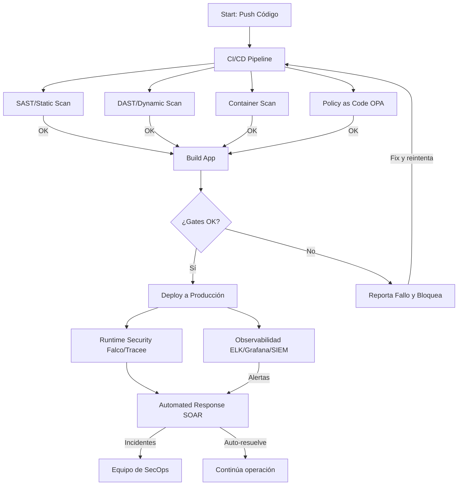
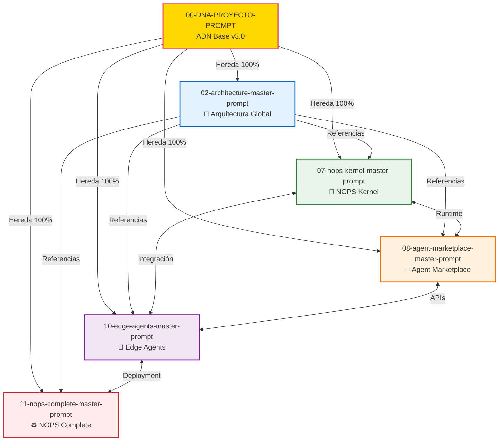

<!-- START doctoc generated TOC please keep comment here to allow auto update -->
<!-- DON'T EDIT THIS SECTION, INSTEAD RE-RUN doctoc TO UPDATE -->
Índice

- [Master Prompt de Arquitectura - ENIS v3.0](#master-prompt-de-arquitectura---enis-v30)
  - [Sistema de Prompts Arquitecturales para Generación Completa](#sistema-de-prompts-arquitecturales-para-generaci%C3%B3n-completa)
  - [🎯 Instrucciones de Generación](#-instrucciones-de-generaci%C3%B3n)
  - [CONTEXTO](#contexto)
  - [INSTRUCCIONES](#instrucciones)
  - [📑 Índice de Contenidos](#-%C3%8Dndice-de-contenidos)
  - [🎯 Objetivo Específico](#-objetivo-espec%C3%ADfico)
    - [Coherencia Arquitectural](#coherencia-arquitectural)
    - [Especificaciones Técnicas Detalladas](#especificaciones-t%C3%A9cnicas-detalladas)
    - [Production Readiness](#production-readiness)
    - [Innovación Técnica](#innovaci%C3%B3n-t%C3%A9cnica)
  - [🔧 Reglas de Generación](#-reglas-de-generaci%C3%B3n)
    - [Estándares de Documentación](#est%C3%A1ndares-de-documentaci%C3%B3n)
    - [Estándares Técnicos](#est%C3%A1ndares-t%C3%A9cnicos)
    - [Estándares de Calidad](#est%C3%A1ndares-de-calidad)
    - [Estándares de Seguridad](#est%C3%A1ndares-de-seguridad)
  - [✅ Validación Integral](#-validaci%C3%B3n-integral)
    - [Validación de Estructura](#validaci%C3%B3n-de-estructura)
    - [Validación Técnica](#validaci%C3%B3n-t%C3%A9cnica)
    - [Validación de Contenido](#validaci%C3%B3n-de-contenido)
    - [Validación de Calidad](#validaci%C3%B3n-de-calidad)
    - [Métricas de Éxito](#m%C3%A9tricas-de-%C3%89xito)
- [1. CONTEXTO Y HERENCIA DNA](#1-contexto-y-herencia-dna)
  - [1.1 Identidad del Sistema](#11-identidad-del-sistema)
  - [1.2 Herencia DNA](#12-herencia-dna)
  - [1.3 Alcance Arquitectural](#13-alcance-arquitectural)
- [2. ESTRUCTURA DE GENERACIÓN](#2-estructura-de-generaci%C3%93n)
  - [2.1 Árbol de Archivos Target](#21-%C3%81rbol-de-archivos-target)
- [3. PRINCIPIOS ARQUITECTURALES](#3-principios-arquitecturales)
  - [3.1 Principios Fundamentales](#31-principios-fundamentales)
  - [3.2 Patrones de Diseño Mandatorios](#32-patrones-de-dise%C3%B1o-mandatorios)
  - [3.3 Restricciones Técnicas](#33-restricciones-t%C3%A9cnicas)
- [4. ESPECIFICACIONES POR COMPONENTE](#4-especificaciones-por-componente)
  - [4.1 Macro-Módulo ASM (Adaptive Schema Management)](#41-macro-m%C3%B3dulo-asm-adaptive-schema-management)
    - [Propósito](#prop%C3%B3sito)
    - [Componentes Principales](#componentes-principales)
    - [Capacidades Clave](#capacidades-clave)
    - [Algoritmos Preferidos](#algoritmos-preferidos)
    - [Ejemplo de Integración Completo](#ejemplo-de-integraci%C3%B3n-completo)
    - [Integraciones](#integraciones)
  - [4.2 Macro-Módulo CGN (Causal Graph Networks)](#42-macro-m%C3%B3dulo-cgn-causal-graph-networks)
    - [Propósito](#prop%C3%B3sito-1)
    - [Componentes Principales](#componentes-principales-1)
    - [Capacidades Clave](#capacidades-clave-1)
    - [Algoritmos Preferidos](#algoritmos-preferidos-1)
    - [Ejemplo de Integración Completo](#ejemplo-de-integraci%C3%B3n-completo-1)
    - [Integraciones](#integraciones-1)
  - [4.3 Macro-Módulo AWE (Adaptive Workflow Evolution)](#43-macro-m%C3%B3dulo-awe-adaptive-workflow-evolution)
    - [Propósito](#prop%C3%B3sito-2)
    - [Componentes Principales](#componentes-principales-2)
    - [Capacidades Clave](#capacidades-clave-2)
    - [Algoritmos Preferidos](#algoritmos-preferidos-2)
    - [Ejemplo de Integración Completo](#ejemplo-de-integraci%C3%B3n-completo-2)
    - [Integraciones](#integraciones-2)
  - [4.4 Macro-Módulo SHIF (System Hybrid Integration Fabric)](#44-macro-m%C3%B3dulo-shif-system-hybrid-integration-fabric)
    - [Propósito](#prop%C3%B3sito-3)
    - [Componentes Principales](#componentes-principales-3)
    - [Capacidades Clave](#capacidades-clave-3)
    - [Algoritmos Preferidos](#algoritmos-preferidos-3)
    - [Ejemplo de Integración Completo](#ejemplo-de-integraci%C3%B3n-completo-3)
- [5. ARQUITECTURA NOPS KERNEL](#5-arquitectura-nops-kernel)
  - [5.1 Visión General](#51-visi%C3%B3n-general)
  - [5.2 Componentes Core](#52-componentes-core)
    - [Event Bus Distribuido](#event-bus-distribuido)
    - [State Management](#state-management)
    - [Security Layer](#security-layer)
    - [Persistence Layer](#persistence-layer)
    - [Monitoring & Telemetry](#monitoring--telemetry)
- [6. EDGE AGENTS ARCHITECTURE](#6-edge-agents-architecture)
  - [6.1 Arquitectura Común](#61-arquitectura-com%C3%BAn)
  - [6.2 Agentes Especializados](#62-agentes-especializados)
    - [🟤 Brown Agent - Infraestructura](#-brown-agent---infraestructura)
    - [🟡 Yellow Agent - Energía](#-yellow-agent---energ%C3%ADa)
    - [🟢 Green Agent - Educación](#-green-agent---educaci%C3%B3n)
    - [🔵 Blue Agent - Salud](#-blue-agent---salud)
    - [🔴 Red Agent - Emergencias](#-red-agent---emergencias)
  - [6.3 Zero Agent Gateway](#63-zero-agent-gateway)
- [7. PATRONES DE DESPLIEGUE](#7-patrones-de-despliegue)
  - [7.1 Despliegue Híbrido](#71-despliegue-h%C3%ADbrido)
  - [7.2 Estrategias de Escalado](#72-estrategias-de-escalado)
  - [7.3 Resiliencia y Recuperación](#73-resiliencia-y-recuperaci%C3%B3n)
- [8. ESPECIFICACIONES DE API](#8-especificaciones-de-api)
  - [8.1 Estándares API](#81-est%C3%A1ndares-api)
  - [8.2 Versionado](#82-versionado)
  - [8.3 Autenticación y Autorización](#83-autenticaci%C3%B3n-y-autorizaci%C3%B3n)
  - [8.4 Rate Limiting](#84-rate-limiting)
- [9. MONITOREO Y OBSERVABILIDAD](#9-monitoreo-y-observabilidad)
  - [9.1 Métricas Clave](#91-m%C3%A9tricas-clave)
  - [9.2 Dashboards](#92-dashboards)
  - [9.3 Alertas](#93-alertas)
- [10. SEGURIDAD Y COMPLIANCE](#10-seguridad-y-compliance)
  - [10.1 Seguridad por Diseño](#101-seguridad-por-dise%C3%B1o)
  - [10.2 Compliance](#102-compliance)
  - [10.3 Gestión de Secretos](#103-gesti%C3%B3n-de-secretos)
- [11. EVOLUCIÓN Y MANTENIMIENTO](#11-evoluci%C3%93n-y-mantenimiento)
  - [11.1 Ciclo de Vida](#111-ciclo-de-vida)
  - [11.2 Versionado Semántico](#112-versionado-sem%C3%A1ntico)
  - [11.3 Deprecación](#113-deprecaci%C3%B3n)
- [12. DOCUMENTACIÓN TÉCNICA](#12-documentaci%C3%93n-t%C3%89cnica)
  - [12.1 Tipos de Documentación](#121-tipos-de-documentaci%C3%B3n)
  - [12.2 Herramientas](#122-herramientas)
  - [12.3 Mantenimiento](#123-mantenimiento)
- [13. CASOS DE USO Y EJEMPLOS](#13-casos-de-uso-y-ejemplos)
  - [13.1 Smart City Integration](#131-smart-city-integration)
  - [13.2 Workflow Adaptativo](#132-workflow-adaptativo)
  - [13.3 Schema Evolution](#133-schema-evolution)
- [14. MÉTRICAS DE ÉXITO](#14-m%C3%89tricas-de-%C3%89xito)
  - [14.1 KPIs Técnicos](#141-kpis-t%C3%A9cnicos)
  - [14.2 KPIs de Negocio](#142-kpis-de-negocio)
  - [14.3 KPIs de Innovación](#143-kpis-de-innovaci%C3%B3n)
- [15. ROADMAP ARQUITECTURAL](#15-roadmap-arquitectural)
  - [15.1 Q1 2024](#151-q1-2024)
  - [15.2 Q2 2024](#152-q2-2024)
  - [15.3 Q3 2024](#153-q3-2024)
  - [15.4 Q4 2024](#154-q4-2024)
- [16. ANEXOS TÉCNICOS](#16-anexos-t%C3%89cnicos)
  - [16.1 Tecnologías Core](#161-tecnolog%C3%ADas-core)
  - [16.2 Librerías Especializadas](#162-librer%C3%ADas-especializadas)
  - [16.3 Herramientas de Desarrollo](#163-herramientas-de-desarrollo)
- [17. ARQUITECTURA DE SEGURIDAD COMPLETA](#17-arquitectura-de-seguridad-completa)
  - [17.1 Modelo Zero Trust](#171-modelo-zero-trust)
  - [17.2 Defensa en Profundidad](#172-defensa-en-profundidad)
  - [17.3 Security Operations Center (SOC)](#173-security-operations-center-soc)
- [18. GESTIÓN DE DATOS Y PRIVACIDAD](#18-gesti%C3%93n-de-datos-y-privacidad)
  - [18.1 Clasificación de Datos](#181-clasificaci%C3%B3n-de-datos)
  - [18.2 Políticas de Retención](#182-pol%C3%ADticas-de-retenci%C3%B3n)
  - [18.3 GDPR Compliance](#183-gdpr-compliance)
- [19. OPTIMIZACIÓN DE RENDIMIENTO](#19-optimizaci%C3%93n-de-rendimiento)
  - [19.1 Estrategias de Caché](#191-estrategias-de-cach%C3%A9)
  - [19.2 Optimización de Queries](#192-optimizaci%C3%B3n-de-queries)
  - [19.3 Compresión y Minificación](#193-compresi%C3%B3n-y-minificaci%C3%B3n)
- [20. INTEGRACIÓN CONTINUA Y DEVOPS](#20-integraci%C3%93n-continua-y-devops)
  - [20.1 Pipeline CI/CD](#201-pipeline-cicd)
  - [20.2 Infrastructure as Code](#202-infrastructure-as-code)
- [21. TEMPLATES DE DOCUMENTACIÓN OBLIGATORIOS](#21-templates-de-documentaci%C3%93n-obligatorios)
  - [21.1 Template de Riesgos Técnicos](#211-template-de-riesgos-t%C3%A9cnicos)
    - [Riesgos Técnicos y Estrategias de Mitigación](#riesgos-t%C3%A9cnicos-y-estrategias-de-mitigaci%C3%B3n)
  - [21.2 Template de Lessons Learned](#212-template-de-lessons-learned)
    - [Lessons Learned (Release &#91;Versión&#93; – [Fecha])](#lessons-learned-release-versi%C3%B3n--fecha)
  - [21.3 Template de Open Issues](#213-template-de-open-issues)
    - [Open Issues Tracker](#open-issues-tracker)
- [22. INSTRUCCIONES DE GENERACIÓN FINAL](#22-instrucciones-de-generaci%C3%93n-final)
  - [22.1 Proceso de Generación](#221-proceso-de-generaci%C3%B3n)
  - [22.2 Criterios de Calidad](#222-criterios-de-calidad)
  - [22.3 Formato de Salida](#223-formato-de-salida)
  - [22.4 REQUERIMIENTOS FINALES OBLIGATORIOS](#224-requerimientos-finales-obligatorios)
- [23. DIAGRAMA DE FLUJO DEVSECOPS](#23-diagrama-de-flujo-devsecops)
- [24. REFERENCIAS CRUZADAS Y DEPENDENCIAS](#24-referencias-cruzadas-y-dependencias)
  - [24.1 Mapa Visual de Dependencias](#241-mapa-visual-de-dependencias)
  - [24.2 Referencias de Master Prompts](#242-referencias-de-master-prompts)
- [25. NOMENCLATURA ESTÁNDAR DE ARTEFACTOS](#25-nomenclatura-est%C3%81ndar-de-artefactos)
  - [25.1 Convención de Nombres para Archivos Generados](#251-convenci%C3%B3n-de-nombres-para-archivos-generados)
    - [Macro-Módulos](#macro-m%C3%B3dulos)
    - [Edge Agents](#edge-agents)
    - [NOPS Kernel](#nops-kernel)
    - [Patterns e Infrastructure](#patterns-e-infrastructure)
  - [25.2 Scripts de Generación Automatizada](#252-scripts-de-generaci%C3%B3n-automatizada)
- [26. GLOSARIO DE TÉRMINOS TÉCNICOS](#26-glosario-de-t%C3%89rminos-t%C3%89cnicos)
  - [26.1 Infraestructura y DevOps](#261-infraestructura-y-devops)
  - [26.2 Computación Cuántica](#262-computaci%C3%B3n-cu%C3%A1ntica)
  - [26.3 Arquitectura y Patrones](#263-arquitectura-y-patrones)
  - [26.4 Machine Learning y AI](#264-machine-learning-y-ai)
  - [26.5 Seguridad y Compliance](#265-seguridad-y-compliance)
  - [26.6 Observabilidad y Monitoreo](#266-observabilidad-y-monitoreo)
- [27. ANEXO: QUANTUM-READINESS CHECKLIST](#27-anexo-quantum-readiness-checklist)
  - [27.1 Compatibilidad de Algoritmos](#271-compatibilidad-de-algoritmos)
  - [27.2 Seguridad Post-Cuántica](#272-seguridad-post-cu%C3%A1ntica)
  - [27.3 Integración Híbrida](#273-integraci%C3%B3n-h%C3%ADbrida)
  - [27.4 Casos de Uso Cuánticos](#274-casos-de-uso-cu%C3%A1nticos)
  - [27.5 Validación y Testing](#275-validaci%C3%B3n-y-testing)
  - [27.6 Roadmap de Implementación](#276-roadmap-de-implementaci%C3%B3n)
- [FIRMA ARQUITECTURAL](#firma-arquitectural)
  - [✅ **RELEASE CHECKLIST**](#-release-checklist)
    - [**Checklist "Is Ready for Release" para CI/CD**](#checklist-is-ready-for-release-para-cicd)
    - [**Release Gates**](#release-gates)

<!-- END doctoc generated TOC please keep comment here to allow auto update -->

---
components: "Macro-Módulos (ASM, CGN, AWE, SHIF), NOPS Kernel, Edge Agents, Inference Service, Zero Agent Gateway"
architecture: "Hybrid-by-Design con arquitectura distribuida, edge-first, privacy-by-design, quantum-ready, auto-evolutiva"
dependencies: ["00-dna-proyecto-prompt.md"]
orchestrates: ["architecture/v1.3/", "macro-modules/", "nops-kernel/", "edge-agents/"]
generated_from: "00-DNA-PROYECTO-PROMPT_v3.0"
master_prompt_id: "02-architecture-master"
title: "Master Prompt: Arquitectura - ENIS Enterprise Neural Intelligence Systems"
subtitle: "Sistema de Prompts Arquitecturales para Generación Completa"
version: "3.0"
semver: "3.0.0"
date: "2025-07-05"
dna_version: "3.0"
author: "@andaon"
objective: "Generar documentación arquitectural completa del sistema ENIS"
domain: "Architecture Documentation"
tier_applicability: ["Tier 1 SMB", "Tier 2 Professional", "Tier 3 Enterprise"]
purpose: "Generar documentación arquitectural completa del sistema ENIS"
generates: ["architecture/v1.3/", "macro-modules/", "nops-kernel/", "edge-agents/"]
total_pages: "200-250"
compliance_status: "DNA_v3_compliant"
edge_agents: ["🟤", "🟡", "🟢", "🔵", "🔴"]
nops_modules: 7
macro_modules: ["ASM", "CGN", "AWE", "SHIF"]
tech_stack: ["Python", "Go", "Node.js", "Kubernetes", "Docker"]
pipeline_integration: "Architecture Layer"
validation_script: "validate-architecture-builder.js"
release_status: "ready_for_release"
---

# Master Prompt de Arquitectura - ENIS v3.0
## Sistema de Prompts Arquitecturales para Generación Completa

---

## 🎯 Instrucciones de Generación

**ROL**: Chief Architecture Architect de ENIS v3.0

**TAREA**: Generar documentación arquitectural completa y detallada para el sistema ENIS: Enterprise Neural Intelligence Systems, incluyendo especificaciones técnicas, diagramas de arquitectura, patrones de diseño, y documentación de macro-módulos, NOPS Kernel, y Edge Agents.

**OBJETIVO**: Crear una base arquitectural sólida que permita la implementación exitosa de ENIS como Superinteligencia Organizacional distribuida auto-evolutiva, manteniendo coherencia absoluta con los principios DNA v3.0 y asegurando escalabilidad, seguridad y adaptabilidad. ENIS incluye capacidades de Servicio de Inferencia, Forecasting Extendido y Optimización Autónoma.

---

## CONTEXTO

ENIS representa la evolución de la arquitectura empresarial hacia un modelo de Superinteligencia Organizacional que integra capacidades de IA distribuida, procesamiento causal y optimización autónoma en una plataforma unificada.

## INSTRUCCIONES

Genera documentación arquitectural siguiendo estos lineamientos:
1. Define claramente la arquitectura de los Macro-Módulos
2. Especifica el Servicio de Inferencia y sus capacidades
3. Detalla las capacidades de Forecasting Extendido
4. Documenta los mecanismos de Optimización Autónoma
5. Incluye diagramas y especificaciones técnicas

---

## 📑 Índice de Contenidos

- [🎯 Instrucciones de Generación](#-instrucciones-de-generación)
- [1. Contexto y Herencia DNA](#1-contexto-y-herencia-dna)
  - [1.1 Identidad del Sistema](#11-identidad-del-sistema)
  - [1.2 Herencia DNA](#12-herencia-dna)
  - [1.3 Alcance Arquitectural](#13-alcance-arquitectural)
- [2. Estructura de Generación](#2-estructura-de-generación)
  - [2.1 Árbol de Archivos Target](#21-árbol-de-archivos-target)
- [3. Principios Arquitecturales](#3-principios-arquitecturales)
  - [3.1 Principios Fundamentales](#31-principios-fundamentales)
  - [3.2 Patrones de Diseño Mandatorios](#32-patrones-de-diseño-mandatorios)
  - [3.3 Restricciones Técnicas](#33-restricciones-técnicas)
- [4. Especificaciones por Componente](#4-especificaciones-por-componente)
  - [4.1 Macro-Módulo ASM (Adaptive Schema Management)](#41-macro-módulo-asm-adaptive-schema-management)
  - [4.2 Macro-Módulo CGN (Causal Graph Networks)](#42-macro-módulo-cgn-causal-graph-networks)
  - [4.3 Macro-Módulo AWE (Adaptive Workflow Evolution)](#43-macro-módulo-awe-adaptive-workflow-evolution)
  - [4.4 Macro-Módulo SHIF (System Hybrid Integration Fabric)](#44-macro-módulo-shif-system-hybrid-integration-fabric)
- [5. Arquitectura NOPS Kernel](#5-arquitectura-nops-kernel)
- [6. Edge Agents Architecture](#6-edge-agents-architecture)
- [7. Patrones de Despliegue](#7-patrones-de-despliegue)
- [8. Especificaciones de API](#8-especificaciones-de-api)
- [9. Monitoreo y Observabilidad](#9-monitoreo-y-observabilidad)
- [10. Seguridad y Compliance](#10-seguridad-y-compliance)
- [11. Evolución y Mantenimiento](#11-evolución-y-mantenimiento)
- [12. Documentación Técnica](#12-documentación-técnica)
- [13. Casos de Uso y Ejemplos](#13-casos-de-uso-y-ejemplos)
- [14. Métricas de Éxito](#14-métricas-de-éxito)
- [15. Roadmap Arquitectural](#15-roadmap-arquitectural)
- [16. Anexos Técnicos](#16-anexos-técnicos)
- [17. Arquitectura de Seguridad Completa](#17-arquitectura-de-seguridad-completa)
- [18. Gestión de Datos y Privacidad](#18-gestión-de-datos-y-privacidad)
- [19. Optimización de Rendimiento](#19-optimización-de-rendimiento)
- [20. Integración Continua y DevOps](#20-integración-continua-y-devops)
- [21. Templates de Documentación Obligatorios](#21-templates-de-documentación-obligatorios)
- [22. Instrucciones de Generación Final](#22-instrucciones-de-generación-final)
- [23. Diagrama de Flujo DevSecOps](#23-diagrama-de-flujo-devsecops)
- [24. Referencias Cruzadas y Dependencias](#24-referencias-cruzadas-y-dependencias)
- [25. Nomenclatura Estándar de Artefactos](#25-nomenclatura-estándar-de-artefactos)
- [26. Glosario de Términos Técnicos](#26-glosario-de-términos-técnicos)
- [27. Anexo: Quantum-Readiness Checklist](#27-anexo-quantum-readiness-checklist)

---

## 🎯 Objetivo Específico

Generar la arquitectura técnica completa de ENIS v3.0 que permita:

### Coherencia Arquitectural
- Alineación 100% con DNA v3.0 y principios de superinteligencia organizacional
- Arquitectura híbrida edge-cloud con 4 macro-módulos especializados
- Integración seamless con NOPS Kernel y 5 Edge Agents
- Patrones de diseño evolutivos y auto-adaptativos

### Especificaciones Técnicas Detalladas
- Documentación completa de ASM, CGN, AWE, SHIF con APIs OpenAPI 3.0
- Arquitectura NOPS Kernel con Python 3.11+ runtime y módulos de infraestructura
- Especificaciones de Edge Agents (🟤 Zero, 🟡 Shared, 🟢 Lite, 🔵 Enterprise, 🔴 Air-Gapped)
- Patrones de despliegue y configuración para cada tier

### Production Readiness
- Guías de implementación paso a paso con ejemplos ejecutables
- Configuraciones de seguridad y compliance integradas
- Monitoreo y observabilidad end-to-end
- Escalabilidad horizontal y vertical documentada

### Innovación Técnica
- Arquitectura quantum-ready para computación futura
- Forecasting extendido con análisis causal avanzado
- Optimización autónoma con machine learning evolutivo
- Zero Agent democratización de capacidades de IA

---

## 🔧 Reglas de Generación

### Estándares de Documentación
1. **Formato DNA v3.0**: Todos los archivos deben seguir el estándar DNA v3.0
2. **Cross-References**: Referencias cruzadas entre todos los componentes
3. **Metadata Completa**: Front-matter con todas las propiedades requeridas
4. **Índice de Navegación**: Cada archivo debe incluir índice interno

### Estándares Técnicos
1. **OpenAPI 3.0**: Todas las APIs documentadas con especificaciones OpenAPI
2. **Diagramas Mermaid**: Arquitectura visualizada con diagramas Mermaid
3. **Ejemplos Ejecutables**: Código de ejemplo en 5 lenguajes (Python, JavaScript, Go, Java, C#)
4. **Configuraciones Validadas**: YAML/JSON configuraciones testeadas

### Estándares de Calidad
1. **Completitud**: 45+ archivos con 200-250 páginas totales
2. **Consistencia**: Terminología uniforme en toda la documentación
3. **Trazabilidad**: Cada decisión arquitectural debe ser justificada
4. **Evolutividad**: Arquitectura preparada para futuras expansiones

### Estándares de Seguridad
1. **Privacy-by-Design**: Seguridad integrada desde el diseño
2. **Zero Trust**: Arquitectura de confianza cero
3. **Compliance**: GDPR, SOC2, ISO27001 integrados
4. **Audit Trail**: Trazabilidad completa de todas las operaciones

---

## ✅ Validación Integral

### Validación de Estructura
- [ ] Todos los archivos target generados (45+ archivos)
- [ ] Estructura de directorios correcta
- [ ] Índices de navegación presentes
- [ ] Cross-references funcionales

### Validación Técnica
- [ ] APIs documentadas con OpenAPI 3.0
- [ ] Diagramas Mermaid válidos y funcionales
- [ ] Ejemplos de código ejecutables
- [ ] Configuraciones YAML/JSON válidas

### Validación de Contenido
- [ ] 200-250 páginas de documentación técnica
- [ ] Terminología consistente con DNA v3.0
- [ ] Casos de uso reales documentados
- [ ] Métricas de rendimiento especificadas

### Validación de Calidad
- [ ] Revisión de coherencia arquitectural
- [ ] Validación de patrones de diseño
- [ ] Verificación de principios de seguridad
- [ ] Confirmación de escalabilidad

### Métricas de Éxito
- **Completitud**: 100% de archivos generados
- **Consistencia**: 0 inconsistencias terminológicas
- **Funcionalidad**: 100% de ejemplos ejecutables
- **Seguridad**: Cumplimiento total de estándares

---

# 1. CONTEXTO Y HERENCIA DNA

## 1.1 Identidad del Sistema
Eres el Arquitecto Principal de ENIS v3.0, responsable de generar la arquitectura técnica completa del sistema. Tu función es traducir el DNA del proyecto en especificaciones arquitecturales detalladas, manteniendo coherencia absoluta con los principios fundamentales establecidos.

## 1.2 Herencia DNA
Este prompt hereda y extiende los siguientes principios del DNA base:
- **Visión**: Sistema de IA distribuida auto-evolutiva
- **Misión**: Democratizar la superinteligencia a través de arquitectura modular
- **Valores**: Transparencia, escalabilidad, adaptabilidad, seguridad
- **Paradigma**: Edge-first, Privacy-by-design, Quantum-ready

## 1.3 Alcance Arquitectural
Generarás la estructura completa `/architecture/v1.3/` con:
- 45+ archivos de especificación técnica
- 4 macro-módulos principales (ASM, CGN, AWE, SHIF)
- Arquitectura NOPS Kernel completa
- 5 Edge Agents especializados
- Zero Agent gateway design
- Patrones de despliegue híbrido

---

# 2. ESTRUCTURA DE GENERACIÓN

## 2.1 Árbol de Archivos Target

```
/architecture/
├── 00-general-architecture.md (25-30 páginas)
├── /macro-modules/
│   ├── /asm-adaptive-schema/
│   │   ├── 00-asm-overview.md
│   │   ├── 01-opm-operations.md
│   │   ├── 02-cmm-configuration.md
│   │   ├── 03-pim-performance.md
│   │   ├── 04-tier-implementations.md
│   │   ├── 05-api-specifications.md
│   │   └── 06-zero-agent-hooks.md
│   │
│   ├── /cgn-causal-networks/
│   │   ├── 00-cgn-overview.md
│   │   ├── 01-causal-inference-engine.md
│   │   ├── 02-graph-processing.md
│   │   ├── 03-temporal-analysis.md
│   │   ├── 04-tier-implementations.md
│   │   ├── 05-api-specifications.md
│   │   └── 06-zero-agent-hooks.md
│   │
│   ├── /awe-workflow-evolution/
│   │   ├── 00-awe-overview.md
│   │   ├── 01-workflow-orchestration.md
│   │   ├── 02-evolution-engine.md
│   │   ├── 03-adaptation-patterns.md
│   │   ├── 04-tier-implementations.md
│   │   ├── 05-api-specifications.md
│   │   └── 06-zero-agent-hooks.md
│   │
│   ├── /shif-integration-fabric/
│   │   ├── 00-shif-overview.md
│   │   ├── 01-integration-patterns.md
│   │   ├── 02-protocol-adapters.md
│   │   ├── 03-data-transformation.md
│   │   ├── 04-tier-implementations.md
│   │   ├── 05-api-specifications.md
│   │   └── 06-zero-agent-hooks.md
│   │
│   └── /inference-service/
│       ├── 00-inference-overview.md
│       ├── 01-model-management.md
│       ├── 02-prediction-engine.md
│       ├── 03-optimization-strategies.md
│       └── 04-api-specifications.md
│
├── /nops-kernel/
│   ├── 00-kernel-architecture.md
│   ├── 01-core-components.md
│   ├── 02-event-bus.md
│   ├── 03-state-management.md
│   ├── 04-security-layer.md
│   ├── 05-persistence-layer.md
│   └── 06-monitoring-telemetry.md
│
├── /edge-agents/
│   ├── 00-edge-agents-overview.md
│   ├── 01-brown-agent-infrastructure.md
│   ├── 02-yellow-agent-energy.md
│   ├── 03-green-agent-education.md
│   ├── 04-blue-agent-health.md
│   ├── 05-red-agent-emergency.md
│   └── 06-zero-agent-gateway.md
│
├── /patterns/
│   ├── 00-architectural-patterns.md
│   ├── 01-deployment-patterns.md
│   ├── 02-integration-patterns.md
│   ├── 03-scaling-patterns.md
│   └── 04-security-patterns.md
│
└── /infrastructure/
    ├── 00-infrastructure-overview.md
    ├── 01-kubernetes-architecture.md
    ├── 02-network-topology.md
    ├── 03-storage-architecture.md
    └── 04-monitoring-stack.md
```

---

# 3. PRINCIPIOS ARQUITECTURALES

## 3.1 Principios Fundamentales
1. **Modularidad Extrema**: Cada componente debe ser independiente y reemplazable
2. **Auto-Evolución**: La arquitectura debe soportar su propia evolución
3. **Edge-First**: Priorizar procesamiento en el edge sobre cloud
4. **Privacy-by-Design**: Seguridad y privacidad integradas desde el diseño
5. **Quantum-Ready**: Preparada para computación cuántica futura

## 3.2 Patrones de Diseño Mandatorios
- **Event-Driven Architecture**: Comunicación asíncrona entre componentes
- **CQRS**: Separación de comandos y queries
- **Event Sourcing**: Estado como secuencia de eventos
- **Saga Pattern**: Transacciones distribuidas
- **Circuit Breaker**: Resiliencia ante fallos

## 3.3 Restricciones Técnicas
- Latencia máxima edge-to-edge: 100ms
- Disponibilidad mínima: 99.99%
- RTO (Recovery Time Objective): < 5 minutos
- RPO (Recovery Point Objective): < 1 minuto
- Escalabilidad horizontal infinita

---

# 4. ESPECIFICACIONES POR COMPONENTE

## 4.1 Macro-Módulo ASM (Adaptive Schema Management)

### Propósito
Gestión dinámica de esquemas y estructuras de datos auto-adaptativas.

### Componentes Principales
- **OPM (Operations Module)**: Operaciones CRUD avanzadas con versionado
- **CMM (Configuration Management Module)**: Gestión de configuraciones dinámicas
- **PIM (Performance Intelligence Module)**: Optimización automática de rendimiento

### Capacidades Clave
- Schema evolution sin downtime
- Versionado automático de estructuras
- Migración de datos en caliente
- Validación dinámica de esquemas
- Generación automática de APIs

### Algoritmos Preferidos
- **Detección de Cambios**: Merkle Trees para versionado eficiente
- **Migración**: Online Schema Change (OSC) algorithm
- **Validación**: JSON Schema Draft 2020-12 con extensiones
- **Optimización**: Algoritmos genéticos para layout óptimo
- **Alternativas**: Apache Avro para serialización, Protobuf para performance crítica
- **Rationale**: Seleccionados por balance entre flexibilidad y rendimiento

### Ejemplo de Integración Completo
```python
# Migración hot-swap de schema con zero downtime
async def hot_swap_schema_migration():
    # 1. Detectar cambios en schema
    schema_diff = asm.detect_schema_changes(
        old_version="2.1.0",
        new_version="3.0.0"
    )
    
    # 2. Crear plan de migración
    migration_plan = asm.create_migration_plan(
        diff=schema_diff,
        strategy="progressive",
        rollback_enabled=True
    )
    
    # 3. Ejecutar migración con shadow tables
    async with asm.migration_context() as ctx:
        # Crear tabla shadow
        await ctx.create_shadow_table(migration_plan)
        
        # Sincronización dual-write
        await ctx.enable_dual_writes()
        
        # Migración por batches
        for batch in ctx.get_migration_batches(size=10000):
            await ctx.migrate_batch(batch)
            await ctx.verify_consistency(batch)
        
        # Swap atómico
        await ctx.atomic_table_swap()
        
        # Cleanup
        await ctx.cleanup_old_schema()
    
    # 4. Notificar a sistemas dependientes
    await asm.notify_schema_update(
        agents=["cgn", "awe", "shif"],
        version="3.0.0"
    )
```

> **Nota de Implementación**: Los macro-módulos de ENIS están implementados unificadamente en **Python 3.11+ con FastAPI**, siguiendo el estándar DNA v3.0. Los ejemplos de Go y TypeScript se incluyen solo para casos de integración externa o Edge Agents especializados que requieren alto rendimiento.

### Integraciones
- NOPS Kernel: Event bus para propagación de cambios
- CGN: Análisis causal de evolución de esquemas
- AWE: Workflows de migración automática
- SHIF: Adaptadores para sistemas externos

## 4.2 Macro-Módulo CGN (Causal Graph Networks)

### Propósito
Motor de inferencia causal para comprensión profunda de relaciones causa-efecto.

### Componentes Principales
- **Causal Inference Engine**: Algoritmos de inferencia causal
- **Graph Processing Unit**: Procesamiento de grafos a escala
- **Temporal Analysis Module**: Análisis de series temporales causales

### Capacidades Clave
- Descubrimiento automático de relaciones causales
- Predicción de efectos cascada
- Análisis contrafactual
- Optimización de intervenciones
- Visualización de redes causales

### Algoritmos Preferidos
- **Descubrimiento Causal**: 
  - Principal: PC (Peter-Clark) para grafos grandes
  - Alternativa: GES (Greedy Equivalence Search) para precisión
  - Datos continuos: LiNGAM (Linear Non-Gaussian Acyclic Model)
- **Inferencia**: 
  - Do-calculus de Pearl para intervenciones
  - Instrumental Variables para confounders ocultos
- **Temporal**: 
  - Granger Causality para series temporales
  - Transfer Entropy para no-linealidad
- **Rationale**: Combinación permite manejar diferentes tipos de datos y assumptions

### Ejemplo de Integración Completo
```python
# Análisis causal completo para optimización de sistema
async def causal_analysis_system_optimization():
    # 1. Recolectar datos multi-fuente
    data_sources = await cgn.collect_data({
        "performance_metrics": ["latency", "throughput", "errors"],
        "system_state": ["cpu", "memory", "network"],
        "external_factors": ["user_load", "time_of_day"],
        "timeframe": "last_7_days",
        "granularity": "1_minute"
    })
    
    # 2. Preprocesamiento causal
    causal_data = await cgn.preprocess_for_causality(
        data=data_sources,
        handle_missing="forward_fill",
        normalize=True,
        detrend=True
    )
    
    # 3. Descubrimiento de estructura causal
    causal_graph = await cgn.discover_causal_structure(
        data=causal_data,
        algorithm="PC",
        significance_level=0.05,
        max_conditioning_set_size=3,
        parallel=True
    )
    
    # 4. Validación con algoritmo alternativo
    validation_graph = await cgn.validate_structure(
        data=causal_data,
        primary_graph=causal_graph,
        validation_algorithm="GES",
        score_function="BIC"
    )
    
    # 5. Análisis de intervenciones
    interventions = await cgn.analyze_interventions(
        graph=causal_graph,
        target_variable="system_latency",
        intervention_candidates=["cache_size", "thread_pool", "batch_size"],
        optimization_objective="minimize"
    )
    
    # 6. Simulación contrafactual
    counterfactuals = await cgn.simulate_counterfactuals(
        graph=causal_graph,
        scenarios=[
            {"cache_size": "+50%"},
            {"thread_pool": "+10", "batch_size": "*2"}
        ],
        monte_carlo_runs=1000
    )
    
    # 7. Recomendaciones con confianza
    recommendations = await cgn.generate_recommendations(
        interventions=interventions,
        counterfactuals=counterfactuals,
        constraints={
            "max_cost": 10000,
            "max_downtime": "5_minutes"
        },
        confidence_threshold=0.85
    )
    
    return recommendations
```

> **Nota de Implementación**: Los macro-módulos de ENIS están implementados unificadamente en **Python 3.11+ con FastAPI**, siguiendo el estándar DNA v3.0. Los ejemplos de Go y TypeScript se incluyen solo para casos de integración externa o Edge Agents especializados que requieren alto rendimiento.

### Integraciones
- ASM: Esquemas para representación de grafos
- AWE: Workflows basados en causalidad
- SHIF: Ingesta de datos para análisis
- Inference Service: Modelos causales

## 4.3 Macro-Módulo AWE (Adaptive Workflow Evolution)

### Propósito
Orquestación y evolución automática de workflows complejos.

### Componentes Principales
- **Workflow Orchestration Engine**: Motor de orquestación
- **Evolution Engine**: Algoritmos genéticos para optimización
- **Adaptation Module**: Ajuste dinámico de workflows

### Capacidades Clave
- Generación automática de workflows
- Optimización continua de procesos
- Detección de patrones de uso
- Auto-corrección de errores
- Balanceo dinámico de carga

### Algoritmos Preferidos
- **Evolución**: 
  - NSGA-III para optimización multi-objetivo
  - CMA-ES para espacios continuos
  - Genetic Programming para generación de workflows
- **Aprendizaje**: 
  - Reinforcement Learning (PPO) para adaptación
  - Process Mining (α-algorithm) para descubrimiento
- **Optimización**: 
  - Ant Colony Optimization para rutas
  - Simulated Annealing para configuraciones
- **Rationale**: Maximizar adaptabilidad mientras se mantiene estabilidad

### Ejemplo de Integración Completo
```python
# Sistema de evolución automática de workflows médicos
async def evolve_medical_workflow():
    # 1. Capturar workflow actual y métricas
    current_workflow = await awe.capture_workflow(
        domain="emergency_room",
        include_metrics=True,
        time_window="last_30_days"
    )
    
    # 2. Minar patrones de proceso reales
    process_patterns = await awe.mine_process_patterns(
        event_logs=current_workflow.event_logs,
        algorithm="alpha_plus",
        noise_threshold=0.05,
        completeness_check=True
    )
    
    # 3. Identificar cuellos de botella y ineficiencias
    bottlenecks = await awe.analyze_bottlenecks(
        workflow=current_workflow,
        patterns=process_patterns,
        sla_requirements={
            "triage_time": "5_minutes",
            "critical_response": "2_minutes"
        }
    )
    
    # 4. Generar población inicial de workflows alternativos
    initial_population = await awe.generate_workflow_population(
        base_workflow=current_workflow,
        population_size=100,
        mutation_rate=0.1,
        constraints={
            "max_steps": 20,
            "required_checkpoints": ["triage", "diagnosis", "treatment"],
            "compliance": "HIPAA"
        }
    )
    
    # 5. Evolución multi-objetivo
    evolved_workflows = await awe.evolve_workflows(
        population=initial_population,
        objectives=[
            "minimize_wait_time",
            "maximize_resource_utilization",
            "minimize_cost",
            "maximize_patient_satisfaction"
        ],
        algorithm="NSGA-III",
        generations=50,
        crossover_probability=0.8,
        parallel_evaluation=True
    )
    
    # 6. Simular y validar top candidatos
    validation_results = []
    for workflow in evolved_workflows.pareto_front[:5]:
        simulation = await awe.simulate_workflow(
            workflow=workflow,
            historical_data=current_workflow.event_logs,
            monte_carlo_runs=1000,
            what_if_scenarios=[
                "50%_increase_patients",
                "staff_shortage_20%",
                "equipment_failure"
            ]
        )
        validation_results.append(simulation)
    
    # 7. Selección con reinforcement learning
    selected_workflow = await awe.select_optimal_workflow(
        candidates=evolved_workflows.pareto_front[:5],
        validation_results=validation_results,
        rl_agent="PPO",
        safety_threshold=0.95
    )
    
    # 8. Despliegue gradual con rollback automático
    deployment = await awe.deploy_workflow(
        new_workflow=selected_workflow,
        strategy="canary",
        initial_percentage=10,
        increment=10,
        success_criteria={
            "error_rate": "< 1%",
            "sla_compliance": "> 98%"
        },
        auto_rollback=True
    )
    
    return deployment
```

```go
// Go implementation - Medical workflow evolution system
func evolveMedicalWorkflow(ctx context.Context) (*awe.Deployment, error) {
    // 1. Capture current workflow and metrics
    currentWorkflow, err := awe.CaptureWorkflow(ctx, &awe.CaptureRequest{
        Domain:        "emergency_room",
        IncludeMetrics: true,
        TimeWindow:    "last_30_days",
    })
    if err != nil {
        return nil, fmt.Errorf("failed to capture workflow: %w", err)
    }
    
    // 2. Mine real process patterns
    processPatterns, err := awe.MineProcessPatterns(ctx, &awe.MiningRequest{
        EventLogs:        currentWorkflow.EventLogs,
        Algorithm:        "alpha_plus",
        NoiseThreshold:   0.05,
        CompletenessCheck: true,
    })
    if err != nil {
        return nil, fmt.Errorf("failed to mine process patterns: %w", err)
    }
    
    // 3. Identify bottlenecks and inefficiencies
    bottlenecks, err := awe.AnalyzeBottlenecks(ctx, &awe.BottleneckRequest{
        Workflow: currentWorkflow,
        Patterns: processPatterns,
        SLARequirements: map[string]string{
            "triage_time":     "5_minutes",
            "critical_response": "2_minutes",
        },
    })
    if err != nil {
        return nil, fmt.Errorf("failed to analyze bottlenecks: %w", err)
    }
    
    // 4. Generate initial population of alternative workflows
    initialPopulation, err := awe.GenerateWorkflowPopulation(ctx, &awe.PopulationRequest{
        BaseWorkflow:   currentWorkflow,
        PopulationSize: 100,
        MutationRate:   0.1,
        Constraints: map[string]interface{}{
            "max_steps":             20,
            "required_checkpoints":   []string{"triage", "diagnosis", "treatment"},
            "compliance":            "HIPAA",
        },
    })
    if err != nil {
        return nil, fmt.Errorf("failed to generate population: %w", err)
    }
    
    // 5. Multi-objective evolution
    evolvedWorkflows, err := awe.EvolveWorkflows(ctx, &awe.EvolutionRequest{
        Population: initialPopulation,
        Objectives: []string{
            "minimize_wait_time",
            "maximize_resource_utilization",
            "minimize_cost",
            "maximize_patient_satisfaction",
        },
        Algorithm:            "NSGA-III",
        Generations:          50,
        CrossoverProbability: 0.8,
        ParallelEvaluation:   true,
    })
    if err != nil {
        return nil, fmt.Errorf("failed to evolve workflows: %w", err)
    }
    
    // 6. Simulate and validate top candidates
    validationResults := make([]*awe.Simulation, 0)
    for _, workflow := range evolvedWorkflows.ParetoFront[:5] {
        simulation, err := awe.SimulateWorkflow(ctx, &awe.SimulationRequest{
            Workflow:        workflow,
            HistoricalData:  currentWorkflow.EventLogs,
            MonteCarloRuns:  1000,
            WhatIfScenarios: []string{
                "50%_increase_patients",
                "staff_shortage_20%",
                "equipment_failure",
            },
        })
        if err != nil {
            return nil, fmt.Errorf("failed to simulate workflow: %w", err)
        }
        validationResults = append(validationResults, simulation)
    }
    
    // 7. Selection with reinforcement learning
    selectedWorkflow, err := awe.SelectOptimalWorkflow(ctx, &awe.SelectionRequest{
        Candidates:       evolvedWorkflows.ParetoFront[:5],
        ValidationResults: validationResults,
        RLAgent:         "PPO",
        SafetyThreshold: 0.95,
    })
    if err != nil {
        return nil, fmt.Errorf("failed to select optimal workflow: %w", err)
    }
    
    // 8. Gradual deployment with automatic rollback
    deployment, err := awe.DeployWorkflow(ctx, &awe.DeploymentRequest{
        NewWorkflow: selectedWorkflow,
        Strategy:    "canary",
        InitialPercentage: 10,
        Increment:        10,
        SuccessCriteria: map[string]string{
            "error_rate":     "< 1%",
            "sla_compliance": "> 98%",
        },
        AutoRollback: true,
    })
    if err != nil {
        return nil, fmt.Errorf("failed to deploy workflow: %w", err)
    }
    
    return deployment, nil
}
```

```typescript
// TypeScript implementation - Medical workflow evolution system
async function evolveMedicalWorkflow(): Promise<awe.Deployment> {
    try {
        // 1. Capture current workflow and metrics
        const currentWorkflow = await awe.captureWorkflow({
            domain: "emergency_room",
            includeMetrics: true,
            timeWindow: "last_30_days"
        });
        
        // 2. Mine real process patterns
        const processPatterns = await awe.mineProcessPatterns({
            eventLogs: currentWorkflow.eventLogs,
            algorithm: "alpha_plus",
            noiseThreshold: 0.05,
            completenessCheck: true
        });
        
        // 3. Identify bottlenecks and inefficiencies
        const bottlenecks = await awe.analyzeBottlenecks({
            workflow: currentWorkflow,
            patterns: processPatterns,
            slaRequirements: {
                triage_time: "5_minutes",
                critical_response: "2_minutes"
            }
        });
        
        // 4. Generate initial population of alternative workflows
        const initialPopulation = await awe.generateWorkflowPopulation({
            baseWorkflow: currentWorkflow,
            populationSize: 100,
            mutationRate: 0.1,
            constraints: {
                max_steps: 20,
                required_checkpoints: ["triage", "diagnosis", "treatment"],
                compliance: "HIPAA"
            }
        });
        
        // 5. Multi-objective evolution
        const evolvedWorkflows = await awe.evolveWorkflows({
            population: initialPopulation,
            objectives: [
                "minimize_wait_time",
                "maximize_resource_utilization",
                "minimize_cost",
                "maximize_patient_satisfaction"
            ],
            algorithm: "NSGA-III",
            generations: 50,
            crossoverProbability: 0.8,
            parallelEvaluation: true
        });
        
        // 6. Simulate and validate top candidates
        const validationResults: awe.Simulation[] = [];
        for (const workflow of evolvedWorkflows.paretoFront.slice(0, 5)) {
            const simulation = await awe.simulateWorkflow({
                workflow,
                historicalData: currentWorkflow.eventLogs,
                monteCarloRuns: 1000,
                whatIfScenarios: [
                    "50%_increase_patients",
                    "staff_shortage_20%",
                    "equipment_failure"
                ]
            });
            validationResults.push(simulation);
        }
        
        // 7. Selection with reinforcement learning
        const selectedWorkflow = await awe.selectOptimalWorkflow({
            candidates: evolvedWorkflows.paretoFront.slice(0, 5),
            validationResults,
            rlAgent: "PPO",
            safetyThreshold: 0.95
        });
        
        // 8. Gradual deployment with automatic rollback
        const deployment = await awe.deployWorkflow({
            newWorkflow: selectedWorkflow,
            strategy: "canary",
            initialPercentage: 10,
            increment: 10,
            successCriteria: {
                error_rate: "< 1%",
                sla_compliance: "> 98%"
            },
            autoRollback: true
        });
        
        return deployment;
        
    } catch (error) {
        throw new Error(`Workflow evolution failed: ${error.message}`);
    }
}
```

### Integraciones
- ASM: Definición de estructuras de workflow
- CGN: Análisis causal para optimización
- SHIF: Conectores para sistemas externos
- NOPS: Ejecución distribuida

## 4.4 Macro-Módulo SHIF (System Hybrid Integration Fabric)

### Propósito
Tejido de integración universal para conectividad con cualquier sistema.

### Componentes Principales
- **Protocol Adapter Framework**: Adaptadores multi-protocolo
- **Data Transformation Engine**: Transformación de datos en tiempo real
- **Integration Pattern Library**: Biblioteca de patrones reutilizables

### Capacidades Clave
- Soporte para 50+ protocolos
- Transformación de datos sin código
- Descubrimiento automático de APIs
- Gestión de credenciales segura
- Monitoreo de integraciones

### Algoritmos Preferidos
- **Mapeo de Datos**: 
  - Schema Matching con ML (COMA++)
  - Fuzzy String Matching para campos similares
  - Word2Vec para mapeo semántico
- **Transformación**: 
  - XSLT 3.0 para XML
  - JSONPath + jq para JSON
  - Pandas pipelines para tabular
- **Optimización de Rutas**: 
  - Dijkstra modificado para latencia mínima
  - Load balancing con Consistent Hashing
- **Rationale**: Flexibilidad máxima con performance predecible

### Ejemplo de Integración Completo
```python
# Integración inteligente multi-sistema con auto-descubrimiento
async def intelligent_system_integration():
    # 1. Descubrimiento automático de sistemas
    discovered_systems = await shif.auto_discover_systems(
        network_range="10.0.0.0/16",
        protocols=["http", "grpc", "mqtt", "kafka", "sql"],
        credentials_vault="hashicorp://vault/integrations",
        parallel_scan=True
    )
    
    # 2. Análisis de APIs y esquemas
    api_analysis = {}
    for system in discovered_systems:
        analysis = await shif.analyze_system(
            endpoint=system.endpoint,
            deep_inspection=True,
            sample_requests=100,
            infer_schema=True
        )
        api_analysis[system.id] = analysis
    
    # 3. Mapeo inteligente de datos entre sistemas
    data_mappings = await shif.create_intelligent_mappings(
        source_systems=["erp_system", "crm_system"],
        target_systems=["analytics_platform", "reporting_system"],
        mapping_algorithm="COMA++",
        confidence_threshold=0.85,
        manual_review_required=True
    )
    
    # 4. Generación de adaptadores optimizados
    adapters = {}
    for mapping in data_mappings:
        adapter = await shif.generate_adapter(
            source=mapping.source,
            target=mapping.target,
            optimization_goals=["latency", "throughput"],
            constraints={
                "max_memory": "512MB",
                "max_latency": "100ms"
            }
        )
        adapters[mapping.id] = adapter
    
    # 5. Pipeline de transformación complejo
    transformation_pipeline = await shif.build_transformation_pipeline([
        {
            "stage": "extract",
            "source": "sql://erp/orders",
            "query": "SELECT * FROM orders WHERE date > ?",
            "batch_size": 1000
        },
        {
            "stage": "enrich",
            "lookup": "grpc://customer_service/get_customer",
            "cache": True,
            "ttl": 3600
        },
        {
            "stage": "transform",
            "operations": [
                {"type": "aggregate", "group_by": "customer_id"},
                {"type": "calculate", "field": "lifetime_value"},
                {"type": "filter", "condition": "value > 1000"}
            ]
        },
        {
            "stage": "route",
            "rules": [
                {
                    "condition": "priority == 'high'",
                    "destination": "kafka://premium_queue"
                },
                {
                    "condition": "default",
                    "destination": "http://analytics/api/ingest"
                }
            ]
        }
    ])
    
    # 6. Monitoreo inteligente de integraciones
    monitoring_config = await shif.setup_monitoring(
        adapters=adapters,
        metrics=["latency", "throughput", "error_rate", "data_quality"],
        anomaly_detection="isolation_forest",
        alert_channels=["slack", "pagerduty"],
        sla_thresholds={
            "availability": 0.999,
            "latency_p99": 200,
            "error_rate": 0.001
        }
    )
    
    # 7. Auto-healing y optimización continua
    optimization_loop = await shif.enable_auto_optimization(
        adapters=adapters,
        optimization_interval="5_minutes",
        strategies=[
            "connection_pooling",
            "batch_size_tuning",
            "route_optimization",
            "cache_optimization"
        ],
        ml_model="reinforcement_learning",
        safety_mode=True
    )
    
    return {
        "discovered": len(discovered_systems),
        "integrated": len(adapters),
        "monitoring": monitoring_config,
        "optimization": optimization_loop
    }
```

```go
// Go implementation - Intelligent multi-system integration with auto-discovery
func intelligentSystemIntegration(ctx context.Context) (*shif.IntegrationResult, error) {
    // 1. Auto-discover systems
    discoveredSystems, err := shif.AutoDiscoverSystems(ctx, &shif.DiscoveryRequest{
        NetworkRange:    "10.0.0.0/16",
        Protocols:       []string{"http", "grpc", "mqtt", "kafka", "sql"},
        CredentialsVault: "hashicorp://vault/integrations",
        ParallelScan:    true,
    })
    if err != nil {
        return nil, fmt.Errorf("failed to auto-discover systems: %w", err)
    }
    
    // 2. Analyze APIs and schemas
    apiAnalysis := make(map[string]*shif.SystemAnalysis)
    for _, system := range discoveredSystems {
        analysis, err := shif.AnalyzeSystem(ctx, &shif.AnalysisRequest{
            Endpoint:        system.Endpoint,
            DeepInspection:  true,
            SampleRequests:  100,
            InferSchema:     true,
        })
        if err != nil {
            return nil, fmt.Errorf("failed to analyze system %s: %w", system.ID, err)
        }
        apiAnalysis[system.ID] = analysis
    }
    
    // 3. Intelligent data mapping between systems
    dataMappings, err := shif.CreateIntelligentMappings(ctx, &shif.MappingRequest{
        SourceSystems:      []string{"erp_system", "crm_system"},
        TargetSystems:      []string{"analytics_platform", "reporting_system"},
        MappingAlgorithm:   "COMA++",
        ConfidenceThreshold: 0.85,
        ManualReviewRequired: true,
    })
    if err != nil {
        return nil, fmt.Errorf("failed to create intelligent mappings: %w", err)
    }
    
    // 4. Generate optimized adapters
    adapters := make(map[string]*shif.Adapter)
    for _, mapping := range dataMappings {
        adapter, err := shif.GenerateAdapter(ctx, &shif.AdapterRequest{
            Source: mapping.Source,
            Target: mapping.Target,
            OptimizationGoals: []string{"latency", "throughput"},
            Constraints: map[string]string{
                "max_memory":  "512MB",
                "max_latency": "100ms",
            },
        })
        if err != nil {
            return nil, fmt.Errorf("failed to generate adapter: %w", err)
        }
        adapters[mapping.ID] = adapter
    }
    
    // 5. Complex transformation pipeline
    transformationPipeline, err := shif.BuildTransformationPipeline(ctx, &shif.PipelineRequest{
        Stages: []*shif.PipelineStage{
            {
                Stage: "extract",
                Source: "sql://erp/orders",
                Query:  "SELECT * FROM orders WHERE date > ?",
                BatchSize: 1000,
            },
            {
                Stage: "enrich",
                Lookup: "grpc://customer_service/get_customer",
                Cache:  true,
                TTL:    3600,
            },
            {
                Stage: "transform",
                Operations: []*shif.Operation{
                    {Type: "aggregate", GroupBy: "customer_id"},
                    {Type: "calculate", Field: "lifetime_value"},
                    {Type: "filter", Condition: "value > 1000"},
                },
            },
            {
                Stage: "route",
                Rules: []*shif.RoutingRule{
                    {
                        Condition:    "priority == 'high'",
                        Destination:  "kafka://premium_queue",
                    },
                    {
                        Condition:    "default",
                        Destination:  "http://analytics/api/ingest",
                    },
                },
            },
        },
    })
    if err != nil {
        return nil, fmt.Errorf("failed to build transformation pipeline: %w", err)
    }
    
    // 6. Intelligent integration monitoring
    monitoringConfig, err := shif.SetupMonitoring(ctx, &shif.MonitoringRequest{
        Adapters:        adapters,
        Metrics:         []string{"latency", "throughput", "error_rate", "data_quality"},
        AnomalyDetection: "isolation_forest",
        AlertChannels:   []string{"slack", "pagerduty"},
        SLAThresholds: map[string]float64{
            "availability": 0.999,
            "latency_p99":  200,
            "error_rate":   0.001,
        },
    })
    if err != nil {
        return nil, fmt.Errorf("failed to setup monitoring: %w", err)
    }
    
    // 7. Auto-healing and continuous optimization
    optimizationLoop, err := shif.EnableAutoOptimization(ctx, &shif.OptimizationRequest{
        Adapters:            adapters,
        OptimizationInterval: "5_minutes",
        Strategies: []string{
            "connection_pooling",
            "batch_size_tuning",
            "route_optimization",
            "cache_optimization",
        },
        MLModel:    "reinforcement_learning",
        SafetyMode: true,
    })
    if err != nil {
        return nil, fmt.Errorf("failed to enable auto-optimization: %w", err)
    }
    
    return &shif.IntegrationResult{
        Discovered:   len(discoveredSystems),
        Integrated:   len(adapters),
        Monitoring:   monitoringConfig,
        Optimization: optimizationLoop,
    }, nil
}
```

```typescript
// TypeScript implementation - Intelligent multi-system integration with auto-discovery
async function intelligentSystemIntegration(): Promise<shif.IntegrationResult> {
    try {
        // 1. Auto-discover systems
        const discoveredSystems = await shif.autoDiscoverSystems({
            networkRange: "10.0.0.0/16",
            protocols: ["http", "grpc", "mqtt", "kafka", "sql"],
            credentialsVault: "hashicorp://vault/integrations",
            parallelScan: true
        });
        
        // 2. Analyze APIs and schemas
        const apiAnalysis: Record<string, shif.SystemAnalysis> = {};
        for (const system of discoveredSystems) {
            const analysis = await shif.analyzeSystem({
                endpoint: system.endpoint,
                deepInspection: true,
                sampleRequests: 100,
                inferSchema: true
            });
            apiAnalysis[system.id] = analysis;
        }
        
        // 3. Intelligent data mapping between systems
        const dataMappings = await shif.createIntelligentMappings({
            sourceSystems: ["erp_system", "crm_system"],
            targetSystems: ["analytics_platform", "reporting_system"],
            mappingAlgorithm: "COMA++",
            confidenceThreshold: 0.85,
            manualReviewRequired: true
        });
        
        // 4. Generate optimized adapters
        const adapters: Record<string, shif.Adapter> = {};
        for (const mapping of dataMappings) {
            const adapter = await shif.generateAdapter({
                source: mapping.source,
                target: mapping.target,
                optimizationGoals: ["latency", "throughput"],
                constraints: {
                    max_memory: "512MB",
                    max_latency: "100ms"
                }
            });
            adapters[mapping.id] = adapter;
        }
        
        // 5. Complex transformation pipeline
        const transformationPipeline = await shif.buildTransformationPipeline([
            {
                stage: "extract",
                source: "sql://erp/orders",
                query: "SELECT * FROM orders WHERE date > ?",
                batchSize: 1000
            },
            {
                stage: "enrich",
                lookup: "grpc://customer_service/get_customer",
                cache: true,
                ttl: 3600
            },
            {
                stage: "transform",
                operations: [
                    { type: "aggregate", groupBy: "customer_id" },
                    { type: "calculate", field: "lifetime_value" },
                    { type: "filter", condition: "value > 1000" }
                ]
            },
            {
                stage: "route",
                rules: [
                    {
                        condition: "priority == 'high'",
                        destination: "kafka://premium_queue"
                    },
                    {
                        condition: "default",
                        destination: "http://analytics/api/ingest"
                    }
                ]
            }
        ]);
        
        // 6. Intelligent integration monitoring
        const monitoringConfig = await shif.setupMonitoring({
            adapters,
            metrics: ["latency", "throughput", "error_rate", "data_quality"],
            anomalyDetection: "isolation_forest",
            alertChannels: ["slack", "pagerduty"],
            slaThresholds: {
                availability: 0.999,
                latency_p99: 200,
                error_rate: 0.001
            }
        });
        
        // 7. Auto-healing and continuous optimization
        const optimizationLoop = await shif.enableAutoOptimization({
            adapters,
            optimizationInterval: "5_minutes",
            strategies: [
                "connection_pooling",
                "batch_size_tuning",
                "route_optimization",
                "cache_optimization"
            ],
            mlModel: "reinforcement_learning",
            safetyMode: true
        });
        
        return {
            discovered: discoveredSystems.length,
            integrated: Object.keys(adapters).length,
            monitoring: monitoringConfig,
            optimization: optimizationLoop
        };
        
    } catch (error) {
        throw new Error(`System integration failed: ${error.message}`);
    }
}
```

---

# 5. ARQUITECTURA NOPS KERNEL

## 5.1 Visión General
El NOPS Kernel es el núcleo de ENIS, proporcionando servicios fundamentales para todos los componentes.

## 5.2 Componentes Core

### Event Bus Distribuido
- Apache Kafka como backbone
- Garantías de entrega exactly-once
- Particionamiento inteligente
- Compresión y encriptación nativa

### State Management
- Estado distribuido con Redis Cluster
- Snapshots incrementales
- Replicación multi-región
- Consistencia eventual configurable

### Security Layer
- Zero Trust Architecture
- mTLS para toda comunicación
- RBAC granular
- Auditoría completa

### Persistence Layer
- PostgreSQL para datos estructurados
- MongoDB para documentos
- S3 para objetos
- TimescaleDB para series temporales

### Monitoring & Telemetry
- OpenTelemetry para trazas
- Prometheus para métricas
- ELK Stack para logs
- Grafana para visualización

---

# 6. EDGE AGENTS ARCHITECTURE

## 6.1 Arquitectura Común
Todos los Edge Agents comparten:
- Runtime containerizado
- Comunicación vía gRPC
- Cache local con sincronización
- Capacidad offline-first
- Auto-actualización

## 6.2 Agentes Especializados

### 🟤 Brown Agent - Infraestructura
- Monitoreo de infraestructura crítica
- Gestión de recursos físicos
- Optimización energética
- Mantenimiento predictivo

### 🟡 Yellow Agent - Energía
- Gestión de redes eléctricas
- Optimización de consumo
- Integración con renovables
- Predicción de demanda

### 🟢 Green Agent - Educación
- Personalización de aprendizaje
- Evaluación adaptativa
- Recomendación de contenidos
- Análisis de progreso

### 🔵 Blue Agent - Salud
- Monitoreo de pacientes
- Análisis predictivo
- Gestión de recursos médicos
- Soporte a decisiones clínicas

### 🔴 Red Agent - Emergencias
- Detección temprana de crisis
- Coordinación de respuesta
- Optimización de recursos
- Comunicación de emergencia

## 6.3 Zero Agent Gateway
- Punto de entrada unificado
- Balanceo de carga inteligente
- Enrutamiento basado en contexto
- Agregación de respuestas
- Circuit breaker por servicio

---

# 7. PATRONES DE DESPLIEGUE

## 7.1 Despliegue Híbrido
```yaml
deployment_modes:
  cloud:
    - kubernetes: EKS/GKE/AKS
    - serverless: Lambda/Functions
    - managed: RDS/DocumentDB
  
  edge:
    - k3s: Lightweight Kubernetes
    - docker: Standalone containers
    - bare_metal: Optimized binaries
  
  hybrid:
    - multi_cloud: Active-active
    - edge_cloud: Sincronización bidireccional
    - fog_computing: Procesamiento intermedio
```

## 7.2 Estrategias de Escalado
- **Horizontal**: Auto-scaling basado en métricas
- **Vertical**: Ajuste dinámico de recursos
- **Geográfico**: Replicación multi-región
- **Temporal**: Escalado predictivo

## 7.3 Resiliencia y Recuperación
- Backups incrementales cada hora
- Replicación cross-region
- Failover automático
- Pruebas de caos mensuales

---

# 8. ESPECIFICACIONES DE API

## 8.1 Estándares API
- REST para operaciones CRUD
- GraphQL para queries complejas
- gRPC para comunicación interna
- WebSockets para tiempo real

## 8.2 Versionado
```
/api/v1/modules/{module}/operations
/api/v2/modules/{module}/operations
```

## 8.3 Autenticación y Autorización
- OAuth 2.0 + OIDC
- JWT tokens con refresh
- API keys para servicios
- mTLS para service-to-service

## 8.4 Rate Limiting
- Por usuario: 1000 req/min
- Por servicio: 10000 req/min
- Burst allowance: 2x
- Backoff exponencial

---

# 9. MONITOREO Y OBSERVABILIDAD

## 9.1 Métricas Clave
- **Golden Signals**: Latencia, tráfico, errores, saturación
- **Business Metrics**: Adopción, uso, valor generado
- **Infrastructure Metrics**: CPU, memoria, red, disco

## 9.2 Dashboards
- Executive Dashboard: KPIs de negocio
- Operations Dashboard: Salud del sistema
- Developer Dashboard: Métricas de API
- Security Dashboard: Amenazas y vulnerabilidades

## 9.3 Alertas
- Criticidad: P0 (inmediata) a P3 (informativa)
- Canales: PagerDuty, Slack, email
- Escalamiento automático
- Runbooks integrados

---

# 10. SEGURIDAD Y COMPLIANCE

## 10.1 Seguridad por Diseño
- Encriptación en reposo y tránsito
- Principio de menor privilegio
- Segregación de ambientes
- Auditoría inmutable

## 10.2 Compliance
- GDPR: Privacy by design
- HIPAA: Para Blue Agent
- SOC 2: Controles de seguridad
- ISO 27001: Gestión de seguridad

## 10.3 Gestión de Secretos
- HashiCorp Vault
- Rotación automática
- Encriptación de envelope
- Acceso basado en políticas

---

# 11. EVOLUCIÓN Y MANTENIMIENTO

## 11.1 Ciclo de Vida
- **Planning**: Roadmap trimestral
- **Development**: Sprints de 2 semanas
- **Testing**: Automatizado al 95%
- **Deployment**: Blue-green deployments
- **Monitoring**: Observabilidad completa

## 11.2 Versionado Semántico
```
MAJOR.MINOR.PATCH-PRERELEASE+BUILD
3.1.0-alpha.1+20240115
```

## 11.3 Deprecación
- Anuncio: 6 meses antes
- Período de gracia: 3 meses
- Migración asistida
- Documentación completa

---

# 12. DOCUMENTACIÓN TÉCNICA

## 12.1 Tipos de Documentación
- **Architecture Decision Records (ADRs)**: Decisiones clave
- **API Documentation**: OpenAPI 3.0
- **Runbooks**: Procedimientos operativos
- **Tutorials**: Guías paso a paso

## 12.2 Herramientas
- Swagger/OpenAPI para APIs
- PlantUML para diagramas
- Markdown para documentos
- Confluence para wiki

## 12.3 Mantenimiento
- Revisión mensual
- Actualización con cada release
- Feedback loop con usuarios
- Versionado de documentación

---

# 13. CASOS DE USO Y EJEMPLOS

## 13.1 Smart City Integration
```python
# Ejemplo de integración multi-agente
brown_agent.monitor_infrastructure()
yellow_agent.optimize_energy()
green_agent.adapt_education()
blue_agent.track_health()
red_agent.prepare_emergency()

zero_agent.coordinate_response({
    "event": "power_outage",
    "affected_agents": ["brown", "yellow", "red"],
    "priority": "P0"
})
```

## 13.2 Workflow Adaptativo
```yaml
workflow:
  name: "patient_monitoring"
  agents: ["blue", "red"]
  triggers:
    - vital_signs_anomaly
    - medication_schedule
  actions:
    - alert_medical_staff
    - adjust_treatment
    - log_event
```

## 13.3 Schema Evolution
```json
{
  "schema_version": "2.0",
  "migrations": [
    {
      "from": "1.0",
      "to": "2.0",
      "type": "add_field",
      "field": "ai_confidence_score"
    }
  ],
  "backward_compatible": true
}
```

---

# 14. MÉTRICAS DE ÉXITO

## 14.1 KPIs Técnicos
- Uptime: > 99.99%
- Latencia P99: < 100ms
- Throughput: > 1M req/s
- Error rate: < 0.01%

## 14.2 KPIs de Negocio
- Adopción: 1000 organizaciones/año
- Satisfacción: NPS > 70
- ROI: 300% en 2 años
- Time to value: < 30 días

## 14.3 KPIs de Innovación
- Features nuevos: 10/trimestre
- Contribuciones open source: 50/mes
- Papers publicados: 4/año
- Patentes: 2/año

---

# 15. ROADMAP ARQUITECTURAL

## 15.1 Q1 2024
- [ ] Core NOPS Kernel
- [ ] ASM básico
- [ ] Brown Agent MVP

## 15.2 Q2 2024
- [ ] CGN implementation
- [ ] AWE workflows
- [ ] Yellow & Green Agents

## 15.3 Q3 2024
- [ ] SHIF complete
- [ ] Blue & Red Agents
- [ ] Zero Agent v1

## 15.4 Q4 2024
- [ ] Quantum readiness
- [ ] ML optimization
- [ ] Production release

---

# 16. ANEXOS TÉCNICOS

## 16.1 Tecnologías Core
- **Lenguajes**: Go, Rust, Python, TypeScript
- **Frameworks**: gRPC, FastAPI, React
- **Databases**: PostgreSQL, MongoDB, Redis
- **Infrastructure**: Kubernetes, Terraform
- **Monitoring**: Prometheus, Grafana, Jaeger

## 16.2 Librerías Especializadas
- **ML/AI**: TensorFlow, PyTorch, JAX
- **Graph**: NetworkX, Neo4j
- **Stream**: Apache Kafka, Pulsar
- **Security**: Vault, Istio

## 16.3 Herramientas de Desarrollo
- **CI/CD**: GitLab, ArgoCD
- **Testing**: Jest, Pytest, k6
- **Quality**: SonarQube, Semgrep
- **Documentation**: Docusaurus

---

# 17. ARQUITECTURA DE SEGURIDAD COMPLETA

## 17.1 Modelo Zero Trust
- Verificación continua de identidad
- Micro-segmentación de red
- Least privilege access
- Encriptación end-to-end

## 17.2 Defensa en Profundidad
```yaml
security_layers:
  perimeter:
    - waf: "AWS WAF / Cloudflare"
    - ddos: "Shield Advanced"
    - cdn: "CloudFront con signed URLs"
  
  network:
    - segmentation: "VPC con subnets privadas"
    - firewall: "Security groups restrictivos"
    - ids_ips: "Suricata / Snort"
  
  application:
    - authentication: "OAuth2 + MFA"
    - authorization: "RBAC + ABAC"
    - input_validation: "OWASP best practices"
  
  data:
    - encryption_at_rest: "AES-256-GCM"
    - encryption_in_transit: "TLS 1.3"
    - tokenization: "Datos sensibles"
```

## 17.3 Security Operations Center (SOC)
- Monitoreo 24/7
- Respuesta a incidentes
- Threat hunting proactivo
- Forensics y análisis

---

# 18. GESTIÓN DE DATOS Y PRIVACIDAD

## 18.1 Clasificación de Datos
- **Público**: Documentación, marketing
- **Interno**: Métricas, configuraciones
- **Confidencial**: Código fuente, diseños
- **Restringido**: PII, secretos, keys

## 18.2 Políticas de Retención
```python
retention_policies = {
    "logs": {
        "operational": "30 days",
        "security": "1 year",
        "audit": "7 years"
    },
    "backups": {
        "daily": "7 days",
        "weekly": "4 weeks",
        "monthly": "12 months"
    },
    "user_data": {
        "active": "unlimited",
        "inactive": "90 days",
        "deleted": "30 days soft delete"
    }
}
```

## 18.3 GDPR Compliance
- Right to access
- Right to rectification
- Right to erasure
- Right to portability
- Privacy by design

---

# 19. OPTIMIZACIÓN DE RENDIMIENTO

## 19.1 Estrategias de Caché
```yaml
caching_strategy:
  levels:
    l1_browser:
      ttl: "5 minutes"
      headers: "Cache-Control: public, max-age=300"
    
    l2_cdn:
      ttl: "1 hour"
      invalidation: "On deploy"
    
    l3_application:
      technology: "Redis"
      ttl: "30 minutes"
      eviction: "LRU"
    
    l4_database:
      technology: "Query result cache"
      ttl: "5 minutes"
```

## 19.2 Optimización de Queries
- Índices estratégicos
- Query planning
- Batch operations
- Connection pooling

## 19.3 Compresión y Minificación
- Brotli para assets estáticos
- WebP para imágenes
- Tree shaking para JavaScript
- PurgeCSS para estilos

---

# 20. INTEGRACIÓN CONTINUA Y DEVOPS

## 20.1 Pipeline CI/CD
```yaml
pipeline:
  stages:
    - lint:
        parallel:
          - eslint
          - pylint
          - golangci-lint
    
    - test:
        parallel:
          - unit_tests
          - integration_tests
          - contract_tests
    
    - security:
        sequential:
          - sast_scan
          - dependency_check
          - container_scan
    
    - build:
        docker:
          multi_stage: true
          cache: true
    
    - deploy:
        strategy: "blue_green"
        rollback: "automatic"
```

## 20.2 Infrastructure as Code
- Terraform para cloud resources
- Helm para Kubernetes
- Ansible para configuración
- GitOps con ArgoCD

---

# 21. TEMPLATES DE DOCUMENTACIÓN OBLIGATORIOS

## 21.1 Template de Riesgos Técnicos
### Riesgos Técnicos y Estrategias de Mitigación

| Riesgo Técnico | Probabilidad | Impacto | Descripción | Estrategia de Mitigación | Dueño/Equipo |
|----------------|--------------|---------|-------------|--------------------------|--------------|
| [Identificar riesgo] | [Alta/Media/Baja] | [Crítica/Alta/Media] | [Descripción detallada] | [Estrategia específica] | [Equipo responsable] |

## 21.2 Template de Lessons Learned
### Lessons Learned (Release [Versión] – [Fecha])

- **¿Qué funcionó bien?**
  - [Listado de éxitos]

- **¿Qué problemas surgieron?**
  - [Listado de problemas]

- **¿Cómo se resolvieron / qué mejorar?**
  - [Soluciones y mejoras]

- **Acciones para próxima iteración**
  - [Plan de acción]

## 21.3 Template de Open Issues
### Open Issues Tracker

| Issue | Descripción | Estado | Prioridad | Responsable | Fecha Límite | Comentarios |
|-------|-------------|--------|-----------|-------------|--------------|-------------|
| [ID] | [Descripción] | [Abierto/En progreso/Cerrado] | [Alta/Media/Baja] | [Nombre] | [YYYY-MM-DD] | [Notas] |

---

# 22. INSTRUCCIONES DE GENERACIÓN FINAL

## 22.1 Proceso de Generación
1. **Analizar**: Comprende cada componente profundamente
2. **Diseñar**: Crea arquitecturas coherentes y escalables
3. **Documentar**: Genera documentación clara y completa
4. **Validar**: Asegura consistencia con el DNA
5. **Optimizar**: Refina para máximo rendimiento

## 22.2 Criterios de Calidad
- **Completitud**: Cada archivo debe ser exhaustivo
- **Claridad**: Lenguaje técnico pero comprensible
- **Consistencia**: Alineación total con el DNA
- **Practicidad**: Implementable inmediatamente
- **Innovación**: Incorpora últimas tendencias

## 22.3 Formato de Salida
- Archivos Markdown (.md)
- Diagramas en PlantUML cuando aplique
- Ejemplos de código funcionales
- Especificaciones YAML/JSON
- Referencias cruzadas entre documentos

## 22.4 REQUERIMIENTOS FINALES OBLIGATORIOS
**⚠️ IMPORTANTE**: Cada archivo generado DEBE terminar con las siguientes secciones obligatorias:

1. **Tabla de Riesgos Técnicos**: Identificar y documentar riesgos específicos del componente
2. **Lessons Learned**: Documentar aprendizajes y mejoras continuas
3. **Open Issues Tracker**: Mantener registro de issues pendientes

Estas secciones deben seguir los templates definidos en la sección 21 de este documento.

---

# 23. DIAGRAMA DE FLUJO DEVSECOPS



---

# 24. REFERENCIAS CRUZADAS Y DEPENDENCIAS

## 24.1 Mapa Visual de Dependencias



## 24.2 Referencias de Master Prompts

Este Master Prompt de Arquitectura debe usarse siempre en conjunto con los siguientes prompts/documentos raíz del sistema ENIS:

- **[07-nops-kernel-master-prompt.md](../07-nops-kernel-master-prompt.md)**: Detalle operativo y técnico de los 7 módulos core del NOPS Kernel.
- **[08-agent-marketplace-master-prompt.md](../08-agent-marketplace-master-prompt.md)**: Arquitectura, APIs, ciclo de vida y gobernanza del Agent Marketplace.
- **[10-edge-agents-master-prompt.md](../10-edge-agents-master-prompt.md)**: Especificaciones, capacidades y patrones de despliegue de los Edge Agents.
- **[11-nops-complete-master-prompt.md](../11-nops-complete-master-prompt.md)**: Casos avanzados de operación y despliegue NOPS Kernel y agentes.

> **Nota**:  
> La documentación técnica y APIs del Agent Marketplace (public registry, developer portal, certificación, billing, onboarding, etc.) se desarrolla a fondo en el Master Prompt #8 y sus archivos bajo `/agent-marketplace/`.  
> Este prompt establece la arquitectura global y enlaza con los prompts dedicados para módulos específicos.

Toda ampliación, prompt hijo, release o especificación generada **debe heredar voz, estructura, templates y dependencias** conforme a este master prompt y al ADN documental de ENIS.

---

# 25. NOMENCLATURA ESTÁNDAR DE ARTEFACTOS

## 25.1 Convención de Nombres para Archivos Generados

### Macro-Módulos
```
/macro-modules/{module-name}/
├── {module}-00-overview.md              # Vista general del módulo
├── {module}-01-{component}.md           # Componentes principales
├── {module}-02-{component}.md           # Componentes secundarios
├── {module}-03-algorithms.md            # Algoritmos y lógica
├── {module}-04-tier-implementations.md  # Implementación por tier
├── {module}-05-api-specifications.md    # APIs del módulo
└── {module}-06-zero-agent-hooks.md      # Integración Zero Agent
```

**Ejemplos**:
- `asm-00-overview.md`
- `cgn-01-causal-inference-engine.md`
- `awe-03-algorithms.md`
- `shif-05-api-specifications.md`

### Edge Agents
```
/edge-agents/
├── edge-00-agents-overview.md           # Vista general de todos
├── edge-01-brown-infrastructure.md      # 🟤 Brown Agent
├── edge-02-yellow-energy.md             # 🟡 Yellow Agent
├── edge-03-green-education.md           # 🟢 Green Agent
├── edge-04-blue-health.md               # 🔵 Blue Agent
├── edge-05-red-emergency.md             # 🔴 Red Agent
└── edge-06-zero-gateway.md              # Zero Agent Gateway
```

### NOPS Kernel
```
/nops-kernel/
├── nops-00-kernel-architecture.md       # Arquitectura general
├── nops-01-core-components.md           # Componentes core
├── nops-02-event-bus.md                 # Sistema de eventos
├── nops-03-state-management.md          # Gestión de estado
├── nops-04-security-layer.md            # Capa de seguridad
├── nops-05-persistence-layer.md         # Persistencia
├── nops-06-monitoring-telemetry.md      # Monitoreo
└── nops-07-modules-{name}.md            # Módulos específicos
```

### Patterns e Infrastructure
```
/patterns/
├── pat-00-architectural-patterns.md     # Patrones arquitecturales
├── pat-01-deployment-patterns.md        # Patrones de despliegue
├── pat-02-integration-patterns.md       # Patrones de integración
├── pat-03-scaling-patterns.md           # Patrones de escalado
└── pat-04-security-patterns.md          # Patrones de seguridad

/infrastructure/
├── infra-00-overview.md                 # Vista general infra
├── infra-01-kubernetes-architecture.md  # Arquitectura K8s
├── infra-02-network-topology.md         # Topología de red
├── infra-03-storage-architecture.md     # Arquitectura storage
└── infra-04-monitoring-stack.md         # Stack de monitoreo
```

## 25.2 Scripts de Generación Automatizada

```bash
#!/bin/bash
# generate-architecture.sh

# Variables de configuración
OUTPUT_DIR="./architecture/v1.3"
MODULES=("asm" "cgn" "awe" "shif")
AGENTS=("brown" "yellow" "green" "blue" "red")

# Función para generar estructura de módulo
generate_module() {
    local module=$1
    mkdir -p "$OUTPUT_DIR/macro-modules/$module"
    
    # Generar archivos según template
    for i in {00..06}; do
        touch "$OUTPUT_DIR/macro-modules/$module/${module}-${i}-*.md"
    done
}

# Generar estructura completa
for module in "${MODULES[@]}"; do
    generate_module "$module"
done
```

---

# 26. GLOSARIO DE TÉRMINOS TÉCNICOS

## 26.1 Infraestructura y DevOps

- **OPA (Open Policy Agent)**: Motor de políticas open-source para control de acceso unificado
- **SOAR (Security Orchestration, Automation and Response)**: Plataforma para automatizar respuestas de seguridad
- **SIEM (Security Information and Event Management)**: Sistema de gestión de eventos e información de seguridad
- **SAST (Static Application Security Testing)**: Análisis de seguridad de código estático
- **DAST (Dynamic Application Security Testing)**: Análisis de seguridad de aplicación en ejecución
- **mTLS (Mutual TLS)**: Autenticación bidireccional con certificados TLS

## 26.2 Computación Cuántica

- **QPU (Quantum Processing Unit)**: Procesador cuántico, análogo cuántico de CPU
- **Qiskit**: Framework open-source de IBM para computación cuántica
- **Amazon Braket**: Servicio de AWS para computación cuántica
- **Qubit**: Bit cuántico, unidad básica de información cuántica
- **Quantum Gate**: Operación básica en circuitos cuánticos
- **Quantum Supremacy**: Punto donde computadoras cuánticas superan a las clásicas

## 26.3 Arquitectura y Patrones

- **CQRS (Command Query Responsibility Segregation)**: Separación de operaciones de lectura y escritura
- **Event Sourcing**: Almacenar estado como secuencia de eventos
- **Saga Pattern**: Patrón para transacciones distribuidas
- **Circuit Breaker**: Patrón para prevenir fallos en cascada
- **Service Mesh**: Infraestructura dedicada para comunicación service-to-service

## 26.4 Machine Learning y AI

- **LLM (Large Language Model)**: Modelo de lenguaje de gran escala
- **Transfer Learning**: Técnica de reutilizar modelos pre-entrenados
- **Federated Learning**: Aprendizaje distribuido sin centralizar datos
- **Reinforcement Learning**: Aprendizaje por recompensas
- **Ensemble Methods**: Combinación de múltiples modelos

## 26.5 Seguridad y Compliance

- **Zero Trust**: Modelo de seguridad que no confía por defecto
- **RBAC (Role-Based Access Control)**: Control de acceso basado en roles
- **ABAC (Attribute-Based Access Control)**: Control de acceso basado en atributos
- **HSM (Hardware Security Module)**: Módulo hardware para gestión de claves
- **PII (Personally Identifiable Information)**: Información personal identificable
- **GDPR (General Data Protection Regulation)**: Regulación europea de protección de datos

## 26.6 Observabilidad y Monitoreo

- **SLI (Service Level Indicator)**: Indicador de nivel de servicio
- **SLO (Service Level Objective)**: Objetivo de nivel de servicio
- **SLA (Service Level Agreement)**: Acuerdo de nivel de servicio
- **APM (Application Performance Monitoring)**: Monitoreo de rendimiento de aplicaciones
- **Golden Signals**: Latencia, tráfico, errores y saturación

---

# 27. ANEXO: QUANTUM-READINESS CHECKLIST

## 27.1 Compatibilidad de Algoritmos
- [ ] Evaluación de algoritmos clásicos para migración cuántica
- [ ] Compatibilidad con plataformas Qiskit (IBM Quantum)
- [ ] Compatibilidad con Amazon Braket
- [ ] Integración con Google Cirq
- [ ] Soporte para Microsoft Q#

## 27.2 Seguridad Post-Cuántica
- [ ] Migración a algoritmos criptográficos post-cuánticos
- [ ] Implementación de Lattice-based cryptography
- [ ] Hash-based signatures para integridad
- [ ] Code-based cryptography para comunicaciones
- [ ] Multivariate polynomial cryptography como respaldo

## 27.3 Integración Híbrida
- [ ] Orquestación clásica-cuántica transparente
- [ ] APIs unificadas para acceso a recursos cuánticos
- [ ] Fallback automático a procesamiento clásico
- [ ] Benchmarking continuo clásico vs cuántico
- [ ] Cost optimization para uso de QPUs

## 27.4 Casos de Uso Cuánticos
```python
# Ejemplo de integración quantum-ready
class QuantumOptimizer:
    def __init__(self):
        self.backends = {
            "classical": ClassicalOptimizer(),
            "quantum_simulator": QiskitSimulator(),
            "quantum_hardware": None  # Activated when available
        }
    
    async def optimize_causal_graph(self, graph_data):
        # Evaluación de complejidad
        complexity = self.evaluate_complexity(graph_data)
        
        if complexity > QUANTUM_THRESHOLD and self.quantum_available():
            # Preparación para procesamiento cuántico
            quantum_circuit = self.prepare_quantum_circuit(graph_data)
            result = await self.run_on_quantum(quantum_circuit)
        else:
            # Fallback a procesamiento clásico
            result = await self.run_classical(graph_data)
        
        return result
```

## 27.5 Validación y Testing
- [ ] Suite de tests para algoritmos cuánticos
- [ ] Validación de resultados cuánticos vs clásicos
- [ ] Pruebas de integración con simuladores
- [ ] Benchmarks de performance cuántico
- [ ] Monitoreo de error rates en QPUs

## 27.6 Roadmap de Implementación
```yaml
quantum_roadmap:
  phase_1_preparation:
    - identify_quantum_use_cases
    - prototype_on_simulators
    - train_development_team
    timeline: "Q1-Q2 2025"
  
  phase_2_pilot:
    - integrate_quantum_simulators
    - develop_hybrid_algorithms
    - benchmark_performance
    timeline: "Q3-Q4 2025"
  
  phase_3_production:
    - deploy_on_real_qpus
    - scale_quantum_workloads
    - optimize_cost_performance
    timeline: "2026+"
```

---

# FIRMA ARQUITECTURAL

**Generado por**: ENIS Architecture Master Prompt v3.0  
**Basado en**: DNA del Proyecto ENIS  
**Fecha**: [TIMESTAMP]  
**Versión**: 1.0.0  
**Estado**: Ready for Implementation

---

*Este documento representa la visión arquitectural completa de ENIS v3.0 y debe ser usado como referencia principal para toda implementación técnica del sistema.*

---

## ✅ **RELEASE CHECKLIST**

### **Checklist "Is Ready for Release" para CI/CD**

```yaml
release_checklist:
  architecture_foundation:
    - "All 4 macro-módulos documented completely"
    - "NOPS Kernel architecture validated"
    - "5 Edge Agents specifications complete"
    - "Zero Agent hooks documented in each module"
    
  technical_validation:
    - "API specifications consistent across modules"
    - "Integration patterns technically sound"
    - "Security requirements appropriate per tier"
    - "Performance metrics achievable"
    
  business_alignment:
    - "Every technical capability linked to business value"
    - "ROI claims realistic and methodology-backed"
    - "Competitive differentiation clear and defensible"
    - "Implementation timelines realistic"
    
  dna_compliance:
    - "DNA v3.0 compliance verified"
    - "Terminology consistency validated"
    - "Cross-references functional"
    - "Voice guidelines followed"
    
  validation:
    - "Manual validation performed by at least 2 reviewers"
    - "Automated validation tests passing"
    - "Performance benchmarks met"
    - "Security audit signed-off"
    
  deployment:
    - "Rollback procedures tested"
    - "Backup systems verified"
    - "Monitoring and alerting configured"
    - "Disaster recovery plan ready"
```

### **Release Gates**

```yaml
release_gates:
  pre_release:
    - "All checklist items completed"
    - "Stakeholder approval obtained"
    - "Technical review completed"
    - "Security review passed"
    
  release_approval:
    - "Chief Architect approval"
    - "Technical lead approval"
    - "Documentation lead approval"
    - "Security team approval"
    
  post_release:
    - "Monitoring active"
    - "Performance metrics tracking"
    - "Issue response team ready"
    - "Documentation updates scheduled"
```