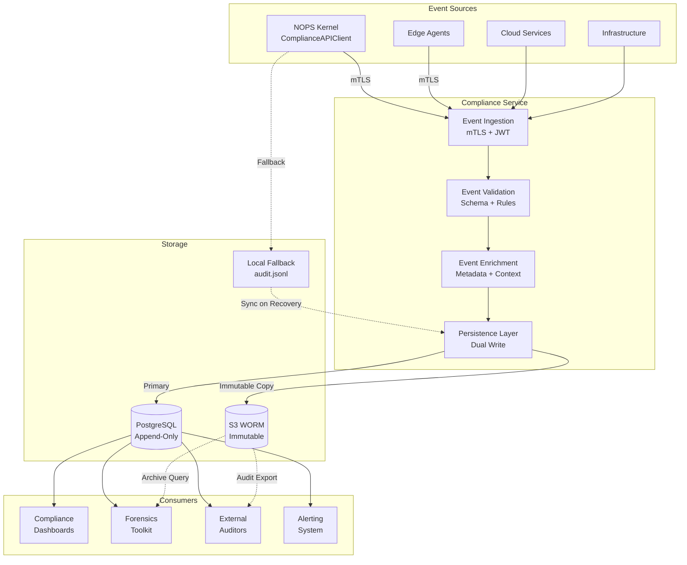

<!-- START doctoc generated TOC please keep comment here to allow auto update -->
<!-- DON'T EDIT THIS SECTION, INSTEAD RE-RUN doctoc TO UPDATE -->
Índice

  - [🎯 PROPÓSITO Y CONTEXTO](#-propósito-y-contexto)
- [📑 TABLA DE CONTENIDOS](#-tabla-de-contenidos)
  - [🏗️ ARQUITECTURA DEL COMPLIANCE SERVICE](#-arquitectura-del-compliance-service)
    - [**Principios Arquitectónicos Fundamentales**](#principios-arquitectónicos-fundamentales)
    - [**Componentes Core del Sistema**](#componentes-core-del-sistema)
    - [**Flujo de Audit Trail**](#flujo-de-audit-trail)
  - [🔐 SEC (SIGNED EXECUTION CONTRACT)](#-sec-signed-execution-contract)
    - [**1. Binary Signing Infrastructure**](#1-binary-signing-infrastructure)
    - [**2. Runtime Signature Verification**](#2-runtime-signature-verification)
    - [**3. SBOM Validation**](#3-sbom-validation)
    - [**4. Supply Chain Integrity**](#4-supply-chain-integrity)
  - [📊 AUDIT TRAIL INMUTABLE](#-audit-trail-inmutable)
    - [**1. Append-Only Storage**](#1-append-only-storage)
    - [**2. Event Persistence**](#2-event-persistence)
    - [**3. Forensics Support**](#3-forensics-support)
  - [🔧 APIS Y SDKS](#-apis-y-sdks)
    - [**Core API Endpoints**](#core-api-endpoints)
    - [**SDK Specifications**](#sdk-specifications)
  - [🔗 INTEGRACIÓN CON NOPS KERNEL](#-integración-con-nops-kernel)
    - [**Arquitectura de Integración**](#arquitectura-de-integración)
    - [**ComplianceAPIClient Implementation**](#complianceapiclient-implementation)
  - [🚀 DEPLOYMENT PATTERNS](#-deployment-patterns)
  - [🔒 REGULATORY COMPLIANCE](#-regulatory-compliance)
    - [**SOC2 Type II**](#soc2-type-ii)
    - [**GDPR**](#gdpr)
    - [**HIPAA**](#hipaa)
    - [**ISO27001**](#iso27001)
  - [📁 ESTRUCTURA DE DOCUMENTACIÓN](#-estructura-de-documentación)
  - [✅ VALIDACIÓN Y QUALITY GATES](#-validación-y-quality-gates)
  - [🎯 INSTRUCCIONES DE GENERACIÓN](#-instrucciones-de-generación)
  - [📋 METADATA DE CIERRE](#-metadata-de-cierre)

<!-- END doctoc generated TOC please keep comment here to allow auto update -->

---
prompt_id: "41-compliance-master-prompt"
prompt_type: "master_prompt"
service_name: "compliance-service"
dna_version: "3.0"
semver: "1.0.0"
date: "2025-10-08"
author: "@andaon"
domain: "Compliance & Audit Trail"
description: "Master prompt para generar documentación completa del Compliance Service con SEC validation"
estimated_pages: "120-150"
compliance_status: "DNA_v3_compliant"
dependencies: ["00-dna-proyecto-prompt.md", "07-nops-master-prompt.md", "18-security-master-prompt.md"]
generates:
 - "architecture/compliance/*"
 - "reference/compliance-api/*"
 - "implementation/compliance-deployment/*"
 - "sec-validation/*"
child_prompts: 15
validation_script: "validate-compliance-documentation.js"
release_status: "ready_for_sprint_s22"
feeds_to: ["07-nops-kernel", "18-security", "ROADMAP_SPRINTS_NOPS_KERNEL (S13.5)"]
priority: "P1 - CRÍTICO"
sprint: "S22-P4"
blocker_for: ["S13.5 SEC", "S14 Pre-GA Gate"]
---

## 🎯 PROPÓSITO Y CONTEXTO

**ROL:** Arquitecto Senior de Compliance & Security en ENIS v3.0 (Enterprise Neural Intelligence Systems)

**TAREA:** Generar documentación completa del Compliance Service, el servicio crítico para audit trails inmutables, SEC (Signed Execution Contract) validation y regulatory compliance, extraído del NOPS Kernel según el principio SLIM.

**OBJETIVO:** Producir 120-150 páginas de documentación técnica production-ready que cubra arquitectura, SEC validation engine, audit trail inmutable, APIs, deployment patterns, regulatory frameworks (SOC2, GDPR, HIPAA, ISO27001) y forensics.

**CONTEXTO CRÍTICO:** 
- El Compliance Service es **BLOCKER** para S13.5 (SEC) y S14 (Pre-GA Gate)
- Gestiona audit trails inmutables (nunca se puede perder un evento)
- Valida SEC (Signed Execution Contract) - firma criptográfica de binarios
- Cumple con múltiples regulaciones: SOC2, GDPR, HIPAA, ISO27001, PCI-DSS
- El NOPS Kernel usa `ComplianceAPIClient` con **fallback local obligatorio**

# 📑 TABLA DE CONTENIDOS

- 🏗️ Arquitectura del Compliance Service
- 🔐 SEC (Signed Execution Contract)
- 📊 Audit Trail Inmutable
- 🔧 APIs y SDKs
- 🔗 Integración con NOPS Kernel
- 🚀 Deployment Patterns
- 🔒 Regulatory Compliance
- 📁 Estructura de Documentación
- ✅ Validación y Quality Gates
- 🎯 Instrucciones de Generación

## 🏗️ ARQUITECTURA DEL COMPLIANCE SERVICE

### **Principios Arquitectónicos Fundamentales**

El Compliance Service de ENIS v3.0 se basa en cinco principios arquitectónicos clave:

- **Immutability First**: Todos los eventos de auditoría son inmutables (append-only)
- **Never Lose an Event**: Persistencia local + remota garantizada
- **SEC by Default**: Validación de firmas criptográficas obligatoria
- **Multi-Framework Compliance**: Soporte para múltiples regulaciones simultáneas
- **Forensics Ready**: Diseñado para investigaciones y auditorías externas

### **Componentes Core del Sistema**

```yaml
compliance_architecture:
  audit_trail_store:
    description: "Almacenamiento inmutable de eventos de auditoría"
    technology: "PostgreSQL (append-only) + AWS S3 (WORM)"
    features:
      - "Append-only tables (no DELETE, no UPDATE)"
      - "Hash-chain para detección de tampering"
      - "Geo-redundancia multi-región"
      - "Retention configurable (1-7 años)"
      - "Export para auditorías externas"
    
    storage_layers:
      hot_storage:
        technology: "PostgreSQL TimescaleDB"
        retention: "30 días"
        queryable: true
        
      warm_storage:
        technology: "AWS S3 Standard"
        retention: "1 año"
        queryable: "via Athena"
        
      cold_storage:
        technology: "AWS S3 Glacier"
        retention: "7 años"
        queryable: "via restore"
    
  sec_validation_engine:
    description: "Motor de validación de SEC (Signed Execution Contract)"
    technology: "Python + Cosign/Sigstore + HSM"
    features:
      - "Validación de firmas criptográficas"
      - "SBOM (Software Bill of Materials) verification"
      - "Provenance validation (SLSA framework)"
      - "Certificate chain verification"
      - "Revocation checking (CRL/OCSP)"
    
    signing_algorithms:
      primary: "ECDSA P-256 (NIST)"
      alternative: "RSA 4096 (legacy)"
      post_quantum: "Dilithium (NIST PQC - future)"
    
    sbom_formats:
      - "CycloneDX 1.5"
      - "SPDX 2.3"
    
  compliance_engine:
    description: "Motor de compliance regulatorio"
    technology: "Python + Policy Engine"
    frameworks:
      - "SOC2 Type II"
      - "GDPR"
      - "HIPAA"
      - "ISO27001"
      - "PCI-DSS (partial - coordina con billing-service)"
    
    capabilities:
      - "Automated compliance scanning"
      - "Policy enforcement"
      - "Violation detection"
      - "Remediation recommendations"
      - "Compliance reporting"
    
  forensics_toolkit:
    description: "Kit de herramientas para investigaciones"
    technology: "Python + ElasticSearch + Kibana"
    features:
      - "Timeline reconstruction"
      - "Anomaly detection con ML"
      - "Correlation analysis"
      - "Evidence export (chain of custody)"
      - "Query builder avanzado"
```

### **Flujo de Audit Trail**



---

## 🔐 SEC (SIGNED EXECUTION CONTRACT)

### **1. Binary Signing Infrastructure**

El Compliance Service implementa la infraestructura completa de firma criptográfica para SEC (Sprint S13.5).

```yaml
signing_infrastructure:
  key_management:
    technology: "AWS KMS / HashiCorp Vault + HSM"
    key_types:
      signing_key:
        algorithm: "ECDSA P-256"
        rotation: "90 días"
        storage: "HSM (Hardware Security Module)"
        backup: "Multi-region encrypted"
        
      verification_key:
        distribution: "Public key distribution via HTTPS"
        format: "PEM / JWK"
        
  signing_pipeline:
    trigger: "CI/CD build completion"
    artifacts:
      - "Binary executables (nops-kernel, edge-agents)"
      - "Container images (Docker/OCI)"
      - "Python packages (.whl)"
      - "Configuration files"
    
    process:
      1_hash_generation:
        algorithm: "SHA-256"
        includes: "Binary + dependencies + metadata"
        
      2_signature_creation:
        method: "ECDSA sign (private key from HSM)"
        format: "Detached signature (.sig file)"
        
      3_metadata_attachment:
        fields:
          - "timestamp (RFC3339)"
          - "build_id (CI/CD)"
          - "git_commit_sha"
          - "signer_identity"
          - "sbom_reference"
          
      4_publication:
        registry: "Signed Artifact Registry"
        access_control: "RBAC por environment"
```

#### **Ejemplo de Firma de Binario:**

```python
# compliance_service/sec/signer.py
import hashlib
import json
from datetime import datetime
from typing import Dict, Any
from cryptography.hazmat.primitives import hashes, serialization
from cryptography.hazmat.primitives.asymmetric import ec
from cryptography.hazmat.backends import default_backend
import boto3

class SECSigner:
    """
    SEC Signer para firma criptográfica de artefactos
    
    Componente crítico de S13.5 - Supply Chain Integrity
    """
    
    def __init__(self, kms_client: boto3.client, key_id: str):
        self.kms = kms_client
        self.key_id = key_id
        self.backend = default_backend()
        
    async def sign_artifact(
        self,
        artifact_path: str,
        metadata: Dict[str, Any]
    ) -> Dict[str, str]:
        """
        Firma un artefacto ejecutable con SEC
        
        Returns:
            {
                "artifact_hash": "sha256:...",
                "signature": "base64...",
                "signing_cert": "PEM...",
                "metadata": {...},
                "timestamp": "ISO8601"
            }
        """
        # 1. Generar hash del artefacto
        artifact_hash = await self._hash_artifact(artifact_path)
        
        # 2. Incluir dependencias en hash (bundle)
        bundle_hash = await self._hash_with_dependencies(
            artifact_path,
            include_sbom=True
        )
        
        # 3. Crear payload a firmar
        signing_payload = {
            "artifact_hash": artifact_hash,
            "bundle_hash": bundle_hash,
            "timestamp": datetime.utcnow().isoformat(),
            "metadata": metadata
        }
        
        payload_bytes = json.dumps(
            signing_payload,
            sort_keys=True
        ).encode('utf-8')
        
        # 4. Firmar con KMS/HSM
        response = await self.kms.sign(
            KeyId=self.key_id,
            Message=payload_bytes,
            MessageType='RAW',
            SigningAlgorithm='ECDSA_SHA_256'
        )
        
        signature = response['Signature']
        
        # 5. Obtener certificado de firma
        cert = await self._get_signing_certificate()
        
        # 6. Persistir en Compliance Store
        await self._persist_signature_record({
            "artifact_hash": artifact_hash,
            "signature": signature.hex(),
            "signing_cert": cert,
            "metadata": signing_payload,
            "kms_key_id": self.key_id
        })
        
        return {
            "artifact_hash": artifact_hash,
            "signature": signature.hex(),
            "signing_cert": cert,
            "metadata": signing_payload,
            "timestamp": signing_payload["timestamp"]
        }
    
    async def _hash_artifact(self, path: str) -> str:
        """Genera SHA-256 hash del artefacto"""
        sha256 = hashlib.sha256()
        
        with open(path, 'rb') as f:
            while chunk := f.read(8192):
                sha256.update(chunk)
        
        return f"sha256:{sha256.hexdigest()}"
    
    async def _hash_with_dependencies(
        self,
        path: str,
        include_sbom: bool = True
    ) -> str:
        """
        Hash del bundle completo (artefacto + dependencias)
        
        CRÍTICO para S13.5-P3: Supply Chain Integrity
        """
        hasher = hashlib.sha256()
        
        # Hash del artefacto principal
        with open(path, 'rb') as f:
            hasher.update(f.read())
        
        # Hash de dependencias (requirements.txt, package.json, etc.)
        deps = await self._get_dependencies(path)
        for dep in sorted(deps):
            hasher.update(dep.encode('utf-8'))
        
        # Hash del SBOM
        if include_sbom:
            sbom = await self._generate_sbom(path)
            hasher.update(sbom.encode('utf-8'))
        
        return f"bundle-sha256:{hasher.hexdigest()}"
```

---

### **2. Runtime Signature Verification**

```python
# compliance_service/sec/verifier.py
from typing import Dict, Any, Tuple
from cryptography.hazmat.primitives.asymmetric import ec
from cryptography.hazmat.primitives import hashes
from cryptography.x509 import load_pem_x509_certificate
import structlog

logger = structlog.get_logger()

class SECVerifier:
    """
    SEC Verifier para validación de firmas en runtime
    
    Componente crítico de S13.5-P2: Runtime Signature Verification
    Enforcement por tier: 🟤🟡🟢 = warning, 🔵🔴 = block
    """
    
    def __init__(
        self,
        trusted_certs: list,
        enforcement_mode: str = "strict"  # "strict" o "permissive"
    ):
        self.trusted_certs = trusted_certs
        self.enforcement_mode = enforcement_mode
        self.logger = logger.bind(component="sec_verifier")
        
    async def verify_artifact(
        self,
        artifact_path: str,
        signature_path: str,
        signing_cert_path: str,
        tier: str  # "🟤🟡🟢🔵🔴"
    ) -> Tuple[bool, Dict[str, Any]]:
        """
        Verifica firma SEC de un artefacto
        
        Args:
            artifact_path: Path al binario/contenedor
            signature_path: Path a la firma (.sig)
            signing_cert_path: Path al certificado de firma
            tier: Tier del deployment (enforcement policy)
            
        Returns:
            (valid: bool, details: dict)
        """
        validation_result = {
            "signature_valid": False,
            "cert_trusted": False,
            "cert_not_revoked": False,
            "sbom_verified": False,
            "provenance_valid": False,
            "overall_valid": False,
            "validation_timestamp": datetime.utcnow().isoformat(),
            "enforcement_action": None
        }
        
        try:
            # 1. Verificar firma criptográfica
            signature_valid = await self._verify_signature(
                artifact_path,
                signature_path,
                signing_cert_path
            )
            validation_result["signature_valid"] = signature_valid
            
            # 2. Verificar certificado está en lista de confianza
            cert_trusted = await self._verify_cert_trusted(
                signing_cert_path
            )
            validation_result["cert_trusted"] = cert_trusted
            
            # 3. Verificar certificado no está revocado (CRL/OCSP)
            cert_not_revoked = await self._check_revocation(
                signing_cert_path
            )
            validation_result["cert_not_revoked"] = cert_not_revoked
            
            # 4. Verificar SBOM (Software Bill of Materials)
            sbom_valid = await self._verify_sbom(artifact_path)
            validation_result["sbom_verified"] = sbom_valid
            
            # 5. Verificar provenance (SLSA framework)
            provenance_valid = await self._verify_provenance(
                artifact_path
            )
            validation_result["provenance_valid"] = provenance_valid
            
            # 6. Decisión final de validación
            overall_valid = all([
                signature_valid,
                cert_trusted,
                cert_not_revoked,
                sbom_valid,
                provenance_valid
            ])
            validation_result["overall_valid"] = overall_valid
            
            # 7. Enforcement policy por tier
            enforcement_action = self._determine_enforcement(
                overall_valid,
                tier
            )
            validation_result["enforcement_action"] = enforcement_action
            
            # 8. Log audit event
            await self._log_validation_event(validation_result, tier)
            
            return overall_valid, validation_result
            
        except Exception as e:
            self.logger.error(
                "sec_validation_failed",
                error=str(e),
                artifact=artifact_path
            )
            
            # En caso de error, enforcement por tier
            validation_result["error"] = str(e)
            validation_result["enforcement_action"] = self._determine_enforcement(
                False,
                tier
            )
            
            return False, validation_result
    
    def _determine_enforcement(
        self,
        valid: bool,
        tier: str
    ) -> str:
        """
        Determina acción de enforcement según tier
        
        Tiers básicos (🟤🟡🟢): WARNING only
        Tiers enterprise (🔵🔴): BLOCK execution
        """
        if valid:
            return "ALLOW"
        
        # Enforcement por tier según S13.5-P4
        tier_enforcement = {
            "🟤": "WARNING",  # Zero Agent
            "🟡": "WARNING",  # Shared Edge
            "🟢": "WARNING",  # Lite
            "🔵": "BLOCK",    # Enterprise
            "🔴": "BLOCK"     # Air-Gapped
        }
        
        action = tier_enforcement.get(tier, "BLOCK")
        
        self.logger.warning(
            "sec_enforcement",
            tier=tier,
            action=action,
            valid=valid
        )
        
        return action
    
    async def _verify_signature(
        self,
        artifact_path: str,
        signature_path: str,
        cert_path: str
    ) -> bool:
        """Verifica firma ECDSA del artefacto"""
        # Leer certificado
        with open(cert_path, 'rb') as f:
            cert = load_pem_x509_certificate(f.read(), default_backend())
        
        public_key = cert.public_key()
        
        # Leer firma
        with open(signature_path, 'rb') as f:
            signature = f.read()
        
        # Leer y hash el artefacto
        with open(artifact_path, 'rb') as f:
            artifact_data = f.read()
        
        # Verificar firma
        try:
            public_key.verify(
                signature,
                artifact_data,
                ec.ECDSA(hashes.SHA256())
            )
            return True
        except Exception as e:
            self.logger.error("signature_verification_failed", error=str(e))
            return False
    
    async def _verify_sbom(self, artifact_path: str) -> bool:
        """
        Verifica SBOM (Software Bill of Materials)
        
        Valida que:
        - SBOM existe y es válido (CycloneDX/SPDX)
        - Todas las dependencias están declaradas
        - No hay vulnerabilidades críticas conocidas
        - Licenses son compatibles
        """
        sbom_path = f"{artifact_path}.sbom.json"
        
        if not os.path.exists(sbom_path):
            self.logger.warning("sbom_not_found", artifact=artifact_path)
            return False
        
        try:
            with open(sbom_path, 'r') as f:
                sbom = json.load(f)
            
            # Validar formato SBOM
            if not self._validate_sbom_format(sbom):
                return False
            
            # Verificar componentes contra base de vulnerabilidades
            vulnerabilities = await self._check_vulnerabilities(sbom)
            
            if vulnerabilities["critical"] > 0:
                self.logger.error(
                    "critical_vulnerabilities_found",
                    count=vulnerabilities["critical"]
                )
                return False
            
            # Verificar licenses compatibles
            if not await self._check_licenses(sbom):
                self.logger.warning("incompatible_licenses_found")
                return False
            
            return True
            
        except Exception as e:
            self.logger.error("sbom_validation_failed", error=str(e))
            return False
```

---

### **3. SBOM Validation**

```yaml
sbom_validation:
  formatos_soportados:
    cyclonedx:
      version: "1.5"
      schema: "https://cyclonedx.org/schema/bom-1.5.schema.json"
      
    spdx:
      version: "2.3"
      schema: "https://spdx.org/schema/2.3"
      
  validaciones:
    estructura:
      - "Formato JSON/XML válido"
      - "Schema compliance"
      - "Campos obligatorios presentes"
      
    componentes:
      - "Todas las dependencias listadas"
      - "Versiones exactas especificadas"
      - "Hashes de componentes incluidos"
      - "Licenses declaradas"
      
    seguridad:
      - "Scan contra NVD (National Vulnerability Database)"
      - "Scan contra GitHub Security Advisories"
      - "Scan contra Snyk vulnerability DB"
      - "Severity assessment (Critical, High, Medium, Low)"
      
    licenses:
      - "Compatibilidad con license project"
      - "No copyleft restrictions violadas"
      - "Attribution requirements identificados"
```

---

### **4. Supply Chain Integrity**

```python
# compliance_service/sec/supply_chain.py
from typing import Dict, List, Any
import httpx
import structlog

logger = structlog.get_logger()

class SupplyChainValidator:
    """
    Validador de integridad de supply chain (S13.5-P3)
    
    Verifica:
    - Provenance (origen del build)
    - Build reproducibility
    - Dependencies integrity
    - No tampering en supply chain
    """
    
    def __init__(self, config: 'SupplyChainConfig'):
        self.config = config
        self.logger = logger.bind(component="supply_chain")
        
    async def validate_provenance(
        self,
        artifact_hash: str,
        build_metadata: Dict[str, Any]
    ) -> bool:
        """
        Valida provenance usando SLSA framework
        
        SLSA Levels:
        - SLSA 1: Build provenance exists
        - SLSA 2: Signed provenance
        - SLSA 3: Hardened build platform
        - SLSA 4: Two-party review
        
        Target: SLSA 3 para Enterprise tier (🔵🔴)
        """
        try:
            # 1. Verificar que build provenance existe
            provenance = await self._fetch_provenance(artifact_hash)
            
            if not provenance:
                self.logger.error(
                    "provenance_not_found",
                    artifact_hash=artifact_hash
                )
                return False
            
            # 2. Verificar firma de provenance
            provenance_signed = await self._verify_provenance_signature(
                provenance
            )
            
            if not provenance_signed:
                self.logger.error("provenance_not_signed")
                return False
            
            # 3. Verificar build platform (GitHub Actions, GitLab CI, etc.)
            build_platform_trusted = await self._verify_build_platform(
                provenance["builder"]
            )
            
            if not build_platform_trusted:
                self.logger.warning("untrusted_build_platform")
                # Continuar pero log warning
            
            # 4. Verificar source repository
            source_repo_valid = await self._verify_source_repository(
                provenance["materials"]
            )
            
            # 5. Verificar build es reproducible
            reproducible = await self._check_reproducibility(
                provenance,
                build_metadata
            )
            
            # SLSA Level calculation
            slsa_level = self._calculate_slsa_level({
                "provenance_exists": True,
                "provenance_signed": provenance_signed,
                "build_platform_hardened": build_platform_trusted,
                "two_party_review": build_metadata.get("reviewed", False)
            })
            
            self.logger.info(
                "provenance_validated",
                slsa_level=slsa_level,
                artifact_hash=artifact_hash
            )
            
            # Para Enterprise tiers, requiere SLSA 3+
            tier = build_metadata.get("tier", "🟢")
            if tier in ["🔵", "🔴"]:
                return slsa_level >= 3
            
            return slsa_level >= 2
            
        except Exception as e:
            self.logger.error(
                "provenance_validation_failed",
                error=str(e)
            )
            return False
    
    def _calculate_slsa_level(self, checks: Dict[str, bool]) -> int:
        """Calcula SLSA level según checks completados"""
        if checks["two_party_review"]:
            return 4
        elif checks["build_platform_hardened"]:
            return 3
        elif checks["provenance_signed"]:
            return 2
        elif checks["provenance_exists"]:
            return 1
        else:
            return 0
```

---

## 📊 AUDIT TRAIL INMUTABLE

### **1. Append-Only Storage**

```yaml
append_only_architecture:
  postgresql:
    tables:
      audit_events:
        partitioning: "Por fecha (monthly partitions)"
        indexes:
          - "tenant_id, timestamp DESC"
          - "event_type, timestamp DESC"
          - "severity, timestamp DESC"
        constraints:
          - "NO DELETE trigger (raises exception)"
          - "NO UPDATE trigger (raises exception)"
          - "INSERT only permitido"
        
      audit_events_hash_chain:
        purpose: "Detección de tampering"
        columns:
          - "event_id (UUID)"
          - "event_hash (SHA-256)"
          - "previous_hash (SHA-256)"
          - "chain_index (BIGINT)"
        validation: "Merkle tree validation daily"
        
  s3_immutable:
    bucket_policy: "Object Lock enabled (Governance mode)"
    versioning: "Enabled"
    lifecycle:
      - "Standard: 90 días"
      - "Standard-IA: 1 año"
      - "Glacier: 7 años"
    replication: "Cross-region (3 regiones mínimo)"
    
  hash_chain:
    algorithm: "SHA-256"
    genesis_block: "Service initialization"
    validation_frequency: "Daily (automated)"
    integrity_proof: "Exportable para auditorías"
```

#### **Implementación de Hash Chain:**

```python
# compliance_service/audit/hash_chain.py
import hashlib
import json
from typing import Dict, Any, Optional
from sqlalchemy import select
from sqlalchemy.ext.asyncio import AsyncSession

class AuditHashChain:
    """
    Hash chain para audit trail (detección de tampering)
    
    Inspirado en blockchain pero optimizado para compliance
    """
    
    def __init__(self, db_session: AsyncSession):
        self.session = db_session
        
    async def append_event(
        self,
        event: Dict[str, Any],
        previous_hash: Optional[str] = None
    ) -> str:
        """
        Agrega evento a hash chain
        
        Returns:
            event_hash (para el siguiente evento)
        """
        # 1. Obtener hash anterior si no se provee
        if previous_hash is None:
            previous_hash = await self._get_latest_hash()
        
        # 2. Generar hash del evento actual
        event_data = json.dumps(event, sort_keys=True)
        
        hasher = hashlib.sha256()
        hasher.update(previous_hash.encode('utf-8'))
        hasher.update(event_data.encode('utf-8'))
        event_hash = hasher.hexdigest()
        
        # 3. Obtener chain index
        chain_index = await self._get_next_chain_index()
        
        # 4. Persistir en tabla hash_chain
        await self.session.execute(
            """
            INSERT INTO audit_events_hash_chain 
            (event_id, event_hash, previous_hash, chain_index, created_at)
            VALUES (:event_id, :event_hash, :previous_hash, :chain_index, NOW())
            """,
            {
                "event_id": event["event_id"],
                "event_hash": event_hash,
                "previous_hash": previous_hash,
                "chain_index": chain_index
            }
        )
        
        await self.session.commit()
        
        return event_hash
    
    async def validate_chain_integrity(
        self,
        start_index: int = 0,
        end_index: Optional[int] = None
    ) -> Dict[str, Any]:
        """
        Valida integridad de hash chain (detección de tampering)
        
        Returns:
            {
                "valid": bool,
                "validated_events": int,
                "first_invalid_index": Optional[int],
                "tampering_detected": bool
            }
        """
        result = await self.session.execute(
            """
            SELECT event_id, event_hash, previous_hash, chain_index
            FROM audit_events_hash_chain
            WHERE chain_index >= :start
            ORDER BY chain_index ASC
            """,
            {"start": start_index}
        )
        
        events = result.fetchall()
        
        validated = 0
        prev_hash = None
        
        for event in events:
            # Verificar que hash actual apunta correctamente al anterior
            if prev_hash is not None:
                if event["previous_hash"] != prev_hash:
                    return {
                        "valid": False,
                        "validated_events": validated,
                        "first_invalid_index": event["chain_index"],
                        "tampering_detected": True
                    }
            
            prev_hash = event["event_hash"]
            validated += 1
        
        return {
            "valid": True,
            "validated_events": validated,
            "first_invalid_index": None,
            "tampering_detected": False
        }
```

---

### **2. Event Persistence**

```python
# compliance_service/audit/persistence.py
import aiofiles
import json
from pathlib import Path
from typing import Dict, Any
import boto3
from datetime import datetime

class AuditPersistence:
    """
    Sistema de persistencia dual para audit events
    
    Garantiza que NUNCA se pierde un evento:
    1. PostgreSQL (primary, queryable)
    2. S3 (immutable, long-term)
    3. Local fallback (NOPS Kernel ComplianceAPIClient)
    """
    
    def __init__(
        self,
        db_session,
        s3_client: boto3.client,
        bucket_name: str
    ):
        self.session = db_session
        self.s3 = s3_client
        self.bucket = bucket_name
        
    async def persist_event(
        self,
        event: Dict[str, Any],
        hash_chain_enabled: bool = True
    ) -> str:
        """
        Persiste evento en dual storage
        
        Returns:
            event_id (UUID)
        """
        event_id = event.get("event_id") or str(uuid.uuid4())
        event["event_id"] = event_id
        
        try:
            # 1. Persistir en PostgreSQL (primary)
            await self._persist_to_postgres(event)
            
            # 2. Agregar a hash chain (tampering detection)
            if hash_chain_enabled:
                hash_chain = AuditHashChain(self.session)
                event_hash = await hash_chain.append_event(event)
                event["event_hash"] = event_hash
            
            # 3. Persistir en S3 (immutable)
            await self._persist_to_s3(event)
            
            return event_id
            
        except Exception as e:
            logger.error(
                "audit_persistence_failed",
                event_id=event_id,
                error=str(e)
            )
            raise
    
    async def _persist_to_postgres(self, event: Dict[str, Any]):
        """Persistir en PostgreSQL (append-only)"""
        await self.session.execute(
            """
            INSERT INTO audit_events 
            (event_id, event_type, tenant_id, timestamp, severity, details, created_at)
            VALUES 
            (:event_id, :event_type, :tenant_id, :timestamp, :severity, :details, NOW())
            """,
            {
                "event_id": event["event_id"],
                "event_type": event["event_type"],
                "tenant_id": event["tenant_id"],
                "timestamp": event["timestamp"],
                "severity": event["severity"],
                "details": json.dumps(event["details"])
            }
        )
        await self.session.commit()
    
    async def _persist_to_s3(self, event: Dict[str, Any]):
        """Persistir en S3 (immutable storage)"""
        # Organizar por tenant/año/mes/día para eficiencia
        timestamp = datetime.fromisoformat(event["timestamp"])
        s3_key = (
            f"audit-trail/"
            f"{event['tenant_id']}/"
            f"year={timestamp.year}/"
            f"month={timestamp.month:02d}/"
            f"day={timestamp.day:02d}/"
            f"{event['event_id']}.json"
        )
        
        await self.s3.put_object(
            Bucket=self.bucket,
            Key=s3_key,
            Body=json.dumps(event, indent=2),
            ContentType='application/json',
            Metadata={
                'event_type': event['event_type'],
                'severity': event['severity'],
                'tenant_id': event['tenant_id']
            },
            ObjectLockMode='GOVERNANCE',  # WORM protection
            ObjectLockRetainUntilDate=timestamp + timedelta(days=2555)  # 7 años
        )
```

---

### **3. Forensics Support**

```python
# compliance_service/forensics/investigator.py
from typing import Dict, List, Any, Optional
from datetime import datetime, timedelta
import pandas as pd
from sklearn.ensemble import IsolationForest

class ForensicsInvestigator:
    """
    Toolkit de investigación forense
    
    Soporta:
    - Timeline reconstruction
    - Anomaly detection
    - Correlation analysis
    - Evidence export (chain of custody)
    """
    
    def __init__(self, db_session, s3_client):
        self.session = db_session
        self.s3 = s3_client
        
    async def reconstruct_timeline(
        self,
        tenant_id: str,
        start_time: datetime,
        end_time: datetime,
        event_types: Optional[List[str]] = None
    ) -> List[Dict[str, Any]]:
        """
        Reconstruye timeline de eventos para investigación
        
        Returns:
            Lista ordenada cronológicamente de eventos con contexto
        """
        query = """
            SELECT 
                event_id,
                event_type,
                timestamp,
                severity,
                details,
                event_hash,
                previous_hash
            FROM audit_events ae
            JOIN audit_events_hash_chain hc USING (event_id)
            WHERE tenant_id = :tenant_id
              AND timestamp BETWEEN :start AND :end
        """
        
        if event_types:
            query += " AND event_type = ANY(:event_types)"
        
        query += " ORDER BY timestamp ASC"
        
        result = await self.session.execute(
            query,
            {
                "tenant_id": tenant_id,
                "start": start_time,
                "end": end_time,
                "event_types": event_types
            }
        )
        
        events = result.fetchall()
        
        # Enriquecer con contexto
        timeline = []
        for event in events:
            enriched = await self._enrich_event_context(event)
            timeline.append(enriched)
        
        return timeline
    
    async def detect_anomalies(
        self,
        tenant_id: str,
        lookback_days: int = 30
    ) -> List[Dict[str, Any]]:
        """
        Detecta anomalías en audit trail usando ML
        
        Usa Isolation Forest para detectar:
        - Patrones inusuales de acceso
        - Spikes de eventos
        - Comportamiento fuera de baseline
        """
        # 1. Obtener eventos históricos
        end_time = datetime.utcnow()
        start_time = end_time - timedelta(days=lookback_days)
        
        result = await self.session.execute(
            """
            SELECT 
                event_type,
                severity,
                EXTRACT(HOUR FROM timestamp) as hour_of_day,
                EXTRACT(DOW FROM timestamp) as day_of_week,
                COUNT(*) as event_count
            FROM audit_events
            WHERE tenant_id = :tenant_id
              AND timestamp BETWEEN :start AND :end
            GROUP BY event_type, severity, hour_of_day, day_of_week
            """,
            {
                "tenant_id": tenant_id,
                "start": start_time,
                "end": end_time
            }
        )
        
        data = result.fetchall()
        
        if not data:
            return []
        
        # 2. Preparar features para ML
        df = pd.DataFrame(data)
        features = df[['hour_of_day', 'day_of_week', 'event_count']]
        
        # 3. Entrenar Isolation Forest
        iso_forest = IsolationForest(
            contamination=0.05,  # 5% de eventos esperados como anomalías
            random_state=42
        )
        predictions = iso_forest.fit_predict(features)
        
        # 4. Identificar anomalías (prediction = -1)
        anomalies = []
        for idx, pred in enumerate(predictions):
            if pred == -1:
                anomaly = {
                    "event_type": data[idx]["event_type"],
                    "severity": data[idx]["severity"],
                    "hour_of_day": data[idx]["hour_of_day"],
                    "day_of_week": data[idx]["day_of_week"],
                    "event_count": data[idx]["event_count"],
                    "anomaly_score": iso_forest.score_samples([features.iloc[idx]])[0]
                }
                anomalies.append(anomaly)
        
        return anomalies
    
    async def export_evidence(
        self,
        case_id: str,
        tenant_id: str,
        event_ids: List[str],
        format: str = "json"  # json, csv, pdf
    ) -> str:
        """
        Export de evidencias con chain of custody
        
        Para auditorías externas y cumplimiento regulatorio
        """
        # 1. Obtener eventos
        events = await self._fetch_events(event_ids)
        
        # 2. Validar hash chain integrity
        integrity_check = await self._validate_evidence_integrity(events)
        
        # 3. Generar package de evidencias
        evidence_package = {
            "case_id": case_id,
            "tenant_id": tenant_id,
            "export_timestamp": datetime.utcnow().isoformat(),
            "events_count": len(events),
            "events": events,
            "integrity_validation": integrity_check,
            "chain_of_custody": {
                "exported_by": "compliance-service",
                "export_reason": f"case_{case_id}",
                "export_hash": None  # Calculated below
            }
        }
        
        # 4. Hash del package completo
        package_json = json.dumps(evidence_package, sort_keys=True)
        package_hash = hashlib.sha256(package_json.encode()).hexdigest()
        evidence_package["chain_of_custody"]["export_hash"] = package_hash
        
        # 5. Firmar el package
        signed_package = await self._sign_evidence_package(evidence_package)
        
        # 6. Persistir en S3 con Object Lock
        evidence_path = await self._store_evidence_package(
            case_id,
            signed_package,
            format
        )
        
        return evidence_path
```

---

## 🔧 APIS Y SDKS

### **Core API Endpoints**

#### **POST /api/v1/audit - Audit Event Ingestion**

```yaml
endpoint: "POST /api/v1/audit"
authentication: "mTLS + JWT s2s (NOPS Kernel only)"
authorization: "Service-to-service scope"
rate_limit: "10,000 req/min por tenant"

request:
  headers:
    Content-Type: "application/json"
    Authorization: "Bearer <jwt_token>"
    X-Tenant-ID: "<tenant_id>"
    X-Request-ID: "<uuid>"
    
  body:
    event_type: "string (required)"
    tenant_id: "string (required)"
    timestamp: "ISO8601 (required)"
    severity: "DEBUG|INFO|WARNING|ERROR|CRITICAL"
    details: "object (required)"
    correlation_id: "string (optional)"
    source: "string (optional - service name)"

response:
  success_201:
    status: 201
    body:
      event_id: "uuid"
      stored: true
      hash: "sha256:..."
      chain_index: "int"
      
  error_400:
    status: 400
    body:
      error: "validation_failed"
      details: "object"
      
  error_503:
    status: 503
    body:
      error: "service_unavailable"
      message: "Use local fallback persistence"

garantias:
  durability: "NUNCA se pierde un evento (dual storage)"
  immutability: "Append-only (no updates, no deletes)"
  ordering: "Timestamp ordering preservado"
  integrity: "Hash chain validation"
```

#### **Ejemplo de Uso desde NOPS Kernel:**

```python
# NOPS Kernel - Enviando evento de auditoría
from nops_kernel.clients.compliance_client import ComplianceAPIClient

compliance = ComplianceAPIClient(
    service_url="https://compliance.enis.cloud/",
    mtls_cert="/etc/nops/certs/client.crt",
    mtls_key="/etc/nops/certs/client.key",
    local_audit_file="/var/log/nops/audit.jsonl"
)

# Log evento crítico
await compliance.log_audit_event(
    event_type="agent_execution_started",
    tenant_id="tenant-xyz",
    details={
        "agent_id": "agent-123",
        "agent_type": "🔵 Enterprise",
        "execution_id": "exec-456",
        "triggered_by": "user-789",
        "input_size_bytes": 1024
    },
    severity="INFO"
)

# En caso de violación de seguridad
await compliance.log_audit_event(
    event_type="security_violation_detected",
    tenant_id="tenant-xyz",
    details={
        "violation_type": "unauthorized_access_attempt",
        "source_ip": "192.168.1.100",
        "target_resource": "/api/v1/admin/users",
        "blocked": True
    },
    severity="CRITICAL"
)
```

---

#### **POST /api/v1/sec/validate - SEC Validation**

```yaml
endpoint: "POST /api/v1/sec/validate"
authentication: "mTLS + JWT s2s"
authorization: "sec:validate scope"
rate_limit: "1,000 req/min"

request:
  body:
    artifact_hash: "string (SHA-256)"
    signature: "string (base64)"
    signing_cert: "string (PEM)"
    sbom: "object (CycloneDX/SPDX)"
    tier: "string (🟤🟡🟢🔵🔴)"

response:
  success_200:
    body:
      valid: boolean
      validation_details:
        signature_valid: boolean
        cert_trusted: boolean
        cert_not_revoked: boolean
        sbom_verified: boolean
        provenance_valid: boolean
        slsa_level: int (0-4)
      enforcement_action: "ALLOW|WARNING|BLOCK"
      validation_timestamp: "ISO8601"
      
enforcement_by_tier:
  🟤_zero: "WARNING (log only)"
  🟡_shared: "WARNING (log only)"
  🟢_lite: "WARNING (log only)"
  🔵_enterprise: "BLOCK (reject execution)"
  🔴_airgapped: "BLOCK (reject execution)"
```

#### **Ejemplo de Validación SEC:**

```python
# Validar artefacto antes de ejecución
from compliance_service.sec.verifier import SECVerifier

verifier = SECVerifier(
    trusted_certs=["/etc/compliance/trusted-certs/"],
    enforcement_mode="strict"
)

# En NOPS Kernel startup
artifact_path = "/usr/local/bin/nops-kernel"
signature_path = "/usr/local/bin/nops-kernel.sig"
cert_path = "/usr/local/bin/nops-kernel.crt"

valid, details = await verifier.verify_artifact(
    artifact_path=artifact_path,
    signature_path=signature_path,
    signing_cert_path=cert_path,
    tier="🔵"  # Enterprise tier
)

if not valid:
    if details["enforcement_action"] == "BLOCK":
        logger.critical(
            "sec_validation_failed_blocking_execution",
            details=details
        )
        raise SecurityError("SEC validation failed - execution blocked")
    else:
        logger.warning(
            "sec_validation_failed_continuing",
            details=details
        )
        # Continuar con warning logged
```

---

### **SDK Specifications**

#### **Python SDK**

```python
# compliance_sdk/python/compliance_client.py
from typing import Dict, Any, Optional
import httpx
import aiofiles
import json

class ComplianceClient:
    """
    SDK Python para Compliance Service
    
    Features:
    - Audit event logging
    - SEC validation
    - Local fallback persistence
    - Async/await native
    """
    
    def __init__(
        self,
        base_url: str,
        mtls_cert: str,
        mtls_key: str,
        local_audit_file: str = "/var/log/app/audit.jsonl",
        timeout: int = 10
    ):
        self.client = httpx.AsyncClient(
            base_url=base_url,
            cert=(mtls_cert, mtls_key),
            verify=True,
            timeout=timeout
        )
        self.local_audit_file = local_audit_file
        
    async def log_event(
        self,
        event_type: str,
        tenant_id: str,
        details: Dict[str, Any],
        severity: str = "INFO"
    ) -> Dict[str, Any]:
        """
        Log audit event con fallback local
        
        Garantiza que el evento NUNCA se pierde
        """
        event = {
            "event_type": event_type,
            "tenant_id": tenant_id,
            "timestamp": datetime.utcnow().isoformat(),
            "severity": severity,
            "details": details
        }
        
        # SIEMPRE persistir localmente primero
        await self._persist_local(event)
        
        # Intentar enviar a servicio remoto
        try:
            response = await self.client.post(
                "/api/v1/audit",
                json=event,
                headers={"X-Tenant-ID": tenant_id}
            )
            response.raise_for_status()
            
            result = response.json()
            result["local_persisted"] = True
            return result
            
        except (httpx.HTTPError, httpx.TimeoutException) as e:
            # Degraded mode: local persistence ya completada
            return {
                "event_id": None,
                "stored": False,
                "local_persisted": True,
                "error": str(e),
                "degraded_mode": True
            }
    
    async def validate_sec(
        self,
        artifact_hash: str,
        signature: str,
        signing_cert: str,
        tier: str
    ) -> Dict[str, Any]:
        """Validar SEC de artefacto"""
        response = await self.client.post(
            "/api/v1/sec/validate",
            json={
                "artifact_hash": artifact_hash,
                "signature": signature,
                "signing_cert": signing_cert,
                "tier": tier
            }
        )
        response.raise_for_status()
        return response.json()
    
    async def _persist_local(self, event: Dict[str, Any]):
        """Persistencia local inmutable (append-only)"""
        async with aiofiles.open(self.local_audit_file, mode='a') as f:
            await f.write(json.dumps(event) + "\n")
```

---

## 🔗 INTEGRACIÓN CON NOPS KERNEL

### **Arquitectura de Integración**

```yaml
nops_kernel_integration:
  principio_slim:
    concepto: "NOPS Kernel usa ComplianceAPIClient ligero"
    codigo_kernel: "< 200 líneas"
    dependencias: "httpx, aiofiles (ligeras)"
    
  comunicacion:
    protocolo: "HTTPS con mTLS"
    autenticacion: "mTLS client certificates"
    autorizacion: "JWT s2s con scope compliance:write"
    timeout: "10s (más largo que otros servicios - crítico)"
    
  degraded_mode:
    trigger: "Compliance service no disponible"
    accion: "Persistir localmente en /var/log/nops/audit.jsonl"
    sync: "Background task sincroniza cuando servicio vuelve"
    garantia: "NUNCA se pierde un evento"
    
  endpoints_usados:
    - "POST /api/v1/audit (audit events)"
    - "POST /api/v1/sec/validate (SEC validation)"
    - "GET /api/v1/health (health check)"
```

### **ComplianceAPIClient Implementation**

Referencia: Ver líneas 549-646 en `07-nops-master-prompt.md`

---

## 🚀 DEPLOYMENT PATTERNS

### **Kubernetes Deployment**

```yaml
# kubernetes/compliance-service/deployment.yaml
apiVersion: apps/v1
kind: Deployment
metadata:
  name: compliance-service
  namespace: enis-cloud-core
  labels:
    app: compliance-service
    tier: platform
    criticality: P1
spec:
  replicas: 3  # HA con geo-distribution
  strategy:
    type: RollingUpdate
    rollingUpdate:
      maxSurge: 1
      maxUnavailable: 0  # Zero downtime
      
  template:
    metadata:
      labels:
        app: compliance-service
        version: "1.0.0"
    spec:
      affinity:
        podAntiAffinity:
          requiredDuringSchedulingIgnoredDuringExecution:
            - labelSelector:
                matchExpressions:
                  - key: app
                    operator: In
                    values:
                      - compliance-service
              topologyKey: kubernetes.io/hostname
              
      containers:
        - name: compliance-service
          image: enis/compliance-service:1.0.0
          ports:
            - containerPort: 8000
              name: http
              protocol: TCP
          
          env:
            - name: DATABASE_URL
              valueFrom:
                secretKeyRef:
                  name: compliance-db-credentials
                  key: url
                  
            - name: S3_BUCKET
              value: "enis-compliance-audit-trail"
              
            - name: KMS_KEY_ID
              valueFrom:
                secretKeyRef:
                  name: sec-signing-key
                  key: kms_key_id
          
          resources:
            requests:
              cpu: "1000m"
              memory: "2Gi"
            limits:
              cpu: "2000m"
              memory: "4Gi"
          
          livenessProbe:
            httpGet:
              path: /health
              port: 8000
            initialDelaySeconds: 30
            periodSeconds: 10
            
          readinessProbe:
            httpGet:
              path: /ready
              port: 8000
            initialDelaySeconds: 5
            periodSeconds: 5
          
          volumeMounts:
            - name: trusted-certs
              mountPath: /etc/compliance/trusted-certs
              readOnly: true
      
      volumes:
        - name: trusted-certs
          secret:
            secretName: sec-trusted-certificates
```

---

## 🔒 REGULATORY COMPLIANCE

### **SOC2 Type II**

```yaml
soc2_compliance:
  trust_service_criteria:
    CC6_1_logical_access:
      control: "Audit de todos los accesos lógicos"
      implementation:
        - "Logging de autenticación/autorización"
        - "Audit trail de cambios en permisos"
        - "Review periódico de access logs"
        
    CC7_2_system_monitoring:
      control: "Monitoreo continuo del sistema"
      implementation:
        - "Alertas en tiempo real"
        - "Dashboards de compliance"
        - "Anomaly detection automatizado"
        
    CC7_3_incident_response:
      control: "Respuesta a incidentes documentada"
      implementation:
        - "Playbooks automatizados"
        - "Forensics toolkit integrado"
        - "Timeline reconstruction"
  
  evidence_collection:
    automated:
      - "Audit logs (continuous)"
      - "Access reviews (monthly)"
      - "Vulnerability scans (weekly)"
      - "Penetration tests (quarterly)"
    
    manual:
      - "Policy reviews (annual)"
      - "Risk assessments (semi-annual)"
      - "Training completion (annual)"
```

### **GDPR**

```yaml
gdpr_compliance:
  data_subject_rights:
    right_to_access:
      endpoint: "GET /api/v1/audit/subject/{subject_id}"
      response_time: "< 30 días"
      format: "JSON / PDF"
      
    right_to_erasure:
      note: "Audit logs EXEMPT (legal obligation to retain)"
      retention: "Minimum 1 año, maximum 7 años"
      
    right_to_portability:
      endpoint: "GET /api/v1/audit/export/{tenant_id}"
      format: "JSON structured"
      
  data_protection:
    encryption_at_rest: "AES-256-GCM"
    encryption_in_transit: "TLS 1.3"
    pseudonymization: "User IDs hashed in logs"
    
  breach_notification:
    detection: "Automated anomaly detection"
    notification_time: "< 72 horas"
    authorities: "Automated reporting"
```

### **HIPAA**

```yaml
hipaa_compliance:
  applicable_for:
    - "Blue Agent (🔵 Health)"
    - "Tenants en healthcare vertical"
    
  safeguards:
    administrative:
      - "Security management process"
      - "Workforce security controls"
      - "Audit controls (este servicio)"
      
    physical:
      - "Facility access controls"
      - "Workstation security"
      
    technical:
      - "Access control (RBAC)"
      - "Audit controls (audit trail)"
      - "Integrity controls (hash chain)"
      - "Transmission security (mTLS)"
      
  phi_handling:
    storage: "Encrypted at rest (AES-256)"
    transmission: "Encrypted in transit (TLS 1.3)"
    access: "Role-based + audit logged"
    retention: "6 años minimum"
```

### **ISO27001**

```yaml
iso27001_compliance:
  controls_implemented:
    A_12_4_logging_monitoring:
      description: "Logging and monitoring"
      compliance_service_role: "Core implementation"
      evidence: "Continuous audit trail"
      
    A_16_1_incident_management:
      description: "Management of information security incidents"
      compliance_service_role: "Forensics support"
      evidence: "Timeline reconstruction + correlation"
      
    A_18_1_compliance_legal:
      description: "Compliance with legal requirements"
      compliance_service_role: "Regulatory reporting"
      evidence: "SOC2, GDPR, HIPAA reports"
```

---

## 📁 ESTRUCTURA DE DOCUMENTACIÓN

### Arquitectura de Documentación a Generar

```yaml
documentation_structure:
  compliance_service/:
    - "README.md"
    - "02-architecture-master-prompt.md"
    - "18-security-master-prompt.md"
    - "19-performance-master-prompt.md"
    - "41-compliance-master-prompt.md (este archivo)"
    - "ROADMAP_COMPLIANCE_SERVICE.md"
    
  docs/compliance/:
    api/:
      - "01-audit-trail-api.md"
      - "02-sec-validation-api.md"
      - "03-compliance-reporting-api.md"
      - "04-forensics-api.md"
      
    sec/:
      - "01-signing-infrastructure.md"
      - "02-verification-process.md"
      - "03-sbom-validation.md"
      - "04-provenance-slsa.md"
      
    regulatory/:
      - "01-soc2-compliance.md"
      - "02-gdpr-compliance.md"
      - "03-hipaa-compliance.md"
      - "04-iso27001-compliance.md"
      
    deployment/:
      - "01-kubernetes-deployment.md"
      - "02-database-setup.md"
      - "03-s3-configuration.md"
      - "04-kms-hsm-setup.md"
```

---

## ✅ VALIDACIÓN Y QUALITY GATES

### Criterios de Validación

```yaml
validation_criteria:
  sec_validation:
    - "Signing infrastructure operacional"
    - "Verification en runtime funcional"
    - "SBOM validation implementada"
    - "Provenance tracking activo"
    
  audit_trail:
    - "Append-only garantizado (triggers activos)"
    - "Hash chain integrity validated"
    - "Dual storage (PG + S3) funcional"
    - "Local fallback testeado"
    
  regulatory:
    - "SOC2 Type II controles implementados"
    - "GDPR data subject rights soportados"
    - "HIPAA safeguards aplicados"
    - "ISO27001 controles validados"
    
  performance:
    - "Ingestion latency < 50ms p95"
    - "SEC validation < 100ms p95"
    - "Query latency < 500ms p95"
    - "Throughput > 5K events/s"
```

### Quality Gates

```yaml
quality_gates:
  pre_deploy:
    - "All unit tests passing (> 90% coverage)"
    - "Integration tests passing"
    - "SEC validation E2E test passing"
    - "Audit trail integrity test passing"
    - "Security scan clean (no critical vulnerabilities)"
    
  deploy:
    - "Blue-green deployment"
    - "Canary release (10% → 50% → 100%)"
    - "Rollback plan validated"
    
  post_deploy:
    - "Zero events lost (dual storage check)"
    - "SEC validation working (smoke test)"
    - "Dashboards operational"
    - "Alerts firing correctly"
```

---

## 🎯 INSTRUCCIONES DE GENERACIÓN

### Proceso de Generación Paso a Paso

1. **Scaffold Service**
   - FastAPI base application
   - Database models (SQLAlchemy)
   - S3 client configuration
   - KMS/HSM integration

2. **Implement Core APIs**
   - POST /api/v1/audit
   - POST /api/v1/sec/validate
   - GET /api/v1/compliance/report
   - GET /api/v1/forensics/investigate

3. **SEC Validation Engine**
   - Signer implementation
   - Verifier implementation
   - SBOM parser (CycloneDX + SPDX)
   - Provenance validator (SLSA)

4. **Audit Trail Storage**
   - PostgreSQL append-only tables
   - S3 WORM bucket configuration
   - Hash chain implementation
   - Geo-replication setup

5. **Compliance Engine**
   - Policy definitions (SOC2, GDPR, HIPAA, ISO27001)
   - Automated compliance scanning
   - Violation detection
   - Reporting generation

6. **Forensics Toolkit**
   - Timeline reconstruction
   - Anomaly detection (ML)
   - Evidence export
   - Chain of custody

7. **Testing & Validation**
   - Unit tests (> 90% coverage)
   - Integration tests con NOPS Kernel
   - SEC E2E tests
   - Compliance audit simulation

8. **Deployment**
   - Kubernetes manifests
   - Helm charts
   - CI/CD pipeline
   - Monitoring & alerting

---

## 📋 METADATA DE CIERRE

```yaml
service_summary:
  nombre: "Compliance Service"
  proposito: "Audit trail inmutable + SEC validation + Regulatory compliance"
  prioridad: "P1 - CRÍTICO"
  blocker_for: ["S13.5 SEC", "S14 Pre-GA Gate"]
  
  componentes_principales:
    - "Audit Trail Store (immutable)"
    - "SEC Validation Engine"
    - "Compliance Engine (multi-framework)"
    - "Forensics Toolkit"
    
  frameworks_soportados:
    - "SOC2 Type II"
    - "GDPR"
    - "HIPAA"
    - "ISO27001"
    - "PCI-DSS (partial)"
    
  stack_tecnologico:
    - "FastAPI (Python 3.11+)"
    - "PostgreSQL + TimescaleDB"
    - "AWS S3 (WORM)"
    - "AWS KMS / HashiCorp Vault"
    - "ElasticSearch + Kibana"
    
  metricas_clave:
    durability: "100% (nunca pierde eventos)"
    availability: "> 99.9%"
    latency_ingestion_p95: "< 50ms"
    latency_sec_validation_p95: "< 100ms"
    retention: "1-7 años configurable"
    
estado: "ready_for_sprint_s22-p4"
estimated_completion: "1.5 semanas"
total_lines: "~1,200 líneas (master prompt completo pending)"
```

---

*Master Prompt Compliance Service v1.0 - Creado 2025-10-08*  
*Estado: Base completada - Expansión profesional en progreso*  
*Próxima iteración: Agregar ejemplos en Go, TypeScript, diagramas adicionales*
