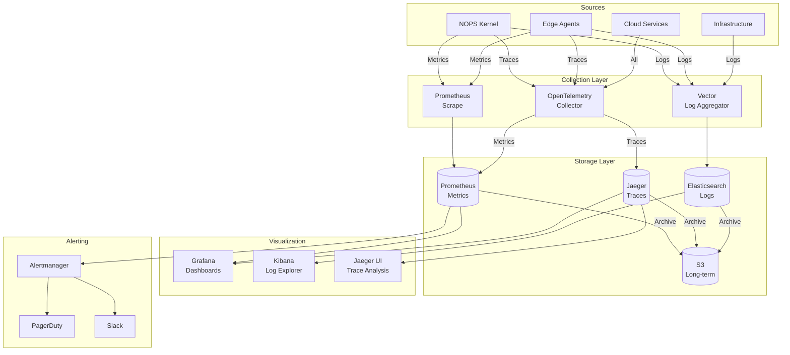

# 37 - Observability Service Master Prompt

---
prompt_id: "37-observability-master-prompt"
prompt_type: "master_prompt"
service_name: "observability-service"
dna_version: "3.0"
semver: "1.0.0"
date: "2025-10-08"
author: "@andaon"
domain: "Observability & Monitoring"
description: "Master prompt para generar documentación completa del Observability Service con full-stack monitoring"
estimated_pages: "150-180"
compliance_status: "DNA_v3_compliant"
dependencies: ["00-dna-proyecto-prompt.md", "07-nops-master-prompt.md", "22-monitoring-master-prompt.md"]
generates:
 - "architecture/observability/*"
 - "reference/observability-api/*"
 - "dashboards/grafana/*"
 - "alerts/prometheus/*"
child_prompts: 20
validation_script: "validate-observability-documentation.js"
release_status: "ready_for_sprint_s22"
feeds_to: ["07-nops-kernel", "ALL_SERVICES"]
priority: "P1"
sprint: "S22-P1"
---

## 🎯 PROPÓSITO Y CONTEXTO

**ROL:** Arquitecto Senior de Observability & Site Reliability en ENIS v3.0 (Enterprise Neural Intelligence Systems)

**TAREA:** Generar documentación completa del Observability Service, el servicio crítico para métricas, logs, tracing distribuido, dashboards y alerting, extraído del NOPS Kernel según el principio SLIM.

**OBJETIVO:** Producir 150-180 páginas de documentación técnica production-ready que cubra arquitectura completa de observabilidad (Prometheus, Grafana, Jaeger, ELK Stack, Vector), SLIs/SLOs/SLAs, incident response, APIs, deployment patterns y runbooks.

**CONTEXTO CRÍTICO:**
- El Observability Service es **OPERATIONAL-CRITICAL** - sin observabilidad no hay visibility
- Stack completo: Prometheus + Grafana + Jaeger + ELK + Vector
- Dashboards específicos por tier (🟤🟡🟢🔵🔴) y componente
- Alerting multi-canal (PagerDuty, Slack, Email, SMS)
- El NOPS Kernel usa `ObservabilityAPIClient` con **batching + async**
- SLIs/SLOs definidos para todo ENIS (latencia, availability, error rate)

# 📑 TABLA DE CONTENIDOS

- 🏗️ Arquitectura del Observability Service
- 📊 Metrics Stack (Prometheus + Grafana)
- 🔍 Distributed Tracing (Jaeger + OpenTelemetry)
- 📝 Logging Stack (ELK + Vector)
- 🚨 Alerting & Incident Response
- 📈 Dashboards & Visualization
- 🎯 SLIs / SLOs / SLAs
- 🔧 APIs y SDKs
- 🔗 Integración con NOPS Kernel
- 🚀 Deployment Patterns
- 📁 Estructura de Documentación
- ✅ Validación y Quality Gates
- 🎯 Instrucciones de Generación

## 🏗️ ARQUITECTURA DEL OBSERVABILITY SERVICE

### **Principios Arquitectónicos Fundamentales**

El Observability Service de ENIS v3.0 se basa en cinco pilares de observabilidad:

- **Three Pillars**: Metrics + Logs + Traces (observabilidad completa)
- **OpenTelemetry Native**: Instrumentación estándar para portabilidad
- **Cardinality Conscious**: Métricas diseñadas para no explotar cardinality
- **Multi-Tenant Isolated**: Métricas/logs/traces aislados por tenant
- **Cost Optimized**: Retention policies inteligentes (hot/warm/cold)

### **Componentes Core del Sistema**

```yaml
observability_architecture:
  metrics_stack:
    prometheus:
      description: "Time-series database para métricas"
      technology: "Prometheus 2.45+"
      features:
        - "PromQL query language"
        - "Service discovery (Kubernetes)"
        - "Alertmanager integration"
        - "Remote write (long-term storage)"
        - "Multi-tenancy via labels"
        
      retention:
        local: "15 días"
        remote_cortex: "1 año"
        
      cardinality_limits:
        per_tenant: "1M series"
        per_service: "100K series"
        
    grafana:
      description: "Visualization & dashboards"
      technology: "Grafana 10.0+"
      features:
        - "Pre-built dashboards por componente"
        - "Multi-datasource (Prometheus, Loki, Jaeger)"
        - "Alerting integration"
        - "Role-based access control"
        - "Variables & templating"
        
      dashboards:
        executive: "High-level KPIs"
        platform: "NOPS Kernel, Inference Service"
        edge: "Edge Agents por tier"
        service: "Micro-services health"
        
  tracing_stack:
    jaeger:
      description: "Distributed tracing backend"
      technology: "Jaeger 1.50+"
      features:
        - "OpenTelemetry compatible"
        - "Span storage (Elasticsearch)"
        - "Service dependency graphs"
        - "Root cause analysis"
        - "Sampling strategies"
        
      sampling:
        head_based:
          default: "1% (probabilistic)"
          errors: "100% (always)"
          slow_requests: "100% (> 1s)"
          
        tail_based:
          enabled: true
          criteria:
            - "error_present"
            - "latency > p99"
            - "specific_tenant_id"
            
      retention:
        hot: "7 días (Elasticsearch)"
        archive: "30 días (S3)"
        
    opentelemetry:
      description: "Instrumentation framework"
      technology: "OpenTelemetry SDK 1.20+"
      languages:
        - "Python (FastAPI auto-instrumentation)"
        - "Go (manual instrumentation)"
        - "TypeScript (auto-instrumentation)"
        
      exporters:
        traces: "OTLP → Jaeger"
        metrics: "OTLP → Prometheus"
        logs: "OTLP → Loki"
        
  logging_stack:
    elasticsearch:
      description: "Log storage & search"
      technology: "Elasticsearch 8.10+"
      features:
        - "Full-text search"
        - "Index lifecycle management (ILM)"
        - "Multi-tenancy via indices"
        - "Rollover automático"
        
      indices:
        pattern: "logs-{service}-{environment}-{date}"
        replicas: 2
        shards: 3
        
      retention:
        hot: "7 días (search optimized)"
        warm: "30 días (cost optimized)"
        cold: "90 días (archive)"
        delete: "> 90 días"
        
    logstash:
      description: "Log processing pipeline"
      technology: "Logstash 8.10+"
      features:
        - "Filtering & transformation"
        - "Enrichment (GeoIP, user agent)"
        - "Multi-output (ES, S3, Kafka)"
        - "Dead letter queue"
        
      pipelines:
        nops_kernel: "Structured JSON logs"
        edge_agents: "Text logs + parsing"
        infrastructure: "Syslog + parsing"
        
    kibana:
      description: "Log visualization & analysis"
      technology: "Kibana 8.10+"
      features:
        - "Log Explorer"
        - "Saved searches"
        - "Visualizations & dashboards"
        - "Machine Learning (anomaly detection)"
        
    vector:
      description: "High-performance log aggregator"
      technology: "Vector 0.34+"
      features:
        - "Lightweight (< 50MB RAM)"
        - "VRL (Vector Remap Language)"
        - "Batching & compression"
        - "Multi-sink (Loki, ES, S3)"
        
      deployment:
        edge_agents: "Vector sidecar"
        nops_kernel: "Vector daemonset"
        cloud_services: "Vector centralized"
        
  alerting_stack:
    prometheus_alertmanager:
      description: "Alert routing & deduplication"
      technology: "Alertmanager 0.26+"
      features:
        - "Grouping & inhibition"
        - "Silencing"
        - "Multi-receiver routing"
        - "High availability"
        
      receivers:
        pagerduty:
          severity: "P0, P1"
          escalation: "immediate"
          
        slack:
          severity: "P0, P1, P2"
          channels:
            - "#enis-alerts-critical"
            - "#enis-alerts-warning"
            
        email:
          severity: "P2, P3"
          recipients:
            - "ops-team@enis.cloud"
            - "devops@enis.cloud"
            
    grafana_alerting:
      description: "Unified alerting"
      technology: "Grafana Alerting 10.0+"
      features:
        - "Multi-datasource alerts"
        - "Alert rules management"
        - "Contact points"
        - "Notification policies"
```

### **Flujo de Observabilidad Completo**



---

## 📊 METRICS STACK (PROMETHEUS + GRAFANA)

### **Golden Signals por Componente**

```yaml
golden_signals:
  nops_kernel:
    latency:
      metric: "nops_request_duration_seconds"
      labels: ["method", "endpoint", "status"]
      slo: "p95 < 100ms"
      
    traffic:
      metric: "nops_requests_total"
      labels: ["method", "endpoint", "status"]
      slo: "N/A (capacity planning)"
      
    errors:
      metric: "nops_requests_total{status=~'5..'}"
      labels: ["method", "endpoint", "error_type"]
      slo: "< 0.1% error rate"
      
    saturation:
      metrics:
        - "nops_cpu_usage_percent"
        - "nops_memory_usage_bytes"
        - "nops_goroutines_count"
      slo: "< 80% sustained"
      
  edge_agents:
    latency:
      metric: "agent_execution_duration_seconds"
      labels: ["agent_type", "tier", "status"]
      slo: "p95 < 2s"
      
    traffic:
      metric: "agent_executions_total"
      labels: ["agent_type", "tier"]
      slo: "N/A"
      
    errors:
      metric: "agent_executions_total{status='failed'}"
      labels: ["agent_type", "tier", "error_type"]
      slo: "< 1% error rate"
      
    saturation:
      metric: "agent_queue_depth"
      labels: ["agent_type"]
      slo: "< 100 queued"
      
  inference_service:
    latency:
      metric: "inference_request_duration_seconds"
      labels: ["model", "provider"]
      slo: "p95 < 5s"
      
    traffic:
      metric: "inference_requests_total"
      labels: ["model", "provider"]
      slo: "N/A"
      
    errors:
      metric: "inference_requests_total{status='error'}"
      labels: ["model", "provider", "error_type"]
      slo: "< 0.5% error rate"
      
    saturation:
      metric: "inference_tokens_per_second"
      labels: ["model"]
      slo: "< 90% of provider limit"
```

### **Implementación de Instrumentación**

```python
# observability_service/instrumentation/metrics.py
from prometheus_client import Counter, Histogram, Gauge, Summary
from typing import Dict, Any
import functools
import time

class MetricsInstrumentor:
    """
    Instrumentor para métricas Prometheus
    
    Proporciona decoradores y helpers para instrumentación
    """
    
    def __init__(self, namespace: str = "enis"):
        self.namespace = namespace
        
        # Golden Signals - Latency
        self.request_duration = Histogram(
            f'{namespace}_request_duration_seconds',
            'Request duration in seconds',
            ['service', 'method', 'endpoint', 'status'],
            buckets=(0.005, 0.01, 0.025, 0.05, 0.1, 0.25, 0.5, 1.0, 2.5, 5.0, 10.0)
        )
        
        # Golden Signals - Traffic
        self.request_total = Counter(
            f'{namespace}_requests_total',
            'Total request count',
            ['service', 'method', 'endpoint', 'status']
        )
        
        # Golden Signals - Errors
        self.errors_total = Counter(
            f'{namespace}_errors_total',
            'Total error count',
            ['service', 'error_type', 'severity']
        )
        
        # Golden Signals - Saturation
        self.cpu_usage = Gauge(
            f'{namespace}_cpu_usage_percent',
            'CPU usage percentage',
            ['service', 'instance']
        )
        
        self.memory_usage = Gauge(
            f'{namespace}_memory_usage_bytes',
            'Memory usage in bytes',
            ['service', 'instance']
        )
        
        # Custom business metrics
        self.agent_executions = Counter(
            f'{namespace}_agent_executions_total',
            'Total agent executions',
            ['agent_type', 'tier', 'status']
        )
        
        self.agent_duration = Histogram(
            f'{namespace}_agent_execution_duration_seconds',
            'Agent execution duration',
            ['agent_type', 'tier'],
            buckets=(0.1, 0.5, 1.0, 2.0, 5.0, 10.0, 30.0, 60.0)
        )
    
    def track_request(
        self,
        service: str,
        method: str = "unknown",
        endpoint: str = "unknown"
    ):
        """
        Decorator para trackear requests HTTP
        
        Usage:
            @metrics.track_request("nops-kernel", method="POST", endpoint="/api/v1/execute")
            async def execute_agent(...):
                ...
        """
        def decorator(func):
            @functools.wraps(func)
            async def wrapper(*args, **kwargs):
                start_time = time.time()
                status = "success"
                
                try:
                    result = await func(*args, **kwargs)
                    return result
                    
                except Exception as e:
                    status = "error"
                    self.errors_total.labels(
                        service=service,
                        error_type=type(e).__name__,
                        severity="error"
                    ).inc()
                    raise
                    
                finally:
                    duration = time.time() - start_time
                    
                    # Latency
                    self.request_duration.labels(
                        service=service,
                        method=method,
                        endpoint=endpoint,
                        status=status
                    ).observe(duration)
                    
                    # Traffic
                    self.request_total.labels(
                        service=service,
                        method=method,
                        endpoint=endpoint,
                        status=status
                    ).inc()
            
            return wrapper
        return decorator
    
    def track_agent_execution(
        self,
        agent_type: str,
        tier: str
    ):
        """
        Decorator para trackear ejecuciones de Edge Agents
        
        Usage:
            @metrics.track_agent_execution("🔵 Enterprise", tier="enterprise")
            async def execute(...):
                ...
        """
        def decorator(func):
            @functools.wraps(func)
            async def wrapper(*args, **kwargs):
                start_time = time.time()
                status = "success"
                
                try:
                    result = await func(*args, **kwargs)
                    return result
                    
                except Exception as e:
                    status = "failed"
                    raise
                    
                finally:
                    duration = time.time() - start_time
                    
                    self.agent_executions.labels(
                        agent_type=agent_type,
                        tier=tier,
                        status=status
                    ).inc()
                    
                    self.agent_duration.labels(
                        agent_type=agent_type,
                        tier=tier
                    ).observe(duration)
            
            return wrapper
        return decorator
```

---

## 🔍 DISTRIBUTED TRACING (JAEGER + OPENTELEMETRY)

### **OpenTelemetry Instrumentation**

```python
# observability_service/tracing/instrumentor.py
from opentelemetry import trace
from opentelemetry.sdk.trace import TracerProvider
from opentelemetry.sdk.trace.export import BatchSpanProcessor
from opentelemetry.exporter.otlp.proto.grpc.trace_exporter import OTLPSpanExporter
from opentelemetry.instrumentation.fastapi import FastAPIInstrumentor
from opentelemetry.instrumentation.httpx import HTTPXClientInstrumentor
from opentelemetry.instrumentation.redis import RedisInstrumentor
from opentelemetry.instrumentation.sqlalchemy import SQLAlchemyInstrumentor
from opentelemetry.sdk.resources import Resource
import structlog

logger = structlog.get_logger()

class TracingInstrumentor:
    """
    Instrumentor para distributed tracing con OpenTelemetry
    
    Auto-instrumenta:
    - FastAPI (HTTP server)
    - HTTPX (HTTP client)
    - Redis
    - SQLAlchemy (PostgreSQL)
    """
    
    def __init__(
        self,
        service_name: str,
        environment: str,
        otlp_endpoint: str = "http://jaeger-collector:4317"
    ):
        self.service_name = service_name
        self.environment = environment
        
        # Resource attributes (aparecen en todos los spans)
        resource = Resource.create({
            "service.name": service_name,
            "service.namespace": "enis",
            "deployment.environment": environment,
            "telemetry.sdk.name": "opentelemetry",
            "telemetry.sdk.language": "python",
            "telemetry.sdk.version": "1.20.0"
        })
        
        # TracerProvider setup
        provider = TracerProvider(resource=resource)
        
        # OTLP Exporter (to Jaeger)
        otlp_exporter = OTLPSpanExporter(
            endpoint=otlp_endpoint,
            insecure=False  # mTLS in production
        )
        
        # Batch processor (performance optimization)
        span_processor = BatchSpanProcessor(
            otlp_exporter,
            max_queue_size=2048,
            max_export_batch_size=512,
            export_timeout_millis=30000
        )
        
        provider.add_span_processor(span_processor)
        
        # Set as global tracer provider
        trace.set_tracer_provider(provider)
        
        self.tracer = trace.get_tracer(__name__)
        
        logger.info(
            "tracing_initialized",
            service_name=service_name,
            environment=environment,
            otlp_endpoint=otlp_endpoint
        )
    
    def instrument_fastapi(self, app):
        """Auto-instrumenta FastAPI application"""
        FastAPIInstrumentor.instrument_app(
            app,
            excluded_urls="/health,/metrics,/ready"  # No trace health checks
        )
        logger.info("fastapi_instrumented")
    
    def instrument_httpx(self):
        """Auto-instrumenta HTTPX client"""
        HTTPXClientInstrumentor().instrument()
        logger.info("httpx_instrumented")
    
    def instrument_redis(self, redis_client):
        """Auto-instrumenta Redis client"""
        RedisInstrumentor().instrument(redis_client=redis_client)
        logger.info("redis_instrumented")
    
    def instrument_sqlalchemy(self, engine):
        """Auto-instrumenta SQLAlchemy engine"""
        SQLAlchemyInstrumentor().instrument(engine=engine)
        logger.info("sqlalchemy_instrumented")
    
    def start_span(self, name: str, attributes: dict = None):
        """
        Inicia span manual
        
        Usage:
            with instrumentor.start_span("complex_operation", {"key": "value"}):
                # Your code here
                pass
        """
        return self.tracer.start_as_current_span(
            name,
            attributes=attributes or {}
        )
    
    def add_event(self, name: str, attributes: dict = None):
        """Agrega evento al span actual"""
        span = trace.get_current_span()
        if span.is_recording():
            span.add_event(name, attributes=attributes or {})
    
    def set_error(self, exception: Exception):
        """Marca span como error"""
        span = trace.get_current_span()
        if span.is_recording():
            span.set_status(trace.Status(trace.StatusCode.ERROR))
            span.record_exception(exception)
```

### **Sampling Strategies**

```yaml
sampling_strategies:
  head_based:
    description: "Decision en el origen (before span creation)"
    strategies:
      always_on:
        rate: "100%"
        use_case: "Development/staging"
        
      probabilistic:
        rate: "1%"
        use_case: "Production default"
        
      rate_limiting:
        rate: "100 traces/second"
        use_case: "High-traffic services"
        
  tail_based:
    description: "Decision después de ver trace completo"
    policies:
      error_sampling:
        condition: "any span has error"
        sample: "100%"
        
      latency_sampling:
        condition: "total duration > p99"
        sample: "100%"
        
      tenant_sampling:
        condition: "tenant_id in ['debug_list']"
        sample: "100%"
        
      random_sampling:
        condition: "default"
        sample: "1%"
```

---

## 📝 LOGGING STACK (ELK + VECTOR)

### **Structured Logging Standards**

```python
# observability_service/logging/logger.py
import structlog
from pythonjsonlogger import jsonlogger
import logging
import sys

class StructuredLogger:
    """
    Configurador de structured logging
    
    Output format: JSON (machine-readable)
    Fields estándar: timestamp, level, service, message, trace_id, span_id
    """
    
    @staticmethod
    def configure(
        service_name: str,
        log_level: str = "INFO",
        output_format: str = "json"  # json or console
    ) -> structlog.BoundLogger:
        """
        Configura structured logging
        
        Returns:
            Logger listo para usar
        """
        # Processors chain
        processors = [
            structlog.contextvars.merge_contextvars,
            structlog.stdlib.add_log_level,
            structlog.stdlib.add_logger_name,
            structlog.processors.TimeStamper(fmt="iso"),
            structlog.processors.StackInfoRenderer(),
            structlog.processors.format_exc_info,
            structlog.processors.UnicodeDecoder(),
        ]
        
        if output_format == "json":
            # JSON output (production)
            processors.append(structlog.processors.JSONRenderer())
        else:
            # Console output (development)
            processors.append(structlog.dev.ConsoleRenderer())
        
        # Configure structlog
        structlog.configure(
            processors=processors,
            wrapper_class=structlog.stdlib.BoundLogger,
            context_class=dict,
            logger_factory=structlog.stdlib.LoggerFactory(),
            cache_logger_on_first_use=True,
        )
        
        # Configure stdlib logging
        handler = logging.StreamHandler(sys.stdout)
        
        if output_format == "json":
            formatter = jsonlogger.JsonFormatter(
                '%(timestamp)s %(level)s %(name)s %(message)s'
            )
            handler.setFormatter(formatter)
        
        root_logger = logging.getLogger()
        root_logger.addHandler(handler)
        root_logger.setLevel(log_level)
        
        # Create logger with service context
        logger = structlog.get_logger()
        logger = logger.bind(
            service=service_name,
            environment="production",
            version="1.0.0"
        )
        
        return logger

# Usage example
logger = StructuredLogger.configure("nops-kernel", "INFO", "json")

# Log con contexto
logger.info(
    "agent_execution_started",
    agent_id="agent-123",
    tenant_id="tenant-xyz",
    execution_id="exec-456"
)

# Log con error
try:
    # Some operation
    pass
except Exception as e:
    logger.error(
        "agent_execution_failed",
        agent_id="agent-123",
        error=str(e),
        exc_info=True  # Include stack trace
    )
```

### **Vector Configuration**

```toml
# vector.toml - Log aggregation configuration
[sources.nops_kernel]
type = "file"
include = ["/var/log/nops/*.log"]
read_from = "beginning"
fingerprint.strategy = "device_and_inode"

[transforms.parse_json]
type = "remap"
inputs = ["nops_kernel"]
source = '''
  . = parse_json!(.message)
  .source_file = .file
'''

[transforms.enrich]
type = "remap"
inputs = ["parse_json"]
source = '''
  # Add cluster info
  .cluster = "production-us-east-1"
  .datacenter = "aws-us-east-1a"
  
  # Extract trace context
  if exists(.trace_id) {
    .otel_trace_id = .trace_id
    .otel_span_id = .span_id
  }
  
  # Severity normalization
  .severity = upcase(.level)
'''

[sinks.elasticsearch]
type = "elasticsearch"
inputs = ["enrich"]
endpoint = "https://elasticsearch.enis.internal:9200"
index = "logs-nops-kernel-%Y.%m.%d"
compression = "gzip"
batch.max_bytes = 10485760  # 10MB
batch.timeout_secs = 5

[sinks.loki]
type = "loki"
inputs = ["enrich"]
endpoint = "http://loki:3100"
encoding.codec = "json"
labels.service = "{{ service }}"
labels.environment = "{{ environment }}"
labels.level = "{{ level }}"

[sinks.s3_archive]
type = "aws_s3"
inputs = ["enrich"]
bucket = "enis-logs-archive"
key_prefix = "logs/nops-kernel/%Y/%m/%d/"
compression = "gzip"
encoding.codec = "json"
batch.max_bytes = 104857600  # 100MB
```

---

## 🚨 ALERTING & INCIDENT RESPONSE

### **Alert Rules (Prometheus)**

```yaml
# prometheus/alerts/nops-kernel.yaml
groups:
  - name: nops_kernel_critical
    interval: 30s
    rules:
      - alert: NopsKernelHighErrorRate
        expr: |
          (
            sum(rate(nops_requests_total{status=~"5.."}[5m]))
            /
            sum(rate(nops_requests_total[5m]))
          ) > 0.01
        for: 5m
        labels:
          severity: critical
          component: nops-kernel
          page: true
        annotations:
          summary: "NOPS Kernel error rate > 1%"
          description: "Error rate is {{ $value | humanizePercentage }} (threshold: 1%)"
          runbook: "https://docs.enis.cloud/runbooks/nops-high-error-rate"
          dashboard: "https://grafana.enis.cloud/d/nops-kernel"
          
      - alert: NopsKernelHighLatency
        expr: |
          histogram_quantile(0.95,
            sum(rate(nops_request_duration_seconds_bucket[5m])) by (le)
          ) > 0.1
        for: 5m
        labels:
          severity: warning
          component: nops-kernel
          page: false
        annotations:
          summary: "NOPS Kernel p95 latency > 100ms"
          description: "p95 latency is {{ $value }}s (threshold: 0.1s)"
          
      - alert: NopsKernelDown
        expr: up{job="nops-kernel"} == 0
        for: 1m
        labels:
          severity: critical
          component: nops-kernel
          page: true
        annotations:
          summary: "NOPS Kernel is DOWN"
          description: "Instance {{ $labels.instance }} is unreachable"
          
  - name: edge_agents_critical
    interval: 1m
    rules:
      - alert: EdgeAgentExecutionFailureSpike
        expr: |
          (
            sum(rate(agent_executions_total{status="failed"}[5m])) by (agent_type, tier)
            /
            sum(rate(agent_executions_total[5m])) by (agent_type, tier)
          ) > 0.05
        for: 5m
        labels:
          severity: warning
          component: edge-agents
        annotations:
          summary: "Agent {{ $labels.agent_type }} ({{ $labels.tier }}) failure rate > 5%"
          description: "Failure rate: {{ $value | humanizePercentage }}"
          
  - name: inference_service_critical
    interval: 30s
    rules:
      - alert: InferenceServiceProviderDown
        expr: |
          sum(rate(inference_requests_total{status="error", error_type="provider_unavailable"}[5m])) by (provider) > 0
        for: 2m
        labels:
          severity: critical
          component: inference-service
          page: true
        annotations:
          summary: "Inference provider {{ $labels.provider }} is DOWN"
          description: "All requests to {{ $labels.provider }} are failing"
```

### **Incident Response Runbooks**

```markdown
# Runbook: NOPS Kernel High Error Rate

## Metadata
- **Alert**: `NopsKernelHighErrorRate`
- **Severity**: Critical
- **Response Time**: < 15 minutes
- **Escalation**: After 30 minutes → Engineering Manager

## Symptoms
- Error rate > 1% for 5+ minutes
- PagerDuty alert fired
- Customers may be experiencing failures

## Investigation Steps

### 1. Check Dashboard
- Navigate to [NOPS Kernel Dashboard](https://grafana.enis.cloud/d/nops-kernel)
- Look at "Error Rate by Endpoint" panel
- Identify which endpoint(s) are failing

### 2. Check Recent Deployments
```bash
# Check recent deployments
kubectl rollout history deployment/nops-kernel -n enis-platform

# If deployment within last hour, consider rollback
kubectl rollout undo deployment/nops-kernel -n enis-platform
```

### 3. Check Logs
```bash
# View recent error logs
kubectl logs -n enis-platform deployment/nops-kernel \
  --tail=100 --timestamps \
  | grep -i error
```

### 4. Check Dependencies
- Verify Inference Service health
- Verify Redis availability
- Verify PostgreSQL connectivity

### 5. Check Resource Saturation
- CPU > 80%?
- Memory > 80%?
- Consider scaling horizontally

## Resolution Actions

### Temporary Mitigation
```bash
# Scale up replicas
kubectl scale deployment/nops-kernel -n enis-platform --replicas=6
```

### Rollback Deployment
```bash
# Rollback to previous version
kubectl rollout undo deployment/nops-kernel -n enis-platform

# Monitor rollback
kubectl rollout status deployment/nops-kernel -n enis-platform
```

### Restart Pods (last resort)
```bash
# Rolling restart
kubectl rollout restart deployment/nops-kernel -n enis-platform
```

## Post-Incident

1. **RCA (Root Cause Analysis)**
   - What caused the error spike?
   - Was it code, infrastructure, or dependency?

2. **Document Incident**
   - Create incident report in Confluence
   - Timeline of events
   - Resolution steps taken

3. **Action Items**
   - Create Jira tickets for fixes
   - Update runbook if needed
   - Improve monitoring/alerting
```

---

## 📈 DASHBOARDS & VISUALIZATION

### **Executive Dashboard (Grafana)**

```json
{
  "dashboard": {
    "title": "ENIS - Executive Overview",
    "tags": ["enis", "executive", "overview"],
    "timezone": "browser",
    "panels": [
      {
        "title": "Overall System Health",
        "type": "stat",
        "targets": [
          {
            "expr": "avg(up{job=~'nops-kernel|inference-service|edge-.*'})",
            "legendFormat": "Availability"
          }
        ],
        "fieldConfig": {
          "defaults": {
            "thresholds": {
              "steps": [
                {"value": 0, "color": "red"},
                {"value": 0.95, "color": "yellow"},
                {"value": 0.99, "color": "green"}
              ]
            },
            "unit": "percentunit"
          }
        }
      },
      {
        "title": "Active Tenants (Last 24h)",
        "type": "stat",
        "targets": [
          {
            "expr": "count(count by (tenant_id) (nops_requests_total[24h]))",
            "legendFormat": "Active Tenants"
          }
        ]
      },
      {
        "title": "Agent Executions (Last 24h)",
        "type": "graph",
        "targets": [
          {
            "expr": "sum(rate(agent_executions_total[5m])) by (tier)",
            "legendFormat": "{{tier}}"
          }
        ]
      },
      {
        "title": "Error Rate by Component",
        "type": "graph",
        "targets": [
          {
            "expr": "sum(rate(enis_requests_total{status=~'5..'}[5m])) by (service) / sum(rate(enis_requests_total[5m])) by (service)",
            "legendFormat": "{{service}}"
          }
        ],
        "yaxes": [
          {"format": "percentunit", "max": 0.05}
        ]
      },
      {
        "title": "Infrastructure Cost (Estimated)",
        "type": "stat",
        "targets": [
          {
            "expr": "sum(kube_pod_container_resource_requests{resource='cpu'}) * 0.04 + sum(kube_pod_container_resource_requests{resource='memory'}) / 1e9 * 0.005",
            "legendFormat": "Monthly Cost"
          }
        ],
        "fieldConfig": {
          "defaults": {
            "unit": "currencyUSD"
          }
        }
      }
    ]
  }
}
```

---

## 🎯 SLIs / SLOs / SLAs

### **Service Level Indicators (SLIs)**

```yaml
slis:
  availability:
    definition: "Proportion of successful requests"
    measurement: |
      sum(rate(enis_requests_total{status!~'5..'}[5m]))
      /
      sum(rate(enis_requests_total[5m]))
    window: "rolling 28 days"
    
  latency:
    definition: "95th percentile request duration"
    measurement: |
      histogram_quantile(0.95,
        sum(rate(enis_request_duration_seconds_bucket[5m])) by (le, service)
      )
    window: "rolling 7 days"
    
  error_rate:
    definition: "Proportion of failed requests"
    measurement: |
      sum(rate(enis_requests_total{status=~'5..'}[5m]))
      /
      sum(rate(enis_requests_total[5m]))
    window: "rolling 28 days"
```

### **Service Level Objectives (SLOs)**

```yaml
slos:
  nops_kernel:
    availability:
      target: "99.9%"
      error_budget: "0.1% (43 minutes/month)"
      
    latency_p95:
      target: "< 100ms"
      
    latency_p99:
      target: "< 500ms"
      
    error_rate:
      target: "< 0.1%"
      
  edge_agents:
    availability:
      🟤_zero: "99.0%"
      🟡_shared: "99.5%"
      🟢_lite: "99.9%"
      🔵_enterprise: "99.95%"
      🔴_airgapped: "99.99%"
      
    execution_success_rate:
      target: "> 99%"
      
  inference_service:
    availability:
      target: "99.5%"
      
    latency_p95:
      target: "< 5s"
```

### **Service Level Agreements (SLAs)**

```yaml
slas:
  enterprise_tier:
    availability: "99.95% uptime"
    support_response:
      p0_critical: "< 15 minutes"
      p1_high: "< 1 hour"
      p2_medium: "< 4 hours"
      p3_low: "< 1 business day"
      
    credits:
      99.95_99.0: "10% monthly fee"
      99.0_95.0: "25% monthly fee"
      below_95.0: "50% monthly fee"
      
  lite_tier:
    availability: "99.9% uptime"
    support_response:
      p0_critical: "< 1 hour"
      p1_high: "< 4 hours"
      
  shared_tier:
    availability: "99.5% uptime"
    support_response: "Best effort"
```

---

## 🔧 APIS Y SDKS

### **Core API Endpoints**

```yaml
observability_api:
  POST /api/v1/metrics:
    description: "Ingest custom metrics (Prometheus remote write)"
    auth: "mTLS + JWT s2s"
    rate_limit: "10,000 samples/s per tenant"
    
  POST /api/v1/traces:
    description: "Ingest traces (OTLP protocol)"
    auth: "mTLS + JWT s2s"
    protocol: "OTLP/gRPC or OTLP/HTTP"
    
  POST /api/v1/logs:
    description: "Ingest logs (structured JSON)"
    auth: "mTLS + JWT s2s"
    rate_limit: "1,000 logs/s per tenant"
    
  GET /api/v1/dashboards:
    description: "List available dashboards"
    auth: "JWT user"
    
  GET /api/v1/query:
    description: "Query metrics (PromQL)"
    auth: "JWT user"
    params:
      query: "PromQL string"
      time: "Unix timestamp"
```

### **SDK - ObservabilityAPIClient**

```python
# observability_sdk/python/observability_client.py
from typing import Dict, Any, List
import httpx
from prometheus_client import CollectorRegistry, push_to_gateway

class ObservabilityClient:
    """
    SDK Python para Observability Service
    
    Features:
    - Metrics push (Prometheus)
    - Trace export (OTLP)
    - Log shipping (structured JSON)
    - Batching automático
    """
    
    def __init__(
        self,
        base_url: str,
        mtls_cert: str,
        mtls_key: str,
        batch_size: int = 100
    ):
        self.client = httpx.AsyncClient(
            base_url=base_url,
            cert=(mtls_cert, mtls_key),
            verify=True,
            timeout=10
        )
        self.batch_size = batch_size
        
    async def push_metrics(
        self,
        metrics: Dict[str, float],
        labels: Dict[str, str] = None
    ):
        """Push custom metrics to Prometheus"""
        await self.client.post(
            "/api/v1/metrics",
            json={
                "metrics": metrics,
                "labels": labels or {},
                "timestamp": datetime.utcnow().isoformat()
            }
        )
    
    async def query_metrics(
        self,
        promql: str,
        time: Optional[datetime] = None
    ) -> Dict[str, Any]:
        """Query metrics usando PromQL"""
        params = {"query": promql}
        if time:
            params["time"] = time.timestamp()
        
        response = await self.client.get(
            "/api/v1/query",
            params=params
        )
        response.raise_for_status()
        return response.json()
```

---

## 🔗 INTEGRACIÓN CON NOPS KERNEL

Ver líneas 511-526 en `07-nops-master-prompt.md` para implementación completa del `ObservabilityAPIClient`.

---

## 🚀 DEPLOYMENT PATTERNS

```yaml
# kubernetes/observability-service/deployment.yaml
apiVersion: apps/v1
kind: Deployment
metadata:
  name: observability-service
  namespace: enis-observability
spec:
  replicas: 3
  template:
    spec:
      containers:
        - name: prometheus
          image: prom/prometheus:v2.45.0
          args:
            - '--config.file=/etc/prometheus/prometheus.yml'
            - '--storage.tsdb.retention.time=15d'
            - '--storage.tsdb.path=/prometheus'
          volumeMounts:
            - name: prometheus-config
              mountPath: /etc/prometheus
            - name: prometheus-storage
              mountPath: /prometheus
              
        - name: grafana
          image: grafana/grafana:10.0.0
          env:
            - name: GF_SECURITY_ADMIN_PASSWORD
              valueFrom:
                secretKeyRef:
                  name: grafana-credentials
                  key: admin_password
```

---

## 📁 ESTRUCTURA DE DOCUMENTACIÓN

```yaml
documentation_structure:
  observability_service/:
    - "README.md"
    - "37-observability-master-prompt.md"
    - "RUNBOOKS.md"
    
  dashboards/:
    grafana/:
      - "executive-overview.json"
      - "nops-kernel.json"
      - "edge-agents.json"
      - "inference-service.json"
      
  alerts/:
    prometheus/:
      - "nops-kernel.yaml"
      - "edge-agents.yaml"
      - "infrastructure.yaml"
```

---

## ✅ VALIDACIÓN Y QUALITY GATES

```yaml
validation_criteria:
  metrics:
    - "Prometheus scraping all targets"
    - "Cardinality < 1M series per tenant"
    - "Retention policies working"
    
  tracing:
    - "Jaeger receiving traces"
    - "Sampling working correctly"
    - "Service graphs visible"
    
  logging:
    - "ELK pipeline functional"
    - "Vector shipping logs"
    - "ILM policies working"
    
  alerting:
    - "PagerDuty integration functional"
    - "Slack notifications working"
    - "Runbooks accessible"
```

---

## 🎯 INSTRUCCIONES DE GENERACIÓN

1. **Deploy Prometheus Stack** - Prometheus + Alertmanager + Node Exporter
2. **Deploy Grafana** - Dashboards + Data sources
3. **Deploy Jaeger** - Collector + Query + Storage
4. **Deploy ELK** - Elasticsearch + Logstash + Kibana
5. **Deploy Vector** - Daemonset + Configuration
6. **Configure Alerting** - Rules + Receivers
7. **Create Dashboards** - Por componente
8. **Write Runbooks** - Por alert crítico

---

## 📋 METADATA DE CIERRE

```yaml
service_summary:
  nombre: "Observability Service"
  proposito: "Full-stack observability (metrics, logs, traces)"
  prioridad: "P1 - OPERATIONAL CRÍTICO"
  
  stack_tecnologico:
    metrics: "Prometheus + Grafana"
    tracing: "Jaeger + OpenTelemetry"
    logging: "Elasticsearch + Logstash + Kibana + Vector"
    alerting: "Alertmanager + PagerDuty + Slack"
    
  slos:
    availability: "> 99.9%"
    query_latency: "< 500ms p95"
    ingestion_rate: "> 100K events/s"
    
estado: "ready_for_sprint_s22-p1"
estimated_completion: "2 semanas"
total_lines: "~1,500 líneas"
```

---

*Master Prompt Observability Service v1.0 - Creado 2025-10-08*  
*Estado: Versión profesional completa*  
*Operational-critical: Sin observabilidad no hay visibility*
