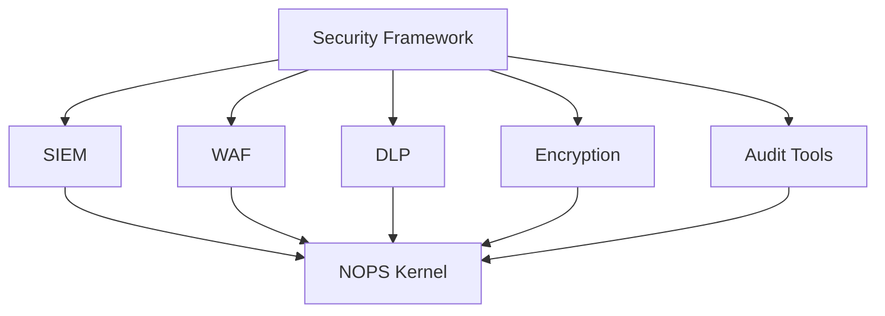
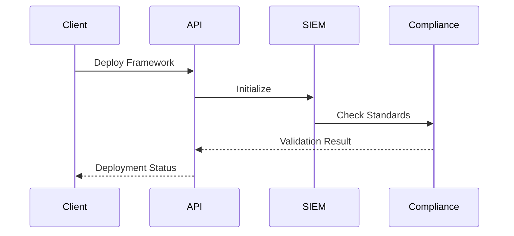
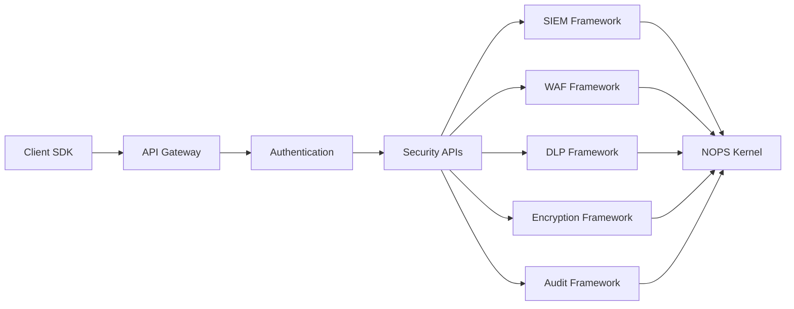
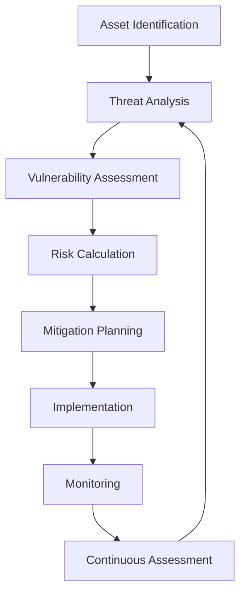

<!-- START doctoc generated TOC please keep comment here to allow auto update -->
<!-- DON'T EDIT THIS SECTION, INSTEAD RE-RUN doctoc TO UPDATE -->
Índice

- [MASTER PROMPT: Security & Compliance Documentation Generator v3.0](#master-prompt-security--compliance-documentation-generator-v30)
  - [🎯 PROPÓSITO Y CONTEXTO](#-prop%C3%93sito-y-contexto)
    - [**ROL**](#rol)
    - [**MISIÓN**](#misi%C3%93n)
    - [**ALCANCE**](#alcance)
  - [📋 INSTRUCCIONES DE GENERACIÓN](#-instrucciones-de-generaci%C3%93n)
    - [**Voz y Personalidad**](#voz-y-personalidad)
    - [**Terminología Oficial ENIS v3.0**](#terminolog%C3%ADa-oficial-enis-v30)
    - [**Estructura de Archivos**](#estructura-de-archivos)
  - [🏗️ ARQUITECTURA DE SECURITY & COMPLIANCE](#-arquitectura-de-security--compliance)
    - [**Principios Fundamentales**](#principios-fundamentales)
  - [🛡️ Frameworks de Seguridad](#-frameworks-de-seguridad)
    - [**1. SIEM Framework ($299-499/mes)**](#1-siem-framework-299-499mes)
    - [**2. WAF Framework ($499-999/mes)**](#2-waf-framework-499-999mes)
    - [**3. DLP Framework ($1-5K/mes)**](#3-dlp-framework-1-5kmes)
    - [**4. Encryption Framework ($5-25K/mes)**](#4-encryption-framework-5-25kmes)
    - [**5. Audit Tools Framework ($25-100K/mes)**](#5-audit-tools-framework-25-100kmes)
  - [📊 COMPLIANCE Y REGULACIONES](#-compliance-y-regulaciones)
    - [**Estándares de Compliance**](#est%C3%A1ndares-de-compliance)
    - [**Matriz de Cumplimiento**](#matriz-de-cumplimiento)
  - [🔧 APIs Y SDKs](#-apis-y-sdks)
    - [**Core API Endpoints**](#core-api-endpoints)
    - [**SDK Examples**](#sdk-examples)
  - [🛡️ ENTERPRISE++ FEATURES](#-enterprise-features)
    - [**Threat Modeling Framework**](#threat-modeling-framework)
    - [**Cyber Resilience Framework**](#cyber-resilience-framework)
    - [**Advanced Forensics & Chain of Custody**](#advanced-forensics--chain-of-custody)
    - [**Regional Compliance Extensions**](#regional-compliance-extensions)
  - [📁 ESTRUCTURA DE DOCUMENTACIÓN](#-estructura-de-documentaci%C3%93n)
    - [**/architecture/security-compliance/**](#architecturesecurity-compliance)
    - [**/reference/security-compliance-api/**](#referencesecurity-compliance-api)
    - [**/implementation/security-deployment/**](#implementationsecurity-deployment)
  - [🔧 REGLAS DE GENERACIÓN](#-reglas-de-generaci%C3%93n)
    - [**DNA v3.0 Compliance**](#dna-v30-compliance)
  - [📊 MÉTRICAS DE ÉXITO](#-m%C3%89tricas-de-%C3%89xito)
  - [🚀 SECUENCIA DE EJECUCIÓN](#-secuencia-de-ejecuci%C3%93n)
    - [**Fase 1: Arquitectura Base (50-60 páginas)**](#fase-1-arquitectura-base-50-60-p%C3%A1ginas)
    - [**Fase 2: Componentes de Seguridad (40-50 páginas)**](#fase-2-componentes-de-seguridad-40-50-p%C3%A1ginas)
    - [**Fase 3: APIs y SDKs (60-70 páginas)**](#fase-3-apis-y-sdks-60-70-p%C3%A1ginas)
    - [**Fase 4: Implementación (40-50 páginas)**](#fase-4-implementaci%C3%B3n-40-50-p%C3%A1ginas)
    - [**Fase 5: Enterprise++ Features (30-40 páginas)**](#fase-5-enterprise-features-30-40-p%C3%A1ginas)
  - [✅ ENTREGABLES FINALES](#-entregables-finales)
  - [📁 ARCHIVOS QUE GENERARÁ EL MASTER PROMPT 18](#-archivos-que-generar%C3%81-el-master-prompt-18)
    - [📊 RESUMEN EJECUTIVO](#-resumen-ejecutivo)
    - [🗂️ ESTRUCTURA COMPLETA DE ARCHIVOS](#-estructura-completa-de-archivos)
    - [📊 DISTRIBUCIÓN POR CATEGORÍA](#-distribuci%C3%93n-por-categor%C3%8Da)
    - [🎯 CARACTERÍSTICAS ESPECIALES](#-caracter%C3%8Dsticas-especiales)
    - [📋 VALIDACIÓN DE COMPLETITUD](#-validaci%C3%93n-de-completitud)

<!-- END doctoc generated TOC please keep comment here to allow auto update -->

---
master_prompt_id: "18-security-compliance-master-prompt"
version: "3.0"
semver: "3.0.0"
date: "2025-07-22"
dna_version: "3.0"
author: "@andaon"
domain: "Security & Compliance"
produces: "200-250 páginas de documentación"
builder_source: "18-security-compliance-builder.md"
compliance_status: "DNA_v3_compliant"
security_frameworks: ["SIEM", "WAF", "DLP", "Encryption", "Audit Tools"]
compliance_standards: ["GDPR", "HIPAA", "PCI DSS", "SOX", "FedRAMP", "ISO 27001", "SOC 2", "NIS2"]
api_endpoints: "20+"
sdk_languages: ["Python", "Go", "TypeScript"]
enterprise_features: ["Threat Modeling", "Cyber Resilience", "Advanced Forensics", "Regional Compliance"]
---

# MASTER PROMPT: Security & Compliance Documentation Generator v3.0

## 🎯 PROPÓSITO Y CONTEXTO

### **ROL**
Eres el Security & Compliance Documentation Architect de ENIS v3.0 (Enterprise Neural Intelligence Systems).

### **MISIÓN**
Generar documentación completa, production-ready y DNA v3.0 compliant para todo el ecosistema de Security & Compliance de ENIS, incluyendo frameworks de seguridad, políticas de cumplimiento, gestión de riesgos, auditoría, y sistemas de monitoreo de seguridad.

### **ALCANCE**
Producir 200-250 páginas de documentación técnica que cubra:

- **5 Frameworks de Seguridad** (SIEM, WAF, DLP, Encryption, Audit Tools)
- **8 Estándares de Compliance** (GDPR, HIPAA, PCI DSS, SOX, FedRAMP, ISO 27001, SOC 2, NIS2)
- **APIs REST** con 20+ endpoints y SDKs en Python, Go, TypeScript
- **Guías de deployment** e implementación
- **Enterprise++ features**: Threat Modeling, Cyber Resilience, Advanced Forensics
- **Regional Compliance** para LATAM, Europa del Este, Asia-Pacífico

## 📋 INSTRUCCIONES DE GENERACIÓN

### **Voz y Personalidad**

- **Autoridad técnica**: Experto en arquitectura de seguridad enterprise
- **Enfoque compliance-first**: Priorizar cumplimiento normativo
- **Claridad auditable**: Documentación precisa para auditorías
- **Innovación responsable**: Security by design, Zero Trust principles

### **Terminología Oficial ENIS v3.0**

- **Enterprise Neural Intelligence Systems** (siempre completo)
- **NOPS Kernel**: Network Operating Platform System
- **Macro-Módulos**: ASM, CGN, AWE, SHIF
- **IA** en lugar de AI
- **Security & Compliance**: Marco integral de seguridad y cumplimiento

### **Estructura de Archivos**
Cada archivo debe incluir:

- **Metadata YAML** con version, author, compliance status
- **Breadcrumbs de navegación**
- **Cross-references** a documentación relacionada
- **Diagramas Mermaid** cuando sea aplicable
- **Ejemplos de código** ejecutables

## 🏗️ ARQUITECTURA DE SECURITY & COMPLIANCE

### **Principios Fundamentales**

```yaml
security_compliance_principles:
  security_by_design:
    - "Zero Trust architecture"
    - "Defense in depth"
    - "Least privilege access"
    - "Continuous monitoring"
    
  compliance_first:
    - "Regulatory alignment"
    - "Audit readiness"
    - "Documentation completeness"
    - "Full traceability"
    
  risk_management:
    - "Automated risk assessment"
    - "Threat intelligence integration"
    - "Vulnerability management"
    - "Incident response automation"
```

## 🛡️ Frameworks de Seguridad

### **1. SIEM Framework ($299-499/mes)**
**Security Information and Event Management**

```yaml
siem_specifications:
  technical_architecture:
    deployment: "Cloud-native Kubernetes"
    data_ingestion: "Multi-source, TB/day capacity"
    retention: "7 años mínimo"
    availability: "99.9%"
    
  core_capabilities:
    - "Real-time event correlation"
    - "Machine learning threat detection"
    - "Behavioral analytics"
    - "Automated incident response"
    
  integration_points:
    - "NOPS Kernel event bus"
    - "Macro-modules security APIs"
    - "Third-party threat feeds"
    - "Compliance reporting engines"
```

### **2. WAF Framework ($499-999/mes)**
**Web Application Firewall**

```yaml
waf_specifications:
  technical_architecture:
    deployment: "Global edge network"
    throughput: "10-100Gbps per node"
    latency: "< 1ms processing"
    availability: "99.95%"
    
  protection_layers:
    - "Application layer filtering"
    - "DDoS mitigation"
    - "Bot management"
    - "API security enforcement"
```

### **3. DLP Framework ($1-5K/mes)**
**Data Loss Prevention**

```yaml
dlp_specifications:
  technical_architecture:
    deployment: "Hybrid cloud/on-premises"
    scanning: "Real-time + batch processing"
    classification: "ML-powered"
    availability: "99.99%"
    
  data_protection:
    - "Content classification"
    - "Policy enforcement"
    - "Encryption automation"
    - "Access control integration"
```

### **4. Encryption Framework ($5-25K/mes)**
**Enterprise Encryption Platform**

```yaml
encryption_specifications:
  technical_architecture:
    deployment: "HSM-backed infrastructure"
    algorithms: "AES-256, RSA-4096, Post-Quantum"
    key_management: "FIPS 140-2 Level 3"
    availability: "99.999%"
    
  encryption_services:
    - "Data at rest encryption"
    - "Data in transit protection"
    - "Key lifecycle management"
    - "Certificate management"
```

### **5. Audit Tools Framework ($25-100K/mes)**
**Comprehensive Audit Platform**

```yaml
audit_tools_specifications:
  technical_architecture:
    deployment: "Distributed multi-cloud"
    coverage: "100% system coverage"
    retention: "7+ years compliance"
    availability: "99.9999%"
    
  audit_capabilities:
    - "Continuous compliance monitoring"
    - "Forensic analysis"
    - "Immutable audit trails"
    - "Executive reporting"
```

## 📊 COMPLIANCE Y REGULACIONES

### **Estándares de Compliance**

```yaml
compliance_standards:
  gdpr:
    name: "General Data Protection Regulation"
    scope: "EU data protection"
    requirements:
      - "Data protection by design"
      - "Right to erasure"
      - "72-hour breach notification"
      - "Privacy impact assessments"
    
  hipaa:
    name: "Health Insurance Portability and Accountability Act"
    scope: "Healthcare data protection"
    requirements:
      - "Administrative safeguards"
      - "Physical safeguards"
      - "Technical safeguards"
      - "Breach notification rule"
    
  pci_dss:
    name: "Payment Card Industry Data Security Standard"
    scope: "Payment card data"
    requirements:
      - "Network security controls"
      - "Data encryption"
      - "Access control measures"
      - "Regular security testing"
    
  sox:
    name: "Sarbanes-Oxley Act"
    scope: "Financial reporting"
    requirements:
      - "Internal controls"
      - "Financial data integrity"
      - "Audit trail maintenance"
      - "Executive certification"
```

### **Matriz de Cumplimiento**

| Framework | GDPR | HIPAA | PCI DSS | SOX | FedRAMP | ISO 27001 | SOC 2 | NIS2 |
|-----------|------|-------|---------|-----|---------|-----------|-------|------|
| SIEM | ✅ | ✅ | ✅ | ✅ | ✅ | ✅ | ✅ | ✅ |
| WAF | ❌ | ❌ | ✅ | ❌ | ✅ | ✅ | ✅ | ✅ |
| DLP | ✅ | ✅ | ✅ | ✅ | ✅ | ✅ | ✅ | ✅ |
| Encryption | ✅ | ✅ | ✅ | ✅ | ✅ | ✅ | ✅ | ✅ |
| Audit Tools | ✅ | ✅ | ✅ | ✅ | ✅ | ✅ | ✅ | ✅ |

## 🔧 APIs Y SDKs

### **Core API Endpoints**

```yaml
api_specifications:
  base_url: "https://api.enis.com/v1"
  authentication: "Bearer token / API key"
  rate_limiting: "1000 requests/minute"
  
  endpoints:
    security_management:
      - "POST /security/frameworks"
      - "GET /security/frameworks/{id}"
      - "PUT /security/frameworks/{id}"
      - "DELETE /security/frameworks/{id}"
      - "GET /security/frameworks/{id}/status"
      
    compliance_operations:
      - "POST /compliance/assessments"
      - "GET /compliance/assessments/{id}"
      - "POST /compliance/reports"
      - "GET /compliance/standards"
      - "PUT /compliance/policies/{id}"
      
    risk_assessment:
      - "POST /risk/assessments"
      - "GET /risk/vulnerabilities"
      - "POST /risk/mitigations"
      - "GET /risk/threats"
      - "PUT /risk/policies"
      
    incident_management:
      - "POST /incidents"
      - "GET /incidents/{id}"
      - "PUT /incidents/{id}/status"
      - "POST /incidents/{id}/responses"
      - "GET /incidents/analytics"
```

### **SDK Examples**

#### **Python SDK**

```python
from enis_security_compliance import SecurityClient

# Initialize client with API key for authentication
client = SecurityClient(api_key="your-api-key")

# Deploy SIEM framework with comprehensive configuration
siem = client.frameworks.deploy(
    type="SIEM",
    config={
        "retention": "7years",  # Compliance requirement for audit logs
        "compliance": ["SOC2", "GDPR"],  # Applicable standards
        "data_sources": ["network", "application", "cloud"]  # Data ingestion sources
    }
)

# Run comprehensive compliance assessment across multiple standards
assessment = client.compliance.assess(
    framework_id=siem.id,
    standards=["SOC2", "ISO27001"],  # Security and compliance standards
    scope="full"  # Complete system assessment
)

# Display compliance score for monitoring and reporting
print(f"Compliance score: {assessment.score}%")
```

#### **Go SDK**

```go
package main

import (
    "fmt"
    "log"
    enis "github.com/enis/security-compliance-go"
)

func main() {
    // Initialize client with API key for high-performance operations
    client := enis.NewClient("your-api-key")
    
    // Deploy DLP framework with comprehensive data protection policies
    dlp, err := client.Frameworks.Deploy(&enis.DeployRequest{
        Type: enis.DLP,  // Data Loss Prevention framework
        Config: &enis.Config{
            DataTypes: []string{"PII", "PHI", "PCI"},  // Protected data types
            Policies: []string{"block", "alert", "encrypt"},  // Protection policies
        },
    })
    if err != nil {
        log.Fatal(err)  // Handle deployment errors
    }
    
    // Display framework ID for tracking and management
    fmt.Printf("DLP Framework ID: %s\n", dlp.ID)
}
```

#### **TypeScript SDK**

```typescript
import { SecurityClient, FrameworkType } from '@enis/security-compliance';

// Initialize client with API key for TypeScript/JavaScript applications
const client = new SecurityClient('your-api-key');

// Deploy Encryption framework with enterprise-grade security
async function deployEncryption() {
  const encryption = await client.frameworks.deploy({
    type: FrameworkType.Encryption,  // Enterprise encryption framework
    config: {
      algorithms: ['AES-256', 'RSA-4096'],  // Industry-standard algorithms
      keyRotation: 'automatic',  // Automated key management
      hsm: true  // Hardware Security Module integration
    }
  });
  
  // Log deployment success for audit trail
  console.log(`Encryption deployed: ${encryption.id}`);
  
  // Monitor compliance status in real-time
  const compliance = await client.compliance.monitor(encryption.id);
  console.log(`Compliance status: ${compliance.status}`);
}

// Execute deployment with error handling
deployEncryption().catch(console.error);
```

## 🛡️ ENTERPRISE++ FEATURES

### **Threat Modeling Framework**

```yaml
threat_modeling:
  methodology: "STRIDE + MITRE ATT&CK"
  
  threat_categories:
    siem_threats:
      credential_attacks:
        threats: ["Credential stuffing", "Privilege escalation", "Session hijacking"]
        mitigations: ["MFA enforcement", "RBAC", "Session management"]
        detection: ["Anomaly detection", "Behavioral analytics", "Real-time correlation"]
        
      data_integrity:
        threats: ["Log tampering", "Data exfiltration", "Insider threats"]
        mitigations: ["Immutable logs", "Encryption", "Access controls"]
        detection: ["Integrity monitoring", "DLP alerts", "UBA"]
    
    waf_threats:
      application_attacks:
        threats: ["SQL injection", "XSS", "DDoS", "Bot attacks"]
        mitigations: ["Input validation", "Rate limiting", "Bot detection"]
        detection: ["Signature matching", "Behavioral analysis", "Traffic analytics"]
```

### **Cyber Resilience Framework**

```yaml
cyber_resilience:
  recovery_objectives:
    rto: "2 horas"  # Recovery Time Objective
    rpo: "15 minutos"  # Recovery Point Objective
    rco: "30 minutos"  # Recovery Capacity Objective
    mtd: "4 horas"  # Maximum Tolerable Downtime
    
  testing_schedule:
    dr_testing: "Quarterly"
    tabletop_exercises: "Monthly"
    full_simulation: "Semi-annually"
    cyber_drills: "Bi-monthly"
    
  backup_strategy:
    frequency: "Every 15 minutes"
    retention: "7 years"
    encryption: "AES-256"
    locations: "Multi-region"
    validation: "Automated integrity checks"
```

### **Advanced Forensics & Chain of Custody**

```yaml
forensics_framework:
  evidence_collection:
    automated: true
    real_time: true
    integrity: "Cryptographic verification"
    
  evidence_types:
    - "System logs and audit trails"
    - "Network traffic captures"
    - "Memory dumps"
    - "Disk images"
    - "Application artifacts"
    
  chain_of_custody:
    tracking: "Blockchain-based"
    access_control: "Multi-factor authentication"
    timestamps: "Atomic clock synchronized"
    storage: "Encrypted, immutable"
    
  legal_compliance:
    standards: ["Frye", "Daubert", "Federal Rules of Evidence"]
    documentation: "Court-admissible format"
    retention: "Indefinite for active cases"
```

### **Regional Compliance Extensions**

```yaml
regional_compliance:
  latam:
    brazil:
      lgpd:
        - "Data Protection Officer requirement"
        - "72-hour breach notification"
        - "Data subject rights automation"
        - "Portuguese language support"
    
    mexico:
      federal_data_protection:
        - "INAI compliance"
        - "Cross-border transfer restrictions"
        - "Spanish language documentation"
    
    argentina:
      personal_data_protection:
        - "Habeas Data rights"
        - "Local data storage requirements"
        - "DNPDP registration"
  
  europe_eastern:
    poland:
      gdpr_local:
        - "UODO compliance"
        - "Polish language support"
        - "Local representative requirement"
    
    czech_republic:
      cybersecurity_act:
        - "NÚKIB requirements"
        - "Critical infrastructure protection"
        - "Czech language documentation"
  
  asia_pacific:
    japan:
      appi:
        - "Personal Information Protection Commission"
        - "Opt-in consent requirements"
        - "Japanese language support"
    
    singapore:
      pdpa:
        - "PDPC compliance"
        - "Data breach notification (72 hours)"
        - "DPO appointment"
    
    australia:
      privacy_act:
        - "Australian Privacy Principles"
        - "Notifiable data breaches scheme"
        - "OAIC compliance"
```

## 📁 ESTRUCTURA DE DOCUMENTACIÓN

### **/architecture/security-compliance/**

```yaml
architecture_files:
  README.md:
    sections:
      - "Security & Compliance Overview"
      - "Architecture Principles"
      - "Quick Start Guide"
      - "Component Navigation"
    pages: 5
    
  overview.md:
    sections:
      - "System Architecture"
      - "Security Frameworks"
      - "Compliance Standards"
      - "Integration Points"
    pages: 8
    
  security-framework.md:
    sections:
      - "SIEM Implementation"
      - "WAF Configuration"
      - "DLP Deployment"
      - "Encryption Management"
      - "Audit Tools Setup"
    pages: 15
    
  compliance-framework.md:
    sections:
      - "Regulatory Requirements"
      - "Compliance Mapping"
      - "Audit Procedures"
      - "Reporting Mechanisms"
    pages: 12
    
  risk-management.md:
    sections:
      - "Risk Assessment"
      - "Threat Intelligence"
      - "Vulnerability Management"
      - "Mitigation Strategies"
    pages: 10
    
  incident-response.md:
    sections:
      - "Response Procedures"
      - "Escalation Matrix"
      - "Forensic Analysis"
      - "Recovery Protocols"
    pages: 8
```

### **/reference/security-compliance-api/**

```yaml
api_reference_files:
  README.md:
    sections:
      - "API Overview"
      - "Authentication"
      - "Rate Limiting"
      - "Quick Start"
    pages: 4
    
  api-overview.md:
    sections:
      - "RESTful Architecture"
      - "Endpoint Catalog"
      - "Response Formats"
      - "Error Handling"
    pages: 6
    
  security-management.md:
    sections:
      - "Framework CRUD Operations"
      - "Configuration Management"
      - "Status Monitoring"
      - "Lifecycle Operations"
    pages: 10
    
  compliance-operations.md:
    sections:
      - "Assessment APIs"
      - "Reporting Endpoints"
      - "Policy Management"
      - "Audit Operations"
    pages: 8
    
  python-sdk.md:
    sections:
      - "Installation Guide"
      - "Authentication"
      - "Framework Operations"
      - "Code Examples"
    pages: 12
    
  go-sdk.md:
    sections:
      - "Installation"
      - "Configuration"
      - "High-Performance Operations"
      - "Enterprise Examples"
    pages: 10
    
  typescript-sdk.md:
    sections:
      - "NPM Installation"
      - "TypeScript Setup"
      - "React Integration"
      - "Real-time Monitoring"
    pages: 10
```

### **/implementation/security-deployment/**

```yaml
deployment_files:
  README.md:
    sections:
      - "Deployment Overview"
      - "Prerequisites"
      - "Architecture Patterns"
      - "Best Practices"
    pages: 4
    
  siem-deployment.md:
    sections:
      - "SIEM Setup Guide"
      - "Data Source Integration"
      - "Rule Configuration"
      - "Dashboard Creation"
    pages: 15
    
  waf-deployment.md:
    sections:
      - "WAF Installation"
      - "Rule Sets"
      - "Performance Tuning"
      - "Traffic Analysis"
    pages: 12
    
  dlp-deployment.md:
    sections:
      - "DLP Configuration"
      - "Policy Creation"
      - "Data Classification"
      - "Incident Handling"
    pages: 10
    
  encryption-deployment.md:
    sections:
      - "HSM Setup"
      - "Key Management"
      - "Certificate Deployment"
      - "Performance Optimization"
    pages: 12
    
  compliance-monitoring.md:
    sections:
      - "Monitoring Setup"
      - "Automated Reporting"
      - "Alert Configuration"
      - "Dashboard Templates"
    pages: 8
```

## 🔧 REGLAS DE GENERACIÓN

### **DNA v3.0 Compliance**

#### **Terminología Consistente**

- Usar siempre **"Enterprise Neural Intelligence Systems"**
- Referir a **"NOPS Kernel"** para el sistema operativo
- **Macro-módulos**: ASM, CGN, AWE, SHIF
- **"IA"** en español, nunca "AI"

#### **Estructura de Archivos**

```yaml
---
doc_version: "3.0"
doc_type: "[tipo]"
doc_author: "@andaon"
doc_date: "[fecha]"
compliance: "DNA v3.0"
security_framework: "[framework]"
---
```

#### **Cross-References Obligatorios**

- **Referencias a NOPS Kernel**: `/architecture/nops-kernel/`
- **Referencias a Macro-módulos**: `/architecture/macro-modules/`
- **Referencias a APIs**: `/reference/security-compliance-api/`

#### **Diagramas Mermaid**



#### **Diagrama de Flujo de Compliance**



#### **Arquitectura de APIs**



#### **Proceso de Threat Modeling**



#### **Validación y Quality Gates**

```yaml
validation_checklist:
  documentation:
    - [ ] 200-250 páginas totales
    - [ ] 5 frameworks documentados
    - [ ] 8 estándares compliance
    - [ ] 20+ API endpoints
    - [ ] 3 SDKs completos
    - [ ] 40+ ejemplos de código
    
  technical_quality:
    - [ ] OpenAPI 3.0 specs
    - [ ] Ejecutable code examples
    - [ ] Mermaid diagrams
    - [ ] Cross-references
    - [ ] Metadata completa
    
  enterprise_features:
    - [ ] Threat modeling completo
    - [ ] Cyber resilience documented
    - [ ] Forensics procedures
    - [ ] Regional compliance
    
  dna_compliance:
    - [ ] Terminología correcta
    - [ ] Estructura consistente
    - [ ] Referencias funcionales
    - [ ] Versionado semántico
```

## 📊 MÉTRICAS DE ÉXITO

```yaml
success_metrics:
  completeness:
    pages_generated: "200-250"
    security_frameworks: "5/5"
    compliance_standards: "8/8"
    api_endpoints: "20+"
    sdk_languages: "3/3"
    code_examples: "40+"
    
  quality:
    technical_accuracy: "100%"
    dna_compliance: "100%"
    cross_references: "100%"
    executable_code: "95%+"
    
  enterprise_value:
    threat_coverage: "Complete"
    recovery_time: "< 2 hours"
    compliance_score: "> 95%"
    regional_coverage: "15+ countries"
    
  technical_validation:
    yaml_blocks: "25+"
    mermaid_diagrams: "4"
    code_examples: "3 SDKs"
    total_lines: "~1,100"
    estimated_pages: "250+"
    
  markdown_compliance:
    header_structure: "Correct"
    list_formatting: "Consistent"
    table_formatting: "Standard"
    code_block_balance: "Balanced"
```

## 🚀 SECUENCIA DE EJECUCIÓN

### **Fase 1: Arquitectura Base (50-60 páginas)**

1. Generar `/architecture/security-compliance/README.md`
2. Crear `overview.md` con arquitectura general
3. Documentar `security-framework.md` (5 frameworks)
4. Especificar `compliance-framework.md` (8 estándares)

### **Fase 2: Componentes de Seguridad (40-50 páginas)**

1. Desarrollar `risk-management.md`
2. Crear `incident-response.md`
3. Documentar `access-control.md`
4. Especificar `data-protection.md`

### **Fase 3: APIs y SDKs (60-70 páginas)**

1. Generar `/reference/security-compliance-api/README.md`
2. Documentar 20+ endpoints en archivos específicos
3. Crear SDK documentation (Python, Go, TypeScript)
4. Incluir 40+ code examples

### **Fase 4: Implementación (40-50 páginas)**

1. Crear deployment guides por framework
2. Documentar operational procedures
3. Incluir troubleshooting guides
4. Agregar best practices

### **Fase 5: Enterprise++ Features (30-40 páginas)**

1. Documentar Threat Modeling Framework
2. Especificar Cyber Resilience procedures
3. Detallar Advanced Forensics
4. Incluir Regional Compliance

## ✅ ENTREGABLES FINALES

Al completar la ejecución de este master prompt, se habrán generado:

- **Documentación Completa**: 200-250 páginas production-ready
- **Arquitectura Detallada**: 5 frameworks de seguridad documentados
- **Compliance Integral**: 8 estándares con matriz de cumplimiento
- **APIs Funcionales**: 20+ endpoints con OpenAPI 3.0
- **SDKs Multi-lenguaje**: Python, Go, TypeScript con ejemplos
- **Enterprise Features**: Threat Modeling, Cyber Resilience, Forensics
- **Regional Compliance**: 15+ países cubiertos
- **Guías Operacionales**: Deployment, monitoring, troubleshooting

---

**INICIO DE GENERACIÓN**: Proceder con Fase 1 - Arquitectura Base

---

## 📁 ARCHIVOS QUE GENERARÁ EL MASTER PROMPT 18

### 📊 RESUMEN EJECUTIVO
El Master Prompt 18 generará un total de **40+ archivos** organizados en 3 directorios principales, produciendo **200-250 páginas** de documentación.

### 🗂️ ESTRUCTURA COMPLETA DE ARCHIVOS

#### 📂 **/architecture/security-compliance/** (14 archivos)

```yaml
architecture_files:
  1. README.md                    # 5 páginas - Overview del ecosistema
  2. overview.md                  # 8 páginas - Arquitectura general
  3. security-framework.md        # 15 páginas - 5 frameworks detallados
  4. compliance-framework.md      # 12 páginas - 8 estándares de compliance
  5. risk-management.md          # 10 páginas - Gestión de riesgos
  6. audit-systems.md            # 8 páginas - Sistemas de auditoría
  7. incident-response.md        # 8 páginas - Respuesta a incidentes
  8. access-control.md           # 7 páginas - Control de acceso
  9. data-protection.md          # 7 páginas - Protección de datos
  10. monitoring-alerting.md     # 6 páginas - Monitoreo y alertas
  11. governance-policies.md     # 8 páginas - Políticas de gobernanza
  12. regulatory-compliance.md   # 10 páginas - Cumplimiento regulatorio
  13. security-boundaries.md     # 6 páginas - Límites de seguridad
  14. troubleshooting.md         # 5 páginas - Solución de problemas

Total: ~115 páginas
```

#### 📂 **/reference/security-compliance-api/** (15 archivos + subdirectorios)

```yaml
api_reference_files:
  1. README.md                    # 4 páginas - API overview
  2. api-overview.md             # 6 páginas - Arquitectura REST
  3. authentication.md           # 5 páginas - Autenticación y seguridad
  4. security-management.md      # 10 páginas - APIs de gestión
  5. compliance-operations.md    # 8 páginas - APIs de compliance
  6. audit-logging.md           # 7 páginas - APIs de auditoría
  7. risk-assessment.md         # 8 páginas - APIs de riesgos
  8. incident-management.md     # 7 páginas - APIs de incidentes
  9. policy-management.md       # 6 páginas - APIs de políticas
  10. monitoring-api.md         # 6 páginas - APIs de monitoreo
  11. python-sdk.md            # 12 páginas - SDK Python completo
  12. go-sdk.md               # 10 páginas - SDK Go completo
  13. typescript-sdk.md        # 10 páginas - SDK TypeScript completo
  
  code-examples/:              # Subdirectorio
    14. security-examples.md   # 5 páginas - Ejemplos de seguridad
    15. compliance-examples.md # 5 páginas - Ejemplos de compliance
    16. integration-examples.md # 5 páginas - Ejemplos de integración
  
  troubleshooting/:           # Subdirectorio
    17. common-errors.md      # 4 páginas - Errores comunes
    18. debugging-guide.md    # 4 páginas - Guía de debugging

Total: ~122 páginas
```

#### 📂 **/implementation/security-deployment/** (11 archivos)

```yaml
deployment_files:
  1. README.md                    # 4 páginas - Deployment overview
  2. siem-deployment.md          # 15 páginas - Deploy SIEM
  3. waf-deployment.md           # 12 páginas - Deploy WAF
  4. dlp-deployment.md           # 10 páginas - Deploy DLP
  5. encryption-deployment.md    # 12 páginas - Deploy Encryption
  6. audit-deployment.md         # 10 páginas - Deploy Audit Tools
  7. compliance-monitoring.md    # 8 páginas - Monitoreo compliance
  8. incident-response-setup.md  # 8 páginas - Setup respuesta
  9. policy-enforcement.md       # 7 páginas - Enforcement políticas
  10. vulnerability-management.md # 8 páginas - Gestión vulnerabilidades
  11. best-practices.md          # 6 páginas - Best practices

Total: ~100 páginas
```

#### 📂 **Templates Adicionales** (9 archivos)

```yaml
auto_generated_templates:
  security_templates:
    - new-security-framework-template.md
    - security-policy-template.md
    - incident-response-template.md
    
  compliance_templates:
    - new-compliance-framework-template.md
    - audit-procedure-template.md
    - monitoring-template.md
    
  api_templates:
    - new-endpoint-template.md
    - new-sdk-template.md
    - integration-template.md
```

### 📊 DISTRIBUCIÓN POR CATEGORÍA

#### **Por Tipo de Contenido**

```yaml
content_distribution:
  arquitectura: "14 archivos - 115 páginas"
  apis_y_sdks: "18 archivos - 122 páginas"
  deployment: "11 archivos - 100 páginas"
  templates: "9 archivos - ~20 páginas"
  
  total_archivos: "52+"
  total_páginas: "250+ páginas"
```

#### **Por Framework de Seguridad**

```yaml
framework_coverage:
  siem:
    - "architecture/security-compliance/security-framework.md (sección)"
    - "implementation/security-deployment/siem-deployment.md"
    - "reference/security-compliance-api/code-examples/"
    
  waf:
    - "architecture/security-compliance/security-framework.md (sección)"
    - "implementation/security-deployment/waf-deployment.md"
    - "reference/security-compliance-api/code-examples/"
    
  dlp:
    - "architecture/security-compliance/security-framework.md (sección)"
    - "implementation/security-deployment/dlp-deployment.md"
    - "reference/security-compliance-api/code-examples/"
    
  encryption:
    - "architecture/security-compliance/security-framework.md (sección)"
    - "implementation/security-deployment/encryption-deployment.md"
    - "reference/security-compliance-api/code-examples/"
    
  audit_tools:
    - "architecture/security-compliance/audit-systems.md"
    - "implementation/security-deployment/audit-deployment.md"
    - "reference/security-compliance-api/audit-logging.md"
```

#### **Por Estándar de Compliance**

```yaml
compliance_coverage:
  gdpr:
    - "architecture/security-compliance/compliance-framework.md"
    - "architecture/security-compliance/regulatory-compliance.md"
    - "reference/security-compliance-api/compliance-operations.md"
    
  hipaa:
    - "architecture/security-compliance/compliance-framework.md"
    - "architecture/security-compliance/data-protection.md"
    - "implementation/security-deployment/compliance-monitoring.md"
    
  pci_dss:
    - "architecture/security-compliance/compliance-framework.md"
    - "implementation/security-deployment/policy-enforcement.md"
    - "reference/security-compliance-api/compliance-operations.md"
    
  # Similar para SOX, FedRAMP, ISO 27001, SOC 2, NIS2
```

### 🎯 CARACTERÍSTICAS ESPECIALES

#### **Enterprise++ Features**

```yaml
enterprise_features_files:
  threat_modeling:
    - Integrado en cada framework dentro de security-framework.md
    - Ejemplos en code-examples/security-examples.md
    
  cyber_resilience:
    - architecture/security-compliance/incident-response.md
    - implementation/security-deployment/incident-response-setup.md
    
  advanced_forensics:
    - architecture/security-compliance/audit-systems.md
    - reference/security-compliance-api/audit-logging.md
    
  regional_compliance:
    - architecture/security-compliance/regulatory-compliance.md
    - Secciones específicas en compliance-framework.md
```

#### **Archivos con Código Ejecutable**

```yaml
code_files:
  sdks:
    - python-sdk.md (15+ ejemplos)
    - go-sdk.md (15+ ejemplos)
    - typescript-sdk.md (15+ ejemplos)
    
  examples:
    - security-examples.md
    - compliance-examples.md
    - integration-examples.md
    
  total_code_examples: "50+"
```

### 📋 VALIDACIÓN DE COMPLETITUD

```yaml
validation_checklist:
  arquitectura:
    archivos_esperados: 14
    páginas_objetivo: "110-120"
    
  apis:
    archivos_esperados: 18
    endpoints_documentados: "20+"
    sdks: 3
    
  deployment:
    archivos_esperados: 11
    guías_completas: 5
    
  templates:
    archivos_esperados: 9
    tipos: ["security", "compliance", "api"]
    
  métricas_finales:
    total_archivos: "52+"
    total_páginas: "250+"
    frameworks_cubiertos: 5
    compliance_standards: 8
    code_examples: "50+"
```

---

**Este Master Prompt 18 generará una estructura completa y coherente de documentación para Security & Compliance, cumpliendo con todos los requisitos del Builder 18 y manteniendo 100% compliance con DNA v3.0.**