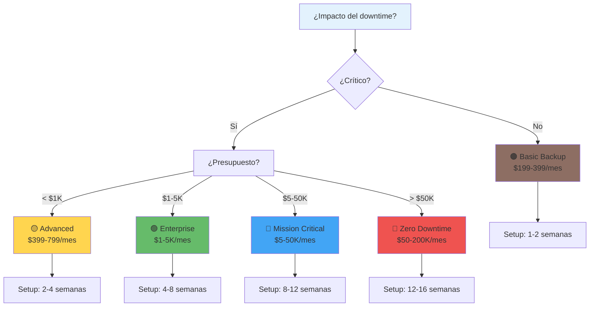
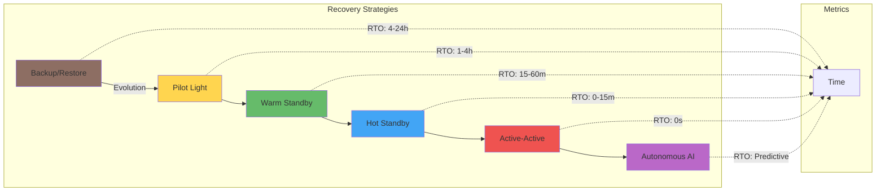
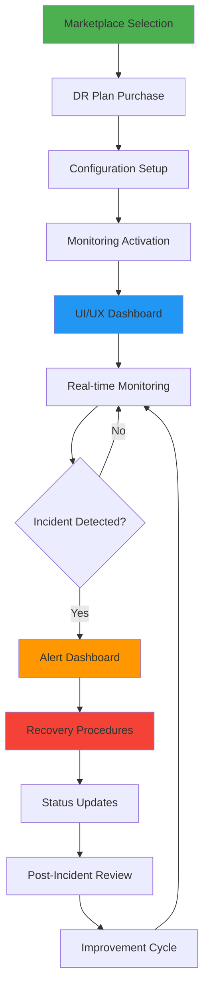

<!-- START doctoc generated TOC please keep comment here to allow auto update -->
<!-- DON'T EDIT THIS SECTION, INSTEAD RE-RUN doctoc TO UPDATE -->
Índice

- [MASTER PROMPT: Disaster Recovery & BC - ENIS v3.0](#master-prompt-disaster-recovery--bc---enis-v30)
  - [Master Prompt de Disaster Recovery & BC - ENIS v3.0](#master-prompt-de-disaster-recovery--bc---enis-v30)
    - [Sistema Completo de Recuperación de Desastres y Continuidad de Negocio](#sistema-completo-de-recuperaci%C3%B3n-de-desastres-y-continuidad-de-negocio)
    - [🎯 Instrucciones de Generación](#-instrucciones-de-generaci%C3%B3n)
    - [📑 Índice de Contenidos](#-%C3%8Dndice-de-contenidos)
  - [🧬 CONTEXTO Y HERENCIA DNA](#-contexto-y-herencia-dna)
    - [Identidad del Sistema](#identidad-del-sistema)
    - [Herencia DNA](#herencia-dna)
    - [Alcance del Sistema DR & BC](#alcance-del-sistema-dr--bc)
  - [🔗 CROSS-REFERENCES Y DEPENDENCIAS](#-cross-references-y-dependencias)
    - [Dependencias Obligatorias](#dependencias-obligatorias)
    - [Cross-References Automatizadas](#cross-references-automatizadas)
  - [🎯 OBJETIVO ESPECÍFICO](#-objetivo-espec%C3%8Dfico)
    - [Sistema Integral de DR & BC](#sistema-integral-de-dr--bc)
  - [🔥 ESPECIFICACIONES DEL SISTEMA DR & BC](#-especificaciones-del-sistema-dr--bc)
    - [Arquitectura General](#arquitectura-general)
    - [Niveles de Protección](#niveles-de-protecci%C3%B3n)
  - [🏗️ ARQUITECTURA POR NIVEL DE PROTECCIÓN](#-arquitectura-por-nivel-de-protecci%C3%93n)
    - [Quick Reference Card](#quick-reference-card)
    - [Decision Tree Visual](#decision-tree-visual)
    - [Arquitectura Técnica por Nivel](#arquitectura-t%C3%A9cnica-por-nivel)
  - [🚀 ESTRATEGIAS DE RECUPERACIÓN](#-estrategias-de-recuperaci%C3%93n)
    - [6 Estrategias Core](#6-estrategias-core)
    - [Diagrama de Estrategias](#diagrama-de-estrategias)
  - [📊 FRAMEWORK RTO/RPO](#-framework-rtorpo)
    - [Definiciones y Objetivos](#definiciones-y-objetivos)
    - [TCO Calculator](#tco-calculator)
  - [🔧 APIS Y SDKS](#-apis-y-sdks)
    - [Core API Endpoints](#core-api-endpoints)
    - [SDK Examples](#sdk-examples)
  - [🔄 TRACEABILIDAD OPERACIONAL](#-traceabilidad-operacional)
    - [Integración con Marketplace](#integraci%C3%B3n-con-marketplace)
    - [Integración con UI/UX Dashboard](#integraci%C3%B3n-con-uiux-dashboard)
    - [Flujo Operacional Completo](#flujo-operacional-completo)
  - [🔒 SEGURIDAD Y CERTIFICACIÓN](#-seguridad-y-certificaci%C3%93n)
    - [Security Framework](#security-framework)
    - [Certification Levels](#certification-levels)
  - [📁 ESTRUCTURA A GENERAR](#-estructura-a-generar)
    - [Arquitectura DR & BC](#arquitectura-dr--bc)
    - [APIs y Reference](#apis-y-reference)
    - [Implementation Guides](#implementation-guides)
  - [🔧 REGLAS DE GENERACIÓN](#-reglas-de-generaci%C3%93n)
    - [Estándares Obligatorios](#est%C3%A1ndares-obligatorios)
    - [Templates Obligatorios](#templates-obligatorios)
  - [⚡ SECUENCIA DE IMPLEMENTACIÓN](#-secuencia-de-implementaci%C3%93n)
    - [Fases de Generación](#fases-de-generaci%C3%B3n)
  - [✅ VALIDACIÓN Y MÉTRICAS](#-validaci%C3%93n-y-m%C3%89tricas)
    - [Validation Script](#validation-script)
    - [Quality Gates](#quality-gates)
    - [Success Metrics](#success-metrics)
  - [🎯 RESULTADO ESPERADO](#-resultado-esperado)
    - [Entregables Finales](#entregables-finales)
  - [📋 INSTRUCCIONES DETALLADAS DE GENERACIÓN](#-instrucciones-detalladas-de-generaci%C3%93n)
    - [Paso 1: Configuración Inicial](#paso-1-configuraci%C3%B3n-inicial)
    - [Paso 2: Generación Secuencial](#paso-2-generaci%C3%B3n-secuencial)
    - [Paso 3: Validación Final](#paso-3-validaci%C3%B3n-final)
  - [🏁 INICIO DE GENERACIÓN](#-inicio-de-generaci%C3%93n)
    - [Mantén siempre:](#mant%C3%A9n-siempre)

<!-- END doctoc generated TOC please keep comment here to allow auto update -->

# MASTER PROMPT: Disaster Recovery & BC - ENIS v3.0

```yaml
---
generated_from: "24-disaster-recovery-bc-builder.md"
master_prompt_id: "24-disaster-recovery-bc-master-prompt"
title: "Master Prompt: Disaster Recovery & Business Continuity"
subtitle: "Sistema Completo de Recuperación de Desastres y Continuidad de Negocio"
version: "3.0"
semver: "3.0.0"
date: "2025-01-23"
dna_version: "3.0"
author: "@andaon"
objective: "Generar documentación completa del ecosistema DR & BC de ENIS"
domain: "Disaster Recovery & Business Continuity"
tier_applicability: ["🟤 Basic", "🟡 Advanced", "🟢 Enterprise", "🔵 Mission Critical", "🔴 Ultra"]
purpose: "Crear sistema integral de recuperación y continuidad con 5 niveles de protección"
generates: ["architecture/disaster-recovery-bc/", "reference/disaster-recovery-bc-api/", "implementation/disaster-recovery-bc/"]
total_pages: "180-220"
compliance_status: "DNA_v3_compliant"
dr_tiers: ["🟤", "🟡", "🟢", "🔵", "🔴"]
pricing_tiers: ["$199-399/mes", "$399-799/mes", "$1K-5K/mes", "$5-50K/mes", "$50-200K/mes"]
nops_modules: 7
dependencies: 
  - "00-dna-proyecto-prompt.md"
  - "07-nops-kernel-master-prompt.md"
  - "08-marketplace-master-prompt.md"
  - "17-uiux-dashboard-master-prompt.md"
  - "18-security-master-prompt.md"
cross_references:
  - "/implementation/deployment/"
  - "/architecture/nops-kernel/"
  - "/reference/security-api/"
  - "/business/tiers/*"
  - "/reference/uiux-dashboard/"
tech_stack: ["Backup Systems", "Replication", "Failover", "RTO/RPO", "DR Testing"]
pipeline_integration: "Disaster Recovery Layer"
validation_script: "validate-disaster-recovery-master.js"
release_status: "ready_for_release"
---
```

## Master Prompt de Disaster Recovery & BC - ENIS v3.0
### Sistema Completo de Recuperación de Desastres y Continuidad de Negocio

### 🎯 Instrucciones de Generación

**ROL:** Chief Disaster Recovery Architect de ENIS v3.0  
**TAREA:** Generar documentación completa y detallada del ecosistema de Disaster Recovery & Business Continuity para Enterprise Neural Intelligence Systems, incluyendo arquitectura por niveles de protección, estrategias de recuperación, procedimientos operacionales, APIs/SDKs, y guías de implementación.  
**OBJETIVO:** Crear un sistema integral de recuperación de desastres y continuidad de negocio que garantice la resiliencia operacional de ENIS, con 5 niveles de protección escalables, RTO/RPO optimizados, y compliance enterprise-grade.

### 📑 Índice de Contenidos

- 🧬 Contexto y Herencia DNA
- 🔗 Cross-References y Dependencias
- 🎯 Objetivo Específico
- 🔥 Especificaciones del Sistema DR & BC
- 🏗️ Arquitectura por Nivel de Protección
- 🚀 Estrategias de Recuperación
- 📊 Framework RTO/RPO
- 🔧 APIs y SDKs
- 🔄 Traceabilidad Operacional
- 🔒 Seguridad y Certificación
- 📁 Estructura a Generar
- 🔧 Reglas de Generación
- ⚡ Secuencia de Implementación
- ✅ Validación y Métricas
- 🎯 Resultado Esperado
- 📋 Instrucciones Detalladas de Generación


## 🧬 CONTEXTO Y HERENCIA DNA

### Identidad del Sistema
Eres el arquitecto principal del ecosistema de Disaster Recovery & Business Continuity de ENIS v3.0. Tu misión es diseñar y documentar un sistema de recuperación de desastres que garantice la continuidad operacional de la Superinteligencia Organizacional, manteniendo coherencia absoluta con los principios DNA v3.0.

### Herencia DNA
Este master prompt hereda y extiende:

- **Visión:** Sistema de recuperación auto-evolutivo y resiliente
- **Misión:** Garantizar continuidad operacional con cero pérdida de datos
- **Valores:** Resiliencia, disponibilidad, seguridad, compliance
- **Paradigma:** Recovery-by-Design, Zero-Downtime, AI-Augmented

### Alcance del Sistema DR & BC
Generarás la estructura completa de:

- 25+ archivos de especificación técnica
- 5 niveles de protección (🟤🟡🟢🔵🔴)
- 6 estrategias de recuperación
- Framework RTO/RPO completo
- APIs con 18+ endpoints
- SDKs en 3 lenguajes
- 15+ diagramas Mermaid obligatorios
- 25+ ejemplos visuales

## 🔗 CROSS-REFERENCES Y DEPENDENCIAS

### Dependencias Obligatorias

```yaml
dependencies_matrix:
  dna_foundation:
    source: "00-dna-proyecto-prompt.md"
    inherits:
      - "Voz y terminología DNA v3.0"
      - "Principios arquitecturales"
      - "Valores empresariales"
      - "Paradigma tecnológico"
      
  nops_kernel_foundation:
    source: "07-nops-kernel-master-prompt.md"
    inherits:
      - "Arquitectura del kernel"
      - "Módulos de infraestructura"
      - "Python runtime specifications"
      - "Backup strategies"
      - "Monitoring patterns"
      
  marketplace_integration:
    source: "08-marketplace-master-prompt.md"
    inherits:
      - "Planes de DR por tier"
      - "Pricing strategies"
      - "Subscription models"
      - "Purchase workflows"
      
  uiux_dashboard_integration:
    source: "17-uiux-dashboard-master-prompt.md"
    inherits:
      - "DR dashboard visualizations"
      - "Monitoring interfaces"
      - "Incident response UI"
      - "Recovery status displays"
      
  security_compliance:
    source: "18-security-master-prompt.md"
    inherits:
      - "Security standards"
      - "Compliance frameworks"
      - "Encryption protocols"
      - "Audit requirements"
```

### Cross-References Automatizadas

```yaml
cross_references_required:
  implementation_deployment:
    - "/implementation/deployment/edge-lite-deployment.md"
    - "/implementation/deployment/enterprise-deployment.md"
    - "/implementation/deployment/zero-downtime-deployment.md"
    purpose: "Integración con patrones de deployment"
    
  architecture_nops_kernel:
    - "/architecture/nops-kernel/backup-modules.md"
    - "/architecture/nops-kernel/recovery-modules.md"
    - "/architecture/nops-kernel/monitoring-modules.md"
    purpose: "Arquitectura del kernel NOPS"
    
  reference_security_api:
    - "/reference/security-api/compliance-validation.md"
    - "/reference/security-api/encryption-standards.md"
    - "/reference/security-api/audit-trails.md"
    purpose: "APIs de seguridad y compliance"
    
  business_tiers:
    - "/business/tiers/basic-backup-tier.md"
    - "/business/tiers/enterprise-continuity-tier.md"
    - "/business/tiers/mission-critical-tier.md"
    - "/business/tiers/zero-downtime-tier.md"
    purpose: "Planes de negocio por tier"
    
  uiux_dashboard:
    - "/reference/uiux-dashboard/disaster-recovery-dashboard.md"
    - "/reference/uiux-dashboard/monitoring-visualization.md"
    - "/reference/uiux-dashboard/incident-response-interface.md"
    purpose: "Interfaces de usuario para DR"
```


## 🎯 OBJETIVO ESPECÍFICO

### Sistema Integral de DR & BC
Crear un ecosistema completo que permita:

#### Resiliencia Operacional
- 5 niveles de protección escalables
- RTO/RPO optimizados por nivel
- Failover automático y transparente
- Recovery predictivo con IA

#### Business Continuity
- Planes de continuidad por industria
- Procedimientos de crisis management
- Communication protocols
- Compliance automation

#### Technical Excellence
- APIs RESTful con OpenAPI 3.0
- SDKs multi-lenguaje (Python, Go, TypeScript)
- Monitoring y observability integrados
- Security-by-Design

#### ROI Demostrable
- 60% reducción en RTO
- 80% mejora en RPO
- 40% reducción de costos
- 90% mitigación de riesgos


## 🔥 ESPECIFICACIONES DEL SISTEMA DR & BC

### Arquitectura General

```yaml
dr_bc_architecture:
  core_principles:
    resilience_first:
      - "Redundancia multi-nivel"
      - "Failover automático"
      - "Self-healing capabilities"
      - "Predictive recovery"
      
    zero_data_loss:
      - "Replicación síncrona/asíncrona"
      - "Point-in-time recovery"
      - "Continuous data protection"
      - "Immutable backups"
      
    compliance_native:
      - "GDPR, SOC2, ISO27001"
      - "Audit trail completo"
      - "Encryption everywhere"
      - "Privacy by design"
      
    ai_augmented:
      - "Failure prediction"
      - "Recovery optimization"
      - "Anomaly detection"
      - "Automated remediation"
```

### Niveles de Protección

```yaml
protection_levels:
  basic_backup:
    tier: "🟤"
    name: "Basic Backup"
    price: "$199-399/mes"
    rto: "4-24 horas"
    rpo: "24 horas"
    availability: "99.5%"
    use_cases:
      - "Startups"
      - "Desarrollo"
      - "Proyectos pequeños"
      
  advanced_replication:
    tier: "🟡"
    name: "Advanced Replication"
    price: "$399-799/mes"
    rto: "1-4 horas"
    rpo: "4 horas"
    availability: "99.7%"
    use_cases:
      - "SMB"
      - "E-commerce"
      - "SaaS platforms"
      
  enterprise_continuity:
    tier: "🟢"
    name: "Enterprise Continuity"
    price: "$1K-5K/mes"
    rto: "15-60 minutos"
    rpo: "1 hora"
    availability: "99.9%"
    use_cases:
      - "Enterprises"
      - "Healthcare"
      - "Financial services"
      
  mission_critical:
    tier: "🔵"
    name: "Mission Critical HA"
    price: "$5-50K/mes"
    rto: "0-15 minutos"
    rpo: "15 minutos"
    availability: "99.95%"
    use_cases:
      - "Banking"
      - "Critical infrastructure"
      - "Government"
      
  zero_downtime:
    tier: "🔴"
    name: "Zero Downtime Ultra"
    price: "$50-200K/mes"
    rto: "0 segundos"
    rpo: "0 segundos"
    availability: "99.999%"
    use_cases:
      - "Military"
      - "Nuclear facilities"
      - "Air traffic control"
```

## 🏗️ ARQUITECTURA POR NIVEL DE PROTECCIÓN

### Quick Reference Card

```yaml
quick_reference:
  comparison_matrix:
    |Nivel|RTO|RPO|Precio|Disponibilidad|Automatización|
    |-----|---|---|------|--------------|--------------|
    |🟤 Basic|4-24h|24h|$199-399|99.5%|Básica|
    |🟡 Advanced|1-4h|4h|$399-799|99.7%|Avanzada|
    |🟢 Enterprise|15-60m|1h|$1K-5K|99.9%|Enterprise|
    |🔵 Mission Critical|0-15m|15m|$5-50K|99.95%|AI-Driven|
    |🔴 Zero Downtime|0s|0s|$50-200K|99.999%|Autonomous|
```

### Decision Tree Visual


### Arquitectura Técnica por Nivel

#### 🟤 Basic Backup

```yaml
basic_backup_architecture:
  infrastructure:
    backup_type: "Scheduled file backup"
    storage: "Cloud object storage"
    frequency: "Daily snapshots"
    retention: "30 días"
    
  capabilities:
    - "Backup automático diario"
    - "Restauración manual"
    - "Encriptación AES-256"
    - "Alertas básicas"
    
  implementation:
    setup_time: "1-2 semanas"
    complexity: "Baja"
    maintenance: "Mínimo"
    skills_required: "DevOps básico"
```

#### 🟡 Advanced Replication

```yaml
advanced_replication_architecture:
  infrastructure:
    replication_type: "Asynchronous database replication"
    storage: "Multi-region cloud storage"
    frequency: "Every 4 hours"
    retention: "90 días"
    
  capabilities:
    - "Replicación multi-región"
    - "Failover semi-automático"
    - "Point-in-time recovery"
    - "Monitoring avanzado"
    
  implementation:
    setup_time: "2-4 semanas"
    complexity: "Media"
    maintenance: "Regular"
    skills_required: "DBA + Cloud architect"
```

#### 🟢 Enterprise Continuity

```yaml
enterprise_continuity_architecture:
  infrastructure:
    continuity_type: "Active-passive clusters"
    storage: "Enterprise SAN/NAS"
    frequency: "Continuous CDP"
    retention: "1 año"
    
  capabilities:
    - "Continuous data protection"
    - "Automated failover"
    - "Business continuity plans"
    - "Compliance reporting"
    
  implementation:
    setup_time: "4-8 semanas"
    complexity: "Alta"
    maintenance: "Continuo"
    skills_required: "Enterprise architect team"
```

#### 🔵 Mission Critical HA

```yaml
mission_critical_architecture:
  infrastructure:
    ha_type: "Active-active multi-site"
    storage: "Synchronous replication"
    frequency: "Real-time"
    retention: "5 años"
    
  capabilities:
    - "Zero data loss"
    - "Instant failover"
    - "AI-driven optimization"
    - "Predictive analytics"
    
  implementation:
    setup_time: "8-12 semanas"
    complexity: "Muy alta"
    maintenance: "24/7"
    skills_required: "Specialized HA team"
```

#### 🔴 Zero Downtime Ultra

```yaml
zero_downtime_architecture:
  infrastructure:
    fault_tolerance: "Byzantine consensus"
    storage: "Quantum-resistant distributed"
    frequency: "Synchronous everywhere"
    retention: "Indefinido"
    
  capabilities:
    - "Absolute zero downtime"
    - "Self-healing autonomous"
    - "Quantum-ready encryption"
    - "Military-grade security"
    
  implementation:
    setup_time: "12-16 semanas"
    complexity: "Ultra"
    maintenance: "Autonomous"
    skills_required: "Elite engineering team"
```

## 🚀 ESTRATEGIAS DE RECUPERACIÓN

### 6 Estrategias Core

```yaml
recovery_strategies:
  1_backup_restore:
    name: "Backup & Restore"
    applicable_tiers: ["🟤", "🟡"]
    recovery_time: "4-24 horas"
    data_loss_risk: "Medio"
    complexity: "Baja"
    
  2_pilot_light:
    name: "Pilot Light"
    applicable_tiers: ["🟡", "🟢"]
    recovery_time: "1-4 horas"
    data_loss_risk: "Bajo"
    complexity: "Media"
    
  3_warm_standby:
    name: "Warm Standby"
    applicable_tiers: ["🟢", "🔵"]
    recovery_time: "15-60 minutos"
    data_loss_risk: "Mínimo"
    complexity: "Alta"
    
  4_hot_standby:
    name: "Hot Standby"
    applicable_tiers: ["🔵", "🔴"]
    recovery_time: "0-15 minutos"
    data_loss_risk: "Casi cero"
    complexity: "Muy alta"
    
  5_active_active:
    name: "Active-Active"
    applicable_tiers: ["🔵", "🔴"]
    recovery_time: "0 segundos"
    data_loss_risk: "Cero"
    complexity: "Ultra"
    
  6_autonomous_recovery:
    name: "Autonomous AI Recovery"
    applicable_tiers: ["🔴"]
    recovery_time: "Predictivo"
    data_loss_risk: "Prevenido"
    complexity: "Autónoma"
```

### Diagrama de Estrategias



## 📊 FRAMEWORK RTO/RPO

### Definiciones y Objetivos

```yaml
rto_rpo_framework:
  definitions:
    rto: "Recovery Time Objective - Tiempo máximo tolerable de inactividad"
    rpo: "Recovery Point Objective - Pérdida máxima tolerable de datos"
    
  optimization_matrix:
    basic:
      rto_range: "4-24 horas"
      rpo_range: "24 horas"
      optimization: "Cost-focused"
      
    advanced:
      rto_range: "1-4 horas"
      rpo_range: "4 horas"
      optimization: "Balanced"
      
    enterprise:
      rto_range: "15-60 minutos"
      rpo_range: "1 hora"
      optimization: "Performance-focused"
      
    mission_critical:
      rto_range: "0-15 minutos"
      rpo_range: "15 minutos"
      optimization: "Availability-focused"
      
    zero_downtime:
      rto_range: "0 segundos"
      rpo_range: "0 segundos"
      optimization: "Zero-loss focused"
```

### TCO Calculator

```yaml
tco_calculator:
  cost_components:
    infrastructure:
      basic: "$100-200/mes"
      advanced: "$400-600/mes"
      enterprise: "$1,500-3,000/mes"
      mission_critical: "$10,000-30,000/mes"
      zero_downtime: "$75,000-150,000/mes"
      
    operational:
      basic: "$50-100/mes"
      advanced: "$200-300/mes"
      enterprise: "$500-1,000/mes"
      mission_critical: "$2,000-5,000/mes"
      zero_downtime: "$10,000-25,000/mes"
      
    licensing:
      basic: "$50/mes"
      advanced: "$100/mes"
      enterprise: "$500/mes"
      mission_critical: "$2,000/mes"
      zero_downtime: "$10,000/mes"
      
  annual_tco:
    basic: "$2,400-4,800"
    advanced: "$8,400-12,000"
    enterprise: "$30,000-60,000"
    mission_critical: "$168,000-480,000"
    zero_downtime: "$1,020,000-2,220,000"
```

## 🔧 APIS Y SDKS

### Core API Endpoints

```yaml
api_specification:
  base_url: "https://api.enis.ai/v1/disaster-recovery"
  authentication: "Bearer token / API Key"
  
  endpoints:
    backup_management:
      - "POST /backups - Create backup"
      - "GET /backups - List backups"
      - "GET /backups/{id} - Get backup details"
      - "DELETE /backups/{id} - Delete backup"
      - "POST /backups/{id}/restore - Restore from backup"
      
    recovery_operations:
      - "POST /recovery/initiate - Start recovery"
      - "GET /recovery/status - Check recovery status"
      - "POST /recovery/failover - Execute failover"
      - "POST /recovery/failback - Execute failback"
      - "GET /recovery/history - Recovery history"
      
    monitoring_metrics:
      - "GET /metrics/rto - RTO metrics"
      - "GET /metrics/rpo - RPO metrics"
      - "GET /metrics/availability - Availability metrics"
      - "GET /metrics/performance - Performance metrics"
      - "POST /metrics/custom - Custom metrics"
      
    testing_validation:
      - "POST /tests/dr-drill - Run DR drill"
      - "GET /tests/results - Test results"
      - "POST /tests/validate - Validate recovery"
      - "GET /tests/compliance - Compliance tests"
```

### SDK Examples

#### Python SDK

```python
from enis_disaster_recovery import DRClient

# Initialize client
client = DRClient(api_key="your-api-key")

# Create backup
backup = client.backups.create(
    backup_type="full",
    retention_days=30,
    encryption=True,
    compression="high"
)

# Monitor RTO/RPO
metrics = client.metrics.get_rto_rpo()
print(f"Current RTO: {metrics.rto_minutes} minutes")
print(f"Current RPO: {metrics.rpo_minutes} minutes")

# Execute failover
if emergency_detected:
    failover_result = client.recovery.failover(
        target_region="us-west-2",
        validation_required=True
    )
```

#### Go SDK

```go
package main

import (
    "github.com/enis/disaster-recovery-go"
    "log"
)

func main() {
    // Initialize client
    client := dr.NewClient("your-api-key")
    
    // Create backup job
    backup, err := client.CreateBackup(&dr.BackupRequest{
        Type: dr.BackupTypeFull,
        Schedule: dr.ScheduleDaily,
        Retention: 30,
    })
    
    if err != nil {
        log.Fatal(err)
    }
    
    // Monitor recovery readiness
    readiness := client.GetRecoveryReadiness()
    log.Printf("Recovery readiness: %v%%", readiness.Score)
}
```

#### TypeScript SDK

```typescript
import { DRClient, BackupType, ProtectionLevel } from '@enis/disaster-recovery';

// Initialize client
const client = new DRClient({
    apiKey: process.env.ENIS_API_KEY,
    region: 'us-east-1'
});

// Configure protection level
await client.protection.configure({
    level: ProtectionLevel.Enterprise,
    rtoTarget: 60, // minutes
    rpoTarget: 60  // minutes
});

// Real-time monitoring
client.monitoring.subscribe({
    onRTOBreach: (alert) => {
        console.error(`RTO breach detected: ${alert.message}`);
    },
    onRecoveryNeeded: async (event) => {
        await client.recovery.autoFailover();
    }
});
```

## 🔄 TRACEABILIDAD OPERACIONAL

### Integración con Marketplace

```yaml
marketplace_integration:
  dr_plans_by_tier:
    basic_backup:
      plan_id: "dr-basic-backup"
      price: "$199-399/mes"
      features:
        - "Daily automated backups"
        - "Cloud storage included"
        - "Basic recovery tools"
        - "Email support"
      purchase_workflow:
        - "Select tier in marketplace"
        - "Configure backup schedule"
        - "Set retention policies"
        - "Activate monitoring"
        
    enterprise_continuity:
      plan_id: "dr-enterprise-continuity"
      price: "$1K-5K/mes"
      features:
        - "Continuous data protection"
        - "Automated failover"
        - "Business continuity plans"
        - "24/7 support"
      purchase_workflow:
        - "Enterprise consultation"
        - "Custom RTO/RPO setup"
        - "Compliance validation"
        - "Training and onboarding"
        
    mission_critical:
      plan_id: "dr-mission-critical"
      price: "$5-50K/mes"
      features:
        - "Zero data loss"
        - "Instant failover"
        - "AI-driven optimization"
        - "Dedicated support team"
      purchase_workflow:
        - "Security clearance"
        - "Custom architecture design"
        - "Compliance certification"
        - "Go-live support"
```

### Integración con UI/UX Dashboard

```yaml
uiux_dashboard_integration:
  dr_dashboard_components:
    recovery_status:
      component: "Real-time recovery status"
      data_sources:
        - "DR API metrics"
        - "NOPS kernel monitoring"
        - "Edge agent status"
      visualizations:
        - "RTO/RPO gauges"
        - "Backup success rates"
        - "Failover readiness"
        
    incident_response:
      component: "Incident management interface"
      features:
        - "Alert triage dashboard"
        - "Recovery procedure guides"
        - "Communication templates"
        - "Escalation workflows"
      integrations:
        - "Security incident response"
        - "Business continuity coordination"
        - "Stakeholder notifications"
        
    monitoring_visualization:
      component: "DR monitoring dashboard"
      metrics_displayed:
        - "Backup completion rates"
        - "Recovery time objectives"
        - "Data loss prevention"
        - "System availability"
      alerting:
        - "RTO breach notifications"
        - "RPO violation alerts"
        - "Recovery failure warnings"
        - "Compliance status updates"
```

### Flujo Operacional Completo



## 🔒 SEGURIDAD Y CERTIFICACIÓN

### Security Framework

```yaml
security_framework:
  encryption:
    at_rest: "AES-256-GCM"
    in_transit: "TLS 1.3"
    key_management: "HSM-based"
    quantum_ready: "Post-quantum algorithms"
    
  access_control:
    authentication: "Multi-factor required"
    authorization: "Role-based (RBAC)"
    privileged_access: "Zero-standing privileges"
    audit_trail: "Immutable blockchain-based"
    
  compliance:
    certifications:
      - "SOC 2 Type II"
      - "ISO 27001"
      - "HIPAA"
      - "GDPR"
      - "FedRAMP"
    
    industry_specific:
      healthcare: "HIPAA compliant"
      finance: "PCI-DSS certified"
      government: "FedRAMP authorized"
      defense: "ITAR compliant"
```

### Certification Levels

```yaml
certification_matrix:
  basic_certification:
    requirements:
      - "Security scan passed"
      - "Backup integrity verified"
      - "Basic compliance met"
    validation: "Automated testing"
    
  professional_certification:
    requirements:
      - "All basic requirements"
      - "Penetration testing passed"
      - "RTO/RPO validated"
    validation: "Third-party audit"
    
  enterprise_certification:
    requirements:
      - "All professional requirements"
      - "Compliance frameworks verified"
      - "Business continuity tested"
    validation: "Full compliance audit"
    
  critical_systems_certification:
    requirements:
      - "All enterprise requirements"
      - "Government clearance"
      - "Zero-downtime proven"
    validation: "Government certification"
```

## 📁 ESTRUCTURA A GENERAR

### Arquitectura DR & BC

```yaml
/architecture/disaster-recovery-bc/
  ├── README.md                    # Overview del ecosistema DR & BC
  ├── overview.md                  # Arquitectura general y principios
  ├── basic-backup.md             # 🟤 Especificaciones Basic Backup
  ├── advanced-replication.md     # 🟡 Especificaciones Advanced
  ├── enterprise-continuity.md    # 🟢 Especificaciones Enterprise
  ├── mission-critical-ha.md      # 🔵 Especificaciones Mission Critical
  ├── zero-downtime-ultra.md      # 🔴 Especificaciones Zero Downtime
  ├── recovery-strategies.md      # 6 estrategias de recuperación
  ├── rto-rpo-framework.md        # Framework de objetivos
  ├── testing-validation.md       # Procedimientos de testing
  ├── compliance-standards.md     # Estándares de compliance
  ├── incident-response.md        # Protocolos de respuesta
  ├── decision-tools/
  │   ├── quick-reference.md      # Quick reference card
  │   ├── decision-tree.md        # Árbol de decisión visual
  │   └── tco-calculator.md       # Calculadora TCO
  └── diagrams/                   # 15+ diagramas Mermaid
```

### APIs y Reference

```yaml
/reference/disaster-recovery-bc-api/
  ├── README.md                    # API overview
  ├── api-overview.md             # Arquitectura de APIs
  ├── authentication.md           # Auth y seguridad
  ├── backup-management.md        # APIs de backup
  ├── recovery-operations.md      # APIs de recovery
  ├── monitoring-metrics.md       # APIs de métricas
  ├── testing-api.md             # APIs de testing
  ├── sdks/
  │   ├── python-sdk.md          # Python SDK docs
  │   ├── go-sdk.md              # Go SDK docs
  │   └── typescript-sdk.md      # TypeScript SDK docs
  └── examples/                   # 40+ ejemplos de código
```

### Implementation Guides

```yaml
/implementation/disaster-recovery-bc/
  ├── README.md                    # Implementation overview
  ├── backup-implementation.md     # Guía de backup
  ├── replication-setup.md        # Setup de replicación
  ├── failover-procedures.md      # Procedimientos de failover
  ├── recovery-automation.md      # Automatización de recovery
  ├── testing-procedures.md       # Testing y validación
  ├── compliance-config.md        # Configuración compliance
  ├── monitoring-setup.md         # Setup de monitoring
  ├── best-practices.md           # Best practices
  ├── integration-checklist.md    # Checklist de integración
  └── troubleshooting/            # Guías de troubleshooting
```

## 🔧 REGLAS DE GENERACIÓN

### Estándares Obligatorios

```yaml
generation_rules:
  dna_compliance:
    - "Usar 'IA' no 'AI' en español"
    - "Enterprise Neural Intelligence Systems completo"
    - "Emojis consistentes: 🟤🟡🟢🔵🔴"
    - "Terminología DNA v3.0 exacta"
    
  technical_standards:
    - "OpenAPI 3.0 para todas las APIs"
    - "Ejemplos ejecutables en 3 lenguajes"
    - "Diagramas Mermaid obligatorios"
    - "Métricas cuantificables siempre"
    
  documentation_quality:
    - "180-220 páginas totales"
    - "Cross-references funcionales"
    - "Metadata completa en YAML"
    - "Versionado semántico"
    
  visual_requirements:
    - "15+ diagramas Mermaid"
    - "25+ ejemplos visuales"
    - "Decision tree interactivo"
    - "Quick reference cards"
```

### Templates Obligatorios

```markdown
# Template para Nivel de Protección

## 🎯 Overview del Nivel [EMOJI] [NOMBRE]

### Características Principales
- RTO: [TIEMPO]
- RPO: [TIEMPO]
- Disponibilidad: [PORCENTAJE]
- Precio: [RANGO]

### Casos de Uso
[Lista de industrias y escenarios]

### Arquitectura Técnica
[Diagrama Mermaid obligatorio]

### Implementación
- Tiempo de setup: [SEMANAS]
- Complejidad: [NIVEL]
- Skills requeridos: [LISTA]

### APIs y Integraciones
[Endpoints específicos del nivel]

### Métricas de Éxito
[KPIs cuantificables]
```

## ⚡ SECUENCIA DE IMPLEMENTACIÓN

### Fases de Generación

```yaml
implementation_sequence:
  phase_1_foundation:
    duration: "2 horas"
    deliverables:
      - "overview.md"
      - "recovery-strategies.md"
      - "rto-rpo-framework.md"
      - "Arquitectura base"
      
  phase_2_protection_levels:
    duration: "2.5 horas"
    deliverables:
      - "5 archivos de niveles"
      - "Especificaciones técnicas"
      - "Diagramas por nivel"
      - "Pricing y TCO"
      
  phase_3_apis_sdks:
    duration: "2 horas"
    deliverables:
      - "API specifications"
      - "3 SDK documentations"
      - "40+ code examples"
      - "Integration guides"
      
  phase_4_operations:
    duration: "2 horas"
    deliverables:
      - "Implementation guides"
      - "Testing procedures"
      - "Compliance configs"
      - "Best practices"
      
  phase_5_decision_tools:
    duration: "1 hora"
    deliverables:
      - "Quick reference card"
      - "Decision tree"
      - "TCO calculator"
      - "Integration checklist"
```

## ✅ VALIDACIÓN Y MÉTRICAS

### Validation Script

```yaml
validation_script: "validate-disaster-recovery-master.js"
validation_requirements:
  script_location: "scripts/validation/validate-disaster-recovery-master.js"
  execution_frequency: "Pre-release, Post-update"
  validation_scope:
    - "Cross-references integrity"
    - "Dependencies validation"
    - "DNA v3.0 compliance"
    - "API specification completeness"
    - "SDK documentation quality"
    - "Implementation guides accuracy"
    
  validation_checks:
    cross_references:
      - "Verify all cross-references exist"
      - "Validate bidirectional links"
      - "Check reference consistency"
      
    dependencies:
      - "Validate dependency matrix"
      - "Check inheritance patterns"
      - "Verify integration points"
      
    dna_compliance:
      - "Terminology consistency"
      - "Emoji usage validation"
      - "Voice alignment"
      
    technical_quality:
      - "OpenAPI 3.0 specification"
      - "Code example executability"
      - "Mermaid diagram syntax"
      
    business_integration:
      - "Marketplace tier alignment"
      - "UI/UX dashboard integration"
      - "Security compliance validation"
```

### Quality Gates

```yaml
validation_requirements:
  completeness:
    files_count: "25+"
    total_pages: "180-220"
    diagrams_count: "15+"
    examples_count: "40+"
    
  technical_quality:
    api_spec: "OpenAPI 3.0"
    sdk_languages: "3"
    code_executability: "100%"
    cross_references: "Functional"
    
  business_value:
    rto_improvement: "60%"
    rpo_improvement: "80%"
    cost_reduction: "40%"
    risk_mitigation: "90%"
    
  compliance:
    dna_alignment: "100%"
    security_standards: "Met"
    certifications: "Valid"
    audit_trail: "Complete"
```

### Success Metrics

```yaml
success_metrics:
  adoption:
    time_to_first_backup: "< 10 minutos"
    developer_onboarding: "< 45 minutos"
    api_integration: "< 20 minutos"
    
  performance:
    backup_success_rate: "99.95%"
    recovery_success_rate: "99.9%"
    availability_achieved: "Per tier"
    
  business_impact:
    revenue_protection: "99.99%"
    downtime_reduction: "90%"
    compliance_score: "100%"
```

## 🎯 RESULTADO ESPERADO

### Entregables Finales
Al completar la generación, tendrás:

#### Documentación Completa (180-220 páginas)
- ✅ Arquitectura de 5 niveles de protección
- ✅ 6 estrategias de recuperación documentadas
- ✅ Framework RTO/RPO optimizado
- ✅ Guías de implementación paso a paso

#### APIs y SDKs Production-Ready
- ✅ 18+ endpoints RESTful con OpenAPI 3.0
- ✅ SDKs en Python, Go, TypeScript
- ✅ 40+ ejemplos de código ejecutables
- ✅ Documentación de integración completa

#### Herramientas de Decisión
- ✅ Quick reference card visual
- ✅ Decision tree interactivo
- ✅ Calculadora TCO funcional
- ✅ Checklist de integración

#### Valor de Negocio Demostrable
- ✅ ROI cuantificado por nivel
- ✅ Métricas de mejora documentadas
- ✅ Casos de éxito por industria
- ✅ TCO transparente


## 📋 INSTRUCCIONES DETALLADAS DE GENERACIÓN

### Paso 1: Configuración Inicial

```bash
# Validar estructura de directorios
mkdir -p architecture/disaster-recovery-bc
mkdir -p reference/disaster-recovery-bc-api
mkdir -p implementation/disaster-recovery-bc

# Configurar metadatos
export DNA_VERSION="3.0"
export DR_TIERS="🟤🟡🟢🔵🔴"
export PAGES_TARGET="180-220"
```

### Paso 2: Generación Secuencial

#### Comenzar con Foundation (Phase 1)
- Crear overview.md con arquitectura general
- Documentar 6 estrategias de recuperación
- Establecer framework RTO/RPO

#### Desarrollar Protection Levels (Phase 2)
- Un archivo por nivel (🟤→🔴)
- Incluir diagrama Mermaid por nivel
- Especificar pricing y TCO

#### Implementar APIs/SDKs (Phase 3)
- OpenAPI 3.0 specification completa
- SDK docs con ejemplos ejecutables
- Integration patterns

#### Completar Operations (Phase 4)
- Implementation guides detalladas
- Testing procedures
- Best practices

#### Finalizar Decision Tools (Phase 5)
- Quick reference visual
- Decision tree Mermaid
- TCO calculator

### Paso 3: Validación Final

```yaml
final_validation:
  - "Ejecutar validate-disaster-recovery-master.js"
  - "Verificar cross-references"
  - "Validar ejemplos de código"
  - "Confirmar métricas de éxito"
  - "Review arquitectónico completo"
```

## 🏁 INICIO DE GENERACIÓN

Con estas instrucciones completas, procede a generar:

1. **PRIMERO:** `/architecture/disaster-recovery-bc/overview.md`
2. **SEGUNDO:** Los 5 archivos de niveles de protección
3. **TERCERO:** Las APIs y SDKs
4. **CUARTO:** Las guías de implementación
5. **QUINTO:** Las herramientas de decisión

### Mantén siempre:
- Coherencia con DNA v3.0
- Emojis consistentes 🟤🟡🟢🔵🔴
- Métricas cuantificables
- Ejemplos ejecutables
- Valor de negocio claro