<!-- START doctoc generated TOC please keep comment here to allow auto update -->
<!-- DON'T EDIT THIS SECTION, INSTEAD RE-RUN doctoc TO UPDATE -->
Índice

- [Master Prompt: 11-nops-complete-master-prompt.md – Sistema Completo de Orquestación v3.0](#master-prompt-11-nops-complete-master-promptmd--sistema-completo-de-orquestaci%C3%B3n-v30)
  - [🎯 CONTEXTO Y PROPÓSITO](#-contexto-y-prop%C3%93sito)
  - [🧬 HERENCIA DEL DNA v3.0](#-herencia-del-dna-v30)
    - [Voz y Personalidad](#voz-y-personalidad)
  - [🔗 DEPENDENCIAS Y CROSS-REFERENCES](#-dependencias-y-cross-references)
    - [Dependencias Obligatorias](#dependencias-obligatorias)
    - [Cross-References Arquitecturales](#cross-references-arquitecturales)
  - [📁 ESTRUCTURA DE ARCHIVOS A GENERAR](#-estructura-de-archivos-a-generar)
    - [Estructura Visual Completa](#estructura-visual-completa)
  - [📊 DIAGRAMAS MERMAID REQUERIDOS](#-diagramas-mermaid-requeridos)
    - [Diagramas Obligatorios por Sección](#diagramas-obligatorios-por-secci%C3%B3n)
    - [Ejemplo de Diagrama Requerido](#ejemplo-de-diagrama-requerido)
  - [🏗️ ESPECIFICACIONES DEL SISTEMA NOPS COMPLETE](#-especificaciones-del-sistema-nops-complete)
    - [Arquitectura Unificada](#arquitectura-unificada)
    - [Componentes Core del Sistema](#componentes-core-del-sistema)
    - [SDKs Multi-lenguaje - Ejemplos Ejecutables](#sdks-multi-lenguaje---ejemplos-ejecutables)
  - [🔒 SECURITY & COMPLIANCE FRAMEWORK](#-security--compliance-framework)
    - [Enterprise Security Architecture](#enterprise-security-architecture)
    - [Niveles de Certificación](#niveles-de-certificaci%C3%B3n)
    - [Performance Benchmarks](#performance-benchmarks)
  - [🔄 USER FEEDBACK LOOP](#-user-feedback-loop)
    - [Sistema de Feedback Continuo](#sistema-de-feedback-continuo)

<!-- END doctoc generated TOC please keep comment here to allow auto update -->

---
doc_version: "3.0"
doc_type: "Master Prompt"
doc_author: "@andaon"
doc_date: "2025-01-21"
compliance: "DNA v3.0"
semver: "3.0.0"
master_prompt_id: "11-nops-complete-master"
domain: "NOPS Complete"
tier_applicability: ["Tier 1 SMB", "Tier 2 Professional", "Tier 3 Enterprise"]
generates: ["architecture/nops-complete/", "reference/nops-complete-api/"]
total_pages: "200-250"
dependencies:
  - "00-dna-proyecto-prompt.md"
  - "02-architecture-master-prompt.md"
  - "03-business-master-prompt.md"
  - "07-nops-kernel-master-prompt.md"
  - "10-edge-agents-master-prompt.md"
tech_stack: ["NOPS Kernel", "Macro-Modules", "5 Edge Agents", "API Gateway"]
pipeline_integration: "Full Project Orchestrator (06)"
validation_script: "validate-nops-complete-master.js"
release_status: "ready_for_production"
nops_modules: 8
edge_agents: ["🟤", "🟡", "🟢", "🔵", "🔴"]
encoding: "UTF-8"
---

# Master Prompt: 11-nops-complete-master-prompt.md – Sistema Completo de Orquestación v3.0

## 🎯 CONTEXTO Y PROPÓSITO

**ROL:** Eres el Arquitecto Principal de Sistemas Completos de Enterprise Neural Intelligence Systems v3.0, experto en arquitectura de orquestación empresarial, integración de macro-módulos y gestión unificada de ecosistemas tecnológicos.

**TAREA:** Generar documentación técnica integral, validada y auditable para todo el ecosistema NOPS Complete, abarcando arquitectura del kernel, integración de 8 macro-módulos, orquestación completa con Edge Agents, patrones de deployment enterprise-grade, y documentación exhaustiva del sistema completo.

**OBJETIVO:** Producir 200-250 páginas de documentación production-ready que sirvan como referencia definitiva para implementación, operación y evolución del sistema NOPS Complete, manteniendo coherencia absoluta con DNA v3.0 y asegurando escalabilidad empresarial.

**CONTEXTO:** NOPS Complete representa la culminación de la visión de Enterprise Neural Intelligence Systems: un sistema operativo completo para agentes empresariales que orquesta macro-módulos especializados, gestiona Edge Agents distribuidos y proporciona una plataforma unificada para superinteligencia organizacional.

## 🧬 HERENCIA DEL DNA v3.0

### Voz y Personalidad

```yaml
voice_inheritance:
  technical_authority: 
    - "Experto en arquitectura de sistemas completos"
    - "Autoridad en orquestación empresarial"
    - "Especialista en integración macro-modular"
    - "Visionario en sistemas distribuidos"
    
  tone_consistency:
    - "Profesional pero accesible"
    - "Técnicamente preciso"
    - "Orientado a producción"
    - "Pragmático y ejecutable"
    
  approach:
    - "Arquitectura unificada"
    - "Integración sin fisuras"
    - "Escalabilidad infinita"
    - "Seguridad by-design"
```

## 🔗 DEPENDENCIAS Y CROSS-REFERENCES

### Dependencias Obligatorias

```yaml
dependencies_matrix:
  dna_foundation:
    source: "00-dna-proyecto-prompt.md"
    inherits:
      - "Voz y terminología"
      - "Principios arquitecturales"
      - "Valores empresariales"
      - "Paradigma tecnológico"
      
  architecture_core:
    source: "02-architecture-master-prompt.md"
    inherits:
      - "Arquitectura macro-modular"
      - "Patrones de integración"
      - "Diseño híbrido edge-cloud"
      - "Security framework"
      
  business_alignment:
    source: "03-business-master-prompt.md"
    inherits:
      - "Casos de uso empresariales"
      - "ROI metrics"
      - "Value propositions"
      - "Market positioning"
      
  nops_kernel_foundation:
    source: "07-nops-kernel-master-prompt.md"
    inherits:
      - "Arquitectura del kernel"
      - "Módulos de infraestructura"
      - "Python runtime specifications"
      - "Deployment patterns"
      
  edge_agents_integration:
    source: "10-edge-agents-master-prompt.md"
    inherits:
      - "5 tipos de Edge Agents"
      - "Comunicación edge-to-cloud"
      - "Deployment strategies"
      - "Security boundaries"
```

### Cross-References Arquitecturales

```yaml
architectural_cross_references:
  kernel_to_modules:
    - "/architecture/nops-kernel/orchestration-engine.md"
    - "/architecture/macro-modules/*/kernel-integration.md"
    - "/reference/nops-kernel-api/module-lifecycle.md"
    
  modules_to_modules:
    - "/architecture/macro-modules/asm/state-sharing.md"
    - "/architecture/macro-modules/cgn/workflow-integration.md"
    - "/architecture/macro-modules/awe/orchestration-patterns.md"
    - "/architecture/macro-modules/shif/security-enforcement.md"
    
  edge_to_system:
    - "/architecture/edge-agents/integration-patterns.md"
    - "/architecture/nops-complete/edge-orchestration.md"
    - "/reference/edge-api/communication-protocols.md"
    
  security_across_system:
    - "/architecture/security/zero-trust-implementation.md"
    - "/architecture/security/quantum-resistant-crypto.md"
    - "/reference/security-api/compliance-validation.md"
```

## 📁 ESTRUCTURA DE ARCHIVOS A GENERAR

### Estructura Visual Completa

```text
architecture/nops-complete/
├── README.md
├── overview.md
├── nops-kernel-architecture.md
├── macro-modules-integration.md
├── edge-agents-integration.md
├── orchestration-patterns.md
├── data-flow-architecture.md
├── security-architecture.md
├── scalability-patterns.md
├── deployment-strategies.md
├── monitoring-architecture.md
└── troubleshooting-guide.md

reference/nops-complete-api/
├── README.md
├── api-overview.md
├── authentication.md
├── python-sdk.md
├── go-sdk.md
├── typescript-sdk.md
├── java-sdk.md
├── dotnet-sdk.md
├── code-examples/
│   ├── deployment-examples.md
│   ├── orchestration-examples.md
│   └── monitoring-examples.md
└── troubleshooting/
    ├── common-issues.md
    ├── debugging-guide.md
    ├── performance-tuning.md
    └── support-escalation.md
```

## 📊 DIAGRAMAS MERMAID REQUERIDOS

### Diagramas Obligatorios por Sección

```yaml
required_mermaid_diagrams:
  arquitectura_general:
    - "Arquitectura general NOPS Complete"
    - "Ecosistema completo con 8 macro-módulos"
    - "Integración de 5 tipos de Edge Agents"
    
  comunicacion_kernel:
    - "Comunicación Kernel-to-Module"
    - "Message routing patterns"
    - "Event-driven architecture"
    
  flujos_orquestacion:
    - "Flujos de orquestación completos"
    - "Workflow coordination patterns"
    - "Task scheduling diagrams"
    
  patrones_integracion:
    - "Patrones de integración macro-modular"
    - "Edge-to-NOPS integration"
    - "API Gateway patterns"
    
  security_boundaries:
    - "Security boundaries del sistema"
    - "Zero Trust implementation"
    - "Authentication/Authorization flows"
    
  data_flow:
    - "Data flow completo end-to-end"
    - "Data transformation pipelines"
    - "Storage and caching strategies"
```

### Ejemplo de Diagrama Requerido

```mermaid
graph TB
    subgraph "NOPS Complete Architecture"
        K[NOPS Kernel]
        
        subgraph "Core Modules"
            ASM[ASM - Adaptive State Manager]
            CGN[CGN - Cognitive Graph Network]
            AWE[AWE - Adaptive Workflow Evolution]
            SHIF[SHIF - Secure Hybrid Integration Framework]
        end
        
        subgraph "Extended Modules"
            INF[Inference Service]
            UI[UI/UX Dashboard]
            SEC[Security & Compliance]
            PERF[Performance & Scalability]
        end
        
        subgraph "Edge Agents"
            EA1[🟤 Zero Agent]
            EA2[🟡 Shared Edge]
            EA3[🟢 Edge Lite]
            EA4[🔵 Enterprise Cluster]
            EA5[🔴 Air-Gapped]
        end
        
        K --> ASM
        K --> CGN
        K --> AWE
        K --> SHIF
        K --> INF
        K --> UI
        K --> SEC
        K --> PERF
        
        EA1 --> K
        EA2 --> K
        EA3 --> K
        EA4 --> K
        EA5 --> K
    end
```



## 🏗️ ESPECIFICACIONES DEL SISTEMA NOPS COMPLETE

### Arquitectura Unificada

```yaml
nops_complete_architecture:
  design_principles:
    unified_orchestration:
      description: "Sistema unificado de orquestación empresarial"
      characteristics:
        - "Integración completa de 8 macro-módulos"
        - "Gestión centralizada de Edge Agents"
        - "Orquestación de workflows complejos"
        - "Monitoreo y observabilidad integral"
        
    scalable_integration:
      description: "Integración escalable y evolutiva"
      characteristics:
        - "Carga dinámica de módulos"
        - "Asignación inteligente de recursos"
        - "Balanceo de carga distribuido"
        - "Auto-scaling empresarial"
        
    enterprise_security:
      description: "Seguridad enterprise-grade integral"
      characteristics:
        - "Zero Trust Architecture"
        - "Cifrado end-to-end"
        - "Autenticación multi-factor"
        - "Audit trail comprehensivo"
        
    hybrid_deployment:
      description: "Deployment híbrido edge-cloud"
      characteristics:
        - "Processing en el edge"
        - "Inteligencia en la nube"
        - "Data sovereignty garantizada"
        - "Sincronización inteligente"
```

### Componentes Core del Sistema

```yaml
system_components:
  nops_kernel:
    name: "NOPS Kernel"
    version: "3.0"
    runtime: "Python 3.11+"
    description: "Núcleo del Network Operating Platform System"
    responsibilities:
      - "Orquestación del sistema"
      - "Gestión de recursos"
      - "Enforcement de seguridad"
      - "Hub de comunicaciones"
    modules:
      - "Orchestration Engine"
      - "Communication Hub"
      - "Security Controller"
      - "Resource Manager"
      
  macro_modules:
    count: 8
    core_modules:
      asm:
        name: "ASM - Adaptive State Manager"
        description: "Gestión adaptativa e inteligente del estado del sistema"
        pages: "25-30"
        
      cgn:
        name: "CGN - Cognitive Graph Network"
        description: "Red neuronal de grafos cognitivos para procesamiento avanzado"
        pages: "25-30"
        
      awe:
        name: "AWE - Adaptive Workflow Evolution"
        description: "Evolución adaptativa de workflows empresariales"
        pages: "25-30"
        
      shif:
        name: "SHIF - Secure Hybrid Integration Framework"
        description: "Framework seguro de integración híbrida"
        pages: "25-30"
        
    extended_modules:
      inference:
        name: "Inference Service"
        description: "Servicio de inferencia de IA"
        pages: "15-20"
        
      uiux:
        name: "UI/UX Dashboard"
        description: "Dashboard unificado de gestión"
        pages: "15-20"
        
      security:
        name: "Security & Compliance"
        description: "Seguridad y cumplimiento normativo"
        pages: "15-20"
        
      performance:
        name: "Performance & Scalability"
        description: "Gestión de rendimiento y escalabilidad"
        pages: "15-20"
        
  edge_agents:
    types: 5
    agents:
      - "🟤 Zero Agent - Sin infraestructura"
      - "🟡 Shared Edge - Multi-tenant"
      - "🟢 Edge Lite - Container único"
      - "🔵 Enterprise Cluster - Multi-nodo"
      - "🔴 Air-Gapped - Aislamiento total"

## 🔧 APIS Y SDKS MULTI-LENGUAJE

### Especificaciones de APIs Core

```yaml
api_specifications:
  openapi_version: "3.0"
  base_url: "https://api.enis.com/v1/nops"
  authentication: "Bearer Token / mTLS"
  
  core_endpoints:
    kernel_operations:
      endpoint: "/kernel"
      methods: ["GET", "POST", "PUT", "DELETE"]
      purpose: "Gestión del NOPS Kernel"
      rate_limit: "1000 req/min"
      
    macro_modules:
      endpoint: "/modules"
      methods: ["GET", "POST", "PUT", "DELETE"]
      purpose: "Gestión de macro-módulos"
      rate_limit: "500 req/min"
      
    edge_agents:
      endpoint: "/edge-agents"
      methods: ["GET", "POST", "PUT", "DELETE"]
      purpose: "Gestión de Edge Agents"
      rate_limit: "2000 req/min"
      
    orchestration:
      endpoint: "/orchestration"
      methods: ["GET", "POST", "PUT", "DELETE"]
      purpose: "Control de orquestación"
      rate_limit: "300 req/min"
      
    monitoring:
      endpoint: "/monitoring"
      methods: ["GET"]
      purpose: "Monitoreo del sistema"
      rate_limit: "5000 req/min"
```

### SDKs Multi-lenguaje - Ejemplos Ejecutables

#### Python SDK (enis-nops-complete)

```python
from enis_nops_complete import NOPSClient
import asyncio

async def main():
    client = NOPSClient(api_key="your-key")
    
    # Deploy Adaptive State Manager
    asm_module = await client.deploy_module(
        module_type="ASM",
        config={"memory": "2GB", "cpu": "1.0", "adaptive_mode": True}
    )
    
    # Start Cognitive Graph Network workflow
    cgn_workflow = await client.start_workflow(
        workflow_id="cognitive-processing",
        modules=["CGN", "ASM"],
        parameters={"graph_depth": 5, "inference_mode": "deep"}
    )
    
    print(f"ASM Module deployed: {asm_module.id}")
    print(f"CGN Workflow started: {cgn_workflow.id}")

asyncio.run(main())
```

#### Go SDK (github.com/enis/nops-complete-go)

```go
package main

import (
    "github.com/enis/nops-complete-go/client"
    "context"
    "log"
)

func main() {
    ctx := context.Background()
    client := client.New("your-api-key")
    
    // Deploy Adaptive Workflow Evolution module
    aweConfig := &ModuleConfig{
        Type: "AWE",
        Config: map[string]interface{}{
            "memory": "4GB",
            "cpu": "2.0",
            "evolution_rate": 0.8,
            "adaptive_threshold": 0.95,
        },
    }
    
    result, err := client.DeployModule(ctx, aweConfig)
    if err != nil {
        log.Fatal(err)
    }
    
    log.Printf("AWE Module deployed: %s\n", result.ID)
}
```

#### TypeScript SDK (@enis/nops-complete)

```typescript
import { NOPSClient } from '@enis/nops-complete';

const client = new NOPSClient('your-api-key');

// Deploy Secure Hybrid Integration Framework
const shifModule = await client.deployModule({
    type: 'SHIF',
    config: {
        memory: '2GB',
        cpu: '1.5',
        securityLevel: 'enterprise',
        hybridMode: 'edge-cloud'
    }
});

// Start integrated orchestration with all core modules
const orchestration = await client.startOrchestration({
    workflow: 'complete-integration',
    modules: ['ASM', 'CGN', 'AWE', 'SHIF'],
    parameters: { 
        mode: 'adaptive',
        security: 'quantum-resistant',
        performance: 'optimized'
    }
});

console.log(`SHIF Module: ${shifModule.id}`);
console.log(`Orchestration: ${orchestration.id}`);
```

## 🔒 SECURITY & COMPLIANCE FRAMEWORK

### Enterprise Security Architecture

```yaml
security_framework:
  zero_trust_principles:
    identity_verification:
      - "Verificación continua de identidad"
      - "Multi-factor authentication obligatorio"
      - "Certificate-based authentication"
      - "Hardware security modules (HSM)"
      
    least_privilege:
      - "Acceso mínimo necesario"
      - "Just-in-time permissions"
      - "Privileged access management"
      - "Regular access reviews"
      
    continuous_monitoring:
      - "Real-time threat detection"
      - "Behavioral analytics"
      - "Anomaly detection AI/ML"
      - "Incident response automation"
      
  quantum_resistant_security:
    algorithms:
      - "Lattice-based cryptography"
      - "Hash-based signatures"
      - "Code-based cryptography"
      - "Multivariate cryptography"
    implementation:
      - "Post-quantum TLS 1.3"
      - "Hybrid encryption schemes"
      - "Future-proof certificates"
      - "Key rotation automation"
      
  compliance_frameworks:
    data_privacy:
      - "GDPR compliance"
      - "CCPA compliance"
      - "LGPD compliance"
      - "Data sovereignty"
      
    industry_standards:
      - "ISO 27001"
      - "SOC 2 Type II"
      - "HIPAA ready"
      - "PCI DSS compliant"
      
    audit_trail:
      - "Immutable logging"
      - "Cryptographic verification"
      - "Real-time compliance monitoring"
      - "Automated reporting"
```

### Niveles de Certificación

```yaml
certification_levels:
  basic_certification:
    requirements:
      - "Security scan passed"
      - "Basic integration tests"
      - "Documentation complete"
    validation: "Automated testing"
    duration: "1 año"
    
  professional_certification:
    requirements:
      - "Advanced security testing"
      - "Performance optimization"
      - "Load testing passed"
    validation: "Manual + automated"
    duration: "2 años"
    
  enterprise_certification:
    requirements:
      - "Compliance validation"
      - "Disaster recovery tested"
      - "Third-party audit"
    validation: "External audit"
    duration: "3 años"
    
  critical_systems_certification:
    requirements:
      - "Government standards"
      - "Air-gap validation"
      - "Red team testing"
    validation: "Government audit"
    duration: "5 años"

📊 KPIs Y MÉTRICAS DE ÉXITO
Métricas de Completitud
```yaml
documentation:
  total_pages: "200-250"
  total_files: "35+"
  coverage: "100%"
  
technical_coverage:
  macro_modules: "8/8 documentados"
  edge_agents: "5/5 especificados"
  api_endpoints: "25+ documentados"
  sdk_languages: "3 principales"
  
integration_patterns:
  documented: "12+"
  examples: "50+"
  tested: "100%"
  
quality_metrics:
  dna_compliance: "100%"
  cross_references: "100% funcionales"
  code_examples: "95%+ ejecutables"
  technical_accuracy: "100%"
```

### Performance Benchmarks

```yaml
performance_targets:
  api_performance:
    latency_p50: "< 100ms"
    latency_p95: "< 500ms"
    latency_p99: "< 1000ms"
    throughput: "10K req/s"
    
  system_performance:
    cpu_usage: "< 70% average"
    memory_usage: "< 80% peak"
    network_bandwidth: "< 60%"
    storage_iops: "< 50%"
    
  scalability:
    horizontal: "Linear hasta 100 nodes"
    vertical: "2x por upgrade"
    auto_scaling: "< 30s response"
    uptime: "99.99%"
    
  sdk_performance:
    initialization: "< 500ms"
    request_overhead: "< 10ms"
    memory_footprint: "< 50MB"
    concurrent_requests: "1000+"
```

## 🔄 USER FEEDBACK LOOP

### Sistema de Feedback Continuo

```yaml
feedback_system:
  collection_channels:
    in_documentation:
      - "Feedback forms en cada página"
      - "Rating system (1-5 stars)"
      - "Comments section"
      - "Bug reporting"
      
    developer_channels:
      - "GitHub issues"
      - "Developer forums"
      - "Slack channels"
      - "Email support"
      
    automated_surveys:
      - "Post-deployment surveys"
      - "Monthly satisfaction"
      - "Feature requests"
      - "Usability testing"
      
  processing_metrics:
    response_time_sla: "< 48 horas"
    implementation_rate: "> 70%"
    satisfaction_target: "> 4.5/5"
    
  continuous_improvement:
    review_cycle: "Mensual"
    implementation_cycle: "Trimestral"
    public_roadmap: "Actualización trimestral"
    community_voting: "Features prioritizados"

🚀 SECUENCIA DE GENERACIÓN
Fases de Generación con Porcentajes
Fase 1: Arquitectura Base (40%)

Generar NOPS Kernel architecture
Documentar 8 macro-módulos (ASM, CGN, AWE, SHIF + 4 extended)
Integrar edge agents
Crear diagramas de arquitectura

Fase 2: APIs y SDKs (30%)

Especificar 25+ API endpoints
Desarrollar SDKs con ejemplos
Crear guías de integración
Documentar authentication/authorization

Fase 3: Seguridad y Compliance (20%)

Detallar Zero Trust architecture
Documentar compliance frameworks
Especificar certification levels
Crear security guidelines

Fase 4: Operaciones (10%)

Deployment strategies
Monitoring setup
Troubleshooting guides
Performance optimization


✅ QUALITY GATES - CHECKLIST FINAL
Checklist de Validación Simple y Directo

 DNA v3.0 compliance: 100%
 Technical accuracy: 100%
 Cross-references funcionales
 Ejemplos ejecutables testeados
 Security standards cumplidos
 Performance benchmarks validados

Validación de Completitud
```yaml
  architecture_documentation:
    - [ ] NOPS Kernel arquitectura completa
    - [ ] ASM - Adaptive State Manager documentado
    - [ ] CGN - Cognitive Graph Network documentado
    - [ ] AWE - Adaptive Workflow Evolution documentado
    - [ ] SHIF - Secure Hybrid Integration Framework documentado
    - [ ] 4 Extended modules documentados
    - [ ] 5 Edge Agents especificados
    - [ ] Patrones de orquestación definidos
    - [ ] Security framework completo
    
  api_documentation:
    - [ ] 25+ endpoints documentados
    - [ ] OpenAPI 3.0 specs
    - [ ] 3 SDKs principales
    - [ ] 50+ code examples
    - [ ] Troubleshooting guides
    
  operational_documentation:
    - [ ] Deployment strategies
    - [ ] Monitoring setup
    - [ ] Scalability patterns
    - [ ] Disaster recovery
    - [ ] Migration guides
    
  quality_validation:
    - [ ] DNA v3.0 compliance 100%
    - [ ] Cross-references funcionales
    - [ ] Performance benchmarks
    - [ ] Security validation
    - [ ] Code examples tested
Criterios de Release
```yaml
  documentation_ready:
    - Todas las secciones completas
    - Sin TODOs ni placeholders
    - Cross-references validadas
    - Ejemplos ejecutables
    
  technical_validation:
    - APIs tested
    - SDKs functional
    - Security verified
    - Performance validated
    
  business_alignment:
    - ROI metrics defined
    - Use cases documented
    - Value props clear
    - Market positioning
    
  production_ready:
    - No errores críticos
    - Documentation reviewed
    - Stakeholder approved
    - Pipeline integrated

🚀 INSTRUCCIONES DE GENERACIÓN
Para Claude/LLM
Al generar la documentación NOPS Complete, debes:

Mantener coherencia absoluta con DNA v3.0 y terminología oficial
Usar nombres correctos de los 4 macro-módulos core:

ASM - Adaptive State Manager
CGN - Cognitive Graph Network
AWE - Adaptive Workflow Evolution
SHIF - Secure Hybrid Integration Framework


Generar 35+ archivos organizados según la estructura definida
Incluir metadata YAML en cada archivo generado
Crear ejemplos ejecutables en Python, Go y TypeScript
Documentar todos los endpoints con OpenAPI 3.0
Incluir diagramas Mermaid para arquitectura y flujos
Mantener cross-references funcionales entre documentos
Validar contra checklist antes de considerar completo

Prioridades de Generación
```yaml
  phase_1_foundation:
    - "Arquitectura general NOPS Complete"
    - "ASM - Adaptive State Manager"
    - "CGN - Cognitive Graph Network"
    - "AWE - Adaptive Workflow Evolution"
    - "SHIF - Secure Hybrid Integration Framework"
    - "Edge Agents integration"
    
  phase_2_apis:
    - "API specifications"
    - "SDK documentation"
    - "Code examples"
    - "Authentication guides"
    
  phase_3_operational:
    - "Deployment strategies"
    - "Monitoring setup"
    - "Security configuration"
    - "Troubleshooting guides"
    
  phase_4_validation:
    - "Cross-reference check"
    - "Example testing"
    - "Performance validation"
    - "Final review"

📋 METADATA DE CIERRE
```yaml
  version: "3.0.0"
  status: "ready_for_production"
  estimated_generation_time: "6-8 horas"
  validation_required: true
  pipeline_ready: true
  
  quality_targets:
    documentation_coverage: "100%"
    technical_accuracy: "100%"
    dna_compliance: "100%"
    production_readiness: "100%"
    
  success_criteria:
    pages_generated: "200-250"
    files_created: "35+"
    examples_provided: "50+"
    apis_documented: "25+"
    
  handoff_ready: true
  next_prompt: "According to pipeline orchestration"

