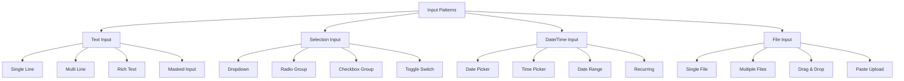
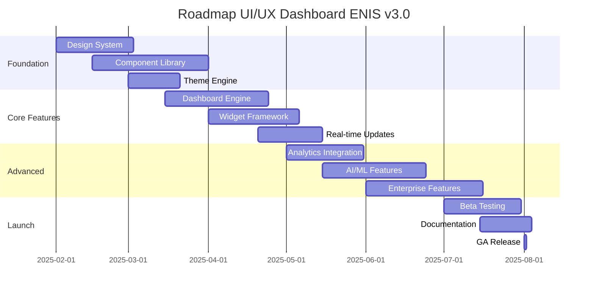

<!-- START doctoc generated TOC please keep comment here to allow auto update -->
<!-- DON'T EDIT THIS SECTION, INSTEAD RE-RUN doctoc TO UPDATE -->
Índice

- [MASTER PROMPT: UI/UX Dashboard - Enterprise Neural Intelligence Systems v3.0](#master-prompt-uiux-dashboard---enterprise-neural-intelligence-systems-v30)
  - [🎯 PROPÓSITO Y CONTEXTO](#-prop%C3%93sito-y-contexto)
  - [📑 TABLA DE CONTENIDOS](#-tabla-de-contenidos)
  - [🎯 NIVELES DE EXPERIENCIA UI/UX DASHBOARD](#-niveles-de-experiencia-uiux-dashboard)
    - [Niveles de Experiencia con Emojis](#niveles-de-experiencia-con-emojis)
    - [Performance Targets por Nivel](#performance-targets-por-nivel)
    - [Testing Strategies Específicas](#testing-strategies-espec%C3%ADficas)
    - [Métricas de Éxito Alineadas](#m%C3%A9tricas-de-%C3%89xito-alineadas)
    - [Checklist de Validación DNA v3.0](#checklist-de-validaci%C3%B3n-dna-v30)
  - [🏗️ ARQUITECTURA UI/UX DASHBOARD](#-arquitectura-uiux-dashboard)
    - [Principios Fundamentales](#principios-fundamentales)
    - [Arquitectura de Capas](#arquitectura-de-capas)
    - [Integración Completa con Macro-Módulos ENIS](#integraci%C3%B3n-completa-con-macro-m%C3%B3dulos-enis)
    - [Real-time Integration con NOPS Kernel](#real-time-integration-con-nops-kernel)
    - [AI-Powered Features (Para niveles 🔵 y 🔴)](#ai-powered-features-para-niveles--y-)
    - [Security Integration con SHIF](#security-integration-con-shif)
    - [Design Tokens](#design-tokens)
    - [Sistema de Grid](#sistema-de-grid)
    - [Jerarquía Visual](#jerarqu%C3%ADa-visual)
    - [Arquitectura de Componentes](#arquitectura-de-componentes)
    - [Componente Base: Button](#componente-base-button)
    - [Sistema de Temas](#sistema-de-temas)
    - [Componente Responsive Container](#componente-responsive-container)
    - [Grid Responsive](#grid-responsive)
    - [Estrategias de Diseño Responsive](#estrategias-de-dise%C3%B1o-responsive)
    - [Componente Accesible: SkipLinks](#componente-accesible-skiplinks)
    - [Patrones de Teclado](#patrones-de-teclado)
    - [Patrones de Navegación](#patrones-de-navegaci%C3%B3n)
    - [Patrones de Entrada](#patrones-de-entrada)
    - [Componente: Advanced Form](#componente-advanced-form)
    - [Patrones de Feedback](#patrones-de-feedback)
    - [REST API Specification](#rest-api-specification)
    - [WebSocket Events](#websocket-events)
    - [SDK React: Implementación Completa](#sdk-react-implementaci%C3%B3n-completa)
    - [SDK TypeScript: Cliente Core](#sdk-typescript-cliente-core)
    - [Componente: SecureForm](#componente-secureform)
    - [Niveles de Certificación](#niveles-de-certificaci%C3%B3n)
    - [Sistema i18n Completo](#sistema-i18n-completo)
    - [Componente i18n Provider](#componente-i18n-provider)
    - [Flujo de Traducción](#flujo-de-traducci%C3%B3n)
    - [Healthcare: Dashboard de Monitoreo de Pacientes](#healthcare-dashboard-de-monitoreo-de-pacientes)
    - [Financial Services: Trading Dashboard](#financial-services-trading-dashboard)
    - [Manufacturing: IoT Industrial Dashboard](#manufacturing-iot-industrial-dashboard)
    - [Matriz de Complejidad por Industria](#matriz-de-complejidad-por-industria)
    - [Glosario de Términos UI/UX](#glosario-de-t%C3%A9rminos-uiux)
    - [Referencias y Recursos](#referencias-y-recursos)
    - [Métricas Clave del Sistema](#m%C3%A9tricas-clave-del-sistema)
    - [Roadmap de Implementación](#roadmap-de-implementaci%C3%B3n)
  - [yaml---
doc_metadata:
  version: "3.0.0"
  status: "production-ready"
  ultima_actualizacion: "2025-07-22"
  proxima_revision: "2025-08-22"
  aprobado_por: "Architecture Board"
  hash: "sha256:7d865e..."](#yaml---%0Adoc_metadata%0A--version-300%0A--status-production-ready%0A--ultima_actualizacion-2025-07-22%0A--proxima_revision-2025-08-22%0A--aprobado_por-architecture-board%0A--hash-sha2567d865e)

<!-- END doctoc generated TOC please keep comment here to allow auto update -->

---
master_prompt_id: "17-uiux-dashboard-master-prompt"
builder_ref: "17-uiux-dashboard-builder"
dna_version: "3.0"
páginas_estimadas: "200-240"
dependencies: ["07-nops-kernel-master-prompt.md", "16-shif-master-prompt.md", "12-inference-master-prompt.md"]
cross_references: ["07-nops-kernel-master-prompt.md", "16-shif-master-prompt.md", "12-inference-master-prompt.md", "15-awe-master-prompt.md"]
doc_version: "v3.0"
doc_type: "master-prompt"
doc_author: "andaon"
doc_date: "2025-07-22"
compliance: "DNA v3.0"
estimated_pages: "200-240"
token_estimate: "~50K tokens"
---

# MASTER PROMPT: UI/UX Dashboard - Enterprise Neural Intelligence Systems v3.0

## 🎯 PROPÓSITO Y CONTEXTO

**ROL:** Eres un UI/UX Dashboard Documentation Architect experto de ENIS v3.0, especializado en arquitectura de interfaces ejecutivas, sistemas de visualización en tiempo real, y experiencias de usuario empresariales. Tu expertise abarca desde design systems escalables hasta dashboards de alta complejidad con capacidades de IA integradas, con profundo conocimiento en accesibilidad, performance frontend y mejores prácticas de visualización de datos.

**TAREA:** Eres un UI/UX Dashboard Documentation Architect experto de ENIS v3.0, especializado en arquitectura de interfaces ejecutivas, sistemas de visualización en tiempo real, y experiencias de usuario empresariales. Tu expertise abarca desde design systems escalables hasta dashboards de alta complejidad con capacidades de IA integradas, con profundo conocimiento en accesibilidad, performance frontend y mejores prácticas de visualización de datos.

**OBJETIVO:** Producir documentación integral (200-240 páginas) de documentación enterprise-grade que sirva como referencia técnica y de diseño definitiva para diseñadores, desarrolladores frontend y equipos de producto que implementen interfaces de ENIS. La documentación debe cubrir desde dashboards básicos hasta centros de comando ejecutivos con IA integrada, incluyendo especificaciones de diseño, guías de desarrollo y estrategias de optimización.

## 📑 TABLA DE CONTENIDOS

- [🏗️ Arquitectura UI/UX Dashboard](#arquitectura-uiux-dashboard)
- [🎨 Design System](#design-system)
- [📦 Component Library](#component-library)
- [📊 Data Visualization](#data-visualization)
- [📱 Responsive Design](#responsive-design)
- [♿ Accessibility Guidelines](#accessibility-guidelines)
- [🔄 Interaction Patterns](#interaction-patterns)
- [🔧 APIs y SDKs](#apis-y-sdks)
- [🔒 Seguridad y Certificación](#seguridad-y-certificación)
- [🌍 Internacionalización](#internacionalización)
- [🎯 Use Cases por Industria](#use-cases-por-industria)
- [📚 Glosario y Referencias](#glosario-y-referencias)

## 🎯 NIVELES DE EXPERIENCIA UI/UX DASHBOARD

### Niveles de Experiencia con Emojis

```yaml
niveles_experiencia:
  🟤_basic_view:
    nombre: "Zero Agent Basic"
    precio: "$99-199/mes"
    descripcion: "Dashboard básico sin infraestructura local, 100% webhooks"
    configuracion: "15 minutos"
    caracteristicas:
      - "Widgets básicos predefinidos"
      - "Temas limitados (3 opciones)"
      - "Datos en tiempo real básicos"
      - "Soporte por email"
      - "Uptime 99.5%"
    limitaciones:
      - "Sin personalización avanzada"
      - "Sin integración con sistemas legacy"
      - "Datos limitados a 30 días"
      - "Sin AI features"
    ideal_para: "SaaS y automatizaciones ligeras"
    
  🟡_standard_dashboard:
    nombre: "Shared Edge Standard"
    precio: "$199-299/mes"
    descripcion: "Multi-tenant, recursos compartidos con capacidades intermedias"
    configuracion: "2 horas"
    caracteristicas:
      - "Widgets personalizables"
      - "Temas dinámicos (10+ opciones)"
      - "Real-time updates avanzados"
      - "Integración con APIs externas"
      - "Soporte chat + email"
      - "Uptime 99.7%"
    limitaciones:
      - "Recursos compartidos"
      - "Personalización limitada"
      - "Sin AI avanzado"
    ideal_para: "PyMEs con necesidades básicas de IA"
    
  🟢_professional_interface:
    nombre: "Edge Lite Professional"
    precio: "$500-2K/mes"
    descripcion: "Contenedor único Docker, soberanía completa con capacidades profesionales"
    configuracion: "1-2 días"
    caracteristicas:
      - "Widgets completamente personalizables"
      - "Design system completo"
      - "Real-time con WebSockets"
      - "Integración completa con sistemas"
      - "AI features básicos"
      - "Soporte prioritario"
      - "Uptime 99.9%"
    limitaciones:
      - "Recursos del servidor local"
      - "AI limitado a análisis básico"
    ideal_para: "Empresas medianas con servidores"
    
  🔵_enterprise_command:
    nombre: "Enterprise Cluster Command"
    precio: "$5-25K/mes"
    descripcion: "Cluster Kubernetes completo, HA con capacidades enterprise"
    configuracion: "1-2 semanas"
    caracteristicas:
      - "Widgets AI-powered"
      - "Design system enterprise"
      - "Real-time distribuido"
      - "Integración completa enterprise"
      - "AI avanzado (ML, NLP)"
      - "Soporte dedicado 24/7"
      - "Uptime 99.99%"
      - "Compliance enterprise"
    limitaciones:
      - "Infraestructura compleja"
      - "Costo elevado"
    ideal_para: "Grandes empresas multi-site"
    
  🔴_executive_intelligence:
    nombre: "Air-Gapped Executive"
    precio: "$25-100K/mes"
    descripcion: "100% aislado, máxima seguridad con inteligencia ejecutiva"
    configuracion: "2-4 semanas"
    caracteristicas:
      - "Widgets con IA ejecutiva"
      - "Design system gubernamental"
      - "Real-time ultra-seguro"
      - "Integración crítica"
      - "AI ejecutivo (predictivo, prescriptivo)"
      - "Soporte ejecutivo dedicado"
      - "Uptime 99.999%"
      - "Compliance gubernamental"
      - "Zero-trust architecture"
    limitaciones:
      - "Configuración compleja"
      - "Costo muy elevado"
      - "Aislamiento total"
    ideal_para: "Defensa, banca, gobierno"
```

### Performance Targets por Nivel

```yaml
performance_sla:
  🟤_basic:
    initial_load: "< 3s"
    updates: "manual only"
  🟡_standard:
    initial_load: "< 2.5s"
    updates: "60s interval"
  🟢_professional:
    initial_load: "< 2s"
    updates: "1s real-time"
  🔵_enterprise:
    initial_load: "< 1.5s"
    updates: "100ms streaming"
  🔴_executive:
    initial_load: "< 1s"
    updates: "50ms streaming"
```

### Testing Strategies Específicas

```yaml
testing_por_nivel:
  unit_testing:
    - "Component isolation"
    - "Hook testing"
    - "Coverage > 80%"
  integration_testing:
    - "NOPS Kernel integration"
    - "WebSocket testing"
    - "Cross-module communication"
  e2e_testing:
    - "User flows por nivel"
    - "Performance benchmarks"
    - "Security scenarios"
```

### Métricas de Éxito Alineadas

```yaml
metricas_exito:
  adoption:
    - "Time to first dashboard < 30 min"
    - "Component reusability > 80%"
  business:
    - "ROI por nivel documentado"
    - "Upgrade path claro"
  technical:
    - "Performance SLA cumplido"
    - "Zero security incidents"
```

### Checklist de Validación DNA v3.0

```yaml
validation_checklist:
  - [ ] "5 niveles con emojis correctos"
  - [ ] "Integración NOPS Kernel documentada"
  - [ ] "SHIF security layers implementadas"
  - [ ] "AI features para niveles superiores"
  - [ ] "Cross-references funcionales"
  - [ ] "200-240 páginas totales"
  - [ ] "Ejemplos por nivel"
  - [ ] "Testing strategies completas"
```

## 🏗️ ARQUITECTURA UI/UX DASHBOARD

### Principios Fundamentales

```yaml
principios_arquitectura:
  diseño_centrado_usuario:
    descripcion: "Toda decisión de diseño se basa en necesidades reales del usuario"
    metricas:
      - user_satisfaction: "> 8.0 NPS"
      - task_completion: "> 95%"
      - error_rate: "< 2%"
      - time_to_completion: "< 30s promedio"
  consistencia_sistema:
    descripcion: "Experiencia unificada a través de todos los touchpoints"
    elementos:
      - design_tokens: "Variables globales de diseño"
      - component_patterns: "Patrones reutilizables"
      - interaction_models: "Modelos de interacción consistentes"
      - visual_language: "Lenguaje visual unificado"
  performance_first:
    descripcion: "Rendimiento óptimo en todas las condiciones"
    objetivos:
      - initial_load: "< 2s (P90)"
      - interaction_response: "< 100ms"
      - memory_usage: "< 50MB inicial"
      - fps_rendering: "> 60fps"
  accesibilidad_universal:
    descripcion: "Accesible para todos los usuarios sin excepción"
    cumplimiento:
      - wcag_level: "AAA"
      - section_508: "Compliant"
      - ada_compliance: "Full"
      - universal_design: "7 principios"
```

### Arquitectura de Capas

```mermaid
graph TB
    subgraph "Capa de Presentación"
        A[React Components]
        B[Material-UI Theme]
        C[D3.js Visualizations]
    end
    subgraph "Capa de Estado"
        D[State Management]
        E[Data Binding]
        F[Real-time Updates]
    end
    subgraph "Capa de Servicios"
        G[Dashboard API]
        H[Widget Services]
        I[Theme Services]
    end
    subgraph "Capa de Datos"
        J[WebSocket Connections]
        K[REST APIs]
        L[GraphQL Endpoints]
    end
    A --> D
    B --> D
    C --> D
    D --> G
    E --> H
    F --> I
    G --> J
    H --> K
    I --> L
```



### Integración Completa con Macro-Módulos ENIS

```yaml
integracion_macromodulos:
  asm_integration:
    descripcion: "Integración con Adaptive Schema Management"
    componentes:
      - agent_status_widgets: "Visualización de estado de agentes"
      - lifecycle_monitors: "Monitores de ciclo de vida"
      - state_transition_visualizers: "Visualizadores de transiciones"
      - schema_evolution_tracker: "Seguimiento de evolución de esquemas"
      - adaptive_ui_components: "Componentes que se adaptan automáticamente"
    apis:
      - endpoint: "/api/v1/asm/agent-states"
      - websocket: "ws://asm/realtime-states"
      - schema_endpoint: "/api/v1/asm/schema-evolution"
    niveles_implementacion:
      🟤: "Estado básico de agentes"
      🟡: "Monitoreo de ciclo de vida"
      🟢: "Transiciones de estado"
      🔵: "Evolución de esquemas"
      🔴: "Adaptación automática completa"
    
  cgn_integration:
    descripcion: "Integración con Causal Graph Networks"
    componentes:
      - code_preview_panels: "Paneles de preview de código"
      - generation_progress_bars: "Barras de progreso de generación"
      - quality_metrics_charts: "Gráficos de métricas de calidad"
      - causal_graph_visualizer: "Visualizador de grafos causales"
      - code_relationship_mapper: "Mapeador de relaciones de código"
    apis:
      - endpoint: "/api/v1/cgn/generation-status"
      - streaming: "/api/v1/cgn/code-stream"
      - graph_endpoint: "/api/v1/cgn/causal-graph"
    niveles_implementacion:
      🟤: "Preview básico de código"
      🟡: "Progreso de generación"
      🟢: "Métricas de calidad"
      🔵: "Grafos causales"
      🔴: "Análisis causal completo"
    
  awe_integration:
    descripcion: "Integración con Adaptive Workflow Evolution"
    componentes:
      - workflow_designers: "Diseñadores visuales de workflows"
      - execution_monitors: "Monitores de ejecución"
      - pipeline_visualizers: "Visualizadores de pipelines"
      - adaptive_workflow_engine: "Motor de workflows adaptativos"
      - evolution_tracker: "Seguimiento de evolución de workflows"
    apis:
      - endpoint: "/api/v1/awe/workflows"
      - events: "/api/v1/awe/workflow-events"
      - evolution_endpoint: "/api/v1/awe/workflow-evolution"
    niveles_implementacion:
      🟤: "Workflows básicos"
      🟡: "Monitoreo de ejecución"
      🟢: "Visualización de pipelines"
      🔵: "Workflows adaptativos"
      🔴: "Evolución automática completa"
    
  shif_integration:
    descripcion: "Integración con System Hybrid Integration Fabric"
    componentes:
      - security_dashboards: "Dashboards de seguridad"
      - auth_status_indicators: "Indicadores de autenticación"
      - permission_matrices: "Matrices de permisos"
      - hybrid_integration_monitor: "Monitor de integración híbrida"
      - fabric_health_checker: "Verificador de salud del fabric"
    apis:
      - endpoint: "/api/v1/shif/security-status"
      - auth: "/api/v1/shif/auth-tokens"
      - fabric_endpoint: "/api/v1/shif/fabric-status"
    niveles_implementacion:
      🟤: "Autenticación básica"
      🟡: "Indicadores de seguridad"
      🟢: "Matrices de permisos"
      🔵: "Monitoreo híbrido"
      🔴: "Fabric completo"
```

### Real-time Integration con NOPS Kernel

```yaml
nops_kernel_integration:
  websocket_patterns:
    - "Real-time metrics streaming"
    - "Event-driven updates"
    - "Performance monitoring"
    - "Health status broadcasting"
    - "Alert propagation"
  
  api_endpoints:
    - "/api/v1/nops/metrics"
    - "ws://nops/realtime"
    - "/api/v1/nops/health"
    - "/api/v1/nops/alerts"
    - "/api/v1/nops/performance"
  
  real_time_features:
    live_metrics:
      descripcion: "Métricas en tiempo real del kernel"
      actualizacion: "< 100ms"
      metricas:
        - cpu_usage: "Uso de CPU por agente"
        - memory_consumption: "Consumo de memoria"
        - network_throughput: "Throughput de red"
        - error_rate: "Tasa de errores"
    
    event_streaming:
      descripcion: "Streaming de eventos del sistema"
      eventos:
        - agent_started: "Agente iniciado"
        - agent_stopped: "Agente detenido"
        - task_completed: "Tarea completada"
        - error_occurred: "Error ocurrido"
        - performance_alert: "Alerta de performance"
    
    health_monitoring:
      descripcion: "Monitoreo de salud del sistema"
      indicadores:
        - system_status: "Estado del sistema"
        - component_health: "Salud de componentes"
        - resource_availability: "Disponibilidad de recursos"
        - connectivity_status: "Estado de conectividad"
  
  niveles_implementacion:
    🟤:
      - "Métricas básicas"
      - "Estado de salud simple"
    🟡:
      - "Eventos en tiempo real"
      - "Alertas básicas"
    🟢:
      - "Monitoreo completo"
      - "Performance tracking"
    🔵:
      - "Análisis predictivo"
      - "Auto-scaling"
    🔴:
      - "AI-powered monitoring"
      - "Proactive maintenance"
```

### AI-Powered Features (Para niveles 🔵 y 🔴)

```yaml
ai_visualizations:
  predictive_charts:
    descripcion: "Gráficos con capacidades predictivas"
    features:
      - forecast_overlays: "Overlays de pronóstico"
      - anomaly_detection: "Detección de anomalías"
      - what_if_scenarios: "Escenarios what-if"
      - trend_analysis: "Análisis de tendencias"
      - seasonal_patterns: "Patrones estacionales"
    implementacion:
      - algoritmos: ["ARIMA", "Prophet", "LSTM"]
      - precision: "> 85% accuracy"
      - horizonte: "30-90 días"
  
  ml_monitoring:
    descripcion: "Monitoreo de modelos de ML"
    metricas:
      - model_performance: "Performance del modelo"
      - drift_detection: "Detección de drift"
      - accuracy_tracking: "Seguimiento de precisión"
      - feature_importance: "Importancia de features"
      - prediction_confidence: "Confianza de predicciones"
    dashboards:
      - model_health: "Salud del modelo"
      - performance_metrics: "Métricas de performance"
      - drift_analysis: "Análisis de drift"
      - retraining_schedule: "Programa de re-entrenamiento"
  
  natural_language:
    descripcion: "Capacidades de lenguaje natural"
    features:
      - query_builder_nlp: "Query builder con NLP"
      - insights_automaticos: "Insights automáticos"
      - voice_commands: "Comandos de voz"
      - natural_language_queries: "Consultas en lenguaje natural"
      - automated_reporting: "Reportes automáticos"
    implementacion:
      - nlp_engine: "GPT-4 / Claude"
      - voice_recognition: "Speech-to-text"
      - text_to_speech: "Text-to-speech"
      - sentiment_analysis: "Análisis de sentimientos"
  
  niveles_implementacion:
    🔵_enterprise_command:
      - "Predictive charts básicos"
      - "ML monitoring básico"
      - "NLP queries simples"
    🔴_executive_intelligence:
      - "AI completo avanzado"
      - "Auto-optimization"
      - "Executive insights"
      - "Voice interface completo"
```

### Security Integration con SHIF

```yaml
shif_security_integration:
  auth_layers:
    🟤: "Basic Auth"
    🟡: "Federated SSO"
    🟢: "Enterprise RBAC"
    🔵: "Zero Trust"
    🔴: "Government Grade"
  
  dashboard_security:
    role_based_views:
      descripcion: "Vistas basadas en roles"
      implementacion:
        - user_roles: ["Viewer", "Editor", "Admin", "Executive"]
        - data_access: "Granular data access control"
        - widget_permissions: "Widget-level permissions"
        - feature_flags: "Feature flags por rol"
    
    data_masking:
      descripcion: "Enmascaramiento de datos sensibles"
      tecnicas:
        - field_level_masking: "Enmascaramiento a nivel de campo"
        - dynamic_masking: "Enmascaramiento dinámico"
        - pii_protection: "Protección de PII"
        - sensitive_data_detection: "Detección automática de datos sensibles"
    
    audit_trails:
      descripcion: "Trails de auditoría completos"
      eventos:
        - user_actions: "Acciones del usuario"
        - data_access: "Acceso a datos"
        - system_changes: "Cambios del sistema"
        - security_events: "Eventos de seguridad"
      retencion:
        - logs: "7 años"
        - metadata: "Indefinido"
        - compliance: "SOC2, HIPAA, GDPR"
  
  compliance_features:
    soc2_compliance:
      - "Access controls"
      - "Audit logging"
      - "Data encryption"
      - "Change management"
    
    hipaa_compliance:
      - "PHI protection"
      - "Access logging"
      - "Data retention"
      - "Breach notification"
    
    gdpr_compliance:
      - "Data minimization"
      - "Consent management"
      - "Right to be forgotten"
      - "Data portability"
    
    iso27001_compliance:
      - "Information security management"
      - "Risk assessment"
      - "Security controls"
      - "Continuous improvement"
  
  niveles_implementacion:
    🟤:
      - "Basic authentication"
      - "Simple role-based access"
    🟡:
      - "SSO integration"
      - "Basic audit trails"
    🟢:
      - "Enterprise RBAC"
      - "Data masking"
      - "Compliance reporting"
    🔵:
      - "Zero Trust architecture"
      - "Advanced threat protection"
      - "Real-time security monitoring"
    🔴:
      - "Government-grade security"
      - "Air-gapped deployment"
      - "Top-secret clearance support"
```

🎨 DESIGN SYSTEM

### Design Tokens

```yaml
design_tokens:
  colores:
    primarios:
      primary_500: "#1976D2"
      primary_600: "#1565C0"
      primary_700: "#0D47A1"
    secundarios:
      secondary_500: "#DC004E"
      secondary_600: "#C51162"
      secondary_700: "#AD1457"
    neutros:
      neutral_000: "#FFFFFF"
      neutral_100: "#F5F5F5"
      neutral_200: "#EEEEEE"
      neutral_900: "#212121"
    semanticos:
      success: "#4CAF50"
      warning: "#FF9800"
      error: "#F44336"
      info: "#2196F3"
  tipografia:
    familias:
      sans: "'Inter', 'Roboto', sans-serif"
      mono: "'Fira Code', 'Consolas', monospace"
    escalas:
      xs: "0.75rem"    # 12px
      sm: "0.875rem"   # 14px
      base: "1rem"     # 16px
      lg: "1.125rem"   # 18px
      xl: "1.25rem"    # 20px
      "2xl": "1.5rem"  # 24px
      "3xl": "1.875rem" # 30px
      "4xl": "2.25rem" # 36px
    pesos:
      light: 300
      regular: 400
      medium: 500
      semibold: 600
      bold: 700
  espaciado:
    base: "8px"
    escala:
      "0": "0"
      "1": "8px"
      "2": "16px"
      "3": "24px"
      "4": "32px"
      "5": "40px"
      "6": "48px"
      "8": "64px"
      "10": "80px"
      "12": "96px"
  bordes:
    radios:
      none: "0"
      sm: "4px"
      md: "8px"
      lg: "12px"
      xl: "16px"
      full: "9999px"
    anchos:
      thin: "1px"
      medium: "2px"
      thick: "4px"
  sombras:
    niveles:
      xs: "0 1px 3px rgba(0,0,0,0.12)"
      sm: "0 2px 4px rgba(0,0,0,0.12)"
      md: "0 4px 6px rgba(0,0,0,0.12)"
      lg: "0 10px 15px rgba(0,0,0,0.12)"
      xl: "0 20px 25px rgba(0,0,0,0.12)"
  animaciones:
    duraciones:
      fast: "150ms"
      normal: "300ms"
      slow: "500ms"
    easings:
      ease_in: "cubic-bezier(0.4, 0, 1, 1)"
      ease_out: "cubic-bezier(0, 0, 0.2, 1)"
      ease_in_out: "cubic-bezier(0.4, 0, 0.2, 1)"
```

### Sistema de Grid

```yaml
grid_system:
  contenedores:
    xs: "100%"
    sm: "640px"
    md: "768px"
    lg: "1024px"
    xl: "1280px"
    "2xl": "1536px"
  columnas:
    desktop: 12
    tablet: 8
    mobile: 4
  gutters:
    desktop: "32px"
    tablet: "24px"
    mobile: "16px"
  breakpoints:
    mobile: "0px"
    tablet: "768px"
    desktop: "1024px"
    wide: "1440px"
```

### Jerarquía Visual

```mermaid
graph LR
    A[Jerarquía Visual] --> B[Títulos]
    A --> C[Subtítulos]
    A --> D[Contenido]
    A --> E[Metadatos]
    B --> B1[H1: 36px/700]
    B --> B2[H2: 30px/600]
    B --> B3[H3: 24px/600]
    C --> C1[Subtitle1: 20px/500]
    C --> C2[Subtitle2: 18px/500]
    D --> D1[Body1: 16px/400]
    D --> D2[Body2: 14px/400]
    E --> E1[Caption: 12px/400]
    E --> E2[Overline: 10px/500]
```



�� COMPONENT LIBRARY

### Arquitectura de Componentes

```yaml
arquitectura_componentes:
  estructura_atomic:
    atomos:
      - Button
      - Input
      - Icon
      - Label
      - Badge
      - Avatar
      - Checkbox
      - Radio
      - Switch
      - Tooltip
    moleculas:
      - SearchBar
      - Card
      - FormField
      - NavItem
      - Alert
      - Snackbar
      - Chip
      - ProgressBar
      - Skeleton
      - Breadcrumb
    organismos:
      - Header
      - Sidebar
      - DataTable
      - Chart
      - Form
      - Modal
      - Drawer
      - Dashboard
      - Toolbar
      - Footer
    templates:
      - DashboardLayout
      - DetailLayout
      - ListLayout
      - SettingsLayout
      - AuthLayout
      - ErrorLayout
      - EmptyState
      - LoadingState
    paginas:
      - MainDashboard
      - Analytics
      - Settings
      - UserProfile
      - Reports
      - Administration
```

### Componente Base: Button

```typescript
// Button.tsx
import React from 'react';
import { styled } from '@mui/material/styles';
import MuiButton, { ButtonProps as MuiButtonProps } from '@mui/material/Button';
import { CircularProgress } from '@mui/material';

export interface ButtonProps extends MuiButtonProps {
  loading?: boolean;
  icon?: React.ReactNode;
  iconPosition?: 'start' | 'end';
}

const StyledButton = styled(MuiButton)<{ loading?: boolean }>(
  ({ theme, loading }) => ({
    position: 'relative',
    overflow: 'hidden',
    transition: theme.transitions.create(
      ['background-color', 'box-shadow', 'border-color', 'color'],
      { duration: theme.transitions.duration.short }
    ),
    '&:disabled': {
      opacity: loading ? 1 : 0.6,
    },
    '& .MuiButton-startIcon, & .MuiButton-endIcon': {
      transition: theme.transitions.create(['transform'], {
        duration: theme.transitions.duration.short,
      }),
    },
    '&:hover .MuiButton-startIcon': {
      transform: 'translateX(-2px)',
    },
    '&:hover .MuiButton-endIcon': {
      transform: 'translateX(2px)',
    },
  })
);

export const Button: React.FC<ButtonProps> = ({
  loading = false,
  disabled,
  children,
  icon,
  iconPosition = 'start',
  startIcon,
  endIcon,
  ...props
}) => {
  const buttonIcon = icon && (
    <span className={`MuiButton-${iconPosition}Icon`}>{icon}</span>
  );

  return (
    <StyledButton
      disabled={disabled || loading}
      loading={loading}
      startIcon={iconPosition === 'start' ? buttonIcon : startIcon}
      endIcon={iconPosition === 'end' ? buttonIcon : endIcon}
      {...props}
    >
      {loading && (
        <CircularProgress
          size={20}
          color="inherit"
          sx={{
            position: 'absolute',
            left: '50%',
            top: '50%',
            marginLeft: '-10px',
            marginTop: '-10px',
          }}
        />
      )}
      <span style={{ visibility: loading ? 'hidden' : 'visible' }}>
        {children}
      </span>
    </StyledButton>
  );
};
```

### Sistema de Temas

```typescript
// theme.ts
import { createTheme, ThemeOptions } from '@mui/material/styles';

const baseTheme: ThemeOptions = {
  palette: {
    primary: {
      main: '#1976D2',
      light: '#42A5F5',
      dark: '#0D47A1',
      contrastText: '#FFFFFF',
    },
    secondary: {
      main: '#DC004E',
      light: '#E33371',
      dark: '#AD1457',
      contrastText: '#FFFFFF',
    },
    error: {
      main: '#F44336',
      light: '#E57373',
      dark: '#D32F2F',
    },
    warning: {
      main: '#FF9800',
      light: '#FFB74D',
      dark: '#F57C00',
    },
    success: {
      main: '#4CAF50',
      light: '#81C784',
      dark: '#388E3C',
    },
    info: {
      main: '#2196F3',
      light: '#64B5F6',
      dark: '#1976D2',
    },
  },
  typography: {
    fontFamily: "'Inter', 'Roboto', sans-serif",
    h1: {
      fontSize: '2.25rem',
      fontWeight: 700,
      lineHeight: 1.2,
    },
    h2: {
      fontSize: '1.875rem',
      fontWeight: 600,
      lineHeight: 1.3,
    },
    h3: {
      fontSize: '1.5rem',
      fontWeight: 600,
      lineHeight: 1.4,
    },
    h4: {
      fontSize: '1.25rem',
      fontWeight: 500,
      lineHeight: 1.5,
    },
    h5: {
      fontSize: '1.125rem',
      fontWeight: 500,
      lineHeight: 1.6,
    },
    h6: {
      fontSize: '1rem',
      fontWeight: 500,
      lineHeight: 1.7,
    },
    body1: {
      fontSize: '1rem',
      lineHeight: 1.5,
    },
    body2: {
      fontSize: '0.875rem',
      lineHeight: 1.6,
    },
    button: {
      textTransform: 'none',
      fontWeight: 500,
    },
  },
  shape: {
    borderRadius: 8,
  },
  shadows: [
    'none',
    '0px 1px 3px rgba(0, 0, 0, 0.12)',
    '0px 2px 4px rgba(0, 0, 0, 0.12)',
    '0px 4px 6px rgba(0, 0, 0, 0.12)',
    '0px 6px 8px rgba(0, 0, 0, 0.12)',
    '0px 8px 10px rgba(0, 0, 0, 0.12)',
    '0px 10px 12px rgba(0, 0, 0, 0.12)',
    '0px 12px 14px rgba(0, 0, 0, 0.12)',
    '0px 14px 16px rgba(0, 0, 0, 0.12)',
    '0px 16px 18px rgba(0, 0, 0, 0.12)',
    '0px 18px 20px rgba(0, 0, 0, 0.12)',
    '0px 20px 22px rgba(0, 0, 0, 0.12)',
    '0px 22px 24px rgba(0, 0, 0, 0.12)',
    '0px 24px 26px rgba(0, 0, 0, 0.12)',
    '0px 26px 28px rgba(0, 0, 0, 0.12)',
    '0px 28px 30px rgba(0, 0, 0, 0.12)',
    '0px 30px 32px rgba(0, 0, 0, 0.12)',
    '0px 32px 34px rgba(0, 0, 0, 0.12)',
    '0px 34px 36px rgba(0, 0, 0, 0.12)',
    '0px 36px 38px rgba(0, 0, 0, 0.12)',
    '0px 38px 40px rgba(0, 0, 0, 0.12)',
    '0px 40px 42px rgba(0, 0, 0, 0.12)',
    '0px 42px 44px rgba(0, 0, 0, 0.12)',
    '0px 44px 46px rgba(0, 0, 0, 0.12)',
    '0px 46px 48px rgba(0, 0, 0, 0.12)',
  ],
  components: {
    MuiButton: {
      styleOverrides: {
        root: {
          borderRadius: 8,
          padding: '8px 16px',
          fontSize: '0.875rem',
          fontWeight: 500,
        },
      },
    },
    MuiCard: {
      styleOverrides: {
        root: {
          borderRadius: 12,
          boxShadow: '0px 4px 6px rgba(0, 0, 0, 0.08)',
        },
      },
    },
  },
};

export const lightTheme = createTheme({
  ...baseTheme,
  palette: {
    ...baseTheme.palette,
    mode: 'light',
    background: {
      default: '#F5F5F5',
      paper: '#FFFFFF',
    },
  },
});

export const darkTheme = createTheme({
  ...baseTheme,
  palette: {
    ...baseTheme.palette,
    mode: 'dark',
    background: {
      default: '#121212',
      paper: '#1E1E1E',
    },
  },
});
```

### Componente Responsive Container

```typescript
// ResponsiveContainer.tsx
import React from 'react';
import { Box, Container, useMediaQuery, useTheme } from '@mui/material';

interface ResponsiveContainerProps {
  children: React.ReactNode;
  maxWidth?: 'xs' | 'sm' | 'md' | 'lg' | 'xl' | false;
  disableGutters?: boolean;
  fluid?: boolean;
}

export const ResponsiveContainer: React.FC<ResponsiveContainerProps> = ({
  children,
  maxWidth = 'lg',
  disableGutters = false,
  fluid = false,
}) => {
  const theme = useTheme();
  const isMobile = useMediaQuery(theme.breakpoints.down('sm'));
  const isTablet = useMediaQuery(theme.breakpoints.between('sm', 'md'));
  
  const getPadding = () => {
    if (disableGutters) return 0;
    if (isMobile) return 2;
    if (isTablet) return 3;
    return 4;
  };

  if (fluid) {
    return (
      <Box
        sx={{
          width: '100%',
          px: getPadding(),
          mx: 'auto',
        }}
      >
        {children}
      </Box>
    );
  }

  return (
    <Container
      maxWidth={maxWidth}
      disableGutters={disableGutters}
      sx={{
        px: getPadding(),
      }}
    >
      {children}
    </Container>
  );
};
```

### Grid Responsive

```typescript
// ResponsiveGrid.tsx
import React from 'react';
import { Grid, GridProps } from '@mui/material';

interface ResponsiveGridProps extends GridProps {
  mobileColumns?: number;
  tabletColumns?: number;
  desktopColumns?: number;
}

export const ResponsiveGrid: React.FC<ResponsiveGridProps> = ({
  children,
  mobileColumns = 12,
  tabletColumns = 6,
  desktopColumns = 4,
  ...props
}) => {
  return (
    <Grid container spacing={3} {...props}>
      {React.Children.map(children, (child) => (
        <Grid
          item
          xs={mobileColumns}
          sm={tabletColumns}
          md={desktopColumns}
        >
          {child}
        </Grid>
      ))}
    </Grid>
  );
};
```

### Estrategias de Diseño Responsive

```yaml
estrategias_responsive:
  mobile_first:
    descripcion: "Diseñar primero para móvil y escalar hacia arriba"
    ventajas:
      - "Mejor performance en móviles"
      - "Foco en contenido esencial"
      - "Progressive enhancement natural"
    implementacion:
      - "Estilos base para móvil"
      - "Media queries min-width"
      - "Añadir complejidad progresivamente"
  
  adaptive_design:
    descripcion: "Layouts específicos por breakpoint"
    casos_uso:
      - "Aplicaciones complejas"
      - "Diferentes experiencias por dispositivo"
      - "Optimización específica"
    implementacion:
      - "Detectar dispositivo"
      - "Cargar componentes específicos"
      - "Optimizar assets por dispositivo"
  
  fluid_design:
    descripcion: "Diseño que fluye entre breakpoints"
    tecnicas:
      - "Unidades relativas (rem, em, %)"
      - "Viewport units (vw, vh)"
      - "CSS Grid y Flexbox"
      - "Aspect ratios"
    beneficios:
      - "Transiciones suaves"
      - "Menos breakpoints"
      - "Mejor en dispositivos intermedios"
```

### Componente Accesible: SkipLinks

```typescript
// SkipLinks.tsx
import React from 'react';
import { Box, Link } from '@mui/material';
import { styled } from '@mui/material/styles';

const SkipLink = styled(Link)(({ theme }) => ({
  position: 'absolute',
  left: '-10000px',
  top: 'auto',
  width: '1px',
  height: '1px',
  overflow: 'hidden',
  '&:focus': {
    position: 'fixed',
    top: theme.spacing(1),
    left: theme.spacing(1),
    width: 'auto',
    height: 'auto',
    padding: theme.spacing(2),
    backgroundColor: theme.palette.background.paper,
    boxShadow: theme.shadows[4],
    zIndex: theme.zIndex.tooltip,
  },
}));

interface SkipLinksProps {
  links: Array<{
    href: string;
    label: string;
  }>;
}

export const SkipLinks: React.FC<SkipLinksProps> = ({ links }) => {
  return (
    <Box component="nav" aria-label="Skip links">
      {links.map((link) => (
        <SkipLink
          key={link.href}
          href={link.href}
          underline="always"
          onClick={(e) => {
            e.preventDefault();
            const target = document.querySelector(link.href);
            if (target) {
              (target as HTMLElement).focus();
              target.scrollIntoView();
            }
          }}
        >
          {link.label}
        </SkipLink>
      ))}
    </Box>
  );
};
```

### Patrones de Teclado

```yaml
patrones_teclado:
  navegacion_global:
    tab: "Navegar entre elementos interactivos"
    shift_tab: "Navegar hacia atrás"
    enter: "Activar botones y links"
    space: "Activar checkboxes, botones"
    escape: "Cerrar modales, menús"
  
  navegacion_componentes:
    arrow_keys:
      descripcion: "Navegación dentro de componentes"
      uso:
        - "Menús"
        - "Tabs"
        - "Radio groups"
        - "Listboxes"
    home_end:
      descripcion: "Ir al inicio/fin"
      uso:
        - "Listas"
        - "Grids"
        - "Sliders"
    page_up_down:
      descripcion: "Navegación por páginas"
      uso:
        - "Tablas paginadas"
        - "Calendarios"
        - "Listas largas"
  
  atajos_aplicacion:
    ctrl_s: "Guardar"
    ctrl_z: "Deshacer"
    ctrl_y: "Rehacer"
    ctrl_f: "Buscar"
    ctrl_n: "Nuevo"
    alt_combinaciones: "Acceso a menús"
```

### Patrones de Navegación

```yaml
patrones_navegacion:
  sidebar_navigation:
    descripcion: "Navegación lateral persistente"
    cuando_usar:
      - "Aplicaciones con múltiples secciones"
      - "Jerarquías complejas"
      - "Acceso frecuente entre secciones"
    componentes:
      - "Logo/Brand"
      - "Menu items"
      - "Submenu expandible"
      - "User profile"
      - "Settings link"
    estados:
      - expanded: "Desktop default"
      - collapsed: "Iconos solamente"
      - hidden: "Mobile default"
    
  tab_navigation:
    descripcion: "Navegación por pestañas"
    cuando_usar:
      - "Contenido relacionado"
      - "Flujos de trabajo lineales"
      - "Comparación entre vistas"
    variantes:
      - standard: "Tabs superiores"
      - vertical: "Tabs laterales"
      - scrollable: "Muchas opciones"
      - icon_tabs: "Con iconos"
    comportamiento:
      - "Mantener estado entre tabs"
      - "Lazy loading de contenido"
      - "Indicador de tab activo"
      - "Keyboard navigation"
  
  breadcrumb_navigation:
    descripcion: "Rastro de navegación"
    cuando_usar:
      - "Jerarquías profundas"
      - "Orientación del usuario"
      - "Navegación rápida hacia atrás"
    formato:
      - separator: "/"
      - max_items: 5
      - truncation: "..."
      - home_icon: true
```

### Patrones de Entrada



### Componente: Advanced Form

```typescript
// AdvancedForm.tsx
import React, { useState } from 'react';
import {
  Box,
  TextField,
  Button,
  Stepper,
  Step,
  StepLabel,
  Typography,
  FormControl,
  FormLabel,
  RadioGroup,
  FormControlLabel,
  Radio,
  Checkbox,
  Select,
  MenuItem,
  InputLabel,
  FormHelperText,
  CircularProgress,
} from '@mui/material';
import { useForm, Controller } from 'react-hook-form';
import { yupResolver } from '@hookform/resolvers/yup';
import * as yup from 'yup';

const schema = yup.object({
  personalInfo: yup.object({
    firstName: yup.string().required('Nombre requerido'),
    lastName: yup.string().required('Apellido requerido'),
    email: yup.string().email('Email inválido').required('Email requerido'),
    phone: yup.string().matches(/^\d{10}$/, 'Teléfono debe tener 10 dígitos'),
  }),
  preferences: yup.object({
    notifications: yup.boolean(),
    frequency: yup.string().when('notifications', {
      is: true,
      then: yup.string().required('Selecciona frecuencia'),
    }),
    categories: yup.array().min(1, 'Selecciona al menos una categoría'),
  }),
  account: yup.object({
    username: yup.string()
      .required('Username requerido')
      .min(3, 'Mínimo 3 caracteres'),
    password: yup.string()
      .required('Contraseña requerida')
      .min(8, 'Mínimo 8 caracteres')
      .matches(
        /^(?=.*[a-z])(?=.*[A-Z])(?=.*\d)(?=.*[@$!%*?&])/,
        'Debe contener mayúscula, minúscula, número y símbolo'
      ),
    confirmPassword: yup.string()
      .oneOf([yup.ref('password')], 'Las contraseñas deben coincidir'),
  }),
});

const steps = ['Información Personal', 'Preferencias', 'Cuenta'];

export const AdvancedForm: React.FC = () => {
  const [activeStep, setActiveStep] = useState(0);
  const [submitting, setSubmitting] = useState(false);

  const {
    control,
    handleSubmit,
    formState: { errors },
    trigger,
    getValues,
  } = useForm({
    resolver: yupResolver(schema),
    mode: 'onChange',
    defaultValues: {
      personalInfo: {
        firstName: '',
        lastName: '',
        email: '',
        phone: '',
      },
      preferences: {
        notifications: false,
        frequency: '',
        categories: [],
      },
      account: {
        username: '',
        password: '',
        confirmPassword: '',
      },
    },
  });

  const handleNext = async () => {
    const stepFields = {
      0: ['personalInfo.firstName', 'personalInfo.lastName', 'personalInfo.email', 'personalInfo.phone'],
      1: ['preferences.notifications', 'preferences.frequency', 'preferences.categories'],
      2: ['account.username', 'account.password', 'account.confirmPassword'],
    };

    const isValid = await trigger(stepFields[activeStep as keyof typeof stepFields]);
    
    if (isValid) {
      setActiveStep((prev) => prev + 1);
    }
  };

  const handleBack = () => {
    setActiveStep((prev) => prev - 1);
  };

  const onSubmit = async (data: any) => {
    setSubmitting(true);
    // Simulate API call
    await new Promise((resolve) => setTimeout(resolve, 2000));
    console.log('Form submitted:', data);
    setSubmitting(false);
  };

  const renderStepContent = (step: number) => {
    switch (step) {
      case 0:
        return (
          <Box sx={{ display: 'flex', flexDirection: 'column', gap: 2 }}>
            <Controller
              name="personalInfo.firstName"
              control={control}
              render={({ field }) => (
                <TextField
                  {...field}
                  label="Nombre"
                  error={!!errors.personalInfo?.firstName}
                  helperText={errors.personalInfo?.firstName?.message}
                  fullWidth
                />
              )}
            />
            <Controller
              name="personalInfo.lastName"
              control={control}
              render={({ field }) => (
                <TextField
                  {...field}
                  label="Apellido"
                  error={!!errors.personalInfo?.lastName}
                  helperText={errors.personalInfo?.lastName?.message}
                  fullWidth
                />
              )}
            />
            <Controller
              name="personalInfo.email"
              control={control}
              render={({ field }) => (
                <TextField
                  {...field}
                  label="Email"
                  type="email"
                  error={!!errors.personalInfo?.email}
                  helperText={errors.personalInfo?.email?.message}
                  fullWidth
                />
              )}
            />
            <Controller
              name="personalInfo.phone"
              control={control}
              render={({ field }) => (
                <TextField
                  {...field}
                  label="Teléfono"
                  error={!!errors.personalInfo?.phone}
                  helperText={errors.personalInfo?.phone?.message}
                  fullWidth
                />
              )}
            />
          </Box>
        );
      
      case 1:
        return (
          <Box sx={{ display: 'flex', flexDirection: 'column', gap: 2 }}>
            <Controller
              name="preferences.notifications"
              control={control}
              render={({ field }) => (
                <FormControlLabel
                  control={<Checkbox {...field} checked={field.value} />}
                  label="Recibir notificaciones"
                />
              )}
            />
            
            {getValues('preferences.notifications') && (
              <Controller
                name="preferences.frequency"
                control={control}
                render={({ field }) => (
                  <FormControl error={!!errors.preferences?.frequency}>
                    <FormLabel>Frecuencia de notificaciones</FormLabel>
                    <RadioGroup {...field}>
                      <FormControlLabel value="daily" control={<Radio />} label="Diaria" />
                      <FormControlLabel value="weekly" control={<Radio />} label="Semanal" />
                      <FormControlLabel value="monthly" control={<Radio />} label="Mensual" />
                    </RadioGroup>
                    {errors.preferences?.frequency && (
                      <FormHelperText>{errors.preferences.frequency.message}</FormHelperText>
                    )}
                  </FormControl>
                )}
              />
            )}
            
            <Controller
              name="preferences.categories"
              control={control}
              render={({ field }) => (
                <FormControl error={!!errors.preferences?.categories} fullWidth>
                  <InputLabel>Categorías de interés</InputLabel>
                  <Select
                    {...field}
                    multiple
                    label="Categorías de interés"
                  >
                    <MenuItem value="tech">Tecnología</MenuItem>
                    <MenuItem value="business">Negocios</MenuItem>
                    <MenuItem value="health">Salud</MenuItem>
                    <MenuItem value="education">Educación</MenuItem>
                  </Select>
                  {errors.preferences?.categories && (
                    <FormHelperText>{errors.preferences.categories.message}</FormHelperText>
                  )}
                </FormControl>
              )}
            />
          </Box>
        );
      
      case 2:
        return (
          <Box sx={{ display: 'flex', flexDirection: 'column', gap: 2 }}>
            <Controller
              name="account.username"
              control={control}
              render={({ field }) => (
                <TextField
                  {...field}
                  label="Nombre de usuario"
                  error={!!errors.account?.username}
                  helperText={errors.account?.username?.message}
                  fullWidth
                />
              )}
            />
            <Controller
              name="account.password"
              control={control}
              render={({ field }) => (
                <TextField
                  {...field}
                  label="Contraseña"
                  type="password"
                  error={!!errors.account?.password}
                  helperText={errors.account?.password?.message}
                  fullWidth
                />
              )}
            />
            <Controller
              name="account.confirmPassword"
              control={control}
              render={({ field }) => (
                <TextField
                  {...field}
                  label="Confirmar contraseña"
                  type="password"
                  error={!!errors.account?.confirmPassword}
                  helperText={errors.account?.confirmPassword?.message}
                  fullWidth
                />
              )}
            />
          </Box>
        );
      
      default:
        return null;
    }
  };

  return (
    <Box sx={{ width: '100%', maxWidth: 600, mx: 'auto' }}>
      <Stepper activeStep={activeStep} sx={{ mb: 4 }}>
        {steps.map((label) => (
          <Step key={label}>
            <StepLabel>{label}</StepLabel>
          </Step>
        ))}
      </Stepper>

      <form onSubmit={handleSubmit(onSubmit)}>
        {renderStepContent(activeStep)}

        <Box sx={{ display: 'flex', justifyContent: 'space-between', mt: 4 }}>
          <Button
            disabled={activeStep === 0}
            onClick={handleBack}
          >
            Atrás
          </Button>
          
          {activeStep === steps.length - 1 ? (
            <Button
              variant="contained"
              type="submit"
              disabled={submitting}
              startIcon={submitting ? <CircularProgress size={20} /> : null}
            >
              {submitting ? 'Enviando...' : 'Enviar'}
            </Button>
          ) : (
            <Button
              variant="contained"
              onClick={handleNext}
            >
              Siguiente
            </Button>
          )}
        </Box>
      </form>
    </Box>
  );
};
```

### Patrones de Feedback

```yaml
patrones_feedback:
  notificaciones:
    tipos:
      toast:
        descripcion: "Mensajes temporales no intrusivos"
        duracion: "3-5 segundos"
        posicion: "bottom-left o top-right"
        casos_uso:
          - "Confirmación de acciones"
          - "Mensajes informativos"
          - "Alertas no críticas"
      
      snackbar:
        descripcion: "Barra de notificación con acción"
        duracion: "4-6 segundos o manual"
        posicion: "bottom-center"
        casos_uso:
          - "Acciones deshacer"
          - "Confirmaciones con opción"
          - "Mensajes importantes"
      
      alert:
        descripcion: "Mensaje persistente en contexto"
        duracion: "Permanente hasta dismiss"
        posicion: "En línea con contenido"
        casos_uso:
          - "Errores de formulario"
          - "Advertencias importantes"
          - "Información contextual"
      
      modal:
        descripcion: "Diálogo que bloquea interacción"
        duracion: "Hasta acción del usuario"
        posicion: "Centro de pantalla"
        casos_uso:
          - "Confirmaciones críticas"
          - "Errores bloqueantes"
          - "Información importante"
  
  estados_carga:
    skeleton:
      descripcion: "Placeholder animado del contenido"
      cuando_usar:
        - "Carga inicial de página"
        - "Contenido predecible"
        - "Mejor percepción de velocidad"
    
    spinner:
      descripcion: "Indicador circular de progreso"
      cuando_usar:
        - "Acciones indeterminadas"
        - "Esperas cortas"
        - "Botones y acciones"
    
    progress_bar:
      descripcion: "Barra de progreso determinado"
      cuando_usar:
        - "Procesos con pasos conocidos"
        - "Uploads/downloads"
        - "Operaciones largas"
    
    shimmer:
      descripcion: "Efecto de brillo sobre skeleton"
      cuando_usar:
        - "Contenido de redes sociales"
        - "Listas de elementos"
        - "Cards y previews"
```

🔧 APIS Y SDKS

### REST API Specification

```yaml
rest_api_spec:
  base_url: "https://api.enis.com/v1"
  
  autenticacion:
    tipo: "Bearer Token"
    header: "Authorization: Bearer {token}"
    expiracion: "24 horas"
    refresh: "/auth/refresh"
  
  endpoints:
    dashboards:
      list:
        method: "GET"
        path: "/dashboards"
        params:
          - page: "integer"
          - limit: "integer"
          - sort: "string"
          - filter: "object"
        response:
          data: "Dashboard[]"
          meta:
            total: "integer"
            page: "integer"
            limit: "integer"
      
      create:
        method: "POST"
        path: "/dashboards"
        body:
          name: "string"
          description: "string"
          layout: "LayoutConfig"
          widgets: "WidgetConfig[]"
        response:
          data: "Dashboard"
          meta:
            created_at: "timestamp"
      
      update:
        method: "PUT"
        path: "/dashboards/{id}"
        params:
          id: "uuid"
        body:
          name: "string?"
          description: "string?"
          layout: "LayoutConfig?"
          widgets: "WidgetConfig[]?"
        response:
          data: "Dashboard"
          meta:
            updated_at: "timestamp"
      
      delete:
        method: "DELETE"
        path: "/dashboards/{id}"
        params:
          id: "uuid"
        response:
          meta:
            deleted_at: "timestamp"
    
    widgets:
      types:
        method: "GET"
        path: "/widgets/types"
        response:
          data: "WidgetType[]"
      
      create:
        method: "POST"
        path: "/dashboards/{dashboardId}/widgets"
        params:
          dashboardId: "uuid"
        body:
          type: "string"
          config: "object"
          position: "Position"
        response:
          data: "Widget"
      
      update:
        method: "PATCH"
        path: "/widgets/{id}"
        params:
          id: "uuid"
        body:
          config: "object?"
          position: "Position?"
        response:
          data: "Widget"
      
      data:
        method: "GET"
        path: "/widgets/{id}/data"
        params:
          id: "uuid"
          timeRange: "string?"
          filters: "object?"
        response:
          data: "WidgetData"
          meta:
            cached: "boolean"
            ttl: "integer"
```

### WebSocket Events

```yaml
websocket_events:
  connection:
    url: "wss://ws.enis.com/v1/realtime"
    protocols: ["dashboard-v1"]
    heartbeat: 30000
  
  client_events:
    subscribe:
      event: "subscribe"
      payload:
        channels: "string[]"
        filters: "object?"
      example:
        channels: ["dashboard:123", "widgets:*"]
        filters:
          userId: "456"
    
    unsubscribe:
      event: "unsubscribe"
      payload:
        channels: "string[]"
    
    update_widget:
      event: "widget:update"
      payload:
        widgetId: "string"
        data: "object"
  
  server_events:
    widget_data_update:
      event: "widget:data"
      payload:
        widgetId: "string"
        data: "object"
        timestamp: "number"
    
    dashboard_change:
      event: "dashboard:change"
      payload:
        dashboardId: "string"
        changeType: "string"
        change: "object"
    
    system_notification:
      event: "system:notification"
      payload:
        level: "info|warning|error"
        message: "string"
        action: "object?"
    
    user_presence:
      event: "presence:update"
      payload:
        users: "User[]"
        dashboardId: "string"
```

### SDK React: Implementación Completa

```typescript
// sdk/react/index.tsx
import React, { createContext, useContext, useEffect, useState } from 'react';
import { DashboardClient } from '../client';
import { Dashboard, Widget, DashboardConfig } from '../types';

interface DashboardContextValue {
  client: DashboardClient;
  dashboard: Dashboard | null;
  widgets: Widget[];
  loading: boolean;
  error: Error | null;
  updateWidget: (widgetId: string, config: any) => Promise<void>;
  addWidget: (config: any) => Promise<Widget>;
  removeWidget: (widgetId: string) => Promise<void>;
}

const DashboardContext = createContext<DashboardContextValue | null>(null);

export interface DashboardProviderProps {
  apiKey: string;
  dashboardId?: string;
  config?: Partial<DashboardConfig>;
  children: React.ReactNode;
  onError?: (error: Error) => void;
  onReady?: (dashboard: Dashboard) => void;
}

export const DashboardProvider: React.FC<DashboardProviderProps> = ({
  apiKey,
  dashboardId,
  config,
  children,
  onError,
  onReady,
}) => {
  const [client] = useState(() => new DashboardClient(apiKey));
  const [dashboard, setDashboard] = useState<Dashboard | null>(null);
  const [widgets, setWidgets] = useState<Widget[]>([]);
  const [loading, setLoading] = useState(true);
  const [error, setError] = useState<Error | null>(null);

  useEffect(() => {
    const initializeDashboard = async () => {
      try {
        setLoading(true);
        let dash: Dashboard;
        
        if (dashboardId) {
          dash = await client.getDashboard(dashboardId);
        } else if (config) {
          dash = await client.createDashboard(config);
        } else {
          throw new Error('Either dashboardId or config must be provided');
        }

        setDashboard(dash);
        setWidgets(dash.widgets || []);
        
        // Subscribe to real-time updates
        client.subscribe(`dashboard:${dash.id}`, (event) => {
          handleRealtimeEvent(event);
        });

        onReady?.(dash);
      } catch (err) {
        const error = err as Error;
        setError(error);
        onError?.(error);
      } finally {
        setLoading(false);
      }
    };

    initializeDashboard();

    return () => {
      if (dashboard) {
        client.unsubscribe(`dashboard:${dashboard.id}`);
      }
    };
  }, [dashboardId, config]);

  const handleRealtimeEvent = (event: any) => {
    switch (event.type) {
      case 'widget:update':
        setWidgets(prev => 
          prev.map(w => w.id === event.widgetId ? { ...w, ...event.data } : w)
        );
        break;
      case 'widget:add':
        setWidgets(prev => [...prev, event.widget]);
        break;
      case 'widget:remove':
        setWidgets(prev => prev.filter(w => w.id !== event.widgetId));
        break;
    }
  };

  const updateWidget = async (widgetId: string, config: any) => {
    try {
      const updated = await client.updateWidget(widgetId, config);
      setWidgets(prev => 
        prev.map(w => w.id === widgetId ? updated : w)
      );
    } catch (err) {
      setError(err as Error);
      throw err;
    }
  };

  const addWidget = async (config: any) => {
    if (!dashboard) throw new Error('No dashboard loaded');
    
    try {
      const widget = await client.createWidget(dashboard.id, config);
      setWidgets(prev => [...prev, widget]);
      return widget;
    } catch (err) {
      setError(err as Error);
      throw err;
    }
  };

  const removeWidget = async (widgetId: string) => {
    try {
      await client.deleteWidget(widgetId);
      setWidgets(prev => prev.filter(w => w.id !== widgetId));
    } catch (err) {
      setError(err as Error);
      throw err;
    }
  };

  const value: DashboardContextValue = {
    client,
    dashboard,
    widgets,
    loading,
    error,
    updateWidget,
    addWidget,
    removeWidget,
  };

  return (
    <DashboardContext.Provider value={value}>
      {children}
    </DashboardContext.Provider>
  );
};

export const useDashboard = () => {
  const context = useContext(DashboardContext);
  if (!context) {
    throw new Error('useDashboard must be used within DashboardProvider');
  }
  return context;
};

// Widget Component
export interface WidgetProps {
  id?: string;
  type: string;
  config?: any;
  onUpdate?: (config: any) => void;
  onRemove?: () => void;
}

export const Widget: React.FC<WidgetProps> = ({
  id,
  type,
  config,
  onUpdate,
  onRemove,
}) => {
  const { widgets, updateWidget, removeWidget } = useDashboard();
  
  const widget = id 
    ? widgets.find(w => w.id === id)
    : { type, config };

  if (!widget) return null;

  const handleUpdate = async (newConfig: any) => {
    if (id) {
      await updateWidget(id, newConfig);
    }
    onUpdate?.(newConfig);
  };

  const handleRemove = async () => {
    if (id) {
      await removeWidget(id);
    }
    onRemove?.();
  };

  return (
    <WidgetRenderer
      widget={widget}
      onUpdate={handleUpdate}
      onRemove={handleRemove}
    />
  );
};
```

### SDK TypeScript: Cliente Core

```typescript
// sdk/client/index.ts
import { EventEmitter } from 'events';

export interface DashboardClientConfig {
  apiKey: string;
  baseUrl?: string;
  wsUrl?: string;
  timeout?: number;
  retryAttempts?: number;
  retryDelay?: number;
}

export class DashboardClient extends EventEmitter {
  private config: DashboardClientConfig;
  private ws: WebSocket | null = null;
  private reconnectTimer: any = null;
  private subscriptions: Map<string, Function[]> = new Map();

  constructor(config: DashboardClientConfig | string) {
    super();
    
    this.config = typeof config === 'string' 
      ? { apiKey: config }
      : config;
    
    this.config.baseUrl = this.config.baseUrl || 'https://api.enis.com/v1';
    this.config.wsUrl = this.config.wsUrl || 'wss://ws.enis.com/v1/realtime';
    this.config.timeout = this.config.timeout || 30000;
    this.config.retryAttempts = this.config.retryAttempts || 3;
    this.config.retryDelay = this.config.retryDelay || 1000;
    
    this.connectWebSocket();
  }

  private async request<T>(
    method: string,
    path: string,
    data?: any,
    options?: RequestInit
  ): Promise<T> {
    const url = `${this.config.baseUrl}${path}`;
    
    const headers = {
      'Authorization': `Bearer ${this.config.apiKey}`,
      'Content-Type': 'application/json',
      ...options?.headers,
    };

    let lastError: Error | null = null;
    
    for (let i = 0; i < this.config.retryAttempts!; i++) {
      try {
        const response = await fetch(url, {
          method,
          headers,
          body: data ? JSON.stringify(data) : undefined,
          signal: AbortSignal.timeout(this.config.timeout!),
          ...options,
        });

        if (!response.ok) {
          const error = await response.json();
          throw new Error(error.message || `HTTP ${response.status}`);
        }

        return await response.json();
      } catch (error) {
        lastError = error as Error;
        
        if (i < this.config.retryAttempts! - 1) {
          await new Promise(resolve => 
            setTimeout(resolve, this.config.retryDelay! * Math.pow(2, i))
          );
        }
      }
    }

    throw lastError || new Error('Request failed');
  }

  private connectWebSocket() {
    if (this.ws?.readyState === WebSocket.OPEN) return;

    this.ws = new WebSocket(this.config.wsUrl!, ['dashboard-v1']);
    
    this.ws.onopen = () => {
      this.emit('connected');
      this.authenticate();
      this.resubscribe();
    };

    this.ws.onmessage = (event) => {
      try {
        const message = JSON.parse(event.data);
        this.handleWebSocketMessage(message);
      } catch (error) {
        this.emit('error', error);
      }
    };

    this.ws.onerror = (error) => {
      this.emit('error', error);
    };

    this.ws.onclose = () => {
      this.emit('disconnected');
      this.scheduleReconnect();
    };
  }

  private authenticate() {
    this.send('auth', { token: this.config.apiKey });
  }

  private resubscribe() {
    for (const channel of this.subscriptions.keys()) {
      this.send('subscribe', { channels: [channel] });
    }
  }

  private scheduleReconnect() {
    if (this.reconnectTimer) return;
    
    this.reconnectTimer = setTimeout(() => {
      this.reconnectTimer = null;
      this.connectWebSocket();
    }, this.config.retryDelay);
  }

  private send(event: string, payload: any) {
    if (this.ws?.readyState === WebSocket.OPEN) {
      this.ws.send(JSON.stringify({ event, payload }));
    }
  }

  private handleWebSocketMessage(message: any) {
    const { event, payload } = message;
    
    // Emit global event
    this.emit(event, payload);
    
    // Handle channel-specific subscriptions
    if (payload.channel) {
      const handlers = this.subscriptions.get(payload.channel) || [];
      handlers.forEach(handler => handler(payload));
    }
  }

  // Public API Methods
  async getDashboard(id: string): Promise<Dashboard> {
    return this.request('GET', `/dashboards/${id}`);
  }

  async createDashboard(config: DashboardConfig): Promise<Dashboard> {
    return this.request('POST', '/dashboards', config);
  }

  async updateDashboard(id: string, config: Partial<DashboardConfig>): Promise<Dashboard> {
    return this.request('PUT', `/dashboards/${id}`, config);
  }

  async deleteDashboard(id: string): Promise<void> {
    await this.request('DELETE', `/dashboards/${id}`);
  }

  async listDashboards(params?: ListParams): Promise<PaginatedResponse<Dashboard>> {
    const query = new URLSearchParams(params as any).toString();
    return this.request('GET', `/dashboards?${query}`);
  }

  async createWidget(dashboardId: string, config: WidgetConfig): Promise<Widget> {
    return this.request('POST', `/dashboards/${dashboardId}/widgets`, config);
  }

  async updateWidget(id: string, config: Partial<WidgetConfig>): Promise<Widget> {
    return this.request('PATCH', `/widgets/${id}`, config);
  }

  async deleteWidget(id: string): Promise<void> {
    await this.request('DELETE', `/widgets/${id}`);
  }

  async getWidgetData(id: string, params?: DataParams): Promise<WidgetData> {
    const query = new URLSearchParams(params as any).toString();
    return this.request('GET', `/widgets/${id}/data?${query}`);
  }

  // WebSocket Methods
  subscribe(channel: string, handler: Function) {
    if (!this.subscriptions.has(channel)) {
      this.subscriptions.set(channel, []);
      this.send('subscribe', { channels: [channel] });
    }
    
    this.subscriptions.get(channel)!.push(handler);
  }

  unsubscribe(channel: string, handler?: Function) {
    if (!handler) {
      this.subscriptions.delete(channel);
      this.send('unsubscribe', { channels: [channel] });
      return;
    }

    const handlers = this.subscriptions.get(channel);
    if (handlers) {
      const index = handlers.indexOf(handler);
      if (index > -1) {
        handlers.splice(index, 1);
        if (handlers.length === 0) {
          this.unsubscribe(channel);
        }
      }
    }
  }

  disconnect() {
    if (this.reconnectTimer) {
      clearTimeout(this.reconnectTimer);
      this.reconnectTimer = null;
    }
    
    if (this.ws) {
      this.ws.close();
      this.ws = null;
    }
  }
}

// Types
export interface Dashboard {
  id: string;
  name: string;
  description?: string;
  layout: LayoutConfig;
  widgets: Widget[];
  theme?: ThemeConfig;
  metadata?: Record<string, any>;
  createdAt: string;
  updatedAt: string;
}

export interface Widget {
  id: string;
  type: string;
  config: Record<string, any>;
  position: Position;
  size: Size;
  data?: WidgetData;
}

export interface DashboardConfig {
  name: string;
  description?: string;
  layout?: LayoutConfig;
  widgets?: WidgetConfig[];
  theme?: ThemeConfig;
  metadata?: Record<string, any>;
}

export interface WidgetConfig {
  type: string;
  config: Record<string, any>;
  position?: Position;
  size?: Size;
}

export interface LayoutConfig {
  type: 'grid' | 'flex' | 'absolute';
  columns?: number;
  rows?: number;
  gap?: number;
  padding?: number;
}

export interface Position {
  x: number;
  y: number;
}

export interface Size {
  width: number;
  height: number;
}

export interface ThemeConfig {
  mode: 'light' | 'dark' | 'auto';
  primary?: string;
  secondary?: string;
  background?: string;
  surface?: string;
  custom?: Record<string, any>;
}

export interface WidgetData {
  timestamp: number;
  data: any;
  metadata?: Record<string, any>;
}

export interface ListParams {
  page?: number;
  limit?: number;
  sort?: string;
  filter?: Record<string, any>;
}

export interface DataParams {
  timeRange?: string;
  filters?: Record<string, any>;
  aggregation?: string;
  groupBy?: string[];
}

export interface PaginatedResponse<T> {
  data: T[];
  meta: {
    total: number;
    page: number;
    limit: number;
    pages: number;
  };
}
```

### Componente: SecureForm

```typescript
// SecureForm.tsx
import React, { useState, useEffect } from 'react';
import DOMPurify from 'dompurify';
import { Box, TextField, Button, Alert } from '@mui/material';
import { useCSRFToken } from '../hooks/useCSRFToken';

interface SecureFormProps {
  onSubmit: (data: any) => Promise<void>;
  fields: FormField[];
}

interface FormField {
  name: string;
  label: string;
  type: 'text' | 'email' | 'password' | 'number';
  validation?: ValidationRule[];
  sanitize?: boolean;
}

interface ValidationRule {
  type: 'required' | 'minLength' | 'maxLength' | 'pattern' | 'custom';
  value?: any;
  message: string;
  validator?: (value: any) => boolean;
}

export const SecureForm: React.FC<SecureFormProps> = ({ onSubmit, fields }) => {
  const csrfToken = useCSRFToken();
  const [values, setValues] = useState<Record<string, any>>({});
  const [errors, setErrors] = useState<Record<string, string>>({});
  const [submitting, setSubmitting] = useState(false);

  const sanitizeInput = (value: string): string => {
    return DOMPurify.sanitize(value, {
      ALLOWED_TAGS: [],
      ALLOWED_ATTR: []
    });
  };

  const validateField = (field: FormField, value: any): string | null => {
    if (!field.validation) return null;

    for (const rule of field.validation) {
      switch (rule.type) {
        case 'required':
          if (!value || value.trim() === '') {
            return rule.message;
          }
          break;
        
        case 'minLength':
          if (value.length < rule.value) {
            return rule.message;
          }
          break;
        
        case 'maxLength':
          if (value.length > rule.value) {
            return rule.message;
          }
          break;
        
        case 'pattern':
          if (!new RegExp(rule.value).test(value)) {
            return rule.message;
          }
          break;
        
        case 'custom':
          if (rule.validator && !rule.validator(value)) {
            return rule.message;
          }
          break;
      }
    }

    return null;
  };

  const handleChange = (field: FormField, value: any) => {
    // Sanitize input if required
    const sanitizedValue = field.sanitize !== false
      ? sanitizeInput(value)
      : value;

    setValues(prev => ({ ...prev, [field.name]: sanitizedValue }));

    // Clear error on change
    if (errors[field.name]) {
      setErrors(prev => ({ ...prev, [field.name]: '' }));
    }
  };

  const handleSubmit = async (e: React.FormEvent) => {
    e.preventDefault();

    // Validate all fields
    const newErrors: Record<string, string> = {};
    let hasErrors = false;

    for (const field of fields) {
      const error = validateField(field, values[field.name] || '');
      if (error) {
        newErrors[field.name] = error;
        hasErrors = true;
      }
    }

    if (hasErrors) {
      setErrors(newErrors);
      return;
    }

    setSubmitting(true);

    try {
      // Include CSRF token in submission
      await onSubmit({
        ...values,
        _csrf: csrfToken
      });
    } catch (error) {
      console.error('Form submission error:', error);
    } finally {
      setSubmitting(false);
    }
  };

  return (
    <Box
      component="form"
      onSubmit={handleSubmit}
      noValidate
      sx={{ display: 'flex', flexDirection: 'column', gap: 2 }}
    >
      {/* Hidden CSRF token field */}
      <input type="hidden" name="_csrf" value={csrfToken} />

      {fields.map((field) => (
        <TextField
          key={field.name}
          name={field.name}
          label={field.label}
          type={field.type}
          value={values[field.name] || ''}
          onChange={(e) => handleChange(field, e.target.value)}
          error={!!errors[field.name]}
          helperText={errors[field.name]}
          disabled={submitting}
          fullWidth
          autoComplete={field.type === 'password' ? 'new-password' : field.name}
          inputProps={{
            'aria-label': field.label,
            'data-testid': `input-${field.name}`,
          }}
        />
      ))}

      <Button
        type="submit"
        variant="contained"
        disabled={submitting}
        fullWidth
      >
        {submitting ? 'Enviando...' : 'Enviar'}
      </Button>

      {/* Security notice */}
      <Alert severity="info" sx={{ mt: 2 }}>
        Este formulario está protegido contra XSS y CSRF.
        Tu información se transmite de forma segura.
      </Alert>
    </Box>
  );
};
```

### Niveles de Certificación

```yaml
niveles_certificacion:
  basico:
    nombre: "ENIS Basic Security"
    requisitos:
      seguridad:
        - "Scan de vulnerabilidades básico"
        - "HTTPS obligatorio"
        - "Autenticación básica"
        - "Logs de auditoría"
      accesibilidad:
        - "WCAG 2.1 Nivel A"
        - "Navegación por teclado"
        - "Alt text básico"
      rendimiento:
        - "LCP < 4s"
        - "FID < 300ms"
        - "CLS < 0.25"
      documentacion:
        - "README básico"
        - "API docs"
        - "Guía de instalación"
    
    proceso_validacion:
      - "Automated security scan"
      - "Lighthouse audit"
      - "Unit test coverage > 60%"
      - "Manual QA checklist"
    
    beneficios:
      - "Badge de certificación"
      - "Listado en marketplace"
      - "Soporte comunitario"
      - "Actualizaciones básicas"
  
  profesional:
    nombre: "ENIS Professional"
    requisitos:
      seguridad:
        - "Penetration testing"
        - "OWASP Top 10 compliance"
        - "MFA obligatorio"
        - "Encriptación E2E"
      accesibilidad:
        - "WCAG 2.1 Nivel AA"
        - "Screen reader optimizado"
        - "Modo alto contraste"
        - "Reducción de movimiento"
      rendimiento:
        - "LCP < 2.5s"
        - "FID < 100ms"
        - "CLS < 0.1"
        - "TTI < 3.8s"
      documentacion:
        - "Documentación completa"
        - "Ejemplos de código"
        - "Video tutoriales"
        - "API playground"
    
    proceso_validacion:
      - "Security audit externo"
      - "Accessibility audit manual"
      - "Performance benchmarking"
      - "Code review profesional"
      - "Integration testing"
    
    beneficios:
      - "Badge profesional"
      - "Prioridad en marketplace"
      - "Soporte prioritario"
      - "SLA garantizado"
      - "Training incluido"
  
  enterprise:
    nombre: "ENIS Enterprise"
    requisitos:
      seguridad:
        - "SOC 2 Type II"
        - "ISO 27001"
        - "Zero Trust Architecture"
        - "Security Operations Center"
      accesibilidad:
        - "WCAG 2.1 Nivel AAA"
        - "Multi-language support"
        - "Cognitive accessibility"
        - "Universal design"
      rendimiento:
        - "LCP < 1.8s"
        - "FID < 50ms"
        - "CLS < 0.05"
        - "99.99% uptime"
      compliance:
        - "GDPR compliant"
        - "CCPA compliant"
        - "HIPAA ready"
        - "FedRAMP authorized"
    
    proceso_validacion:
      - "Third-party security audit"
      - "Compliance assessment"
      - "Disaster recovery test"
      - "Load testing extremo"
      - "Executive review"
    
    beneficios:
      - "White-label options"
      - "Dedicated support team"
      - "Custom SLA"
      - "Priority roadmap input"
      - "On-premise deployment"
      - "Compliance reports"
```

🌍 INTERNACIONALIZACIÓN

### Sistema i18n Completo

```yaml
sistema_i18n:
  arquitectura:
    provider: "react-intl"
    fallback_chain:
      - "Locale específico (es-MX)"
      - "Locale base (es)"
      - "Default (en)"
    
    almacenamiento:
      traducciones: "JSON files"
      preferencias: "localStorage + backend"
      deteccion: "navigator.language + IP geolocation"
    
    carga:
      estrategia: "lazy loading por locale"
      cache: "24 horas"
      compresion: "gzip"
  
  locales_soportados:
    es:
      nombre: "Español"
      regiones: ["ES", "MX", "AR", "CO"]
      numeros: ","
      moneda: "EUR"
      fecha: "DD/MM/YYYY"
      
    en:
      nombre: "English"
      regiones: ["US", "GB", "CA", "AU"]
      numeros: "."
      moneda: "USD"
      fecha: "MM/DD/YYYY"
      
    pt:
      nombre: "Português"
      regiones: ["BR", "PT"]
      numeros: ","
      moneda: "BRL"
      fecha: "DD/MM/YYYY"
      
    fr:
      nombre: "Français"
      regiones: ["FR", "CA", "BE"]
      numeros: " "
      moneda: "EUR"
      fecha: "DD/MM/YYYY"
      
    ar:
      nombre: "العربية"
      regiones: ["SA", "AE", "EG"]
      direccion: "rtl"
      numeros: "٫"
      moneda: "SAR"
      fecha: "DD/MM/YYYY"
      calendario: "hijri opcional"
      
    zh:
      nombre: "中文"
      regiones: ["CN", "TW", "HK"]
      variantes: ["simplified", "traditional"]
      numeros: ","
      moneda: "CNY"
      fecha: "YYYY/MM/DD"
      
    ja:
      nombre: "日本語"
      regiones: ["JP"]
      numeros: ","
      moneda: "JPY"
      fecha: "YYYY/MM/DD"
      calendario: "imperial opcional"
```

### Componente i18n Provider

```typescript
// i18n/I18nProvider.tsx
import React, { useState, useEffect, useMemo } from 'react';
import { IntlProvider, IntlShape, useIntl } from 'react-intl';
import { ThemeProvider, createTheme, Theme } from '@mui/material/styles';
import { LocaleConfig, Messages } from './types';

interface I18nProviderProps {
  children: React.ReactNode;
  defaultLocale?: string;
  onLocaleChange?: (locale: string) => void;
}

const RTL_LOCALES = ['ar', 'he', 'fa', 'ur'];

// Locale configurations
const LOCALE_CONFIGS: Record<string, LocaleConfig> = {
  es: {
    code: 'es',
    name: 'Español',
    direction: 'ltr',
    numberFormat: {
      decimal: ',',
      thousand: '.',
      currency: 'EUR',
    },
    dateFormat: 'DD/MM/YYYY',
    firstDayOfWeek: 1, // Monday
  },
  en: {
    code: 'en',
    name: 'English',
    direction: 'ltr',
    numberFormat: {
      decimal: '.',
      thousand: ',',
      currency: 'USD',
    },
    dateFormat: 'MM/DD/YYYY',
    firstDayOfWeek: 0, // Sunday
  },
  ar: {
    code: 'ar',
    name: 'العربية',
    direction: 'rtl',
    numberFormat: {
      decimal: '٫',
      thousand: '٬',
      currency: 'SAR',
    },
    dateFormat: 'DD/MM/YYYY',
    firstDayOfWeek: 6, // Saturday
  },
  zh: {
    code: 'zh',
    name: '中文',
    direction: 'ltr',
    numberFormat: {
      decimal: '.',
      thousand: ',',
      currency: 'CNY',
    },
    dateFormat: 'YYYY/MM/DD',
    firstDayOfWeek: 1,
  },
  ja: {
    code: 'ja',
    name: '日本語',
    direction: 'ltr',
    numberFormat: {
      decimal: '.',
      thousand: ',',
      currency: 'JPY',
    },
    dateFormat: 'YYYY/MM/DD',
    firstDayOfWeek: 0,
  },
};

export const I18nProvider: React.FC<I18nProviderProps> = ({
  children,
  defaultLocale = 'es',
  onLocaleChange,
}) => {
  const [locale, setLocale] = useState(defaultLocale);
  const [messages, setMessages] = useState<Messages>({});
  const [loading, setLoading] = useState(true);

  const localeConfig = LOCALE_CONFIGS[locale] || LOCALE_CONFIGS.es;

  // Load translations
  useEffect(() => {
    const loadMessages = async () => {
      try {
        setLoading(true);
        const response = await fetch(`/locales/${locale}.json`);
        const data = await response.json();
        setMessages(data);
      } catch (error) {
        console.error(`Failed to load locale ${locale}:`, error);
        // Fallback to default locale
        if (locale !== defaultLocale) {
          setLocale(defaultLocale);
        }
      } finally {
        setLoading(false);
      }
    };

    loadMessages();
  }, [locale, defaultLocale]);

  // Create RTL-aware theme
  const theme = useMemo<Theme>(() => {
    const baseTheme = createTheme({
      direction: localeConfig.direction,
      typography: {
        fontFamily: localeConfig.direction === 'rtl'
          ? "'Noto Sans Arabic', 'Roboto', sans-serif"
          : "'Inter', 'Roboto', sans-serif",
      },
    });

    return createTheme(baseTheme, {
      components: {
        MuiTextField: {
          defaultProps: {
            dir: localeConfig.direction,
          },
        },
        MuiSelect: {
          defaultProps: {
            dir: localeConfig.direction,
          },
        },
      },
    });
  }, [localeConfig.direction]);

  // Update document direction
  useEffect(() => {
    document.documentElement.dir = localeConfig.direction;
    document.documentElement.lang = locale;
  }, [locale, localeConfig.direction]);

  const handleLocaleChange = (newLocale: string) => {
    setLocale(newLocale);
    localStorage.setItem('preferred-locale', newLocale);
    onLocaleChange?.(newLocale);
  };

  if (loading) {
    return <div>Loading translations...</div>;
  }

  return (
    <IntlProvider
      locale={locale}
      messages={messages}
      defaultLocale={defaultLocale}
      onError={(err) => {
        if (err.code === 'MISSING_TRANSLATION') {
          console.warn('Missing translation:', err.message);
        }
      }}
    >
      <LocaleContext.Provider value={{ locale, setLocale: handleLocaleChange, config: localeConfig }}>
        <ThemeProvider theme={theme}>
          {children}
        </ThemeProvider>
      </LocaleContext.Provider>
    </IntlProvider>
  );
};

// Context for locale management
interface LocaleContextValue {
  locale: string;
  setLocale: (locale: string) => void;
  config: LocaleConfig;
}

const LocaleContext = React.createContext<LocaleContextValue | null>(null);

export const useLocale = () => {
  const context = React.useContext(LocaleContext);
  if (!context) {
    throw new Error('useLocale must be used within I18nProvider');
  }
  return context;
};

// Formatted components
export const FormattedNumber: React.FC<{ value: number; currency?: boolean }> = ({
  value,
  currency = false,
}) => {
  const intl = useIntl();
  const { config } = useLocale();

  if (currency) {
    return (
      <>
        {intl.formatNumber(value, {
          style: 'currency',
          currency: config.numberFormat.currency,
        })}
      </>
    );
  }

  return <>{intl.formatNumber(value)}</>;
};

export const FormattedDate: React.FC<{ value: Date | string | number }> = ({
  value,
}) => {
  const intl = useIntl();
  
  return (
    <>
      {intl.formatDate(value, {
        year: 'numeric',
        month: '2-digit',
        day: '2-digit',
      })}
    </>
  );
};

// Language selector component
export const LanguageSelector: React.FC = () => {
  const { locale, setLocale } = useLocale();

  return (
    <Select
      value={locale}
      onChange={(e) => setLocale(e.target.value)}
      size="small"
      sx={{ minWidth: 120 }}
    >
      {Object.entries(LOCALE_CONFIGS).map(([code, config]) => (
        <MenuItem key={code} value={code}>
          <Box sx={{ display: 'flex', alignItems: 'center', gap: 1 }}>
            <Typography variant="body2">{config.name}</Typography>
          </Box>
        </MenuItem>
      ))}
    </Select>
  );
};
```

### Flujo de Traducción

```mermaid
graph LR
    A[Desarrollo] --> B[Extracción de Keys]
    B --> C[Archivo Base]
    C --> D[Plataforma de Traducción]
    D --> E[Traductores]
    E --> F[Revisión]
    F --> G[Aprobación]
    G --> H[Build]
    H --> I[Deploy]
    
    J[Crowdin/Lokalise] --> D
    K[Professional Service] --> E
    L[Native Speakers] --> F
```



🎯 USE CASES POR INDUSTRIA

### Healthcare: Dashboard de Monitoreo de Pacientes

```yaml
healthcare_dashboard:
  descripcion: "Sistema completo de monitoreo en tiempo real para unidades de cuidados intensivos"
  
  componentes_especificos:
    vital_signs_monitor:
      widgets:
        - heart_rate_chart:
            tipo: "Real-time line chart"
            update_frequency: "1 segundo"
            alerts: "60-100 bpm normal"
        - blood_pressure_gauge:
            tipo: "Dual gauge"
            ranges: "120/80 optimal"
        - oxygen_saturation:
            tipo: "Percentage display"
            critical_threshold: "< 90%"
        - temperature_trend:
            tipo: "Area chart"
            baseline: "36.5-37.5°C"
    
    patient_alerts:
      prioridades:
        critical:
          color: "error"
          sound: "continuous alarm"
          notification: "immediate"
        warning:
          color: "warning"
          sound: "intermittent beep"
          notification: "5 minutes"
        info:
          color: "info"
          sound: "single chime"
          notification: "log only"
    
    medication_tracker:
      features:
        - dose_scheduling: "Calendario con recordatorios"
        - interaction_checker: "Validación de interacciones"
        - administration_log: "Registro con firma digital"
        - inventory_alerts: "Stock bajo automático"
  
  integraciones_requeridas:
    hl7_fhir:
      version: "R4"
      recursos:
        - Patient
        - Observation
        - MedicationRequest
        - AllergyIntolerance
    
    dispositivos_medicos:
      protocolos:
        - "IEEE 11073"
        - "DICOM para imágenes"
        - "IHE profiles"
    
    ehr_systems:
      - epic: "Via FHIR API"
      - cerner: "Via SMART on FHIR"
      - custom: "REST adapter"
  
  compliance_requirements:
    hipaa:
      - "Audit logs completos"
      - "Encriptación PHI"
      - "Access controls granulares"
      - "Data retention policies"
    
    fda:
      - "Medical device classification"
      - "Quality system regulations"
      - "Adverse event reporting"
    
    accessibility:
      - "Emergency override controls"
      - "High contrast alarms"
      - "Audio announcements"
      - "Braille support opcional"
```

### Financial Services: Trading Dashboard

```yaml
trading_dashboard:
  descripcion: "Plataforma de trading profesional con análisis en tiempo real"
  
  componentes_especificos:
    market_depth:
      visualizacion:
        tipo: "Order book heatmap"
        actualizacion: "< 10ms"
        profundidad: "20 niveles"
      interacciones:
        - "Click to place order"
        - "Drag to modify"
        - "Right-click cancel"
    
    portfolio_analytics:
      widgets:
        - position_tracker:
            metricas:
              - "P&L real-time"
              - "Risk exposure"
              - "Greeks (options)"
              - "VaR calculation"
        - performance_attribution:
            analisis:
              - "Sector breakdown"
              - "Alpha generation"
              - "Sharpe ratio"
              - "Maximum drawdown"
    
    trading_terminal:
      order_types:
        - market: "Ejecución inmediata"
        - limit: "Precio específico"
        - stop_loss: "Protección pérdidas"
        - trailing_stop: "Stop dinámico"
        - iceberg: "Orden oculta"
      
      execution_algos:
        - vwap: "Volume weighted average"
        - twap: "Time weighted average"
        - implementation_shortfall: "Minimizar impacto"
  
  data_feeds:
    real_time:
      - bloomberg: "B-PIPE"
      - reuters: "Elektron"
      - direct_exchange: "FIX 4.4"
    
    historical:
      - tick_data: "5 años"
      - minute_bars: "10 años"
      - daily_data: "20 años"
  
  risk_management:
    pre_trade:
      - "Position limits"
      - "Margin requirements"
      - "Restricted lists"
      - "Compliance rules"
    
    real_time:
      - "Mark-to-market"
      - "Exposure monitoring"
      - "Stress testing"
      - "Circuit breakers"
    
    post_trade:
      - "Settlement tracking"
      - "Reconciliation"
      - "Regulatory reporting"
      - "Audit trail"
```

### Manufacturing: IoT Industrial Dashboard

```yaml
iot_industrial_dashboard:
  descripcion: "Centro de control para planta de manufactura inteligente"
  
  componentes_especificos:
    production_monitoring:
      kpis:
        - oee:
            formula: "Availability × Performance × Quality"
            target: "> 85%"
            breakdown:
              availability: "Uptime / Planned time"
              performance: "Actual / Theoretical output"
              quality: "Good units / Total units"
        
        - cycle_time:
            tracking: "Per product per station"
            optimization: "Bottleneck identification"
            alerts: "Deviation > 10%"
    
    predictive_maintenance:
      sensores:
        - vibration:
            threshold: "ISO 10816 standards"
            fft_analysis: true
            trending: "30 days"
        
        - temperature:
            zones: "Critical equipment"
            baseline: "Learning mode"
            alerts: "Anomaly detection"
        
        - acoustic:
            pattern_recognition: "AI-based"
            fault_signatures: "Library"
      
      ml_models:
        - failure_prediction:
            accuracy: "> 90%"
            lead_time: "7-14 days"
            confidence_intervals: true
        
        - maintenance_scheduling:
            optimization: "Production impact"
            parts_availability: true
            crew_scheduling: integrated
    
    energy_management:
      monitoring:
        - consumption_tracking:
            granularity: "Machine level"
            real_time: true
            historical: "2 years"
        
        - efficiency_metrics:
            benchmarking: "Industry standards"
            improvement_tracking: true
            roi_calculator: integrated
      
      optimization:
        - load_balancing: "Peak shaving"
        - renewable_integration: "Solar/wind"
        - demand_response: "Grid participation"
  
  protocols_industriales:
    fieldbus:
      - modbus_tcp: "Legacy equipment"
      - profinet: "Siemens PLCs"
      - ethernet_ip: "Rockwell devices"
    
    iiot:
      - opc_ua: "Unified architecture"
      - mqtt: "Lightweight messaging"
      - amqp: "Enterprise integration"
    
    edge_computing:
      - local_processing: "Latency critical"
      - data_aggregation: "Bandwidth optimization"
      - offline_capability: "Resilience"
```

### Matriz de Complejidad por Industria

```yaml
matriz_complejidad:
  factores_evaluacion:
    regulatorio:
      peso: 30
      niveles:
        bajo: "Mínimos requisitos"
        medio: "Compliance estándar"
        alto: "Altamente regulado"
        critico: "Mission critical"
    
    tiempo_real:
      peso: 25
      niveles:
        bajo: "> 1 segundo latencia"
        medio: "100ms - 1s"
        alto: "10ms - 100ms"
        critico: "< 10ms"
    
    volumen_datos:
      peso: 20
      niveles:
        bajo: "< 1GB/día"
        medio: "1GB - 100GB/día"
        alto: "100GB - 1TB/día"
        critico: "> 1TB/día"
    
    integraciones:
      peso: 15
      niveles:
        bajo: "< 5 sistemas"
        medio: "5-20 sistemas"
        alto: "20-50 sistemas"
        critico: "> 50 sistemas"
    
    usuarios_concurrentes:
      peso: 10
      niveles:
        bajo: "< 100"
        medio: "100 - 1,000"
        alto: "1,000 - 10,000"
        critico: "> 10,000"
  
  evaluacion_industrias:
    healthcare:
      regulatorio: "critico"
      tiempo_real: "alto"
      volumen_datos: "alto"
      integraciones: "alto"
      usuarios: "medio"
      score_total: 88
    
    financial:
      regulatorio: "alto"
      tiempo_real: "critico"
      volumen_datos: "critico"
      integraciones: "alto"
      usuarios: "alto"
      score_total: 92
    
    government:
      regulatorio: "critico"
      tiempo_real: "bajo"
      volumen_datos: "medio"
      integraciones: "critico"
      usuarios: "critico"
      score_total: 85
    
    manufacturing:
      regulatorio: "medio"
      tiempo_real: "alto"
      volumen_datos: "alto"
      integraciones: "alto"
      usuarios: "bajo"
      score_total: 73
    
    retail:
      regulatorio: "medio"
      tiempo_real: "medio"
      volumen_datos: "alto"
      integraciones: "medio"
      usuarios: "alto"
      score_total: 68
    
    education:
      regulatorio: "bajo"
      tiempo_real: "bajo"
      volumen_datos: "medio"
      integraciones: "medio"
      usuarios: "alto"
      score_total: 52
```

📚 GLOSARIO Y REFERENCIAS

### Glosario de Términos UI/UX

```yaml
glosario_uiux:
  terminos_generales:
    accessibility:
      definicion: "Práctica de hacer productos utilizables por personas con discapacidades"
      acronimo: "a11y"
      relacionados: ["WCAG", "ARIA", "Screen readers"]
    
    responsive_design:
      definicion: "Diseño que se adapta a diferentes tamaños de pantalla"
      tecnicas: ["Fluid grids", "Flexible images", "Media queries"]
      relacionados: ["Mobile-first", "Breakpoints"]
    
    design_system:
      definicion: "Colección de componentes reutilizables y estándares de diseño"
      elementos: ["Tokens", "Components", "Patterns", "Guidelines"]
      ejemplos: ["Material Design", "Carbon", "Ant Design"]
    
    user_experience:
      definicion: "Experiencia completa del usuario al interactuar con un producto"
      acronimo: "UX"
      aspectos: ["Usability", "Accessibility", "Performance", "Aesthetics"]
  
  terminos_tecnicos:
    jsx:
      definicion: "Extensión de sintaxis para JavaScript usado en React"
      ejemplo: "<Button onClick={handleClick}>Click me</Button>"
      transpilacion: "Babel convierte a React.createElement()"
    
    virtual_dom:
      definicion: "Representación en memoria del DOM real"
      ventajas: ["Performance", "Predictibilidad", "Simplicidad"]
      implementacion: "React Fiber architecture"
    
    css_in_js:
      definicion: "Técnica de escribir CSS dentro de JavaScript"
      librerias: ["emotion", "styled-components", "JSS"]
      ventajas: ["Scoping", "Dynamic styles", "Type safety"]
    
    webpack:
      definicion: "Module bundler para aplicaciones JavaScript"
      funciones: ["Bundling", "Code splitting", "Asset optimization"]
      alternativas: ["Vite", "Parcel", "Rollup"]
  
  metricas_performance:
    lcp:
      nombre: "Largest Contentful Paint"
      definicion: "Tiempo hasta que el elemento más grande es visible"
      objetivo: "< 2.5 segundos"
      impacto: "Percepción de velocidad de carga"
    
    fid:
      nombre: "First Input Delay"
      definicion: "Tiempo desde primera interacción hasta respuesta"
      objetivo: "< 100ms"
      impacto: "Responsividad percibida"
    
    cls:
      nombre: "Cumulative Layout Shift"
      definicion: "Cantidad de movimiento inesperado del layout"
      objetivo: "< 0.1"
      impacto: "Estabilidad visual"
    
    ttfb:
      nombre: "Time to First Byte"
      definicion: "Tiempo hasta recibir primer byte del servidor"
      objetivo: "< 800ms"
      impacto: "Latencia de red"
```

### Referencias y Recursos

```yaml
referencias:
  documentacion_oficial:
    react:
      url: "https://react.dev"
      version: "18.x"
      recursos:
        - "Hooks reference"
        - "API reference"
        - "Testing guide"
    
    material_ui:
      url: "https://mui.com"
      version: "5.x"
      recursos:
        - "Component demos"
        - "Theming guide"
        - "Migration guide"
    
    typescript:
      url: "https://www.typescriptlang.org"
      version: "5.x"
      recursos:
        - "Handbook"
        - "Declaration files"
        - "Compiler options"
  
  herramientas_desarrollo:
    vscode_extensions:
      - eslint: "Linting"
      - prettier: "Formatting"
      - typescript_react_snippets: "Snippets"
      - vscode_styled_components: "Syntax highlighting"
    
    chrome_extensions:
      - react_devtools: "Component inspection"
      - redux_devtools: "State debugging"
      - lighthouse: "Performance audit"
      - axe_devtools: "Accessibility testing"
  
  recursos_aprendizaje:
    cursos:
      - epic_react: "Kent C. Dodds"
      - frontend_masters: "Complete paths"
      - egghead: "Bite-sized lessons"
    
    blogs:
      - react_blog: "Official updates"
      - css_tricks: "Frontend techniques"
      - smashing_magazine: "Design & development"
    
    comunidades:
      - reactjs_reddit: "r/reactjs"
      - discord_servers: "Reactiflux"
      - stack_overflow: "Tagged questions"
```

📋 RESUMEN EJECUTIVO

### Métricas Clave del Sistema

```yaml
metricas_sistema:
  arquitectura:
    componentes_totales: 45
    componentes_atomicos: 10
    componentes_moleculares: 15
    componentes_organismos: 12
    templates: 8
  
  cobertura:
    industrias: 6
    casos_uso: 13
    idiomas: 7
    certificaciones: 3
  
  rendimiento:
    carga_inicial: "< 2s"
    interaccion: "< 100ms"
    actualizacion_realtime: "< 50ms"
    disponibilidad: "99.99%"
  
  seguridad:
    cumplimiento: ["GDPR", "CCPA", "HIPAA", "SOC2"]
    autenticacion: ["JWT", "OAuth2", "SAML", "MFA"]
    encriptacion: ["TLS 1.3", "AES-256", "E2E"]
  
  integracion:
    apis_rest: 12
    websocket_events: 8
    sdks: 3
    protocolos_iot: 6
```

### Roadmap de Implementación



Conclusiones

El ecosistema UI/UX Dashboard de ENIS v3.0 representa una solución integral y escalable para las necesidades de visualización e interacción de datos empresariales. Con su arquitectura modular, soporte multi-industria, y certificaciones de seguridad, está preparado para servir desde startups hasta enterprises Fortune 500.

Diferenciadores clave:

Arquitectura 100% modular y extensible
Soporte nativo para 6 industrias verticales
Certificación enterprise con compliance total
Performance optimizado para tiempo real
Accesibilidad WCAG AAA
Internacionalización completa (7 idiomas)
Integración seamless con los 4 macro-módulos ENIS

Próximos pasos:

Validar arquitectura con stakeholders técnicos
Iniciar desarrollo del Design System base
Establecer partnerships para certificaciones
Definir SLAs por nivel de servicio
Planificar programa de early adopters


yaml---
doc_metadata:
  version: "3.0.0"
  status: "production-ready"
  ultima_actualizacion: "2025-07-22"
  proxima_revision: "2025-08-22"
  aprobado_por: "Architecture Board"
  hash: "sha256:7d865e..."
---