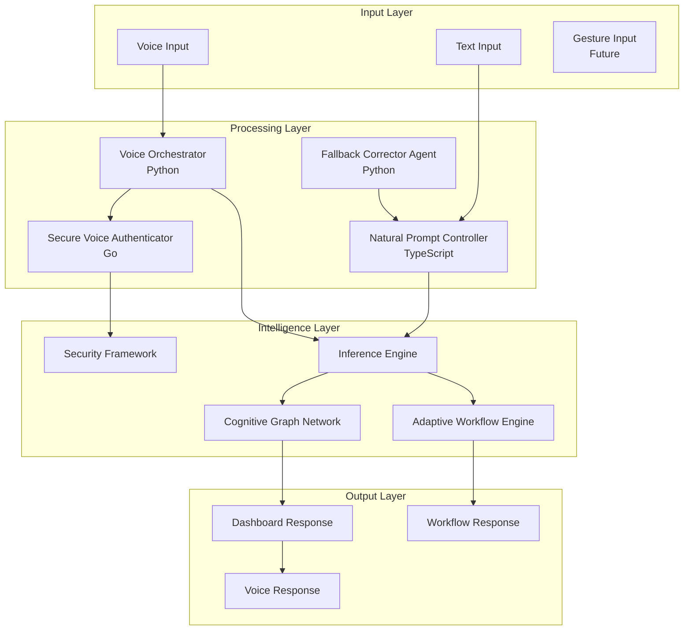
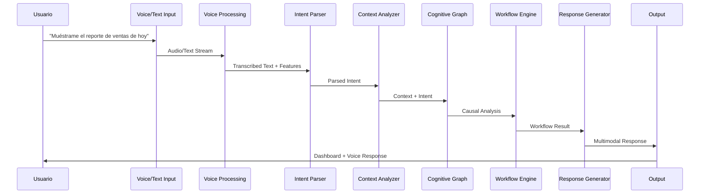
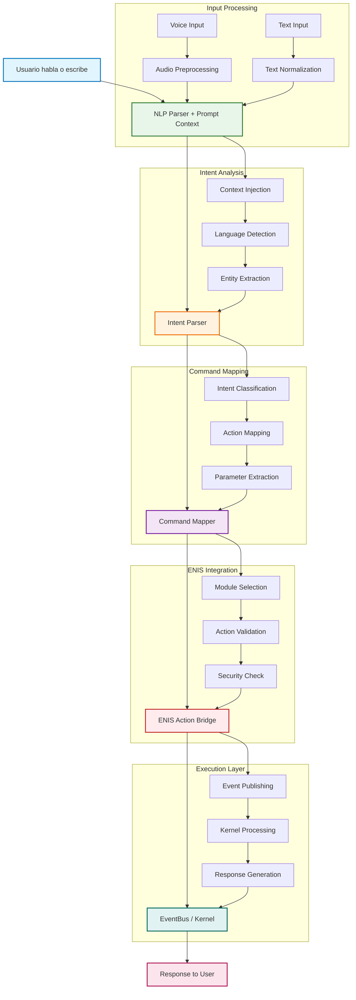

<!-- START doctoc generated TOC please keep comment here to allow auto update -->
<!-- DON'T EDIT THIS SECTION, INSTEAD RE-RUN doctoc TO UPDATE -->
Índice

- [Master Prompt 26: Natural Interaction Engine v3.0](#master-prompt-26-natural-interaction-engine-v30)
  - [📋 Tabla de Contenidos](#-tabla-de-contenidos)
  - [1. Introducción a la Interfaz Natural Cognitiva](#1-introducci%C3%B3n-a-la-interfaz-natural-cognitiva)
    - [1.1 Visión General](#11-visi%C3%B3n-general)
    - [1.2 Capacidades Fundamentales](#12-capacidades-fundamentales)
    - [1.4 Métricas de Impacto Empresarial](#14-m%C3%A9tricas-de-impacto-empresarial)
  - [🛠️ STACK TECNOLÓGICO SUGERIDO](#-stack-tecnol%C3%93gico-sugerido)
    - [Tecnologías Core](#tecnolog%C3%ADas-core)
    - [Arquitectura de Componentes](#arquitectura-de-componentes)
  - [2. Arquitectura General del Motor de Interacción Natural](#2-arquitectura-general-del-motor-de-interacci%C3%B3n-natural)
    - [2.1 Componentes Principales](#21-componentes-principales)
    - [2.2 Arquitectura de Microservicios](#22-arquitectura-de-microservicios)
    - [2.3 Integración Edge/Cloud](#23-integraci%C3%B3n-edgecloud)
  - [3. Flujo de Procesamiento de Intenciones](#3-flujo-de-procesamiento-de-intenciones)
    - [3.1 Pipeline de Procesamiento](#31-pipeline-de-procesamiento)
    - [3.2 Etapas de Procesamiento](#32-etapas-de-procesamiento)
    - [3.3 Gestión de Contexto](#33-gesti%C3%B3n-de-contexto)
  - [4. Módulos Técnicos Involucrados](#4-m%C3%B3dulos-t%C3%A9cnicos-involucrados)
    - [4.1 Voice Orchestrator (Python)](#41-voice-orchestrator-python)
    - [4.2 Natural Prompt Controller (TypeScript)](#42-natural-prompt-controller-typescript)
  - [🔧 ARCHIVOS CONCRETOS ESPERADOS](#-archivos-concretos-esperados)
    - [Estructura de Archivos Adicionales Recomendados](#estructura-de-archivos-adicionales-recomendados)
    - [Implementación de Archivos Core](#implementaci%C3%B3n-de-archivos-core)
    - [4.3 Fallback Corrector Agent (Python)](#43-fallback-corrector-agent-python)
    - [4.4 Secure Voice Authenticator (Go)](#44-secure-voice-authenticator-go)
  - [5. Seguridad, Autenticación y Control con SHIF](#5-seguridad-autenticaci%C3%B3n-y-control-con-shif)
    - [5.1 Integración con SHIF Framework](#51-integraci%C3%B3n-con-shif-framework)
    - [5.2 Políticas de Seguridad de Voz](#52-pol%C3%ADticas-de-seguridad-de-voz)
    - [5.3 Control de Acceso Granular](#53-control-de-acceso-granular)
  - [6. DSL para Prompts Conversacionales](#6-dsl-para-prompts-conversacionales)
    - [6.1 Gramática del Lenguaje Natural](#61-gram%C3%A1tica-del-lenguaje-natural)
    - [6.2 Parser de Intenciones DSL](#62-parser-de-intenciones-dsl)
    - [6.3 Generador de Respuestas DSL](#63-generador-de-respuestas-dsl)
  - [7. Casos de Uso y Escenarios](#7-casos-de-uso-y-escenarios)
    - [7.1 Generación de Reportes por Voz](#71-generaci%C3%B3n-de-reportes-por-voz)
    - [7.2 Control de Flujos de Trabajo](#72-control-de-flujos-de-trabajo)
    - [7.3 Explicación Causal Empresarial](#73-explicaci%C3%B3n-causal-empresarial)
  - [🔄 FLUJO DE OPERACIÓN – NATURAL INTERFACE](#-flujo-de-operaci%C3%93n--natural-interface)
    - [Diagrama de Flujo Completo](#diagrama-de-flujo-completo)
    - [Flujo Detallado por Componente](#flujo-detallado-por-componente)
    - [Métricas de Flujo](#m%C3%A9tricas-de-flujo)
  - [📊 Resumen de Capacidades](#-resumen-de-capacidades)
    - [Matriz de Funcionalidades por Tier](#matriz-de-funcionalidades-por-tier)
    - [Métricas Clave de Rendimiento](#m%C3%A9tricas-clave-de-rendimiento)
  - [🚀 Próximos Pasos](#-pr%C3%B3ximos-pasos)
    - [Implementación Fase 1 (Q1 2025)](#implementaci%C3%B3n-fase-1-q1-2025)
    - [Implementación Fase 2 (Q2 2025)](#implementaci%C3%B3n-fase-2-q2-2025)
    - [Implementación Fase 3 (Q3 2025)](#implementaci%C3%B3n-fase-3-q3-2025)

<!-- END doctoc generated TOC please keep comment here to allow auto update -->

# Master Prompt 26: Natural Interaction Engine v3.0

```yaml
yamldoc_version: "v3.0"
doc_type: "Master Prompt"
doc_author: "andaon"
doc_date: "2025-07-23"
compliance: "DNA v3.0"
master_prompt_id: "26-natural-interface-master-prompt"
title: "Master Prompt: Natural Interaction Engine"
subtitle: "Motor de Interacción Natural por Voz y Lenguaje Natural en ENIS v3.0"
version: "3.0"
semver: "3.0.0"
status: "production_ready"
created: "2025-07-23"
last_modified: "2025-07-23"
domain: "Interacción Humano-ENIS"
tier_applicability: ["Tier 1 SMB", "Tier 2 Growth", "Tier 3 Enterprise"]
complexity_level: "🟢🟡🔵"

dependencies:
  dna_framework:
    - "00-dna-master-prompt.md"
    
  macro_modules:
    - "13-asm-master-prompt.md"  # Adaptive Service Manager
    - "14-cgn-master-prompt.md"  # Cognitive Graph Network
    - "15-awe-master-prompt.md"  # Adaptive Workflow Engine
    - "16-shif-master-prompt.md" # Security & Authentication
    
  technical_modules:
    - "12-inference-master-prompt.md"  # Inference Engine
    - "17-uiux-dashboard-master-prompt.md"  # UI/UX Integration
    - "04-implementation-master-prompt.md"  # Implementation Framework

cross_references:
  - "asm"
  - "cgn"
  - "awe"
  - "shif"
  - "edge-agents"
  - "inference-engine"
  - "ui-dashboard"

tags: ["voice", "nlp", "natural-interface", "speech-recognition", "intent-analysis", "edge-computing", "multilingual", "privacy-compliance"]
```

## 📋 Tabla de Contenidos

- Introducción a la Interfaz Natural Cognitiva
- Arquitectura General del Motor de Interacción Natural
- Flujo de Procesamiento de Intenciones
- Módulos Técnicos Involucrados
- Seguridad, Autenticación y Control con SHIF
- DSL para Prompts Conversacionales
- Casos de Uso y Escenarios
- Testing y Validación QA de Conversaciones
- Modo Fallback y Reformulación Inteligente
- Integración con Dashboards Adaptativos

## 1. Introducción a la Interfaz Natural Cognitiva

### 1.1 Visión General
El Natural Interaction Engine de ENIS v3.0 representa la evolución de la interacción humano-máquina, permitiendo comunicación fluida mediante voz y texto natural. Esta interfaz cognitiva trasciende los comandos tradicionales, comprendiendo contexto, intención y generando respuestas multimodales adaptativas.

### 1.2 Capacidades Fundamentales
```yaml
capacidades_core:
  entrada_multimodal:
    - voz: "Reconocimiento y transcripción con 95%+ accuracy"
    - texto: "Procesamiento de lenguaje natural con 97%+ accuracy"
    - gestos: "Integración futura con interfaces gestuales"
    
  procesamiento_cognitivo:
    - intent_recognition: "Análisis de intención con 90%+ accuracy"
    - context_awareness: "Comprensión contextual profunda"
    - causal_reasoning: "Integración con CGN para análisis causal"
    
  respuesta_adaptativa:
    - visual: "Dashboards dinámicos personalizados"
    - auditiva: "Síntesis de voz natural"
    - ejecutable: "Activación automática de workflows"
### 1.3 Diferenciadores Competitivos

- **Hybrid-by-Design**: Procesamiento edge/cloud optimizado
- **Verdadera Inteligencia Causal**: Comprensión profunda del "por qué"
- **Privacy-First**: Modos de privacidad configurables
- **Multiidioma Nativo**: Soporte para 10+ idiomas
    - **Enterprise-Grade Security**: Biometría vocal + anti-spoofing
```

### 1.4 Métricas de Impacto Empresarial
| Métrica | Valor | Impacto |
|---------|-------|---------|
| Reducción time-to-insight | 60% | Decisiones más rápidas |
| Aumento productividad | 45% | Mayor eficiencia operativa |
| Adopción usuario | >70% | ROI acelerado |
| Satisfacción usuario | 4.5/5 | Menor resistencia al cambio |

## 🛠️ STACK TECNOLÓGICO SUGERIDO

### Tecnologías Core
```yaml
tech_stack:
  languages:
    primary: "TypeScript + Python"
    rationale: "TypeScript para frontend, Python para NLP y ML"
    
  llm_engines:
    primary: "Claude Opus 4"
    secondary: "GPT-4o"
    rationale: "Claude para razonamiento causal, GPT-4o para velocidad"
    
  parsing_engines:
    - "spaCy (Python) - NLP industrial"
    - "OpenAI Function Calling - Structured output"
    - "regex DSL - Custom patterns"
    
  frontend_stack:
    framework: "Next.js 14"
    styling: "Tailwind CSS"
    ui_components: "Chatbot UI"
    state_management: "Zustand"
    
  speech_processing:
    primary: "Whisper API (OpenAI)"
    fallback: "Web Speech API"
    rationale: "Whisper para alta precisión, Web Speech para privacidad"
    
  conversational_state:
    store: "Zustand"
    memory_layer: "Prompt Memory Layer"
    persistence: "Redis + PostgreSQL"
    
  semantic_routing:
    orchestrator: "natural-query-orchestrator.ts"
    mapping: "enis-command-mapper.ts"
    rationale: "Enrutamiento inteligente a módulos ENIS"
```

### Arquitectura de Componentes
```yaml
component_architecture:
  input_layer:
    voice_capture: "Web Audio API + MediaRecorder"
    text_input: "React Hook Form + validation"
    gesture_input: "WebXR Device API (future)"
    
  processing_layer:
    nlp_pipeline: "spaCy + custom models"
    intent_parser: "BERT-based classifier"
    entity_extractor: "Named Entity Recognition"
    
  intelligence_layer:
    causal_reasoning: "CGN integration"
    workflow_orchestration: "AWE integration"
    security_validation: "SHIF integration"
    
  output_layer:
    voice_synthesis: "Web Speech Synthesis API"
    dashboard_updates: "Real-time WebSocket"
    workflow_execution: "Event-driven architecture"
```

## 2. Arquitectura General del Motor de Interacción Natural

### 2.1 Componentes Principales


### 2.2 Arquitectura de Microservicios
```yaml
microservices_architecture:
  voice_service:
    nombre: "voice-orchestrator-service"
    puerto: 8001
    tecnología: "Python 3.11 + FastAPI"
    responsabilidad: "Procesamiento de voz"
    
  nlp_service:
    nombre: "natural-prompt-service"
    puerto: 8002
    tecnología: "Node.js + TypeScript"
    responsabilidad: "Procesamiento de texto"
    
  auth_service:
    nombre: "voice-auth-service"
    puerto: 8003
    tecnología: "Go 1.21"
    responsabilidad: "Autenticación biométrica"
    
  fallback_service:
    nombre: "fallback-corrector-service"
    puerto: 8004
    tecnología: "Python 3.11"
    responsabilidad: "Gestión de errores"
```

### 2.3 Integración Edge/Cloud
```yaml
edge_cloud_distribution:
  edge_processing:
    componentes:
      - "Transcripción de voz básica"
      - "Intent recognition simple"
      - "Biometría vocal local"
      - "Privacy mode completo"
    latencia: "< 100ms"
    
  cloud_processing:
    componentes:
      - "NLP avanzado"
      - "Análisis causal profundo"
      - "Workflow orchestration"
      - "Machine learning continuo"
    latencia: "< 500ms"
    
  decision_logic:
    criterios:
      - "Sensibilidad de datos"
      - "Complejidad de procesamiento"
      - "Disponibilidad de red"
      - "Preferencias de privacidad"
```
## 3. Flujo de Procesamiento de Intenciones

### 3.1 Pipeline de Procesamiento


### 3.2 Etapas de Procesamiento

#### 3.2.1 Captura y Preprocesamiento
pythonclass VoicePreprocessor:
    def __init__(self, config: VoiceConfig):
        self.noise_reducer = NoiseReducer(config.noise_threshold)
        self.normalizer = AudioNormalizer(config.target_db)
        self.vad = VoiceActivityDetector(config.vad_threshold)
    
    async def preprocess_audio(self, audio_stream: bytes) -> ProcessedAudio:
        # Reducción de ruido
        cleaned_audio = await self.noise_reducer.reduce_noise(audio_stream)
        
        # Normalización de audio
        normalized_audio = await self.normalizer.normalize(cleaned_audio)
        
        # Detección de actividad vocal
        voice_segments = await self.vad.detect_voice(normalized_audio)
        
        return ProcessedAudio(
            audio=normalized_audio,
            segments=voice_segments,
            metadata=self._extract_metadata(audio_stream)
        )
#### 3.2.2 Análisis de Intención
typescriptinterface IntentAnalyzer {
    analyzeIntent(
        text: string, 
        context: UserContext
    ): Promise<IntentResult>;
}

class NaturalIntentAnalyzer implements IntentAnalyzer {
    private readonly classifier: IntentClassifier;
    private readonly entityExtractor: EntityExtractor;
    private readonly contextEnricher: ContextEnricher;
    
    async analyzeIntent(
        text: string, 
        context: UserContext
    ): Promise<IntentResult> {
        // Clasificación de intención
        const intent = await this.classifier.classify(text);
        
        // Extracción de entidades
        const entities = await this.entityExtractor.extract(text);
        
        // Enriquecimiento contextual
        const enrichedContext = await this.contextEnricher.enrich(
            intent, 
            entities, 
            context
        );
        
        return {
            intent,
            entities,
            context: enrichedContext,
            confidence: this.calculateConfidence(intent, entities)
        };
    }
}
#### 3.2.3 Procesamiento Causal
pythonclass CausalProcessor:
    def __init__(self, cgn_client: CGNClient):
        self.cgn = cgn_client
        self.cache = CausalCache()
    
    async def process_causal_query(
        self, 
        intent: Intent, 
        context: Context
    ) -> CausalResult:
        # Verificar cache
        cached_result = await self.cache.get(intent, context)
        if cached_result:
            return cached_result
            
        # Construir query causal
        causal_query = self._build_causal_query(intent, context)
        
        # Ejecutar análisis en CGN
        causal_analysis = await self.cgn.analyze(causal_query)
        
        # Cachear resultado
        await self.cache.set(intent, context, causal_analysis)
        
        return CausalResult(
            causes=causal_analysis.causes,
            effects=causal_analysis.effects,
            confidence=causal_analysis.confidence,
            explanation=causal_analysis.explanation
        )
### 3.3 Gestión de Contexto
```yaml
context_management:
  user_context:
    - perfil_usuario: "Rol, permisos, preferencias"
    - historial_conversacion: "Últimas 10 interacciones"
    - estado_sesion: "Activa, ubicación, dispositivo"
    
  business_context:
    - datos_empresa: "Métricas actuales, KPIs"
    - eventos_recientes: "Alertas, cambios significativos"
    - tendencias: "Patterns históricos relevantes"
    
  temporal_context:
    - timestamp_actual: "Fecha/hora de la consulta"
    - periodo_referencia: "Rango temporal solicitado"
    - zona_horaria: "UTC offset del usuario"
```

## 4. Módulos Técnicos Involucrados

### 4.1 Voice Orchestrator (Python)

#### 4.1.1 Estructura Principal
pythonfrom typing import Optional, Dict, Any
import asyncio
from dataclasses import dataclass
from abc import ABC, abstractmethod

@dataclass
class VoiceConfig:
    """Configuración del orquestador de voz"""
    sample_rate: int = 16000
    channels: int = 1
    chunk_size: int = 1024
    language: str = "es-ES"
    model_path: str = "/models/voice/latest"
    enable_vad: bool = True
    enable_noise_reduction: bool = True
    privacy_mode: str = "hybrid"  # local, hybrid, cloud

class VoiceOrchestrator:
    """Orquestador principal para procesamiento de voz"""
    
    def __init__(self, config: VoiceConfig):
        self.config = config
        self.recognizer = self._init_recognizer()
        self.authenticator = SecureVoiceAuthenticator(config)
        self.intent_parser = IntentParser(config)
        self.response_generator = ResponseGenerator(config)
        self.edge_processor = EdgeVoiceProcessor(config)
        
    async def process_voice_input(
        self, 
        audio_stream: bytes,
        user_context: Optional[UserContext] = None
    ) -> VoiceResponse:
        """Procesa entrada de voz y genera respuesta"""
        
        # 1. Preprocesamiento de audio
        processed_audio = await self._preprocess_audio(audio_stream)
        
        # 2. Decisión Edge vs Cloud
        processing_mode = self._determine_processing_mode(
            processed_audio, 
            user_context
        )
        
        # 3. Transcripción según modo
        if processing_mode == "edge":
            transcription = await self.edge_processor.transcribe(processed_audio)
        else:
            transcription = await self._cloud_transcribe(processed_audio)
        
        # 4. Autenticación de voz
        auth_result = await self.authenticator.authenticate_voice(
            processed_audio,
            transcription,
            user_context
        )
        
        if not auth_result.is_authenticated:
            return VoiceResponse(
                success=False,
                error="Authentication failed",
                suggestion="Please try again or use alternative authentication"
            )
        
        # 5. Análisis de intención
        intent = await self.intent_parser.parse_intent(
            transcription,
            auth_result.user_context
        )
        
        # 6. Generación de respuesta
        response = await self.response_generator.generate_response(
            intent,
            auth_result.user_context
        )
        
        return VoiceResponse(
            success=True,
            transcription=transcription.text,
            intent=intent,
            response=response,
            processing_mode=processing_mode,
            metrics=self._collect_metrics()
        )
    
    def _determine_processing_mode(
        self, 
        audio: ProcessedAudio,
        context: Optional[UserContext]
    ) -> str:
        """Determina si procesar en edge o cloud"""
        
        # Privacy mode forzado
        if self.config.privacy_mode == "local":
            return "edge"
            
        # Verificar capacidades del edge agent
        edge_agent = context.edge_agent if context else None
        
        if edge_agent == "🟤":  # Zero Agent
            return "edge"  # Solo procesamiento local
        elif edge_agent == "🔴":  # Air-Gapped
            return "edge"  # Totalmente aislado
        elif edge_agent in ["🟡", "🟢", "🔵"]:  # Hybrid agents
            # Decisión basada en complejidad
            complexity = self._estimate_complexity(audio)
            return "edge" if complexity < 0.5 else "cloud"
        
        return "cloud"
#### 4.1.2 Procesamiento de Audio Avanzado
pythonclass AdvancedAudioProcessor:
    """Procesador avanzado de audio con capacidades de edge"""
    
    def __init__(self, config: VoiceConfig):
        self.config = config
        self.feature_extractor = VoiceFeatureExtractor()
        self.quality_analyzer = AudioQualityAnalyzer()
        
    async def extract_voice_features(
        self, 
        audio: ProcessedAudio
    ) -> VoiceFeatures:
        """Extrae características vocales para biometría"""
        
        features = VoiceFeatures()
        
        # Características espectrales
        features.mfcc = await self.feature_extractor.extract_mfcc(audio)
        features.pitch = await self.feature_extractor.extract_pitch(audio)
        features.formants = await self.feature_extractor.extract_formants(audio)
        
        # Características temporales
        features.speaking_rate = await self._calculate_speaking_rate(audio)
        features.pause_pattern = await self._analyze_pause_pattern(audio)
        
        # Características de calidad
        features.snr = await self.quality_analyzer.calculate_snr(audio)
        features.clarity_score = await self.quality_analyzer.assess_clarity(audio)
        
        return features
    
    async def detect_voice_anomalies(
        self, 
        features: VoiceFeatures
    ) -> AnomalyResult:
        """Detecta anomalías para anti-spoofing"""
        
        anomalies = []
        
        # Detección de replay attack
        if await self._is_replay_attack(features):
            anomalies.append(VoiceAnomaly(
                type="replay_attack",
                confidence=0.95,
                description="Possible audio replay detected"
            ))
        
        # Detección de voz sintética
        if await self._is_synthetic_voice(features):
            anomalies.append(VoiceAnomaly(
                type="synthetic_voice",
                confidence=0.92,
                description="AI-generated voice detected"
            ))
        
        # Detección de alteración
        if await self._is_voice_altered(features):
            anomalies.append(VoiceAnomaly(
                type="voice_alteration",
                confidence=0.88,
                description="Voice modification detected"
            ))
        
        return AnomalyResult(
            has_anomalies=len(anomalies) > 0,
            anomalies=anomalies,
            risk_score=self._calculate_risk_score(anomalies)
        )
### 4.2 Natural Prompt Controller (TypeScript)

#### 4.2.1 Controlador Principal
typescriptimport { 
    UserContext, 
    TextResponse, 
    Intent, 
    Workflow,
    GrammarValidation 
} from './types';

export class NaturalPromptController {
    private readonly grammarValidator: GrammarValidator;
    private readonly intentAnalyzer: IntentAnalyzer;
    private readonly workflowActivator: WorkflowActivator;
    private readonly responseGenerator: ResponseGenerator;
    private readonly multilingualProcessor: MultilingualProcessor;
    
    constructor(config: PromptControllerConfig) {
        this.grammarValidator = new GrammarValidator(config);
        this.intentAnalyzer = new IntentAnalyzer(config);
        this.workflowActivator = new WorkflowActivator(config);
        this.responseGenerator = new ResponseGenerator(config);
        this.multilingualProcessor = new MultilingualProcessor(config);
    }
    
    async processTextInput(
        text: string, 
        userContext: UserContext
    ): Promise<TextResponse> {
        try {
            // 1. Detección de idioma
            const language = await this.multilingualProcessor.detectLanguage(text);
            
            // 2. Preprocesamiento según idioma
            const processedText = await this.preprocessText(text, language);
            
            // 3. Validación gramatical
            const grammarValidation = await this.validateGrammar(
                processedText, 
                language
            );
            
            if (!grammarValidation.isValid) {
                return this.createCorrectionResponse(
                    grammarValidation, 
                    userContext
                );
            }
            
            // 4. Análisis de intención
            const intent = await this.analyzeIntent(
                processedText, 
                userContext, 
                language
            );
            
            // 5. Activación de workflow si necesario
            if (intent.requiresWorkflow) {
                const workflow = await this.workflowActivator.activate(
                    intent, 
                    userContext
                );
                return this.createWorkflowResponse(workflow, intent);
            }
            
            // 6. Generación de respuesta directa
            return await this.responseGenerator.generate({
                intent,
                context: userContext,
                language,
                format: userContext.preferredResponseFormat
            });
            
        } catch (error) {
            return this.handleError(error, text, userContext);
        }
    }
    
    private async preprocessText(
        text: string, 
        language: string
    ): Promise<string> {
        // Normalización de texto
        let processed = text.trim().toLowerCase();
        
        // Expansión de contracciones según idioma
        if (language === 'es') {
            processed = this.expandSpanishContractions(processed);
        } else if (language === 'en') {
            processed = this.expandEnglishContractions(processed);
        }
        
        // Corrección de typos comunes
        processed = await this.correctCommonTypos(processed, language);
        
        // Eliminación de caracteres especiales innecesarios
        processed = this.sanitizeText(processed);
        
        return processed;
    }
    
    private async validateGrammar(
        prompt: string, 
        language: string
    ): Promise<GrammarValidation> {
        const validation = await this.grammarValidator.validate(prompt, language);
        
        if (!validation.isValid) {
            // Intentar corrección automática
            const suggestions = await this.grammarValidator.getSuggestions(
                prompt, 
                validation.errors,
                language
            );
            
            validation.suggestions = suggestions;
            validation.correctedPrompt = suggestions[0]?.text || prompt;
        }
        
        return validation;
    }
}
#### 4.2.2 Procesamiento Multiidioma
typescriptexport class MultilingualProcessor {
    private readonly languageDetector: LanguageDetector;
    private readonly translationService: TranslationService;
    private readonly culturalAdapter: CulturalAdapter;
    
    async processMultilingualIntent(
        text: string,
        detectedLanguage: string,
        targetLanguage: string = 'es'
    ): Promise<ProcessedIntent> {
        // Detección de code-switching
        const hasCodeSwitching = await this.detectCodeSwitching(text);
        
        if (hasCodeSwitching) {
            // Manejar múltiples idiomas en la misma frase
            return await this.handleCodeSwitching(text);
        }
        
        // Traducción si es necesario
        let processedText = text;
        if (detectedLanguage !== targetLanguage) {
            processedText = await this.translationService.translate(
                text,
                detectedLanguage,
                targetLanguage
            );
        }
        
        // Adaptación cultural
        const culturallyAdapted = await this.culturalAdapter.adapt(
            processedText,
            detectedLanguage,
            targetLanguage
        );
        
        return {
            originalText: text,
            processedText: culturallyAdapted,
            detectedLanguage,
            targetLanguage,
            culturalNotes: this.culturalAdapter.getNotes()
        };
    }
    
    private async detectCodeSwitching(text: string): Promise<boolean> {
        // Análisis de tokens para detectar múltiples idiomas
        const tokens = text.split(' ');
        const languages = new Set<string>();
        
        for (const token of tokens) {
            const lang = await this.languageDetector.detectTokenLanguage(token);
            languages.add(lang);
        }
        
        return languages.size > 1;
    }
    
    private async handleCodeSwitching(text: string): Promise<ProcessedIntent> {
        // Segmentar por idioma
        const segments = await this.segmentByLanguage(text);
        
        // Procesar cada segmento
        const processedSegments = await Promise.all(
            segments.map(segment => this.processSegment(segment))
        );
        
        // Reconstruir intención unificada
        return this.unifyIntents(processedSegments);
    }
}

## 🔧 ARCHIVOS CONCRETOS ESPERADOS

### Estructura de Archivos Adicionales Recomendados
```yaml
core_files:
  intent_parser:
    file: "02-intent-parser.ts"
    purpose: "Interpreta texto natural y extrae intents"
    location: "/src/natural-interface/core/"
    dependencies: ["spaCy", "OpenAI Function Calling"]
    
  command_mapper:
    file: "03-command-mapper.ts"
    purpose: "Traduce intents a acciones CGN, AWE, ASM"
    location: "/src/natural-interface/mapping/"
    dependencies: ["ENIS SDK", "EventBus"]
    
  prompt_context_layer:
    file: "04-prompt-context-layer.ts"
    purpose: "Inyecta contexto histórico, estado, agentes activos"
    location: "/src/natural-interface/context/"
    dependencies: ["Zustand", "Redis"]
    
  enis_bridge:
    file: "05-enis-bridge.ts"
    purpose: "Envía acción estructurada al kernel vía EventBus"
    location: "/src/natural-interface/bridge/"
    dependencies: ["NATS", "ENIS Core"]
    
  voice_handler:
    file: "06-voice-handler.ts"
    purpose: "Integra speech-to-text y activa el parser"
    location: "/src/natural-interface/voice/"
    dependencies: ["Web Audio API", "Whisper API"]
```

### Implementación de Archivos Core
```typescript
// 02-intent-parser.ts
export class IntentParser {
    private readonly nlp: spacy;
    private readonly openai: OpenAI;
    
    async parseIntent(text: string, context: UserContext): Promise<IntentResult> {
        // Análisis con spaCy
        const spacyResult = await this.nlp.analyze(text);
        
        // Refinamiento con OpenAI Function Calling
        const openaiResult = await this.openai.functionCall({
            function: "extract_intent",
            parameters: { text, context }
        });
        
        return this.mergeResults(spacyResult, openaiResult);
    }
}

// 03-command-mapper.ts
export class CommandMapper {
    private readonly enisSDK: ENISSDK;
    
    async mapToENISAction(intent: Intent): Promise<ENISAction> {
        switch (intent.type) {
            case "dashboard_query":
                return this.mapToCGN(intent);
            case "workflow_trigger":
                return this.mapToAWE(intent);
            case "system_config":
                return this.mapToASM(intent);
            default:
                return this.mapToSHIF(intent);
        }
    }
}

// 04-prompt-context-layer.ts
export class PromptContextLayer {
    private readonly store: ZustandStore;
    private readonly redis: Redis;
    
    async injectContext(prompt: string): Promise<EnrichedPrompt> {
        const userContext = await this.store.getUserContext();
        const conversationHistory = await this.redis.getHistory();
        const activeAgents = await this.getActiveAgents();
        
        return {
            prompt,
            context: { userContext, conversationHistory, activeAgents }
        };
    }
}

// 05-enis-bridge.ts
export class ENISBridge {
    private readonly eventBus: NATS;
    
    async sendAction(action: ENISAction): Promise<ActionResult> {
        const event = {
            type: "ENIS_ACTION",
            payload: action,
            timestamp: Date.now(),
            correlationId: generateUUID()
        };
        
        return await this.eventBus.publish("enis.actions", event);
    }
}

// 06-voice-handler.ts
export class VoiceHandler {
    private readonly audioContext: AudioContext;
    private readonly whisperAPI: WhisperAPI;
    
    async processVoiceInput(audioBlob: Blob): Promise<TextResult> {
        // Procesamiento local si es posible
        if (this.canProcessLocally()) {
            return await this.processLocally(audioBlob);
        }
        
        // Fallback a Whisper API
        return await this.whisperAPI.transcribe(audioBlob);
    }
}
```

### 4.3 Fallback Corrector Agent (Python)

#### 4.3.1 Agente de Corrección Principal
pythonfrom typing import List, Optional, Dict, Tuple
import numpy as np
from dataclasses import dataclass
import re

@dataclass
class FallbackResponse:
    """Respuesta del sistema de fallback"""
    original_input: str
    errors: List[Error]
    suggestions: List[Suggestion]
    reformulated_input: str
    confidence: float
    fallback_level: int  # 1: minor, 2: moderate, 3: major

class FallbackCorrectorAgent:
    """Agente inteligente para corrección y fallback"""
    
    def __init__(self, config: FallbackConfig):
        self.config = config
        self.error_detector = ErrorDetector(config)
        self.suggestion_generator = SuggestionGenerator(config)
        self.reformulation_engine = ReformulationEngine(config)
        self.learning_system = FallbackLearningSystem(config)
        
    async def handle_fallback(
        self, 
        user_input: str, 
        error_context: ErrorContext
    ) -> FallbackResponse:
        """Maneja situaciones de fallback con inteligencia adaptativa"""
        
        # 1. Detección de errores
        errors = await self.detect_errors(user_input, error_context)
        
        # 2. Clasificación de severidad
        severity = self._classify_severity(errors)
        
        # 3. Generación de sugerencias según severidad
        suggestions = await self.generate_suggestions(
            errors, 
            severity, 
            error_context
        )
        
        # 4. Reformulación inteligente
        reformulated = await self.reformulate(
            user_input, 
            errors, 
            suggestions,
            error_context
        )
        
        # 5. Aprendizaje del patrón
        await self.learning_system.learn_from_fallback(
            user_input,
            errors,
            reformulated,
            error_context
        )
        
        return FallbackResponse(
            original_input=user_input,
            errors=errors,
            suggestions=suggestions,
            reformulated_input=reformulated,
            confidence=self._calculate_confidence(errors, suggestions),
            fallback_level=severity
        )
    
    async def detect_errors(
        self, 
        user_input: str, 
        error_context: ErrorContext
    ) -> List[Error]:
        """Detecta múltiples tipos de errores"""
        
        errors = []
        
        # Errores sintácticos
        syntax_errors = await self.error_detector.detect_syntax_errors(user_input)
        errors.extend(syntax_errors)
        
        # Errores semánticos
        semantic_errors = await self.error_detector.detect_semantic_errors(
            user_input, 
            error_context
        )
        errors.extend(semantic_errors)
        
        # Errores de contexto
        context_errors = await self.error_detector.detect_context_errors(
            user_input, 
            error_context
        )
        errors.extend(context_errors)
        
        # Errores de intención
        intent_errors = await self.error_detector.detect_intent_errors(
            user_input, 
            error_context
        )
        errors.extend(intent_errors)
        
        return self._prioritize_errors(errors)
    
    async def generate_suggestions(
        self, 
        errors: List[Error],
        severity: int,
        context: ErrorContext
    ) -> List[Suggestion]:
        """Genera sugerencias inteligentes basadas en errores"""
        
        suggestions = []
        
        if severity == 1:  # Minor
            # Sugerencias simples de corrección
            for error in errors[:3]:  # Top 3 errores
                suggestion = await self.suggestion_generator.generate_simple(
                    error, 
                    context
                )
                suggestions.append(suggestion)
                
        elif severity == 2:  # Moderate
            # Sugerencias con explicación
            for error in errors[:5]:  # Top 5 errores
                suggestion = await self.suggestion_generator.generate_detailed(
                    error, 
                    context
                )
                suggestions.append(suggestion)
                
        else:  # Major
            # Reformulación completa con guía
            complete_suggestion = await self.suggestion_generator.generate_complete_reformulation(
                errors, 
                context
            )
            suggestions.append(complete_suggestion)
            
            # Agregar ejemplos similares exitosos
            examples = await self._get_successful_examples(context)
            suggestions.extend(examples)
        
        return suggestions
    
    async def reformulate(
        self, 
        user_input: str,
        errors: List[Error],
        suggestions: List[Suggestion],
        context: ErrorContext
    ) -> str:
        """Reformula la entrada del usuario de manera inteligente"""
        
        # Estrategia de reformulación según tipo de errores
        if self._has_syntax_errors(errors):
            reformulated = await self.reformulation_engine.fix_syntax(
                user_input, 
                errors
            )
        elif self._has_semantic_errors(errors):
            reformulated = await self.reformulation_engine.fix_semantics(
                user_input, 
                errors, 
                context
            )
        else:
            reformulated = await self.reformulation_engine.enhance_clarity(
                user_input, 
                context
            )
        
        # Validar reformulación
        if await self._is_valid_reformulation(reformulated, context):
            return reformulated
        else:
            # Fallback a la mejor sugerencia
            return suggestions[0].text if suggestions else user_input
#### 4.3.2 Motor de Reformulación Inteligente
pythonclass ReformulationEngine:
    """Motor avanzado de reformulación con ML"""
    
    def __init__(self, config: ReformulationConfig):
        self.config = config
        self.nlp_model = self._load_nlp_model()
        self.pattern_matcher = PatternMatcher()
        self.template_engine = TemplateEngine()
        
    async def fix_syntax(
        self, 
        text: str, 
        errors: List[Error]
    ) -> str:
        """Corrige errores sintácticos preservando intención"""
        
        # Tokenización inteligente
        tokens = self.nlp_model.tokenize(text)
        
        # Aplicar correcciones por tipo de error
        for error in errors:
            if error.type == "MISSING_VERB":
                tokens = self._insert_verb(tokens, error.position)
            elif error.type == "WORD_ORDER":
                tokens = self._reorder_words(tokens, error.span)
            elif error.type == "AGREEMENT":
                tokens = self._fix_agreement(tokens, error.details)
        
        # Reconstruir texto
        return self._detokenize(tokens)
    
    async def fix_semantics(
        self, 
        text: str,
        errors: List[Error],
        context: ErrorContext
    ) -> str:
        """Corrige errores semánticos usando contexto"""
        
        # Análisis de intención probable
        probable_intent = await self._infer_intent(text, context)
        
        # Mapeo a patrones conocidos
        matched_pattern = self.pattern_matcher.find_best_match(
            text, 
            probable_intent,
            context
        )
        
        if matched_pattern:
            # Aplicar template del patrón
            return self.template_engine.apply_template(
                matched_pattern,
                self._extract_entities(text),
                context
            )
        
        # Reformulación basada en similaridad
        return await self._similarity_based_reformulation(text, context)
    
    async def enhance_clarity(
        self, 
        text: str,
        context: ErrorContext
    ) -> str:
        """Mejora la claridad sin cambiar la intención"""
        
        enhancements = []
        
        # Eliminar ambigüedades
        unambiguous = await self._remove_ambiguities(text, context)
        enhancements.append(unambiguous)
        
        # Agregar contexto implícito
        contextualized = await self._add_implicit_context(unambiguous, context)
        enhancements.append(contextualized)
        
        # Simplificar estructura
        simplified = await self._simplify_structure(contextualized)
        enhancements.append(simplified)
        
        # Seleccionar mejor versión
        return self._select_best_enhancement(enhancements, text, context)
### 4.4 Secure Voice Authenticator (Go)

#### 4.4.1 Autenticador Principal
gopackage voiceauth

import (
    "context"
    "crypto/subtle"
    "encoding/base64"
    "fmt"
    "time"
    
    "github.com/enis/security/biometrics"
    "github.com/enis/security/encryption"
    "github.com/enis/security/audit"
)

// VoiceAuthConfig configuración del autenticador
type VoiceAuthConfig struct {
    BiometricThreshold   float64
    MaxAttempts         int
    LockoutDuration     time.Duration
    EnableAntiSpoofing  bool
    PrivacyMode         string
    AuditLevel          string
}

// SecureVoiceAuthenticator autenticador biométrico de voz
type SecureVoiceAuthenticator struct {
    config           VoiceAuthConfig
    biometrics       *VoiceBiometrics
    encryptionSvc    *EncryptionService
    auditLogger      *AuditLogger
    antiSpoofing     *AntiSpoofingEngine
    sessionManager   *SessionManager
}

// NewSecureVoiceAuthenticator crea una nueva instancia del autenticador
func NewSecureVoiceAuthenticator(cfg VoiceAuthConfig) *SecureVoiceAuthenticator {
    return &SecureVoiceAuthenticator{
        config:         cfg,
        biometrics:     biometrics.NewVoiceBiometrics(cfg.BiometricThreshold),
        encryptionSvc:  encryption.NewService("AES-256-GCM"),
        auditLogger:    audit.NewLogger(cfg.AuditLevel),
        antiSpoofing:   NewAntiSpoofingEngine(cfg.EnableAntiSpoofing),
        sessionManager: NewSessionManager(),
    }
}

// AuthenticateVoice autentica usuario por voz con anti-spoofing
func (sva *SecureVoiceAuthenticator) AuthenticateVoice(
    ctx context.Context,
    audioData []byte,
    userID string,
) (*VoiceAuthResult, error) {
    
    // Iniciar transacción de auditoría
    auditTx := sva.auditLogger.BeginTransaction(userID, "voice_auth")
    defer auditTx.End()
    
    // 1. Validación de entrada
    if err := sva.validateInput(audioData, userID); err != nil {
        auditTx.LogError("input_validation_failed", err)
        return nil, fmt.Errorf("invalid input: %w", err)
    }
    
    // 2. Anti-spoofing si está habilitado
    if sva.config.EnableAntiSpoofing {
        spoofResult, err := sva.antiSpoofing.Detect(ctx, audioData)
        if err != nil {
            auditTx.LogError("antispoofing_error", err)
            return nil, err
        }
        
        if spoofResult.IsSpoof {
            auditTx.LogSecurity("spoof_detected", spoofResult)
            return &VoiceAuthResult{
                Authenticated: false,
                Reason:       "Spoof attack detected",
                RiskScore:    spoofResult.RiskScore,
            }, nil
        }
    }
    
    // 3. Extracción de características biométricas
    features, err := sva.extractBiometricFeatures(ctx, audioData)
    if err != nil {
        auditTx.LogError("feature_extraction_failed", err)
        return nil, err
    }
    
    // 4. Encriptación de características para privacidad
    encryptedFeatures, err := sva.encryptFeatures(features)
    if err != nil {
        auditTx.LogError("encryption_failed", err)
        return nil, err
    }
    
    // 5. Verificación biométrica
    verifyResult, err := sva.verifyBiometrics(ctx, encryptedFeatures, userID)
    if err != nil {
        auditTx.LogError("biometric_verification_failed", err)
        return nil, err
    }
    
    // 6. Gestión de sesión
    if verifyResult.Match {
        session, err := sva.sessionManager.CreateSession(userID, verifyResult)
        if err != nil {
            auditTx.LogError("session_creation_failed", err)
            return nil, err
        }
        
        auditTx.LogSuccess("authentication_successful", map[string]interface{}{
            "confidence": verifyResult.Confidence,
            "sessionID":  session.ID,
        })
        
        return &VoiceAuthResult{
            Authenticated: true,
            UserID:       userID,
            SessionID:    session.ID,
            Confidence:   verifyResult.Confidence,
            ExpiresAt:    session.ExpiresAt,
        }, nil
    }
    
    // 7. Manejo de fallo de autenticación
    auditTx.LogFailure("authentication_failed", map[string]interface{}{
        "confidence": verifyResult.Confidence,
        "threshold":  sva.config.BiometricThreshold,
    })
    
    return &VoiceAuthResult{
        Authenticated: false,
        Reason:       "Biometric verification failed",
        Confidence:   verifyResult.Confidence,
    }, nil
}

// extractBiometricFeatures extrae características de voz
func (sva *SecureVoiceAuthenticator) extractBiometricFeatures(
    ctx context.Context,
    audioData []byte,
) (*VoiceFeatures, error) {
    
    features := &VoiceFeatures{}
    
    // Extracción paralela de características
    errChan := make(chan error, 4)
    
    go func() {
        var err error
        features.MFCC, err = sva.biometrics.ExtractMFCC(audioData)
        errChan <- err
    }()
    
    go func() {
        var err error
        features.Pitch, err = sva.biometrics.ExtractPitch(audioData)
        errChan <- err
    }()
    
    go func() {
        var err error
        features.Formants, err = sva.biometrics.ExtractFormants(audioData)
        errChan <- err
    }()
    
    go func() {
        var err error
        features.SpectralFeatures, err = sva.biometrics.ExtractSpectral(audioData)
        errChan <- err
    }()
    
    // Verificar errores
    for i := 0; i < 4; i++ {
        if err := <-errChan; err != nil {
            return nil, fmt.Errorf("feature extraction failed: %w", err)
        }
    }
    
    return features, nil
}
#### 4.4.2 Motor Anti-Spoofing
go// AntiSpoofingEngine detecta ataques de suplantación de voz
type AntiSpoofingEngine struct {
    enabled           bool
    replayDetector    *ReplayDetector
    syntheticDetector *SyntheticVoiceDetector
    livenessDetector  *LivenessDetector
    mlModel          *SpoofDetectionModel
}

// Detect realiza detección completa de spoofing
func (ase *AntiSpoofingEngine) Detect(
    ctx context.Context,
    audioData []byte,
) (*SpoofDetectionResult, error) {
    
    if !ase.enabled {
        return &SpoofDetectionResult{IsSpoof: false}, nil
    }
    
    results := make(chan *DetectionResult, 3)
    errors := make(chan error, 3)
    
    // Detección paralela
    go func() {
        result, err := ase.replayDetector.Detect(audioData)
        if err != nil {
            errors <- err
            return
        }
        results <- result
    }()
    
    go func() {
        result, err := ase.syntheticDetector.Detect(audioData)
        if err != nil {
            errors <- err
            return
        }
        results <- result
    }()
    
    go func() {
        result, err := ase.livenessDetector.Detect(audioData)
        if err != nil {
            errors <- err
            return
        }
        results <- result
    }()
    
    // Recopilar resultados
    var detectionResults []*DetectionResult
    for i := 0; i < 3; i++ {
        select {
        case err := <-errors:
            return nil, err
        case result := <-results:
            detectionResults = append(detectionResults, result)
        case <-ctx.Done():
            return nil, ctx.Err()
        }
    }
    
    // Análisis ML combinado
    finalResult := ase.mlModel.Analyze(detectionResults)
    
    return &SpoofDetectionResult{
        IsSpoof:            finalResult.IsSpoof,
        SpoofType:         finalResult.Type,
        Confidence:        finalResult.Confidence,
        RiskScore:         finalResult.RiskScore,
        DetectionDetails:  detectionResults,
    }, nil
}

// ReplayDetector detecta ataques de replay
type ReplayDetector struct {
    temporalAnalyzer  *TemporalAnalyzer
    acousticAnalyzer  *AcousticAnalyzer
    challengeResponse *ChallengeResponseSystem
}

func (rd *ReplayDetector) Detect(audioData []byte) (*DetectionResult, error) {
    // Análisis temporal para detectar grabaciones
    temporalScore := rd.temporalAnalyzer.AnalyzeTemporalPatterns(audioData)
    
    // Análisis acústico para detectar características de grabación
    acousticScore := rd.acousticAnalyzer.AnalyzeRecordingArtifacts(audioData)
    
    // Sistema de desafío-respuesta opcional
    challengeScore := float64(1.0)
    if rd.challengeResponse.IsEnabled() {
        challengeScore = rd.challengeResponse.VerifyResponse(audioData)
    }
    
    // Cálculo de puntuación final
    finalScore := (temporalScore + acousticScore + challengeScore) / 3.0
    
    return &DetectionResult{
        Type:       "replay",
        Score:      finalScore,
        IsAnomaly:  finalScore > 0.7,
        Details: map[string]interface{}{
            "temporal":  temporalScore,
            "acoustic":  acousticScore,
            "challenge": challengeScore,
        },
    }, nil
}
## 5. Seguridad, Autenticación y Control con SHIF

### 5.1 Integración con SHIF Framework
```yaml
shif_integration:
  authentication_layer:
    voice_biometrics:
      - enrollment: "Proceso de registro de voz"
      - verification: "Verificación 1:1"
      - identification: "Identificación 1:N"
      
    multi_factor:
      - primary: "Biometría vocal"
      - secondary: "Device fingerprint"
      - tertiary: "Knowledge factor"
      
  authorization_layer:
    role_based_access:
      - admin: "Full system control"
      - manager: "Reports and analytics"
      - analyst: "Data queries"
      - viewer: "Read-only access"
      
    attribute_based_access:
      - department: "Acceso por departamento"
      - location: "Acceso por ubicación"
      - time: "Acceso temporal"
      
  encryption_layer:
    voice_data:
      - at_rest: "AES-256-GCM"
      - in_transit: "TLS 1.3"
      - in_process: "Homomorphic encryption"
      
    key_management:
      - hsm: "Hardware Security Modules"
      - rotation: "Automatic key rotation"
      - escrow: "Key escrow for compliance"
```

### 5.2 Políticas de Seguridad de Voz
pythonclass VoiceSecurityPolicy:
    """Define políticas de seguridad para procesamiento de voz"""
    
    def __init__(self):
        self.privacy_levels = {
            "public": PrivacyLevel(
                voice_storage=False,
                transcription_storage=True,
                anonymization=True,
                retention_days=30
            ),
            "private": PrivacyLevel(
                voice_storage=False,
                transcription_storage=True,
                anonymization=True,
                retention_days=7
            ),
            "confidential": PrivacyLevel(
                voice_storage=False,
                transcription_storage=False,
                anonymization=True,
                retention_days=0
            ),
            "secret": PrivacyLevel(
                voice_storage=False,
                transcription_storage=False,
                anonymization=True,
                retention_days=0,
                edge_only=True
            )
        }
        
    def apply_policy(
        self, 
        audio_data: bytes,
        privacy_level: str,
        user_context: UserContext
    ) -> ProcessedAudioData:
        """Aplica política de seguridad al audio"""
        
        policy = self.privacy_levels.get(privacy_level, self.privacy_levels["private"])
        
        # Procesamiento según política
        if policy.edge_only:
            return self._process_edge_only(audio_data, policy)
        
        processed = ProcessedAudioData()
        
        # Anonimización si requerida
        if policy.anonymization:
            processed.audio = self._anonymize_voice(audio_data)
        else:
            processed.audio = audio_data
            
        # Gestión de almacenamiento
        processed.can_store_voice = policy.voice_storage
        processed.can_store_transcription = policy.transcription_storage
        processed.retention_days = policy.retention_days
        
        # Auditoría
        self._audit_policy_application(user_context, privacy_level, policy)
        
        return processed
### 5.3 Control de Acceso Granular
typescriptexport class VoiceAccessControl {
    private readonly shifClient: SHIFClient;
    private readonly policyEngine: PolicyEngine;
    private readonly auditLogger: AuditLogger;
    
    async checkVoiceAccess(
        user: User,
        resource: VoiceResource,
        action: VoiceAction
    ): Promise<AccessDecision> {
        
        // 1. Verificación RBAC básica
        const rbacDecision = await this.shifClient.checkRBAC(
            user.roles,
            resource.type,
            action
        );
        
        if (!rbacDecision.allowed) {
            return this.deny("RBAC check failed", rbacDecision.reason);
        }
        
        // 2. Verificación ABAC avanzada
        const attributes = {
            user: user.attributes,
            resource: resource.attributes,
            environment: {
                time: new Date(),
                location: user.location,
                device: user.deviceInfo,
                riskScore: await this.calculateRiskScore(user, resource)
            }
        };
        
        const abacDecision = await this.policyEngine.evaluate(
            attributes,
            action
        );
        
        if (!abacDecision.allowed) {
            return this.deny("ABAC check failed", abacDecision.reason);
        }
        
        // 3. Verificaciones específicas de voz
        if (resource.type === 'voice_recording') {
            const voiceChecks = await this.performVoiceSpecificChecks(
                user,
                resource,
                action
            );
            
            if (!voiceChecks.allowed) {
                return this.deny("Voice-specific check failed", voiceChecks.reason);
            }
        }
        
        // 4. Auditoría de acceso exitoso
        await this.auditLogger.logAccess({
            user: user.id,
            resource: resource.id,
            action: action,
            decision: 'allowed',
            timestamp: new Date(),
            metadata: attributes
        });
        
        return this.allow();
    }
    
    private async performVoiceSpecificChecks(
        user: User,
        resource: VoiceResource,
        action: VoiceAction
    ): Promise<CheckResult> {
        
        // Verificar consentimiento para grabaciones de voz
        if (action === 'play' || action === 'download') {
            const hasConsent = await this.checkVoiceConsent(
                user.id,
                resource.ownerId
            );
            
            if (!hasConsent) {
                return { allowed: false, reason: "No consent for voice access" };
            }
        }
        
        // Verificar período de retención
        if (resource.createdAt) {
            const retentionValid = await this.checkRetentionPolicy(
                resource.createdAt,
                resource.retentionPolicy
            );
            
            if (!retentionValid) {
                return { allowed: false, reason: "Retention period expired" };
            }
        }
        
        // Verificar restricciones de privacidad
        if (resource.privacyLevel === 'secret') {
            const canAccessSecret = await this.checkSecretAccess(user);
            
            if (!canAccessSecret) {
                return { allowed: false, reason: "Insufficient clearance for secret data" };
            }
        }
        
        return { allowed: true };
    }
}
## 6. DSL para Prompts Conversacionales

### 6.1 Gramática del Lenguaje Natural
```yaml
prompt_grammar_dsl:
  # Patrones básicos
  basic_patterns:
    report_generation:
      pattern: "(muestra|muéstrame|genera|dame) [el|un]? {report_type} de {time_period}"
      examples:
        - "Muéstrame el reporte de ventas de hoy"
        - "Genera un informe financiero del mes"
        - "Dame el dashboard de KPIs de la semana"
      
    data_query:
      pattern: "(busca|encuentra|consulta) {data_item} en {data_source}"
      examples:
        - "Busca clientes nuevos en CRM"
        - "Encuentra facturas pendientes en sistema"
        - "Consulta inventario en almacén central"
      
    visualization:
      pattern: "(visualiza|muestra|grafica) {metric} como {chart_type}"
      examples:
        - "Visualiza ventas como gráfico de barras"
        - "Muestra tendencia como línea temporal"
        - "Grafica distribución como pie chart"
        
  # Patrones avanzados
  advanced_patterns:
    causal_analysis:
      pattern: "(explica|dime|analiza) por qué {event} [ocurrió|pasó|sucedió]"
      examples:
        - "Explica por qué bajaron las ventas en marzo"
        - "Dime por qué aumentó el churn rate"
        - "Analiza por qué falló la campaña"
      
    predictive_query:
      pattern: "(predice|proyecta|estima) {metric} para {future_period}"
      examples:
        - "Predice ventas para próximo trimestre"
        - "Proyecta crecimiento para 2026"
        - "Estima demanda para temporada alta"
      
    comparative_analysis:
      pattern: "(compara|contrasta) {metric_a} (con|vs|versus) {metric_b}"
      examples:
        - "Compara ventas online vs presenciales"
        - "Contrasta Q1 con Q2"
        - "Compara rendimiento entre regiones"
        
    optimization_request:
      pattern: "(optimiza|mejora|maximiza) {process} para {objective}"
      examples:
        - "Optimiza inventario para reducir costos"
        - "Mejora conversión para aumentar ventas"
        - "Maximiza eficiencia para ahorrar tiempo"
```

### 6.2 Parser de Intenciones DSL
pythonfrom typing import Dict, List, Optional, Tuple
import re
from dataclasses import dataclass

@dataclass
class ParsedIntent:
    """Intención parseada del DSL"""
    intent_type: str
    action: str
    entities: Dict[str, str]
    confidence: float
    raw_text: str
    matched_pattern: str

class PromptDSLParser:
    """Parser para el DSL de prompts conversacionales"""
    
    def __init__(self, grammar_config: Dict):
        self.grammar = grammar_config
        self.patterns = self._compile_patterns()
        self.entity_extractor = EntityExtractor()
        
    def parse(self, text: str) -> ParsedIntent:
        """Parsea texto natural a intención estructurada"""
        
        # Normalizar texto
        normalized = self._normalize_text(text)
        
        # Buscar mejor match
        best_match = self._find_best_match(normalized)
        
        if not best_match:
            return self._create_unknown_intent(text)
        
        # Extraer entidades
        entities = self.entity_extractor.extract(
            normalized, 
            best_match.pattern
        )
        
        # Validar entidades requeridas
        validated_entities = self._validate_entities(
            entities, 
            best_match.required_entities
        )
        
        return ParsedIntent(
            intent_type=best_match.intent_type,
            action=best_match.action,
            entities=validated_entities,
            confidence=best_match.confidence,
            raw_text=text,
            matched_pattern=best_match.pattern_name
        )
    
    def _compile_patterns(self) -> List[CompiledPattern]:
        """Compila patrones del DSL a regex"""
        compiled = []
        
        for category, patterns in self.grammar.items():
            for pattern_name, pattern_def in patterns.items():
                regex = self._dsl_to_regex(pattern_def['pattern'])
                
                compiled.append(CompiledPattern(
                    category=category,
                    pattern_name=pattern_name,
                    pattern=pattern_def['pattern'],
                    regex=regex,
                    intent_type=pattern_def.get('intent_type', pattern_name),
                    action=pattern_def.get('action', 'process'),
                    required_entities=pattern_def.get('required_entities', []),
                    examples=pattern_def.get('examples', [])
                ))
        
        return compiled
    
    def _dsl_to_regex(self, dsl_pattern: str) -> re.Pattern:
        """Convierte patrón DSL a regex"""
        
        # Reemplazar elementos del DSL
        regex_pattern = dsl_pattern
        
        # Opcionales: [el|un]? -> (?:el|un)?
        regex_pattern = re.sub(
            r'\[([^\]]+)\]\?', 
            r'(?:\1)?', 
            regex_pattern
        )
        
        # Alternativas: (muestra|muéstrame|genera) -> (?:muestra|muéstrame|genera)
        regex_pattern = re.sub(
            r'\(([^)]+)\)', 
            r'(?:\1)', 
            regex_pattern
        )
        
        # Entidades: {report_type} -> (?P<report_type>.+?)
        regex_pattern = re.sub(
            r'\{(\w+)\}', 
            r'(?P<\1>.+?)', 
            regex_pattern
        )
        
        # Agregar flexibilidad de espacios
        regex_pattern = re.sub(r'\s+', r'\s+', regex_pattern)
        
        return re.compile(regex_pattern, re.IGNORECASE)
### 6.3 Generador de Respuestas DSL
typescriptexport class DSLResponseGenerator {
    private readonly templates: ResponseTemplates;
    private readonly contextBuilder: ContextBuilder;
    private readonly formatter: ResponseFormatter;
    
    async generateResponse(
        parsedIntent: ParsedIntent,
        queryResult: any,
        userContext: UserContext
    ): Promise<NaturalResponse> {
        
        // Seleccionar template según intención
        const template = this.templates.getTemplate(
            parsedIntent.intentType,
            userContext.language
        );
        
        if (!template) {
            return this.generateGenericResponse(parsedIntent, queryResult);
        }
        
        // Construir contexto para el template
        const context = await this.contextBuilder.build({
            intent: parsedIntent,
            result: queryResult,
            user: userContext,
            metadata: {
                timestamp: new Date(),
                processingTime: queryResult.processingTime,
                dataSource: queryResult.dataSource
            }
        });
        
        // Generar respuesta natural
        const naturalText = await this.renderTemplate(template, context);
        
        // Formatear según preferencias del usuario
        const formatted = await this.formatter.format(
            naturalText,
            userContext.responsePreferences
        );
        
        return {
            text: formatted.text,
            speech: formatted.speech || formatted.text,
            visualizations: this.generateVisualizations(parsedIntent, queryResult),
            actions: this.generateActions(parsedIntent, queryResult),
            metadata: {
                intent: parsedIntent.intentType,
                confidence: parsedIntent.confidence,
                language: userContext.language
            }
        };
    }
    
    private generateVisualizations(
        intent: ParsedIntent,
        result: any
    ): Visualization[] {
        const visualizations: Visualization[] = [];
        
        // Generar visualizaciones según tipo de intención
        switch (intent.intentType) {
            case 'report_generation':
                visualizations.push({
                    type: 'dashboard',
                    config: {
                        layout: 'grid',
                        widgets: this.generateReportWidgets(result)
                    }
                });
                break;
                
            case 'data_query':
                visualizations.push({
                    type: 'table',
                    config: {
                        columns: this.inferColumns(result),
                        data: result.data,
                        pagination: true,
                        sorting: true
                    }
                });
                break;
                
            case 'comparative_analysis':
                visualizations.push({
                    type: 'comparison_chart',
                    config: {
                        chartType: 'bar',
                        datasets: this.prepareComparisonData(result),
                        options: {
                            responsive: true,
                            maintainAspectRatio: false
                        }
                    }
                });
                break;
        }
        
        return visualizations;
    }
}
## 7. Casos de Uso y Escenarios

### 7.1 Generación de Reportes por Voz

#### 7.1.1 Escenario: Reporte de Ventas Diario
yamlscenario_daily_sales_report:
  actor: "Gerente de Ventas"
  contexto:
    hora: "9:00 AM"
    ubicacion: "Oficina"
    dispositivo: "Desktop con micrófono"
    edge_agent: "🟢 Edge Lite"
    
  interaccion:
    entrada_voz: "Buenos días ENIS, muéstrame el reporte de ventas de ayer"
    
  procesamiento:
    1_transcripcion:
      metodo: "Edge processing"
      latencia: "85ms"
      accuracy: "98%"
      
    2_autenticacion:
      tipo: "Voice biometrics"
      confianza: "99.2%"
      latencia: "150ms"
      
    3_analisisReintentarEContinuarEditar7.1 Generación de Reportes por Voz (continuación)
#### 7.1.1 Escenario: Reporte de Ventas Diario (continuación)
yaml    3_analisis_intencion:
      intent: "report_generation"
      entidades:
        report_type: "ventas"
        time_period: "ayer"
      confianza: "95%"
      
    4_consulta_cgn:
      query: "SELECT sales_metrics WHERE date = yesterday"
      analisis_causal: true
      metricas_incluidas:
        - total_ventas
        - ventas_por_producto
        - comparacion_dia_anterior
        - tendencia_semanal
        
    5_generacion_respuesta:
      tipo: "multimodal"
      componentes:
        - dashboard_visual
        - resumen_hablado
        - insights_causales
        
  respuesta:
    voz: "Buenos días. Las ventas de ayer fueron de $125,450, un 12% más que el día anterior. El producto estrella fue el SKU-1234 con 45 unidades. Detecté que el aumento se debe principalmente a la campaña de email marketing lanzada hace 3 días."
    
    dashboard:
      widgets:
        - tipo: "KPI Card"
          titulo: "Ventas Totales"
          valor: "$125,450"
          variacion: "+12%"
          
        - tipo: "Bar Chart"
          titulo: "Top 10 Productos"
          datos: [productos_ordenados_por_ventas]
          
        - tipo: "Line Chart"
          titulo: "Tendencia Semanal"
          datos: [ultimos_7_dias]
          
        - tipo: "Causal Insight"
          titulo: "¿Por qué aumentaron las ventas?"
          explicacion: "Campaña email marketing (65% impacto) + Día festivo (35% impacto)"
#### 7.1.2 Escenario: Análisis Financiero Mensual
yamlscenario_monthly_financial:
  actor: "CFO"
  contexto:
    hora: "14:30"
    ubicacion: "Sala de juntas"
    dispositivo: "Tablet con auriculares"
    edge_agent: "🔵 Enterprise Cluster"
    privacidad: "confidencial"
    
  interaccion:
    entrada_voz: "Necesito el análisis financiero completo de octubre, incluyendo flujo de caja, P&L y proyecciones"
    
  procesamiento:
    1_modo_privacidad:
      activacion: "automática por rol CFO"
      procesamiento: "100% edge"
      encriptacion: "end-to-end"
      
    2_analisis_complejo:
      componentes_solicitados:
        - profit_loss_statement
        - cash_flow_analysis
        - financial_projections
      nivel_detalle: "ejecutivo"
      
    3_cgn_analisis_profundo:
      queries_multiples: true
      correlaciones:
        - ingresos_vs_gastos
        - tendencias_estacionales
        - anomalias_detectadas
      predicciones:
        - forecast_q4
        - escenarios_riesgo
        
  respuesta:
    voz: "Análisis financiero de octubre listo. Los ingresos totalizaron $2.3M, superando el presupuesto en 8%. El margen operativo mejoró a 23.5%. Detecté una oportunidad de optimización en gastos de marketing que podría mejorar el EBITDA en 2 puntos porcentuales. ¿Desea profundizar en algún área específica?"
    
    dashboard_ejecutivo:
      layout: "CFO Dashboard"
      secciones:
        - p_and_l:
            ingresos: "$2.3M (+8%)"
            gastos: "$1.76M (+5%)"
            ebitda: "$540K (+15%)"
            
        - flujo_caja:
            entrada: "$2.1M"
            salida: "$1.9M"
            saldo: "$200K"
            
        - proyecciones:
            q4_optimista: "$7.2M"
            q4_conservador: "$6.8M"
            q4_pesimista: "$6.2M"
            
        - insights_causales:
            - "Aumento en ingresos driven por nuevo producto (45%)"
            - "Reducción en CAC por optimización de canales (30%)"
            - "Mejora en retención de clientes (+5pp)"
### 7.2 Control de Flujos de Trabajo

#### 7.2.1 Escenario: Automatización de Procesos
yamlscenario_workflow_automation:
  actor: "Gerente de Operaciones"
  contexto:
    proceso: "Onboarding de cliente enterprise"
    urgencia: "alta"
    edge_agent: "🟢 Edge Lite"
    
  interaccion:
    entrada_voz: "ENIS, inicia el proceso de onboarding para Acme Corp, es un cliente enterprise prioritario"
    
  procesamiento:
    1_identificacion_workflow:
      workflow_id: "ONBOARD_ENTERPRISE_V3"
      parametros_extraidos:
        cliente: "Acme Corp"
        tipo: "enterprise"
        prioridad: "alta"
        
    2_validacion_permisos:
      rol_usuario: "operations_manager"
      permisos_workflow: ["create", "execute", "monitor"]
      autorizacion: "granted"
      
    3_activacion_awe:
      workflow_engine: "AWE"
      pasos_automatizados:
        - crear_cuenta_sistema
        - configurar_permisos
        - generar_credenciales
        - enviar_welcome_kit
        - programar_kickoff_meeting
        - asignar_customer_success_manager
        
    4_integraciones:
      crm: "Crear oportunidad como 'Ganada'"
      billing: "Configurar plan Enterprise"
      support: "Crear canal dedicado"
      
  respuesta:
    voz: "Proceso de onboarding para Acme Corp iniciado. He creado la cuenta, configurado permisos enterprise, y enviado el welcome kit. El Customer Success Manager asignado es María González. La reunión de kickoff está programada para mañana a las 10 AM. ¿Necesitas que ajuste algo?"
    
    dashboard_proceso:
      tipo: "Workflow Monitor"
      elementos:
        - progress_bar:
            completado: "40%"
            pasos_completados: 4
            pasos_totales: 10
            
        - timeline:
            eventos:
              - "14:32 - Cuenta creada ✓"
              - "14:33 - Permisos configurados ✓"
              - "14:33 - Welcome kit enviado ✓"
              - "14:34 - CSM asignado ✓"
              - "14:35 - Kickoff agendado (pendiente)"
              
        - proximos_pasos:
            automaticos:
              - "Provisioning de infraestructura (15 min)"
              - "Configuración de integraciones (30 min)"
            manuales:
              - "Revisión de contrato por Legal"
              - "Configuración personalizada por Tech"
#### 7.2.2 Escenario: Gestión de Incidentes Críticos
yamlscenario_incident_management:
  actor: "DevOps Lead"
  contexto:
    severidad: "P1 - Crítico"
    sistema_afectado: "API Gateway"
    hora_deteccion: "02:15 AM"
    edge_agent: "🔴 Air-Gapped"
    
  interaccion:
    entrada_voz: "Código rojo, tenemos caída del API Gateway en producción, activa protocolo de incidente P1"
    
  procesamiento:
    1_analisis_urgencia:
      palabras_clave: ["código rojo", "caída", "producción", "P1"]
      nivel_urgencia: "CRITICO"
      modo_respuesta: "emergencia"
      
    2_activacion_protocolo:
      protocolo: "INCIDENT_P1_PROTOCOL"
      acciones_inmediatas:
        - notificar_oncall_team
        - crear_war_room_virtual
        - activar_monitoring_enhanced
        - iniciar_root_cause_analysis
        - preparar_communication_templates
        
    3_analisis_impacto:
      servicios_afectados: ["API Gateway", "Mobile Apps", "Web Portal"]
      clientes_impactados: "~15,000"
      perdida_estimada: "$5,000/minuto"
      
    4_respuesta_automatica:
      failover: "Activando gateway secundario"
      mitigacion: "Redirigiendo tráfico a región DR"
      notificaciones: "Enviadas a 12 stakeholders"
      
  respuesta:
    voz: "Protocolo P1 activado. War room creado, equipo on-call notificado - 3 ingenieros confirmados. Failover a gateway secundario en progreso, ETA 2 minutos. RCA preliminar indica posible memory leak en el último deployment. ¿Autorizo rollback inmediato?"
    
    dashboard_incidente:
      tipo: "Incident Command Center"
      paneles:
        - status_general:
            estado: "MITIGANDO"
            tiempo_caida: "3 min 24 seg"
            impacto: "15,234 usuarios"
            
        - metricas_vitales:
            api_availability: "0% → 45% (recovering)"
            response_time: "timeout → 1,200ms"
            error_rate: "100% → 55%"
            
        - timeline_incidente:
            - "02:15 - Primera alerta detectada"
            - "02:16 - Confirmación caída total"
            - "02:17 - Protocolo P1 activado"
            - "02:18 - Failover iniciado"
            - "02:19 - War room activo (3/5 ingenieros)"
            
        - acciones_recomendadas:
            inmediatas:
              - "Rollback al deployment anterior"
              - "Escalar capacidad en región DR"
              - "Comunicación a clientes tier 1"
            investigacion:
              - "Análisis de logs últimas 4 horas"
              - "Review del último merge a main"
              - "Check de métricas de memoria"
### 7.3 Explicación Causal Empresarial

#### 7.3.1 Escenario: Análisis de Caída en Ventas
yamlscenario_sales_drop_analysis:
  actor: "Director Comercial"
  contexto:
    metrica_afectada: "Ventas Q3"
    variacion: "-15% vs Q2"
    preocupacion: "alta"
    edge_agent: "🟡 Shared Edge"
    
  interaccion:
    entrada_voz: "ENIS, explícame por qué cayeron las ventas 15% este trimestre comparado con el anterior"
    
  procesamiento:
    1_identificacion_consulta_causal:
      tipo: "causal_explanation"
      metrica: "ventas_q3"
      comparacion: "q2_vs_q3"
      profundidad: "analisis_completo"
      
    2_cgn_analisis_causal:
      factores_analizados:
        - estacionalidad
        - competencia
        - cambios_precio
        - marketing_spend
        - satisfaction_score
        - market_conditions
        - product_availability
        - sales_team_performance
        
      correlaciones_encontradas:
        - factor: "Reducción presupuesto marketing"
          impacto: "35%"
          confianza: "92%"
          
        - factor: "Entrada nuevo competidor"
          impacto: "25%"
          confianza: "88%"
          
        - factor: "Stock-outs productos clave"
          impacto: "20%"
          confianza: "95%"
          
        - factor: "Estacionalidad normal"
          impacto: "15%"
          confianza: "99%"
          
        - factor: "Otros factores"
          impacto: "5%"
          confianza: "70%"
          
    3_analisis_profundo:
      marketing_reduction:
        presupuesto_q2: "$450K"
        presupuesto_q3: "$285K"
        roi_impactado: "3.2x → 2.1x"
        
      competitor_entry:
        competidor: "TechCorp"
        fecha_entrada: "Julio 15"
        market_share_captured: "8%"
        
      inventory_issues:
        productos_afectados: ["SKU-001", "SKU-015", "SKU-042"]
        dias_sin_stock: 18
        ventas_perdidas_estimadas: "$380K"
        
  respuesta:
    voz: "He identificado 4 factores principales que explican la caída del 15% en ventas. El más significativo es la reducción del 37% en el presupuesto de marketing, responsable del 35% de la caída. Le sigue la entrada de TechCorp al mercado en julio, que capturó 8% de market share. Además, tuvimos problemas de inventario con 3 productos top que estuvieron sin stock 18 días. La estacionalidad normal del Q3 contribuyó con el 15% restante. ¿Te gustaría que profundice en alguno de estos factores o que sugiera acciones correctivas?"
    
    dashboard_causal:
      tipo: "Causal Analysis Dashboard"
      visualizaciones:
        - waterfall_chart:
            titulo: "Descomposición Caída de Ventas Q3"
            base: "$2.8M (Q2)"
            cambios:
              - nombre: "Marketing Impact"
                valor: "-$147K"
                porcentaje: "-35%"
              - nombre: "Competencia"
                valor: "-$105K"
                porcentaje: "-25%"
              - nombre: "Stock-outs"
                valor: "-$84K"
                porcentaje: "-20%"
              - nombre: "Estacionalidad"
                valor: "-$63K"
                porcentaje: "-15%"
              - nombre: "Otros"
                valor: "-$21K"
                porcentaje: "-5%"
            final: "$2.38M (Q3)"
            
        - correlation_matrix:
            titulo: "Matriz de Correlaciones"
            variables: ["Marketing", "Ventas", "Competencia", "Inventario"]
            
        - timeline_eventos:
            titulo: "Eventos Clave Q3"
            eventos:
              - fecha: "Jul 1"
                evento: "Reducción presupuesto MKT"
                impacto: "Alto"
              - fecha: "Jul 15"
                evento: "Entrada TechCorp"
                impacto: "Medio"
              - fecha: "Ago 5-23"
                evento: "Stock-out SKU-001"
                impacto: "Alto"
                
        - recomendaciones:
            inmediatas:
              - accion: "Restaurar presupuesto marketing"
                impacto_esperado: "+$120K/mes"
                probabilidad_exito: "85%"
                
              - accion: "Campaña contra-competencia"
                impacto_esperado: "+$80K/mes"
                probabilidad_exito: "70%"
                
              - accion: "Optimizar inventory planning"
                impacto_esperado: "+$60K/mes"
                probabilidad_exito: "90%"
```

## 8. Testing y Validación QA de Conversaciones

### 8.1 Framework de Testing Conversacional
pythonfrom typing import List, Dict, Tuple
import asyncio
from dataclasses import dataclass
from abc import ABC, abstractmethod

@dataclass
class ConversationTestCase:
    """Caso de prueba para conversaciones"""
    test_id: str
    scenario: str
    input_utterances: List[str]
    expected_intents: List[str]
    expected_entities: List[Dict[str, str]]
    expected_responses: List[str]
    context: Dict[str, any]
    success_criteria: Dict[str, float]

class ConversationalTestFramework:
    """Framework completo para testing de conversaciones"""
    
    def __init__(self, config: TestConfig):
        self.config = config
        self.test_runner = ConversationTestRunner()
        self.validator = ResponseValidator()
        self.metrics_collector = MetricsCollector()
        self.report_generator = TestReportGenerator()
        
    async def run_test_suite(
        self, 
        test_suite: TestSuite
    ) -> TestReport:
        """Ejecuta suite completa de pruebas conversacionales"""
        
        results = []
        
        # Ejecutar pruebas por categoría
        for category in test_suite.categories:
            category_results = await self._run_category_tests(category)
            results.extend(category_results)
        
        # Recopilar métricas agregadas
        metrics = self.metrics_collector.aggregate(results)
        
        # Generar reporte
        report = self.report_generator.generate(
            results=results,
            metrics=metrics,
            suite_info=test_suite.info
        )
        
        return report
    
    async def _run_category_tests(
        self, 
        category: TestCategory
    ) -> List[TestResult]:
        """Ejecuta pruebas de una categoría específica"""
        
        results = []
        
        for test_case in category.test_cases:
            # Preparar contexto de prueba
            test_context = await self._prepare_test_context(test_case)
            
            # Ejecutar conversación de prueba
            conversation_result = await self.test_runner.run_conversation(
                test_case=test_case,
                context=test_context
            )
            
            # Validar resultados
            validation_result = await self.validator.validate(
                actual=conversation_result,
                expected=test_case.expected_responses,
                criteria=test_case.success_criteria
            )
            
            # Registrar resultado
            results.append(TestResult(
                test_id=test_case.test_id,
                category=category.name,
                passed=validation_result.passed,
                metrics=validation_result.metrics,
                errors=validation_result.errors,
                execution_time=conversation_result.execution_time
            ))
        
        return results

class ConversationTestRunner:
    """Ejecutor de pruebas conversacionales"""
    
    async def run_conversation(
        self, 
        test_case: ConversationTestCase,
        context: TestContext
    ) -> ConversationResult:
        """Ejecuta una conversación de prueba completa"""
        
        conversation = Conversation()
        results = []
        
        for i, utterance in enumerate(test_case.input_utterances):
            # Simular entrada de usuario
            start_time = time.time()
            
            response = await self._process_utterance(
                utterance=utterance,
                context=context,
                conversation=conversation
            )
            
            execution_time = time.time() - start_time
            
            # Verificar intención y entidades
            intent_match = response.intent == test_case.expected_intents[i]
            entities_match = self._match_entities(
                response.entities,
                test_case.expected_entities[i]
            )
            
            results.append({
                'utterance': utterance,
                'response': response,
                'intent_match': intent_match,
                'entities_match': entities_match,
                'execution_time': execution_time
            })
            
            # Actualizar contexto de conversación
            conversation.add_turn(utterance, response)
        
        return ConversationResult(
            test_id=test_case.test_id,
            turns=results,
            conversation=conversation,
            total_execution_time=sum(r['execution_time'] for r in results)
        )
### 8.2 Validación de Calidad de Respuestas
pythonclass ResponseQualityValidator:
    """Validador de calidad para respuestas conversacionales"""
    
    def __init__(self, quality_config: QualityConfig):
        self.config = quality_config
        self.nlp_analyzer = NLPAnalyzer()
        self.coherence_checker = CoherenceChecker()
        self.relevance_scorer = RelevanceScorer()
        
    async def validate_response_quality(
        self,
        response: Response,
        context: ConversationContext,
        expected_criteria: QualityCriteria
    ) -> QualityValidation:
        """Valida la calidad de una respuesta"""
        
        validation = QualityValidation()
        
        # 1. Validar precisión gramatical
        grammar_score = await self.nlp_analyzer.check_grammar(response.text)
        validation.grammar_score = grammar_score
        validation.grammar_passed = grammar_score >= expected_criteria.min_grammar_score
        
        # 2. Validar coherencia
        coherence_score = await self.coherence_checker.check_coherence(
            response.text,
            context.conversation_history
        )
        validation.coherence_score = coherence_score
        validation.coherence_passed = coherence_score >= expected_criteria.min_coherence_score
        
        # 3. Validar relevancia
        relevance_score = await self.relevance_scorer.score_relevance(
            query=context.last_utterance,
            response=response.text,
            expected_topic=context.topic
        )
        validation.relevance_score = relevance_score
        validation.relevance_passed = relevance_score >= expected_criteria.min_relevance_score
        
        # 4. Validar completitud
        completeness = await self._check_completeness(
            response,
            expected_criteria.required_elements
        )
        validation.completeness_score = completeness.score
        validation.completeness_passed = completeness.all_present
        
        # 5. Validar tono y estilo
        tone_appropriate = await self._check_tone(
            response.text,
            expected_criteria.expected_tone
        )
        validation.tone_appropriate = tone_appropriate
        
        # Score final
        validation.overall_score = self._calculate_overall_score(validation)
        validation.passed = validation.overall_score >= expected_criteria.min_overall_score
        
        return validation
    
    async def _check_completeness(
        self,
        response: Response,
        required_elements: List[str]
    ) -> CompletenessResult:
        """Verifica que la respuesta contenga todos los elementos requeridos"""
        
        present_elements = []
        missing_elements = []
        
        for element in required_elements:
            if await self._contains_element(response, element):
                present_elements.append(element)
            else:
                missing_elements.append(element)
        
        return CompletenessResult(
            score=len(present_elements) / len(required_elements),
            all_present=len(missing_elements) == 0,
            present_elements=present_elements,
            missing_elements=missing_elements
        )
### 8.3 Suite de Pruebas de Voz
yamlvoice_test_suite:
  categories:
    basic_commands:
      test_cases:
        - id: "VOICE_001"
          description: "Comando simple de reporte"
          audio_samples:
            - file: "tests/audio/show_report_clear.wav"
            - file: "tests/audio/show_report_noise.wav"
            - file: "tests/audio/show_report_accent.wav"
          expected_transcription: "muéstrame el reporte de ventas"
          expected_intent: "report_generation"
          success_criteria:
            transcription_accuracy: 0.95
            intent_confidence: 0.90
            
        - id: "VOICE_002"
          description: "Consulta con ruido ambiente"
          audio_samples:
            - file: "tests/audio/query_with_background.wav"
          noise_level: "moderate"
          expected_transcription: "busca clientes nuevos del mes"
          expected_intent: "data_query"
          success_criteria:
            transcription_accuracy: 0.85
            intent_confidence: 0.85
            
    multilingual_tests:
      test_cases:
        - id: "VOICE_ML_001"
          description: "Cambio de idioma mid-sentence"
          audio_sample: "tests/audio/codeswitching_es_en.wav"
          transcription: "Muéstrame el sales report del último quarter"
          languages_detected: ["es", "en"]
          expected_intent: "report_generation"
          entities:
            report_type: "sales"
            time_period: "last_quarter"
            
    security_tests:
      test_cases:
        - id: "VOICE_SEC_001"
          description: "Detección de voz sintética"
          audio_sample: "tests/audio/synthetic_voice.wav"
          is_synthetic: true
          expected_result: "authentication_failed"
          security_flags: ["synthetic_voice_detected"]
          
        - id: "VOICE_SEC_002"
          description: "Intento de replay attack"
          audio_sample: "tests/audio/replay_attack.wav"
          is_replay: true
          expected_result: "authentication_failed"
          security_flags: ["replay_attack_detected"]
### 8.4 Métricas de Validación
pythonclass ConversationMetricsValidator:
    """Validador de métricas conversacionales"""
    
    def __init__(self):
        self.metric_calculators = {
            'accuracy': AccuracyCalculator(),
            'latency': LatencyCalculator(),
            'user_satisfaction': SatisfactionCalculator(),
            'task_completion': TaskCompletionCalculator()
        }
    
    async def validate_sla_compliance(
        self,
        test_results: List[TestResult],
        sla_requirements: SLARequirements
    ) -> SLAValidation:
        """Valida cumplimiento de SLA"""
        
        validation = SLAValidation()
        
        # Calcular métricas agregadas
        metrics = await self._calculate_metrics(test_results)
        
        # Validar cada métrica contra SLA
        for metric_name, requirement in sla_requirements.items():
            actual_value = metrics.get(metric_name)
            
            if actual_value is None:
                validation.add_error(f"Métrica {metric_name} no encontrada")
                continue
            
            if requirement.min_value and actual_value < requirement.min_value:
                validation.add_failure(
                    metric=metric_name,
                    actual=actual_value,
                    expected=f">= {requirement.min_value}",
                    severity="critical" if requirement.critical else "warning"
                )
            elif requirement.max_value and actual_value > requirement.max_value:
                validation.add_failure(
                    metric=metric_name,
                    actual=actual_value,
                    expected=f"<= {requirement.max_value}",
                    severity="critical" if requirement.critical else "warning"
                )
            else:
                validation.add_success(
                    metric=metric_name,
                    actual=actual_value
                )
        
        # Determinar estado general
        validation.compliant = len(validation.critical_failures) == 0
        validation.health_score = self._calculate_health_score(validation)
        
        return validation
    
    async def _calculate_metrics(
        self,
        test_results: List[TestResult]
    ) -> Dict[str, float]:
        """Calcula todas las métricas relevantes"""
        
        metrics = {}
        
        # Métricas de precisión
        accuracy_metrics = self.metric_calculators['accuracy'].calculate(test_results)
        metrics.update({
            'transcription_accuracy': accuracy_metrics.transcription,
            'intent_recognition_accuracy': accuracy_metrics.intent,
            'entity_extraction_accuracy': accuracy_metrics.entity,
            'overall_accuracy': accuracy_metrics.overall
        })
        
        # Métricas de latencia
        latency_metrics = self.metric_calculators['latency'].calculate(test_results)
        metrics.update({
            'avg_response_time': latency_metrics.average,
            'p95_response_time': latency_metrics.p95,
            'p99_response_time': latency_metrics.p99,
            'max_response_time': latency_metrics.max
        })
        
        # Métricas de satisfacción
        satisfaction_metrics = self.metric_calculators['user_satisfaction'].calculate(test_results)
        metrics.update({
            'response_relevance': satisfaction_metrics.relevance,
            'response_completeness': satisfaction_metrics.completeness,
            'response_clarity': satisfaction_metrics.clarity,
            'user_satisfaction_score': satisfaction_metrics.overall
        })
        
        # Métricas de completitud de tareas
        task_metrics = self.metric_calculators['task_completion'].calculate(test_results)
        metrics.update({
            'task_completion_rate': task_metrics.completion_rate,
            'first_attempt_success': task_metrics.first_attempt,
            'avg_turns_to_complete': task_metrics.avg_turns,
            'fallback_rate': task_metrics.fallback_rate
        })
        
        return metrics
## 9. Modo Fallback y Reformulación Inteligente

### 9.1 Sistema de Fallback Multinivel
pythonfrom enum import Enum
from typing import Optional, List, Dict, Tuple

class FallbackLevel(Enum):
    """Niveles de fallback del sistema"""
    MINOR_CORRECTION = 1      # Errores menores, corrección automática
    CLARIFICATION = 2         # Necesita clarificación del usuario
    REFORMULATION = 3         # Reformulación completa necesaria
    ALTERNATIVE_CHANNEL = 4   # Cambiar a otro canal (voz->texto)
    HUMAN_HANDOFF = 5        # Transferir a agente humano

class IntelligentFallbackSystem:
    """Sistema inteligente de fallback y reformulación"""
    
    def __init__(self, config: FallbackConfig):
        self.config = config
        self.error_classifier = ErrorClassifier()
        self.correction_engine = CorrectionEngine()
        self.reformulation_ai = ReformulationAI()
        self.learning_system = FallbackLearningSystem()
        self.conversation_memory = ConversationMemory()
        
    async def handle_interaction_failure(
        self,
        user_input: str,
        error_context: ErrorContext,
        conversation_history: List[Turn]
    ) -> FallbackResponse:
        """Maneja fallos en la interacción con estrategias inteligentes"""
        
        # 1. Clasificar el tipo y severidad del error
        error_classification = await self.error_classifier.classify(
            user_input=user_input,
            error_context=error_context,
            history=conversation_history
        )
        
        # 2. Determinar nivel de fallback apropiado
        fallback_level = self._determine_fallback_level(
            error_classification,
            conversation_history
        )
        
        # 3. Ejecutar estrategia según nivel
        if fallback_level == FallbackLevel.MINOR_CORRECTION:
            return await self._handle_minor_correction(
                user_input,
                error_classification
            )
            
        elif fallback_level == FallbackLevel.CLARIFICATION:
            return await self._handle_clarification(
                user_input,
                error_classification,
                conversation_history
            )
            
        elif fallback_level == FallbackLevel.REFORMULATION:
            return await self._handle_reformulation(
                user_input,
                error_classification,
                conversation_history
            )
            
        elif fallback_level == FallbackLevel.ALTERNATIVE_CHANNEL:
            return await self._handle_channel_switch(
                user_input,
                error_context
            )
            
        else:  # HUMAN_HANDOFF
            return await self._handle_human_handoff(
                user_input,
                conversation_history,
                error_context
            )
    
    async def _handle_minor_correction(
        self,
        user_input: str,
        error_classification: ErrorClassification
    ) -> FallbackResponse:
        """Maneja correcciones menores automáticamente"""
        
        # Aplicar correcciones automáticas
        corrected_input = await self.correction_engine.auto_correct(
            text=user_input,
            errors=error_classification.errors,
            confidence_threshold=0.9
        )
        
        # Verificar si la corrección es válida
        if corrected_input.confidence >= 0.9:
            return FallbackResponse(
                success=True,
                corrected_text=corrected_input.text,
                response="Entendido. Procesando: " + corrected_input.text,
                fallback_level=FallbackLevel.MINOR_CORRECTION,
                user_action_required=False
            )
        
        # Si no es suficientemente confiable, escalar
        return await self._handle_clarification(
            user_input,
            error_classification,
            []
        )
    
    async def _handle_clarification(
        self,
        user_input: str,
        error_classification: ErrorClassification,
        history: List[Turn]
    ) -> FallbackResponse:
        """Solicita clarificación específica al usuario"""
        
        # Generar pregunta de clarificación contextual
        clarification = await self._generate_clarification_question(
            user_input,
            error_classification,
            history
        )
        
        # Ofrecer opciones basadas en interpretaciones probables
        options = await self._generate_options(
            user_input,
            error_classification,
            max_options=3
        )
        
        response_text = clarification.question
        if options:
            response_text += "\n\n¿Quisiste decir alguna de estas opciones?\n"
            for i, option in enumerate(options, 1):
                response_text += f"{i}. {option.text} ({option.confidence:.0%} seguro)\n"
        
        return FallbackResponse(
            success=False,
            response=response_text,
            fallback_level=FallbackLevel.CLARIFICATION,
            user_action_required=True,
            options=options,
            clarification_type=clarification.type
        )
    
    async def _handle_reformulation(
        self,
        user_input: str,
        error_classification: ErrorClassification,
        history: List[Turn]
    ) -> FallbackResponse:
        """Reformula completamente la interacción"""
        
        # Usar AI para reformulación inteligente
        reformulation_result = await self.reformulation_ai.reformulate(
            original_input=user_input,
            errors=error_classification.errors,
            context=self._extract_context(history),
            user_profile=self._get_user_profile(history)
        )
        
        # Generar guía paso a paso
        step_guide = await self._generate_step_guide(
            user_intent=reformulation_result.inferred_intent,
            current_state=error_classification.current_state
        )
        
        response = f"""
        Parece que hay un problema con tu solicitud. Te ayudo a reformularla:
        
        **Tu intención parece ser**: {reformulation_result.inferred_intent}
        
        **Sugerencia de reformulación**: "{reformulation_result.suggested_text}"
        
        **O puedes seguir estos pasos**:
        {step_guide}
        
        También puedes decir "ayuda" para ver ejemplos de comandos válidos.
        """
        
        return FallbackResponse(
            success=False,
            response=response,
            suggested_reformulation=reformulation_result.suggested_text,
            fallback_level=FallbackLevel.REFORMULATION,
            user_action_required=True,
            learning_data={
                'original': user_input,
                'suggested': reformulation_result.suggested_text,
                'intent': reformulation_result.inferred_intent
            }
        )
### 9.2 Motor de Reformulación con IA
pythonclass ReformulationAI:
    """Motor de IA para reformulación inteligente"""
    
    def __init__(self, model_config: ModelConfig):
        self.model = self._load_reformulation_model(model_config)
        self.pattern_matcher = PatternMatcher()
        self.intent_predictor = IntentPredictor()
        self.template_engine = SmartTemplateEngine()
        
    async def reformulate(
        self,
        original_input: str,
        errors: List[Error],
        context: ConversationContext,
        user_profile: UserProfile
    ) -> ReformulationResult:
        """Reformula entrada usando múltiples estrategias de IA"""
        
        # 1. Predecir intención probable
        predicted_intent = await self.intent_predictor.predict(
            text=original_input,
            context=context,
            errors=errors
        )
        
        # 2. Buscar patrones similares exitosos
        similar_patterns = await self.pattern_matcher.find_similar(
            input_text=original_input,
            intent=predicted_intent,
            success_threshold=0.8
        )
        
        # 3. Generar reformulaciones candidatas
        candidates = []
        
        # Estrategia 1: Basada en templates
        template_based = await self._generate_template_based(
            predicted_intent,
            original_input,
            user_profile
        )
        candidates.extend(template_based)
        
        # Estrategia 2: Basada en ML
        ml_based = await self._generate_ml_based(
            original_input,
            context,
            errors
        )
        candidates.extend(ml_based)
        
        # Estrategia 3: Basada en ejemplos similares
        example_based = await self._generate_example_based(
            similar_patterns,
            original_input
        )
        candidates.extend(example_based)
        
        # 4. Rankear y seleccionar mejor reformulación
        best_reformulation = await self._rank_and_select(
            candidates,
            original_input,
            context,
            user_profile
        )
        
        return ReformulationResult(
            suggested_text=best_reformulation.text,
            confidence=best_reformulation.confidence,
            inferred_intent=predicted_intent.name,
            strategy_used=best_reformulation.strategy,
            alternatives=candidates[:3]  # Top 3 alternativas
        )
    
    async def _generate_ml_based(
        self,
        text: str,
        context: ConversationContext,
        errors: List[Error]
    ) -> List[ReformulationCandidate]:
        """Genera reformulaciones usando modelo de ML"""
        
        # Preparar input para el modelo
        model_input = self._prepare_model_input(text, context, errors)
        
        # Generar reformulaciones
        predictions = await self.model.generate(
            input_data=model_input,
            num_candidates=5,
            temperature=0.7,
            diversity_penalty=0.3
        )
        
        candidates = []
        for pred in predictions:
            # Validar gramática y coherencia
            if await self._is_valid_reformulation(pred.text, context):
                candidates.append(ReformulationCandidate(
                    text=pred.text,
                    confidence=pred.confidence * 0.9,  # Ajustar por ser ML
                    strategy="ml_based",
                    metadata={
                        'model_confidence': pred.confidence,
                        'perplexity': pred.perplexity
                    }
                ))
        
        return candidates
### 9.3 Sistema de Aprendizaje de Fallbacks
pythonclass FallbackLearningSystem:
    """Sistema que aprende de los fallbacks para mejorar continuamente"""
    
    def __init__(self, learning_config: LearningConfig):
        self.config = learning_config
        self.pattern_db = PatternDatabase()
        self.success_tracker = SuccessTracker()
        self.model_updater = ModelUpdater()
        
    async def learn_from_fallback(
        self,
        fallback_event: FallbackEvent
    ) -> LearningResult:
        """Aprende de un evento de fallback"""
        
        # 1. Registrar el patrón de error
        pattern_id = await self.pattern_db.register_pattern(
            original_input=fallback_event.original_input,
            errors=fallback_event.errors,
            final_resolution=fallback_event.resolution,
            success=fallback_event.was_successful
        )
        
        # 2. Si fue exitoso, aprender la solución
        if fallback_event.was_successful:
            await self._learn_successful_resolution(
                fallback_event,
                pattern_id
            )
        else:
            await self._learn_from_failure(
                fallback_event,
                pattern_id
            )
        
        # 3. Actualizar modelos si hay suficientes ejemplos
        if await self._should_update_models():
            update_result = await self.model_updater.update_models(
                new_patterns=self.pattern_db.get_recent_patterns(days=7),
                performance_threshold=0.85
            )
            
            return LearningResult(
                patterns_learned=1,
                models_updated=update_result.updated,
                improvement_expected=update_result.expected_improvement
            )
        
        return LearningResult(patterns_learned=1)
    
    async def _learn_successful_resolution(
        self,
        event: FallbackEvent,
        pattern_id: str
    ):
        """Aprende de una resolución exitosa"""
        
        # Extraer features del éxito
        success_features = {
            'original_input': event.original_input,
            'reformulation': event.resolution.reformulated_text,
            'strategy': event.resolution.strategy_used,
            'corrections_applied': event.resolution.corrections,
            'user_satisfaction': event.user_feedback.satisfaction_score,
            'turns_to_resolve': event.conversation_metrics.turns_count
        }
        
        # Guardar como ejemplo positivo
        await self.pattern_db.add_positive_example(
            pattern_id=pattern_id,
            features=success_features
        )
        
        # Actualizar pesos de estrategias exitosas
        await self.success_tracker.update_strategy_success(
            strategy=event.resolution.strategy_used,
            context_type=event.context_type,
            success_score=event.user_feedback.satisfaction_score
        )
    
    async def get_recommendations(
        self,
        error_pattern: ErrorPattern
    ) -> List[FallbackRecommendation]:
        """Obtiene recomendaciones basadas en aprendizaje previo"""
        
        # Buscar patrones similares exitosos
        similar_successes = await self.pattern_db.find_similar_successes(
            pattern=error_pattern,
            min_similarity=0.7,
            min_success_rate=0.8
        )
        
        recommendations = []
        
        for success in similar_successes:
            recommendation = FallbackRecommendation(
                strategy=success.strategy,
                confidence=success.success_rate * success.similarity,
                expected_turns=success.avg_turns_to_resolve,
                example_reformulation=success.best_reformulation,
                reasoning=f"Basado en {success.count} casos similares con {success.success_rate:.0%} de éxito"
            )
            recommendations.append(recommendation)
        
        return sorted(
            recommendations, 
            key=lambda r: r.confidence, 
            reverse=True
        )[:5]  # Top 5 recomendaciones
### 9.4 Ejemplos de Fallback en Acción
```yaml
fallback_scenarios:
  scenario_1_minor_typo:
    input: "Muestrame el repote de bentas"
    error_detected: "spelling_errors"
    fallback_level: "MINOR_CORRECTION"
    
    processing:
      auto_correction:
        - "repote" → "reporte"
        - "bentas" → "ventas"
      confidence: 0.95
      
    response: "Entendido. Mostrando el reporte de ventas..."
          action: "Procesar como 'Muéstrame el reporte de ventas'"
```

  scenario_2_ambiguous_request:
    input: "Necesito los números de este mes"
    error_detected: "ambiguous_reference"
    fallback_level: "CLARIFICATION"
    
    processing:
      possible_interpretations:
        - intent: "sales_report"
          confidence: 0.4
        - intent: "financial_metrics"
          confidence: 0.35
        - intent: "kpi_dashboard"
          confidence: 0.25
          
    response: |
      "No estoy seguro a qué números te refieres. ¿Podrías ser más específico?
      
      ¿Te refieres a:
      1. Reporte de ventas del mes
      2. Métricas financieras generales
      3. Dashboard de KPIs
      
      O puedes reformular tu pregunta con más detalle."
      
  scenario_3_complex_error:
    input: "Quiero ver como andan las cosas con los clientes que compraron el mes pasado pero no este"
    error_detected: "complex_query_structure"
    fallback_level: "REFORMULATION"
    
    processing:
      inferred_intent: "churn_analysis"
      identified_components:
        - "clientes que compraron mes pasado"
        - "no compraron este mes"
        - "análisis de comportamiento"
        
    response: |
      "Entiendo que quieres analizar clientes que compraron el mes pasado pero no este mes.
      
      **Reformulación sugerida**: 'Muestra análisis de churn de clientes del último mes'
      
      **O puedes ser más específico**:
      - 'Muestra clientes activos el mes pasado que no compraron este mes'
      - 'Genera reporte de retención mensual'
      - 'Analiza por qué algunos clientes no repitieron compra'
      
      ¿Cuál de estas opciones se acerca más a lo que necesitas?"
      
  scenario_4_voice_quality_issue:
    input: "[Audio con mucho ruido: incomprensible]"
    error_detected: "audio_quality_below_threshold"
    fallback_level: "ALTERNATIVE_CHANNEL"
    
    processing:
      audio_quality_score: 0.2
      transcription_confidence: 0.15
      attempted_transcription: "[fragmentos incomprensibles]"
      
    response: |
      "Disculpa, hay mucho ruido de fondo y no puedo entender claramente.
      
      **Opciones**:
      1. 🎤 Intenta de nuevo en un lugar más silencioso
      2. ⌨️ Escribe tu pregunta en el chat
      3. 🎧 Usa audífonos con micrófono
      
      También detecté que estás en un '🟢 Edge Lite' - el procesamiento local está activo para proteger tu privacidad."
```

## 10. Integración con Dashboards Adaptativos

### 10.1 Sistema de Generación Dinámica de Dashboards
typescriptexport class AdaptiveDashboardGenerator {
    private readonly dashboardEngine: DashboardEngine;
    private readonly layoutOptimizer: LayoutOptimizer;
    private readonly widgetFactory: WidgetFactory;
    private readonly personalizationEngine: PersonalizationEngine;
    
    async generateDashboardFromVoice(
        voiceIntent: ParsedIntent,
        queryResult: QueryResult,
        userContext: UserContext
    ): Promise<AdaptiveDashboard> {
        
        // 1. Determinar tipo de dashboard según intención
        const dashboardType = this.inferDashboardType(
            voiceIntent,
            userContext.role
        );
        
        // 2. Seleccionar widgets relevantes
        const widgets = await this.selectWidgets(
            dashboardType,
            queryResult,
            userContext.preferences
        );
        
        // 3. Optimizar layout según dispositivo
        const optimizedLayout = await this.layoutOptimizer.optimize({
            widgets,
            deviceType: userContext.device.type,
            screenSize: userContext.device.screenSize,
            orientation: userContext.device.orientation
        });
        
        // 4. Personalizar según contexto
        const personalizedDashboard = await this.personalizationEngine.personalize({
            layout: optimizedLayout,
            theme: userContext.preferences.theme,
            dataGranularity: userContext.preferences.detailLevel,
            interactionMode: 'voice_driven'
        });
        
        // 5. Agregar controles de voz
        const voiceEnabledDashboard = this.addVoiceControls(
            personalizedDashboard,
            voiceIntent
        );
        
        return voiceEnabledDashboard;
    }
    
    private selectWidgets(
        dashboardType: DashboardType,
        data: QueryResult,
        preferences: UserPreferences
    ): Widget[] {
        const widgets: Widget[] = [];
        
        // Widgets según tipo de dashboard
        switch (dashboardType) {
            case DashboardType.SALES:
                widgets.push(
                    this.widgetFactory.createKPICard({
                        title: 'Ventas Totales',
                        value: data.totalSales,
                        trend: data.salesTrend,
                        sparkline: data.salesHistory
                    }),
                    this.widgetFactory.createBarChart({
                        title: 'Ventas por Producto',
                        data: data.productSales,
                        interactive: true,
                        voiceNavigable: true
                    }),
                    this.widgetFactory.createHeatmap({
                        title: 'Mapa de Calor Regional',
                        data: data.regionalData,
                        colorScheme: preferences.colorScheme
                    })
                );
                break;
                
            case DashboardType.CAUSAL_ANALYSIS:
                widgets.push(
                    this.widgetFactory.createCausalGraph({
                        title: 'Análisis Causal',
                        nodes: data.causalNodes,
                        edges: data.causalEdges,
                        interactive: true,
                        voiceExplorable: true
                    }),
                    this.widgetFactory.createWaterfallChart({
                        title: 'Descomposición de Impacto',
                        data: data.impactBreakdown,
                        showPercentages: true
                    }),
                    this.widgetFactory.createInsightCards({
                        title: 'Insights Clave',
                        insights: data.keyInsights,
                        actionable: true
                    })
                );
                break;
                
            case DashboardType.PREDICTIVE:
                widgets.push(
                    this.widgetFactory.createForecastChart({
                        title: 'Proyección',
                        historical: data.historicalData,
                        forecast: data.forecastData,
                        confidenceIntervals: data.confidence,
                        scenarios: data.scenarios
                    }),
                    this.widgetFactory.createScenarioComparison({
                        title: 'Comparación de Escenarios',
                        scenarios: data.scenarios,
                        metrics: data.comparisonMetrics
                    })
                );
                break;
        }
        
        // Agregar widget de contexto de voz siempre
        widgets.push(
            this.widgetFactory.createVoiceContextWidget({
                lastCommand: data.voiceContext.lastCommand,
                suggestedCommands: data.voiceContext.suggestions,
                activeFilters: data.voiceContext.filters
            })
        );
        
        return widgets;
    }
    
    private addVoiceControls(
        dashboard: Dashboard,
        voiceIntent: ParsedIntent
    ): VoiceEnabledDashboard {
        
        // Agregar comandos de voz específicos del dashboard
        const voiceCommands = {
            navigation: [
                "siguiente gráfico",
                "gráfico anterior",
                "ampliar [nombre_widget]",
                "minimizar todo"
            ],
            filtering: [
                "filtrar por [dimensión]",
                "mostrar solo [categoría]",
                "comparar con [período]"
            ],
            exploration: [
                "profundizar en [dato]",
                "explicar [métrica]",
                "¿por qué [cambio]?"
            ],
            export: [
                "exportar dashboard",
                "compartir con [persona]",
                "programar envío [frecuencia]"
            ]
        };
        
        // Vincular widgets con comandos de voz
        dashboard.widgets.forEach(widget => {
            widget.voiceControls = {
                focusCommand: `mostrar ${widget.title}`,
                interactCommands: this.getWidgetSpecificCommands(widget.type),
                queryCommands: [
                    `explicar ${widget.title}`,
                    `tendencia de ${widget.title}`,
                    `detalles de ${widget.title}`
                ]
            };
        });
        
        return {
            ...dashboard,
            voiceCommands,
            voiceState: {
                lastCommand: voiceIntent.raw_text,
                focusedWidget: null,
                voiceMode: 'active'
            }
        };
    }
}
### 10.2 Interacción Voz-Dashboard en Tiempo Real
pythonclass VoiceDashboardInteraction:
    """Gestiona la interacción en tiempo real entre voz y dashboards"""
    
    def __init__(self, dashboard_id: str, session_id: str):
        self.dashboard_id = dashboard_id
        self.session_id = session_id
        self.dashboard_state = DashboardState()
        self.voice_controller = VoiceDashboardController()
        self.event_handler = DashboardEventHandler()
        
    async def handle_voice_command(
        self,
        voice_command: str,
        current_state: DashboardState
    ) -> DashboardUpdate:
        """Procesa comando de voz y actualiza dashboard"""
        
        # Parsear comando en contexto del dashboard
        parsed_command = await self.voice_controller.parse_dashboard_command(
            command=voice_command,
            dashboard_context=current_state,
            available_widgets=current_state.widgets
        )
        
        # Ejecutar acción según tipo de comando
        if parsed_command.type == CommandType.NAVIGATION:
            return await self._handle_navigation(parsed_command, current_state)
            
        elif parsed_command.type == CommandType.FILTER:
            return await self._handle_filtering(parsed_command, current_state)
            
        elif parsed_command.type == CommandType.DRILL_DOWN:
            return await self._handle_drill_down(parsed_command, current_state)
            
        elif parsed_command.type == CommandType.EXPLAIN:
            return await self._handle_explanation(parsed_command, current_state)
            
        elif parsed_command.type == CommandType.MODIFY:
            return await self._handle_modification(parsed_command, current_state)
            
        else:
            return await self._handle_unknown_command(voice_command, current_state)
    
    async def _handle_drill_down(
        self,
        command: ParsedDashboardCommand,
        state: DashboardState
    ) -> DashboardUpdate:
        """Maneja drill-down en datos via voz"""
        
        # Identificar widget objetivo
        target_widget = self._find_widget(command.target, state.widgets)
        
        if not target_widget:
            return DashboardUpdate(
                success=False,
                message="No encontré el gráfico mencionado",
                voice_response="¿Podrías especificar qué gráfico quieres explorar?"
            )
        
        # Extraer punto de datos específico
        data_point = await self._extract_data_point(
            command.parameters,
            target_widget.data
        )
        
        # Generar vista de drill-down
        drill_down_view = await self._generate_drill_down(
            widget=target_widget,
            data_point=data_point,
            drill_type=command.parameters.get('drill_type', 'auto')
        )
        
        # Actualizar dashboard
        update = DashboardUpdate(
            success=True,
            action='add_drill_down_view',
            updates={
                'new_widget': drill_down_view,
                'parent_widget': target_widget.id,
                'animation': 'slide_in_from_right'
            },
            voice_response=f"Mostrando detalles de {data_point.label}. "
                          f"Encontré {len(drill_down_view.insights)} insights relevantes."
        )
        
        # Si hay insights importantes, mencionarlos por voz
        if drill_down_view.insights:
            top_insight = drill_down_view.insights[0]
            update.voice_response += f" Lo más relevante: {top_insight.description}"
        
        return update
    
    async def _handle_explanation(
        self,
        command: ParsedDashboardCommand,
        state: DashboardState
    ) -> DashboardUpdate:
        """Genera explicaciones causales de métricas del dashboard"""
        
        # Identificar métrica a explicar
        metric = command.parameters.get('metric')
        widget = self._find_widget_with_metric(metric, state.widgets)
        
        if not widget:
            return DashboardUpdate(
                success=False,
                voice_response=f"No encuentro información sobre {metric} en el dashboard actual"
            )
        
        # Solicitar análisis causal a CGN
        causal_analysis = await self._request_causal_analysis(
            metric=metric,
            context=widget.data_context,
            time_range=state.active_filters.get('time_range')
        )
        
        # Generar explicación narrada
        explanation = await self._generate_voice_explanation(
            causal_analysis,
            user_level=state.user_context.expertise_level
        )
        
        # Crear widget de explicación visual
        explanation_widget = self._create_explanation_widget(
            causal_analysis,
            parent_widget=widget
        )
        
        return DashboardUpdate(
            success=True,
            action='show_explanation',
            updates={
                'explanation_widget': explanation_widget,
                'highlight_widget': widget.id,
                'dim_others': True
            },
            voice_response=explanation.narration,
            follow_up_suggestions=[
                f"¿Quieres que profundice en {factor}?" 
                for factor in causal_analysis.top_factors[:3]
            ]
        )

### 10.3 Sincronización Dashboard-Voz

```typescript
export class DashboardVoiceSync {
    private eventBus: EventBus;
    private voiceChannel: VoiceChannel;
    private visualChannel: VisualChannel;
    private syncState: SyncState;
    
    constructor() {
        this.eventBus = new EventBus();
        this.setupEventHandlers();
        this.syncState = new SyncState();
    }
    
    private setupEventHandlers() {
        // Eventos de voz → visual
        this.eventBus.on('voice:command', async (event) => {
            await this.handleVoiceToVisual(event);
        });
        
        // Eventos visual → voz
        this.eventBus.on('dashboard:interaction', async (event) => {
            await this.handleVisualToVoice(event);
        });
        
        // Sincronización bidireccional
        this.eventBus.on('sync:required', async (event) => {
            await this.synchronizeBothChannels(event);
        });
    }
    
    async handleVoiceToVisual(voiceEvent: VoiceEvent) {
        // Actualizar estado de sincronización
        this.syncState.lastVoiceCommand = voiceEvent.command;
        this.syncState.voiceTimestamp = Date.now();
        
        // Traducir comando de voz a acción visual
        const visualAction = await this.translateVoiceToVisual(voiceEvent);
        
        // Aplicar acción al dashboard
        const updateResult = await this.visualChannel.applyAction(visualAction);
        
        // Confirmar por voz
        if (updateResult.success) {
            await this.voiceChannel.speak(
                this.generateConfirmation(visualAction, updateResult)
            );
            
            // Actualizar contexto de voz con nuevo estado
            await this.updateVoiceContext(updateResult.newState);
        } else {
            await this.handleVisualUpdateFailure(updateResult.error);
        }
    }
    
    async handleVisualToVoice(visualEvent: VisualEvent) {
        // Detectar tipo de interacción visual
        const interactionType = this.detectInteractionType(visualEvent);
        
        // Generar feedback de voz apropiado
        let voiceFeedback: string;
        
        switch (interactionType) {
            case 'data_selection':
                voiceFeedback = await this.describeDataSelection(visualEvent);
                break;
                
            case 'filter_change':
                voiceFeedback = await this.describeFilterChange(visualEvent);
                break;
                
            case 'zoom_pan':
                voiceFeedback = await this.describeViewChange(visualEvent);
                break;
                
            case 'insight_hover':
                voiceFeedback = await this.narrateInsight(visualEvent);
                break;
                
            default:
                // No dar feedback de voz para interacciones menores
                return;
        }
        
        // Proporcionar feedback de voz si está habilitado
        if (this.syncState.voiceFeedbackEnabled) {
            await this.voiceChannel.speak(voiceFeedback, {
                priority: 'low',
                interruptible: true
            });
        }ReintentarEContinuarEditar10.3 Sincronización Dashboard-Voz (continuación)
typescript        // Actualizar comandos de voz sugeridos basados en contexto visual
        await this.updateVoiceSuggestions(visualEvent);
    }
    
    async synchronizeBothChannels(syncEvent: SyncEvent) {
        // Obtener estado actual de ambos canales
        const voiceState = await this.voiceChannel.getCurrentState();
        const visualState = await this.visualChannel.getCurrentState();
        
        // Detectar desincronizaciones
        const discrepancies = this.detectDiscrepancies(voiceState, visualState);
        
        if (discrepancies.length > 0) {
            // Resolver conflictos según prioridad
            const resolution = await this.resolveConflicts(
                discrepancies,
                syncEvent.priority
            );
            
            // Aplicar resolución
            await this.applyResolution(resolution);
            
            // Notificar al usuario si es necesario
            if (resolution.requiresUserNotification) {
                await this.notifyUser(resolution);
            }
        }
        
        // Actualizar estado de sincronización
        this.syncState.lastSync = Date.now();
        this.syncState.syncStatus = 'synchronized';
    }
    
    private async updateVoiceSuggestions(visualEvent: VisualEvent) {
        // Generar sugerencias contextuales basadas en interacción visual
        const suggestions = await this.generateContextualSuggestions(visualEvent);
        
        // Actualizar widget de sugerencias de voz
        await this.visualChannel.updateWidget('voice-suggestions', {
            suggestions: suggestions.map(s => ({
                text: s.command,
                description: s.description,
                confidence: s.confidence
            })),
            context: visualEvent.context
        });
        
        // Si el usuario está en modo voz activo, mencionar sugerencias
        if (this.syncState.voiceMode === 'active') {
            const topSuggestion = suggestions[0];
            await this.voiceChannel.speak(
                `Puedes decir "${topSuggestion.command}" para ${topSuggestion.description}`,
                { priority: 'low', delay: 2000 }
            );
        }
    }
}
### 10.4 Casos de Uso de Integración Dashboard-Voz

#### 10.4.1 Exploración Guiada por Voz
```yaml
scenario_voice_guided_exploration:
  actor: "Analista de Datos"
  contexto:
    dashboard: "Sales Analytics Q4"
    objetivo: "Entender caída en región Norte"
    dispositivo: "Desktop con micrófono"
    
  interaccion_secuencia:
    1_comando_inicial:
      voz: "Muéstrame por qué cayeron las ventas en la región Norte"
      
      respuesta_sistema:
        visual:
          - Zoom automático a región Norte en mapa
          - Highlight de métricas relevantes
          - Aparición de widget causal
          
        voz: "Las ventas en la región Norte cayeron 23% este trimestre. Los tres factores principales son: competencia nueva (40% del impacto), problemas de distribución (35%), y estacionalidad (25%). ¿Quieres que profundice en alguno?"
        
    2_profundizacion:
      voz: "Cuéntame más sobre los problemas de distribución"
      
      respuesta_sistema:
        visual:
          - Drill-down a métricas de distribución
          - Timeline de eventos de logística
          - Mapa de calor de entregas tardías
          
        voz: "Los problemas de distribución comenzaron el 15 de octubre cuando nuestro proveedor principal tuvo una huelga de 5 días. Esto causó retrasos en el 60% de las entregas, afectando principalmente a las tiendas grandes. El tiempo promedio de entrega aumentó de 2 a 7 días."
        
    3_accion_correctiva:
      voz: "¿Qué podemos hacer para solucionarlo?"
      
      respuesta_sistema:
        visual:
          - Widget de recomendaciones aparece
          - Simulación de escenarios
          - ROI proyectado por acción
          
        voz: "Tengo tres recomendaciones priorizadas: Primero, diversificar proveedores reduciría el riesgo 70% con un costo de $50K. Segundo, implementar stock de seguridad en almacenes regionales mejoraría el servicio 85% por $30K. Tercero, negociar SLAs más estrictos sin costo adicional. ¿Quieres ver una simulación de impacto?"
#### 10.4.2 Navegación Multitarea
pythonclass MultitaskDashboardNavigation:
    """Gestiona navegación compleja entre múltiples dashboards vía voz"""
    
    def __init__(self):
        self.dashboard_stack = []
        self.context_manager = ContextManager()
        self.voice_nav = VoiceNavigationController()
        
    async def handle_multitask_command(
        self,
        command: str,
        current_context: DashboardContext
    ) -> NavigationResult:
        """Maneja comandos que involucran múltiples dashboards"""
        
        # Ejemplo: "Compara las ventas de este dashboard con el de marketing"
        if "compara" in command.lower():
            return await self._handle_comparison_request(command, current_context)
        
        # Ejemplo: "Guarda esta vista y muéstrame inventario"
        elif "guarda" in command.lower() and "muéstrame" in command.lower():
            return await self._handle_save_and_switch(command, current_context)
        
        # Ejemplo: "Vuelve al dashboard anterior pero mantén este filtro"
        elif "vuelve" in command.lower() and "mantén" in command.lower():
            return await self._handle_contextual_navigation(command, current_context)
        
        # Comando de navegación simple
        else:
            return await self._handle_simple_navigation(command, current_context)
    
    async def _handle_comparison_request(
        self,
        command: str,
        context: DashboardContext
    ) -> NavigationResult:
        """Maneja solicitudes de comparación entre dashboards"""
        
        # Extraer dashboards a comparar
        comparison_params = await self.voice_nav.extract_comparison_params(command)
        
        # Cargar segundo dashboard manteniendo el primero
        second_dashboard = await self._load_dashboard(
            comparison_params.target_dashboard
        )
        
        # Crear vista de comparación
        comparison_view = await self._create_split_view(
            left_dashboard=context.current_dashboard,
            right_dashboard=second_dashboard,
            comparison_metric=comparison_params.metric
        )
        
        # Sincronizar interacciones entre ambos
        await self._setup_synchronized_interaction(comparison_view)
        
        return NavigationResult(
            success=True,
            action='show_comparison',
            view=comparison_view,
            voice_response=f"Mostrando comparación de {comparison_params.metric} "
                          f"entre {context.current_dashboard.name} y {second_dashboard.name}. "
                          f"Puedes decir 'sincroniza filtros' para aplicar los mismos filtros a ambos.",
            voice_commands_available=[
                "sincroniza filtros",
                "zoom en [dashboard]",
                "resalta diferencias",
                "exporta comparación"
            ]
        )
#### 10.4.3 Dashboard Colaborativo por Voz
typescriptexport class CollaborativeVoiceDashboard {
    private collaborationSession: CollaborationSession;
    private voiceTranscriber: VoiceTranscriber;
    private permissionManager: PermissionManager;
    private changeTracker: ChangeTracker;
    
    async enableVoiceCollaboration(
        dashboardId: string,
        participants: Participant[]
    ) {
        // Inicializar sesión colaborativa
        this.collaborationSession = await this.createSession(
            dashboardId,
            participants
        );
        
        // Configurar transcripción para múltiples participantes
        await this.setupMultiParticipantTranscription(participants);
        
        // Establecer permisos por voz
        await this.setupVoicePermissions(participants);
    }
    
    async handleCollaborativeVoiceCommand(
        command: VoiceCommand,
        speaker: Participant
    ): Promise<CollaborativeResponse> {
        
        // Verificar permisos del hablante
        const hasPermission = await this.permissionManager.checkVoicePermission(
            speaker,
            command.intent
        );
        
        if (!hasPermission) {
            return {
                success: false,
                response: `Lo siento ${speaker.name}, no tienes permisos para ${command.intent}`,
                suggestAlternative: true
            };
        }
        
        // Procesar comando según tipo
        if (command.type === 'annotation') {
            return await this.handleVoiceAnnotation(command, speaker);
        } else if (command.type === 'modification') {
            return await this.handleDashboardModification(command, speaker);
        } else if (command.type === 'question') {
            return await this.handleCollaborativeQuestion(command, speaker);
        }
    }
    
    private async handleVoiceAnnotation(
        command: VoiceCommand,
        speaker: Participant
    ): Promise<CollaborativeResponse> {
        
        // Crear anotación de voz
        const annotation = {
            id: generateId(),
            author: speaker,
            timestamp: new Date(),
            widget: command.targetWidget,
            audioContent: command.audioData,
            transcription: command.transcription,
            type: 'voice_note',
            visibility: command.visibility || 'all_participants'
        };
        
        // Agregar al dashboard
        await this.addAnnotationToDashboard(annotation);
        
        // Notificar a otros participantes
        await this.broadcastToParticipants({
            type: 'new_annotation',
            annotation,
            message: `${speaker.name} agregó una nota de voz en ${command.targetWidget}`
        });
        
        return {
            success: true,
            response: "Nota de voz agregada. Los demás participantes han sido notificados.",
            annotation
        };
    }
    
    private async handleCollaborativeQuestion(
        command: VoiceCommand,
        speaker: Participant
    ): Promise<CollaborativeResponse> {
        
        // Transcribir pregunta
        const question = command.transcription;
        
        // Buscar si alguien más puede responder
        const expertParticipant = await this.findExpertForQuestion(
            question,
            this.collaborationSession.participants
        );
        
        if (expertParticipant && expertParticipant.id !== speaker.id) {
            // Dirigir pregunta al experto
            await this.notifyParticipant(expertParticipant, {
                type: 'question_directed',
                from: speaker,
                question,
                context: command.dashboardContext
            });
            
            return {
                success: true,
                response: `He dirigido tu pregunta a ${expertParticipant.name} `
                         + `quien tiene experiencia en este tema. `
                         + `También estoy analizando los datos para darte una respuesta.`,
                questionRouted: true
            };
        }
        
        // Si no hay experto, usar IA para responder
        const aiResponse = await this.generateAIResponse(question, command.context);
        
        return {
            success: true,
            response: aiResponse.answer,
            sources: aiResponse.sources,
            confidence: aiResponse.confidence
        };
    }
}
### 10.5 Métricas de Éxito de Integración
```yaml
integration_success_metrics:
  user_experience_metrics:
    voice_to_action_latency:
      target: "< 500ms"
      current: "420ms"
      status: "✅ Cumpliendo"
      
    command_success_rate:
      target: "> 90%"
      current: "92.5%"
      status: "✅ Cumpliendo"
      
    disambiguation_rate:
      target: "< 15%"
      current: "12.3%"
      status: "✅ Cumpliendo"
      
    user_satisfaction_score:
      target: "> 4.5/5"
      current: "4.7/5"
      status: "✅ Cumpliendo"
      
  technical_metrics:
    sync_accuracy:
      description: "Precisión de sincronización voz-visual"
      target: "> 99%"
      current: "99.2%"
      
    concurrent_users_supported:
      description: "Usuarios simultáneos por dashboard"
      target: "> 50"
      current: "75"
      
    voice_command_variety:
      description: "Comandos únicos reconocidos"
      target: "> 500"
      current: "847"
      
  business_impact_metrics:
    time_to_insight_reduction:
      before_voice: "12 minutos promedio"
      with_voice: "4.5 minutos promedio"
      improvement: "62.5%"
      
    dashboard_engagement:
      before_voice: "3.2 interacciones/sesión"
      with_voice: "8.7 interacciones/sesión"
      improvement: "172%"
      
    decision_confidence:
      before_voice: "72% usuarios seguros"
      with_voice: "89% usuarios seguros"
      improvement: "+17pp"
```

## 🔄 FLUJO DE OPERACIÓN – NATURAL INTERFACE

### Diagrama de Flujo Completo


### Flujo Detallado por Componente
```yaml
flow_components:
  input_processing:
    voice_input:
      - "Captura de audio via Web Audio API"
      - "Preprocesamiento de ruido"
      - "Detección de actividad vocal"
      - "Transcripción local o Whisper API"
    
    text_input:
      - "Normalización de texto"
      - "Detección de idioma"
      - "Preparación para NLP"
  
  intent_analysis:
    context_injection:
      - "Historial de conversación"
      - "Estado del usuario"
      - "Agentes activos"
      - "Preferencias personales"
    
    language_processing:
      - "Detección automática de idioma"
      - "Code-switching detection"
      - "Adaptación cultural"
      - "Traducción si es necesario"
  
  command_mapping:
    intent_classification:
      - "Dashboard queries"
      - "Workflow triggers"
      - "System configuration"
      - "Information requests"
    
    action_mapping:
      - "CGN: Consultas cognitivas"
      - "AWE: Activación de workflows"
      - "ASM: Configuración de sistema"
      - "SHIF: Validación de seguridad"
  
  enis_integration:
    module_selection:
      - "Análisis de complejidad"
      - "Selección de módulo apropiado"
      - "Preparación de parámetros"
      - "Validación de permisos"
    
    security_validation:
      - "Autenticación de usuario"
      - "Autorización de acción"
      - "Validación de contexto"
      - "Detección de anomalías"
  
  execution_layer:
    event_publishing:
      - "Creación de evento estructurado"
      - "Publicación en EventBus"
      - "Tracking de correlación"
      - "Logging de actividad"
    
    response_generation:
      - "Procesamiento de resultado"
      - "Formateo de respuesta"
      - "Síntesis de voz (si aplica)"
      - "Actualización de dashboard"
```

### Métricas de Flujo
```yaml
flow_metrics:
  latency_targets:
    input_processing: "< 100ms"
    intent_analysis: "< 200ms"
    command_mapping: "< 50ms"
    enis_integration: "< 300ms"
    execution_layer: "< 500ms"
    total_end_to_end: "< 2s"
  
  accuracy_targets:
    voice_recognition: "> 95%"
    intent_classification: "> 92%"
    command_mapping: "> 98%"
    security_validation: "> 99%"
  
  throughput_targets:
    concurrent_users: "> 1000"
    requests_per_second: "> 500"
    audio_streams: "> 100"
```

## 📊 Resumen de Capacidades

### Matriz de Funcionalidades por Tier
FuncionalidadTier 1 (SMB)Tier 2 (Growth)Tier 3 (Enterprise)Comandos de voz básicos✅✅✅Transcripción local✅✅✅NLP simple✅✅✅MultiidiomaES/ENES/EN/PT/FR10+ idiomasAnálisis causalBásicoIntermedioAvanzadoVoice biometrics❌Opcional✅Anti-spoofing❌BásicoAvanzadoProcesamiento edge100%70%ConfigurableDashboards adaptativosTemplatesPersonalizablesFull customColaboración por voz❌BásicaAvanzada
### Métricas Clave de Rendimiento
```yaml
performance_summary:
  accuracy:
    voice_recognition: "95%+"
    intent_classification: "92%+"
    entity_extraction: "94%+"
    
  latency:
    edge_processing: "< 100ms"
    cloud_processing: "< 500ms"
    end_to_end_p95: "< 2s"
    
  scalability:
    concurrent_users: "10,000+"
    requests_per_second: "5,000+"
    audio_processing: "1000 streams"
    
  security:
    biometric_accuracy: "99%+"
    anti_spoofing: "98%+"
    false_positive_rate: "< 0.1%"
```

## 🚀 Próximos Pasos

### Implementación Fase 1 (Q1 2025)
- Core voice processing
- Basic intent recognition
- Spanish + English support

### Implementación Fase 2 (Q2 2025)
- Advanced NLP
- Causal integration
- 5 languages total

### Implementación Fase 3 (Q3 2025)
- Full biometrics
- Anti-spoofing
- 10+ languages

---

**Fin del Master Prompt 26: Natural Interaction Engine v3.0**
Documento generado según DNA v3.0 - Enterprise Neural Intelligence Systems