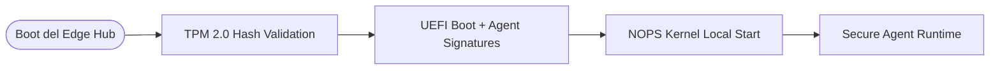

<!-- START doctoc generated TOC please keep comment here to allow auto update -->
<!-- DON'T EDIT THIS SECTION, INSTEAD RE-RUN doctoc TO UPDATE -->
Índice

- [🎯 PROMPT MASTER 28 – ENIS EDGE HUB PRO](#-prompt-master-28--enis-edge-hub-pro)
  - [📌 CONTEXTO](#-contexto)
  - [🧠 OBJETIVO DEL PROMPT](#-objetivo-del-prompt)
  - [🧱 ARQUITECTURA DE HARDWARE + LÓGICA](#-arquitectura-de-hardware--l%C3%93gica)
  - [🧩 COMPONENTES FUNCIONALES](#-componentes-funcionales)
  - [🔒 VALIDACIÓN POR HARDWARE](#-validaci%C3%93n-por-hardware)
  - [🔗 INTEGRACIÓN CON MÓDULOS ENIS](#-integraci%C3%93n-con-m%C3%93dulos-enis)
  - [📦 ESTRUCTURA DE ARCHIVOS ESPERADA](#-estructura-de-archivos-esperada)
  - [🌍 CASOS DE USO CLAVE](#-casos-de-uso-clave)
  - [🧪 PROMPTS HIJOS ESPERADOS](#-prompts-hijos-esperados)
  - [🧠 ROLES DE GENERACIÓN](#-roles-de-generaci%C3%93n)
  - [✅ REGLAS ADN ENIS](#-reglas-adn-enis)
  - [🔄 SIGUIENTE PASO](#-siguiente-paso)

<!-- END doctoc generated TOC please keep comment here to allow auto update -->

---
doc_version: "v3.0"
doc_type: "prompt_master"
doc_author: "andaon"
doc_date: "2025-07-30"
compliance: "DNA v3.0"
handoff_from: "02-architecture-master-prompt.md, 10-edge-master-prompt.md, 17-uiux-dashboard-master-prompt.md"
---

# 🎯 PROMPT MASTER 28 – ENIS EDGE HUB PRO

## 📌 CONTEXTO
Eres el Chief Hardware & Edge Systems Architect de ENIS v3.0. Estás diseñando el primer dispositivo físico de ENIS: el **ENIS EDGE HUB PRO**, una consola modular de cómputo inteligente para entornos offline, híbridos o de infraestructura sensible. Tu objetivo es convertir esta consola en una unidad de despliegue y gobernanza local completa para NOPS Kernel, CGN, AWE, ASM, SHIF, agentes edge, interfaces naturales y XR.

Este prompt debe guiar la creación de toda la documentación, infraestructura y especificaciones técnicas para integrar el hardware físico al ecosistema lógico de ENIS.

---

## 🧠 OBJETIVO DEL PROMPT
Establecer el blueprint completo de diseño físico y lógico del dispositivo **ENIS EDGE HUB PRO**, incluyendo:
- Especificaciones técnicas de hardware
- Arquitectura de integración con NOPS Kernel y módulos AI
- Escenarios de despliegue edge
- Validación con TPM 2.0 y ejecución sandbox
- Compatibilidad con interfaces UI, XR, Voz
- Flujo de arranque seguro, carga de agentes, aislamiento

---

## 🧱 ARQUITECTURA DE HARDWARE + LÓGICA

```yaml
hardware:
  cpu: Intel i9 / AMD Ryzen 9 (x86_64)
  gpu: Opcional (NVIDIA RTX / NPU Coral / Intel NPU)
  ram: 32-64GB DDR5
  storage: 1-2TB NVMe SSD
  ports:
    - HDMI 2.1
    - Thunderbolt 4
    - 4x USB-C / USB-A
    - Ethernet 2.5GbE
  firmware:
    tpm: TPM 2.0 compliant
    boot: UEFI secure boot + hash agent loader
  enclosure:
    passive_cooling: No
    active_fan: Yes
```

---

## 🧩 COMPONENTES FUNCIONALES

| Módulo               | Función física                           | Software relacionado       |
|----------------------|------------------------------------------|----------------------------|
| NOPS Kernel          | Orquestación local                       | `nops_kernel/`             |
| Agent Registry       | Validación física de agentes por hash    | `secure_registry.py`       |
| XR Interface         | Interacción 3D por WebXR/HDMI            | `xr-interface/`            |
| CGN Core             | Inferencia causal local                  | `cgn/engine/`              |
| ASM Monitor          | Lectura de sensores conectados físicos   | `asm/observers/`           |
| AWE Orchestrator     | Evolución offline de workflows           | `awe/`                     |
| SHIF Adapter Bridge  | Interfaces con APIs, sensores, eventos   | `shif/adapters/`           |
| Dashboard UI Local   | Consola ejecutiva HDMI / pantalla embebida | `ui/console/`          |

---

## 🔒 VALIDACIÓN POR HARDWARE



---

## 🔗 INTEGRACIÓN CON MÓDULOS ENIS

```yaml
dependencies:
  core:
    - /nops_kernel/
    - /eventbus/
  intelligence:
    - /cgn/
    - /awe/
    - /asm/
    - /shif/
  interfaces:
    - /natural-interface/
    - /xr-interface/
    - /ui/console/
  edge:
    - /edge-agents/
```

---

## 📦 ESTRUCTURA DE ARCHIVOS ESPERADA

```bash
/hardware/enis-edge-hub/
├── README.md
├── specs.md
├── architecture.mmd
├── tpm-validation-flow.md
├── boot-sequence.md
├── deployment-scenarios.md
├── local-agent-policy.md
├── xr-compatibility.md
└── ui-console-integrations.md
```

---

## 🌍 CASOS DE USO CLAVE

- 🏭 Fábricas con entornos aislados (Industrial AI local)
- 🧠 Centros de salud sin conexión (CGN + ASM on-prem)
- 🏫 Escuelas con dashboards adaptativos y workflows AWE
- 🧪 Edge AI + visión computacional sin conexión
- 🕶️ Operación en campo con XR + comandos por voz

---

## 🧪 PROMPTS HIJOS ESPERADOS

| Archivo                          | Rol                                |
|----------------------------------|-------------------------------------|
| `README.md`                      | Descripción del Hub y su visión     |
| `specs.md`                       | Ficha técnica con detalles HW       |
| `deployment-scenarios.md`        | Edge, educativo, industrial, etc.   |
| `boot-sequence.md`               | Arranque seguro + carga de agentes  |
| `xr-compatibility.md`            | Modos XR compatibles                |
| `ui-console-integrations.md`     | Integración con consola ejecutiva   |
| `tpm-validation-flow.md`         | Proceso de validación por TPM       |

---

## 🧠 ROLES DE GENERACIÓN

- `Claude Code CLI`: generación de `specs.md`, `boot-sequence.md`, `secure_runtime.py`
- `GPT-4o`: validación de compatibilidad XR, despliegue industrial
- `Cursor + Copilot`: desarrollo de `ui-console-integrations.tsx`, `hardware-daemons.py`

---

## ✅ REGLAS ADN ENIS

- Cumple gobernanza por hardware (TPM, hash)
- Despliegue modular, independiente, seguro
- Compatible con AI local (Mixtral, Claude-embed)
- Soporta interacción natural y XR
- Documentación en prompts hijos bajo `/hardware/enis-edge-hub/`

---

## 🔄 SIGUIENTE PASO
Generar los archivos hijos comenzando por:
- `README.md` de `/hardware/enis-edge-hub/`
- `specs.md` con componentes y opciones
- `deployment-scenarios.md`
- Generar luego `boot-sequence.md` y `ui-console-integrations.md`
