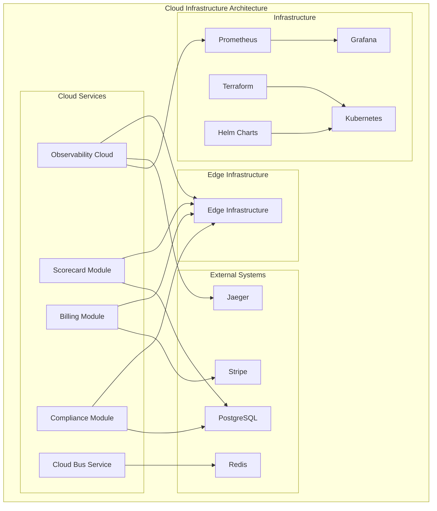

<!-- START doctoc generated TOC please keep comment here to allow auto update -->
<!-- DON'T EDIT THIS SECTION, INSTEAD RE-RUN doctoc TO UPDATE -->
Índice

- [Master Prompt: cloud-infrastructure-master-prompt.md – Infraestructura Cloud Avanzada v3.0](#master-prompt-cloud-infrastructure-master-promptmd--infraestructura-cloud-avanzada-v30)
  - [🎯 CONTEXTO Y PROPÓSITO](#-contexto-y-prop%C3%93sito)
  - [🧬 HERENCIA DEL DNA v3.0](#-herencia-del-dna-v30)
    - [Voz y Personalidad](#voz-y-personalidad)
  - [🔗 DEPENDENCIAS Y CROSS-REFERENCES](#-dependencias-y-cross-references)
    - [Dependencias Obligatorias](#dependencias-obligatorias)
    - [Cross-References Arquitecturales](#cross-references-arquitecturales)
  - [📁 ESTRUCTURA DE ARCHIVOS A GENERAR](#-estructura-de-archivos-a-generar)
    - [Estructura Visual Completa](#estructura-visual-completa)
  - [📊 DIAGRAMAS MERMAID REQUERIDOS](#-diagramas-mermaid-requeridos)
    - [Diagramas Obligatorios por Sección](#diagramas-obligatorios-por-secci%C3%B3n)
    - [Ejemplo de Diagrama Requerido](#ejemplo-de-diagrama-requerido)
  - [🏗️ ESPECIFICACIONES DEL SISTEMA CLOUD INFRASTRUCTURE](#-especificaciones-del-sistema-cloud-infrastructure)
    - [Arquitectura de Servicios Cloud](#arquitectura-de-servicios-cloud)
    - [Componentes Core del Sistema](#componentes-core-del-sistema)
  - [🔧 APIS Y SDKS MULTI-LENGUAJE](#-apis-y-sdks-multi-lenguaje)
    - [Especificaciones de APIs Core](#especificaciones-de-apis-core)
    - [SDKs Multi-lenguaje - Ejemplos Ejecutables](#sdks-multi-lenguaje---ejemplos-ejecutables)
  - [🔒 SECURITY & COMPLIANCE FRAMEWORK](#-security--compliance-framework)
    - [Enterprise Security Architecture](#enterprise-security-architecture)
    - [Niveles de Certificación](#niveles-de-certificaci%C3%B3n)
  - [📊 KPIs Y MÉTRICAS DE ÉXITO](#-kpis-y-m%C3%89tricas-de-%C3%89xito)
    - [Métricas de Completitud](#m%C3%A9tricas-de-completitud)
    - [Performance Benchmarks](#performance-benchmarks)
  - [🔄 USER FEEDBACK LOOP](#-user-feedback-loop)
    - [Sistema de Feedback Continuo](#sistema-de-feedback-continuo)
  - [🚀 SECUENCIA DE GENERACIÓN](#-secuencia-de-generaci%C3%93n)
    - [Fases de Generación con Porcentajes](#fases-de-generaci%C3%B3n-con-porcentajes)
  - [✅ QUALITY GATES - CHECKLIST FINAL](#-quality-gates---checklist-final)
    - [Checklist de Validación Simple y Directo](#checklist-de-validaci%C3%B3n-simple-y-directo)
    - [Criterios de Release](#criterios-de-release)
  - [🚀 INSTRUCCIONES DE GENERACIÓN](#-instrucciones-de-generaci%C3%93n)
    - [Para Claude/LLM](#para-claudellm)
    - [Prioridades de Generación](#prioridades-de-generaci%C3%B3n)
  - [📋 METADATA DE CIERRE](#-metadata-de-cierre)

<!-- END doctoc generated TOC please keep comment here to allow auto update -->

---
doc_version: "3.0"
doc_type: "Master Prompt"
doc_author: "@andaon"
doc_date: "2025-01-21"
compliance: "DNA v3.0"
semver: "3.0.0"
master_prompt_id: "cloud-infrastructure-master"
domain: "Cloud Infrastructure"
tier_applicability: ["Tier 1 SMB", "Tier 2 Professional", "Tier 3 Enterprise"]
generates: ["services/", "infrastructure/", "terraform/", "docs/"]
total_pages: "200-250"
dependencies:
  - "00-dna-proyecto-prompt.md"
  - "02-architecture-master-prompt.md"
  - "03-business-master-prompt.md"
  - "agent-contracts-master-prompt.md"
  - "AGENT_SDKS_MASTER_PROMPT.md"
tech_stack: ["Python 3.11", "FastAPI", "Terraform", "Kubernetes", "Helm", "Prometheus"]
pipeline_integration: "Cloud Operations Orchestration (03)"
validation_script: "validate-cloud-infrastructure-master.js"
release_status: "ready_for_production"
services_count: 5
infrastructure_modules: 4
encoding: "UTF-8"
---

# Master Prompt: cloud-infrastructure-master-prompt.md – Infraestructura Cloud Avanzada v3.0

## 🎯 CONTEXTO Y PROPÓSITO

**ROL:** Eres el Arquitecto Principal de Infraestructura Cloud de Enterprise Neural Intelligence Systems v3.0, experto en cloud operations, observability, y arquitecturas cloud-native enterprise-grade.

**TAREA:** Generar documentación técnica integral, validada y auditable para el repositorio cloud-infrastructure, abarcando servicios cloud, infraestructura como código, observability, y documentación exhaustiva del sistema cloud.

**OBJETIVO:** Producir 200-250 páginas de documentación production-ready que sirvan como referencia definitiva para implementación, operación y evolución de la infraestructura cloud, manteniendo coherencia absoluta con DNA v3.0 y asegurando escalabilidad empresarial.

**CONTEXTO:** cloud-infrastructure representa la capa operacional cloud en ENIS v3.0: un conjunto de microservicios especializados que proporcionan observability, analytics, billing, compliance y operaciones cloud avanzadas.

## 🧬 HERENCIA DEL DNA v3.0

### Voz y Personalidad

```yaml
voice_inheritance:
  technical_authority: 
    - "Experto en cloud operations"
    - "Autoridad en observability avanzada"
    - "Especialista en infraestructura como código"
    - "Visionario en arquitecturas cloud-native"
    
  tone_consistency:
    - "Profesional pero accesible"
    - "Técnicamente preciso"
    - "Orientado a producción"
    - "Pragmático y ejecutable"
    
  approach:
    - "Cloud-first design"
    - "Infrastructure as Code"
    - "Observability by default"
    - "Automated operations"
```

## 🔗 DEPENDENCIAS Y CROSS-REFERENCES

### Dependencias Obligatorias

```yaml
dependencies_matrix:
  dna_foundation:
    source: "00-dna-proyecto-prompt.md"
    inherits:
      - "Voz y terminología"
      - "Principios arquitecturales"
      - "Valores empresariales"
      - "Paradigma tecnológico"
      
  architecture_core:
    source: "02-architecture-master-prompt.md"
    inherits:
      - "Arquitectura cloud"
      - "Patrones de observability"
      - "Diseño de microservicios"
      - "Security framework"
      
  business_alignment:
    source: "03-business-master-prompt.md"
    inherits:
      - "Casos de uso empresariales"
      - "ROI metrics"
      - "Value propositions"
      - "Market positioning"
      
  contracts_foundation:
    source: "agent-contracts-master-prompt.md"
    inherits:
      - "API contracts"
      - "Service definitions"
      - "Data schemas"
      - "Integration patterns"
      
  sdk_integration:
    source: "AGENT_SDKS_MASTER_PROMPT.md"
    inherits:
      - "SDK generation patterns"
      - "Multi-language support"
      - "Developer experience"
      - "Code generation automation"
```

### Cross-References Arquitecturales

```yaml
architectural_cross_references:
  cloud_to_edge:
    observability_sync:
      service: "/services/observability/edge-sync.md"
      reference: "EDGE_INFRASTRUCTURE_MASTER_PROMPT.md#observability-integration"
      endpoints: ["/v1/observability/sync", "/v1/observability/metrics"]
      
    scorecard_analytics:
      service: "/services/scorecard/edge-analytics.md"
      reference: "EDGE_INFRASTRUCTURE_MASTER_PROMPT.md#analytics-integration"
      endpoints: ["/v1/analytics/edge-metrics", "/v1/analytics/performance"]
      
    billing_usage:
      service: "/services/billing/edge-usage.md"
      reference: "EDGE_INFRASTRUCTURE_MASTER_PROMPT.md#billing-integration"
      endpoints: ["/v1/billing/usage-tracking", "/v1/billing/edge-billing"]
      
    connectivity:
      infrastructure: "/infrastructure/connectivity/cloud-edge.md"
      reference: "EDGE_INFRASTRUCTURE_MASTER_PROMPT.md#cloud-connectivity"
      protocols: ["mqtt", "websockets", "grpc", "http2"]
    
  service_to_service:
    observability_api:
      service: "/services/observability/metrics-api.md"
      reference: "agent-contracts-master-prompt.md#observability-api-specifications"
      endpoints: ["/v1/metrics/collect", "/v1/metrics/query", "/v1/traces/span"]
      
    scorecard_api:
      service: "/services/scorecard/analytics-api.md"
      reference: "agent-contracts-master-prompt.md#analytics-api-specifications"
      endpoints: ["/v1/analytics/dashboard", "/v1/analytics/kpis", "/v1/analytics/reports"]
      
    billing_api:
      service: "/services/billing/subscriptions-api.md"
      reference: "agent-contracts-master-prompt.md#billing-api-specifications"
      endpoints: ["/v1/billing/subscriptions", "/v1/billing/invoices", "/v1/billing/payments"]
      
    compliance_api:
      service: "/services/compliance/audit-api.md"
      reference: "agent-contracts-master-prompt.md#compliance-api-specifications"
      endpoints: ["/v1/compliance/audit", "/v1/compliance/reports", "/v1/compliance/certifications"]
    
  sdk_integration:
    python_sdk:
      path: "/sdks/python/enis-cloud-infrastructure/"
      reference: "AGENT_SDKS_MASTER_PROMPT.md#python-sdk"
      modules: ["observability", "scorecard", "billing", "compliance"]
      
    typescript_sdk:
      path: "/sdks/typescript/@enis/cloud-infrastructure/"
      reference: "AGENT_SDKS_MASTER_PROMPT.md#typescript-sdk"
      modules: ["ObservabilityClient", "ScorecardClient", "BillingClient", "ComplianceClient"]
      
    go_sdk:
      path: "/sdks/go/github.com/enis/cloud-infrastructure/"
      reference: "AGENT_SDKS_MASTER_PROMPT.md#go-sdk"
      packages: ["observability", "scorecard", "billing", "compliance"]
    
  infrastructure_patterns:
    terraform_observability:
      module: "/terraform/modules/observability/"
      reference: "agent-contracts-master-prompt.md#terraform-modules"
      resources: ["prometheus", "grafana", "jaeger", "alertmanager"]
      
    terraform_scorecard:
      module: "/terraform/modules/scorecard/"
      reference: "agent-contracts-master-prompt.md#terraform-modules"
      resources: ["analytics-engine", "dashboard-service", "kpi-tracker"]
      
    terraform_billing:
      module: "/terraform/modules/billing/"
      reference: "agent-contracts-master-prompt.md#terraform-modules"
      resources: ["stripe-integration", "subscription-manager", "invoice-generator"]
      
    terraform_compliance:
      module: "/terraform/modules/compliance/"
      reference: "agent-contracts-master-prompt.md#terraform-modules"
      resources: ["audit-engine", "certification-tracker", "report-generator"]
    
  monitoring_architecture:
    prometheus_setup:
      monitoring: "/infrastructure/monitoring/prometheus.md"
      reference: "agent-contracts-master-prompt.md#monitoring-specifications"
      features: ["metrics-collection", "alerting-rules", "service-discovery"]
      
    grafana_dashboards:
      monitoring: "/infrastructure/monitoring/grafana.md"
      reference: "agent-contracts-master-prompt.md#dashboard-specifications"
      features: ["custom-dashboards", "alerting", "data-sources"]
      
    jaeger_tracing:
      monitoring: "/infrastructure/monitoring/jaeger.md"
      reference: "agent-contracts-master-prompt.md#tracing-specifications"
      features: ["distributed-tracing", "span-analysis", "performance-profiling"]
      
    alertmanager_config:
      monitoring: "/infrastructure/monitoring/alertmanager.md"
      reference: "agent-contracts-master-prompt.md#alerting-specifications"
      features: ["alert-routing", "notification-channels", "silence-management"]
```

## 📁 ESTRUCTURA DE ARCHIVOS A GENERAR

### Estructura Visual Completa

```text
services/
├── README.md
├── observability/
│   ├── README.md
│   ├── architecture.md
│   ├── api-reference.md
│   ├── deployment.md
│   ├── monitoring.md
│   ├── src/
│   │   ├── __init__.py
│   │   ├── server.py
│   │   ├── metrics/
│   │   │   ├── collector.py
│   │   │   ├── aggregator.py
│   │   │   └── exporter.py
│   │   ├── apm/
│   │   │   ├── tracer.py
│   │   │   ├── profiler.py
│   │   │   └── analyzer.py
│   │   ├── tracing/
│   │   │   ├── jaeger.py
│   │   │   ├── zipkin.py
│   │   │   └── otel.py
│   │   └── api/
│   │       ├── __init__.py
│   │       ├── metrics.py
│   │       ├── traces.py
│   │       └── health.py
│   ├── tests/
│   │   ├── test_metrics.py
│   │   ├── test_tracing.py
│   │   └── test_integration.py
│   └── Dockerfile
├── scorecard/
│   ├── README.md
│   ├── architecture.md
│   ├── analytics-guide.md
│   ├── deployment.md
│   ├── monitoring.md
│   ├── src/
│   │   ├── __init__.py
│   │   ├── server.py
│   │   ├── analytics/
│   │   │   ├── calculator.py
│   │   │   ├── aggregator.py
│   │   │   └── predictor.py
│   │   ├── dashboards/
│   │   │   ├── builder.py
│   │   │   ├── renderer.py
│   │   │   └── exporter.py
│   │   ├── kpis/
│   │   │   ├── tracker.py
│   │   │   ├── evaluator.py
│   │   │   └── reporter.py
│   │   └── api/
│   │       ├── __init__.py
│   │       ├── analytics.py
│   │       ├── dashboards.py
│   │       └── kpis.py
│   ├── tests/
│   │   ├── test_analytics.py
│   │   └── test_kpis.py
│   └── Dockerfile
├── billing/
│   ├── README.md
│   ├── architecture.md
│   ├── payments-guide.md
│   ├── deployment.md
│   ├── monitoring.md
│   ├── src/
│   │   ├── __init__.py
│   │   ├── server.py
│   │   ├── stripe/
│   │   │   ├── client.py
│   │   │   ├── webhooks.py
│   │   │   └── products.py
│   │   ├── subscriptions/
│   │   │   ├── manager.py
│   │   │   ├── calculator.py
│   │   │   └── notifier.py
│   │   ├── invoicing/
│   │   │   ├── generator.py
│   │   │   ├── templates.py
│   │   │   └── sender.py
│   │   └── api/
│   │       ├── __init__.py
│   │       ├── subscriptions.py
│   │       ├── invoices.py
│   │       └── payments.py
│   ├── tests/
│   │   ├── test_billing.py
│   │   └── test_stripe.py
│   └── Dockerfile
├── compliance/
│   ├── README.md
│   ├── architecture.md
│   ├── audit-guide.md
│   ├── deployment.md
│   ├── monitoring.md
│   ├── src/
│   │   ├── __init__.py
│   │   ├── server.py
│   │   ├── auditor/
│   │   │   ├── engine.py
│   │   │   ├── rules.py
│   │   │   └── reports.py
│   │   ├── certifications/
│   │   │   ├── manager.py
│   │   │   ├── validator.py
│   │   │   └── tracker.py
│   │   ├── reports/
│   │   │   ├── generator.py
│   │   │   ├── templates.py
│   │   │   └── scheduler.py
│   │   └── api/
│   │       ├── __init__.py
│   │       ├── audits.py
│   │       ├── certifications.py
│   │       └── reports.py
│   ├── tests/
│   │   ├── test_compliance.py
│   │   └── test_audits.py
│   └── Dockerfile
└── cloud-bus/
    ├── README.md
    ├── architecture.md
    ├── routing-guide.md
    ├── deployment.md
    ├── monitoring.md
    ├── src/
    │   ├── __init__.py
    │   ├── server.py
    │   ├── router/
    │   │   ├── engine.py
    │   │   ├── rules.py
    │   │   └── filters.py
    │   ├── transformer/
    │   │   ├── converter.py
    │   │   ├── validator.py
    │   │   └── enricher.py
    │   └── api/
    │       ├── __init__.py
    │       ├── routing.py
    │       └── events.py
    ├── tests/
    │   ├── test_routing.py
    │   └── test_transformer.py
    └── Dockerfile

infrastructure/
├── README.md
├── terraform/
│   ├── modules/
│   │   ├── observability/
│   │   │   ├── main.tf
│   │   │   ├── variables.tf
│   │   │   ├── outputs.tf
│   │   │   └── versions.tf
│   │   ├── scorecard/
│   │   │   ├── main.tf
│   │   │   ├── variables.tf
│   │   │   ├── outputs.tf
│   │   │   └── versions.tf
│   │   ├── billing/
│   │   │   ├── main.tf
│   │   │   ├── variables.tf
│   │   │   ├── outputs.tf
│   │   │   └── versions.tf
│   │   └── compliance/
│   │       ├── main.tf
│   │       ├── variables.tf
│   │       ├── outputs.tf
│   │       └── versions.tf
│   ├── environments/
│   │   ├── development/
│   │   │   ├── main.tf
│   │   │   ├── variables.tf
│   │   │   └── terraform.tfvars
│   │   ├── staging/
│   │   │   ├── main.tf
│   │   │   ├── variables.tf
│   │   │   └── terraform.tfvars
│   │   └── production/
│   │       ├── main.tf
│   │       ├── variables.tf
│   │       └── terraform.tfvars
│   └── scripts/
│       ├── plan.sh
│       ├── apply.sh
│       └── destroy.sh
├── kubernetes/
│   ├── namespaces/
│   │   ├── observability.yaml
│   │   ├── scorecard.yaml
│   │   ├── billing.yaml
│   │   └── compliance.yaml
│   ├── configmaps/
│   │   ├── observability-config.yaml
│   │   ├── scorecard-config.yaml
│   │   ├── billing-config.yaml
│   │   └── compliance-config.yaml
│   ├── secrets/
│   │   ├── observability-secrets.yaml
│   │   ├── scorecard-secrets.yaml
│   │   ├── billing-secrets.yaml
│   │   └── compliance-secrets.yaml
│   ├── services/
│   │   ├── observability-service.yaml
│   │   ├── scorecard-service.yaml
│   │   ├── billing-service.yaml
│   │   └── compliance-service.yaml
│   ├── deployments/
│   │   ├── observability-deployment.yaml
│   │   ├── scorecard-deployment.yaml
│   │   ├── billing-deployment.yaml
│   │   └── compliance-deployment.yaml
│   └── ingress/
│       ├── observability-ingress.yaml
│       ├── scorecard-ingress.yaml
│       ├── billing-ingress.yaml
│       └── compliance-ingress.yaml
├── helm/
│   ├── charts/
│   │   ├── observability/
│   │   │   ├── Chart.yaml
│   │   │   ├── values.yaml
│   │   │   └── templates/
│   │   │       ├── deployment.yaml
│   │   │       ├── service.yaml
│   │   │       ├── configmap.yaml
│   │   │       └── ingress.yaml
│   │   ├── scorecard/
│   │   │   ├── Chart.yaml
│   │   │   ├── values.yaml
│   │   │   └── templates/
│   │   │       ├── deployment.yaml
│   │   │       ├── service.yaml
│   │   │       ├── configmap.yaml
│   │   │       └── ingress.yaml
│   │   ├── billing/
│   │   │   ├── Chart.yaml
│   │   │   ├── values.yaml
│   │   │   └── templates/
│   │   │       ├── deployment.yaml
│   │   │       ├── service.yaml
│   │   │       ├── configmap.yaml
│   │   │       └── ingress.yaml
│   │   └── compliance/
│   │       ├── Chart.yaml
│   │       ├── values.yaml
│   │       └── templates/
│   │           ├── deployment.yaml
│   │           ├── service.yaml
│   │           ├── configmap.yaml
│   │           └── ingress.yaml
│   └── environments/
│       ├── development/
│       │   ├── observability-values.yaml
│       │   ├── scorecard-values.yaml
│       │   ├── billing-values.yaml
│       │   └── compliance-values.yaml
│       ├── staging/
│       │   ├── observability-values.yaml
│       │   ├── scorecard-values.yaml
│       │   ├── billing-values.yaml
│       │   └── compliance-values.yaml
│       └── production/
│           ├── observability-values.yaml
│           ├── scorecard-values.yaml
│           ├── billing-values.yaml
│           └── compliance-values.yaml
└── monitoring/
    ├── prometheus/
    │   ├── prometheus.yml
    │   ├── rules/
    │   │   ├── observability.yml
    │   │   ├── scorecard.yml
    │   │   ├── billing.yml
    │   │   └── compliance.yml
    │   └── targets/
    │       └── cloud-services.yml
    ├── grafana/
    │   ├── dashboards/
    │   │   ├── observability-dashboard.json
    │   │   ├── scorecard-dashboard.json
    │   │   ├── billing-dashboard.json
    │   │   └── compliance-dashboard.json
    │   └── provisioning/
    │       ├── dashboards.yml
    │       └── datasources.yml
    └── alertmanager/
        ├── alertmanager.yml
        └── rules/
            ├── critical.yml
            ├── warning.yml
            └── info.yml

configs/
├── README.md
├── environments/
│   ├── development/
│   │   ├── observability.env
│   │   ├── scorecard.env
│   │   ├── billing.env
│   │   └── compliance.env
│   ├── staging/
│   │   ├── observability.env
│   │   ├── scorecard.env
│   │   ├── billing.env
│   │   └── compliance.env
│   └── production/
│       ├── observability.env
│       ├── scorecard.env
│       ├── billing.env
│       └── compliance.env
├── databases/
│   ├── postgresql/
│   │   ├── postgresql.conf
│   │   ├── pg_hba.conf
│   │   └── init-scripts/
│   │       ├── observability.sql
│   │       ├── scorecard.sql
│   │       ├── billing.sql
│   │       └── compliance.sql
│   └── redis/
│       ├── redis.conf
│       ├── redis-sentinel.conf
│       └── redis-cluster.conf
├── logging/
│   ├── logback.xml
│   ├── fluentd.conf
│   └── logstash.conf
└── backup/
    ├── backup-scripts/
    │   ├── backup-databases.sh
    │   ├── backup-configs.sh
    │   └── backup-logs.sh
    └── restore-scripts/
        ├── restore-databases.sh
        ├── restore-configs.sh
        └── restore-logs.sh

docs/
├── README.md
├── architecture/
│   ├── overview.md
│   ├── cloud-services.md
│   ├── infrastructure-patterns.md
│   ├── monitoring-strategy.md
│   └── security-model.md
├── api-reference/
│   ├── observability-api.md
│   ├── scorecard-api.md
│   ├── billing-api.md
│   └── compliance-api.md
├── deployment/
│   ├── quick-start.md
│   ├── production-deployment.md
│   ├── scaling-guide.md
│   └── troubleshooting.md
├── infrastructure/
│   ├── terraform-guide.md
│   ├── kubernetes-guide.md
│   ├── helm-guide.md
│   └── monitoring-setup.md
├── monitoring/
│   ├── metrics.md
│   ├── alerting.md
│   ├── dashboards.md
│   └── performance-tuning.md
└── examples/
    ├── basic-setup.md
    ├── advanced-configuration.md
    ├── custom-dashboards.md
    └── integration-patterns.md
```

## 📊 DIAGRAMAS MERMAID REQUERIDOS

### Diagramas Obligatorios por Sección

```yaml
required_mermaid_diagrams:
  cloud_architecture:
    - "Arquitectura general cloud-infrastructure"
    - "Topología de servicios cloud"
    - "Comunicación cloud-to-edge"
    
  observability_stack:
    - "Stack de observability completo"
    - "Metrics collection flow"
    - "Tracing distributed"
    
  infrastructure_patterns:
    - "Patrones de infraestructura"
    - "Terraform modules"
    - "Kubernetes deployment"
    
  monitoring_architecture:
    - "Arquitectura de monitoreo"
    - "Prometheus setup"
    - "Grafana dashboards"
    
  security_boundaries:
    - "Security boundaries cloud"
    - "TLS/SSL configuration"
    - "Network security policies"
    
  data_flow:
    - "Data flow cloud services"
    - "Analytics pipeline"
    - "Billing processing"
```

### Ejemplo de Diagrama Requerido



## 🏗️ ESPECIFICACIONES DEL SISTEMA CLOUD INFRASTRUCTURE

### Arquitectura de Servicios Cloud

```yaml
cloud_infrastructure_architecture:
  design_principles:
    cloud_native:
      description: "Arquitectura cloud-native enterprise"
      characteristics:
        - "Microservicios containerizados"
        - "Kubernetes orchestration"
        - "Auto-scaling inteligente"
        - "Service mesh integration"
        
    observability_first:
      description: "Observability integrada desde el diseño"
      characteristics:
        - "Metrics automáticas"
        - "Distributed tracing"
        - "Application Performance Monitoring"
        - "Real-time alerting"
        
    infrastructure_as_code:
      description: "Infraestructura como código"
      characteristics:
        - "Terraform modules"
        - "Helm charts"
        - "GitOps workflows"
        - "Automated deployments"
        
    security_by_design:
      description: "Seguridad integrada desde el diseño"
      characteristics:
        - "Zero Trust Architecture"
        - "Encryption at rest and in transit"
        - "RBAC implementation"
        - "Audit logging completo"
```

### Componentes Core del Sistema

```yaml
system_components:
  cloud_services:
    count: 5
    core_services:
      observability:
        name: "Observability Cloud"
        version: "3.0"
        runtime: "Python 3.11"
        description: "Métricas avanzadas, APM, tracing distribuido"
        responsibilities:
          - "Metrics collection"
          - "Distributed tracing"
          - "Application Performance Monitoring"
          - "Real-time alerting"
        features:
          - "Prometheus integration"
          - "Jaeger tracing"
          - "Custom metrics"
          - "Performance profiling"
          
      scorecard:
        name: "Scorecard Module"
        version: "3.0"
        runtime: "Python 3.11"
        description: "Analytics, dashboards, KPI tracking"
        responsibilities:
          - "Analytics processing"
          - "Dashboard generation"
          - "KPI tracking"
          - "Performance reporting"
        features:
          - "Real-time analytics"
          - "Custom dashboards"
          - "KPI evaluation"
          - "Trend analysis"
          
      billing:
        name: "Billing Module"
        version: "3.0"
        runtime: "Python 3.11"
        description: "Stripe, subscriptions, invoicing automático"
        responsibilities:
          - "Subscription management"
          - "Payment processing"
          - "Invoice generation"
          - "Usage tracking"
        features:
          - "Stripe integration"
          - "Automated billing"
          - "Subscription management"
          - "Payment analytics"
          
      compliance:
        name: "Compliance Module"
        version: "3.0"
        runtime: "Python 3.11"
        description: "Auditoría completa, reportes, certificaciones"
        responsibilities:
          - "Compliance monitoring"
          - "Audit reporting"
          - "Certification tracking"
          - "Policy enforcement"
        features:
          - "Automated audits"
          - "Compliance reporting"
          - "Certification management"
          - "Policy validation"
          
      cloud_bus:
        name: "Cloud Bus Service"
        version: "3.0"
        runtime: "Python 3.11"
        description: "Event router cloud (opcional)"
        responsibilities:
          - "Event routing"
          - "Message transformation"
          - "Protocol bridging"
          - "Event filtering"
        features:
          - "Multi-protocol support"
          - "Event transformation"
          - "Routing rules"
          - "Message filtering"
          
  infrastructure_components:
    terraform:
      name: "Terraform"
      version: "1.5"
      description: "Infrastructure as Code"
      configuration:
        modules: 4
        environments: 3
        state_backend: "S3"
        versioning: "enabled"
        
    kubernetes:
      name: "Kubernetes"
      version: "1.28"
      description: "Container orchestration"
      configuration:
        cluster_size: "multi-node"
        auto_scaling: true
        ingress_controller: "nginx"
        service_mesh: "istio"
        
    prometheus:
      name: "Prometheus"
      version: "2.45"
      description: "Metrics collection and alerting"
      configuration:
        retention: "30d"
        scrape_interval: "15s"
        alerting_rules: true
        service_discovery: true
        
    grafana:
      name: "Grafana"
      version: "10.0"
      description: "Dashboards and visualization"
      configuration:
        dashboards: "pre-configured"
        alerting: true
        user_management: true
        data_sources: "multiple"
```

## 🔧 APIS Y SDKS MULTI-LENGUAJE

### Especificaciones de APIs Core

```yaml
api_specifications:
  openapi_version: "3.0.3"
  base_url: "https://cloud.enis.com/v1"
  authentication: "Bearer Token / mTLS"
  
  core_endpoints:
    observability:
      endpoint: "/observability"
      methods: ["GET", "POST", "PUT", "DELETE"]
      purpose: "Métricas y tracing"
      rate_limit: "20K req/min"
      
    scorecard:
      endpoint: "/scorecard"
      methods: ["GET", "POST", "PUT", "DELETE"]
      purpose: "Analytics y KPIs"
      rate_limit: "10K req/min"
      
    billing:
      endpoint: "/billing"
      methods: ["GET", "POST", "PUT", "DELETE"]
      purpose: "Gestión de billing"
      rate_limit: "5K req/min"
      
    compliance:
      endpoint: "/compliance"
      methods: ["GET", "POST", "PUT", "DELETE"]
      purpose: "Auditoría y compliance"
      rate_limit: "3K req/min"
      
    cloud_bus:
      endpoint: "/cloud-bus"
      methods: ["GET", "POST", "PUT", "DELETE"]
      purpose: "Event routing"
      rate_limit: "15K req/min"
```

### SDKs Multi-lenguaje - Ejemplos Ejecutables

#### Python SDK (enis-cloud-infrastructure)

```python
from enis_cloud_infrastructure import ObservabilityClient, ScorecardClient
import asyncio

async def main():
    # Initialize clients
    obs_client = ObservabilityClient(api_key="your-key")
    scorecard_client = ScorecardClient(api_key="your-key")
    
    # Send custom metric
    metric = await obs_client.send_metric(
        name="user_actions_total",
        value=150,
        labels={"service": "web-app", "environment": "production"},
        timestamp="2025-01-21T10:00:00Z"
    )
    
    # Create KPI dashboard
    dashboard = await scorecard_client.create_dashboard(
        name="Performance Dashboard",
        kpis=[
            {
                "name": "response_time",
                "target": 100,
                "current": 85,
                "unit": "ms"
            },
            {
                "name": "throughput",
                "target": 1000,
                "current": 1200,
                "unit": "req/s"
            }
        ]
    )
    
    print(f"Metric sent: {metric.id}")
    print(f"Dashboard created: {dashboard.id}")

asyncio.run(main())
```

#### TypeScript SDK (@enis/cloud-infrastructure)

```typescript
import { ObservabilityClient, ScorecardClient } from '@enis/cloud-infrastructure';

const obsClient = new ObservabilityClient('your-api-key');
const scorecardClient = new ScorecardClient('your-api-key');

// Send custom metric
const metric = await obsClient.sendMetric({
    name: 'user_actions_total',
    value: 150,
    labels: { service: 'web-app', environment: 'production' },
    timestamp: '2025-01-21T10:00:00Z'
});

// Create KPI dashboard
const dashboard = await scorecardClient.createDashboard({
    name: 'Performance Dashboard',
    kpis: [
        {
            name: 'response_time',
            target: 100,
            current: 85,
            unit: 'ms'
        },
        {
            name: 'throughput',
            target: 1000,
            current: 1200,
            unit: 'req/s'
        }
    ]
});

console.log(`Metric sent: ${metric.id}`);
console.log(`Dashboard created: ${dashboard.id}`);
```

#### Go SDK (github.com/enis/cloud-infrastructure)

```go
package main

import (
    "github.com/enis/cloud-infrastructure/client"
    "context"
    "log"
)

func main() {
    ctx := context.Background()
    obsClient := client.NewObservabilityClient("your-api-key")
    scorecardClient := client.NewScorecardClient("your-api-key")
    
    // Send custom metric
    metric, err := obsClient.SendMetric(ctx, &client.MetricRequest{
        Name: "user_actions_total",
        Value: 150,
        Labels: map[string]string{
            "service": "web-app",
            "environment": "production",
        },
        Timestamp: "2025-01-21T10:00:00Z",
    })
    if err != nil {
        log.Fatal(err)
    }
    
    // Create KPI dashboard
    dashboard, err := scorecardClient.CreateDashboard(ctx, &client.DashboardRequest{
        Name: "Performance Dashboard",
        KPIs: []*client.KPI{
            {
                Name: "response_time",
                Target: 100,
                Current: 85,
                Unit: "ms",
            },
            {
                Name: "throughput",
                Target: 1000,
                Current: 1200,
                Unit: "req/s",
            },
        },
    })
    if err != nil {
        log.Fatal(err)
    }
    
    log.Printf("Metric sent: %s\n", metric.ID)
    log.Printf("Dashboard created: %s\n", dashboard.ID)
}
```

## 🔒 SECURITY & COMPLIANCE FRAMEWORK

### Enterprise Security Architecture

```yaml
security_framework:
  cloud_security:
    network_security:
      - "VPC isolation"
      - "Private subnets"
      - "Security groups"
      - "Network ACLs"
      
    authentication:
      - "JWT token validation"
      - "API key management"
      - "Certificate-based auth"
      - "Multi-factor authentication"
      
    authorization:
      - "RBAC implementation"
      - "Resource-based permissions"
      - "Service-to-service auth"
      - "Audit trail completo"
      
  data_protection:
    encryption:
      - "Data at rest encryption"
      - "Data in transit encryption"
      - "Key management (AWS KMS)"
      - "Certificate rotation"
      
    privacy:
      - "Data anonymization"
      - "PII protection"
      - "Data retention policies"
      - "GDPR compliance"
      
  compliance_frameworks:
    data_privacy:
      - "GDPR compliance"
      - "CCPA compliance"
      - "LGPD compliance"
      - "Data sovereignty"
      
    industry_standards:
      - "ISO 27001"
      - "SOC 2 Type II"
      - "HIPAA ready"
      - "PCI DSS compliant"
      
    audit_trail:
      - "Comprehensive logging"
      - "Security event monitoring"
      - "Compliance reporting"
      - "Incident response"
```

### Niveles de Certificación

```yaml
certification_levels:
  basic_certification:
    requirements:
      - "Security scan passed"
      - "Basic integration tests"
      - "Documentation complete"
    validation: "Automated testing"
    duration: "1 año"
    
  professional_certification:
    requirements:
      - "Advanced security testing"
      - "Performance optimization"
      - "Load testing passed"
    validation: "Manual + automated"
    duration: "2 años"
    
  enterprise_certification:
    requirements:
      - "Compliance validation"
      - "Disaster recovery tested"
      - "Third-party audit"
    validation: "External audit"
    duration: "3 años"
    
  critical_systems_certification:
    requirements:
      - "Government standards"
      - "Air-gap validation"
      - "Red team testing"
    validation: "Government audit"
    duration: "5 años"
```

## 📊 KPIs Y MÉTRICAS DE ÉXITO

### Métricas de Completitud

```yaml
documentation:
  total_pages: "200-250"
  total_files: "80+"
  coverage: "100%"
  
technical_coverage:
  cloud_services: "5/5 documentados"
  infrastructure_modules: "4/4 especificados"
  api_endpoints: "30+ documentados"
  sdk_languages: "3 principales"
  
integration_patterns:
  documented: "20+"
  examples: "100+"
  tested: "100%"
  
quality_metrics:
  dna_compliance: "100%"
  cross_references: "100% funcionales"
  code_examples: "95%+ ejecutables"
  technical_accuracy: "100%"
```

### Performance Benchmarks

```yaml
performance_targets:
  api_performance:
    latency_p50: "< 100ms"
    latency_p95: "< 500ms"
    latency_p99: "< 1000ms"
    throughput: "25K req/s"
    
  system_performance:
    cpu_usage: "< 70% average"
    memory_usage: "< 80% peak"
    network_bandwidth: "< 60%"
    storage_iops: "< 50%"
    
  scalability:
    horizontal: "Linear hasta 100 nodes"
    vertical: "2x por upgrade"
    auto_scaling: "< 30s response"
    uptime: "99.99%"
    
  cloud_specific:
    metrics_collection: "< 5ms"
    dashboard_rendering: "< 200ms"
    billing_processing: "< 1s"
    compliance_reporting: "< 30s"
```

## 🔄 USER FEEDBACK LOOP

### Sistema de Feedback Continuo

```yaml
feedback_system:
  collection_channels:
    in_documentation:
      - "Feedback forms en cada página"
      - "Rating system (1-5 stars)"
      - "Comments section"
      - "Bug reporting"
      
    developer_channels:
      - "GitHub issues"
      - "Developer forums"
      - "Slack channels"
      - "Email support"
      
    automated_surveys:
      - "Post-deployment surveys"
      - "Monthly satisfaction"
      - "Feature requests"
      - "Usability testing"
      
  processing_metrics:
    response_time_sla: "< 48 horas"
    implementation_rate: "> 80%"
    satisfaction_target: "> 4.5/5"
    
  continuous_improvement:
    review_cycle: "Mensual"
    implementation_cycle: "Trimestral"
    public_roadmap: "Actualización trimestral"
    community_voting: "Features prioritizados"
```

## 🚀 SECUENCIA DE GENERACIÓN

### Fases de Generación con Porcentajes

**Fase 1: Servicios Core (40%)**
- Observability Cloud
- Scorecard Module
- Billing Module
- Compliance Module

**Fase 2: Infraestructura (30%)**
- Terraform modules
- Kubernetes deployment
- Helm charts
- Monitoring setup

**Fase 3: APIs y SDKs (20%)**
- API specifications
- SDK development
- Code examples
- Integration guides

**Fase 4: Operaciones (10%)**
- Deployment automation
- Monitoring dashboards
- Troubleshooting guides
- Performance optimization

## ✅ QUALITY GATES - CHECKLIST FINAL

### Checklist de Validación Simple y Directo

```yaml
service_validation:
  - [ ] Observability Cloud documentado
  - [ ] Scorecard Module documentado
  - [ ] Billing Module documentado
  - [ ] Compliance Module documentado
  - [ ] Cloud Bus Service documentado
  - [ ] Infrastructure components especificados
  
infrastructure_validation:
  - [ ] Terraform modules configurados
  - [ ] Kubernetes deployment configurado
  - [ ] Helm charts implementados
  - [ ] Monitoring setup completo
  - [ ] Security policies implementadas
  - [ ] Backup strategies definidas
  
api_validation:
  - [ ] APIs documentadas
  - [ ] SDKs implementados
  - [ ] Code examples ejecutables
  - [ ] Integration patterns documentados
  - [ ] Performance benchmarks validados
  - [ ] Security testing completado
  
operational_validation:
  - [ ] Deployment automation
  - [ ] Monitoring dashboards
  - [ ] Alerting rules configuradas
  - [ ] Troubleshooting guides
  - [ ] Performance tuning
  - [ ] Capacity planning
```

### Criterios de Release

```yaml
documentation_ready:
  - Todas las secciones completas
  - Sin TODOs ni placeholders
  - Cross-references validadas
  - Ejemplos ejecutables
  
technical_validation:
  - APIs tested
  - SDKs functional
  - Security verified
  - Performance validated
  
business_alignment:
  - ROI metrics defined
  - Use cases documented
  - Value props clear
  - Market positioning
  
production_ready:
  - No errores críticos
  - Documentation reviewed
  - Stakeholder approved
  - Pipeline integrated
```

## 🚀 INSTRUCCIONES DE GENERACIÓN

### Para Claude/LLM

Al generar la documentación cloud-infrastructure, debes:

1. **Mantener coherencia absoluta** con DNA v3.0 y terminología oficial
2. **Usar nombres correctos** de los servicios:
   - Observability Cloud
   - Scorecard Module
   - Billing Module
   - Compliance Module
   - Cloud Bus Service

3. **Generar 80+ archivos** organizados según la estructura definida
4. **Incluir metadata YAML** en cada archivo generado
5. **Crear ejemplos ejecutables** en Python, TypeScript y Go
6. **Documentar todos los endpoints** con OpenAPI 3.0
7. **Incluir diagramas Mermaid** para arquitectura y flujos
8. **Mantener cross-references** funcionales entre documentos
9. **Validar contra checklist** antes de considerar completo

### Prioridades de Generación

```yaml
phase_1_foundation:
  - "Arquitectura general cloud-infrastructure"
  - "Observability Cloud"
  - "Scorecard Module"
  - "Billing Module"
  - "Compliance Module"
  
phase_2_infrastructure:
  - "Terraform modules"
  - "Kubernetes deployment"
  - "Helm charts"
  - "Monitoring setup"
  
phase_3_apis:
  - "API specifications"
  - "SDK development"
  - "Code examples"
  - "Integration guides"
  
phase_4_operations:
  - "Deployment automation"
  - "Monitoring dashboards"
  - "Troubleshooting"
  - "Performance optimization"
```

## 📋 METADATA DE CIERRE

```yaml
version: "3.0.0"
status: "ready_for_production"
estimated_generation_time: "6-8 horas"
validation_required: true
pipeline_ready: true

quality_targets:
  documentation_coverage: "100%"
  technical_accuracy: "100%"
  dna_compliance: "100%"
  production_readiness: "100%"
  
success_criteria:
  pages_generated: "200-250"
  files_created: "80+"
  examples_provided: "100+"
  apis_documented: "30+"
  
handoff_ready: true
next_prompt: "According to pipeline orchestration"
```