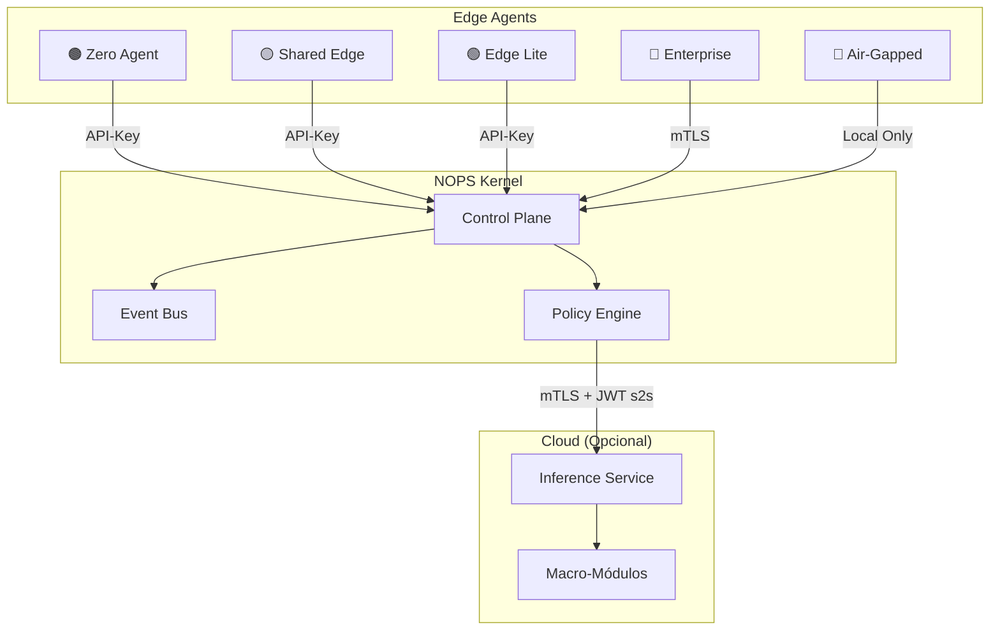

<!-- START doctoc generated TOC please keep comment here to allow auto update -->
<!-- DON'T EDIT THIS SECTION, INSTEAD RE-RUN doctoc TO UPDATE -->
Índice

- [🟤🟡🟢🔵🔴 EDGE AGENTS - ESPECIFICACIÓN DE DISEÑO](#-edge-agents---especificaci%C3%93n-de-dise%C3%91o)
  - [📋 **BASADO EN ARQUITECTURA ENIS v3.0**](#-basado-en-arquitectura-enis-v30)
    - [**Fuente:** `docs/03-architecture-decisions/arquitecturaenisv2.html`](#fuente-docs03-architecture-decisionsarquitecturaenisv2html)
  - [🎯 **PRINCIPIOS DE DISEÑO SEGÚN ARQUITECTURA**](#-principios-de-dise%C3%91o-seg%C3%9An-arquitectura)
    - [**1. ARQUITECTURA EDGE-FIRST**](#1-arquitectura-edge-first)
    - [**2. SEGURIDAD POR TIPO**](#2-seguridad-por-tipo)
  - [🟤 **ZERO AGENT - DISEÑO**](#-zero-agent---dise%C3%91o)
    - [**Características según arquitectura:**](#caracter%C3%ADsticas-seg%C3%BAn-arquitectura)
    - [**Implementación recomendada:**](#implementaci%C3%B3n-recomendada)
    - [**Casos de uso:**](#casos-de-uso)
  - [🟡 **SHARED EDGE - DISEÑO**](#-shared-edge---dise%C3%91o)
    - [**Características según arquitectura:**](#caracter%C3%ADsticas-seg%C3%BAn-arquitectura-1)
    - [**Implementación recomendada:**](#implementaci%C3%B3n-recomendada-1)
    - [**Casos de uso:**](#casos-de-uso-1)
  - [🟢 **EDGE LITE - DISEÑO**](#-edge-lite---dise%C3%91o)
    - [**Características según arquitectura:**](#caracter%C3%ADsticas-seg%C3%BAn-arquitectura-2)
    - [**Implementación recomendada:**](#implementaci%C3%B3n-recomendada-2)
    - [**Casos de uso:**](#casos-de-uso-2)
  - [🔵 **ENTERPRISE CLUSTER - DISEÑO**](#-enterprise-cluster---dise%C3%91o)
    - [**Características según arquitectura:**](#caracter%C3%ADsticas-seg%C3%BAn-arquitectura-3)
    - [**Implementación recomendada:**](#implementaci%C3%B3n-recomendada-3)
    - [**Casos de uso:**](#casos-de-uso-3)
  - [🔴 **AIR-GAPPED - DISEÑO**](#-air-gapped---dise%C3%91o)
    - [**Características según arquitectura:**](#caracter%C3%ADsticas-seg%C3%BAn-arquitectura-4)
    - [**Implementación recomendada:**](#implementaci%C3%B3n-recomendada-4)
    - [**Casos de uso:**](#casos-de-uso-4)
  - [🔗 **COMUNICACIÓN CON NOPS KERNEL**](#-comunicaci%C3%93n-con-nops-kernel)
    - [**Según la arquitectura, todos los Edge Agents se comunican con:**](#seg%C3%BAn-la-arquitectura-todos-los-edge-agents-se-comunican-con)
    - [**Flujo de comunicación:**](#flujo-de-comunicaci%C3%B3n)
  - [📊 **POLÍTICA DE EGRESS DE DATOS**](#-pol%C3%8Dtica-de-egress-de-datos)
    - [**Según la arquitectura:**](#seg%C3%BAn-la-arquitectura)
    - [**Implementación por tipo:**](#implementaci%C3%B3n-por-tipo)
  - [🏗️ **ESTRUCTURA DE IMPLEMENTACIÓN RECOMENDADA**](#-estructura-de-implementaci%C3%93n-recomendada)
    - [**Organización de archivos:**](#organizaci%C3%B3n-de-archivos)
    - [**Factory Pattern:**](#factory-pattern)
  - [🧪 **TESTING POR TIPO**](#-testing-por-tipo)
    - [**Estrategia de testing:**](#estrategia-de-testing)
  - [📋 **CHECKLIST DE IMPLEMENTACIÓN**](#-checklist-de-implementaci%C3%93n)
    - [**Para cada tipo de Edge Agent:**](#para-cada-tipo-de-edge-agent)
  - [🎯 **PRÓXIMOS PASOS**](#-pr%C3%93ximos-pasos)

<!-- END doctoc generated TOC please keep comment here to allow auto update -->

# 🟤🟡🟢🔵🔴 EDGE AGENTS - ESPECIFICACIÓN DE DISEÑO

## 📋 **BASADO EN ARQUITECTURA ENIS v3.0**

### **Fuente:** `docs/03-architecture-decisions/arquitecturaenisv2.html`

---

## 🎯 **PRINCIPIOS DE DISEÑO SEGÚN ARQUITECTURA**

### **1. ARQUITECTURA EDGE-FIRST**
- **Ubicación**: Todos los Edge Agents viven en el **cliente/edge**
- **Comunicación**: Se conectan al **NOPS Kernel** (Control Plane)
- **Data Sovereignty**: Los datos crudos **NO salen del cliente**
- **Seguridad**: Cada tipo tiene su nivel de seguridad específico

### **2. SEGURIDAD POR TIPO**
```yaml
🟤 Zero Agent: API-Key
🟡 Shared Edge: API-Key
🟢 Edge Lite: API-Key
🔵 Enterprise: mTLS
🔴 Air-Gapped: Local Only (Zero Egress)
```

---

## 🟤 **ZERO AGENT - DISEÑO**

### **Características según arquitectura:**
```yaml
deployment: "Webhooks"
seguridad: "API-Key"
ubicacion: "Edge/Cliente"
comunicacion: "API-Key → NOPS Kernel"
egress: "Permitido con restricciones"
```

### **Implementación recomendada:**
```python
class ZeroAgent:
    """🟤 Zero Agent - 100% cloud, sin infraestructura local"""

    def __init__(self):
        self.agent_type = "zero"
        self.security = "api_key"
        self.deployment = "webhooks"
        self.egress_policy = "allow_with_restrictions"

    async def register_with_kernel(self, kernel_endpoint: str):
        """Registro con NOPS Kernel usando API-Key"""
        headers = {
            "Authorization": f"Bearer {self.api_key}",
            "X-Agent-Type": "zero"
        }

    async def send_to_inference(self, data: dict):
        """Envío directo a Inference Service (opcional)"""
        # Solo metadata minimizada, nunca datos crudos
        minimized_data = self.minimize_data(data)

    def minimize_data(self, raw_data: dict) -> dict:
        """Minimizar datos según policy de egress"""
        # Implementar según data_egress_policy
        pass
```

### **Casos de uso:**
- Startups y SMBs
- Desarrollo rápido
- Setup instantáneo
- Mantenimiento cero

---

## 🟡 **SHARED EDGE - DISEÑO**

### **Características según arquitectura:**
```yaml
deployment: "Multi-tenant"
seguridad: "API-Key"
ubicacion: "Edge/Cliente"
comunicacion: "API-Key → NOPS Kernel"
egress: "Permitido con restricciones"
```

### **Implementación recomendada:**
```python
class SharedEdgeAgent:
    """🟡 Shared Edge - Multi-tenant, recursos compartidos"""

    def __init__(self, tenant_id: str):
        self.agent_type = "shared"
        self.security = "api_key"
        self.deployment = "multi_tenant"
        self.tenant_id = tenant_id
        self.egress_policy = "allow_with_restrictions"

    async def register_with_kernel(self, kernel_endpoint: str):
        """Registro multi-tenant con NOPS Kernel"""
        headers = {
            "Authorization": f"Bearer {self.api_key}",
            "X-Agent-Type": "shared",
            "X-Tenant-ID": self.tenant_id
        }

    async def handle_multi_tenant_isolation(self):
        """Aislamiento de tenant en recursos compartidos"""
        # Implementar aislamiento de recursos
        pass
```

### **Casos de uso:**
- Empresas medianas
- Costos optimizados
- Eficiencia de recursos
- Escalabilidad automática

---

## 🟢 **EDGE LITE - DISEÑO**

### **Características según arquitectura:**
```yaml
deployment: "Docker"
seguridad: "API-Key"
ubicacion: "Edge/Cliente"
comunicacion: "API-Key → NOPS Kernel"
egress: "Permitido con restricciones"
```

### **Implementación recomendada:**
```python
class EdgeLiteAgent:
    """🟢 Edge Lite - Container dedicado, recursos propios"""

    def __init__(self):
        self.agent_type = "lite"
        self.security = "api_key"
        self.deployment = "docker"
        self.egress_policy = "allow_with_restrictions"

    async def register_with_kernel(self, kernel_endpoint: str):
        """Registro con NOPS Kernel desde container Docker"""
        headers = {
            "Authorization": f"Bearer {self.api_key}",
            "X-Agent-Type": "lite",
            "X-Container-ID": self.container_id
        }

    def setup_docker_environment(self):
        """Configuración del entorno Docker"""
        # Implementar configuración de container
        pass
```

### **Casos de uso:**
- Empresas con requerimientos específicos
- Aislamiento de recursos
- Control total
- Performance predecible

---

## 🔵 **ENTERPRISE CLUSTER - DISEÑO**

### **Características según arquitectura:**
```yaml
deployment: "Kubernetes"
seguridad: "mTLS"
ubicacion: "Edge/Cliente"
comunicacion: "mTLS → NOPS Kernel"
egress: "Permitido con restricciones"
```

### **Implementación recomendada:**
```python
class EnterpriseClusterAgent:
    """🔵 Enterprise Cluster - High Availability, múltiples nodos"""

    def __init__(self, cluster_config: dict):
        self.agent_type = "enterprise"
        self.security = "mtls"
        self.deployment = "kubernetes"
        self.cluster_config = cluster_config
        self.egress_policy = "allow_with_restrictions"

    async def register_with_kernel(self, kernel_endpoint: str):
        """Registro con NOPS Kernel usando mTLS"""
        # Configurar certificados mTLS
        ssl_context = self.setup_mtls_context()

        headers = {
            "X-Agent-Type": "enterprise",
            "X-Cluster-ID": self.cluster_id
        }

    def setup_mtls_context(self):
        """Configuración de mTLS para comunicación segura"""
        # Implementar configuración de certificados
        pass

    def setup_high_availability(self):
        """Configuración de alta disponibilidad"""
        # Implementar HA en Kubernetes
        pass
```

### **Casos de uso:**
- Grandes empresas
- Misiones críticas
- Alta disponibilidad
- Escalabilidad horizontal

---

## 🔴 **AIR-GAPPED - DISEÑO**

### **Características según arquitectura:**
```yaml
deployment: "Zero Egress"
seguridad: "Local Only"
ubicacion: "Edge/Cliente (Aislado)"
comunicacion: "Solo local → NOPS Kernel"
egress: "FORBIDDEN"
```

### **Implementación recomendada:**
```python
class AirGappedAgent:
    """🔴 Air-Gapped - Completamente aislado, sin internet"""

    def __init__(self):
        self.agent_type = "airgapped"
        self.security = "local_only"
        self.deployment = "zero_egress"
        self.egress_policy = "forbidden"

    async def register_with_kernel(self, kernel_endpoint: str):
        """Registro local con NOPS Kernel (sin egress)"""
        # Verificar que el kernel está en la misma red local
        if not self.is_local_network(kernel_endpoint):
            raise SecurityError("Air-gapped agent cannot connect to external networks")

        headers = {
            "X-Agent-Type": "airgapped",
            "X-Security-Level": "maximum"
        }

    def enforce_zero_egress(self):
        """Aplicar política de zero egress"""
        # Bloquear todas las conexiones externas
        pass

    def setup_local_inference(self):
        """Configurar inferencia local (sin cloud)"""
        # Implementar inferencia local o cache
        pass
```

### **Casos de uso:**
- Gobiernos
- Militares
- Datos ultra-sensibles
- Cumplimiento regulatorio estricto

---

## 🔗 **COMUNICACIÓN CON NOPS KERNEL**

### **Según la arquitectura, todos los Edge Agents se comunican con:**

1. **NOPS Kernel** (Control Plane)
2. **Event Bus** (Redis Streams)
3. **Policy Engine** (para decisiones de egress)

### **Flujo de comunicación:**


---

## 📊 **POLÍTICA DE EGRESS DE DATOS**

### **Según la arquitectura:**
```yaml
data_egress_policy:
  raw_data: "forbidden"
  derived_signals: "allow_if_policy"
  requires:
    - pii_redaction: true
    - minimization: true
    - tenant_scoped: true
    - mTLS: true
    - s2s_scopes: ["inference.execute", "marketplace.sync"]
  rate_limits:
    per_tenant: "enforced"
    per_agent: "enforced"
  audit_log: "mandatory"
```

### **Implementación por tipo:**
```python
class DataEgressPolicy:
    """Política de egress de datos según arquitectura ENIS"""

    def can_egress_data(self, agent_type: str, data_type: str) -> bool:
        if agent_type == "airgapped":
            return False  # Zero egress

        if data_type == "raw_data":
            return False  # Siempre prohibido

        if data_type == "derived_signals":
            return self.check_policy_compliance()

        return False

    def minimize_data(self, data: dict) -> dict:
        """Minimizar datos según policy"""
        # Implementar minimización
        pass

    def apply_pii_redaction(self, data: dict) -> dict:
        """Aplicar redacción de PII"""
        # Implementar redacción de PII
        pass
```

---

## 🏗️ **ESTRUCTURA DE IMPLEMENTACIÓN RECOMENDADA**

### **Organización de archivos:**
```
src/edge_agents/
├── __init__.py
├── base/
│   ├── __init__.py
│   ├── agent_base.py          # Clase base para todos los agents
│   ├── security.py            # Manejo de seguridad por tipo
│   └── data_policy.py         # Política de egress de datos
├── zero_agent/
│   ├── __init__.py
│   ├── agent.py               # Implementación Zero Agent
│   └── webhook_handler.py     # Manejo de webhooks
├── shared_edge/
│   ├── __init__.py
│   ├── agent.py               # Implementación Shared Edge
│   └── tenant_manager.py      # Gestión multi-tenant
├── edge_lite/
│   ├── __init__.py
│   ├── agent.py               # Implementación Edge Lite
│   └── docker_manager.py      # Gestión de Docker
├── enterprise_cluster/
│   ├── __init__.py
│   ├── agent.py               # Implementación Enterprise
│   ├── k8s_manager.py         # Gestión de Kubernetes
│   └── mtls_handler.py        # Manejo de mTLS
├── airgapped/
│   ├── __init__.py
│   ├── agent.py               # Implementación Air-Gapped
│   └── isolation_manager.py   # Gestión de aislamiento
└── registry/
    ├── __init__.py
    ├── agent_factory.py       # Factory para crear agents
    └── type_validator.py      # Validación de tipos
```

### **Factory Pattern:**
```python
class EdgeAgentFactory:
    """Factory para crear Edge Agents según tipo"""

    @staticmethod
    def create_agent(agent_type: str, config: dict) -> BaseAgent:
        agents = {
            "zero": ZeroAgent,
            "shared": SharedEdgeAgent,
            "lite": EdgeLiteAgent,
            "enterprise": EnterpriseClusterAgent,
            "airgapped": AirGappedAgent
        }

        if agent_type not in agents:
            raise ValueError(f"Invalid agent type: {agent_type}")

        return agents[agent_type](config)
```

---

## 🧪 **TESTING POR TIPO**

### **Estrategia de testing:**
```python
class TestEdgeAgents:
    """Testing específico por tipo de Edge Agent"""

    async def test_zero_agent_webhook_security(self):
        """Test seguridad de webhooks en Zero Agent"""
        pass

    async def test_shared_edge_tenant_isolation(self):
        """Test aislamiento de tenants en Shared Edge"""
        pass

    async def test_edge_lite_docker_isolation(self):
        """Test aislamiento de Docker en Edge Lite"""
        pass

    async def test_enterprise_cluster_mtls(self):
        """Test mTLS en Enterprise Cluster"""
        pass

    async def test_airgapped_zero_egress(self):
        """Test zero egress en Air-Gapped"""
        pass

    async def test_data_egress_policy_compliance(self):
        """Test cumplimiento de política de egress"""
        pass
```

---

## 📋 **CHECKLIST DE IMPLEMENTACIÓN**

### **Para cada tipo de Edge Agent:**

- [ ] **Clase base implementada** con funcionalidad común
- [ ] **Seguridad específica** según tipo (API-Key/mTLS)
- [ ] **Comunicación con NOPS Kernel** implementada
- [ ] **Política de egress** aplicada correctamente
- [ ] **Validación de tipo** en AgentTypeValidator
- [ ] **Testing específico** por tipo
- [ ] **Documentación** de deployment por tipo
- [ ] **Monitoreo** y observabilidad
- [ ] **Configuración** específica por tipo
- [ ] **Manejo de errores** y resiliencia

---

## 🎯 **PRÓXIMOS PASOS**

1. **Implementar clases base** para Edge Agents
2. **Crear factory pattern** para instanciación
3. **Implementar política de egress** de datos
4. **Desarrollar testing** específico por tipo
5. **Crear documentación** de deployment
6. **Integrar con NOPS Kernel** existente

---

*Especificación basada en arquitectura ENIS v3.0 - Septiembre 2025*
