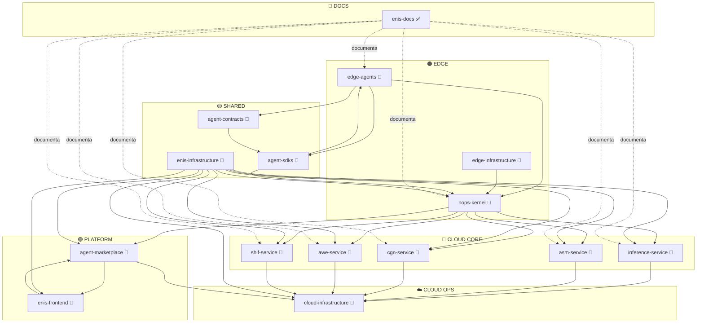

<!-- START doctoc generated TOC please keep comment here to allow auto update -->
<!-- DON'T EDIT THIS SECTION, INSTEAD RE-RUN doctoc TO UPDATE -->
Índice

- [🏗️ ESTRUCTURA RECOMENDADA DE REPOSITORIOS ENIS v3.0](#-estructura-recomendada-de-repositorios-enis-v30)
  - [📋 **ARQUITECTURA DE 15 REPOSITORIOS**](#-arquitectura-de-15-repositorios)
    - [**Organización por Grupos Funcionales**](#organizaci%C3%B3n-por-grupos-funcionales)
  - [📦 **DETALLE POR REPOSITORIO**](#-detalle-por-repositorio)
    - [**🟤 EDGE (3 repos)**](#-edge-3-repos)
    - [**🔵 CLOUD CORE (5 repos)**](#-cloud-core-5-repos)
    - [**☁️ CLOUD OPS (1 repo)**](#-cloud-ops-1-repo)
    - [**🟢 PLATFORM (2 repos)**](#-platform-2-repos)
    - [**🟡 SHARED (3 repos)**](#-shared-3-repos)
    - [**📑 DOCS (1 repo)**](#-docs-1-repo)
  - [📊 **MATRIZ DE DEPENDENCIAS**](#-matriz-de-dependencias)
  - [🚀 **ORDEN DE IMPLEMENTACIÓN RECOMENDADO**](#-orden-de-implementaci%C3%93n-recomendado)
    - [**Fase 0: Completar Base (Semana 1-2)** 🟤 EDGE](#fase-0-completar-base-semana-1-2--edge)
    - [**Fase 1: Fundamentos (Semana 3-4)** 🟡 SHARED](#fase-1-fundamentos-semana-3-4--shared)
    - [**Fase 2: Edge (Semana 5-10)** 🟤 EDGE](#fase-2-edge-semana-5-10--edge)
    - [**Fase 3: Cloud Core (Semana 11-22)** 🔵 CLOUD CORE](#fase-3-cloud-core-semana-11-22--cloud-core)
    - [**Fase 4: Cloud Ops (Semana 21-24)** ☁️ CLOUD OPS](#fase-4-cloud-ops-semana-21-24--cloud-ops)
    - [**Fase 5: Platform (Semana 25-32)** 🟢 PLATFORM](#fase-5-platform-semana-25-32--platform)
  - [📋 **RESUMEN**](#-resumen)

<!-- END doctoc generated TOC please keep comment here to allow auto update -->

# 🏗️ ESTRUCTURA RECOMENDADA DE REPOSITORIOS ENIS v3.0

## 📋 **ARQUITECTURA DE 15 REPOSITORIOS**

### **Organización por Grupos Funcionales**

```
enis-organization/
├── 🟤 edge/                          # Edge/Cliente (On-Premises) - 3 repos
│   ├── nops-kernel/                 # Control plane local 🚧
│   ├── edge-agents/                 # Implementaciones de agentes 🔨
│   └── edge-infrastructure/         # Conectores y servicios edge 🔨
│
├── 🔵 cloud-core/                   # Servicios core ENIS Platform - 5 repos
│   ├── inference-service/           # Motor de inferencia IA 🔨
│   ├── asm-service/                 # Adaptive State Manager 🔨
│   ├── cgn-service/                 # Cognitive Graph Network 🔨
│   ├── awe-service/                 # Autonomous Workflow Engine 🔨
│   └── shif-service/                # System Hybrid Integration 🔨
│
├── ☁️ cloud-ops/                    # Cloud Operations - 1 repo
│   └── cloud-infrastructure/        # Infra y servicios cloud avanzados 🔨
│
├── 🟢 platform/                     # Marketplace y Frontend - 2 repos
│   ├── agent-marketplace/           # Marketplace + Private Registry 🔨
│   └── enis-frontend/               # Monorepo UI 🔨
│
├── 🟡 shared/                       # Repositorios comunes - 3 repos
│   ├── agent-contracts/             # Contratos y esquemas 🔨
│   ├── agent-sdks/                  # SDKs multi-lenguaje 🔨
│   └── enis-infrastructure/         # IaC y CI/CD 🔨
│
└── 📑 docs/                         # Documentación - 1 repo
    └── enis-docs/                   # Documentación general ✅
```

---

## 📦 **DETALLE POR REPOSITORIO**

### **🟤 EDGE (3 repos)**

#### **1. nops-kernel** 🚧 **EN DESARROLLO (~80% COMPLETO)**

```yaml
repositorio: "nops-kernel"
ubicacion: "edge/nops-kernel"
tipo: "Control Plane Edge"
tecnologia: "Python 3.11+, FastAPI, Redis, PostgreSQL"
estado: "🚧 En desarrollo - Core funcional, pendiente tests y deployment"
progreso: "~80%"
pendiente: "Tests finales, documentación completa, deployment production-ready"
```

**Estructura Actual:**
```
nops-kernel/
├── src/
│   ├── core/
│   │   ├── kernel.py              # ✅ Kernel principal
│   │   ├── policy/                # ✅ Policy Engine (ABAC)
│   │   │   ├── __init__.py
│   │   │   └── engine.py
│   │   ├── audit/                 # ✅ Compliance básico
│   │   │   ├── chain.py
│   │   │   └── models.py
│   │   ├── registry/              # ✅ Registro de agentes
│   │   ├── security/              # ✅ Auth, RBAC, JWT, mTLS
│   │   │   ├── rbac.py
│   │   │   ├── jwt.py
│   │   │   └── auth.py
│   │   └── federation.py          # ✅ Comunicación con cloud
│   ├── api/v1/                    # ✅ APIs REST completas
│   ├── events/                    # ✅ Event Bus (Redis Streams)
│   │   └── redis_streams.py
│   └── integrations/              # ✅ 17 clientes cloud
│       ├── inference_client.py
│       ├── asm_client.py
│       ├── cgn_client.py
│       ├── awe_client.py
│       ├── shif_client.py
│       ├── observability_client.py
│       ├── scorecard_client.py
│       ├── billing_client.py
│       ├── sandbox_client.py
│       ├── compliance_client.py
│       ├── marketplace_client.py
│       ├── private_registry_client.py
│       ├── devportal_client.py
│       └── policy_engine_client.py
├── tests/                         # ✅ Tests completos
├── docs/                          # ✅ Documentación
└── deployment/                    # ✅ Docker, K8s, Helm
```

**Responsabilidades:**
- ✅ Orquestación local de agentes
- ✅ Policy Engine (ABAC, egress control, airgapped mode)
- ✅ Compliance básico (audit logging, RBAC)
- ✅ Event Bus (Redis Streams con DLQ/Idempotency)
- ✅ Federation con cloud
- ✅ Seguridad (JWT, mTLS, API Keys, RBAC)
- ✅ Clientes para todos los servicios cloud

---

#### **2. edge-agents** 🔨 **PENDIENTE**

```yaml
repositorio: "edge-agents"
ubicacion: "edge/edge-agents"
tipo: "Agent Implementations"
tecnologia: "Python 3.11+, gRPC, Protocol Buffers"
estado: "🔨 Solo definidos, no implementados"
```

**Estructura Propuesta:**
```
edge-agents/
├── src/
│   ├── common/                    # Código compartido
│   │   ├── auth/                 # Autenticación común
│   │   ├── tracing/              # Tracing común
│   │   ├── policy/               # Data policy común
│   │   └── base_agent.py         # Clase base
│   ├── zero/                     # 🟤 Zero Agent
│   │   ├── agent.py
│   │   ├── config.py
│   │   └── deployment/
│   ├── shared/                   # 🟡 Shared Edge Agent
│   │   ├── agent.py
│   │   ├── config.py
│   │   └── deployment/
│   ├── lite/                     # 🟢 Edge Lite Agent
│   │   ├── agent.py
│   │   ├── config.py
│   │   └── deployment/
│   ├── enterprise/               # 🔵 Enterprise Cluster Agent
│   │   ├── agent.py
│   │   ├── config.py
│   │   └── deployment/
│   └── airgapped/                # 🔴 Air-Gapped Agent
│       ├── agent.py
│       ├── config.py
│       └── deployment/
├── tests/
├── docs/
│   ├── ZERO_AGENT_GUIDE.md
│   ├── SHARED_AGENT_GUIDE.md
│   ├── LITE_AGENT_GUIDE.md
│   ├── ENTERPRISE_AGENT_GUIDE.md
│   └── AIRGAPPED_AGENT_GUIDE.md
└── deployment/
    ├── docker/                   # Dockerfiles por tipo
    ├── kubernetes/               # Manifests K8s por tipo
    └── helm/                     # Charts Helm por tipo
```

**Responsabilidades:**
- 🔨 Implementar los 5 tipos de agentes
- 🔨 Código común compartido (auth, tracing, data policy)
- 🔨 Deployment automático por tipo
- 🔨 Integración con agent-contracts
- 🔨 Comunicación con nops-kernel

**Matriz Comparativa de Agentes:**

| Característica | Zero 🟤 | Shared 🟡 | Lite 🟢 | Enterprise 🔵 | Air-Gapped 🔴 |
|----------------|---------|-----------|---------|---------------|---------------|
| **Deployment** | Nada | Edge Shared | Edge Lite | On-Prem | Air-Gapped |
| **Compute** | Cloud | Shared Edge | Lite Edge | Full Cluster | Isolated |
| **Storage** | Cloud | Shared | Local | Distributed | Local Only |
| **Network** | Internet | Intranet | Local | Private | None |
| **Latencia** | Alta | Media | Baja | Muy Baja | Mínima |
| **Costo** | $0 | $19/mes | $99/mes | $999/mes | Personalizado |

---

#### **3. edge-infrastructure** 🔨 **PENDIENTE**

```yaml
repositorio: "edge-infrastructure"
ubicacion: "edge/edge-infrastructure"
tipo: "Edge Infrastructure Services"
tecnologia: "Python 3.11+, FastAPI, Redis, gRPC"
estado: "🔨 Parcialmente en kernel, necesita separación"
```

**Estructura Propuesta:**
```
edge-infrastructure/
├── src/
│   ├── eventbus/                 # Event Bus Service
│   │   ├── redis_streams.py
│   │   ├── dlq.py
│   │   └── idempotency.py
│   ├── datasources/              # Data Sources Connector
│   │   ├── erp/
│   │   ├── crm/
│   │   ├── iot/
│   │   └── custom/
│   ├── marketplace/              # Marketplace Connector
│   │   ├── connector.py
│   │   └── cache.py
│   ├── policy/                   # Policy Engine (opcional)
│   │   └── engine.py
│   └── eventbridge/              # Event Bridge (opcional)
│       └── bridge.py
├── tests/
├── docs/
└── deployment/
```

**Responsabilidades:**
- 🔨 Event Bus como servicio (Redis Streams)
- 🔨 Conectores de datasources (ERP/CRM/IoT)
- 🔨 Marketplace Connector
- 🔨 Policy Engine (si se extrae del kernel)
- 🔨 Event Bridge (opcional, solo si escala lo requiere)

**Nota:** Algunos componentes ya están implementados en nops-kernel y pueden extraerse si se requiere modularización adicional.

---

### **🔵 CLOUD CORE (5 repos)**

#### **4. inference-service** 🔨 **PENDIENTE**

```yaml
repositorio: "inference-service"
ubicacion: "cloud-core/inference-service"
tipo: "AI Inference Engine"
tecnologia: "Python 3.11+, FastAPI, PyTorch, TensorFlow"
estado: "🔨 Solo cliente en kernel"
```

**Estructura Propuesta:**
```
inference-service/
├── src/
│   ├── api/
│   │   └── v1/
│   │       ├── inference/        # Endpoints de inferencia
│   │       ├── models/           # Gestión de modelos
│   │       └── sandbox/          # Sandbox controlado
│   ├── core/
│   │   ├── engine/               # Motor de inferencia
│   │   │   ├── batch.py
│   │   │   ├── realtime.py
│   │   │   └── streaming.py
│   │   ├── models/               # Carga de modelos
│   │   └── sandbox/              # Sandbox para pruebas
│   ├── integrations/
│   │   ├── openai/
│   │   ├── anthropic/
│   │   └── local_models/
│   └── workers/                  # Workers para batch
├── models/                       # Modelos ML
├── tests/
├── docs/
└── deployment/
```

**Responsabilidades:**
- 🔨 Motor de inferencia IA (batch, realtime, streaming)
- 🔨 Sandbox para pruebas controladas
- 🔨 Integración con LLMs (OpenAI, Anthropic, local)
- 🔨 APIs de inferencia
- 🔨 Gestión de modelos

---

#### **5. asm-service** 🔨 **PENDIENTE**

```yaml
repositorio: "asm-service"
ubicacion: "cloud-core/asm-service"
tipo: "Adaptive State Management"
tecnologia: "Python 3.11+, FastAPI, Redis, PostgreSQL"
estado: "🔨 Solo cliente en kernel"
```

**Estructura Propuesta:**
```
asm-service/
├── src/
│   ├── api/v1/
│   ├── core/
│   │   ├── state/                # Gestión de estado
│   │   ├── sync/                 # Sincronización
│   │   ├── conflict/             # Conflict resolution
│   │   └── features/             # Feature views
│   ├── storage/
│   │   ├── redis/
│   │   └── postgres/
│   └── replication/              # Replicación distribuida
├── tests/
├── docs/
└── deployment/
```

**Responsabilidades:**
- 🔨 Adaptive State Management
- 🔨 Estado distribuido y sincronización
- 🔨 Conflict resolution
- 🔨 Feature views

---

#### **6. cgn-service** 🔨 **PENDIENTE**

```yaml
repositorio: "cgn-service"
ubicacion: "cloud-core/cgn-service"
tipo: "Cognitive Graph Network"
tecnologia: "Python 3.11+, FastAPI, Neo4j, GraphQL"
estado: "🔨 Solo cliente en kernel"
```

**Estructura Propuesta:**
```
cgn-service/
├── src/
│   ├── api/
│   │   ├── rest/                 # REST API
│   │   └── graphql/              # GraphQL API
│   ├── core/
│   │   ├── graph/                # Grafo de conocimiento
│   │   ├── reasoning/            # Motor de razonamiento
│   │   └── inference/            # Inferencia causal
│   ├── storage/
│   │   └── neo4j/
│   └── ml/                       # ML sobre grafos
├── tests/
├── docs/
└── deployment/
```

**Responsabilidades:**
- 🔨 Causal Graph Networks
- 🔨 Grafo de conocimiento
- 🔨 Reasoning engine
- 🔨 GraphQL API

---

#### **7. awe-service** 🔨 **PENDIENTE**

```yaml
repositorio: "awe-service"
ubicacion: "cloud-core/awe-service"
tipo: "Autonomous Workflow Engine"
tecnologia: "Python 3.11+, FastAPI, Celery, Redis"
estado: "🔨 Solo cliente en kernel"
```

**Estructura Propuesta:**
```
awe-service/
├── src/
│   ├── api/v1/
│   ├── core/
│   │   ├── workflows/            # Orquestación
│   │   ├── tasks/                # Gestión de tareas
│   │   ├── retries/              # Lógica de retries
│   │   ├── compensation/         # Compensaciones
│   │   └── coordination/         # Coordinación de servicios
│   ├── workers/                  # Celery workers
│   └── scheduler/                # Scheduler de workflows
├── tests/
├── docs/
└── deployment/
```

**Responsabilidades:**
- 🔨 Autonomous Workflow Engine
- 🔨 Orquestación de workflows
- 🔨 Retries y compensaciones
- 🔨 Coordinación de servicios

---

#### **8. shif-service** 🔨 **PENDIENTE**

```yaml
repositorio: "shif-service"
ubicacion: "cloud-core/shif-service"
tipo: "System Hybrid Integration Fabric"
tecnologia: "Python 3.11+, FastAPI, Apache Camel"
estado: "🔨 Solo cliente en kernel"
```

**Estructura Propuesta:**
```
shif-service/
├── src/
│   ├── api/v1/
│   ├── connectors/               # Conectores
│   │   ├── saas/                # SaaS (Salesforce, HubSpot, etc.)
│   │   ├── databases/           # Bases de datos
│   │   ├── apis/                # APIs REST/GraphQL
│   │   └── custom/              # Conectores custom
│   ├── transformers/             # Transformaciones
│   │   ├── mapping.py
│   │   └── normalization.py
│   └── adapters/                 # Adapters de integración
├── tests/
├── docs/
└── deployment/
```

**Responsabilidades:**
- 🔨 System Hybrid Integration Fabric
- 🔨 Conectores/adapters SaaS/DB
- 🔨 Transformaciones de datos
- 🔨 Normalización

---

### **☁️ CLOUD OPS (1 repo)**

#### **9. cloud-infrastructure** 🔨 **PENDIENTE**

```yaml
repositorio: "cloud-infrastructure"
ubicacion: "cloud-ops/cloud-infrastructure"
tipo: "Cloud Operations & Infrastructure"
tecnologia: "Python 3.11+, FastAPI, Terraform, K8s"
estado: "🔨 Clientes en kernel, servicios faltantes"
```

**Estructura Propuesta:**
```
cloud-infrastructure/
├── src/
│   ├── observability/            # Observability Cloud
│   │   ├── metrics/
│   │   ├── apm/
│   │   └── tracing/
│   ├── scorecard/                # Scorecard Module
│   │   ├── analytics/
│   │   └── dashboards/
│   ├── billing/                  # Billing Module
│   │   ├── stripe/
│   │   ├── subscriptions/
│   │   └── invoicing/
│   ├── compliance/               # Compliance Avanzado
│   │   ├── audit/
│   │   ├── reports/
│   │   └── certifications/
│   └── cloudbus/                 # Cloud Bus (opcional)
│       └── event_router.py
├── terraform/                    # IaC
├── kubernetes/                   # Manifests K8s
├── tests/
├── docs/
└── deployment/
```

**Responsabilidades:**
- 🔨 Observability cloud (métricas avanzadas, APM)
- 🔨 Scorecard module (analytics, dashboards)
- 🔨 Billing module (Stripe, subscriptions)
- 🔨 Compliance module avanzado (auditoría completa)
- 🔨 Cloud Bus (opcional, solo si escala lo requiere)

**Módulos incluidos:**
1. **observability-cloud** - Métricas, APM, tracing avanzado
2. **scorecard-module** - Analytics y dashboards
3. **billing-module** - Stripe, subscriptions, invoicing
4. **compliance-module** - Auditoría completa, reportes, certificaciones
5. **cloudbus-service** (opcional) - Event router cloud

---

### **🟢 PLATFORM (2 repos)**

#### **10. agent-marketplace** 🔨 **PENDIENTE**

```yaml
repositorio: "agent-marketplace"
ubicacion: "platform/agent-marketplace"
tipo: "Agent Marketplace & Registry"
tecnologia: "Python 3.11+, FastAPI, PostgreSQL, Stripe"
estado: "🔨 Solo clientes en kernel"
```

**Estructura Propuesta:**
```
agent-marketplace/
├── src/
│   ├── api/v1/
│   │   ├── catalog/              # Catálogo de agentes
│   │   ├── publishing/           # Publicación de agentes
│   │   ├── ratings/              # Ratings y reviews
│   │   └── registry/             # Private Registry
│   ├── core/
│   │   ├── catalog.py
│   │   ├── versioning.py
│   │   └── permissions.py
│   ├── billing/                  # Billing integrado
│   │   └── stripe/
│   ├── scorecard/                # Scorecard básica
│   │   └── analytics.py
│   └── storage/
│       ├── artifacts/            # Almacenamiento de agentes
│       └── metadata/
├── tests/
├── docs/
└── deployment/
```

**Responsabilidades:**
- 🔨 Marketplace de agentes (catálogo, publishing, ratings)
- 🔨 Private registry completo
- 🔨 Billing integrado (Stripe)
- 🔨 Scorecard analytics básica

---

#### **11. enis-frontend** 🔨 **PENDIENTE**

```yaml
repositorio: "enis-frontend"
ubicacion: "platform/enis-frontend"
tipo: "Frontend Monorepo"
tecnologia: "Next.js 14+, React 18+, TypeScript, TailwindCSS"
estado: "🔨 Solo APIs expuestas en kernel"
```

**Estructura Propuesta:**
```
enis-frontend/
├── apps/
│   ├── dashboard/                # ENIS Dashboard
│   │   ├── src/
│   │   │   ├── pages/
│   │   │   ├── components/
│   │   │   └── api/
│   │   └── package.json
│   ├── devportal/                # Developer Portal
│   │   ├── src/
│   │   └── package.json
│   └── studio/                   # Studio App (IDE visual)
│       ├── src/
│       └── package.json
├── packages/
│   ├── ui/                       # Design system compartido
│   │   ├── components/
│   │   └── theme/
│   ├── utils/                    # Utilidades compartidas
│   └── types/                    # Tipos TypeScript compartidos
├── package.json                  # Root package.json (workspaces)
├── turbo.json                    # Turborepo config
├── tests/
└── docs/
```

**Responsabilidades:**
- 🔨 ENIS Dashboard (React/Next.js)
- 🔨 Developer Portal UI
- 🔨 Studio App (IDE visual)
- 🔨 Design system compartido

---

### **🟡 SHARED (3 repos)**

#### **12. agent-contracts** 🔨 **PENDIENTE**

```yaml
repositorio: "agent-contracts"
ubicacion: "shared/agent-contracts"
tipo: "Contracts & Schemas"
tecnologia: "OpenAPI, JSON Schema, Protocol Buffers"
estado: "🔨 No implementado"
```

**Estructura Propuesta:**
```
agent-contracts/
├── openapi/                      # OpenAPI Specs
│   ├── v1/
│   │   ├── agents.yaml
│   │   ├── events.yaml
│   │   └── federation.yaml
│   └── v2/ (future)
├── schemas/                      # JSON Schemas
│   ├── agent-registration.json
│   ├── event-schema.json
│   └── policy-schema.json
├── proto/                        # Protocol Buffers
│   ├── agents.proto
│   └── events.proto
├── scripts/
│   ├── validate.py               # Validación de contratos
│   ├── publish.py                # Publicación de artefactos
│   └── breaking-changes.py       # Detección de breaking changes
├── tests/
├── docs/
│   ├── VERSIONING.md
│   └── BREAKING_CHANGES.md
└── CHANGELOG.md
```

**Responsabilidades:**
- 🔨 Source of truth de contratos (OpenAPI, JSON Schema, Proto)
- 🔨 Control de breaking changes
- 🔨 Publicación de artefactos
- 🔨 Versionado por tags

**Versionado:**
```bash
# Tags para versiones
v1.0.0, v1.1.0, v2.0.0-alpha

# Publicación de artefactos
npm publish @enis/contracts@1.0.0
pypi: enis-contracts==1.0.0
```

---

#### **13. agent-sdks** 🔨 **PENDIENTE**

```yaml
repositorio: "agent-sdks"
ubicacion: "shared/agent-sdks"
tipo: "Multi-language SDKs"
tecnologia: "Python, JavaScript/TypeScript, Go"
estado: "🔨 No implementado"
```

**Estructura Propuesta:**
```
agent-sdks/
├── python/                       # Python SDK
│   ├── enis_sdk/
│   │   ├── __init__.py
│   │   ├── client.py
│   │   ├── auth.py
│   │   ├── agents/              # Helpers de agentes
│   │   │   ├── registration.py
│   │   │   ├── heartbeat.py
│   │   │   └── metrics.py
│   │   └── keys/                # Rotación de keys
│   │       └── rotation.py
│   ├── tests/
│   ├── setup.py
│   └── README.md
├── javascript/                   # JavaScript/TypeScript SDK
│   ├── src/
│   │   ├── client.ts
│   │   ├── auth.ts
│   │   ├── agents/
│   │   └── keys/
│   ├── tests/
│   ├── package.json
│   └── README.md
├── go/                           # Go SDK
│   ├── pkg/
│   │   ├── client/
│   │   ├── auth/
│   │   ├── agents/
│   │   └── keys/
│   ├── tests/
│   ├── go.mod
│   └── README.md
├── scripts/
│   └── generate.py               # Generación desde contracts
├── docs/
│   ├── PYTHON_GUIDE.md
│   ├── JAVASCRIPT_GUIDE.md
│   └── GO_GUIDE.md
└── examples/                     # Ejemplos por lenguaje
    ├── python/
    ├── javascript/
    └── go/
```

**Responsabilidades:**
- 🔨 SDKs multi-lenguaje (Python, JS, Go)
- 🔨 Generación desde agent-contracts
- 🔨 Helpers comunes (registro, HB, métricas)
- 🔨 Rotación de keys

**Dependencias:**
```yaml
depends_on:
  - agent-contracts  # Generación de SDKs desde contratos
```

---

#### **14. enis-infrastructure** 🔨 **PENDIENTE**

```yaml
repositorio: "enis-infrastructure"
ubicacion: "shared/enis-infrastructure"
tipo: "Infrastructure as Code & CI/CD"
tecnologia: "Terraform, Docker, Kubernetes, Helm, GitHub Actions"
estado: "🔨 No consolidado (archivos dispersos)"
```

**Estructura Propuesta:**
```
enis-infrastructure/
├── terraform/                    # Terraform IaC
│   ├── modules/
│   │   ├── vpc/
│   │   ├── eks/
│   │   ├── rds/
│   │   └── redis/
│   ├── environments/
│   │   ├── dev/
│   │   ├── staging/
│   │   └── prod/
│   └── README.md
├── docker/                       # Docker configs
│   ├── compose/
│   │   ├── dev.yml
│   │   ├── staging.yml
│   │   └── prod.yml
│   └── Dockerfiles/
├── kubernetes/                   # K8s manifests
│   ├── base/
│   ├── overlays/
│   │   ├── dev/
│   │   ├── staging/
│   │   └── prod/
│   └── README.md
├── helm/                         # Helm charts
│   ├── charts/
│   │   ├── nops-kernel/
│   │   ├── inference-service/
│   │   └── ...
│   └── README.md
├── .github/                      # GitHub Actions workflows
│   └── workflows/
│       ├── ci-reusable.yml      # CI reutilizable
│       ├── cd-reusable.yml      # CD reutilizable
│       ├── security-scan.yml    # SAST, CVE policy
│       ├── sbom-generation.yml  # SBOM
│       └── cosign-signing.yml   # Cosign
├── scripts/
│   ├── setup-dev.sh
│   ├── deploy-staging.sh
│   └── deploy-prod.sh
├── docs/
│   ├── DEPLOYMENT.md
│   ├── SECURITY.md
│   └── RUNBOOKS.md
└── README.md
```

**Responsabilidades:**
- 🔨 Infra unificada (Terraform, Docker Compose, Helm)
- 🔨 Workflows CI/CD reutilizables
- 🔨 Cosign, SBOM, SAST, CVE policy
- 🔨 Scripts de deployment

---

### **📑 DOCS (1 repo)**

#### **15. enis-docs** ✅ **YA EN USO**

```yaml
repositorio: "enis-docs"
ubicacion: "docs/enis-docs"
tipo: "Documentation"
tecnologia: "Markdown, MkDocs, Mermaid"
estado: "✅ Ya implementado"
```

**Estructura Actual:**
```
enis-docs/
├── docs/
│   ├── 03-architecture-decisions/  # ADRs ✅
│   ├── 22-prompts-master/          # Prompts master ✅
│   │   └── ENIS_COMPLETE_ANALYSIS/ # Análisis completo ✅
│   ├── architecture/               # Arquitectura
│   ├── security/                   # Seguridad
│   ├── compliance/                 # Compliance
│   └── guides/                     # Guías
├── runbooks/                       # Runbooks operacionales
├── mkdocs.yml                      # MkDocs config
└── README.md
```

**Responsabilidades:**
- ✅ Documentación técnica y de negocio
- ✅ ADRs (Architecture Decision Records)
- ✅ Runbooks operacionales
- ✅ Guías de seguridad y compliance

---

## 📊 **MATRIZ DE DEPENDENCIAS**



---

## 🚀 **ORDEN DE IMPLEMENTACIÓN RECOMENDADO**

### **Fase 0: Completar Base (Semana 1-2)** 🟤 EDGE
1. **nops-kernel** - Completar 20% restante (tests, docs, deployment)

### **Fase 1: Fundamentos (Semana 3-4)** 🟡 SHARED
2. **agent-contracts** - Definir contratos base
3. **agent-sdks** - SDKs multi-lenguaje
4. **enis-infrastructure** - IaC y CI/CD base

### **Fase 2: Edge (Semana 5-10)** 🟤 EDGE
5. **edge-agents** - Implementar 5 agentes
6. **edge-infrastructure** - Conectores edge

### **Fase 3: Cloud Core (Semana 11-22)** 🔵 CLOUD CORE
7. **inference-service** - Motor de inferencia
8. **asm-service** - State management
9. **cgn-service** - Graph networks
10. **awe-service** - Workflow engine
11. **shif-service** - Integration fabric

### **Fase 4: Cloud Ops (Semana 21-24)** ☁️ CLOUD OPS
12. **cloud-infrastructure** - Observability, Billing, Compliance

### **Fase 5: Platform (Semana 25-32)** 🟢 PLATFORM
13. **agent-marketplace** - Marketplace + Registry
14. **enis-frontend** - UI completo

---

## 📋 **RESUMEN**

- **Total:** 15 repositorios
- **Completados:** 1 (enis-docs)
- **En Desarrollo:** 1 (nops-kernel ~80%)
- **Pendientes:** 13 (87% del ecosistema)
- **Prioridad:** COMPLETAR NOPS-KERNEL → SHARED → EDGE → CLOUD CORE → CLOUD OPS → PLATFORM

**Estado actual (30 de septiembre de 2025):**
- ✅ **enis-docs** - Completo
- 🚧 **nops-kernel** - En desarrollo (~80% completo, core funcional)
- 🔨 **13 repos restantes** - Listos para implementación

**El NOPS Kernel tiene el core funcional** como base sólida. Completar el 20% restante (tests, docs, deployment) es la prioridad inmediata antes de continuar con el resto del ecosistema ENIS v3.0.
