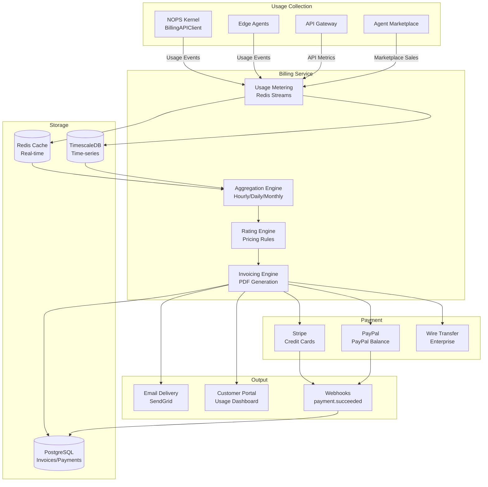

<!-- START doctoc generated TOC please keep comment here to allow auto update -->
<!-- DON'T EDIT THIS SECTION, INSTEAD RE-RUN doctoc TO UPDATE -->
Índice

  - [🎯 PROPÓSITO Y CONTEXTO](#-propósito-y-contexto)
- [📑 TABLA DE CONTENIDOS](#-tabla-de-contenidos)
  - [🏗️ ARQUITECTURA DEL BILLING SERVICE](#-arquitectura-del-billing-service)
    - [**Principios Arquitectónicos Fundamentales**](#principios-arquitectónicos-fundamentales)
    - [**Componentes Core del Sistema**](#componentes-core-del-sistema)
    - [**Flujo de Billing Completo**](#flujo-de-billing-completo)
  - [💰 USAGE METERING](#-usage-metering)
    - [**Métricas Billables**](#métricas-billables)
    - [**Arquitectura de Metering**](#arquitectura-de-metering)
  - [💳 PAYMENT PROCESSING](#-payment-processing)
    - [**Payment Providers**](#payment-providers)
    - [**Payment Flow**](#payment-flow)
  - [📊 INVOICING ENGINE](#-invoicing-engine)
    - [**Invoice Generation**](#invoice-generation)
    - [**Invoice Templates por Tier**](#invoice-templates-por-tier)
  - [🔧 APIS Y SDKS](#-apis-y-sdks)
    - [**Core API Endpoints**](#core-api-endpoints)
    - [**SDK Specifications**](#sdk-specifications)
  - [🔗 INTEGRACIÓN CON NOPS KERNEL](#-integración-con-nops-kernel)
    - [**Arquitectura de Integración**](#arquitectura-de-integración)
    - [**BillingAPIClient Implementation**](#billingapiclient-implementation)
  - [🚀 DEPLOYMENT PATTERNS](#-deployment-patterns)
  - [🔒 SECURITY & COMPLIANCE](#-security--compliance)
    - [**PCI-DSS Compliance**](#pci-dss-compliance)
    - [**Data Protection**](#data-protection)
  - [📁 ESTRUCTURA DE DOCUMENTACIÓN](#-estructura-de-documentación)
  - [✅ VALIDACIÓN Y QUALITY GATES](#-validación-y-quality-gates)
  - [🎯 INSTRUCCIONES DE GENERACIÓN](#-instrucciones-de-generación)
  - [📋 METADATA DE CIERRE](#-metadata-de-cierre)

<!-- END doctoc generated TOC please keep comment here to allow auto update -->

---
prompt_id: "39-billing-master-prompt"
prompt_type: "master_prompt"
service_name: "billing-service"
dna_version: "3.0"
semver: "1.0.0"
date: "2025-10-08"
author: "@andaon"
domain: "Billing & Revenue Management"
description: "Master prompt para generar documentación completa del Billing Service con usage metering"
estimated_pages: "130-160"
compliance_status: "DNA_v3_compliant"
dependencies: ["00-dna-proyecto-prompt.md", "07-nops-master-prompt.md", "18-security-master-prompt.md"]
generates:
 - "architecture/billing/*"
 - "reference/billing-api/*"
 - "implementation/billing-deployment/*"
 - "payment-integration/*"
child_prompts: 18
validation_script: "validate-billing-documentation.js"
release_status: "ready_for_sprint_s22"
feeds_to: ["07-nops-kernel", "08-agent-marketplace"]
priority: "P1 - CRÍTICO"
sprint: "S22-P3"
revenue_critical: true
---

## 🎯 PROPÓSITO Y CONTEXTO

**ROL:** Arquitecto Senior de Billing & Revenue Management en ENIS v3.0 (Enterprise Neural Intelligence Systems)

**TAREA:** Generar documentación completa del Billing Service, el servicio crítico para usage metering, payment processing, invoicing y revenue management, extraído del NOPS Kernel según el principio SLIM.

**OBJETIVO:** Producir 130-160 páginas de documentación técnica production-ready que cubra arquitectura, usage metering en tiempo real, payment processing (Stripe, PayPal), invoicing multi-tier, APIs, deployment patterns, PCI-DSS compliance y revenue analytics.

**CONTEXTO CRÍTICO:** 
- El Billing Service es **REVENUE-CRITICAL** - errores afectan dinero real
- Gestiona usage metering de 5 tiers (🟤 Zero, 🟡 Shared, 🟢 Lite, 🔵 Enterprise, 🔴 Air-Gapped)
- Procesa pagos con múltiples providers (Stripe, PayPal, wire transfer)
- Genera invoices automáticas (mensual/anual/usage-based)
- El NOPS Kernel usa `BillingAPIClient` con **cache Redis + fallback async**
- Compliance PCI-DSS Level 1 requerido (no almacenar tarjetas)

# 📑 TABLA DE CONTENIDOS

- 🏗️ Arquitectura del Billing Service
- 💰 Usage Metering
- 💳 Payment Processing
- 📊 Invoicing Engine
- 🔧 APIs y SDKs
- 🔗 Integración con NOPS Kernel
- 🚀 Deployment Patterns
- 🔒 Security & Compliance (PCI-DSS)
- 📁 Estructura de Documentación
- ✅ Validación y Quality Gates
- 🎯 Instrucciones de Generación

## 🏗️ ARQUITECTURA DEL BILLING SERVICE

### **Principios Arquitectónicos Fundamentales**

El Billing Service de ENIS v3.0 se basa en cinco principios arquitectónicos clave:

- **Accuracy First**: Cada centavo cuenta - 100% precisión en billing
- **Real-Time Metering**: Usage tracking en tiempo real con Redis Streams
- **Multi-Tier Support**: Planes diferenciados (🟤🟡🟢🔵🔴)
- **Provider Agnostic**: Múltiples payment gateways (Stripe, PayPal, Wire)
- **PCI-DSS Compliant**: Nunca almacenar datos de tarjetas (tokenization)

### **Componentes Core del Sistema**

```yaml
billing_architecture:
  usage_metering_engine:
    description: "Motor de medición de uso en tiempo real"
    technology: "Python + Redis Streams + TimescaleDB"
    features:
      - "Real-time usage tracking"
      - "Aggregation por tenant/tier"
      - "Rate limiting integration"
      - "Billing alerts (thresholds)"
      - "Usage analytics dashboard"
    
    metricas_billables:
      agent_executions:
        unit: "execution"
        tiers:
          🟤_zero: "1,000/mes free"
          🟡_shared: "10,000/mes incluidos"
          🟢_lite: "100,000/mes incluidos"
          🔵_enterprise: "Unlimited (contract)"
          🔴_airgapped: "N/A (on-premise)"
        
        pricing:
          🟤_zero: "$0"
          🟡_shared: "$0.001/exec adicional"
          🟢_lite: "$0.0005/exec adicional"
          🔵_enterprise: "Contract pricing"
          
      api_requests:
        unit: "request"
        tiers:
          🟤_zero: "100K/mes free"
          🟡_shared: "1M/mes incluidos"
          🟢_lite: "10M/mes incluidos"
          🔵_enterprise: "Unlimited"
          
      storage:
        unit: "GB-month"
        pricing: "$0.10/GB-month"
        
      compute_time:
        unit: "CPU-hour"
        pricing: "$0.05/CPU-hour"
        
  payment_processing_engine:
    description: "Motor de procesamiento de pagos"
    technology: "Python + Stripe SDK + PayPal SDK"
    providers:
      stripe:
        features:
          - "Credit/Debit cards"
          - "ACH/SEPA"
          - "Wallets (Apple Pay, Google Pay)"
          - "Subscriptions"
          - "Invoice payment"
        pci_level: "Level 1 (Stripe handles)"
        
      paypal:
        features:
          - "PayPal balance"
          - "Credit/Debit cards (via PayPal)"
          - "PayPal Credit"
        pci_level: "Level 1 (PayPal handles)"
        
      wire_transfer:
        features:
          - "Bank transfers (Enterprise only)"
          - "Net 30/60/90 terms"
          - "Manual reconciliation"
        applicable_tiers: ["🔵 Enterprise"]
        
  invoicing_engine:
    description: "Motor de generación de facturas"
    technology: "Python + Jinja2 templates + WeasyPrint (PDF)"
    features:
      - "Auto-generation (monthly/annual)"
      - "Multi-currency support (USD, EUR, MXN)"
      - "Tax calculation (VAT, sales tax)"
      - "Customizable templates por tier"
      - "Delivery (email + API)"
    
    invoice_types:
      subscription: "Plan base mensual/anual"
      usage_based: "Overages sobre límites"
      one_time: "Add-ons, setup fees"
      credit_note: "Refunds, ajustes"
      
  revenue_analytics:
    description: "Analytics de revenue y churn"
    technology: "Python + Pandas + Plotly"
    metrics:
      mrr: "Monthly Recurring Revenue"
      arr: "Annual Recurring Revenue"
      churn: "Customer churn rate"
      ltv: "Lifetime Value"
      cac: "Customer Acquisition Cost"
      
    dashboards:
      - "Executive Revenue Dashboard"
      - "Tier Performance Dashboard"
      - "Churn Analysis Dashboard"
      - "Revenue Forecast Dashboard"
```

### **Flujo de Billing Completo**



---

## 💰 USAGE METERING

### **Métricas Billables**

```yaml
billable_metrics:
  agent_executions:
    description: "Ejecuciones de Edge Agents"
    measurement: "Per execution"
    dimensions:
      - "agent_type (🟤🟡🟢🔵🔴)"
      - "execution_duration"
      - "input_tokens"
      - "output_tokens"
      
    pricing_tiers:
      🟤_zero:
        included: 1000
        overage: "$0"  # No overage - upgrade required
        
      🟡_shared:
        included: 10000
        overage: "$0.001/exec"
        
      🟢_lite:
        included: 100000
        overage: "$0.0005/exec"
        
      🔵_enterprise:
        included: "unlimited"
        custom_pricing: true
        
  llm_tokens:
    description: "Tokens procesados por Inference Service"
    measurement: "Per 1K tokens"
    types:
      input_tokens:
        pricing: "$0.002/1K tokens"
        
      output_tokens:
        pricing: "$0.004/1K tokens"
        
    models_pricing:
      gpt4:
        input: "$0.030/1K"
        output: "$0.060/1K"
        
      gpt35:
        input: "$0.002/1K"
        output: "$0.004/1K"
        
      claude:
        input: "$0.025/1K"
        output: "$0.050/1K"
        
  storage:
    description: "Almacenamiento de datos"
    measurement: "GB-month"
    types:
      hot_storage:
        description: "Acceso frecuente (< 30 días)"
        pricing: "$0.15/GB-month"
        
      warm_storage:
        description: "Acceso ocasional (30-90 días)"
        pricing: "$0.08/GB-month"
        
      cold_storage:
        description: "Archivo (> 90 días)"
        pricing: "$0.02/GB-month"
        
  api_requests:
    description: "Requests a APIs ENIS"
    measurement: "Per request"
    pricing:
      🟤_zero: "$0"
      🟡_shared: "$0.0001/req over 1M"
      🟢_lite: "$0.00005/req over 10M"
      🔵_enterprise: "unlimited"
      
  compute_time:
    description: "Tiempo de CPU/GPU"
    measurement: "vCPU-hour o GPU-hour"
    pricing:
      cpu: "$0.05/vCPU-hour"
      gpu_t4: "$0.50/GPU-hour"
      gpu_a100: "$3.00/GPU-hour"
```

### **Arquitectura de Metering**

```python
# billing_service/metering/collector.py
from typing import Dict, Any, Optional
import redis.asyncio as aioredis
from datetime import datetime, timedelta
import structlog

logger = structlog.get_logger()

class UsageCollector:
    """
    Colector de métricas de uso en tiempo real
    
    Usa Redis Streams para procesamiento de alto throughput
    """
    
    def __init__(
        self,
        redis_client: aioredis.Redis,
        stream_name: str = "usage_events"
    ):
        self.redis = redis_client
        self.stream_name = stream_name
        self.logger = logger.bind(component="usage_collector")
        
    async def record_usage(
        self,
        tenant_id: str,
        metric_type: str,
        value: float,
        dimensions: Dict[str, Any],
        timestamp: Optional[datetime] = None
    ) -> str:
        """
        Registra evento de uso
        
        Args:
            tenant_id: ID del tenant
            metric_type: Tipo de métrica (agent_execution, api_request, etc.)
            value: Valor de la métrica (1 execution, 1000 tokens, etc.)
            dimensions: Dimensiones adicionales (agent_type, model, etc.)
            timestamp: Timestamp del evento (default: now)
            
        Returns:
            event_id (Redis Stream ID)
        """
        if timestamp is None:
            timestamp = datetime.utcnow()
        
        event = {
            "tenant_id": tenant_id,
            "metric_type": metric_type,
            "value": str(value),
            "dimensions": json.dumps(dimensions),
            "timestamp": timestamp.isoformat(),
            "recorded_at": datetime.utcnow().isoformat()
        }
        
        # Agregar a Redis Stream (append-only, high-throughput)
        event_id = await self.redis.xadd(
            self.stream_name,
            event,
            maxlen=1000000  # Keep last 1M events
        )
        
        # Actualizar contador en tiempo real (cache)
        cache_key = f"usage:{tenant_id}:{metric_type}:current_month"
        await self.redis.incrbyfloat(cache_key, value)
        await self.redis.expire(cache_key, timedelta(days=35))
        
        self.logger.debug(
            "usage_recorded",
            tenant_id=tenant_id,
            metric_type=metric_type,
            value=value,
            event_id=event_id
        )
        
        return event_id
    
    async def get_current_usage(
        self,
        tenant_id: str,
        metric_type: str,
        period: str = "current_month"
    ) -> float:
        """
        Obtiene uso actual desde cache (Redis)
        
        Usado para:
        - Rate limiting
        - Billing alerts
        - Usage dashboards
        """
        cache_key = f"usage:{tenant_id}:{metric_type}:{period}"
        
        value = await self.redis.get(cache_key)
        
        if value is None:
            # Cache miss - recalcular desde TimescaleDB
            value = await self._recalculate_from_db(
                tenant_id,
                metric_type,
                period
            )
            await self.redis.set(
                cache_key,
                value,
                ex=timedelta(hours=1)
            )
        
        return float(value)
    
    async def check_threshold_alert(
        self,
        tenant_id: str,
        metric_type: str,
        threshold_percentage: float = 0.8
    ) -> Optional[Dict[str, Any]]:
        """
        Verifica si se alcanzó threshold de alerta
        
        Envía alerta cuando tenant usa 80%+ de su cuota
        """
        # Obtener plan y límites del tenant
        plan = await self._get_tenant_plan(tenant_id)
        limit = plan.get(f"{metric_type}_limit")
        
        if limit == "unlimited":
            return None
        
        current = await self.get_current_usage(tenant_id, metric_type)
        
        if current >= limit * threshold_percentage:
            alert = {
                "tenant_id": tenant_id,
                "metric_type": metric_type,
                "current_usage": current,
                "limit": limit,
                "percentage": current / limit,
                "alert_type": "threshold_exceeded" if current >= limit else "threshold_warning"
            }
            
            # Enviar alerta
            await self._send_alert(alert)
            
            return alert
        
        return None
```

---

```python
# billing_service/metering/aggregator.py
from typing import Dict, List, Any
from datetime import datetime, timedelta
import pandas as pd
from sqlalchemy.ext.asyncio import AsyncSession

class UsageAggregator:
    """
    Agregador de métricas de uso
    
    Procesa eventos de Redis Streams y agrega en TimescaleDB
    Corre como background worker (Celery/temporal.io)
    """
    
    def __init__(
        self,
        redis_client: aioredis.Redis,
        db_session: AsyncSession
    ):
        self.redis = redis_client
        self.session = db_session
        self.logger = logger.bind(component="usage_aggregator")
        
    async def aggregate_hourly(
        self,
        start_time: datetime,
        end_time: datetime
    ) -> int:
        """
        Agrega eventos en ventanas de 1 hora
        
        Corre cada hora (cron: 0 * * * *)
        """
        # 1. Leer eventos de Redis Stream
        events = await self._read_stream_range(start_time, end_time)
        
        if not events:
            self.logger.info("no_events_to_aggregate")
            return 0
        
        # 2. Convertir a DataFrame para agregación eficiente
        df = pd.DataFrame(events)
        df['timestamp'] = pd.to_datetime(df['timestamp'])
        df['value'] = df['value'].astype(float)
        
        # 3. Agregar por tenant + metric + hour
        aggregated = df.groupby([
            'tenant_id',
            'metric_type',
            pd.Grouper(key='timestamp', freq='1H')
        ]).agg({
            'value': 'sum',
            'recorded_at': 'count'  # Número de eventos
        }).reset_index()
        
        aggregated.columns = [
            'tenant_id',
            'metric_type',
            'hour',
            'total_value',
            'event_count'
        ]
        
        # 4. Persistir en TimescaleDB
        for _, row in aggregated.iterrows():
            await self.session.execute(
                """
                INSERT INTO usage_aggregated_hourly 
                (tenant_id, metric_type, hour, total_value, event_count, created_at)
                VALUES 
                (:tenant_id, :metric_type, :hour, :total_value, :event_count, NOW())
                ON CONFLICT (tenant_id, metric_type, hour)
                DO UPDATE SET
                    total_value = usage_aggregated_hourly.total_value + EXCLUDED.total_value,
                    event_count = usage_aggregated_hourly.event_count + EXCLUDED.event_count
                """,
                {
                    "tenant_id": row['tenant_id'],
                    "metric_type": row['metric_type'],
                    "hour": row['hour'],
                    "total_value": row['total_value'],
                    "event_count": row['event_count']
                }
            )
        
        await self.session.commit()
        
        self.logger.info(
            "hourly_aggregation_completed",
            events_processed=len(events),
            aggregates_created=len(aggregated)
        )
        
        return len(aggregated)
    
    async def aggregate_monthly(
        self,
        year: int,
        month: int
    ) -> Dict[str, Any]:
        """
        Agrega uso mensual para billing
        
        Corre al inicio de cada mes (cron: 0 0 1 * *)
        Genera datos para invoice generation
        """
        # 1. Leer agregados horarios del mes
        result = await self.session.execute(
            """
            SELECT 
                tenant_id,
                metric_type,
                SUM(total_value) as monthly_total,
                SUM(event_count) as monthly_events
            FROM usage_aggregated_hourly
            WHERE EXTRACT(YEAR FROM hour) = :year
              AND EXTRACT(MONTH FROM hour) = :month
            GROUP BY tenant_id, metric_type
            """,
            {"year": year, "month": month}
        )
        
        monthly_usage = result.fetchall()
        
        # 2. Persistir agregados mensuales
        for usage in monthly_usage:
            await self.session.execute(
                """
                INSERT INTO usage_aggregated_monthly
                (tenant_id, metric_type, year, month, total_value, event_count, created_at)
                VALUES
                (:tenant_id, :metric_type, :year, :month, :total_value, :event_count, NOW())
                """,
                {
                    "tenant_id": usage['tenant_id'],
                    "metric_type": usage['metric_type'],
                    "year": year,
                    "month": month,
                    "total_value": usage['monthly_total'],
                    "event_count": usage['monthly_events']
                }
            )
        
        await self.session.commit()
        
        self.logger.info(
            "monthly_aggregation_completed",
            year=year,
            month=month,
            tenants_processed=len(set(u['tenant_id'] for u in monthly_usage))
        )
        
        return {
            "year": year,
            "month": month,
            "tenants": len(set(u['tenant_id'] for u in monthly_usage)),
            "metrics": len(monthly_usage)
        }
```

---

## 💳 PAYMENT PROCESSING

### **Payment Providers**

```yaml
payment_providers:
  stripe:
    integration: "Stripe Python SDK"
    api_version: "2023-10-16"
    
    payment_methods:
      cards:
        - "Visa"
        - "Mastercard"
        - "American Express"
        - "Discover"
        
      bank_transfers:
        - "ACH (US)"
        - "SEPA (EU)"
        - "BACS (UK)"
        
      wallets:
        - "Apple Pay"
        - "Google Pay"
        - "Link (Stripe)"
        
    features:
      subscriptions: true
      invoices: true
      payment_intents: true
      webhooks: true
      3d_secure: true
      
    pci_compliance:
      level: "PCI-DSS Level 1"
      tokenization: "Stripe.js (client-side)"
      no_card_storage: true
      
  paypal:
    integration: "PayPal REST API"
    api_version: "v2"
    
    payment_methods:
      - "PayPal Balance"
      - "Credit/Debit via PayPal"
      - "PayPal Credit"
      - "Venmo (US)"
      
    features:
      subscriptions: true
      invoices: true
      webhooks: true
      
    pci_compliance:
      level: "PCI-DSS Level 1"
      tokenization: "PayPal SDK"
      
  wire_transfer:
    applicable_tiers: ["🔵 Enterprise"]
    
    terms:
      - "Net 30"
      - "Net 60"
      - "Net 90"
      
    process:
      - "Invoice generated"
      - "Email con bank details"
      - "Manual reconciliation (finance team)"
      - "Payment confirmation"
```

### **Payment Flow**

```python
# billing_service/payments/processor.py
from typing import Dict, Any, Optional
import stripe
from paypalrestsdk import Payment as PayPalPayment
import structlog

logger = structlog.get_logger()

class PaymentProcessor:
    """
    Procesador de pagos multi-provider
    
    Soporta:
    - Stripe (credit cards, ACH, wallets)
    - PayPal (PayPal balance, cards via PayPal)
    - Wire Transfer (Enterprise manual)
    """
    
    def __init__(
        self,
        stripe_api_key: str,
        paypal_client_id: str,
        paypal_secret: str
    ):
        # Stripe setup
        stripe.api_key = stripe_api_key
        self.stripe = stripe
        
        # PayPal setup
        paypalrestsdk.configure({
            "mode": "live",  # or "sandbox"
            "client_id": paypal_client_id,
            "client_secret": paypal_secret
        })
        
        self.logger = logger.bind(component="payment_processor")
        
    async def process_payment(
        self,
        invoice_id: str,
        amount_cents: int,
        currency: str,
        payment_method: Dict[str, Any],
        metadata: Dict[str, Any]
    ) -> Dict[str, Any]:
        """
        Procesa pago usando el método especificado
        
        Args:
            invoice_id: ID de la factura
            amount_cents: Monto en centavos (USD: 1000 = $10.00)
            currency: Código de moneda (USD, EUR, MXN)
            payment_method: Detalles del método de pago
            metadata: Metadata adicional (tenant_id, tier, etc.)
            
        Returns:
            {
                "payment_id": str,
                "status": "succeeded|failed|pending",
                "provider": "stripe|paypal|wire",
                "details": dict
            }
        """
        provider = payment_method.get("provider", "stripe")
        
        try:
            if provider == "stripe":
                result = await self._process_stripe_payment(
                    invoice_id,
                    amount_cents,
                    currency,
                    payment_method,
                    metadata
                )
            elif provider == "paypal":
                result = await self._process_paypal_payment(
                    invoice_id,
                    amount_cents,
                    currency,
                    payment_method,
                    metadata
                )
            elif provider == "wire":
                result = await self._process_wire_transfer(
                    invoice_id,
                    amount_cents,
                    currency,
                    metadata
                )
            else:
                raise ValueError(f"Unsupported payment provider: {provider}")
            
            # Log a Compliance Service
            await self._log_payment_event(result, metadata)
            
            return result
            
        except Exception as e:
            self.logger.error(
                "payment_processing_failed",
                invoice_id=invoice_id,
                provider=provider,
                error=str(e)
            )
            raise
    
    async def _process_stripe_payment(
        self,
        invoice_id: str,
        amount_cents: int,
        currency: str,
        payment_method: Dict[str, Any],
        metadata: Dict[str, Any]
    ) -> Dict[str, Any]:
        """Procesar pago con Stripe"""
        
        # Crear Payment Intent
        intent = self.stripe.PaymentIntent.create(
            amount=amount_cents,
            currency=currency.lower(),
            payment_method=payment_method.get("payment_method_id"),
            confirm=True,
            description=f"ENIS Invoice {invoice_id}",
            metadata={
                "invoice_id": invoice_id,
                "tenant_id": metadata.get("tenant_id"),
                "tier": metadata.get("tier")
            }
        )
        
        return {
            "payment_id": intent.id,
            "status": intent.status,  # succeeded, requires_action, processing
            "provider": "stripe",
            "details": {
                "client_secret": intent.client_secret,
                "charges": intent.charges.data if intent.charges else []
            }
        }
    
    async def _process_paypal_payment(
        self,
        invoice_id: str,
        amount_cents: int,
        currency: str,
        payment_method: Dict[str, Any],
        metadata: Dict[str, Any]
    ) -> Dict[str, Any]:
        """Procesar pago con PayPal"""
        
        amount_decimal = amount_cents / 100.0
        
        payment = PayPalPayment({
            "intent": "sale",
            "payer": {
                "payment_method": "paypal"
            },
            "transactions": [{
                "amount": {
                    "total": f"{amount_decimal:.2f}",
                    "currency": currency
                },
                "description": f"ENIS Invoice {invoice_id}",
                "invoice_number": invoice_id
            }],
            "redirect_urls": {
                "return_url": f"https://enis.cloud/billing/payment/success",
                "cancel_url": f"https://enis.cloud/billing/payment/cancel"
            }
        })
        
        if payment.create():
            return {
                "payment_id": payment.id,
                "status": "pending",  # User needs to approve
                "provider": "paypal",
                "details": {
                    "approval_url": next(
                        link.href for link in payment.links if link.rel == "approval_url"
                    )
                }
            }
        else:
            raise Exception(f"PayPal payment creation failed: {payment.error}")
    
    async def _process_wire_transfer(
        self,
        invoice_id: str,
        amount_cents: int,
        currency: str,
        metadata: Dict[str, Any]
    ) -> Dict[str, Any]:
        """
        Iniciar wire transfer (Enterprise only)
        
        No se procesa pago inmediatamente - se envía invoice con bank details
        """
        # Generar payment reference único
        payment_ref = f"ENIS-{invoice_id}-{datetime.utcnow().strftime('%Y%m%d')}"
        
        # Persistir pending wire transfer
        await self.session.execute(
            """
            INSERT INTO pending_wire_transfers
            (invoice_id, amount_cents, currency, payment_reference, status, created_at)
            VALUES
            (:invoice_id, :amount_cents, :currency, :payment_ref, 'pending', NOW())
            """,
            {
                "invoice_id": invoice_id,
                "amount_cents": amount_cents,
                "currency": currency,
                "payment_ref": payment_ref
            }
        )
        await self.session.commit()
        
        return {
            "payment_id": payment_ref,
            "status": "pending_wire_transfer",
            "provider": "wire",
            "details": {
                "payment_reference": payment_ref,
                "bank_details": {
                    "account_name": "ANDAON SA DE CV",
                    "account_number": "****1234",
                    "routing_number": "****5678",
                    "swift_code": "XXXXMXMM",
                    "bank_name": "Banco Example"
                }
            }
        }
    
    async def handle_webhook(
        self,
        provider: str,
        webhook_data: Dict[str, Any],
        signature: str
    ) -> Dict[str, Any]:
        """
        Maneja webhooks de payment providers
        
        Webhooks críticos:
        - payment_intent.succeeded (Stripe)
        - payment_intent.payment_failed (Stripe)
        - PAYMENT.SALE.COMPLETED (PayPal)
        """
        if provider == "stripe":
            return await self._handle_stripe_webhook(webhook_data, signature)
        elif provider == "paypal":
            return await self._handle_paypal_webhook(webhook_data, signature)
        else:
            raise ValueError(f"Unsupported webhook provider: {provider}")
    
    async def _handle_stripe_webhook(
        self,
        webhook_data: Dict[str, Any],
        signature: str
    ) -> Dict[str, Any]:
        """Procesar webhook de Stripe"""
        
        # Verificar firma del webhook (security)
        try:
            event = self.stripe.Webhook.construct_event(
                webhook_data,
                signature,
                self.stripe_webhook_secret
            )
        except ValueError:
            raise ValueError("Invalid webhook payload")
        except stripe.error.SignatureVerificationError:
            raise ValueError("Invalid webhook signature")
        
        event_type = event['type']
        
        if event_type == 'payment_intent.succeeded':
            # Marcar invoice como paid
            payment_intent = event['data']['object']
            invoice_id = payment_intent['metadata']['invoice_id']
            
            await self._mark_invoice_paid(
                invoice_id,
                payment_intent['id'],
                "stripe"
            )
            
            return {"status": "invoice_marked_paid"}
            
        elif event_type == 'payment_intent.payment_failed':
            # Notificar al tenant
            payment_intent = event['data']['object']
            invoice_id = payment_intent['metadata']['invoice_id']
            
            await self._notify_payment_failed(
                invoice_id,
                payment_intent['last_payment_error']
            )
            
            return {"status": "payment_failure_notified"}
        
        return {"status": "event_ignored"}
```

---

## 📊 INVOICING ENGINE

### **Invoice Generation**

```python
# billing_service/invoicing/generator.py
from typing import Dict, List, Any
from datetime import datetime, timedelta
from jinja2 import Environment, FileSystemLoader
from weasyprint import HTML
import structlog

logger = structlog.get_logger()

class InvoiceGenerator:
    """
    Generador de facturas PDF
    
    Soporta:
    - Templates customizables por tier
    - Multi-currency (USD, EUR, MXN)
    - Tax calculation (VAT, sales tax)
    - Line items detallados
    """
    
    def __init__(
        self,
        db_session: AsyncSession,
        template_dir: str = "/app/templates/invoices"
    ):
        self.session = db_session
        self.jinja_env = Environment(loader=FileSystemLoader(template_dir))
        self.logger = logger.bind(component="invoice_generator")
        
    async def generate_monthly_invoice(
        self,
        tenant_id: str,
        year: int,
        month: int
    ) -> Dict[str, Any]:
        """
        Genera factura mensual automática
        
        Corre al inicio de cada mes para todos los tenants activos
        """
        # 1. Obtener plan del tenant
        tenant = await self._get_tenant_info(tenant_id)
        plan = tenant['plan']
        
        # 2. Obtener uso del mes
        usage = await self._get_monthly_usage(tenant_id, year, month)
        
        # 3. Calcular línea base (subscription)
        line_items = []
        
        # Subscription base
        if plan['tier'] != '🟤':  # Zero tier es gratis
            line_items.append({
                "description": f"{plan['name']} - Monthly Subscription",
                "quantity": 1,
                "unit_price": plan['monthly_price'],
                "total": plan['monthly_price']
            })
        
        # 4. Calcular overages
        overages = await self._calculate_overages(usage, plan)
        
        for metric, overage in overages.items():
            if overage['amount'] > 0:
                line_items.append({
                    "description": f"{metric} - Overage",
                    "quantity": overage['units'],
                    "unit_price": overage['unit_price'],
                    "total": overage['amount']
                })
        
        # 5. Calcular impuestos
        subtotal = sum(item['total'] for item in line_items)
        tax_rate = await self._get_tax_rate(tenant['country'], tenant['state'])
        tax_amount = subtotal * tax_rate
        total = subtotal + tax_amount
        
        # 6. Crear registro de invoice
        invoice_id = str(uuid.uuid4())
        
        await self.session.execute(
            """
            INSERT INTO invoices
            (invoice_id, tenant_id, year, month, subtotal, tax_amount, total, 
             currency, status, due_date, created_at)
            VALUES
            (:invoice_id, :tenant_id, :year, :month, :subtotal, :tax_amount, :total,
             :currency, 'pending', :due_date, NOW())
            """,
            {
                "invoice_id": invoice_id,
                "tenant_id": tenant_id,
                "year": year,
                "month": month,
                "subtotal": subtotal,
                "tax_amount": tax_amount,
                "total": total,
                "currency": tenant['currency'],
                "due_date": datetime.now() + timedelta(days=15)
            }
        )
        
        # Guardar line items
        for item in line_items:
            await self.session.execute(
                """
                INSERT INTO invoice_line_items
                (invoice_id, description, quantity, unit_price, total)
                VALUES
                (:invoice_id, :description, :quantity, :unit_price, :total)
                """,
                {
                    "invoice_id": invoice_id,
                    "description": item['description'],
                    "quantity": item['quantity'],
                    "unit_price": item['unit_price'],
                    "total": item['total']
                }
            )
        
        await self.session.commit()
        
        # 7. Generar PDF
        pdf_path = await self._generate_pdf(
            invoice_id,
            tenant,
            line_items,
            subtotal,
            tax_amount,
            total
        )
        
        # 8. Enviar por email
        await self._send_invoice_email(tenant, invoice_id, pdf_path)
        
        self.logger.info(
            "invoice_generated",
            invoice_id=invoice_id,
            tenant_id=tenant_id,
            total=total
        )
        
        return {
            "invoice_id": invoice_id,
            "total": total,
            "pdf_path": pdf_path,
            "status": "pending"
        }
    
    async def _generate_pdf(
        self,
        invoice_id: str,
        tenant: Dict[str, Any],
        line_items: List[Dict[str, Any]],
        subtotal: float,
        tax_amount: float,
        total: float
    ) -> str:
        """Genera PDF de factura usando template"""
        
        # Seleccionar template según tier
        template_name = f"invoice_{tenant['plan']['tier']}.html"
        template = self.jinja_env.get_template(template_name)
        
        # Renderizar HTML
        html_content = template.render(
            invoice_id=invoice_id,
            tenant=tenant,
            line_items=line_items,
            subtotal=subtotal,
            tax_amount=tax_amount,
            total=total,
            generated_at=datetime.utcnow().isoformat()
        )
        
        # Convertir a PDF
        pdf_path = f"/var/invoices/{invoice_id}.pdf"
        HTML(string=html_content).write_pdf(pdf_path)
        
        # Upload a S3
        await self._upload_to_s3(pdf_path, f"invoices/{invoice_id}.pdf")
        
        return pdf_path
    
    async def _calculate_overages(
        self,
        usage: Dict[str, float],
        plan: Dict[str, Any]
    ) -> Dict[str, Dict[str, Any]]:
        """Calcula overages sobre límites del plan"""
        
        overages = {}
        
        for metric, used in usage.items():
            limit = plan.get(f"{metric}_limit", 0)
            
            if limit == "unlimited":
                continue
            
            if used > limit:
                overage_units = used - limit
                unit_price = plan.get(f"{metric}_overage_price", 0)
                
                overages[metric] = {
                    "units": overage_units,
                    "unit_price": unit_price,
                    "amount": overage_units * unit_price
                }
        
        return overages
```

### **Invoice Templates por Tier**

```jinja2
{# templates/invoices/invoice_🔵.html - Enterprise Tier #}
<!DOCTYPE html>
<html>
<head>
    <meta charset="utf-8">
    <title>Invoice {{ invoice_id }}</title>
    <style>
        body {
            font-family: 'Helvetica', sans-serif;
            margin: 40px;
        }
        .header {
            display: flex;
            justify-content: space-between;
            border-bottom: 2px solid #1976d2;
            padding-bottom: 20px;
        }
        .logo {
            font-size: 32px;
            font-weight: bold;
            color: #1976d2;
        }
        .invoice-details {
            text-align: right;
        }
        .company-info, .customer-info {
            margin-top: 30px;
        }
        table {
            width: 100%;
            margin-top: 30px;
            border-collapse: collapse;
        }
        th {
            background-color: #1976d2;
            color: white;
            padding: 12px;
            text-align: left;
        }
        td {
            padding: 10px;
            border-bottom: 1px solid #ddd;
        }
        .totals {
            margin-top: 30px;
            text-align: right;
        }
        .total-row {
            font-size: 20px;
            font-weight: bold;
            color: #1976d2;
        }
    </style>
</head>
<body>
    <div class="header">
        <div class="logo">ENIS 🔵 Enterprise</div>
        <div class="invoice-details">
            <h2>INVOICE</h2>
            <p><strong>Invoice #:</strong> {{ invoice_id }}</p>
            <p><strong>Date:</strong> {{ generated_at[:10] }}</p>
            <p><strong>Due Date:</strong> Net 30</p>
        </div>
    </div>
    
    <div class="company-info">
        <h3>From:</h3>
        <p><strong>ANDAON SA DE CV</strong></p>
        <p>Av. Ejemplo 123, CDMX, México</p>
        <p>RFC: XXXX000000XXX</p>
    </div>
    
    <div class="customer-info">
        <h3>Bill To:</h3>
        <p><strong>{{ tenant.company_name }}</strong></p>
        <p>{{ tenant.address }}</p>
        <p>{{ tenant.tax_id }}</p>
    </div>
    
    <table>
        <thead>
            <tr>
                <th>Description</th>
                <th>Quantity</th>
                <th>Unit Price</th>
                <th>Amount</th>
            </tr>
        </thead>
        <tbody>
            
            <tr>
                <td>{{ item.description }}</td>
                <td>{{ item.quantity }}</td>
                <td>${{ "%.2f"|format(item.unit_price) }}</td>
                <td>${{ "%.2f"|format(item.total) }}</td>
            </tr>
            
        </tbody>
    </table>
    
    <div class="totals">
        <p>Subtotal: ${{ "%.2f"|format(subtotal) }}</p>
        <p>Tax: ${{ "%.2f"|format(tax_amount) }}</p>
        <p class="total-row">Total: ${{ "%.2f"|format(total) }} USD</p>
    </div>
    
    <div style="margin-top: 50px; font-size: 12px; color: #666;">
        <p><strong>Payment Terms:</strong> Net 30 - Wire Transfer</p>
        <p><strong>Bank Details:</strong> [Provided separately for security]</p>
        <p><strong>Questions?</strong> billing@enis.cloud | +52 55 1234 5678</p>
    </div>
</body>
</html>
```

---

## 🔧 APIS Y SDKS

### **Core API Endpoints**

```yaml
billing_api_endpoints:
  POST /api/v1/usage:
    description: "Record usage event"
    auth: "mTLS + JWT s2s (NOPS Kernel only)"
    rate_limit: "10,000 req/min"
    request:
      body:
        tenant_id: "string"
        metric_type: "agent_execution|api_request|storage|compute"
        value: "number"
        dimensions: "object"
    response:
      status: 201
      body:
        event_id: "string"
        recorded: true
        
  GET /api/v1/usage/current:
    description: "Get current usage (real-time from cache)"
    auth: "JWT user or s2s"
    rate_limit: "1,000 req/min"
    params:
      tenant_id: "string"
      metric_type: "string (optional)"
      period: "current_month|current_year"
    response:
      body:
        tenant_id: "string"
        period: "string"
        usage:
          agent_executions: 15000
          api_requests: 500000
          storage_gb: 25.5
          
  POST /api/v1/payments:
    description: "Process payment"
    auth: "JWT user"
    request:
      body:
        invoice_id: "string"
        payment_method:
          provider: "stripe|paypal"
          payment_method_id: "string"
    response:
      body:
        payment_id: "string"
        status: "succeeded|pending|failed"
        
  POST /api/v1/webhooks/stripe:
    description: "Stripe webhook endpoint"
    auth: "Stripe signature verification"
    
  GET /api/v1/invoices:
    description: "List invoices"
    auth: "JWT user"
    params:
      tenant_id: "string"
      status: "pending|paid|overdue (optional)"
      limit: "number (default: 10)"
    response:
      body:
        invoices: "[array of invoices]"
        total: "number"
```

### **SDK Specifications**

```python
# billing_sdk/python/billing_client.py
from typing import Dict, Any, Optional
import httpx
import aioredis

class BillingClient:
    """
    SDK Python para Billing Service
    
    Features:
    - Usage tracking con batching
    - Redis cache para current usage
    - Async/await native
    - Fallback graceful
    """
    
    def __init__(
        self,
        base_url: str,
        mtls_cert: str,
        mtls_key: str,
        redis_client: Optional[aioredis.Redis] = None,
        batch_size: int = 100,
        batch_interval: int = 10
    ):
        self.client = httpx.AsyncClient(
            base_url=base_url,
            cert=(mtls_cert, mtls_key),
            verify=True,
            timeout=10
        )
        self.redis = redis_client
        self.batch_size = batch_size
        self.batch_interval = batch_interval
        self._batch_buffer = []
        
    async def record_usage(
        self,
        tenant_id: str,
        metric_type: str,
        value: float,
        dimensions: Dict[str, Any] = None
    ) -> bool:
        """
        Record usage event con batching automático
        
        Returns:
            True si se registró exitosamente
        """
        event = {
            "tenant_id": tenant_id,
            "metric_type": metric_type,
            "value": value,
            "dimensions": dimensions or {},
            "timestamp": datetime.utcnow().isoformat()
        }
        
        # Agregar a batch buffer
        self._batch_buffer.append(event)
        
        # Flush si alcanzamos batch size
        if len(self._batch_buffer) >= self.batch_size:
            await self._flush_batch()
        
        return True
    
    async def get_current_usage(
        self,
        tenant_id: str,
        metric_type: str
    ) -> float:
        """
        Obtiene uso actual con cache Redis
        
        Cache-aside pattern: Redis → API → Redis
        """
        if self.redis:
            # Try cache first
            cache_key = f"usage:{tenant_id}:{metric_type}:current_month"
            cached = await self.redis.get(cache_key)
            
            if cached is not None:
                return float(cached)
        
        # Cache miss - fetch from API
        response = await self.client.get(
            "/api/v1/usage/current",
            params={
                "tenant_id": tenant_id,
                "metric_type": metric_type
            }
        )
        response.raise_for_status()
        
        usage = response.json()["usage"][metric_type]
        
        # Update cache
        if self.redis:
            await self.redis.set(
                cache_key,
                usage,
                ex=300  # 5 min TTL
            )
        
        return usage
    
    async def _flush_batch(self):
        """Envía batch de eventos al servicio"""
        if not self._batch_buffer:
            return
        
        try:
            response = await self.client.post(
                "/api/v1/usage/batch",
                json={"events": self._batch_buffer}
            )
            response.raise_for_status()
            
            self._batch_buffer.clear()
            
        except httpx.HTTPError as e:
            logger.error("batch_flush_failed", error=str(e))
            # Retry logic aquí
```

---

## 🔗 INTEGRACIÓN CON NOPS KERNEL

### **Arquitectura de Integración**

```yaml
nops_kernel_integration:
  principio_slim:
    concepto: "NOPS Kernel usa BillingAPIClient ligero"
    codigo_kernel: "< 150 líneas"
    dependencias: "httpx, aioredis (ligeras)"
    
  comunicacion:
    protocolo: "HTTPS con mTLS"
    autenticacion: "mTLS client certificates"
    autorizacion: "JWT s2s con scope billing:write"
    batching: "100 eventos cada 10 segundos"
    
  caching:
    tecnologia: "Redis (compartido con NOPS Kernel)"
    ttl: "5 minutos"
    keys: "usage:{tenant_id}:{metric}:current_month"
    
  degraded_mode:
    trigger: "Billing service no disponible"
    accion: "Continuar operación (no-blocker)"
    logging: "Warning logged localmente"
    garantia: "Sistema funciona sin billing (recupera después)"
```

### **BillingAPIClient Implementation**

Ver líneas 527-548 en `07-nops-master-prompt.md` para implementación completa del `BillingAPIClient`.

---

## 🚀 DEPLOYMENT PATTERNS

```yaml
# kubernetes/billing-service/deployment.yaml
apiVersion: apps/v1
kind: Deployment
metadata:
  name: billing-service
  namespace: enis-cloud-core
  labels:
    app: billing-service
    tier: platform
    criticality: P1
spec:
  replicas: 3
  strategy:
    type: RollingUpdate
    rollingUpdate:
      maxSurge: 1
      maxUnavailable: 0
      
  template:
    spec:
      containers:
        - name: billing-service
          image: enis/billing-service:1.0.0
          
          env:
            - name: STRIPE_API_KEY
              valueFrom:
                secretKeyRef:
                  name: payment-credentials
                  key: stripe_api_key
                  
            - name: REDIS_URL
              value: "redis://redis-cluster:6379"
              
          resources:
            requests:
              cpu: "1000m"
              memory: "2Gi"
            limits:
              cpu: "2000m"
              memory: "4Gi"
```

---

## 🔒 SECURITY & COMPLIANCE

### **PCI-DSS Compliance**

```yaml
pci_dss_compliance:
  level: "PCI-DSS Level 1 (highest)"
  
  requirement_1_2_firewall:
    control: "Network segmentation"
    implementation:
      - "VPC isolation"
      - "Security groups restrictivos"
      - "No acceso directo desde internet"
      
  requirement_3_4_encryption:
    control: "Protect stored cardholder data"
    implementation:
      - "NO almacenamos tarjetas (tokenization)"
      - "Stripe/PayPal manejan PCI compliance"
      - "Solo almacenamos tokens"
      
  requirement_10_audit:
    control: "Track and monitor all access"
    implementation:
      - "Audit trail en Compliance Service"
      - "Todos los pagos logged"
      - "Anomaly detection activo"
```

### **Data Protection**

```yaml
data_protection:
  pii_handling:
    - "Nombres, emails encriptados en reposo"
    - "Acceso basado en RBAC"
    - "Audit trail de accesos"
    
  payment_data:
    - "NUNCA almacenar tarjetas"
    - "Tokenization via Stripe/PayPal"
    - "Tokens en Vault (HashiCorp)"
    
  gdpr_compliance:
    - "Right to access: Export de invoices"
    - "Right to erasure: Anonymization post-retention"
    - "Data portability: JSON export"
```

---

## 📁 ESTRUCTURA DE DOCUMENTACIÓN

```yaml
documentation_structure:
  billing_service/:
    - "README.md"
    - "02-architecture-master-prompt.md"
    - "18-security-master-prompt.md"
    - "19-performance-master-prompt.md"
    - "39-billing-master-prompt.md (este archivo)"
    - "ROADMAP_BILLING_SERVICE.md"
    
  docs/billing/:
    api/:
      - "01-usage-metering-api.md"
      - "02-payment-processing-api.md"
      - "03-invoicing-api.md"
      - "04-webhooks-api.md"
      
    payment_providers/:
      - "01-stripe-integration.md"
      - "02-paypal-integration.md"
      - "03-wire-transfer.md"
      
    compliance/:
      - "01-pci-dss-compliance.md"
      - "02-gdpr-compliance.md"
      - "03-tax-compliance.md"
```

---

## ✅ VALIDACIÓN Y QUALITY GATES

```yaml
validation_criteria:
  usage_metering:
    - "Events nunca perdidos (Redis + DB)"
    - "Real-time accuracy < 5s lag"
    - "Aggregation correcta (hourly/monthly)"
    - "Rate limiting sincronizado con usage"
    
  payment_processing:
    - "Stripe integration funcional"
    - "PayPal integration funcional"
    - "Webhook handling correcto"
    - "Idempotency garantizada"
    
  invoicing:
    - "Auto-generation mensual"
    - "PDF rendering correcto"
    - "Email delivery funcional"
    - "Tax calculation preciso"
    
  security:
    - "PCI-DSS Level 1 compliance"
    - "No card data storage"
    - "Tokenization functional"
    - "Audit trail completo"
```

---

## 🎯 INSTRUCCIONES DE GENERACIÓN

1. **Scaffold Service** - FastAPI + Redis + Stripe SDK
2. **Usage Metering** - Redis Streams + TimescaleDB
3. **Payment Processing** - Stripe + PayPal integration
4. **Invoicing Engine** - Jinja2 + WeasyPrint
5. **Testing** - Unit + Integration + Payment mocks
6. **Deployment** - Kubernetes + Helm charts

---

## 📋 METADATA DE CIERRE

```yaml
service_summary:
  nombre: "Billing Service"
  proposito: "Usage metering + Payment processing + Invoicing"
  prioridad: "P1 - REVENUE CRÍTICO"
  
  componentes_principales:
    - "Usage Metering Engine (Redis Streams)"
    - "Payment Processor (Stripe/PayPal)"
    - "Invoicing Engine (PDF generation)"
    - "Revenue Analytics"
    
  payment_providers:
    - "Stripe (cards, ACH, wallets)"
    - "PayPal (PayPal balance, cards)"
    - "Wire Transfer (Enterprise)"
    
  stack_tecnologico:
    - "FastAPI (Python 3.11+)"
    - "Redis Streams"
    - "TimescaleDB"
    - "Stripe SDK"
    - "WeasyPrint (PDF)"
    
estado: "ready_for_sprint_s22-p3"
estimated_completion: "1.5 semanas"
total_lines: "~1,300 líneas"
```

---

*Master Prompt Billing Service v1.0 - Creado 2025-10-08*  
*Estado: Versión profesional completa*  
*Revenue-critical: Accuracy 100% requerido*
