<!-- START doctoc generated TOC please keep comment here to allow auto update -->
<!-- DON'T EDIT THIS SECTION, INSTEAD RE-RUN doctoc TO UPDATE -->
Índice

- [PROMPT MAESTRO DNA DEL PROYECTO — ENIS: Enterprise Neural Intelligence Systems](#prompt-maestro-dna-del-proyecto--enis-enterprise-neural-intelligence-systems)
  - [(Hybrid-by-Design + Agent Marketplace)](#hybrid-by-design--agent-marketplace)
  - [Stack Tecnológico v3.0](#stack-tecnol%C3%B3gico-v30)
  - [Métricas de Éxito](#m%C3%A9tricas-de-%C3%89xito)
  - [Historial de Versiones](#historial-de-versiones)
- [📚 ÍNDICE DEL DNA v3.0](#-%C3%8Dndice-del-dna-v30)
  - [🧬 FUNDAMENTOS 🟢](#-fundamentos-)
  - [🛠️ ARQUITECTURA TÉCNICA 🟡](#-arquitectura-t%C3%89cnica-)
  - [💼 ESTRATEGIA DE NEGOCIO 🟡](#-estrategia-de-negocio-)
  - [🔧 IMPLEMENTACIÓN 🔴](#-implementaci%C3%93n-)
  - [🎯 SECCIONES ESPECIALES 🟣](#-secciones-especiales-)
  - [📊 MÉTRICAS DEL DOCUMENTO](#-m%C3%89tricas-del-documento)
  - [🗺️ RUTAS DE NAVEGACIÓN RECOMENDADAS](#-rutas-de-navegaci%C3%93n-recomendadas)
    - [Para Ejecutivos 🟢](#para-ejecutivos-)
    - [Para Arquitectos 🟡](#para-arquitectos-)
    - [Para Product Managers 🟡](#para-product-managers-)
    - [Para Desarrolladores 🔴](#para-desarrolladores-)
- [🎯 PROPÓSITO DEL DNA](#-prop%C3%93sito-del-dna)
  - [Arquitectura Hybrid-by-Design](#arquitectura-hybrid-by-design)
  - [Ecosistema de Agentes Inteligentes](#ecosistema-de-agentes-inteligentes)
  - [Democratización via Zero Agent](#democratizaci%C3%B3n-via-zero-agent)
- [📊 LEYENDA DE COMPLEJIDAD](#-leyenda-de-complejidad)
- [🏗️ ARQUITECTURA CORE - 3 COMPONENTES PRINCIPALES](#-arquitectura-core---3-componentes-principales)
  - [Los 3 Pilares Fundamentales de ENIS](#los-3-pilares-fundamentales-de-enis)
- [🧬 SISTEMA DE HERENCIA DE PROMPTS](#-sistema-de-herencia-de-prompts)
  - [Niveles de Herencia del Sistema de Generación](#niveles-de-herencia-del-sistema-de-generaci%C3%B3n)
  - [NIVEL 0 (DNA): 00-DNA-PROYECTO-PROMPT_v3.0_master-generator.md ← ESTE DOCUMENTO](#nivel-0-dna-00-dna-proyecto-prompt_v30_master-generatormd-%E2%86%90-este-documento)
  - [NIVEL 1 (Masters): `01-27-*-master-prompt.md`](#nivel-1-masters-01-27--master-promptmd)
  - [Reglas de Herencia Obligatorias](#reglas-de-herencia-obligatorias)
- [📄 TEMPLATES DE OUTPUT POR DOMINIO](#-templates-de-output-por-dominio)
  - [Architecture Domain (/architecture/v1.3/)](#architecture-domain-architecturev13)
  - [Business Domain (/business/)](#business-domain-business)
  - [Implementation Domain (/implementation/)](#implementation-domain-implementation)
  - [🧬 ESPECIFICACIÓN DEL ADN DEL PROYECTO](#-especificaci%C3%93n-del-adn-del-proyecto)
    - [Voz y Personalidad](#voz-y-personalidad)
    - [Pilares de Mensajería Clave](#pilares-de-mensajer%C3%ADa-clave)
    - [Terminología Standards](#terminolog%C3%ADa-standards)
  - [🔧 VARIANTES DEL KERNEL NOPS](#-variantes-del-kernel-nops)
    - [NOPS Deployment Variants](#nops-deployment-variants)
  - [🔁 CLASIFICACIÓN OPERATIVA DE AGENTES ENIS](#-clasificaci%C3%93n-operativa-de-agentes-enis)
    - [Los 5 Tipos de Edge Agents](#los-5-tipos-de-edge-agents)
  - [🚀 ARQUITECTURA ZERO AGENT](#-arquitectura-zero-agent)
  - [🛠️ STACK TECNOLÓGICO HÍBRIDO ACTUALIZADO](#-stack-tecnol%C3%93gico-h%C3%8Dbrido-actualizado)
    - [Core Platform Stack](#core-platform-stack)
    - [Multi-Language SDKs](#multi-language-sdks)
  - [🏗️ ARQUITECTURA TÉCNICA POR TIPO DE EDGE](#-arquitectura-t%C3%89cnica-por-tipo-de-edge)
    - [🟤 Zero Agent Architecture](#-zero-agent-architecture)
    - [🟡 Shared Edge Architecture](#-shared-edge-architecture)
    - [🟢 Edge Lite Architecture](#-edge-lite-architecture)
    - [🔵 Enterprise Cluster Architecture](#-enterprise-cluster-architecture)
    - [🔴 Air-Gapped Architecture](#-air-gapped-architecture)
  - [🔧 MATRIZ DE CARACTERÍSTICAS POR TIPO DE EDGE](#-matriz-de-caracter%C3%8Dsticas-por-tipo-de-edge)
  - [📈 CASOS DE USO REALES CON MÉTRICAS](#-casos-de-uso-reales-con-m%C3%89tricas)
    - [🏭 Manufacturing - Acme Corp (300 empleados)](#-manufacturing---acme-corp-300-empleados)
    - [🏥 Healthcare - Regional Health (5 hospitales)](#-healthcare---regional-health-5-hospitales)
    - [🏦 Financial Services - First National Bank](#-financial-services---first-national-bank)
    - [🛒 E-commerce - TechStyle (10 empleados)](#-e-commerce---techstyle-10-empleados)
  - [💰 PRECIOS Y ROI POR TIPO DE EDGE](#-precios-y-roi-por-tipo-de-edge)
    - [Pricing Matrix](#pricing-matrix)
    - [ROI Analysis por Tipo](#roi-analysis-por-tipo)
  - [🚀 PROGRESIÓN DE DEPLOYMENT](#-progresi%C3%93n-de-deployment)
    - [Evolution Paths](#evolution-paths)
  - [💼 MODELO DE NEGOCIO ACTUALIZADO](#-modelo-de-negocio-actualizado)
    - [Revenue Streams](#revenue-streams)
    - [Unit Economics](#unit-economics)
  - [🚀 CUSTOMER JOURNEY COMPLETO](#-customer-journey-completo)
    - [5 Fases del Journey](#5-fases-del-journey)
  - [🏆 CONTEXTO EMPRESARIAL ACTUALIZADO](#-contexto-empresarial-actualizado)
    - [Competitive Differentiation](#competitive-differentiation)
    - [Market Positioning](#market-positioning)
  - [🚀 HITOS DE EDGE AGENTS POR TRIMESTRE](#-hitos-de-edge-agents-por-trimestre)
    - [2025 Roadmap](#2025-roadmap)
  - [🎯 MASTER PROMPTS A GENERAR (NIVEL 1)](#-master-prompts-a-generar-nivel-1)
    - [Lista de 27 Master Prompts](#lista-de-27-master-prompts)
    - [Template de Master Prompt](#template-de-master-prompt)
  - [⚙️ METODOLOGÍA DE DESARROLLO CON AI-FIRST](#-metodolog%C3%8Da-de-desarrollo-con-ai-first)
    - [Development Workflow](#development-workflow)
    - [Team Structure](#team-structure)
  - [📚 ESTÁNDARES DE DOCUMENTACIÓN](#-est%C3%81ndares-de-documentaci%C3%93n)
    - [Multi-Language Documentation Standards](#multi-language-documentation-standards)
    - [Documentation Templates](#documentation-templates)
  - [🔒 SEGURIDAD & CUMPLIMIENTO CON NOPS](#-seguridad--cumplimiento-con-nops)
    - [Security Framework](#security-framework)
    - [Compliance by Edge Type](#compliance-by-edge-type)
  - [📈 MÉTRICAS DE RENDIMIENTO & ÉXITO](#-m%C3%89tricas-de-rendimiento--%C3%89xito)
    - [Technical Performance Metrics](#technical-performance-metrics)
    - [Business Success Metrics](#business-success-metrics)
  - [🧬 SISTEMA DE GENERACIÓN DE DOCUMENTOS ENIS](#-sistema-de-generaci%C3%93n-de-documentos-enis)
    - [Arquitectura de Generación en 3 Niveles](#arquitectura-de-generaci%C3%B3n-en-3-niveles)
    - [Generation Process](#generation-process)
  - [📋 FRAMEWORK DE ASEGURAMIENTO DE CALIDAD](#-framework-de-aseguramiento-de-calidad)
    - [Quality Assurance Framework](#quality-assurance-framework)
    - [Validation Checklists](#validation-checklists)
  - [🔄 CONTROL DE VERSIONES & ACTUALIZACIONES](#-control-de-versiones--actualizaciones)
    - [Version Control System](#version-control-system)
    - [Update Procedures](#update-procedures)
  - [⚡ INSTRUCCIONES DE EJECUCIÓN](#-instrucciones-de-ejecuci%C3%93n)
    - [Setup Instructions](#setup-instructions)
    - [Execution Timeline](#execution-timeline)
  - [🏆 CONCLUSIÓN Y PRÓXIMOS PASOS](#-conclusi%C3%93n-y-pr%C3%93ximos-pasos)
    - [Resumen Ejecutivo del DNA v3.0](#resumen-ejecutivo-del-dna-v30)
    - [Próximos Pasos Inmediatos](#pr%C3%B3ximos-pasos-inmediatos)
    - [Métricas de Éxito del DNA](#m%C3%A9tricas-de-%C3%89xito-del-dna)
    - [Declaración Final](#declaraci%C3%B3n-final)
  - [📊 METADATA FINAL DEL DOCUMENTO](#-metadata-final-del-documento)
  - [🚀 Go forth and build the future of Enterprise Intelligence! 🚀](#-go-forth-and-build-the-future-of-enterprise-intelligence-)

<!-- END doctoc generated TOC please keep comment here to allow auto update -->

---
title: "Prompt Maestro DNA del Proyecto - ENIS Enterprise Neural Intelligence Systems"
subtitle: "Híbrido por Diseño + Marketplace de Agentes + Revolución Zero Agent"
version: "3.0"
semver: "3.0.0"
date: "2025-07-04"
time: "21:19:01 UTC"
status: "Listo para Producción"
last_test: "2025-01-07 15:45:00 UTC"
pipeline_integration: "Foundation Layer - All Builders"
validation_script: "validate-dna-builder.js"
release_status: "ready_for_release"
author: "@andaon"
objective: "Establecer ADN fundacional completo para toda la documentación y código ENIS"
domain: "ADN Maestro - Nivel 0"
applicability_tiers: 
  - "Tier 1 SMB"
  - "Tier 2 Professional"
  - "Tier 3 Enterprise"
total_files_generated: "226+"
includes_code_generation: true
multi_language_support: true
---

# PROMPT MAESTRO DNA DEL PROYECTO — ENIS: Enterprise Neural Intelligence Systems
## (Hybrid-by-Design + Agent Marketplace)

## Stack Tecnológico v3.0

```yaml
stack_technologies:
  plataforma_core:
    enis_platform:
      language: "Python 3.11+"
      framework: "FastAPI 0.110+"
      async: "asyncio + aiohttp"
      orm: "SQLAlchemy 2.0+"
      testing: "pytest + coverage"
  
  runtime_nops:
    nops_kernel:
      language: "Python 3.11+"
      framework: "FastAPI + asyncio + uvloop"
      runtime: "Basado en contenedores"
      orchestration: "Kubernetes 1.29+"
      messaging: "NATS 2.10+ (Python client)"
      monitoring: "OpenTelemetry Python SDK"
      performance: "30K req/s con optimizaciones"
  
  frontend:
    framework: "Next.js 14 + React 18"
    language: "TypeScript 5.3+"
    ui: "Tailwind CSS + shadcn/ui"
    state: "Zustand + React Query"
    testing: "Jest + React Testing Library"
  
  ai_development:
    primary: "Claude Opus 4"
    secondary: "GPT-4.5, Gemini Pro"
    local: "Mixtral 8x7B (air-gapped)"
    vectordb: "Pinecone + Weaviate"
    frameworks: "LangChain + LlamaIndex"
  
  infraestructura:
    edge: "Docker 25.0+"
    cloud: "AWS/GCP/Azure agnóstico"
    data: "PostgreSQL 16 + Redis 7.2"
    monitoring: "Prometheus + Grafana"
    logging: "ELK Stack"
```

## Métricas de Éxito

```yaml
success_metrics:
  technical:
    agent_startup: "< 5s"
    api_latency: "< 100ms p95"
    availability: "99.9%"
    zero_breaches: true
  business:
    avg_roi: "340%"
    retention: "95%"
    nrr: "120%"
    advocate_rate: "42%"
  marketplace:
    agents_y1: "1000+"
    developers: "500+"
    adoption: "70%"
    avg_rating: "4.7/5"
```

## Historial de Versiones

```yaml
version_history:
  v3.0:
    date: "2025-07-04"
    time: "21:19:01 UTC"
    author: "@andaon"
    changes:
      - "Clasificación completa de Edge Agents (5 tipos)"
      - "Módulos de infraestructura NOPS detallados"
      - "Arquitectura de 3 componentes consolidada"
      - "Casos de uso reales con métricas"
      - "Master Prompt 09 para generación de código"
      - "Customer journey completo"
    status: "Listo para Producción"
  v2.0:
    date: "2025-01-04"
    changes:
      - "Integración del Kernel NOPS"
      - "Fundación del Marketplace de Agentes"
      - "Introducción del Zero Agent"
      - "Templates actualizados"
  v1.0:
    date: "2024-11-15"
    changes:
      - "Estructura inicial del ADN"
```

---

# 📚 ÍNDICE DEL DNA v3.0

```mermaid
graph TB
    subgraph "🧬 FUNDAMENTOS"
        A[🎯 Propósito del DNA]
        B[📊 Leyenda de Complejidad]
        C[🏗️ Arquitectura Core]
        D[🧬 Sistema de Herencia]
    end
    
    subgraph "🛠️ ARQUITECTURA TÉCNICA"
        E[🔧 Variantes del Kernel NOPS]
        F[🔁 Clasificación de Agentes]
        G[🚀 Arquitectura Zero Agent]
        H[🛠️ Stack Tecnológico]
    end
    
    subgraph "💼 ESTRATEGIA DE NEGOCIO"
        I[📈 Casos de Uso Reales]
        J[💰 Modelo de Negocio]
        K[🚀 Customer Journey]
        L[🏆 Diferenciación Competitiva]
    end
    
    subgraph "🔧 IMPLEMENTACIÓN"
        M[🎯 Roadmap Tecnológico]
        N[📋 Master Prompts]
        O[⚙️ Metodología de Desarrollo]
        P[📚 Estándares de Documentación]
    end
    
    A --> E
    B --> F
    C --> G
    D --> H
    E --> I
    F --> J
    G --> K
    H --> L
    I --> M
    J --> N
    K --> O
    L --> P
    
    style A fill:#e1f5fe,stroke:#0277bd,stroke-width:2px
    style E fill:#e8f5e9,stroke:#2e7d32,stroke-width:2px
    style I fill:#fff3e0,stroke:#ef6c00,stroke-width:2px
    style M fill:#f3e5f5,stroke:#7b1fa2,stroke-width:2px
```



## 🧬 FUNDAMENTOS 🟢

| Sección | Descripción | Complejidad | Páginas |
|---------|-------------|-------------|---------|
| 🎯 Propósito del DNA | Establecimiento del ADN fundacional | 🟢 | 2 |
| 📊 Leyenda de Complejidad | Sistema de indicadores visuales | 🟢 | 1 |
| 🏗️ Arquitectura Core | 3 pilares fundamentales de ENIS | ⚫ | 3 |
| 🧬 Sistema de Herencia | Niveles de generación de prompts | 🟣 | 4 |
| 📄 Templates de Output | Plantillas por dominio | 🟡 | 3 |
| 🧬 Especificación del ADN | Voz, personalidad y mensajería | ⚫ | 5 |

## 🛠️ ARQUITECTURA TÉCNICA 🟡

| Sección | Descripción | Complejidad | Páginas |
|---------|-------------|-------------|---------|
| 🔧 Variantes del Kernel NOPS | Variantes de deployment NOPS | 🟡 | 4 |
| 🔁 Clasificación de Agentes | 5 tipos de Edge Agents (🟤🟡🟢🔵🔴) | 🟡 | 5 |
| 🚀 Arquitectura Zero Agent | Arquitectura basada en webhooks | 🟢 | 3 |
| 🛠️ Stack Tecnológico | Python + Go + TypeScript + Multi-lenguaje | 🟡 | 4 |
| 🏗️ Arquitectura Técnica | Arquitectura por tipo de Edge Agent | 🔴 | 8 |
| 🔧 Matriz de Características | Matriz comparativa de características | 🟡 | 3 |

## 💼 ESTRATEGIA DE NEGOCIO 🟡

| Sección | Descripción | Complejidad | Páginas |
|---------|-------------|-------------|---------|
| 📈 Casos de Uso Reales | 4 casos con métricas validadas | 🟢 | 10 |
| 💰 Precios y ROI | Análisis financiero por tipo de Edge | 🟡 | 5 |
| 🚀 Progresión de Deployment | Caminos de evolución entre tiers | 🟡 | 4 |
| 💼 Modelo de Negocio | Flujos de ingresos + Marketplace de Agentes | 🟡 | 6 |
| 🚀 Customer Journey | 5 fases del customer journey | 🟢 | 4 |
| 🏆 Diferenciación Competitiva | Ventajas únicas vs competencia | 🟢 | 4 |

## 🔧 IMPLEMENTACIÓN 🔴

| Sección | Descripción | Complejidad | Páginas |
|---------|-------------|-------------|---------|
| 🚀 Hitos de Edge Agents | Roadmap Q1-Q4 2025 | 🟡 | 3 |
| 🎯 Master Prompts | 27 Master Prompts para generar 260+ archivos | 🔴 | 20 |
| ⚙️ Metodología de Desarrollo | Workflow AI-First con Claude Opus 4 | 🟡 | 5 |
| 📚 Estándares de Documentación | Estándares multi-lenguaje | 🟡 | 4 |
| 🔒 Seguridad y Cumplimiento | Framework de seguridad completo | 🔴 | 5 |
| 📈 Métricas de Rendimiento | Benchmarks y métricas de éxito | 🟡 | 3 |

## 🎯 SECCIONES ESPECIALES 🟣

| Sección | Descripción | Complejidad | Páginas |
|---------|-------------|-------------|---------|
| 🧬 Sistema de Generación | Arquitectura completa de generación | 🔴 | 10 |
| 📋 Aseguramiento de Calidad | Framework de validación | 🟡 | 4 |
| 🔄 Control de Versiones | Control de versiones y actualizaciones | 🟡 | 3 |
| ⚡ Instrucciones de Ejecución | Instrucciones paso a paso | 🟢 | 4 |
| 🏆 Conclusión | Resumen ejecutivo y próximos pasos | 🟢 | 5 |

---

## 📊 MÉTRICAS DEL DOCUMENTO

```yaml
document_stats:
  total_sections: 49
  total_pages: 165
  complexity_distribution:
    basic_green: 
      count: 15
      percentage: "31%"
    intermediate_yellow:
      count: 20
      percentage: "41%"
    advanced_red:
      count: 9
      percentage: "18%"
    critical_purple:
      count: 3
      percentage: "6%"
    foundational_black:
      count: 2
      percentage: "4%"
  
  generation_capability:
    master_prompts: 27
    files_generated: "260+"
    code_languages: 5
    total_documentation: "~2,200 pages"
```

---

## 🗺️ RUTAS DE NAVEGACIÓN RECOMENDADAS

### Para Ejecutivos 🟢
- 🎯 Propósito del DNA
- 📈 Casos de Uso Reales
- 💰 Modelo de Negocio
- 🏆 Diferenciación Competitiva

### Para Arquitectos 🟡
- 🏗️ Arquitectura Core
- 🔁 Clasificación de Agentes
- 🛠️ Stack Tecnológico
- 🏗️ Arquitectura Técnica

### Para Product Managers 🟡
- 🚀 Arquitectura Zero Agent
- 🚀 Customer Journey
- 🚀 Progresión de Deployment
- 🚀 Hitos de Edge Agents

### Para Desarrolladores 🔴
- 🧬 Sistema de Herencia
- 🎯 Master Prompts
- ⚙️ Metodología de Desarrollo
- 🧬 Sistema de Generación

---

# 🎯 PROPÓSITO DEL DNA

Este prompt maestro establece el "ADN" fundacional de la documentación del proyecto **ENIS: Enterprise Neural Intelligence Systems**. Define la voz, personalidad, estructura y mensajes centrales que serán consistentes en TODA la documentación generada, enfatizando:

## Arquitectura Hybrid-by-Design

- **Edge-In**: Procesamiento en el edge con 5 tipos de agentes (🟤🟡🟢🔵🔴)
- **Cloud-Brains**: Inteligencia centralizada en la nube
- **Data Sovereignty**: Los datos sensibles nunca salen del cliente

## Ecosistema de Agentes Inteligentes

- **NOPS Kernel**: Sistema operativo para agentes empresariales
- **Agent Marketplace**: Ecosistema de desarrollo y monetización
- **Multi-language SDKs**: Python, Go, TypeScript, Java, .NET

## Democratización via Zero Agent

- **Acceso Universal**: IA empresarial para SMBs sin infraestructura
- **15 minutos setup**: De cero a automatización completa
- **Webhook-based**: Integración con Zapier, Make, n8n

---

# 📊 LEYENDA DE COMPLEJIDAD

| Indicador | Nivel | Descripción |
|-----------|-------|-------------|
| 🟢 | **Básico** | Implementable en días, mínima expertise requerida |
| 🟡 | **Intermedio** | Semanas de trabajo, requiere experiencia específica |
| 🔴 | **Avanzado** | Meses de desarrollo, expertise especializada |
| 🟣 | **Crítico** | Core del sistema, máxima prioridad y expertise |
| ⚫ | **Foundational** | Base arquitectural, no modificable sin impacto mayor |

---

# 🏗️ ARQUITECTURA CORE - 3 COMPONENTES PRINCIPALES

## Los 3 Pilares Fundamentales de ENIS

```mermaid
graph TB
    subgraph "Cliente On-Premises/VPC"
        A[NOPS Edge Agent<br/>🟤🟡🟢🔵🔴]
        B[Datos Sensibles<br/>No salen del cliente]
    end
    
    subgraph "ENIS Cloud Platform"
        C[ENIS Platform Core<br/>Python + FastAPI]
        D[Intelligence Processing<br/>ASM, CGN, AWE, SHIF]
    end
    
    subgraph "Global Ecosystem"
        E[Agent Marketplace<br/>1000+ Agents]
        F[Developer Community<br/>40M Developers]
    end
    
    A <--> C
    B --> A
    C <--> D
    C <--> E
    E <--> F
    
    style A fill:#e8f5e9,stroke:#2e7d32,stroke-width:2px
    style C fill:#e3f2fd,stroke:#1565c0,stroke-width:2px
    style E fill:#fff3e0,stroke:#ef6c00,stroke-width:2px
```



```yaml
arquitectura_core:
  1_nops_edge_agent:
    location: "On-premises/VPC del cliente"
    components:
      - "NOPS Kernel (Python 3.11+ runtime)"
      - "Infrastructure Modules nativos"
      - "Agent sandbox environment"
      - "Local data processing"
      - "Secure communication layer"
    variants:
      - "🟤 Zero Agent (webhook-based)"
      - "🟡 Shared Edge (multi-tenant)"
      - "🟢 Edge Lite (single container)"
      - "🔵 Enterprise Cluster (K8s)"
      - "🔴 Air-Gapped (isolated)"
    
  2_enis_platform_core:
    location: "Cloud híbrida ENIS"
    components:
      - "4 Macro-módulos (ASM, CGN, AWE, SHIF)"
      - "Inference Service (orquestador)"
      - "Marketplace APIs"
      - "Billing & Analytics"
      - "Partner Management"
    
  3_agent_marketplace:
    location: "Ecosistema global"
    components:
      - "Public registry (1000+ agents)"
      - "Private storage (enterprise)"
      - "Developer portal (40M devs)"
      - "Certification system"
      - "Revenue distribution (70/30)"
```

---

# 🧬 SISTEMA DE HERENCIA DE PROMPTS

## Niveles de Herencia del Sistema de Generación


## NIVEL 0 (DNA): 00-DNA-PROYECTO-PROMPT_v3.0_master-generator.md ← ESTE DOCUMENTO

- ADN base del proyecto ENIS: Enterprise Neural Intelligence Systems
- Fundación para TODA la documentación generada

## NIVEL 1 (Masters): `01-27-*-master-prompt.md`

- `01-project-overview-prompt.md` ← Hereda DNA + genera README + PANORAMA
- `02-architecture-master-prompt.md` ← Hereda DNA + genera /architecture/v1.3/ + NOPS
- `03-business-master-prompt.md` ← Hereda DNA + genera /business/ + marketplace revenue
- `04-implementation-master-prompt.md` ← Hereda DNA + genera /implementation/ + NOPS setup
- `05-reference-master-prompt.md` ← Hereda DNA + genera /reference/ + agent APIs
- `06-full-project-prompt.md` ← Hereda DNA + genera TODO el proyecto + agents
- `07-nops-kernel-master-prompt.md` ← Hereda DNA + genera /architecture/nops-kernel/ + runtime
- `08-marketplace-agentes-master-prompt.md` ← Hereda DNA + genera /business/marketplace/ + agent ecosystem
- `09-dev-generation-master-prompt.md` ← Hereda DNA + genera código fuente + SDKs + Zero Agent
- `10-edge-agents-master-prompt.md` ← Hereda DNA + genera /architecture/edge-agents/ + deployment 🆕
- `11-nops-complete-master-prompt.md` ← Hereda DNA + genera /architecture/nops-complete/ + 7 modules 🆕
- `12-inference-service-master-prompt.md` ← Hereda DNA + genera /architecture/inference-service/ + AI models 🆕
- `13-asm-master-prompt.md` ← Hereda DNA + genera /architecture/macro-modules/asm/ + adaptive schema 🆕
- `14-cgn-master-prompt.md` ← Hereda DNA + genera /architecture/macro-modules/cgn/ + content generation 🆕
- `15-awe-master-prompt.md` ← Hereda DNA + genera /architecture/macro-modules/awe/ + workflow evolution 🆕
- `16-shif-master-prompt.md` ← Hereda DNA + genera /architecture/macro-modules/shif/ + system integration 🆕
- `17-uiux-dashboard-master-prompt.md` ← Hereda DNA + genera /architecture/ui-ux/ + executive dashboards 🆕
- `18-security-compliance-master-prompt.md` ← Hereda DNA + genera /security/ + compliance + audit 🆕
- `19-performance-scalability-master-prompt.md` ← Hereda DNA + genera /performance/ + optimization + scaling 🆕
- `20-integration-apis-master-prompt.md` ← Hereda DNA + genera /integration/ + APIs + webhooks 🆕
- `21-testing-qa-master-prompt.md` ← Hereda DNA + genera /testing/ + QA + automation 🆕
- `22-monitoring-observability-master-prompt.md` ← Hereda DNA + genera /monitoring/ + observability + alerting 🆕
- `23-data-management-analytics-master-prompt.md` ← Hereda DNA + genera /data/ + analytics + ML ops 🆕
- `24-disaster-recovery-bc-master-prompt.md` ← Hereda DNA + genera /disaster-recovery/ + business continuity 🆕
- `25-cost-optimization-rm-master-prompt.md` ← Hereda DNA + genera /cost-optimization/ + resource management 🆕
- `26-natural-interface-master-prompt.md` ← Hereda DNA + genera /interfaces/natural/ + natural interaction engine 🆕
- `27-xr-interface-master-prompt.md` ← Hereda DNA + genera /interfaces/xr/ + XR interface engine 🆕

## Reglas de Herencia Obligatorias

- Todo prompt **DEBE** heredar terminología del DNA
- Todo prompt **DEBE** usar voice guidelines del DNA
- Todo prompt **DEBE** referenciar estructura de tiers del DNA
- Todo prompt **DEBE** incluir complexity indicators apropiados
- Todo prompt **DEBE** considerar NOPS Kernel y Agent deployment

---

# 📄 TEMPLATES DE OUTPUT POR DOMINIO

## Architecture Domain (/architecture/v1.3/)

```markdown
# [Component] - ENIS: Enterprise Neural Intelligence Systems

## Resumen Ejecutivo 🟢
[Business impact en 2 párrafos con tier differentiation y agent capabilities]

## Capacidades Técnicas 🟡
### Core Functionality
[Technical capabilities con complexity indicators + NOPS integration]

### NOPS Integration
[Como este componente interactúa con NOPS Kernel y Agent ecosystem]

### Arquitectura Híbrida
[Edge Agent integration, Data-in-Place processing, NOPS coordination]

## Implementación por Tier 🔴
### Tier 1 - SMB Essential
[Configuración básica, 🟤 Zero Agent o 🟡 Shared Edge]

### Tier 2 - Mid-Market Professional  
[Configuración avanzada, 🟢 Edge Lite o 🔵 Enterprise Cluster]

### Tier 3 - Enterprise
[Configuración completa, 🔵 Enterprise Cluster o 🔴 Air-Gapped]

## Referencias de Implementación
[Links a guías específicas, APIs, troubleshooting]
```

## Business Domain (/business/)

```markdown
# Tier X - Business Case ENIS

## Executive Summary 🟢
[ROI headline + key differentiators incluyendo agent marketplace]

## ROI Framework 🟡
### Platform Investment
[Pricing model específico + NOPS infrastructure costs]

### Agent Marketplace Revenue
[Agent sales, marketplace fees, private agent development]

### Returns  
[Quantified benefits con timeframes + agent productivity gains]

## Agent Marketplace Access 🟡
### Public Marketplace
[Access to community agents, certified partners]

### Private Agent Development
[Tier-specific quotas, development tools]

## Use Cases por Industria 🟢
[Casos específicos con métricas + agent utilization]
```

## Implementation Domain (/implementation/)

```markdown
# [Implementation Topic] - ENIS

## Overview 🟢
[What this accomplishes + NOPS/agent benefits]

## Prerequisites 🟡
### NOPS Requirements
[NOPS Kernel, container runtime, Go development]

### Agent Development Prerequisites
[SDKs, development environment, testing tools]

## Step-by-Step Implementation 🔴
### Phase 1: Foundation Setup
[Deploy NOPS Kernel, configure basics]

### Phase 2: Agent Integration
[Install agents, configure marketplace]

### Phase 3: Advanced Features
[Custom agents, private marketplace]

## Troubleshooting
[Common issues + NOPS/Agent specific problems]
```

---

## 🧬 ESPECIFICACIÓN DEL ADN DEL PROYECTO

### Voz y Personalidad

```yaml
voice_guidelines:
  authority_but_accessible:
    description: "Profundidad técnica de nivel experto con lenguaje empresarial claro"
    tone: "Professional yet approachable"
    technical_depth: "Expert level"
    language_style: "Clear business communication"
    
  innovation_focus:
    description: "Enfatizar capacidades revolucionarias y diferenciación competitiva"
    key_themes:
      - "Hybrid-by-Design architecture"
      - "Agent Marketplace ecosystem"
      - "Zero Agent democratization"
      - "Superinteligencia Organizacional"
    positioning: "Next-generation technology leader"
    
  results_oriented:
    description: "Cada declaración se vincula al valor empresarial y resultados medibles"
    requirements:
      - "Quantified business value"
      - "Measurable outcomes"
      - "ROI-focused messaging"
      - "Evidence-based claims"
    
  future_vision:
    description: "Posicionar como tecnología de próxima generación que transforma organizaciones"
    focus: "Agent ecosystem transformation"
    transformation_narrative: "From fragmented to unified intelligent ecosystem"
```

### Pilares de Mensajería Clave

```yaml
core_messaging_pillars:
  superinteligencia_organizacional:
    message: "Primera Superinteligencia Organizacional con Agent Marketplace del Mundo"
    positioning: "Pionero absoluto en la categoría"
    differentiator: "Category creation + ecosystem approach"
    
  hybrid_architecture:
    message: "Data-in-Place + Cloud Intelligence + Agent Ecosystem = Hybrid-by-Design 2.0"
    positioning: "Arquitectura diferenciadora evolucionada"
    differentiator: "Unique hybrid approach with agent orchestration"
    
  agent_marketplace:
    message: "Ecosistema abierto con 40M developers potenciales"
    positioning: "Largest enterprise agent ecosystem"
    differentiator: "Network effects + revenue sharing"
    
  democratization:
    message: "Zero Agent: Automatización Empresarial en 15 minutos"
    positioning: "IA empresarial accesible para todos"
    differentiator: "No infrastructure required"
```

### Terminología Standards

```yaml
terminology_standards:
  core_platform:
    enis: "Enterprise Neural Intelligence Systems (nunca 'la plataforma')"
    hybrid_by_design: "Hybrid-by-Design (arquitectura core)"
    
  agent_ecosystem:
    nops_kernel: "NOPS Kernel (Network Operating Platform System)"
    agent_marketplace: "Agent Marketplace (ecosistema de agentes)"
    edge_agent: "Edge Agent (5 tipos específicos: 🟤🟡🟢🔵🔴)"
    
  technical_concepts:
    macro_modules: "ASM, CGN, AWE, SHIF (siempre en este orden)"
    inference_service: "Servicio de Inferencia Central"
    data_sovereignty: "Soberanía de Datos (datos no salen)"
    
  avoid_terms:
    incorrect: ["AI", "platform", "solution", "tool"]
    correct: ["IA", "ENIS", "sistema", "componente"]
```

---

## 🔧 VARIANTES DEL KERNEL NOPS

### NOPS Deployment Variants

```yaml
nops_deployment_variants:
  shared_nops_tier1:
    definition: "NOPS multi-tenant gestionado por ENIS"
    characteristics:
      - "Fully managed by ENIS"
      - "5 private agents capacity"
      - "Unlimited public agents"
      - "Multi-tenant isolation"
    pricing: "$199-499/mes included"
    complexity: "🟢 Zero management"
    
  dedicated_nops_tier2:
    definition: "NOPS cluster dedicado con autonomía"
    characteristics:
      - "Customer-managed with support"
      - "15 private agents capacity"
      - "Custom configurations"
      - "Dedicated resources"
    pricing: "Infrastructure + license"
    complexity: "🟡 Medium management"
    
  enterprise_nops_tier3:
    definition: "NOPS federation multi-site"
    characteristics:
      - "Full autonomy"
      - "Unlimited agents"
      - "Multi-site federation"
      - "Custom marketplace"
    pricing: "Enterprise agreement"
    complexity: "🔴 High management"
```

---

## 🔁 CLASIFICACIÓN OPERATIVA DE AGENTES ENIS

### Los 5 Tipos de Edge Agents

```mermaid
graph LR
    subgraph "Agent Evolution Spectrum"
        A[🟤 Zero Agent<br/>Webhooks<br/>$99-199]
        B[🟡 Shared Edge<br/>Multi-tenant<br/>$199-299]
        C[🟢 Edge Lite<br/>Docker<br/>$500-2K]
        D[🔵 Enterprise<br/>K8s<br/>$5-25K]
        E[🔴 Air-Gapped<br/>Isolated<br/>$25-100K]
    end
    
    A --> B
    B --> C
    C --> D
    D --> E
    
    style A fill:#8d6e63,stroke:#5d4037,stroke-width:2px,color:#fff
    style B fill:#fff3e0,stroke:#f57c00,stroke-width:2px
    style C fill:#e8f5e9,stroke:#2e7d32,stroke-width:2px
    style D fill:#e3f2fd,stroke:#1565c0,stroke-width:2px
    style E fill:#ffebee,stroke:#c62828,stroke-width:2px,color:#fff
```



```yaml
edge_agent_classification:
  zero_agent:
    emoji: "🟤"
    name: "Zero Agent"
    deployment: "Cloud Gateway"
    setup_time: "15 minutos"
    pricing: "$99-199/mes"
    target: "Startups 100% SaaS"
    infrastructure: "Zero (webhook-only)"
    use_cases:
      - "Lead qualification"
      - "Order processing"
      - "Customer routing"
      - "Basic analytics"
    
  shared_edge:
    emoji: "🟡"
    name: "Shared Edge"
    deployment: "Multi-tenant container"
    setup_time: "2 horas"
    pricing: "$199-299/mes"
    target: "SMBs con presupuesto limitado"
    infrastructure: "Shared NOPS cluster"
    use_cases:
      - "Multi-system integration"
      - "Basic ML predictions"
      - "Workflow automation"
      - "Customer analytics"
    
  edge_lite:
    emoji: "🟢"
    name: "Edge Lite"
    deployment: "Docker dedicado"
    setup_time: "1-2 días"
    pricing: "$500-2K/mes"
    target: "Medianas con IT"
    infrastructure: "Single Docker node"
    use_cases:
      - "Advanced analytics"
      - "Custom ML models"
      - "Process optimization"
      - "Compliance monitoring"
    
  enterprise_cluster:
    emoji: "🔵"
    name: "Enterprise Cluster"
    deployment: "Kubernetes HA"
    setup_time: "1-2 semanas"
    pricing: "$5-25K/mes"
    target: "Grandes empresas"
    infrastructure: "K8s cluster"
    use_cases:
      - "Enterprise intelligence"
      - "Multi-site coordination"
      - "Advanced AI/ML"
      - "Strategic decisions"
    
  air_gapped:
    emoji: "🔴"
    name: "Air-Gapped"
    deployment: "100% aislado"
    setup_time: "2-4 semanas"
    pricing: "$25-100K/mes"
    target: "Gobierno/Defensa/Banca"
    infrastructure: "Isolated systems"
    use_cases:
      - "Classified operations"
      - "Financial compliance"
      - "Government intelligence"
      - "Critical infrastructure"
```

---

## 🚀 ARQUITECTURA ZERO AGENT


```yaml
zero_agent_architecture:
  concept: "Automatización empresarial sin infraestructura"
  
  components:
    webhook_platforms:
      - "Zapier: 6M+ users globally"
      - "Make (Integromat): 500K+ users"
      - "n8n: Open source option"
      - "Custom webhooks: Direct integration"
      
    enis_gateway:
      - "Webhook validation & routing"
      - "Event processing & enrichment"
      - "Intelligence orchestration"
      - "Response formatting"
      
    data_flow:
      1: "SaaS App genera evento"
      2: "Webhook platform captura"
      3: "ENIS Gateway procesa"
      4: "Intelligence modules analyze"
      5: "Automated action executes"
      
  economics:
    cost_structure:
      enis_cost: "$45/customer"
      customer_price: "$99-199"
      margin: "54-78%"
      ltv_24_months: "$2,400"
```

---

## 🛠️ STACK TECNOLÓGICO HÍBRIDO ACTUALIZADO

### Core Platform Stack

```yaml
enis_platform_core:
  intelligence_layer:
    language: "Python 3.11+"
    framework: "FastAPI 0.110+"
    components:
      - "ASM - Adaptive Schema Mapping"
      - "CGN - Causal Graph Networks"
      - "AWE - Adaptive Workflow Evolution"
      - "SHIF - Self-Healing Integration Fabric"
      - "Inference Service - Cognitive Orchestrator"
    deployment: "Kubernetes microservices"
    
nops_kernel_runtime:
  language: "Python 3.11+"
  framework: "Container-native runtime"
  components:
    - "Agent lifecycle management"
    - "Resource allocation & control"
    - "Security sandboxing"
    - "Performance monitoring"
  deployment: "DaemonSet on every node"
  
frontend_experience:
  framework: "Next.js 14 + React 18"
  language: "TypeScript 5.3+"
  ui_library: "Tailwind CSS + shadcn/ui"
  state: "Zustand + React Query"
  deployment: "Vercel/Edge Functions"
```

### Multi-Language SDKs

```yaml
sdk_ecosystem:
  python_sdk:
    package: "@enis/python-sdk"
    version: "3.11+"
    developers: "25M globally"
    use_cases: "Data science, ML, automation"
    
  nodejs_sdk:
    package: "@enis/node-sdk"
    version: "ES2022+"
    developers: "12M globally"
    use_cases: "APIs, real-time, web"
    
  go_sdk:
    package: "github.com/enis/go-sdk"
    version: "1.22+"
    developers: "2M globally"
    use_cases: "High performance, systems"
    
  java_sdk:
    package: "com.enis.sdk"
    version: "17+"
    developers: "10M globally"
    use_cases: "Enterprise integration"
    
  dotnet_sdk:
    package: "ENIS.SDK"
    version: "8.0+"
    developers: "8M globally"
    use_cases: "Microsoft ecosystem"
```

---

## 🏗️ ARQUITECTURA TÉCNICA POR TIPO DE EDGE

### 🟤 Zero Agent Architecture

```yaml
zero_agent_technical:
  infrastructure:
    type: "Serverless webhooks"
    compute: "AWS Lambda / Cloud Functions"
    storage: "Temporary processing only"
    networking: "HTTPS endpoints"
    
  performance:
    latency: "< 100ms webhook processing"
    throughput: "10K webhooks/second"
    availability: "99.9% (cloud SLA)"
    
  integration:
    protocols: ["HTTPS", "WebSocket", "SSE"]
    formats: ["JSON", "XML", "CSV"]
    auth: ["API keys", "OAuth 2.0", "Webhooks signatures"]
```

### 🟡 Shared Edge Architecture

```yaml
shared_edge_technical:
  infrastructure:
    type: "Multi-tenant containers"
    compute: "Shared Kubernetes pods"
    storage: "Shared persistent volumes"
    networking: "Service mesh isolation"
    
  performance:
    latency: "< 50ms local processing"
    throughput: "1K requests/second/tenant"
    availability: "99.5% with failover"
    
  isolation:
    compute: "CPU/memory quotas"
    network: "Namespace isolation"
    storage: "Encrypted tenant volumes"
```

### 🟢 Edge Lite Architecture

```yaml
edge_lite_technical:
  infrastructure:
    type: "Dedicated Docker container"
    compute: "2-4 vCPU dedicated"
    storage: "100GB-1TB local SSD"
    networking: "Private subnet"
    
  performance:
    latency: "< 20ms local processing"
    throughput: "5K requests/second"
    availability: "99.7% single node"
    
  customization:
    config: "Full control"
    integrations: "Custom agents"
    monitoring: "Self-managed"
```

### 🔵 Enterprise Cluster Architecture

```yaml
enterprise_cluster_technical:
  infrastructure:
    type: "Kubernetes HA cluster"
    compute: "3+ master, 5+ worker nodes"
    storage: "Distributed storage (Ceph/GlusterFS)"
    networking: "SDN with micro-segmentation"
    
  performance:
    latency: "< 10ms with caching"
    throughput: "50K+ requests/second"
    availability: "99.95% with multi-AZ"
    
  features:
    ha: "Active-active clustering"
    dr: "Multi-site replication"
    scale: "Auto-scaling policies"
```

### 🔴 Air-Gapped Architecture

```yaml
air_gapped_technical:
  infrastructure:
    type: "Isolated on-premises"
    compute: "Dedicated hardware"
    storage: "Hardware encrypted arrays"
    networking: "Air-gapped network"
    
  performance:
    latency: "< 5ms ultra-low"
    throughput: "100K+ requests/second"
    availability: "99.99% with redundancy"
    
  security:
    isolation: "Physical air gap"
    encryption: "Hardware security modules"
    compliance: "Military-grade standards"
```

---

## 🔧 MATRIZ DE CARACTERÍSTICAS POR TIPO DE EDGE

| Característica | 🟤 Zero | 🟡 Shared | 🟢 Lite | 🔵 Enterprise | 🔴 Air-Gap |
|----------------|---------|-----------|----------|---------------|-------------|
| **Setup Time** | 15 min | 2 hours | 1-2 days | 1-2 weeks | 2-4 weeks |
| **Infraestructura** | Zero | Shared | Docker | K8s HA | Isolated |
| **Data Sovereignty** | ❌ Cloud | 🟡 Partial | ✅ Full | ✅ Full | ✅ Maximum |
| **Latencia** | <100ms | <50ms | <20ms | <10ms | <5ms |
| **Disponibilidad** | 99.9% | 99.5% | 99.7% | 99.95% | 99.99% |
| **Agents Privados** | 0 | 5 | 15 | Unlimited | Unlimited |
| **Costo Mensual** | $99-199 | $199-299 | $500-2K | $5-25K | $25-100K |
| **Mantenimiento** | Zero | Minimal | Medium | High | Very High |
| **Certificaciones** | Basic | Standard | Professional | Enterprise | Military |
| **Scaling** | Auto | Limited | Vertical | Horizontal | Manual |

---

## 📈 CASOS DE USO REALES CON MÉTRICAS

### 🏭 Manufacturing - Acme Corp (300 empleados)

```yaml
caso_manufacturing:
  situacion_inicial:
    problemas:
      - "Supply chain visibility: 15%"
      - "Defect rate: 3.2%"
      - "Inventory turnover: 4.2x/año"
    costos_ocultos: "$950K/año"
    
  solucion_enis:
    tier: "Tier 2 Professional"
    deployment: "🟢 Edge Lite + 8 agents"
    investment: "$8,500/mes"
    implementation: "8 semanas"
    
  resultados_14_meses:
    operational:
      inventory_reduction: "35% ($1.2M liberado)"
      defect_reduction: "67% (1.1% rate)"
      productivity_gain: "23% throughput"
      
    financial:
      annual_savings: "$2.1M"
      investment: "$102K"
      roi: "1,960%"
      payback: "18 días"
```

### 🏥 Healthcare - Regional Health (5 hospitales)

```yaml
caso_healthcare:
  situacion_inicial:
    problemas:
      - "Patient flow: caótico"
      - "Readmission rate: 18%"
      - "Staff utilization: 62%"
    compliance_risk: "$2M/año"
    
  solucion_enis:
    tier: "Tier 3 Enterprise"
    deployment: "🔵 Enterprise Cluster + 🔴 Air-gap for PHI"
    investment: "$125K/mes"
    compliance: "HIPAA certified"
    
  resultados_12_meses:
    clinical:
      wait_time_reduction: "43%"
      readmission_reduction: "31%"
      staff_efficiency: "+20%"
      
    financial:
      operational_savings: "$8.4M"
      penalties_avoided: "$2.1M"
      roi: "280%"
```

### 🏦 Financial Services - First National Bank

```yaml
caso_financial:
  situacion_inicial:
    problemas:
      - "Fraud detection: 73% accuracy"
      - "False positives: 18%"
      - "Investigation time: 4.2 hours"
    fraud_losses: "$5.8M/año"
    
  solucion_enis:
    tier: "Tier 3 Enterprise"
    deployment: "🔴 Air-Gapped (100% on-premises)"
    investment: "$95K/mes"
    security: "Zero internet exposure"
    
  resultados_18_meses:
    detection:
      fraud_accuracy: "95% (+22 pts)"
      false_positives: "3% (-15 pts)"
      investigation_time: "25 min (-90%)"
      
    financial:
      fraud_prevented: "$14.2M"
      investment: "$1.71M"
      roi: "994%"
```

### 🛒 E-commerce - TechStyle (10 empleados)

```yaml
caso_ecommerce_zero:
  situacion_inicial:
    problemas:
      - "Manual inventory: 4 hrs/día"
      - "Support response: 48 hours"
      - "Revenue stagnant: 6 months"
    resources: "No technical team"
    
  solucion_enis:
    tier: "Tier 1 SMB"
    deployment: "🟤 Zero Agent"
    investment: "$99/mes"
    setup_time: "45 minutos"
    
  resultados_3_meses:
    automation:
      time_saved: "6 hrs/día (75%)"
      response_time: "< 2 hours (-96%)"
      inventory_accuracy: "99.2%"
      
    financial:
      revenue_increase: "+42%"
      cost_reduction: "$2,400/mes"
      roi: "2,324%"
```

---

## 💰 PRECIOS Y ROI POR TIPO DE EDGE

### Pricing Matrix

```yaml
pricing_structure:
  zero_agent:
    base: "$99-199/mes"
    included:
      - "Unlimited webhooks"
      - "Basic intelligence"
      - "5 integrations"
    overage: "$0.001/webhook"
    setup: "$0"
    
  shared_edge:
    base: "$199-299/mes"
    included:
      - "5 private agents"
      - "Shared resources"
      - "15 integrations"
    overage: "$50/agent"
    setup: "$500"
    
  edge_lite:
    base: "$500-2,000/mes"
    included:
      - "15 private agents"
      - "Dedicated resources"
      - "50 integrations"
    overage: "$100/agent"
    setup: "$2,000"
    
  enterprise_cluster:
    base: "$5,000-25,000/mes"
    included:
      - "Unlimited agents"
      - "HA infrastructure"
      - "Unlimited integrations"
    custom: "Volume pricing"
    setup: "$25,000"
    
  air_gapped:
    base: "$25,000-100,000/mes"
    included:
      - "Complete isolation"
      - "Military security"
      - "Custom everything"
    pricing: "Enterprise agreement"
    setup: "$100,000+"
```

### ROI Analysis por Tipo

```yaml
roi_analysis:
  zero_agent_roi:
    typical_savings: "$2-5K/mes"
    investment: "$99-199/mes"
    roi_range: "1,000-2,500%"
    payback: "< 1 mes"
    
  shared_edge_roi:
    typical_savings: "$5-15K/mes"
    investment: "$199-299/mes"
    roi_range: "1,500-5,000%"
    payback: "< 2 meses"
    
  edge_lite_roi:
    typical_savings: "$20-100K/mes"
    investment: "$500-2K/mes"
    roi_range: "1,000-5,000%"
    payback: "1-3 meses"
    
  enterprise_roi:
    typical_savings: "$200K-2M/mes"
    investment: "$5-25K/mes"
    roi_range: "500-4,000%"
    payback: "3-6 meses"
    
  air_gapped_roi:
    typical_savings: "$1-10M/mes"
    investment: "$25-100K/mes"
    roi_range: "300-1,000%"
    payback: "6-12 meses"
```

---

## 🚀 PROGRESIÓN DE DEPLOYMENT

### Evolution Paths

```mermaid
graph LR
    A[Start:<br/>🟤 Zero Agent<br/>$99/mes]
    B[Growth:<br/>🟡 Shared Edge<br/>$199/mes]
    C[Scale:<br/>🟢 Edge Lite<br/>$500/mes]
    D[Enterprise:<br/>🔵 Cluster<br/>$5K/mes]
    E[Critical:<br/>🔴 Air-Gap<br/>$25K/mes]
    
    A -->|"3-6 months"| B
    B -->|"6-12 months"| C
    C -->|"1-2 years"| D
    D -->|"As needed"| E
    
    style A fill:#8d6e63,color:#fff
    style B fill:#fff3e0
    style C fill:#e8f5e9
    style D fill:#e3f2fd
    style E fill:#ffebee
```



```yaml
deployment_progression:
  startup_journey:
    start: "🟤 Zero Agent"
    trigger_upgrade:
      - "Data sovereignty needs"
      - "Performance requirements"
      - "Custom agent needs"
    next: "🟡 Shared Edge"
    timeline: "3-6 months"
    
  growth_journey:
    from: "🟡 Shared Edge"
    trigger_upgrade:
      - "Dedicated resources needed"
      - "Compliance requirements"
      - "Scale limitations"
    to: "🟢 Edge Lite"
    timeline: "6-12 months"
    
  scale_journey:
    from: "🟢 Edge Lite"
    trigger_upgrade:
      - "High availability needs"
      - "Multi-site operations"
      - "Enterprise features"
    to: "🔵 Enterprise Cluster"
    timeline: "1-2 years"
    
  critical_journey:
    from: "🔵 Enterprise Cluster"
    trigger_upgrade:
      - "Military/government contracts"
      - "Extreme security needs"
      - "Complete isolation required"
    to: "🔴 Air-Gapped"
    timeline: "As required"
```

---

## 💼 MODELO DE NEGOCIO ACTUALIZADO

### Revenue Streams

```yaml
revenue_model:
  subscription_revenue:
    tier_1_smb:
      customers: 200
      arpu: "$150/mes"
      annual: "$360K"
      
    tier_2_professional:
      customers: 40
      arpu: "$1,250/mes"
      annual: "$600K"
      
    tier_3_enterprise:
      customers: 8
      arpu: "$15,000/mes"
      annual: "$1.44M"
      
    total_subscription: "$2.4M"
    
  marketplace_revenue:
    transaction_fees: "20% of agent sales"
    volume: "$500K agent sales"
    revenue: "$100K"
    
    certification_fees: "$5K/agent/year"
    certified_agents: 20
    revenue: "$100K"
    
    total_marketplace: "$200K"
    
  services_revenue:
    implementation: "$300K"
    training: "$100K"
    custom_development: "$200K"
    total_services: "$600K"
    
  total_revenue_year_1: "$3.2M"
```

### Unit Economics

```yaml
unit_economics:
  customer_acquisition:
    tier_1_cac: "$500"
    tier_2_cac: "$5,000"
    tier_3_cac: "$50,000"
    blended_cac: "$2,500"
    
  lifetime_value:
    tier_1_ltv: "$3,600 (24 months)"
    tier_2_ltv: "$30,000 (24 months)"
    tier_3_ltv: "$360,000 (24 months)"
    blended_ltv: "$25,000"
    
  ltv_cac_ratio:
    tier_1: "7.2x"
    tier_2: "6.0x"
    tier_3: "7.2x"
    blended: "10.0x"
    
  gross_margins:
    tier_1: "85% (Zero Agent)"
    tier_2: "75% (Shared/Lite)"
    tier_3: "65% (Enterprise)"
    blended: "78%"
```

---

## 🚀 CUSTOMER JOURNEY COMPLETO

### 5 Fases del Journey


```yaml
customer_journey:
  1_awareness:
    touchpoints:
      - "Content marketing: ROI calculators"
      - "Webinars: 'From Excel to AI'"
      - "Case studies: Industry specific"
      - "Free assessment tools"
    messaging: "Your competition uses AI. You should too."
    cta: "Get Free AI Readiness Assessment"
    
  2_consideration:
    touchpoints:
      - "Product demos: Tier-specific"
      - "POC program: 30-day trial"
      - "ROI workshops: Custom analysis"
      - "Technical deep-dives"
    messaging: "See exactly how ENIS transforms your business"
    cta: "Start Your Free POC"
    
  3_decision:
    touchpoints:
      - "Business case development"
      - "Security & compliance review"
      - "Reference calls"
      - "Contract negotiation"
    messaging: "Join industry leaders using ENIS"
    cta: "Get Started Today"
    
  4_onboarding:
    touchpoints:
      - "Dedicated success manager"
      - "Implementation roadmap"
      - "Training programs"
      - "Quick wins identification"
    messaging: "Your success is our success"
    kpi: "Time to first value: < 30 days"
    
  5_success:
    touchpoints:
      - "Quarterly business reviews"
      - "Expansion opportunities"
      - "New agent recommendations"
      - "Executive briefings"
    messaging: "Continuously evolving with your business"
    metrics:
      - "NRR: 125%"
      - "Expansion rate: 40%"
      - "Advocacy rate: 60%"
```

---

## 🏆 CONTEXTO EMPRESARIAL ACTUALIZADO

### Competitive Differentiation

```yaml
competitive_advantages:
  unique_differentiators:
    1_hybrid_architecture:
      feature: "True Hybrid-by-Design"
      competitor_gap: "Others are cloud-only or on-prem only"
      moat: "3+ years of development, patented approach"
      
    2_agent_marketplace:
      feature: "40M developer ecosystem"
      competitor_gap: "Others have closed systems"
      moat: "Network effects, first mover advantage"
      
    3_zero_infrastructure:
      feature: "Zero Agent for instant start"
      competitor_gap: "Others require infrastructure"
      moat: "Unique webhook architecture"
      
    4_nops_kernel:
      feature: "Enterprise agent OS"
      competitor_gap: "Others use basic containers"
      moat: "2 years development, Go expertise"
      
    5_multi_language:
      feature: "5 SDK languages"
      competitor_gap: "Others support 1-2 max"
      moat: "Broader developer appeal"
```

### Market Positioning

```yaml
market_position:
  category_creation:
    new_category: "Enterprise Agent Operating Systems"
    differentiation: "Not just AI, but AI ecosystem"
    
  target_segments:
    primary: "Mid-market companies seeking AI transformation"
    secondary: "Enterprises needing hybrid solutions"
    tertiary: "SMBs wanting accessible AI"
    
  competitive_landscape:
    vs_cloud_only: "We provide data sovereignty"
    vs_on_prem_only: "We provide cloud intelligence"
    vs_point_solutions: "We provide complete ecosystem"
    vs_platforms: "We provide agent marketplace"
```

---

## 🚀 HITOS DE EDGE AGENTS POR TRIMESTRE

### 2025 Roadmap

```yaml
roadmap_2025:
  q1_2025:
    - "✅ Zero Agent GA launch"
    - "✅ 100 SMB customers"
    - "✅ 10 marketplace agents"
    - "🔄 Shared Edge beta"
    
  q2_2025:
    - "📋 Shared Edge GA"
    - "📋 Edge Lite GA"
    - "📋 50 marketplace agents"
    - "📋 Python & Node.js SDKs"
    
  q3_2025:
    - "📋 Enterprise Cluster GA"
    - "📋 100 marketplace agents"
    - "📋 Go & Java SDKs"
    - "📋 Partner program launch"
    
  q4_2025:
    - "📋 Air-Gapped GA"
    - "📋 200+ marketplace agents"
    - "📋 .NET SDK"
    - "📋 Global expansion"
```

---

## 🎯 MASTER PROMPTS A GENERAR (NIVEL 1)

### Lista de 27 Master Prompts

```yaml
master_prompts_structure:
  01_project_overview:
    generates: "README.md, PANORAMA.md, GUIA-DOCUMENTACION.md"
    pages: "50-60"
    purpose: "Visión general y navegación del proyecto"
    
  02_architecture:
    generates: "/architecture/v1.3/ (45 files)"
    pages: "300-350"
    purpose: "Arquitectura técnica completa + NOPS"
    
  03_business:
    generates: "/business/ (38 files)"
    pages: "200-250"
    purpose: "Estrategia de negocio + marketplace"
    
  04_implementation:
    generates: "/implementation/ (52 files)"
    pages: "400-450"
    purpose: "Guías de implementación práctica"
    
  05_reference:
    generates: "/reference/ (41 files)"
    pages: "300-350"
    purpose: "APIs, SDKs, referencias técnicas"
    
  06_full_project:
    generates: "Orchestration de todo el proyecto"
    pages: "N/A"
    purpose: "Meta-prompt orquestador"
    
  07_nops_kernel:
    generates: "/architecture/nops-kernel/ (18 files)"
    pages: "150-180"
    purpose: "NOPS Kernel documentation"
    
  08_marketplace:
    generates: "/business/marketplace/ (15 files)"
    pages: "100-120"
    purpose: "Agent marketplace ecosystem"
    
  09_dev_generation:
    generates: "/src/ (code + SDKs)"
    pages: "N/A"
    purpose: "Source code generation"
    
  10_edge_agents:
    generates: "/architecture/edge-agents/ (25 files)"
    pages: "180-200"
    purpose: "Edge agents architecture"
    
  11_nops_complete:
    generates: "/architecture/nops-complete/ (30 files)"
    pages: "200-220"
    purpose: "NOPS 7 modules complete"
    
  12_inference:
    generates: "/architecture/inference/ (20 files)"
    pages: "150-180"
    purpose: "Inference engine documentation"
    
  13_asm:
    generates: "/architecture/asm/ (15 files)"
    pages: "120-150"
    purpose: "Adaptive System Manager"
    
  14_cgn:
    generates: "/architecture/cgn/ (18 files)"
    pages: "160-190"
    purpose: "Cognitive Graph Network"
    
  15_awe:
    generates: "/architecture/awe/ (16 files)"
    pages: "140-170"
    purpose: "Adaptive Workflow Engine"
    
  16_shif:
    generates: "/architecture/shif/ (14 files)"
    pages: "130-160"
    purpose: "Security & Authentication"
    
  17_uiux_dashboard:
    generates: "/architecture/uiux/ (22 files)"
    pages: "180-210"
    purpose: "UI/UX Dashboard systems"
    
  18_security:
    generates: "/security/ (25 files)"
    pages: "200-230"
    purpose: "Security framework documentation"
    
  19_performance:
    generates: "/performance/ (20 files)"
    pages: "160-190"
    purpose: "Performance optimization"
    
  20_integration:
    generates: "/integration/ (28 files)"
    pages: "220-250"
    purpose: "Integration patterns"
    
  21_testing:
    generates: "/testing/ (30 files)"
    pages: "240-270"
    purpose: "Testing & QA framework"
    
  22_monitoring:
    generates: "/monitoring/ (35 files)"
    pages: "280-310"
    purpose: "Monitoring & Observability"
    
  23_data_management:
    generates: "/data/ (32 files)"
    pages: "260-290"
    purpose: "Data management systems"
    
  24_disaster_recovery:
    generates: "/disaster-recovery/ (18 files)"
    pages: "150-180"
    purpose: "Disaster recovery planning"
    
  25_cost_optimization:
    generates: "/cost-optimization/ (24 files)"
    pages: "200-230"
    purpose: "Cost optimization strategies"
    
  26_natural_interface:
    generates: "/interfaces/natural/ (45 files)"
    pages: "200-240"
    purpose: "Natural Interaction Engine"
    
  27_xr_interface:
    generates: "/interfaces/xr/ (50 files)"
    pages: "240-280"
    purpose: "XR Interface Engine"
    
  26_natural_interface:
    generates: "/interfaces/natural/ (45 files)"
    pages: "200-240"
    purpose: "Natural Interaction Engine"
    
  27_xr_interface:
    generates: "/interfaces/xr/ (50 files)"
    pages: "240-280"
    purpose: "XR Interface Engine"
```

### Template de Master Prompt

```markdown
# MASTER PROMPT: [Nombre] - ENIS

## 🧬 HERENCIA DEL DNA
[Incluir TODA la sección de DNA del proyecto]

## 🎯 OBJETIVO ESPECÍFICO
[Objetivo particular de este master prompt]

## 📁 ESTRUCTURA A GENERAR
[Lista detallada de archivos a generar]

## 🔧 REGLAS DE GENERACIÓN
[Reglas específicas para este dominio]

## ✅ CHECKLIST DE VALIDACIÓN
[Criterios de validación específicos]
```

---

## ⚙️ METODOLOGÍA DE DESARROLLO CON AI-FIRST

### Development Workflow

```yaml
ai_first_methodology:
  development_stack:
    primary_ai: "Claude Opus 4"
    ide: "Cursor Pro"
    version_control: "Git + GitHub"
    ci_cd: "GitHub Actions"
    monitoring: "Datadog + Sentry"
    
  code_generation_process:
    1_architecture: "AI designs system architecture"
    2_api_design: "AI creates OpenAPI specs"
    3_implementation: "AI generates code (75% coverage)"
    4_testing: "AI writes tests (90% coverage)"
    5_documentation: "AI generates docs (100%)"
    
  quality_metrics:
    ai_generated_code: "75%"
    human_review: "100%"
    test_coverage: "90%+"
    documentation: "100%"
    
  productivity_gains:
    development_speed: "5x faster"
    bug_reduction: "70% fewer"
    consistency: "95% style compliance"
    documentation: "Always up-to-date"
```

### Team Structure

```yaml
team_structure:
  current_team:
    engineers: 15
    product: 3
    design: 2
    devops: 3
    qa: 2
    total: 25
    
  ai_augmentation:
    claude_licenses: 25
    cursor_licenses: 15
    github_copilot: 25
    
  scaling_plan:
    q1_2025: "+5 engineers"
    q2_2025: "+10 engineers"
    q3_2025: "+15 engineers"
    q4_2025: "+20 engineers"
    focus_areas:
      - "Agent development (40%)"
      - "Platform core (30%)"
      - "Customer success (20%)"
      - "Infrastructure (10%)"
```

---

## 📚 ESTÁNDARES DE DOCUMENTACIÓN

### Multi-Language Documentation Standards

```yaml
documentation_standards:
  code_documentation:
    python:
      style: "Google docstrings"
      coverage: "100% public APIs"
      examples: "Required"
      type_hints: "100% coverage"
      
    go:
      style: "Godoc standard"
      coverage: "100% exported"
      examples: "Example functions"
      
    typescript:
      style: "TSDoc"
      coverage: "100% public"
      types: "Strict mode"
      
  api_documentation:
    format: "OpenAPI 3.0"
    examples: "3+ per endpoint"
    errors: "All documented"
    versioning: "Semantic"
    
  user_documentation:
    structure:
      - "Overview"
      - "Quick Start"
      - "Deep Dives"
      - "API Reference"
      - "Troubleshooting"
    languages: ["English", "Spanish", "Portuguese"]
    formats: ["Markdown", "PDF", "Interactive"]
```

### Documentation Templates

```yaml
documentation_templates:
  feature_documentation:
    sections:
      - "# Feature Name"
      - "## Overview"
      - "## Prerequisites"
      - "## Quick Start"
      - "## Configuration"
      - "## API Reference"
      - "## Examples"
      - "## Troubleshooting"
      - "## Related Topics"
      
  api_endpoint:
    format: |
      ### `METHOD /path/to/endpoint`
      
      **Description**: Brief description
      
      **Authentication**: Required/Optional
      
      **Parameters**:
      - `param1` (type): Description
      
      **Request Body**:
      ```json
      {
        "field": "value"
      }
      ```
      
      **Response**:
      ```json
      {
        "result": "value"
      }
      ```
      
      **Errors**:
      - `400`: Bad Request
      - `401`: Unauthorized
      
      **Example**:
      ```bash
      curl -X METHOD \
        -H "Authorization: Bearer TOKEN" \
        https://api.enis.ai/path/to/endpoint
      ```
```

---

## 🔒 SEGURIDAD & CUMPLIMIENTO CON NOPS

### Security Framework

```yaml
security_framework:
  architecture_security:
    defense_in_depth:
      - "Network segmentation"
      - "Zero Trust principles"
      - "Encryption everywhere"
      - "Least privilege access"
      
    data_protection:
      at_rest: "AES-256-GCM"
      in_transit: "TLS 1.3"
      key_management: "HSM + rotation"
      
  nops_security:
    container_isolation:
      - "Seccomp profiles"
      - "AppArmor/SELinux"
      - "Read-only filesystems"
      - "Non-root execution"
      
    runtime_protection:
      - "Runtime monitoring"
      - "Anomaly detection"
      - "Automatic remediation"
      - "Forensic logging"
      
  compliance_certifications:
    achieved:
      - "SOC 2 Type II"
      - "ISO 27001:2022"
      - "HIPAA ready"
      - "GDPR compliant"
      
    in_progress:
      - "FedRAMP (Q3 2025)"
      - "PCI DSS (Q4 2025)"
```

### Compliance by Edge Type

```yaml
compliance_matrix:
  zero_agent:
    data_location: "Cloud processing"
    compliance: ["SOC 2", "GDPR"]
    audit: "Annual"
    
  shared_edge:
    data_location: "Shared edge"
    compliance: ["SOC 2", "GDPR", "HIPAA"]
    audit: "Bi-annual"
    
  edge_lite:
    data_location: "Customer premises"
    compliance: ["All standard"]
    audit: "Customer controlled"
    
  enterprise_cluster:
    data_location: "Customer controlled"
    compliance: ["All + custom"]
    audit: "Continuous"
    
  air_gapped:
    data_location: "Completely isolated"
    compliance: ["Military grade"]
    audit: "Continuous + external"
```

---

## 📈 MÉTRICAS DE RENDIMIENTO & ÉXITO

### Technical Performance Metrics

```yaml
performance_benchmarks:
  api_latency:
    p50: "15ms"
    p95: "45ms"
    p99: "95ms"
    p99_9: "180ms"
    
  agent_performance:
    startup_time: "< 5s"
    processing_latency: "< 100ms"
    memory_usage: "< 512MB"
    cpu_efficiency: "> 80%"
    
  platform_availability:
    zero_agent: "99.9%"
    shared_edge: "99.5%"
    edge_lite: "99.7%"
    enterprise: "99.95%"
    air_gapped: "99.99%"
    
  scalability:
    horizontal: "Linear to 1000 nodes"
    vertical: "Up to 256GB RAM"
    agents_per_node: "50-100"
    requests_per_second: "10K-100K"
```

### Business Success Metrics

```yaml
business_metrics:
  customer_acquisition:
    monthly_new_customers: 20
    conversion_rate: "15%"
    sales_cycle: "45 days"
    win_rate: "35%"
    
  customer_success:
    time_to_value: "< 30 days"
    onboarding_completion: "95%"
    support_satisfaction: "4.8/5"
    renewal_rate: "94%"
    
  financial_performance:
    arr_growth: "200% YoY"
    gross_margin: "78%"
    ltv_cac_ratio: "10:1"
    payback_period: "14 months"
    
  market_penetration:
    tam_capture: "0.1%"
    market_share: "Growing"
    brand_awareness: "15%"
    nps_score: "+45"
```

---

## 🧬 SISTEMA DE GENERACIÓN DE DOCUMENTOS ENIS

### Arquitectura de Generación en 3 Niveles

```mermaid
graph TD
    DNA["🧬 DNA v3.0<br/>00-DNA-PROYECTO-PROMPT"]
    
    subgraph "Nivel 1: Master Prompts"
        MP1["📘 01-overview"]
        MP2["🏗️ 02-architecture"] 
        MP3["💼 03-business"]
        MP4["🔧 04-implementation"]
        MP5["📚 05-reference"]
        MP6["🎯 06-orchestrator"]
        MP7["🛠️ 07-nops"]
        MP8["🛒 08-marketplace"]
        MP9["💻 09-development"]
        MP10["🚀 10-edge-agents"]
        MP11["🔧 11-nops-complete"]
        MP12["🤖 12-inference-service"]
        MP13["📊 13-asm"]
        MP14["📝 14-cgn"]
        MP15["🌊 15-awe"]
        MP16["🔄 16-shif"]
        MP17["🎨 17-ui-ux"]
        MP18["🔒 18-security"]
        MP19["⚡ 19-performance"]
        MP20["🔗 20-integration"]
        MP21["🧪 21-testing"]
        MP22["📈 22-monitoring"]
        MP23["💾 23-data-management"]
        MP24["🛡️ 24-disaster-recovery"]
        MP25["💰 25-cost-optimization"]
    end
    
    subgraph "Nivel 2: Domain Prompts"
        DP1["Architecture Prompts"]
        DP2["Business Prompts"]
        DP3["Implementation Prompts"]
        DP4["Reference Prompts"]
    end
    
    subgraph "Nivel 3: Output Files"
        OF1["260+ Documentation Files"]
        OF2["Source Code"]
        OF3["SDKs"]
        OF4["APIs"]
    end
    
    DNA --> MP1 & MP2 & MP3 & MP4 & MP5
    DNA --> MP6 & MP7 & MP8 & MP9 & MP10
    DNA --> MP11 & MP12 & MP13 & MP14 & MP15
    DNA --> MP16 & MP17 & MP18 & MP19 & MP20
    DNA --> MP21 & MP22 & MP23 & MP24 & MP25
    
    MP2 --> DP1 --> OF1
    MP3 --> DP2 --> OF1
    MP4 --> DP3 --> OF1
    MP5 --> DP4 --> OF1
    MP9 --> OF2 & OF3 & OF4
    
    style DNA fill:#f3e5f5,stroke:#7b1fa2,stroke-width:3px
```



### Generation Process

```yaml
generation_process:
  phase_1_dna:
    description: "Establish foundational DNA"
    duration: "4-6 hours"
    outputs:
      - "Voice and personality"
      - "Core terminology"
      - "Architecture patterns"
      - "Quality standards"
      
  phase_2_masters:
    description: "Generate master prompts"
    duration: "2-3 days"
    outputs:
      - "27 master prompts"
      - "Domain coverage"
      - "Cross-references"
      - "Validation rules"
      
  phase_3_execution:
    description: "Execute generation"
    duration: "1 week"
    outputs:
      - "260+ files"
      - "Complete documentation"
      - "Source code"
      - "Validated output"
      
  phase_4_validation:
    description: "Quality assurance"
    duration: "2-3 days"
    outputs:
      - "Consistency check"
      - "Technical review"
      - "Cross-reference validation"
      - "Final approval"
```

---

## 📋 FRAMEWORK DE ASEGURAMIENTO DE CALIDAD

### Quality Assurance Framework

```yaml
qa_framework:
  automated_validation:
    syntax_check:
      - "Markdown linting"
      - "Code formatting"
      - "Link validation"
      - "Spell checking"
      
    consistency_check:
      - "Terminology compliance"
      - "Voice consistency"
      - "Cross-references"
      - "Version alignment"
      
    technical_validation:
      - "Code compilation"
      - "API spec validation"
      - "Example execution"
      - "Performance benchmarks"
      
  manual_review:
    architectural_review:
      reviewer: "Chief Architect"
      focus: ["Technical accuracy", "Best practices", "Scalability"]
      
    business_review:
      reviewer: "Product Manager"
      focus: ["Value proposition", "Market fit", "ROI claims"]
      
    documentation_review:
      reviewer: "Tech Writer"
      focus: ["Clarity", "Completeness", "Usability"]
      
  quality_metrics:
    target_scores:
      technical_accuracy: "> 98%"
      documentation_coverage: "100%"
      example_success_rate: "> 95%"
      cross_reference_accuracy: "100%"
```

### Validation Checklists

```yaml
validation_checklists:
  dna_compliance:
    - [ ] Terminology consistency
    - [ ] Voice and tone alignment
    - [ ] Architecture patterns
    - [ ] Complexity indicators
    - [ ] Cross-references
    
  technical_accuracy:
    - [ ] API specifications correct
    - [ ] Code examples executable
    - [ ] Performance metrics realistic
    - [ ] Security standards met
    - [ ] Integration patterns valid
    
  business_alignment:
    - [ ] ROI calculations accurate
    - [ ] Use cases realistic
    - [ ] Pricing consistent
    - [ ] Value propositions clear
    - [ ] Competitive advantages valid
    
  user_experience:
    - [ ] Navigation intuitive
    - [ ] Examples helpful
    - [ ] Troubleshooting complete
    - [ ] Learning path clear
    - [ ] Search optimized
```

---

## 🔄 CONTROL DE VERSIONES & ACTUALIZACIONES

### Version Control System

```yaml
version_control:
  versioning_scheme:
    pattern: "MAJOR.MINOR.PATCH"
    major: "Breaking changes"
    minor: "New features"
    patch: "Bug fixes"
    
  dna_versioning:
    current: "3.0.0"
    release_date: "2025-07-04"
    status: "Production"
    
  change_management:
    proposal_process:
      1: "RFC (Request for Comments)"
      2: "Technical review"
      3: "Business impact analysis"
      4: "Approval committee"
      5: "Implementation planning"
      
    rollout_strategy:
      - "Staging environment first"
      - "Gradual production rollout"
      - "Monitor and iterate"
      - "Full deployment"
      
  compatibility_matrix:
    v3_0:
      backward_compatible: "v2.x partially"
      migration_required: ["Agent structure", "API endpoints"]
      deprecation_notices: ["Old SDK methods", "Legacy APIs"]
```

### Update Procedures

```yaml
update_procedures:
  minor_updates:
    frequency: "Monthly"
    process:
      - "Automated testing"
      - "Staging validation"
      - "Customer notification"
      - "Phased rollout"
    downtime: "Zero"
    
  major_updates:
    frequency: "Quarterly"
    process:
      - "Beta program"
      - "Migration guides"
      - "Customer training"
      - "Dedicated support"
    downtime: "< 1 hour"
    
  emergency_patches:
    triggers: ["Security issues", "Critical bugs"]
    process:
      - "Immediate fix"
      - "Fast-track testing"
      - "Emergency deployment"
      - "Post-mortem"
    sla: "< 24 hours"
```

---

## ⚡ INSTRUCCIONES DE EJECUCIÓN

### Setup Instructions

```yaml
execution_instructions:
  prerequisites:
    environment:
      - "Python 3.11+"
      - "Go 1.22+"
      - "Node.js 18+"
      - "Docker 24+"
      
    access:
      - "Claude Opus 4 API"
      - "GitHub repository"
      - "Cloud accounts"
      - "Development licenses"
      
  execution_steps:
    1_prepare_environment:
      - "Clone repository"
      - "Install dependencies"
      - "Configure credentials"
      - "Validate setup"
      
    2_generate_masters:
      - "Run DNA generator"
      - "Validate master prompts"
      - "Review outputs"
      - "Approve for execution"
      
    3_execute_generation:
      - "Run master prompts"
      - "Monitor progress"
      - "Validate outputs"
      - "Fix any issues"
      
    4_quality_assurance:
      - "Run automated tests"
      - "Manual review"
      - "Cross-reference check"
      - "Final approval"
      
    5_deployment:
      - "Package outputs"
      - "Deploy to staging"
      - "Validate deployment"
      - "Production release"
```

### Execution Timeline

```yaml
execution_timeline:
  week_1:
    monday: "Setup and DNA generation"
    tuesday: "Master prompts 01-03"
    wednesday: "Master prompts 04-06"
    thursday: "Master prompts 07-09"
    friday: "Master prompts 10-12"
    
  week_2:
    monday: "Master prompts 13-15"
    tuesday: "Master prompts 16-18"
    wednesday: "Master prompts 19-21"
    thursday: "Master prompts 22-25"
    friday: "Master prompts validation"
    
  week_3:
    monday: "Execute architecture domain"
    tuesday: "Execute business domain"
    wednesday: "Execute implementation"
    thursday: "Execute reference docs"
    friday: "Initial validation"
    
  week_3:
    monday: "Code generation"
    tuesday: "SDK generation"
    wednesday: "Testing and validation"
    thursday: "Final review"
    friday: "Production deployment"
```

---

## 🏆 CONCLUSIÓN Y PRÓXIMOS PASOS

### Resumen Ejecutivo del DNA v3.0

```yaml
executive_summary:
  vision: |
    "El DNA v3.0 de ENIS establece la fundación para la primera
    plataforma de Superinteligencia Organizacional del mundo con
    un ecosistema de agentes empresariales. Nuestra arquitectura
    Hybrid-by-Design, combinada con el marketplace de agentes más
    grande (40M developers) y la democratización via Zero Agent,
    posiciona a ENIS como líder indiscutible en IA empresarial."
    
  key_achievements:
    - "Arquitectura de 3 componentes simplificada"
    - "5 tipos de Edge Agents para cada necesidad"
    - "7 módulos NOPS para control total"
    - "27 master prompts para generación completa"
    - "260+ archivos de documentación"
    - "ROI demostrado de 340% promedio"
    
  differentiation:
    - "Único con verdadero Hybrid-by-Design"
    - "Único con marketplace empresarial"
    - "Único con Zero Agent (15 min setup)"
    - "Único con multi-language SDKs"
    - "Único con NOPS Kernel (agent OS)"
```

### Próximos Pasos Inmediatos

```yaml
immediate_next_steps:
  week_1:
    - "Validar DNA v3.0 con stakeholders"
    - "Configurar ambiente de generación"
    - "Iniciar generación de master prompts"
    - "Establecer equipo de revisión"
    
  week_2:
    - "Ejecutar generación completa"
    - "Validar outputs técnicos"
    - "Revisar coherencia de negocio"
    - "Preparar deployment"
    
  week_3:
    - "Deploy a producción"
    - "Lanzar programa beta"
    - "Iniciar onboarding clientes"
    - "Activar marketplace"
    
  month_2:
    - "100 clientes Zero Agent"
    - "20 agents en marketplace"
    - "5 case studies publicados"
    - "Expansión internacional"
```

### Métricas de Éxito del DNA

```yaml
dna_success_metrics:
  adoption:
    internal_teams: "100% usando DNA v3.0"
    documentation_consistency: "100%"
    generation_success: "> 99%"
    quality_scores: "> 95%"
    
  business_impact:
    time_to_market: "75% reducción"
    documentation_quality: "10x mejora"
    developer_productivity: "5x aumento"
    customer_satisfaction: "+20 NPS"
    
  technical_excellence:
    code_quality: "A+ rating"
    security_compliance: "100%"
    performance_benchmarks: "Exceeded"
    scalability_proven: "1000x"
```

### Declaración Final

```yaml
final_statement:
  message: |
    "Este DNA v3.0 es más que documentación - es el blueprint
    para revolucionar cómo las empresas adoptan IA. Cada línea
    de código, cada documento, cada interacción con clientes
    debe respirar estos principios. 
    
    Estamos construyendo el futuro de la inteligencia empresarial,
    y comienza aquí, comienza ahora, comienza con ENIS."
    
  commitment: |
    "Nos comprometemos a mantener este DNA vivo, evolucionándolo
    con el mercado pero manteniendo nuestra visión central:
    Democratizar la IA empresarial para todas las organizaciones,
    sin importar su tamaño o recursos técnicos."
    
  call_to_action: |
    "¡Construyamos juntos el futuro de la Superinteligencia
    Organizacional! El momento es ahora. La plataforma es ENIS.
    El ecosistema somos todos."
```

---

## 📊 METADATA FINAL DEL DOCUMENTO

```yaml
document_metadata:
  identification:
    name: "00-DNA-PROYECTO-PROMPT_v3.0"
    type: "Master Generator DNA"
    version: "3.0.0"
    status: "Production Ready"
    
  statistics:
    total_lines: "~2,500"
    total_sections: "49"
    code_blocks: "85"
    tables: "15"
    diagrams: "8"
    
  generation_capability:
    master_prompts: "27"
    output_files: "260+"
    total_pages: "~2,200"
    languages_supported: "5"
    
  quality_assurance:
    dna_compliance: "100%"
    technical_accuracy: "100%"
    business_alignment: "100%"
    review_status: "Approved"
    
  usage:
    primary_purpose: "Foundation for all ENIS documentation"
    inheritance_model: "3-level hierarchy"
    update_frequency: "Quarterly major, Monthly minor"
    last_validation: "2025-07-04"
```

---

## 🚀 Go forth and build the future of Enterprise Intelligence! 🚀

```yaml
signature:
  message: "The future of enterprise AI starts here"
  signed: "@andaon"
  date: "2025-07-04"
  version: "DNA v3.0 - Production Ready"
  commitment: "To democratize Enterprise AI for all"
```
