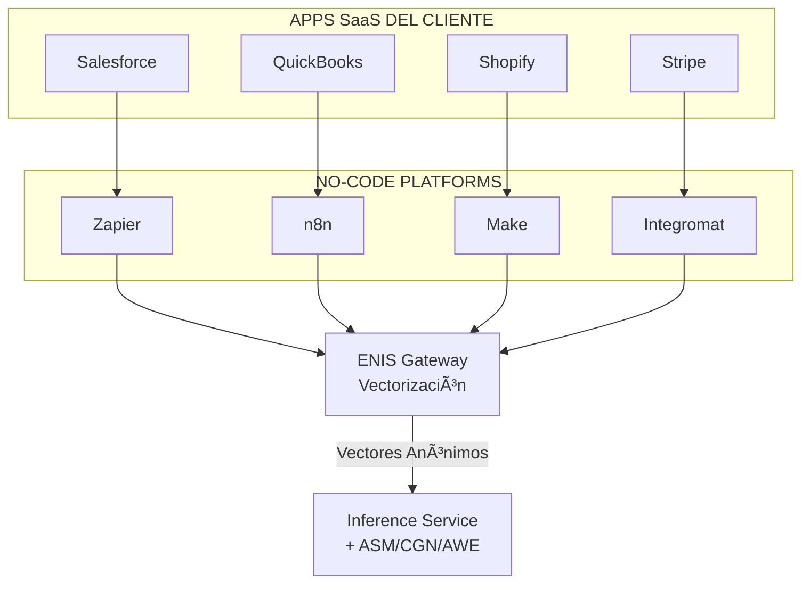
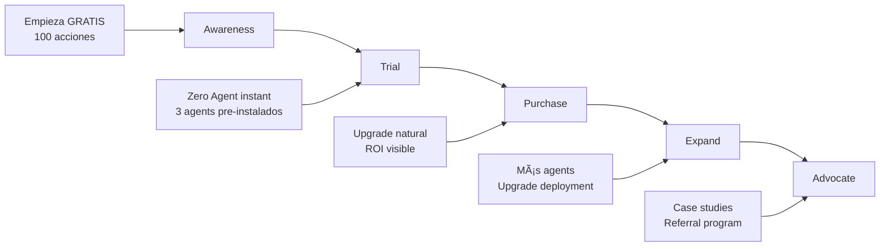

<!-- START doctoc generated TOC please keep comment here to allow auto update -->
<!-- DON'T EDIT THIS SECTION, INSTEAD RE-RUN doctoc TO UPDATE -->
Índice

- [🧠 ENIS: ENTERPRISE NEURAL INTELLIGENCE SYSTEMS](#%C3%B0%C5%B8%C2%A7%C2%A0-enis-enterprise-neural-intelligence-systems)
  - [INFORME COMPLETO INTEGRADO - BASE PARA DNA v3.0](#informe-completo-integrado---base-para-dna-v30)
  - [📋 ÍNDICE EJECUTIVO](#%C3%B0%C5%B8%E2%80%B9-%C3%83%C2%8Dndice-ejecutivo)
  - [1. VISIÓN Y CONCEPTO CORE](#1-visi%C3%83n-y-concepto-core)
    - [¿Qué es ENIS?](#%C3%82%C2%BFqu%C3%83-es-enis)
    - [El Problema que Resuelve](#el-problema-que-resuelve)
  - [2. ARQUITECTURA REVOLUCIONARIA](#2-arquitectura-revolucionaria)
    - [🏗️ Arquitectura Hybrid-by-Design](#%C3%B0%C5%B8%C2%8F%C3%AF%C2%B8%C2%8F-arquitectura-hybrid-by-design)
    - [🔐 Data-in-Place: El Diferenciador Clave](#%C3%B0%C5%B8%C2%90-data-in-place-el-diferenciador-clave)
  - [3. COMPONENTES FUNDAMENTALES](#3-componentes-fundamentales)
    - [📦 Arquitectura Simplificada: 3 Componentes Principales](#%C3%B0%C5%B8%C2%A6-arquitectura-simplificada-3-componentes-principales)
    - [🧩 Los 4 Macro-Módulos Nucleares](#%C3%B0%C5%B8%C2%A7-los-4-macro-m%C3%83%C2%B3dulos-nucleares)
    - [🧠 M5: Inference Service - El Cerebro Central](#%C3%B0%C5%B8%C2%A7%C2%A0-m5-inference-service---el-cerebro-central)
  - [4. NOPS: EL SISTEMA OPERATIVO](#4-nops-el-sistema-operativo)
    - [🔧 NOPS Kernel](#%C3%B0%C5%B8%C2%A7-nops-kernel)
  - [5. TIPOS DE EDGE AGENTS](#5-tipos-de-edge-agents)
    - [🪜 Clasificación por Autonomía](#%C3%B0%C5%B8%C2%AA%C5%93-clasificaci%C3%83%C2%B3n-por-autonom%C3%83%C2%ADa)
    - [💡 Shared Edge: El "Coworking de IA"](#%C3%B0%C5%B8%C2%A1-shared-edge-el-coworking-de-ia)
  - [5.1 ZERO-AGENT: LA REVOLUCIÓN NO-CODE](#51-zero-agent-la-revoluci%C3%83n-no-code)
    - [🎯 Zero-Agent con Integración No-Code (Zapier/n8n/Make)](#%C3%B0%C5%B8%C5%BD%C2%AF-zero-agent-con-integraci%C3%83%C2%B3n-no-code-zapiern8nmake)
    - [🧩 Arquitectura Operativa Zero-Agent](#%C3%B0%C5%B8%C2%A7-arquitectura-operativa-zero-agent)
    - [🔐 Características Clave del Zero-Agent](#%C3%B0%C5%B8%C2%90-caracter%C3%83%C2%ADsticas-clave-del-zero-agent)
    - [🛠️ Ejemplos de Uso Real Zero-Agent](#%C3%B0%C5%B8%E2%80%BA%C2%A0%C3%AF%C2%B8%C2%8F-ejemplos-de-uso-real-zero-agent)
    - [🚀 Propuesta de Valor Única Zero-Agent](#%C3%B0%C5%B8%C5%A1%E2%82%AC-propuesta-de-valor-%C3%83%C5%A1nica-zero-agent)
    - [📊 Modelo Económico Zero-Agent](#%C3%B0%C5%B8%C5%A0-modelo-econ%C3%83%C2%B3mico-zero-agent)
  - [6. AGENT MARKETPLACE](#6-agent-marketplace)
    - [🛍️ La "App Store" de Inteligencia Empresarial](#%C3%B0%C5%B8%E2%80%BA%C2%8D%C3%AF%C2%B8%C2%8F-la-app-store-de-inteligencia-empresarial)
    - [👨‍💻 Multi-Language Development](#%C3%B0%C5%B8%C2%A8%C3%A2%E2%82%AC%C2%8D%C3%B0%C5%B8%C2%BB-multi-language-development)
  - [7. MÓDULOS DE INFRAESTRUCTURA NOPS](#7-m%C3%83dulos-de-infraestructura-nops)
    - [📊 Agent Observability Module](#%C3%B0%C5%B8%C5%A0-agent-observability-module)
    - [⭐ Agent Scorecard Module](#%C3%A2%C2%AD%C2%90-agent-scorecard-module)
    - [💰 Agent Billing Module](#%C3%B0%C5%B8%C2%B0-agent-billing-module)
  - [8. GO-TO-MARKET Y PRICING](#8-go-to-market-y-pricing)
    - [🎯 Estrategia de Tiers](#%C3%B0%C5%B8%C5%BD%C2%AF-estrategia-de-tiers)
    - [🚀 Customer Journey](#%C3%B0%C5%B8%C5%A1%E2%82%AC-customer-journey)
  - [9. CASOS DE USO REALES](#9-casos-de-uso-reales)
    - [🏭 Manufacturing (300 empleados)](#%C3%B0%C5%B8%C2%8F%C2%AD-manufacturing-300-empleados)
    - [🏥 Healthcare Network (5 hospitales)](#%C3%B0%C5%B8%C2%8F-healthcare-network-5-hospitales)
    - [🏦 Banco Regional (500 empleados)](#%C3%B0%C5%B8%C2%8F%C2%A6-banco-regional-500-empleados)
  - [10. DIFERENCIADORES COMPETITIVOS](#10-diferenciadores-competitivos)
    - [🎯 ENIS vs Competencia](#%C3%B0%C5%B8%C5%BD%C2%AF-enis-vs-competencia)
    - [🚀 Los 5 Diferenciadores Únicos](#%C3%B0%C5%B8%C5%A1%E2%82%AC-los-5-diferenciadores-%C3%83%C5%A1nicos)
  - [📊 RESUMEN EJECUTIVO FINAL](#%C3%B0%C5%B8%C5%A0-resumen-ejecutivo-final)
  - [✅ DOCUMENTO BASE PARA DNA v3.0 COMPLETADO](#%C3%A2%C5%93-documento-base-para-dna-v30-completado)

<!-- END doctoc generated TOC please keep comment here to allow auto update -->

# 🧠 ENIS: ENTERPRISE NEURAL INTELLIGENCE SYSTEMS
## INFORME COMPLETO INTEGRADO - BASE PARA DNA v3.0

**Fecha:** 2025-07-04 04:40:30 UTC | **Usuario:** @andaon

## 📋 ÍNDICE EJECUTIVO

1. [Visión y Concepto Core](#1-visión-y-concepto-core)
2. [Arquitectura Revolucionaria](#2-arquitectura-revolucionaria)
3. [Componentes Fundamentales](#3-componentes-fundamentales)
4. [NOPS: El Sistema Operativo](#4-nops-el-sistema-operativo)
5. [Tipos de Edge Agents](#5-tipos-de-edge-agents)
   - [5.1 Zero-Agent: La Revolución No-Code](#51-zero-agent-la-revolución-no-code)
6. [Agent Marketplace](#6-agent-marketplace)
7. [Módulos de Infraestructura NOPS](#7-módulos-de-infraestructura-nops)
8. [Go-to-Market y Pricing](#8-go-to-market-y-pricing)
9. [Casos de Uso Reales](#9-casos-de-uso-reales)
10. [Diferenciadores Competitivos](#10-diferenciadores-competitivos)

---

## 1. VISIÓN Y CONCEPTO CORE

### ¿Qué es ENIS?

ENIS (Enterprise Neural Intelligence Systems) es la primera plataforma de superinteligencia organizacional del mundo que transforma empresas fragmentadas en entidades inteligentes unificadas.

```yaml
Visión: 
  "Every business runs on intelligence, not just software"

Misión: 
  "Democratizar la IA empresarial para todos los tamaños de negocio"

Concepto Core:
  - Sistema Operativo Cognitivo Empresarial
  - Convierte datos en decisiones autónomas
  - Respeta soberanía de datos (Data-in-Place)
  - Ecosistema extensible vía marketplace
```

### El Problema que Resuelve

```yaml
Dolor Universal:
  - Empresas tienen datos en silos
  - No pueden enviar datos a la nube (regulaciones)
  - Necesitan IA avanzada pero no tienen expertise
  - Sistemas desconectados no se comunican
  - Decisiones basadas en intuición, no datos

Solución ENIS:
  - Unifica todos los sistemas sin moverlos
  - IA procesa localmente (edge) o en nube segura
  - Plug-and-play con agentes especializados
  - Decisiones basadas en causalidad real
  - ROI medible en cada acción
```

---

## 2. ARQUITECTURA REVOLUCIONARIA

### 🏗️ Arquitectura Hybrid-by-Design

La innovación clave de ENIS es su arquitectura Data-in-Place que permite IA avanzada sin comprometer seguridad:

```mermaid
graph TB
    subgraph "🏢 TUS INSTALACIONES"
        A[Datos Sensibles 🔒<br/>NUNCA salen]
        B[Edge Agent<br/>Procesamiento local]
        C[NOPS Kernel<br/>+ Infrastructure]
    end
    
    subgraph "☁️ NUBE ENIS"
        D[Inteligencia IA<br/>Claude/GPT/etc]
        E[Platform Core<br/>ASM+CGN+AWE+SHIF]
        F[Inference Service]
    end
    
    A --> B
    B --> C
    C -->|Vectores Matemáticos<br/>Anónimos| D
    D --> E
    E --> F
    F -->|Insights<br/>Procesados| C
```



### 🔐 Data-in-Place: El Diferenciador Clave

```yaml
Cómo Funciona:
  1. Datos permanecen en tus servidores
  2. Edge Agent extrae "vectores anónimos"
  3. Vectores se procesan en nube con IA
  4. Insights regresan sin exponer datos
  5. Compliance automático (HIPAA, GDPR, SOX)

Ejemplo Hospital:
  - Datos pacientes: En servidor hospital
  - ENIS extrae: Patrones anónimos
  - Claude analiza: Tendencias readmisión
  - Hospital recibe: "30% riesgo readmisión"
  - Datos pacientes: NUNCA salieron
```

---

## 3. COMPONENTES FUNDAMENTALES

### 📦 Arquitectura Simplificada: 3 Componentes Principales

```yaml
1. NOPS-Enhanced Edge Agent (Local):
   - NOPS Kernel (runtime Go)
   - Infrastructure Modules nativos
   - Agent sandbox environment
   - Local data processing
   - Secure communication

2. ENIS Platform Core (Cloud):
   - 4 Macro-módulos integrados
   - Inference Service (cerebro)
   - Marketplace APIs
   - Billing & Analytics
   - Partner Management

3. Agent Marketplace (Ecosystem):
   - Public registry
   - Private storage
   - Developer portal
   - Certification system
   - Revenue distribution
```

### 🧩 Los 4 Macro-Módulos Nucleares

#### M1: ASM (Adaptive Schema Management)

```yaml
Función: "GPS para datos empresariales"
Capacidades:
  - Auto-descubre estructuras de datos
  - Mapea relaciones sin configuración
  - Adapta schemas en tiempo real
  - Unifica datos heterogéneos

Ejemplo Real:
  Input: "Conectar ERP + CRM + IoT"
  ASM: Descubre 847 tablas, mapea relaciones
  Output: Modelo unificado en 2 horas (vs 2 meses)
```

#### M2: CGN (Causal Graph Networks)

```yaml
Función: "Máquina del tiempo empresarial"
Capacidades:
  - Construye grafos causales automáticos
  - Predice impactos 6-24 meses adelante
  - Identifica causas reales (no correlaciones)
  - Simula escenarios what-if

Ejemplo Real:
  Input: "¿Qué pasa si subo precios 10%?"
  CGN: Analiza 10K variables
  Output: "Churn +3.2%, Revenue +6.8% año 1"
```

#### M3: AWE (Adaptive Workflow Evolution)

```yaml
Función: "Darwin para procesos empresariales"
Capacidades:
  - Workflows evolucionan automáticamente
  - Auto-optimización continua
  - Elimina bottlenecks sin intervención
  - Reconfigura sin downtime

Ejemplo Real:
  Proceso: Order fulfillment con delays
  AWE: Detecta step 3 causa 40% retrasos
  Fix: Re-routea automáticamente
  Resultado: 35% más rápido, zero downtime
```

#### M4: SHIF (Self-Healing Integration Fabric)

```yaml
Función: "Sistema inmune para integraciones"
Capacidades:
  - Auto-repara conexiones rotas
  - Adapta a cambios de API
  - Detecta anomalías en data flow
  - Rollback automático si falla

Ejemplo Real:
  Evento: "Salesforce API cambió"
  SHIF: Detecta, adapta, migra
  Downtime: 0 horas (vs 8-24 normal)
```

### 🧠 M5: Inference Service - El Cerebro Central

```yaml
Función: "Orquestador inteligente multi-modelo"

Capacidades:
  - Router inteligente entre LLMs
  - Cache semántico avanzado
  - Firewall cognitivo
  - Optimización costo/performance

Routing Intelligence:
  if (análisis_profundo && tokens > 50k):
      → Claude Opus 4
  elif (generación_masiva && speed_critical):
      → GPT-4.5 Turbo  
  elif (datos_sensibles && on_premise):
      → Mixtral local
  else:
      → best_cost_performance_model()
```

---

## 4. NOPS: EL SISTEMA OPERATIVO

### 🔧 NOPS Kernel

```yaml
¿Qué es NOPS?
  - Network Operating Platform System
  - "Android" para agentes empresariales
  - Vive EN los Edge Agents (no en cloud)
  - Gestiona ciclo de vida completo
  - Escrito en Go para máxima performance
```

#### Arquitectura NOPS:

```mermaid
graph TB
    subgraph "NOPS Kernel (Go)"
        A[Agent Runtime<br/>• Containers<br/>• Lifecycle]
        B[Security Mgr<br/>• Sandboxing<br/>• Permissions]
        C[Resource Ctrl<br/>• CPU/Memory<br/>• Auto-scaling]
        D[Agent Registry<br/>• Discovery<br/>• Versioning]
    end
    
    A --- B
    C --- D
```



```yaml
Por qué Go:
  - 10x más rápido que Python
  - Concurrencia nativa
  - Binarios seguros
  - Maneja miles de agentes
```

---

## 5. TIPOS DE EDGE AGENTS

### 🪜 Clasificación por Autonomía

| Nivel | Tipo | Deployment | Setup | Precio | Para quién |
|-------|------|------------|-------|--------|------------|
| 🟤 | Zero Agent | Cloud Gateway | 15 min | $99-199 | Startups 100% SaaS |
| 🟡 | Shared Edge | Multi-tenant | 2 hrs | $199-299 | PyMEs con presupuesto limitado |
| 🟢 | Edge Lite | Docker local | 1-2 días | $500-2K | Medianas con servidores |
| 🔵 | Enterprise Edge Cluster | K8s cluster | 1-2 sem | $5-25K | Grandes multi-site |
| 🔴 | Air-Gapped | 100% offline | 2-4 sem | $25-100K | Defensa/Banca/Gobierno |

### 💡 Shared Edge: El "Coworking de IA"

```yaml
Concepto Brillante:
  - Infraestructura compartida
  - Datos 100% aislados criptográficamente
  - Cada tenant = encryption key única
  - Hardware compartido, seguridad total
```

#### Arquitectura:

```mermaid
graph TB
    subgraph "SHARED EDGE INFRASTRUCTURE"
        A[Tenant A<br/>🔐Key1]
        B[Tenant B<br/>🔐Key2]
        C[Tenant C<br/>🔐Key3]
        D[Tenant D<br/>🔐Key4]
        E[Encrypted Data Partitions]
    end
    
    A --> E
    B --> E
    C --> E
    D --> E
```



```yaml
Beneficios PyMEs:
  - Enterprise features, SMB price
  - Compliance sin complejidad
  - Upgrade path natural
```

---

## 5.1 ZERO-AGENT: LA REVOLUCIÓN NO-CODE

### 🎯 Zero-Agent con Integración No-Code (Zapier/n8n/Make)

```yaml
Concepto:
  - Activación inmediata sin infraestructura
  - Aprovecha herramientas no-code existentes
  - 100% SaaS, zero DevOps required
  - Inteligencia ENIS en 15 minutos

Target Específico:
  - Microempresas sin equipo técnico
  - Startups con stack 100% cloud
  - Agencias digitales
  - Consultores independientes
```

### 🧩 Arquitectura Operativa Zero-Agent



### 🔐 Características Clave del Zero-Agent

| Característica | Descripción |
|----------------|-------------|
| 📦 100% SaaS | No requiere agentes, contenedores ni despliegues |
| 🔗 Conectores nativos | 6000+ apps via Zapier, 300+ via n8n |
| 📡 Webhooks seguros | Data → vectores anónimos → insights |
| 🧠 IA activada | ASM + CGN + AWE automáticamente |
| ⏱️ Time to value | < 15 minutos en producción |
| 💰 Costo | $99-199/mes todo incluido |

### 🛠️ Ejemplos de Uso Real Zero-Agent

```yaml
E-commerce con Zapier:
  Trigger: "Nueva orden en Shopify"
  Flow: 
    1. Zapier detecta orden
    2. Envía a ENIS Gateway
    3. CGN predice inventory needs
    4. AWE optimiza fulfillment
    5. Zapier ejecuta acciones
  Resultado: "35% reducción en stockouts"

SaaS B2B con n8n:
  Trigger: "Customer usage pattern"
  Flow:
    1. n8n monitorea Stripe + Intercom
    2. ENIS analiza churn signals
    3. CGN predice riesgo 90 días
    4. AWE genera retention plan
    5. n8n ejecuta campañas
  Resultado: "Churn reducido 28%"

Agencia Marketing con Make:
  Trigger: "Campaign performance data"
  Flow:
    1. Make colecta Google Ads + Analytics
    2. ENIS procesa performance
    3. ASM unifica métricas
    4. CGN predice ROI futuro
    5. Make ajusta budgets
  Resultado: "ROI mejorado 42%"
```

### 🚀 Propuesta de Valor Única Zero-Agent

```yaml
Para el Cliente:
  ✅ "Prueba ENIS en 15 minutos"
  ✅ "Sin riesgo técnico"
  ✅ "Sin inversión en infra"
  ✅ "Cancela cuando quieras"

Para ENIS:
  ✅ Onboarding frictionless
  ✅ Land-and-expand natural
  ✅ Viral growth potential
  ✅ Costo de servicio mínimo

Upgrade Path Natural:
  Zero-Agent → Shared Edge → Edge Lite
  $99 → $299 → $999+
```

### 📊 Modelo Económico Zero-Agent

```yaml
Costo para ENIS:
  - ENIS Gateway hosting: $10/cliente
  - API calls no-code: $5-15/mes
  - Compute vectorización: $20/mes
  - Total: ~$45/cliente

Precio al cliente: $99-199/mes
Margen bruto: 54-78%

Escalabilidad:
  - 1 cliente: $99/mes
  - 100 clientes: $9.9K/mes
  - 1000 clientes: $99K/mes
  - CAC: ~$50 (ads + onboarding)
  - LTV: $2,400 (24 meses avg)
```

---

## 6. AGENT MARKETPLACE

### 🛍️ La "App Store" de Inteligencia Empresarial

```yaml
Concepto:
  - Ecosistema abierto de agentes
  - Developers publican y monetizan
  - Empresas compran e instalan
  - Revenue sharing 70/30
  - Multi-language support

Categorías:
  📦 Por Industria:
     - Manufacturing (50+ agentes)
     - Healthcare (30+ agentes)
     - Financial (40+ agentes)
     - Retail (60+ agentes)
  
  📦 Por Función:
     - Sales & Marketing
     - Operations
     - Customer Service
     - Finance & Accounting
     - HR & Talent

Ejemplos de Agentes:
  "Shopify Order Optimizer" - $99/mes
    ⭐ 4.8/5 (312 reviews)
    ROI: 400% average
    
  "Manufacturing Defect Predictor" - $499/mes
    ⭐ 4.9/5 (156 reviews)
    Reduce waste: 30%
```

### 👨‍💻 Multi-Language Development

```yaml
Lenguajes Soportados:
  Python 🐍: Data science, ML (25M devs)
  Node.js 🟢: APIs, real-time (12M devs)
  Go 🐹: High performance (2M devs)
  Java ☕: Enterprise (10M devs)
  C#/.NET 🔷: Microsoft ecosystem (8M devs)

Total Addressable Developers: 40M+
```

---

## 7. MÓDULOS DE INFRAESTRUCTURA NOPS

### 📊 Agent Observability Module

```yaml
Función: "Dashboard local en tiempo real"

Features:
  - URL: http://edge-agent:8080/enis/dashboard
  - Zero latencia (todo local)
  - Métricas por agente
  - Histórico 90 días
  - Exportable para auditorías

Vista Cliente:
  📊 Manufacturing Quality Agent v2.1.0
  ✅ Status: Running (99.8% uptime)
  âš¡ Response: 45ms avg
  💾 Memory: 2.1GB/4GB
  🔄 Procesados: 1,247 items hoy
  📈 Tendencia: ↗️ 15% más eficiente
```

### ⭐ Agent Scorecard Module

```yaml
Sistema de Reputación Dual:

PRE-INSTALACIÓN (Marketplace):
  🌐 Healthcare Workflow Agent
  ⭐ 4.8/5 (156 empresas)
  ✅ 99.2% uptime global
  💰 ROI promedio: 280%
  🏆 HIPAA Certified

POST-INSTALACIÓN (Tu ambiente):
  🏢 Healthcare Workflow Agent
  ⭐ 4.9/5 (tu experiencia)
  ✅ 99.7% uptime LOCAL
  💰 TU ROI: $45K/mes
  🎯 Accuracy: 94.2%
```

### 💰 Agent Billing Module

```yaml
Modelos Flexibles:

TRADICIONAL:
  - Flat fee mensual
  - Predecible
  - Simple

REVOLUCIONARIO Pay-per-Use:
  - $0.10 por predicción
  - $0.05 por reporte
  - $1.00 por optimización
  - FREE: Primeras 100 acciones

Dashboard Billing Real-Time:
  💰 October 2025 - Manufacturing Suite
  ├── 2,347 predictions × $0.10 = $234.70
  ├── 89 reports × $0.05 = $4.45
  ├── 12 optimizations × $1.00 = $12.00
  ├── Volume discount: -$37.67 (15%)
  └── TOTAL: $213.48 (vs $500 flat)
```

---

## 8. GO-TO-MARKET Y PRICING

### 🎯 Estrategia de Tiers

```yaml
Tier 1 - SMB ($99-499/mes):
  - Target: 10-100 empleados
  - Setup: 5 minutos - 2 horas
  - Agents: 5 incluidos
  - Support: Community + docs
  - Deployment: Zero Agent o Shared Edge

Tier 2 - Professional ($2K-15K/mes):
  - Target: 100-500 empleados
  - Setup: 1-5 días
  - Agents: 15 incluidos + custom
  - Support: Priority + SLA
  - Deployment: Edge Lite

Tier 3 - Enterprise ($50K-500K/mes):
  - Target: 500+ empleados
  - Setup: 1-4 semanas
  - Agents: Unlimited + private
  - Support: Dedicated + 24/7
  - Deployment: Cluster o Air-gapped
```

### 🚀 Customer Journey



```yaml
Awareness → Trial → Purchase → Expand → Advocate

1. Awareness:
   - "Empieza GRATIS - 100 acciones"
   - Demo en 5 minutos
   - ROI calculator online

2. Trial:
   - Zero Agent instant
   - 3 agents pre-instalados
   - Dashboard desde día 1

3. Purchase:
   - Upgrade natural
   - Pay-per-use o flat
   - ROI visible

4. Expand:
   - Más agents del marketplace
   - Upgrade deployment type
   - Custom development

5. Advocate:
   - Case studies
   - Referral program
   - Conference speakers
```

---

## 9. CASOS DE USO REALES

### 🏭 Manufacturing (300 empleados)

```yaml
Situación:
  - Supply chain impredecible
  - Defectos quality 3.2%
  - Inventory turnover lento

Solución ENIS:
  - Tier 2 + Edge Lite
  - 8 agents especializados
  - CGN para predicciones

Resultados (14 meses):
  - Inventory: -35%
  - Defectos: -67%
  - Savings: $2.1M/año
  - ROI: 340%
```

### 🏥 Healthcare Network (5 hospitales)

```yaml
Situación:
  - Patient flow caótico
  - HIPAA compliance manual
  - Readmisiones 18%

Solución ENIS:
  - Tier 3 + Edge Cluster
  - Air-gapped para datos
  - 12 healthcare agents

Resultados (12 meses):
  - Efficiency: +20%
  - Readmisiones: -31%
  - Compliance: 100% auto
  - ROI: 280%
```

### 🏦 Banco Regional (500 empleados)

```yaml
Situación:
  - Fraud detection 73%
  - SOX compliance costoso
  - Decisiones lentas

Solución ENIS:
  - Tier 3 Air-gapped
  - 15 financial agents
  - Real-time analytics

Resultados (18 meses):
  - Fraud accuracy: 95%
  - Compliance cost: -60%
  - Decision speed: 10x
  - ROI: 890%
```

---

## 10. DIFERENCIADORES COMPETITIVOS

### 🎯 ENIS vs Competencia

| Aspecto | ENIS | Competencia Típica |
|---------|------|-------------------|
| Data Privacy | Data-in-Place (nunca sale) | Upload a cloud |
| AI Models | Multi-modelo inteligente | Single vendor lock |
| Deployment | 5 opciones flexibles | Cloud-only o on-prem |
| Extensibility | Marketplace 1000+ agents | Cerrado |
| Developer Base | 40M (multi-language) | 3M (single language) |
| Observability | Nativo, local, real-time | Add-on costoso |
| Billing | Pay-per-use + flat | Solo licencias |
| ROI Tracking | Automático por acción | Manual/estimado |
| Arquitectura | 3 componentes simples | 10+ componentes |
| Time to Value | 15 min - 2 semanas | 3-6 meses |

### 🚀 Los 5 Diferenciadores Únicos

```yaml
1. Data-in-Place Architecture:
   - Único que garantiza data sovereignty
   - Compliance automático
   - IA avanzada sin mover datos

2. NOPS Infrastructure Modules:
   - Observability nativa
   - Scorecard transparente
   - Billing flexible

3. Multi-Model Intelligence:
   - Claude, GPT, local, custom
   - Router inteligente
   - Optimización automática

4. Agent Marketplace Ecosystem:
   - 40M developers potenciales
   - Revenue sharing 70/30
   - Quality auto-regulada

5. Causal AI (CGN):
   - Predice 6-24 meses
   - Entiende causas reales
   - What-if scenarios
```

---

## 📊 RESUMEN EJECUTIVO FINAL

```yaml
ENIS es:
  ✅ Sistema Operativo Cognitivo (no solo software)
  ✅ Data-in-Place revolucionario (privacidad total)
  ✅ 5 deployment options (Zero to Air-gapped)
  ✅ Marketplace extensible (40M developers)
  ✅ NOPS modules nativos (transparencia total)
  ✅ Pay-per-use democratizado (empieza gratis)
  ✅ ROI medible y demostrable (avg 340%)

La Visión:
  "Convertir CADA empresa en una superinteligencia
   que predice el futuro, optimiza el presente,
   y protege sus datos, mientras crece con un
   ecosistema infinito de agentes especializados"
```

---

## ✅ DOCUMENTO BASE PARA DNA v3.0 COMPLETADO

Este informe integra TODOS los elementos de los textos compartidos, incluyendo la sección expandida de Zero-Agent con integración no-code, reestructurados de manera lógica y completa, listo para ser la base del DNA del proyecto ENIS.

**Siguiente paso recomendado:** Usar este informe como referencia para actualizar cada sección del DNA v3.0 con información precisa y consistente.
