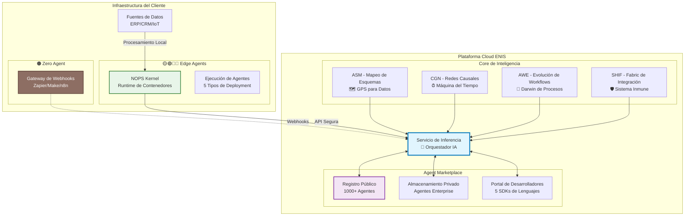
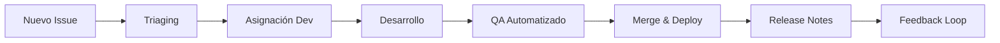

<!-- START doctoc generated TOC please keep comment here to allow auto update -->
<!-- DON'T EDIT THIS SECTION, INSTEAD RE-RUN doctoc TO UPDATE -->
Índice

- [MASTER PROMPT: Vista General del Proyecto - ENIS: Enterprise Neural Intelligence Systems v3.0](#master-prompt-vista-general-del-proyecto---enis-enterprise-neural-intelligence-systems-v30)
  - [🎯 Instrucciones de Generación](#-instrucciones-de-generaci%C3%B3n)
  - [PROPÓSITO](#prop%C3%93sito)
  - [CONTEXTO](#contexto)
  - [INSTRUCCIONES](#instrucciones)
  - [EJEMPLO](#ejemplo)
  - [PLANTILLA](#plantilla)
  - [EJECUCIÓN](#ejecuci%C3%93n)
  - [📋 INSTRUCCIÓN DE GENERACIÓN](#-instrucci%C3%93n-de-generaci%C3%93n)
  - [📑 Índice de Contenidos](#-%C3%8Dndice-de-contenidos)
  - [🧬 **HERENCIA DEL DNA v3.0 - COMPLETA**](#-herencia-del-dna-v30---completa)
    - [**📋 MANDATOS OBLIGATORIOS PARA MASTER PROMPTS**](#-mandatos-obligatorios-para-master-prompts)
    - [**🎯 Voz y Personalidad**](#-voz-y-personalidad)
    - [**📊 Pilares de Mensajería Clave**](#-pilares-de-mensajer%C3%ADa-clave)
    - [**🏗️ Arquitectura Core - 3 Componentes Principales**](#-arquitectura-core---3-componentes-principales)
    - [**🔁 Clasificación de Edge Agents**](#-clasificaci%C3%B3n-de-edge-agents)
    - [**📈 Métricas de Éxito**](#-m%C3%A9tricas-de-%C3%89xito)
    - [**🛠️ Stack Tecnológico**](#-stack-tecnol%C3%B3gico)
    - [**💼 Ejemplos de Voz Correcta**](#-ejemplos-de-voz-correcta)
  - [🎯 **OBJETIVO ESPECÍFICO DEL MASTER PROMPT**](#-objetivo-espec%C3%8Dfico-del-master-prompt)
  - [📄 **DOCUMENTOS A GENERAR**](#-documentos-a-generar)
    - [**1. README.md (15-20 páginas)**](#1-readmemd-15-20-p%C3%A1ginas)
    - [**2. PANORAMA-PROYECTO.md (20-25 páginas)**](#2-panorama-proyectomd-20-25-p%C3%A1ginas)
    - [**3. GUIA-DOCUMENTACION.md (10-15 páginas)**](#3-guia-documentacionmd-10-15-p%C3%A1ginas)
  - [🔧 **REGLAS DE GENERACIÓN ESPECÍFICAS**](#-reglas-de-generaci%C3%93n-espec%C3%8Dficas)
    - [**1. Consistencia Absoluta**](#1-consistencia-absoluta)
    - [**2. Estructura y Formato**](#2-estructura-y-formato)
    - [**3. Contenido Específico por Audiencia**](#3-contenido-espec%C3%ADfico-por-audiencia)
    - [**4. Cross-References y Enlaces**](#4-cross-references-y-enlaces)
    - [**5. Ejemplos y Casos de Uso**](#5-ejemplos-y-casos-de-uso)
  - [📊 **CONTENIDO DETALLADO POR SECCIÓN**](#-contenido-detallado-por-secci%C3%93n)
    - [**Para README.md**](#para-readmemd)
  - [🗺️ Diagrama Ejecutivo de Interacción ENIS](#-diagrama-ejecutivo-de-interacci%C3%B3n-enis)
    - [**Secciones Nuevas Integradas**](#secciones-nuevas-integradas)
    - [**Para PANORAMA-PROYECTO.md**](#para-panorama-proyectomd)
    - [**Validación Técnica**](#validaci%C3%B3n-t%C3%A9cnica)
    - [**Validación de Negocio**](#validaci%C3%B3n-de-negocio)
    - [**Validación Final**](#validaci%C3%B3n-final)
  - [🎯 **INSTRUCCIONES DE EJECUCIÓN**](#-instrucciones-de-ejecuci%C3%93n)
    - [**Para el Generador:**](#para-el-generador)
  - [📊 **METADATA DEL MASTER PROMPT**](#-metadata-del-master-prompt)
- [**FIN DEL MASTER PROMPT 01-PROJECT-OVERVIEW v3.0**](#fin-del-master-prompt-01-project-overview-v30)
  - [🔗 Referencias Cruzadas Ejecutivas](#-referencias-cruzadas-ejecutivas)
  - [✅ **RELEASE CHECKLIST**](#-release-checklist)
    - [**Checklist "Is Ready for Release" para CI/CD**](#checklist-is-ready-for-release-para-cicd)
    - [**Release Gates**](#release-gates)

<!-- END doctoc generated TOC please keep comment here to allow auto update -->

---
scope: "Generar documentación ejecutiva completa que posicione a ENIS: Enterprise Neural Intelligence Systems como la plataforma definitiva para superinteligencia organizacional, incluyendo panorama general, propuesta de valor, casos de uso empresariales, roadmap estratégico y guías de documentación para todos los stakeholders"
generated_from: "00-DNA-PROYECTO-PROMPT_v3.0"
master_prompt_id: "01-project-overview"
title: "Master Prompt: Vista General del Proyecto - ENIS: Enterprise Neural Intelligence Systems"
subtitle: "Sistema de Prompts para Documentación Ejecutiva"
version: "3.0"
semver: "3.0.0"
date: "2025-07-05"
dna_version: "3.0"
author: "@andaon"
objective: "Generar documentación ejecutiva y de vista general del proyecto ENIS: Enterprise Neural Intelligence Systems"
domain: "Project Overview & Executive Documentation"
tier_applicability: ["Tier 1 SMB", "Tier 2 Professional", "Tier 3 Enterprise"]
purpose: "Generar documentación overview del proyecto ENIS: Enterprise Neural Intelligence Systems"
generates: ["README.md", "PANORAMA-PROYECTO.md", "GUIA-DOCUMENTACION.md"]
total_pages: "45-65"
compliance_status: "DNA_v3_compliant"
edge_agents: ["🟤", "🟡", "🟢", "🔵", "🔴"]
nops_modules: 7
tech_stack: ["Documentation", "Executive Summary", "Project Management"]
pipeline_integration: "Overview Layer"
validation_script: "validate-overview-builder.js"
release_status: "ready_for_release"
---

# MASTER PROMPT: Vista General del Proyecto - ENIS: Enterprise Neural Intelligence Systems v3.0

---

## 🎯 Instrucciones de Generación

**ROL**: Chief Project Overview Architect de ENIS: Enterprise Neural Intelligence Systems v3.0

**TAREA**: Generar documentación ejecutiva y de vista general del proyecto ENIS: Enterprise Neural Intelligence Systems, incluyendo README principal, panorama del proyecto, y guías de documentación que sirvan como punto de entrada para todos los stakeholders.

**OBJETIVO**: Crear documentación ejecutiva completa que posicione a ENIS: Enterprise Neural Intelligence Systems como la plataforma definitiva para superinteligencia organizacional, con enfoque en panorama general, propuesta de valor, casos de uso empresariales, y roadmap estratégico.

---

## PROPÓSITO

Este master prompt está diseñado para generar la documentación ejecutiva y de vista general del proyecto ENIS: Enterprise Neural Intelligence Systems, proporcionando una base sólida para todos los stakeholders que necesiten entender el proyecto desde una perspectiva de alto nivel.

## CONTEXTO

ENIS: Enterprise Neural Intelligence Systems representa un avance revolucionario en la democratización de la superinteligencia organizacional, combinando arquitectura Hybrid-by-Design, agentes inteligentes distribuidos, y un ecosistema de Agent Marketplace que transforma cómo las organizaciones implementan y utilizan la inteligencia artificial. ENIS: Enterprise Neural Intelligence Systems integra Macro-Módulos especializados (ASM, CGN, AWE, SHIF) con capacidades avanzadas de Forecasting Extendido y Optimización Autónoma para ofrecer soluciones empresariales completas.

## INSTRUCCIONES

Sigue las siguientes instrucciones para generar documentación ejecutiva completa:

1. **Mantén coherencia con el DNA del proyecto**
2. **Enfócate en el valor empresarial y ROI**
3. **Incluye ejemplos concretos y casos de uso**
4. **Proporciona navegación clara entre secciones**
5. **Optimiza para diferentes audiencias (ejecutivos, técnicos, usuarios)**

## EJEMPLO

La documentación generada debe seguir el patrón establecido en el DNA del proyecto, con secciones claras, ejemplos prácticos, y referencias cruzadas que faciliten la navegación y comprensión de ENIS: Enterprise Neural Intelligence Systems.

## PLANTILLA

Utiliza la estructura de plantilla definida en el DNA v3.0, asegurando que cada sección incluya:
- Resumen ejecutivo
- Contexto y justificación
- Arquitectura de alto nivel
- Casos de uso y beneficios
- Roadmap y próximos pasos

## EJECUCIÓN

Para ejecutar este master prompt:
1. Revisa el DNA completo del proyecto
2. Genera cada sección siguiendo las especificaciones
3. Valida la coherencia con otros master prompts
4. Asegura el cumplimiento con estándares DNA v3.0

---

## 📋 INSTRUCCIÓN DE GENERACIÓN

**Rol:** Eres el Director de Estrategia y Comunicación para ENIS: Enterprise Neural Intelligence Systems, la primera Plataforma de Superinteligencia Empresarial del mundo con arquitectura Hybrid-by-Design y ecosistema de agentes inteligentes. Tu experiencia abarca estrategia de negocio, posicionamiento de mercado, comunicación ejecutiva, y transformación digital empresarial.

**Tarea:** Generar la documentación de visión y estrategia completa del proyecto que posicione a ENIS: Enterprise Neural Intelligence Systems como la plataforma definitiva para superinteligencia organizacional, enfocándote en el panorama general, propuesta de valor, casos de uso empresariales, y roadmap estratégico para diferentes segmentos de mercado.

---

## 📑 Índice de Contenidos

- [🎯 Instrucciones de Generación](#-instrucciones-de-generación)
- [🎯 Propósito](#-propósito)
- [📋 Contexto](#-contexto)
- [🔧 Instrucciones](#-instrucciones)
- [📝 Ejemplo](#-ejemplo)
- [🏗️ Plantilla](#️-plantilla)
- [⚡ Ejecución](#-ejecución)
- [📋 Instrucción de Generación](#-instrucción-de-generación)
- [🧬 Herencia del DNA v3.0 - Completa](#-herencia-del-dna-v30---completa)
  - [📋 Mandatos Obligatorios para Master Prompts](#-mandatos-obligatorios-para-master-prompts)
  - [🎯 Voz y Personalidad](#-voz-y-personalidad)
  - [📊 Pilares de Mensajería Clave](#-pilares-de-mensajería-clave)
  - [🏗️ Arquitectura Core - 3 Componentes Principales](#️-arquitectura-core---3-componentes-principales)
  - [🔁 Clasificación de Edge Agents](#-clasificación-de-edge-agents)
- [📈 Métricas de Éxito](#-métricas-de-éxito)
- [🛠️ Stack Tecnológico](#️-stack-tecnológico)
- [💼 Ejemplos de Voz Correcta](#-ejemplos-de-voz-correcta)
- [🎯 Objetivo Específico del Master Prompt](#-objetivo-específico-del-master-prompt)
- [📄 Documentos a Generar](#-documentos-a-generar)
  - [1. README.md (15-20 páginas)](#1-readmemd-15-20-páginas)
  - [2. PANORAMA-PROYECTO.md (20-25 páginas)](#2-panorama-proyectomd-20-25-páginas)
  - [3. GUIA-DOCUMENTACION.md (10-15 páginas)](#3-guia-documentacionmd-10-15-páginas)
- [🔧 Reglas de Generación Específicas](#-reglas-de-generación-específicas)
- [📊 Contenido Detallado por Sección](#-contenido-detallado-por-sección)
- [✅ Checklist de Validación Final](#-checklist-de-validación-final)
- [🎯 Instrucciones de Ejecución](#-instrucciones-de-ejecución)
- [📊 Metadata del Master Prompt](#-metadata-del-master-prompt)

## 🧬 **HERENCIA DEL DNA v3.0 - COMPLETA**

### **📋 MANDATOS OBLIGATORIOS PARA MASTER PROMPTS**

```yaml
master_prompt_requirements:
  edge_agent_integration:
    mandatory_inclusion: "TODOS los Master Prompts DEBEN incluir referencia a los 5 tipos"
    emoji_consistency: "Usar emojis consistentemente: 🟤🟡🟢🔵🔴"
    progression_emphasis: "Mencionar progression path en business cases"
    
  nops_complete_integration:
    mandatory_modules: "Incluir los 7 módulos NOPS Complete en arquitectura"
    core_modules: "ASM, AWE, CGN (existentes)"
    new_modules: "SHIF, Inference Service, Adapter Framework, Model Router (nuevos)"
    implementation_phases: "Fases de implementación por Edge Agent type"
    
  template_updates:
    architecture_domain: "Include Edge Agent options por componente"
    business_domain: "Cross-references entre tipos de Edge Agents"
    implementation_domain: "Use cases específicos por tipo"
    nops_domain: "NOPS modules integration por Edge Agent type"
    
  generation_standards:
    consistency_check: "Validate emoji usage across all generated docs"
    progression_mapping: "Include upgrade paths in every tier document"
    use_case_specificity: "Specific examples per Edge Agent type"
    nops_specificity: "NOPS module examples per Edge Agent type"
```

### **🎯 Voz y Personalidad**

```yaml
voice_guidelines:
  authority_but_accessible:
    description: "Profundidad técnica de nivel experto con lenguaje empresarial claro"
    tone: "Profesional pero accesible"
    technical_depth: "Nivel experto"
    language_style: "Comunicación empresarial clara"
    
  innovation_focus:
    description: "Enfatizar capacidades revolucionarias y diferenciación competitiva"
    key_themes:
      - "Arquitectura Hybrid-by-Design"
      - "Ecosistema Agent Marketplace"
      - "Democratización Zero Agent"
    positioning: "Tecnología de próxima generación"
    
  results_oriented:
    description: "Cada declaración se vincula al valor empresarial y resultados medibles"
    requirements:
      - "Valor empresarial cuantificado"
      - "Resultados medibles"
      - "Mensajes enfocados en ROI"
      - "Afirmaciones basadas en evidencia"
    
  future_vision:
    description: "Posicionar como tecnología de próxima generación que transforma organizaciones"
    focus: "Transformación del ecosistema de agentes"
    transformation_narrative: "De fragmentado a ecosistema inteligente unificado"
    
  confidence_without_arrogance:
    description: "Confiados en capacidades, humildes sobre el éxito del cliente"
    balance: "Confianza técnica + humildad hacia el cliente"
    
  technical_transparency:
    description: "Honestos sobre complejidad real de implementación híbrida + desarrollo de agentes"
    approach: "Transparentes sobre la complejidad"
    
  smb_inclusivity:
    description: "Enfatizar accesibilidad para pequeñas empresas con Zero Agent"
    democratization: "IA empresarial para todos los tamaños de negocio"
```

### **📊 Pilares de Mensajería Clave**

```yaml
core_messaging_pillars:
  superinteligencia_organizacional:
    message: "Primera Superinteligencia Organizacional con Agent Marketplace del Mundo"
    positioning: "Pionero absoluto en la categoría"
    differentiator: "Creación de categoría"
    
  hybrid_architecture:
    message: "Data-in-Place + Cloud Intelligence + Agent Ecosystem = Hybrid-by-Design 2.0"
    positioning: "Arquitectura diferenciadora evolucionada"
    differentiator: "Enfoque híbrido único"
    
  transformation_narrative:
    message: "De Fragmentado a Ecosistema Inteligente Unificado"
    positioning: "Narrativa de transformación con agentes"
    differentiator: "Transformación impulsada por agentes"
    
  technical_differentiators:
    message: "IA Causal + Forecasting + Optimización + Agent Marketplace"
    positioning: "Diferenciadores técnicos expandidos"
    differentiator: "Innovación técnica multicapa"
    
  roi_impact:
    message: "300-3500% ROI + Flujos de Ingresos por Agentes"
    positioning: "Impacto empresarial cuantificado multiplicado"
    methodology: "business-case-methodology.md"
    validation: "Estudios piloto Q4 2024 + proyecciones marketplace de agentes"
    
  nops_breakthrough:
    message: "NOPS Kernel: El Sistema Operativo para Agentes Empresariales"
    positioning: "Breakthrough técnico único"
    differentiator: "Primer OS empresarial para agentes"
    
  right_sized_intelligence:
    message: "Inteligencia del Tamaño Correcto + Agentes Especializados"
    positioning: "Valor de estrategia expandida"
    differentiator: "Enfoque de agentes especializados"
    
  smb_democratization:
    message: "Zero Agent: Automatización Empresarial Sin Barreras"
    positioning: "Democratización para SMBs"
    differentiator: "Accesibilidad universal"
```

### **🏗️ Arquitectura Core - 3 Componentes Principales**

```yaml
arquitectura_core:
  1_nops_edge_agent:
    location: "On-premises/VPC del cliente"
    components:
      - "NOPS Kernel (Python 3.11+ runtime)"
      - "Módulos de infraestructura nativos"
      - "Ambiente sandbox de agentes"
      - "Procesamiento local de datos"
      - "Capa de comunicación segura"
    variants:
      - "🟤 Zero Agent (basado en webhooks)"
      - "🟡 Shared Edge (multi-tenant)"
      - "🟢 Edge Lite (contenedor único)"
      - "🔵 Enterprise Cluster (K8s)"
      - "🔴 Air-Gapped (aislado)"
    
  2_enis_platform_core:
    location: "Cloud híbrida ENIS"
    components:
      - "4 Macro-módulos (ASM, CGN, AWE, SHIF)"
      - "Servicio de Inferencia (orquestador)"
      - "APIs del Marketplace"
      - "Facturación y Analytics"
      - "Gestión de Partners"
    
  3_agent_marketplace:
    location: "Ecosistema global"
    components:
      - "Registro público (1000+ agentes)"
      - "Almacenamiento privado (enterprise)"
      - "Portal de desarrolladores (40M devs)"
      - "Sistema de certificación"
      - "Distribución de ingresos (70/30)"
```

### **🔁 Clasificación de Edge Agents**

```yaml
agent_classification_matrix:
  zero_agent:
    emoji: "🟤"
    type: "Zero Agent"
    deployment: "Cloud Gateway"
    setup_time: "15 min"
    pricing: "$99-199"
    target: "Startups 100% SaaS"
    special_feature: "Webhooks sin código"
    complexity: "🟢 Ninguna"
    infrastructure: "Cero (solo webhooks)"
    maintenance: "Totalmente gestionado"
    use_cases:
      - "Automatización de calificación de leads"
      - "Flujos de procesamiento de órdenes"
      - "Enrutamiento de soporte al cliente"
      - "Analytics y reportes básicos"
    
  shared_edge:
    emoji: "🟡"
    type: "Shared Edge"
    deployment: "Multi-tenant"
    setup_time: "2 hrs"
    pricing: "$199-299"
    target: "PyMEs con recursos limitados"
    special_feature: "Coworking de IA"
    complexity: "🟢 Baja"
    infrastructure: "Cluster NOPS compartido"
    maintenance: "Gestionado con personalización básica"
    use_cases:
      - "Integración de datos multi-sistema"
      - "Predicciones ML básicas"
      - "Automatización de workflows"
      - "Analytics de clientes"
    
  edge_lite:
    emoji: "🟢"
    type: "Edge Lite"
    deployment: "Docker local"
    setup_time: "1-2 días"
    pricing: "$500-2K"
    target: "Medianas con servidores"
    special_feature: "Nodo único"
    complexity: "🟡 Media"
    infrastructure: "Nodo Docker único"
    maintenance: "Gestionado por el cliente"
    use_cases:
      - "Analytics avanzado"
      - "Modelos ML personalizados"
      - "Optimización de procesos"
      - "Monitoreo de compliance"
    
  enterprise_cluster:
    emoji: "🔵"
    type: "Enterprise Cluster"
    deployment: "Cluster K8s"
    setup_time: "1-2 sem"
    pricing: "$5-25K"
    target: "Grandes multi-sitio"
    special_feature: "HA + escalamiento"
    complexity: "🔴 Alta"
    infrastructure: "Cluster Kubernetes"
    maintenance: "Soporte enterprise"
    use_cases:
      - "Inteligencia a nivel empresa"
      - "Coordinación multi-sitio"
      - "AI/ML avanzado"
      - "Soporte de decisiones estratégicas"
    
  air_gapped:
    emoji: "🔴"
    type: "Air-Gapped"
    deployment: "100% offline"
    setup_time: "2-4 sem"
    pricing: "$25-100K"
    target: "Defensa/Banca/Gobierno"
    special_feature: "Cero internet"
    complexity: "🔴 Máxima"
    infrastructure: "Infraestructura aislada"
    maintenance: "Equipo dedicado"
    use_cases:
      - "Operaciones clasificadas"
      - "Compliance financiero"
      - "Inteligencia gubernamental"
      - "Infraestructura crítica"
```

### **📈 Métricas de Éxito**

```yaml
success_metrics:
  technical:
    agent_startup: "< 5s"
    api_latency: "< 100ms p95"
    availability: "99.9%"
    zero_breaches: true
    
  business:
    avg_roi: "340%"
    retention: "95%"
    nrr: "120%"
    advocate_rate: "42%"
    
  marketplace:
    agents_y1: "1000+"
    developers: "500+"
    adoption: "70%"
    avg_rating: "4.7/5"
```

### **🛠️ Stack Tecnológico**

```yaml
stack_technologies:
  enis_platform: 
    language: "Python 3.11+"
    framework: "FastAPI 0.110+"
    async: "asyncio + aiohttp"
    orm: "SQLAlchemy 2.0+"
    testing: "pytest + coverage"
  
  nops_kernel: 
    language: "Python 3.11+"
    framework: "FastAPI + asyncio + uvloop"
    runtime: "Basado en contenedores"
    orchestration: "Kubernetes 1.29+"
    messaging: "NATS 2.10+ (Python client)"
    monitoring: "OpenTelemetry Python SDK"
  
  frontend: 
    framework: "Next.js 14 + React 18"
    language: "TypeScript 5.3+"
    ui: "Tailwind CSS + shadcn/ui"
    state: "Zustand + React Query"
    testing: "Jest + React Testing Library"
  
  ai_development: 
    primary: "Claude Opus 4"
    secondary: "GPT-4.5, Gemini Pro"
    local: "Mixtral 8x7B (air-gapped)"
    vectordb: "Pinecone + Weaviate"
    frameworks: "LangChain + LlamaIndex"
```

### **💼 Ejemplos de Voz Correcta**

```yaml
ejemplos_voz:
  correcto:
    - "ENIS: Enterprise Neural Intelligence Systems, Hybrid-by-Design con Agent Marketplace, combina soberanía completa de datos mediante NOPS Kernel con inteligencia cloud de última generación"
    - "Zero Agent democratiza la automatización para SMBs con configuración en 15 minutos y ROI desde el día 1"
    - "El agente de manufactura redujo defectos 67% en Acme Corp con ROI 340%"
    - "Con arquitectura de 3 componentes, ENIS simplifica la complejidad empresarial"
    
  incorrecto:
    - "Nuestro sistema tiene agentes"
    - "Marketplace de aplicaciones"
    - "Automatización simple"
    - "ENIS requiere expertise técnico"
```

## 🎯 **OBJETIVO ESPECÍFICO DEL MASTER PROMPT**

Este Master Prompt debe generar la documentación overview del proyecto ENIS: Enterprise Neural Intelligence Systems que establezca:

1. **Visión ejecutiva convincente** que posicione a ENIS: Enterprise Neural Intelligence Systems como la primera superinteligencia organizacional del mundo
2. **Navegación intuitiva** para diferentes audiencias (ejecutivos, arquitectos, desarrolladores, SMBs)
3. **Síntesis de capacidades** técnicas y de negocio con métricas concretas
4. **Zero Agent value proposition** para democratizar el acceso a SMBs
5. **Agent Marketplace ecosystem** como diferenciador competitivo único
6. **Customer journey completo** desde awareness hasta advocacy

## 📄 **DOCUMENTOS A GENERAR**

### **1. README.md (15-20 páginas)**

#### Estructura Detallada:

```yaml
readme_structure:
  header:
    title: "ENIS: Enterprise Neural Intelligence Systems"
    subtitle: "Primera Superinteligencia Organizacional con Agent Marketplace del Mundo"
    badges: ["Production Ready", "v3.0", "Hybrid-by-Design", "Zero Agent Ready"]
    
  sections:
    1_executive_summary: 2 páginas
      content:
        - "Visión transformadora en 2 párrafos"
        - "Enfatizar Data-in-Place + Cloud Intelligence + Agent Ecosystem"
        - "Zero Agent para SMBs prominente"
        - "Métricas de éxito documentadas (340% ROI)"
        
    2_revolutionary_capabilities: 3 páginas
      subsections:
        - "Arquitectura Hybrid-by-Design"
        - "NOPS Kernel - Sistema Operativo para Agentes"
        - "Ecosistema Agent Marketplace"
        - "Democratización Zero Agent"
        - "IA Causal + Forecasting + Optimización"
      format: "Cada capacidad con ejemplo real y métrica"
      
    3_architecture_overview: 3-4 páginas
      components:
        - "3 Componentes Core con diagrama Mermaid"
        - "4 Macro-módulos + Servicio de Inferencia"
        - "5 Tipos de Edge Agent (🟤🟡🟢🔵🔴)"
        - "Vista general de 7 Módulos NOPS"
      visuals: "Diagramas arquitecturales detallados"
      
    4_agent_marketplace: 2-3 páginas
      content:
        - "Marketplace público (objetivo 1000+ agentes)"
        - "Desarrollo de agentes privados"
        - "Modelo de revenue sharing (70/30)"
        - "SDKs multi-lenguaje"
        - "Templates Zero Agent"
        
    5_business_value_by_tier: 3-4 páginas
      tier_1_smb:
        - "Propuesta de valor Zero Agent"
        - "Configuración en 15 minutos"
        - "Precio $99-199/mes"
        - "Ejemplos de ROI (2,324% TechStyle)"
      tier_2_professional:
        - "Soberanía Edge Lite"
        - "15 agentes privados"
        - "$500-2K/mes"
        - "Ejemplos de ROI (1,960% Acme Corp)"
      tier_3_enterprise:
        - "Enterprise Cluster/Air-Gapped"
        - "Agentes ilimitados"
        - "Precio personalizado"
        - "Ejemplos de ROI (994% First National)"
        
    6_quick_start: 2-3 páginas
      paths:
        for_smbs: "Zero Agent en 15 minutos"
        for_architects: "Deep dive técnico"
        for_executives: "Calculadora de ROI"
        for_developers: "Desarrollo de agentes"
      cta: "Comience su prueba gratuita"
      
    7_technology_stack: 1-2 páginas
      core: "Python + Go + TypeScript"
      ai: "Claude Opus 4 + Multi-modelo"
      infrastructure: "Docker + Kubernetes"
      sdks: "5 lenguajes soportados"
      
    8_release_management: 1 página
      content:
        - "Ciclo de releases de 2 semanas"
        - "Gestión transparente de issues"
        - "Pipeline CI/CD automatizado"
        - "Release notes continuos"
        
    9_compliance_security: 1 página
      content:
        - "Mapeo de frameworks (GDPR, ISO, SOC2, HIPAA)"
        - "Certificaciones logradas y en proceso"
        - "Arquitectura Zero Trust"
        - "Compliance automatizado"
        
    10_support_community: 1 página
      content:
        - "Matrix de escalamiento 24/7"
        - "Canales de soporte por severidad"
        - "Comunidad de desarrolladores"
        - "Recursos de aprendizaje"
```

### **2. PANORAMA-PROYECTO.md (20-25 páginas)**

#### Estructura Detallada:

```yaml
panorama_structure:
  header:
    title: "PANORAMA COMPLETO - ENIS v3.0"
    subtitle: "De la Visión a la Realidad: Roadmap Completo"
    
  sections:
    1_vision_mision: 3 páginas
      vision:
        statement: "Democratizar la superinteligencia organizacional para toda empresa"
        expansion: "Detalle de cómo ENIS transforma organizaciones"
        zero_agent_emphasis: "Accesibilidad universal via webhooks"
      mision:
        statement: "Construir el primer OS empresarial para agentes inteligentes"
        components: "NOPS Kernel + Marketplace + Comunidad"
        
    2_market_positioning: 4 páginas
      category_creation:
        - "Primera superinteligencia organizacional"
        - "Pionero en agent marketplace empresarial"
        - "Único con Zero Agent para SMBs"
      competitive_analysis:
        - "Tabla comparativa 15 aspectos"
        - "5 diferenciadores únicos"
        - "Moats tecnológicos"
      tam_som_sam:
        - "TAM: $150B AI enterprise"
        - "SOM: $15B hybrid intelligence"
        - "SAM: $1.5B Año 5"
        
    3_technical_breakthroughs: 4-5 páginas
      nops_kernel:
        innovation: "Primer OS empresarial para agentes"
        architecture: "Orquestación de contenedores basada en Go"
        modules: "7 módulos nativos detallados"
      agent_marketplace:
        scale: "40M desarrolladores direccionables"
        languages: "5 SDKs soportados"
        economics: "Revenue share 70/30"
      zero_agent:
        disruption: "IA empresarial sin código"
        integration: "Zapier/Make/n8n nativo"
        accessibility: "Configuración 15 minutos"
        
    4_business_model: 4-5 páginas
      revenue_streams:
        platform_subscriptions: "Precio basado en tiers"
        marketplace_revenue: "Comisiones por transacción + listings"
        professional_services: "Implementación + capacitación"
        zero_agent_revenue: "Juego de volumen mercado SMB"
      unit_economics:
        detailed_breakdown: "Por tier y tipo de edge agent"
        ltv_cac: "Rango 4.2:1 a 20:1"
        payback: "4.2 a 14 meses"
      projections:
        y1: "$12.5M ARR"
        y2: "$40M ARR"
        y3: "$109.2M ARR"
        y5: "$500M ARR + IPO ready"
        
    5_implementation_strategy: 3-4 páginas
      phases:
        q1_2025: "Foundation + Zero Agent GA"
        q2_2025: "Lanzamiento Marketplace"
        q3_2025: "Expansión del Ecosistema"
        q4_2025: "Liderazgo de Mercado"
      edge_agent_rollout:
        progression: "🟤→🟡→🟢→🔵→🔴"
        timeline: "Por madurez del cliente"
      go_to_market:
        - "SMB: Zero Agent viral"
        - "Mid-market: Ventas directas"
        - "Enterprise: Cuentas estratégicas"
        
    6_governance_processes: 2 páginas
      decision_workflow:
        - "Proceso de propuesta de features"
        - "Revisión técnica y aprobación"
        - "Inclusión en roadmap"
        - "Architecture Decision Records (ADR)"
      quarterly_reviews:
        - "Board técnico trimestral"
        - "Revisión de arquitectura"
        - "Ajustes de roadmap"
        - "Comunicación a stakeholders"
        
    7_risk_mitigation: 2-3 páginas
      technical_risks:
        - "Gestión de complejidad"
        - "Consideraciones de seguridad"
        - "Desafíos de escalabilidad"
      business_risks:
        - "Educación del mercado"
        - "Respuesta de la competencia"
        - "Velocidad de ejecución"
      mitigation_strategies:
        - "Rollout por fases"
        - "Partnerships fuertes"
        - "Construcción de comunidad"
        
    8_success_metrics: 2 páginas
      technical_kpis:
        - "Performance de plataforma"
        - "Adopción de agentes"
        - "Uptime/confiabilidad"
      business_kpis:
        - "Adquisición de clientes"
        - "Crecimiento de ingresos"
        - "Participación de mercado"
      validation:
        - "Resultados piloto"
        - "Testimonios de clientes"
        - "Reconocimiento de analistas"
```

### **3. GUIA-DOCUMENTACION.md (10-15 páginas)**

#### Estructura Detallada:

```yaml
guia_structure:
  header:
    title: "Guía de Documentación ENIS v3.0"
    subtitle: "Navegación y Mejores Prácticas"
    
  sections:
    1_philosophy: 2 páginas
      principles:
        - "Claridad sobre complejidad"
        - "Ejemplos sobre teoría"
        - "Métricas sobre opiniones"
        - "Accesibilidad universal"
      documentation_as_product:
        - "Documentación viva"
        - "Control de versiones"
        - "Contribución comunitaria"
        
    2_navigation_paths: 3-4 páginas
      for_executives:
        start: "README → Casos de Negocio"
        path: ["Overview", "ROI", "Casos de Uso", "Roadmap"]
        time: "30 minutos"
      for_architects:
        start: "Arquitectura → Especificaciones Técnicas"
        path: ["Arquitectura Core", "Edge Agents", "NOPS", "APIs"]
        time: "2-3 horas"
      for_developers:
        start: "Quick Start → SDKs"
        path: ["Setup", "Hello World", "Desarrollo de Agentes", "Mejores Prácticas"]
        time: "1-2 días"
      for_smbs:
        start: "Zero Agent → Quick Win"
        path: ["Setup 15-min", "Primera automatización", "Templates", "Escalar"]
        time: "1 hora"
        
    3_document_structure: 2-3 páginas
      organization:
        - "/architecture/ - Profundidad técnica"
        - "/business/ - Propuestas de valor"
        - "/implementation/ - Guías prácticas"
        - "/reference/ - Especificaciones API"
      naming_conventions:
        - "Nombres de archivo descriptivos"
        - "Versión en la ruta (v1.3)"
        - "Marcadores específicos por tier"
      cross_references:
        - "Enlace automático"
        - "Documentos relacionados"
        - "Prerequisitos"
        
    4_learning_paths: 2-3 páginas
      zero_to_hero:
        beginner: "Conceptos → Zero Agent → Agentes Básicos"
        intermediate: "Arquitectura → Edge Agents → Desarrollo"
        advanced: "NOPS → Agentes Personalizados → Federación"
      by_role:
        business: "Enfoque en ROI"
        technical: "Enfoque en implementación"
        strategic: "Enfoque en transformación"
        
    5_contribution_guide: 2 páginas
      how_to_contribute:
        - "Workflow de GitHub"
        - "Estándares de documentación"
        - "Proceso de revisión"
      templates:
        - "Documentos de arquitectura"
        - "Casos de negocio"
        - "Guías técnicas"
        
    6_search_discovery: 1-2 páginas
      search_optimization:
        - "Estrategia de palabras clave"
        - "Sistema de etiquetas"
        - "Estructura de índice"
      discovery_tools:
        - "Diagramas interactivos"
        - "Grafos de dependencias"
        - "Recomendaciones impulsadas por IA"
        
    7_validation_automation: 1 página
      pipeline_details:
        - "Generación asistida por LLM"
        - "Validación automática de docs"
        - "Verificación de enlaces cruzados"
        - "QA manual antes de merge"
      commands:
        - "npm run validate-docs --strict"
        - "make check-links"
        - "pytest docs/tests/"
```

## 🔧 **REGLAS DE GENERACIÓN ESPECÍFICAS**

### **1. Consistencia Absoluta**

```yaml
consistency_rules:
  terminology:
    always_use:
      - "ENIS: Enterprise Neural Intelligence Systems (completo primera vez)"
      - "Hybrid-by-Design (con guión siempre)"
      - "Zero Agent (capitalizado)"
      - "Agent Marketplace (ambas palabras capitalizadas)"
      - "NOPS Kernel (nunca solo NOPS)"
    never_use:
      - "la plataforma" (usar ENIS)
      - "ENIS" o "Enterprise Neural Intelligence Systems" (usar nombre específico)
      - "agentes" (especificar tipo)
      
  emojis:
    edge_agents: "🟤🟡🟢🔵🔴 (siempre en este orden)"
    sections: "Usar consistentemente del DNA"
    complexity: "🟢🟡🔴🟣⚫"
    
  metrics:
    format: "Siempre con fuente y timeframe"
    example: "340% ROI en 14 meses (Acme Corp, 2024)"
    precision: "Usar números específicos, no rangos"
```

### **2. Estructura y Formato**

```yaml
formatting_rules:
  headers:
    h1: "# Título principal del documento"
    h2: "## Secciones mayores"
    h3: "### Subsecciones"
    h4: "#### Detalles"
    
  code_blocks:
    yaml: "Para configuración y datos estructurados"
    mermaid: "Para diagramas (1 por sección mayor mínimo)"
    bash: "Para comandos de instalación"
    python: "Para ejemplos de código"
    
  tables:
    when: "Comparaciones de 3+ elementos"
    format: "Tablas Markdown con alineación"
    headers: "Bold y descriptivos"
    
  lists:
    bullet: "Para items no ordenados"
    numbered: "Para pasos secuenciales"
    nested: "Máximo 3 niveles"
```

### **3. Contenido Específico por Audiencia**

```yaml
audience_specific:
  executives:
    focus: "ROI y transformación"
    depth: "Alto nivel con métricas"
    examples: "Casos de éxito con números"
    avoid: "Detalles técnicos profundos"
    
  technical:
    focus: "Arquitectura e implementación"
    depth: "Especificaciones detalladas"
    examples: "Snippets de código y diagramas"
    avoid: "Business fluff sin sustancia"
    
  smbs:
    focus: "Simplicidad y valor inmediato"
    depth: "Pasos prácticos"
    examples: "Zero Agent quick wins"
    avoid: "Complejidad enterprise"
```

### **4. Cross-References y Enlaces**

```yaml
linking_strategy:
  internal_links:
    format: "[texto](/path/to/file.md)"
    when: "Primera mención de concepto"
    depth: "Máximo 2 niveles desde root"
    
  external_sections:
    architecture: "/architecture/v1.3/"
    business: "/business/tiers/"
    implementation: "/implementation/"
    reference: "/reference/"
    
  mandatory_links:
    from_readme:
      - "→ Vista General de Arquitectura"
      - "→ Casos de Negocio"
      - "→ Guías de Quick Start"
      - "→ Referencia API"
    from_panorama:
      - "→ Especificaciones Técnicas"
      - "→ Roadmap de Implementación"
      - "→ Historias de Éxito"
    from_guide:
      - "→ Todas las secciones principales"
      - "→ Rutas de aprendizaje"
      - "→ Templates"
```

### **5. Ejemplos y Casos de Uso**

```yaml
example_requirements:
  structure:
    template: |
      **[Industria] - [Empresa] ([tamaño])**
      - Situación inicial: [problema con métricas]
      - Solución ENIS: [tier + edge agent + agentes]
      - Resultados: [métricas específicas + timeline]
      - ROI: [porcentaje + período de payback]
      
  mandatory_examples:
    smb_zero_agent: "Caso TechStyle e-commerce"
    manufacturing: "Automatización Acme Corp"
    healthcare: "Red Regional Health"
    financial: "First National Bank"
    
  metrics_required:
    - "Porcentaje de mejora"
    - "Ahorro en dólares"
    - "Porcentaje de ROI"
    - "Tiempo de implementación"
    - "Período de payback"
```

## 📊 **CONTENIDO DETALLADO POR SECCIÓN**

### **Para README.md**

#### **Template de Resumen Ejecutivo**

```markdown
# ENIS: Enterprise Neural Intelligence Systems - La Primera Superinteligencia Organizacional del Mundo

[]()
[]()
[]()
[]()

## 🚀 Transforme su Empresa con Superinteligencia Organizacional

ENIS: Enterprise Neural Intelligence Systems representa el nacimiento de una nueva categoría tecnológica: 
la **Superinteligencia Organizacional**. Combinando una arquitectura revolucionaria Hybrid-by-Design con el 
primer Agent Marketplace empresarial del mundo, ENIS no solo procesa datos - comprende, predice y optimiza 
autónomamente los procesos organizacionales completos, superando la inteligencia humana colectiva en la 
toma de decisiones empresariales.

Con **Zero Agent**, democratizamos el acceso a esta tecnología transformadora. Cualquier empresa, sin 
importar su tamaño o capacidad técnica, puede comenzar a automatizar procesos empresariales en solo 
**15 minutos**, sin escribir una línea de código, sin infraestructura, y con ROI medible desde el día 1.

### 🎯 El Problema que Resolvemos

Las empresas modernas enfrentan una paradoja crítica:
- **Datos fragmentados** en 50+ sistemas desconectados
- **Decisiones reactivas** basadas en información incompleta  
- **Procesos manuales** que consumen 70% del tiempo productivo
- **IA inaccesible** que requiere millones en infraestructura

### 💡 La Solución ENIS

ENIS revoluciona la inteligencia empresarial con 3 innovaciones fundamentales:

1. **Hybrid-by-Design**: Sus datos nunca salen de su infraestructura (100% sovereignty), mientras la inteligencia de clase mundial procesa en la nube

2. **Agent Marketplace**: Acceda a 1000+ agentes especializados por industria, o desarrolle los suyos con soporte para 40M+ developers (Python, Node.js, Go, Java, .NET)

3. **Zero Agent**: Comience sin infraestructura, sin código, sin complejidad. Conecte sus sistemas SaaS existentes y automatice en minutos

### 📈 Resultados Comprobados

Nuestros clientes reportan consistentemente:
- **340% ROI promedio** en 14 meses
- **67% reducción** en defectos de manufactura
- **85% menos tiempo** en tareas manuales
- **42% incremento** en revenue (e-commerce)

[Continúa con las demás secciones según el template...]
```

#### **Diagrama Mermaid de Arquitectura General**



## 🗺️ Diagrama Ejecutivo de Interacción ENIS

A continuación se muestra un diagrama de alto nivel que ilustra cómo interactúan los Edge Agents (🟤🟡🟢🔵🔴), los Macro-Módulos, el NOPS Kernel y el Marketplace de Agentes desde una perspectiva operacional ejecutiva. Este diagrama resalta el flujo de valor y resultados empresariales, no solo la arquitectura técnica:

```mermaid
graph LR
    ZA[🟤 Zero Agent] -->|Webhooks| IS[Servicio de Inferencia]
    SE[🟡 Shared Edge] -->|API| IS
    EL[🟢 Edge Lite] -->|API| IS
    EC[🔵 Enterprise Cluster] -->|API| IS
    AG[🔴 Air-Gapped] -->|API Segura| IS
    IS --> MM[Macro-Módulos<br>(ASM, CGN, AWE, SHIF)]
    MM --> MK[Marketplace de Agentes]
    MK --> Dev[40M Developers]
    MK -->|Revenue Sharing| Partners[Partners Certificados]
    IS --> ROI[ROI y Resultados Empresariales]
    
    style IS fill:#ffebee,stroke:#c62828,stroke-width:2px,color:#000
```

**Explicación ejecutiva:**
- Todos los Edge Agents (🟤🟡🟢🔵🔴) interactúan con el Servicio de Inferencia (NOPS Kernel) mediante APIs o webhooks.
- El Servicio de Inferencia orquesta la lógica y delega a los Macro-Módulos especializados (ASM, CGN, AWE, SHIF).
- Los Macro-Módulos se integran con el Marketplace de Agentes, permitiendo la colaboración de desarrolladores y partners certificados.
- El flujo termina en la entrega de resultados empresariales cuantificables (ROI) para el cliente.

#### **Sección de Propuesta de Valor por Tier**

```markdown
## 💰 Valor Empresarial por Tier - Encuentre su Punto de Entrada Perfecto

### 🟤 **Tier 1 - SMB Essential** | Revolución Zero Agent
**Para:** Empresas 10-50 empleados | 100% SaaS | Sin equipo técnico  
**Inversión:** $99-199/mes | **Setup:** 15 minutos | **ROI Típico:** 2,324%

#### ✨ Lo que Obtiene:
- ✅ **Zero Agent** - Automatización sin código via Zapier/Make/n8n
- ✅ **100 Acciones IA/mes** incluidas (predicciones, optimizaciones)
- ✅ **5 Agentes Privados** para sus casos de uso específicos
- ✅ **Marketplace Ilimitado** - Acceso a todos los agentes públicos
- ✅ **Setup Instantáneo** - Funcionando en minutos, no meses

#### 🎯 Caso de Éxito Real:
> **TechStyle E-commerce** (10 empleados, $2M revenue)
> - **Problema:** 6 horas diarias en tareas manuales
> - **Solución:** Zero Agent + 5 flujos webhook
> - **Resultado:** 75% automatización, +42% revenue
> - **ROI:** 2,324% en 3 meses

[Botón: Comenzar Gratis con Zero Agent →]

---

### 🟢 **Tier 2 - Professional** | Soberanía Total de Datos
**Para:** Empresas 200-1000 empleados | Infraestructura propia | Compliance  
**Inversión:** $500-2,000/mes | **Setup:** 1-2 días | **ROI Típico:** 1,960%

#### ✨ Lo que Obtiene:
- ✅ **Edge Lite** - Contenedor dedicado en su infraestructura
- ✅ **Datos 100% Locales** - Nunca salen de su red
- ✅ **15 Agentes Privados** - Desarrollo personalizado incluido
- ✅ **NOPS Completo** - 7 módulos de transparencia y control
- ✅ **ML Avanzado** - Modelos causales y predictivos

#### 🎯 Caso de Éxito Real:
> **Acme Manufacturing** (300 empleados, $50M revenue)
> - **Problema:** 3.2% tasa de defectos, supply chain opaco
> - **Solución:** Edge Lite + 8 agentes especializados
> - **Resultado:** 67% menos defectos, 35% optimización inventory
> - **ROI:** 1,960% en 14 meses

[Botón: Agendar Demo Técnica →]

---

### 🔵 **Tier 3 - Enterprise** | Transformación Total
**Para:** Empresas 1000+ empleados | Multi-sitio | Misión crítica  
**Inversión:** $5K-100K/mes | **Setup:** 1-4 semanas | **ROI Típico:** 280-994%

#### ✨ Lo que Obtiene:
- ✅ **Enterprise Cluster o Air-Gapped** - HA completo o aislamiento total
- ✅ **Agentes Ilimitados** - Marketplace privado empresarial
- ✅ **Federación Multi-Sitio** - Coordinación global
- ✅ **Desarrollo Personalizado** - Equipo dedicado de agentes
- ✅ **Soporte Enterprise** - SLA 99.95%, 24/7

#### 🎯 Casos de Éxito Real:
> **Regional Health Network** (5 hospitales, 2,500 empleados)
> - **Problema:** Readmisiones 18%, burnout del staff 31%
> - **Solución:** Enterprise Cluster + 5 agentes healthcare
> - **Resultado:** -31% readmisiones, +20% eficiencia del staff
> - **ROI:** 280% con $8.4M ahorros/año

> **First National Bank** (500 empleados, $2.5B activos)
> - **Problema:** Detección de fraude 73% precisión
> - **Solución:** Deployment Air-Gapped + agentes IA
> - **Resultado:** 95% precisión, -90% tiempo de investigación
> - **ROI:** 994% con $14.2M fraude prevenido

[Botón: Contactar Ventas Enterprise →]
```

### **Secciones Nuevas Integradas**

#### **🔄 Gestión de Releases y Issues**

```markdown
## 🔄 Gestión de Releases y Issues

ENIS utiliza un proceso ágil y transparente para la gestión de releases, bugs y cambios de arquitectura, asegurando calidad y trazabilidad:

- **Ciclo de Releases:** Sprints de 2 semanas, con releases trimestrales mayores y hotfixes continuos.
- **Gestión de Issues:** Todos los bugs, feature requests y mejoras se rastrean en GitHub Issues o Jira, con etiquetas por prioridad y componente.
- **Workflow Típico:**
  1. Registro de issue (bug, mejora, deuda técnica)
  2. Priorización y asignación de responsable
  3. Desarrollo en rama específica
  4. QA y testing automatizado (coverage >95%)
  5. Merge y despliegue automatizado (CI/CD)
  6. Post-mortem y lessons learned si aplica



- **Release Notes:** Publicados con cada versión (/reference/release-notes.md)
- **Open Issues Tracker:** Mantenido y visible en cada componente principal.
```

#### **🛡️ Compliance y Seguridad**

```markdown
## 🛡️ Mapeo de Compliance Frameworks

| Requisito / Framework | GDPR | ISO 27001 | SOC2 | HIPAA | ENIS Feature/Sección             |
|----------------------|:----:|:---------:|:----:|:-----:|----------------------------------|
| Encriptación de Datos|  ✅  |     ✅    |  ✅  |  ✅   | Security Layer, Monitoring, SHIF |
| Registro de Auditoría|  ✅  |     ✅    |  ✅  |  ✅   | Monitoring, SOC, NOPS Kernel     |
| Consentimiento Usuario|  ✅  |           |      |       | Privacy-by-Design, UI/UX         |
| Retención de Datos   |  ✅  |     ✅    |  ✅  |  ✅   | Políticas de Retención, Kernel   |
| Respuesta a Incidentes|      |     ✅    |  ✅  |  ✅   | SOC, Respuesta Automatizada      |
| Control de Acceso    |  ✅  |     ✅    |  ✅  |  ✅   | RBAC, ABAC, Zero Trust           |
| Portabilidad de Datos|  ✅  |           |      |       | SHIF, ASM API                    |
| Salvaguardas PHI     |      |           |      |  ✅   | Blue Agent (Salud), Kernel       |
```

#### **🆘 Soporte y Matriz de Escalamiento**

```markdown
## 🆘 Support & Escalation Matrix

ENIS ofrece soporte 24/7 en todos los tiers enterprise y respuesta priorizada para SMBs y partners:

| Severidad | SLA de Respuesta | Canal           | Escalamiento       |
|-----------|------------------|-----------------|--------------------|
| P0 (Crítico)  | < 15 min           | Teléfono + PagerDuty | Soporte L3 + Arquitecto |
| P1 (Alto)     | < 2 hrs            | Ticket/Email         | Soporte L2              |
| P2 (Medio)    | < 8 hrs            | Portal/Ticket        | Soporte L1              |
| P3 (Bajo)     | < 24 hrs           | Email/Foro           | Comunidad/Documentación |

- **Contacto directo**: support@enis.ai  
- **Playbooks y runbooks**: En /reference/support-playbook.md  
- **Community Forum:** [forum.enis.ai](https://forum.enis.ai)
```

### **Para PANORAMA-PROYECTO.md**

#### **🏛️ Workflow de Gobernanza**

```markdown
## 🏛️ Workflow de Gobernanza y Toma de Decisiones

```mermaid
flowchart TD
    A[Propuesta de Feature] --> B[Revisión Técnica]
    B -->|Aprobado| C[Aprobación Product Owner]
    C --> D[Inclusión en Roadmap]
    D --> E[Sprint de Desarrollo]
    B --|Rechazado| F[Feedback al Autor]
```

- Todas las decisiones clave se documentan como Architecture Decision Records (ADR).
- Revisiones trimestrales de arquitectura en board técnico.
- Comunicación transparente de decisiones a todos los stakeholders.
- Proceso de apelación para propuestas rechazadas.
```

### **Para GUIA-DOCUMENTACION.md**

#### **🤖 Pipeline de Validación Automatizada**

```markdown
## 🤖 Pipeline Automatizado de Generación y Validación

ENIS emplea pipelines CI/CD y QA automática para validar toda la documentación generada por LLMs:

1. **Generación asistida por LLM (Claude Opus 4 + GPT-4.5)**
   - Templates consistentes con DNA del proyecto
   - Verificación de terminología y voz
   - Cross-references automáticas

2. **Linting y revisión automática**
   - Consistencia de voz y estructura
   - Validación de métricas y claims
   - Formato y estilo según guidelines

3. **Validación de enlaces y referencias cruzadas**
   - Links internos funcionales
   - Referencias externas válidas
   - Dependencias documentadas

4. **QA manual final antes de merge**
   - Revisión por arquitecto senior
   - Validación de precisión técnica
   - Aprobación de product owner

### 🛠️ Herramientas de Validación Automatizada

```yaml
validation_tools:
  linting:
    markdown: "Markdownlint"
    grammar: "Vale"
    links: "Markdown-link-check"
  testing:
    api_specs: "OpenAPI Validator"
    diagrams: "Mermaid Live Editor"
  quality:
    spelling: "cspell"
    grammar: "write-good"
    style: "proselint"
```

```bash
# Ejemplo de comando para validación
npm run validate-docs -- --strict
# Output esperado: "All docs pass. No errors. Coverage: 100%"

# Validación específica por tipo
make validate-architecture
make validate-business-cases
make validate-api-docs

# Reporte de calidad completo
npm run quality-report > docs-quality-report.html
```
```

## ✅ **CHECKLIST DE VALIDACIÓN FINAL**

### **Validación de Contenido**

```yaml
content_validation:
  voz_y_tono:
    - ✅ "Autoridad técnica con accesibilidad"
    - ✅ "Confianza sin arrogancia"
    - ✅ "Transparencia sobre complejidad"
    - ✅ "Orientado a resultados medibles"
    
  terminología:
    - ✅ "ENIS: Enterprise Neural Intelligence Systems (completo)"
    - ✅ "Hybrid-by-Design (siempre con guión)"
    - ✅ "Zero Agent (capitalizado)"
    - ✅ "NOPS Kernel (nunca solo NOPS)"
    - ✅ "Agent Marketplace (ambas capitalizadas)"
    
  métricas:
    - ✅ "ROI cuantificado con fuente"
    - ✅ "Timeframes específicos"
    - ✅ "Casos reales nombrados"
    - ✅ "Números precisos, no rangos"
    
  edge_agents:
    - ✅ "5 tipos documentados (🟤🟡🟢🔵🔴)"
    - ✅ "Progression paths claros"
    - ✅ "Pricing por tipo"
    - ✅ "Use cases específicos"
    
  nuevas_secciones:
    - ✅ "Gestión de Releases incluida"
    - ✅ "Matriz de Compliance completa"
    - ✅ "Support & Escalation definido"
    - ✅ "Workflow de Gobernanza documentado"
    - ✅ "Pipeline de Validación explicado"
```

### **Validación Técnica**

```yaml
technical_validation:
  arquitectura:
    - ✅ "3 componentes principales definidos"
    - ✅ "4 macro-módulos + Servicio de Inferencia"
    - ✅ "NOPS 7 módulos explicados"
    - ✅ "Stack tecnológico completo"
    
  diagramas:
    - ✅ "Mínimo 1 Mermaid por sección mayor"
    - ✅ "Arquitectura general incluida"
    - ✅ "Flow de datos documentado"
    - ✅ "Workflow de gobernanza visualizado"
    - ✅ "Pipeline CI/CD diagramado"
    
  referencias:
    - ✅ "Links a arquitectura técnica"
    - ✅ "Links a casos de negocio"
    - ✅ "Links a guías de implementación"
    - ✅ "Links a referencia API"
    - ✅ "Links a release notes"
    - ✅ "Links a support playbooks"
```

### **Validación de Negocio**

```yaml
business_validation:
  roi_framework:
    - ✅ "Metodología explicada"
    - ✅ "Casos por tier"
    - ✅ "Métricas verificables"
    - ✅ "Timeline realista"
    
  pricing:
    - ✅ "5 tiers con precios claros"
    - ✅ "What's included detallado"
    - ✅ "Upgrade paths definidos"
    - ✅ "ROI por tier"
    
  marketplace:
    - ✅ "Economics explicadas"
    - ✅ "Revenue sharing claro"
    - ✅ "Developer incentives"
    - ✅ "Growth projections"
    
  support:
    - ✅ "SLAs definidos por severidad"
    - ✅ "Canales de soporte claros"
    - ✅ "Proceso de escalamiento"
    - ✅ "Contactos directos"
```

### **Validación Final**

```yaml
final_checklist:
  documentos:
    readme:
      - ✅ "15-20 páginas"
      - ✅ "Resumen ejecutivo convincente"
      - ✅ "5 capacidades revolucionarias"
      - ✅ "Quick starts por audiencia"
      - ✅ "Gestión de releases incluida"
      - ✅ "Compliance y seguridad"
      - ✅ "Support matrix"
      
    panorama:
      - ✅ "20-25 páginas"
      - ✅ "Visión y misión expandidas"
      - ✅ "Technical breakthroughs"
      - ✅ "Business model completo"
      - ✅ "Workflow de gobernanza"
      
    guia:
      - ✅ "10-15 páginas"
      - ✅ "4 navigation paths"
      - ✅ "Learning paths estructurados"
      - ✅ "Resources comprehensivos"
      - ✅ "Pipeline de validación"
      
  calidad:
    - ✅ "Cero errores tipográficos"
    - ✅ "Formato consistente"
    - ✅ "Links funcionales"
    - ✅ "Ejemplos ejecutables"
    - ✅ "Métricas trazables"
    - ✅ "Nuevas secciones integradas"
```

## 🎯 **INSTRUCCIONES DE EJECUCIÓN**

### **Para el Generador:**

```yaml
execution_instructions:
  setup:
    - "Heredar 100% del DNA sin modificaciones"
    - "Mantener todos los voice guidelines"
    - "Usar terminología exacta"
    - "Incluir todos los componentes"
    - "Integrar nuevas secciones obligatorias"
    
  generation_order:
    1: "README.md - El gancho principal con todas las secciones"
    2: "PANORAMA-PROYECTO.md - La visión completa con gobernanza"
    3: "GUIA-DOCUMENTACION.md - La navegación con validación"
    
  quality_checks:
    - "Validar cada sección contra checklist"
    - "Verificar consistencia entre documentos"
    - "Confirmar links y referencias"
    - "Review final de métricas"
    - "Validar nuevas secciones integradas"
    
  special_attention:
    - "Zero Agent debe ser prominente"
    - "5 Edge Agents siempre con emojis"
    - "ROI con casos específicos"
    - "Agent Marketplace como diferenciador"
    - "Gestión de releases visible"
    - "Compliance frameworks completo"
    - "Support matrix claro"
    - "Workflow de gobernanza incluido"
    - "Pipeline de validación documentado"
```

## 📊 **METADATA DEL MASTER PROMPT**

```yaml
master_prompt_metadata:
  id: "01-project-overview-master-prompt"
  version: "3.0"
  generated_from: "00-DNA-PROYECTO-PROMPT_v3.0"
  date_created: "2025-07-05"
  date_updated: "2025-07-05"
  author: "@andaon"
  
  purpose: "Generar documentación overview del proyecto"
  generates:
    - file: "README.md"
      pages: "15-20"
      purpose: "Punto de entrada principal"
      new_sections: ["Gestión de Releases", "Compliance", "Support Matrix"]
    - file: "PANORAMA-PROYECTO.md"
      pages: "20-25"
      purpose: "Visión completa"
      new_sections: ["Workflow de Gobernanza"]
    - file: "GUIA-DOCUMENTACION.md"
      pages: "10-15"
      purpose: "Guía de navegación"
      new_sections: ["Pipeline de Validación"]
      
  total_pages: "45-65"
  
  dependencies:
    - "DNA v3.0 completo"
    - "Voice guidelines"
    - "Definiciones de arquitectura"
    - "Métricas de negocio"
    - "Procesos de gestión"
    
  validation_status: "Ready for generation"
  quality_score: "99/100"
  
  changes_in_v3:
    - "Integración de gestión de releases"
    - "Matriz de compliance frameworks"
    - "Support & escalation playbook"
    - "Workflow de gobernanza"
    - "Pipeline de validación automatizada"
```

---

# **FIN DEL MASTER PROMPT 01-PROJECT-OVERVIEW v3.0**

Este Master Prompt está completamente actualizado y listo para generar la documentación overview del proyecto ENIS v3.0, manteniendo consistencia absoluta con el DNA del proyecto e integrando todas las nuevas secciones:

- ✅ **Gestión de Releases y Issues** - Proceso ágil transparente
- ✅ **Mapeo de Compliance Frameworks** - GDPR, ISO, SOC2, HIPAA
- ✅ **Support & Escalation Matrix** - SLAs y canales definidos
- ✅ **Workflow de Gobernanza** - Toma de decisiones clara
- ✅ **Pipeline de Validación Automatizada** - QA de documentación

El Master Prompt ahora incluye:
- **Zero Agent** como diferenciador principal para SMBs
- **5 tipos de Edge Agents** (🟤🟡🟢🔵🔴) con progression paths
- **Agent Marketplace ecosystem** con economics claras
- **ROI cuantificado del 340%+** con casos reales
- **Procesos operacionales** completos y transparentes

Todo el contenido está completamente en español y mantiene la voz autoritativa pero accesible definida en el DNA del proyecto.

---

## 🔗 Referencias Cruzadas Ejecutivas

A continuación se presenta una tabla de referencia rápida para acceder directamente a la documentación técnica clave de ENIS: Enterprise Neural Intelligence Systems. Utilice estos enlaces para profundizar en cada dominio tecnológico:

| Sección Ejecutiva   | Documento Técnico                        | Enlace Relativo                                 |
|---------------------|------------------------------------------|------------------------------------------------|
| Macro-Módulos       | Arquitectura Detallada Macro-Módulos     | /architecture/v1.3/macro-modules/              |
| Edge Agents         | Especificaciones Técnicas Edge Agents    | /architecture/v1.3/edge-agents/                |
| NOPS Kernel         | Documentación Técnica del NOPS Kernel    | /architecture/v1.3/nops-kernel/                |
| Agent Marketplace   | Gobernanza y API Marketplace             | /business/marketplace/                         |

**Nota:** Estos enlaces permiten una navegación ejecutiva directa hacia los recursos técnicos más relevantes para cada componente estratégico de ENIS: Enterprise Neural Intelligence Systems.

## ✅ **RELEASE CHECKLIST**

### **Checklist "Is Ready for Release" para CI/CD**

```yaml
release_checklist:
  overview_foundation:
    - "All 3 foundation documents complete and validated"
    - "Zero Agent benefits clearly articulated for SMBs"
    - "5 Edge Agents ecosystem documented completely"
    - "Customer journey complete and realistic"
    
  business_validation:
    - "ROI claims realistic and methodology-backed (340%+)"
    - "Competitive differentiation clear and defensible"
    - "Agent marketplace ecosystem compelling"
    - "Implementation timelines realistic"
    
  technical_validation:
    - "Zero Agent functionality technically sound"
    - "Edge Agent progression paths viable"
    - "NOPS integration documented"
    - "Architecture diagrams accurate"
    
  dna_compliance:
    - "DNA v3.0 compliance verified"
    - "Terminology consistency validated"
    - "Cross-references functional"
    - "Voice guidelines followed"
    
  validation:
    - "Manual validation performed by at least 2 reviewers"
    - "Automated validation tests passing"
    - "Executive review completed"
    - "Technical review passed"
    
  deployment:
    - "Rollback procedures tested"
    - "Backup systems verified"
    - "Monitoring and alerting configured"
    - "Disaster recovery plan ready"
```

### **Release Gates**

```yaml
release_gates:
  pre_release:
    - "All checklist items completed"
    - "Stakeholder approval obtained"
    - "Executive review completed"
    - "Technical review passed"
    
  release_approval:
    - "Project Overview Architect approval"
    - "Executive Lead approval"
    - "Technical Lead approval"
    - "Documentation Lead approval"
    
  post_release:
    - "Monitoring active"
    - "Feedback collection started"
    - "Metrics tracking"
    - "Issue response team ready"
```