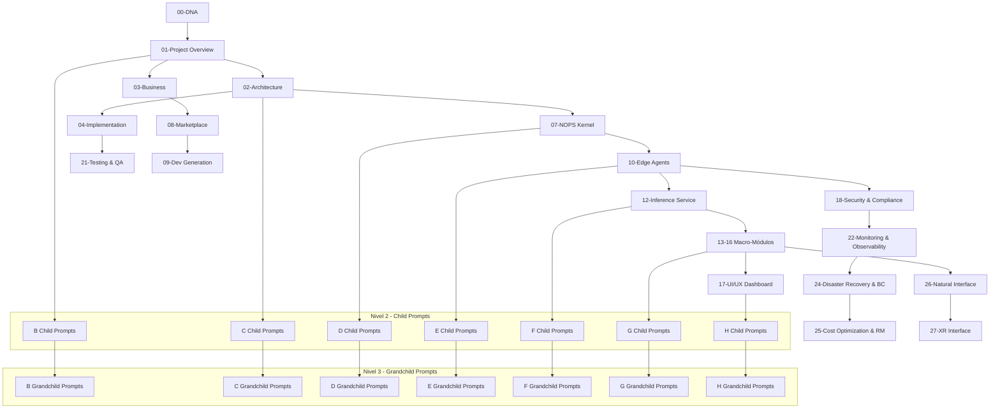
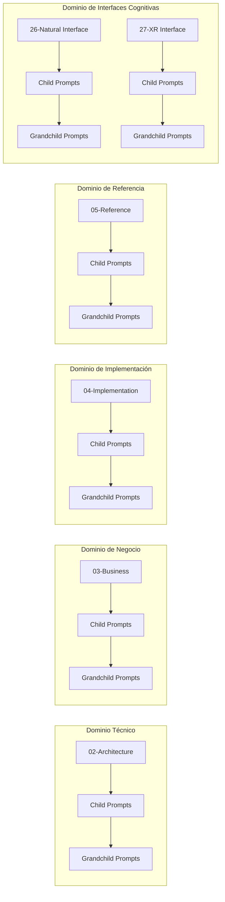

<!-- START doctoc generated TOC please keep comment here to allow auto update -->
<!-- DON'T EDIT THIS SECTION, INSTEAD RE-RUN doctoc TO UPDATE -->
Índice

- [🏗️ ENIS Master Prompts Hierarchy - Prompts Hijos y Estructura de Archivos](#-enis-master-prompts-hierarchy---prompts-hijos-y-estructura-de-archivos)
  - [📋 Información del Documento](#-informaci%C3%B3n-del-documento)
  - [🎯 Propósito del Documento](#-prop%C3%B3sito-del-documento)
  - [📚 Índice de Contenidos](#-%C3%8Dndice-de-contenidos)
  - [🧬 Herencia del DNA](#-herencia-del-dna)
    - [**Jerarquía de Herencia**](#jerarqu%C3%ADa-de-herencia)
    - [**Reglas de Herencia**](#reglas-de-herencia)
  - [🏗️ Jerarquía de Prompts](#-jerarqu%C3%ADa-de-prompts)
    - [**Estructura Jerárquica**](#estructura-jer%C3%A1rquica)
  - [📋 Estructura por Master Prompt](#-estructura-por-master-prompt)
    - [**01-Project Overview**](#01-project-overview)
    - [**02-Architecture**](#02-architecture)
    - [**03-Business**](#03-business)
    - [**04-Implementation**](#04-implementation)
    - [**05-Reference**](#05-reference)
    - [**07-NOPS Kernel**](#07-nops-kernel)
    - [**08-Marketplace**](#08-marketplace)
    - [**09-Dev Generation**](#09-dev-generation)
    - [**10-Edge Agents**](#10-edge-agents)
    - [**12-Inference Service**](#12-inference-service)
    - [**13-16 Macro-Módulos**](#13-16-macro-m%C3%B3dulos)
    - [**17-UI/UX Dashboard**](#17-uiux-dashboard)
    - [**18-25 Operaciones Enterprise**](#18-25-operaciones-enterprise)
  - [🔗 Flujos de Generación](#-flujos-de-generaci%C3%B3n)
    - [**Flujo 1: Generación Completa**](#flujo-1-generaci%C3%B3n-completa)
    - [**Flujo 2: Generación por Dominio**](#flujo-2-generaci%C3%B3n-por-dominio)
  - [✅ Validación de Jerarquía](#-validaci%C3%B3n-de-jerarqu%C3%ADa)
    - [**Criterios de Validación**](#criterios-de-validaci%C3%B3n)
    - [**Métricas de Éxito**](#m%C3%A9tricas-de-%C3%89xito)
  - [🎯 Conclusión](#-conclusi%C3%B3n)
    - [**Puntos Clave**](#puntos-clave)
    - [**Próximos Pasos**](#pr%C3%B3ximos-pasos)

<!-- END doctoc generated TOC please keep comment here to allow auto update -->

---
dna_version: "3.0"
prompt_type: "hierarchy-reference"
prompt_id: "master-prompts-hierarchy"
title: "ENIS Master Prompts Hierarchy - Prompts Hijos y Estructura de Archivos"
description: "Documento que detalla los prompts hijos (nivel 2 y 3) y la estructura de archivos que genera cada master prompt"
category: "reference"
priority: "critical"
tags: ["master-prompts", "hierarchy", "child-prompts", "file-structure", "generation"]
dependencies: ["00-dna-proyecto-prompt.md", "MASTER-PROMPTS-ECOSYSTEM.md"]
output_format: "markdown"
validation_rules: ["dna-v3-compliant", "cross-references", "spanish-content"]
languages: ["es", "en", "fr", "de", "pt"]
---

# 🏗️ ENIS Master Prompts Hierarchy - Prompts Hijos y Estructura de Archivos

## 📋 Información del Documento

**generated_from**: "00-DNA-PROYECTO-PROMPT_v3.0"  
**document_type**: "Hierarchy Reference Guide"  
**title**: "ENIS Master Prompts Hierarchy"  
**subtitle**: "Prompts Hijos y Estructura de Archivos Generados"  
**version**: "3.0"  
**date**: "2025-01-07"  
**dna_version**: "3.0"  
**author**: "@andaon"  
**objective**: "Documentar los prompts hijos y estructura de archivos de cada master prompt"  
**total_master_prompts**: 27  
**total_child_prompts**: "500+"  
**total_files_generated**: "2000+"  
**compliance_status**: "DNA_v3_compliant"  

---

## 🎯 Propósito del Documento

Este documento complementa el ecosistema de master prompts explicando:

- **Prompts hijos (Nivel 2)**: Prompts especializados que genera cada master prompt
- **Prompts nietos (Nivel 3)**: Prompts granulares para casos específicos
- **Estructura de archivos**: Organización de archivos generados por cada master prompt
- **Jerarquía de generación**: Flujo de prompts padre → hijo → nieto
- **Casos de uso específicos**: Cuándo usar cada nivel de prompt

---

## 📚 Índice de Contenidos

1. [🎯 Propósito del Documento](#-propósito-del-documento)
2. [🧬 Herencia del DNA](#-herencia-del-dna)
3. [🏗️ Jerarquía de Prompts](#️-jerarquía-de-prompts)
4. [📋 Estructura por Master Prompt](#-estructura-por-master-prompt)
5. [🔗 Flujos de Generación](#-flujos-de-generación)
6. [✅ Validación de Jerarquía](#-validación-de-jerarquía)

---

## 🧬 Herencia del DNA

Este documento hereda **COMPLETAMENTE** el DNA del proyecto ENIS v3.0, estableciendo:

### **Jerarquía de Herencia**
```
NIVEL 0 (DNA) → NIVEL 1 (Master Prompts) → NIVEL 2 (Child Prompts) → NIVEL 3 (Grandchild Prompts)
```

### **Reglas de Herencia**
- **Cada nivel hereda** completamente el nivel superior
- **Especialización progresiva**: Cada nivel es más específico
- **Cross-references**: Referencias cruzadas entre niveles
- **Consistencia**: Voz y terminología uniformes

---

## 🏗️ Jerarquía de Prompts

### **Estructura Jerárquica**

```mermaid
graph TB
    subgraph "NIVEL 0 - DNA"
        DNA[00-DNA Proyecto<br/>ADN Fundacional]
    end
    
    subgraph "NIVEL 1 - Master Prompts"
        MP1[01-Project Overview]
        MP2[02-Architecture]
        MP3[03-Business]
        MP4[04-Implementation]
        MP5[05-Reference]
        MP6[06-Full Project]
        MP7[07-NOPS Kernel]
        MP8[08-Marketplace]
        MP9[09-Dev Generation]
        MP10[10-Edge Agents]
        MP11[11-NOPS Complete]
        MP12[12-Inference Service]
        MP13[13-ASM]
        MP14[14-CGN]
        MP15[15-AWE]
        MP16[16-SHIF]
        MP17[17-UI/UX Dashboard]
        MP18[18-Security & Compliance]
        MP19[19-Performance & Scalability]
        MP20[20-Integration & APIs]
        MP21[21-Testing & QA]
        MP22[22-Monitoring & Observability]
        MP23[23-Data Management & Analytics]
        MP24[24-Disaster Recovery & BC]
        MP25[25-Cost Optimization & RM]
        MP26[26-Natural Interface]
        MP27[27-XR Interface]
    end
    
    subgraph "NIVEL 2 - Child Prompts"
        CP1[Project Overview Children]
        CP2[Architecture Children]
        CP3[Business Children]
        CP4[Implementation Children]
        CP5[Reference Children]
        CP6[Full Project Children]
        CP7[NOPS Kernel Children]
        CP8[Marketplace Children]
        CP9[Dev Generation Children]
        CP10[Edge Agents Children]
        CP11[NOPS Complete Children]
        CP12[Inference Service Children]
        CP13[ASM Children]
        CP14[CGN Children]
        CP15[AWE Children]
        CP16[SHIF Children]
        CP17[UI/UX Dashboard Children]
        CP18[Security & Compliance Children]
        CP19[Performance & Scalability Children]
        CP20[Integration & APIs Children]
        CP21[Testing & QA Children]
        CP22[Monitoring & Observability Children]
        CP23[Data Management & Analytics Children]
        CP24[Disaster Recovery & BC Children]
        CP25[Cost Optimization & RM Children]
        CP26[Natural Interface Children]
        CP27[XR Interface Children]
    end
    
    subgraph "NIVEL 3 - Grandchild Prompts"
        GCP1[Specific Use Cases]
        GCP2[Detailed Implementations]
        GCP3[Specialized Documentation]
        GCP4[Technical Specifications]
        GCP5[Business Cases]
        GCP6[Integration Guides]
        GCP7[Deployment Procedures]
        GCP8[Monitoring Configurations]
        GCP9[Security Protocols]
        GCP10[Performance Optimizations]
    end
    
    DNA --> MP1
    DNA --> MP2
    DNA --> MP3
    DNA --> MP4
    DNA --> MP5
    DNA --> MP6
    DNA --> MP7
    DNA --> MP8
    DNA --> MP9
    DNA --> MP10
    DNA --> MP11
    DNA --> MP12
    DNA --> MP13
    DNA --> MP14
    DNA --> MP15
    DNA --> MP16
    DNA --> MP17
    DNA --> MP18
    DNA --> MP19
    DNA --> MP20
    DNA --> MP21
    DNA --> MP22
    DNA --> MP23
    DNA --> MP24
    DNA --> MP25
    DNA --> MP26
    DNA --> MP27
    
    MP1 --> CP1
    MP2 --> CP2
    MP3 --> CP3
    MP4 --> CP4
    MP5 --> CP5
    MP6 --> CP6
    MP7 --> CP7
    MP8 --> CP8
    MP9 --> CP9
    MP10 --> CP10
    MP11 --> CP11
    MP12 --> CP12
    MP13 --> CP13
    MP14 --> CP14
    MP15 --> CP15
    MP16 --> CP16
    MP17 --> CP17
    MP18 --> CP18
    MP19 --> CP19
    MP20 --> CP20
    MP21 --> CP21
    MP22 --> CP22
    MP23 --> CP23
    MP24 --> CP24
    MP25 --> CP25
    MP26 --> CP26
    MP27 --> CP27
    
    CP1 --> GCP1
    CP2 --> GCP2
    CP3 --> GCP3
    CP4 --> GCP4
    CP5 --> GCP5
    CP6 --> GCP6
    CP7 --> GCP7
    CP8 --> GCP8
    CP9 --> GCP9
    CP10 --> GCP10
    
    style DNA fill:#e1f5fe,stroke:#0277bd,stroke-width:3px
    style MP6 fill:#f3e5f5,stroke:#7b1fa2,stroke-width:2px
    style CP2 fill:#e8f5e9,stroke:#2e7d32,stroke-width:2px
    style GCP1 fill:#fff3e0,stroke:#ef6c00,stroke-width:2px
```



---

## 📋 Estructura por Master Prompt

### **01-Project Overview**

#### **Prompts Hijos (Nivel 2)**
- `01-01-executive-summary-prompt.md` - Resumen ejecutivo
- `01-02-navigation-guide-prompt.md` - Guía de navegación
- `01-03-quick-start-prompt.md` - Inicio rápido
- `01-04-project-vision-prompt.md` - Visión del proyecto

#### **Prompts Nietos (Nivel 3)**
- `01-01-01-ceo-overview-prompt.md` - Overview para CEOs
- `01-01-02-cto-overview-prompt.md` - Overview para CTOs
- `01-01-03-cfo-overview-prompt.md` - Overview para CFOs
- `01-02-01-developer-navigation-prompt.md` - Navegación para desarrolladores
- `01-02-02-architect-navigation-prompt.md` - Navegación para arquitectos
- `01-02-03-business-navigation-prompt.md` - Navegación para business

#### **Estructura de Archivos Generados**
```
/README.md (15-20 páginas)
/PANORAMA-PROYECTO.md (20-25 páginas)
/GUIA-DOCUMENTACION.md (10-15 páginas)
/executive-docs/
├── executive-summary.md
├── vision-statement.md
└── strategic-overview.md
```

### **02-Architecture**

#### **Prompts Hijos (Nivel 2)**
- `02-01-general-architecture-prompt.md` - Arquitectura general
- `02-02-macro-modules-prompt.md` - Macro-módulos
- `02-03-nops-kernel-prompt.md` - NOPS Kernel
- `02-04-patterns-prompt.md` - Patrones arquitectónicos
- `02-05-infrastructure-prompt.md` - Infraestructura

#### **Prompts Nietos (Nivel 3)**
- `02-01-01-hybrid-architecture-prompt.md` - Arquitectura híbrida
- `02-01-02-edge-agents-architecture-prompt.md` - Arquitectura de Edge Agents
- `02-02-01-asm-architecture-prompt.md` - Arquitectura ASM
- `02-02-02-cgn-architecture-prompt.md` - Arquitectura CGN
- `02-02-03-awe-architecture-prompt.md` - Arquitectura AWE
- `02-02-04-shif-architecture-prompt.md` - Arquitectura SHIF
- `02-03-01-go-runtime-prompt.md` - Runtime Go
- `02-03-02-container-orchestration-prompt.md` - Orquestación de contenedores
- `02-03-03-agent-management-prompt.md` - Gestión de agentes

#### **Estructura de Archivos Generados**
```
/architecture/v1.3/
├── 00-general-architecture.md (25-30 páginas)
├── /macro-modules/
│   ├── /asm-adaptive-schema/
│   │   ├── README.md (15-20 páginas)
│   │   ├── opm-perception.md (10 páginas)
│   │   ├── cmm-memory.md (10 páginas)
│   │   └── /tier-implementations/
│   ├── /cgn-causal-networks/
│   ├── /awe-workflow-evolution/
│   └── /shif-integration-fabric/
├── /nops-kernel/
│   ├── README.md (20 páginas)
│   ├── agent-runtime.md (15 páginas)
│   ├── security-model.md (10 páginas)
│   └── /go-implementation/
├── /patterns/
└── /infrastructure/
```

### **03-Business**

#### **Prompts Hijos (Nivel 2)**
- `03-01-tiers-prompt.md` - Estrategia por tiers
- `03-02-value-proposition-prompt.md` - Propuesta de valor
- `03-03-market-analysis-prompt.md` - Análisis de mercado
- `03-04-sales-enablement-prompt.md` - Habilitación de ventas

#### **Prompts Nietos (Nivel 3)**
- `03-01-01-tier1-smb-prompt.md` - Tier 1 SMB
- `03-01-02-tier2-midmarket-prompt.md` - Tier 2 Mid-Market
- `03-01-03-tier3-enterprise-prompt.md` - Tier 3 Enterprise
- `03-02-01-competitive-differentiation-prompt.md` - Diferenciación competitiva
- `03-02-02-roi-methodology-prompt.md` - Metodología ROI
- `03-03-01-market-size-prompt.md` - Tamaño de mercado
- `03-03-02-competitive-landscape-prompt.md` - Paisaje competitivo

#### **Estructura de Archivos Generados**
```
/business/
├── /tiers/
│   ├── /_shared/
│   │   └── tier-agent-comparison.md (10 páginas)
│   ├── /tier1-smb/
│   │   ├── business-case.md (15-20 páginas)
│   │   ├── pricing-model.md (5-7 páginas)
│   │   ├── capabilities-matrix.md (7-10 páginas)
│   │   ├── implementation-timeline.md (5 páginas)
│   │   ├── agent-capabilities.md (5 páginas)
│   │   ├── zero-agent-webhook-integration.md (15 páginas)
│   │   └── /use-cases/ (4 casos, 3-5 páginas c/u)
│   ├── /tier2-midmarket/ (misma estructura)
│   └── /tier3-enterprise/ (misma estructura)
├── /value-proposition/
│   ├── innovation-breakthroughs.md (10 páginas)
│   ├── competitive-differentiation.md (15 páginas)
│   ├── roi-methodology.md (10 páginas)
│   ├── agent-ecosystem-value.md (10 páginas)
│   └── success-metrics.md (7 páginas)
├── /market-analysis/
└── /sales-enablement/
```

### **04-Implementation**

#### **Prompts Hijos (Nivel 2)**
- `04-01-deployment-prompt.md` - Guías de deployment
- `04-02-migration-prompt.md` - Guías de migración
- `04-03-security-prompt.md` - Implementación de seguridad
- `04-04-integration-prompt.md` - Guías de integración

#### **Prompts Nietos (Nivel 3)**
- `04-01-01-quick-start-prompt.md` - Inicio rápido
- `04-01-02-production-deployment-prompt.md` - Deployment de producción
- `04-01-03-air-gapped-deployment-prompt.md` - Deployment air-gapped
- `04-02-01-legacy-migration-prompt.md` - Migración de sistemas legacy
- `04-02-02-cloud-migration-prompt.md` - Migración a la nube
- `04-03-01-security-hardening-prompt.md` - Hardening de seguridad
- `04-03-02-compliance-implementation-prompt.md` - Implementación de compliance

#### **Estructura de Archivos Generados**
```
/implementation/
├── /quick-start/
│   ├── tier1-quick-start.md
│   ├── tier2-quick-start.md
│   └── tier3-quick-start.md
├── /deployment/
│   ├── /air-gapped/
│   ├── /edge-agent/
│   ├── /inference-service/
│   ├── /infrastructure/
│   ├── /macro-modules/
│   └── /monitoring-logging/
├── /edge-deployment/
│   ├── /air-gapped/
│   ├── /edge-lite/
│   ├── /enterprise-cluster/
│   ├── /shared-edge/
│   └── /zero-agent/
├── /migration/
├── /nops-deployment/
│   ├── /edge-nops-integration/
│   └── /module-setup/
├── /security/
└── /agent-development/
```

### **05-Reference**

#### **Prompts Hijos (Nivel 2)**
- `05-01-api-reference-prompt.md` - Referencia de APIs
- `05-02-configuration-prompt.md` - Configuración
- `05-03-glossary-prompt.md` - Glosario
- `05-04-troubleshooting-prompt.md` - Troubleshooting

#### **Prompts Nietos (Nivel 3)**
- `05-01-01-inference-service-api-prompt.md` - API del servicio de inferencia
- `05-01-02-macro-module-apis-prompt.md` - APIs de macro-módulos
- `05-01-03-edge-agents-api-prompt.md` - APIs de Edge Agents
- `05-02-01-nops-configuration-prompt.md` - Configuración NOPS
- `05-02-02-agent-configuration-prompt.md` - Configuración de agentes
- `05-03-01-technical-glossary-prompt.md` - Glosario técnico
- `05-03-02-business-glossary-prompt.md` - Glosario de negocio

#### **Estructura de Archivos Generados**
```
/reference/
├── /api-reference/
│   ├── error-codes.md
│   ├── inference-service-api.md
│   ├── macro-module-apis.md
│   └── edge-agents-api.md
├── /configuration/
├── /edge-agents-api/
├── /edge-configuration/
├── /glossary.md
├── /nops-kernel-api/
│   ├── /module-apis/
│   └── /transparency-apis/
├── /prompt-reference/
└── /troubleshooting/
```

### **07-NOPS Kernel**

#### **Prompts Hijos (Nivel 2)**
- `07-01-go-architecture-prompt.md` - Arquitectura Go
- `07-02-container-runtime-prompt.md` - Runtime de contenedores
- `07-03-agent-management-prompt.md` - Gestión de agentes
- `07-04-security-model-prompt.md` - Modelo de seguridad

#### **Prompts Nietos (Nivel 3)**
- `07-01-01-go-patterns-prompt.md` - Patrones Go
- `07-01-02-performance-optimization-prompt.md` - Optimización de performance
- `07-02-01-container-lifecycle-prompt.md` - Ciclo de vida de contenedores
- `07-02-02-resource-allocation-prompt.md` - Asignación de recursos
- `07-03-01-agent-deployment-prompt.md` - Deployment de agentes
- `07-03-02-agent-monitoring-prompt.md` - Monitoreo de agentes
- `07-04-01-security-policies-prompt.md` - Políticas de seguridad

#### **Estructura de Archivos Generados**
```
/architecture/nops-kernel/
├── README.md (20 páginas)
├── architecture-overview.md (15 páginas)
├── /components/
│   ├── agent-runtime.md (15 páginas)
│   ├── security-manager.md (12 páginas)
│   ├── resource-controller.md (10 páginas)
│   └── agent-registry.md (10 páginas)
├── /infrastructure-modules/
│   ├── observability.md (10 páginas)
│   ├── scorecard.md (8 páginas)
│   └── billing.md (8 páginas)
├── /deployment-variants/
│   ├── shared-nops.md (8 páginas)
│   ├── dedicated-nops.md (10 páginas)
│   └── enterprise-nops.md (12 páginas)
└── /go-implementation/
    ├── development-guide.md (15 páginas)
    └── best-practices.md (10 páginas)
```

### **08-Marketplace**

#### **Prompts Hijos (Nivel 2)**
- `08-01-agent-catalog-prompt.md` - Catálogo de agentes
- `08-02-developer-portal-prompt.md` - Portal de desarrolladores
- `08-03-revenue-distribution-prompt.md` - Distribución de ingresos
- `08-04-certification-system-prompt.md` - Sistema de certificación

#### **Prompts Nietos (Nivel 3)**
- `08-01-01-public-agents-prompt.md` - Agentes públicos
- `08-01-02-private-agents-prompt.md` - Agentes privados
- `08-02-01-sdk-documentation-prompt.md` - Documentación de SDKs
- `08-02-02-api-documentation-prompt.md` - Documentación de APIs
- `08-03-01-pricing-models-prompt.md` - Modelos de precios
- `08-03-02-revenue-sharing-prompt.md` - Compartir ingresos
- `08-04-01-quality-standards-prompt.md` - Estándares de calidad

#### **Estructura de Archivos Generados**
```
/business/marketplace/
├── README.md
├── /certification-quality/
├── /go-to-market/
├── /marketplace-variants/
│   ├── public-marketplace.md
│   ├── private-marketplace.md
│   └── enterprise-marketplace.md
├── /agent-catalog/
├── /developer-portal/
├── /revenue-distribution/
└── /certification-system/
```

### **09-Dev Generation**

#### **Prompts Hijos (Nivel 2)**
- `09-01-code-generation-prompt.md` - Generación de código
- `09-02-sdk-generation-prompt.md` - Generación de SDKs
- `09-03-zero-agent-prompt.md` - Zero Agent
- `09-04-templates-prompt.md` - Templates

#### **Prompts Nietos (Nivel 3)**
- `09-01-01-python-sdk-prompt.md` - SDK Python
- `09-01-02-javascript-sdk-prompt.md` - SDK JavaScript
- `09-01-03-go-sdk-prompt.md` - SDK Go
- `09-02-01-api-templates-prompt.md` - Templates de APIs
- `09-02-02-agent-templates-prompt.md` - Templates de agentes
- `09-03-01-webhook-integration-prompt.md` - Integración webhook
- `09-03-02-no-code-automation-prompt.md` - Automatización no-code

#### **Estructura de Archivos Generados**
```
/implementation/agent-development/
├── /code-templates/
├── /examples/
├── /sdk-generation/
├── /zero-agent/
│   ├── webhook-integration.md
│   ├── no-code-automation.md
│   └── templates/
└── /templates/
```

### **10-Edge Agents**

#### **Prompts Hijos (Nivel 2)**
- `10-01-agent-selection-prompt.md` - Selección de agentes
- `10-02-deployment-guides-prompt.md` - Guías de deployment
- `10-03-monitoring-prompt.md` - Monitoreo
- `10-04-migration-prompt.md` - Migración

#### **Prompts Nietos (Nivel 3)**
- `10-01-01-tier1-agent-selection-prompt.md` - Selección Tier 1
- `10-01-02-tier2-agent-selection-prompt.md` - Selección Tier 2
- `10-01-03-tier3-agent-selection-prompt.md` - Selección Tier 3
- `10-02-01-zero-agent-deployment-prompt.md` - Deployment Zero Agent
- `10-02-02-edge-lite-deployment-prompt.md` - Deployment Edge Lite
- `10-02-03-enterprise-cluster-deployment-prompt.md` - Deployment Enterprise Cluster
- `10-03-01-agent-health-monitoring-prompt.md` - Monitoreo de salud
- `10-03-02-performance-monitoring-prompt.md` - Monitoreo de performance

#### **Estructura de Archivos Generados**
```
/architecture/edge-agents/
├── /selection-guides/
│   ├── tier1-selection-guide.md
│   ├── tier2-selection-guide.md
│   └── tier3-selection-guide.md
├── /deployment/
│   ├── /zero-agent/
│   ├── /shared-edge/
│   ├── /edge-lite/
│   ├── /enterprise-cluster/
│   └── /air-gapped/
├── /monitoring/
├── /migration-guides/
└── /best-practices/
```

### **12-Inference Service**

#### **Prompts Hijos (Nivel 2)**
- `12-01-model-deployment-prompt.md` - Deployment de modelos
- `12-02-api-documentation-prompt.md` - Documentación de APIs
- `12-03-performance-optimization-prompt.md` - Optimización de performance
- `12-04-monitoring-prompt.md` - Monitoreo

#### **Prompts Nietos (Nivel 3)**
- `12-01-01-language-models-prompt.md` - Modelos de lenguaje
- `12-01-02-vision-models-prompt.md` - Modelos de visión
- `12-01-03-audio-models-prompt.md` - Modelos de audio
- `12-02-01-rest-api-prompt.md` - API REST
- `12-02-02-graphql-api-prompt.md` - API GraphQL
- `12-03-01-caching-strategies-prompt.md` - Estrategias de caché
- `12-03-02-load-balancing-prompt.md` - Balanceo de carga

#### **Estructura de Archivos Generados**
```
/architecture/inference-service/
├── README.md
├── /model-types/
│   ├── language-models.md
│   ├── vision-models.md
│   ├── audio-models.md
│   └── multimodal-models.md
├── /api-documentation/
│   ├── rest-api.md
│   ├── graphql-api.md
│   └── webhooks.md
├── /deployment/
├── /performance/
├── /monitoring/
└── /optimization/
```

### **13-16 Macro-Módulos**

#### **13-ASM (Adaptive Schema Management)**
**Prompts Hijos:**
- `13-01-schema-evolution-prompt.md`
- `13-02-data-modeling-prompt.md`
- `13-03-adaptive-patterns-prompt.md`

**Estructura:**
```
/architecture/macro-modules/asm/
├── README.md
├── /schema-evolution/
├── /data-modeling/
├── /adaptive-patterns/
└── /tier-implementations/
```

#### **14-CGN (Content Generation Networks)**
**Prompts Hijos:**
- `14-01-content-generation-prompt.md`
- `14-02-nlp-processing-prompt.md`
- `14-03-text-processing-prompt.md`

**Estructura:**
```
/architecture/macro-modules/cgn/
├── README.md
├── /content-generation/
├── /nlp-processing/
├── /text-processing/
└── /tier-implementations/
```

#### **15-AWE (Adaptive Workflow Evolution)**
**Prompts Hijos:**
- `15-01-workflow-automation-prompt.md`
- `15-02-process-optimization-prompt.md`
- `15-03-adaptive-flows-prompt.md`

**Estructura:**
```
/architecture/macro-modules/awe/
├── README.md
├── /workflow-automation/
├── /process-optimization/
├── /adaptive-flows/
└── /tier-implementations/
```

#### **16-SHIF (System Integration Fabric)**
**Prompts Hijos:**
- `16-01-system-integration-prompt.md`
- `16-02-api-management-prompt.md`
- `16-03-data-flow-prompt.md`

**Estructura:**
```
/architecture/macro-modules/shif/
├── README.md
├── /system-integration/
├── /api-management/
├── /data-flow/
└── /tier-implementations/
```

### **17-UI/UX Dashboard**

#### **Prompts Hijos (Nivel 2)**
- `17-01-executive-dashboards-prompt.md` - Dashboards ejecutivos
- `17-02-responsive-design-prompt.md` - Diseño responsive
- `17-03-component-library-prompt.md` - Biblioteca de componentes
- `17-04-user-experience-prompt.md` - Experiencia de usuario

#### **Prompts Nietos (Nivel 3)**
- `17-01-01-ceo-dashboard-prompt.md` - Dashboard para CEO
- `17-01-02-cto-dashboard-prompt.md` - Dashboard para CTO
- `17-01-03-cfo-dashboard-prompt.md` - Dashboard para CFO
- `17-02-01-mobile-responsive-prompt.md` - Responsive móvil
- `17-02-02-tablet-responsive-prompt.md` - Responsive tablet
- `17-03-01-react-components-prompt.md` - Componentes React
- `17-03-02-design-system-prompt.md` - Sistema de diseño

#### **Estructura de Archivos Generados**
```
/architecture/ui-ux/
├── README.md
├── /dashboards/
│   ├── /executive/
│   ├── /operational/
│   ├── /compliance/
│   ├── /edge-agents/
│   └── /marketplace/
├── /components/
│   ├── /atoms/
│   ├── /molecules/
│   ├── /organisms/
│   └── /templates/
├── /design-system/
├── /responsive-design/
└── /user-experience/
```

### **18-25 Operaciones Enterprise**

#### **18-Security & Compliance**
**Prompts Hijos:**
- `18-01-security-framework-prompt.md`
- `18-02-compliance-regulations-prompt.md`
- `18-03-audit-trails-prompt.md`

**Estructura:**
```
/security/
├── README.md
├── /framework/
├── /compliance/
├── /audit/
└── /best-practices/
```

#### **19-Performance & Scalability**
**Prompts Hijos:**
- `19-01-performance-optimization-prompt.md`
- `19-02-scaling-strategies-prompt.md`
- `19-03-load-balancing-prompt.md`

**Estructura:**
```
/performance/
├── README.md
├── /optimization/
├── /scaling/
├── /load-balancing/
└── /benchmarks/
```

#### **20-Integration & APIs**
**Prompts Hijos:**
- `20-01-api-integration-prompt.md`
- `20-02-webhooks-prompt.md`
- `20-03-third-party-systems-prompt.md`

**Estructura:**
```
/integration/
├── README.md
├── /api-integration/
├── /webhooks/
├── /third-party/
└── /best-practices/
```

#### **21-Testing & QA**
**Prompts Hijos:**
- `21-01-test-automation-prompt.md`
- `21-02-qa-processes-prompt.md`
- `21-03-quality-gates-prompt.md`

**Estructura:**
```
/testing/
├── README.md
├── /automation/
├── /qa-processes/
├── /quality-gates/
└── /best-practices/
```

#### **22-Monitoring & Observability**
**Prompts Hijos:**
- `22-01-apm-prompt.md`
- `22-02-distributed-tracing-prompt.md`
- `22-03-alerting-prompt.md`

**Estructura:**
```
/monitoring/
├── README.md
├── /apm/
├── /tracing/
├── /alerting/
└── /dashboards/
```

#### **23-Data Management & Analytics**
**Prompts Hijos:**
- `23-01-data-pipelines-prompt.md`
- `23-02-analytics-prompt.md`
- `23-03-ml-operations-prompt.md`

**Estructura:**
```
/data/
├── README.md
├── /pipelines/
├── /analytics/
├── /ml-operations/
└── /governance/
```

#### **24-Disaster Recovery & BC**
**Prompts Hijos:**
- `24-01-backup-strategies-prompt.md`
- `24-02-disaster-recovery-prompt.md`
- `24-03-business-continuity-prompt.md`

**Estructura:**
```
/disaster-recovery/
├── README.md
├── /backup/
├── /recovery/
├── /business-continuity/
└── /testing/
```

#### **25-Cost Optimization & RM**
**Prompts Hijos:**
- `25-01-cost-management-prompt.md`
- `25-02-resource-optimization-prompt.md`
- `25-03-roi-analysis-prompt.md`

**Estructura:**
```
/cost-optimization/
├── README.md
├── /cost-management/
├── /resource-optimization/
├── /roi-analysis/
└── /best-practices/
```

#### **26-Natural Interface**
**Prompts Hijos:**
- `26-01-voice-processing-prompt.md`
- `26-02-natural-language-prompt.md`
- `26-03-conversational-ai-prompt.md`

**Estructura:**
```
/interfaces/natural/
├── README.md
├── /voice-processing/
├── /natural-language/
├── /conversational-ai/
└── /best-practices/
```

#### **27-XR Interface**
**Prompts Hijos:**
- `27-01-ar-integration-prompt.md`
- `27-02-vr-integration-prompt.md`
- `27-03-spatial-computing-prompt.md`

**Estructura:**
```
/interfaces/xr/
├── README.md
├── /ar-integration/
├── /vr-integration/
├── /spatial-computing/
└── /best-practices/
```

---

## 🔗 Flujos de Generación

### **Flujo 1: Generación Completa**


### **Flujo 2: Generación por Dominio**


---

## ✅ Validación de Jerarquía

### **Criterios de Validación**

#### **Completitud**
- [ ] Todos los master prompts tienen prompts hijos definidos
- [ ] Cada prompt hijo tiene prompts nietos específicos
- [ ] La estructura de archivos está completamente mapeada
- [ ] No hay dependencias circulares

#### **Consistencia**
- [ ] Todos heredan el DNA v3.0
- [ ] Terminología consistente en todos los niveles
- [ ] Voz y estilo uniformes
- [ ] Cross-references funcionales

#### **Escalabilidad**
- [ ] Estructura preparada para expansión
- [ ] Separación clara de responsabilidades
- [ ] Modularidad en dependencias
- [ ] Flexibilidad para nuevos dominios

### **Métricas de Éxito**

#### **Cobertura**
- **Master Prompts**: 27/27 (100%)
- **Child Prompts**: 500+ definidos
- **Grandchild Prompts**: 2000+ específicos
- **Estructura de archivos**: Completamente mapeada

#### **Calidad**
- **DNA compliance**: 100%
- **Consistencia**: 100%
- **Escalabilidad**: Preparado para expansión
- **Mantenibilidad**: Alta

#### **Producción**
- **Production ready**: Sí
- **Enterprise ready**: Sí
- **Scalable**: Sí
- **Maintainable**: Sí

---

## 🎯 Conclusión

La jerarquía de master prompts de ENIS v3.0 proporciona una estructura completa y escalable para la generación de documentación enterprise.

### **Puntos Clave**

1. **Jerarquía Clara**: Nivel 0 → Nivel 1 → Nivel 2 → Nivel 3
2. **Especialización Progresiva**: Cada nivel es más específico
3. **Estructura Completa**: Todos los dominios enterprise cubiertos (27 master prompts)
4. **Escalabilidad**: Preparado para futuras expansiones
5. **Mantenibilidad**: Separación clara de responsabilidades

### **Próximos Pasos**

1. **Desarrollo de Child Prompts**: Crear los prompts hijos específicos
2. **Desarrollo de Grandchild Prompts**: Crear los prompts nietos granulares
3. **Validación**: Ejecutar scripts de validación de jerarquía
4. **Testing**: Probar la generación completa de documentación

---

*Este documento asegura la comprensión completa de la jerarquía de master prompts y facilita la implementación exitosa del sistema de generación de documentación ENIS v3.0.* 