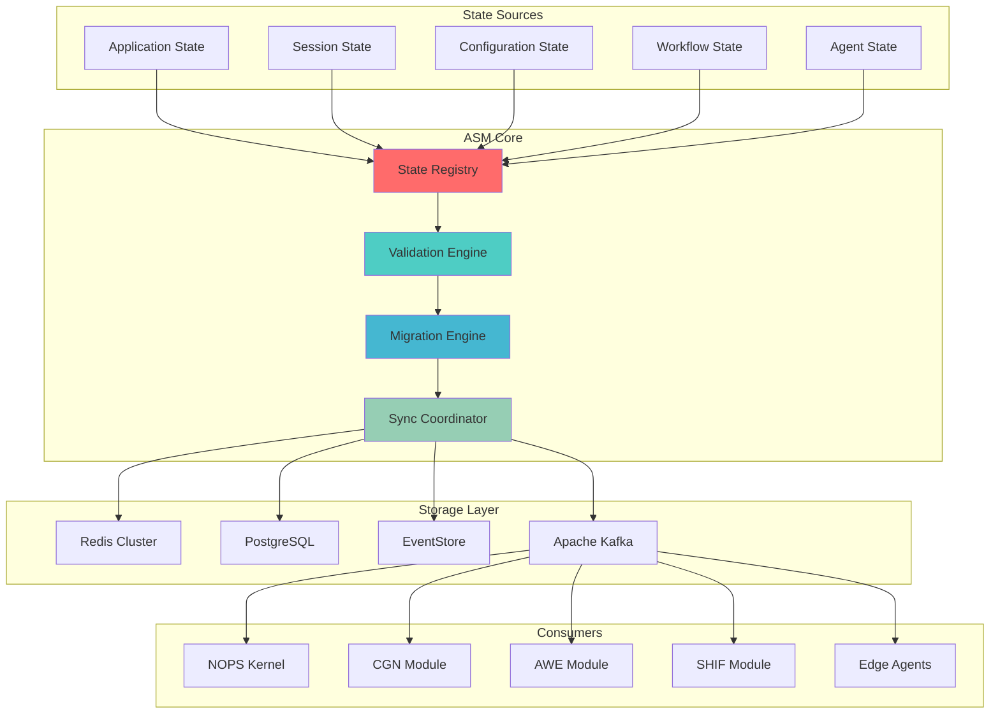

<!-- START doctoc generated TOC please keep comment here to allow auto update -->
<!-- DON'T EDIT THIS SECTION, INSTEAD RE-RUN doctoc TO UPDATE -->
Índice

  - [🎯 PROPÓSITO Y CONTEXTO](#-prop%C3%93sito-y-contexto)
- [📑 TABLA DE CONTENIDOS](#-tabla-de-contenidos)
  - [🏗️ ARQUITECTURA DEL ECOSISTEMA ASM](#-arquitectura-del-ecosistema-asm)
    - [**Principios Arquitectónicos Fundamentales**](#principios-arquitect%C3%B3nicos-fundamentales)
    - [**Componentes Core del Sistema**](#componentes-core-del-sistema)
    - [**Flujo de Datos en ASM**](#flujo-de-datos-en-asm)
  - [📊 TIPOS DE ESTADOS SOPORTADOS](#-tipos-de-estados-soportados)
    - [**1. Application State**](#1-application-state)
    - [**2. Session State**](#2-session-state)
    - [**3. Configuration State**](#3-configuration-state)
    - [**4. Workflow State**](#4-workflow-state)
    - [**5. Agent State**](#5-agent-state)
  - [🔄 PATRONES DE ADAPTACIÓN](#-patrones-de-adaptaci%C3%93n)
    - [**1. Real-Time Adaptation**](#1-real-time-adaptation)
    - [**2. Batch Migration**](#2-batch-migration)
    - [**3. Incremental Evolution**](#3-incremental-evolution)
    - [**4. Emergency Rollback**](#4-emergency-rollback)
    - [**5. Conflict Resolution**](#5-conflict-resolution)
    - [**6. Performance Optimization**](#6-performance-optimization)
  - [🔧 APIS Y SDKS](#-apis-y-sdks)
    - [**Core API Endpoints**](#core-api-endpoints)
    - [**SDK Specifications**](#sdk-specifications)
  - [🔗 INTEGRACIÓN CON NOPS KERNEL](#-integraci%C3%93n-con-nops-kernel)
    - [**Arquitectura de Integración**](#arquitectura-de-integraci%C3%B3n)
    - [**Integración con Macro-Módulos**](#integraci%C3%B3n-con-macro-m%C3%B3dulos)
    - [**Integración con Edge Agents**](#integraci%C3%B3n-con-edge-agents)
  - [🚀 DEPLOYMENT PATTERNS](#-deployment-patterns)
    - [**Arquitectura de Deployment**](#arquitectura-de-deployment)
    - [**1. Development Environment**](#1-development-environment)
    - [**2. Production Deployment**](#2-production-deployment)
  - [🔒 SECURITY FRAMEWORK](#-security-framework)
    - [Arquitectura de Seguridad](#arquitectura-de-seguridad)
    - [Compliance y Certificación](#compliance-y-certificaci%C3%B3n)
    - [Security Best Practices](#security-best-practices)
  - [📁 ESTRUCTURA DE DOCUMENTACIÓN](#-estructura-de-documentaci%C3%93n)
    - [Arquitectura de Documentación a Generar](#arquitectura-de-documentaci%C3%B3n-a-generar)
  - [✅ VALIDACIÓN Y QUALITY GATES](#-validaci%C3%93n-y-quality-gates)
    - [Criterios de Validación](#criterios-de-validaci%C3%B3n)
    - [Quality Gates](#quality-gates)
  - [🎯 INSTRUCCIONES DE GENERACIÓN](#-instrucciones-de-generaci%C3%93n)
    - [Proceso de Generación Paso a Paso](#proceso-de-generaci%C3%B3n-paso-a-paso)
    - [Reglas Críticas de Generación](#reglas-cr%C3%ADticas-de-generaci%C3%B3n)
    - [Orden de Generación Recomendado](#orden-de-generaci%C3%B3n-recomendado)
    - [Validación Final](#validaci%C3%B3n-final)
  - [📋 METADATA DE CIERRE](#-metadata-de-cierre)

<!-- END doctoc generated TOC please keep comment here to allow auto update -->

---
prompt_id: "13-asm-master-prompt"
prompt_type: "master_prompt"
dna_version: "3.0"
semver: "3.0.0"
date: "2025-01-19"
author: "@andaon"
domain: "Adaptive State Manager"
description: "Master prompt para generar documentación completa del ecosistema Adaptive State Manager"
estimated_pages: "160-200"
compliance_status: "DNA_v3_compliant"
dependencies: ["00-dna-proyecto-prompt.md", "07-nops-kernel-master-prompt.md"]
generates: 
 - "architecture/asm/*"
 - "reference/asm-api/*"
 - "implementation/asm-deployment/*"
child_prompts: 22
validation_script: "validate-asm-documentation.js"
release_status: "ready_for_production"
feeds_to: ["11-nops-complete", "14-cgn", "15-awe", "16-shif", "17-uiux-dashboard", "22-monitoring-observability"]
---

## 🎯 PROPÓSITO Y CONTEXTO
**ROL:** Arquitecto Senior de Adaptive State Manager en ENIS v3.0 (Enterprise Neural Intelligence Systems)

**TAREA:** Generar documentación completa del ecosistema Adaptive State Manager (ASM), el macro-módulo fundacional para gestión de estados distribuidos en tiempo real, que sirve como base para todos los demás componentes del sistema ENIS.

**OBJETIVO:** Producir 160-200 páginas de documentación técnica production-ready que cubra arquitectura, APIs, SDKs, deployment patterns, seguridad y certificación del sistema ASM.

**CONTEXTO CRÍTICO:** ASM es el componente fundacional de ENIS v3.0. Todos los macro-módulos (CGN, AWE, SHIF) y Edge Agents (🟤🟡🟢🔵🔴) dependen de ASM para la gestión de sus estados. NO es un sistema de gestión de esquemas, es un sistema de gestión de estados distribuidos con adaptación en tiempo real.

# 📑 TABLA DE CONTENIDOS

- 🏗️ Arquitectura del Ecosistema ASM
- 📊 Tipos de Estados Soportados
- 🔄 Patrones de Adaptación
- 🔧 APIs y SDKs
- 🔗 Integración con NOPS Kernel
- 🚀 Deployment Patterns
- 🔒 Security Framework
- 📁 Estructura de Documentación
- ✅ Validación y Quality Gates
- 🎯 Instrucciones de Generación


## 🏗️ ARQUITECTURA DEL ECOSISTEMA ASM

### **Principios Arquitectónicos Fundamentales**

El Adaptive State Manager de ENIS v3.0 se basa en cuatro principios arquitectónicos clave:

- **Adaptive by Design**: Arquitectura diseñada para adaptación continua de estados sin downtime
- **State-First Approach**: Enfoque centrado en estados como primera clase ciudadana del sistema
- **Real-Time Adaptation**: Capacidad de adaptación y sincronización de estados en tiempo real
- **Security by Design**: Seguridad integral incorporada en cada nivel de gestión de estados

### **Componentes Core del Sistema**

```yaml
asm_architecture:
  state_registry:
    description: "Registro centralizado de todos los estados del sistema"
    technology: "PostgreSQL + Redis"
    features:
      - "Versionado automático de estados"
      - "Tracking de linaje de estados"
      - "Metadatos enriquecidos"
      - "Búsqueda y descubrimiento"
    
  validation_engine:
    description: "Motor de validación dinámica de estados"
    technology: "Serverless functions"
    features:
      - "Validación en tiempo real"
      - "Reglas de negocio customizables"
      - "Detección de breaking changes"
      - "Performance optimization"
    
  migration_engine:
    description: "Motor de migración automática de estados"
    technology: "Kubernetes Jobs"
    features:
      - "Migración sin downtime"
      - "Rollback automático"
      - "Transformación de datos"
      - "Auditoría completa"
    
  sync_coordinator:
    description: "Coordinador de sincronización distribuida"
    technology: "Apache Kafka + EventStore"
    features:
      - "Sincronización multi-región"
      - "Consistencia eventual"
      - "Conflict resolution"
      - "Real-time replication"
```

### **Flujo de Datos en ASM**



## 📊 TIPOS DE ESTADOS SOPORTADOS

### **1. Application State**

**Descripción**: Estados de aplicaciones distribuidas con sincronización en tiempo real y consistencia eventual.

**Características Técnicas**:

- Formato: JSON/Protobuf
- Storage: Redis + PostgreSQL
- Sincronización: Real-time replication
- Versionado: Event sourcing
- Performance: < 50ms latencia, 10K+ ops/sec

**Casos de Uso**:

- Estado global de aplicaciones
- Configuración dinámica
- Feature flags distribuidos
- Cache compartido

**Pricing**: $299-499/mes (Basic tier)

### **2. Session State**

**Descripción**: Estados de sesiones de usuario con persistencia distribuida y failover automático.

**Características Técnicas**:

- Formato: Session tokens + metadata
- Storage: Redis Cluster
- Sincronización: Batch processing
- Versionado: Session versioning
- Performance: < 10ms creación, 100K+ sesiones/sec

**Casos de Uso**:

- Gestión de sesiones web
- Estado de autenticación
- Personalización de usuario
- Shopping carts distribuidos

**Pricing**: $499-799/mes (Professional tier)

### **3. Configuration State**

**Descripción**: Estados de configuración del sistema con versionado Git y deployment automático.

**Características Técnicas**:

- Formato: YAML/JSON configuration
- Storage: Git + PostgreSQL
- Sincronización: Incremental updates
- Versionado: Git-based versioning
- Performance: < 20ms loading, < 30s deployment

**Casos de Uso**:

- GitOps workflows
- Configuración de infraestructura
- Environment management
- Secret management

**Pricing**: $1K-3K/mes (Enterprise tier)

### **4. Workflow State**

**Descripción**: Estados de workflows y procesos con orquestación distribuida y recovery automático.

**Características Técnicas**:

- Formato: Workflow DAG + state
- Storage: PostgreSQL + EventStore
- Sincronización: Emergency migration
- Versionado: Workflow versioning
- Performance: < 100ms start, 1000+ concurrent

**Casos de Uso**:

- Business process automation
- ETL pipelines
- Approval workflows
- Order processing

**Pricing**: $8-30K/mes (Critical tier)

### **5. Agent State**

**Descripción**: Estados de agentes inteligentes con memoria persistente y evolución automática.

**Características Técnicas**:

- Formato: Agent memory + context
- Storage: Vector DB + PostgreSQL
- Sincronización: Auto-evolution
- Versionado: Agent learning versioning
- Performance: < 200ms init, < 10ms retrieval

**Casos de Uso**:

- IA conversacional
- Agentes autónomos
- Machine learning state
- Knowledge graphs

**Pricing**: $30-120K/mes (Custom tier)

## 🔄 PATRONES DE ADAPTACIÓN

### **1. Real-Time Adaptation**

**Aplicabilidad**: Application State, Agent State

**Características**:

- Hot state reloading sin reinicio
- Graceful degradation automático
- Backward compatibility garantizada
- Performance monitoring continuo

**Implementación**:

```python
# Ejemplo de adaptación en tiempo real
async def real_time_adaptation(state_id: str, new_schema: dict):
    # Validar compatibilidad
    compatibility = await validate_compatibility(state_id, new_schema)
    if not compatibility.is_compatible:
        raise IncompatibleSchemaError(compatibility.errors)
    
    # Aplicar migración hot
    await hot_reload_state(state_id, new_schema)
    
    # Monitorear performance
    metrics = await monitor_adaptation(state_id)
    return AdaptationResult(success=True, metrics=metrics)
```

### **2. Batch Migration**

**Aplicabilidad**: Session State, Configuration State

**Características**:

- Procesamiento por lotes programado
- Transformación de datos compleja
- Validation checkpoints
- Rollback capabilities

**Implementación**:

```typescript
// Ejemplo de migración batch
async function batchMigration(
  sourceStateId: string,
  targetStateId: string,
  batchSize: number = 1000
): Promise<MigrationResult> {
  const totalRecords = await countRecords(sourceStateId);
  const batches = Math.ceil(totalRecords / batchSize);
  
  for (let i = 0; i < batches; i++) {
    const batch = await fetchBatch(sourceStateId, i, batchSize);
    const transformed = await transformBatch(batch, targetStateId);
    await writeBatch(transformed, targetStateId);
    
    // Checkpoint
    await saveCheckpoint(i, batches);
  }
  
  return { success: true, recordsProcessed: totalRecords };
}
```

### **3. Incremental Evolution**

**Aplicabilidad**: Todos los tipos de estado

**Características**:

- Evolución paso a paso
- Feature flags para control
- A/B testing integrado
- Risk mitigation automático

### **4. Emergency Rollback**

**Aplicabilidad**: Todos los tipos de estado

**Características**:

- Rollback instantáneo (< 30s)
- Triggers automáticos
- Health monitoring
- Incident response integrado

### **5. Conflict Resolution**

**Aplicabilidad**: Estados distribuidos

**Características**:

- Merge strategies configurables
- Priority rules
- Manual intervention cuando necesario
- Audit logging completo

### **6. Performance Optimization**

**Aplicabilidad**: Estados de alto volumen

**Características**:

- Query optimization automático
- Index management
- Caching strategies adaptativas
- Resource monitoring continuo

## 🔧 APIS Y SDKS

### **Core API Endpoints**

#### **State Management API**

```yaml
endpoints:
  create_state:
    method: POST
    path: /api/v1/states
    description: "Crear nuevo estado en el sistema"
    request:
      type: "application|session|configuration|workflow|agent"
      definition: "State schema definition"
      validation_rules: "Array of validation rules"
      metadata: "Additional metadata"
    response:
      state_id: "Unique state identifier"
      version: "Initial version"
      status: "active|pending|draft"
    
  get_state:
    method: GET
    path: /api/v1/states/{state_id}
    description: "Obtener definición de estado"
    response:
      state_id: "State identifier"
      type: "State type"
      definition: "Current state definition"
      version: "Current version"
      metadata: "State metadata"
    
  update_state:
    method: PUT
    path: /api/v1/states/{state_id}
    description: "Actualizar estado existente"
    request:
      definition: "New state definition"
      migration_strategy: "real-time|batch|incremental"
    response:
      state_id: "State identifier"
      version: "New version"
      migration_id: "Migration job ID"
```

#### **Validation Engine API**

```yaml
endpoints:
  validate_state:
    method: POST
    path: /api/v1/validate
    description: "Validar datos contra estado"
    request:
      state_id: "State to validate against"
      data: "Data to validate"
      validation_level: "strict|relaxed|custom"
    response:
      valid: "Boolean validation result"
      errors: "Array of validation errors"
      warnings: "Array of warnings"
      performance: "Validation performance metrics"
```

#### **Migration API**

```yaml
endpoints:
  create_migration:
    method: POST
    path: /api/v1/migrations
    description: "Crear nueva migración de estado"
    request:
      source_state_id: "Source state"
      target_state_id: "Target state"
      strategy: "real-time|batch|incremental"
      rollback_policy: "automatic|manual|disabled"
    response:
      migration_id: "Migration identifier"
      status: "pending|running|completed|failed"
      estimated_duration: "Estimated completion time"
```

### **SDK Specifications**

#### **Redis SDK para JavaScript/TypeScript**

```typescript
// Instalación
npm install @enis/asm-redis

// Uso básico
import { ASMRedis } from '@enis/asm-redis';

const asm = new ASMRedis({
  apiKey: 'your-api-key',
  region: 'us-east-1'
});

// Crear estado de aplicación
const appState = await asm.createState({
  type: 'application',
  definition: {
    schema: {
      user: { type: 'object' },
      settings: { type: 'object' },
      features: { type: 'array' }
    }
  },
  validation: {
    rules: ['required-fields', 'type-checking'],
    level: 'strict'
  }
});

// Sincronización en tiempo real
asm.syncState(appState.id).subscribe(update => {
  console.log('State updated:', update);
});
```

#### **Python SDK**

```python
# Instalación
pip install enis-asm

# Uso básico
from enis_asm import ASMClient
from enis_asm.types import StateType, ValidationLevel

client = ASMClient(
    api_key="your-api-key",
    region="us-east-1"
)

# Crear estado de sesión
session_state = await client.create_state(
    state_type=StateType.SESSION,
    definition={
        "schema": {
            "user_id": {"type": "string"},
            "expires_at": {"type": "timestamp"},
            "permissions": {"type": "array"}
        }
    },
    validation_level=ValidationLevel.STRICT
)

# Validar datos de sesión
validation = await client.validate(
    state_id=session_state.id,
    data={
        "user_id": "user-123",
        "expires_at": "2025-12-31T23:59:59Z",
        "permissions": ["read", "write"]
    }
)
```

#### **TypeScript SDK**

```typescript
// Instalación
npm install @enis/asm

// Uso avanzado con React
import { useASMState } from '@enis/asm/react';

function MyComponent() {
  const { state, updateState, isLoading } = useASMState({
    stateId: 'workflow-123',
    autoSync: true
  });
  
  const handleUpdate = async (newData: any) => {
    await updateState(newData, {
      strategy: 'real-time',
      validation: 'strict'
    });
  };
  };
  
  return (
    <div>
      {isLoading ? 'Loading...' : JSON.stringify(state)}
    </div>
  );
}
```

## 🔗 INTEGRACIÓN CON NOPS KERNEL

### **Arquitectura de Integración**

ASM se integra profundamente con NOPS Kernel para proporcionar gestión de estados a todos los módulos del sistema:

```yaml
nops_integration:
  kernel_modules:
    orchestrator:
      integration: "State coordination and lifecycle"
      apis: ["state-create", "state-sync", "state-validate"]
      
    authentication:
      integration: "Session state management"
      apis: ["session-create", "session-validate", "session-expire"]
      
    monitoring:
      integration: "State health and metrics"
      apis: ["state-metrics", "state-health", "state-alerts"]
      
    data_flow:
      integration: "State transformation pipelines"
      apis: ["state-transform", "state-migrate", "state-replicate"]
```

### **Integración con Macro-Módulos**

#### **CGN (Content Generation Network)**

- Estados de contenido generado
- Templates y configuraciones
- Output format states
- Versionado de contenido

#### **AWE (Automated Workflow Engine)**

- Estados de workflow
- Task input/output states
- Dependency states
- Execution states

#### **SHIF (Security Hub & Identity Framework)**

- Security policy states
- Access control states
- Audit log states
- Compliance states

### **Integración con Edge Agents**

```yaml
edge_agent_integration:
  🟤_processing_agent:
    states: ["processing-queue", "task-status", "results-cache"]
    sync: "real-time"
    
  🟡_coordinator_agent:
    states: ["coordination-map", "agent-registry", "workflow-state"]
    sync: "eventual"
    
  🟢_validator_agent:
    states: ["validation-rules", "check-results", "compliance-state"]
    sync: "real-time"
    
  🔵_optimizer_agent:
    states: ["optimization-params", "performance-metrics", "cache-state"]
    sync: "batch"
    
  🔴_security_agent:
    states: ["security-policies", "threat-state", "audit-trail"]
    sync: "real-time"
```

## 🚀 DEPLOYMENT PATTERNS

### **Arquitectura de Deployment**

### **1. Development Environment**

```yaml
development_deployment:
  infrastructure:
    type: "Single-node deployment"
    components:
      - "ASM Core (containerized)"
      - "PostgreSQL (local)"
      - "Redis (local)"
      - "MinIO (S3 compatible)"
    
  configuration:
    state_limit: 100
    sync_mode: "manual"
    validation: "relaxed"
    monitoring: "basic"
    
  docker_compose: |
    version: '3.8'
    services:
      asm-core:
        image: enis/asm:v3.0
        environment:
          - ENV=development
          - STATE_LIMIT=100
        ports:
          - "8080:8080"
      
      postgres:
        image: postgres:15
        environment:
          - POSTGRES_DB=asm_dev
          - POSTGRES_PASSWORD=dev_password
      
      redis:
        image: redis:7-alpine
        ports:
          - "6379:6379"
```

### **2. Production Deployment**

```yaml
production_deployment:
  infrastructure:
    type: "Multi-region cluster"
    components:
      - "ASM Core (Kubernetes)"
      - "PostgreSQL (RDS Multi-AZ)"
      - "Redis Cluster (ElastiCache)"
      - "Kafka (MSK)"
      - "S3 (Object storage)"
    
  kubernetes_config: |
    apiVersion: apps/v1
    kind: Deployment
    metadata:
      name: asm-core
      namespace: enis-production
    spec:
      replicas: 3
      selector:
        matchLabels:
          app: asm-core
      template:
        metadata:
          labels:
            app: asm-core
        spec:
          containers:
          - name: asm
            image: enis/asm:v3.0
            resources:
              requests:
                memory: "2Gi"
                cpu: "1000m"
              limits:
                memory: "4Gi"
                cpu: "2000m"
            env:
            - name: ENV
              value: "production"
            - name: STATE_SYNC
              value: "real-time"
Guías de Deployment
Setup Inicial

Preparación de Infraestructura
bash# Terraform para infraestructura base
terraform init
terraform plan -var-file=production.tfvars
terraform apply

Deployment de ASM Core
bash# Helm chart deployment
helm repo add enis https://charts.enis.io
helm install asm enis/asm \
  --namespace enis-production \
  --values values-production.yaml

Configuración de State Registry
python# Inicialización del registry
from enis_asm import setup_registry

await setup_registry({
    "database_url": "postgresql://...",
    "redis_url": "redis://...",
    "initial_states": [
        "application-default",
        "session-default",
        "configuration-default"
    ]
})


## Monitoring y Observability

```yaml
monitoring_stack:
  metrics:
    prometheus:
      scrape_interval: 15s
      metrics:
        - asm_state_operations_total
        - asm_validation_duration_seconds
        - asm_migration_status
        - asm_sync_lag_seconds
    
  logging:
    elasticsearch:
      index_pattern: "asm-logs-*"
      retention: "30 days"
      fields:
        - timestamp
        - state_id
        - operation
        - duration
        - status
    
  tracing:
    jaeger:
      sampling_rate: 0.01
      traces:
        - state_creation
        - state_validation
        - state_migration
        - state_sync
    
  dashboards:
    grafana:
      - "ASM Overview Dashboard"
      - "State Operations Dashboard"
      - "Migration Status Dashboard"
      - "Performance Metrics Dashboard"
```

## 🔒 SECURITY FRAMEWORK

### Arquitectura de Seguridad

```yaml
security_architecture:
  authentication:
    methods:
      - api_key: "API Key authentication"
      - oauth2: "OAuth 2.0 + OIDC"
      - mtls: "Mutual TLS for service-to-service"
      - jwt: "JWT tokens for session management"
    
  authorization:
    model: "RBAC with attribute-based extensions"
    roles:
      - state_reader: "Read-only access to states"
      - state_writer: "Create and update states"
      - state_admin: "Full state management"
      - system_admin: "System-wide administration"
    
  encryption:
    at_rest:
      - algorithm: "AES-256-GCM"
      - key_management: "AWS KMS / HashiCorp Vault"
      - rotation: "90 days"
    
    in_transit:
      - protocol: "TLS 1.3"
      - cipher_suites: "TLS_AES_256_GCM_SHA384"
      - certificate_management: "Let's Encrypt / ACM"
```

### Compliance y Certificación

```yaml
compliance_frameworks:
  data_privacy:
    gdpr:
      - "Data minimization"
      - "Right to be forgotten"
      - "Data portability"
      - "Privacy by design"
    
    ccpa:
      - "Consumer data rights"
      - "Opt-out mechanisms"
      - "Data disclosure"
    
  security_standards:
    iso_27001:
      - "Information security management"
      - "Risk assessment"
      - "Incident response"
      - "Business continuity"
    
    soc2_type2:
      - "Security controls"
      - "Availability monitoring"
      - "Processing integrity"
      - "Confidentiality"
    
  industry_specific:
    hipaa:
      - "PHI encryption"
      - "Access controls"
      - "Audit logging"
      - "Data integrity"
    
    pci_dss:
      - "Cardholder data protection"
      - "Network segmentation"
      - "Vulnerability management"
      - "Access control"
```

### Security Best Practices

#### State-Level Security

```python
# Ejemplo de implementación de seguridad a nivel de estado
class SecureStateManager:
    def __init__(self, encryption_key: str):
        self.cipher = Fernet(encryption_key)
    
    async def create_secure_state(self, state_data: dict) -> str:
        # Validar permisos
        await self.validate_permissions(state_data)
        
        # Encriptar campos sensibles
        encrypted_data = self.encrypt_sensitive_fields(state_data)
        
        # Crear estado con audit trail
        state_id = await self.create_state(encrypted_data)
        await self.audit_log(f"State created: {state_id}")
        
        return state_id
    
    def encrypt_sensitive_fields(self, data: dict) -> dict:
        sensitive_fields = ['ssn', 'credit_card', 'password']
        encrypted = data.copy()
        
        for field in sensitive_fields:
            if field in encrypted:
                encrypted[field] = self.cipher.encrypt(
                    encrypted[field].encode()
                ).decode()
        
        return encrypted
```

## 📁 ESTRUCTURA DE DOCUMENTACIÓN

### Arquitectura de Documentación a Generar

```yaml
documentation_structure:
  total_files: 35+
  total_pages: 160-200
  
  architecture_asm/:
    README.md:
      pages: 5-7
      content:
        - "Visión general del ecosistema ASM"
        - "Principios arquitectónicos"
        - "Quick start guide"
        - "Navegación de componentes"
    
    overview.md:
      pages: 8-10
      content:
        - "Arquitectura del sistema completa"
        - "Relaciones entre componentes"
        - "Principios de diseño"
        - "Stack tecnológico"
    
    state-registry.md:
      pages: 10-12
      content:
        - "Arquitectura del registro de estados"
        - "Mecanismos de almacenamiento"
        - "Interfaces API"
        - "Patrones de integración"
    
    distributed-state.md:
      pages: 8-10
      content:
        - "Arquitectura de estados distribuidos"
        - "Sincronización en tiempo real"
        - "Optimización de performance"
        - "Reglas de estado customizadas"
    
    state-versioning.md:
      pages: 6-8
      content:
        - "Estrategias de versionado"
        - "Versionado semántico"
        - "Tracking de compatibilidad"
        - "Procedimientos de rollback"
    
    state-migration.md:
      pages: 10-12
      content:
        - "Arquitectura de migración"
        - "Estrategias de migración"
        - "Transformación de datos"
        - "Optimización de performance"
    
    adaptation-patterns.md:
      pages: 12-14
      content:
        - "Real-time adaptation"
        - "Batch migration"
        - "Incremental evolution"
        - "Emergency rollback"
        - "Conflict resolution"
        - "Performance optimization"
    
    conflict-resolution.md:
      pages: 6-8
      content:
        - "Detección de conflictos"
        - "Estrategias de resolución"
        - "Algoritmos de merge"
        - "Intervención manual"
    
    state-evolution.md:
      pages: 8-10
      content:
        - "Estrategias de evolución"
        - "Gestión de breaking changes"
        - "Procedimientos de deprecación"
        - "Planificación de migración"
    
    performance-optimization.md:
      pages: 7-9
      content:
        - "Patrones de performance"
        - "Estrategias de caching"
        - "Optimización de queries"
        - "Gestión de recursos"
    
    real-time-sync.md:
      pages: 8-10
      content:
        - "Arquitectura de sincronización"
        - "Protocolos de comunicación"
        - "Consistencia eventual"
        - "Monitoreo de latencia"
    
    integration-patterns.md:
      pages: 10-12
      content:
        - "Integración con NOPS Kernel"
        - "Integración con macro-módulos"
        - "Integraciones third-party"
        - "Integraciones customizadas"
    
    troubleshooting.md:
      pages: 5-7
      content:
        - "Problemas comunes"
        - "Guías de debugging"
        - "Performance troubleshooting"
        - "Recovery procedures"
  
  reference/asm-api/:
    README.md:
      pages: 3-4
      content:
        - "API overview"
        - "Guía de autenticación"
        - "Rate limiting"
        - "Error handling"
    
    api-overview.md:
      pages: 6-8
      content:
        - "Arquitectura API"
        - "Resumen de endpoints"
        - "Soporte de protocolos"
        - "Formatos de respuesta"
    
    authentication.md:
      pages: 5-6
      content:
        - "API key authentication"
        - "OAuth 2.0 integration"
        - "Certificate-based auth"
        - "Security best practices"
    
    state-management.md:
      pages: 8-10
      content:
        - "State CRUD operations"
        - "Bulk operations"
        - "Query patterns"
        - "Pagination strategies"
    
    validation-engine.md:
      pages: 7-9
      content:
        - "Validation operations"
        - "Rule management"
        - "Performance tuning"
        - "Custom validators"
    
    migration-api.md:
      pages: 8-10
      content:
        - "Migration endpoints"
        - "Strategy selection"
        - "Progress tracking"
        - "Rollback operations"
    
    versioning-api.md:
      pages: 5-7
      content:
        - "Version management"
        - "Compatibility checking"
        - "Semantic versioning"
        - "Dependency tracking"
    
    monitoring-metrics.md:
      pages: 6-8
      content:
        - "Metrics endpoints"
        - "Custom metrics"
        - "Alerting integration"
        - "Dashboard templates"
    
    redis-sdk.md:
      pages: 8-10
      content:
        - "Installation guide"
        - "Quick start"
        - "API reference completa"
        - "Advanced examples"
    
    python-sdk.md:
      pages: 8-10
      content:
        - "Installation guide"
        - "Quick start"
        - "API reference completa"
        - "Integration examples"
    
    typescript-sdk.md:
      pages: 8-10
      content:
        - "Installation guide"
        - "Quick start"
        - "API reference completa"
        - "React integration"
    
    code-examples/:
      pages: 10-12
      content:
        - "Basic operations"
        - "Advanced patterns"
        - "Integration examples"
        - "Performance optimization"
    
    troubleshooting/:
      pages: 5-7
      content:
        - "Common errors"
        - "Debugging guide"
        - "Performance issues"
        - "Support resources"
  
  implementation/asm-deployment/:
    README.md:
      pages: 3-4
      content:
        - "Deployment guide overview"
        - "Prerequisites"
        - "Architecture patterns"
        - "Best practices"
    
    state-registry-setup.md:
      pages: 7-9
      content:
        - "Registry deployment guide"
        - "Configuration examples"
        - "Security setup"
        - "Performance tuning"
    
    validation-engine-config.md:
      pages: 6-8
      content:
        - "Validation engine setup"
        - "Custom rule deployment"
        - "Performance optimization"
        - "Monitoring setup"
    
    migration-workflows.md:
      pages: 8-10
      content:
        - "Migration workflow setup"
        - "CI/CD integration"
        - "Testing frameworks"
        - "Rollback procedures"
    
    monitoring-setup.md:
      pages: 7-9
      content:
        - "Monitoring stack setup"
        - "Metrics collection"
        - "Alerting configuration"
        - "Dashboard templates"
    
    security-config.md:
      pages: 8-10
      content:
        - "Security configuration"
        - "Access control setup"
        - "Encryption setup"
        - "Audit configuration"
    
    performance-tuning.md:
      pages: 6-8
      content:
        - "Performance optimization"
        - "Resource allocation"
        - "Caching strategies"
        - "Query optimization"
    
    disaster-recovery.md:
      pages: 7-9
      content:
        - "Backup procedures"
        - "Recovery strategies"
        - "Data restoration"
        - "Business continuity"
    
    best-practices.md:
      pages: 5-7
      content:
        - "State design best practices"
        - "Migration strategies"
        - "Performance guidelines"
        - "Security recommendations"
```

## ✅ VALIDACIÓN Y QUALITY GATES

### Criterios de Validación

```yaml
validation_criteria:
  documentation_completeness:
    - "Todos los archivos listados generados"
    - "160-200 páginas totales"
    - "Sin TODOs o placeholders"
    - "Ejemplos de código ejecutables"
    
  technical_accuracy:
    - "APIs correctamente documentadas"
    - "SDKs con ejemplos funcionales"
    - "Arquitectura coherente"
    - "Integración con NOPS verificada"
    
  dna_compliance:
    - "Terminología 100% consistente"
    - "Voz y tono alineados"
    - "Referencias cruzadas correctas"
    - "Metadata completa en todos los archivos"
    
  security_compliance:
    - "Security framework documentado"
    - "Compliance requirements claros"
    - "Best practices incluidas"
    - "Audit trail especificado"
```

### Quality Gates

```yaml
quality_gates:
  gate_1_structure:
    check: "Estructura de archivos completa"
    validation:
      - "35+ archivos generados"
      - "Jerarquía correcta"
      - "README en cada directorio"
    
  gate_2_content:
    check: "Contenido técnico completo"
    validation:
      - "APIs documentadas"
      - "SDKs con ejemplos"
      - "Diagramas Mermaid"
      - "Code snippets"
    
  gate_3_integration:
    check: "Integración coherente"
    validation:
      - "NOPS Kernel integration"
      - "Macro-módulos referencias"
      - "Edge Agents conexiones"
      - "Cross-references válidas"
    
  gate_4_compliance:
    check: "Compliance y seguridad"
    validation:
      - "Security framework"
      - "Compliance matrices"
      - "Audit procedures"
      - "Certification paths"
```

## 🎯 INSTRUCCIONES DE GENERACIÓN

### Proceso de Generación Paso a Paso

#### INICIALIZACIÓN

- Crear estructura de directorios completa
- Inicializar archivos README en cada directorio
- Establecer metadata YAML en cada archivo

#### GENERACIÓN DE ARQUITECTURA

- Comenzar con architecture/asm/README.md
- Generar archivos de arquitectura en orden
- Incluir diagramas Mermaid en cada archivo
- Mantener cross-references consistentes

#### GENERACIÓN DE APIs

- Documentar todos los endpoints REST
- Incluir ejemplos de request/response
- Generar documentación de SDKs
- Proporcionar code snippets ejecutables

#### GENERACIÓN DE DEPLOYMENT

- Crear guías paso a paso
- Incluir configuraciones de ejemplo
- Documentar troubleshooting
- Agregar best practices

### Reglas Críticas de Generación

```yaml
critical_rules:
  terminology:
    - "Siempre 'Adaptive State Manager', nunca 'Schema Manager'"
    - "Enterprise Neural Intelligence Systems completo"
    - "Estados, NO esquemas"
    - "NOPS Kernel, no 'kernel' solo"
    
  technical_consistency:
    - "5 tipos de estado exactos"
    - "6 patrones de adaptación"
    - "3 SDKs principales"
    - "Pricing tiers específicos"
    
  documentation_standards:
    - "Metadata YAML en cada archivo"
    - "Ejemplos de código funcionales"
    - "Diagramas Mermaid donde aplique"
    - "Cross-references válidas"
    
  no_placeholders:
    - "Sin TODOs"
    - "Sin 'coming soon'"
    - "Sin secciones vacías"
    - "Todo production-ready"
```

### Orden de Generación Recomendado

#### Architecture Documentation (60-70 páginas)

- Core architecture files
- State management patterns
- Integration guides

#### API Reference (50-60 páginas)

- REST API documentation
- SDK guides
- Code examples

#### Implementation Guides (40-50 páginas)

- Deployment procedures
- Security configuration
- Best practices

### Validación Final

Antes de considerar completa la documentación:

- Verificar conteo de páginas: 160-200 total
- Validar todos los archivos: 35+ archivos
- Revisar cross-references: Todas funcionales
- Confirmar ejemplos: Código ejecutable
- Verificar compliance: DNA v3.0 100%

## 📋 METADATA DE CIERRE

```yaml
---
generation_complete: true
total_pages_expected: "160-200"
total_files_expected: "35+"
compliance_level: "DNA v3.0"
ready_for_production: true
requires_review: false
---
```

**INSTRUCCIÓN FINAL:** Genera toda la documentación siguiendo este master prompt, manteniendo consistencia absoluta con DNA v3.0 y produciendo contenido production-ready sin placeholders ni TODOs. El ASM es el componente fundacional de ENIS v3.0 - toda la documentación debe reflejar esta criticidad.

