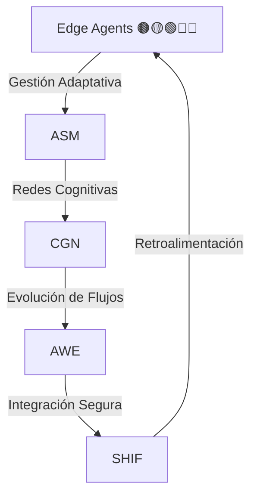

<!-- START doctoc generated TOC please keep comment here to allow auto update -->
<!-- DON'T EDIT THIS SECTION, INSTEAD RE-RUN doctoc TO UPDATE -->
Índice

- [Dominio: MACRO_MÓDULOS](#dominio-macro_m%C3%93dulos)
  - [Índice](#%C3%8Dndice)
  - [Descripción General](#descripci%C3%B3n-general)
  - [Macro-Módulos Incluidos](#macro-m%C3%B3dulos-incluidos)
    - [ASM: Adaptive State Manager](#asm-adaptive-state-manager)
    - [CGN: Cognitive Graph Network](#cgn-cognitive-graph-network)
    - [AWE: Adaptive Workflow Evolution](#awe-adaptive-workflow-evolution)
    - [SHIF: Secure Hybrid Integration Framework](#shif-secure-hybrid-integration-framework)
  - [Prioridad y Dependencias](#prioridad-y-dependencias)
  - [Valor de Negocio](#valor-de-negocio)
  - [Ejemplo de Uso](#ejemplo-de-uso)
  - [Recursos y Referencias](#recursos-y-referencias)

<!-- END doctoc generated TOC please keep comment here to allow auto update -->

# Dominio: MACRO_MÓDULOS

## Índice
1. [Descripción General](#descripción-general)
2. [Macro-Módulos Incluidos](#macro-módulos-incluidos)
   - [ASM: Adaptive State Manager](#asm-adaptive-state-manager)
   - [CGN: Cognitive Graph Network](#cgn-cognitive-graph-network)
   - [AWE: Adaptive Workflow Evolution](#awe-adaptive-workflow-evolution)
   - [SHIF: Secure Hybrid Integration Framework](#shif-secure-hybrid-integration-framework)
3. [Prioridad y Dependencias](#prioridad-y-dependencias)
4. [Valor de Negocio](#valor-de-negocio)
5. [Ejemplo de Uso](#ejemplo-de-uso)
6. [Recursos y Referencias](#recursos-y-referencias)

---

## Descripción General
Los Macro-Módulos son bloques funcionales avanzados del sistema ENIS: Enterprise Neural Intelligence Systems. Cada macro-módulo integra capacidades especializadas para la gestión, generación, potenciación y orquestación de inteligencia organizacional, asegurando escalabilidad, resiliencia y alineación estratégica.

---

## Macro-Módulos Incluidos

### ASM: Adaptive State Manager
Gestiona y orquesta estados adaptativos dentro de ENIS, permitiendo la integración y supervisión dinámica de Edge Agents 🟤🟡🟢🔵🔴, optimizando la toma de decisiones distribuida y la resiliencia operativa.

### CGN: Cognitive Graph Network
Facilita la generación, validación y despliegue de redes cognitivas, asegurando la adaptabilidad, el aprendizaje continuo y la interconexión inteligente de la organización.

### AWE: Adaptive Workflow Evolution
Potencia la evolución de flujos de trabajo mediante la integración de capacidades adaptativas, automatización inteligente y colaboración humano-máquina, permitiendo la mejora continua de procesos.

### SHIF: Secure Hybrid Integration Framework
Proporciona un marco seguro para la integración híbrida de sistemas, alineando los macro-módulos con los objetivos de negocio y facilitando la interoperabilidad y protección de datos en entornos complejos.

---

## Prioridad y Dependencias

- **Prioridad:** ALTA
- **Depende de:** Arquitectura
- **Requerido por:** Desarrollo, Operaciones

---

## Valor de Negocio

- Acelera la transformación digital mediante la modularización de capacidades clave.
- Permite la orquestación eficiente de Edge Agents 🟤🟡🟢🔵🔴 y recursos cognitivos.
- Mejora la resiliencia, escalabilidad y adaptabilidad del sistema ENIS.
- Facilita la alineación estratégica entre tecnología y objetivos de negocio.

---

## Ejemplo de Uso

---

## Recursos y Referencias

- [Documentación DNA v3.0](../../00-dna/BASE-PARA-DNA-v3.0.md)
- [Macro-Módulos: ASM](13-asm-master-prompt.md)
- [Macro-Módulos: CGN](14-cgn-master-prompt.md)
- [Macro-Módulos: AWE](15-awe-master-prompt.md)
- [Macro-Módulos: SHIF](16-shif-master-prompt.md)
