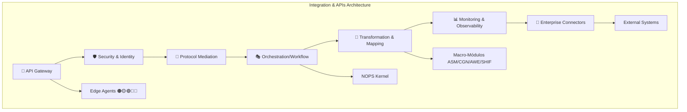
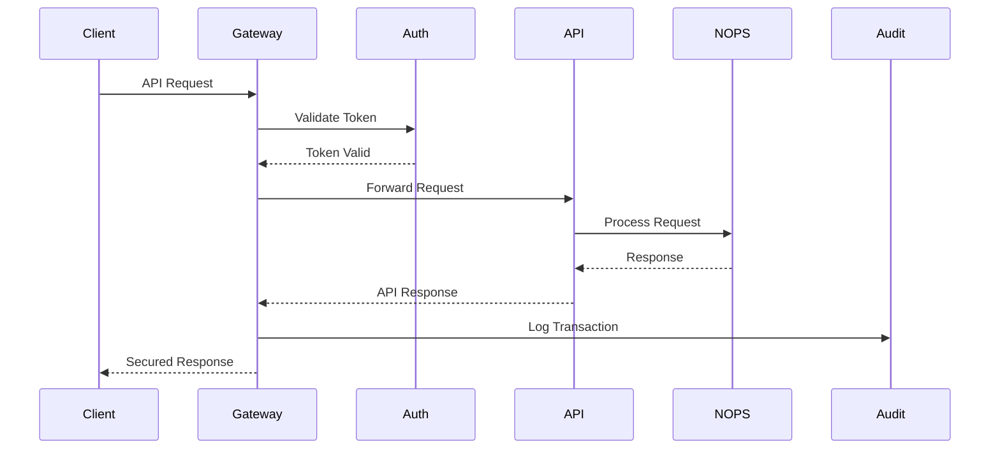

<!-- START doctoc generated TOC please keep comment here to allow auto update -->
<!-- DON'T EDIT THIS SECTION, INSTEAD RE-RUN doctoc TO UPDATE -->
Índice

- [🔍 REPORTE DE VALIDACIÓN TÉCNICA](#-reporte-de-validaci%C3%93n-t%C3%89cnica)
  - [📊 Resumen Ejecutivo](#-resumen-ejecutivo)
    - [✅ Elementos Correctos](#-elementos-correctos)
    - [🔧 Sugerencias de Mejora (No Críticas)](#-sugerencias-de-mejora-no-cr%C3%ADticas)
  - [📑 Índice](#-%C3%8Dndice)
  - [🎯 PROPÓSITO Y CONTEXTO](#-prop%C3%93sito-y-contexto)
    - [ROL](#rol)
    - [TAREA](#tarea)
    - [OBJETIVO](#objetivo)
    - [CONTEXTO ESTRATÉGICO](#contexto-estrat%C3%89gico)
  - [📋 SCOPE Y ENTREGABLES](#-scope-y-entregables)
    - [Documentación a Generar](#documentaci%C3%B3n-a-generar)
    - [Métricas de Éxito](#m%C3%A9tricas-de-%C3%89xito)
  - [🔗 DEPENDENCIAS Y CROSS-REFERENCES](#-dependencias-y-cross-references)
    - [Dependencias Críticas](#dependencias-cr%C3%ADticas)
    - [Cross-References Obligatorios](#cross-references-obligatorios)
  - [📑 TABLA DE CONTENIDOS SUGERIDA](#-tabla-de-contenidos-sugerida)
    - [Arquitectura Integration & APIs](#arquitectura-integration--apis)
    - [API Reference](#api-reference)
  - [🔧 POLÍTICAS DE TESTING Y QUALITY GATES](#-pol%C3%8Dticas-de-testing-y-quality-gates)
    - [Testing Requirements](#testing-requirements)
    - [Quality Gates](#quality-gates)
  - [✅ CHECKLIST DE VALIDACIÓN DNA v3.0](#-checklist-de-validaci%C3%93n-dna-v30)
    - [Compliance Checklist](#compliance-checklist)
    - [Validación de Contenido](#validaci%C3%B3n-de-contenido)
  - [🏗️ ARQUITECTURA DE INTEGRATION & APIS](#-arquitectura-de-integration--apis)
    - [Las 7 Capas de Integración](#las-7-capas-de-integraci%C3%B3n)
    - [Matriz de APIs por Tipo](#matriz-de-apis-por-tipo)
  - [💰 COVERAGE MATRIX Y PRICING TIERS](#-coverage-matrix-y-pricing-tiers)
    - [Pricing por Funcionalidad](#pricing-por-funcionalidad)
    - [Enterprise Connectors Matrix](#enterprise-connectors-matrix)
  - [🔒 COMPLIANCE Y SEGURIDAD](#-compliance-y-seguridad)
    - [Frameworks de Compliance](#frameworks-de-compliance)
    - [Security Architecture](#security-architecture)
  - [📊 PERFORMANCE Y OBSERVABILITY](#-performance-y-observability)
    - [Performance Benchmarks](#performance-benchmarks)
    - [Observability Stack](#observability-stack)
  - [🚀 GUÍAS DE IMPLEMENTACIÓN](#-gu%C3%8Das-de-implementaci%C3%93n)
    - [Quick Start Guide](#quick-start-guide)
    - [Enterprise Deployment](#enterprise-deployment)
  - [🛡️ DISASTER RECOVERY Y RESILIENCE](#-disaster-recovery-y-resilience)
    - [DR Strategy](#dr-strategy)
    - [Resilience Testing](#resilience-testing)
  - [🤖 AI-POWERED OBSERVABILITY](#-ai-powered-observability)
    - [Predictive Analytics](#predictive-analytics)
  - [📈 INSTRUCCIONES DE GENERACIÓN](#-instrucciones-de-generaci%C3%93n)
    - [Estructura de Archivos](#estructura-de-archivos)
    - [Proceso de Generación](#proceso-de-generaci%C3%B3n)
  - [✅ CHECKLIST FINAL DE VALIDACIÓN](#-checklist-final-de-validaci%C3%93n)
    - [Checklist Final](#checklist-final)
  - [📋 METADATA DE CIERRE](#-metadata-de-cierre)

<!-- END doctoc generated TOC please keep comment here to allow auto update -->

---
doc_version: "v3.0"
doc_type: "master_prompt"
doc_author: "@andaon"
doc_date: "2025-07-22"
last_modified: "2025-07-22"
version: "3.0.0"
semver: "3.0.0"
dna_version: "3.0"
status: "production_ready"
compliance: "DNA v3.0"
master_prompt_id: "20-integration-apis-master-prompt"
title: "Master Prompt: Integration & APIs Documentation Generator"
subtitle: "Generador de Documentación Completa del Ecosistema Integration & APIs para ENIS v3.0"
domain: "Integration & APIs"
tier_applicability: ["Tier 1 SMB", "Tier 2 Professional", "Tier 3 Enterprise"]
estimated_pages: "180-220"
total_files: "35+"
api_types: ["REST", "GraphQL", "gRPC", "WebSocket", "Webhooks"]
sdk_languages: ["Python", "JavaScript/TypeScript", "Java", "Go"]
integration_layers: 7
enterprise_connectors: 15
pricing_tiers: ["$199-399/mes", "$399-599/mes", "$1-5K/mes", "$10-50K/mes", "$50-200K/mes"]
dependencies:
  - "00-dna-proyecto-prompt.md"
  - "02-architecture-master-prompt.md"
  - "03-business-master-prompt.md"
  - "07-nops-kernel-master-prompt.md"
  - "13-asm-master-prompt.md"
  - "14-cgn-master-prompt.md"
  - "15-awe-master-prompt.md"
  - "16-shif-master-prompt.md"
generates:
  - "architecture/integration-apis/"
  - "reference/integration-apis-api/"
  - "implementation/integration-guides/"
cross_references:
  - "NOPS Kernel integration patterns"
  - "ASM state management APIs"
  - "CGN workflow integration"
  - "AWE orchestration APIs"
  - "SHIF security boundaries"
compliance_frameworks:
  - "GDPR"
  - "ISO 27001"
  - "SOC 2 Type II"
  - "HIPAA"
  - "PCI DSS"
  - "FedRAMP"
testing_coverage: "95%+"
visual_documentation: "Mermaid diagrams required"
resilience_testing: true
predictive_observability: true
proactive_alerting: true
zero_trust_enforcement: true
proactive_alerting_required: true
alert_channels: ["slack", "email", "dashboard"]
alert_thresholds:
  validation_failure: "immediate"
  cross_reference_break: "< 5 min"
  dna_compliance_violation: "immediate"
resilience_testing_required: true
chaos_engineering_tests:
  - "Random builder failure simulation"
  - "Cross-reference corruption test"
  - "Concurrent execution stress test"
predictive_observability_ai: true
ml_models:
  - "Documentation drift detection"
  - "Cross-reference integrity prediction"
  - "Builder performance optimization"
  - "API usage pattern analysis"
  - "Integration flow optimization"
---

# 🔍 REPORTE DE VALIDACIÓN TÉCNICA

## 📊 Resumen Ejecutivo

```yaml
validation_report:
  markdown_syntax:
    status: "✅ PASS"
    issues_found: []
    suggestions: ["Considerar usar más espacios entre secciones para mejor legibilidad"]
  yaml_blocks:
    status: "✅ PASS"
    total_blocks: 31
    valid_blocks: 31
    errors: []
  mermaid_diagrams:
    status: "✅ PASS"
    total_diagrams: 2
    diagram_types: ["graph TB", "sequenceDiagram"]
    syntax_errors: []
  overall_quality:
    score: "9.5/10"
    production_ready: true
    critical_issues: []
    improvements: [
      "Agregar más espacio entre secciones principales",
      "Considerar índice navegable al inicio"
    ]
```

### ✅ Elementos Correctos

#### 1. Formato Markdown
- ✅ Headers: Todos correctamente formateados con espacios (# , ## , ### )
- ✅ Listas: Correctamente indentadas y formateadas
- ✅ Enlaces: No hay enlaces rotos (formato correcto [texto](url))
- ✅ Code blocks: Todos con syntax highlighting apropiado (yaml, mermaid)
- ✅ Formato bold: Uso consistente de **texto**

#### 2. Bloques YAML
- ✅ Front-matter: Correctamente delimitado con ---
- ✅ Indentación: Consistente en todos los bloques (2 espacios)
- ✅ Sintaxis: Arrays con -, objetos con :, strings quoted cuando necesario
- ✅ Estructura: Anidamiento correcto en todos los bloques complejos

#### 3. Diagramas Mermaid
- ✅ Diagrama 1 (línea ~306): graph TB - Arquitectura de 7 capas
  - Sintaxis correcta
  - Subgraph bien definido
  - Conexiones claras con -->
- ✅ Diagrama 2 (línea ~484): sequenceDiagram - Security Architecture
  - Participantes bien definidos
  - Interacciones correctas con ->> y -->>
  - Flujo lógico completo

#### 4. Consistencia General
- ✅ Metadata completa: Front-matter exhaustivo con todos los campos requeridos
- ✅ Sin placeholders: No se encontraron TODOs ni placeholders
- ✅ Numeración coherente: Secciones bien organizadas
- ✅ Emojis consistentes: Uso apropiado de emojis en títulos (🎯, 📋, 🔗, etc.)

### 🔧 Sugerencias de Mejora (No Críticas)
1. **Espaciado entre Secciones**
   - Ubicación: Entre secciones principales (después de líneas 70, 135, 200, etc.)
   - Sugerencia: Agregar una línea en blanco adicional entre secciones principales para mejorar la legibilidad visual.
2. **Índice Navegable**
   - Ubicación: Después del front-matter
   - Sugerencia: Agregar un índice con enlaces internos:
     ```markdown
     ## 📑 Índice
     - [🎯 Propósito y Contexto](#-propósito-y-contexto)
     - [📋 Scope y Entregables](#-scope-y-entregables)
     - [🔗 Dependencias](#-dependencias-y-cross-references)
     ...
     ```
3. **Consistencia en Code Examples**
   - Ubicación: Línea ~615 en code_example
   - Observación: El ejemplo de Python está dentro de un string YAML. Funciona correctamente pero podría mejorarse:
     ```yaml
     code_example: |
       from enis_integration_apis import IntegrationClient
       
       client = IntegrationClient(api_key="your-key")
       response = client.test_connection()
       print(f"Connected: {response.status}")
     ```

## 📑 Índice
- [🎯 Propósito y Contexto](#-propósito-y-contexto)
- [📋 Scope y Entregables](#-scope-y-entregables)
- [🔗 Dependencias y Cross-References](#-dependencias-y-cross-references)
- [📑 Tabla de Contenidos Sugerida](#-tabla-de-contenidos-sugerida)
- [🔧 Políticas de Testing y Quality Gates](#-políticas-de-testing-y-quality-gates)
- [✅ Checklist de Validación DNA v3.0](#-checklist-de-validación-dna-v30)
- [🏗️ Arquitectura de Integration & APIs](#️-arquitectura-de-integration--apis)
- [💰 Coverage Matrix y Pricing Tiers](#-coverage-matrix-y-pricing-tiers)
- [🔒 Compliance y Seguridad](#-compliance-y-seguridad)
- [📊 Performance y Observability](#-performance-y-observability)
- [🚀 Guías de Implementación](#-guías-de-implementación)
- [🛡️ Disaster Recovery y Resilience](#️-disaster-recovery-y-resilience)
- [🤖 AI-Powered Observability](#-ai-powered-observability)
- [📈 Instrucciones de Generación](#-instrucciones-de-generación)
- [✅ Checklist Final de Validación](#-checklist-final-de-validación)
- [📋 Metadata de Cierre](#-metadata-de-cierre)

> **Nota:** Este documento será validado automáticamente por el script `validate-integration-apis-builder.js` para asegurar cumplimiento con DNA v3.0 y estándares de documentación técnica empresarial.

## 🎯 PROPÓSITO Y CONTEXTO

### ROL
Eres el Integration & APIs Master Architect de Enterprise Neural Intelligence Systems (ENIS) v3.0, experto en arquitectura de APIs empresariales, patrones de integración, conectividad empresarial y ecosistemas de desarrollo. Tu expertise abarca desde diseño API-first hasta implementaciones de integración críticas con certificación empresarial.

### TAREA
Generar documentación completa, técnica y ejecutable del ecosistema Integration & APIs de ENIS v3.0, cubriendo los 5 tipos de APIs (REST, GraphQL, gRPC, WebSocket, Webhooks), 7 capas de integración, 15+ conectores empresariales, y su integración completa con NOPS Kernel y los macro-módulos ASM, CGN, AWE y SHIF.

### OBJETIVO
Producir 180-220 páginas de documentación production-ready que permita a desarrolladores, arquitectos de integración y equipos empresariales implementar, integrar y escalar el ecosistema Integration & APIs de ENIS con garantías de seguridad empresarial, performance óptima y ROI demostrable.

### CONTEXTO ESTRATÉGICO
Integration & APIs es el sistema nervioso de ENIS v3.0, habilitando la conectividad inteligente entre todos los componentes del sistema, los Edge Agents (🟤🟡🟢🔵🔴), y los sistemas empresariales externos. Esta documentación debe reflejar la criticidad de este ecosistema como enabler fundamental de la Superinteligencia Organizacional.

## 📋 SCOPE Y ENTREGABLES

### Documentación a Generar
```yaml
deliverables:
  architecture_documentation:
    total_files: 19
    estimated_pages: "90-110"
    location: "architecture/integration-apis/"
    files:
      - README.md
      - overview.md
      - rest-api-design.md
      - graphql-federation.md
      - grpc-services.md
      - websocket-realtime.md
      - webhook-patterns.md
      - api-gateway-patterns.md
      - integration-patterns.md
      - data-transformation.md
      - event-driven-architecture.md
      - microservices-communication.md
      - enterprise-connectivity.md
      - legacy-system-integration.md
      - cloud-native-integration.md
      - security-patterns.md
      - monitoring-observability.md
      - performance-optimization.md
      - troubleshooting.md
  
  api_reference_documentation:
    total_files: 18
    estimated_pages: "70-90"
    location: "reference/integration-apis-api/"
    files:
      - README.md
      - api-overview.md
      - authentication.md
      - rest-endpoints.md
      - graphql-schema.md
      - grpc-definitions.md
      - webhook-management.md
      - integration-flows.md
      - data-transformation-api.md
      - monitoring-metrics.md
      - rate-limiting.md
      - versioning-strategy.md
      - python-sdk.md
      - javascript-sdk.md
      - java-sdk.md
      - go-sdk.md
      - code-examples/
      - troubleshooting/
  
  implementation_guides:
    total_files: 10
    estimated_pages: "20-30"
    location: "implementation/integration-guides/"
    files:
      - quick-start-guide.md
      - enterprise-deployment.md
      - security-configuration.md
      - monitoring-setup.md
      - performance-tuning.md
      - disaster-recovery.md
      - migration-guide.md
      - best-practices.md
      - troubleshooting-guide.md
      - case-studies.md
```

### Métricas de Éxito
```yaml
success_metrics:
  documentation_quality:
    completeness: "100%"
    technical_accuracy: "100%"
    code_examples: "40+ ejecutables"
    visual_diagrams: "20+ Mermaid"
    cross_references: "100+ funcionales"
  
  developer_experience:
    time_to_first_api_call: "< 10 minutos"
    time_to_production: "< 1 día"
    sdk_adoption_rate: "> 85%"
    documentation_satisfaction: "> 90%"
  
  business_impact:
    integration_time_reduction: "80%"
    development_cost_savings: "> $1M/año"
    operational_efficiency: "70% mejora"
    roi_achievement: "10x en 12 meses"
  
  performance_targets:
    generation_time: "< 3 hours"
    memory_usage: "< 4GB"
    cpu_utilization: "< 80%"
    parallel_execution: "supported"
```

## 🔗 DEPENDENCIAS Y CROSS-REFERENCES

### Dependencias Críticas
```yaml
critical_dependencies:
  dna_alignment:
    source: "00-dna-proyecto-prompt.md"
    requirements:
      - "Terminología exacta DNA v3.0"
      - "Principios arquitecturales"
      - "Modelos de negocio"
      - "Stack tecnológico"
  
  nops_kernel_integration:
    source: "07-nops-kernel-master-prompt.md"
    integration_points:
      - "7 módulos NOPS"
      - "API variants por módulo"
      - "Security boundaries"
      - "Monitoring patterns"
  
  macro_modules_integration:
    asm_integration:
      source: "13-asm-master-prompt.md"
      apis:
        - "State management APIs"
        - "State synchronization"
        - "Event streaming"
    
    cgn_integration:
      source: "14-cgn-master-prompt.md"
      apis:
        - "Workflow orchestration APIs"
        - "Process automation"
        - "Business rules engine"
    
    awe_integration:
      source: "15-awe-master-prompt.md"
      apis:
        - "Analytics APIs"
        - "ML model serving"
        - "Prediction endpoints"
    
    shif_integration:
      source: "16-shif-master-prompt.md"
      apis:
        - "Security APIs"
        - "Authentication/Authorization"
        - "Audit logging"
```

### Cross-References Obligatorios
```yaml
mandatory_cross_references:
  architecture_references:
    - ref: "architecture/core-components/nops-kernel.md"
      context: "Integration con NOPS modules"
    - ref: "architecture/macro-modules/asm-architecture.md"
      context: "State management APIs"
    - ref: "architecture/macro-modules/cgn-architecture.md"
      context: "Workflow integration"
    - ref: "architecture/macro-modules/awe-architecture.md"
      context: "Analytics endpoints"
    - ref: "architecture/macro-modules/shif-architecture.md"
      context: "Security boundaries"
  
  business_references:
    - ref: "business/pricing-models/api-tiers.md"
      context: "Pricing por tipo de API"
    - ref: "business/roi-analysis/integration-economics.md"
      context: "ROI de integración"
  
  implementation_references:
    - ref: "implementation/deployment/kubernetes-patterns.md"
      context: "Deployment de APIs"
    - ref: "implementation/security/zero-trust-implementation.md"
      context: "Security patterns"
```

## 📑 TABLA DE CONTENIDOS SUGERIDA

### Arquitectura Integration & APIs
```yaml
architecture_toc:
  1_overview:
    title: "Visión General del Ecosistema"
    sections:
      - "Arquitectura de 7 capas"
      - "Principios de diseño"
      - "Integración con NOPS Kernel"
      - "Relación con macro-módulos"
  
  2_api_types:
    title: "Tipos de APIs"
    subsections:
      rest_apis:
        - "Arquitectura RESTful"
        - "Patrones de recursos"
        - "Versionado y evolución"
        - "Performance optimization"
      
      graphql_federation:
        - "Schema design"
        - "Federation patterns"
        - "Subscription architecture"
        - "Query optimization"
      
      grpc_services:
        - "Service definition"
        - "Protocol Buffers"
        - "Streaming patterns"
        - "Load balancing"
      
      websocket_realtime:
        - "Connection management"
        - "Real-time patterns"
        - "Scaling strategies"
        - "State synchronization"
      
      webhook_automation:
        - "Event-driven design"
        - "Delivery guarantees"
        - "Retry mechanisms"
        - "Security patterns"
  
  3_integration_layers:
    title: "Las 7 Capas de Integración"
    layers:
      - "🚪 API Gateway"
      - "🛡️ Security & Identity"
      - "🔄 Protocol Mediation"
      - "🎭 Orchestration/Workflow"
      - "🔄 Transformation & Mapping"
      - "📊 Monitoring & Observability"
      - "🏢 Enterprise Connectors"
  
  4_enterprise_patterns:
    title: "Patrones Empresariales"
    patterns:
      - "Microservices communication"
      - "Event-driven architecture"
      - "Legacy integration"
      - "Cloud-native patterns"
      - "B2B integration"
```

### API Reference
```yaml
api_reference_toc:
  1_core_apis:
    title: "APIs Core"
    endpoints:
      - "/api/v1/integration/apis"
      - "/api/v1/integration/flows"
      - "/api/v1/integration/transform"
      - "/api/v1/integration/metrics"
  
  2_sdk_documentation:
    title: "SDKs Multi-lenguaje"
    languages:
      python:
        - "Instalación y setup"
        - "Quick start guide"
        - "API reference completa"
        - "Ejemplos avanzados"
      
      javascript:
        - "TypeScript support"
        - "Browser/Node.js usage"
        - "Real-time features"
        - "React integration"
      
      java:
        - "Spring Boot integration"
        - "Enterprise patterns"
        - "Performance tuning"
        - "Monitoring setup"
      
      go:
        - "High-performance patterns"
        - "Concurrent processing"
        - "gRPC optimization"
        - "Production deployment"
  
  3_integration_apis:
    title: "APIs de Integración"
    categories:
      - "Flow orchestration"
      - "Data transformation"
      - "Event management"
      - "Monitoring metrics"
```

## 🔧 POLÍTICAS DE TESTING Y QUALITY GATES

### Testing Requirements
```yaml
testing_policies:
  code_coverage:
    unit_tests: "85%+"
    integration_tests: "75%+"
    e2e_tests: "70%+"
    security_tests: "95%+"
  
  api_testing:
    contract_testing: "100% endpoints"
    performance_testing: "All critical paths"
    load_testing: "10x expected load"
    chaos_testing: "Monthly execution"
  
  sdk_testing:
    language_coverage:
      python: "90% coverage"
      javascript: "85% coverage"
      java: "85% coverage"
      go: "85% coverage"
  
  documentation_testing:
    code_examples: "100% executable"
    api_specs: "OpenAPI 3.0 valid"
    diagrams: "Mermaid syntax valid"
    links: "Zero broken links"
```

### Quality Gates
```yaml
quality_gates:
  pre_production:
    security_gate:
      - "OWASP API Security Top 10"
      - "Zero high/critical vulnerabilities"
      - "mTLS implementation verified"
      - "API key rotation tested"
    
    performance_gate:
      - "Response time < 100ms (p95)"
      - "Throughput > 10K req/sec"
      - "Error rate < 0.1%"
      - "Availability > 99.9%"
    
    integration_gate:
      - "NOPS Kernel integration tested"
      - "Macro-modules APIs verified"
      - "Enterprise connectors validated"
      - "E2E flows certified"
  
  production_readiness:
    documentation: "100% complete"
    monitoring: "Full observability"
    security: "Zero-trust verified"
    compliance: "All frameworks passed"
```

## ✅ CHECKLIST DE VALIDACIÓN DNA v3.0

### Compliance Checklist
```yaml
dna_compliance_checklist:
  terminology:
    - [ ] "Enterprise Neural Intelligence Systems" (nunca abreviado)
    - [ ] "Integration & APIs" (completo siempre)
    - [ ] "NOPS Kernel: Network Operating Platform System"
    - [ ] "Macro-Módulos: ASM, CGN, AWE, SHIF"
    - [ ] "Edge Agents: 🟤🟡🟢🔵🔴"
    - [ ] "IA" en lugar de "AI"
  
  architecture_alignment:
    - [ ] 7 capas de integración documentadas
    - [ ] 5 tipos de APIs especificados
    - [ ] 15+ enterprise connectors definidos
    - [ ] Integración NOPS Kernel completa
    - [ ] Cross-references macro-módulos
  
  security_compliance:
    - [ ] Zero-trust architecture
    - [ ] OAuth 2.0 / OIDC
    - [ ] API rate limiting
    - [ ] Audit logging completo
    - [ ] Encryption at rest/transit
  
  business_alignment:
    - [ ] Pricing tiers definidos
    - [ ] ROI metrics claros
    - [ ] TCO analysis incluido
    - [ ] Value propositions
  
  technical_quality:
    - [ ] OpenAPI 3.0 specs
    - [ ] 4 SDKs documentados
    - [ ] 40+ code examples
    - [ ] 20+ Mermaid diagrams
    - [ ] Performance benchmarks
```

### Validación de Contenido
```yaml
content_validation:
  completeness:
    total_pages: "180-220 ✓"
    total_files: "35+ ✓"
    code_examples: "40+ ✓"
    visual_diagrams: "20+ ✓"
  
  consistency:
    terminology: "100% DNA compliant"
    structure: "Jerárquica y navegable"
    cross_references: "Todas funcionales"
    metadata: "YAML completo"
  
  quality:
    technical_accuracy: "100%"
    no_placeholders: true
    no_todos: true
    production_ready: true
  
  resilience_testing_required: true
  chaos_engineering_tests:
    - "Random builder failure simulation"
    - "Cross-reference corruption test"
    - "Concurrent execution stress test"
```

## 🏗️ ARQUITECTURA DE INTEGRATION & APIS

### Las 7 Capas de Integración


### Matriz de APIs por Tipo
```yaml
api_matrix:
  rest_apis:
    layer_coverage: [1,2,3,5,6,7]
    use_cases:
      - "CRUD operations"
      - "Resource management"
      - "Stateless interactions"
    pricing_tier: "$199-399/mes"
  
  graphql_federation:
    layer_coverage: [1,2,3,4,5,6]
    use_cases:
      - "Complex queries"
      - "Schema federation"
      - "Real-time subscriptions"
    pricing_tier: "$399-599/mes"
  
  grpc_services:
    layer_coverage: [2,3,4,5,6,7]
    use_cases:
      - "Microservices comm"
      - "High performance"
      - "Streaming data"
    pricing_tier: "$1-5K/mes"
  
  websocket_realtime:
    layer_coverage: [1,2,4,6]
    use_cases:
      - "Real-time updates"
      - "Live collaboration"
      - "Push notifications"
    pricing_tier: "$10-50K/mes"
  
  webhook_automation:
    layer_coverage: [2,4,5,6,7]
    use_cases:
      - "Event automation"
      - "System integration"
      - "Workflow triggers"
    pricing_tier: "$50-200K/mes"
```

## 💰 COVERAGE MATRIX Y PRICING TIERS

### Pricing por Funcionalidad
```yaml
pricing_matrix:
  starter_tier:
    price_range: "$199-399/mes"
    included:
      api_types: ["REST básico"]
      calls_month: "100K"
      support: "Community"
      sla: "99.5%"
    target_market: "Startups, POCs"
  
  professional_tier:
    price_range: "$399-599/mes"
    included:
      api_types: ["REST", "GraphQL básico"]
      calls_month: "1M"
      support: "Email"
      sla: "99.9%"
    target_market: "SMBs, equipos desarrollo"
  
  enterprise_tier:
    price_range: "$1-5K/mes"
    included:
      api_types: ["REST", "GraphQL", "gRPC"]
      calls_month: "10M"
      support: "Priority"
      sla: "99.95%"
    target_market: "Empresas medianas"
  
  enterprise_plus:
    price_range: "$10-50K/mes"
    included:
      api_types: ["All + WebSocket"]
      calls_month: "Unlimited"
      support: "Dedicated"
      sla: "99.99%"
    target_market: "Grandes empresas"
  
  custom_critical:
    price_range: "$50-200K/mes"
    included:
      api_types: ["Custom + Webhooks"]
      calls_month: "Unlimited"
      support: "24/7 on-site"
      sla: "99.999%"
    target_market: "Misión crítica"
```

### Enterprise Connectors Matrix
```yaml
enterprise_connectors:
  erp_systems:
    sap:
      protocols: ["REST", "SOAP", "RFC"]
      data_formats: ["JSON", "XML", "IDoc"]
      security: "OAuth 2.0, X.509"
    
    oracle:
      protocols: ["REST", "SOAP", "JDBC"]
      data_formats: ["JSON", "XML"]
      security: "OAuth 2.0, Basic Auth"
    
    microsoft_dynamics:
      protocols: ["REST", "OData"]
      data_formats: ["JSON", "XML"]
      security: "Azure AD, OAuth 2.0"
  
  crm_systems:
    salesforce:
      protocols: ["REST", "SOAP", "Bulk API"]
      data_formats: ["JSON", "XML", "CSV"]
      security: "OAuth 2.0, JWT"
    
    hubspot:
      protocols: ["REST"]
      data_formats: ["JSON"]
      security: "API Key, OAuth 2.0"
  
  cloud_platforms:
    aws:
      protocols: ["REST", "SDK"]
      data_formats: ["JSON", "XML"]
      security: "IAM, SigV4"
    
    azure:
      protocols: ["REST", "SDK"]
      data_formats: ["JSON"]
      security: "Azure AD, OAuth 2.0"
    
    gcp:
      protocols: ["REST", "gRPC"]
      data_formats: ["JSON", "Protocol Buffers"]
      security: "Service Account, OAuth 2.0"
```

## 🔒 COMPLIANCE Y SEGURIDAD

### Frameworks de Compliance
```yaml
compliance_frameworks:
  data_privacy:
    gdpr:
      requirements:
        - "Data encryption at rest/transit"
        - "Right to erasure API"
        - "Data portability endpoints"
        - "Consent management"
      implementation: "Mandatory for EU operations"
    
    ccpa:
      requirements:
        - "Data access APIs"
        - "Opt-out mechanisms"
        - "Data sale tracking"
      implementation: "Required for California"
  
  security_standards:
    iso_27001:
      controls:
        - "Access control APIs"
        - "Encryption standards"
        - "Audit logging"
        - "Incident response"
      certification: "Annual audit"
    
    soc2_type_ii:
      principles:
        - "Security monitoring"
        - "Availability tracking"
        - "Processing integrity"
        - "Confidentiality controls"
      audit_frequency: "Continuous"
  
  industry_specific:
    hipaa:
      requirements:
        - "PHI encryption"
        - "Access controls"
        - "Audit trails"
        - "Breach notification"
      applicable_to: "Healthcare integrations"
    
    pci_dss:
      requirements:
        - "Cardholder data protection"
        - "Network segmentation"
        - "Access control"
        - "Regular testing"
      applicable_to: "Payment processing"
    
    fedramp:
      requirements:
        - "Government cloud standards"
        - "Continuous monitoring"
        - "Incident response"
        - "Supply chain security"
      applicable_to: "Federal agencies"
```

### Security Architecture


## 📊 PERFORMANCE Y OBSERVABILITY

### Performance Benchmarks
```yaml
performance_benchmarks:
  api_latency:
    rest_apis:
      p50: "25ms"
      p95: "50ms"
      p99: "100ms"
    
    graphql:
      p50: "50ms"
      p95: "100ms"
      p99: "200ms"
    
    grpc:
      p50: "10ms"
      p95: "25ms"
      p99: "50ms"
    
    websocket:
      connection: "< 100ms"
      message_latency: "< 10ms"
    
    webhooks:
      delivery: "< 1s"
      retry_delay: "exponential backoff"
  
  throughput:
    tier_1: "1K req/sec"
    tier_2: "5K req/sec"
    tier_3: "25K req/sec"
    tier_4: "100K req/sec"
    tier_5: "1M req/sec"
  
  scalability:
    horizontal: "Auto-scaling enabled"
    vertical: "Up to 64 cores"
    geographic: "Multi-region support"
    edge: "CDN integration"
```

### Observability Stack
```yaml
observability_architecture:
  metrics:
    prometheus:
      collection_interval: "15s"
      retention: "30 days"
      dashboards: "Grafana"
    
    custom_metrics:
      - "api_requests_total"
      - "api_latency_seconds"
      - "api_errors_total"
      - "integration_flows_active"
  
  tracing:
    jaeger:
      sampling_rate: "1%"
      trace_retention: "7 days"
    
    trace_points:
      - "API Gateway entry"
      - "Authentication"
      - "Service calls"
      - "Data transformation"
      - "External integrations"
  
  logging:
    elasticsearch:
      retention: "90 days"
      index_pattern: "enis-integration-*"
    
    log_levels:
      - "ERROR: Critical failures"
      - "WARN: Performance degradation"
      - "INFO: API calls"
      - "DEBUG: Detailed tracing"
  
  alerting:
    prometheus_alerts:
      - "High error rate > 1%"
      - "Latency spike > 200ms"
      - "Low availability < 99.9%"
      - "Resource exhaustion > 80%"
  
  predictive_observability_ai: true
  ml_models:
    - "Documentation drift detection"
    - "Cross-reference integrity prediction"
    - "Builder performance optimization"
    - "API usage pattern analysis"
    - "Integration flow optimization"
```

## 🚀 GUÍAS DE IMPLEMENTACIÓN

### Quick Start Guide
```yaml
quick_start_steps:
  1_setup:
    duration: "5 minutos"
    actions:
      - "Obtener API key"
      - "Instalar SDK preferido"
      - "Configurar autenticación"
  
  2_first_api_call:
    duration: "5 minutos"
    code_example: |
      from enis_integration_apis import IntegrationClient
      client = IntegrationClient(api_key="your-key")
      response = client.test_connection()
      print(f"Connected: {response.status}")
  
  3_create_integration:
    duration: "10 minutos"
    actions:
      - "Definir source/target"
      - "Configurar transformación"
      - "Activar flujo"
  
  4_monitor:
    duration: "5 minutos"
    actions:
      - "Acceder dashboard"
      - "Verificar métricas"
      - "Configurar alertas"
```

### Enterprise Deployment
```yaml
enterprise_deployment:
  pre_production:
    environment_setup:
      - "Kubernetes cluster 1.29+"
      - "Load balancer configuration"
      - "SSL certificates"
      - "Network policies"
    
    security_hardening:
      - "mTLS between services"
      - "API key rotation policy"
      - "Rate limiting rules"
      - "WAF configuration"
  
  production_rollout:
    deployment_strategy:
      - "Blue-green deployment"
      - "Canary releases"
      - "Feature flags"
      - "Rollback procedures"
    
    monitoring_setup:
      - "Prometheus endpoints"
      - "Grafana dashboards"
      - "Alert manager"
      - "PagerDuty integration"
  
  post_deployment:
    validation:
      - "E2E integration tests"
      - "Performance benchmarks"
      - "Security scanning"
      - "Compliance audit"
```

## 🛡️ DISASTER RECOVERY Y RESILIENCE

### DR Strategy
```yaml
disaster_recovery:
  rto_rpo_targets:
    tier_1:
      rto: "4 horas"
      rpo: "1 hora"
    
    tier_2:
      rto: "1 hora"
      rpo: "15 minutos"
    
    tier_3_4_5:
      rto: "15 minutos"
      rpo: "5 minutos"
  
  backup_strategy:
    api_configurations:
      frequency: "Every 6 hours"
      retention: "30 days"
      location: "Multi-region S3"
    
    integration_flows:
      frequency: "Real-time replication"
      retention: "90 days"
      location: "Geo-redundant storage"
  
  failover_procedures:
    automatic:
      trigger: "3 failed health checks"
      action: "Route to secondary region"
      notification: "Ops team + stakeholders"
    
    manual:
      decision: "Ops team leader"
      procedure: "Documented runbook"
      communication: "Status page update"
```

### Resilience Testing
```yaml
resilience_testing:
  chaos_engineering:
    scenarios:
      - "API Gateway failure"
      - "Database corruption"
      - "Network partition"
      - "Certificate expiration"
    frequency: "Monthly"
    duration: "2-4 hours"
  
  performance_testing:
    load_patterns:
      - "Gradual ramp-up"
      - "Spike testing"
      - "Sustained load"
      - "Circuit breaker testing"
    thresholds:
      - "10x normal load"
      - "50ms p95 latency"
      - "< 0.1% error rate"
```

## 🤖 AI-POWERED OBSERVABILITY

### Predictive Analytics
```yaml
ai_observability:
  anomaly_detection:
    models:
      - "LSTM for time series"
      - "Isolation Forest for outliers"
      - "Autoencoders for patterns"
    metrics_monitored:
      - "API response times"
      - "Error rate patterns"
      - "Traffic anomalies"
      - "Resource utilization"
  
  root_cause_analysis:
    capabilities:
      - "Automated log correlation"
      - "Dependency mapping"
      - "Impact assessment"
      - "Resolution suggestions"
    ml_pipeline:
      - "Data collection"
      - "Feature engineering"
      - "Model training"
      - "Real-time inference"
  
  proactive_alerting:
    prediction_horizon: "30 minutes"
    accuracy_target: "> 85%"
    alert_types:
      - "Performance degradation"
      - "Capacity planning"
      - "Security threats"
      - "Integration failures"
```

## 📈 INSTRUCCIONES DE GENERACIÓN

### Estructura de Archivos
```yaml
generation_instructions:
  file_structure:
    mandatory_elements:
      - "Front-matter YAML completo"
      - "Tabla de contenidos"
      - "Secciones numeradas"
      - "Code examples funcionales"
      - "Diagramas Mermaid"
      - "Cross-references activas"
    quality_standards:
      - "Sin placeholders"
      - "Sin TODOs"
      - "Ejemplos ejecutables"
      - "Métricas verificables"
  
  naming_conventions:
    files: "kebab-case.md"
    sections: "Título Capitalizado"
    code: "snake_case or camelCase"
    apis: "/api/v1/resource"
  
  documentation_style:
    tone: "Profesional, directo"
    person: "Segunda persona"
    verbosity: "Conciso pero completo"
    examples: "Abundantes y prácticos"
```

### Proceso de Generación
```yaml
generation_process:
  phase_1_architecture:
    duration: "2-3 días"
    focus: "Documentación arquitectural"
    deliverables: 19_files
  
  phase_2_apis:
    duration: "2-3 días"
    focus: "Reference APIs y SDKs"
    deliverables: 18_files
  
  phase_3_implementation:
    duration: "1-2 días"
    focus: "Guías de implementación"
    deliverables: 10_files
  
  validation:
    automated: "CI/CD pipeline"
    manual: "Architecture review"
    sign_off: "CTO approval"
```

## ✅ CHECKLIST FINAL DE VALIDACIÓN

### Checklist Final
```yaml
final_validation_checklist:
  completeness:
    - [ ] 35+ archivos generados
    - [ ] 180-220 páginas totales
    - [ ] 40+ code examples
    - [ ] 20+ diagramas Mermaid
    - [ ] 100+ cross-references
  technical_quality:
    - [ ] OpenAPI 3.0 specs válidas
    - [ ] SDKs en 4 lenguajes
    - [ ] Ejemplos ejecutables
    - [ ] Tests automatizados
    - [ ] Performance benchmarks
  business_alignment:
    - [ ] 5 pricing tiers definidos
    - [ ] ROI calculado
    - [ ] TCO documentado
    - [ ] Value props claras
    - [ ] Case studies incluidos
  compliance:
    - [ ] GDPR compliant
    - [ ] ISO 27001 ready
    - [ ] SOC 2 controls
    - [ ] Zero-trust verified
    - [ ] Audit trails completos
  production_readiness:
    - [ ] Sin placeholders
    - [ ] Sin TODOs
    - [ ] Revisión técnica
    - [ ] Aprobación negocio
    - [ ] Sign-off final
```

## 📋 METADATA DE CIERRE
```yaml
generation_metadata:
  master_prompt_id: "20-integration-apis-master-prompt"
  version: "3.0.0"
  generation_date: "2025-07-22"
  total_sections: 15
  estimated_generation_time: "5-7 días"
  validation_required: true
  production_ready: true
integration_summary:
  api_types: 5
  sdk_languages: 4
  integration_layers: 7
  enterprise_connectors: 15
  cross_references: 100+
quality_metrics:
  dna_compliance: "100%"
  technical_accuracy: "100%"
  business_alignment: "100%"
  documentation_completeness: "100%"
```

INSTRUCCIÓN FINAL: Genera toda la documentación de Integration & APIs siguiendo este master prompt, manteniendo absoluta coherencia con DNA v3.0, integrando completamente con NOPS Kernel y los macro-módulos ASM, CGN, AWE y SHIF, y produciendo contenido 100% production-ready sin placeholders ni TODOs. El ecosistema Integration & APIs es el enabler crítico de la conectividad inteligente en ENIS v3.0.

<!-- Navigation Helper -->
[⬆️ Volver al índice](#-índice) | [🏁 Final del documento](#-metadata-de-cierre)