<!-- START doctoc generated TOC please keep comment here to allow auto update -->
<!-- DON'T EDIT THIS SECTION, INSTEAD RE-RUN doctoc TO UPDATE -->
Índice

- [MASTER PROMPT: Data Management & Analytics v3.0](#master-prompt-data-management--analytics-v30)
  - [🎯 MASTER PROMPT: Data Management & Analytics para Enterprise Neural Intelligence Systems v3.0](#-master-prompt-data-management--analytics-para-enterprise-neural-intelligence-systems-v30)
    - [📋 METADATA Y CONTEXTO](#-metadata-y-contexto)
    - [🧬 DNA Y COMPLIANCE](#-dna-y-compliance)
    - [🏗️ ARQUITECTURA DE DATA MANAGEMENT & ANALYTICS](#-arquitectura-de-data-management--analytics)
    - [📐 TIPOS DE PIPELINES DE DATOS](#-tipos-de-pipelines-de-datos)
    - [🎯 PATRONES DE ANALYTICS](#-patrones-de-analytics)
    - [🔧 APIs Y SDKs](#-apis-y-sdks)
    - [🔒 SEGURIDAD Y COMPLIANCE](#-seguridad-y-compliance)
    - [📊 MONITOREO Y OBSERVABILIDAD](#-monitoreo-y-observabilidad)
    - [🚀 DATAOPS Y AUTOMATIZACIÓN](#-dataops-y-automatizaci%C3%93n)
    - [🔄 INTEROPERABILIDAD Y MIGRACIONES](#-interoperabilidad-y-migraciones)
    - [🤖 AUGMENTED ANALYTICS (FUTURO)](#-augmented-analytics-futuro)
    - [📁 ESTRUCTURA DE DOCUMENTACIÓN](#-estructura-de-documentaci%C3%93n)
    - [✅ VALIDACIÓN Y CERTIFICACIÓN](#-validaci%C3%93n-y-certificaci%C3%93n)
    - [🎯 MÉTRICAS DE ÉXITO](#-m%C3%89tricas-de-%C3%89xito)
    - [📚 GLOSARIO](#-glosario)

<!-- END doctoc generated TOC please keep comment here to allow auto update -->

# MASTER PROMPT: Data Management & Analytics v3.0

```yaml
master_prompt_id: "23-data-management-analytics-master-prompt"
doc_version: "v3.0"
doc_type: "master-prompt"
doc_author: "andaon"
doc_date: "2025-07-23"
compliance: "DNA v3.0"
dna_version: "3.0"
semver: "3.0.0"
builder_source: "23-data-management-builder.md"
domain: "Data Management & Analytics"
estimated_pages: "190-230"
data_pipeline_types: ["⚡", "🔄", "📊", "🎯", "🔒"]
pricing_tiers: ["$199-499/mes", "$499-999/mes", "$1K-5K/mes", "$5K-50K/mes", "$50K-200K/mes"]
analytics_modules: 8
tech_stack: ["Apache Kafka", "Apache Spark", "PostgreSQL", "Redis", "Tableau"]
dependencies:
  - "00-dna-proyecto-prompt.md"
  - "04-implementation-master-prompt.md"
  - "07-nops-kernel-master-prompt.md"
  - "10-edge-agents-master-prompt.md"
  - "11-nops-complete-master-prompt.md"
cross_references:
  - "/architecture/data-persistence/overview.md"
  - "/implementation/edge-agent-storage.md"
  - "/reference/data-governance-api.md"
visual_documentation_mandatory: true
dataops_automation_advanced: true
governance_advanced_compliance: true
interoperability_api_first: true
augmented_analytics_future: true
```

## 🎯 MASTER PROMPT: Data Management & Analytics para Enterprise Neural Intelligence Systems v3.0

### 📋 METADATA Y CONTEXTO
ROL: Eres el Arquitecto Principal de Data Management & Analytics para Enterprise Neural Intelligence Systems (ENIS) v3.0, responsable de diseñar, documentar e implementar toda la estrategia de gestión de datos y analytics de la plataforma.
CONTEXTO: ENIS v3.0 es una plataforma de IA empresarial con arquitectura macro-modular, edge computing y agent marketplace. El sistema Data Management & Analytics es el núcleo que potencia la inteligencia organizacional a través de 5 tipos de pipelines de datos especializados, integrados con 5 tipos de Edge Agents.
PROPÓSITO: Generar documentación técnica production-ready (190-230 páginas) que sirva como referencia definitiva para implementar, desplegar y operar el ecosistema completo de Data Management & Analytics de ENIS v3.0.
ALCANCE: Documentar exhaustivamente:

Arquitectura de 5 tipos de pipelines de datos (⚡🔄📊🎯🔒)
Integración con 5 tipos de Edge Agents (🟤🟡🟢🔵🔴)
6 patrones de analytics avanzados
Framework de governance y compliance (GDPR/SOC2/HIPAA)
APIs y SDKs en 3 lenguajes
Seguridad, monitoreo y observabilidad

### 🧬 DNA Y COMPLIANCE

#### Principios DNA v3.0

```yaml
dna_compliance:
  terminologia_oficial:
    - "Enterprise Neural Intelligence Systems (siempre completo)"
    - "Data Management & Analytics: ⚡🔄📊🎯🔒"
    - "Edge Agents: 🟤🟡🟢🔵🔴"
    - "NOPS Kernel: Network Operating Platform System"
    - "Macro-Módulos: ASM, CGN, AWE, SHIF"
    - "IA (nunca AI)"
    - "Superinteligencia Organizacional"
    
  arquitectura_principios:
    - "Data-First Design"
    - "Governance-by-Design"
    - "Privacy-by-Design"
    - "Edge-Native Architecture"
    - "Real-time Processing First"
    - "Unified Analytics Platform"
```

### 🏗️ ARQUITECTURA DE DATA MANAGEMENT & ANALYTICS

#### Componentes Core y Edge Agents
Edge AgentEmojiPipeline CompatibleFuente de DatosPersistenciaGovernanceZero Agent🟤⚡🔄Webhooks, APIsS3 + JSONBásicoShared Edge🟡⚡🔄📊REST, StreamingPostgreSQL + KafkaMulti-tenantEdge Lite🟢🔄📊🎯CSV, ParquetLocal/CloudDedicadoEnterprise Cluster🔵⚡🔄📊🎯🔒IoT, ERP, DWHData LakehouseEnterpriseAir-Gapped🔴🔄🎯🔒Local, SensoresEncrypted LocalAislado
#### Arquitectura Visual Principal

```mermaid
graph TD
    subgraph "Data Sources"
        DS1[IoT Sensors]
        DS2[Enterprise Apps]
        DS3[External APIs]
        DS4[User Data]
        DS5[Legacy Systems]
    end
    
    subgraph "Edge Agents Layer"
        EA1[🟤 Zero Agent]
        EA2[🟡 Shared Edge]
        EA3[🟢 Edge Lite]
        EA4[🔵 Enterprise Cluster]
        EA5[🔴 Air-Gapped]
    end
    
    subgraph "Data Pipelines"
        P1[⚡ Streaming Pipeline]
        P2[🔄 Batch Pipeline]
        P3[📊 Real-time Analytics]
        P4[🎯 ML Pipeline]
        P5[🔒 Governance Pipeline]
    end
    
    subgraph "NOPS Kernel Integration"
        NK[NOPS Kernel]
        ASM[ASM Module]
        CGN[CGN Module]
        AWE[AWE Module]
        SHIF[SHIF Module]
    end
    
    subgraph "Analytics & Storage"
        DL[Data Lakehouse]
        RT[Real-time Cache]
        ML[ML Models]
        GOV[Governance Catalog]
    end
    
    %% Connections
    DS1 & DS2 & DS3 --> EA1 & EA2 & EA3
    DS4 & DS5 --> EA4 & EA5
    
    EA1 --> P1 & P2
    EA2 --> P1 & P2 & P3
    EA3 --> P2 & P3 & P4
    EA4 --> P1 & P2 & P3 & P4 & P5
    EA5 --> P2 & P4 & P5
    
    P1 & P2 & P3 & P4 & P5 --> NK
    
    NK --> ASM & CGN & AWE & SHIF
    
    ASM --> DL
    CGN --> RT
    AWE --> ML
    SHIF --> GOV
    
    style P1 fill:#FFE4B5
    style P2 fill:#E6E6FA
    style P3 fill:#F0E68C
    style P4 fill:#ADD8E6
    style P5 fill:#FFB6C1
```



### 📐 TIPOS DE PIPELINES DE DATOS

#### ⚡ Streaming Pipeline

```yaml
streaming_pipeline:
  descripcion: "Procesamiento de datos en tiempo real con latencia ultra-baja"
  pricing: "$199-499/mes"
  caracteristicas:
    latencia: "< 100ms"
    throughput: "1M+ eventos/seg"
    disponibilidad: "99.9%"
    
  arquitectura:
    ingesta: "Apache Kafka"
    procesamiento: "Apache Spark Streaming"
    almacenamiento: "Apache Cassandra"
    monitoreo: "Prometheus + Grafana"
    
  casos_uso:
    - "Detección de fraude en tiempo real"
    - "Monitoreo de IoT"
    - "Analytics de streaming"
    - "Alertas en tiempo real"
    
  integracion_edge_agents:
    compatible: ["🟤", "🟡", "🔵"]
    optimo_para: "Zero Agent y Shared Edge"
```

#### 🔄 Batch Pipeline

```yaml
batch_pipeline:
  descripcion: "Procesamiento por lotes para grandes volúmenes de datos"
  pricing: "$499-999/mes"
  caracteristicas:
    latencia: "Minutos a horas"
    throughput: "TB+ por batch"
    disponibilidad: "99.95%"
    
  arquitectura:
    orquestador: "Apache Airflow"
    procesamiento: "Apache Spark"
    almacenamiento: "HDFS/S3/Azure Blob"
    scheduler: "Cron-based"
    
  casos_uso:
    - "ETL empresarial"
    - "Data warehousing"
    - "Generación de reportes"
    - "Migración de datos"
    
  integracion_edge_agents:
    compatible: ["🟤", "🟡", "🟢", "🔵", "🔴"]
    optimo_para: "Todos los Edge Agents"
```

#### 📊 Real-time Analytics

```yaml
real_time_analytics:
  descripcion: "Analytics interactivo con respuesta inmediata"
  pricing: "$1K-5K/mes"
  caracteristicas:
    latencia: "< 1 segundo"
    throughput: "100K+ queries/seg"
    disponibilidad: "99.99%"
    
  arquitectura:
    motor: "Apache Spark SQL"
    cache: "Redis Cluster"
    busqueda: "Elasticsearch"
    visualizacion: "Tableau/Grafana"
    
  casos_uso:
    - "Business Intelligence"
    - "Dashboards operacionales"
    - "Analytics ad-hoc"
    - "KPIs en tiempo real"
    
  integracion_edge_agents:
    compatible: ["🟡", "🟢", "🔵"]
    optimo_para: "Shared Edge y Enterprise Cluster"
```

#### 🎯 ML Pipeline

```yaml
ml_pipeline:
  descripcion: "Pipeline completo de machine learning desde entrenamiento hasta producción"
  pricing: "$5K-50K/mes"
  caracteristicas:
    latencia_inferencia: "< 10ms"
    throughput: "1M+ predicciones/seg"
    disponibilidad: "99.99%"
    
  arquitectura:
    entrenamiento: "Apache Spark MLlib"
    deep_learning: "TensorFlow/PyTorch"
    registro_modelos: "MLflow"
    serving: "TensorFlow Serving"
    
  casos_uso:
    - "Predicción de demanda"
    - "Detección de anomalías"
    - "Personalización"
    - "Mantenimiento predictivo"
    
  integracion_edge_agents:
    compatible: ["🟢", "🔵", "🔴"]
    optimo_para: "Edge Lite y Enterprise Cluster"
```

#### 🔒 Governance Pipeline

```yaml
governance_pipeline:
  descripcion: "Gobernanza integral de datos con compliance automatizado"
  pricing: "$50K-200K/mes"
  caracteristicas:
    cobertura: "100% data catalog"
    compliance: "GDPR/SOC2/HIPAA"
    disponibilidad: "99.999%"
    
  arquitectura:
    metadata: "Apache Atlas"
    control_acceso: "Apache Ranger"
    calidad: "Great Expectations"
    lineage: "DataHub"
    
  casos_uso:
    - "Data lineage empresarial"
    - "Compliance regulatorio"
    - "Gestión de privacidad"
    - "Auditoría de datos"
    
  integracion_edge_agents:
    compatible: ["🔵", "🔴"]
    optimo_para: "Enterprise Cluster y Air-Gapped"
```

### 🎯 PATRONES DE ANALYTICS

#### 1. Analytics Descriptivo

```yaml
descriptive_analytics:
  pregunta: "¿Qué pasó?"
  caracteristicas:
    - "Reporteo histórico"
    - "Dashboards de KPIs"
    - "Análisis de tendencias"
    - "Métricas de rendimiento"
  tecnologias: ["SQL", "Tableau", "Power BI"]
  casos_uso: ["Reportes de negocio", "Dashboards operacionales"]
```

#### 2. Analytics Diagnóstico

```yaml
diagnostic_analytics:
  pregunta: "¿Por qué pasó?"
  caracteristicas:
    - "Análisis de causa raíz"
    - "Análisis de correlación"
    - "Capacidades de drill-down"
    - "Análisis comparativo"
  tecnologias: ["Apache Spark", "Python", "R"]
  casos_uso: ["Análisis de rendimiento", "Investigación de problemas"]
```

#### 3. Analytics Predictivo

```yaml
predictive_analytics:
  pregunta: "¿Qué pasará?"
  caracteristicas:
    - "Modelos de pronóstico"
    - "Predicciones de tendencias"
    - "Evaluación de riesgos"
    - "Planificación de escenarios"
  tecnologias: ["Spark MLlib", "TensorFlow", "PyTorch"]
  casos_uso: ["Pronóstico de demanda", "Gestión de riesgos"]
```

#### 4. Analytics Prescriptivo

```yaml
prescriptive_analytics:
  pregunta: "¿Qué deberíamos hacer?"
  caracteristicas:
    - "Modelos de optimización"
    - "Motores de recomendación"
    - "Soporte a decisiones"
    - "Acciones automatizadas"
  tecnologias: ["Apache Spark", "TensorFlow", "Optimization libs"]
  casos_uso: ["Optimización de supply chain", "Personalización"]
```

#### 5. Analytics en Tiempo Real

```yaml
real_time_analytics_pattern:
  pregunta: "¿Qué está pasando ahora?"
  caracteristicas:
    - "Procesamiento de streams"
    - "Alertas en tiempo real"
    - "Dashboards en vivo"
    - "Insights inmediatos"
  tecnologias: ["Kafka", "Spark Streaming", "Redis"]
  casos_uso: ["Detección de fraude", "Monitoreo en tiempo real"]
```

#### 6. Analytics Cognitivo

```yaml
cognitive_analytics:
  pregunta: "¿Cómo podemos aumentar la inteligencia humana?"
  caracteristicas:
    - "Procesamiento de lenguaje natural"
    - "Visión por computadora"
    - "Insights automatizados"
    - "Automatización inteligente"
  tecnologias: ["TensorFlow", "PyTorch", "OpenAI APIs"]
  casos_uso: ["Análisis de documentos", "Reconocimiento de imágenes"]
```

### 🔧 APIs Y SDKs

#### Core APIs

##### Pipeline Management API

```yaml
endpoint: "/api/v1/data-pipelines"
methods: ["GET", "POST", "PUT", "DELETE"]
descripcion: "Gestión completa del ciclo de vida de pipelines"

request_example:
  POST:
    body:
      pipeline_type: "⚡"  # Streaming Pipeline
      configuration:
        kafka_topics: ["events", "transactions"]
        processing_parallelism: 16
        checkpoint_interval: "30s"
      resource_requirements:
        cpu: "8 cores"
        memory: "32GB"
        storage: "500GB SSD"
      security_policy:
        encryption: "AES-256"
        authentication: "OAuth2"
        
response_example:
  status: 201
  body:
    pipeline_id: "pipe-stream-001"
    status: "PROVISIONING"
    endpoint_urls:
      ingestion: "https://stream.enis.io/pipe-stream-001/ingest"
      monitoring: "https://monitor.enis.io/pipe-stream-001"
    estimated_ready_time: "2025-07-23T10:30:00Z"
```

##### Data Operations API

```yaml
endpoint: "/api/v1/data-operations/{pipeline_id}"
methods: ["POST", "GET", "PUT"]
descripcion: "Operaciones de ingesta y procesamiento de datos"

operations_types:
  - ingestion:
      descripcion: "Iniciar ingesta de datos"
      parametros:
        source_type: ["kafka", "s3", "api", "database"]
        format: ["json", "parquet", "avro", "csv"]
        
  - transformation:
      descripcion: "Aplicar transformaciones"
      parametros:
        transform_type: ["filter", "aggregate", "join", "enrich"]
        sql_expression: "SELECT * FROM events WHERE..."
        
  - export:
      descripcion: "Exportar datos procesados"
      parametros:
        destination: ["s3", "database", "api", "kafka"]
        format: ["parquet", "json", "delta"]
```

#### SDK Specifications

##### Python SDK

```python
# Instalación
pip install enis-data-analytics

# Ejemplo de uso
from enis_data_analytics import DataPipelineClient, PipelineType
from enis_data_analytics.monitoring import MetricsCollector

# Inicializar cliente
client = DataPipelineClient(
    api_key="your-api-key",
    environment="production"
)

# Crear pipeline de streaming
pipeline = client.create_pipeline(
    pipeline_type=PipelineType.STREAMING,
    name="fraud-detection-pipeline",
    config={
        "kafka_brokers": ["broker1:9092", "broker2:9092"],
        "topics": ["transactions"],
        "processing": {
            "window_size": "5m",
            "watermark": "30s",
            "checkpointing": True
        }
    }
)

# Configurar transformación
pipeline.add_transformation(
    name="fraud_detection",
    sql="""
    SELECT 
        transaction_id,
        amount,
        ML_PREDICT('fraud_model', features) as fraud_score
    FROM transactions
    WHERE amount > 1000
    """,
    output_topic="fraud_alerts"
)

# Iniciar pipeline
pipeline.start()

# Monitorear métricas
metrics = MetricsCollector(pipeline.id)
print(f"Throughput: {metrics.throughput} events/sec")
print(f"Latency p99: {metrics.latency_p99}ms")
```

##### Scala SDK

```scala
// Instalación en build.sbt
libraryDependencies += "com.enis" %% "data-analytics" % "3.0.0"

// Ejemplo de uso
import com.enis.data.analytics._
import com.enis.data.analytics.PipelineType._
import scala.concurrent.duration._

object FraudDetectionPipeline extends App {
  
  // Inicializar cliente
  implicit val client = DataPipelineClient("your-api-key")
  
  // Crear pipeline con DSL fluido
  val pipeline = Pipeline.create("fraud-detection")
    .withType(STREAMING)
    .fromKafka("transactions" :: "payments" :: Nil)
    .transform { stream =>
      stream
        .filter(_.amount > 1000)
        .window(5.minutes)
        .aggregate(sum("amount"), count("transaction_id"))
        .predict("fraud_model", "features")
    }
    .toKafka("fraud_alerts")
    .withCheckpointing(30.seconds)
    .build()
  
  // Gestión del ciclo de vida
  pipeline.start()
  
  // Monitoreo reactivo
  pipeline.metrics.subscribe { metrics =>
    println(s"Current throughput: ${metrics.throughput}")
    if (metrics.latencyP99 > 100) {
      println("Warning: High latency detected")
    }
      }
}
```

##### Java SDK

```java
// Instalación con Maven
<dependency>
    <groupId>com.enis</groupId>
    <artifactId>data-analytics</artifactId>
    <version>3.0.0</version>
</dependency>

// Ejemplo de uso
import com.enis.data.analytics.*;
import com.enis.data.analytics.config.*;
import java.time.Duration;

public class BatchProcessingExample {
    
    public static void main(String[] args) {
        // Inicializar cliente con configuración
        DataPipelineClient client = DataPipelineClient.builder()
            .apiKey("your-api-key")
            .environment(Environment.PRODUCTION)
            .build();
        
        // Crear pipeline batch
        BatchPipeline pipeline = client.createBatchPipeline()
            .name("daily-aggregation")
            .schedule("0 2 * * *") // 2 AM diariamente
            .source(
                S3Source.builder()
                    .bucket("raw-data")
                    .prefix("events/")
                    .format(DataFormat.PARQUET)
                    .build()
            )
            .transform(
                new SQLTransform("""
                    SELECT 
                        date_trunc('hour', timestamp) as hour,
                        COUNT(*) as event_count,
                        AVG(value) as avg_value
                    FROM events
                    GROUP BY 1
                    """)
            )
            .sink(
                RedshiftSink.builder()
                    .cluster("analytics-cluster")
                    .table("hourly_aggregates")
                    .mode(WriteMode.APPEND)
                    .build()
            )
            .withRetries(3)
            .withTimeout(Duration.ofHours(2))
            .build();
        
        // Ejecutar y monitorear
        JobExecution execution = pipeline.execute();
        
        // Esperar completación con callback
        execution.onComplete(result -> {
            System.out.println("Job completed: " + result.getStatus());
            System.out.println("Records processed: " + result.getRecordsProcessed());
        });
    }
}
```

### 🔒 SEGURIDAD Y COMPLIANCE

#### Framework de Seguridad por Pipeline

##### ⚡ Streaming Pipeline Security

```yaml
autenticacion:
  - tipo: "Kafka SASL/SCRAM"
    config:
      mechanism: "SCRAM-SHA-512"
      security_protocol: "SASL_SSL"
  - tipo: "Certificate-based"
    config:
      truststore: "/path/to/truststore.jks"
      keystore: "/path/to/keystore.jks"
      
autorizacion:
  - tipo: "Topic-level ACLs"
    permisos:
      - principal: "User:data-engineer"
        operations: ["READ", "WRITE"]
        topics: ["transactions-*"]
  - tipo: "Resource permissions"
    
encriptacion:
  at_rest: "AES-256-GCM"
  in_transit: "TLS 1.3"
  key_management: "AWS KMS / Azure Key Vault"
  
auditoria:
  logs_retencion: "90 días"
  eventos_auditados:
    - "Topic creation/deletion"
    - "ACL changes"
    - "Data access"
    - "Configuration changes"
```

##### 🔒 Governance Pipeline Security

```yaml
compliance_frameworks:
  gdpr:
    articulos_implementados:
      - art_25: "Privacy by Design"
      - art_32: "Security of Processing"
      - art_35: "Data Protection Impact Assessment"
    controles:
      - "Data minimization automation"
      - "Purpose limitation enforcement"
      - "Consent management system"
      - "Right to erasure automation"
      
  soc2:
    trust_principles:
      security:
        - "Logical access controls"
        - "System monitoring"
        - "Incident response"
      availability:
        - "Performance monitoring"
        - "Disaster recovery"
        - "Backup procedures"
      processing_integrity:
        - "Data validation"
        - "Error handling"
        - "Quality assurance"
        
  hipaa:
    safeguards:
      administrative:
        - "Access management"
        - "Workforce training"
        - "Audit controls"
      physical:
        - "Facility access"
        - "Workstation security"
      technical:
        - "Access control"
        - "Audit logs"
        - "Integrity controls"
```

#### Privacy by Design Implementation

```yaml
privacy_by_design:
  principios:
    1_proactivo:
      descripcion: "Prevenir, no remediar"
      implementacion:
        - "PII detection automática"
        - "Data classification en ingesta"
        - "Encryption por defecto"
        
    2_privacidad_default:
      descripcion: "Máxima privacidad sin configuración"
      implementacion:
        - "Anonimización automática"
        - "Minimización de datos"
        - "Retention policies automáticas"
        
    3_funcionalidad_completa:
      descripcion: "Win-win, no trade-offs"
      implementacion:
        - "Performance sin comprometer privacidad"
        - "Analytics sobre datos anonimizados"
        - "Tokenización reversible segura"
        
  pii_management:
    deteccion:
      metodos:
        - "Pattern matching (regex)"
        - "Machine learning classification"
        - "Dictionary-based detection"
        - "Context analysis"
      tipos_detectados:
        - "Nombres y apellidos"
        - "Emails y teléfonos"
        - "IDs gubernamentales"
        - "Datos financieros"
        - "Datos de salud"
        
    proteccion:
      tecnicas:
        - "Tokenización reversible"
        - "Hashing irreversible"
        - "Encriptación con preservación de formato"
        - "Generalización y supresión"
        - "Ruido diferencial"
```

#### DSR (Data Subject Request) Automation

```yaml
dsr_automation:
  tipos_solicitudes:
    acceso:
      endpoint: "/api/v1/privacy/access-request"
      proceso:
        1: "Verificación de identidad"
        2: "Búsqueda en todos los sistemas"
        3: "Compilación de datos"
        4: "Generación de reporte"
        5: "Entrega segura"
      sla: "30 días"
      
    rectificacion:
      endpoint: "/api/v1/privacy/rectification-request"
      proceso:
        1: "Identificación de datos incorrectos"
        2: "Validación de correcciones"
        3: "Propagación a todos los sistemas"
        4: "Notificación a terceros"
      sla: "45 días"
      
    eliminacion:
      endpoint: "/api/v1/privacy/erasure-request"
      proceso:
        1: "Verificación de obligaciones legales"
        2: "Identificación de datos a eliminar"
        3: "Eliminación en cascada"
        4: "Verificación de eliminación"
        5: "Certificado de eliminación"
      sla: "30 días"
      
  automatizacion:
    motor_nlp:
      descripcion: "Procesamiento de solicitudes en lenguaje natural"
      capacidades:
        - "Clasificación automática de tipo de solicitud"
        - "Extracción de entidades"
        - "Detección de urgencia"
        - "Routing inteligente"
        
    orquestador:
      descripcion: "Workflow engine para DSR"
      caracteristicas:
        - "Tracking end-to-end"
        - "SLA monitoring"
        - "Escalation automática"
        - "Audit trail completo"
```

### 📊 MONITOREO Y OBSERVABILIDAD

#### Stack de Observabilidad

```yaml
observability_stack:
  metricas:
    sistema: "Prometheus + Grafana"
    metricas_clave:
      pipeline_health:
        - throughput_events_per_second
        - latency_p50_p95_p99
        - error_rate_percentage
        - backlog_size
        
      resource_utilization:
        - cpu_usage_percentage
        - memory_usage_gb
        - disk_io_mbps
        - network_bandwidth_gbps
        
      data_quality:
        - validation_failure_rate
        - schema_drift_detected
        - data_freshness_minutes
        - completeness_percentage
        
  logs:
    sistema: "ELK Stack (Elasticsearch, Logstash, Kibana)"
    tipos_logs:
      - application_logs
      - audit_logs
      - security_logs
      - performance_logs
      
  traces:
    sistema: "Jaeger / Zipkin"
    capacidades:
      - "Distributed tracing"
      - "Latency breakdown"
      - "Dependency mapping"
      - "Error propagation"
      
  alertas:
    sistema: "PagerDuty + Slack"
    niveles:
      critical:
        - "Pipeline failure"
        - "Data loss detected"
        - "Security breach"
        sla_respuesta: "5 minutos"
        
      high:
        - "Performance degradation > 50%"
        - "Error rate > 5%"
        - "Resource exhaustion imminent"
        sla_respuesta: "15 minutos"
        
      medium:
        - "Latency increase > 20%"
        - "Schema drift detected"
        - "Scheduled job delayed"
        sla_respuesta: "1 hora"
```

#### KPIs de Data Management

```yaml
kpis_data_management:
  operacionales:
    pipeline_availability:
      formula: "(uptime_minutes / total_minutes) * 100"
      target: "> 99.9%"
      medicion: "Por pipeline type"
      
    data_processing_efficiency:
      formula: "(successful_records / total_records) * 100"
      target: "> 99.5%"
      medicion: "Por hora"
      
    time_to_insight:
      formula: "timestamp_insight_available - timestamp_data_ingested"
      target: 
        streaming: "< 1 minuto"
        batch: "< 1 hora"
        real_time: "< 5 segundos"
      
  calidad:
    data_quality_score:
      componentes:
        - completeness: 25%
        - accuracy: 25%
        - consistency: 25%
        - timeliness: 25%
      target: "> 95%"
      
    schema_stability:
      formula: "(days_without_breaking_changes / total_days) * 100"
      target: "> 99%"
      
  negocio:
    cost_per_gb_processed:
      formula: "total_infrastructure_cost / gb_processed"
      target: "< $0.05"
      benchmark: "Industry average: $0.10"
      
    roi_analytics:
      formula: "(value_generated - total_cost) / total_cost * 100"
      target: "> 300%"
      medicion: "Trimestral"
      
    data_monetization_rate:
      formula: "revenue_from_data_products / total_data_assets_value * 100"
      target: "> 15%"
      medicion: "Anual"
```

### 🚀 DATAOPS Y AUTOMATIZACIÓN

#### CI/CD para Pipelines de Datos

```yaml
cicd_dataops:
  pipeline_as_code:
    repositorio: "GitLab/GitHub"
    estructura:
      /pipelines:
        /streaming:
          - pipeline-definition.yaml
          - transformations/
          - tests/
          - monitoring/
        /batch:
          - jobs/
          - schedules/
          - dependencies/
        /ml:
          - models/
          - features/
          - experiments/
          
  stages:
    1_build:
      acciones:
        - "Lint pipeline definitions"
        - "Validate schemas"
        - "Check dependencies"
        - "Security scanning"
      herramientas: ["pre-commit", "sqlfluff", "dbt"]
      
    2_test:
      tipos:
        unit_tests:
          - "Transformation logic"
          - "Data quality rules"
          - "Schema compatibility"
        integration_tests:
          - "End-to-end flow"
          - "External system connectivity"
          - "Performance benchmarks"
      herramientas: ["pytest", "Great Expectations", "dbt test"]
      
    3_staging:
      acciones:
        - "Deploy to staging environment"
        - "Run with sample data"
        - "Performance testing"
        - "User acceptance testing"
      duracion: "24-48 horas"
      
    4_production:
      estrategias:
        canary:
          descripcion: "5% → 25% → 50% → 100%"
          duracion: "4 horas"
          rollback: "Automático si error > 1%"
        blue_green:
          descripcion: "Switch instantáneo"
          prerrequisitos: "Staging validation passed"
        rolling:
          descripcion: "Gradual por particiones"
          aplicable: "Batch pipelines"
```

#### Auto-remediación y Resiliencia

```yaml
auto_remediation:
  estrategias:
    1_retry_inteligente:
      descripcion: "Reintentos con backoff exponencial"
      config:
        max_retries: 3
        initial_delay: "1s"
        max_delay: "5m"
        retry_on: ["TransientError", "NetworkTimeout"]
        
    2_auto_scaling:
      descripcion: "Escalado basado en métricas"
      triggers:
        - metric: "cpu_usage"
          threshold: "80%"
          action: "scale_up"
          cooldown: "5m"
        - metric: "queue_depth"
          threshold: "10000"
          action: "add_workers"
          max_workers: 100
          
    3_circuit_breaker:
      descripcion: "Protección contra fallos en cascada"
      config:
        failure_threshold: 5
        timeout: "30s"
        half_open_requests: 3
        reset_timeout: "60s"
        
    4_data_quality_healing:
      descripcion: "Corrección automática de calidad"
      acciones:
        missing_values:
          - strategy: "forward_fill"
            applicable: "time_series"
          - strategy: "mean_imputation"
            applicable: "numeric"
          - strategy: "mode_imputation"
            applicable: "categorical"
        outliers:
          - method: "isolation_forest"
            action: "flag_and_investigate"
          - method: "z_score"
            threshold: 3
            action: "cap_values"
            
  disaster_recovery:
    rpo: "15 minutos"  # Recovery Point Objective
    rto: "1 hora"      # Recovery Time Objective
    
    estrategias:
      backup:
        frecuencia: "Continuo (streaming) / Diario (batch)"
        retencion: "30 días"
        ubicaciones: ["Primary region", "Secondary region", "Cold storage"]
        
      replicacion:
        tipo: "Multi-master"
        regiones: ["us-east-1", "eu-west-1", "ap-southeast-1"]
        consistencia: "Eventual (async)"
        
      failover:
        automatico: true
        tiempo_deteccion: "< 1 minuto"
        tiempo_switchover: "< 5 minutos"
        validacion_post_failover: ["Data integrity", "Service health", "Performance"]
```

### 🔄 INTEROPERABILIDAD Y MIGRACIONES

#### Integración con Plataformas Cloud

```yaml
cloud_integrations:
  aws:
    servicios_integrados:
      glue:
        capacidades:
          - "Import Glue Catalog metadata"
          - "Execute Glue jobs desde ENIS"
          - "Sync data quality rules"
        migration_path:
          1: "Discovery: Catalog existing Glue assets"
          2: "Mapping: Glue jobs → ENIS pipelines"
          3: "Migration: Gradual con validación"
          4: "Cutover: Switch con rollback option"
          
      emr:
        capacidades:
          - "Submit Spark jobs a EMR"
          - "Gestión de clusters híbrida"
          - "Shared metastore"
          
      s3:
        capacidades:
          - "Native S3 support"
          - "S3 event triggers"
          - "Intelligent tiering"
          
  gcp:
    servicios_integrados:
      dataflow:
        capacidades:
          - "Apache Beam compatibility"
          - "Dataflow template import"
          - "Pub/Sub integration"
        migration_tools:
          - "Beam pipeline converter"
          - "Dataflow metrics mapper"
          - "Cost comparison calculator"
          
      bigquery:
        capacidades:
          - "BigQuery external tables"
          - "Federated queries"
          - "BigQuery ML integration"
          
  azure:
    servicios_integrados:
      data_factory:
        capacidades:
          - "ADF pipeline import"
          - "Linked service mapping"
          - "Integration runtime hybrid"
        migration_approach:
          - "Side-by-side execution"
          - "Gradual workload migration"
          - "Performance benchmarking"
          
      synapse:
        capacidades:
          - "Synapse workspace integration"
          - "Spark pool sharing"
          - "SQL pool federation"
```

#### Playbooks de Migración

```yaml
migration_playbooks:
  evaluacion:
    duracion: "2-4 semanas"
    actividades:
      1_discovery:
        - "Inventario de pipelines existentes"
        - "Análisis de dependencias"
        - "Volumetría y performance actual"
        - "Costo total de operación"
        
      2_feasibility:
        - "Mapeo de capacidades"
        - "Identificación de gaps"
        - "Estimación de esfuerzo"
        - "ROI proyectado"
        
      3_planning:
        - "Estrategia de migración"
        - "Timeline y milestones"
        - "Risk assessment"
        - "Success criteria"
        
  ejecucion:
    fases:
      piloto:
        duracion: "4-6 semanas"
        alcance: "1-2 pipelines no críticos"
        objetivos:
          - "Validar arquitectura"
          - "Entrenar equipo"
          - "Refinar procesos"
          - "Medir performance"
          
      migracion_gradual:
        duracion: "3-6 meses"
        estrategia: "Pipeline by pipeline"
        checkpoints:
          - "25% migrado"
          - "50% migrado"
          - "75% migrado"
          - "100% migrado"
          
      optimizacion:
        duracion: "Continuo"
        actividades:
          - "Performance tuning"
          - "Cost optimization"
          - "Feature adoption"
          - "Process refinement"
          
  validacion:
    criterios:
      funcional:
        - "Todos los pipelines operacionales"
        - "Data quality maintained o improved"
        - "SLAs cumplidos"
        
      performance:
        - "Latencia ≤ sistema anterior"
        - "Throughput ≥ sistema anterior"
        - "Costo ≤ sistema anterior"
        
      operacional:
        - "Equipo entrenado"
        - "Documentación completa"
        - "Monitoring configurado"
        - "Runbooks actualizados"
```

### 🤖 AUGMENTED ANALYTICS (FUTURO)

#### Capacidades de IA Integradas

```yaml
augmented_analytics:
  auto_insights:
    descripcion: "Generación automática de insights con IA"
    capacidades:
      deteccion_anomalias:
        algoritmos:
          - "Isolation Forest"
          - "One-Class SVM"
          - "LSTM Autoencoders"
          - "Prophet"
        aplicaciones:
          - "Detección de fraude"
          - "Anomalías de performance"
          - "Data quality issues"
          - "Cambios de comportamiento"
          
      prediccion_tendencias:
        modelos:
          - "ARIMA/SARIMA"
          - "Facebook Prophet"
          - "LSTM Networks"
          - "Transformer models"
        casos_uso:
          - "Forecast de demanda"
          - "Predicción de capacidad"
          - "Tendencias de mercado"
          - "Seasonality detection"
          
      recomendaciones_automaticas:
        tipos:
          optimizacion_performance:
            - "Index recommendations"
            - "Partitioning strategies"
            - "Resource allocation"
            - "Query optimization"
          calidad_datos:
            - "Validation rules"
            - "Data enrichment sources"
            - "Cleansing strategies"
            - "Schema improvements"
          ahorro_costos:
            - "Resource rightsizing"
            - "Storage optimization"
            - "Processing efficiency"
            - "Workload scheduling"
            
  nlp_analytics:
    descripcion: "Interface de lenguaje natural para analytics"
    capacidades:
      query_natural:
        ejemplo: "Muéstrame las ventas del último trimestre por región"
        traduccion: |
          SELECT region, SUM(sales_amount) as total_sales
          FROM sales_fact
          WHERE date >= DATEADD(quarter, -1, GETDATE())
          GROUP BY region
          ORDER BY total_sales DESC
          
      generacion_narrativas:
        ejemplo: "Las ventas aumentaron 15% este trimestre..."
        componentes:
          - "Trend detection"
          - "Comparison analysis"
          - "Key driver identification"
          - "Recommendation generation"
          
      chat_analytics:
        caracteristicas:
          - "Conversaciones multi-turno"
          - "Contexto mantenido"
          - "Clarificación inteligente"
          - "Visualización automática"
          
  ml_automatizado:
    descripcion: "AutoML para democratizar machine learning"
    pipeline_automl:
      1_data_prep:
        - "Feature engineering automático"
        - "Missing value imputation"
        - "Encoding categorical"
        - "Feature selection"
        
      2_model_selection:
        - "Algorithm comparison"
        - "Hyperparameter tuning"
        - "Cross-validation"
        - "Ensemble creation"
        
      3_deployment:
        - "Model containerization"
        - "API generation"
        - "Monitoring setup"
        - "A/B testing config"
        
      4_maintenance:
        - "Drift detection"
        - "Retraining triggers"
        - "Performance tracking"
        - "Model versioning"
```

### 📁 ESTRUCTURA DE DOCUMENTACIÓN

#### Jerarquía de Archivos

```yaml
documentacion_estructura:
  /architecture/data-management-analytics/:
    README.md:
      secciones:
        - "Visión general del ecosistema"
        - "Principios arquitectónicos"
        - "Componentes principales"
        - "Getting started guide"
        
    overview.md:
      secciones:
        - "Arquitectura del sistema"
        - "Relaciones entre componentes"
        - "Principios de diseño"
        - "Stack tecnológico"
        
    /pipelines/:
      streaming-pipeline.md:
        contenido:
          - "Arquitectura ⚡ Streaming"
          - "Componentes y configuración"
          - "Casos de uso y ejemplos"
          - "Best practices"
          - "Troubleshooting"
          
      batch-pipeline.md:
        contenido:
          - "Arquitectura 🔄 Batch"
          - "Orquestación y scheduling"
          - "Patrones ETL"
          - "Optimización de recursos"
          
      real-time-analytics.md:
        contenido:
          - "Arquitectura 📊 Real-time"
          - "Query engines"
          - "Caching strategies"
          - "Visualización"
          
      ml-pipeline.md:
        contenido:
          - "Arquitectura 🎯 ML"
          - "MLOps practices"
          - "Model lifecycle"
          - "Feature store"
          
      governance-pipeline.md:
        contenido:
          - "Arquitectura 🔒 Governance"
          - "Compliance automation"
          - "Data catalog"
          - "Privacy controls"
          
    /patterns/:
      data-ingestion-patterns.md:
        patrones:
          - "Streaming ingestion"
          - "Batch ingestion"
          - "Change Data Capture"
          - "API ingestion"
          
      data-processing-patterns.md:
        patrones:
          - "Lambda architecture"
          - "Kappa architecture"
          - "Medallion architecture"
          - "Event sourcing"
          
      data-governance-patterns.md:
        patrones:
          - "Data mesh"
          - "Data fabric"
          - "Federated governance"
          - "Centralized control"
          
  /reference/data-management-analytics-api/:
    estructura:
      - api-overview.md
      - authentication.md
      - /endpoints/:
        - pipeline-management.md
        - data-operations.md
        - analytics-operations.md
        - governance-operations.md
      - /sdks/:
        - python-sdk.md
        - scala-sdk.md
        - java-sdk.md
      - /examples/:
        - quickstart/
        - advanced/
        - integration/
```

### ✅ VALIDACIÓN Y CERTIFICACIÓN

#### Framework de Certificación

```yaml
certificacion_niveles:
  basic:
    nombre: "ENIS Data Practitioner"
    pipelines: ["⚡", "🔄"]
    requisitos:
      conocimiento:
        - "Conceptos básicos de pipelines"
        - "Ingesta y procesamiento"
        - "APIs fundamentales"
      practico:
        - "Crear pipeline simple"
        - "Configurar ingesta"
        - "Monitoreo básico"
    examen:
      duracion: "2 horas"
      preguntas: 60
      passing_score: "70%"
      
  professional:
    nombre: "ENIS Data Engineer"
    pipelines: ["⚡", "🔄", "📊", "🎯"]
    requisitos:
      conocimiento:
        - "Arquitectura avanzada"
        - "Optimización de performance"
        - "ML pipelines"
        - "Security best practices"
      practico:
        - "Diseñar arquitectura completa"
        - "Implementar ML pipeline"
        - "Optimizar performance"
        - "Troubleshooting avanzado"
    examen:
      duracion: "4 horas"
      preguntas: 100
      labs: 3
      passing_score: "80%"
      
  expert:
    nombre: "ENIS Data Architect"
    pipelines: ["⚡", "🔄", "📊", "🎯", "🔒"]
    requisitos:
      conocimiento:
        - "Governance empresarial"
        - "Compliance frameworks"
        - "Arquitectura multi-cloud"
        - "Estrategia de datos"
      practico:
        - "Diseñar governance framework"
        - "Implementar compliance"
        - "Arquitectura multi-región"
        - "Disaster recovery"
      proyecto:
        descripcion: "Diseñar e implementar solución completa"
        duracion: "2 semanas"
        evaluacion: "Comité de expertos"
```

#### Quality Gates de Implementación

```yaml
quality_gates:
  desarrollo:
    codigo:
      - "Coverage > 80%"
      - "No vulnerabilidades críticas"
      - "Documentación inline"
      - "Type hints (Python)"
      
    pipelines:
      - "Validación de esquemas"
      - "Tests de transformación"
      - "Performance benchmarks"
      - "Integration tests"
      
  staging:
    funcional:
      - "Todos los casos de uso pass"
      - "Data quality validations pass"
      - "Performance SLAs met"
      
    seguridad:
      - "Penetration testing passed"
      - "Encryption validated"
      - "Access controls tested"
      - "Audit logs functional"
      
  produccion:
    deployment:
      - "Canary deployment successful"
      - "Rollback tested"
      - "Monitoring configured"
      - "Alerts configured"
      
    operacional:
      - "Runbooks updated"
      - "Team trained"
              - "Support escalation defined"
        - "SLAs published"
```

### 🎯 MÉTRICAS DE ÉXITO

#### Business KPIs

```yaml
business_metrics:
  adopcion:
    pipelines_activos:
      target: "100+ pipelines en 6 meses"
      actual: "Tracking mensual"
      
    usuarios_activos:
      target: "500+ data engineers/analysts"
      actual: "Tracking semanal"
      
    datos_procesados:
      target: "1PB+ mensual"
      actual: "Tracking diario"
      
  valor_negocio:
    time_to_insight:
      baseline: "3 días"
      target: "< 1 hora"
      mejora: "72x"
      
    costo_por_insight:
      baseline: "$500"
      target: "< $50"
      ahorro: "90%"
      
    roi_plataforma:
      inversion: "$2M"
      retorno: "$10M en 2 años"
      roi: "400%"
      
  calidad_servicio:
    disponibilidad:
      target: "99.9%"
      medicion: "Uptime por pipeline type"
      
    performance:
      latencia_p99: "< 100ms (streaming)"
      throughput: "> 1M events/sec"
      
    satisfaccion_usuario:
      nps_score: "> 70"
      adoption_rate: "> 85%"
```

### 📚 GLOSARIO

#### Términos Clave

```yaml
glosario:
  arquitectura:
    ENIS: "Enterprise Neural Intelligence Systems - Plataforma de IA empresarial"
    NOPS: "Network Operating Platform System - Kernel central de ENIS"
    Edge_Agent: "Componente de procesamiento distribuido en el edge"
    Pipeline: "Flujo de procesamiento de datos end-to-end"
    
  pipelines:
    Streaming_Pipeline: "⚡ Procesamiento continuo en tiempo real"
    Batch_Pipeline: "🔄 Procesamiento programado por lotes"
    Real_time_Analytics: "📊 Analytics interactivo inmediato"
    ML_Pipeline: "🎯 Pipeline de machine learning"
    Governance_Pipeline: "🔒 Pipeline de gobernanza y compliance"
    
  tecnologias:
    Apache_Kafka: "Plataforma de streaming distribuida"
    Apache_Spark: "Motor de procesamiento unificado"
    Data_Lakehouse: "Arquitectura unificada data lake + warehouse"
    MLOps: "Prácticas de DevOps para machine learning"
    
  compliance:
    GDPR: "General Data Protection Regulation - EU"
    SOC2: "Service Organization Control 2"
    HIPAA: "Health Insurance Portability and Accountability Act"
    PII: "Personally Identifiable Information"
    DSR: "Data Subject Request"
    
  metricas:
    SLA: "Service Level Agreement"
    RPO: "Recovery Point Objective"
    RTO: "Recovery Time Objective"
    MTTR: "Mean Time To Recovery"
    MTTD: "Mean Time To Detection"
```