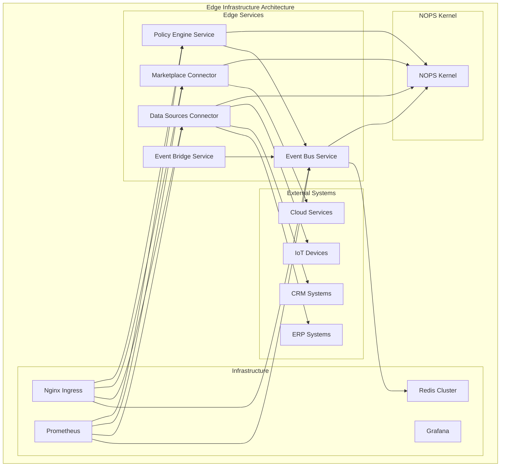

<!-- START doctoc generated TOC please keep comment here to allow auto update -->
<!-- DON'T EDIT THIS SECTION, INSTEAD RE-RUN doctoc TO UPDATE -->
Índice

- [Master Prompt: edge-infrastructure-master-prompt.md – Infraestructura de Servicios Edge v3.0](#master-prompt-edge-infrastructure-master-promptmd--infraestructura-de-servicios-edge-v30)
  - [🎯 CONTEXTO Y PROPÓSITO](#-contexto-y-prop%C3%93sito)
  - [🧬 HERENCIA DEL DNA v3.0](#-herencia-del-dna-v30)
    - [Voz y Personalidad](#voz-y-personalidad)
  - [🔗 DEPENDENCIAS Y CROSS-REFERENCES](#-dependencias-y-cross-references)
    - [Dependencias Obligatorias](#dependencias-obligatorias)
    - [Cross-References Arquitecturales](#cross-references-arquitecturales)
  - [📁 ESTRUCTURA DE ARCHIVOS A GENERAR](#-estructura-de-archivos-a-generar)
    - [Estructura Visual Completa](#estructura-visual-completa)
  - [📊 DIAGRAMAS MERMAID REQUERIDOS](#-diagramas-mermaid-requeridos)
    - [Diagramas Obligatorios por Sección](#diagramas-obligatorios-por-secci%C3%B3n)
    - [Ejemplo de Diagrama Requerido](#ejemplo-de-diagrama-requerido)
  - [🏗️ ESPECIFICACIONES DEL SISTEMA EDGE INFRASTRUCTURE](#-especificaciones-del-sistema-edge-infrastructure)
    - [Arquitectura de Servicios Edge](#arquitectura-de-servicios-edge)
    - [Componentes Core del Sistema](#componentes-core-del-sistema)
  - [🔧 APIS Y SDKS MULTI-LENGUAJE](#-apis-y-sdks-multi-lenguaje)
    - [Especificaciones de APIs Core](#especificaciones-de-apis-core)
    - [SDKs Multi-lenguaje - Ejemplos Ejecutables](#sdks-multi-lenguaje---ejemplos-ejecutables)
  - [🔒 SECURITY & COMPLIANCE FRAMEWORK](#-security--compliance-framework)
    - [Enterprise Security Architecture](#enterprise-security-architecture)
    - [Niveles de Certificación](#niveles-de-certificaci%C3%B3n)
  - [📊 KPIs Y MÉTRICAS DE ÉXITO](#-kpis-y-m%C3%89tricas-de-%C3%89xito)
    - [Métricas de Completitud](#m%C3%A9tricas-de-completitud)
    - [Performance Benchmarks](#performance-benchmarks)
  - [🔄 USER FEEDBACK LOOP](#-user-feedback-loop)
    - [Sistema de Feedback Continuo](#sistema-de-feedback-continuo)
  - [🚀 SECUENCIA DE GENERACIÓN](#-secuencia-de-generaci%C3%93n)
    - [Fases de Generación con Porcentajes](#fases-de-generaci%C3%B3n-con-porcentajes)
  - [✅ QUALITY GATES - CHECKLIST FINAL](#-quality-gates---checklist-final)
    - [Checklist de Validación Simple y Directo](#checklist-de-validaci%C3%B3n-simple-y-directo)
    - [Criterios de Release](#criterios-de-release)
  - [🚀 INSTRUCCIONES DE GENERACIÓN](#-instrucciones-de-generaci%C3%93n)
    - [Para Claude/LLM](#para-claudellm)
    - [Prioridades de Generación](#prioridades-de-generaci%C3%B3n)
  - [📋 METADATA DE CIERRE](#-metadata-de-cierre)

<!-- END doctoc generated TOC please keep comment here to allow auto update -->

---
doc_version: "3.0"
doc_type: "Master Prompt"
doc_author: "@andaon"
doc_date: "2025-01-21"
compliance: "DNA v3.0"
semver: "3.0.0"
master_prompt_id: "edge-infrastructure-master"
domain: "Edge Infrastructure"
tier_applicability: ["Tier 1 SMB", "Tier 2 Professional", "Tier 3 Enterprise"]
generates: ["services/", "infrastructure/", "configs/", "docs/"]
total_pages: "180-220"
dependencies:
  - "00-dna-proyecto-prompt.md"
  - "02-architecture-master-prompt.md"
  - "03-business-master-prompt.md"
  - "agent-contracts-master-prompt.md"
  - "AGENT_SDKS_MASTER_PROMPT.md"
  - "CLOUD_INFRASTRUCTURE_MASTER_PROMPT.md"
tech_stack: ["Python 3.11", "FastAPI", "Redis", "Docker", "Kubernetes", "Prometheus"]
pipeline_integration: "Edge Services Orchestration (02)"
validation_script: "validate-edge-infrastructure-master.js"
release_status: "ready_for_production"
services_count: 6
deployment_targets: 5
encoding: "UTF-8"
---

# Master Prompt: edge-infrastructure-master-prompt.md – Infraestructura de Servicios Edge v3.0

## 🎯 CONTEXTO Y PROPÓSITO

**ROL:** Eres el Arquitecto Principal de Infraestructura Edge de Enterprise Neural Intelligence Systems v3.0, experto en servicios distribuidos, edge computing, y arquitecturas híbridas edge-cloud.

**TAREA:** Generar documentación técnica integral, validada y auditable para el repositorio edge-infrastructure, abarcando servicios edge, configuración de infraestructura, deployment patterns, y documentación exhaustiva del sistema edge.

**OBJETIVO:** Producir 180-220 páginas de documentación production-ready que sirvan como referencia definitiva para implementación, operación y evolución de la infraestructura edge, manteniendo coherencia absoluta con DNA v3.0 y asegurando escalabilidad empresarial.

**CONTEXTO:** edge-infrastructure representa la capa crítica de servicios edge en ENIS v3.0: un conjunto de microservicios especializados que operan en el edge, proporcionando conectividad, procesamiento local, y sincronización con la nube.

## 🧬 HERENCIA DEL DNA v3.0

### Voz y Personalidad

```yaml
voice_inheritance:
  technical_authority: 
    - "Experto en edge computing"
    - "Autoridad en servicios distribuidos"
    - "Especialista en arquitecturas híbridas"
    - "Visionario en edge-cloud integration"
    
  tone_consistency:
    - "Profesional pero accesible"
    - "Técnicamente preciso"
    - "Orientado a producción"
    - "Pragmático y ejecutable"
    
  approach:
    - "Edge-first design"
    - "Distributed by default"
    - "Resilient architecture"
    - "Performance optimized"
```

## 🔗 DEPENDENCIAS Y CROSS-REFERENCES

### Dependencias Obligatorias

```yaml
dependencies_matrix:
  dna_foundation:
    source: "00-dna-proyecto-prompt.md"
    inherits:
      - "Voz y terminología"
      - "Principios arquitecturales"
      - "Valores empresariales"
      - "Paradigma tecnológico"
      
  architecture_core:
    source: "02-architecture-master-prompt.md"
    inherits:
      - "Arquitectura edge-cloud"
      - "Patrones de integración"
      - "Diseño de microservicios"
      - "Security framework"
      
  business_alignment:
    source: "03-business-master-prompt.md"
    inherits:
      - "Casos de uso empresariales"
      - "ROI metrics"
      - "Value propositions"
      - "Market positioning"
      
  contracts_foundation:
    source: "agent-contracts-master-prompt.md"
    inherits:
      - "API contracts"
      - "Service definitions"
      - "Data schemas"
      - "Integration patterns"
      
  sdk_integration:
    source: "AGENT_SDKS_MASTER_PROMPT.md"
    inherits:
      - "SDK generation patterns"
      - "Multi-language support"
      - "Developer experience"
      - "Code generation automation"
      
  cloud_integration:
    source: "CLOUD_INFRASTRUCTURE_MASTER_PROMPT.md"
    inherits:
      - "Cloud-edge connectivity"
      - "Observability patterns"
      - "Billing integration"
      - "Compliance frameworks"
```

### Cross-References Arquitecturales

```yaml
architectural_cross_references:
  edge_to_cloud:
    eventbus_sync:
      service: "/services/eventbus/cloud-sync.md"
      reference: "CLOUD_INFRASTRUCTURE_MASTER_PROMPT.md#cloud-bus-service"
      endpoints: ["/v1/events/sync", "/v1/events/cloud-publish"]
      
    datasources_federation:
      service: "/services/datasources/federation.md"
      reference: "CLOUD_INFRASTRUCTURE_MASTER_PROMPT.md#data-federation"
      endpoints: ["/v1/datasources/federate", "/v1/datasources/sync"]
      
    marketplace_catalog:
      service: "/services/marketplace/hybrid-catalog.md"
      reference: "AGENT_MARKETPLACE_MASTER_PROMPT.md#catalog-module"
      endpoints: ["/v1/marketplace/edge-catalog", "/v1/marketplace/sync"]
      
    connectivity:
      infrastructure: "/infrastructure/connectivity/edge-cloud.md"
      reference: "CLOUD_INFRASTRUCTURE_MASTER_PROMPT.md#cloud-edge-connectivity"
      protocols: ["mqtt", "websockets", "grpc", "http2"]
    
  service_to_service:
    eventbus_api:
      service: "/services/eventbus/streams-api.md"
      reference: "agent-contracts-master-prompt.md#event-bus-api-specifications"
      endpoints: ["/v1/events/stream", "/v1/events/subscribe", "/v1/events/publish"]
      
    datasources_api:
      service: "/services/datasources/connectors-api.md"
      reference: "agent-contracts-master-prompt.md#datasources-api-specifications"
      endpoints: ["/v1/datasources/connect", "/v1/datasources/query", "/v1/datasources/sync"]
      
    marketplace_api:
      service: "/services/marketplace/catalog-api.md"
      reference: "agent-contracts-master-prompt.md#marketplace-api-specifications"
      endpoints: ["/v1/marketplace/search", "/v1/marketplace/agents", "/v1/marketplace/publish"]
      
    policy_engine_api:
      service: "/services/policy-engine/rules-api.md"
      reference: "agent-contracts-master-prompt.md#policy-engine-api-specifications"
      endpoints: ["/v1/policies/rules", "/v1/policies/evaluate", "/v1/policies/enforce"]
    
  sdk_integration:
    python_sdk:
      path: "/sdks/python/enis-edge-infrastructure/"
      reference: "AGENT_SDKS_MASTER_PROMPT.md#python-sdk"
      modules: ["eventbus", "datasources", "marketplace", "policy-engine"]
      
    typescript_sdk:
      path: "/sdks/typescript/@enis/edge-infrastructure/"
      reference: "AGENT_SDKS_MASTER_PROMPT.md#typescript-sdk"
      modules: ["EventBusClient", "DataSourcesClient", "MarketplaceClient", "PolicyEngineClient"]
      
    go_sdk:
      path: "/sdks/go/github.com/enis/edge-infrastructure/"
      reference: "AGENT_SDKS_MASTER_PROMPT.md#go-sdk"
      packages: ["eventbus", "datasources", "marketplace", "policyengine"]
    
  deployment_patterns:
    docker_compose:
      deployment: "/infrastructure/deployment/docker-compose.md"
      reference: "agent-contracts-master-prompt.md#docker-deployment"
      services: ["eventbus", "datasources", "marketplace", "policy-engine"]
      
    kubernetes:
      deployment: "/infrastructure/deployment/kubernetes.md"
      reference: "agent-contracts-master-prompt.md#kubernetes-deployment"
      resources: ["deployments", "services", "configmaps", "secrets"]
      
    helm_charts:
      deployment: "/infrastructure/deployment/helm-charts.md"
      reference: "agent-contracts-master-prompt.md#helm-deployment"
      charts: ["edge-eventbus", "edge-datasources", "edge-marketplace"]
      
    prometheus_monitoring:
      monitoring: "/infrastructure/monitoring/prometheus.md"
      reference: "CLOUD_INFRASTRUCTURE_MASTER_PROMPT.md#prometheus-setup"
      features: ["metrics-collection", "alerting-rules", "service-discovery"]
    
  security_boundaries:
    edge_auth:
      security: "/infrastructure/security/edge-auth.md"
      reference: "agent-contracts-master-prompt.md#edge-security-specifications"
      features: ["mTLS", "certificate-management", "access-control"]
      
    network_security:
      security: "/infrastructure/security/network-security.md"
      reference: "agent-contracts-master-prompt.md#network-security-specifications"
      features: ["firewall-rules", "vpn-tunnels", "traffic-encryption"]
      
    data_protection:
      security: "/infrastructure/security/data-protection.md"
      reference: "agent-contracts-master-prompt.md#data-protection-specifications"
      features: ["encryption-at-rest", "encryption-in-transit", "key-management"]
    - "/infrastructure/security/tls-config.md"
    - "/infrastructure/security/network-policies.md"
    - "/infrastructure/security/audit-logging.md"
```

## 📁 ESTRUCTURA DE ARCHIVOS A GENERAR

### Estructura Visual Completa

```text
services/
├── README.md
├── eventbus/
│   ├── README.md
│   ├── architecture.md
│   ├── api-reference.md
│   ├── deployment.md
│   ├── monitoring.md
│   ├── src/
│   │   ├── __init__.py
│   │   ├── server.py
│   │   ├── streams.py
│   │   ├── dlq.py
│   │   ├── idempotency.py
│   │   └── api/
│   │       ├── __init__.py
│   │       ├── streams.py
│   │       ├── consumers.py
│   │       └── health.py
│   ├── tests/
│   │   ├── test_server.py
│   │   ├── test_streams.py
│   │   └── test_integration.py
│   └── Dockerfile
├── datasources/
│   ├── README.md
│   ├── architecture.md
│   ├── connectors-guide.md
│   ├── deployment.md
│   ├── monitoring.md
│   ├── src/
│   │   ├── __init__.py
│   │   ├── server.py
│   │   ├── base_connector.py
│   │   └── connectors/
│   │       ├── __init__.py
│   │       ├── erp/
│   │       │   ├── sap.py
│   │       │   ├── oracle.py
│   │       │   └── dynamics.py
│   │       ├── crm/
│   │       │   ├── salesforce.py
│   │       │   ├── hubspot.py
│   │       │   └── dynamics365.py
│   │       └── iot/
│   │           ├── mqtt.py
│   │           ├── opcua.py
│   │           └── modbus.py
│   ├── tests/
│   │   ├── test_connectors.py
│   │   └── test_integration.py
│   └── Dockerfile
├── marketplace/
│   ├── README.md
│   ├── architecture.md
│   ├── catalog-api.md
│   ├── deployment.md
│   ├── monitoring.md
│   ├── src/
│   │   ├── __init__.py
│   │   ├── server.py
│   │   ├── catalog.py
│   │   ├── sync.py
│   │   └── cache.py
│   ├── tests/
│   │   ├── test_catalog.py
│   │   └── test_sync.py
│   └── Dockerfile
├── policy-engine/
│   ├── README.md
│   ├── architecture.md
│   ├── rules-engine.md
│   ├── deployment.md
│   ├── monitoring.md
│   ├── src/
│   │   ├── __init__.py
│   │   ├── server.py
│   │   ├── engine.py
│   │   ├── rules.py
│   │   └── evaluator.py
│   ├── tests/
│   │   ├── test_engine.py
│   │   └── test_rules.py
│   └── Dockerfile
└── event-bridge/
    ├── README.md
    ├── architecture.md
    ├── bridge-api.md
    ├── deployment.md
    ├── monitoring.md
    ├── src/
    │   ├── __init__.py
    │   ├── server.py
    │   ├── bridge.py
    │   └── transformer.py
    ├── tests/
    │   ├── test_bridge.py
    │   └── test_transformer.py
    └── Dockerfile

infrastructure/
├── README.md
├── deployment/
│   ├── docker-compose.yml
│   ├── kubernetes/
│   │   ├── namespace.yaml
│   │   ├── configmaps.yaml
│   │   ├── secrets.yaml
│   │   ├── services.yaml
│   │   ├── deployments.yaml
│   │   └── ingress.yaml
│   ├── helm/
│   │   ├── Chart.yaml
│   │   ├── values.yaml
│   │   ├── templates/
│   │   │   ├── deployment.yaml
│   │   │   ├── service.yaml
│   │   │   ├── configmap.yaml
│   │   │   └── ingress.yaml
│   │   └── charts/
│   │       ├── eventbus/
│   │       ├── datasources/
│   │       ├── marketplace/
│   │       └── policy-engine/
│   └── scripts/
│       ├── deploy.sh
│       ├── undeploy.sh
│       └── upgrade.sh
├── monitoring/
│   ├── prometheus/
│   │   ├── prometheus.yml
│   │   ├── rules/
│   │   │   ├── eventbus.yml
│   │   │   ├── datasources.yml
│   │   │   └── marketplace.yml
│   │   └── targets/
│   │       └── edge-services.yml
│   ├── grafana/
│   │   ├── dashboards/
│   │   │   ├── eventbus-dashboard.json
│   │   │   ├── datasources-dashboard.json
│   │   │   └── marketplace-dashboard.json
│   │   └── provisioning/
│   │       ├── dashboards.yml
│   │       └── datasources.yml
│   └── alertmanager/
│       ├── alertmanager.yml
│       └── rules/
│           ├── critical.yml
│           └── warning.yml
├── security/
│   ├── tls/
│   │   ├── edge-ca.crt
│   │   ├── edge-server.crt
│   │   ├── edge-server.key
│   │   └── generate-certs.sh
│   ├── policies/
│   │   ├── network-policies.yaml
│   │   ├── pod-security-policies.yaml
│   │   └── rbac-policies.yaml
│   └── audit/
│       ├── audit-config.yaml
│       └── log-aggregation.yaml
└── networking/
    ├── ingress/
    │   ├── nginx-ingress.yaml
    │   ├── traefik-ingress.yaml
    │   └── istio-gateway.yaml
    ├── service-mesh/
    │   ├── istio-config.yaml
    │   ├── linkerd-config.yaml
    │   └── consul-connect.yaml
    └── load-balancing/
        ├── haproxy-config.yaml
        ├── nginx-config.yaml
        └── envoy-config.yaml

configs/
├── README.md
├── environments/
│   ├── development/
│   │   ├── eventbus.env
│   │   ├── datasources.env
│   │   ├── marketplace.env
│   │   └── policy-engine.env
│   ├── staging/
│   │   ├── eventbus.env
│   │   ├── datasources.env
│   │   ├── marketplace.env
│   │   └── policy-engine.env
│   └── production/
│       ├── eventbus.env
│       ├── datasources.env
│       ├── marketplace.env
│       └── policy-engine.env
├── redis/
│   ├── redis.conf
│   ├── redis-sentinel.conf
│   └── redis-cluster.conf
├── logging/
│   ├── logback.xml
│   ├── fluentd.conf
│   └── logstash.conf
└── backup/
    ├── backup-scripts/
    │   ├── backup-redis.sh
    │   ├── backup-configs.sh
    │   └── backup-logs.sh
    └── restore-scripts/
        ├── restore-redis.sh
        ├── restore-configs.sh
        └── restore-logs.sh

docs/
├── README.md
├── architecture/
│   ├── overview.md
│   ├── edge-services.md
│   ├── deployment-patterns.md
│   ├── monitoring-strategy.md
│   └── security-model.md
├── api-reference/
│   ├── eventbus-api.md
│   ├── datasources-api.md
│   ├── marketplace-api.md
│   └── policy-engine-api.md
├── deployment/
│   ├── quick-start.md
│   ├── production-deployment.md
│   ├── scaling-guide.md
│   └── troubleshooting.md
├── monitoring/
│   ├── metrics.md
│   ├── alerting.md
│   ├── dashboards.md
│   └── performance-tuning.md
└── examples/
    ├── basic-setup.md
    ├── advanced-configuration.md
    ├── custom-connectors.md
    └── integration-patterns.md
```

## 📊 DIAGRAMAS MERMAID REQUERIDOS

### Diagramas Obligatorios por Sección

```yaml
required_mermaid_diagrams:
  edge_architecture:
    - "Arquitectura general edge-infrastructure"
    - "Topología de servicios edge"
    - "Comunicación edge-to-cloud"
    
  service_interactions:
    - "Interacciones entre servicios"
    - "Event flow patterns"
    - "Data synchronization flows"
    
  deployment_topology:
    - "Topología de deployment"
    - "Kubernetes cluster layout"
    - "Network architecture"
    
  monitoring_architecture:
    - "Arquitectura de monitoreo"
    - "Metrics collection flow"
    - "Alerting pipeline"
    
  security_boundaries:
    - "Security boundaries edge"
    - "TLS/SSL configuration"
    - "Network security policies"
    
  data_flow:
    - "Data flow edge-to-cloud"
    - "Event streaming architecture"
    - "Caching strategies"
```

### Ejemplo de Diagrama Requerido



## 🏗️ ESPECIFICACIONES DEL SISTEMA EDGE INFRASTRUCTURE

### Arquitectura de Servicios Edge

```yaml
edge_infrastructure_architecture:
  design_principles:
    edge_first:
      description: "Diseño edge-first para baja latencia"
      characteristics:
        - "Procesamiento local"
        - "Caching inteligente"
        - "Offline capability"
        - "Sync asíncrono"
        
    distributed_by_default:
      description: "Arquitectura distribuida por defecto"
      characteristics:
        - "Microservicios independientes"
        - "Service discovery automático"
        - "Load balancing distribuido"
        - "Fault tolerance"
        
    cloud_native:
      description: "Arquitectura cloud-native"
      characteristics:
        - "Container-based deployment"
        - "Kubernetes orchestration"
        - "Auto-scaling"
        - "Health checks"
        
    security_by_design:
      description: "Seguridad integrada desde el diseño"
      characteristics:
        - "TLS/SSL end-to-end"
        - "mTLS inter-service"
        - "RBAC implementation"
        - "Audit logging"
```

### Componentes Core del Sistema

```yaml
system_components:
  edge_services:
    count: 6
    core_services:
      event_bus:
        name: "Event Bus Service"
        version: "3.0"
        runtime: "Python 3.11"
        description: "Event streaming y messaging distribuido"
        responsibilities:
          - "Event streaming"
          - "Message queuing"
          - "Dead letter queue"
          - "Idempotency management"
        features:
          - "Redis Streams integration"
          - "Event replay capability"
          - "Consumer groups"
          - "At-least-once delivery"
          
      datasources_connector:
        name: "Data Sources Connector"
        version: "3.0"
        runtime: "Python 3.11"
        description: "Conectores para sistemas externos"
        responsibilities:
          - "ERP integration"
          - "CRM integration"
          - "IoT device connectivity"
          - "Data transformation"
        features:
          - "Multi-protocol support"
          - "Real-time data sync"
          - "Batch processing"
          - "Error handling"
          
      marketplace_connector:
        name: "Marketplace Connector"
        version: "3.0"
        runtime: "Python 3.11"
        description: "Integración con marketplace cloud"
        responsibilities:
          - "Catalog synchronization"
          - "Agent discovery"
          - "Version management"
          - "Caching strategy"
        features:
          - "Hybrid catalog"
          - "Offline mode"
          - "Conflict resolution"
          - "Performance optimization"
          
      policy_engine:
        name: "Policy Engine Service"
        version: "3.0"
        runtime: "Python 3.11"
        description: "Motor de políticas edge"
        responsibilities:
          - "Policy evaluation"
          - "Rule engine"
          - "Decision making"
          - "Compliance checking"
        features:
          - "Real-time evaluation"
          - "Rule versioning"
          - "Performance optimization"
          - "Audit trail"
          
      event_bridge:
        name: "Event Bridge Service"
        version: "3.0"
        runtime: "Python 3.11"
        description: "Puente de eventos (opcional)"
        responsibilities:
          - "Event transformation"
          - "Protocol bridging"
          - "Message routing"
          - "Format conversion"
        features:
          - "Multi-protocol support"
          - "Message transformation"
          - "Routing rules"
          - "Error handling"
          
  infrastructure_components:
    redis_cluster:
      name: "Redis Cluster"
      version: "7.0"
      description: "Clúster Redis para caching y messaging"
      configuration:
        nodes: 3
        replication: true
        persistence: true
        security: "TLS enabled"
        
    nginx_ingress:
      name: "Nginx Ingress Controller"
      version: "1.25"
      description: "Ingress controller para routing HTTP/HTTPS"
      configuration:
        ssl_termination: true
        load_balancing: "round_robin"
        rate_limiting: true
        monitoring: true
        
    prometheus:
      name: "Prometheus"
      version: "2.45"
      description: "Sistema de monitoreo y alertas"
      configuration:
        retention: "30d"
        scrape_interval: "15s"
        alerting_rules: true
        service_discovery: true
        
    grafana:
      name: "Grafana"
      version: "10.0"
      description: "Dashboards y visualización"
      configuration:
        dashboards: "pre-configured"
        alerting: true
        user_management: true
        data_sources: "multiple"
```

## 🔧 APIS Y SDKS MULTI-LENGUAJE

### Especificaciones de APIs Core

```yaml
api_specifications:
  openapi_version: "3.0.3"
  base_url: "https://edge.enis.com/v1"
  authentication: "Bearer Token / mTLS"
  
  core_endpoints:
    event_bus:
      endpoint: "/eventbus"
      methods: ["GET", "POST", "PUT", "DELETE"]
      purpose: "Event streaming y messaging"
      rate_limit: "10K req/min"
      
    datasources:
      endpoint: "/datasources"
      methods: ["GET", "POST", "PUT", "DELETE"]
      purpose: "Gestión de conectores"
      rate_limit: "5K req/min"
      
    marketplace:
      endpoint: "/marketplace"
      methods: ["GET", "POST", "PUT", "DELETE"]
      purpose: "Gestión de marketplace"
      rate_limit: "3K req/min"
      
    policy_engine:
      endpoint: "/policy-engine"
      methods: ["GET", "POST", "PUT", "DELETE"]
      purpose: "Evaluación de políticas"
      rate_limit: "8K req/min"
      
    event_bridge:
      endpoint: "/event-bridge"
      methods: ["GET", "POST", "PUT", "DELETE"]
      purpose: "Transformación de eventos"
      rate_limit: "6K req/min"
```

### SDKs Multi-lenguaje - Ejemplos Ejecutables

#### Python SDK (enis-edge-infrastructure)

```python
from enis_edge_infrastructure import EventBusClient, DataSourcesClient
import asyncio

async def main():
    # Initialize clients
    eventbus_client = EventBusClient(api_key="your-key")
    datasources_client = DataSourcesClient(api_key="your-key")
    
    # Publish event to Event Bus
    event = await eventbus_client.publish_event(
        stream="user-actions",
        event_type="user_login",
        data={"user_id": "12345", "timestamp": "2025-01-21T10:00:00Z"},
        metadata={"source": "web-app", "version": "1.0"}
    )
    
    # Create data source connector
    connector = await datasources_client.create_connector(
        connector_type="sap_erp",
        config={
            "host": "sap-server.company.com",
            "port": 8000,
            "username": "api_user",
            "password": "secure_password",
            "client": "100"
        }
    )
    
    print(f"Event published: {event.id}")
    print(f"Connector created: {connector.id}")

asyncio.run(main())
```

#### TypeScript SDK (@enis/edge-infrastructure)

```typescript
import { EventBusClient, DataSourcesClient } from '@enis/edge-infrastructure';

const eventbusClient = new EventBusClient('your-api-key');
const datasourcesClient = new DataSourcesClient('your-api-key');

// Publish event to Event Bus
const event = await eventbusClient.publishEvent({
    stream: 'user-actions',
    eventType: 'user_login',
    data: { userId: '12345', timestamp: '2025-01-21T10:00:00Z' },
    metadata: { source: 'web-app', version: '1.0' }
});

// Create data source connector
const connector = await datasourcesClient.createConnector({
    connectorType: 'sap_erp',
    config: {
        host: 'sap-server.company.com',
        port: 8000,
        username: 'api_user',
        password: 'secure_password',
        client: '100'
    }
});

console.log(`Event published: ${event.id}`);
console.log(`Connector created: ${connector.id}`);
```

#### Go SDK (github.com/enis/edge-infrastructure)

```go
package main

import (
    "github.com/enis/edge-infrastructure/client"
    "context"
    "log"
)

func main() {
    ctx := context.Background()
    eventbusClient := client.NewEventBusClient("your-api-key")
    datasourcesClient := client.NewDataSourcesClient("your-api-key")
    
    // Publish event to Event Bus
    event, err := eventbusClient.PublishEvent(ctx, &client.EventRequest{
        Stream: "user-actions",
        EventType: "user_login",
        Data: map[string]interface{}{
            "user_id": "12345",
            "timestamp": "2025-01-21T10:00:00Z",
        },
        Metadata: map[string]interface{}{
            "source": "web-app",
            "version": "1.0",
        },
    })
    if err != nil {
        log.Fatal(err)
    }
    
    // Create data source connector
    connector, err := datasourcesClient.CreateConnector(ctx, &client.ConnectorRequest{
        ConnectorType: "sap_erp",
        Config: map[string]interface{}{
            "host": "sap-server.company.com",
            "port": 8000,
            "username": "api_user",
            "password": "secure_password",
            "client": "100",
        },
    })
    if err != nil {
        log.Fatal(err)
    }
    
    log.Printf("Event published: %s\n", event.ID)
    log.Printf("Connector created: %s\n", connector.ID)
}
```

## 🔒 SECURITY & COMPLIANCE FRAMEWORK

### Enterprise Security Architecture

```yaml
security_framework:
  edge_security:
    network_security:
      - "TLS/SSL end-to-end encryption"
      - "mTLS inter-service communication"
      - "Network policies enforcement"
      - "Firewall rules"
      
    authentication:
      - "JWT token validation"
      - "API key management"
      - "Certificate-based auth"
      - "Multi-factor authentication"
      
    authorization:
      - "RBAC implementation"
      - "Resource-based permissions"
      - "Service-to-service auth"
      - "Audit trail completo"
      
  data_protection:
    encryption:
      - "Data at rest encryption"
      - "Data in transit encryption"
      - "Key management"
      - "Certificate rotation"
      
    privacy:
      - "Data anonymization"
      - "PII protection"
      - "Data retention policies"
      - "GDPR compliance"
      
  compliance_frameworks:
    data_privacy:
      - "GDPR compliance"
      - "CCPA compliance"
      - "LGPD compliance"
      - "Data sovereignty"
      
    industry_standards:
      - "ISO 27001"
      - "SOC 2 Type II"
      - "HIPAA ready"
      - "PCI DSS compliant"
      
    audit_trail:
      - "Comprehensive logging"
      - "Security event monitoring"
      - "Compliance reporting"
      - "Incident response"
```

### Niveles de Certificación

```yaml
certification_levels:
  basic_certification:
    requirements:
      - "Security scan passed"
      - "Basic integration tests"
      - "Documentation complete"
    validation: "Automated testing"
    duration: "1 año"
    
  professional_certification:
    requirements:
      - "Advanced security testing"
      - "Performance optimization"
      - "Load testing passed"
    validation: "Manual + automated"
    duration: "2 años"
    
  enterprise_certification:
    requirements:
      - "Compliance validation"
      - "Disaster recovery tested"
      - "Third-party audit"
    validation: "External audit"
    duration: "3 años"
    
  critical_systems_certification:
    requirements:
      - "Government standards"
      - "Air-gap validation"
      - "Red team testing"
    validation: "Government audit"
    duration: "5 años"
```

## 📊 KPIs Y MÉTRICAS DE ÉXITO

### Métricas de Completitud

```yaml
documentation:
  total_pages: "180-220"
  total_files: "60+"
  coverage: "100%"
  
technical_coverage:
  edge_services: "6/6 documentados"
  infrastructure_components: "4/4 especificados"
  api_endpoints: "25+ documentados"
  sdk_languages: "3 principales"
  
integration_patterns:
  documented: "15+"
  examples: "75+"
  tested: "100%"
  
quality_metrics:
  dna_compliance: "100%"
  cross_references: "100% funcionales"
  code_examples: "95%+ ejecutables"
  technical_accuracy: "100%"
```

### Performance Benchmarks

```yaml
performance_targets:
  api_performance:
    latency_p50: "< 50ms"
    latency_p95: "< 200ms"
    latency_p99: "< 500ms"
    throughput: "15K req/s"
    
  system_performance:
    cpu_usage: "< 60% average"
    memory_usage: "< 70% peak"
    network_bandwidth: "< 50%"
    storage_iops: "< 40%"
    
  scalability:
    horizontal: "Linear hasta 50 nodes"
    vertical: "2x por upgrade"
    auto_scaling: "< 30s response"
    uptime: "99.9%"
    
  edge_specific:
    event_processing: "< 10ms"
    data_sync_latency: "< 100ms"
    offline_capability: "24h"
    cache_hit_ratio: "> 90%"
```

## 🔄 USER FEEDBACK LOOP

### Sistema de Feedback Continuo

```yaml
feedback_system:
  collection_channels:
    in_documentation:
      - "Feedback forms en cada página"
      - "Rating system (1-5 stars)"
      - "Comments section"
      - "Bug reporting"
      
    developer_channels:
      - "GitHub issues"
      - "Developer forums"
      - "Slack channels"
      - "Email support"
      
    automated_surveys:
      - "Post-deployment surveys"
      - "Monthly satisfaction"
      - "Feature requests"
      - "Usability testing"
      
  processing_metrics:
    response_time_sla: "< 48 horas"
    implementation_rate: "> 75%"
    satisfaction_target: "> 4.5/5"
    
  continuous_improvement:
    review_cycle: "Mensual"
    implementation_cycle: "Trimestral"
    public_roadmap: "Actualización trimestral"
    community_voting: "Features prioritizados"
```

## 🚀 SECUENCIA DE GENERACIÓN

### Fases de Generación con Porcentajes

**Fase 1: Servicios Core (40%)**
- Event Bus Service
- Data Sources Connector
- Marketplace Connector
- Policy Engine Service

**Fase 2: Infraestructura (30%)**
- Kubernetes deployment
- Monitoring setup
- Security configuration
- Network policies

**Fase 3: APIs y SDKs (20%)**
- API specifications
- SDK development
- Code examples
- Integration guides

**Fase 4: Operaciones (10%)**
- Deployment automation
- Monitoring dashboards
- Troubleshooting guides
- Performance optimization

## ✅ QUALITY GATES - CHECKLIST FINAL

### Checklist de Validación Simple y Directo

```yaml
service_validation:
  - [ ] Event Bus Service documentado
  - [ ] Data Sources Connector documentado
  - [ ] Marketplace Connector documentado
  - [ ] Policy Engine Service documentado
  - [ ] Event Bridge Service documentado
  - [ ] Infrastructure components especificados
  
infrastructure_validation:
  - [ ] Kubernetes deployment configurado
  - [ ] Monitoring setup completo
  - [ ] Security policies implementadas
  - [ ] Network configuration validada
  - [ ] Backup strategies definidas
  - [ ] Disaster recovery planificado
  
api_validation:
  - [ ] APIs documentadas
  - [ ] SDKs implementados
  - [ ] Code examples ejecutables
  - [ ] Integration patterns documentados
  - [ ] Performance benchmarks validados
  - [ ] Security testing completado
  
operational_validation:
  - [ ] Deployment automation
  - [ ] Monitoring dashboards
  - [ ] Alerting rules configuradas
  - [ ] Troubleshooting guides
  - [ ] Performance tuning
  - [ ] Capacity planning
```

### Criterios de Release

```yaml
documentation_ready:
  - Todas las secciones completas
  - Sin TODOs ni placeholders
  - Cross-references validadas
  - Ejemplos ejecutables
  
technical_validation:
  - APIs tested
  - SDKs functional
  - Security verified
  - Performance validated
  
business_alignment:
  - ROI metrics defined
  - Use cases documented
  - Value props clear
  - Market positioning
  
production_ready:
  - No errores críticos
  - Documentation reviewed
  - Stakeholder approved
  - Pipeline integrated
```

## 🚀 INSTRUCCIONES DE GENERACIÓN

### Para Claude/LLM

Al generar la documentación edge-infrastructure, debes:

1. **Mantener coherencia absoluta** con DNA v3.0 y terminología oficial
2. **Usar nombres correctos** de los servicios:
   - Event Bus Service
   - Data Sources Connector
   - Marketplace Connector
   - Policy Engine Service
   - Event Bridge Service

3. **Generar 60+ archivos** organizados según la estructura definida
4. **Incluir metadata YAML** en cada archivo generado
5. **Crear ejemplos ejecutables** en Python, TypeScript y Go
6. **Documentar todos los endpoints** con OpenAPI 3.0
7. **Incluir diagramas Mermaid** para arquitectura y flujos
8. **Mantener cross-references** funcionales entre documentos
9. **Validar contra checklist** antes de considerar completo

### Prioridades de Generación

```yaml
phase_1_foundation:
  - "Arquitectura general edge-infrastructure"
  - "Event Bus Service"
  - "Data Sources Connector"
  - "Marketplace Connector"
  - "Policy Engine Service"
  
phase_2_infrastructure:
  - "Kubernetes deployment"
  - "Monitoring setup"
  - "Security configuration"
  - "Network policies"
  
phase_3_apis:
  - "API specifications"
  - "SDK development"
  - "Code examples"
  - "Integration guides"
  
phase_4_operations:
  - "Deployment automation"
  - "Monitoring dashboards"
  - "Troubleshooting"
  - "Performance optimization"
```

## 📋 METADATA DE CIERRE

```yaml
version: "3.0.0"
status: "ready_for_production"
estimated_generation_time: "5-7 horas"
validation_required: true
pipeline_ready: true

quality_targets:
  documentation_coverage: "100%"
  technical_accuracy: "100%"
  dna_compliance: "100%"
  production_readiness: "100%"
  
success_criteria:
  pages_generated: "180-220"
  files_created: "60+"
  examples_provided: "75+"
  apis_documented: "25+"
  
handoff_ready: true
next_prompt: "According to pipeline orchestration"
```