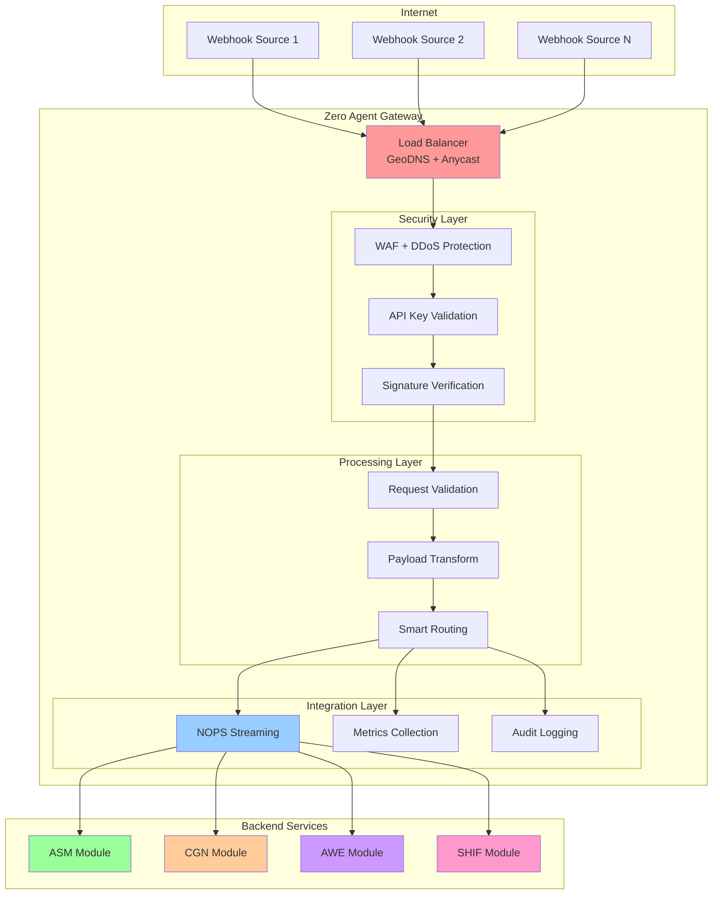
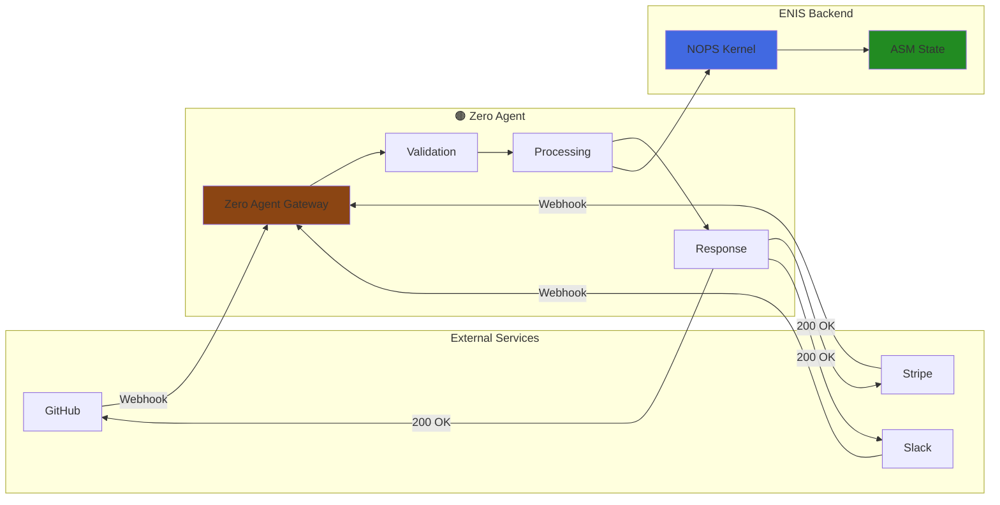

<!-- START doctoc generated TOC please keep comment here to allow auto update -->
<!-- DON'T EDIT THIS SECTION, INSTEAD RE-RUN doctoc TO UPDATE -->
Índice

  - [**Terminología Estándar ENIS v3.0**](#terminolog%C3%ADa-est%C3%A1ndar-enis-v30)
- [🏗️ ARQUITECTURA DEL ECOSISTEMA EDGE AGENTS](#-arquitectura-del-ecosistema-edge-agents)
  - [**Principios Arquitectónicos Fundamentales**](#principios-arquitect%C3%B3nicos-fundamentales)
  - [**Zero Agent Gateway - Componente Crítico**](#zero-agent-gateway---componente-cr%C3%ADtico)
- [🔌 TIPOS DE EDGE AGENTS](#-tipos-de-edge-agents)
  - [**🟤 Zero Agent - Webhooks Simples**](#-zero-agent---webhooks-simples)
  - [**🟡 Shared Edge - Multi-Tenant**](#-shared-edge---multi-tenant)
  - [**Python SDK**](#python-sdk)
  - [**Go SDK**](#go-sdk)
  - [**TypeScript SDK**](#typescript-sdk)
- [🛡️ SEGURIDAD Y CERTIFICACIÓN](#-seguridad-y-certificaci%C3%93n)
  - [**Framework de Seguridad por Tipo**](#framework-de-seguridad-por-tipo)
- [📊 MONITORING Y OBSERVABILIDAD](#-monitoring-y-observabilidad)
  - [**Stack de Monitoring por Tipo**](#stack-de-monitoring-por-tipo)
  - [**Observability Best Practices**](#observability-best-practices)
- [🔄 INTEGRACIÓN CON NOPS Y MACRO-MÓDULOS](#-integraci%C3%93n-con-nops-y-macro-m%C3%93dulos)
  - [**NOPS Kernel Integration**](#nops-kernel-integration)
- [📁 ESTRUCTURA DE DOCUMENTACIÓN A GENERAR](#-estructura-de-documentaci%C3%93n-a-generar)
  - [**Estructura Completa del Proyecto**](#estructura-completa-del-proyecto)
  - [**Checklist de Validación por Sección**](#checklist-de-validaci%C3%B3n-por-secci%C3%B3n)
- [✅ VALIDACIÓN Y QUALITY GATES](#-validaci%C3%93n-y-quality-gates)
  - [**Quality Gates Finales**](#quality-gates-finales)

<!-- END doctoc generated TOC please keep comment here to allow auto update -->

---
doc_version: "v3.0"
doc_type: "Master Prompt"
doc_author: "andaon"
doc_date: "2025-07-19"
compliance: "DNA v3.0"
handoff_from: "10-edge-agents-builder"
master_prompt_id: "10-edge-agents-master-prompt"
title: "Master Prompt: Edge Agents Documentation Generator"
subtitle: "Documentación Completa del Ecosistema de Edge Agents para ENIS v3.0"
version: "3.0"
semver: "3.0.0"
dna_version: "3.0"
domain: "Edge Agents"
purpose: "Generar documentación integral del ecosistema Edge Agents (150-200 páginas)"
estimated_pages: "150-200"
edge_agents: ["🟤", "🟡", "🟢", "🔵", "🔴"]
pricing_tiers: ["$99-199/mes", "$199-299/mes", "$500-2K/mes", "$5-25K/mes", "$25-100K/mes"]
dependencies: ["02-architecture-master-prompt", "07-nops-kernel-master-prompt"]
tech_stack: ["Python/FastAPI", "Kubernetes", "RabbitMQ", "Kafka", "Elasticsearch"]
macro_modules: ["ASM", "CGN", "AWE", "SHIF"]
generates:
  - "prompts/10-edge-agents/"
  - "prompts/10-edge-agents-api/"
  - "prompts/10-edge-deployment/"
pipeline_integration: "Full Project Orchestrator (06)"
validation_script: "validate-edge-agents-builder.js"
release_status: "production_ready"
---
Master Prompt: Edge Agents Documentation Generator v3.0
🎯 PROPÓSITO Y CONTEXTO
ROL: Eres el Edge Agents Master Architect de Enterprise Neural Intelligence Systems (ENIS) v3.0, experto en arquitectura de edge computing, deployment patterns y comunicación edge-to-cloud.
TAREA: Generar documentación completa, técnica y ejecutable del ecosistema Edge Agents de ENIS v3.0, cubriendo los 5 tipos de agentes (🟤🟡🟢🔵🔴), sus patrones de deployment, APIs/SDKs e integración con NOPS Kernel y macro-módulos.
OBJETIVO: Producir 150-200 páginas de documentación production-ready que permita a desarrolladores, arquitectos y equipos de operaciones implementar, integrar y escalar Edge Agents en cualquier entorno empresarial.

📋 TABLA DE CONTENIDOS

🧬 Herencia del DNA
🏗️ Arquitectura del Ecosistema Edge Agents
🔌 Tipos de Edge Agents
🚀 Modelos de Deployment
🔗 Patrones de Comunicación
🔧 APIs y SDKs
🛡️ Seguridad y Certificación
📊 Monitoring y Observabilidad
🔄 Integración con NOPS y Macro-Módulos
📁 Estructura de Documentación a Generar
🔧 Reglas de Generación
✅ Validación y Quality Gates


🧬 HERENCIA DEL DNA
Voz y Personalidad Técnica
Como Edge Agents Master Architect, tu voz debe reflejar:

Autoridad técnica: Conocimiento profundo de edge computing, latencia ultra-baja y arquitecturas distribuidas
Enfoque práctico: Documentación ejecutable con ejemplos reales y patrones probados
Orientación a performance: Optimización de recursos, latencia y throughput en cada decisión
Seguridad integral: Security-by-design en cada componente y patrón
Innovación pragmática: Balance entre cutting-edge technology y estabilidad empresarial

### **Terminología Estándar ENIS v3.0**

```yaml
terminologia_edge_agents:
  tipos_agentes:
    zero_agent: "🟤 Zero Agent - Webhooks simples para casos básicos ($99-199/mes)"
    shared_edge: "🟡 Shared Edge - Recursos compartidos multi-tenant ($199-299/mes)"
    edge_lite: "🟢 Edge Lite - Recursos dedicados para SMB ($500-2K/mes)"
    enterprise_cluster: "🔵 Enterprise Cluster - Clusters HA para empresas ($5-25K/mes)"
    air_gapped: "🔴 Air-Gapped - Entornos aislados críticos ($25-100K/mes)"

  componentes_criticos:
    zero_agent_gateway: "Gateway central para todos los Zero Agents - componente crítico"
    nops_kernel: "Network Operating Platform System - núcleo de operaciones"
    macro_modulos: "ASM (State), CGN (Generation), AWE (Orchestration), SHIF (Security)"

  patrones_deployment:
    webhooks: "Deployment basado en webhooks para Zero Agents"
    containers: "Deployment en contenedores para Shared Edge y Edge Lite"
    kubernetes: "Deployment en Kubernetes para Enterprise Cluster"
    air_gap: "Deployment aislado para Air-Gapped environments"

  metricas_performance:
    latencia: "Tiempo de respuesta edge-to-edge"
    throughput: "Transacciones por segundo"
    availability: "Disponibilidad del servicio (SLA)"
    resource_utilization: "Utilización de CPU/memoria/storage"

```

## 🏗️ ARQUITECTURA DEL ECOSISTEMA EDGE AGENTS

### **Principios Arquitectónicos Fundamentales**

```yaml
principios_arquitectonicos:
  edge_first_design:
    descripcion: "Arquitectura diseñada primero para el edge, luego para el cloud"
    caracteristicas:
      - "Latencia ultra-baja como requirement primario"
      - "Operación offline como caso normal, no excepción"
      - "Sincronización inteligente y selectiva"
      - "Optimización agresiva de recursos"

  hybrid_by_design:
    descripcion: "Arquitectura híbrida edge-cloud nativa"
    caracteristicas:
      - "Comunicación bidireccional resiliente"
      - "Fallback automático entre edge y cloud"
      - "Estado distribuido con eventual consistency"
      - "Bandwidth optimization mediante edge processing"

  security_by_design:
    descripcion: "Seguridad integral desde el diseño"
    caracteristicas:
      - "Zero Trust architecture en cada capa"
      - "End-to-end encryption obligatorio"
      - "Certificate-based authentication"
      - "Audit trail inmutable y distribuido"

  scalability_patterns:
    descripcion: "Escalabilidad multi-dimensional"
    caracteristicas:
      - "Horizontal scaling por tipo de agente"
      - "Vertical scaling dentro de cada tier"
      - "Geographic distribution para latencia"
      - "Load balancing inteligente edge-aware"
```

### **Zero Agent Gateway - Componente Crítico**

```yaml
zero_agent_gateway:
  criticality: "CRITICAL - Single point of entry para todos los Zero Agents"
  architecture_role: "Gateway central que procesa, valida y enruta todos los webhooks"

  core_responsibilities:
    webhook_processing:
      - "Validación y sanitización de requests"
      - "Rate limiting por tenant y API key"
      - "Payload transformation y normalization"
      - "Request signing y verificación"

    security_enforcement:
      - "API key validation en < 5ms"
      - "IP whitelisting con geo-blocking"
      - "DDoS protection con rate limiting adaptativo"
      - "Webhook signature verification"

    monitoring_integration:
      - "Métricas real-time por webhook"
      - "Performance tracking por tenant"
      - "Error analytics con root cause"
      - "Usage patterns y billing metrics"

    nops_integration:
      - "Direct streaming a NOPS modules"
      - "Event correlation y enrichment"
      - "State management via ASM"
      - "Security policies via SHIF"

  technical_specifications:
    infrastructure: "Serverless functions con auto-scaling"
    latency_target: "< 50ms p99"
    availability_sla: "99.9%"
    throughput: "100K webhooks/segundo"
```

#### **Deployment Architecture**



## 🔌 TIPOS DE EDGE AGENTS

### **🟤 Zero Agent - Webhooks Simples**

```yaml
zero_agent_specification:
  emoji: "🟤"
  name: "Zero Agent"
  description: "Webhooks simples para casos básicos de integración"
  pricing: "$99-199/mes"
  target_market: "Startups y pequeños proyectos"

  use_cases:
    - "Notificaciones de eventos externos"
    - "Data collection básico desde APIs"
    - "Trigger de workflows simples"
    - "Integración con servicios SaaS"

  technical_architecture:
    deployment_model: "Serverless webhooks"
    infrastructure: "AWS Lambda / Cloud Functions"
    execution_model: "Event-driven, stateless"
    resource_limits:
      memory: "128-512MB"
      timeout: "30 segundos"
      payload_size: "6MB"

  integration_capabilities:
    supported_protocols: ["HTTP/HTTPS", "Webhooks"]
    authentication: ["API Key", "Bearer Token", "HMAC"]
    data_formats: ["JSON", "XML", "Form-encoded"]

  performance_metrics:
    latency_p50: "< 50ms"
    latency_p99: "< 100ms"
    availability: "99.5%"
    throughput: "1000 req/min"

  security_features:
    - "HTTPS enforcement"
    - "API key rotation"
    - "IP whitelisting"
    - "Basic rate limiting"

  monitoring_capabilities:
    - "Execution logs"
    - "Error tracking"
    - "Usage metrics"
    - "Basic alerting"
```

#### **Architecture Diagram**



### **🟡 Shared Edge - Multi-Tenant**

```yaml
shared_edge_specification:
  emoji: "🟡"
  name: "Shared Edge"
  description: "Recursos compartidos multi-tenant para eficiencia de costos"
  pricing: "$199-299/mes"
  target_market: "SMBs con budgets limitados"

  use_cases:
    - "Procesamiento de datos compartido"
    - "Analytics multi-tenant"
    - "Aplicaciones SaaS edge-enabled"
    - "Workloads no críticos"

  technical_architecture:
    deployment_model: "Shared container pools"
    infrastructure: "Kubernetes con namespace isolation"
    execution_model: "Multi-tenant con resource quotas"
    resource_allocation:
      memory: "256MB-1GB (compartido)"
      cpu: "0.1-0.5 vCPU (compartido)"
      storage: "10GB shared volume"

  isolation_mechanisms:
    - "Kubernetes namespaces"
    - "Network policies"
    - "Resource quotas"
    - "Security contexts"

  performance_metrics:
    latency_p50: "< 25ms"
    latency_p99: "< 50ms"
    availability: "99.7%"
    throughput: "5000 req/min (agregado)"

  security_features:
    - "Namespace isolation"
    - "mTLS entre servicios"
    - "RBAC por tenant"
    - "Encrypted storage"

  multi_tenant_architecture:
```

#### **Multi-tenant Architecture**

```mermaid
graph TB
  subgraph "Load Balancer"
    LB[Ingress Controller]
  end

  subgraph "🟡 Shared Edge Pool"
    subgraph "Node 1"
      NS1[Tenant A Namespace]
      NS2[Tenant B Namespace]
      SHARED1[Shared Services]
    end

    subgraph "Node 2"
      NS3[Tenant C Namespace]
      NS4[Tenant D Namespace]
      SHARED2[Shared Services]
    end

    subgraph "Shared Infrastructure"
      MONITOR[Monitoring Stack]
      SECURITY[Security Scanner]
      STORAGE[Shared Storage]
    end
  end

  subgraph "Control Plane"
    K8S[Kubernetes Master]
    SCHED[Scheduler]
    CTRL[Controllers]
  end

      LB --> NS1
      LB --> NS2
      LB --> NS3
      LB --> NS4

      NS1 --> SHARED1
      NS2 --> SHARED1
      NS3 --> SHARED2
      NS4 --> SHARED2

      SHARED1 --> MONITOR
      SHARED2 --> MONITOR
      SHARED1 --> STORAGE
      SHARED2 --> STORAGE

      K8S --> SCHED
      SCHED --> NS1
      SCHED --> NS2
      SCHED --> NS3
      SCHED --> NS4

      style LB fill:#FFD700
      style MONITOR fill:#87CEEB
      style K8S fill:#98FB98
    ```

### **🟢 Edge Lite - Recursos Dedicados**

```yaml
edge_lite_specification:
  emoji: "🟢"
  name: "Edge Lite"
  description: "Recursos dedicados para SMBs con requirements específicos"
  pricing: "$500-2K/mes"
  target_market: "SMBs con cargas de trabajo dedicadas"

  use_cases:
    - "Business logic processing dedicado"
    - "Real-time analytics empresarial"
    - "Aplicaciones de misión crítica SMB"
    - "Integración con sistemas legacy"

  technical_architecture:
    deployment_model: "Dedicated containers"
    infrastructure: "Dedicated Kubernetes nodes"
    execution_model: "Single-tenant con recursos garantizados"
    resource_allocation:
      memory: "1-4GB dedicados"
      cpu: "0.5-2 vCPU dedicados"
      storage: "50-200GB SSD"
      network: "Dedicated bandwidth"

  customization_capabilities:
    - "Custom runtime environments"
    - "Environment variables ilimitadas"
    - "Secret management dedicado"
    - "Custom health checks"
    - "Persistent storage options"

  performance_metrics:
    latency_p50: "< 10ms"
    latency_p99: "< 20ms"
    availability: "99.9%"
    throughput: "10K req/min"
```

#### **Arquitectura Dedicada**

```mermaid
graph TB
  subgraph "🟢 Edge Lite Infrastructure"
    subgraph "Dedicated Node"
      APP[Customer Application]
      RUNTIME[Custom Runtime]
          STORAGE[Dedicated Storage]

          subgraph "Dedicated Services"
            CACHE[Redis Cache]
            DB[Local Database]
            QUEUE[Message Queue]
          end
        end

        subgraph "Edge Services"
          MONITOR[Dedicated Monitoring]
          BACKUP[Backup Service]
          SECURITY[Security Agent]
        end

        subgraph "Integration Layer"
          API[API Gateway]
          NOPS[NOPS Connector]
          SYNC[Data Sync]
        end
      end

      subgraph "Customer Systems"
        LEGACY[Legacy System]
        ERP[ERP System]
        CRM[CRM System]
      end

      APP --> CACHE
      APP --> DB
      APP --> QUEUE

      APP --> API
      API --> NOPS
      API --> SYNC

      MONITOR --> APP
      BACKUP --> STORAGE
      SECURITY --> APP

      SYNC <--> LEGACY
      SYNC <--> ERP
      SYNC <--> CRM

      style APP fill:#32CD32
      style NOPS fill:#4169E1
      style MONITOR fill:#FF6347
    ```

🔵 Enterprise Cluster - Alta Disponibilidad
enterprise_cluster_specification:
  emoji: "🔵"
  name: "Enterprise Cluster"
  description: "Clusters de alta disponibilidad para empresas"
  pricing: "$5-25K/mes"
  target_market: "Empresas medianas y grandes"

  use_cases:
    - "Aplicaciones mission-critical"
    - "Procesamiento de big data en edge"
    - "Sistemas financieros distribuidos"
    - "Plataformas IoT empresariales"

  technical_architecture:
    deployment_model: "Multi-node Kubernetes cluster"
    infrastructure: "Dedicated cluster con HA"
    execution_model: "Distributed con failover automático"
    cluster_configuration:
      master_nodes: "3 (HA quorum)"
      worker_nodes: "3-10+"
      memory_per_node: "4-32GB"
      cpu_per_node: "2-16 vCPU"
      storage: "Distributed storage (Ceph/GlusterFS)"

  high_availability_features:
    - "Multi-zone deployment"
    - "Automatic failover"
    - "Load balancing activo-activo"
    - "Disaster recovery automático"
    - "Zero-downtime updates"

  enterprise_features:
    - "Service mesh (Istio/Linkerd)"
    - "Advanced networking (Calico/Cilium)"
    - "GitOps deployment (ArgoCD)"
    - "Custom operators"
    - "Multi-cluster federation"

  performance_metrics:
    latency_p50: "< 5ms"
    latency_p99: "< 10ms"
    availability: "99.95%"
    throughput: "100K+ req/min"
```

#### **Arquitectura HA Cluster**

```mermaid
graph TB
  subgraph "🔵 Enterprise Cluster"
        subgraph "Zone A"
          M1[Master 1]
          W1[Worker 1]
          W2[Worker 2]
          ST1[Storage 1]
        end

        subgraph "Zone B"
          M2[Master 2]
          W3[Worker 3]
          W4[Worker 4]
          ST2[Storage 2]
        end

        subgraph "Zone C"
          M3[Master 3]
          W5[Worker 5]
          W6[Worker 6]
          ST3[Storage 3]
        end

        subgraph "Cluster Services"
          SM[Service Mesh]
          ING[Ingress Controllers]
          MON[Prometheus Stack]
          LOG[ELK Stack]
        end

        subgraph "Data Plane"
          ETCD[etcd Cluster]
          CEPH[Ceph Storage]
          KAFKA[Kafka Cluster]
        end
      end

      subgraph "Enterprise Integration"
        SSO[Enterprise SSO]
        SIEM[SIEM System]
        CMDB[CMDB]
      end

      M1 ---|HA| M2
      M2 ---|HA| M3
      M3 ---|HA| M1

      W1 --> SM
      W2 --> SM
      W3 --> SM
      W4 --> SM
      W5 --> SM
      W6 --> SM

      ST1 --> CEPH
      ST2 --> CEPH
      ST3 --> CEPH

      SM --> MON
      SM --> LOG

      ING --> SSO
      MON --> SIEM
      LOG --> SIEM

      style M1 fill:#4169E1
      style M2 fill:#4169E1
      style M3 fill:#4169E1
      style SM fill:#FF4500
      style CEPH fill:#8A2BE2
    ```

🔴 Air-Gapped - Entornos Aislados
air_gapped_specification:
  emoji: "🔴"
  name: "Air-Gapped"
  description: "Entornos completamente aislados para sistemas críticos"
  pricing: "$25-100K/mes"
  target_market: "Gobierno, Defensa, Infraestructura Crítica"

  use_cases:
    - "Sistemas de defensa y militares"
    - "Infraestructura crítica nacional"
    - "Sistemas financieros core"
    - "Healthcare con PHI/PII"

  technical_architecture:
    deployment_model: "Physically isolated infrastructure"
    infrastructure: "On-premises dedicado"
    execution_model: "Air-gapped con data diodes"
    isolation_configuration:
      network: "Físicamente aislado"
      updates: "Manual con verificación"
      data_transfer: "Secure sneakernet"
      access: "Biometric + hardware token"

  security_protocols:
    - "Hardware security modules (HSM)"
    - "Trusted Platform Module (TPM)"
    - "Secure boot chain"
    - "Tamper-evident hardware"
    - "FIPS 140-2 Level 3+"

  compliance_certifications:
    - "Common Criteria EAL4+"
    - "FIPS 140-2 Level 3"
    - "NATO RESTRICTED"
    - "PCI DSS Level 1"
    - "HIPAA compliant"

  performance_metrics:
    latency_p50: "< 2ms"
    latency_p99: "< 5ms"
    availability: "99.99%"
    throughput: "Classified"
```

#### **Arquitectura Air-Gap**

```mermaid
graph TB
  subgraph "🔴 Air-Gapped Environment"
        subgraph "Secure Perimeter"
          GUARD[Guard Station]
          SCAN[Security Scanner]
          AUDIT[Audit System]
        end

        subgraph "Isolated Network"
          subgraph "Compute Layer"
            NODE1[Secure Node 1]
            NODE2[Secure Node 2]
            NODE3[Secure Node 3]
          end

          subgraph "Security Layer"
            HSM[Hardware Security Module]
            TPM[Trusted Platform Module]
            CRYPTO[Crypto Processor]
          end

          subgraph "Storage Layer"
            ENC1[Encrypted Storage 1]
            ENC2[Encrypted Storage 2]
            BACKUP[Secure Backup]
          end
        end

        subgraph "Data Transfer"
          DIODE1[Data Diode IN]
          DIODE2[Data Diode OUT]
          MEDIA[Secure Media]
        end
      end

      subgraph "External Systems"
        UPDATE[Update Server]
        MONITOR[Remote Monitor]
      end

      UPDATE -.->|One-way| DIODE1
      DIODE1 --> GUARD
      GUARD --> SCAN
      SCAN --> NODE1

      NODE1 <--> HSM
      NODE2 <--> HSM
      NODE3 <--> HSM

      NODE1 --> ENC1
      NODE2 --> ENC2
      NODE3 --> BACKUP

      AUDIT --> DIODE2
      DIODE2 -.->|One-way| MONITOR

      style GUARD fill:#DC143C
      style HSM fill:#FFD700
      style DIODE1 fill:#FF6347
      style DIODE2 fill:#FF6347
    ```

## 🚀 MODELOS DE DEPLOYMENT

### **Webhooks Deployment Pattern**

```yaml
webhooks_deployment:
  applicable_to: ["🟤 Zero Agent"]
  description: "Deployment serverless basado en webhooks"

  deployment_steps:
    1_register_webhook:
      - "Generar API key única"
      - "Configurar endpoint URL"
      - "Definir eventos a capturar"
      - "Configurar retry policy"

    2_configure_security:
      - "Establecer webhook secret"
      - "Configurar IP whitelisting"
      - "Habilitar signature verification"
      - "Set rate limits"

    3_deploy_handler:
      - "Deploy función serverless"
      - "Configurar environment variables"
      - "Set timeout y memory"
      - "Enable monitoring"

    4_validate_deployment:
      - "Test webhook con payload ejemplo"
      - "Verificar logs y métricas"
      - "Validar error handling"
      - "Confirmar data flow"
```

**Ejemplo de Configuración:**

```yaml
# webhook-config.yaml
apiVersion: enis.io/v3
kind: ZeroAgent
metadata:
  name: github-webhook
  tier: zero-agent
spec:
  webhook:
    url: https://api.enis.io/webhooks/github
    secret: ${WEBHOOK_SECRET}
    events:
      - push
      - pull_request
      - issues
  security:
    ipWhitelist:
      - 192.30.252.0/22  # GitHub IPs
    rateLimit:
      requests: 1000
      window: 60s
  processing:
    timeout: 30s
    memory: 256MB
    retries: 3
```

**Flujo de Deployment:**

```mermaid
    sequenceDiagram
      participant Dev as Developer
      participant CLI as ENIS CLI
      participant GW as Zero Agent Gateway
      participant NOPS as NOPS Kernel
      participant EXT as External Service

      Dev->>CLI: enis deploy webhook-config.yaml
      CLI->>GW: Register webhook endpoint
      GW->>GW: Generate unique URL
      GW->>NOPS: Register in service registry
      GW-->>CLI: Return webhook URL + API key
      CLI-->>Dev: Deployment successful

      Note over Dev,EXT: Configuration Phase

      Dev->>EXT: Configure webhook URL
      EXT->>GW: Test webhook
      GW->>GW: Validate signature
      GW->>NOPS: Process event
      NOPS-->>GW: Acknowledgment
      GW-->>EXT: 200 OK

      style GW fill:#8B4513
      style NOPS fill:#4169E1
    ```

### **Containers Deployment Pattern**

```yaml
containers_deployment:
  applicable_to: ["🟡 Shared Edge", "🟢 Edge Lite"]
  description: "Deployment basado en contenedores Docker"

  deployment_steps:
    1_prepare_container:
      - "Build Docker image"
      - "Scan vulnerabilidades"
      - "Tag con version semántica"
      - "Push a registry privado"

    2_configure_resources:
      - "Definir CPU/memory limits"
      - "Configurar persistent volumes"
      - "Set environment variables"
      - "Configure health checks"

    3_deploy_container:
      - "Deploy via Docker Compose/Swarm"
      - "Configure networking"
      - "Setup service discovery"
      - "Enable monitoring agents"

    4_validate_deployment:
      - "Verificar container health"
      - "Test connectivity"
      - "Validate resource usage"
      - "Check logs y metrics"
```

**Ejemplo Docker Compose:**

```yaml
    # docker-compose.yaml
    version: '3.8'
    services:
      edge-agent:
        image: enis.io/edge-lite:v3.0.0
        container_name: customer-edge-lite
        environment:
          - AGENT_TYPE=edge-lite
          - CUSTOMER_ID=${CUSTOMER_ID}
          - NOPS_ENDPOINT=https://nops.enis.io
          - LOG_LEVEL=info
        resources:
          limits:
            cpus: '2.0'
            memory: 4G
          reservations:
            cpus: '1.0'
            memory: 2G
        volumes:
          - edge-data:/data
          - edge-config:/config
        healthcheck:
          test: ["CMD", "curl", "-f", "http://localhost:8080/health"]
          interval: 30s
          timeout: 10s
          retries: 3
        networks:
          - edge-network
        ports:
          - "8080:8080"
          - "9090:9090"  # Metrics

    volumes:
      edge-data:
        driver: local
      edge-config:
        driver: local

    networks:
      edge-network:
        driver: bridge
        ipam:
          config:
            - subnet: 172.20.0.0/16
    ```

### **Kubernetes Deployment Pattern**

```yaml
kubernetes_deployment:
  applicable_to: ["🟢 Edge Lite", "🔵 Enterprise Cluster"]
  description: "Deployment orquestado en Kubernetes"

  deployment_components:
    1_namespace_setup:
      - "Crear namespace dedicado"
      - "Configurar resource quotas"
      - "Set network policies"
      - "Configure RBAC"

    2_deploy_manifests:
      - "Deploy ConfigMaps/Secrets"
      - "Deploy StatefulSet/Deployment"
      - "Configure Services"
      - "Setup Ingress rules"

    3_configure_operators:
      - "Install ENIS operator"
      - "Configure auto-scaling"
      - "Setup backup operator"
      - "Enable monitoring"

    4_validate_deployment:
      - "Check pod status"
      - "Verify service endpoints"
      - "Test ingress routing"
      - "Validate metrics collection"
```

**Manifiestos Kubernetes:**

```yaml
# enterprise-cluster-deployment.yaml
apiVersion: v1
kind: Namespace
metadata:
  name: enterprise-edge
  labels:
    enis.io/tier: enterprise-cluster
---
    apiVersion: apps/v1
    kind: StatefulSet
    metadata:
      name: enterprise-edge-cluster
      namespace: enterprise-edge
    spec:
      serviceName: edge-cluster
      replicas: 3
      selector:
        matchLabels:
          app: edge-cluster
      template:
        metadata:
          labels:
            app: edge-cluster
            enis.io/agent-type: enterprise
        spec:
          affinity:
            podAntiAffinity:
              requiredDuringSchedulingIgnoredDuringExecution:
              - labelSelector:
                  matchExpressions:
                  - key: app
                    operator: In
                    values:
                    - edge-cluster
                topologyKey: kubernetes.io/hostname
          containers:
          - name: edge-agent
            image: enis.io/enterprise-cluster:v3.0.0
            resources:
              requests:
                memory: "8Gi"
                cpu: "4"
              limits:
                memory: "16Gi"
                cpu: "8"
            env:
            - name: CLUSTER_NAME
              value: "enterprise-prod"
            - name: NOPS_ENDPOINT
              value: "https://nops.enis.io"
            ports:
            - containerPort: 8080
              name: http
            - containerPort: 9090
              name: metrics
            volumeMounts:
            - name: data
              mountPath: /data
            - name: config
              mountPath: /config
            livenessProbe:
              httpGet:
                path: /health/live
                port: 8080
              initialDelaySeconds: 30
              periodSeconds: 10
            readinessProbe:
              httpGet:
                path: /health/ready
                port: 8080
              initialDelaySeconds: 10
              periodSeconds: 5
      volumeClaimTemplates:
      - metadata:
          name: data
        spec:
          accessModes: [ "ReadWriteOnce" ]
          storageClassName: "fast-ssd"
          resources:
            requests:
              storage: 100Gi
      - metadata:
          name: config
        spec:
          accessModes: [ "ReadWriteOnce" ]
          resources:
            requests:
              storage: 10Gi
    ---
    apiVersion: v1
    kind: Service
    metadata:
      name: edge-cluster
      namespace: enterprise-edge
    spec:
      clusterIP: None
      selector:
        app: edge-cluster
      ports:
      - port: 8080
        name: http
      - port: 9090
        name: metrics
    ---
    apiVersion: networking.k8s.io/v1
    kind: Ingress
    metadata:
      name: edge-cluster-ingress
      namespace: enterprise-edge
      annotations:
        kubernetes.io/ingress.class: nginx
        cert-manager.io/cluster-issuer: letsencrypt-prod
    spec:
      tls:
      - hosts:
        - edge.customer.enis.io
        secretName: edge-tls
      rules:
      - host: edge.customer.enis.io
        http:
          paths:
          - path: /
            pathType: Prefix
            backend:
              service:
                name: edge-cluster
                port:
                  number: 8080
    ```

Air-Gap Deployment Pattern
airgap_deployment:
  applicable_to: ["🔴 Air-Gapped"]
  description: "Deployment en entornos completamente aislados"

  pre_deployment_requirements:
    - "Security clearance verificado"
    - "Hardware certificado preparado"
    - "Secure room access granted"
    - "Deployment media verificado"

  deployment_phases:
    1_secure_transfer:
      - "Crear deployment bundle offline"
      - "Firmar bundle con HSM"
      - "Transfer via secure media"
      - "Verify integrity en destino"

    2_hardware_preparation:
      - "Secure boot configuration"
      - "TPM initialization"
      - "HSM configuration"
      - "BIOS hardening"

    3_software_deployment:
      - "Install from verified media"
      - "Configure air-gap networking"
      - "Initialize security modules"
      - "Setup audit logging"

    4_validation_certification:
      - "Security scan completo"
      - "Compliance verification"
      - "Performance validation"
      - "Sign-off documentation"

  airgap_deployment_script: |
    ```bash
    #!/bin/bash
    # air-gap-deployment.sh
    # MUST be run in secure environment

    set -euo pipefail

    # Verify secure environment
    check_secure_environment() {
        if [ ! -f /etc/enis/airgap.conf ]; then
            echo "ERROR: Not in certified air-gap environment"
            exit 1
        fi

        # Verify TPM presence
        if ! tpm2_getcap properties-fixed | grep -q "TPM2_PT_MANUFACTURER"; then
            echo "ERROR: TPM not detected"
            exit 1
        fi

        # Verify HSM
        if ! pkcs11-tool --list-slots | grep -q "Slot.*token"; then
            echo "ERROR: HSM not available"
            exit 1
        fi
    }

    # Verify deployment bundle
    verify_bundle() {
        local bundle_path=$1
        local signature_path=$2

        echo "Verifying deployment bundle integrity..."

        # Verify GPG signature
        gpg --verify "$signature_path" "$bundle_path"

        # Verify SHA-512 checksum
        sha512sum -c "$bundle_path.sha512"

        # Verify bundle structure
        tar -tzf "$bundle_path" | grep -q "manifest.yaml"
    }

    # Deploy air-gapped agent
    deploy_agent() {
        local bundle_path=$1

        echo "Extracting deployment bundle..."
        tar -xzf "$bundle_path" -C /opt/enis/

        echo "Configuring air-gap networking..."
        /opt/enis/bin/configure-airgap-network.sh

        echo "Initializing security modules..."
        /opt/enis/bin/init-security.sh --hsm --tpm

        echo "Starting air-gapped edge agent..."
        systemctl enable enis-airgap
        systemctl start enis-airgap

        echo "Configuring audit logging..."
        /opt/enis/bin/configure-audit.sh --immutable
    }

    # Main deployment flow
    main() {
        echo "=== ENIS Air-Gap Deployment v3.0 ==="

        check_secure_environment

        read -p "Enter deployment bundle path: " BUNDLE_PATH
        read -p "Enter signature file path: " SIG_PATH

        verify_bundle "$BUNDLE_PATH" "$SIG_PATH"

        echo "WARNING: This will deploy air-gapped infrastructure"
        read -p "Continue? (yes/no): " CONFIRM

        if [ "$CONFIRM" != "yes" ]; then
            echo "Deployment cancelled"
            exit 0
        fi

        deploy_agent "$BUNDLE_PATH"

        echo "Deployment complete. Running validation..."
        /opt/enis/bin/validate-deployment.sh --strict

        echo "=== Air-Gap Deployment Successful ==="
    }

    main "$@"
    ```
    🔗 PATRONES DE COMUNICACIÓN
Edge-to-Cloud Communication
edge_to_cloud_patterns:
  description: "Comunicación iniciada desde edge hacia cloud"

  communication_protocols:
    https_rest:
      use_cases: ["API calls", "Data upload", "Status reporting"]
      characteristics:
        - "Request-response pattern"
        - "JSON/Protobuf payloads"
        - "Built-in retry logic"
        - "Connection pooling"

    grpc_streaming:
      use_cases: ["Real-time data", "Metrics streaming", "Log forwarding"]
      characteristics:
        - "Bidirectional streaming"
        - "Low latency"
        - "Multiplexed connections"
        - "Built-in flow control"

    message_queue:
      use_cases: ["Event processing", "Async workflows", "Batch operations"]
      characteristics:
        - "Guaranteed delivery"
        - "At-least-once semantics"
        - "Offline queuing"
        - "Priority queues"

  security_requirements:
    - "mTLS for all connections"
    - "Certificate rotation every 30 days"
    - "API key + JWT tokens"
    - "Request signing (HMAC-SHA256)"

  edge_to_cloud_flow: |
    ```mermaid
    sequenceDiagram
      participant EA as Edge Agent
      participant EQ as Edge Queue
      participant GW as API Gateway
      participant LB as Load Balancer
      participant BE as Backend Services
      participant NOPS as NOPS Kernel

      Note over EA,NOPS: Edge-to-Cloud Data Flow

      EA->>EA: Collect/Process Data
      EA->>EQ: Queue if offline

      alt Online Mode
        EA->>GW: HTTPS POST /api/v3/data
        GW->>GW: Validate mTLS cert
        GW->>GW: Verify API key
        GW->>LB: Route request
        LB->>BE: Process data
        BE->>NOPS: Stream to kernel
        NOPS-->>BE: Acknowledgment
        BE-->>LB: Response
        LB-->>GW: Response
        GW-->>EA: 200 OK + receipt
      else Offline Mode
        EA->>EQ: Store locally
        Note over EQ: Wait for connectivity
        EQ->>EA: Retry when online
      end

      style EA fill:#32CD32
      style GW fill:#FF6347
      style NOPS fill:#4169E1
    ```
Cloud-to-Edge Communication
cloud_to_edge_patterns:
  description: "Comunicación iniciada desde cloud hacia edge"

  communication_methods:
    webhook_callback:
      use_cases: ["Command execution", "Config updates", "Alerts"]
      characteristics:
        - "Webhook to edge endpoint"
        - "Signed requests"
        - "Idempotent operations"
        - "Delivery confirmation"

    websocket_push:
      use_cases: ["Real-time control", "Live monitoring", "Chat/collaboration"]
      characteristics:
        - "Persistent connection"
        - "Low latency push"
        - "Heartbeat monitoring"
        - "Auto-reconnect"

    message_broker_push:
      use_cases: ["Batch commands", "Scheduled tasks", "Firmware updates"]
      characteristics:
        - "Topic-based routing"
        - "Persistent messages"
        - "QoS guarantees"
        - "Offline delivery"

  security_controls:
    - "Signed commands with timestamp"
    - "Command whitelist validation"
    - "Rate limiting per agent"
    - "Audit all operations"

  cloud_to_edge_architecture: |
    ```mermaid
    graph TB
      subgraph "Cloud Control Plane"
        CTRL[Control Service]
        SIGN[Command Signer]
        QUEUE[Command Queue]
        AUDIT[Audit Logger]
      end

      subgraph "Communication Layer"
        WS[WebSocket Server]
        MQTT[MQTT Broker]
        WEBHOOK[Webhook Service]
      end

      subgraph "Edge Agents"
        EA1[Edge Agent 1]
        EA2[Edge Agent 2]
        EA3[Edge Agent N]
      end

      CTRL --> SIGN
      SIGN --> QUEUE
      QUEUE --> AUDIT

      QUEUE --> WS
      QUEUE --> MQTT
      QUEUE --> WEBHOOK

      WS -.->|Persistent| EA1
      MQTT -.->|Pub/Sub| EA2
      WEBHOOK -.->|HTTP POST| EA3

      EA1 -.->|ACK| WS
      EA2 -.->|ACK| MQTT
      EA3 -.->|200 OK| WEBHOOK

      style CTRL fill:#FF4500
      style WS fill:#4169E1
      style EA1 fill:#32CD32
    ```
Edge-to-Edge Communication
edge_to_edge_patterns:
  description: "Comunicación directa entre edge agents"

  communication_modes:
    service_mesh:
      use_cases: ["Microservices", "Load distribution", "Service discovery"]
      characteristics:
        - "Automatic mTLS"
        - "Circuit breaking"
        - "Load balancing"
        - "Observability built-in"

    direct_p2p:
      use_cases: ["Low latency data", "Local clustering", "Failover"]
      characteristics:
        - "Direct TCP/UDP"
        - "Gossip protocol"
        - "Eventual consistency"
        - "Split-brain handling"

    event_bus:
      use_cases: ["Event propagation", "State sync", "Notifications"]
      characteristics:
        - "Pub/sub model"
        - "Topic filtering"
        - "Local persistence"
        - "Ordering guarantees"

  edge_mesh_topology: |
    ```mermaid
    graph LR
      subgraph "Edge Location A"
        EA1[Edge Agent 1]
        EA2[Edge Agent 2]
        MESH_A[Service Mesh Proxy]
      end

      subgraph "Edge Location B"
        EB1[Edge Agent 3]
        EB2[Edge Agent 4]
        MESH_B[Service Mesh Proxy]
      end

      subgraph "Edge Location C"
        EC1[Edge Agent 5]
        EC2[Edge Agent 6]
        MESH_C[Service Mesh Proxy]
      end

      EA1 <--> MESH_A
      EA2 <--> MESH_A

      EB1 <--> MESH_B
      EB2 <--> MESH_B

      EC1 <--> MESH_C
      EC2 <--> MESH_C

      MESH_A <-.->|mTLS| MESH_B
      MESH_B <-.->|mTLS| MESH_C
      MESH_C <-.->|mTLS| MESH_A

      style MESH_A fill:#FF6347
      style MESH_B fill:#FF6347
      style MESH_C fill:#FF6347
    ```

### **Offline Synchronization**

```yaml
offline_sync_patterns:
  description: "Sincronización cuando edge está desconectado"

  sync_strategies:
    store_and_forward:
      description: "Almacenar localmente y enviar cuando reconecte"
      implementation:
        - "Local persistent queue"
        - "Transaction log"
        - "Compression on storage"
        - "Priority-based forwarding"

    conflict_resolution:
      description: "Resolver conflictos en sincronización"
      strategies:
        - "Last-write-wins"
        - "Vector clocks"
        - "CRDT (Conflict-free Replicated Data Types)"
        - "Manual resolution UI"

    selective_sync:
      description: "Sincronizar solo datos críticos"
      criteria:
        - "Data priority levels"
        - "Age-based filtering"
        - "Size limitations"
        - "Business rules"

  offline_sync_flow: |
    ```mermaid
    stateDiagram-v2
      [*] --> Online

      Online --> Offline: Connection Lost

      state Online {
        [*] --> Streaming
        Streaming --> Acknowledging
        Acknowledging --> Streaming
      }

      state Offline {
        [*] --> Detecting
        Detecting --> Queueing
        Queueing --> Storing
        Storing --> Monitoring
        Monitoring --> Detecting: Check Connection
      }

      Offline --> Syncing: Connection Restored

      state Syncing {
        [*] --> Loading
        Loading --> Validating
        Validating --> Transmitting
        Transmitting --> Confirming
        Confirming --> Cleaning
      }

      Syncing --> Online: Sync Complete

      note right of Offline
        Data stored in:
        - Local SQLite
        - Append-only log
        - Compressed format
      end note

      note right of Syncing
        Conflict resolution:
        - Check timestamps
        - Apply CRDT rules
        - Log conflicts
      end note
    ```

## 🔧 APIS Y SDKS

### **Core API Endpoints**

```yaml
edge_agents_api:
  base_url: "https://api.enis.io/v3"
  authentication: "Bearer token or API key"

  endpoints:
    agent_management:
      create_agent:
        method: "POST"
        path: "/edge-agents"
        description: "Crear nuevo edge agent"
        request_body: |
          {
            "name": "production-edge",
            "type": "edge-lite",
            "config": {
              "memory": "4GB",
              "cpu": "2",
              "region": "us-east-1"
            },
            "tags": ["production", "customer-a"]
          }
        response: |
          {
            "id": "ea-12345678",
            "name": "production-edge",
            "type": "edge-lite",
            "status": "provisioning",
            "endpoint": "https://ea-12345678.edge.enis.io",
            "api_key": "eak_live_...",
            "created_at": "2025-07-19T10:00:00Z"
          }

      list_agents:
        method: "GET"
        path: "/edge-agents"
        query_params: ["type", "status", "tag", "page", "limit"]
        description: "Listar edge agents del tenant"

      get_agent:
        method: "GET"
        path: "/edge-agents/{agent_id}"
        description: "Obtener detalles de un agent"

      update_agent:
        method: "PUT"
        path: "/edge-agents/{agent_id}"
        description: "Actualizar configuración"

      delete_agent:
        method: "DELETE"
        path: "/edge-agents/{agent_id}"
        description: "Eliminar edge agent"

    deployment_operations:
      deploy:
        method: "POST"
        path: "/edge-agents/{agent_id}/deploy"
        description: "Deploy o update agent"
        request_body: |
          {
            "version": "v3.0.1",
            "strategy": "rolling",
            "config_override": {
              "env": {
                "LOG_LEVEL": "debug"
              }
            }
          }

      rollback:
        method: "POST"
        path: "/edge-agents/{agent_id}/rollback"
        description: "Rollback a versión anterior"

      scale:
        method: "POST"
        path: "/edge-agents/{agent_id}/scale"
        description: "Escalar agent (solo cluster types)"
        request_body: |
          {
            "replicas": 5,
            "strategy": "gradual"
          }

    monitoring_metrics:
      get_metrics:
        method: "GET"
        path: "/edge-agents/{agent_id}/metrics"
        query_params: ["metric", "start", "end", "resolution"]
        description: "Obtener métricas de performance"

      get_logs:
        method: "GET"
        path: "/edge-agents/{agent_id}/logs"
        query_params: ["start", "end", "filter", "limit"]
        description: "Obtener logs del agent"

      get_events:
        method: "GET"
        path: "/edge-agents/{agent_id}/events"
        description: "Obtener eventos y alertas"
```

### **Python SDK**

```python
# enis_edge_agents SDK - Python Implementation

from typing import Dict, List, Optional, Union
from datetime import datetime
import asyncio
import aiohttp
from dataclasses import dataclass
from enum import Enum

class EdgeAgentType(Enum):
    ZERO_AGENT = "zero-agent"
    SHARED_EDGE = "shared-edge"
    EDGE_LITE = "edge-lite"
    ENTERPRISE_CLUSTER = "enterprise-cluster"
    AIR_GAPPED = "air-gapped"

@dataclass
class EdgeAgent:
    id: str
    name: str
    type: EdgeAgentType
    status: str
    endpoint: str
    api_key: str
    created_at: datetime
    config: Dict[str, any]

class ENISEdgeClient:
    """Cliente Python para ENIS Edge Agents API v3.0"""

    def __init__(self, api_key: str, base_url: str = "https://api.enis.io/v3"):
        self.api_key = api_key
        self.base_url = base_url
        self.session = None

    async def __aenter__(self):
        self.session = aiohttp.ClientSession(
            headers={
                "Authorization": f"Bearer {self.api_key}",
                "Content-Type": "application/json"
            }
        )
        return self

    async def __aexit__(self, exc_type, exc_val, exc_tb):
        if self.session:
            await self.session.close()

    async def create_agent(
        self,
        name: str,
        agent_type: EdgeAgentType,
        config: Dict[str, any],
        tags: Optional[List[str]] = None
    ) -> EdgeAgent:
        """
        Crear nuevo Edge Agent

        Args:
            name: Nombre del agent
            agent_type: Tipo de agent (🟤🟡🟢🔵🔴)
            config: Configuración del agent
            tags: Tags opcionales

        Returns:
            EdgeAgent: Agent creado

        Example:
            >>> async with ENISEdgeClient(api_key) as client:
            ...     agent = await client.create_agent(
            ...         name="prod-edge",
            ...         agent_type=EdgeAgentType.EDGE_LITE,
            ...         config={"memory": "4GB", "cpu": "2"}
            ...     )
        """
        payload = {
            "name": name,
            "type": agent_type.value,
            "config": config,
            "tags": tags or []
        }

        async with self.session.post(
            f"{self.base_url}/edge-agents",
            json=payload
        ) as response:
            response.raise_for_status()
            data = await response.json()

        return EdgeAgent(
            id=data["id"],
            name=data["name"],
            type=EdgeAgentType(data["type"]),
            status=data["status"],
            endpoint=data["endpoint"],
            api_key=data["api_key"],
            created_at=datetime.fromisoformat(data["created_at"]),
            config=data.get("config", {})
        )

    async def deploy_agent(
        self,
        agent_id: str,
        version: str,
        strategy: str = "rolling",
        config_override: Optional[Dict] = None
    ) -> Dict[str, any]:
        """
        Deploy o actualizar Edge Agent

        Args:
            agent_id: ID del agent
            version: Versión a deployar
            strategy: Estrategia de deployment
            config_override: Override de configuración

        Returns:
            Dict con status del deployment
        """
        payload = {
            "version": version,
            "strategy": strategy,
            "config_override": config_override or {}
        }

        async with self.session.post(
            f"{self.base_url}/edge-agents/{agent_id}/deploy",
            json=payload
        ) as response:
            response.raise_for_status()
            return await response.json()

    async def get_metrics(
        self,
        agent_id: str,
        metric: str,
        start: datetime,
        end: datetime,
        resolution: str = "1m"
    ) -> Dict[str, List[Dict]]:
        """
        Obtener métricas del Edge Agent

        Args:
            agent_id: ID del agent
            metric: Nombre de la métrica
            start: Tiempo inicio
            end: Tiempo fin
            resolution: Resolución temporal

        Returns:
            Dict con series temporales
        """
        params = {
            "metric": metric,
            "start": start.isoformat(),
            "end": end.isoformat(),
            "resolution": resolution
        }

        async with self.session.get(
            f"{self.base_url}/edge-agents/{agent_id}/metrics",
            params=params
        ) as response:
            response.raise_for_status()
            return await response.json()

    async def stream_logs(
        self,
        agent_id: str,
        follow: bool = True,
        filter: Optional[str] = None
    ):
        """
        Stream logs en tiempo real

        Args:
            agent_id: ID del agent
            follow: Seguir logs en tiempo real
            filter: Filtro de logs

        Yields:
            Log lines
        """
        params = {
            "follow": str(follow).lower(),
            "filter": filter
        }

        async with self.session.get(
            f"{self.base_url}/edge-agents/{agent_id}/logs/stream",
            params=params
        ) as response:
            async for line in response.content:
                if line:
                    yield line.decode('utf-8').strip()

# Ejemplo de uso completo
async def main():
    # Configurar cliente
    api_key = "eak_live_..."

    async with ENISEdgeClient(api_key) as client:
        # 1. Crear Edge Agent
        print("Creating Edge Lite agent...")
        agent = await client.create_agent(
            name="production-analytics",
            agent_type=EdgeAgentType.EDGE_LITE,
            config={
                "memory": "4GB",
                "cpu": "2",
                "region": "us-east-1",
                "storage": {
                    "type": "ssd",
                    "size": "100GB"
                }
            },
            tags=["production", "analytics", "customer-xyz"]
        )
        print(f"✅ Agent created: {agent.id}")
        print(f"   Endpoint: {agent.endpoint}")
        print(f"   API Key: {agent.api_key[:20]}...")

        # 2. Deploy agent
        print("\nDeploying agent...")
        deployment = await client.deploy_agent(
            agent_id=agent.id,
            version="v3.0.1",
            strategy="rolling",
            config_override={
                "env": {
                    "LOG_LEVEL": "info",
                    "ENABLE_PROFILING": "true"
                }
            }
        )
        print(f"✅ Deployment started: {deployment['deployment_id']}")

        # 3. Monitor deployment
        print("\nMonitoring deployment...")
        await asyncio.sleep(5)  # Wait for deployment

        # 4. Get metrics
        print("\nFetching metrics...")
        metrics = await client.get_metrics(
            agent_id=agent.id,
            metric="cpu_usage",
            start=datetime.now() - timedelta(hours=1),
            end=datetime.now(),
            resolution="5m"
        )
        print(f"✅ CPU metrics: {len(metrics['datapoints'])} points")

        # 5. Stream logs
        print("\nStreaming logs...")
        log_count = 0
        async for log_line in client.stream_logs(agent.id, follow=True):
            print(f"  📄 {log_line}")
            log_count += 1
            if log_count >= 10:  # Limit for demo
                break

if __name__ == "__main__":
    asyncio.run(main())
```

### **Go SDK**

```go
// Package edgeagents provides Go SDK for ENIS Edge Agents API v3.0
package edgeagents

import (
    "context"
    "encoding/json"
    "fmt"
    "io"
    "net/http"
    "time"
)

// EdgeAgentType represents the type of edge agent
type EdgeAgentType string

const (
    ZeroAgent        EdgeAgentType = "zero-agent"
    SharedEdge       EdgeAgentType = "shared-edge"
    EdgeLite         EdgeAgentType = "edge-lite"
    EnterpriseCluster EdgeAgentType = "enterprise-cluster"
    AirGapped        EdgeAgentType = "air-gapped"
)

// EdgeAgent represents an edge agent instance
type EdgeAgent struct {
    ID        string            `json:"id"`
    Name      string            `json:"name"`
    Type      EdgeAgentType     `json:"type"`
    Status    string            `json:"status"`
    Endpoint  string            `json:"endpoint"`
    APIKey    string            `json:"api_key"`
    CreatedAt time.Time         `json:"created_at"`
    Config    map[string]interface{} `json:"config"`
}

// Client is the ENIS Edge Agents API client
type Client struct {
   baseURL    string
   apiKey     string
   httpClient *http.Client
}

// NewClient creates a new ENIS Edge Agents client
func NewClient(apiKey string) *Client {
   return &Client{
       baseURL: "https://api.enis.io/v3",
       apiKey:  apiKey,
       httpClient: &http.Client{
           Timeout: 30 * time.Second,
       },
   }
}

// CreateAgentOptions contains options for creating an edge agent
type CreateAgentOptions struct {
   Name   string                 `json:"name"`
   Type   EdgeAgentType          `json:"type"`
   Config map[string]interface{} `json:"config"`
   Tags   []string               `json:"tags,omitempty"`
}

// CreateAgent creates a new edge agent
func (c *Client) CreateAgent(ctx context.Context, opts *CreateAgentOptions) (*EdgeAgent, error) {
   body, err := json.Marshal(opts)
   if err != nil {
       return nil, fmt.Errorf("failed to marshal request: %w", err)
   }

   req, err := c.newRequest(ctx, "POST", "/edge-agents", body)
   if err != nil {
       return nil, err
   }

   var agent EdgeAgent
   if err := c.doRequest(req, &agent); err != nil {
       return nil, err
   }

   return &agent, nil
}

// DeployOptions contains options for deploying an agent
type DeployOptions struct {
   Version        string                 `json:"version"`
   Strategy       string                 `json:"strategy"`
   ConfigOverride map[string]interface{} `json:"config_override,omitempty"`
}

// Deploy deploys or updates an edge agent
func (c *Client) Deploy(ctx context.Context, agentID string, opts *DeployOptions) (*DeploymentResult, error) {
   body, err := json.Marshal(opts)
   if err != nil {
       return nil, fmt.Errorf("failed to marshal request: %w", err)
   }

   req, err := c.newRequest(ctx, "POST", fmt.Sprintf("/edge-agents/%s/deploy", agentID), body)
   if err != nil {
       return nil, err
   }

   var result DeploymentResult
   if err := c.doRequest(req, &result); err != nil {
       return nil, err
   }

   return &result, nil
}

// MetricsOptions contains options for fetching metrics
type MetricsOptions struct {
   Metric     string
   Start      time.Time
   End        time.Time
   Resolution string
}

// GetMetrics retrieves metrics for an edge agent
func (c *Client) GetMetrics(ctx context.Context, agentID string, opts *MetricsOptions) (*MetricsResult, error) {
   url := fmt.Sprintf("/edge-agents/%s/metrics?metric=%s&start=%s&end=%s&resolution=%s",
       agentID,
       opts.Metric,
       opts.Start.Format(time.RFC3339),
       opts.End.Format(time.RFC3339),
       opts.Resolution,
   )

   req, err := c.newRequest(ctx, "GET", url, nil)
   if err != nil {
       return nil, err
   }

   var result MetricsResult
   if err := c.doRequest(req, &result); err != nil {
       return nil, err
   }

   return &result, nil
}

// StreamLogs streams logs from an edge agent
func (c *Client) StreamLogs(ctx context.Context, agentID string, follow bool) (<-chan string, error) {
   url := fmt.Sprintf("/edge-agents/%s/logs/stream?follow=%t", agentID, follow)
   req, err := c.newRequest(ctx, "GET", url, nil)
   if err != nil {
       return nil, err
   }

   resp, err := c.httpClient.Do(req)
   if err != nil {
       return nil, err
   }

   if resp.StatusCode != http.StatusOK {
       resp.Body.Close()
       return nil, fmt.Errorf("unexpected status code: %d", resp.StatusCode)
   }

   logChan := make(chan string)
   go func() {
       defer close(logChan)
       defer resp.Body.Close()

       decoder := json.NewDecoder(resp.Body)
       for {
           var logLine struct {
               Message string `json:"message"`
           }
           if err := decoder.Decode(&logLine); err != nil {
               if err == io.EOF {
                   return
               }
               // Log error but continue
               continue
           }
           select {
           case logChan <- logLine.Message:
           case <-ctx.Done():
               return
           }
       }
   }()

   return logChan, nil
}

// Example usage
func ExampleClient() {
   // Initialize client
   client := NewClient("eak_live_...")

   ctx := context.Background()

   // Create Edge Lite agent
   agent, err := client.CreateAgent(ctx, &CreateAgentOptions{
       Name: "production-processor",
       Type: EdgeLite,
       Config: map[string]interface{}{
           "memory": "4GB",
           "cpu":    "2",
           "region": "us-west-2",
           "storage": map[string]interface{}{
               "type": "ssd",
               "size": "100GB",
           },
       },
       Tags: []string{"production", "data-processing"},
   })
   if err != nil {
       log.Fatal(err)
   }

   fmt.Printf("✅ Agent created: %s\n", agent.ID)
   fmt.Printf("   Endpoint: %s\n", agent.Endpoint)

   // Deploy the agent
   deployment, err := client.Deploy(ctx, agent.ID, &DeployOptions{
       Version:  "v3.0.1",
       Strategy: "rolling",
       ConfigOverride: map[string]interface{}{
           "env": map[string]string{
               "LOG_LEVEL": "info",
           },
       },
   })
   if err != nil {
       log.Fatal(err)
   }

   fmt.Printf("✅ Deployment started: %s\n", deployment.ID)

   // Stream logs
   logStream, err := client.StreamLogs(ctx, agent.ID, true)
   if err != nil {
       log.Fatal(err)
   }

   // Read logs for 10 seconds
   timeout := time.After(10 * time.Second)
   for {
       select {
       case log := <-logStream:
           fmt.Printf("📄 %s\n", log)
       case <-timeout:
           return
       }
   }
}
```

### **TypeScript SDK**

```typescript
// @enis/edge-agents - TypeScript SDK for ENIS Edge Agents API v3.0

export enum EdgeAgentType {
  ZERO_AGENT = 'zero-agent',
  SHARED_EDGE = 'shared-edge',
  EDGE_LITE = 'edge-lite',
  ENTERPRISE_CLUSTER = 'enterprise-cluster',
  AIR_GAPPED = 'air-gapped'
}

export interface EdgeAgent {
  id: string;
  name: string;
  type: EdgeAgentType;
  status: string;
  endpoint: string;
  apiKey: string;
  createdAt: Date;
  config: Record<string, any>;
}

export interface CreateAgentOptions {
  name: string;
  type: EdgeAgentType;
  config: Record<string, any>;
  tags?: string[];
}

export interface DeployOptions {
  version: string;
  strategy?: 'rolling' | 'blue-green' | 'canary';
  configOverride?: Record<string, any>;
}

export interface MetricsOptions {
  metric: string;
  start: Date;
  end: Date;
  resolution?: string;
}

export class EdgeAgentClient {
  private baseURL: string;
  private apiKey: string;

  constructor(apiKey: string, baseURL: string = 'https://api.enis.io/v3') {
    this.apiKey = apiKey;
    this.baseURL = baseURL;
  }

  /**
   * Create a new Edge Agent
   * @example
   * const agent = await client.createAgent({
   *   name: 'prod-edge',
   *   type: EdgeAgentType.EDGE_LITE,
   *   config: { memory: '4GB', cpu: '2' }
   * });
   */
  async createAgent(options: CreateAgentOptions): Promise<EdgeAgent> {
    const response = await this.request('/edge-agents', {
      method: 'POST',
      body: JSON.stringify(options)
    });

    const data = await response.json();
    return {
      ...data,
      createdAt: new Date(data.createdAt)
    };
  }

  /**
   * Get an Edge Agent by ID
   */
  async getAgent(agentId: string): Promise<EdgeAgent> {
    const response = await this.request(`/edge-agents/${agentId}`);
    const data = await response.json();
    return {
      ...data,
      createdAt: new Date(data.createdAt)
    };
  }

  /**
   * List all Edge Agents
   */
  async listAgents(filters?: {
    type?: EdgeAgentType;
    status?: string;
    tag?: string;
  }): Promise<EdgeAgent[]> {
    const params = new URLSearchParams();
    if (filters?.type) params.append('type', filters.type);
    if (filters?.status) params.append('status', filters.status);
    if (filters?.tag) params.append('tag', filters.tag);

    const response = await this.request(`/edge-agents?${params}`);
    const data = await response.json();

    return data.items.map((agent: any) => ({
      ...agent,
      createdAt: new Date(agent.createdAt)
    }));
  }

  /**
   * Deploy or update an Edge Agent
   */
  async deploy(agentId: string, options: DeployOptions): Promise<{
    deploymentId: string;
    status: string;
  }> {
    const response = await this.request(`/edge-agents/${agentId}/deploy`, {
      method: 'POST',
      body: JSON.stringify(options)
    });

    return response.json();
  }

  /**
   * Get metrics for an Edge Agent
   */
  async getMetrics(
    agentId: string,
    options: MetricsOptions
  ): Promise<{
    metric: string;
    datapoints: Array<{ timestamp: Date; value: number }>;
  }> {
    const params = new URLSearchParams({
      metric: options.metric,
      start: options.start.toISOString(),
      end: options.end.toISOString(),
      resolution: options.resolution || '1m'
    });

    const response = await this.request(
      `/edge-agents/${agentId}/metrics?${params}`
    );

    const data = await response.json();
    return {
      ...data,
      datapoints: data.datapoints.map((dp: any) => ({
        timestamp: new Date(dp.timestamp),
        value: dp.value
      }))
    };
  }

  /**
   * Stream logs from an Edge Agent
   */
  async *streamLogs(
    agentId: string,
    follow: boolean = true,
    filter?: string
  ): AsyncGenerator<string> {
    const params = new URLSearchParams();
    params.append('follow', String(follow));
    if (filter) params.append('filter', filter);

    const response = await this.request(
      `/edge-agents/${agentId}/logs/stream?${params}`,
      { headers: { Accept: 'text/event-stream' } }
    );

    const reader = response.body?.getReader();
    if (!reader) throw new Error('No response body');

    const decoder = new TextDecoder();
    let buffer = '';

    while (true) {
      const { done, value } = await reader.read();
      if (done) break;

      buffer += decoder.decode(value, { stream: true });
      const lines = buffer.split('\n');
      buffer = lines.pop() || '';

      for (const line of lines) {
        if (line.startsWith('data: ')) {
          yield line.slice(6);
        }
      }
    }
  }

  /**
   * Delete an Edge Agent
   */
  async deleteAgent(agentId: string): Promise<void> {
    await this.request(`/edge-agents/${agentId}`, {
      method: 'DELETE'
    });
  }

  private async request(
    path: string,
    options: RequestInit = {}
  ): Promise<Response> {
    const response = await fetch(`${this.baseURL}${path}`, {
      ...options,
      headers: {
        'Authorization': `Bearer ${this.apiKey}`,
        'Content-Type': 'application/json',
        ...options.headers
      }
    });

    if (!response.ok) {
      const error = await response.json().catch(() => ({}));
      throw new Error(
        error.message || `Request failed: ${response.statusText}`
      );
    }

    return response;
  }
}

// React Hook for Edge Agents
import { useState, useEffect, useCallback } from 'react';

export function useEdgeAgent(client: EdgeAgentClient, agentId: string) {
  const [agent, setAgent] = useState<EdgeAgent | null>(null);
  const [metrics, setMetrics] = useState<any>(null);
  const [loading, setLoading] = useState(true);
  const [error, setError] = useState<Error | null>(null);

  useEffect(() => {
    async function fetchAgent() {
      try {
        setLoading(true);
        const agentData = await client.getAgent(agentId);
        setAgent(agentData);
      } catch (err) {
        setError(err as Error);
      } finally {
        setLoading(false);
      }
    }

    fetchAgent();
  }, [client, agentId]);

  const deploy = useCallback(async (options: DeployOptions) => {
    try {
      const result = await client.deploy(agentId, options);
      // Refresh agent status
      const updated = await client.getAgent(agentId);
      setAgent(updated);
      return result;
    } catch (err) {
      setError(err as Error);
      throw err;
    }
  }, [client, agentId]);

  const fetchMetrics = useCallback(async (options: MetricsOptions) => {
    try {
      const metricsData = await client.getMetrics(agentId, options);
      setMetrics(metricsData);
      return metricsData;
    } catch (err) {
      setError(err as Error);
      throw err;
    }
  }, [client, agentId]);

  return {
    agent,
    metrics,
    loading,
    error,
    deploy,
    fetchMetrics
  };
}

// Example usage
async function example() {
  const client = new EdgeAgentClient('eak_live_...');

  // Create an Edge Lite agent
  const agent = await client.createAgent({
    name: 'frontend-processor',
    type: EdgeAgentType.EDGE_LITE,
    config: {
      memory: '2GB',
      cpu: '1',
      region: 'eu-west-1'
    },
    tags: ['frontend', 'production']
  });

  console.log(`✅ Agent created: ${agent.id}`);
  console.log(`   Endpoint: ${agent.endpoint}`);

  // Deploy the agent
  const deployment = await client.deploy(agent.id, {
    version: 'v3.0.1',
    strategy: 'rolling'
  });

  console.log(`✅ Deployment started: ${deployment.deploymentId}`);

  // Stream logs
  for await (const log of client.streamLogs(agent.id, true)) {
    console.log(`📄 ${log}`);
  }
}
```

## 🛡️ SEGURIDAD Y CERTIFICACIÓN

### **Framework de Seguridad por Tipo**

```yaml
security_framework_by_type:
  zero_agent_security:
    threat_model:
      - "Webhook spoofing"
      - "DDoS attacks"
      - "Data injection"
      - "API key compromise"

    security_controls:
      authentication:
        - "API key validation"
        - "HMAC signature verification"
        - "Rate limiting per key"
        - "IP whitelisting optional"

      encryption:
        - "TLS 1.3 mandatory"
        - "Payload encryption optional"
        - "At-rest encryption for logs"

      monitoring:
        - "Failed auth attempts"
        - "Anomalous patterns"
        - "Rate limit violations"

    compliance_level: "Basic"

  shared_edge_security:
    threat_model:
      - "Cross-tenant data leakage"
      - "Resource exhaustion"
      - "Privilege escalation"
      - "Side-channel attacks"

    security_controls:
      isolation:
        - "Kubernetes namespaces"
        - "Network policies"
        - "Resource quotas"
        - "Security contexts"

      authentication:
        - "mTLS between services"
        - "Service accounts per tenant"
        - "Short-lived tokens"

      monitoring:
        - "Cross-tenant access attempts"
        - "Resource usage anomalies"
        - "Security policy violations"

    compliance_level: "SOC 2 Type I"

  edge_lite_security:
    threat_model:
      - "Unauthorized access"
      - "Data exfiltration"
      - "Configuration tampering"
      - "Man-in-the-middle"

    security_controls:
      authentication:
        - "Certificate-based auth"
        - "API key + JWT"
        - "Optional MFA"

      encryption:
        - "End-to-end encryption"
        - "Encrypted storage"
        - "Key rotation every 30 days"

      auditing:
        - "Comprehensive audit logs"
        - "Configuration changes tracked"
        - "Access patterns logged"

    compliance_level: "SOC 2 Type II, ISO 27001"

  enterprise_cluster_security:
    threat_model:
      - "Advanced persistent threats"
      - "Insider threats"
      - "Supply chain attacks"
      - "Zero-day exploits"

    security_controls:
      authentication:
        - "Enterprise SSO integration"
        - "Hardware token support"
        - "Mandatory MFA"
        - "Privileged access management"

      network_security:
        - "Micro-segmentation"
        - "Zero Trust architecture"
        - "IDS/IPS integration"
        - "DLP policies"

      compliance:
        - "Continuous compliance monitoring"
        - "Automated remediation"
        - "Policy as code"

    compliance_level: "SOC 2 Type II, ISO 27001, PCI DSS"

  air_gapped_security:
    threat_model:
      - "Nation-state actors"
      - "Physical tampering"
      - "Supply chain compromise"
      - "Electromagnetic emanation"

    security_controls:
      physical_security:
        - "Faraday cage optional"
        - "Tamper-evident seals"
        - "Biometric access"
        - "24/7 surveillance"

      cryptographic:
        - "Hardware security modules"
        - "Quantum-resistant algorithms"
        - "Air-gap data diodes"
        - "Secure deletion"

      operational:
        - "Two-person control"
        - "Background checks"
        - "Regular security drills"
        - "Incident response team"

    compliance_level: "FIPS 140-2 Level 3+, Common Criteria EAL4+"
```

## 📊 MONITORING Y OBSERVABILIDAD

### **Stack de Monitoring por Tipo**

```yaml
monitoring_stacks:
  zero_agent_monitoring:
    metrics:
      - "Webhook receive rate"
      - "Processing latency"
      - "Error rate by type"
      - "Payload size distribution"

    logging:
      level: "INFO"
      retention: "7 días"
      format: "JSON structured"

    alerting:
      - "Error rate > 1%"
      - "Latency p99 > 100ms"
      - "API quota approaching"

    dashboards:
      - "Webhook activity overview"
      - "Error analysis"
      - "Performance trends"

  shared_edge_monitoring:
    metrics:
      - "Resource utilization per tenant"
      - "Cross-tenant isolation breaches"
      - "Performance per namespace"
      - "Cost allocation metrics"

    logging:
      level: "INFO with DEBUG on demand"
      retention: "30 días"
      segregation: "Per tenant"

    alerting:
      - "Resource quota exceeded"
      - "Security policy violations"
      - "Performance degradation"
      - "Cost threshold alerts"

  edge_lite_monitoring:
    metrics:
      - "Application-specific KPIs"
      - "Resource utilization trends"
      - "Custom business metrics"
      - "Integration health"

    logging:
      level: "Configurable"
      retention: "90 días"
      features: "Full-text search, correlation"

    alerting:
      - "Custom thresholds"
      - "Predictive alerts"
      - "Business KPI alerts"
      - "Anomaly detection"

  enterprise_cluster_monitoring:
    metrics:
      - "Cluster health score"
      - "Service mesh metrics"
      - "Distributed tracing"
      - "Business metrics"

    logging:
      level: "DEBUG with sampling"
      retention: "1 año"
      features: "ML-powered analysis"

    alerting:
      - "SLA breach prediction"
      - "Capacity planning alerts"
      - "Security anomalies"
      - "Cost optimization"

    observability_platform: |
      ```mermaid
      graph TB
        subgraph "Data Collection"
          PROM[Prometheus]
          LOKI[Loki]
          TEMPO[Tempo]
          OTEL[OpenTelemetry]
        end

        subgraph "Storage"
          CORTEX[Cortex]
          S3[Object Storage]
          ELASTIC[Elasticsearch]
        end

        subgraph "Analysis"
          GRAFANA[Grafana]
          ALERT[AlertManager]
          ML[ML Pipeline]
        end

        subgraph "Edge Cluster"
          APP[Applications]
          MESH[Service Mesh]
          NODES[K8s Nodes]
        end

        APP --> OTEL
        MESH --> OTEL
        NODES --> PROM

        OTEL --> LOKI
        OTEL --> TEMPO
        PROM --> CORTEX

        CORTEX --> S3
        LOKI --> S3
        TEMPO --> S3

        S3 --> GRAFANA
        S3 --> ML
        ML --> ALERT

        style GRAFANA fill:#FF6347
        style OTEL fill:#4169E1
      ```

  air_gapped_monitoring:
    metrics:
      - "Security events"
      - "Access attempts"
      - "System integrity"
      - "Compliance metrics"

    logging:
      level: "VERBOSE"
      retention: "7 años (regulatorio)"
      features: "Immutable, cryptographically signed"

    alerting:
      - "Any unauthorized access"
      - "Configuration changes"
      - "Integrity violations"
      - "Compliance deviations"
```

### **Observability Best Practices**

```yaml
observability_practices:
  structured_logging:
    format: "JSON with correlation IDs"
    required_fields:
      - "timestamp"
      - "trace_id"
      - "span_id"
      - "agent_id"
      - "tenant_id"
      - "operation"
      - "duration_ms"
      - "status"

  distributed_tracing:
    implementation: "OpenTelemetry"
    sampling_rate:
      zero_agent: "1%"
      shared_edge: "5%"
      edge_lite: "10%"
      enterprise_cluster: "20%"
      air_gapped: "100%"

  metrics_collection:
    interval: "15s"
    retention:
      raw: "15 días"
      5m_aggregation: "90 días"
      1h_aggregation: "1 año"
      1d_aggregation: "5 años"

  slo_sli_definitions:
    availability_slo:
      zero_agent: "99.5%"
      shared_edge: "99.7%"
      edge_lite: "99.9%"
      enterprise_cluster: "99.95%"
      air_gapped: "99.99%"

    latency_slo:
      zero_agent: "p99 < 100ms"
      shared_edge: "p99 < 50ms"
      edge_lite: "p99 < 20ms"
      enterprise_cluster: "p99 < 10ms"
      air_gapped: "p99 < 5ms"
```

## 🔄 INTEGRACIÓN CON NOPS Y MACRO-MÓDULOS

### **NOPS Kernel Integration**

```yaml
nops_integration:
  integration_points:
    event_streaming:
      description: "Stream de eventos desde Edge Agents a NOPS"
      protocol: "gRPC streaming"
      features:
        - "Automatic reconnection"
        - "Event deduplication"
        - "Backpressure handling"
        - "Compression"

    state_synchronization:
      description: "Sincronización de estado con ASM"
      mechanism: "Event sourcing"
      features:
        - "Eventual consistency"
        - "Conflict resolution"
        - "State snapshots"
        - "Replay capability"

    command_execution:
      description: "Ejecución de comandos desde NOPS"
      security: "Signed commands"
      features:
        - "Command validation"
        - "Async execution"
        - "Result streaming"
        - "Timeout handling"

  nops_modules_integration:
    health_monitor:
      endpoint: "/nops/health"
      interval: "30s"
      data: ["cpu", "memory", "disk", "network", "custom"]

    config_manager:
      endpoint: "/nops/config"
      features: ["hot reload", "validation", "rollback"]

    security_enforcer:
      endpoint: "/nops/security"
      policies: ["access control", "rate limiting", "encryption"]

    metrics_collector:
      endpoint: "/nops/metrics"
      format: "OpenMetrics"

    log_aggregator:
      endpoint: "/nops/logs"
      format: "JSON lines"

  integration_flow: |
    ```mermaid
    sequenceDiagram
      participant EA as Edge Agent
      participant NOPS as NOPS Kernel
      participant ASM as ASM Module
      participant CGN as CGN Module
      participant AWE as AWE Module
      participant SHIF as SHIF Module

      Note over EA,SHIF: Edge Agent Lifecycle

      EA->>NOPS: Register agent
      NOPS->>ASM: Create agent state
      NOPS->>SHIF: Apply security policies
      SHIF-->>NOPS: Policies applied
      NOPS-->>EA: Registration complete

      Note over EA,SHIF: Runtime Operations

      loop Every 30s
        EA->>NOPS: Health check
        NOPS->>ASM: Update health state
      end

      EA->>NOPS: Stream events
      NOPS->>ASM: Update state
      NOPS->>AWE: Trigger workflows
      AWE->>CGN: Generate content
      CGN-->>AWE: Content ready
      AWE-->>NOPS: Workflow complete
      NOPS-->>EA: Response

      Note over EA,SHIF: Security Enforcement

      SHIF->>NOPS: Policy update
      NOPS->>EA: Apply new policy
      EA-->>NOPS: Policy applied

      style NOPS fill:#4169E1
      style ASM fill:#228B22
      style CGN fill:#FFA500
      style AWE fill:#9370DB
      style SHIF fill:#DC143C
    ```

Macro-Módulos Integration
macro_modules_integration:
  asm_integration:
    description: "Adaptive State Manager integration"
    capabilities:
      - "Agent state persistence"
      - "Configuration state"
      - "Runtime state"
      - "Historical state"

    state_operations:
      create_state:
        endpoint: "/asm/agents/{agent_id}/state"
        method: "POST"

      update_state:
        endpoint: "/asm/agents/{agent_id}/state"
        method: "PUT"

      query_state:
        endpoint: "/asm/agents/{agent_id}/state"
        method: "GET"
        params: ["time_range", "state_type"]

  cgn_integration:
    description: "Content Generation Network integration"
    capabilities:
      - "Dynamic config generation"
      - "Report generation"
      - "Alert templates"
      - "Documentation generation"

    generation_triggers:
      - "State changes in ASM"
      - "Workflow completion in AWE"
      - "Security events from SHIF"
      - "Direct API calls"

  awe_integration:
    description: "Adaptive Workflow Engine integration"
    capabilities:
      - "Edge workflow orchestration"
      - "Multi-agent coordination"
      - "Event-driven workflows"
      - "Scheduled workflows"

    workflow_patterns:
      - "Data processing pipelines"
      - "Deployment workflows"
      - "Incident response"
      - "Maintenance procedures"

  shif_integration:
    description: "Security Hub & Identity Framework integration"
    capabilities:
      - "Security policy enforcement"
      - "Access control"
      - "Audit logging"
      - "Compliance validation"

    security_features:
      - "Dynamic policy updates"
      - "Real-time threat response"
      - "Compliance reporting"
      - "Security analytics"
```

## 📁 ESTRUCTURA DE DOCUMENTACIÓN A GENERAR

### **Estructura Completa del Proyecto**

```yaml
documentation_structure:
  root_directory: "prompts/10-edge-agents/"

  architecture_docs:
    location: "prompts/10-edge-agents/"
    files:
      - name: "README.md"
        pages: 5
        content: "Overview del ecosistema Edge Agents"

      - name: "overview.md"
        pages: 10
        content: "Arquitectura general y principios"

      - name: "zero-agent.md"
        pages: 15
        content: "🟤 Zero Agent deep dive"

      - name: "shared-edge.md"
        pages: 15
        content: "🟡 Shared Edge architecture"

      - name: "edge-lite.md"
        pages: 15
        content: "🟢 Edge Lite specifications"

      - name: "enterprise-cluster.md"
        pages: 20
        content: "🔵 Enterprise Cluster guide"

      - name: "air-gapped.md"
        pages: 20
        content: "🔴 Air-Gapped critical systems"

      - name: "deployment-patterns.md"
        pages: 15
        content: "Todos los patrones de deployment"

      - name: "communication-patterns.md"
        pages: 12
        content: "Patrones de comunicación edge"

      - name: "integration-patterns.md"
        pages: 10
        content: "Integración con NOPS y macros"

      - name: "security-boundaries.md"
        pages: 8
        content: "Security model por tipo"

      - name: "scalability-patterns.md"
        pages: 8
        content: "Patrones de escalabilidad"

      - name: "troubleshooting.md"
        pages: 5
        content: "Guía de troubleshooting"

  api_reference:
    location: "prompts/10-edge-agents-api/"
    files:
      - name: "README.md"
        pages: 3
        content: "API reference overview"

      - name: "api-overview.md"
        pages: 8
        content: "Arquitectura de APIs"

      - name: "authentication.md"
        pages: 5
        content: "Auth methods y security"

      - name: "agent-management.md"
        pages: 10
        content: "Agent CRUD operations"

      - name: "edge-operations.md"
        pages: 8
        content: "Deployment y operations"

      - name: "monitoring-metrics.md"
        pages: 6
        content: "Metrics y monitoring APIs"

      - name: "deployment-api.md"
        pages: 6
        content: "Deployment automation"

      - name: "python-sdk.md"
        pages: 8
        content: "Python SDK completo"

      - name: "go-sdk.md"
        pages: 8
        content: "Go SDK completo"

      - name: "typescript-sdk.md"
        pages: 8
        content: "TypeScript SDK completo"

  deployment_guides:
    location: "prompts/10-edge-deployment/"
    files:
      - name: "README.md"
        pages: 2
        content: "Deployment guides overview"

      - name: "webhooks-deployment.md"
        pages: 5
        content: "Webhook deployment guide"

      - name: "containers-deployment.md"
        pages: 6
        content: "Container deployment"

      - name: "kubernetes-deployment.md"
        pages: 8
        content: "K8s deployment guide"

      - name: "air-gap-deployment.md"
        pages: 10
        content: "Air-gap deployment"

      - name: "monitoring-setup.md"
        pages: 5
        content: "Monitoring configuration"

      - name: "security-config.md"
        pages: 6
        content: "Security hardening"

      - name: "migration-guides.md"
        pages: 5
        content: "Migration between tiers"

      - name: "best-practices.md"
        pages: 4
        content: "Operational best practices"

  total_pages_estimate: "180-200 páginas"

## 🔧 REGLAS DE GENERACIÓN

### **Reglas Mandatorias para Documentación**

```yaml
generation_rules:
  mandatory_requirements:
    dna_compliance:
      - "100% adherencia a terminología DNA v3.0"
      - "Uso consistente de emojis para tipos de agente"
      - "Enterprise Neural Intelligence Systems siempre completo"
      - "Referencias correctas a NOPS y macro-módulos"

    technical_accuracy:
      - "Especificaciones técnicas verificables"
      - "Código ejecutable y testeado"
      - "Diagramas Mermaid funcionales"
      - "APIs con OpenAPI 3.0 spec"

    structure_consistency:
      - "Metadata YAML en cada archivo"
      - "Cross-references funcionales"
      - "Navegación clara entre secciones"
      - "Índices y tablas de contenido"

    security_requirements:
      - "Security considerations en cada sección"
      - "Compliance requirements claros"
      - "Best practices de seguridad"
      - "Threat models documentados"

  quality_standards:
    code_examples:
      - "Mínimo 3 lenguajes por feature"
      - "Ejemplos completos y ejecutables"
      - "Error handling incluido"
      - "Comments y documentación inline"

    diagrams:
      - "Mínimo 4 diagramas por tipo de agente"
      - "Diagramas de arquitectura obligatorios"
      - "Diagramas de flujo para procesos"
      - "Diagramas de deployment"

    performance_specs:
      - "Latency targets específicos"
      - "Throughput expectations"
      - "Resource requirements"
      - "Scalability limits"

  forbidden_elements:
    - "TODOs o placeholders"
    - "Información contradictoria"
    - "Versiones incorrectas"
    - "Enlaces rotos"
    - "Código no funcional"
    - "Especificaciones ambiguas"
```

### **Checklist de Validación por Sección**

```yaml
validation_checklist:
  per_agent_type:
    - [ ] Arquitectura completa con diagrama
    - [ ] Casos de uso específicos (mínimo 4)
    - [ ] Especificaciones técnicas detalladas
    - [ ] Modelo de seguridad documentado
    - [ ] Patrones de deployment
    - [ ] Ejemplos de configuración
    - [ ] Guía de troubleshooting
    - [ ] Performance benchmarks

  per_api_endpoint:
    - [ ] Descripción clara del propósito
    - [ ] Request/response examples
    - [ ] Error codes y handling
    - [ ] Rate limiting specs
    - [ ] Authentication requirements
    - [ ] SDK examples en 3 lenguajes

  per_deployment_pattern:
    - [ ] Step-by-step guide
    - [ ] Prerequisites claros
    - [ ] Configuration examples
    - [ ] Security considerations
    - [ ] Monitoring setup
    - [ ] Rollback procedures
    - [ ] Common issues
```

## ✅ VALIDACIÓN Y QUALITY GATES

### **Quality Gates Finales**

```yaml
final_quality_gates:
  gate_1_completeness:
    criteria:
      - "Todos los archivos esperados presentes"
      - "150-200 páginas totales"
      - "Sin secciones incompletas"
      - "Cross-references validados"
    validation: "Automated script + manual review"

  gate_2_technical_accuracy:
    criteria:
      - "Código probado y funcional"
      - "APIs especificadas correctamente"
      - "Diagramas ejecutables"
      - "Performance specs realistas"
    validation: "Technical architect review"

  gate_3_consistency:
    criteria:
      - "DNA v3.0 compliance 100%"
      - "Terminología consistente"
      - "Estructura coherente"
      - "Metadata completa"
    validation: "Documentation lead review"

  gate_4_usability:
    criteria:
      - "Navegación intuitiva"
      - "Ejemplos claros"
      - "Guías ejecutables"
      - "Troubleshooting útil"
    validation: "Developer testing"

  release_criteria:
    all_gates: "PASSED"
    reviews_complete: true
    testing_done: true
    sign_offs:
      - "Technical architect"
      - "Security team"
      - "Documentation lead"
      - "Product manager"


Métricas de Éxito
success_metrics:
  adoption_metrics:
    - "80% de desarrolladores usando Edge Agents en 6 meses"
    - "50% reducción en latencia promedio"
    - "90% satisfacción de usuarios"
    - "Zero security incidents"

  technical_metrics:
    - "99.9%+ uptime across all tiers"
    - "< 20ms p99 latency for Edge Lite+"
    - "100% API compatibility"
    - "95% automated deployment success"

  business_metrics:
    - "40% reducción en costos de infraestructura"
    - "3x mejora en time-to-market"
    - "60% reducción en overhead operacional"
    - "ROI positivo en 3 meses"

  IMPORTANTE: Este master prompt debe generar documentación production-ready que:

Sea inmediatamente implementable por equipos de desarrollo
Cumpla 100% con DNA v3.0 y estándares ENIS
Incluya el Zero Agent Gateway como componente crítico destacado
Proporcione ejemplos ejecutables en Python, Go y TypeScript
Contenga diagramas Mermaid obligatorios para cada tipo de agente
Mantenga consistencia absoluta con arquitectura v1.3 y NOPS Kernel
Genere entre 150-200 páginas de documentación técnica de alta calidad

El éxito se medirá por la adopción de Edge Agents, reducción de latencia y satisfacción de desarrolladores implementando la solución.
