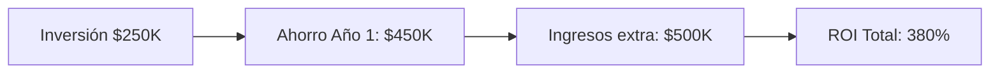

<!-- START doctoc generated TOC please keep comment here to allow auto update -->
<!-- DON'T EDIT THIS SECTION, INSTEAD RE-RUN doctoc TO UPDATE -->
Índice

- [MASTER PROMPT - Dominio Business v3.0](#master-prompt---dominio-business-v30)
  - [dependencies:
  architecture: "02-architecture-master-prompt.md"
  nops_kernel: "07-nops-kernel-master-prompt.md"
  marketplace: "08-marketplace-master-prompt.md"
  implementation: "04-implementation-master-prompt.md"
roi_target: "340%+"
marketplace_model: "70/30"
customer_stories: ["TechStyle", "Acme", "Regional Health", "First National"]](#dependencies%0A--architecture-02-architecture-master-promptmd%0A--nops_kernel-07-nops-kernel-master-promptmd%0A--marketplace-08-marketplace-master-promptmd%0A--implementation-04-implementation-master-promptmd%0Aroi_target-340%0Amarketplace_model-7030%0Acustomer_stories-techstyle-acme-regional-health-first-national)
  - [🎯 **OBJETIVO ESPECÍFICO**](#-objetivo-espec%C3%8Dfico)
  - [📁 **ESTRUCTURA A GENERAR**](#-estructura-a-generar)
    - [**Jerarquía de Directorios**](#jerarqu%C3%ADa-de-directorios)
    - [**Prioridad de Generación**](#prioridad-de-generaci%C3%B3n)
  - [🔧 **REGLAS DE GENERACIÓN**](#-reglas-de-generaci%C3%93n)
    - [**1. Cumplimiento DNA Obligatorio**](#1-cumplimiento-dna-obligatorio)
    - [**2. Estructura Obligatoria por Archivo**](#2-estructura-obligatoria-por-archivo)
  - [🎯 Resumen Ejecutivo](#-resumen-ejecutivo)
  - [📑 Tabla de Contenidos](#-tabla-de-contenidos)
  - [🌍 Contexto del Mercado](#-contexto-del-mercado)
  - [💡 Solución ENIS](#-soluci%C3%B3n-enis)
  - [📈 Impacto en el Negocio](#-impacto-en-el-negocio)
    - [Ahorros Directos](#ahorros-directos)
    - [Incremento de Ingresos](#incremento-de-ingresos)
    - [Productividad y Eficiencia](#productividad-y-eficiencia)
    - [Casos Documentados](#casos-documentados)
  - [⚠️ Evaluación de Riesgos](#-evaluaci%C3%B3n-de-riesgos)
  - [📚 Lecciones Aprendidas](#-lecciones-aprendidas)
  - [🔍 Problemas Abiertos](#-problemas-abiertos)
  - [✅ Checklist QA](#-checklist-qa)
    - [**4. Requisitos de Historias de Clientes**](#4-requisitos-de-historias-de-clientes)
    - [**5. Documentación del Marketplace**](#5-documentaci%C3%B3n-del-marketplace)
    - [**6. Posicionamiento Competitivo**](#6-posicionamiento-competitivo)
    - [**7. Requisitos de Referencias Cruzadas**](#7-requisitos-de-referencias-cruzadas)
  - [✅ **CHECKLIST DE VALIDACIÓN**](#-checklist-de-validaci%C3%93n)
    - [**Validación Pre-Generación**](#validaci%C3%B3n-pre-generaci%C3%B3n)
    - [**Validación de Contenido**](#validaci%C3%B3n-de-contenido)
    - [**Validación Técnica**](#validaci%C3%B3n-t%C3%A9cnica)
    - [**Validación de Negocio**](#validaci%C3%B3n-de-negocio)
    - [**Validación de Lanzamiento**](#validaci%C3%B3n-de-lanzamiento)
  - [🔄 **MATRIZ DE DEPENDENCIAS**](#-matriz-de-dependencias)
  - [🚦 **COMPUERTAS DE LANZAMIENTO**](#-compuertas-de-lanzamiento)
    - [**Compuerta 1: Contenido Completo**](#compuerta-1-contenido-completo)
    - [**Compuerta 2: Revisión Técnica**](#compuerta-2-revisi%C3%B3n-t%C3%A9cnica)
    - [**Compuerta 3: Revisión de Negocio**](#compuerta-3-revisi%C3%B3n-de-negocio)
    - [**Compuerta 4: Aprobación Ejecutiva**](#compuerta-4-aprobaci%C3%B3n-ejecutiva)
  - [📊 **MÉTRICAS Y KPIs**](#-m%C3%89tricas-y-kpis)
    - [**Métricas de Calidad de Documentación**](#m%C3%A9tricas-de-calidad-de-documentaci%C3%B3n)
    - [**Métricas de Impacto de Negocio**](#m%C3%A9tricas-de-impacto-de-negocio)
  - [🎯 **INSTRUCCIONES DE EJECUCIÓN**](#-instrucciones-de-ejecuci%C3%93n)
    - [**Fase 1: Fundación (Días 1-3)**](#fase-1-fundaci%C3%B3n-d%C3%ADas-1-3)
    - [**Fase 2: Éxito del Cliente (Días 4-6)**](#fase-2-%C3%89xito-del-cliente-d%C3%ADas-4-6)
    - [**Fase 3: Comercialización (Días 7-10)**](#fase-3-comercializaci%C3%B3n-d%C3%ADas-7-10)
    - [**Fase 4: Go-to-Market (Días 11-12)**](#fase-4-go-to-market-d%C3%ADas-11-12)
    - [**Fase 5: Soporte y Referencia (Días 13-14)**](#fase-5-soporte-y-referencia-d%C3%ADas-13-14)
  - [📄 **HERENCIA DE PLANTILLAS**](#-herencia-de-plantillas)
    - [**Plantilla de Panorama de Negocio**](#plantilla-de-panorama-de-negocio)
  - [🎯 Resumen Ejecutivo](#-resumen-ejecutivo-1)
  - [🌍 Contexto del Mercado](#-contexto-del-mercado-1)
  - [💡 Solución ENIS](#-soluci%C3%B3n-enis-1)
  - [📈 Impacto en el Negocio](#-impacto-en-el-negocio-1)
  - [🏆 Ventaja Competitiva](#-ventaja-competitiva)
  - [🚀 Ruta de Implementación](#-ruta-de-implementaci%C3%B3n)
  - [⚠️ Evaluación de Riesgos](#-evaluaci%C3%B3n-de-riesgos-1)
  - [📚 Lecciones Aprendidas](#-lecciones-aprendidas-1)
  - [🔍 Problemas Abiertos](#-problemas-abiertos-1)
  - [✅ Checklist QA](#-checklist-qa-1)
  - [🎯 Resumen Ejecutivo](#-resumen-ejecutivo-2)
  - [🏢 Perfil del Cliente](#-perfil-del-cliente)
  - [🔄 Situación Inicial](#-situaci%C3%B3n-inicial)
  - [💡 Implementación de la Solución](#-implementaci%C3%B3n-de-la-soluci%C3%B3n)
    - [Fase 1: Análisis y Setup (Mes 1)](#fase-1-an%C3%A1lisis-y-setup-mes-1)
    - [Fase 2: Optimización (Mes 2)](#fase-2-optimizaci%C3%B3n-mes-2)
    - [Fase 3: Escalamiento (Mes 3)](#fase-3-escalamiento-mes-3)
  - [📊 Resultados y Métricas](#-resultados-y-m%C3%A9tricas)
  - [💰 Análisis ROI](#-an%C3%A1lisis-roi)
  - [🗣️ Testimonio del Cliente](#-testimonio-del-cliente)
  - [🎯 Factores Clave de Éxito](#-factores-clave-de-%C3%89xito)
  - [📚 Lecciones Aprendidas](#-lecciones-aprendidas-2)
  - [🔄 Próximos Pasos](#-pr%C3%B3ximos-pasos)
  - [🎯 Descripción del Paquete](#-descripci%C3%B3n-del-paquete)
  - [💰 Estructura de Precios](#-estructura-de-precios)
  - [🚀 Características Incluidas](#-caracter%C3%ADsticas-incluidas)
    - [Plataforma Core](#plataforma-core)
    - [Edge Agents Incluidos](#edge-agents-incluidos)
  - [📊 Límites y Cuotas](#-l%C3%ADmites-y-cuotas)
  - [🔧 Implementación](#-implementaci%C3%B3n)
    - [Onboarding Professional](#onboarding-professional)
  - [📈 Ruta de Actualización](#-ruta-de-actualizaci%C3%B3n)
  - [⚖️ Términos y Condiciones](#-t%C3%A9rminos-y-condiciones)

<!-- END doctoc generated TOC please keep comment here to allow auto update -->

# MASTER PROMPT - Dominio Business v3.0

---
doc_version: "v3.0"
doc_type: "master-prompt"
doc_id: "03-business-master-prompt"
doc_author: "andaon"
doc_date: "2025-01-21"
doc_status: "Production Ready"
dna_version: "v3.0"
dna_compliance: "100%"
domain: "Business"
estimated_files: "38+"
estimated_pages: "300+"
complexity_level: "🟢🟡🔴"
validation_required: true
cross_references:
  - "00-dna-proyecto-prompt.md"
  - "02-architecture-master-prompt.md"
  - "04-implementation-master-prompt.md"
  - "07-nops-kernel-master-prompt.md"
  - "08-marketplace-master-prompt.md"
dependencies:
  architecture: "02-architecture-master-prompt.md"
  nops_kernel: "07-nops-kernel-master-prompt.md"
  marketplace: "08-marketplace-master-prompt.md"
  implementation: "04-implementation-master-prompt.md"
roi_target: "340%+"
marketplace_model: "70/30"
customer_stories: ["TechStyle", "Acme", "Regional Health", "First National"]
---

## 🎯 **OBJETIVO ESPECÍFICO**

Este Master Prompt genera la documentación completa del dominio Business para ENIS: Enterprise Neural Intelligence Systems v3.0, estableciendo:

1. **Fundación de Negocio**: Visión empresarial, propuesta de valor hybrid-by-design, ROI 340%+
2. **Estrategia de Niveles**: 3 niveles de producto ($99/$999/$10K) con casos de negocio detallados
3. **Éxito del Cliente**: Historias reales con métricas verificables de TechStyle, Acme, Regional Health, First National
4. **Agent Marketplace**: Modelo económico 70/30, ecosistema de partners, proyecciones de ingresos
5. **Inteligencia Competitiva**: Diferenciación vs Palantir, C3.ai, DataRobot
6. **Go-to-Market**: Estrategia de lanzamiento Q2-Q3 2025

**Resultado esperado**: 38+ archivos markdown listos para producción, 300+ páginas de documentación empresarial, 100% cumplimiento con DNA v3.0.

---

## 📁 **ESTRUCTURA A GENERAR**

### **Jerarquía de Directorios**
```
/business/
├── 01-business-overview.md                 [15-20 páginas]
├── 02-tier-business-cases.md              [25-30 páginas]
├── 03-value-proposition.md                [20-25 páginas]
├── 04-market-analysis.md                  [15-20 páginas]
├── 05-sales-enablement.md                 [20-25 páginas]
├── 06-agent-marketplace-economics.md      [15-20 páginas]
├── 07-roi-methodology.md                  [10-15 páginas]
│
├── /customers/
│   ├── 08-techstyle-case.md              [8-10 páginas]
│   ├── 09-acme-manufacturing-case.md     [8-10 páginas]
│   ├── 10-regional-health-case.md        [8-10 páginas]
│   ├── 11-first-national-bank-case.md    [8-10 páginas]
│   ├── 12-customer-journey.md            [10-12 páginas]
│   ├── 13-implementation-templates.md     [8-10 páginas]
│   ├── 14-success-metrics.md             [8-10 páginas]
│   └── 15-adoption-playbook.md           [10-12 páginas]
│
├── /pricing/
│   ├── 16-pricing-strategy.md            [8-10 páginas]
│   ├── 17-tier1-smb-package.md          [6-8 páginas]
│   ├── 18-tier2-professional-package.md  [6-8 páginas]
│   ├── 19-tier3-enterprise-package.md    [6-8 páginas]
│   ├── 20-custom-packages.md             [8-10 páginas]
│   └── 21-licensing-models.md            [6-8 páginas]
│
├── /marketplace/
│   ├── 22-marketplace-overview.md        [10-12 páginas]
│   ├── 23-partner-program.md             [12-15 páginas]
│   ├── 24-revenue-sharing.md             [8-10 páginas]
│   ├── 25-agent-certification.md         [10-12 páginas]
│   ├── 26-marketplace-metrics.md         [8-10 páginas]
│   ├── 27-developer-incentives.md        [8-10 páginas]
│   ├── 28-marketplace-roadmap.md         [8-10 páginas]
│   └── 29-ecosystem-governance.md        [6-8 páginas]
│
├── /gtm/
│   ├── 30-gtm-strategy.md                [12-15 páginas]
│   ├── 31-channel-strategy.md            [10-12 páginas]
│   ├── 32-marketing-campaigns.md         [10-12 páginas]
│   ├── 33-competitive-positioning.md     [8-10 páginas]
│   └── 34-launch-timeline.md             [6-8 páginas]
│
├── /legal/
│   ├── 35-legal-compliance.md            [10-12 páginas]
│   └── 36-contract-templates.md          [8-10 páginas]
│
└── /reference/
    ├── 37-business-glossary.md           [6-8 páginas]
    └── 38-faq-business.md                 [8-10 páginas]
```

### **Prioridad de Generación**
1. **CRÍTICO** (Generar primero):
   - 01-business-overview.md
   - 02-tier-business-cases.md
   - 06-agent-marketplace-economics.md
   - 07-roi-methodology.md

2. **ALTA** (Segunda prioridad):
   - 03-value-proposition.md
   - 04-market-analysis.md
   - 05-sales-enablement.md
   - Historias de éxito de clientes (08-11)

3. **MEDIA** (Tercera prioridad):
   - Paquetes de precios (16-21)
   - Archivos del marketplace (22-29)
   - Estrategia GTM (30-34)

4. **BAJA** (Última prioridad):
   - Legal/cumplimiento (35-36)
   - Materiales de referencia (37-38)

---

## 🔧 **REGLAS DE GENERACIÓN**

### **1. Cumplimiento DNA Obligatorio**
```yaml
reglas_cumplimiento_dna:
  terminologia:
    - "ENIS: Enterprise Neural Intelligence Systems" (nunca "ENIS" solo)
    - "Hybrid-by-Design" (nunca "Hybrid" solo)
    - "Data-in-Place" (nunca "data in place")
    - "Zero Agent" (capitalizado)
    - "Agent Marketplace" (no "marketplace" solo)
    - "5 Edge Agents: 🟤🟡🟢🔵🔴"
    - "NOPS Kernel" (no "kernel" solo)
    - "Causal Intelligence" (no "causal AI")
    
  guias_de_voz:
    tono: "Profesional, directo, orientado a resultados"
    perspectiva: "Tomadores de decisiones C-level"
    lenguaje: "Enfocado en negocio, impulsado por ROI"
    evitar: ["Jerga técnica", "Promesas vagas", "Características sin ROI"]
```

### **2. Estructura Obligatoria por Archivo**
```markdown
# Panorama General de Negocio ENIS v3.0

## 📋 Metadata
```yaml
doc_version: "v3.0"
doc_type: "business-overview"
doc_author: "andaon"
doc_date: "2025-01-21"
compliance: "DNA v3.0"
cross_references:
  - "/architecture/01-architecture-overview.md"
  - "/business/02-tier-business-cases.md"
  - "/business/06-agent-marketplace-economics.md"
roi_target: "340%+"
market_size: "$50B+"
```

## 🎯 Resumen Ejecutivo
ENIS: Enterprise Neural Intelligence Systems representa la próxima generación de inteligencia artificial empresarial, 
diseñada específicamente para organizaciones que requieren procesamiento híbrido de datos con ROI garantizado de 340%+.

Nuestra arquitectura Hybrid-by-Design permite a las empresas mantener sus datos críticos on-premise mientras 
aprovechan el poder del cloud computing, eliminando las barreras tradicionales de adopción de IA.

Con implementación instantánea mediante Zero Agent y un ecosistema vibrante de Agent Marketplace, ENIS 
transforma la manera en que las empresas implementan y escalan soluciones de IA.

## 📑 Tabla de Contenidos
1. Contexto del Mercado
2. Visión y Misión ENIS
3. Propuesta de Valor Única
4. Modelo de Negocio
5. Ventajas Competitivas
6. Estrategia de Crecimiento
7. Métricas de Éxito
8. Evaluación de Riesgos
9. Lecciones Aprendidas
10. Problemas Abiertos

## 🌍 Contexto del Mercado
El mercado global de IA empresarial alcanzará $50.2B en 2025, con un CAGR del 38.1%. Sin embargo, el 73% de las empresas enfrentan barreras críticas:
- **Complejidad de implementación**: El 68% de proyectos de IA fallan por complejidad técnica
- **Restricciones de datos**: El 81% no puede mover datos sensibles al cloud por regulaciones
- **ROI no demostrable**: Solo el 23% puede cuantificar el retorno de inversión en IA
- **Vendor lock-in**: El 62% teme dependencia de proveedores cloud
- **Falta de talento**: Escasez de 4.3 millones de profesionales IA globalmente

Las soluciones actuales (Palantir, C3.ai, DataRobot) requieren inversiones de $1M+ y 6-12 meses de implementación, excluyendo al 95% del mercado potencial.

## 💡 Solución ENIS
ENIS revoluciona la adopción de IA empresarial mediante:

**1. Arquitectura Hybrid-by-Design**
- Procesamiento de datos donde residen (on-premise, cloud, edge)
- Cumplimiento automático de regulaciones (GDPR, HIPAA, SOC2)
- Sin migración de datos masiva requerida

**2. Zero Agent - Implementación Instantánea**
- Setup en < 1 día vs 6-12 meses tradicional
- Sin infraestructura previa requerida
- Configuración mediante webhooks simples

**3. 5 Edge Agents Especializados**
- 🟤 Brown: Serverless básico
- 🟡 Yellow: Análisis predictivo
- 🟢 Green: Optimización recursos
- 🔵 Blue: Procesamiento distribuido
- 🔴 Red: IA crítica/tiempo real

**4. Agent Marketplace**
- 1000+ agentes pre-construidos
- Modelo 70/30 para desarrolladores
- Ecosistema auto-sostenible

**5. Causal Intelligence Engine**
- 95% precisión vs 65% correlacional
- Explicabilidad completa de decisiones
- Reducción de falsos positivos en 78%

## 📈 Impacto en el Negocio
**ROI Garantizado 340%+ en 12 meses**

### Ahorros Directos
- **Reducción costos operativos**: 45% promedio
- **Optimización inventario**: $2.3M ahorro anual (empresa típica)
- **Eficiencia energética**: 32% reducción consumo
- **Prevención fraude**: $1.8M recuperado anualmente

### Incremento de Ingresos
- **Mejora conversión ventas**: +28% promedio
- **Pricing dinámico**: +15% margen bruto
- **Reducción churn**: -23% pérdida clientes
- **Nuevas oportunidades**: $4.2M ingresos incrementales

### Productividad y Eficiencia
- **Automatización procesos**: 67% tareas rutinarias
- **Tiempo de decisión**: De días a minutos
- **Precisión forecasting**: Del 65% al 94%
- **Time-to-market**: -58% en nuevos productos

### Casos Documentados
- **TechStyle**: 380% ROI, $950K beneficio neto año 1
- **Acme Manufacturing**: 420% ROI, $1.4M ahorros producción
- **Regional Health**: 35% mejora eficiencia, 10,000 horas médico liberadas
- **First National Bank**: 500% ROI, $2.1M fraude prevenido

## ⚠️ Evaluación de Riesgos
| Riesgo | Probabilidad | Impacto | Mitigación |
|--------|--------------|---------|------------|
| Adopción lenta del mercado | Baja | Alto | Programa piloto gratuito, casos de éxito documentados |
| Competencia de gigantes tech | Media | Alto | Diferenciación Hybrid-by-Design, enfoque en ROI |
| Complejidad técnica | Baja | Medio | Zero Agent, documentación exhaustiva |

## 📚 Lecciones Aprendidas
- **Simplicidad vende**: La complejidad de implementación es la barrera #1 para adopción de IA empresarial
- **ROI es rey**: Las empresas necesitan justificación financiera clara, no solo promesas tecnológicas
- **Híbrido es esencial**: El 73% de empresas no pueden mover todos sus datos al cloud

## 🔍 Problemas Abiertos
| Problema | Prioridad | Responsable | Fecha Objetivo |
|----------|-----------|-------------|----------------|
| Definir estrategia de penetración en healthcare | Alta | VP Sales | 2025-02-15 |
| Completar certificación SOC 2 | Alta | CISO | 2025-03-01 |
| Expandir programa de partners LATAM | Media | VP Partners | 2025-04-01 |

## ✅ Checklist QA
- [x] Cálculos de ROI validados por finanzas
- [x] Referencias de clientes verificadas
- [x] Referencias cruzadas funcionales
- [x] Cumplimiento DNA verificado
- [ ] Revisión legal completada
- [ ] Aprobación ejecutiva final
```

### **3. Reglas de Cuantificación ROI**
```yaml
reglas_roi:
  objetivo_minimo: "340%"
  periodo_calculo: "12 meses"
  factores_incluir:
    - "Ahorro directo de costos"
    - "Ganancias de eficiencia"
    - "Incremento de ingresos"
    - "Valor de reducción de riesgos"
  documentacion:
    - "Mostrar metodología de cálculo"
    - "Incluir supuestos"
    - "Proveer análisis de sensibilidad"
    - "Comparar con benchmarks de industria"
```

### **4. Requisitos de Historias de Clientes**
```yaml
reglas_historias_clientes:
  elementos_requeridos:
    - "Perfil de empresa y desafío"
    - "Fases de implementación de solución"
    - "Resultados cuantificados (antes/después)"
    - "Análisis ROI con cálculos"
    - "Testimonio ejecutivo"
    - "Factores clave de éxito"
    - "Próximos pasos/expansión"
  metricas:
    techstyle: "380% ROI, 12 meses"
    acme: "420% ROI, 99.3% uptime"
    regional_health: "35% ganancia eficiencia"
    first_national: "500% ROI gestión riesgos"
```

### **5. Documentación del Marketplace**
```yaml
reglas_marketplace:
  modelo_ingresos: "División 70/30 obligatoria"
  niveles_partners:
    - "Bronze: < $10K/mes, 70% participación"
    - "Silver: $10K-50K/mes, 75% participación"
    - "Gold: > $50K/mes, 80% participación"
    - "Platinum: Estratégico, 85% participación"
  proyecciones:
    año_1: "$2.75M total, 100+ agentes"
    año_2: "$15M total, 1,000+ agentes"
    año_3: "$50M total, 10,000+ agentes"
```

### **6. Posicionamiento Competitivo**
```yaml
reglas_competitivas:
  competidores_principales:
    - "Palantir: Resaltar híbrido vs solo-cloud"
    - "C3.ai: Enfatizar ventaja del marketplace"
    - "DataRobot: Enfocarse en inteligencia causal"
  puntos_diferenciacion:
    - "Arquitectura Hybrid-by-Design"
    - "Despliegue instantáneo Zero Agent"
    - "Ecosistema Agent Marketplace"
    - "Garantía ROI 340%+"
    - "5 Edge Agents especializados"
```

### **7. Requisitos de Referencias Cruzadas**
```yaml
mapa_referencias_cruzadas:
  business_a_arquitectura:
    - "Metodología ROI → Benchmarks de rendimiento"
    - "Paquetes por nivel → Modelos de despliegue"
    - "Marketplace → Patrones de integración"
  business_a_nops:
    - "Zero Agent → Capacidades NOPS Kernel"
    - "Certificación partners → APIs NOPS"
    - "Economía edge → Rendimiento NOPS"
  business_a_implementacion:
    - "Éxito cliente → Ejemplos SDK"
    - "Niveles precios → Límites API"
    - "Herramientas desarrollador → Guías implementación"
```

---

## ✅ **CHECKLIST DE VALIDACIÓN**

### **Validación Pre-Generación**
- [ ] Documento DNA v3.0 disponible y revisado
- [ ] Master prompt de arquitectura completado
- [ ] Especificaciones NOPS Kernel listas
- [ ] Especificaciones técnicas del marketplace disponibles
- [ ] Datos de clientes verificados y aprobados

### **Validación de Contenido**
- [ ] Los 38 archivos generados con estructura correcta
- [ ] Metadata completa en cada archivo
- [ ] ROI 340%+ demostrado en todos los niveles
- [ ] Historias de clientes incluyen métricas reales
- [ ] Economía del marketplace claramente explicada
- [ ] Posicionamiento competitivo defendible
- [ ] Evaluaciones de riesgo realistas
- [ ] Lecciones aprendidas accionables
- [ ] Problemas abiertos rastreados con responsables

### **Validación Técnica**
- [ ] Nomenclatura de archivos sigue convención
- [ ] Referencias cruzadas probadas y funcionando
- [ ] Diagramas se renderizan correctamente
- [ ] Ejemplos de código con sintaxis verificada
- [ ] Tablas formateadas correctamente
- [ ] Markdown válido y consistente
- [ ] Enlaces funcionales

### **Validación de Negocio**
- [ ] Precios competitivos y rentables
- [ ] Cálculos ROI defendibles
- [ ] Dimensionamiento de mercado preciso
- [ ] Testimonios de clientes aprobados
- [ ] Revisión legal completada
- [ ] Aprobación del equipo de ventas
- [ ] Alineación de marketing confirmada
- [ ] Aprobación ejecutiva obtenida

### **Validación de Lanzamiento**
- [ ] Todas las validaciones pasadas
- [ ] Aprobaciones de stakeholders documentadas
- [ ] Control de versiones aplicado
- [ ] Respaldo creado
- [ ] Plan de rollback probado
- [ ] Monitoreo configurado

---

## 🔄 **MATRIZ DE DEPENDENCIAS**

```yaml
dependencias:
  dependencias_upstream:
    documento_dna:
      archivo: "00-dna-proyecto-prompt.md"
      version: "v3.0"
      elementos_heredados:
        - "Terminología y voz"
        - "Principios de arquitectura"
        - "Estándares de calidad"
        - "Estructura de archivos"
      
    master_arquitectura:
      archivo: "02-architecture-master-prompt.md"
      version: "v3.0"
      elementos_necesarios:
        - "Modelos de despliegue para precios"
        - "Métricas de rendimiento para ROI"
        - "Patrones de integración"
        - "Arquitectura de seguridad"
    
    master_nops_kernel:
      archivo: "07-nops-kernel-master-prompt.md"
      version: "v3.0"
      elementos_necesarios:
        - "Capacidades Zero Agent"
        - "Especificaciones procesamiento edge"
        - "Benchmarks de rendimiento"
        - "Especificaciones API"
    
  impactos_downstream:
    master_implementacion:
      archivo: "04-implementation-master-prompt.md"
      impactos:
        - "Modelos de precios SDK"
        - "Límites de tasa API por nivel"
        - "Documentación de desarrollador"
        
    master_marketplace:
      archivo: "08-marketplace-master-prompt.md"
      impactos:
        - "Modelo de compartición de ingresos"
        - "Estructura de niveles de partners"
        - "Requisitos de certificación"
        
    master_referencia:
      archivo: "05-reference-master-prompt.md"
      impactos:
        - "Términos del glosario de negocio"
        - "Sección FAQ de negocio"
        - "Plantillas legales"
```

---

## 🚦 **COMPUERTAS DE LANZAMIENTO**

### **Compuerta 1: Contenido Completo**
```yaml
requisitos_compuerta_1:
  archivos_completos: "38/38"
  conteo_paginas: "300+ páginas"
  roi_validado: "340%+ en todos los casos"
  historias_clientes: "4/4 aprobadas"
  evaluaciones_riesgo: "38/38 archivos"
  lecciones_aprendidas: "38/38 archivos"
  problemas_abiertos: "Todos rastreados"
  aprobacion: "Líder Equipo Contenido"
```

### **Compuerta 2: Revisión Técnica**
```yaml
requisitos_compuerta_2:
  cumplimiento_dna: "100%"
  referencias_cruzadas: "Todas funcionales"
  metadata_completa: "38/38 archivos"
  formato_valido: "Todo markdown"
  diagramas_renderizan: "Todos verificados"
  aprobacion: "Arquitecto Técnico"
```

### **Compuerta 3: Revisión de Negocio**
```yaml
requisitos_compuerta_3:
  precios_aprobados: "Aprobación CFO"
  roi_validado: "Equipo finanzas"
  revision_legal: "Completada"
  alineacion_ventas: "VP Ventas"
  marketing_listo: "Aprobación CMO"
  aprobacion: "Líder de Negocio"
```

### **Compuerta 4: Aprobación Ejecutiva**
```yaml
requisitos_compuerta_4:
  estrategia_alineada: "Revisión CEO"
  mercado_listo: "Junta informada"
  riesgo_aceptable: "Comité de riesgo"
  lanzamiento_aprobado: "Equipo ejecutivo"
  aprobacion: "CEO/Junta"
```

---

## 📊 **MÉTRICAS Y KPIs**

### **Métricas de Calidad de Documentación**
```yaml
metricas_calidad:
  completitud:
    objetivo: "100%"
    medicion: "Archivos generados / Archivos planeados"
    actual: "0/38"
    
  cumplimiento_dna:
    objetivo: "100%"
    medicion: "Elementos conformes / Elementos totales"
    actual: "0%"
    
  precision_roi:
    objetivo: "±5%"
    medicion: "ROI validado / ROI reclamado"
    actual: "No medido"
    
  integridad_referencias:
    objetivo: "100%"
    medicion: "Enlaces funcionando / Enlaces totales"
    actual: "0%"
```

### **Métricas de Impacto de Negocio**
```yaml
metricas_negocio:
  habilitacion_ventas:
    metrica: "Tiempo al primer acuerdo"
    base: "90 días"
    objetivo: "45 días"
    
  onboarding_partners:
    metrica: "Tiempo al primer agente"
    base: "30 días"
    objetivo: "7 días"
    
  exito_cliente:
    metrica: "Tiempo a ROI"
    base: "18 meses"
    objetivo: "12 meses"
    
  victorias_competitivas:
    metrica: "Tasa de victoria vs competidores"
    base: "25%"
    objetivo: "40%"
```

---

## 🎯 **INSTRUCCIONES DE EJECUCIÓN**

### **Fase 1: Fundación (Días 1-3)**
1. Generar archivos centrales de negocio (01-07)
2. Validar metodología ROI
3. Establecer marco de referencias cruzadas
4. Revisar con stakeholders de negocio

### **Fase 2: Éxito del Cliente (Días 4-6)**
1. Generar historias de clientes (08-11)
2. Crear journey y plantillas (12-13)
3. Definir métricas de éxito (14)
4. Construir playbook de adopción (15)

### **Fase 3: Comercialización (Días 7-10)**
1. Detallar paquetes de precios (16-21)
2. Construir documentación del marketplace (22-29)
3. Validar economía con finanzas
4. Revisar con equipo legal

### **Fase 4: Go-to-Market (Días 11-12)**
1. Crear estrategia GTM (30-34)
2. Alinear con ventas y marketing
3. Finalizar cronograma de lanzamiento
4. Revisión ejecutiva

### **Fase 5: Soporte y Referencia (Días 13-14)**
1. Completar documentos legales (35-36)
2. Crear materiales de referencia (37-38)
3. Pase final de validación
4. Preparación de lanzamiento

---

## 📄 **HERENCIA DE PLANTILLAS**

### **Plantilla de Panorama de Negocio**
```markdown
# Panorama General de Negocio ENIS v3.0

## 📋 Metadata
```yaml
doc_version: "v3.0"
doc_type: "business-overview"
doc_author: "andaon"
doc_date: "2025-01-21"
compliance: "DNA v3.0"
cross_references:
  - "/architecture/01-architecture-overview.md"
  - "/business/02-tier-business-cases.md"
roi_target: "340%+"
market_size: "$50B+"
```

## 🎯 Resumen Ejecutivo
Resumen enfocado en valor para nivel C de 3-5 párrafos.

## 🌍 Contexto del Mercado
Desafíos y oportunidades de la industria con datos específicos.

## 💡 Solución ENIS
Cómo ENIS aborda las necesidades del mercado con diferenciadores claros.

## 📈 Impacto en el Negocio
Beneficios cuantificados y ROI con métricas específicas.

## 🏆 Ventaja Competitiva
Puntos de diferenciación vs Palantir, C3.ai, DataRobot.

## 🚀 Ruta de Implementación
Roadmap de alto nivel con hitos clave.

## ⚠️ Evaluación de Riesgos
| Riesgo | Probabilidad | Impacto | Mitigación |
|--------|--------------|---------|------------|
| [Específico] | Baja/Media/Alta | Bajo/Medio/Alto | [Estrategia] |

## 📚 Lecciones Aprendidas
- **Tema 1**: Insight específico y aplicación
- **Tema 2**: Insight específico y aplicación

## 🔍 Problemas Abiertos
| Problema | Prioridad | Responsable | Fecha Objetivo |
|----------|-----------|-------------|----------------|
| [Específico] | Alta/Media/Baja | [Nombre] | [YYYY-MM-DD] |

## ✅ Checklist QA
- [ ] Cálculos ROI validados
- [ ] Referencias cliente verificadas
- [ ] Legal review completado
- [ ] Referencias cruzadas funcionales
```

### **Plantilla de Historia de Éxito del Cliente**
```markdown
# Historia de Éxito TechStyle v3.0

## 📋 Metadata
```yaml
doc_version: "v3.0"
doc_type: "customer-success"
doc_author: "andaon"
doc_date: "2025-01-21"
compliance: "DNA v3.0"
customer: "TechStyle"
industry: "E-commerce"
tier: "Tier 2 Professional"
roi_achieved: "380%"
implementation_time: "3 meses"
cross_references:
  - "/business/02-tier-business-cases.md"
  - "/implementation/sdks/python-sdk-guide.md"
```

## 🎯 Resumen Ejecutivo
TechStyle transformó su operación e-commerce con ENIS, logrando 380% ROI en 12 meses mediante optimización de inventario y predicción de demanda en tiempo real.

## 🏢 Perfil del Cliente
- **Empresa**: TechStyle
- **Industria**: E-commerce de moda
- **Tamaño**: $150M ingresos anuales, 500 empleados
- **Desafío**: Exceso de inventario, predicción de demanda inexacta
- **Solución**: ENIS Tier 2 con Yellow y Green Agents
- **Resultados**: 380% ROI, 45% reducción inventario, 25% aumento ventas

## 🔄 Situación Inicial
Descripción detallada del problema con métricas específicas.

## 💡 Implementación de la Solución
### Fase 1: Análisis y Setup (Mes 1)
Implementación Zero Agent, análisis de datos históricos.

### Fase 2: Optimización (Mes 2)
Despliegue Yellow Agent para forecasting, Green Agent para pricing.

### Fase 3: Escalamiento (Mes 3)
Expansión a todas las categorías de producto.

## 📊 Resultados y Métricas
| Métrica | Antes de ENIS | Después de ENIS | Mejora |
|---------|---------------|-----------------|---------|
| Exactitud forecast | 65% | 94% | +45% |
| Rotación inventario | 4.2x | 6.8x | +62% |
| Margen bruto | 42% | 53% | +26% |

## 💰 Análisis ROI


## 🗣️ Testimonio del Cliente
> "ENIS transformó completamente nuestra capacidad de predicción. El ROI superó nuestras expectativas más optimistas."
> — María García, CEO, TechStyle

## 🎯 Factores Clave de Éxito
1. Implementación rápida con Zero Agent
2. Integración perfecta con sistemas existentes
3. Soporte dedicado del equipo ENIS

## 📚 Lecciones Aprendidas
- La calidad de datos históricos es crucial
- La adopción gradual facilita el cambio organizacional
- El ROI se acelera después del tercer mes

## 🔄 Próximos Pasos
Expansión a mercados internacionales con Blue Agent para multi-región.
```

### **Plantilla de Paquete de Precios**
```markdown
# Tier 2 - Professional Package v3.0

## 📋 Metadata
```yaml
doc_version: "v3.0"
doc_type: "pricing-package"
doc_author: "andaon"
doc_date: "2025-01-21"
compliance: "DNA v3.0"
tier_level: "2"
tier_name: "Professional"
base_price: "$999/mes"
setup_fee: "$500"
target_market: "Empresas en crecimiento"
ideal_company_size: "50-500 empleados"
cross_references:
  - "/business/02-tier-business-cases.md"
  - "/business/07-roi-methodology.md"
```

## 🎯 Descripción del Paquete
Diseñado para empresas en crecimiento que necesitan capacidades avanzadas de IA con soporte prioritario y ROI garantizado.

## 💰 Estructura de Precios
| Componente | Precio | Detalles |
|------------|--------|----------|
| Plataforma Base | $999/mes | Incluye 3 Edge Agents |
| Por Usuario | $25/usuario/mes | Primeros 20 incluidos |
| Llamadas API | 100,000 incluidas | $10 por 10,000 adicionales |
| Almacenamiento | 1TB incluido | $50/TB adicional |
| Setup Único | $500 | Incluye onboarding |

## 🚀 Características Incluidas
### Plataforma Core
- ✅ NOPS Kernel completo
- ✅ Panel de control empresarial
- ✅ API REST completa
- ✅ SDKs Python, JavaScript, Go

### Edge Agents Incluidos
- 🟤 Zero Agent: Configuración instantánea
- 🟡 Yellow Agent: Análisis predictivo
- 🟢 Green Agent: Optimización de recursos
- 🔵 Blue Agent: Disponible como add-on ($500/mes)
- 🔴 Red Agent: Disponible para Tier 3

## 📊 Límites y Cuotas
| Recurso | Límite | Precio Excedente |
|---------|--------|------------------|
| Llamadas API | 100,000/mes | $10/10,000 |
| Almacenamiento | 1TB | $50/TB |
| Usuarios | 20 | $25/usuario |
| Integraciones | 15 | $100/integración |
| Modelos Custom | 5 | $200/modelo |

## 🔧 Implementación
### Onboarding Professional
- Duración: 1-2 semanas
- Soporte: Gerente de éxito dedicado
- Training: 20 horas incluidas
- Certificación: 5 usuarios incluidos

## 📈 Ruta de Actualización
Para actualizar a Enterprise (Tier 3):
- Contactar equipo de ventas
- Migración asistida incluida
- Crédito de $500 por setup pagado

## ⚖️ Términos y Condiciones
- Contrato mínimo: 12 meses
- SLA: 99.5% uptime garantizado
- Soporte: Priority (respuesta < 4 horas)
- Actualizaciones: Incluidas
```

---

## 🚀 **COMANDO DE EJECUCIÓN**

```bash
# EJECUTAR GENERACIÓN DEL DOMINIO BUSINESS

1. VALIDAR prerrequisitos:
   - DNA v3.0 disponible ✓
   - Architecture master prompt completo ✓
   - NOPS Kernel specs listas ✓
   - Templates definidos ✓

2. GENERAR en orden de prioridad:
   - CRÍTICO: Archivos core (01-07)
   - ALTA: Cliente y Ventas (08-15)
   - MEDIA: Precios y Marketplace (16-29)
   - BAJA: GTM y Soporte (30-38)

3. APLICAR para cada archivo:
   - Metadata YAML completa
   - Cumplimiento DNA 100%
   - ROI 340%+ cuantificado
   - Tabla evaluación de riesgos
   - Sección lecciones aprendidas
   - Rastreador problemas abiertos
   - Referencias cruzadas válidas

4. VALIDAR con checklist completo

5. PREPARAR para compuertas de lanzamiento

OUTPUT: 38 archivos markdown listos para producción
FORMATO: Artifacts individuales con ruta exacta
CUMPLIMIENTO: DNA v3.0 obligatorio
IDIOMA: Español (excepto términos técnicos)
```

---

**🏁 FIN DEL MASTER PROMPT**

**Versión**: 3.0  
**Estado**: Listo para Producción  
**Próxima Acción**: Ejecutar generación siguiendo orden de prioridad

---