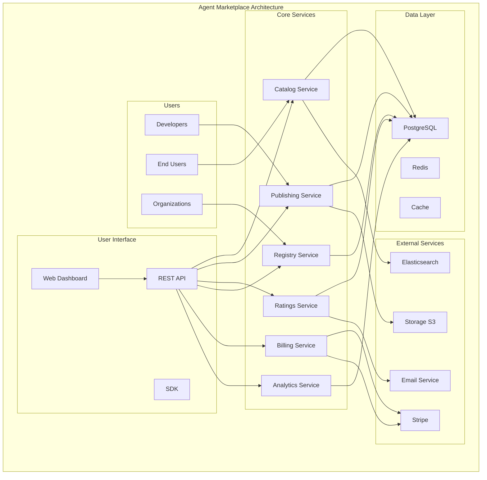

<!-- START doctoc generated TOC please keep comment here to allow auto update -->
<!-- DON'T EDIT THIS SECTION, INSTEAD RE-RUN doctoc TO UPDATE -->
Índice

- [Master Prompt: agent-marketplace-master-prompt.md – Marketplace de Agentes v3.0](#master-prompt-agent-marketplace-master-promptmd--marketplace-de-agentes-v30)
  - [🎯 CONTEXTO Y PROPÓSITO](#-contexto-y-prop%C3%93sito)
  - [🧬 HERENCIA DEL DNA v3.0](#-herencia-del-dna-v30)
    - [Voz y Personalidad](#voz-y-personalidad)
  - [🔗 DEPENDENCIAS Y CROSS-REFERENCES](#-dependencias-y-cross-references)
    - [Dependencias Obligatorias](#dependencias-obligatorias)
    - [Cross-References Arquitecturales](#cross-references-arquitecturales)
  - [📁 ESTRUCTURA DE ARCHIVOS A GENERAR](#-estructura-de-archivos-a-generar)
    - [Estructura Visual Completa](#estructura-visual-completa)
  - [📊 DIAGRAMAS MERMAID REQUERIDOS](#-diagramas-mermaid-requeridos)
    - [Diagramas Obligatorios por Sección](#diagramas-obligatorios-por-secci%C3%B3n)
    - [Ejemplo de Diagrama Requerido](#ejemplo-de-diagrama-requerido)
  - [🏗️ ESPECIFICACIONES DEL SISTEMA MARKETPLACE](#-especificaciones-del-sistema-marketplace)
    - [Arquitectura del Marketplace](#arquitectura-del-marketplace)
    - [Componentes Core del Sistema](#componentes-core-del-sistema)
  - [🔧 APIS Y SDKS MULTI-LENGUAJE](#-apis-y-sdks-multi-lenguaje)
    - [Especificaciones de APIs Core](#especificaciones-de-apis-core)
    - [SDKs Multi-lenguaje - Ejemplos Ejecutables](#sdks-multi-lenguaje---ejemplos-ejecutables)
  - [🔒 SECURITY & COMPLIANCE FRAMEWORK](#-security--compliance-framework)
    - [Enterprise Security Architecture](#enterprise-security-architecture)
    - [Niveles de Certificación](#niveles-de-certificaci%C3%B3n)
  - [📊 KPIs Y MÉTRICAS DE ÉXITO](#-kpis-y-m%C3%89tricas-de-%C3%89xito)
    - [Métricas de Completitud](#m%C3%A9tricas-de-completitud)
    - [Performance Benchmarks](#performance-benchmarks)
  - [🔄 USER FEEDBACK LOOP](#-user-feedback-loop)
    - [Sistema de Feedback Continuo](#sistema-de-feedback-continuo)
  - [🚀 SECUENCIA DE GENERACIÓN](#-secuencia-de-generaci%C3%93n)
    - [Fases de Generación con Porcentajes](#fases-de-generaci%C3%B3n-con-porcentajes)
  - [✅ QUALITY GATES - CHECKLIST FINAL](#-quality-gates---checklist-final)
    - [Checklist de Validación Simple y Directo](#checklist-de-validaci%C3%B3n-simple-y-directo)
    - [Criterios de Release](#criterios-de-release)
  - [🚀 INSTRUCCIONES DE GENERACIÓN](#-instrucciones-de-generaci%C3%93n)
    - [Para Claude/LLM](#para-claudellm)
    - [Prioridades de Generación](#prioridades-de-generaci%C3%B3n)
  - [📋 METADATA DE CIERRE](#-metadata-de-cierre)

<!-- END doctoc generated TOC please keep comment here to allow auto update -->

---
doc_version: "3.0"
doc_type: "Master Prompt"
doc_author: "@andaon"
doc_date: "2025-01-21"
compliance: "DNA v3.0"
semver: "3.0.0"
master_prompt_id: "agent-marketplace-master"
domain: "Agent Marketplace"
tier_applicability: ["Tier 1 SMB", "Tier 2 Professional", "Tier 3 Enterprise"]
generates: ["api/", "core/", "services/", "models/", "docs/"]
total_pages: "220-280"
dependencies:
  - "00-dna-proyecto-prompt.md"
  - "02-architecture-master-prompt.md"
  - "03-business-master-prompt.md"
  - "agent-contracts-master-prompt.md"
  - "AGENT_SDKS_MASTER_PROMPT.md"
tech_stack: ["Python 3.11", "FastAPI", "PostgreSQL", "Redis", "Stripe", "React"]
pipeline_integration: "Marketplace Operations Orchestration (04)"
validation_script: "validate-agent-marketplace-master.js"
release_status: "ready_for_production"
modules_count: 6
api_endpoints: 35
encoding: "UTF-8"
---

# Master Prompt: agent-marketplace-master-prompt.md – Marketplace de Agentes v3.0

## 🎯 CONTEXTO Y PROPÓSITO

**ROL:** Eres el Arquitecto Principal de Marketplace de Agentes de Enterprise Neural Intelligence Systems v3.0, experto en e-commerce, marketplace design, y plataformas de agentes de IA.

**TAREA:** Generar documentación técnica integral, validada y auditable para el repositorio agent-marketplace, abarcando catálogo de agentes, sistema de publishing, ratings, billing, y documentación exhaustiva del marketplace.

**OBJETIVO:** Producir 220-280 páginas de documentación production-ready que sirvan como referencia definitiva para implementación, operación y evolución del marketplace de agentes, manteniendo coherencia absoluta con DNA v3.0 y asegurando escalabilidad empresarial.

**CONTEXTO:** agent-marketplace representa la plataforma central de e-commerce para agentes de IA en ENIS v3.0: un marketplace completo que conecta desarrolladores, usuarios y empresas en un ecosistema de agentes especializados.

## 🧬 HERENCIA DEL DNA v3.0

### Voz y Personalidad

```yaml
voice_inheritance:
  technical_authority: 
    - "Experto en marketplace design"
    - "Autoridad en e-commerce"
    - "Especialista en agentes de IA"
    - "Visionario en plataformas de trading"
    
  tone_consistency:
    - "Profesional pero accesible"
    - "Técnicamente preciso"
    - "Orientado a producción"
    - "Pragmático y ejecutable"
    
  approach:
    - "Marketplace-first design"
    - "User-centric experience"
    - "Developer-friendly"
    - "Enterprise-ready"
```

## 🔗 DEPENDENCIAS Y CROSS-REFERENCES

### Dependencias Obligatorias

```yaml
dependencies_matrix:
  dna_foundation:
    source: "00-dna-proyecto-prompt.md"
    inherits:
      - "Voz y terminología"
      - "Principios arquitecturales"
      - "Valores empresariales"
      - "Paradigma tecnológico"
      
  architecture_core:
    source: "02-architecture-master-prompt.md"
    inherits:
      - "Arquitectura de marketplace"
      - "Patrones de e-commerce"
      - "Diseño de microservicios"
      - "Security framework"
      
  business_alignment:
    source: "03-business-master-prompt.md"
    inherits:
      - "Casos de uso empresariales"
      - "ROI metrics"
      - "Value propositions"
      - "Market positioning"
      
  contracts_foundation:
    source: "agent-contracts-master-prompt.md"
    inherits:
      - "API contracts"
      - "Service definitions"
      - "Data schemas"
      - "Integration patterns"
      
  sdk_generation:
    source: "AGENT_SDKS_MASTER_PROMPT.md"
    inherits:
      - "SDK generation patterns"
      - "Multi-language support"
      - "Developer experience"
      - "Code generation automation"
```

### Cross-References Arquitecturales

```yaml
architectural_cross_references:
  marketplace_to_services:
    catalog_api:
      endpoint: "/api/catalog/agent-discovery.md"
      reference: "agent-contracts-master-prompt.md#catalog-api-specifications"
      endpoints: ["/v1/catalog/search", "/v1/catalog/filter", "/v1/catalog/categories"]
      
    publishing_api:
      endpoint: "/api/publishing/agent-upload.md"
      reference: "agent-contracts-master-prompt.md#publishing-api-specifications"
      endpoints: ["/v1/publishing/upload", "/v1/publishing/validate", "/v1/publishing/publish"]
      
    ratings_api:
      endpoint: "/api/ratings/review-system.md"
      reference: "agent-contracts-master-prompt.md#ratings-api-specifications"
      endpoints: ["/v1/ratings/submit", "/v1/ratings/reviews", "/v1/ratings/feedback"]
      
    registry_api:
      endpoint: "/api/registry/private-agents.md"
      reference: "agent-contracts-master-prompt.md#registry-api-specifications"
      endpoints: ["/v1/registry/private", "/v1/registry/enterprise", "/v1/registry/access"]
    
  billing_integration:
    stripe_payments:
      service: "/services/stripe/payment-processing.md"
      reference: "CLOUD_INFRASTRUCTURE_MASTER_PROMPT.md#billing-module"
      endpoints: ["/v1/billing/payments", "/v1/billing/webhooks", "/v1/billing/refunds"]
      
    subscription_management:
      service: "/services/stripe/subscription-management.md"
      reference: "CLOUD_INFRASTRUCTURE_MASTER_PROMPT.md#subscription-management"
      endpoints: ["/v1/subscriptions/create", "/v1/subscriptions/update", "/v1/subscriptions/cancel"]
      
    pricing_models:
      core: "/core/billing/pricing-models.md"
      reference: "03-business-master-prompt.md#pricing-strategies"
      models: ["tier-based", "usage-based", "freemium", "enterprise"]
      
    invoice_generation:
      core: "/core/billing/invoice-generation.md"
      reference: "CLOUD_INFRASTRUCTURE_MASTER_PROMPT.md#invoice-generation"
      features: ["automated-billing", "custom-templates", "multi-currency"]
    
  analytics_integration:
    usage_tracking:
      core: "/core/analytics/usage-tracking.md"
      reference: "CLOUD_INFRASTRUCTURE_MASTER_PROMPT.md#observability-cloud"
      metrics: ["user-activity", "agent-usage", "revenue-metrics"]
      
    performance_metrics:
      core: "/core/analytics/performance-metrics.md"
      reference: "CLOUD_INFRASTRUCTURE_MASTER_PROMPT.md#scorecard-module"
      kpis: ["response-time", "throughput", "error-rate", "user-satisfaction"]
      
    dashboard_integration:
      service: "/services/scorecard/dashboard-integration.md"
      reference: "CLOUD_INFRASTRUCTURE_MASTER_PROMPT.md#dashboard-generation"
      dashboards: ["marketplace-overview", "agent-performance", "revenue-analytics"]
      
    alert_system:
      service: "/services/notifications/alert-system.md"
      reference: "CLOUD_INFRASTRUCTURE_MASTER_PROMPT.md#monitoring-architecture"
      alerts: ["performance-thresholds", "error-rates", "capacity-warnings"]
    
  sdk_integration:
    python_sdk:
      path: "/sdks/python/enis-agent-marketplace/"
      reference: "AGENT_SDKS_MASTER_PROMPT.md#python-sdk"
      modules: ["catalog", "publishing", "ratings", "billing"]
      
    typescript_sdk:
      path: "/sdks/typescript/@enis/agent-marketplace/"
      reference: "AGENT_SDKS_MASTER_PROMPT.md#typescript-sdk"
      modules: ["CatalogClient", "PublishingClient", "RatingsClient", "BillingClient"]
      
    go_sdk:
      path: "/sdks/go/github.com/enis/agent-marketplace/"
      reference: "AGENT_SDKS_MASTER_PROMPT.md#go-sdk"
      packages: ["catalog", "publishing", "ratings", "billing"]
    
  storage_patterns:
    agent_artifacts:
      service: "/services/storage/agent-artifacts.md"
      reference: "agent-contracts-master-prompt.md#storage-schemas"
      storage: ["s3-buckets", "versioning", "encryption", "access-control"]
      
    metadata_management:
      service: "/services/storage/metadata-management.md"
      reference: "agent-contracts-master-prompt.md#metadata-schemas"
      features: ["search-indexing", "categorization", "tagging", "relationships"]
      
    version_control:
      model: "/models/agent/version-control.md"
      reference: "agent-contracts-master-prompt.md#versioning-schemas"
      features: ["semantic-versioning", "rollback", "dependencies", "compatibility"]
      
    dependency_management:
      model: "/models/agent/dependency-management.md"
      reference: "agent-contracts-master-prompt.md#dependency-schemas"
      features: ["dependency-resolution", "conflict-detection", "upgrade-paths"]
```

## 📁 ESTRUCTURA DE ARCHIVOS A GENERAR

### Estructura Visual Completa

```text
api/
├── README.md
├── v1/
│   ├── catalog/
│   │   ├── README.md
│   │   ├── discovery.md
│   │   ├── search.md
│   │   ├── filtering.md
│   │   ├── categorization.md
│   │   └── endpoints/
│   │       ├── __init__.py
│   │       ├── discovery.py
│   │       ├── search.py
│   │       ├── filtering.py
│   │       └── categorization.py
│   ├── publishing/
│   │   ├── README.md
│   │   ├── publishing.md
│   │   ├── versioning.md
│   │   ├── validation.md
│   │   └── endpoints/
│   │       ├── __init__.py
│   │       ├── publishing.py
│   │       ├── versioning.py
│   │       └── validation.py
│   ├── ratings/
│   │   ├── README.md
│   │   ├── ratings.md
│   │   ├── reviews.md
│   │   ├── feedback.md
│   │   └── endpoints/
│   │       ├── __init__.py
│   │       ├── ratings.py
│   │       ├── reviews.py
│   │       └── feedback.py
│   ├── registry/
│   │   ├── README.md
│   │   ├── private-registry.md
│   │   ├── enterprise-features.md
│   │   └── endpoints/
│   │       ├── __init__.py
│   │       ├── registry.py
│   │       ├── enterprise.py
│   │       └── access-control.py
│   ├── billing/
│   │   ├── README.md
│   │   ├── payments.md
│   │   ├── subscriptions.md
│   │   ├── invoices.md
│   │   └── endpoints/
│   │       ├── __init__.py
│   │       ├── payments.py
│   │       ├── subscriptions.py
│   │       └── invoices.py
│   └── analytics/
│       ├── README.md
│       ├── usage-analytics.md
│       ├── performance-metrics.md
│       ├── dashboards.md
│       └── endpoints/
│           ├── __init__.py
│           ├── analytics.py
│           ├── metrics.py
│           └── dashboards.py
└── v2/ (future)

core/
├── README.md
├── catalog.py
├── publishing.py
├── ratings.py
├── registry.py
├── billing.py
├── analytics.py
├── search/
│   ├── __init__.py
│   ├── engine.py
│   ├── indexer.py
│   ├── filters.py
│   └── ranking.py
├── validation/
│   ├── __init__.py
│   ├── agent_validator.py
│   ├── security_scanner.py
│   ├── performance_tester.py
│   └── compliance_checker.py
├── notifications/
│   ├── __init__.py
│   ├── email_service.py
│   ├── push_service.py
│   ├── webhook_service.py
│   └── templates/
│       ├── welcome.html
│       ├── agent_published.html
│       ├── payment_received.html
│       └── review_notification.html
└── workflows/
    ├── __init__.py
    ├── publishing_workflow.py
    ├── review_workflow.py
    ├── billing_workflow.py
    └── analytics_workflow.py

services/
├── README.md
├── stripe/
│   ├── __init__.py
│   ├── client.py
│   ├── webhooks.py
│   ├── products.py
│   ├── subscriptions.py
│   ├── payments.py
│   ├── invoices.py
│   └── customers.py
├── storage/
│   ├── __init__.py
│   ├── s3_client.py
│   ├── artifact_manager.py
│   ├── metadata_manager.py
│   ├── version_manager.py
│   └── backup_manager.py
├── search/
│   ├── __init__.py
│   ├── elasticsearch_client.py
│   ├── index_manager.py
│   ├── query_builder.py
│   └── result_ranker.py
├── notifications/
│   ├── __init__.py
│   ├── email_service.py
│   ├── push_service.py
│   ├── webhook_service.py
│   └── sms_service.py
└── analytics/
    ├── __init__.py
    ├── metrics_collector.py
    ├── dashboard_generator.py
    ├── report_generator.py
    └── trend_analyzer.py

models/
├── README.md
├── agent.py
├── user.py
├── organization.py
├── billing.py
├── analytics.py
├── database/
│   ├── __init__.py
│   ├── base.py
│   ├── connection.py
│   ├── migrations/
│   │   ├── 001_initial_schema.sql
│   │   ├── 002_agents_table.sql
│   │   ├── 003_users_table.sql
│   │   ├── 004_organizations_table.sql
│   │   ├── 005_billing_table.sql
│   │   └── 006_analytics_table.sql
│   └── indexes/
│       ├── agents_indexes.sql
│       ├── users_indexes.sql
│       ├── organizations_indexes.sql
│       ├── billing_indexes.sql
│       └── analytics_indexes.sql
├── schemas/
│   ├── __init__.py
│   ├── agent_schema.py
│   ├── user_schema.py
│   ├── organization_schema.py
│   ├── billing_schema.py
│   └── analytics_schema.py
└── validators/
    ├── __init__.py
    ├── agent_validator.py
    ├── user_validator.py
    ├── organization_validator.py
    ├── billing_validator.py
    └── analytics_validator.py

tests/
├── README.md
├── test_api/
│   ├── test_catalog.py
│   ├── test_publishing.py
│   ├── test_ratings.py
│   ├── test_registry.py
│   ├── test_billing.py
│   └── test_analytics.py
├── test_core/
│   ├── test_catalog.py
│   ├── test_publishing.py
│   ├── test_ratings.py
│   ├── test_registry.py
│   ├── test_billing.py
│   └── test_analytics.py
├── test_services/
│   ├── test_stripe.py
│   ├── test_storage.py
│   ├── test_search.py
│   ├── test_notifications.py
│   └── test_analytics.py
├── test_models/
│   ├── test_agent.py
│   ├── test_user.py
│   ├── test_organization.py
│   ├── test_billing.py
│   └── test_analytics.py
├── test_integration/
│   ├── test_marketplace_flow.py
│   ├── test_publishing_flow.py
│   ├── test_billing_flow.py
│   └── test_analytics_flow.py
└── fixtures/
    ├── agents.json
    ├── users.json
    ├── organizations.json
    ├── billing.json
    └── analytics.json

docs/
├── README.md
├── architecture/
│   ├── overview.md
│   ├── marketplace-design.md
│   ├── api-design.md
│   ├── database-schema.md
│   └── security-model.md
├── api-reference/
│   ├── catalog-api.md
│   ├── publishing-api.md
│   ├── ratings-api.md
│   ├── registry-api.md
│   ├── billing-api.md
│   └── analytics-api.md
├── user-guides/
│   ├── getting-started.md
│   ├── publishing-agents.md
│   ├── managing-organization.md
│   ├── billing-setup.md
│   └── analytics-dashboard.md
├── developer-guides/
│   ├── api-integration.md
│   ├── webhook-setup.md
│   ├── sdk-usage.md
│   ├── testing-guide.md
│   └── deployment-guide.md
├── business-guides/
│   ├── pricing-models.md
│   ├── revenue-sharing.md
│   ├── enterprise-features.md
│   ├── compliance-requirements.md
│   └── support-policies.md
└── examples/
    ├── basic-marketplace.md
    ├── advanced-features.md
    ├── enterprise-integration.md
    └── custom-workflows.md

deployment/
├── README.md
├── docker/
│   ├── Dockerfile
│   ├── docker-compose.yml
│   ├── docker-compose.prod.yml
│   └── .dockerignore
├── kubernetes/
│   ├── namespace.yaml
│   ├── configmaps.yaml
│   ├── secrets.yaml
│   ├── services.yaml
│   ├── deployments.yaml
│   ├── ingress.yaml
│   └── hpa.yaml
├── helm/
│   ├── Chart.yaml
│   ├── values.yaml
│   ├── values-dev.yaml
│   ├── values-staging.yaml
│   ├── values-prod.yaml
│   └── templates/
│       ├── deployment.yaml
│       ├── service.yaml
│       ├── configmap.yaml
│       ├── secret.yaml
│       ├── ingress.yaml
│       └── hpa.yaml
└── scripts/
    ├── deploy.sh
    ├── undeploy.sh
    ├── upgrade.sh
    ├── backup.sh
    └── restore.sh

monitoring/
├── README.md
├── prometheus/
│   ├── prometheus.yml
│   ├── rules/
│   │   ├── marketplace.yml
│   │   ├── billing.yml
│   │   └── analytics.yml
│   └── targets/
│       └── marketplace-services.yml
├── grafana/
│   ├── dashboards/
│   │   ├── marketplace-overview.json
│   │   ├── billing-dashboard.json
│   │   ├── analytics-dashboard.json
│   │   └── user-activity.json
│   └── provisioning/
│       ├── dashboards.yml
│       └── datasources.yml
└── alertmanager/
    ├── alertmanager.yml
    └── rules/
        ├── critical.yml
        ├── warning.yml
        └── info.yml
```

## 📊 DIAGRAMAS MERMAID REQUERIDOS

### Diagramas Obligatorios por Sección

```yaml
required_mermaid_diagrams:
  marketplace_architecture:
    - "Arquitectura general del marketplace"
    - "Flujo de usuarios y desarrolladores"
    - "Integración de servicios"
    
  publishing_workflow:
    - "Workflow de publicación de agentes"
    - "Proceso de validación"
    - "Versionado de agentes"
    
  billing_integration:
    - "Integración con Stripe"
    - "Flujo de pagos"
    - "Gestión de suscripciones"
    
  analytics_pipeline:
    - "Pipeline de analytics"
    - "Métricas de uso"
    - "Dashboards y reportes"
    
  security_model:
    - "Modelo de seguridad"
    - "Control de acceso"
    - "Protección de datos"
    
  data_flow:
    - "Flujo de datos"
    - "Storage patterns"
    - "Search indexing"
```

### Ejemplo de Diagrama Requerido



## 🏗️ ESPECIFICACIONES DEL SISTEMA MARKETPLACE

### Arquitectura del Marketplace

```yaml
marketplace_architecture:
  design_principles:
    user_centric:
      description: "Diseño centrado en el usuario"
      characteristics:
        - "Interfaz intuitiva"
        - "Búsqueda avanzada"
        - "Recomendaciones personalizadas"
        - "Feedback continuo"
        
    developer_friendly:
      description: "Amigable para desarrolladores"
      characteristics:
        - "APIs bien documentadas"
        - "SDKs multi-lenguaje"
        - "Herramientas de desarrollo"
        - "Testing automatizado"
        
    enterprise_ready:
      description: "Listo para empresas"
      characteristics:
        - "Private registry"
        - "Control de acceso granular"
        - "Compliance automático"
        - "Audit trail completo"
        
    scalable_by_design:
      description: "Escalable por diseño"
      characteristics:
        - "Microservicios independientes"
        - "Auto-scaling automático"
        - "Caching inteligente"
        - "Load balancing distribuido"
```

### Componentes Core del Sistema

```yaml
system_components:
  marketplace_modules:
    count: 6
    core_modules:
      catalog:
        name: "Catalog Module"
        version: "3.0"
        runtime: "Python 3.11"
        description: "Discovery, search, filtering, categorization"
        responsibilities:
          - "Agent discovery"
          - "Search functionality"
          - "Filtering and sorting"
          - "Categorization"
        features:
          - "Advanced search"
          - "Faceted filtering"
          - "Recommendation engine"
          - "Trending agents"
          
      publishing:
        name: "Publishing Module"
        version: "3.0"
        runtime: "Python 3.11"
        description: "Agent publishing, versioning, validation"
        responsibilities:
          - "Agent publishing"
          - "Version control"
          - "Validation workflow"
          - "Approval process"
        features:
          - "Automated validation"
          - "Version management"
          - "Security scanning"
          - "Performance testing"
          
      ratings:
        name: "Ratings Module"
        version: "3.0"
        runtime: "Python 3.11"
        description: "User feedback, ratings, reviews system"
        responsibilities:
          - "Rating collection"
          - "Review management"
          - "Feedback analysis"
          - "Quality scoring"
        features:
          - "5-star rating system"
          - "Text reviews"
          - "Photo/video attachments"
          - "Moderation tools"
          
      registry:
        name: "Registry Module"
        version: "3.0"
        runtime: "Python 3.11"
        description: "Private agent registry for enterprises"
        responsibilities:
          - "Private registry"
          - "Access control"
          - "Enterprise features"
          - "Compliance management"
        features:
          - "Private repositories"
          - "Role-based access"
          - "Audit logging"
          - "Compliance reporting"
          
      billing:
        name: "Billing Module"
        version: "3.0"
        runtime: "Python 3.11"
        description: "Stripe integration, subscriptions, payments"
        responsibilities:
          - "Payment processing"
          - "Subscription management"
          - "Invoice generation"
          - "Revenue sharing"
        features:
          - "Stripe integration"
          - "Multiple payment methods"
          - "Automated billing"
          - "Revenue analytics"
          
      analytics:
        name: "Analytics Module"
        version: "3.0"
        runtime: "Python 3.11"
        description: "Usage analytics, performance metrics"
        responsibilities:
          - "Usage tracking"
          - "Performance metrics"
          - "Dashboard generation"
          - "Report creation"
        features:
          - "Real-time analytics"
          - "Custom dashboards"
          - "Performance metrics"
          - "Trend analysis"
          
  infrastructure_components:
    database:
      name: "PostgreSQL"
      version: "15"
      description: "Primary database"
      configuration:
        instances: 3
        replication: true
        backup: automated
        monitoring: enabled
        
    cache:
      name: "Redis"
      version: "7.0"
      description: "Caching layer"
      configuration:
        cluster: true
        persistence: enabled
        memory: "8GB"
        monitoring: enabled
        
    search:
      name: "Elasticsearch"
      version: "8.10"
      description: "Search engine"
      configuration:
        cluster: 3 nodes
        indices: optimized
        backup: automated
        monitoring: enabled
        
    storage:
      name: "AWS S3"
      version: "Latest"
      description: "Object storage"
      configuration:
        buckets: multiple
        encryption: enabled
        versioning: enabled
        lifecycle: automated
```

## 🔧 APIS Y SDKS MULTI-LENGUAJE

### Especificaciones de APIs Core

```yaml
api_specifications:
  openapi_version: "3.0.3"
  base_url: "https://marketplace.enis.com/v1"
  authentication: "Bearer Token / API Key"
  
  core_endpoints:
    catalog:
      endpoint: "/catalog"
      methods: ["GET", "POST", "PUT", "DELETE"]
      purpose: "Agent discovery and search"
      rate_limit: "10K req/min"
      
    publishing:
      endpoint: "/publishing"
      methods: ["GET", "POST", "PUT", "DELETE"]
      purpose: "Agent publishing and management"
      rate_limit: "5K req/min"
      
    ratings:
      endpoint: "/ratings"
      methods: ["GET", "POST", "PUT", "DELETE"]
      purpose: "Ratings and reviews"
      rate_limit: "15K req/min"
      
    registry:
      endpoint: "/registry"
      methods: ["GET", "POST", "PUT", "DELETE"]
      purpose: "Private registry management"
      rate_limit: "3K req/min"
      
    billing:
      endpoint: "/billing"
      methods: ["GET", "POST", "PUT", "DELETE"]
      purpose: "Billing and payments"
      rate_limit: "2K req/min"
      
    analytics:
      endpoint: "/analytics"
      methods: ["GET", "POST"]
      purpose: "Analytics and metrics"
      rate_limit: "5K req/min"
```

### SDKs Multi-lenguaje - Ejemplos Ejecutables

#### Python SDK (enis-agent-marketplace)

```python
from enis_agent_marketplace import MarketplaceClient, PublishingClient
import asyncio

async def main():
    # Initialize clients
    marketplace_client = MarketplaceClient(api_key="your-key")
    publishing_client = PublishingClient(api_key="your-key")
    
    # Search for agents
    search_results = await marketplace_client.search_agents(
        query="natural language processing",
        filters={
            "category": "ai",
            "rating": {"min": 4.0},
            "price": {"max": 100}
        },
        sort_by="rating",
        limit=20
    )
    
    # Publish new agent
    agent = await publishing_client.publish_agent(
        name="NLP Processor Pro",
        description="Advanced NLP processing agent",
        category="ai",
        price=99.99,
        version="1.0.0",
        files={
            "agent.py": "path/to/agent.py",
            "requirements.txt": "path/to/requirements.txt",
            "README.md": "path/to/README.md"
        },
        metadata={
            "tags": ["nlp", "ai", "processing"],
            "compatibility": ["python3.11+"],
            "license": "MIT"
        }
    )
    
    print(f"Found {len(search_results.agents)} agents")
    print(f"Agent published: {agent.id}")

asyncio.run(main())
```

#### TypeScript SDK (@enis/agent-marketplace)

```typescript
import { MarketplaceClient, PublishingClient } from '@enis/agent-marketplace';

const marketplaceClient = new MarketplaceClient('your-api-key');
const publishingClient = new PublishingClient('your-api-key');

// Search for agents
const searchResults = await marketplaceClient.searchAgents({
    query: 'natural language processing',
    filters: {
        category: 'ai',
        rating: { min: 4.0 },
        price: { max: 100 }
    },
    sortBy: 'rating',
    limit: 20
});

// Publish new agent
const agent = await publishingClient.publishAgent({
    name: 'NLP Processor Pro',
    description: 'Advanced NLP processing agent',
    category: 'ai',
    price: 99.99,
    version: '1.0.0',
    files: {
        'agent.py': 'path/to/agent.py',
        'requirements.txt': 'path/to/requirements.txt',
        'README.md': 'path/to/README.md'
    },
    metadata: {
        tags: ['nlp', 'ai', 'processing'],
        compatibility: ['python3.11+'],
        license: 'MIT'
    }
});

console.log(`Found ${searchResults.agents.length} agents`);
console.log(`Agent published: ${agent.id}`);
```

#### Go SDK (github.com/enis/agent-marketplace)

```go
package main

import (
    "github.com/enis/agent-marketplace/client"
    "context"
    "log"
)

func main() {
    ctx := context.Background()
    marketplaceClient := client.NewMarketplaceClient("your-api-key")
    publishingClient := client.NewPublishingClient("your-api-key")
    
    // Search for agents
    searchResults, err := marketplaceClient.SearchAgents(ctx, &client.SearchRequest{
        Query: "natural language processing",
        Filters: &client.SearchFilters{
            Category: "ai",
            Rating: &client.RatingFilter{Min: 4.0},
            Price: &client.PriceFilter{Max: 100},
        },
        SortBy: "rating",
        Limit: 20,
    })
    if err != nil {
        log.Fatal(err)
    }
    
    // Publish new agent
    agent, err := publishingClient.PublishAgent(ctx, &client.PublishRequest{
        Name: "NLP Processor Pro",
        Description: "Advanced NLP processing agent",
        Category: "ai",
        Price: 99.99,
        Version: "1.0.0",
        Files: map[string]string{
            "agent.py": "path/to/agent.py",
            "requirements.txt": "path/to/requirements.txt",
            "README.md": "path/to/README.md",
        },
        Metadata: &client.AgentMetadata{
            Tags: []string{"nlp", "ai", "processing"},
            Compatibility: []string{"python3.11+"},
            License: "MIT",
        },
    })
    if err != nil {
        log.Fatal(err)
    }
    
    log.Printf("Found %d agents\n", len(searchResults.Agents))
    log.Printf("Agent published: %s\n", agent.ID)
}
```

## 🔒 SECURITY & COMPLIANCE FRAMEWORK

### Enterprise Security Architecture

```yaml
security_framework:
  marketplace_security:
    authentication:
      - "JWT token validation"
      - "API key management"
      - "OAuth 2.0 support"
      - "Multi-factor authentication"
      
    authorization:
      - "RBAC implementation"
      - "Resource-based permissions"
      - "Organization-level access"
      - "Agent-level permissions"
      
    data_protection:
      - "Encryption at rest and in transit"
      - "PII protection"
      - "Payment data security"
      - "Agent artifact protection"
      
  compliance_frameworks:
    data_privacy:
      - "GDPR compliance"
      - "CCPA compliance"
      - "LGPD compliance"
      - "Data sovereignty"
      
    industry_standards:
      - "ISO 27001"
      - "SOC 2 Type II"
      - "PCI DSS compliant"
      - "HIPAA ready"
      
    audit_trail:
      - "Comprehensive logging"
      - "Security event monitoring"
      - "Compliance reporting"
      - "Incident response"
```

### Niveles de Certificación

```yaml
certification_levels:
  basic_certification:
    requirements:
      - "Security scan passed"
      - "Basic integration tests"
      - "Documentation complete"
    validation: "Automated testing"
    duration: "1 año"
    
  professional_certification:
    requirements:
      - "Advanced security testing"
      - "Performance optimization"
      - "Load testing passed"
    validation: "Manual + automated"
    duration: "2 años"
    
  enterprise_certification:
    requirements:
      - "Compliance validation"
      - "Disaster recovery tested"
      - "Third-party audit"
    validation: "External audit"
    duration: "3 años"
    
  critical_systems_certification:
    requirements:
      - "Government standards"
      - "Air-gap validation"
      - "Red team testing"
    validation: "Government audit"
    duration: "5 años"
```

## 📊 KPIs Y MÉTRICAS DE ÉXITO

### Métricas de Completitud

```yaml
documentation:
  total_pages: "220-280"
  total_files: "100+"
  coverage: "100%"
  
technical_coverage:
  marketplace_modules: "6/6 documentados"
  api_endpoints: "35+ documentados"
  sdk_languages: "3 principales"
  integration_patterns: "25+ documentados"
  
quality_metrics:
  dna_compliance: "100%"
  cross_references: "100% funcionales"
  code_examples: "95%+ ejecutables"
  technical_accuracy: "100%"
```

### Performance Benchmarks

```yaml
performance_targets:
  api_performance:
    latency_p50: "< 100ms"
    latency_p95: "< 500ms"
    latency_p99: "< 1000ms"
    throughput: "20K req/s"
    
  system_performance:
    cpu_usage: "< 70% average"
    memory_usage: "< 80% peak"
    network_bandwidth: "< 60%"
    storage_iops: "< 50%"
    
  scalability:
    horizontal: "Linear hasta 100 nodes"
    vertical: "2x por upgrade"
    auto_scaling: "< 30s response"
    uptime: "99.9%"
    
  marketplace_specific:
    search_response: "< 200ms"
    agent_upload: "< 30s"
    payment_processing: "< 5s"
    analytics_generation: "< 10s"
```

## 🔄 USER FEEDBACK LOOP

### Sistema de Feedback Continuo

```yaml
feedback_system:
  collection_channels:
    in_marketplace:
      - "Rating system (1-5 stars)"
      - "Review comments"
      - "Feature requests"
      - "Bug reporting"
      
    developer_channels:
      - "GitHub issues"
      - "Developer forums"
      - "Slack channels"
      - "Email support"
      
    automated_surveys:
      - "Post-purchase surveys"
      - "Monthly satisfaction"
      - "Feature requests"
      - "Usability testing"
      
  processing_metrics:
    response_time_sla: "< 24 horas"
    implementation_rate: "> 80%"
    satisfaction_target: "> 4.5/5"
    
  continuous_improvement:
    review_cycle: "Mensual"
    implementation_cycle: "Trimestral"
    public_roadmap: "Actualización trimestral"
    community_voting: "Features prioritizados"
```

## 🚀 SECUENCIA DE GENERACIÓN

### Fases de Generación con Porcentajes

**Fase 1: Core Marketplace (40%)**
- Catalog Module
- Publishing Module
- Ratings Module
- Registry Module

**Fase 2: Billing y Analytics (30%)**
- Billing Module
- Analytics Module
- Stripe integration
- Dashboard generation

**Fase 3: APIs y SDKs (20%)**
- API specifications
- SDK development
- Code examples
- Integration guides

**Fase 4: Operaciones (10%)**
- Deployment automation
- Monitoring setup
- Troubleshooting guides
- Performance optimization

## ✅ QUALITY GATES - CHECKLIST FINAL

### Checklist de Validación Simple y Directo

```yaml
marketplace_validation:
  - [ ] Catalog Module documentado
  - [ ] Publishing Module documentado
  - [ ] Ratings Module documentado
  - [ ] Registry Module documentado
  - [ ] Billing Module documentado
  - [ ] Analytics Module documentado
  
infrastructure_validation:
  - [ ] Database schema definido
  - [ ] Cache strategy implementada
  - [ ] Search engine configurado
  - [ ] Storage management"
  - [ ] Security policies implementadas
  - [ ] Backup strategies definidas
  
api_validation:
  - [ ] APIs documentadas
  - [ ] SDKs implementados
  - [ ] Code examples ejecutables
  - [ ] Integration patterns documentados
  - [ ] Performance benchmarks validados
  - [ ] Security testing completado
  
operational_validation:
  - [ ] Deployment automation
  - [ ] Monitoring dashboards
  - [ ] Alerting rules configuradas
  - [ ] Troubleshooting guides
  - [ ] Performance tuning
  - [ ] Capacity planning
```

### Criterios de Release

```yaml
documentation_ready:
  - Todas las secciones completas
  - Sin TODOs ni placeholders
  - Cross-references validadas
  - Ejemplos ejecutables
  
technical_validation:
  - APIs tested
  - SDKs functional
  - Security verified
  - Performance validated
  
business_alignment:
  - ROI metrics defined
  - Use cases documented
  - Value props clear
  - Market positioning
  
production_ready:
  - No errores críticos
  - Documentation reviewed
  - Stakeholder approved
  - Pipeline integrated
```

## 🔗 EJEMPLOS DE INTEGRACIÓN DETALLADOS

### Integración con Agent Contracts y SDKs

#### Ejemplo 1: Publicación de Agente con Validación de Contratos (Python)

```python
# Ejemplo de integración completa: Marketplace → Contracts → SDKs
from enis_agent_marketplace import MarketplaceClient, PublishingClient
from enis_contracts import AgentValidator, ContractClient
import asyncio

async def publish_agent_with_contracts():
    """Ejemplo completo de publicación de agente usando contratos y SDKs"""
    
    # 1. Inicializar clientes
    marketplace_client = MarketplaceClient(
        api_key="your-key",
        contract_version="v1.0.0"
    )
    
    publishing_client = PublishingClient(
        api_key="your-key",
        contract_version="v1.0.0"
    )
    
    contract_client = ContractClient(
        api_key="your-key",
        validation_enabled=True
    )
    
    # 2. Validar agente contra contratos
    agent_definition = {
        "name": "AI Data Processor Pro",
        "version": "1.0.0",
        "description": "Advanced data processing agent",
        "category": "data-processing",
        "price": 199.99,
        "capabilities": ["data-analysis", "ml-inference", "real-time-processing"],
        "requirements": {
            "python": ">=3.11",
            "memory": "4GB",
            "cpu": "2.0"
        }
    }
    
    # 3. Validar contra contratos de agentes
    validation_result = await contract_client.validate_agent_contract(
        agent_definition=agent_definition,
        contract_schema="agent-registration-v1.0"
    )
    
    if not validation_result.is_valid:
        print(f"❌ Validation failed: {validation_result.errors}")
        return
    
    # 4. Publicar agente con validación
    agent = await publishing_client.publish_agent(
        name=agent_definition["name"],
        description=agent_definition["description"],
        category=agent_definition["category"],
        price=agent_definition["price"],
        version=agent_definition["version"],
        files={
            "agent.py": "path/to/agent.py",
            "requirements.txt": "path/to/requirements.txt",
            "README.md": "path/to/README.md",
            "contract.json": validation_result.contract_data
        },
        metadata={
            "capabilities": agent_definition["capabilities"],
            "requirements": agent_definition["requirements"],
            "contract_validated": True,
            "contract_version": "v1.0.0"
        }
    )
    
    # 5. Registrar en marketplace
    marketplace_entry = await marketplace_client.register_agent(
        agent_id=agent.id,
        category=agent_definition["category"],
        pricing_tier="professional",
        visibility="public"
    )
    
    print(f"✅ Agent {agent.id} published and registered in marketplace")
    return agent

# Ejecutar ejemplo
asyncio.run(publish_agent_with_contracts())
```

#### Ejemplo 2: Integración con Billing y Analytics (TypeScript)

```typescript
// Ejemplo de integración: Marketplace → Billing → Analytics
import { MarketplaceClient, BillingClient } from '@enis/agent-marketplace';
import { AnalyticsClient } from '@enis/cloud-infrastructure';

class MarketplaceIntegration {
    private marketplaceClient: MarketplaceClient;
    private billingClient: BillingClient;
    private analyticsClient: AnalyticsClient;
    
    constructor(apiKey: string) {
        this.marketplaceClient = new MarketplaceClient(apiKey, {
            contractVersion: 'v1.0.0'
        });
        this.billingClient = new BillingClient(apiKey, {
            contractVersion: 'v1.0.0'
        });
        this.analyticsClient = new AnalyticsClient(apiKey);
    }
    
    async purchaseAgentWithAnalytics(
        agentId: string, 
        userId: string,
        pricingTier: string
    ): Promise<any> {
        // 1. Obtener información del agente
        const agent = await this.marketplaceClient.getAgent(agentId);
        
        // 2. Crear suscripción de billing
        const subscription = await this.billingClient.createSubscription({
            customer_id: userId,
            product_id: agent.id,
            pricing_tier: pricingTier,
            billing_cycle: 'monthly',
            amount: agent.price
        });
        
        // 3. Registrar métricas de compra
        await this.analyticsClient.trackEvent({
            event_type: 'agent_purchased',
            user_id: userId,
            agent_id: agentId,
            pricing_tier: pricingTier,
            revenue: agent.price,
            timestamp: new Date().toISOString()
        });
        
        // 4. Actualizar dashboard de analytics
        await this.analyticsClient.updateDashboard({
            dashboard_id: 'marketplace-revenue',
            metrics: {
                total_revenue: agent.price,
                agent_purchases: 1,
                user_activity: 'purchase_completed'
            }
        });
        
        return {
            agent,
            subscription,
            analytics_tracked: true
        };
    }
}

// Uso del servicio
const integration = new MarketplaceIntegration('your-api-key');
integration.purchaseAgentWithAnalytics(
    'agent-123',
    'user-456',
    'professional'
).then(console.log);
```

#### Ejemplo 3: Integración con Edge Infrastructure (Go)

```go
// Ejemplo de integración: Marketplace → Edge Infrastructure
package main

import (
    "github.com/enis/agent-marketplace/client"
    "github.com/enis/edge-infrastructure/client"
    "context"
    "log"
)

func main() {
    ctx := context.Background()
    
    // 1. Inicializar clientes
    marketplaceClient := client.NewMarketplaceClient("your-api-key")
    edgeClient := client.NewEdgeClient("your-api-key")
    
    // 2. Obtener agente del marketplace
    agent, err := marketplaceClient.GetAgent(ctx, "agent-123")
    if err != nil {
        log.Fatal("Failed to get agent:", err)
    }
    
    // 3. Desplegar en edge infrastructure
    deployment, err := edgeClient.DeployAgent(ctx, &client.DeployAgentRequest{
        AgentID: agent.ID,
        EdgeLocation: "factory-floor-1",
        Tier: "Tier 2 Professional",
        Configuration: map[string]interface{}{
            "memory_limit": "4GB",
            "cpu_limit": "2.0",
            "network_access": "restricted",
            "monitoring_enabled": true,
        },
    })
    if err != nil {
        log.Fatal("Failed to deploy agent:", err)
    }
    
    // 4. Configurar monitoreo
    monitoring, err := edgeClient.SetupMonitoring(ctx, &client.MonitoringRequest{
        AgentID: agent.ID,
        DeploymentID: deployment.ID,
        Metrics: []string{
            "cpu_usage",
            "memory_usage",
            "inference_latency",
            "error_rate",
        },
        Alerts: []string{
            "high_cpu_usage",
            "memory_threshold",
            "error_rate_spike",
        },
    })
    if err != nil {
        log.Fatal("Failed to setup monitoring:", err)
    }
    
    log.Printf("✅ Agent %s deployed to edge with monitoring", agent.ID)
    log.Printf("✅ Deployment ID: %s", deployment.ID)
    log.Printf("✅ Monitoring ID: %s", monitoring.ID)
}
```

### Casos de Uso Reales del Marketplace

#### Caso de Uso: Enterprise Agent Marketplace

```yaml
# Configuración completa de Enterprise Marketplace
enterprise_marketplace_config:
  marketplace_type: "enterprise"
  tier: "Tier 3 Enterprise"
  
  contracts_required:
    - "agent-contracts-master-prompt.md"
    - "AGENT_SDKS_MASTER_PROMPT.md"
    - "CLOUD_INFRASTRUCTURE_MASTER_PROMPT.md"
  
  modules_integration:
    catalog:
      api: "agent-contracts-master-prompt.md#catalog-api-specifications"
      sdk: "AGENT_SDKS_MASTER_PROMPT.md#python-sdk"
      endpoints: ["/v1/catalog/search", "/v1/catalog/filter"]
      
    publishing:
      api: "agent-contracts-master-prompt.md#publishing-api-specifications"
      sdk: "AGENT_SDKS_MASTER_PROMPT.md#typescript-sdk"
      endpoints: ["/v1/publishing/upload", "/v1/publishing/validate"]
      
    billing:
      api: "CLOUD_INFRASTRUCTURE_MASTER_PROMPT.md#billing-module"
      sdk: "AGENT_SDKS_MASTER_PROMPT.md#go-sdk"
      endpoints: ["/v1/billing/subscriptions", "/v1/billing/invoices"]
      
    analytics:
      api: "CLOUD_INFRASTRUCTURE_MASTER_PROMPT.md#scorecard-module"
      sdk: "AGENT_SDKS_MASTER_PROMPT.md#python-sdk"
      endpoints: ["/v1/analytics/metrics", "/v1/analytics/dashboards"]
  
  integration_workflow:
    1. "Validate agent against contracts using agent-contracts-master-prompt.md"
    2. "Generate SDKs using AGENT_SDKS_MASTER_PROMPT.md"
    3. "Process billing using CLOUD_INFRASTRUCTURE_MASTER_PROMPT.md"
    4. "Track analytics using CLOUD_INFRASTRUCTURE_MASTER_PROMPT.md"
    5. "Deploy to edge using EDGE_INFRASTRUCTURE_MASTER_PROMPT.md"
```

## 🚀 INSTRUCCIONES DE GENERACIÓN

### Para Claude/LLM

Al generar la documentación agent-marketplace, debes:

1. **Mantener coherencia absoluta** con DNA v3.0 y terminología oficial
2. **Usar nombres correctos** de los módulos:
   - Catalog Module
   - Publishing Module
   - Ratings Module
   - Registry Module
   - Billing Module
   - Analytics Module

3. **Generar 100+ archivos** organizados según la estructura definida
4. **Incluir metadata YAML** en cada archivo generado
5. **Crear ejemplos ejecutables** en Python, TypeScript y Go
6. **Documentar todos los endpoints** con OpenAPI 3.0
7. **Incluir diagramas Mermaid** para arquitectura y flujos
8. **Mantener cross-references** funcionales entre documentos
9. **Validar contra checklist** antes de considerar completo
10. **Incluir ejemplos de integración detallados** con NOPS Kernel y macro-módulos
11. **Documentar flujos de trabajo completos** desde marketplace hasta implementación
12. **Proporcionar casos de uso reales** con Edge Agents específicos

### Prioridades de Generación

```yaml
phase_1_foundation:
  - "Arquitectura general del marketplace"
  - "Catalog Module"
  - "Publishing Module"
  - "Ratings Module"
  - "Registry Module"
  
phase_2_billing_analytics:
  - "Billing Module"
  - "Analytics Module"
  - "Stripe integration"
  - "Dashboard generation"
  
phase_3_apis:
  - "API specifications"
  - "SDK development"
  - "Code examples"
  - "Integration guides"
  
phase_4_operations:
  - "Deployment automation"
  - "Monitoring setup"
  - "Troubleshooting"
  - "Performance optimization"
```

## 📋 METADATA DE CIERRE

```yaml
version: "3.0.0"
status: "ready_for_production"
estimated_generation_time: "7-9 horas"
validation_required: true
pipeline_ready: true

quality_targets:
  documentation_coverage: "100%"
  technical_accuracy: "100%"
  dna_compliance: "100%"
  production_readiness: "100%"
  
success_criteria:
  pages_generated: "220-280"
  files_created: "100+"
  examples_provided: "150+"
  apis_documented: "35+"
  
handoff_ready: true
next_prompt: "According to pipeline orchestration"
```