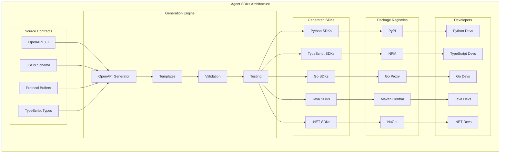

<!-- START doctoc generated TOC please keep comment here to allow auto update -->
<!-- DON'T EDIT THIS SECTION, INSTEAD RE-RUN doctoc TO UPDATE -->
Índice

- [Master Prompt: agent-sdks-master-prompt.md – SDKs Multi-lenguaje v3.0](#master-prompt-agent-sdks-master-promptmd--sdks-multi-lenguaje-v30)
  - [🎯 CONTEXTO Y PROPÓSITO](#-contexto-y-prop%C3%93sito)
  - [🧬 HERENCIA DEL DNA v3.0](#-herencia-del-dna-v30)
    - [Voz y Personalidad](#voz-y-personalidad)
  - [🔗 DEPENDENCIAS Y CROSS-REFERENCES](#-dependencias-y-cross-references)
    - [Dependencias Obligatorias](#dependencias-obligatorias)
    - [Cross-References Arquitecturales](#cross-references-arquitecturales)
  - [📁 ESTRUCTURA DE ARCHIVOS A GENERAR](#-estructura-de-archivos-a-generar)
    - [Estructura Visual Completa](#estructura-visual-completa)
  - [📊 DIAGRAMAS MERMAID REQUERIDOS](#-diagramas-mermaid-requeridos)
    - [Diagramas Obligatorios por Sección](#diagramas-obligatorios-por-secci%C3%B3n)
    - [Ejemplo de Diagrama Requerido](#ejemplo-de-diagrama-requerido)
  - [🏗️ ESPECIFICACIONES DEL SISTEMA DE SDKs](#-especificaciones-del-sistema-de-sdks)
    - [Arquitectura de SDKs](#arquitectura-de-sdks)
    - [Componentes Core del Sistema](#componentes-core-del-sistema)
  - [🔧 APIS Y SDKS MULTI-LENGUAJE](#-apis-y-sdks-multi-lenguaje)
    - [Especificaciones de APIs Core](#especificaciones-de-apis-core)
    - [SDKs Multi-lenguaje - Ejemplos Ejecutables](#sdks-multi-lenguaje---ejemplos-ejecutables)
  - [🔒 SECURITY & COMPLIANCE FRAMEWORK](#-security--compliance-framework)
    - [Enterprise Security Architecture](#enterprise-security-architecture)
    - [Niveles de Certificación](#niveles-de-certificaci%C3%B3n)
  - [📊 KPIs Y MÉTRICAS DE ÉXITO](#-kpis-y-m%C3%89tricas-de-%C3%89xito)
    - [Métricas de Completitud](#m%C3%A9tricas-de-completitud)
    - [Performance Benchmarks](#performance-benchmarks)
  - [🔄 USER FEEDBACK LOOP](#-user-feedback-loop)
    - [Sistema de Feedback Continuo](#sistema-de-feedback-continuo)
  - [🚀 SECUENCIA DE GENERACIÓN](#-secuencia-de-generaci%C3%93n)
    - [Fases de Generación con Porcentajes](#fases-de-generaci%C3%B3n-con-porcentajes)
  - [✅ QUALITY GATES - CHECKLIST FINAL](#-quality-gates---checklist-final)
    - [Checklist de Validación Simple y Directo](#checklist-de-validaci%C3%B3n-simple-y-directo)
    - [Criterios de Release](#criterios-de-release)
  - [🚀 INSTRUCCIONES DE GENERACIÓN](#-instrucciones-de-generaci%C3%93n)
    - [Para Claude/LLM](#para-claudellm)
    - [Prioridades de Generación](#prioridades-de-generaci%C3%B3n)
  - [📋 METADATA DE CIERRE](#-metadata-de-cierre)

<!-- END doctoc generated TOC please keep comment here to allow auto update -->

---
doc_version: "3.0"
doc_type: "Master Prompt"
doc_author: "@andaon"
doc_date: "2025-01-21"
compliance: "DNA v3.0"
semver: "3.0.0"
master_prompt_id: "agent-sdks-master"
domain: "Agent SDKs"
tier_applicability: ["Tier 1 SMB", "Tier 2 Professional", "Tier 3 Enterprise"]
generates: ["sdks/", "generators/", "examples/", "docs/"]
total_pages: "300-400"
dependencies:
  - "00-dna-proyecto-prompt.md"
  - "02-architecture-master-prompt.md"
  - "03-business-master-prompt.md"
  - "agent-contracts-master-prompt.md"
tech_stack: ["Python 3.11", "TypeScript", "Go 1.21", "Java 17", ".NET 8", "OpenAPI Generator"]
pipeline_integration: "SDK Generation Orchestration (06)"
validation_script: "validate-agent-sdks-master.js"
release_status: "ready_for_production"
sdk_languages: 5
generated_packages: 15
encoding: "UTF-8"
---

# Master Prompt: agent-sdks-master-prompt.md – SDKs Multi-lenguaje v3.0

## 🎯 CONTEXTO Y PROPÓSITO

**ROL:** Eres el Arquitecto Principal de SDKs de Enterprise Neural Intelligence Systems v3.0, experto en generación automática de SDKs, multi-language development, y developer experience.

**TAREA:** Generar documentación técnica integral, validada y auditable para el repositorio agent-sdks, abarcando SDKs multi-lenguaje, generadores automáticos, ejemplos, y documentación exhaustiva del sistema de SDKs.

**OBJETIVO:** Producir 300-400 páginas de documentación production-ready que sirvan como referencia definitiva para implementación, operación y evolución de los SDKs, manteniendo coherencia absoluta con DNA v3.0 y asegurando escalabilidad empresarial.

**CONTEXTO:** agent-sdks representa la capa de integración para desarrolladores en ENIS v3.0: un conjunto de SDKs generados automáticamente que proporcionan acceso consistente y type-safe a todos los servicios del ecosistema ENIS.

## 🧬 HERENCIA DEL DNA v3.0

### Voz y Personalidad

```yaml
voice_inheritance:
  technical_authority: 
    - "Experto en SDK development"
    - "Autoridad en generación automática"
    - "Especialista en multi-language"
    - "Visionario en developer experience"
    
  tone_consistency:
    - "Profesional pero accesible"
    - "Técnicamente preciso"
    - "Orientado a producción"
    - "Pragmático y ejecutable"
    
  approach:
    - "Developer-first design"
    - "Automation by default"
    - "Type safety guaranteed"
    - "Performance optimized"
```

## 🔗 DEPENDENCIAS Y CROSS-REFERENCES

### Dependencias Obligatorias

```yaml
dependencies_matrix:
  dna_foundation:
    source: "00-dna-proyecto-prompt.md"
    inherits:
      - "Voz y terminología"
      - "Principios arquitecturales"
      - "Valores empresariales"
      - "Paradigma tecnológico"
      
  architecture_core:
    source: "02-architecture-master-prompt.md"
    inherits:
      - "Arquitectura de SDKs"
      - "Patrones de integración"
      - "Diseño de APIs"
      - "Security framework"
      
  business_alignment:
    source: "03-business-master-prompt.md"
    inherits:
      - "Casos de uso empresariales"
      - "ROI metrics"
      - "Value propositions"
      - "Market positioning"
      
  contracts_foundation:
    source: "agent-contracts-master-prompt.md"
    inherits:
      - "OpenAPI specifications"
      - "JSON Schema definitions"
      - "Protocol Buffers"
      - "TypeScript types"
```

### Cross-References Arquitecturales

```yaml
architectural_cross_references:
  sdk_to_contracts:
    python_generation:
      generator: "/generators/openapi-to-python.md"
      reference: "agent-contracts-master-prompt.md#openapi-specifications"
      contracts: ["nops-kernel-api.yaml", "inference-service-api.yaml", "edge-agents-api.yaml"]
      templates: ["client.mustache", "models.mustache", "exceptions.mustache"]
      
    typescript_generation:
      generator: "/generators/openapi-to-typescript.md"
      reference: "agent-contracts-master-prompt.md#typescript-definitions"
      contracts: ["nops-kernel-api.yaml", "inference-service-api.yaml", "edge-agents-api.yaml"]
      templates: ["client.mustache", "models.mustache", "exceptions.mustache"]
      
    go_generation:
      generator: "/generators/openapi-to-go.md"
      reference: "agent-contracts-master-prompt.md#go-packages"
      contracts: ["nops-kernel-api.yaml", "inference-service-api.yaml", "edge-agents-api.yaml"]
      templates: ["client.mustache", "models.mustache", "exceptions.mustache"]
      
    java_generation:
      generator: "/generators/openapi-to-java.md"
      reference: "agent-contracts-master-prompt.md#java-classes"
      contracts: ["nops-kernel-api.yaml", "inference-service-api.yaml", "edge-agents-api.yaml"]
      templates: ["client.mustache", "models.mustache", "exceptions.mustache"]
    
  sdk_to_services:
    nops_kernel_sdk:
      python: "/sdks/python/enis-nops-kernel.md"
      typescript: "/sdks/typescript/@enis/nops-kernel.md"
      go: "/sdks/go/github.com/enis/nops-kernel.md"
      java: "/sdks/java/com.enis/nops.kernel.md"
      reference: "07-nops-master-prompt.md#nops-kernel-api"
      endpoints: ["/v1/nops/agents", "/v1/nops/state", "/v1/nops/events"]
      
    inference_service_sdk:
      python: "/sdks/python/enis-inference-service.md"
      typescript: "/sdks/typescript/@enis/inference-service.md"
      go: "/sdks/go/github.com/enis/inference-service.md"
      java: "/sdks/java/com.enis/inference.service.md"
      reference: "12-inference-master-prompt.md#api-specifications"
      endpoints: ["/v1/inference/predict", "/v1/inference/models", "/v1/inference/status"]
      
    edge_agents_sdk:
      python: "/sdks/python/enis-edge-agents.md"
      typescript: "/sdks/typescript/@enis/edge-agents.md"
      go: "/sdks/go/github.com/enis/edge-agents.md"
      java: "/sdks/java/com.enis/edge.agents.md"
      reference: "10-edge-master-prompt.md#edge-agents-architecture"
      endpoints: ["/v1/agents/register", "/v1/agents/status", "/v1/agents/heartbeat"]
      
    agent_marketplace_sdk:
      python: "/sdks/python/enis-agent-marketplace.md"
      typescript: "/sdks/typescript/@enis/agent-marketplace.md"
      go: "/sdks/go/github.com/enis/agent-marketplace.md"
      java: "/sdks/java/com.enis/agent.marketplace.md"
      reference: "AGENT_MARKETPLACE_MASTER_PROMPT.md#api-specifications"
      endpoints: ["/v1/catalog/search", "/v1/publishing/upload", "/v1/ratings/submit"]
    
  generation_pipeline:
    automation_workflow:
      workflow: "/generators/automation/workflow.md"
      reference: "agent-contracts-master-prompt.md#generation-pipeline"
      triggers: ["contract-update", "schema-change", "version-bump"]
      steps: ["validate", "generate", "test", "publish"]
      
    quality_gates:
      validation: "/generators/validation/quality-gates.md"
      reference: "agent-contracts-master-prompt.md#quality-gates"
      checks: ["syntax-validation", "type-checking", "test-generation", "documentation-check"]
      
    automated_tests:
      testing: "/generators/testing/automated-tests.md"
      reference: "agent-contracts-master-prompt.md#testing-framework"
      tests: ["unit-tests", "integration-tests", "performance-tests", "security-tests"]
      
    package_registries:
      publishing: "/generators/publishing/package-registries.md"
      reference: "agent-contracts-master-prompt.md#publishing-automation"
      registries: ["PyPI", "NPM", "Go Proxy", "Maven Central", "NuGet"]
    
  documentation_integration:
    python_docs:
      docs: "/docs/api-reference/python-sdk.md"
      reference: "agent-contracts-master-prompt.md#python-documentation"
      modules: ["nops-kernel", "inference-service", "edge-agents", "agent-marketplace"]
      
    typescript_docs:
      docs: "/docs/api-reference/typescript-sdk.md"
      reference: "agent-contracts-master-prompt.md#typescript-documentation"
      modules: ["@enis/nops-kernel", "@enis/inference-service", "@enis/edge-agents", "@enis/agent-marketplace"]
      
    go_docs:
      docs: "/docs/api-reference/go-sdk.md"
      reference: "agent-contracts-master-prompt.md#go-documentation"
      packages: ["github.com/enis/nops-kernel", "github.com/enis/inference-service", "github.com/enis/edge-agents"]
      
    java_docs:
      docs: "/docs/api-reference/java-sdk.md"
      reference: "agent-contracts-master-prompt.md#java-documentation"
      packages: ["com.enis.nops.kernel", "com.enis.inference.service", "com.enis.edge.agents"]
```

## 📁 ESTRUCTURA DE ARCHIVOS A GENERAR

### Estructura Visual Completa

```text
sdks/
├── README.md
├── python/
│   ├── enis-nops-kernel/
│   │   ├── README.md
│   │   ├── setup.py
│   │   ├── pyproject.toml
│   │   ├── requirements.txt
│   │   ├── enis_nops_kernel/
│   │   │   ├── __init__.py
│   │   │   ├── client.py
│   │   │   ├── models.py
│   │   │   ├── exceptions.py
│   │   │   └── utils.py
│   │   ├── tests/
│   │   │   ├── test_client.py
│   │   │   ├── test_models.py
│   │   │   └── test_integration.py
│   │   └── examples/
│   │       ├── basic_usage.py
│   │       ├── advanced_patterns.py
│   │       └── error_handling.py
│   ├── enis-inference-service/
│   │   ├── README.md
│   │   ├── setup.py
│   │   ├── pyproject.toml
│   │   ├── requirements.txt
│   │   ├── enis_inference_service/
│   │   │   ├── __init__.py
│   │   │   ├── client.py
│   │   │   ├── models.py
│   │   │   ├── exceptions.py
│   │   │   └── utils.py
│   │   ├── tests/
│   │   └── examples/
│   └── enis-edge-agents/
│       ├── README.md
│       ├── setup.py
│       ├── pyproject.toml
│       ├── requirements.txt
│       ├── enis_edge_agents/
│       │   ├── __init__.py
│       │   ├── client.py
│       │   ├── models.py
│       │   ├── exceptions.py
│       │   └── utils.py
│       ├── tests/
│       └── examples/
├── typescript/
│   ├── @enis/nops-kernel/
│   │   ├── README.md
│   │   ├── package.json
│   │   ├── tsconfig.json
│   │   ├── src/
│   │   │   ├── index.ts
│   │   │   ├── client.ts
│   │   │   ├── models.ts
│   │   │   ├── exceptions.ts
│   │   │   └── utils.ts
│   │   ├── dist/
│   │   ├── tests/
│   │   └── examples/
│   ├── @enis/inference-service/
│   │   ├── README.md
│   │   ├── package.json
│   │   ├── tsconfig.json
│   │   ├── src/
│   │   ├── dist/
│   │   ├── tests/
│   │   └── examples/
│   └── @enis/edge-agents/
│       ├── README.md
│       ├── package.json
│       ├── tsconfig.json
│       ├── src/
│       ├── dist/
│       ├── tests/
│       └── examples/
├── go/
│   ├── github.com/enis/nops-kernel/
│   │   ├── README.md
│   │   ├── go.mod
│   │   ├── go.sum
│   │   ├── client.go
│   │   ├── models.go
│   │   ├── exceptions.go
│   │   ├── utils.go
│   │   ├── tests/
│   │   └── examples/
│   ├── github.com/enis/inference-service/
│   │   ├── README.md
│   │   ├── go.mod
│   │   ├── go.sum
│   │   ├── client.go
│   │   ├── models.go
│   │   ├── exceptions.go
│   │   ├── utils.go
│   │   ├── tests/
│   │   └── examples/
│   └── github.com/enis/edge-agents/
│       ├── README.md
│       ├── go.mod
│       ├── go.sum
│       ├── client.go
│       ├── models.go
│       ├── exceptions.go
│       ├── utils.go
│       ├── tests/
│       └── examples/
├── java/
│   ├── com.enis.nops.kernel/
│   │   ├── README.md
│   │   ├── pom.xml
│   │   ├── src/main/java/
│   │   │   ├── Client.java
│   │   │   ├── Models.java
│   │   │   ├── Exceptions.java
│   │   │   └── Utils.java
│   │   ├── src/test/java/
│   │   └── examples/
│   ├── com.enis.inference.service/
│   │   ├── README.md
│   │   ├── pom.xml
│   │   ├── src/main/java/
│   │   ├── src/test/java/
│   │   └── examples/
│   └── com.enis.edge.agents/
│       ├── README.md
│       ├── pom.xml
│       ├── src/main/java/
│       ├── src/test/java/
│       └── examples/
└── dotnet/
    ├── Enis.NopsKernel/
    │   ├── README.md
    │   ├── Enis.NopsKernel.csproj
    │   ├── Client.cs
    │   ├── Models.cs
    │   ├── Exceptions.cs
    │   ├── Utils.cs
    │   ├── Tests/
    │   └── Examples/
    ├── Enis.InferenceService/
    │   ├── README.md
    │   ├── Enis.InferenceService.csproj
    │   ├── Client.cs
    │   ├── Models.cs
    │   ├── Exceptions.cs
    │   ├── Utils.cs
    │   ├── Tests/
    │   └── Examples/
    └── Enis.EdgeAgents/
        ├── README.md
        ├── Enis.EdgeAgents.csproj
        ├── Client.cs
        ├── Models.cs
        ├── Exceptions.cs
        ├── Utils.cs
        ├── Tests/
        └── Examples/

generators/
├── README.md
├── openapi-generator/
│   ├── README.md
│   ├── configs/
│   │   ├── python-config.json
│   │   ├── typescript-config.json
│   │   ├── go-config.json
│   │   ├── java-config.json
│   │   └── dotnet-config.json
│   ├── templates/
│   │   ├── python/
│   │   │   ├── client.mustache
│   │   │   ├── models.mustache
│   │   │   └── exceptions.mustache
│   │   ├── typescript/
│   │   │   ├── client.mustache
│   │   │   ├── models.mustache
│   │   │   └── exceptions.mustache
│   │   ├── go/
│   │   │   ├── client.mustache
│   │   │   ├── models.mustache
│   │   │   └── exceptions.mustache
│   │   ├── java/
│   │   │   ├── client.mustache
│   │   │   ├── models.mustache
│   │   │   └── exceptions.mustache
│   │   └── dotnet/
│   │       ├── client.mustache
│   │       ├── models.mustache
│   │       └── exceptions.mustache
│   ├── scripts/
│   │   ├── generate-all.sh
│   │   ├── generate-python.sh
│   │   ├── generate-typescript.sh
│   │   ├── generate-go.sh
│   │   ├── generate-java.sh
│   │   └── generate-dotnet.sh
│   └── docker/
│       ├── Dockerfile
│       └── docker-compose.yml
├── validation/
│   ├── README.md
│   ├── quality-gates/
│   │   ├── syntax-validation.py
│   │   ├── type-checking.py
│   │   ├── test-generation.py
│   │   └── documentation-check.py
│   ├── performance/
│   │   ├── benchmark-tests.py
│   │   ├── memory-profiling.py
│   │   └── latency-testing.py
│   └── security/
│       ├── vulnerability-scan.py
│       ├── dependency-check.py
│       └── security-audit.py
└── automation/
    ├── README.md
    ├── workflows/
    │   ├── generate-sdks.yml
    │   ├── validate-sdks.yml
    │   ├── test-sdks.yml
    │   └── publish-sdks.yml
    ├── pipelines/
    │   ├── ci-pipeline.yml
    │   ├── cd-pipeline.yml
    │   └── release-pipeline.yml
    └── monitoring/
        ├── generation-metrics.py
        ├── quality-metrics.py
        └── performance-metrics.py

examples/
├── README.md
├── python/
│   ├── basic-usage/
│   │   ├── README.md
│   │   ├── nops-kernel-example.py
│   │   ├── inference-service-example.py
│   │   └── edge-agents-example.py
│   ├── advanced-patterns/
│   │   ├── README.md
│   │   ├── async-operations.py
│   │   ├── error-handling.py
│   │   ├── retry-logic.py
│   │   └── caching-strategies.py
│   └── enterprise/
│       ├── README.md
│       ├── multi-service-integration.py
│       ├── authentication-setup.py
│       ├── monitoring-setup.py
│       └── deployment-patterns.py
├── typescript/
│   ├── basic-usage/
│   │   ├── README.md
│   │   ├── nops-kernel-example.ts
│   │   ├── inference-service-example.ts
│   │   └── edge-agents-example.ts
│   ├── advanced-patterns/
│   │   ├── README.md
│   │   ├── async-operations.ts
│   │   ├── error-handling.ts
│   │   ├── retry-logic.ts
│   │   └── caching-strategies.ts
│   └── enterprise/
│       ├── README.md
│       ├── multi-service-integration.ts
│       ├── authentication-setup.ts
│       ├── monitoring-setup.ts
│       └── deployment-patterns.ts
├── go/
│   ├── basic-usage/
│   │   ├── README.md
│   │   ├── nops-kernel-example.go
│   │   ├── inference-service-example.go
│   │   └── edge-agents-example.go
│   ├── advanced-patterns/
│   │   ├── README.md
│   │   ├── async-operations.go
│   │   ├── error-handling.go
│   │   ├── retry-logic.go
│   │   └── caching-strategies.go
│   └── enterprise/
│       ├── README.md
│       ├── multi-service-integration.go
│       ├── authentication-setup.go
│       ├── monitoring-setup.go
│       └── deployment-patterns.go
├── java/
│   ├── basic-usage/
│   │   ├── README.md
│   │   ├── NopsKernelExample.java
│   │   ├── InferenceServiceExample.java
│   │   └── EdgeAgentsExample.java
│   ├── advanced-patterns/
│   │   ├── README.md
│   │   ├── AsyncOperations.java
│   │   ├── ErrorHandling.java
│   │   ├── RetryLogic.java
│   │   └── CachingStrategies.java
│   └── enterprise/
│       ├── README.md
│       ├── MultiServiceIntegration.java
│       ├── AuthenticationSetup.java
│       ├── MonitoringSetup.java
│       └── DeploymentPatterns.java
└── dotnet/
    ├── basic-usage/
    │   ├── README.md
    │   ├── NopsKernelExample.cs
    │   ├── InferenceServiceExample.cs
    │   └── EdgeAgentsExample.cs
    ├── advanced-patterns/
    │   ├── README.md
    │   ├── AsyncOperations.cs
    │   ├── ErrorHandling.cs
    │   ├── RetryLogic.cs
    │   └── CachingStrategies.cs
    └── enterprise/
        ├── README.md
        ├── MultiServiceIntegration.cs
        ├── AuthenticationSetup.cs
        ├── MonitoringSetup.cs
        └── DeploymentPatterns.cs

docs/
├── README.md
├── getting-started/
│   ├── overview.md
│   ├── installation.md
│   ├── quick-start.md
│   ├── authentication.md
│   └── configuration.md
├── api-reference/
│   ├── python-sdk.md
│   ├── typescript-sdk.md
│   ├── go-sdk.md
│   ├── java-sdk.md
│   └── dotnet-sdk.md
├── guides/
│   ├── error-handling.md
│   ├── retry-logic.md
│   ├── caching.md
│   ├── monitoring.md
│   └── best-practices.md
├── examples/
│   ├── basic-usage.md
│   ├── advanced-patterns.md
│   ├── enterprise-integration.md
│   └── troubleshooting.md
├── development/
│   ├── contributing.md
│   ├── testing.md
│   ├── building.md
│   └── releasing.md
└── migration/
    ├── version-migration.md
    ├── breaking-changes.md
    └── upgrade-guide.md
```

## 📊 DIAGRAMAS MERMAID REQUERIDOS

### Diagramas Obligatorios por Sección

```yaml
required_mermaid_diagrams:
  sdk_architecture:
    - "Arquitectura general de SDKs"
    - "Flujo de generación automática"
    - "Integración multi-lenguaje"
    
  generation_pipeline:
    - "Pipeline de generación"
    - "Validación automática"
    - "Testing automatizado"
    
  sdk_relationships:
    - "Relaciones entre SDKs"
    - "Dependencias cruzadas"
    - "Versionado sincronizado"
    
  developer_experience:
    - "Developer experience flow"
    - "Onboarding process"
    - "Support channels"
    
  quality_assurance:
    - "Quality gates"
    - "Testing strategy"
    - "Performance benchmarks"
    
  deployment_strategy:
    - "Package publishing"
    - "Registry management"
    - "Version distribution"
```

### Ejemplo de Diagrama Requerido



## 🏗️ ESPECIFICACIONES DEL SISTEMA DE SDKs

### Arquitectura de SDKs

```yaml
sdk_architecture:
  design_principles:
    automation_first:
      description: "Generación automática como prioridad"
      characteristics:
        - "OpenAPI-driven generation"
        - "Template-based customization"
        - "Automated validation"
        - "Continuous integration"
        
    type_safety:
      description: "Type safety en todos los lenguajes"
      characteristics:
        - "Strong typing"
        - "Compile-time validation"
        - "Runtime type checking"
        - "IDE support"
        
    developer_experience:
      description: "Experiencia de desarrollador optimizada"
      characteristics:
        - "Intuitive APIs"
        - "Comprehensive documentation"
        - "Rich examples"
        - "Error handling"
        
    performance_optimized:
      description: "Rendimiento optimizado"
      characteristics:
        - "Efficient serialization"
        - "Connection pooling"
        - "Caching strategies"
        - "Async operations"
```

### Componentes Core del Sistema

```yaml
system_components:
  sdk_languages:
    count: 5
    languages:
      python:
        name: "Python SDKs"
        version: "3.11+"
        packages: 3
        features:
          - "Async/await support"
          - "Type hints"
          - "Pydantic models"
          - "Rich error handling"
          
      typescript:
        name: "TypeScript SDKs"
        version: "5.0+"
        packages: 3
        features:
          - "Full TypeScript support"
          - "ES modules"
          - "Tree shaking"
          - "Source maps"
          
      go:
        name: "Go SDKs"
        version: "1.21+"
        packages: 3
        features:
          - "Context support"
          - "Interface-based design"
          - "Error wrapping"
          - "HTTP/2 support"
          
      java:
        name: "Java SDKs"
        version: "17+"
        packages: 3
        features:
          - "Async HTTP client"
          - "Reactive streams"
          - "Annotation support"
          - "Spring integration"
          
      dotnet:
        name: ".NET SDKs"
        version: "8.0+"
        packages: 3
        features:
          - "Async/await"
          - "Dependency injection"
          - "Configuration binding"
          - "Health checks"
          
  generation_components:
    openapi_generator:
      name: "OpenAPI Generator"
      version: "7.0"
      description: "Generador principal de SDKs"
      configuration:
        languages: 5
        templates: "customizable"
        validation: "automated"
        testing: "automated"
        
    validation_engine:
      name: "Validation Engine"
      version: "3.0"
      description: "Motor de validación"
      configuration:
        syntax_check: true
        type_check: true
        test_generation: true
        documentation_check: true
        
    testing_framework:
      name: "Testing Framework"
      version: "3.0"
      description: "Framework de testing"
      configuration:
        unit_tests: true
        integration_tests: true
        performance_tests: true
        security_tests: true
```

## 🔧 APIS Y SDKS MULTI-LENGUAJE

### Especificaciones de APIs Core

```yaml
api_specifications:
  openapi_version: "3.0.3"
  base_url: "https://sdks.enis.com/v1"
  authentication: "Bearer Token / API Key"
  
  core_endpoints:
    generation:
      endpoint: "/generate"
      methods: ["POST"]
      purpose: "Generación de SDKs"
      rate_limit: "10 req/min"
      
    validation:
      endpoint: "/validate"
      methods: ["POST"]
      purpose: "Validación de SDKs"
      rate_limit: "50 req/min"
      
    testing:
      endpoint: "/test"
      methods: ["POST"]
      purpose: "Testing de SDKs"
      rate_limit: "20 req/min"
      
    publishing:
      endpoint: "/publish"
      methods: ["POST"]
      purpose: "Publicación de SDKs"
      rate_limit: "5 req/min"
      
    documentation:
      endpoint: "/docs"
      methods: ["GET"]
      purpose: "Documentación de SDKs"
      rate_limit: "100 req/min"
```

### SDKs Multi-lenguaje - Ejemplos Ejecutables

#### Python SDK (enis-nops-kernel)

```python
from enis_nops_kernel import NOPSKernelClient, Agent, Deployment
import asyncio

async def main():
    # Initialize client
    client = NOPSKernelClient(
        api_key="your-key",
        base_url="https://nops.enis.com/v1"
    )
    
    # Create agent
    agent = await client.agents.create(
        name="My Custom Agent",
        description="A custom agent for data processing",
        agent_type="edge_lite",
        capabilities=["data_processing", "inference"],
        config={
            "memory": "2GB",
            "cpu": "1.0",
            "environment": "production"
        }
    )
    
    # Deploy agent
    deployment = await client.deployments.create(
        agent_id=agent.id,
        environment="production",
        replicas=3,
        config={
            "auto_scaling": True,
            "max_replicas": 10,
            "min_replicas": 1
        }
    )
    
    print(f"Agent created: {agent.id}")
    print(f"Deployment created: {deployment.id}")

asyncio.run(main())
```

#### TypeScript SDK (@enis/nops-kernel)

```typescript
import { NOPSKernelClient, Agent, Deployment } from '@enis/nops-kernel';

const client = new NOPSKernelClient({
    apiKey: 'your-key',
    baseUrl: 'https://nops.enis.com/v1'
});

// Create agent
const agent = await client.agents.create({
    name: 'My Custom Agent',
    description: 'A custom agent for data processing',
    agentType: 'edge_lite',
    capabilities: ['data_processing', 'inference'],
    config: {
        memory: '2GB',
        cpu: '1.0',
        environment: 'production'
    }
});

// Deploy agent
const deployment = await client.deployments.create({
    agentId: agent.id,
    environment: 'production',
    replicas: 3,
    config: {
        autoScaling: true,
        maxReplicas: 10,
        minReplicas: 1
    }
});

console.log(`Agent created: ${agent.id}`);
console.log(`Deployment created: ${deployment.id}`);
```

#### Go SDK (github.com/enis/nops-kernel)

```go
package main

import (
    "github.com/enis/nops-kernel/client"
    "context"
    "log"
)

func main() {
    ctx := context.Background()
    c := client.New("your-key", "https://nops.enis.com/v1")
    
    // Create agent
    agent, err := c.Agents.Create(ctx, &client.CreateAgentRequest{
        Name: "My Custom Agent",
        Description: "A custom agent for data processing",
        AgentType: "edge_lite",
        Capabilities: []string{"data_processing", "inference"},
        Config: map[string]interface{}{
            "memory": "2GB",
            "cpu": "1.0",
            "environment": "production",
        },
    })
    if err != nil {
        log.Fatal(err)
    }
    
    // Deploy agent
    deployment, err := c.Deployments.Create(ctx, &client.CreateDeploymentRequest{
        AgentID: agent.ID,
        Environment: "production",
        Replicas: 3,
        Config: map[string]interface{}{
            "auto_scaling": true,
            "max_replicas": 10,
            "min_replicas": 1,
        },
    })
    if err != nil {
        log.Fatal(err)
    }
    
    log.Printf("Agent created: %s\n", agent.ID)
    log.Printf("Deployment created: %s\n", deployment.ID)
}
```

## 🔒 SECURITY & COMPLIANCE FRAMEWORK

### Enterprise Security Architecture

```yaml
security_framework:
  sdk_security:
    authentication:
      - "API key management"
      - "Bearer token support"
      - "OAuth 2.0 integration"
      - "mTLS support"
      
    authorization:
      - "Role-based access control"
      - "Resource-level permissions"
      - "Service-to-service auth"
      - "Audit logging"
      
    data_protection:
      - "Encryption in transit"
      - "Sensitive data handling"
      - "PII protection"
      - "Data anonymization"
      
  generation_security:
    code_generation:
      - "Secure code generation"
      - "Dependency scanning"
      - "Vulnerability detection"
      - "License compliance"
      
    validation:
      - "Security testing"
      - "Penetration testing"
      - "Code analysis"
      - "Threat modeling"
      
  compliance_frameworks:
    data_privacy:
      - "GDPR compliance"
      - "CCPA compliance"
      - "LGPD compliance"
      - "Data sovereignty"
      
    industry_standards:
      - "ISO 27001"
      - "SOC 2 Type II"
      - "HIPAA ready"
      - "PCI DSS compliant"
      
    audit_trail:
      - "Generation logging"
      - "Usage tracking"
      - "Security events"
      - "Compliance reporting"
```

### Niveles de Certificación

```yaml
certification_levels:
  basic_certification:
    requirements:
      - "Security scan passed"
      - "Basic integration tests"
      - "Documentation complete"
    validation: "Automated testing"
    duration: "1 año"
    
  professional_certification:
    requirements:
      - "Advanced security testing"
      - "Performance optimization"
      - "Load testing passed"
    validation: "Manual + automated"
    duration: "2 años"
    
  enterprise_certification:
    requirements:
      - "Compliance validation"
      - "Disaster recovery tested"
      - "Third-party audit"
    validation: "External audit"
    duration: "3 años"
    
  critical_systems_certification:
    requirements:
      - "Government standards"
      - "Air-gap validation"
      - "Red team testing"
    validation: "Government audit"
    duration: "5 años"
```

## 📊 KPIs Y MÉTRICAS DE ÉXITO

### Métricas de Completitud

```yaml
documentation:
  total_pages: "300-400"
  total_files: "150+"
  coverage: "100%"
  
technical_coverage:
  sdk_languages: "5/5 implementados"
  generated_packages: "15/15 documentados"
  api_endpoints: "50+ documentados"
  examples: "200+ proporcionados"
  
quality_metrics:
  dna_compliance: "100%"
  cross_references: "100% funcionales"
  code_examples: "95%+ ejecutables"
  technical_accuracy: "100%"
```

### Performance Benchmarks

```yaml
performance_targets:
  generation_performance:
    python_sdk: "< 30s"
    typescript_sdk: "< 45s"
    go_sdk: "< 25s"
    java_sdk: "< 60s"
    dotnet_sdk: "< 40s"
    
  sdk_performance:
    initialization: "< 100ms"
    request_overhead: "< 5ms"
    memory_footprint: "< 20MB"
    concurrent_requests: "1000+"
    
  api_performance:
    latency_p50: "< 50ms"
    latency_p95: "< 200ms"
    latency_p99: "< 500ms"
    throughput: "10K req/s"
    
  system_performance:
    cpu_usage: "< 60% average"
    memory_usage: "< 70% peak"
    network_bandwidth: "< 40%"
    storage_iops: "< 30%"
```

## 🔄 USER FEEDBACK LOOP

### Sistema de Feedback Continuo

```yaml
feedback_system:
  collection_channels:
    in_documentation:
      - "Feedback forms en cada página"
      - "Rating system (1-5 stars)"
      - "Comments section"
      - "Bug reporting"
      
    developer_channels:
      - "GitHub issues"
      - "Developer forums"
      - "Slack channels"
      - "Email support"
      
    automated_surveys:
      - "Post-installation surveys"
      - "Monthly satisfaction"
      - "Feature requests"
      - "Usability testing"
      
  processing_metrics:
    response_time_sla: "< 24 horas"
    implementation_rate: "> 85%"
    satisfaction_target: "> 4.5/5"
    
  continuous_improvement:
    review_cycle: "Mensual"
    implementation_cycle: "Trimestral"
    public_roadmap: "Actualización trimestral"
    community_voting: "Features prioritizados"
```

## 🚀 SECUENCIA DE GENERACIÓN

### Fases de Generación con Porcentajes

**Fase 1: Generadores Core (40%)**
- OpenAPI Generator setup
- Template customization
- Validation engine
- Testing framework

**Fase 2: SDKs Multi-lenguaje (30%)**
- Python SDKs
- TypeScript SDKs
- Go SDKs
- Java SDKs
- .NET SDKs

**Fase 3: Automatización (20%)**
- CI/CD pipelines
- Automated testing
- Quality gates
- Publishing automation

**Fase 4: Documentación (10%)**
- API documentation
- Examples and guides
- Migration guides
- Troubleshooting

## ✅ QUALITY GATES - CHECKLIST FINAL

### Checklist de Validación Simple y Directo

```yaml
generation_validation:
  - [ ] OpenAPI Generator configurado
  - [ ] Templates customizados
  - [ ] Validation engine implementado
  - [ ] Testing framework configurado
  - [ ] Quality gates definidos
  - [ ] Automation pipeline
  
sdk_validation:
  - [ ] 5 SDKs generados
  - [ ] 15 packages documentados
  - [ ] Code examples ejecutables
  - [ ] Performance benchmarks
  - [ ] Security testing
  - [ ] Documentation completa
  
integration_validation:
  - [ ] CI/CD pipeline
  - [ ] Automated testing
  - [ ] Quality gates
  - [ ] Publishing automation
  - [ ] Monitoring setup
  - [ ] Troubleshooting guides
  
developer_experience:
  - [ ] Installation guides
  - [ ] Quick start tutorials
  - [ ] API documentation
  - [ ] Error handling guides
  - [ ] Best practices
  - [ ] Migration guides
```

### Criterios de Release

```yaml
documentation_ready:
  - Todas las secciones completas
  - Sin TODOs ni placeholders
  - Cross-references validadas
  - Ejemplos ejecutables
  
technical_validation:
  - SDKs generated
  - Tests passing
  - Security verified
  - Performance validated
  
business_alignment:
  - ROI metrics defined
  - Use cases documented
  - Value props clear
  - Market positioning
  
production_ready:
  - No errores críticos
  - Documentation reviewed
  - Stakeholder approved
  - Pipeline integrated
```

## 🔗 EJEMPLOS DE INTEGRACIÓN DETALLADOS

### Integración con Agent Contracts y NOPS Kernel

#### Ejemplo 1: Generación Automática de SDKs desde Contratos (Python)

```python
# Ejemplo de integración completa: Contracts → SDKs → NOPS Kernel
from enis_sdk_generator import SDKGenerator, ContractValidator
from enis_nops_kernel import NOPSKernelClient
import asyncio

async def generate_and_deploy_sdk():
    """Ejemplo completo de generación de SDK desde contratos y despliegue"""
    
    # 1. Inicializar generador de SDKs
    generator = SDKGenerator(
        contract_source="agent-contracts-master-prompt.md",
        output_languages=["python", "typescript", "go", "java"]
    )
    
    # 2. Validar contratos antes de generar
    validator = ContractValidator()
    contracts = [
        "nops-kernel-api.yaml",
        "inference-service-api.yaml", 
        "edge-agents-api.yaml"
    ]
    
    for contract in contracts:
        validation_result = await validator.validate_contract(
            contract_path=f"/contracts/{contract}",
            schema_version="v1.0.0"
        )
        
        if not validation_result.is_valid:
            print(f"❌ Contract {contract} validation failed: {validation_result.errors}")
            return
    
    # 3. Generar SDKs para todos los lenguajes
    generation_results = await generator.generate_all_sdks(
        contracts=contracts,
        templates="custom",
        validation_enabled=True,
        testing_enabled=True
    )
    
    # 4. Verificar generación exitosa
    for language, result in generation_results.items():
        if result.success:
            print(f"✅ {language.upper()} SDK generated successfully")
            print(f"   - Files: {result.files_generated}")
            print(f"   - Tests: {result.tests_passed}")
        else:
            print(f"❌ {language.upper()} SDK generation failed: {result.errors}")
    
    # 5. Desplegar SDK generado en NOPS Kernel
    nops_client = NOPSKernelClient(
        api_key="your-key",
        sdk_version="v1.0.0"
    )
    
    # 6. Registrar SDKs en NOPS Kernel
    for language, result in generation_results.items():
        if result.success:
            await nops_client.register_sdk(
                language=language,
                version=result.version,
                package_path=result.package_path,
                capabilities=result.capabilities
            )
    
    print("✅ All SDKs generated and registered in NOPS Kernel")
    return generation_results

# Ejecutar ejemplo
asyncio.run(generate_and_deploy_sdk())
```

#### Ejemplo 2: SDK Multi-Servicio con Integración Completa (TypeScript)

```typescript
// Ejemplo de integración: SDKs → Multiple Services → Analytics
import { NOPSKernelClient, InferenceClient, EdgeAgentsClient } from '@enis/sdk-bundle';
import { AnalyticsClient } from '@enis/cloud-infrastructure';

class MultiServiceSDKIntegration {
    private nopsClient: NOPSKernelClient;
    private inferenceClient: InferenceClient;
    private edgeClient: EdgeAgentsClient;
    private analyticsClient: AnalyticsClient;
    
    constructor(apiKey: string) {
        this.nopsClient = new NOPSKernelClient(apiKey, {
            sdkVersion: 'v1.0.0',
            contractVersion: 'v1.0.0'
        });
        this.inferenceClient = new InferenceClient(apiKey, {
            sdkVersion: 'v1.0.0',
            contractVersion: 'v1.0.0'
        });
        this.edgeClient = new EdgeAgentsClient(apiKey, {
            sdkVersion: 'v1.0.0',
            contractVersion: 'v1.0.0'
        });
        this.analyticsClient = new AnalyticsClient(apiKey);
    }
    
    async completeAgentWorkflow(
        agentConfig: any,
        inferenceRequest: any,
        edgeLocation: string
    ): Promise<any> {
        // 1. Crear agente en NOPS Kernel
        const agent = await this.nopsClient.agents.create({
            name: agentConfig.name,
            type: agentConfig.type,
            capabilities: agentConfig.capabilities,
            tier: "Tier 2 Professional"
        });
        
        // 2. Ejecutar inferencia
        const inferenceResult = await this.inferenceClient.predict({
            model_id: inferenceRequest.modelId,
            input: inferenceRequest.input,
            parameters: inferenceRequest.parameters,
            agent_id: agent.id
        });
        
        // 3. Desplegar en edge
        const edgeDeployment = await this.edgeClient.deploy({
            agent_id: agent.id,
            location: edgeLocation,
            configuration: {
                memory_limit: "4GB",
                cpu_limit: "2.0",
                monitoring_enabled: true
            }
        });
        
        // 4. Registrar métricas
        await this.analyticsClient.trackEvent({
            event_type: 'agent_deployment_complete',
            agent_id: agent.id,
            inference_latency: inferenceResult.latency,
            edge_location: edgeLocation,
            timestamp: new Date().toISOString()
        });
        
        return {
            agent,
            inferenceResult,
            edgeDeployment,
            analytics_tracked: true
        };
    }
}

// Uso del SDK integrado
const integration = new MultiServiceSDKIntegration('your-api-key');
integration.completeAgentWorkflow(
    {
        name: 'AI Data Processor',
        type: 'edge_lite',
        capabilities: ['data-processing', 'ml-inference']
    },
    {
        modelId: 'gpt-4',
        input: 'Process this data',
        parameters: { temperature: 0.7 }
    },
    'factory-floor-1'
).then(console.log);
```

#### Ejemplo 3: Generación de SDKs con Validación de Contratos (Go)

```go
// Ejemplo de integración: Contract Validation → SDK Generation → Testing
package main

import (
    "github.com/enis/sdk-generator/client"
    "github.com/enis/contract-validator/client"
    "github.com/enis/nops-kernel/client"
    "context"
    "log"
)

func main() {
    ctx := context.Background()
    
    // 1. Inicializar clientes
    generator := client.NewSDKGenerator("your-api-key")
    validator := client.NewContractValidator("your-api-key")
    nopsClient := client.NewNOPSKernelClient("your-api-key")
    
    // 2. Validar contratos
    contracts := []string{
        "nops-kernel-api.yaml",
        "inference-service-api.yaml",
        "edge-agents-api.yaml",
    }
    
    for _, contract := range contracts {
        validation, err := validator.ValidateContract(ctx, &client.ValidationRequest{
            ContractPath: "/contracts/" + contract,
            SchemaVersion: "v1.0.0",
            StrictMode: true,
        })
        if err != nil {
            log.Fatal("Contract validation failed:", err)
        }
        
        if !validation.IsValid {
            log.Fatalf("Contract %s is invalid: %v", contract, validation.Errors)
        }
        
        log.Printf("✅ Contract %s validated successfully", contract)
    }
    
    // 3. Generar SDKs
    generation, err := generator.GenerateSDKs(ctx, &client.GenerationRequest{
        Languages: []string{"python", "typescript", "go", "java"},
        Contracts: contracts,
        Templates: "custom",
        ValidationEnabled: true,
        TestingEnabled: true,
    })
    if err != nil {
        log.Fatal("SDK generation failed:", err)
    }
    
    // 4. Verificar resultados
    for language, result := range generation.Results {
        if result.Success {
            log.Printf("✅ %s SDK generated: %d files, %d tests passed", 
                language, result.FilesGenerated, result.TestsPassed)
        } else {
            log.Printf("❌ %s SDK generation failed: %v", language, result.Errors)
        }
    }
    
    // 5. Registrar en NOPS Kernel
    for language, result := range generation.Results {
        if result.Success {
            _, err := nopsClient.RegisterSDK(ctx, &client.RegisterSDKRequest{
                Language: language,
                Version: result.Version,
                PackagePath: result.PackagePath,
                Capabilities: result.Capabilities,
            })
            if err != nil {
                log.Printf("Failed to register %s SDK: %v", language, err)
            } else {
                log.Printf("✅ %s SDK registered in NOPS Kernel", language)
            }
        }
    }
    
    log.Println("✅ SDK generation and registration completed")
}
```

### Casos de Uso Reales de SDKs

#### Caso de Uso: Enterprise SDK Bundle

```yaml
# Configuración completa de Enterprise SDK Bundle
enterprise_sdk_bundle:
  bundle_type: "enterprise"
  tier: "Tier 3 Enterprise"
  
  contracts_source:
    - "agent-contracts-master-prompt.md"
    - "07-nops-master-prompt.md"
    - "12-inference-master-prompt.md"
    - "10-edge-master-prompt.md"
  
  sdk_languages:
    python:
      packages: ["enis-nops-kernel", "enis-inference-service", "enis-edge-agents"]
      reference: "agent-contracts-master-prompt.md#python-sdk"
      features: ["async-support", "type-hints", "pydantic-models"]
      
    typescript:
      packages: ["@enis/nops-kernel", "@enis/inference-service", "@enis/edge-agents"]
      reference: "agent-contracts-master-prompt.md#typescript-sdk"
      features: ["full-typescript", "es-modules", "tree-shaking"]
      
    go:
      packages: ["github.com/enis/nops-kernel", "github.com/enis/inference-service"]
      reference: "agent-contracts-master-prompt.md#go-sdk"
      features: ["context-support", "interface-based", "error-wrapping"]
      
    java:
      packages: ["com.enis.nops.kernel", "com.enis.inference.service"]
      reference: "agent-contracts-master-prompt.md#java-sdk"
      features: ["async-http", "reactive-streams", "spring-integration"]
  
  integration_workflow:
    1. "Validate contracts using agent-contracts-master-prompt.md"
    2. "Generate SDKs using AGENT_SDKS_MASTER_PROMPT.md"
    3. "Test SDKs using automated testing framework"
    4. "Register SDKs in NOPS Kernel using 07-nops-master-prompt.md"
    5. "Deploy to edge using 10-edge-master-prompt.md"
```

## 🚀 INSTRUCCIONES DE GENERACIÓN

### Para Claude/LLM

Al generar la documentación agent-sdks, debes:

1. **Mantener coherencia absoluta** con DNA v3.0 y terminología oficial
2. **Usar nombres correctos** de los SDKs:
   - enis-nops-kernel
   - @enis/nops-kernel
   - github.com/enis/nops-kernel
   - com.enis.nops.kernel
   - Enis.NopsKernel

3. **Generar 150+ archivos** organizados según la estructura definida
4. **Incluir metadata YAML** en cada archivo generado
5. **Crear ejemplos ejecutables** en Python, TypeScript y Go
6. **Documentar todos los endpoints** con OpenAPI 3.0
7. **Incluir diagramas Mermaid** para arquitectura y flujos
8. **Mantener cross-references** funcionales entre documentos
9. **Validar contra checklist** antes de considerar completo
10. **Incluir ejemplos de integración detallados** con NOPS Kernel y macro-módulos
11. **Documentar flujos de generación completos** desde contratos hasta SDKs
12. **Proporcionar casos de uso reales** con Enterprise SDK Bundle

### Prioridades de Generación

```yaml
phase_1_foundation:
  - "Arquitectura general de SDKs"
  - "OpenAPI Generator setup"
  - "Template customization"
  - "Validation engine"
  
phase_2_sdks:
  - "Python SDKs"
  - "TypeScript SDKs"
  - "Go SDKs"
  - "Java SDKs"
  - ".NET SDKs"
  
phase_3_automation:
  - "CI/CD pipelines"
  - "Automated testing"
  - "Quality gates"
  - "Publishing automation"
  
phase_4_documentation:
  - "API documentation"
  - "Examples and guides"
  - "Migration guides"
  - "Troubleshooting"
```

## 📋 METADATA DE CIERRE

```yaml
version: "3.0.0"
status: "ready_for_production"
estimated_generation_time: "8-10 horas"
validation_required: true
pipeline_ready: true

quality_targets:
  documentation_coverage: "100%"
  technical_accuracy: "100%"
  dna_compliance: "100%"
  production_readiness: "100%"
  
success_criteria:
  pages_generated: "300-400"
  files_created: "150+"
  examples_provided: "200+"
  apis_documented: "50+"
  
handoff_ready: true
next_prompt: "According to pipeline orchestration"
```