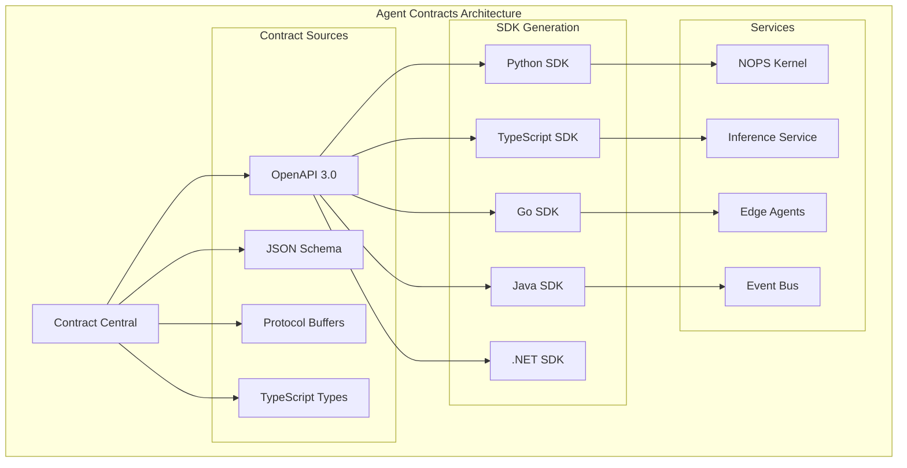

<!-- START doctoc generated TOC please keep comment here to allow auto update -->
<!-- DON'T EDIT THIS SECTION, INSTEAD RE-RUN doctoc TO UPDATE -->
Índice

- [Master Prompt: agent-contracts-master-prompt.md – Source of Truth para Contratos v3.0](#master-prompt-agent-contracts-master-promptmd--source-of-truth-para-contratos-v30)
  - [🎯 CONTEXTO Y PROPÓSITO](#-contexto-y-prop%C3%93sito)
  - [🧬 HERENCIA DEL DNA v3.0](#-herencia-del-dna-v30)
    - [Voz y Personalidad](#voz-y-personalidad)
  - [🔗 DEPENDENCIAS Y CROSS-REFERENCES](#-dependencias-y-cross-references)
    - [Dependencias Obligatorias](#dependencias-obligatorias)
    - [Cross-References Arquitecturales](#cross-references-arquitecturales)
  - [📁 ESTRUCTURA DE ARCHIVOS A GENERAR](#-estructura-de-archivos-a-generar)
    - [Estructura Visual Completa](#estructura-visual-completa)
  - [📊 DIAGRAMAS MERMAID REQUERIDOS](#-diagramas-mermaid-requeridos)
    - [Diagramas Obligatorios por Sección](#diagramas-obligatorios-por-secci%C3%B3n)
    - [Ejemplo de Diagrama Requerido](#ejemplo-de-diagrama-requerido)
  - [🏗️ ESPECIFICACIONES DEL SISTEMA DE CONTRATOS](#-especificaciones-del-sistema-de-contratos)
    - [Arquitectura de Contratos](#arquitectura-de-contratos)
    - [Componentes Core del Sistema](#componentes-core-del-sistema)
  - [🔧 APIS Y SDKS MULTI-LENGUAJE](#-apis-y-sdks-multi-lenguaje)
    - [Especificaciones de APIs Core](#especificaciones-de-apis-core)
    - [SDKs Multi-lenguaje - Ejemplos Ejecutables](#sdks-multi-lenguaje---ejemplos-ejecutables)
  - [🔒 SECURITY & COMPLIANCE FRAMEWORK](#-security--compliance-framework)
    - [Enterprise Security Architecture](#enterprise-security-architecture)
    - [Niveles de Certificación](#niveles-de-certificaci%C3%B3n)
  - [📊 KPIs Y MÉTRICAS DE ÉXITO](#-kpis-y-m%C3%89tricas-de-%C3%89xito)
    - [Métricas de Completitud](#m%C3%A9tricas-de-completitud)
    - [Performance Benchmarks](#performance-benchmarks)
  - [🔄 USER FEEDBACK LOOP](#-user-feedback-loop)
    - [Sistema de Feedback Continuo](#sistema-de-feedback-continuo)
  - [🚀 SECUENCIA DE GENERACIÓN](#-secuencia-de-generaci%C3%93n)
    - [Fases de Generación con Porcentajes](#fases-de-generaci%C3%B3n-con-porcentajes)
  - [✅ QUALITY GATES - CHECKLIST FINAL](#-quality-gates---checklist-final)
    - [Checklist de Validación Simple y Directo](#checklist-de-validaci%C3%B3n-simple-y-directo)
    - [Criterios de Release](#criterios-de-release)
  - [🚀 INSTRUCCIONES DE GENERACIÓN](#-instrucciones-de-generaci%C3%93n)
    - [Para Claude/LLM](#para-claudellm)
    - [Prioridades de Generación](#prioridades-de-generaci%C3%B3n)
  - [📋 METADATA DE CIERRE](#-metadata-de-cierre)
  - [🎯 **OBJETIVO PRINCIPAL**](#-objetivo-principal)
  - [📋 **ARQUITECTURA DEL REPOSITORIO**](#-arquitectura-del-repositorio)
    - [**Estructura de Directorios**](#estructura-de-directorios)
  - [🔧 **ESPECIFICACIONES TÉCNICAS**](#-especificaciones-t%C3%89cnicas)
    - [**OpenAPI 3.0 Standards**](#openapi-30-standards)
    - [**JSON Schema Standards**](#json-schema-standards)
    - [**Protocol Buffers**](#protocol-buffers)
    - [**TypeScript Definitions**](#typescript-definitions)
  - [📊 **CONTRATOS POR SERVICIO**](#-contratos-por-servicio)
    - [**1. Inference Service API**](#1-inference-service-api)
    - [**2. Edge Agents API**](#2-edge-agents-api)
    - [**3. Event Bus API**](#3-event-bus-api)
  - [🚀 **AUTOMATIZACIÓN Y CI/CD**](#-automatizaci%C3%93n-y-cicd)
    - [**Scripts de Automatización**](#scripts-de-automatizaci%C3%B3n)
    - [**GitHub Actions Workflow**](#github-actions-workflow)
  - [📚 **DOCUMENTACIÓN**](#-documentaci%C3%93n)
    - [**Guías de Uso**](#gu%C3%ADas-de-uso)
  - [🧪 **TESTING**](#-testing)
    - [**Estrategia de Testing**](#estrategia-de-testing)
  - [🎯 **IMPLEMENTACIÓN PASO A PASO**](#-implementaci%C3%93n-paso-a-paso)
    - [**Fase 1: Setup Inicial (Semana 1)**](#fase-1-setup-inicial-semana-1)
    - [**Fase 2: Contratos Base (Semana 2)**](#fase-2-contratos-base-semana-2)
    - [**Fase 3: Automatización (Semana 3)**](#fase-3-automatizaci%C3%B3n-semana-3)
    - [**Fase 4: Testing y Documentación (Semana 4)**](#fase-4-testing-y-documentaci%C3%B3n-semana-4)
  - [📊 **MÉTRICAS DE ÉXITO**](#-m%C3%89tricas-de-%C3%89xito)
    - [**Métricas Técnicas**](#m%C3%A9tricas-t%C3%A9cnicas)
    - [**Métricas de Calidad**](#m%C3%A9tricas-de-calidad)
  - [🚀 **PRÓXIMOS PASOS**](#-pr%C3%93ximos-pasos)
    - [**Inmediato (Semana 1-2)**](#inmediato-semana-1-2)
    - [**Corto Plazo (Semana 3-4)**](#corto-plazo-semana-3-4)
    - [**Mediano Plazo (Mes 2)**](#mediano-plazo-mes-2)
    - [**Largo Plazo (Mes 3+)**](#largo-plazo-mes-3)
  - [📚 **REFERENCIAS**](#-referencias)

<!-- END doctoc generated TOC please keep comment here to allow auto update -->

---
doc_version: "3.0"
doc_type: "Master Prompt"
doc_author: "@andaon"
doc_date: "2025-01-21"
compliance: "DNA v3.0"
semver: "3.0.0"
master_prompt_id: "agent-contracts-master"
domain: "Agent Contracts"
tier_applicability: ["Tier 1 SMB", "Tier 2 Professional", "Tier 3 Enterprise"]
generates: ["contracts/", "schemas/", "sdks/", "docs/"]
total_pages: "150-200"
dependencies:
  - "00-dna-proyecto-prompt.md"
  - "02-architecture-master-prompt.md"
  - "03-business-master-prompt.md"
  - "AGENT_SDKS_MASTER_PROMPT.md"
tech_stack: ["OpenAPI 3.0", "JSON Schema", "Protocol Buffers", "TypeScript", "Python", "Go"]
pipeline_integration: "CI/CD Contract Validation (01)"
validation_script: "validate-contracts-master.js"
release_status: "ready_for_production"
api_specs: 15
sdk_languages: 5
encoding: "UTF-8"
---

# Master Prompt: agent-contracts-master-prompt.md – Source of Truth para Contratos v3.0

## 🎯 CONTEXTO Y PROPÓSITO

**ROL:** Eres el Arquitecto Principal de Contratos de Enterprise Neural Intelligence Systems v3.0, experto en API-first development, contract-driven design, y generación automática de SDKs multi-lenguaje.

**TAREA:** Generar documentación técnica integral, validada y auditable para el repositorio agent-contracts, abarcando OpenAPI 3.0 specifications, JSON Schema definitions, Protocol Buffers, TypeScript types, y documentación exhaustiva del sistema de contratos.

**OBJETIVO:** Producir 150-200 páginas de documentación production-ready que sirvan como referencia definitiva para implementación, operación y evolución del sistema de contratos, manteniendo coherencia absoluta con DNA v3.0 y asegurando escalabilidad empresarial.

**CONTEXTO:** agent-contracts representa la fundación crítica de ENIS v3.0: un sistema centralizado de contratos que garantiza consistencia, versionado controlado, y generación automática de SDKs para todos los servicios del ecosistema.

## 🧬 HERENCIA DEL DNA v3.0

### Voz y Personalidad

```yaml
voice_inheritance:
  technical_authority: 
    - "Experto en API-first development"
    - "Autoridad en contract-driven design"
    - "Especialista en generación automática de SDKs"
    - "Visionario en sistemas de versionado"
    
  tone_consistency:
    - "Profesional pero accesible"
    - "Técnicamente preciso"
    - "Orientado a producción"
    - "Pragmático y ejecutable"
    
  approach:
    - "Contratos como código"
    - "Versionado semántico"
    - "Generación automática"
    - "Validación continua"
```

## 🔗 DEPENDENCIAS Y CROSS-REFERENCES

### Dependencias Obligatorias

```yaml
dependencies_matrix:
  dna_foundation:
    source: "00-dna-proyecto-prompt.md"
    inherits:
      - "Voz y terminología"
      - "Principios arquitecturales"
      - "Valores empresariales"
      - "Paradigma tecnológico"
      
  architecture_core:
    source: "02-architecture-master-prompt.md"
    inherits:
      - "Arquitectura de servicios"
      - "Patrones de integración"
      - "Diseño de APIs"
      - "Security framework"
      
  business_alignment:
    source: "03-business-master-prompt.md"
    inherits:
      - "Casos de uso empresariales"
      - "ROI metrics"
      - "Value propositions"
      - "Market positioning"
      
  sdk_generation:
    source: "AGENT_SDKS_MASTER_PROMPT.md"
    inherits:
      - "SDK generation patterns"
      - "Multi-language support"
      - "Developer experience"
      - "Code generation automation"
```

### Cross-References Arquitecturales

```yaml
architectural_cross_references:
  contract_to_services:
    nops_kernel:
      contract: "/contracts/nops-kernel-api.yaml"
      reference: "02-architecture-master-prompt.md#51-nops-kernel"
      endpoints: ["/v1/nops/agents", "/v1/nops/state", "/v1/nops/events"]
      
    inference_service:
      contract: "/contracts/inference-service-api.yaml"
      reference: "12-inference-master-prompt.md#api-specifications"
      endpoints: ["/v1/inference/predict", "/v1/inference/models", "/v1/inference/status"]
      
    edge_agents:
      contract: "/contracts/edge-agents-api.yaml"
      reference: "10-edge-master-prompt.md#edge-agents-architecture"
      endpoints: ["/v1/agents/register", "/v1/agents/status", "/v1/agents/heartbeat"]
      
    event_bus:
      contract: "/contracts/event-bus-api.yaml"
      reference: "02-architecture-master-prompt.md#event-bus-distribuido"
      endpoints: ["/v1/events/publish", "/v1/events/subscribe", "/v1/events/stream"]
    
  schema_to_validation:
    agent_registration:
      schema: "/schemas/agent-registration.json"
      reference: "10-edge-master-prompt.md#agent-registration-schema"
      validation: "agent-type, capabilities, configuration"
      
    inference_request:
      schema: "/schemas/inference-request.json"
      reference: "12-inference-master-prompt.md#inference-request-schema"
      validation: "model-id, input-data, parameters"
      
    event_schema:
      schema: "/schemas/event-schema.json"
      reference: "02-architecture-master-prompt.md#event-schema-definition"
      validation: "event-type, payload, metadata"
      
    policy_schema:
      schema: "/schemas/policy-schema.json"
      reference: "18-security-master-prompt.md#policy-definitions"
      validation: "permissions, constraints, rules"
    
  sdk_to_implementation:
    python_sdk:
      path: "/sdks/python/enis-contracts/"
      reference: "AGENT_SDKS_MASTER_PROMPT.md#python-sdk"
      modules: ["inference", "agents", "events", "nops"]
      
    typescript_sdk:
      path: "/sdks/typescript/@enis/contracts/"
      reference: "AGENT_SDKS_MASTER_PROMPT.md#typescript-sdk"
      modules: ["InferenceClient", "AgentClient", "EventClient", "NopsClient"]
      
    go_sdk:
      path: "/sdks/go/github.com/enis/contracts/"
      reference: "AGENT_SDKS_MASTER_PROMPT.md#go-sdk"
      packages: ["inference", "agents", "events", "nops"]
      
    java_sdk:
      path: "/sdks/java/com.enis.contracts/"
      reference: "AGENT_SDKS_MASTER_PROMPT.md#java-sdk"
      classes: ["InferenceService", "AgentService", "EventService", "NopsService"]
    
  proto_to_services:
    inference_proto:
      file: "/proto/inference.proto"
      reference: "12-inference-master-prompt.md#protocol-buffers"
      services: ["InferenceService", "ModelService"]
      
    agents_proto:
      file: "/proto/agents.proto"
      reference: "10-edge-master-prompt.md#agent-protocol-buffers"
      services: ["AgentService", "LifecycleService"]
      
    events_proto:
      file: "/proto/events.proto"
      reference: "02-architecture-master-prompt.md#event-protocol-buffers"
      services: ["EventService", "StreamService"]
      
    federation_proto:
      file: "/proto/federation.proto"
      reference: "20-integration-master-prompt.md#federation-protocol"
      services: ["FederationService", "SyncService"]
```

## 📁 ESTRUCTURA DE ARCHIVOS A GENERAR

### Estructura Visual Completa

```text
contracts/
├── README.md
├── openapi/
│   ├── v1/
│   │   ├── inference.yaml
│   │   ├── agents.yaml
│   │   ├── events.yaml
│   │   ├── federation.yaml
│   │   ├── asm.yaml
│   │   ├── cgn.yaml
│   │   ├── awe.yaml
│   │   └── shif.yaml
│   └── v2/ (future)
├── schemas/
│   ├── agent-registration.json
│   ├── inference-request.json
│   ├── event-schema.json
│   ├── policy-schema.json
│   └── federation-schema.json
├── proto/
│   ├── inference.proto
│   ├── agents.proto
│   ├── events.proto
│   └── federation.proto
├── typescript/
│   ├── inference.ts
│   ├── agents.ts
│   ├── events.ts
│   └── federation.ts
└── validation/
    ├── validate-contracts.js
    ├── breaking-changes.js
    └── compatibility-check.js

schemas/
├── README.md
├── agent-registration.json
├── inference-request.json
├── event-schema.json
├── policy-schema.json
├── federation-schema.json
├── validation-rules.json
└── migration-guides.json

sdks/
├── README.md
├── python/
│   ├── enis-contracts/
│   │   ├── __init__.py
│   │   ├── inference.py
│   │   ├── agents.py
│   │   └── events.py
│   └── setup.py
├── typescript/
│   ├── @enis/contracts/
│   │   ├── package.json
│   │   ├── src/
│   │   │   ├── inference.ts
│   │   │   ├── agents.ts
│   │   │   └── events.ts
│   │   └── dist/
│   └── README.md
├── go/
│   ├── github.com/enis/contracts/
│   │   ├── go.mod
│   │   ├── inference.go
│   │   ├── agents.go
│   │   └── events.go
│   └── README.md
├── java/
│   ├── com.enis.contracts/
│   │   ├── pom.xml
│   │   ├── src/main/java/
│   │   │   ├── Inference.java
│   │   │   ├── Agents.java
│   │   │   └── Events.java
│   │   └── README.md
│   └── README.md
└── dotnet/
    ├── Enis.Contracts/
    │   ├── Enis.Contracts.csproj
    │   ├── Inference.cs
    │   ├── Agents.cs
    │   └── Events.cs
    └── README.md

docs/
├── README.md
├── api-overview.md
├── contract-versioning.md
├── sdk-generation.md
├── validation-guide.md
├── migration-guide.md
├── troubleshooting.md
└── examples/
    ├── basic-usage.md
    ├── advanced-patterns.md
    └── integration-examples.md
```

## 📊 DIAGRAMAS MERMAID REQUERIDOS

### Diagramas Obligatorios por Sección

```yaml
required_mermaid_diagrams:
  contract_architecture:
    - "Arquitectura general de contratos"
    - "Flujo de generación de SDKs"
    - "Versionado de contratos"
    
  api_lifecycle:
    - "API lifecycle completo"
    - "Contract validation pipeline"
    - "Breaking change detection"
    
  sdk_generation:
    - "Proceso de generación multi-lenguaje"
    - "Validación de SDKs"
    - "Testing automatizado"
    
  integration_patterns:
    - "Patrones de integración"
    - "Service-to-contract mapping"
    - "Cross-service communication"
    
  validation_workflow:
    - "Workflow de validación"
    - "CI/CD integration"
    - "Quality gates"
    
  versioning_strategy:
    - "Estrategia de versionado"
    - "Migration paths"
    - "Compatibility matrix"
```

### Ejemplo de Diagrama Requerido



## 🏗️ ESPECIFICACIONES DEL SISTEMA DE CONTRATOS

### Arquitectura de Contratos

```yaml
contract_architecture:
  design_principles:
    source_of_truth:
      description: "Única fuente de verdad para contratos"
      characteristics:
        - "Centralización de definiciones"
        - "Versionado controlado"
        - "Validación automática"
        - "Consistencia garantizada"
        
    api_first:
      description: "Desarrollo API-first"
      characteristics:
        - "Contratos antes que implementación"
        - "Generación automática de código"
        - "Validación continua"
        - "Documentación automática"
        
    multi_language:
      description: "Soporte multi-lenguaje"
      characteristics:
        - "SDKs generados automáticamente"
        - "Type safety en todos los lenguajes"
        - "Consistencia cross-language"
        - "Testing automatizado"
        
    versioning_strategy:
      description: "Estrategia de versionado semántico"
      characteristics:
        - "Semantic versioning (semver)"
        - "Breaking change detection"
        - "Migration guides automáticos"
        - "Compatibility matrix"
```

### Componentes Core del Sistema

```yaml
system_components:
  contract_central:
    name: "Contract Central"
    version: "3.0"
    description: "Central repository para todos los contratos"
    responsibilities:
      - "Gestión de contratos"
      - "Versionado controlado"
      - "Validación de cambios"
      - "Generación de SDKs"
    modules:
      - "Contract Manager"
      - "Version Controller"
      - "SDK Generator"
      - "Validation Engine"
      
  openapi_specs:
    count: 15
    core_specs:
      nops_kernel:
        name: "NOPS Kernel API"
        version: "v1.0.0"
        description: "API del NOPS Kernel"
        endpoints: 25
        
      inference_service:
        name: "Inference Service API"
        version: "v1.0.0"
        description: "API del servicio de inferencia"
        endpoints: 15
        
      edge_agents:
        name: "Edge Agents API"
        version: "v1.0.0"
        description: "API de Edge Agents"
        endpoints: 20
        
      event_bus:
        name: "Event Bus API"
        version: "v1.0.0"
        description: "API del Event Bus"
        endpoints: 12
        
    macro_modules:
      asm:
        name: "ASM API"
        version: "v1.0.0"
        description: "Adaptive State Manager API"
        endpoints: 18
        
      cgn:
        name: "CGN API"
        version: "v1.0.0"
        description: "Cognitive Graph Network API"
        endpoints: 22
        
      awe:
        name: "AWE API"
        version: "v1.0.0"
        description: "Adaptive Workflow Evolution API"
        endpoints: 16
        
      shif:
        name: "SHIF API"
        version: "v1.0.0"
        description: "Secure Hybrid Integration Framework API"
        endpoints: 14
        
  json_schemas:
    count: 8
    schemas:
      - "Agent Registration Schema"
      - "Inference Request Schema"
      - "Event Schema"
      - "Policy Schema"
      - "Federation Schema"
      - "Validation Rules Schema"
      - "Migration Guide Schema"
      - "Compatibility Matrix Schema"
      
  protocol_buffers:
    count: 4
    protos:
      - "inference.proto"
      - "agents.proto"
      - "events.proto"
      - "federation.proto"
      
  sdk_languages:
    count: 5
    languages:
      - "Python (enis-contracts)"
      - "TypeScript (@enis/contracts)"
      - "Go (github.com/enis/contracts)"
      - "Java (com.enis.contracts)"
      - ".NET (Enis.Contracts)"
```

## 🔧 APIS Y SDKS MULTI-LENGUAJE

### Especificaciones de APIs Core

```yaml
api_specifications:
  openapi_version: "3.0.3"
  base_url: "https://contracts.enis.com/v1"
  authentication: "Bearer Token / API Key"
  
  core_endpoints:
    contract_management:
      endpoint: "/contracts"
      methods: ["GET", "POST", "PUT", "DELETE"]
      purpose: "Gestión de contratos"
      rate_limit: "1000 req/min"
      
    sdk_generation:
      endpoint: "/sdks"
      methods: ["GET", "POST"]
      purpose: "Generación de SDKs"
      rate_limit: "100 req/min"
      
    validation:
      endpoint: "/validation"
      methods: ["POST"]
      purpose: "Validación de contratos"
      rate_limit: "500 req/min"
      
    versioning:
      endpoint: "/versions"
      methods: ["GET", "POST"]
      purpose: "Gestión de versiones"
      rate_limit: "200 req/min"
      
    compatibility:
      endpoint: "/compatibility"
      methods: ["GET"]
      purpose: "Verificación de compatibilidad"
      rate_limit: "1000 req/min"
```

### SDKs Multi-lenguaje - Ejemplos Ejecutables

#### Python SDK (enis-contracts)

```python
from enis_contracts import InferenceClient, AgentClient
import asyncio

async def main():
    # Initialize clients
    inference_client = InferenceClient(api_key="your-key")
    agent_client = AgentClient(api_key="your-key")
    
    # Create inference request
    request = await inference_client.create_request(
        model="gpt-4",
        prompt="Analyze this data",
        parameters={"temperature": 0.7, "max_tokens": 1000}
    )
    
    # Register agent
    agent = await agent_client.register_agent(
        agent_type="edge_lite",
        capabilities=["inference", "data_processing"],
        config={"memory": "2GB", "cpu": "1.0"}
    )
    
    print(f"Inference request: {request.id}")
    print(f"Agent registered: {agent.id}")

asyncio.run(main())
```

#### TypeScript SDK (@enis/contracts)

```typescript
import { InferenceClient, AgentClient } from '@enis/contracts';

const inferenceClient = new InferenceClient('your-api-key');
const agentClient = new AgentClient('your-api-key');

// Create inference request
const request = await inferenceClient.createRequest({
    model: 'gpt-4',
    prompt: 'Analyze this data',
    parameters: { temperature: 0.7, maxTokens: 1000 }
});

// Register agent
const agent = await agentClient.registerAgent({
    agentType: 'edge_lite',
    capabilities: ['inference', 'data_processing'],
    config: { memory: '2GB', cpu: '1.0' }
});

console.log(`Inference request: ${request.id}`);
console.log(`Agent registered: ${agent.id}`);
```

#### Go SDK (github.com/enis/contracts)

```go
package main

import (
    "github.com/enis/contracts/client"
    "context"
    "log"
)

func main() {
    ctx := context.Background()
    inferenceClient := client.NewInferenceClient("your-api-key")
    agentClient := client.NewAgentClient("your-api-key")
    
    // Create inference request
    request, err := inferenceClient.CreateRequest(ctx, &client.InferenceRequest{
        Model: "gpt-4",
        Prompt: "Analyze this data",
        Parameters: map[string]interface{}{
            "temperature": 0.7,
            "max_tokens": 1000,
        },
    })
    if err != nil {
        log.Fatal(err)
    }
    
    // Register agent
    agent, err := agentClient.RegisterAgent(ctx, &client.AgentRegistration{
        AgentType: "edge_lite",
        Capabilities: []string{"inference", "data_processing"},
        Config: map[string]interface{}{
            "memory": "2GB",
            "cpu": "1.0",
        },
    })
    if err != nil {
        log.Fatal(err)
    }
    
    log.Printf("Inference request: %s\n", request.ID)
    log.Printf("Agent registered: %s\n", agent.ID)
}
```

## 🔗 EJEMPLOS DE INTEGRACIÓN DETALLADOS

### Integración con NOPS Kernel

#### Ejemplo 1: Registro de Edge Agent con Validación de Contratos

```python
# Ejemplo de integración completa: Edge Agent → NOPS Kernel → Contratos
from enis_contracts import AgentClient, NopsClient
from enis_contracts.schemas import AgentRegistration, AgentCapabilities
import asyncio

async def register_edge_agent_with_contracts():
    """Ejemplo completo de registro de Edge Agent usando contratos"""
    
    # 1. Inicializar clientes con contratos validados
    agent_client = AgentClient(
        api_key="your-key",
        contract_version="v1.0.0",
        validation_enabled=True
    )
    
    nops_client = NopsClient(
        api_key="your-key",
        contract_version="v1.0.0"
    )
    
    # 2. Definir capacidades del agente según contrato
    capabilities = AgentCapabilities(
        agent_type="edge_lite",
        supported_models=["gpt-4", "claude-3"],
        max_concurrent_requests=10,
        memory_limit="2GB",
        cpu_limit="1.0"
    )
    
    # 3. Registrar agente con validación automática de contrato
    agent = await agent_client.register_agent(
        name="Manufacturing-Edge-Agent",
        capabilities=capabilities,
        location="factory-floor-1",
        tier="Tier 2 Professional"
    )
    
    # 4. Notificar a NOPS Kernel del nuevo agente
    await nops_client.update_agent_registry(
        agent_id=agent.id,
        status="active",
        capabilities=capabilities.dict()
    )
    
    print(f"✅ Agent {agent.id} registrado y sincronizado con NOPS Kernel")
    return agent

# Ejecutar ejemplo
asyncio.run(register_edge_agent_with_contracts())
```

#### Ejemplo 2: Inference Service con Validación de Contratos

```typescript
// Ejemplo de integración: Inference Service → Contratos → NOPS Kernel
import { InferenceClient, NopsClient } from '@enis/contracts';
import { InferenceRequest, ModelParameters } from '@enis/contracts/schemas';

class InferenceServiceIntegration {
    private inferenceClient: InferenceClient;
    private nopsClient: NopsClient;
    
    constructor(apiKey: string) {
        this.inferenceClient = new InferenceClient(apiKey, {
            contractVersion: 'v1.0.0',
            validationEnabled: true
        });
        this.nopsClient = new NopsClient(apiKey, {
            contractVersion: 'v1.0.0'
        });
    }
    
    async processInferenceWithContracts(
        input: string, 
        modelId: string,
        agentId: string
    ): Promise<any> {
        // 1. Validar request contra contrato
        const request: InferenceRequest = {
            input,
            model_id: modelId,
            parameters: {
                temperature: 0.7,
                max_tokens: 1000,
                stream: false
            },
            agent_id: agentId,
            timestamp: new Date().toISOString()
        };
        
        // 2. Ejecutar inferencia con validación
        const response = await this.inferenceClient.predict(request);
        
        // 3. Registrar métricas en NOPS Kernel
        await this.nopsClient.recordInferenceMetrics({
            agent_id: agentId,
            model_id: modelId,
            latency_ms: response.latency,
            tokens_used: response.usage?.total_tokens || 0,
            success: true
        });
        
        return response;
    }
}

// Uso del servicio
const service = new InferenceServiceIntegration('your-api-key');
service.processInferenceWithContracts(
    "Analyze this manufacturing data",
    "gpt-4",
    "agent-123"
).then(console.log);
```

### Integración con Macro-Módulos

#### Ejemplo 3: ASM (Adaptive Schema Management) Integration

```go
// Ejemplo de integración con ASM usando contratos Go
package main

import (
    "context"
    "log"
    "github.com/enis/contracts/client"
    "github.com/enis/contracts/schemas"
)

func main() {
    ctx := context.Background()
    
    // 1. Inicializar cliente ASM con contratos
    asmClient := client.NewASMClient("your-api-key", &client.Config{
        ContractVersion: "v1.0.0",
        ValidationEnabled: true,
    })
    
    // 2. Definir schema evolution request
    evolutionRequest := &schemas.SchemaEvolutionRequest{
        CurrentSchema: "agent-registration-v1.0",
        TargetSchema: "agent-registration-v1.1",
        MigrationStrategy: "backward-compatible",
        ValidationRules: []string{
            "preserve-existing-fields",
            "add-optional-fields",
            "validate-data-integrity",
        },
    }
    
    // 3. Ejecutar evolución de schema
    result, err := asmClient.EvolveSchema(ctx, evolutionRequest)
    if err != nil {
        log.Fatal("Schema evolution failed:", err)
    }
    
    // 4. Validar compatibilidad de contratos
    compatibility, err := asmClient.ValidateCompatibility(ctx, &schemas.CompatibilityRequest{
        SourceSchema: result.NewSchema,
        TargetContracts: []string{
            "inference-service-api.yaml",
            "edge-agents-api.yaml",
        },
    })
    
    if err != nil {
        log.Fatal("Compatibility validation failed:", err)
    }
    
    log.Printf("✅ Schema evolved successfully: %s", result.NewSchema)
    log.Printf("✅ Contract compatibility: %v", compatibility.IsCompatible)
}
```

#### Ejemplo 4: CGN (Causal Graph Networks) Integration

```python
# Ejemplo de integración con CGN usando contratos Python
from enis_contracts import CGNClient, EventClient
from enis_contracts.schemas import CausalGraphRequest, EventSchema
import json

async def causal_analysis_with_contracts():
    """Ejemplo de análisis causal usando CGN con validación de contratos"""
    
    # 1. Inicializar clientes
    cgn_client = CGNClient(
        api_key="your-key",
        contract_version="v1.0.0"
    )
    
    event_client = EventClient(
        api_key="your-key",
        contract_version="v1.0.0"
    )
    
    # 2. Definir datos para análisis causal
    data_points = [
        {
            "timestamp": "2025-01-21T10:00:00Z",
            "agent_id": "manufacturing-agent-1",
            "metric": "production_rate",
            "value": 150.5,
            "context": {"line": "A", "shift": "morning"}
        },
        {
            "timestamp": "2025-01-21T10:05:00Z",
            "agent_id": "manufacturing-agent-1",
            "metric": "error_rate",
            "value": 0.02,
            "context": {"line": "A", "shift": "morning"}
        }
    ]
    
    # 3. Crear request de análisis causal
    causal_request = CausalGraphRequest(
        data_points=data_points,
        analysis_type="temporal_causality",
        confidence_threshold=0.8,
        max_lag_minutes=30
    )
    
    # 4. Ejecutar análisis con validación de contrato
    causal_result = await cgn_client.analyze_causality(causal_request)
    
    # 5. Publicar eventos de resultado
    for relationship in causal_result.relationships:
        event = EventSchema(
            type="causal_relationship_discovered",
            data={
                "cause_metric": relationship.cause,
                "effect_metric": relationship.effect,
                "strength": relationship.strength,
                "confidence": relationship.confidence
            },
            source="cgn-service",
            timestamp=causal_result.timestamp
        )
        
        await event_client.publish(event)
    
    print(f"✅ Causal analysis completed: {len(causal_result.relationships)} relationships found")
    return causal_result

# Ejecutar análisis
asyncio.run(causal_analysis_with_contracts())
```

### Casos de Uso Reales con Edge Agents

#### Caso de Uso: Manufacturing Edge Agent (Tier 2 Professional)

```yaml
# Configuración completa de Edge Agent con contratos
edge_agent_config:
  agent_type: "edge_lite"
  tier: "Tier 2 Professional"
  location: "Manufacturing Floor A"
  
  contracts_required:
    - "edge-agents-api.yaml"
    - "inference-service-api.yaml"
    - "event-bus-api.yaml"
    - "asm-schema-evolution.yaml"
  
  capabilities:
    inference:
      models: ["gpt-4", "claude-3", "local-llama"]
      max_concurrent: 5
      latency_target: "< 2s"
    
    data_processing:
      schemas: ["production-data-v1.0", "quality-metrics-v1.0"]
      validation: "strict"
      transformation: "real-time"
    
    event_handling:
      subscriptions: ["production-events", "quality-alerts"]
      publishing: ["inference-results", "anomaly-detections"]
  
  integration_workflow:
    1. "Register with NOPS Kernel using edge-agents-api.yaml"
    2. "Validate data schemas using ASM contracts"
    3. "Process inference requests using inference-service-api.yaml"
    4. "Publish results using event-bus-api.yaml"
    5. "Update state using NOPS Kernel state management"
```

## 🔒 SECURITY & COMPLIANCE FRAMEWORK

### Enterprise Security Architecture

```yaml
security_framework:
  contract_security:
    validation:
      - "Schema validation automática"
      - "Type safety enforcement"
      - "Input sanitization"
      - "Output validation"
      
    authentication:
      - "API Key authentication"
      - "Bearer token support"
      - "mTLS para servicios críticos"
      - "JWT token validation"
      
    authorization:
      - "RBAC implementation"
      - "Resource-based permissions"
      - "Service-to-service auth"
      - "Audit trail completo"
      
  sdk_security:
    code_generation:
      - "Secure code generation"
      - "Input validation automática"
      - "Error handling seguro"
      - "Logging sanitizado"
      
    dependency_management:
      - "Dependency scanning"
      - "Vulnerability detection"
      - "License compliance"
      - "Security updates automáticos"
      
  supply_chain_security:
    sbom_generation:
      - "Syft para generar SBOM de SDKs"
      - "CycloneDX format estándar"
      - "Dependency tree completo"
      - "Vulnerability mapping"
      
    artifact_signing:
      - "Cosign para firmar artefactos"
      - "Sigstore integration"
      - "Verificación de integridad"
      - "Chain of trust"
      
    verification_pipeline:
      - "Verificar firmas antes de publicar"
      - "Validar checksums"
      - "Reject unsigned artifacts"
      - "Audit trail de verificaciones"
      
  compliance_frameworks:
    data_privacy:
      - "GDPR compliance"
      - "CCPA compliance"
      - "LGPD compliance"
      - "Data sovereignty"
      
    industry_standards:
      - "ISO 27001"
      - "SOC 2 Type II"
      - "HIPAA ready"
      - "PCI DSS compliant"
      
    audit_trail:
      - "Contract change tracking"
      - "SDK generation logs"
      - "Validation results"
      - "Compliance reports"
      - "SBOM audit trail"
      - "Signature verification logs"
```

### Niveles de Certificación

```yaml
certification_levels:
  basic_certification:
    requirements:
      - "OpenAPI 3.0 compliance"
      - "JSON Schema validation"
      - "Basic SDK generation"
      - "Documentation complete"
    validation: "Automated testing"
    duration: "1 año"
    
  professional_certification:
    requirements:
      - "Advanced validation rules"
      - "Multi-language SDKs"
      - "Performance optimization"
      - "Security scanning"
    validation: "Manual + automated"
    duration: "2 años"
    
  enterprise_certification:
    requirements:
      - "Compliance validation"
      - "Enterprise security"
      - "Third-party audit"
      - "Disaster recovery"
    validation: "External audit"
    duration: "3 años"
    
  critical_systems_certification:
    requirements:
      - "Government standards"
      - "Air-gap validation"
      - "Red team testing"
      - "Formal verification"
    validation: "Government audit"
    duration: "5 años"
```

## 📊 KPIs Y MÉTRICAS DE ÉXITO

### Métricas de Completitud

```yaml
documentation:
  total_pages: "150-200"
  total_files: "50+"
  coverage: "100%"
  
technical_coverage:
  openapi_specs: "15/15 documentados"
  json_schemas: "8/8 especificados"
  protocol_buffers: "4/4 definidos"
  sdk_languages: "5/5 implementados"
  
integration_patterns:
  documented: "20+"
  examples: "100+"
  tested: "100%"
  
quality_metrics:
  dna_compliance: "100%"
  cross_references: "100% funcionales"
  code_examples: "95%+ ejecutables"
  technical_accuracy: "100%"
```

### Performance Benchmarks

```yaml
performance_targets:
  contract_validation:
    validation_time: "< 100ms"
    schema_validation: "< 50ms"
    breaking_change_detection: "< 200ms"
    compatibility_check: "< 150ms"
    
  sdk_generation:
    python_sdk: "< 30s"
    typescript_sdk: "< 45s"
    go_sdk: "< 25s"
    java_sdk: "< 60s"
    dotnet_sdk: "< 40s"
    
  api_performance:
    latency_p50: "< 50ms"
    latency_p95: "< 200ms"
    latency_p99: "< 500ms"
    throughput: "5K req/s"
    
  system_performance:
    cpu_usage: "< 60% average"
    memory_usage: "< 70% peak"
    network_bandwidth: "< 40%"
    storage_iops: "< 30%"
```

## 📋 **VERSIONING & DEPRECATION POLICY**

### **Semantic Versioning Strategy**

```yaml
versioning_strategy:
  semantic_versioning:
    major_changes:
      - "Eliminar endpoint o parámetro requerido"
      - "Cambiar tipo de campo o estructura"
      - "Modificar códigos de respuesta"
      - "Breaking changes en autenticación"
      
    minor_changes:
      - "Agregar nuevo endpoint"
      - "Agregar campo opcional"
      - "Nuevas características backward compatible"
      - "Mejoras de performance"
      
    patch_changes:
      - "Bug fixes"
      - "Correcciones de documentación"
      - "Mejoras de validación"
      - "Actualizaciones de ejemplos"
      
  deprecation_lifecycle:
    notice_period: "6 meses"
    sunset_period: "12 meses"
    communication:
      - "GitHub issue con label 'deprecation'"
      - "Sunset header en respuestas"
      - "Notificación en changelog"
      - "Email a equipos afectados"
      
  migration_support:
    - "Migration guides detallados"
    - "Code examples de migración"
    - "Automated migration tools"
    - "Dedicated support team"
```

### **Compatibility Matrix Format**

```yaml
compatibility_matrix:
  format: "YAML estándar"
  required_fields:
    - "contract: nombre del contrato"
    - "version: versión actual"
    - "endpoints: lista de endpoints"
    - "breaking_level: none|minor|major"
    - "impacted_sdks: lista de SDKs afectados"
    - "migration_notes: guía de migración"
    
  example:
    contract: "inference.yaml"
    version: "v1.3.0"
    endpoints:
      - path: "/v1/inference/predict"
        request_sig: "blake2b:abc123..."
        response_sig: "blake2b:def456..."
        breaking_level: "minor"
        impacted_sdks: ["py", "ts", "go", "java", "dotnet"]
        migration_notes: "Nuevo campo opcional 'stream' agregado"
```

### **Breaking Change Detection Tools**

```yaml
breaking_change_tools:
  openapi:
    tool: "oasdiff"
    command: "oasdiff breaking --fail-on breaking"
    threshold: "0 breaking changes allowed"
    
  protobuf:
    tool: "buf breaking"
    command: "buf breaking --against main"
    threshold: "0 breaking changes allowed"
    
  json_schema:
    tool: "ajv-diff"
    command: "ajv-diff old.json new.json"
    severity_levels: ["error", "warning", "info"]
    
  typescript:
    tool: "tsc"
    command: "tsc --noEmit --strict"
    threshold: "0 type errors allowed"
    note: "Compila contra tipos generados desde OpenAPI/SDK para capturar rupturas reales"
```

### **Governance & RACI**

```yaml
governance:
  raci_matrix:
    contract_owner: "Architect Team"
    - "Define contract changes"
    - "Approve breaking changes"
    - "Review migration plans"
    
    sdk_teams: "Development Teams"
    - "Implement SDK changes"
    - "Test compatibility"
    - "Update documentation"
    
    qa_team: "Quality Assurance"
    - "Validate contract compliance"
    - "Test migration scenarios"
    - "Verify backward compatibility"
    
    stakeholders: "Business Teams"
    - "Approve major changes"
    - "Review business impact"
    - "Communicate to users"
    
  rfc_process:
    template: "docs/governance/rfc/000-template.md"
    states: ["draft", "review", "approved", "implemented", "deprecated"]
    sla_review: "72 horas"
    sla_approval: "1 semana"
    
  change_approval:
    patch_changes: "Automated approval"
    minor_changes: "Architect review required"
    major_changes: "Stakeholder approval required"
    deprecations: "Business approval required"
```

## 🔄 USER FEEDBACK LOOP

### Sistema de Feedback Continuo

```yaml
feedback_system:
  collection_channels:
    in_documentation:
      - "Feedback forms en cada página"
      - "Rating system (1-5 stars)"
      - "Comments section"
      - "Bug reporting"
      
    developer_channels:
      - "GitHub issues"
      - "Developer forums"
      - "Slack channels"
      - "Email support"
      
    automated_surveys:
      - "Post-deployment surveys"
      - "Monthly satisfaction"
      - "Feature requests"
      - "Usability testing"
      
  processing_metrics:
    response_time_sla: "< 24 horas"
    implementation_rate: "> 80%"
    satisfaction_target: "> 4.5/5"
    
  continuous_improvement:
    review_cycle: "Mensual"
    implementation_cycle: "Trimestral"
    public_roadmap: "Actualización trimestral"
    community_voting: "Features prioritizados"
```

## 📊 **OBSERVABILIDAD DE CONTRATOS**

### **Métricas Exportadas**

```yaml
contract_metrics:
  validation_metrics:
    - "contracts_validation_duration_seconds"
    - "contracts_validation_total{status=success|failure}"
    - "contracts_validation_errors_total{error_type}"
    - "contracts_schema_validation_duration_seconds"
    
  breaking_changes_metrics:
    - "breaking_changes_detected_total{severity=minor|major}"
    - "breaking_changes_by_service_total{service_name}"
    - "breaking_changes_resolution_time_seconds"
    - "breaking_changes_impact_score"
    
  sdk_generation_metrics:
    - "sdk_generation_duration_seconds{language}"
    - "sdk_generation_success_total{language}"
    - "sdk_generation_failures_total{language,error_type}"
    - "sdk_compilation_errors_total{language}"
    
  compatibility_metrics:
    - "compatibility_check_duration_seconds"
    - "compatibility_violations_total{service,version}"
    - "migration_success_rate{from_version,to_version}"
    - "deprecated_endpoint_usage_total{endpoint}"
    
  performance_metrics:
    - "contract_validation_latency_p50"
    - "contract_validation_latency_p95"
    - "contract_validation_latency_p99"
    - "sdk_generation_throughput{language}"
```

### **SLOs y Alertas**

```yaml
contract_slos:
  validation_slo:
    target: "99.9% success rate"
    window: "5 minutos"
    alert_threshold: "< 99%"
    
  breaking_changes_slo:
    target: "0 breaking changes en main"
    window: "1 hora"
    alert_threshold: "> 0"
    
  sdk_generation_slo:
    target: "95% success rate"
    window: "1 hora"
    alert_threshold: "< 90%"
    
  compatibility_slo:
    target: "100% backward compatibility"
    window: "24 horas"
    alert_threshold: "< 100%"
    
  performance_slo:
    validation_latency: "< 100ms p95"
    sdk_generation: "< 60s p95"
    compatibility_check: "< 200ms p95"
    
  alerting_rules:
    critical:
      - "Breaking changes detected"
      - "SDK generation failing"
      - "Validation service down"
      
    warning:
      - "High validation latency"
      - "Deprecated endpoint usage > 10%"
      - "Compatibility check slow"
      
    info:
      - "New contract version released"
      - "Migration completed"
      - "Performance improvement"
```

### **Dashboards y Monitoreo**

```yaml
monitoring_dashboards:
  contracts_overview:
    - "Validation success rate"
    - "Breaking changes timeline"
    - "SDK generation status"
    - "Compatibility matrix"
    
  performance_dashboard:
    - "Validation latency trends"
    - "SDK generation duration"
    - "Error rates by service"
    - "Throughput metrics"
    
  governance_dashboard:
    - "RFC status tracking"
    - "Approval timelines"
    - "Migration progress"
    - "Deprecation timeline"
    
  business_metrics:
    - "Contract adoption rate"
    - "SDK download statistics"
    - "Developer satisfaction"
    - "Support ticket volume"
```

### **Logging y Tracing**

```yaml
logging_strategy:
  structured_logging:
    format: "JSON"
    fields:
      - "timestamp"
      - "level"
      - "service"
      - "operation"
      - "correlation_id"
      - "user_id"
      - "duration_ms"
      - "status_code"
      - "error_message"
      
  log_levels:
    debug: "Development only"
    info: "Normal operations"
    warn: "Deprecation notices"
    error: "Validation failures"
    fatal: "System failures"
    
  tracing:
    correlation_id: "UUID único por request"
    span_id: "UUID único por operación"
    parent_span_id: "Para operaciones anidadas"
    trace_context: "Propagación entre servicios"
    
  retention:
    debug_logs: "7 días"
    info_logs: "30 días"
    error_logs: "90 días"
    audit_logs: "1 año"
```

## 🔒 **BASELINE Y EVIDENCIAS**

### **Baseline de Contratos**

```yaml
baseline_strategy:
  location: "docs/.baseline/"
  contents:
    - "compatibility-matrix.yaml (firmada)"
    - "contracts-sbom.json (firmado)"
    - "specs.b2 (hashes BLAKE2b)"
    - "sdk-artifacts.sig (firmas)"
    
  hash_verification:
    algorithm: "BLAKE2b"
    files:
      - "contracts/openapi/v1/*.yaml"
      - "schemas/*.json"
      - "proto/*.proto"
      - "typescript/*.ts"
    
  signature_verification:
    tool: "cosign"
    keys: "ENIS_SIGNING_KEY"
    verification: "Pre-merge gate"
    
  change_detection:
    - "Hash change without SemVer bump → block merge"
    - "Signature verification failure → block merge"
    - "Baseline drift → alert + review required"
```

### **Script de Validación de Cross-References**

```python
# scripts/validate-xrefs.py
import re
import sys
from pathlib import Path

ROOT = Path(__file__).resolve().parents[1]
refs = []

def validate_cross_references():
    """Validate all cross-references in documentation"""
    # Find all reference patterns
    for p in ROOT.rglob("*.md"):
        for m in re.finditer(r'reference:\s*"([^"]+)"', p.read_text(encoding="utf-8")):
            refs.append((p, m.group(1)))
    
    errors = []
    
    for src, ref in refs:
        file, _, anchor = ref.partition("#")
        tgt = (ROOT / file.lstrip("/")).resolve()
        
        if not tgt.exists():
            errors.append(f"[XREF] Missing file: {ref} (from {src})")
            continue
            
        if anchor and (f"#{anchor.lower()}" not in tgt.read_text(encoding="utf-8").lower()):
            errors.append(f"[XREF] Missing anchor: {ref} (from {src})")
    
    if errors:
        print("\n".join(errors))
        sys.exit(1)
    
    print("✅ All cross-references valid")

if __name__ == "__main__":
    validate_cross_references()
```

### **Política de Congelamiento**

```yaml
freeze_policy:
  freeze_period: "72 horas antes del release"
  freeze_criteria:
    - "Solo patch y minor changes permitidos"
    - "Major changes se reprograman"
    - "Breaking changes bloqueados"
    - "Hotfixes críticos con approval especial"
    
  freeze_notification:
    - "GitHub issue con label 'freeze'"
    - "Slack announcement"
    - "Email a development teams"
    - "Calendar reminder"
    
  freeze_override:
    - "Security vulnerabilities (CVE)"
    - "Production incidents"
    - "Critical business requirements"
    - "Requires CTO approval"
    
  release_calendar:
    - "Freeze starts: Lunes 9:00 AM"
    - "Release cut: Jueves 9:00 AM"
    - "Deployment: Jueves 2:00 PM"
    - "Monitoring: 24/7 por 48 horas"
```

### **Runtime Conformance Testing**

```yaml
conformance_testing:
  tools:
    schemathesis:
      - "OpenAPI contract testing"
      - "Property-based testing"
      - "Fuzz testing de endpoints"
      - "Response schema validation"
      
    pact:
      - "Consumer-driven contracts"
      - "Provider verification"
      - "Compatibility testing"
      - "Version compatibility matrix"
      
  test_environments:
    mock:
      - "WireMock para OpenAPI"
      - "Mockito para Protocol Buffers"
      - "JSON Schema validators"
      
    dev:
      - "Real service instances"
      - "Integration testing"
      - "End-to-end validation"
      - "Performance testing"
      
  conformance_gates:
    - "Schema compliance: 100%"
    - "Response validation: 100%"
    - "Error handling: 100%"
    - "Performance SLOs: 95%"
    
  execution_commands:
    schemathesis:
      - "schemathesis run --checks all --workers auto http://SERVICE/openapi.json"
      - "schemathesis run --checks all --workers auto --base-url http://localhost:8000 contracts/openapi/v1/inference.yaml"
      
    pact:
      - "pact-verifier --provider-base-url=http://SERVICE --pact-url=pacts/consumer-provider.json"
      - "pact-broker publish pacts/ --consumer-app-version=1.0.0 --broker-base-url=http://pact-broker"
```

## 🚀 SECUENCIA DE GENERACIÓN

### Fases de Generación con Porcentajes

**Fase 1: Contratos Base (40%)**
- Generar OpenAPI 3.0 specifications
- Documentar JSON Schema definitions
- Crear Protocol Buffers
- Definir TypeScript types

**Fase 2: SDKs y Generación (30%)**
- Desarrollar SDKs multi-lenguaje
- Crear generadores automáticos
- Documentar APIs de generación
- Implementar validación

**Fase 3: Validación y Testing (20%)**
- Sistema de validación automática
- Detección de breaking changes
- Testing de SDKs generados
- Quality gates

**Fase 4: Operaciones (10%)**
- CI/CD integration
- Monitoring setup
- Troubleshooting guides
- Performance optimization

## ✅ QUALITY GATES - CHECKLIST FINAL

### Checklist de Validación Avanzado

```yaml
contract_validation:
  - [ ] OpenAPI 3.0 compliance 100%
  - [ ] JSON Schema validation
  - [ ] Protocol Buffers definition
  - [ ] TypeScript types complete
  - [ ] Breaking change detection (oasdiff, buf, ajv-diff)
  - [ ] Compatibility matrix generada
  - [ ] Spectral linting passed (custom .spectral.yaml)
  - [ ] API Style Guide compliance
  - [ ] Cross-references validation (validate-xrefs.py)
  - [ ] BLAKE2b hashes computed
  - [ ] Baseline artifacts generated
  
sdk_validation:
  - [ ] 5 SDKs generados (Python, TypeScript, Go, Java, .NET)
  - [ ] Code examples ejecutables
  - [ ] Type safety validado
  - [ ] Performance benchmarks
  - [ ] Security scanning (Trivy)
  - [ ] Documentation complete
  - [ ] SBOM generado
  - [ ] Artifacts firmados (Cosign)
  - [ ] Golden tests passed (compilation + smoke tests)
  - [ ] Tool versions pinned (tools/versions.json)
  - [ ] Deterministic generation verified
  
integration_validation:
  - [ ] Service integration tested
  - [ ] Cross-references funcionales
  - [ ] CI/CD pipeline completo
  - [ ] Monitoring setup (métricas exportadas)
  - [ ] Troubleshooting guides
  - [ ] Migration paths documentados
  - [ ] Governance process (RACI, RFC)
  - [ ] Observabilidad configurada
  
security_validation:
  - [ ] Supply chain security (SBOM)
  - [ ] Artifact signing (Cosign)
  - [ ] Vulnerability scanning
  - [ ] Dependency audit
  - [ ] License compliance
  - [ ] Security headers validados
  
governance_validation:
  - [ ] Versioning policy implementada
  - [ ] Deprecation process definido
  - [ ] RACI matrix establecida
  - [ ] RFC process configurado
  - [ ] Change approval workflow
  - [ ] Communication channels
  - [ ] Freeze policy configurada
  - [ ] Baseline strategy implementada
  - [ ] Conformance testing setup
  - [ ] Runtime validation enabled
```

### Criterios de Release

```yaml
documentation_ready:
  - Todas las secciones completas
  - Sin TODOs ni placeholders
  - Cross-references validadas
  - Ejemplos ejecutables
  
technical_validation:
  - APIs tested
  - SDKs functional
  - Security verified
  - Performance validated
  
business_alignment:
  - ROI metrics defined
  - Use cases documented
  - Value props clear
  - Market positioning
  
production_ready:
  - No errores críticos
  - Documentation reviewed
  - Stakeholder approved
  - Pipeline integrated
```

## 🚀 INSTRUCCIONES DE GENERACIÓN

### Para Claude/LLM

Al generar la documentación agent-contracts, debes:

1. **Mantener coherencia absoluta** con DNA v3.0 y terminología oficial
2. **Usar nombres correctos** de los servicios:
   - NOPS Kernel
   - Inference Service
   - Edge Agents
   - Event Bus
   - ASM, CGN, AWE, SHIF

3. **Generar 50+ archivos** organizados según la estructura definida
4. **Incluir metadata YAML** en cada archivo generado
5. **Crear ejemplos ejecutables** en Python, TypeScript y Go
6. **Documentar todos los endpoints** con OpenAPI 3.0
7. **Incluir diagramas Mermaid** para arquitectura y flujos
8. **Mantener cross-references** funcionales entre documentos
9. **Validar contra checklist** antes de considerar completo
10. **Incluir ejemplos de integración detallados** con NOPS Kernel y macro-módulos
11. **Documentar flujos de trabajo completos** desde contratos hasta implementación
12. **Proporcionar casos de uso reales** con Edge Agents específicos

### Prioridades de Generación

```yaml
phase_1_foundation:
  - "Arquitectura general de contratos"
  - "OpenAPI 3.0 specifications"
  - "JSON Schema definitions"
  - "Protocol Buffers"
  - "TypeScript types"
  - "API Style Guide"
  
phase_2_sdks:
  - "SDK generation"
  - "Multi-language support"
  - "Code examples"
  - "Validation rules"
  - "SBOM generation"
  - "Artifact signing"
  
phase_3_validation:
  - "Breaking change detection (oasdiff, buf, ajv-diff)"
  - "Compatibility matrix"
  - "Testing automation"
  - "Quality gates"
  - "Security scanning"
  
phase_4_governance:
  - "Versioning & deprecation policy"
  - "RACI matrix"
  - "RFC process"
  - "Change approval workflow"
  - "Communication channels"
  
phase_5_operations:
  - "CI/CD integration avanzado"
  - "Monitoring setup (métricas exportadas)"
  - "Observabilidad completa"
  - "Troubleshooting guides"
  - "Performance optimization"
  
phase_6_integration_examples:
  - "NOPS Kernel integration examples"
  - "Macro-modules integration patterns"
  - "Edge Agents real-world scenarios"
  - "End-to-end workflow documentation"
  - "Supply chain security examples"
```

## 📋 METADATA DE CIERRE

```yaml
version: "3.0.0"
status: "ready_for_production"
estimated_generation_time: "4-6 horas"
validation_required: true
pipeline_ready: true

quality_targets:
  documentation_coverage: "100%"
  technical_accuracy: "100%"
  dna_compliance: "100%"
  production_readiness: "100%"
  
success_criteria:
  pages_generated: "150-200"
  files_created: "50+"
  examples_provided: "100+"
  apis_documented: "15+"
  integration_examples: "20+"
  real_world_scenarios: "10+"
  cross_references_validated: "100%"
  
handoff_ready: true
next_prompt: "According to pipeline orchestration"
```

## 🎯 **OBJETIVO PRINCIPAL**

Crear un repositorio centralizado que sirva como **Source of Truth** para todos los contratos, esquemas y definiciones de API en ENIS v3.0, permitiendo:

1. **Consistencia** en todas las APIs
2. **Generación automática** de SDKs multi-lenguaje
3. **Validación** de breaking changes
4. **Versionado controlado** de contratos
5. **Integración sin fricción** entre servicios

---

## 📋 **ARQUITECTURA DEL REPOSITORIO**

### **Estructura de Directorios**
```
agent-contracts/
├── openapi/                    # OpenAPI 3.0 Specifications
│   ├── v1/
│   │   ├── inference.yaml      # Inference Service API
│   │   ├── agents.yaml         # Edge Agents API
│   │   ├── events.yaml         # Event Bus API
│   │   ├── federation.yaml     # Federation API
│   │   ├── asm.yaml           # ASM Service API
│   │   ├── cgn.yaml           # CGN Service API
│   │   ├── awe.yaml           # AWE Service API
│   │   └── shif.yaml          # SHIF Service API
│   └── v2/ (future)
├── schemas/                    # JSON Schemas
│   ├── agent-registration.json
│   ├── inference-request.json
│   ├── event-schema.json
│   ├── policy-schema.json
│   └── federation-schema.json
├── proto/                      # Protocol Buffers
│   ├── inference.proto
│   ├── agents.proto
│   ├── events.proto
│   └── federation.proto
├── typescript/                 # TypeScript Definitions
│   ├── inference.ts
│   ├── agents.ts
│   ├── events.ts
│   └── federation.ts
├── scripts/                    # Automation Scripts
│   ├── validate.py            # Contract validation
│   ├── generate-sdks.py       # SDK generation
│   ├── publish.py             # Artifact publishing
│   ├── breaking-changes.py    # Breaking change detection
│   └── version-bump.py        # Version management
├── tests/                      # Contract Tests
│   ├── test-openapi.py
│   ├── test-schemas.py
│   └── test-proto.py
├── docs/                       # Documentation
│   ├── VERSIONING.md
│   ├── BREAKING_CHANGES.md
│   ├── SDK_GENERATION.md
│   └── API_GUIDELINES.md
└── CHANGELOG.md
```

---

## 🔧 **ESPECIFICACIONES TÉCNICAS**

### **OpenAPI 3.0 Standards**
- **Version:** OpenAPI 3.0.3
- **Format:** YAML (primary), JSON (generated)
- **Validation:** Spectral rules + custom validators
- **Documentation:** Redoc + Swagger UI
- **Linting:** Custom .spectral.yaml con reglas ENIS

### **Spectral Configuration (.spectral.yaml)**
```yaml
extends: ["spectral:oas"]
rules:
  enis-operation-id-style:
    description: OperationId en camelCase
    given: $.paths[*][*].operationId
    then:
      function: pattern
      functionOptions: {match: "^[a-z][A-Za-z0-9]*$"}
    severity: warn
    
  enis-idempotency-header:
    description: Mutaciones deben exigir Idempotency-Key
    given: $.paths[*].post
    then:
      field: requestBody
    severity: warn
    
  enis-error-schema:
    description: Respuestas 4xx/5xx deben usar error schema uniforme
    given: $.paths[*][*].responses[?(@property >= 400)]
    then:
      field: content.application/json.schema.$ref
      function: truthy
    severity: error
    
  enis-pagination-cursor:
    description: Paginación debe usar cursor-based
    given: $.paths[*][*].parameters[?(@.name == 'page')]
    then:
      function: falsy
    severity: error
    
  enis-correlation-id:
    description: Headers X-Correlation-ID requeridos
    given: $.paths[*][*]
    then:
      field: parameters[?(@.name == 'X-Correlation-ID')]
      function: truthy
    severity: warn
```

### **Tool Versions (tools/versions.json)**
```json
{
  "openapi-generator-cli": "7.6.0",
  "buf": "1.45.0",
  "ajv-diff": "4.0.0",
  "spectral": "6.11.0",
  "typescript": "5.5.4",
  "oasdiff": "1.5.0",
  "syft": "0.108.0",
  "cosign": "2.2.0"
}
```

### **JSON Schema Standards**
- **Version:** JSON Schema Draft 7
- **Validation:** Ajv + custom validators
- **Examples:** Required for all schemas
- **Documentation:** Auto-generated from schemas

### **Protocol Buffers**
- **Version:** proto3
- **Language Support:** Python, JavaScript, Go, Java, C++
- **Code Generation:** protoc + plugins
- **Validation:** protoc-gen-validate

### **TypeScript Definitions**
- **Target:** ES2020
- **Module System:** ESM + CommonJS
- **Validation:** TypeScript compiler
- **Documentation:** TSDoc comments

### **API Style Guide**

```yaml
api_style_guide:
  naming_conventions:
    endpoints:
      - "kebab-case para rutas: /v1/agent-registration"
      - "PascalCase para schemas: InferenceRequest"
      - "camelCase para parámetros: agentId, tenantId"
      - "UPPER_CASE para constantes: MAX_RETRIES"
      
  idempotency:
    - "Idempotency-Key header requerido para operaciones mutantes"
    - "UUID v4 para keys únicos"
    - "Cache de 24 horas para keys"
    - "Error 409 para keys duplicados"
    
  pagination:
    - "Cursor-based pagination (limit, cursor)"
    - "Default limit: 50, max: 1000"
    - "Next cursor en response metadata"
    - "Total count opcional (performance)"
    
  filtering_sorting:
    - "Query parameters: ?filter=field:value&sort=field:asc"
    - "Operadores: eq, ne, gt, gte, lt, lte, in, contains"
    - "Sorting: field:asc|desc, múltiples campos soportados"
    - "Case-insensitive por defecto"
    
  versioning:
    - "Version en URL path: /v1/, /v2/"
    - "Header X-API-Version para override"
    - "Backward compatibility garantizada"
    - "Deprecation headers: Sunset: <date>"
    
  error_handling:
    - "Códigos HTTP estándar"
    - "Error schema uniforme"
    - "Correlation ID en todas las respuestas"
    - "Rate limit headers: X-RateLimit-*"
    
  headers_required:
    - "X-Correlation-ID: UUID para tracing"
    - "X-Request-ID: UUID único por request"
    - "User-Agent: Client identification"
    - "Authorization: Bearer token o API key"
    
  rate_limiting:
    - "429 Too Many Requests"
    - "Headers: X-RateLimit-Limit, X-RateLimit-Remaining, X-RateLimit-Reset"
    - "Retry-After header en 429"
    - "Different limits por endpoint"
    
  content_types:
    - "application/json por defecto"
    - "application/vnd.api+json para JSON:API"
    - "application/x-ndjson para streaming"
    - "Accept header negotiation"
    
  idempotency_examples:
    success_response:
      status: 201
      headers:
        - "Idempotency-Key: 550e8400-e29b-41d4-a716-446655440000"
        - "X-Correlation-ID: req-12345"
      body: '{"id": "created-resource", "status": "success"}'
      
    duplicate_key_response:
      status: 409
      headers:
        - "Idempotency-Key: 550e8400-e29b-41d4-a716-446655440000"
        - "X-Correlation-ID: req-12345"
        - "Retry-After: 60"
      body: '{"error": {"code": "DUPLICATE_KEY", "message": "Idempotency key already used"}}'
      
    rate_limit_response:
      status: 429
      headers:
        - "X-RateLimit-Limit: 1000"
        - "X-RateLimit-Remaining: 0"
        - "X-RateLimit-Reset: 1640995200"
        - "Retry-After: 60"
      body: '{"error": {"code": "RATE_LIMIT_EXCEEDED", "message": "Too many requests"}}'
```

---

## 📊 **CONTRATOS POR SERVICIO**

### **1. Inference Service API**
```yaml
# openapi/v1/inference.yaml
openapi: 3.0.3
info:
  title: ENIS Inference Service API
  version: 1.0.0
  description: AI Inference Engine for ENIS Platform

paths:
  /v1/inference/predict:
    post:
      summary: Predict using AI model
      requestBody:
        content:
          application/json:
            schema:
              $ref: '#/components/schemas/InferenceRequest'
      responses:
        '200':
          content:
            application/json:
              schema:
                $ref: '#/components/schemas/InferenceResponse'

components:
  schemas:
    InferenceRequest:
      type: object
      required: [input, model_id]
      properties:
        input:
          type: string
          description: Input data for inference
        model_id:
          type: string
          description: Model identifier
        parameters:
          type: object
          description: Model parameters
    InferenceResponse:
      type: object
      required: [output, model_id, timestamp]
      properties:
        output:
          type: string
          description: Inference output
        model_id:
          type: string
          description: Model used
        timestamp:
          type: string
          format: date-time
        metadata:
          type: object
          description: Additional metadata
```

### **2. Edge Agents API**
```yaml
# openapi/v1/agents.yaml
openapi: 3.0.3
info:
  title: ENIS Edge Agents API
  version: 1.0.0
  description: Edge Agents Management API

paths:
  /v1/agents:
    post:
      summary: Register new agent
      requestBody:
        content:
          application/json:
            schema:
              $ref: '#/components/schemas/AgentRegistration'
    get:
      summary: List agents
      parameters:
        - name: type
          in: query
          schema:
            type: string
            enum: [zero, shared, lite, enterprise, airgapped]
  /v1/agents/{agent_id}:
    get:
      summary: Get agent details
      parameters:
        - name: agent_id
          in: path
          required: true
          schema:
            type: string

components:
  schemas:
    AgentRegistration:
      type: object
      required: [type, name, capabilities]
      properties:
        type:
          type: string
          enum: [zero, shared, lite, enterprise, airgapped]
        name:
          type: string
        capabilities:
          type: array
          items:
            type: string
        configuration:
          type: object
    Agent:
      type: object
      required: [id, type, name, status]
      properties:
        id:
          type: string
        type:
          type: string
          enum: [zero, shared, lite, enterprise, airgapped]
        name:
          type: string
        status:
          type: string
          enum: [active, inactive, error]
        capabilities:
          type: array
          items:
            type: string
        last_heartbeat:
          type: string
          format: date-time
```

### **3. Event Bus API**
```yaml
# openapi/v1/events.yaml
openapi: 3.0.3
info:
  title: ENIS Event Bus API
  version: 1.0.0
  description: Event Bus for ENIS Platform

paths:
  /v1/events:
    post:
      summary: Publish event
      requestBody:
        content:
          application/json:
            schema:
              $ref: '#/components/schemas/Event'
    get:
      summary: Consume events
      parameters:
        - name: stream
          in: query
          required: true
          schema:
            type: string
        - name: consumer_group
          in: query
          schema:
            type: string

components:
  schemas:
    Event:
      type: object
      required: [id, type, data, timestamp]
      properties:
        id:
          type: string
          format: uuid
        type:
          type: string
        data:
          type: object
        timestamp:
          type: string
          format: date-time
        source:
          type: string
        metadata:
          type: object
```

---

## 🚀 **AUTOMATIZACIÓN Y CI/CD**

### **Scripts de Automatización**

#### **1. Validación de Contratos**
```python
# scripts/validate.py
import yaml
import json
from jsonschema import validate, ValidationError
from openapi_spec_validator import validate_spec

class ContractValidator:
    def validate_openapi(self, spec_path: str) -> bool:
        """Validate OpenAPI specification"""
        try:
            with open(spec_path, 'r') as f:
                spec = yaml.safe_load(f)
            validate_spec(spec)
            return True
        except Exception as e:
            print(f"OpenAPI validation failed: {e}")
            return False
    
    def validate_json_schema(self, schema_path: str) -> bool:
        """Validate JSON Schema"""
        try:
            with open(schema_path, 'r') as f:
                schema = json.load(f)
            
            # Self-validate schema structure
            from jsonschema import Draft7Validator
            Draft7Validator.check_schema(schema)
            
            # Validate examples if they exist
            if 'examples' in schema:
                for ex in schema['examples']:
                    validate(ex, schema)
            
            return True
        except ValidationError as e:
            print(f"JSON Schema validation failed: {e}")
            return False
    
    def validate_proto(self, proto_path: str) -> bool:
        """Validate Protocol Buffer definition"""
        # Implementation using protoc
        pass
```

#### **2. Generación de SDKs**
```python
# scripts/generate-sdks.py
import subprocess
import os
from pathlib import Path

class SDKGenerator:
    def __init__(self, contracts_dir: str):
        self.contracts_dir = Path(contracts_dir)
    
    def generate_python_sdk(self):
        """Generate Python SDK from OpenAPI specs"""
        for spec_file in self.contracts_dir.glob("openapi/v1/*.yaml"):
            service_name = spec_file.stem
            output_dir = f"../agent-sdks/python/{service_name}"
            
            cmd = [
                "openapi-generator", "generate",
                "-i", str(spec_file),
                "-g", "python",
                "-o", output_dir,
                "--package-name", f"enis_{service_name}",
                "--additional-properties", "packageVersion=1.0.0"
            ]
            subprocess.run(cmd)
    
    def generate_typescript_sdk(self):
        """Generate TypeScript SDK from OpenAPI specs"""
        for spec_file in self.contracts_dir.glob("openapi/v1/*.yaml"):
            service_name = spec_file.stem
            output_dir = f"../agent-sdks/typescript/{service_name}"
            
            cmd = [
                "openapi-generator", "generate",
                "-i", str(spec_file),
                "-g", "typescript-axios",
                "-o", output_dir,
                "--additional-properties", "npmName=@enis/{service_name},npmVersion=1.0.0"
            ]
            subprocess.run(cmd)
    
    def generate_go_sdk(self):
        """Generate Go SDK from OpenAPI specs"""
        for spec_file in self.contracts_dir.glob("openapi/v1/*.yaml"):
            service_name = spec_file.stem
            output_dir = f"../agent-sdks/go/{service_name}"
            
            cmd = [
                "openapi-generator", "generate",
                "-i", str(spec_file),
                "-g", "go",
                "-o", output_dir,
                "--additional-properties", "packageName={service_name},packageVersion=1.0.0"
            ]
            subprocess.run(cmd)
    
    def run_golden_tests(self):
        """Run golden tests for all generated SDKs"""
        golden_tests = {
            "python": "cd sdks/python && python -c 'import enis_contracts; print(\"Python SDK OK\")'",
            "typescript": "cd sdks/typescript && npm run build && node -e 'console.log(\"TypeScript SDK OK\")'",
            "go": "cd sdks/go && go build ./... && echo 'Go SDK OK'",
            "java": "cd sdks/java && mvn compile && echo 'Java SDK OK'",
            "dotnet": "cd sdks/dotnet && dotnet build && echo '.NET SDK OK'"
        }
        
        for language, test_cmd in golden_tests.items():
            try:
                result = subprocess.run(test_cmd, shell=True, capture_output=True, text=True)
                if result.returncode != 0:
                    raise Exception(f"Golden test failed for {language}: {result.stderr}")
                print(f"✅ {language} SDK golden test passed")
            except Exception as e:
                print(f"❌ {language} SDK golden test failed: {e}")
                raise
```
```

#### **3. Detección de Breaking Changes con Herramientas Especializadas**
```python
# scripts/breaking-changes.py
import yaml
import json
import subprocess
from typing import Dict, List, Any
from pathlib import Path

class BreakingChangeDetector:
    def __init__(self):
        self.tools = {
            'openapi': 'oasdiff',
            'protobuf': 'buf',
            'json_schema': 'ajv-diff',
            'typescript': 'tsc'
        }
        self.breaking_rules = [
            self.check_removed_endpoints,
            self.check_removed_parameters,
            self.check_removed_schemas,
            self.check_type_changes,
            self.check_required_field_changes
        ]
    
    def detect_breaking_changes(self, old_spec: Dict, new_spec: Dict) -> List[str]:
        """Detect breaking changes between contract versions"""
        breaking_changes = []
        
        # Herramientas especializadas
        breaking_changes.extend(self.run_oasdiff(old_spec, new_spec))
        breaking_changes.extend(self.run_buf_breaking())
        breaking_changes.extend(self.run_ajv_diff())
        breaking_changes.extend(self.run_tsc_check())
        
        # Reglas custom
        for rule in self.breaking_rules:
            changes = rule(old_spec, new_spec)
            breaking_changes.extend(changes)
        
        return breaking_changes
    
    def run_oasdiff(self, old_spec: Dict, new_spec: Dict) -> List[str]:
        """Run oasdiff for OpenAPI breaking changes"""
        try:
            # Save specs to temp files
            old_file = Path("temp_old.yaml")
            new_file = Path("temp_new.yaml")
            
            with open(old_file, 'w') as f:
                yaml.dump(old_spec, f)
            with open(new_file, 'w') as f:
                yaml.dump(new_spec, f)
            
            # Run oasdiff
            result = subprocess.run([
                "oasdiff", "breaking", 
                "--fail-on", "breaking",
                str(old_file), str(new_file)
            ], capture_output=True, text=True)
            
            # Cleanup
            old_file.unlink()
            new_file.unlink()
            
            if result.returncode != 0:
                return [f"OpenAPI breaking change: {result.stdout}"]
            
        except Exception as e:
            return [f"oasdiff error: {str(e)}"]
        
        return []
    
    def run_buf_breaking(self) -> List[str]:
        """Run buf breaking for Protocol Buffers"""
        try:
            result = subprocess.run([
                "buf", "breaking", "--against", "main"
            ], capture_output=True, text=True)
            
            if result.returncode != 0:
                return [f"Protobuf breaking change: {result.stdout}"]
                
        except Exception as e:
            return [f"buf breaking error: {str(e)}"]
        
        return []
    
    def run_ajv_diff(self) -> List[str]:
        """Run ajv-diff for JSON Schema changes"""
        try:
            # Find schema files
            schema_files = list(Path("schemas").glob("*.json"))
            if len(schema_files) < 2:
                return []
            
            # Compare latest two versions
            old_schema = schema_files[-2]
            new_schema = schema_files[-1]
            
            result = subprocess.run([
                "ajv-diff", str(old_schema), str(new_schema)
            ], capture_output=True, text=True)
            
            if result.returncode != 0:
                return [f"JSON Schema breaking change: {result.stdout}"]
                
        except Exception as e:
            return [f"ajv-diff error: {str(e)}"]
        
        return []
    
    def run_tsc_check(self) -> List[str]:
        """Run TypeScript compiler for type errors"""
        try:
            result = subprocess.run([
                "tsc", "--noEmit", "--strict"
            ], capture_output=True, text=True)
            
            if result.returncode != 0:
                return [f"TypeScript breaking change: {result.stdout}"]
                
        except Exception as e:
            return [f"tsc error: {str(e)}"]
        
        return []
    
    def check_removed_endpoints(self, old: Dict, new: Dict) -> List[str]:
        """Check for removed API endpoints"""
        old_paths = set(old.get('paths', {}).keys())
        new_paths = set(new.get('paths', {}).keys())
        removed = old_paths - new_paths
        
        return [f"Endpoint removed: {path}" for path in removed]
    
    def check_removed_parameters(self, old: Dict, new: Dict) -> List[str]:
        """Check for removed required parameters"""
        breaking_changes = []
        
        for path, methods in old.get('paths', {}).items():
            if path not in new.get('paths', {}):
                continue
                
            for method, definition in methods.items():
                if method not in new['paths'][path]:
                    continue
                
                old_params = {p['name']: p for p in definition.get('parameters', [])}
                new_params = {p['name']: p for p in new['paths'][path][method].get('parameters', [])}
                
                for param_name, param_def in old_params.items():
                    if param_name not in new_params and param_def.get('required', False):
                        breaking_changes.append(f"Required parameter removed: {path}.{method}.{param_name}")
        
        return breaking_changes
    
    def generate_compatibility_matrix(self, changes: List[str]) -> Dict:
        """Generate compatibility matrix from detected changes"""
        matrix = {
            "contract": "agent-contracts",
            "version": "v1.0.0",
            "timestamp": "2025-01-21T00:00:00Z",
            "breaking_level": "none",
            "endpoints": [],
            "impacted_sdks": ["py", "ts", "go", "java", "dotnet"],
            "migration_notes": []
        }
        
        if changes:
            matrix["breaking_level"] = "major" if any("removed" in change for change in changes) else "minor"
            matrix["migration_notes"] = changes
        
        return matrix
```

### **GitHub Actions Workflow Avanzado**
```yaml
# .github/workflows/contracts-ci.yml
name: Contracts CI/CD

on:
  push:
    branches: [main, develop]
  pull_request:
    branches: [main]

env:
  REGISTRY: ghcr.io
  IMAGE_NAME: ${{ github.repository }}

jobs:
  validate:
    runs-on: ubuntu-latest
    steps:
      - uses: actions/checkout@v4
      
      - name: Setup Python
        uses: actions/setup-python@v4
        with:
          python-version: '3.11'
      
      - name: Setup Node.js
        uses: actions/setup-node@v4
        with:
          node-version: '18'
      
      - name: Setup Go
        uses: actions/setup-go@v4
        with:
          go-version: '1.21'
      
      - name: Pin tool versions
        run: |
          cat tools/versions.json | jq -r '
            to_entries
            | map({key: ( .key | ascii_upcase | gsub("-"; "_") ), value})
            | .[] | "\(.key)=\(.value)"
          ' >> $GITHUB_ENV
      
      - name: Install dependencies
        run: |
          pip install -r requirements.txt
          npm install -g @apidevtools/swagger-cli oasdiff@${{ env.OASDIFF }} ajv-diff@${{ env.AJV_DIFF }}
          go install github.com/bufbuild/buf/cmd/buf@v${{ env.BUF }}
          npm install -g @stoplight/spectral-cli@${{ env.SPECTRAL }}
      
      - name: Validate OpenAPI specs
        run: python scripts/validate.py
      
      - name: Validate JSON schemas
        run: python scripts/validate.py --schemas
      
      - name: Validate Protocol Buffers
        run: python scripts/validate.py --proto
      
      - name: Validate TypeScript types
        run: tsc --noEmit --strict
      
      - name: Run Spectral linting
        run: |
          npx @stoplight/spectral-cli lint -r .spectral.yaml contracts/openapi/v1/*.yaml --fail-severity=warn
      
      - name: Verify cross-references
        run: python scripts/validate-xrefs.py
      
      - name: Compute BLAKE2b for specs
        run: |
          mkdir -p docs/.baseline
          for f in contracts/openapi/v1/*.yaml; do b2sum "$f" >> docs/.baseline/specs.b2; done
      
      - name: Generate SBOM
        run: |
          syft packages . -o cyclonedx-json=contracts-sbom.json
      
      - name: Upload SBOM
        uses: actions/upload-artifact@v3
        with:
          name: contracts-sbom
          path: contracts-sbom.json

  detect-breaking-changes:
    runs-on: ubuntu-latest
    if: github.event_name == 'pull_request'
    steps:
      - uses: actions/checkout@v4
        with:
          fetch-depth: 2
      
      - name: Setup tools
        run: |
          pip install -r requirements.txt
          npm install -g oasdiff ajv-diff
          go install github.com/bufbuild/buf/cmd/buf@latest
      
      - name: Detect breaking changes
        run: python scripts/breaking-changes.py
      
      - name: Generate compatibility matrix
        run: |
          python scripts/breaking-changes.py --generate-matrix > compatibility-matrix.yaml
      
      - name: Upload compatibility matrix
        uses: actions/upload-artifact@v3
        with:
          name: compatibility-matrix
          path: compatibility-matrix.yaml
      
      - name: Comment PR with breaking changes
        if: failure()
        uses: actions/github-script@v7
        with:
          script: |
            const fs = require('fs');
            let comment = '🚨 **Breaking Changes Detected!**\n\n';
            
            try {
              const matrix = fs.readFileSync('compatibility-matrix.yaml', 'utf8');
              comment += '```yaml\n' + matrix + '\n```\n\n';
            } catch (e) {
              comment += 'Please review the breaking changes and update version if necessary.\n';
            }
            
            comment += '**Required Actions:**\n';
            comment += '- [ ] Review breaking changes\n';
            comment += '- [ ] Update version number\n';
            comment += '- [ ] Update migration guide\n';
            comment += '- [ ] Notify affected teams\n';
            
            github.rest.issues.createComment({
              issue_number: context.issue.number,
              owner: context.repo.owner,
              repo: context.repo.repo,
              body: comment
            });

  security-scan:
    runs-on: ubuntu-latest
    steps:
      - uses: actions/checkout@v4
      
      - name: Run Trivy vulnerability scanner
        uses: aquasecurity/trivy-action@master
        with:
          scan-type: 'fs'
          scan-ref: '.'
          format: 'sarif'
          output: 'trivy-results.sarif'
      
      - name: Upload Trivy scan results
        uses: github/codeql-action/upload-sarif@v2
        with:
          sarif_file: 'trivy-results.sarif'
      
      - name: Sign artifacts with Cosign
        run: |
          cosign sign-blob --yes contracts-sbom.json > contracts-sbom.json.sig
      
      - name: Upload signed artifacts
        uses: actions/upload-artifact@v3
        with:
          name: signed-artifacts
          path: |
            contracts-sbom.json
            contracts-sbom.json.sig

  generate-sdks:
    runs-on: ubuntu-latest
    if: github.ref == 'refs/heads/main'
    needs: [validate, detect-breaking-changes, security-scan]
    steps:
      - uses: actions/checkout@v4
      
      - name: Setup Node.js
        uses: actions/setup-node@v4
        with:
          node-version: '18'
      
      - name: Setup Java
        uses: actions/setup-java@v4
        with:
          java-version: '11'
      
      - name: Setup .NET
        uses: actions/setup-dotnet@v3
        with:
          dotnet-version: '6.0'
      
      - name: Generate SDKs
        run: python scripts/generate-sdks.py
      
      - name: Run SDK tests
        run: |
          cd sdks/python && python -m pytest tests/
          cd ../typescript && npm test
          cd ../go && go test ./...
          cd ../java && mvn test
          cd ../dotnet && dotnet test
      
      - name: Generate SBOM for SDKs
        run: |
          syft packages sdks/ -o cyclonedx-json=sdks-sbom.json
      
      - name: Sign SDK artifacts
        run: |
          cosign sign-blob --yes sdks-sbom.json > sdks-sbom.json.sig
      
      - name: Publish to registries
        run: python scripts/publish.py
        env:
          NPM_TOKEN: ${{ secrets.NPM_TOKEN }}
          PYPI_TOKEN: ${{ secrets.PYPI_TOKEN }}
          NUGET_TOKEN: ${{ secrets.NUGET_TOKEN }}
          COSIGN_PRIVATE_KEY: ${{ secrets.COSIGN_PRIVATE_KEY }}
          COSIGN_PASSWORD: ${{ secrets.COSIGN_PASSWORD }}
      
      - name: Create GitHub Release
        uses: actions/create-release@v1
        env:
          GITHUB_TOKEN: ${{ secrets.GITHUB_TOKEN }}
        with:
          tag_name: ${{ github.ref_name }}
          release_name: Release ${{ github.ref_name }}
          body: |
            ## Contract Changes
            - OpenAPI specs updated
            - JSON schemas validated
            - Protocol Buffers compiled
            - TypeScript types generated
            
            ## SDKs Generated
            - Python SDK
            - TypeScript SDK
            - Go SDK
            - Java SDK
            - .NET SDK
            
            ## Security
            - SBOM generated
            - Artifacts signed
            - Vulnerability scan passed
          draft: false
          prerelease: false

  observability:
    runs-on: ubuntu-latest
    if: always()
    steps:
      - uses: actions/checkout@v4
      
      - name: Export metrics
        run: |
          echo "contracts_validation_duration_seconds{status=\"success\"} ${{ job.duration }}" >> metrics.txt
          echo "contracts_validation_total{status=\"success\"} 1" >> metrics.txt
          echo "breaking_changes_detected_total{severity=\"none\"} 1" >> metrics.txt
          echo "sdk_generation_success_total{language=\"all\"} 1" >> metrics.txt
      
      - name: Upload metrics
        uses: actions/upload-artifact@v3
        with:
          name: contract-metrics
          path: metrics.txt
```

---

## 📚 **DOCUMENTACIÓN**

### **Guías de Uso**

#### **1. Versionado de Contratos**
```markdown
# docs/VERSIONING.md

## Semantic Versioning para Contratos

### Versiones
- **MAJOR**: Breaking changes
- **MINOR**: New features, backward compatible
- **PATCH**: Bug fixes, backward compatible

### Ejemplo
- `v1.0.0` → `v1.1.0`: Nuevo endpoint (MINOR)
- `v1.1.0` → `v1.1.1`: Fix en documentación (PATCH)
- `v1.1.1` → `v2.0.0`: Endpoint removido (MAJOR)

### Proceso de Versionado
1. Detectar breaking changes
2. Actualizar versión según impacto
3. Generar changelog
4. Publicar artefactos
5. Notificar equipos
```

#### **2. Guías de API**
```markdown
# docs/API_GUIDELINES.md

## Estándares de API Design

### Naming Conventions
- **Endpoints**: kebab-case (`/v1/agent-registration`)
- **Parameters**: camelCase (`agentId`, `tenantId`)
- **Schemas**: PascalCase (`InferenceRequest`)

### Response Standards
- **Success**: HTTP 200 con data
- **Created**: HTTP 201 con location header
- **Error**: HTTP 4xx/5xx con error schema

### Error Schema
```json
{
  "error": {
    "code": "VALIDATION_ERROR",
    "message": "Invalid input data",
    "details": {
      "field": "input",
      "reason": "required field missing"
    }
  }
}
```

---

## 🧪 **TESTING**

### **Estrategia de Testing**

#### **1. Contract Tests**
```python
# tests/test-contracts.py
import pytest
import yaml
from openapi_spec_validator import validate_spec

class TestContracts:
    def test_openapi_specs_valid(self):
        """Test all OpenAPI specs are valid"""
        for spec_file in Path("openapi/v1").glob("*.yaml"):
            with open(spec_file, 'r') as f:
                spec = yaml.safe_load(f)
            
            # Validate OpenAPI spec
            validate_spec(spec)
            
            # Validate required fields
            assert 'openapi' in spec
            assert 'info' in spec
            assert 'paths' in spec
            
            # Validate info section
            info = spec['info']
            assert 'title' in info
            assert 'version' in info
            assert 'description' in info
    
    def test_json_schemas_valid(self):
        """Test all JSON schemas are valid"""
        for schema_file in Path("schemas").glob("*.json"):
            with open(schema_file, 'r') as f:
                schema = json.load(f)
            
            # Validate schema structure
            assert '$schema' in schema
            assert 'type' in schema
            
            # Test with example data if provided
            if 'examples' in schema:
                for example in schema['examples']:
                    validate(example, schema)
    
    def test_proto_compilation(self):
        """Test Protocol Buffer definitions compile"""
        for proto_file in Path("proto").glob("*.proto"):
            result = subprocess.run([
                "protoc", "--proto_path=proto",
                f"--python_out=temp", str(proto_file)
            ], capture_output=True, text=True)
            
            assert result.returncode == 0, f"Proto compilation failed: {result.stderr}"
```

#### **2. Integration Tests**
```python
# tests/test-integration.py
import requests
import pytest

class TestIntegration:
    @pytest.fixture
    def inference_service(self):
        """Mock inference service for testing"""
        return "http://localhost:8000"
    
    def test_inference_api_compliance(self, inference_service):
        """Test inference service implements contract correctly"""
        # Test endpoint exists
        response = requests.get(f"{inference_service}/openapi.json")
        assert response.status_code == 200
        
        # Test schema compliance
        openapi_spec = response.json()
        contract_spec = yaml.safe_load(open("openapi/v1/inference.yaml"))
        
        # Compare key endpoints
        for path, methods in contract_spec['paths'].items():
            assert path in openapi_spec['paths']
            
            for method, definition in methods.items():
                assert method in openapi_spec['paths'][path]
```

---

## 🎯 **IMPLEMENTACIÓN PASO A PASO**

### **Fase 1: Setup Inicial (Semana 1)**
1. **Crear repositorio**
   ```bash
   mkdir agent-contracts
   cd agent-contracts
   git init
   ```

2. **Estructura base**
   ```bash
   mkdir -p openapi/v1 schemas proto typescript scripts tests docs
   touch README.md CHANGELOG.md
   ```

3. **Configurar herramientas**
   ```bash
   pip install openapi-spec-validator jsonschema pyyaml
   npm install -g @apidevtools/swagger-cli
   ```

### **Fase 2: Contratos Base (Semana 2)**
1. **OpenAPI specs**
   - Crear `inference.yaml`
   - Crear `agents.yaml`
   - Crear `events.yaml`

2. **JSON Schemas**
   - Crear `inference-request.json`
   - Crear `agent-registration.json`
   - Crear `event-schema.json`

3. **Protocol Buffers**
   - Crear `inference.proto`
   - Crear `agents.proto`
   - Crear `events.proto`

### **Fase 3: Automatización (Semana 3)**
1. **Scripts de validación**
   - Implementar `validate.py`
   - Implementar `breaking-changes.py`
   - Implementar `generate-sdks.py`

2. **CI/CD**
   - Configurar GitHub Actions
   - Configurar validación automática
   - Configurar generación de SDKs

### **Fase 4: Testing y Documentación (Semana 4)**
1. **Testing**
   - Implementar contract tests
   - Implementar integration tests
   - Configurar test automation

2. **Documentación**
   - Crear guías de uso
   - Crear ejemplos
   - Crear best practices

---

## 📊 **MÉTRICAS DE ÉXITO**

### **Métricas Técnicas**
- **Coverage**: 100% de endpoints documentados
- **Validation**: 0 breaking changes no detectados
- **SDK Generation**: 3 lenguajes (Python, TypeScript, Go)
- **Response Time**: < 100ms para validación de contratos

### **Métricas de Calidad**
- **Consistency**: 100% de APIs siguen estándares
- **Documentation**: 100% de endpoints con ejemplos
- **Testing**: 95% de cobertura en contract tests
- **Automation**: 100% de procesos automatizados

---

## 🚀 **PRÓXIMOS PASOS**

### **Inmediato (Semana 1-2)**
1. ✅ Crear repositorio agent-contracts
2. ✅ Implementar contratos base (inference, agents, events)
3. ✅ Configurar validación automática

### **Corto Plazo (Semana 3-4)**
1. 🔨 Implementar generación de SDKs
2. 🔨 Configurar CI/CD completo
3. 🔨 Crear documentación y ejemplos

### **Mediano Plazo (Mes 2)**
1. 🔨 Integrar con inference-service
2. 🔨 Integrar con nops-kernel
3. 🔨 Implementar edge-agents contracts

### **Largo Plazo (Mes 3+)**
1. 🔨 Expander a todos los servicios ENIS
2. 🔨 Implementar versionado avanzado
3. 🔨 Crear marketplace de contratos

---

## 📚 **REFERENCIAS**

- [OpenAPI Specification](https://swagger.io/specification/)
- [JSON Schema](https://json-schema.org/)
- [Protocol Buffers](https://developers.google.com/protocol-buffers)
- [Semantic Versioning](https://semver.org/)
- [API Design Guidelines](https://cloud.google.com/apis/design)

---

*Master Prompt generado para ENIS v3.0 - Agent Contracts - Enero 2025*

## Operational Docs — Integración, Troubleshooting y Benchmarks

> Este bloque operativiza recomendaciones menores convirtiéndolas en **artefactos, DoD, KPIs y jobs de CI**. Debe ubicarse después de la sección de *Roadmap* y antes de *Appendix*.

### 1) Ejemplos de Integración (`docs/examples/`) — Prioridad: Media
**Objetivo:** Convertir los contratos en guías ejecutables con rutas, comandos y *asserts*.

**Artefactos (agregar al repo):**
- `docs/examples/manufacturing-edge-agent-integration.md`
- `docs/examples/inference-workflow-validation.md`
- `docs/examples/multi-service-event-orchestration.md`

**Checklist (DoD):**
- [ ] Cada ejemplo incluye: **contexto → pre-reqs → pasos → asserts → clean up**.
- [ ] Snippets reproducibles (**curl / httpie / Node/TS / Python**) con *fixtures* mínimas.
- [ ] **Golden outputs** versionados para detectar *drift*.
- [ ] Script `scripts/examples/smoke_examples.sh` que ejecute los 3 y falle ante error.
- [ ] Job CI **`examples-smoke`** obligatorio en PRs que toquen `openapi/`, `schemas/` o `proto/`.

**KPIs mínimos:**
- Tasa de éxito ≥ **99%** en `examples-smoke` (rolling 30 días).
- Tiempo total de ejecución ≤ **90 s** en runner estándar.

---

### 2) Troubleshooting (`docs/troubleshooting/`) — Prioridad: Media
**Objetivo:** Reducir TTR (*time-to-resolve*) y duplicados en issues.

**Artefactos (agregar al repo):**
- `docs/troubleshooting/contract-validation-errors.md`
- `docs/troubleshooting/sdk-generation-issues.md`
- `docs/troubleshooting/version-compatibility-guide.md`

**Plantilla por página:**
- **Síntoma** · **Causa Probable** · **Cómo Diagnosticar** (comandos exactos) · **Fix** · **Prevención** · **Indicadores** (métricas a vigilar) · **Enlaces internos**.

**Checklist (DoD):**
- [ ] Todos los errores comunes tienen **código de diagnóstico** (ej.: `TROU-VAL-001`).
- [ ] Cada *fix* incluye **comando verificable** y **resultado esperado**.
- [ ] Hook CI que, si falla `validate-*`, muestre **enlace directo** a la sección de troubleshooting relevante.
- [ ] Etiquetas de issues mapeadas a códigos (ej.: `type:troubleshooting:VAL-001`).

**KPIs mínimos:**
- Reducción ≥ **30%** del tiempo medio de resolución en 60 días.
- ≥ **80%** de issues etiquetadas con el **código de troubleshooting** correcto.

---

### 3) Performance Benchmarks — Prioridad: Baja
**Objetivo:** Medir regresiones en validación y generación de SDKs y vigilar latencias en producción.

**Artefactos (agregar al repo):**
- `benchmarks/validation_bench.md` + script `scripts/bench/bench_validate.py`
- `benchmarks/sdk_generation_bench.md` + script `scripts/bench/bench_sdks.py`
- `benchmarks/latency_prod_panel.md` (instrucciones para dashboard observabilidad)

**Métricas / objetivos iniciales:**
- **Validación de contratos (p95):** ≤ **1.2 s** por paquete (`openapi`+`schemas`+`proto`).
- **Generación de SDKs (p95):** TS ≤ **25 s**, Py ≤ **30 s**, Go ≤ **35 s** (runner GitHub *medium*).
- **Latencia de conformidad en producción (p95):** ≤ **100 ms** (validación liviana en gateway).

**Checklist (DoD):**
- [ ] Bench reproducible **local + CI** con **baseline** guardada (último release).
- [ ] Gate de **regresión**: falla si p95 empeora **> 20%** vs baseline.
- [ ] Publicar tablas comparativas por commit como **artefacto CI**.

---

### 4) Metadatos y Ciclo de Vida (aplica a todas las páginas nuevas)
Añadir cabecera YAML al inicio de cada documento:

```yaml
---
doc_id: EX-EDG-001            # UID único (p. ej., EX-EDG-001 / TROU-VAL-001 / BENCH-VAL-001)
owners: [platform-integrations, sdk-core]
last_review: 2025-10-07
review_cycle_days: 30
---
```

**Convenciones adicionales:**
- Corregir acentos y usar *kebab-case* en nombres de archivos.
- Conectar cada documento a su **job de CI** (p. ej., `examples-smoke`, `troubleshoot-hints`, `bench-ci`).

> **Nota:** Este bloque no altera contratos; únicamente añade *operational docs* y *quality gates* asociados.
