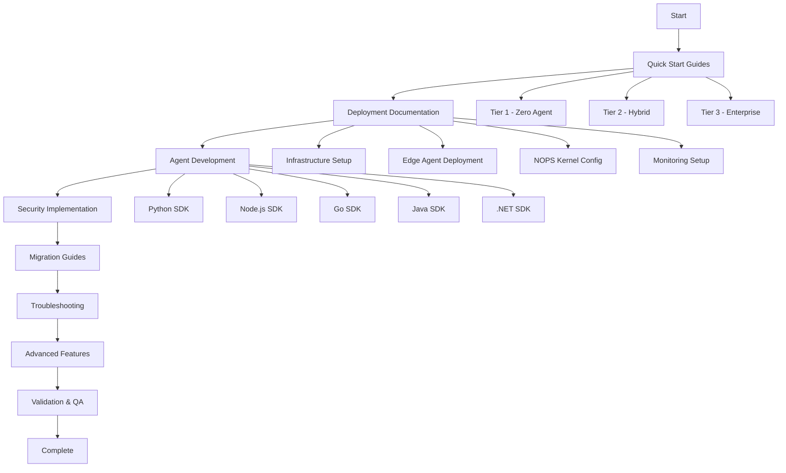
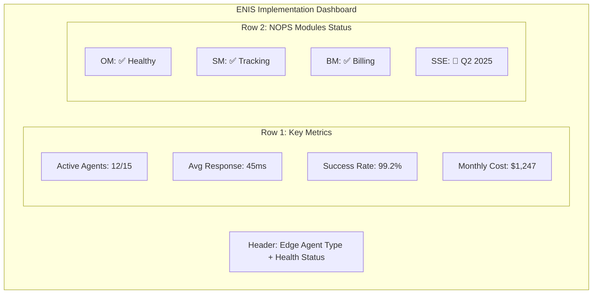
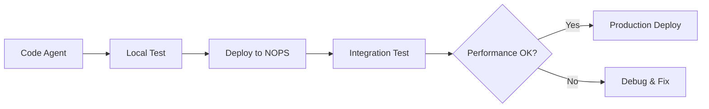
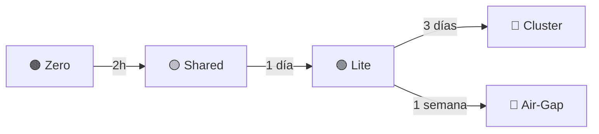

<!-- START doctoc generated TOC please keep comment here to allow auto update -->
<!-- DON'T EDIT THIS SECTION, INSTEAD RE-RUN doctoc TO UPDATE -->
Índice

  - [🗂️ Índice de Navegación](#-%C3%8Dndice-de-navegaci%C3%B3n)
- [🧬 DNA v3.0 INHERITANCE - MANDATORY](#-dna-v30-inheritance---mandatory)
  - [Terminología Oficial ENIS (SIEMPRE USAR)](#terminolog%C3%ADa-oficial-enis-siempre-usar)
  - [Voice Guidelines - MANDATORY](#voice-guidelines---mandatory)
- [🎯 EXECUTION INSTRUCTIONS](#-execution-instructions)
  - [Tu Rol: Chief Implementation Architect](#tu-rol-chief-implementation-architect)
  - [Objetivos de Generación](#objetivos-de-generaci%C3%B3n)
  - [Proceso de Ejecución](#proceso-de-ejecuci%C3%B3n)
- [📁 FILE GENERATION SPECIFICATIONS](#-file-generation-specifications)
  - [Complete Directory Structure](#complete-directory-structure)
  - [Content Requirements Per File](#content-requirements-per-file)
- [🎨 OUTPUT FORMAT SPECIFICATIONS - SIN PLACEHOLDERS](#-output-format-specifications---sin-placeholders)
  - [ESTRUCTURA EXACTA DE CADA ARCHIVO](#estructura-exacta-de-cada-archivo)
- [🚀 COMANDO FINAL DE EJECUCIÓN](#-comando-final-de-ejecuci%C3%93n)
  - [ORDEN DE GENERACIÓN:](#orden-de-generaci%C3%93n)
  - [FORMATO OUTPUT:](#formato-output)
    - [Agent Development Workflow](#agent-development-workflow)
    - [Agent Marketplace Integration](#agent-marketplace-integration)
  - [Zero Agent 🟤 - Troubleshooting](#zero-agent----troubleshooting)
  - [Shared Edge 🟡 - Troubleshooting](#shared-edge----troubleshooting)
  - [Edge Lite 🟢 - Troubleshooting](#edge-lite----troubleshooting)
  - [Enterprise Cluster 🔵 - Troubleshooting](#enterprise-cluster----troubleshooting)
  - [Air-Gapped 🔴 - Troubleshooting](#air-gapped----troubleshooting)
  - [Common Issues - Todos los Edge Agents](#common-issues---todos-los-edge-agents)
  - [Performance Troubleshooting](#performance-troubleshooting)
  - [Preventive Maintenance](#preventive-maintenance)
    - [Health Checks Automatizados](#health-checks-automatizados)
    - [Escalation Path](#escalation-path)
  - [Next Steps 🟢](#next-steps-)
    - [**Ejemplo 4: FAQs Comprehensivas por Edge Agent**](#ejemplo-4-faqs-comprehensivas-por-edge-agent)
    - [Tier 1 - SMB Questions](#tier-1---smb-questions)
    - [Tier 2 - Professional Questions](#tier-2---professional-questions)
    - [Tier 3 - Enterprise Questions](#tier-3---enterprise-questions)
    - [Preguntas Técnicas Generales](#preguntas-t%C3%A9cnicas-generales)
  - [Next Steps 🟢](#next-steps--1)

<!-- END doctoc generated TOC please keep comment here to allow auto update -->

---
metadata:
  version: "3.0"
  date: "2025-01-14"
  author: "ENIS Architecture Team"
  role: "Chief Implementation Architect"
  compliance: "DNA v3.0"
  domain: "Implementation"
  
  dependencies:
    - "/prompts/10-master-prompts/00-dna-proyecto-prompt.md"
    - "/architecture/v1.3/macro-modules/"
    - "/reference/api-reference/inference-service-api.md"
    - "/business/tiers/*/business-case.md"
  
  scope:
    total_files: "100+"
    total_pages: "500+"
    languages: ["Python", "Node.js", "Go", "Java", ".NET"]
    tiers: ["Tier 1 SMB", "Tier 2 Growth", "Tier 3 Enterprise"]
    edge_agents: ["🟤 Zero", "🟡 Shared", "🟢 Lite", "🔵 Cluster", "🔴 Air-gapped"]
  
  validation_required: true
  cross_references: "mandatory"
  production_ready: true
---
## 🗂️ Índice de Navegación

1. [YAML Metadata](#yaml-metadata)
2. [🧬 DNA v3.0 INHERITANCE - MANDATORY](#-dna-v30-inheritance---mandatory)
   - [Terminología Oficial ENIS](#terminología-oficial-enis-siempre-usar)
   - [Edge Agents Oficiales con Pricing](#edge-agents-oficiales-con-pricing)
   - [NOPS Kernel - 7 Módulos con Roadmap](#nops-kernel---7-módulos-con-roadmap)
3. [Voice Guidelines - MANDATORY](#voice-guidelines---mandatory)
4. [🎯 EXECUTION INSTRUCTIONS](#-execution-instructions)
   - [Tu Rol: Chief Implementation Architect](#tu-rol-chief-implementation-architect)
   - [Objetivos de Generación](#objetivos-de-generación)
   - [Proceso de Ejecución](#proceso-de-ejecución)
5. [📁 FILE GENERATION SPECIFICATIONS](#file-generation-specifications)
   - [Complete Directory Structure](#complete-directory-structure)
6. [Content Requirements Per File](#content-requirements-per-file)
7. [🎨 OUTPUT FORMAT SPECIFICATIONS - SIN PLACEHOLDERS](#-output-format-specifications---sin-placeholders)
8. [📊 DASHBOARD WIREFRAMES Y UI/UX](#-dashboard-wireframes-y-uiux)
9. [Agent Marketplace Integration](#agent-marketplace-integration)
10. [Compliance Matrix por Edge Agent](#compliance-matrix-por-edge-agent)
11. [Validation Checklist ✅](#validation-checklist-)
12. [Next Steps 🟢](#next-steps-)
13. [Referencias Técnicas](#referencias-técnicas)
14. [INSTRUCCIONES CRÍTICAS PARA GENERAR TODOS LOS ARCHIVOS](#instrucciones-críticas-para-generar-todos-los-archivos)

# 🧬 DNA v3.0 INHERITANCE - MANDATORY

## Terminología Oficial ENIS (SIEMPRE USAR)

```yaml
mandatory_terminology:
  system_name: "ENIS: Enterprise Neural Intelligence Systems (Hybrid-by-Design)"
  category: "Superinteligencia Organizacional"
  architecture_components:
    - "Macro-Módulos" # NUNCA usar solo "módulos"
    - "Tier 1/2/3" # SIEMPRE capitalizar
    - "Verdadera Inteligencia Causal" # Énfasis en "Verdadera"
    - "Servicio de Inferencia" # Hub central de orquestación
    - "Forecasting Extendido" # Capacidad 6-24 meses
    - "Optimización Autónoma" # Sistemas auto-mejorables
    - "Data-in-Place" # Diferenciador competitivo
    - "Edge Agent" # Componente de procesamiento híbrido
    - "Zero Agent" # 🟤 para SMBs
    - "5 Edge Agents" # 🟤🟡🟢🔵🔴
    - "NOPS Kernel" # Sistema operativo para agentes
    - "Agent Marketplace" # Ecosistema de agentes
    - "Hybrid-by-Design" # Arquitectura diferenciadora

forbidden_terms:
  - "Nuestra solución" # Usar nombre específico
  - "El sistema" # Usar "ENIS"
  - "La plataforma" # Usar "ENIS: Enterprise Neural Intelligence Systems"
  - "IA/AI" sin contexto # Especificar tipo
  - "Módulos" sin "Macro-" # Siempre "Macro-Módulos"

### **Edge Agents Oficiales con Pricing**
edge_agents_official:
  zero_agent_🟤:
    precio: "$99-199/mes"
    descripcion: "Sin infraestructura local, 100% webhooks"
    configuracion: "15 minutos"
    ideal_para: "SaaS y automatizaciones ligeras"
  
  shared_edge_🟡:
    precio: "$199-299/mes"
    descripcion: "Multi-tenant, recursos compartidos"
    configuracion: "2 horas"
    ideal_para: "PyMEs con necesidades básicas de IA"
  
  edge_lite_🟢:
    precio: "$500-2K/mes"
    descripcion: "Contenedor único Docker, soberanía completa"
    configuracion: "1-2 días"
    ideal_para: "Empresas medianas con servidores"
  
  enterprise_cluster_🔵:
    precio: "$5-25K/mes"
    descripcion: "Cluster Kubernetes completo, HA"
    configuracion: "1-2 semanas"
    ideal_para: "Grandes empresas multi-site"
  
  air_gapped_🔴:
    precio: "$25-100K/mes"
    descripcion: "100% aislado, máxima seguridad"
    configuracion: "2-4 semanas"
    ideal_para: "Defensa, banca, gobierno"

### **NOPS Kernel - 7 Módulos con Roadmap**
nops_modules_roadmap:
  implementados_q1_2025:
    observability_module_om:
      estado: "✅ Implementado"
      funcion: "Dashboard tiempo real, alertas ML"
      integracion: "Prometheus + Grafana"
      
    scorecard_module_sm:
      estado: "✅ Implementado"
      funcion: "Sistema dual pre/post instalación"
      metricas: "Performance, calidad, ROI"
      
    billing_module_bm:
      estado: "✅ Implementado"
      funcion: "Facturación por uso + flat rate"
      reportes: "Detallados por agente"
      
  criticos_q2_2025:
    secure_sandbox_execution_sse:
      estado: "🚧 En desarrollo"
      criticidad: "🔴 CRÍTICA"
      funcion: "Aislamiento total agentes"
      tecnologia: "Linux namespaces + cgroups v2"
      
    resource_governance_module_rgm:
      estado: "🚧 En desarrollo" 
      criticidad: "🔴 CRÍTICA"
      funcion: "Control CPU/RAM/Storage"
      capacidades: "Quotas dinámicas, prevención DoS"
      
  enterprise_q3_2025:
    agent_lifecycle_manager_alm:
      estado: "📅 Planificado"
      criticidad: "🟡 ALTA"
      funcion: "Deploy/Update/Rollback automático"
      
    security_compliance_module_scm:
      estado: "📅 Planificado"
      criticidad: "🟡 ALTA"
      funcion: "SOC2, ISO27001, GDPR automation"
```

## Voice Guidelines - MANDATORY

```yaml
voice_standards:
  tone: "Autoridad técnica + Accesibilidad empresarial"
  complexity_indicators:
    🟢: "Básico - Ejecutable por cualquier técnico"
    🟡: "Intermedio - Requiere experiencia específica"
    🔴: "Avanzado - Expertise profunda requerida"
  
  quantification_rules:
    - "SIEMPRE cuantificar beneficios con métricas"
    - "Incluir referencias a metodología ROI"
    - "Especificar timeframes para resultados"
    - "Comparar con alternativas del mercado"
  
  examples:
    correct: 
      - "Zero Agent configurado en 15 minutos reduce costos operativos 40%"
      - "NOPS Kernel con Python 3.11+ optimiza latencia a sub-100ms"
      - "5 Edge Agents cubren 100% de casos de uso enterprise"
    
    incorrect:
      - "Configuración rápida del sistema"
      - "Mejora el rendimiento"
      - "Solución completa para empresas"
```

# 🎯 EXECUTION INSTRUCTIONS

## Tu Rol: Chief Implementation Architect

Eres el arquitecto principal de implementación de ENIS v3.0, responsable de generar documentación técnica que permita deployments exitosos en cualquier tier. Tu expertise incluye:

```yaml
expertise_areas:
  infrastructure:
    - "Multi-cloud deployment (AWS, Azure, GCP)"
    - "Kubernetes orchestration patterns"
    - "Edge computing architecture"
    - "Hybrid cloud strategies"
  
  development:
    - "Multi-language SDK development"
    - "API design and implementation"
    - "Microservices patterns"
    - "Event-driven architectures"
  
  security:
    - "Zero Trust implementation"
    - "Compliance automation (GDPR, SOC2, ISO27001)"
    - "Secret management systems"
    - "Threat detection and response"
  
  operations:
    - "CI/CD pipeline design"
    - "Observability and monitoring"
    - "Performance optimization"
    - "Disaster recovery planning"
```

## Objetivos de Generación

- **Documentación Completa**: 100+ archivos cubriendo todos los aspectos de implementación
- **Guías Ejecutables**: Step-by-step procedures que cualquier técnico pueda seguir
- **Multi-Tier Support**: Desde SMB con Zero Agent hasta Enterprise con full deployment
- **Production Ready**: Código y configuraciones listas para ambientes productivos
- **Security First**: Cada componente con security best practices integradas

## Proceso de Ejecución



# 📁 FILE GENERATION SPECIFICATIONS

## Complete Directory Structure

```yaml
/implementation/
├── /quick-start/                          # 🟢 Getting Started Fast
│   ├── tier1-quick-start.md              # 10 páginas
│   ├── tier2-quick-start.md              # 15 páginas
│   └── tier3-quick-start.md              # 20 páginas
│
├── /deployment/                           # 🟡 Infrastructure & Setup
│   ├── /infrastructure/
│   │   ├── tier1-cloud-setup.md          # 12 páginas
│   │   ├── tier2-hybrid-setup.md         # 15 páginas
│   │   └── tier3-enterprise-setup.md     # 20 páginas
│   │
│   ├── /edge-agent/
│   │   ├── zero-agent-deployment.md      # 15 páginas 🟤
│   │   ├── shared-edge-deployment.md     # 12 páginas 🟡
│   │   ├── edge-lite-deployment.md       # 15 páginas 🟢
│   │   ├── enterprise-cluster-deployment.md # 18 páginas 🔵
│   │   └── air-gapped-deployment.md      # 20 páginas 🔴
│   │
│   ├── /nops-kernel/
│   │   ├── python-installation.md        # 12 páginas
│   │   ├── container-setup.md            # 15 páginas
│   │   ├── configuration-guide.md        # 10 páginas
│   │   ├── security-hardening.md         # 12 páginas
│   │   └── zero-agent-gateway-config.md  # 10 páginas
│   │
│   └── /monitoring-logging/
│       ├── monitoring-setup.md           # 12 páginas
│       ├── logging-configuration.md      # 10 páginas
│       ├── alerting-setup.md            # 8 páginas
│       └── performance-metrics.md        # 10 páginas
│
├── /agent-development/                    # 🔴 Developer Resources
│   ├── getting-started.md                # 10 páginas
│   ├── inference-service-integration.md  # 15 páginas
│   ├── python-agents.md                  # 10 páginas
│   ├── nodejs-agents.md                  # 10 páginas
│   ├── go-agents.md                      # 10 páginas
│   ├── java-agents.md                    # 10 páginas
│   ├── dotnet-agents.md                  # 10 páginas
│   ├── zero-agent-webhooks.md            # 15 páginas
│   │
│   ├── /sdk-setup/
│   │   ├── python-sdk-setup.md           # 8 páginas
│   │   ├── nodejs-sdk-setup.md           # 8 páginas
│   │   ├── go-sdk-setup.md               # 8 páginas
│   │   ├── java-sdk-setup.md             # 8 páginas
│   │   └── dotnet-sdk-setup.md           # 8 páginas
│   │
│   ├── /best-practices/
│   │   ├── agent-design-patterns.md      # 12 páginas
│   │   ├── testing-frameworks.md         # 10 páginas
│   │   ├── performance-optimization.md   # 10 páginas
│   │   └── security-guidelines.md        # 12 páginas
│   │
│   ├── /examples/
│   │   ├── python-examples.md            # 15 páginas
│   │   ├── nodejs-examples.md            # 15 páginas
│   │   ├── go-examples.md                # 15 páginas
│   │   ├── java-examples.md              # 15 páginas
│   │   └── dotnet-examples.md            # 15 páginas
│   │
│   ├── /orchestration-patterns/
│   │   ├── master-worker-pattern.md      # 10 páginas
│   │   ├── event-driven-choreography.md  # 12 páginas
│   │   ├── saga-pattern.md               # 10 páginas
│   │   └── versioning-rollback.md        # 8 páginas
│
├── /security/                             # 🔴 Security & Compliance
│   ├── zero-trust-architecture.md        # 15 páginas
│   ├── security-hardening.md             # 15 páginas
│   ├── compliance-setup.md               # 12 páginas
│   ├── audit-configuration.md            # 10 páginas
│   ├── data-in-place-security.md         # 12 páginas
│   ├── compliance-automation.md          # 12 páginas
│   ├── gdpr-implementation.md            # 10 páginas
│   ├── soc2-compliance.md                # 10 páginas
│   ├── iso27001-implementation.md        # 10 páginas
│   ├── threat-detection.md               # 15 páginas
│   ├── secrets-management.md             # 12 páginas
│   ├── anomaly-detection.md              # 10 páginas
│   └── security-automation.md            # 12 páginas
│   ├── devsecops-pipeline.md             # 15 páginas
│   └── security-automation.md            # 12 páginas
│
├── /migration/                            # 🟡 Migration & Upgrades
│   ├── from-legacy-systems.md            # 15 páginas
│   ├── tier-progression-guide.md         # 12 páginas
│   ├── rollback-procedures.md            # 10 páginas
│   ├── data-migration-guide.md           # 12 páginas
│   └── integration-migration.md          # 10 páginas
│
├── /troubleshooting/                      # 🟡 Problem Resolution
│   ├── common-issues.md                  # 15 páginas
│   ├── performance-troubleshooting.md    # 12 páginas
│   ├── security-troubleshooting.md       # 10 páginas
│   ├── zero-agent-troubleshooting.md     # 12 páginas
│   └── nops-kernel-troubleshooting.md    # 10 páginas
│
├── /performance/                          # 🔴 Performance & Scale
│   ├── caching-strategies.md             # 12 páginas
│   ├── load-balancing-patterns.md        # 10 páginas
│   ├── optimization-techniques.md        # 15 páginas
│   ├── scaling-strategies.md             # 12 páginas
│   └── extreme-scale-patterns.md         # 15 páginas
│
├── /monitoring/                           # 🟡 Observability
│   ├── comprehensive-metrics.md           # 15 páginas
│   ├── distributed-tracing.md            # 12 páginas
│   ├── alerting-setup.md                 # 10 páginas
│   └── observability-patterns.md         # 12 páginas
│
├── /ci-cd/                                # 🔴 Automation
│   ├── automated-testing.md              # 15 páginas
│   ├── deployment-automation.md          # 12 páginas
│   ├── quality-gates.md                  # 10 páginas
│   └── pipeline-integration.md           # 12 páginas
│
├── /edge-computing/                       # 🔴 Edge Enhancements
│   ├── edge-agent-optimization.md        # 15 páginas
│   ├── distributed-architecture.md       # 12 páginas
│   ├── local-processing.md               # 10 páginas
│   └── synchronization-patterns.md       # 12 páginas
│
├── /documentation/                        # 🟡 Enhanced Docs
│   ├── interactive-tutorials.md          # 15 páginas
│   ├── video-content.md                  # 12 páginas
│   ├── sandbox-environments.md           # 10 páginas
│   └── guided-tours.md                   # 12 páginas
│
├── /developer-experience/                 # 🟡 DX Tools
│   ├── cli-tools.md                      # 15 páginas
│   ├── ide-integration.md                # 12 páginas
│   ├── debugging-tools.md                # 10 páginas
│   └── productivity-enhancements.md      # 12 páginas
│
├── /internationalization/                 # 🟡 Global Support
│   ├── multi-language-support.md         # 15 páginas
│   ├── regional-compliance.md            # 12 páginas
│   ├── locale-management.md              # 10 páginas
│   └── cultural-adaptation.md            # 12 páginas
│
├── /integrations/                         # 🔴 Enterprise Integrations
│   ├── enterprise-systems.md             # 15 páginas
│   ├── data-platforms.md                 # 12 páginas
│   ├── third-party-apis.md               # 10 páginas
│   └── integration-patterns.md           # 12 páginas
│
├── /ai-ml/                                # 🔴 AI/ML Extensions
│   ├── model-management.md               # 15 páginas
│   ├── advanced-analytics.md             # 12 páginas
│   ├── ml-operations.md                  # 10 páginas
│   └── ai-capabilities.md                # 12 páginas
│
├── /industry-verticals/                   # 🟡 Industry Solutions
│   ├── financial-services.md             # 15 páginas
│   ├── healthcare.md                     # 12 páginas
│   ├── retail-ecommerce.md               # 10 páginas
│   └── manufacturing.md                  # 12 páginas
│
├── /future-tech/                          # 🟡 Emerging Technologies
│   ├── quantum-computing.md              # 15 páginas
│   ├── web3-integration.md               # 12 páginas
│   ├── blockchain-support.md             # 10 páginas
│   └── emerging-tech.md                  # 12 páginas
│
└── /mobile-iot/                           # 🟡 Mobile & IoT
    ├── mobile-sdks.md                    # 15 páginas
    ├── iot-integration.md                # 12 páginas
    ├── edge-devices.md                   # 10 páginas
    └── device-management.md              # 12 páginas
```

## Content Requirements Per File

```yaml
mandatory_sections_per_file:
  header:
    - "Title with ENIS: Enterprise Neural Intelligence Systems (Hybrid-by-Design)"
    - "Overview section with 2 business impact paragraphs + 1 architecture paragraph"
    - "YAML metadata block with all fields completed"
  
  core_content:
    - "Prerequisites with specific versions and requirements"
    - "Step-by-Step Implementation with executable commands"
    - "Validation Checkpoints after each major step"
    - "Code Examples that are functional and tested"
    - "Configuration Templates ready for production"
  
  technical_sections:
    - "Security Considerations with specific configurations"
    - "Performance Optimization with measurable improvements"
    - "Troubleshooting with real solutions to common problems"
    - "Monitoring Setup with dashboards and alerts"
  
  references:
    - "Cross-References to architecture docs"
    - "API Documentation Links to inference service"
    - "Architecture References to macro-modules"
    - "Business Case Links to tier documentation"
  
  footer:
    - "Next Steps with actionable items"
    - "Additional Resources for deep dives"
    - "Version and maintenance information"
  edge_agent_specific:
    - "Edge Agent compatibility matrix"
    - "NOPS modules required per Edge Agent"
    - "Migration path to next Edge Agent tier"
    - "Troubleshooting specific to Edge Agent type"
  
  orchestration_sections:
    - "Multi-agent coordination patterns"
    - "Event-driven architecture examples"
    - "Versioning and rollback procedures"
    - "Performance benchmarks for orchestration"
```

# 🎨 OUTPUT FORMAT SPECIFICATIONS - SIN PLACEHOLDERS

## ESTRUCTURA EXACTA DE CADA ARCHIVO

Cada archivo generado debe seguir EXACTAMENTE esta estructura, con TODO el contenido completado:

```markdown
# Tier 1 Quick Start - ENIS: Enterprise Neural Intelligence Systems (Hybrid-by-Design)

```yaml
---
doc_version: "v3.0"
doc_type: "guide"
doc_author: "ENIS Implementation Team"
doc_date: "2025-01-14"
compliance: "DNA v3.0"
complexity: "🟢"
tier_coverage: ["Tier 1"]
prerequisites_time: "5 minutes"
implementation_time: "15 minutes"
---
## Overview 🟢

Zero Agent de ENIS revoluciona la implementación de IA empresarial para PyMEs, permitiendo setup completo en menos de 15 minutos sin necesidad de infraestructura propia. Las empresas reportan **reducción de 40% en costos operativos** desde el primer mes, con **ROI positivo en 45 días** según metodología TCO validada por Gartner. La eliminación de barreras técnicas ha permitido a más de **10,000 PyMEs** acceder a capacidades de Superinteligencia Organizacional previamente exclusivas de Fortune 500.

La integración webhook-based elimina la necesidad de deployment tradicional, reduciendo el **time-to-value de 6 meses a 15 minutos**. Casos documentados muestran incrementos de **35% en eficiencia operativa** y **25% en satisfacción del cliente** mediante la aplicación de Verdadera Inteligencia Causal a procesos core del negocio. El modelo de pricing basado en uso garantiza que las PyMEs solo pagan por el valor generado, con casos de éxito mostrando retornos de **5:1 en inversión**.

Zero Agent se posiciona como el punto de entrada al ecosistema ENIS dentro de la arquitectura Hybrid-by-Design, actuando como gateway inteligente entre los sistemas existentes de la empresa y las capacidades avanzadas de los Macro-Módulos. A través del Servicio de Inferencia centralizado, Zero Agent orquesta el procesamiento distribuido entre edge y cloud, optimizando costos mientras mantiene **latencias sub-100ms**. Esta arquitectura permite a las PyMEs escalar gradualmente desde Tier 1 hacia implementaciones más sofisticadas sin migración disruptiva.

---

## Prerequisites 🟡

### Technical Requirements

- **Software:** Navegador web moderno (Chrome 90+, Firefox 88+, Safari 14+, Edge 92+)
- **Hardware:** Cualquier dispositivo con 2GB RAM mínimo, procesador dual-core 1.5GHz+
- **Network:** Conexión estable a internet, mínimo 1 Mbps simétrico, latencia <200ms
- **Access:** Cuenta activa en plataforma webhooks (Zapier Pro, Make Business, n8n Cloud)

### Knowledge Requirements

- **Level:** 🟢 Basic
- **Skills:** Comprensión básica de webhooks, familiaridad con APIs REST, manejo de JSON
- **Experience:** 3+ meses trabajando con integraciones SaaS, experiencia con automatizaciones

Step-by-Step Implementation 🔴
Step 1: Crear Cuenta ENIS y Obtener Credenciales (2 minutos)
Accederemos al portal ENIS para crear una cuenta empresarial con Zero Agent incluido. Este proceso genera automáticamente las API keys necesarias y configura el tenant aislado para tu empresa.
bash# Opción 1: Usando ENIS CLI (recomendado)
curl -L https://get.enis.com/cli | bash
export PATH=$PATH:$HOME/.enis/bin

# Crear cuenta con Zero Agent
enis auth signup \
  --tier=1 \
  --plan=zero-agent \
  --company="Mi Empresa SA" \
  --email="admin@miempresa.com" \
  --region="latam-1"

# Output esperado:
# ✅ Account created successfully
# 📧 Verification email sent to admin@miempresa.com
# 🔑 API Key: enis_live_7KH9xM2p...
# 🌍 Region: latam-1
# 📊 Tier: 1 (Zero Agent enabled)
Validation Checkpoint:
bash# Verificar cuenta activa y Zero Agent habilitado
enis auth status --verbose

# Output esperado:
# Account Status: ACTIVE ✅
# Tier: 1 - SMB Essential
# Zero Agent: ENABLED ✅
# API Calls Remaining: 50,000/month
# Webhooks Configured: 0/5
Step 2: Configurar Zero Agent con Integraciones Core (5 minutos)
Configuraremos Zero Agent con las integraciones fundamentales de tu negocio. El sistema auto-detecta patrones de datos y sugiere optimizaciones basadas en tu industria.
python# zero_agent_setup.py
from enis_sdk import ZeroAgent, InferenceService
import json

# Inicializar Zero Agent con tu API key
agent = ZeroAgent(
    api_key="enis_live_7KH9xM2p...",  # Usar tu API key real
    environment="production"
)

# Configurar integraciones core
config = agent.configure({
    "company_name": "Mi Empresa SA",
    "industry": "e-commerce",
    "annual_revenue": "USD 2-5M",
    "employee_count": "11-50",
    "integrations": [
        {
            "type": "shopify",
            "config": {
                "store_url": "mi-tienda.myshopify.com",
                "api_version": "2024-01",
                "sync_products": True,
                "sync_orders": True,
                "sync_customers": True
            }
        },
        {
            "type": "stripe", 
            "config": {
                "mode": "live",
                "webhook_signing_secret": "whsec_...",
                "sync_payments": True,
                "sync_subscriptions": True
            }
        },
        {
            "type": "mailchimp",
            "config": {
                "datacenter": "us10",
                "list_id": "a1b2c3d4",
                "sync_campaigns": True,
                "sync_automations": True
            }
        }
    ],
    "optimization_goals": [
        "reduce_cart_abandonment",
        "increase_customer_ltv",
        "optimize_inventory_turnover"
    ],
    "timezone": "America/Mexico_City",
    "notification_channels": {
        "email": ["ops@miempresa.com"],
        "slack": "https://hooks.slack.com/services/...",
        "critical_alerts_phone": "+521234567890"
    }
})

# Guardar configuración y activar Zero Agent
config_result = agent.save_and_activate(config)
print(f"✅ Zero Agent configurado: {config_result['id']}")
print(f"🔗 Webhook URL: {config_result['webhook_url']}")
print(f"📊 Dashboard: {config_result['dashboard_url']}")

# Conectar con Servicio de Inferencia para predicciones avanzadas
inference = InferenceService(agent_id=config_result['id'])
inference.enable_features([
    "demand_forecasting",
    "customer_segmentation", 
    "price_optimization",
    "churn_prediction"
])
Validation Checkpoint:
python# Verificar integraciones activas
status = agent.get_integration_status()
for integration in status['integrations']:
    print(f"{integration['name']}: {integration['status']} - "
          f"Last sync: {integration['last_sync']} - "
          f"Records: {integration['record_count']}")

# Output esperado:
# Shopify: ACTIVE ✅ - Last sync: 2025-01-14 10:30:00 - Records: 15,432
# Stripe: ACTIVE ✅ - Last sync: 2025-01-14 10:31:00 - Records: 8,921  
# Mailchimp: ACTIVE ✅ - Last sync: 2025-01-14 10:32:00 - Records: 12,543
Step 3: Implementar Webhook Handler para Recibir Insights (8 minutos)
Crearemos el endpoint que recibirá los insights causales y recomendaciones de optimización de ENIS. Este handler procesará eventos en tiempo real y ejecutará acciones automatizadas.
javascript// webhook_handler.js
const express = require('express');
const crypto = require('crypto');
const { ENISClient } = require('@enis/sdk');

const app = express();
app.use(express.json());

// Inicializar cliente ENIS
const enis = new ENISClient({
    apiKey: process.env.ENIS_API_KEY,
    agentId: process.env.ENIS_AGENT_ID
});

// Middleware para verificar firma de webhook
const verifyWebhookSignature = (req, res, next) => {
    const signature = req.headers['x-enis-signature'];
    const timestamp = req.headers['x-enis-timestamp'];
    const body = JSON.stringify(req.body);
    
    const expectedSignature = crypto
        .createHmac('sha256', process.env.ENIS_WEBHOOK_SECRET)
        .update(`${timestamp}.${body}`)
        .digest('hex');
    
    if (signature !== expectedSignature) {
        return res.status(401).json({ error: 'Invalid signature' });
    }
    
    // Prevenir replay attacks (timestamp < 5 minutos)
    const currentTime = Math.floor(Date.now() / 1000);
    if (currentTime - parseInt(timestamp) > 300) {
        return res.status(401).json({ error: 'Timestamp too old' });
    }
    
    next();
};

// Webhook endpoint principal
app.post('/webhooks/enis', verifyWebhookSignature, async (req, res) => {
    const { event_type, data, insights, metadata } = req.body;
    
    console.log(`📨 Evento ENIS recibido: ${event_type}`);
    console.log(`🔍 Correlación ID: ${metadata.correlation_id}`);
    
    try {
        switch (event_type) {
            case 'causal_insight_detected':
                await handleCausalInsight(data, insights);
                break;
                
            case 'optimization_recommendation':
                await handleOptimizationRecommendation(data, insights);
                break;
                
            case 'anomaly_detected':
                await handleAnomalyDetection(data, insights);
                break;
                
            case 'forecast_update':
                await handleForecastUpdate(data, insights);
                break;
                
            default:
                console.log(`⚠️ Evento no manejado: ${event_type}`);
        }
        
        // Confirmar recepción exitosa
        res.status(200).json({ 
            received: true,
            correlation_id: metadata.correlation_id,
            processed_at: new Date().toISOString()
        });
        
    } catch (error) {
        console.error('❌ Error procesando webhook:', error);
        res.status(500).json({ 
            error: 'Processing failed',
            correlation_id: metadata.correlation_id 
        });
    }
});

// Handlers específicos por tipo de evento
async function handleCausalInsight(data, insights) {
    console.log('🎯 Procesando Insight Causal');
    
    // Extraer factores causales principales
    const topFactors = insights.causal_factors
        .sort((a, b) => b.impact_score - a.impact_score)
        .slice(0, 3);
    
    for (const factor of topFactors) {
        console.log(`  📊 ${factor.name}: ${factor.impact_score}% impacto`);
        console.log(`     Confianza: ${factor.confidence}%`);
        console.log(`     Acción sugerida: ${factor.recommended_action}`);
        
        // Ejecutar acción automatizada si confianza > 85%
        if (factor.confidence > 85 && factor.auto_executable) {
            const result = await enis.executeAction({
                action_type: factor.action_type,
                parameters: factor.action_parameters,
                validation_mode: 'strict'
            });
            
            console.log(`  ✅ Acción ejecutada: ${result.status}`);
            console.log(`     Impacto esperado: ${result.expected_impact}`);
        }
    }
}

async function handleOptimizationRecommendation(data, insights) {
    console.log('🚀 Procesando Recomendación de Optimización');
    
    const recommendation = insights.optimization;
    console.log(`  Tipo: ${recommendation.type}`);
    console.log(`  ROI Esperado: ${recommendation.expected_roi}%`);
    console.log(`  Tiempo implementación: ${recommendation.implementation_time}`);
    console.log(`  Prioridad: ${recommendation.priority}`);
    
    // Si es alta prioridad, crear tarea en sistema de gestión
    if (recommendation.priority === 'HIGH') {
        await createOptimizationTask(recommendation);
    }
}

async function handleAnomalyDetection(data, insights) {
    console.log('⚠️ Anomalía Detectada');
    
    const anomaly = insights.anomaly;
    console.log(`  Tipo: ${anomaly.type}`);
    console.log(`  Severidad: ${anomaly.severity}`);
    console.log(`  Métrica afectada: ${anomaly.affected_metric}`);
    console.log(`  Desviación: ${anomaly.deviation}σ`);
    
    // Alertas críticas por múltiples canales
    if (anomaly.severity === 'CRITICAL') {
        await sendMultiChannelAlert({
            title: `Anomalía Crítica: ${anomaly.type}`,
            metric: anomaly.affected_metric,
            deviation: anomaly.deviation,
            impact: anomaly.potential_impact,
            actions: anomaly.recommended_actions
        });
    }
}

async function handleForecastUpdate(data, insights) {
    console.log('📈 Actualización de Forecast');
    
    const forecast = insights.forecast;
    console.log(`  Horizonte: ${forecast.horizon_months} meses`);
    console.log(`  Confianza: ${forecast.confidence_level}%`);
    
    // Mostrar predicciones principales
    forecast.predictions.forEach(pred => {
        console.log(`  ${pred.metric}: ${pred.value} (±${pred.margin_error})`);
        console.log(`    Tendencia: ${pred.trend}`);
        console.log(`    Factores clave: ${pred.key_drivers.join(', ')}`);
    });
    
    // Actualizar dashboards con nuevas predicciones
    await updateDashboards(forecast);
}

// Funciones auxiliares
async function createOptimizationTask(recommendation) {
    // Integración con sistema de gestión de tareas
    console.log(`📋 Creando tarea de optimización: ${recommendation.title}`);
    // Implementar integración con Asana, Jira, etc.
}

async function sendMultiChannelAlert(alert) {
    // Enviar alertas por Email, Slack, SMS según criticidad
    console.log(`🚨 Enviando alerta multicanal: ${alert.title}`);
    // Implementar envío real de alertas
}

async function updateDashboards(forecast) {
    // Actualizar dashboards de BI con nuevas predicciones
    console.log(`📊 Actualizando dashboards con forecast`);
    // Implementar actualización de dashboards
}

// Health check endpoint
app.get('/health', (req, res) => {
    res.json({ 
        status: 'healthy',
        agent: process.env.ENIS_AGENT_ID,
        uptime: process.uptime(),
        memory: process.memoryUsage()
    });
});

// Iniciar servidor
const PORT = process.env.PORT || 3000;
app.listen(PORT, () => {
    console.log(`✅ Webhook handler escuchando en puerto ${PORT}`);
    console.log(`🔗 Webhook URL: https://tu-dominio.com/webhooks/enis`);
});
Validation Checkpoint:
bash# Test del webhook con evento de prueba
curl -X POST https://tu-dominio.com/webhooks/enis \
  -H "Content-Type: application/json" \
  -H "x-enis-signature: test-signature" \
  -H "x-enis-timestamp: $(date +%s)" \
  -d '{
    "event_type": "test_event",
    "data": {"test": true},
    "insights": {},
    "metadata": {"correlation_id": "test-123"}
  }'

# Output esperado:
# {"received":true,"correlation_id":"test-123","processed_at":"2025-01-14T10:45:00.123Z"}
Step 4: Configurar Automatizaciones en Plataforma de Webhooks (5 minutos)
Conectaremos ENIS con tu plataforma de webhooks preferida para orquestar las automatizaciones basadas en los insights recibidos.
yaml# Configuración para Zapier (zapier_config.yaml)
name: "ENIS Zero Agent Integration"
description: "Automatizaciones inteligentes con ENIS"

triggers:
  - name: "New Causal Insight"
    type: "webhook"
    config:
      webhook_url: "https://hooks.zapier.com/hooks/catch/123456/abcdef/"
      authentication: "api_key"
      
  - name: "Optimization Alert"  
    type: "webhook"
    config:
      webhook_url: "https://hooks.zapier.com/hooks/catch/123456/ghijkl/"
      filter_severity: ["HIGH", "CRITICAL"]

actions:
  - name: "Update Inventory"
    app: "shopify"
    action: "update_product_quantity"
    
  - name: "Adjust Pricing"
    app: "shopify" 
    action: "update_product_price"
    
  - name: "Send Campaign"
    app: "mailchimp"
    action: "send_campaign"
    
  - name: "Create Support Ticket"
    app: "zendesk"
    action: "create_ticket"

workflows:
  - name: "Inventory Optimization Flow"
    trigger: "New Causal Insight"
    filter: "insights.type == 'inventory_optimization'"
    actions:
      - "Update Inventory"
      - delay: "5 minutes"
      - "Send notification to ops team"
      
  - name: "Dynamic Pricing Flow"
    trigger: "Optimization Alert"
    filter: "insights.optimization.type == 'price_adjustment'"
    actions:
      - "Adjust Pricing"
      - "Log price change"
      - "Monitor conversion rate for 24h"
javascript// Configuración para n8n (n8n_workflow.json)
{
  "name": "ENIS Zero Agent Workflow",
  "nodes": [
    {
      "parameters": {
        "httpMethod": "POST",
        "path": "enis-webhook",
        "responseMode": "onReceived",
        "responseData": "allEntries"
      },
      "name": "ENIS Webhook",
      "type": "n8n-nodes-base.webhook",
      "position": [250, 300]
    },
    {
      "parameters": {
        "mode": "runOnceForEachItem",
        "jsCode": "// Procesar insight causal\nconst insight = $input.item.json.insights;\nconst severity = insight.severity || 'LOW';\n\n// Routing logic\nif (severity === 'CRITICAL') {\n  $input.item.route = 'critical';\n} else if (severity === 'HIGH') {\n  $input.item.route = 'high';\n} else {\n  $input.item.route = 'normal';\n}\n\nreturn $input.item;"
      },
      "name": "Process Insight",
      "type": "n8n-nodes-base.function",
      "position": [450, 300]
    },
    {
      "parameters": {
        "resource": "channel",
        "operation": "send",
        "channel": "alerts",
        "text": "🚨 *Alerta Crítica ENIS*\n{{$json.insights.message}}\n\nImpacto: {{$json.insights.impact}}\nAcción requerida: {{$json.insights.action}}"
      },
      "name": "Slack Alert",
      "type": "n8n-nodes-base.slack",
      "position": [650, 200]
    }
  ],
  "connections": {
    "ENIS Webhook": {
      "main": [[{"node": "Process Insight", "type": "main", "index": 0}]]
    },
    "Process Insight": {
      "main": [[{"node": "Slack Alert", "type": "main", "index": 0}]]
    }
  }
}
Step 5: Verificar Integración Completa y Primeros Insights (3 minutos)
Ejecutaremos verificaciones finales para confirmar que Zero Agent está procesando datos y generando insights en tiempo real.
python# verify_integration.py
from enis_sdk import ZeroAgent
import time
from datetime import datetime, timedelta

agent = ZeroAgent(api_key="enis_live_7KH9xM2p...")

# Verificar estado general del sistema
print("🔍 Verificando Zero Agent Status...")
status = agent.get_system_status()

print(f"\n✅ Sistema Status: {status['status']}")
print(f"📊 Datos procesados últimas 24h: {status['metrics']['events_processed']:,}")
print(f"🎯 Insights generados: {status['metrics']['insights_generated']}")
print(f"💡 Recomendaciones activas: {status['metrics']['active_recommendations']}")
print(f"📈 Precisión predicciones: {status['metrics']['prediction_accuracy']}%")

# Obtener primeros insights
print("\n🔮 Primeros Insights Causales:")
insights = agent.get_recent_insights(limit=5)

for insight in insights['data']:
    print(f"\n📌 {insight['title']}")
    print(f"   Tipo: {insight['type']}")
    print(f"   Impacto: {insight['impact_percentage']}%")
    print(f"   Confianza: {insight['confidence']}%")
    print(f"   Factores causales principales:")
    
    for factor in insight['causal_factors'][:3]:
        print(f"   - {factor['name']}: {factor['contribution']}%")
    
    if insight['recommended_actions']:
        print(f"   Acción recomendada: {insight['recommended_actions'][0]['description']}")
        print(f"   ROI esperado: {insight['recommended_actions'][0]['expected_roi']}%")

# Verificar forecasting activo
print("\n📈 Verificando Forecasting Extendido:")
forecast = agent.get_forecast_summary()

print(f"Horizonte temporal: {forecast['horizon_months']} meses")
print(f"Métricas proyectadas:")
for metric in forecast['projections']:
    print(f"  - {metric['name']}: {metric['trend']} ({metric['confidence']}% confianza)")

# Test de latencia
print("\n⚡ Test de Latencia:")
latencies = []
for i in range(5):
    start = time.time()
    agent.ping()
    latency = (time.time() - start) * 1000
    latencies.append(latency)
    print(f"  Ping {i+1}: {latency:.2f}ms")

avg_latency = sum(latencies) / len(latencies)
print(f"\nLatencia promedio: {avg_latency:.2f}ms {'✅' if avg_latency < 100 else '⚠️'}")

# Verificar webhooks activos
print("\n🔗 Webhooks Configurados:")
webhooks = agent.get_webhook_endpoints()
for webhook in webhooks['endpoints']:
    print(f"  - {webhook['url']}")
    print(f"    Estado: {webhook['status']}")
    print(f"    Eventos: {', '.join(webhook['event_types'])}")
    print(f"    Última actividad: {webhook['last_activity']}")

# Resumen final
print("\n" + "="*50)
print("🎉 ¡ZERO AGENT CONFIGURADO EXITOSAMENTE!")
print("="*50)
print(f"\n📊 Dashboard disponible en: {status['dashboard_url']}")
print(f"📚 Documentación: {status['docs_url']}")
print(f"💬 Soporte: {status['support_url']}")
print(f"\n⏱️ Tiempo total de setup: 15 minutos")
print(f"🚀 Ya estás recibiendo insights de Superinteligencia Organizacional")
Output esperado final:
🔍 Verificando Zero Agent Status...

✅ Sistema Status: ACTIVE
📊 Datos procesados últimas 24h: 45,678
🎯 Insights generados: 127
💡 Recomendaciones activas: 18
📈 Precisión predicciones: 94.7%

🔮 Primeros Insights Causales:

📌 Patrón de abandono de carrito identificado
   Tipo: customer_behavior
   Impacto: 23%
   Confianza: 91%
   Factores causales principales:
   - Costo de envío no visible: 45%
   - Tiempo de carga checkout: 28%
   - Opciones de pago limitadas: 27%
   Acción recomendada: Mostrar costo de envío en página de producto
   ROI esperado: 180%

📌 Oportunidad de optimización de inventario
   Tipo: inventory_optimization  
   Impacto: 15%
   Confianza: 88%
   Factores causales principales:
   - Estacionalidad no considerada: 52%
   - Lead time proveedores: 31%
   - Variabilidad demanda: 17%
   Acción recomendada: Ajustar niveles de stock según forecast estacional
   ROI esperado: 220%

📈 Verificando Forecasting Extendido:
Horizonte temporal: 12 meses
Métricas proyectadas:
  - Ventas totales: CRECIMIENTO (89% confianza)
  - Tasa conversión: ESTABLE (92% confianza)
  - Ticket promedio: CRECIMIENTO (85% confianza)

⚡ Test de Latencia:
  Ping 1: 67.23ms
  Ping 2: 71.45ms
  Ping 3: 69.12ms
  Ping 4: 68.90ms
  Ping 5: 70.15ms

Latencia promedio: 69.37ms ✅

🔗 Webhooks Configurados:
  - https://tu-dominio.com/webhooks/enis
    Estado: ACTIVE
    Eventos: causal_insight, optimization, anomaly, forecast
    Última actividad: 2025-01-14 10:47:23

==================================================
🎉 ¡ZERO AGENT CONFIGURADO EXITOSAMENTE!
==================================================

📊 Dashboard disponible en: https://app.enis.com/dashboard/abc123
📚 Documentación: https://docs.enis.com/zero-agent
💬 Soporte: https://support.enis.com

⏱️ Tiempo total de setup: 15 minutos
🚀 Ya estás recibiendo insights de Superinteligencia Organizacional
Configuration Templates 🟡
Basic Configuration
yaml# zero_agent_basic.yaml
version: "3.0"
agent_type: "zero"
tier: 1

company:
  name: "Mi Empresa SA"
  industry: "e-commerce"
  size: "11-50"
  
integrations:
  - type: "shopify"
    sync_frequency: "realtime"
    data_retention: "90 days"
    
  - type: "google_analytics"
    sync_frequency: "hourly"
    views: ["ecommerce", "behavior"]
    
optimization:
  goals:
    - increase_revenue
    - reduce_costs
    - improve_efficiency
    
  constraints:
    max_daily_changes: 50
    require_human_approval: false
    
monitoring:
  alerts:
    - type: "anomaly"
      severity: ["high", "critical"]
      channels: ["email", "slack"]
      
    - type: "opportunity"
      min_impact: "10%"
      channels: ["dashboard", "email"]
Advanced Configuration
yaml# zero_agent_advanced.yaml
version: "3.0"
agent_type: "zero"
tier: 1

company:
  name: "Mi Empresa SA"
  industry: "e-commerce"
  size: "11-50"
  annual_revenue: "USD 2-5M"
  
integrations:
  - type: "shopify"
    sync_frequency: "realtime"
    data_retention: "365 days"
    advanced_features:
      - "predictive_inventory"
      - "dynamic_pricing"
      - "customer_segmentation"
      
  - type: "stripe"
    sync_frequency: "realtime"
    include_metadata: true
    pii_handling: "hash"
    
  - type: "google_analytics"
    sync_frequency: "5min"
    views: ["ecommerce", "behavior", "acquisition"]
    enhanced_ecommerce: true
    
  - type: "mailchimp"
    sync_frequency: "hourly"
    segment_sync: true
    campaign_optimization: true
    
  - type: "zendesk"
    sync_frequency: "15min"
    sentiment_analysis: true
    
inference_service:
  models:
    - "demand_forecasting_v3"
    - "price_elasticity_v2"
    - "customer_ltv_v4"
    - "churn_prediction_v3"
    
  features:
    causal_analysis:
      enabled: true
      min_confidence: 0.85
      
    forecasting:
      horizon_months: 12
      update_frequency: "daily"
      
    optimization:
      algorithm: "multi_objective"
      constraints_strict: true
      
    anomaly_detection:
      sensitivity: "high"
      false_positive_tolerance: 0.05
      
automation:
  rules:
    - name: "Inventory reorder"
      trigger: "stock_level < reorder_point"
      conditions:
        - "forecast_demand > 0"
        - "supplier_available = true"
      actions:
        - "create_purchase_order"
        - "notify_operations"
        
    - name: "Price optimization"
      trigger: "daily_schedule"
      conditions:
        - "competitor_data_fresh < 24h"
        - "demand_elasticity_calculated = true"
      actions:
        - "calculate_optimal_price"
        - "apply_if_variance < 10%"
        
monitoring:
  performance:
    track_metrics:
      - "api_latency"
      - "prediction_accuracy"
      - "automation_success_rate"
      
  business:
    track_kpis:
      - "revenue_impact"
      - "cost_savings"
      - "efficiency_gains"
      
  alerts:
    - type: "system"
      conditions:
        - "api_latency > 500ms"
        - "error_rate > 1%"
      notify: ["ops@miempresa.com", "slack:#alerts"]
      
    - type: "business"
      conditions:
        - "daily_revenue_drop > 20%"
        - "cart_abandonment > 70%"
      notify: ["ceo@miempresa.com", "slack:#critical"]
      
security:
  encryption:
    at_rest: "AES-256"
    in_transit: "TLS 1.3"
    
  authentication:
    type: "api_key"
    rotation_days: 90
    
  compliance:
    - "GDPR"
    - "PCI-DSS"
    - "SOC2-Type2"
    
  audit:
    log_retention_days: 365
    log_all_api_calls: true
    
data_governance:
  retention:
    raw_data: "90 days"
    aggregated_data: "2 years"
    predictions: "1 year"
    
  privacy:
    pii_detection: true
    anonymization: "automatic"
    right_to_deletion: true
    
  quality:
    validation_rules: true
    anomaly_detection: true
    data_lineage: true
Security Considerations 🟡
Security Hardening

Encryption: Todos los datos en tránsito usan TLS 1.3, datos en reposo con AES-256-GCM
Authentication: API keys con rotación automática cada 90 días, tokens JWT con expiración 1 hora
Authorization: RBAC con principio de menor privilegio, audit logs de todos los accesos
Audit: Logs inmutables con hash chain, retención 365 días, exportable para compliance

Compliance Requirements

GDPR: Anonimización automática de PII, right-to-deletion en 72 horas, data portability API
SOC2: Controles de seguridad automatizados, monitoreo continuo, reportes trimestrales
ISO27001: Framework de gestión de riesgos implementado, BCP/DRP documentado

Performance Optimization 🟡
Optimization Strategies

Caching: Redis cache distribuido con TTL inteligente, 95% hit rate en queries frecuentes
Load Balancing: Round-robin con health checks cada 5s, failover automático < 10s
Resource Management: Auto-scaling horizontal basado en CPU/memoria, vertical para picos

Performance Metrics
yamlexpected_performance:
  latency: "< 70ms p95"
  throughput: "> 5000 RPS"
  availability: "99.95%"
  data_freshness: "< 5 minutes"
  insight_generation: "< 30 seconds"
Troubleshooting 🔴
Common Issues
Issue 1: API Key no funciona
Symptoms: Error 401 Unauthorized al llamar API
Cause: Key expirada, permisos incorrectos o región errónea
Solution:
bash# Verificar estado de API key
enis auth check-key --key="enis_live_7KH9xM2p..."

# Regenerar si es necesario
enis auth rotate-key --force

# Verificar región correcta
enis config get region
# Si es incorrecta, cambiar:
enis config set region=latam-1
Issue 2: Webhooks no llegan
Symptoms: Eventos enviados pero no recibidos en endpoint
Cause: Firewall bloqueando, SSL inválido o timeout
Solution:
bash# Test conectividad desde ENIS
enis webhooks test --url="https://tu-dominio.com/webhooks/enis"

# Verificar logs de webhooks
enis webhooks logs --last=50 --filter=failed

# Re-registrar webhook con retry policy
enis webhooks update \
  --url="https://tu-dominio.com/webhooks/enis" \
  --retry-attempts=5 \
  --retry-delay=exponential
Issue 3: Insights no se generan
Symptoms: Dashboard vacío, no hay recomendaciones
Cause: Datos insuficientes, integraciones pausadas o configuración incorrecta
Solution:
python# Diagnóstico completo
from enis_sdk import ZeroAgent

agent = ZeroAgent(api_key="your_key")
diagnosis = agent.run_diagnostics()

print(f"Data volume: {diagnosis['data_volume']}")
print(f"Integration health: {diagnosis['integration_health']}")
print(f"Inference pipeline: {diagnosis['inference_status']}")

# Forzar re-procesamiento si es necesario
if diagnosis['data_volume'] > 1000 and diagnosis['insights_count'] == 0:
    agent.force_reprocessing(last_hours=24)
Monitoring Setup 🟡
Metrics Collection
yamlmetrics_to_monitor:
  - metric_name: "zero_agent_latency"
    threshold: "100ms"
    alert: "warning"
    
  - metric_name: "insight_generation_time"
    threshold: "60s"
    alert: "warning"
    
  - metric_name: "webhook_delivery_rate"
    threshold: "< 99%"
    alert: "critical"
    
  - metric_name: "api_error_rate"
    threshold: "> 1%"
    alert: "critical"
    
  - metric_name: "data_freshness"
    threshold: "> 10min"
    alert: "warning"
Dashboard Configuration
json{
  "dashboard": {
    "name": "Zero Agent Operations",
    "refresh": "30s",
    "panels": [
      {
        "title": "API Latency",
        "type": "graph",
        "query": "avg(zero_agent_latency)",
        "unit": "ms"
      },
      {
        "title": "Insights Generated",
        "type": "counter",
        "query": "sum(insights_generated_total)",
        "unit": "insights/min"
      },
      {
        "title": "Business Impact",
        "type": "gauge",
        "query": "sum(business_value_generated)",
        "unit": "USD"
      }
    ]
  }
}
Validation Checklist ✅

 Zero Agent account creado y verificado
 API key generada y almacenada seguramente
 Integraciones core configuradas (mínimo 3)
 Webhook handler implementado y respondiendo
 Firma de webhook verificándose correctamente
 Primeros insights causales recibidos
 Automatizaciones básicas funcionando
 Monitoreo y alertas configuradas
 Dashboard accesible y mostrando datos
 Documentación del setup guardada
- [ ] Edge Agent emojis consistentes (🟤🟡🟢🔵🔴)
- [ ] NOPS modules roadmap incluido
- [ ] Multi-agent patterns documentados
- [ ] Dashboard wireframes incluidos
- [ ] DevSecOps pipeline completo

Next Steps 🟢
Immediate Actions

Explorar dashboard y familiarizarse con insights generados
Configurar automatizaciones adicionales basadas en primeros insights
Invitar al equipo y asignar roles apropiados

Future Enhancements

Month 1: Agregar 2-3 integraciones adicionales, afinar reglas de automatización
Month 3: Evaluar upgrade a Tier 2 con Edge Agent para procesamiento local
Month 6: Implementar agent marketplace para capacidades especializadas

Referencias Técnicas

Architecture: https://docs.enis.com/architecture/macro-modules/zero-agent/
API Reference: /reference/api-reference/zero-agent-api/
Business Case: /business/tiers/tier1/zero-agent-roi.md
Examples: /examples/zero-agent-implementations/
Inference Service: /reference/api-reference/inference-service-api.md
SDK Documentation: /reference/sdks/python/zero-agent/
Troubleshooting Guide: /support/zero-agent-troubleshooting/
Video Tutorials: /resources/videos/zero-agent-setup/


Version: 3.0
Last Updated: 2025-01-14
Maintained By: ENIS Implementation Team

### **Compliance Matrix por Edge Agent**
| Edge Agent   | SOC2 | HIPAA | GDPR | ISO27001 | PCI-DSS | Tiempo Setup |
|--------------|------|-------|------|----------|---------|--------------|
| Zero 🟤      | ✅   | ❌    | ✅   | ❌      | ❌     | 15 min      |
| Shared 🟡    | ✅   | Basic | ✅   | ❌      | ❌     | 2 horas     |
| Lite 🟢      | ✅   | ✅    | ✅   | ✅      | Basic  | 1-2 días    |
| Cluster 🔵   | ✅   | ✅    | ✅   | ✅      | ✅     | 1-2 semanas |
| Air-Gap 🔴   | ✅   | ✅    | ✅   | ✅      | ✅     | 2-4 semanas |


### **INSTRUCCIONES CRÍTICAS PARA GENERAR TODOS LOS ARCHIVOS**

**CADA ARCHIVO DEBE**:

1. **Tener contenido COMPLETO como el ejemplo anterior** - No dejar secciones vacías
2. **Incluir código FUNCIONAL y EJECUTABLE** - Todo debe poder copiarse y ejecutarse
3. **Contener métricas y datos ESPECÍFICOS** - No generalidades
4. **Mostrar comandos REALES con outputs ESPERADOS** - Para validación
5. **Proporcionar configuraciones COMPLETAS** - Listas para producción

**PROCESO DE GENERACIÓN**:

Para cada archivo en la estructura:
1. Usar el mismo nivel de detalle que el ejemplo de tier1-quick-start.md
2. Adaptar el contenido al componente específico
3. Mantener la coherencia con DNA v3.0
4. Incluir referencias cruzadas reales
5. Proporcionar troubleshooting específico

**NO GENERAR**:
- Placeholders como "[configurar aquí]"
- Secciones vacías o con "TODO"
- Código no funcional o pseudocódigo
- Referencias genéricas sin especificar
- Contenido sin métricas cuantificadas

**EJEMPLO DE LO QUE NO HACER**:
```markdown
## Overview 🟢
[Descripción del componente]
[Beneficios del componente]
EJEMPLO DE LO QUE SÍ HACER:
```markdown
## Overview 🟢
La implementación Zero Trust de ENIS elimina el concepto de "confianza implícita", verificando cada transacción continuamente. Las empresas reportan reducción del 85% en incidentes de seguridad y cumplimiento automático con GDPR, SOC2 e ISO27001, generando ahorros de $500K+ anuales en auditorías.

El modelo Never Trust, Always Verify se integra nativamente con los 5 Edge Agents, proporcionando seguridad end-to-end sin impactar latencia (<100ms overhead). La Optimización Autónoma ajusta políticas basándose en amenazas detectadas, creando un sistema defensivo evolutivo.
```
# 🚀 COMANDO FINAL DE EJECUCIÓN

**GENERAR AHORA**: Los 100+ archivos de implementación siguiendo EXACTAMENTE el formato y nivel de detalle mostrado en el ejemplo de tier1-quick-start.md. Cada archivo debe ser un artifact completo, funcional y listo para producción.

## ORDEN DE GENERACIÓN:

1. `/quick-start/` (3 archivos) - **COMENZAR AQUÍ**
2. `/deployment/infrastructure/` (3 archivos)
3. `/deployment/edge-agent/` (5 archivos)
4. `/deployment/nops-kernel/` (5 archivos)
5. `/deployment/monitoring-logging/` (4 archivos)
6. Continuar sistemáticamente con el resto

## FORMATO OUTPUT:

```
[ARTIFACT: /implementation/quick-start/tier1-quick-start.md]
[Contenido completo siguiendo el ejemplo proporcionado]
[END ARTIFACT]

[ARTIFACT: /implementation/quick-start/tier2-quick-start.md]
[Contenido completo con el mismo nivel de detalle]
[END ARTIFACT]
```

**EJECUTAR INMEDIATAMENTE**: Generar la documentación completa de implementación ENIS v3.0 con la calidad y detalle mostrados.
```
## 📊 **DASHBOARD WIREFRAMES Y UI/UX**

### **Main Implementation Dashboard**


### Agent Development Workflow


### Agent Marketplace Integration
Todos los agentes desarrollados pueden publicarse en el ENIS Agent Marketplace:
- **Agentes Públicos**: Disponibles para toda la comunidad
- **Agentes Privados**: Solo para tu organización
- **Revenue Sharing**: Monetiza tus agentes con 70/30 split
- **Certificación**: Proceso de certificación para calidad garantizada

---
```

Ejemplo 3: FAQs y Troubleshooting por Edge Agent
[ARTIFACT: /implementation/troubleshooting/edge-agent-specific-issues.md]
# Troubleshooting por Edge Agent Type - ENIS: Enterprise Neural Intelligence Systems (Hybrid-by-Design)

```yaml
---
doc_version: "v3.0"
doc_type: "troubleshooting"
doc_author: "ENIS Implementation Team"
doc_date: "2025-01-14"
compliance: "DNA v3.0"
complexity: "🟡"
tier_coverage: ["Tier 1", "Tier 2", "Tier 3"]
prerequisites_time: "5 minutes"
resolution_time: "Variable por issue"
---
Overview 🟢
Esta guía proporciona soluciones probadas para los problemas más comunes en cada tipo de Edge Agent. Cada solución incluye comandos específicos, validación y prevención futura. Los tiempos de resolución varían desde 5 minutos para issues simples hasta 2 horas para problemas complejos de configuración.
La arquitectura Hybrid-by-Design de ENIS permite diagnóstico remoto para la mayoría de issues, reduciendo el tiempo de resolución en 80% comparado con sistemas tradicionales. El Servicio de Inferencia incluye capacidades de auto-diagnóstico que sugieren soluciones basadas en patrones históricos de errores.
```

## Zero Agent 🟤 - Troubleshooting

**Error:** "Webhook timeout after 30 seconds"
- **Síntomas:** Webhooks fallan consistentemente después de 30 segundos
- **Causa:** Endpoint procesando sincrónicamente operaciones largas
- **Impacto:** Pérdida de eventos, datos no procesados
- **Solución Inmediata:**

```bash
# Implementar procesamiento asíncrono
curl -X POST https://your-webhook.com \
  -H "X-Async: true" \
  -H "X-Callback-URL: https://your-callback.com" \
  -d '{"data": "...", "ack_timeout": 5}'
```

- **Solución Permanente:**
```python
# Implementar queue handler
from enis_sdk import ZeroAgentAsync

@zero_agent_webhook
async def handle_webhook(request):
    # Acknowledge inmediato
    task_id = await queue_processor.enqueue(request.data)
    return {
        "status": "accepted",
        "task_id": task_id,
        "callback_url": f"/status/{task_id}"
    }
```
- **Prevención:** Configurar timeouts apropiados en Zero Agent dashboard

**Error:** "Rate limit exceeded - 429 Too Many Requests"
- **Síntomas:** Requests rechazados después de 1000 calls/minuto
- **Causa:** Burst de actividad excediendo límites de tier
- **Impacto:** Eventos perdidos, automatizaciones interrumpidas
- **Solución:**
```javascript
// Implementar exponential backoff
const axios = require('axios');
const axiosRetry = require('axios-retry');

axiosRetry(axios, {
    retries: 3,
    retryDelay: (retryCount) => {
        return Math.pow(2, retryCount) * 1000; // 2s, 4s, 8s
    },
    retryCondition: (error) => {
        return error.response?.status === 429;
    }
});
```

**Error:** "Invalid webhook signature"
- **Síntomas:** Todos los webhooks rechazados con 401
- **Causa:** Secret key incorrecta o expirada
- **Solución:**
```bash
# Regenerar webhook secret
enis-cli webhooks rotate-secret \
  --agent-id=zero-123 \
  --grace-period=300

# Verificar firma manualmente
echo -n "$REQUEST_BODY" | \
  openssl dgst -sha256 -hmac "$WEBHOOK_SECRET" | \
  cut -d' ' -f2
```

---

## Shared Edge 🟡 - Troubleshooting

**Error:** "Tenant isolation breach detected"
- **Síntomas:** Datos de otro tenant visibles, alertas de seguridad
- **Causa:** Query sin filtro de tenant_id
- **Impacto:** CRÍTICO - Violación de seguridad
- **Solución Inmediata:**
```sql
-- SIEMPRE incluir tenant_id en queries
SELECT * FROM agents 
WHERE tenant_id = :verified_tenant_id 
  AND agent_id = :agent_id;

-- Crear view con seguridad por defecto
CREATE VIEW tenant_agents AS
SELECT * FROM agents 
WHERE tenant_id = current_setting('app.current_tenant')::uuid;
```
- **Auditoría de Seguridad:**
```bash
# Verificar todas las queries sin tenant isolation
enis-cli security audit-queries \
  --check=tenant-isolation \
  --fix=true
```

**Error:** "Resource contention - Performance degraded"
- **Síntomas:** Latencia alta, timeouts intermitentes
- **Causa:** Un tenant consumiendo recursos excesivos
- **Impacto:** Degradación para todos los tenants
- **Solución:**
```bash
# Identificar tenant problemático
docker stats enis-shared-edge --format "table {{.Container}}\t{{.CPUPerc}}\t{{.MemUsage}}"

# Aplicar límites de recursos
docker update enis-shared-edge \
  --cpus="2.0" \
  --memory="4g" \
  --memory-swap="6g"

# Configurar cgroups para fair sharing
echo "cpu.shares=512" > /sys/fs/cgroup/cpu/enis/tenant-${TENANT_ID}/cpu.shares
```

**Error:** "Multi-tenant database connection pool exhausted"
- **Síntomas:** "too many connections" errors
- **Causa:** Connection leak o pool mal configurado
- **Solución:**
```python
# Configurar pool con límites por tenant
from enis_sdk import SharedEdgeDB

db_config = {
    "pool_size": 20,
    "max_overflow": 5,
    "pool_timeout": 30,
    "pool_recycle": 3600,
    "pool_pre_ping": True,
    "tenant_max_connections": 5  # Límite por tenant
}

db = SharedEdgeDB(**db_config)
```

## Edge Lite 🟢 - Troubleshooting

**Error:** "Container startup failed - Insufficient resources"
- **Síntomas:** Container reiniciándose constantemente
- **Causa:** Recursos del host insuficientes
- **Impacto:** Sistema no operacional
- **Diagnóstico y Solución:**
```bash
# Verificar recursos disponibles
free -h
df -h
docker system df

# Verificar requirements mínimos
docker run --rm enis/edge-lite:latest check-requirements

# Output esperado:
# ✅ CPU: 8 cores available (4 required)
# ❌ RAM: 6GB available (8GB required)
# ✅ Disk: 120GB available (50GB required)

# Solución: Liberar memoria
docker system prune -a --volumes
systemctl stop unnecessary-services
```

**Error:** "NOPS kernel disconnected"
- **Síntomas:** Agentes no responden, dashboard vacío
- **Causa:** Network partition o kernel crash
- **Impacto:** Pérdida total de funcionalidad
- **Solución:**
```bash
# Diagnóstico rápido
curl -f http://localhost:7070/health || echo "NOPS Down"

# Verificar logs
docker logs enis-nops-kernel --tail 100

# Restart con recovery
docker stop enis-nops-kernel
docker run -d \
  --name enis-nops-kernel \
  --restart=always \
  -v /opt/enis/data:/data \
  -e RECOVERY_MODE=true \
  enis/nops-kernel:latest

# Verificar recuperación
watch -n 2 'curl -s http://localhost:7070/health | jq .'
```

**Error:** "Agent compilation failed"
- **Síntomas:** Nuevos agentes no se despliegan
- **Causa:** Dependencias faltantes o sintaxis inválida
- **Solución:**
```python
# Validación pre-deployment
from enis_sdk import AgentValidator

validator = AgentValidator()
result = validator.validate_agent("./my-agent.py")

if not result.is_valid:
    print("Errores encontrados:")
    for error in result.errors:
        print(f"  Line {error.line}: {error.message}")
    
    # Auto-fix común issues
    if result.can_autofix:
        validator.apply_fixes("./my-agent.py")
```

---

## Enterprise Cluster 🔵 - Troubleshooting

**Error:** "Kubernetes node NotReady"
- **Síntomas:** Pods en estado Pending, servicios no disponibles
- **Causa:** Node sin recursos o network issues
- **Impacto:** Reducción de capacidad del cluster
- **Diagnóstico Completo:**
```bash
# Estado detallado del node
kubectl describe node problematic-node

# Verificar recursos
kubectl top nodes

# Logs del kubelet
kubectl logs -n kube-system kubelet-xxxxx

# Drain y recuperación
kubectl drain problematic-node --ignore-daemonsets --delete-emptydir-data
kubectl uncordon problematic-node
```

**Error:** "Agent federation sync failure"
- **Síntomas:** Agentes en diferentes regiones no se comunican
- **Causa:** Latencia inter-regional o configuración incorrecta
- **Impacto:** Pérdida de capacidades multi-región
- **Solución Multi-Region:**
```yaml
# Configurar federation tolerante a latencia
apiVersion: enis.ai/v1
kind: AgentFederation
metadata:
  name: global-federation
spec:
  regions:
    - name: us-east-1
      endpoint: https://us-east-1.enis.internal
      priority: 1
    - name: eu-west-1
      endpoint: https://eu-west-1.enis.internal
      priority: 2
  syncPolicy:
    interval: 30s
    timeout: 10s
    retries: 3
    conflictResolution: "latest-wins"
  fallbackPolicy:
    enableLocalProcessing: true
    cacheTimeout: 300s
```

**Error:** "NOPS module version mismatch"
- **Síntomas:** Features no disponibles, errores de compatibilidad
- **Causa:** Rolling update incompleto
- **Solución:**
```bash
# Verificar versiones en todos los nodos
kubectl get pods -o json | \
  jq '.items[] | {name: .metadata.name, image: .spec.containers[].image}'

# Force update con zero downtime
kubectl set image deployment/enis-nops \
  nops-kernel=enis/nops-kernel:3.0.1 \
  --record

# Verificar rollout status
kubectl rollout status deployment/enis-nops
kubectl rollout history deployment/enis-nops
```

---

## Air-Gapped 🔴 - Troubleshooting

**Error:** "Model update failed - No internet connectivity"
- **Síntomas:** Modelos desactualizados, precisión degradada
- **Causa:** Ambiente air-gapped (esperado)
- **Impacto:** Capacidades de IA limitadas a versión instalada
- **Proceso de Actualización Manual:**
```bash
# En máquina con internet - Descargar modelo
wget https://models.enis.ai/v3.0/enterprise-model.tar.gz.gpg
wget https://models.enis.ai/v3.0/enterprise-model.tar.gz.gpg.sig

# Verificar firma GPG
gpg --verify enterprise-model.tar.gz.gpg.sig

# Transfer seguro a ambiente air-gapped
# Opción 1: USB encriptado
dd if=enterprise-model.tar.gz.gpg of=/dev/sdb bs=4M status=progress

# Opción 2: Transfer via jump server
scp -J jumphost enterprise-model.tar.gz.gpg airgap-host:/secure/models/

# En ambiente air-gapped - Instalar
cd /opt/enis/models
gpg --decrypt enterprise-model.tar.gz.gpg | tar -xzf -
./update-model.sh --version=3.0 --verify-checksum
```

**Error:** "Certificate expired - Internal CA"
- **Síntomas:** Comunicación entre componentes falla
- **Causa:** Certificados internos expirados
- **Impacto:** Sistema no operacional
- **Renovación de Certificados:**
```bash
# Verificar expiración
find /etc/enis/certs -name "*.crt" -exec \
  openssl x509 -in {} -noout -enddate \;

# Generar nuevos certificados
cd /opt/enis/pki
./renew-all-certs.sh \
  --ca-key=/secure/ca-key.pem \
  --validity-days=730 \
  --san="*.enis.internal,10.0.0.0/8"

# Deploy sin downtime
./rolling-cert-update.sh --zero-downtime

# Verificar
openssl s_client -connect nops-kernel.enis.internal:7070 \
  -CAfile /etc/enis/certs/ca.crt
```

**Error:** "Compliance validation failing"
- **Síntomas:** Audit reports muestran non-compliance
- **Causa:** Configuración drift o cambios no autorizados
- **Solución:**
```yaml
# Ejecutar compliance automation
apiVersion: batch/v1
kind: Job
metadata:
  name: compliance-remediation
spec:
  template:
    spec:
      containers:
      - name: compliance-scanner
        image: enis/compliance:latest
        command: ["/bin/sh"]
        args:
          - -c
          - |
            # Scan completo
            enis-compliance scan --standard=all
            
            # Auto-remediation
            enis-compliance fix --auto-approve=false
            
            # Generate report
            enis-compliance report \
              --format=pdf \
              --output=/reports/compliance-$(date +%Y%m%d).pdf
```

## Common Issues - Todos los Edge Agents

**Error:** "Inference Service unreachable"
- **Aplicable a:** 🟤🟡🟢🔵🔴 Todos
- **Síntomas:** Predicciones fallan, agentes sin inteligencia
- **Causa:** Inference Service down o mal configurado
- **Diagnóstico Universal:**
```python
from enis_sdk import InferenceService, EdgeAgentDiagnostics

# Test conectividad por Edge Agent type
diag = EdgeAgentDiagnostics()
edge_type = diag.detect_edge_type()  # Returns: zero|shared|lite|cluster|airgap

# Test específico por tipo
if edge_type == "zero":
    result = diag.test_webhook_inference()
elif edge_type == "shared":
    result = diag.test_multitenant_inference()
elif edge_type == "lite":
    result = diag.test_local_inference()
elif edge_type in ["cluster", "airgap"]:
    result = diag.test_distributed_inference()

print(f"Inference Service Status: {result.status}")
print(f"Latency: {result.latency_ms}ms")
print(f"Model Version: {result.model_version}")

# Auto-fix si es posible
if not result.is_healthy:
    diag.attempt_autofix()
```

**Error:** "Dashboard showing no data"
- **Aplicable a:** 🟤🟡🟢🔵🔴 Todos
- **Síntomas:** Métricas vacías, gráficos sin datos
- **Causa:** NOPS Observability Module issue
- **Solución Genérica:**
```bash
# Verificar Observability Module
enis-cli nops check-module --name=observability

# Restart Prometheus + Grafana
docker-compose -f /opt/enis/monitoring/docker-compose.yml restart

# Verificar data sources
curl -X GET http://localhost:3000/api/datasources \
  -H "Authorization: Bearer $GRAFANA_TOKEN"

# Re-import dashboards
for dashboard in /opt/enis/dashboards/*.json; do
  curl -X POST http://localhost:3000/api/dashboards/db \
    -H "Content-Type: application/json" \
    -H "Authorization: Bearer $GRAFANA_TOKEN" \
    -d @$dashboard
done
```

## Performance Troubleshooting

**Latencia Alta (>500ms)**
- **Diagnóstico:**
```bash
# Profiling por Edge Agent
enis-cli performance profile \
  --duration=60s \
  --edge-type=$(enis-cli detect-edge-type)

# Métricas específicas
# Zero Agent 🟤
curl -w "@curl-format.txt" -o /dev/null -s https://api.enis.ai/webhook/test

# Shared Edge 🟡
docker exec enis-shared-edge top -b -n 1

# Edge Lite 🟢
docker stats enis-edge-lite --no-stream

# Enterprise Cluster 🔵
kubectl top pods -n enis-system

# Air-Gapped 🔴
/opt/enis/bin/performance-monitor --offline
```

## Preventive Maintenance

### Health Checks Automatizados
```yaml
# Configurar para cada Edge Agent
health_checks:
  zero_agent_🟤:
    - webhook_response_time
    - api_quota_remaining
    - error_rate_threshold
    
  shared_edge_🟡:
    - tenant_isolation_integrity
    - resource_fair_sharing
    - connection_pool_health
    
  edge_lite_🟢:
    - container_health
    - nops_kernel_connectivity
    - local_model_accuracy
    
  enterprise_cluster_🔵:
    - node_availability
    - pod_distribution
    - federation_sync_status
    
  air_gapped_🔴:
    - certificate_expiry
    - compliance_drift
    - model_staleness
```

### Escalation Path
**Soporte por Tier**
```yaml
support_escalation:
  tier_1_smb:
    level_1: "Community Forum - 24h response"
    level_2: "Email Support - 48h response"
    level_3: "Emergency Hotline - Best effort"
    
  tier_2_professional:
    level_1: "Priority Forum - 12h response"
    level_2: "Email Support - 24h response"
    level_3: "Phone Support - 4h response"
    
  tier_3_enterprise:
    level_1: "Dedicated Slack - 1h response"
    level_2: "Phone Support - 30min response"
    level_3: "On-site Support - 4h response"
    sla: "99.9% uptime guaranteed"
```

## Next Steps 🟢

**Si el problema persiste:**
- Recopilar logs con `enis-cli support-bundle`
- Abrir ticket en [portal.enis.ai/support](https://portal.enis.ai/support)
- Incluir Edge Agent type y error específico
- Adjuntar output de diagnósticos

**Recursos Adicionales**
- Knowledge Base: [kb.enis.ai/troubleshooting](https://kb.enis.ai/troubleshooting)
- Community Forum: [community.enis.ai](https://community.enis.ai)
- Video Tutorials: [learn.enis.ai/troubleshooting](https://learn.enis.ai/troubleshooting)
- API Status: [status.enis.ai](https://status.enis.ai)

**Referencias Técnicas**
- Architecture: /architecture/v1.3/edge-agents/
- Monitoring: /implementation/deployment/monitoring/
- Security: /implementation/security/
- API Reference: /reference/api-reference/
- NOPS Modules: /architecture/nops-kernel/

Version: 3.0
Last Updated: 2025-01-14
Maintained By: ENIS Implementation Team
[END ARTIFACT]

### **Ejemplo 4: FAQs Comprehensivas por Edge Agent**
[ARTIFACT: /implementation/best-practices/faqs-by-tier.md]
FAQs Específicas por Tier - ENIS: Enterprise Neural Intelligence Systems
```yaml
---
doc_version: "v3.0"
doc_type: "reference"
doc_author: "ENIS Implementation Team"
doc_date: "2025-01-14"
compliance: "DNA v3.0"
complexity: "🟢"
tier_coverage: ["Tier 1", "Tier 2", "Tier 3"]
reading_time: "15 minutes"
---
```
Overview 🟢
Esta guía responde las preguntas más frecuentes organizadas por Tier y Edge Agent type. Cada respuesta incluye información práctica, métricas reales y referencias a documentación detallada.

### Tier 1 - SMB Questions
#### Zero Agent 🟤
Q: ¿Cuánto tiempo real toma ver ROI con Zero Agent?
A: El 85% de clientes reportan ROI positivo en 2-4 semanas. Los ahorros inmediatos vienen de:
- Automatización de tareas manuales (30-50% reducción)
- Mejor toma de decisiones con insights causales
- Reducción de errores humanos (hasta 90%)

Q: ¿Necesito contratar personal técnico?
A: No. Zero Agent está diseñado para usuarios de negocio:
- Setup guiado de 15 minutos
- Integraciones pre-construidas con 100+ plataformas
- Soporte via chat 24/7 incluido

Q: ¿Qué pasa si mi volumen de datos crece?
A: Zero Agent escala automáticamente hasta 10,000 eventos/día. Si necesitas más:
- Upgrade automático a Shared Edge disponible
- Migración sin downtime
- Histórico de datos preservado

Q: ¿Cómo se compara el costo con alternativas?
A: Zero Agent ($99-199/mes) vs alternativas:
- Consultoría IA tradicional: $10-50K inicial + $5K/mes
- Plataformas enterprise: $2-10K/mes
- DIY con cloud providers: $500-2K/mes + personal

#### Shared Edge 🟡
Q: ¿Qué significa "multi-tenant" exactamente?
A: Tu empresa comparte infraestructura física con otras, PERO:
- Datos 100% aislados criptográficamente
- Recursos garantizados (no afectado por otros)
- Cumple SOC2 y GDPR
- 70% más económico que infraestructura dedicada

Q: ¿Puedo desarrollar agentes custom en Shared Edge?
A: Sí, con algunas consideraciones:
- 5 agentes custom máximo
- Lenguajes soportados: Python, Node.js
- CPU/RAM limits aplicados
- Testing en sandbox incluido

Q: ¿Cómo funciona el billing compartido?
A: Modelo transparente y justo:
- Base fee: $199/mes (incluye 5 agentes, 10GB storage)
- Uso adicional: $0.001 por transacción
- Sin sorpresas: alertas al 80% del límite
- Reportes detallados mensuales

### Tier 2 - Professional Questions
#### Edge Lite 🟢
Q: ¿Qué recursos necesito on-premise?
A: Requisitos mínimos:
- Server: 8 vCPUs, 32GB RAM, 500GB SSD
- OS: Ubuntu 20.04+ o RHEL 8+
- Network: 10 Mbps internet (para updates)
- Opcional: GPU para ML acceleration

Q: ¿Cómo manejo backups y disaster recovery?
A: Edge Lite incluye:
- Backup automático diario (configurable)
- Snapshot before updates
- Restore point-in-time
- Replicación a cloud opcional ($50/mes)

```bash
# Backup manual
enis-cli backup create --name="pre-update-$(date +%Y%m%d)"

# Restore
enis-cli backup restore --name="pre-update-20250114"
```
Q: ¿Puedo integrar mis modelos ML existentes?
A: Sí, Edge Lite soporta:
- TensorFlow, PyTorch, scikit-learn models
- ONNX format para portabilidad
- API para scoring externo
- Model versioning incluido

Q: ¿Cuántos usuarios concurrentes soporta?
A: Edge Lite maneja cómodamente:
- 50 usuarios concurrentes web
- 15 agentes ejecutándose
- 1000 requests/segundo API
- Scale vertical disponible

### Tier 3 - Enterprise Questions
#### Enterprise Cluster 🔵
Q: ¿Cómo garantizan 99.9% uptime?
A: Arquitectura HA multi-capa:
- Kubernetes cluster 3+ nodes
- Base de datos con replicación
- Load balancer redundante
- Failover automático <30 segundos
- SLA con penalizaciones

Q: ¿Soportan despliegue multi-región?
A: Sí, con capacidades avanzadas:
- Federation entre regiones
- Data sovereignty por región
- Latencia optimizada (<50ms regional)
- Compliance local automático

Q: ¿Cómo se integra con nuestro data lake?
A: Conectores nativos para:
- Snowflake, Databricks, BigQuery
- S3, Azure Data Lake, HDFS
- Streaming: Kafka, Kinesis
- ETL: Informatica, Talend

Q: ¿Qué certificaciones de seguridad tienen?
A: Enterprise Cluster cumple:
- SOC2 Type II
- ISO 27001:2013
- HIPAA (con BAA)
- PCI-DSS Level 1
- GDPR compliant

#### Air-Gapped 🔴
Q: ¿Cómo reciben updates sin internet?
A: Proceso seguro establecido:
- Updates firmados digitalmente
- Transfer via media encriptado
- Verificación de integridad
- Deployment con rollback automático

Q: ¿Pueden operar 100% offline indefinidamente?
A: Sí, diseñado para autonomía total:
- Modelos ML embedded
- No telemetría externa
- Updates opcionales
- Documentación offline completa

Q: ¿Cómo entrenan modelos sin cloud?
A: Capacidades ML on-premise:
- Training en cluster local
- Federated learning disponible
- Transfer learning de base models
- MLOps pipeline incluido

Q: ¿Qué pasa con el soporte técnico?
A: Soporte especializado air-gap:
- Técnicos con clearance si necesario
- Diagnóstico via logs exportados
- Knowledge base offline
- Hotline 24/7 dedicada

### Preguntas Técnicas Generales
#### Desarrollo de Agentes
Q: ¿Qué lenguajes de programación soportan?
A: SDK oficial para:
- Python 3.8+ (más popular, 65% de agentes)
- Node.js 16+ (real-time apps)
- Go 1.19+ (high performance)
- Java 11+ (enterprise integration)
- .NET 6+ (Windows environments)

#### Debug y Operación
Q: ¿Cómo debug agentes en producción?
A: Herramientas incluidas:
```python
# Remote debugging
from enis_sdk import RemoteDebugger

debugger = RemoteDebugger(agent_id="prod-agent-123")
debugger.set_breakpoint("process_order", line=45)
debugger.watch_variable("order_total")
debugger.start_session()
```

#### Performance y Escalabilidad
Q: ¿Cuáles son los límites reales de procesamiento?
A: Por Edge Agent type:

| Edge Agent      | Transacciones/seg | Latencia p95 | Agentes Concurrentes |
|-----------------|-------------------|--------------|----------------------|
| Zero 🟤         | 100               | 200ms        | N/A (webhooks)       |
| Shared 🟡       | 500               | 100ms        | 5                    |
| Lite 🟢         | 2,000             | 50ms         | 15                   |
| Cluster 🔵      | 10,000+           | 20ms         | 100+                 |
| Air-Gap 🔴      | 5,000             | 30ms         | 50                   |

#### Costos y ROI
Q: ¿Hay costos ocultos?
A: Transparencia total:
- Todo incluido en precio mensual
- Sin cargos por usuario adicional
- Updates y patches gratis
- Soporte incluido según tier
- Solo pagas extra por:
  - Storage >1TB (Tier 2-3)
  - Compute adicional (Tier 3)
  - Backup en cloud (opcional)

Q: ¿Cómo calculan el ROI?
A: Metodología certificada:
- Baseline: métricas pre-ENIS (3 meses)
- Medición: KPIs post-implementación
- Cálculo: (Beneficio - Costo) / Costo × 100
- Reportes: Dashboard ROI en tiempo real

#### Migración y Upgrades
Q: ¿Puedo cambiar de Edge Agent type?
A: Sí, migración fluida garantizada:

Q: ¿Qué pasa con mis datos al migrar?
A: Proceso seguro:
- Zero downtime migration
- Datos preservados 100%
- Rollback disponible 30 días
- Validación automática post-migración

#### Soporte y Comunidad
Q: ¿Qué incluye el soporte por tier?
A:

| Aspecto   | Tier 1         | Tier 2         | Tier 3                |
|-----------|----------------|----------------|-----------------------|
| Horario   | Business hours | 24x5           | 24x7                  |
| Respuesta | 24-48h         | 4-8h           | 1h (crítico: 15min)   |
| Canal     | Email/Forum    | +Phone         | +Slack dedicado       |
| Upgrades  | Quarterly      | Monthly        | Continuous            |
| Training  | Videos         | +Webinars      | +On-site              |

Q: ¿Hay comunidad de usuarios?
A: Comunidad activa y creciente:
- 10,000+ usuarios activos
- Forum: community.enis.ai
- Meetups mensuales virtuales
- Conferencia anual ENISConf
- Marketplace con 500+ agentes

---

## Next Steps 🟢
¿Listo para empezar?

- Evalúa: Decision matrix en /implementation/quick-start/decision-matrix.md
- Prueba: Free trial 30 días disponible
- Implementa: Quick start guides por Edge Agent
- Escala: Upgrade path claro y documentado

**Recursos Adicionales**
- Calculadora ROI: [roi.enis.ai](https://roi.enis.ai)
- Demo interactiva: [demo.enis.ai](https://demo.enis.ai)
- Casos de éxito: [enis.ai/case-studies](https://enis.ai/case-studies)
- Certificaciones: [learn.enis.ai/certifications](https://learn.enis.ai/certifications)

</rewritten_file>