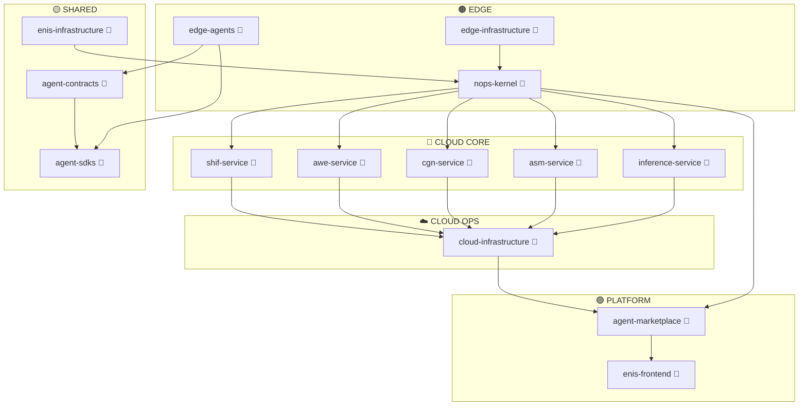

<!-- START doctoc generated TOC please keep comment here to allow auto update -->
<!-- DON'T EDIT THIS SECTION, INSTEAD RE-RUN doctoc TO UPDATE -->
Índice

- [📊 ENIS - ANÁLISIS COMPLETO DE ARQUITECTURA](#-enis---an%C3%81lisis-completo-de-arquitectura)
  - [🎯 **PROPÓSITO DE ESTA CARPETA**](#-prop%C3%93sito-de-esta-carpeta)
  - [📁 **CONTENIDO DE LA CARPETA**](#-contenido-de-la-carpeta)
    - [**📋 Archivos Principales**](#-archivos-principales)
  - [🏗️ **RESUMEN EJECUTIVO**](#-resumen-ejecutivo)
    - [**📦 ARQUITECTURA ENIS v3.0 - 15 REPOSITORIOS**](#-arquitectura-enis-v30---15-repositorios)
    - [**📋 RESUMEN:**](#-resumen)
    - [**Clasificación de 29 Prompts Master:**](#clasificaci%C3%B3n-de-29-prompts-master)
  - [🚀 **CÓMO USAR ESTOS DOCUMENTOS**](#-c%C3%93mo-usar-estos-documentos)
    - [**1. Para Arquitectos**](#1-para-arquitectos)
    - [**2. Para Desarrolladores**](#2-para-desarrolladores)
    - [**3. Para DevOps/Infraestructura**](#3-para-devopsinfraestructura)
    - [**4. Para Product Managers**](#4-para-product-managers)
    - [**5. Para Desarrolladores de Edge Agents**](#5-para-desarrolladores-de-edge-agents)
  - [📊 **MÉTRICAS CLAVE**](#-m%C3%89tricas-clave)
    - [**Técnicas**](#t%C3%A9cnicas)
    - [**Negocio**](#negocio)
  - [🔗 **DEPENDENCIAS PRINCIPALES**](#-dependencias-principales)
  - [🎯 **PRÓXIMOS PASOS RECOMENDADOS**](#-pr%C3%93ximos-pasos-recomendados)
    - [**🟤 EDGE - Inmediato (Semana 1-2)**](#-edge---inmediato-semana-1-2)
    - [**🟡 SHARED - Corto Plazo (Semana 3-4)**](#-shared---corto-plazo-semana-3-4)
    - [**🟤 EDGE - Mediano Plazo (Mes 1-2)**](#-edge---mediano-plazo-mes-1-2)
    - [**🔵 CLOUD CORE - Mediano Plazo (Mes 2-4)**](#-cloud-core---mediano-plazo-mes-2-4)
    - [**☁️ CLOUD OPS - Mediano Plazo (Mes 3-5)**](#-cloud-ops---mediano-plazo-mes-3-5)
    - [**🟢 PLATFORM - Largo Plazo (Mes 4-6)**](#-platform---largo-plazo-mes-4-6)
  - [📚 **REFERENCIAS**](#-referencias)
  - [🤝 **CONTRIBUCIONES**](#-contribuciones)
  - [📞 **CONTACTO**](#-contacto)

<!-- END doctoc generated TOC please keep comment here to allow auto update -->

# 📊 ENIS - ANÁLISIS COMPLETO DE ARQUITECTURA

## 🎯 **PROPÓSITO DE ESTA CARPETA**

Esta carpeta contiene el análisis completo de la arquitectura ENIS (Enterprise Neural Intelligence Systems) v3.0, incluyendo la clasificación de todos los prompts master y la recomendación de estructura de repositorios.

---

## 📁 **CONTENIDO DE LA CARPETA**

### **📋 Archivos Principales**

| Archivo | Descripción | Propósito |
|---------|-------------|-----------|
| `ENIS_COMPLETE_ARCHITECTURE_REPORT.md` | **Informe principal** con visión completa de ENIS | Análisis arquitectónico completo |
| `PROMPT_TO_REPOSITORY_MAPPING.md` | **Mapeo detallado** de prompts a repositorios | Clasificación de 29 prompts master |
| `REPOSITORY_STRUCTURE_RECOMMENDATIONS.md` | **Estructura recomendada** de repositorios | Guía de implementación |
| `EDGE_AGENTS_DESIGN_SPECIFICATION.md` | **Especificación de diseño** de Edge Agents | Guía técnica de implementación |
| `IMPLEMENTATION_STATUS_REAL.md` | **Estado real de implementación** | Verificación actual del código |
| `ACLARACION_ESTADOS.md` | ⚠️ **Corrección de inconsistencias** | Aclaración sobre estados contradictorios |
| `README.md` | **Este archivo** | Guía de navegación |

---

## 🏗️ **RESUMEN EJECUTIVO**

### **📦 ARQUITECTURA ENIS v3.0 - 15 REPOSITORIOS**

#### **🟤 EDGE (3 repos)**

1. **nops-kernel** 🚧 **EN DESARROLLO**
   - Núcleo de orquestación en Edge
   - Policy engine, compliance básico, RBAC
   - Event bus (Redis Streams)
   - Federation

2. **edge-agents** 🔨 **PENDIENTE**
   - Implementaciones de los 5 agentes: Zero, Shared, Lite, Enterprise, Air-Gapped
   - Código común compartido (auth, tracing, data policy)

3. **edge-infrastructure** 🔨 **PENDIENTE**
   - Conectores y servicios edge: eventbus, datasources, marketplace-connector
   - Opcional: eventbridge-service

#### **🔵 CLOUD CORE (5 repos)**

4. **inference-service** 🔨 **PENDIENTE**
   - Motor de inferencia IA (batch, realtime, streaming)
   - Incluye sandbox para pruebas controladas

5. **asm-service** 🔨 **PENDIENTE**
   - Adaptive State Management: estado distribuido, sincronización, conflict resolution, feature views

6. **cgn-service** 🔨 **PENDIENTE**
   - Causal Graph Networks: grafo de conocimiento, reasoning, GraphQL API

7. **awe-service** 🔨 **PENDIENTE**
   - Autonomous Workflow Engine: orquestación de workflows, retries, compensaciones, coordinación de servicios

8. **shif-service** 🔨 **PENDIENTE**
   - System Hybrid Integration Fabric: conectores/adapters SaaS/DB, transformaciones, normalización

#### **☁️ CLOUD OPS (1 repo)**

9. **cloud-infrastructure** 🔨 **PENDIENTE**
   - Infraestructura y servicios cloud avanzados
   - Incluye:
     - cloudbus-service (opcional)
     - observability-cloud
     - scorecard-module
     - billing-module
     - compliance-module avanzado

#### **🟢 PLATFORM (2 repos)**

10. **agent-marketplace** 🔨 **PENDIENTE**
    - Marketplace de agentes (catálogo, publishing, ratings)
    - Private registry integrado
    - Billing (Stripe) + Scorecard (analytics básica)

11. **enis-frontend** 🔨 **PENDIENTE**
    - Monorepo UI: dashboard, devportal, studio app
    - Compartir design system y utilidades

#### **🟡 SHARED (3 repos)**

12. **agent-contracts** 🔨 **PENDIENTE**
    - Source of truth de contratos: OpenAPI, JSON Schema, Proto
    - Control de breaking changes y publicación de artefactos

13. **agent-sdks** 🔨 **PENDIENTE**
    - SDKs multi-lenguaje (Python, JS, Go)
    - Generados desde contracts; helpers comunes (registro, HB, métricas, rotación de keys)

14. **enis-infrastructure** 🔨 **PENDIENTE**
    - Infra unificada (Terraform, Docker Compose, Helm)
    - Workflows CI/CD reutilizables (cosign, SBOM, SAST, CVE policy)

#### **📑 DOCS (1 repo)**

15. **enis-docs** ✅ **YA EN USO**
    - Documentación técnica y de negocio
    - ADRs, runbooks, guías de seguridad y compliance

### **📋 RESUMEN:**
- **Total:** 15 repositorios
- **Completados:** enis-docs (1 repo)
- **En desarrollo:** nops-kernel (1 repo)
- **Pendientes:** 13 repos (edge, cloud core, platform, infra, contracts/sdks)
- **Opcionales:** eventbridge-service y cloudbus-service (solo si umbrales de escala lo exigen)

### **Clasificación de 29 Prompts Master:**
- **nops-kernel**: 8 prompts (27.6%)
- **enis-infrastructure**: 7 prompts (24.1%)
- **enis-docs**: 6 prompts (20.7%)
- **enis-frontend**: 3 prompts (10.3%)
- **Otros servicios**: 1 prompt cada uno (3.4%)

---

## 🚀 **CÓMO USAR ESTOS DOCUMENTOS**

### **1. Para Arquitectos**
- Leer `ENIS_COMPLETE_ARCHITECTURE_REPORT.md`
- Entender la visión completa del sistema
- Revisar dependencias entre componentes

### **2. Para Desarrolladores**
- Leer `PROMPT_TO_REPOSITORY_MAPPING.md`
- Identificar qué prompts usar para cada repositorio
- Entender las responsabilidades de cada servicio

### **3. Para DevOps/Infraestructura**
- Leer `REPOSITORY_STRUCTURE_RECOMMENDATIONS.md`
- Implementar la estructura recomendada
- Configurar CI/CD para cada repositorio

### **4. Para Product Managers**
- Leer `ENIS_COMPLETE_ARCHITECTURE_REPORT.md`
- Entender el roadmap de implementación
- Revisar métricas de éxito

### **5. Para Desarrolladores de Edge Agents**
- Leer `EDGE_AGENTS_DESIGN_SPECIFICATION.md`
- Implementar Edge Agents según arquitectura ENIS v3.0
- Seguir especificaciones de seguridad y comunicación

---

## 📊 **MÉTRICAS CLAVE**

### **Técnicas**
- **Repositorios Totales**: 15 (arquitectura completa ENIS v3.0)
- **Repositorios Completados**: 1 (enis-docs)
- **Repositorios En Desarrollo**: 1 (nops-kernel ~80% completo)
- **Repositorios Pendientes**: 13 (87% del ecosistema)
- **Clientes Implementados en Kernel**: 17 (preparados para servicios cloud)
- **Policy Engine**: ✅ Implementado (ABAC, egress control, airgapped mode)
- **Compliance Básico**: ✅ Implementado (audit logging, RBAC)
- **Prompts Master**: 29 clasificados
- **Tests**: 12 fallando (esperado - servicios externos no disponibles)
- **Cobertura de Código**: ~80% (kernel en desarrollo)
- **Documentación**: 6 archivos de análisis técnico (1 eliminado por estados contradictorios)

### **Negocio**
- **ROI promedio**: 340%
- **Retención**: 95%
- **NRR**: 120%
- **Tiempo de setup**: < 2 minutos

---

## 🔗 **DEPENDENCIAS PRINCIPALES**

---

## 🎯 **PRÓXIMOS PASOS RECOMENDADOS**

### **🟤 EDGE - Inmediato (Semana 1-2)**
1. 🚧 **COMPLETAR nops-kernel** - Finalizar 20% restante (tests, documentación, deployment)

### **🟡 SHARED - Corto Plazo (Semana 3-4)**
1. 🔨 **agent-contracts** - Definir contratos OpenAPI/JSON Schema/Proto
2. 🔨 **agent-sdks** - SDKs multi-lenguaje (Python, JS, Go)
3. 🔨 **enis-infrastructure** - IaC base (Terraform, Docker Compose, Helm)

### **🟤 EDGE - Mediano Plazo (Mes 1-2)**
1. 🔨 **edge-agents** - Implementar 5 agentes (Zero, Shared, Lite, Enterprise, Air-Gapped)
2. 🔨 **edge-infrastructure** - Conectores edge (eventbus, datasources, marketplace-connector)

### **🔵 CLOUD CORE - Mediano Plazo (Mes 2-4)**
1. 🔨 **inference-service** - Motor de inferencia IA + sandbox
2. 🔨 **asm-service** - Adaptive State Management
3. 🔨 **cgn-service** - Causal Graph Networks
4. 🔨 **awe-service** - Autonomous Workflow Engine
5. 🔨 **shif-service** - System Hybrid Integration Fabric

### **☁️ CLOUD OPS - Mediano Plazo (Mes 3-5)**
1. 🔨 **cloud-infrastructure** - Observability, Scorecard, Billing, Compliance avanzado

### **🟢 PLATFORM - Largo Plazo (Mes 4-6)**
1. 🔨 **agent-marketplace** - Marketplace + Private Registry + Billing
2. 🔨 **enis-frontend** - Monorepo UI (dashboard, devportal, studio app)

---

## 📚 **REFERENCIAS**

- [DNA v3.0 Master Prompt](../00-dna-master-prompt-bundle-v3.0-4001/)
- [NOPS Kernel Documentation](../07-nops-master-prompt-bundle-v3.0-4001/)
- [Architecture Decisions](../../03-architecture-decisions/)
- [Security Deployment](../../06-security/)
- [Edge Agents Design Specification](./EDGE_AGENTS_DESIGN_SPECIFICATION.md)

---

## 🤝 **CONTRIBUCIONES**

Para contribuir a este análisis:

1. **Revisar** la clasificación de prompts
2. **Validar** la estructura de repositorios
3. **Sugerir** mejoras en la organización
4. **Actualizar** métricas y dependencias

---

## 📞 **CONTACTO**

Para preguntas sobre este análisis:
- **Autor**: AI Assistant
- **Fecha**: 30 de enero de 2025
- **Versión**: ENIS v3.0

---

*Análisis generado automáticamente basado en 29 prompts master de ENIS v3.0*
