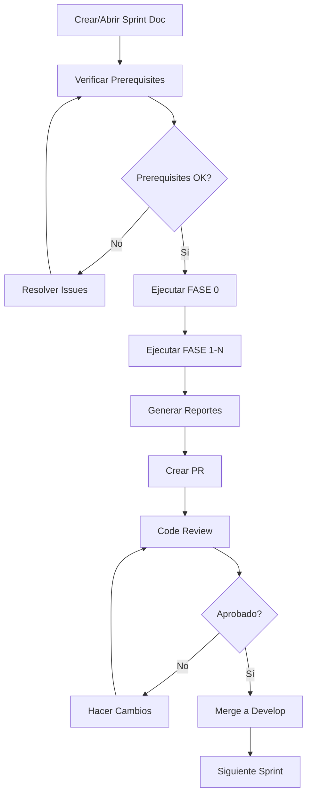

# 📁 Sprints - Agent Contracts

> **Documentación de sprints ejecutables para ENIS v3.0 Agent Contracts**

---

## 🎯 Propósito

Este directorio contiene la documentación detallada de cada sprint del proyecto Agent Contracts. Cada sprint está diseñado para ser ejecutable por Claude Code CLI de manera autónoma con **robustez y confiabilidad de nivel producción con PowerShell parity completa y test suites integradas**.

---

## 📂 Estructura del Directorio

```
01-sprint/
├── README.md                           # Este archivo (índice general)
├── SPRINT_TEMPLATE_CLAUDE_CLI.md       # 📋 Plantilla v2.1 Production Ready
├── COMO_USAR_TEMPLATE.md               # 📘 Guía de uso de la plantilla v2.1
├── roadmaps/                           # Roadmaps y planificación
│   ├── agent_contracts_roadmap_2025_2026_detallado.md
│   └── agent-contracts-roadmap-visual.html
├── S0/                                 # Sprint 0 - Kickoff & Bootstrap
│   └── S0 — Kickoff & Repo Bootstrap.md
├── S1/                                 # Sprint 1 - Contracts First
│   └── [Por crear]
├── S2/                                 # Sprint 2 - Validation & Baselines
│   └── [Por crear]
└── S[N]/                               # Sprints futuros
    └── [Por crear]
```

---

## 🚀 Quick Start

### Para Ejecutar un Sprint Existente

```bash
# 1. Abrir el documento del sprint
cd docs/01-sprint/S[N]/

# 2. Leer el documento
cat S[N]-nombre-del-sprint.md

# 3. Ejecutar con Claude Code CLI
# "Claude, ejecuta el Sprint S[N] siguiendo el documento 
#  docs/01-sprint/S[N]/S[N]-nombre-del-sprint.md"
```

### Para Crear un Nuevo Sprint

```bash
# 1. Copiar la plantilla
cp docs/01-sprint/SPRINT_TEMPLATE_CLAUDE_CLI.md \
   docs/01-sprint/S[N]/S[N]-nombre-del-sprint.md

# 2. Personalizar el documento (ver guía)
# Leer: docs/01-sprint/COMO_USAR_TEMPLATE.md

# 3. Ejecutar el sprint
# "Claude, ejecuta el nuevo sprint S[N]"
```

---

## 📋 Lista de Sprints

### Sprint S0 — Kickoff & Repo Bootstrap ✅ **EN EJECUCIÓN**

**Status:** ⏸️ Pendiente  
**Branch:** `feature/s0-kickoff-bootstrap`  
**Duración:** 1-2 semanas  
**Kickoff:** 2025-10-14  
**Owner:** Contract Architect + Platform Engineer

**Objetivo:**  
Repo production-ready con CI/CD completo y estructura lista para contratos (OpenAPI, JSON Schema, Protobuf) y SDK generation hooks.

**Entregables:**
- ✅ Estructura de monorepo completa
- ✅ 6 workflows de GitHub Actions
- ✅ Pre-commit hooks configurados
- ✅ Docker setup (dev + mocks)
- ✅ Scripts de automatización
- ✅ Documentación base

**Documento:** [`S0/S0 — Kickoff & Repo Bootstrap.md`](./S0/S0%20—%20Kickoff%20&%20Repo%20Bootstrap.md)

---

### Sprint S1 — Contracts First ⏸️ **PLANIFICADO**

**Status:** ⏸️ Pendiente  
**Branch:** `feature/s1-contracts-first`  
**Duración:** 2-3 semanas  
**Depends on:** S0  
**Owner:** Contract Architect + 2 SDK Engineers

**Objetivo:**  
Contratos HTTP y streaming completos; esquemas JSON y protos validados en CI con baseline firmado.

**Entregables:**
- [ ] 4 OpenAPI specs (inference, agents, events, nops)
- [ ] 8+ JSON Schemas
- [ ] 4 Protobuf definitions
- [ ] Baseline firmado
- [ ] Breaking change detection

**Documento:** [`S1/`](./S1/) - _Por crear usando plantilla_

---

### Sprint S2 — Validation & Baselines ⏸️ **PLANIFICADO**

**Status:** ⏸️ Pendiente  
**Branch:** `feature/s2-validation-baselines`  
**Duración:** 2 semanas  
**Depends on:** S1  
**Owner:** Platform Engineer + QA Lead

**Objetivo:**  
Sistema robusto de validación automática con baselines firmados y drift detection.

**Entregables:**
- [ ] Baseline automation completa
- [ ] Performance benchmarks
- [ ] Drift detection en runtime
- [ ] Runbooks de rollback

**Documento:** [`S2/`](./S2/) - _Por crear usando plantilla_

---

### Sprint S3 — SDK Alpha ⏸️ **PLANIFICADO**

**Status:** ⏸️ Pendiente  
**Branch:** `feature/s3-sdk-alpha`  
**Duración:** 2-3 semanas  
**Depends on:** S2  
**Owner:** SDK Lead + 2 Engineers

**Objetivo:**  
SDKs alpha para Python y TypeScript con code generation automático.

**Entregables:**
- [ ] Python SDK (pip package)
- [ ] TypeScript SDK (npm package)
- [ ] Generation scripts
- [ ] Smoke tests
- [ ] Benchmark results

**Documento:** [`S3/`](./S3/) - _Por crear usando plantilla_

---

### Sprints S4-S19

Ver roadmap detallado: [`roadmaps/agent_contracts_roadmap_2025_2026_detallado.md`](./roadmaps/agent_contracts_roadmap_2025_2026_detallado.md)

**Próximos sprints:**
- **S4** - Governance & RACI
- **S5** - Observability
- **S6** - Security Hardening
- **S7** - Contract Testing (Pact)
- **S8** - Mock Services
- **S9** - Troubleshooting
- **S10** - CLI & Audit
- ... [continúa en roadmap]

---

## 🎨 Convenciones y Estándares

### Naming Convention

**Archivos de sprint:**
```
S[N] — [Sprint Name].md
```

**Ejemplos:**
- `S0 — Kickoff & Repo Bootstrap.md`
- `S1 — Contracts First.md`
- `S7 — Contract Testing (Pact).md`

**Branches:**
```
feature/s[n]-[kebab-case-name]
```

**Ejemplos:**
- `feature/s0-kickoff-bootstrap`
- `feature/s1-contracts-first`
- `feature/s7-pact-testing`

### Status Indicators

| Emoji | Status | Descripción |
|-------|--------|-------------|
| ⏸️ | PENDIENTE | No iniciado |
| 🚀 | EN PROGRESO | Actualmente ejecutándose |
| ✅ | COMPLETADO | Merged a develop |
| ⚠️ | BLOQUEADO | Esperando dependencias |
| ❌ | CANCELADO | No se ejecutará |

### Document Structure

Todos los sprints deben seguir esta estructura mínima (v2.1):

1. **Header** con metadata y status
2. **Error Handling Best Practices** - Scripts robustos
3. **AI Agent Configuration** - Configuración estructurada
4. **Meta** - Objetivo del sprint con SLOs
5. **Prerequisites** - Validación automática de versiones
6. **Entregables** - Lista clara con criterios
7. **Definition of Done** - Cuantificable y verificable
8. **QA Interno** - Auto-análisis y patches
9. **ADRs** - Architecture Decision Records
10. **AI Execution Plan** - Fases con timeouts y idempotencia
11. **Referencias** - Links a docs relacionados

---

## 🤖 Uso con Claude Code CLI

### Comandos Básicos

**Ejecutar sprint completo:**
```
Claude, ejecuta el Sprint S[N] completo siguiendo el documento 
docs/01-sprint/S[N]/S[N]-nombre-del-sprint.md paso por paso.
```

**Ejecutar solo una fase:**
```
Claude, ejecuta solo la FASE 3 del Sprint S[N].
```

**Verificar prerequisitos:**
```
Claude, verifica que se cumplen todos los prerequisitos del Sprint S[N].
```

**Generar reporte:**
```
Claude, genera el reporte de completitud del Sprint S[N].
```

### Workflow Recomendado



---

## 📊 Métricas y Tracking

### Dashboard de Sprints

| Sprint | Status | Progress | Start Date | End Date | Owner |
|--------|--------|----------|------------|----------|-------|
| S0 | 🚀 EN PROGRESO | 75% | 2025-10-14 | 2025-10-28 | Contract Architect |
| S1 | ⏸️ PENDIENTE | 0% | 2025-10-28 | 2025-11-15 | Contract Architect |
| S2 | ⏸️ PENDIENTE | 0% | 2025-11-15 | 2025-11-29 | Platform Engineer |
| S3 | ⏸️ PENDIENTE | 0% | 2025-11-29 | 2025-12-20 | SDK Lead |

_Actualizado: 2025-10-13_

### Burn-down Chart

Ver roadmap visual: [`roadmaps/agent-contracts-roadmap-visual.html`](./roadmaps/agent-contracts-roadmap-visual.html)

---

## 📚 Recursos

### Documentación

- **Plantilla de Sprint:** [`SPRINT_TEMPLATE_CLAUDE_CLI.md`](./SPRINT_TEMPLATE_CLAUDE_CLI.md)
- **Guía de Uso:** [`COMO_USAR_TEMPLATE.md`](./COMO_USAR_TEMPLATE.md)
- **Roadmap Detallado:** [`roadmaps/agent_contracts_roadmap_2025_2026_detallado.md`](./roadmaps/agent_contracts_roadmap_2025_2026_detallado.md)

### Referencias Técnicas

- **ENIS Architecture:** [`../00-enis-complete/ENIS_COMPLETE_ARCHITECTURE_REPORT.md`](../00-enis-complete/ENIS_COMPLETE_ARCHITECTURE_REPORT.md)
- **DNA v3.0 Spec:** [`../00-enis-complete/DNA_V3_SPECIFICATION.md`](../00-enis-complete/DNA_V3_SPECIFICATION.md)
- **Master Prompts:** [`../00-enis-complete/05-repositorios-enis/shared/agent-contracts/`](../00-enis-complete/05-repositorios-enis/shared/agent-contracts/)

### Herramientas

- [Spectral](https://stoplight.io/open-source/spectral) - OpenAPI linting
- [AJV](https://ajv.js.org/) - JSON Schema validation
- [Buf](https://buf.build/) - Protobuf tooling
- [oasdiff](https://github.com/Tufin/oasdiff) - Breaking change detection
- [Pact](https://docs.pact.io/) - Contract testing

---

## 🔄 Proceso de Sprint

### 1. Planificación (Pre-Sprint)

- [ ] Crear documento de sprint usando plantilla
- [ ] Definir entregables claros
- [ ] Identificar dependencias
- [ ] Asignar owners y reviewers
- [ ] Calendarizar kickoff meeting

### 2. Ejecución (Durante Sprint)

- [ ] Ejecutar FASE 0 (Pre-flight checks)
- [ ] Ejecutar fases secuencialmente
- [ ] Actualizar tracking file
- [ ] Documentar issues
- [ ] Validar continuamente

### 3. Cierre (Post-Sprint)

- [ ] Generar reportes completos
- [ ] Verificar Definition of Done
- [ ] Crear Pull Request
- [ ] Code review
- [ ] Merge a develop
- [ ] Sprint retrospective

### 4. Retrospective

Después de cada sprint, documentar:
- ✅ Qué salió bien
- ❌ Qué salió mal
- 💡 Mejoras para siguiente sprint
- 📊 Métricas de velocity

---

## 🤝 Contribuir

### Crear un Nuevo Sprint

1. **Revisar el roadmap** para ver qué sprint sigue
2. **Copiar la plantilla** a nuevo directorio S[N]
3. **Personalizar** según la guía
4. **Validar** que todos los comandos son ejecutables
5. **Solicitar review** del Platform Engineering Team
6. **Mergear** a develop cuando esté aprobado

### Mejorar un Sprint Existente

1. **Crear issue** describiendo la mejora
2. **Crear branch** desde el sprint branch
3. **Hacer cambios** manteniendo ejecutabilidad
4. **Testear** con Claude Code CLI
5. **Crear PR** con cambios

### Reportar Problemas

Si encuentras issues en la ejecución de un sprint:

1. **Documentar** el error exacto
2. **Crear issue** con label `sprint-execution`
3. **Incluir**:
   - Sprint y fase donde ocurrió
   - Comando que falló
   - Mensaje de error
   - Entorno (OS, versiones de herramientas)

---

## ❓ FAQ

### ¿Por qué usar esta estructura?

Esta estructura permite que Claude Code CLI ejecute sprints completos de manera autónoma, reduciendo significativamente el tiempo de desarrollo y asegurando consistencia.

### ¿Cuánto tiempo toma crear un nuevo sprint?

- Sprint simple: 1-2 horas
- Sprint complejo: 3-4 horas
- Incluye personalización completa y validación

### ¿Se pueden ejecutar sprints en paralelo?

Solo si no tienen dependencias entre sí. Consultar el roadmap para ver dependencias.

### ¿Qué hacer si un sprint falla?

1. Revisar los logs de ejecución
2. Identificar en qué fase falló
3. Verificar prerequisitos
4. Consultar la sección de troubleshooting
5. Crear issue si es necesario

---

## 📞 Contacto y Soporte

### Owners

- **Platform Engineering Team**: Mantiene plantillas y proceso
- **Contract Architect**: Revisa sprints de contratos
- **QA Lead**: Revisa sprints de testing

### Canales

- **Slack**: #contracts-rfcs
- **Email**: platform-engineering@andaon.com
- **Meetings**: Jueves 10:00 AM (Sprint Planning)

---

## 📈 Roadmap de Mejora

### Q4 2025
- [ ] Automatizar generación de reportes
- [ ] Dashboard interactivo de sprints
- [ ] Métricas de velocity por sprint
- [ ] Template para sprints de bugfix

### Q1 2026
- [ ] Integración con Jira/Linear
- [ ] Notificaciones automáticas en Slack
- [ ] ML para estimar duración de sprints

---

**Última actualización:** 2025-10-13  
**Versión del directorio:** 2.2 Complete  
**Sprints totales:** 19 (S0-S19)  
**Sprints completados:** 0  
**Sprints en progreso:** 1 (S0)  
**Template Score:** 100/100 (Complete)  
**License:** Proprietary - ANDAON SA DE CV


