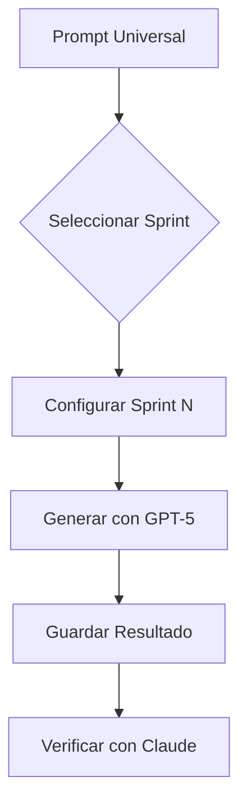

# 🎯 Generadores de Sprints para Agent-Contracts v3.0

> **Prompts universales para generar sprints de alta calidad**

---

## 📁 Archivos Disponibles

| Archivo | Propósito |
|---------|-----------|
| `PROMPT_GENERATOR_ALL_SPRINTS.md` | Prompt universal para generar cualquier sprint (S1-S19) |

---

## 🔄 Flujo de Trabajo



---

## 📖 Guía de Uso

### 1️⃣ **Preparación**

1. Abrir el prompt universal:
```bash
code PROMPT_GENERATOR_ALL_SPRINTS.md
```

2. Identificar el sprint a generar (S1-S19):
- S12: Monitoring & Analytics
- S13: Enterprise Integration
- S14: Compliance & Audit
- S15: Internationalization
- S16: Versioning
- S17: Scalability
- S18: Multi-Region
- S19: Marketplace

### 2️⃣ **Configuración**

Actualizar la sección de configuración:

```markdown
## 🎯 SPRINT A GENERAR

**Número**: S[12-19]
**Nombre**: [Nombre del sprint]
**Meta**: [Meta del roadmap]
```

### 3️⃣ **Generación**

1. Copiar el prompt completo
2. Pegar en ChatGPT-5
3. Esperar la generación (5-10 min)
4. Revisar el resultado

### 4️⃣ **Guardado**

Guardar en la ubicación correcta:

```bash
# Crear directorio
mkdir -p ../../01-sprint/S[N]

# Guardar archivo
code ../../01-sprint/S[N]/S[N]_[nombre].md
```

---

## 📋 Ejemplos de Uso

### Sprint 12 - Monitoring & Analytics

```markdown
## 🎯 SPRINT A GENERAR

**Número**: S12
**Nombre**: Monitoring & Analytics (Metrics + Dashboards + Alerts)
**Meta**: Implementar un sistema completo de monitoreo y análisis

### Entregables Principales
1. Metrics Collection System (YAML + Kotlin)
2. Analytics Dashboard (YAML + TypeScript)
3. Alerting System (YAML + Python)
4. Analytics Engine (Python)
5. Documentation & Training
```

### Sprint 13 - Enterprise Integration

```markdown
## 🎯 SPRINT A GENERAR

**Número**: S13
**Nombre**: Enterprise Integration (SSO + LDAP + Active Directory)
**Meta**: Integrar con sistemas empresariales de autenticación

### Entregables Principales
1. SSO Integration (YAML + Kotlin)
2. LDAP Integration (YAML + Java)
3. Active Directory Integration (YAML + C#)
4. Integration Testing (Python)
5. Documentation & Training
```

### Sprint 14 - Compliance & Audit

```markdown
## 🎯 SPRINT A GENERAR

**Número**: S14
**Nombre**: Compliance & Audit (SOC2 + GDPR + ISO27001)
**Meta**: Implementar framework de cumplimiento y auditoría

### Entregables Principales
1. Compliance Framework (YAML)
2. Audit System (Kotlin)
3. Evidence Collection (TypeScript)
4. Report Generation (Python + Jinja2)
5. Documentation & Training
```

---

## 🔍 Verificación de Calidad

El prompt asegura:

1. **Estructura Completa**
   - 14+ secciones obligatorias
   - Metadata completa
   - ADRs documentados

2. **Código Ejecutable**
   - Scripts con error handling
   - Tests automatizados
   - CI/CD ready

3. **Documentación**
   - Guías de usuario
   - Ejemplos prácticos
   - Troubleshooting

4. **Seguridad**
   - Validación de inputs
   - Manejo de secretos
   - Logging seguro

---

## 📊 Métricas de Éxito

| Métrica | Target |
|---------|--------|
| Tiempo de generación | < 10 min |
| Tasa de aprobación | > 90% |
| Cobertura de código | > 80% |
| Documentación | > 95% |

---

## 🚀 Próximos Pasos

1. Generar sprints pendientes (S12-S19)
2. Documentar mejores prácticas
3. Automatizar proceso de generación
4. Crear biblioteca de ejemplos

---

## 📞 Soporte

**Para issues o mejoras:**
- Slack: #agent-contracts-dev
- Repo: agent-contracts
- Owner: Platform Engineering Team

---

**Versión:** 2.0  
**Fecha:** 2025-01-27  
**Mantenedor:** Platform Engineering  
**License:** Proprietary - ANDAON SA DE CV
