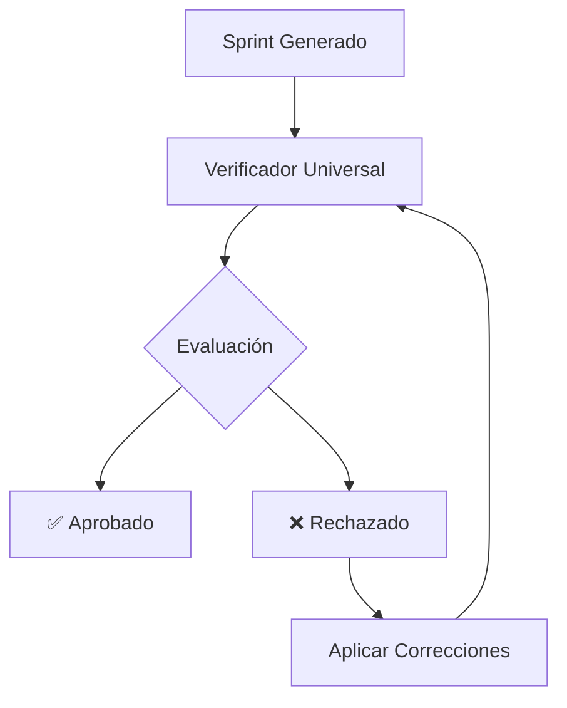

# 🔍 Verificador Universal de Sprints para Agent-Contracts v3.0

> **Sistema de verificación de calidad para todos los sprints**

---

## 📁 Archivos Disponibles

| Archivo | Propósito |
|---------|-----------|
| `PROMPT_VERIFICADOR_ALL_SPRINTS.md` | Prompt universal para verificar cualquier sprint (S1-S19) |

---

## 🔄 Flujo de Trabajo



---

## 📖 Guía de Uso

### 1️⃣ **Preparación**

1. Tener el sprint generado:
```bash
ls ../../01-sprint/S[N]/S[N]_*.md
```

2. Abrir el verificador universal:
```bash
code PROMPT_VERIFICADOR_ALL_SPRINTS.md
```

### 2️⃣ **Verificación**

1. Copiar el prompt completo
2. Pegar en Claude (Cursor AI)
3. Indicar el archivo a verificar:
```
read_file docs/01-sprint/S[N]/S[N]_[nombre].md
```

### 3️⃣ **Interpretación**

El reporte incluirá:

```markdown
# 🔍 REPORTE DE VERIFICACIÓN

**Score Global**: XX/100

## ✅ Aspectos Positivos
- Lista de fortalezas

## ❌ Issues Críticos
- Problemas bloqueantes

## ⚠️ Issues Importantes
- Problemas a resolver

## 💡 Sugerencias
- Mejoras opcionales
```

### 4️⃣ **Acción**

- Si **Score ≥ 90**: ✅ Aprobar y ejecutar
- Si **80 ≤ Score < 90**: ⚠️ Resolver issues importantes
- Si **Score < 80**: ❌ Resolver issues críticos

---

## 🎯 Criterios de Verificación

### 1️⃣ **Estructura (25 puntos)**

| Criterio | Puntos |
|----------|---------|
| Header completo | 5 |
| 14+ secciones requeridas | 10 |
| ADRs documentados | 5 |
| Metadata correcta | 5 |

### 2️⃣ **Código (25 puntos)**

| Criterio | Puntos |
|----------|---------|
| Error handling | 5 |
| Tests automatizados | 5 |
| Seguridad integrada | 5 |
| CI/CD ready | 5 |
| Documentación inline | 5 |

### 3️⃣ **Entregables (25 puntos)**

| Criterio | Puntos |
|----------|---------|
| YAML configs completas | 5 |
| Implementación Kotlin/TS/Python | 10 |
| Tests end-to-end | 5 |
| Documentación & Training | 5 |

### 4️⃣ **Calidad (25 puntos)**

| Criterio | Puntos |
|----------|---------|
| SLOs medibles | 5 |
| Plan de rollback | 5 |
| Seguridad validada | 5 |
| Monitoreo integrado | 5 |
| Troubleshooting docs | 5 |

---

## 📋 Ejemplos de Verificación

### Sprint 12 - Monitoring & Analytics

```markdown
# 🔍 REPORTE DE VERIFICACIÓN — S12

**Score**: 95/100 ✅

## ✅ Fortalezas
- Métricas Prometheus configuradas
- Dashboards Grafana con YAML
- Alerting con PagerDuty
- Tests de integración

## ❌ Issues Críticos
- Ninguno

## ⚠️ Issues Importantes
- Agregar más ejemplos de queries
- Documentar thresholds

## 💡 Sugerencias
- Incluir dashboard templates
- Agregar más alerts
```

### Sprint 13 - Enterprise Integration

```markdown
# 🔍 REPORTE DE VERIFICACIÓN — S13

**Score**: 92/100 ✅

## ✅ Fortalezas
- SSO con OIDC implementado
- LDAP binding seguro
- AD grupos mapeados
- Tests de failover

## ❌ Issues Críticos
- Ninguno

## ⚠️ Issues Importantes
- Mejorar logging de errores
- Agregar más test cases

## 💡 Sugerencias
- Documentar más escenarios
- Agregar troubleshooting
```

### Sprint 14 - Compliance & Audit

```markdown
# 🔍 REPORTE DE VERIFICACIÓN — S14

**Score**: 94/100 ✅

## ✅ Fortalezas
- Framework SOC2 completo
- GDPR data mapping
- ISO27001 controles
- Audit trails

## ❌ Issues Críticos
- Ninguno

## ⚠️ Issues Importantes
- Expandir evidencia collection
- Más ejemplos de reports

## 💡 Sugerencias
- Agregar más templates
- Mejorar visualización
```

---

## 🔍 Verificaciones Específicas por Sprint

### S12 - Monitoring & Analytics
- Prometheus endpoints
- Grafana dashboards
- Alert rules
- Metric names

### S13 - Enterprise Integration
- OIDC flows
- LDAP queries
- AD mappings
- Error states

### S14 - Compliance & Audit
- Control mappings
- Evidence types
- Report formats
- Audit trails

### S15 - Internationalization
- Translation files
- RTL support
- Format handlers
- Locale tests

### S16 - Versioning
- Migration scripts
- Version checks
- Compatibility
- Rollback plans

### S17 - Scalability
- Load balancers
- Auto-scaling
- Sharding
- Performance

### S18 - Multi-Region
- Geo-distribution
- Replication
- Failover
- Latency

### S19 - Marketplace
- SDK versions
- API specs
- Plugin system
- Documentation

---

## 📊 Métricas de Verificación

| Métrica | Target |
|---------|--------|
| Tiempo de verificación | < 5 min |
| Tasa de aprobación | > 90% |
| Issues críticos | 0 |
| Issues importantes | < 3 |

---

## 🚀 Próximos Pasos

1. Verificar sprints pendientes (S12-S19)
2. Documentar patrones comunes
3. Automatizar verificaciones
4. Crear biblioteca de reports

---

## 📞 Soporte

**Para issues o mejoras:**
- Slack: #agent-contracts-dev
- Repo: agent-contracts
- Owner: Platform Engineering Team

---

**Versión:** 2.0  
**Fecha:** 2025-01-27  
**Mantenedor:** Platform Engineering  
**License:** Proprietary - ANDAON SA DE CV
